cola Report for Consensus Partitioning
==================

**Date**: 2019-12-07 08:22:40 CET, **cola version**: 1.3.2

----------------------------------------------------------------

<style type='text/css'>

body, td, th {
   font-family: Arial,Helvetica,sans-serif;
   background-color: white;
   font-size: 13px;
  max-width: 800px;
  margin: auto;
  margin-left:210px;
  padding: 0px 10px 0px 10px;
  border-left: 1px solid #EEEEEE;
  line-height: 150%;
}

tt, code, pre {
   font-family: 'DejaVu Sans Mono', 'Droid Sans Mono', 'Lucida Console', Consolas, Monaco, 

monospace;
}

h1 {
   font-size:2.2em;
}

h2 {
   font-size:1.8em;
}

h3 {
   font-size:1.4em;
}

h4 {
   font-size:1.0em;
}

h5 {
   font-size:0.9em;
}

h6 {
   font-size:0.8em;
}

a {
  text-decoration: none;
  color: #0366d6;
}

a:hover {
  text-decoration: underline;
}

a:visited {
   color: #0366d6;
}

pre, img {
  max-width: 100%;
}
pre {
  overflow-x: auto;
}
pre code {
   display: block; padding: 0.5em;
}

code {
  font-size: 92%;
  border: 1px solid #ccc;
}

code[class] {
  background-color: #F8F8F8;
}

table, td, th {
  border: 1px solid #ccc;
}

blockquote {
   color:#666666;
   margin:0;
   padding-left: 1em;
   border-left: 0.5em #EEE solid;
}

hr {
   height: 0px;
   border-bottom: none;
   border-top-width: thin;
   border-top-style: dotted;
   border-top-color: #999999;
}

@media print {
   * {
      background: transparent !important;
      color: black !important;
      filter:none !important;
      -ms-filter: none !important;
   }

   body {
      font-size:12pt;
      max-width:100%;
   }

   a, a:visited {
      text-decoration: underline;
   }

   hr {
      visibility: hidden;
      page-break-before: always;
   }

   pre, blockquote {
      padding-right: 1em;
      page-break-inside: avoid;
   }

   tr, img {
      page-break-inside: avoid;
   }

   img {
      max-width: 100% !important;
   }

   @page :left {
      margin: 15mm 20mm 15mm 10mm;
   }

   @page :right {
      margin: 15mm 10mm 15mm 20mm;
   }

   p, h2, h3 {
      orphans: 3; widows: 3;
   }

   h2, h3 {
      page-break-after: avoid;
   }
}
</style>


## Summary


All available functions which can be applied to this `res_list` object:


```r
res_list
```

```
#> A 'ConsensusPartitionList' object with 24 methods.
#>   On a matrix with 17680 rows and 218 columns.
#>   Top rows are extracted by 'SD, CV, MAD, ATC' methods.
#>   Subgroups are detected by 'hclust, kmeans, skmeans, pam, mclust, NMF' method.
#>   Number of partitions are tried for k = 2, 3, 4, 5, 6.
#>   Performed in total 30000 partitions by row resampling.
#> 
#> Following methods can be applied to this 'ConsensusPartitionList' object:
#>  [1] "cola_report"           "collect_classes"       "collect_plots"         "collect_stats"        
#>  [5] "colnames"              "functional_enrichment" "get_anno_col"          "get_anno"             
#>  [9] "get_classes"           "get_matrix"            "get_membership"        "get_stats"            
#> [13] "is_best_k"             "is_stable_k"           "ncol"                  "nrow"                 
#> [17] "rownames"              "show"                  "suggest_best_k"        "test_to_known_factors"
#> [21] "top_rows_heatmap"      "top_rows_overlap"     
#> 
#> You can get result for a single method by, e.g. object["SD", "hclust"] or object["SD:hclust"]
#> or a subset of methods by object[c("SD", "CV")], c("hclust", "kmeans")]
```

The call of `run_all_consensus_partition_methods()` was:


```
#> run_all_consensus_partition_methods(data = mat, mc.cores = 4)
```

Dimension of the input matrix:


```r
mat = get_matrix(res_list)
dim(mat)
```

```
#> [1] 17680   218
```

### Density distribution

The density distribution for each sample is visualized as in one column in the
following heatmap. The clustering is based on the distance which is the
Kolmogorov-Smirnov statistic between two distributions.


```r
library(ComplexHeatmap)
densityHeatmap(mat, ylab = "value", cluster_columns = TRUE, show_column_names = FALSE,
    mc.cores = 4)
```


### Suggest the best k


Folowing table shows the best `k` (number of partitions) for each combination
of top-value methods and partition methods. Clicking on the method name in
the table goes to the section for a single combination of methods.

[The cola vignette](http://bioconductor.org/packages/devel/bioc/vignettes/cola/inst/doc/cola.html#toc_13)
explains the definition of the metrics used for determining the best
number of partitions.


```r
suggest_best_k(res_list)
```


|                            | The best k| 1-PAC| Mean silhouette| Concordance|   |Optional k |
|:---------------------------|----------:|-----:|---------------:|-----------:|:--|:----------|
|[SD:kmeans](#SD-kmeans)     |          2| 1.000|           0.975|       0.990|** |           |
|[CV:kmeans](#CV-kmeans)     |          2| 1.000|           0.978|       0.992|** |           |
|[CV:skmeans](#CV-skmeans)   |          3| 1.000|           0.972|       0.986|** |2          |
|[CV:pam](#CV-pam)           |          2| 1.000|           0.980|       0.991|** |           |
|[CV:mclust](#CV-mclust)     |          2| 1.000|           0.973|       0.984|** |           |
|[MAD:kmeans](#MAD-kmeans)   |          2| 1.000|           0.977|       0.991|** |           |
|[ATC:pam](#ATC-pam)         |          2| 1.000|           0.981|       0.992|** |           |
|[ATC:NMF](#ATC-NMF)         |          2| 1.000|           0.981|       0.992|** |           |
|[MAD:mclust](#MAD-mclust)   |          2| 0.971|           0.949|       0.975|** |           |
|[SD:pam](#SD-pam)           |          2| 0.962|           0.951|       0.978|** |           |
|[MAD:NMF](#MAD-NMF)         |          6| 0.951|           0.874|       0.942|** |2,3        |
|[ATC:skmeans](#ATC-skmeans) |          4| 0.950|           0.913|       0.957|** |2          |
|[SD:skmeans](#SD-skmeans)   |          5| 0.947|           0.908|       0.943|*  |2          |
|[SD:NMF](#SD-NMF)           |          6| 0.947|           0.877|       0.944|*  |2,3        |
|[MAD:pam](#MAD-pam)         |          2| 0.944|           0.963|       0.984|*  |           |
|[CV:NMF](#CV-NMF)           |          4| 0.926|           0.925|       0.946|*  |2          |
|[ATC:kmeans](#ATC-kmeans)   |          4| 0.925|           0.924|       0.962|*  |2          |
|[MAD:skmeans](#MAD-skmeans) |          5| 0.921|           0.900|       0.932|*  |2          |
|[CV:hclust](#CV-hclust)     |          2| 0.884|           0.919|       0.962|   |           |
|[ATC:hclust](#ATC-hclust)   |          2| 0.879|           0.919|       0.965|   |           |
|[MAD:hclust](#MAD-hclust)   |          2| 0.876|           0.912|       0.961|   |           |
|[SD:mclust](#SD-mclust)     |          2| 0.864|           0.944|       0.972|   |           |
|[SD:hclust](#SD-hclust)     |          2| 0.862|           0.896|       0.953|   |           |
|[ATC:mclust](#ATC-mclust)   |          2| 0.837|           0.867|       0.946|   |           |

\*\*: 1-PAC > 0.95, \*: 1-PAC > 0.9


### CDF of consensus matrices

Cumulative distribution function curves of consensus matrix for all methods.


```r
collect_plots(res_list, fun = plot_ecdf)
```


### Consensus heatmap

Consensus heatmaps for all methods. ([What is a consensus heatmap?](http://bioconductor.org/packages/devel/bioc/vignettes/cola/inst/doc/cola.html#toc_9))


<style type='text/css'>


.ui-helper-hidden {
	display: none;
}
.ui-helper-hidden-accessible {
	border: 0;
	clip: rect(0 0 0 0);
	height: 1px;
	margin: -1px;
	overflow: hidden;
	padding: 0;
	position: absolute;
	width: 1px;
}
.ui-helper-reset {
	margin: 0;
	padding: 0;
	border: 0;
	outline: 0;
	line-height: 1.3;
	text-decoration: none;
	font-size: 100%;
	list-style: none;
}
.ui-helper-clearfix:before,
.ui-helper-clearfix:after {
	content: "";
	display: table;
	border-collapse: collapse;
}
.ui-helper-clearfix:after {
	clear: both;
}
.ui-helper-zfix {
	width: 100%;
	height: 100%;
	top: 0;
	left: 0;
	position: absolute;
	opacity: 0;
	filter:Alpha(Opacity=0); 
}

.ui-front {
	z-index: 100;
}


.ui-state-disabled {
	cursor: default !important;
	pointer-events: none;
}


.ui-icon {
	display: inline-block;
	vertical-align: middle;
	margin-top: -.25em;
	position: relative;
	text-indent: -99999px;
	overflow: hidden;
	background-repeat: no-repeat;
}

.ui-widget-icon-block {
	left: 50%;
	margin-left: -8px;
	display: block;
}


.ui-widget-overlay {
	position: fixed;
	top: 0;
	left: 0;
	width: 100%;
	height: 100%;
}
.ui-accordion .ui-accordion-header {
	display: block;
	cursor: pointer;
	position: relative;
	margin: 2px 0 0 0;
	padding: .5em .5em .5em .7em;
	font-size: 100%;
}
.ui-accordion .ui-accordion-content {
	padding: 1em 2.2em;
	border-top: 0;
	overflow: auto;
}
.ui-autocomplete {
	position: absolute;
	top: 0;
	left: 0;
	cursor: default;
}
.ui-menu {
	list-style: none;
	padding: 0;
	margin: 0;
	display: block;
	outline: 0;
}
.ui-menu .ui-menu {
	position: absolute;
}
.ui-menu .ui-menu-item {
	margin: 0;
	cursor: pointer;
	
	list-style-image: url("data:image/gif;base64,R0lGODlhAQABAIAAAAAAAP///yH5BAEAAAAALAAAAAABAAEAAAIBRAA7");
}
.ui-menu .ui-menu-item-wrapper {
	position: relative;
	padding: 3px 1em 3px .4em;
}
.ui-menu .ui-menu-divider {
	margin: 5px 0;
	height: 0;
	font-size: 0;
	line-height: 0;
	border-width: 1px 0 0 0;
}
.ui-menu .ui-state-focus,
.ui-menu .ui-state-active {
	margin: -1px;
}


.ui-menu-icons {
	position: relative;
}
.ui-menu-icons .ui-menu-item-wrapper {
	padding-left: 2em;
}


.ui-menu .ui-icon {
	position: absolute;
	top: 0;
	bottom: 0;
	left: .2em;
	margin: auto 0;
}


.ui-menu .ui-menu-icon {
	left: auto;
	right: 0;
}
.ui-button {
	padding: .4em 1em;
	display: inline-block;
	position: relative;
	line-height: normal;
	margin-right: .1em;
	cursor: pointer;
	vertical-align: middle;
	text-align: center;
	-webkit-user-select: none;
	-moz-user-select: none;
	-ms-user-select: none;
	user-select: none;

	
	overflow: visible;
}

.ui-button,
.ui-button:link,
.ui-button:visited,
.ui-button:hover,
.ui-button:active {
	text-decoration: none;
}


.ui-button-icon-only {
	width: 2em;
	box-sizing: border-box;
	text-indent: -9999px;
	white-space: nowrap;
}


input.ui-button.ui-button-icon-only {
	text-indent: 0;
}


.ui-button-icon-only .ui-icon {
	position: absolute;
	top: 50%;
	left: 50%;
	margin-top: -8px;
	margin-left: -8px;
}

.ui-button.ui-icon-notext .ui-icon {
	padding: 0;
	width: 2.1em;
	height: 2.1em;
	text-indent: -9999px;
	white-space: nowrap;

}

input.ui-button.ui-icon-notext .ui-icon {
	width: auto;
	height: auto;
	text-indent: 0;
	white-space: normal;
	padding: .4em 1em;
}


input.ui-button::-moz-focus-inner,
button.ui-button::-moz-focus-inner {
	border: 0;
	padding: 0;
}
.ui-controlgroup {
	vertical-align: middle;
	display: inline-block;
}
.ui-controlgroup > .ui-controlgroup-item {
	float: left;
	margin-left: 0;
	margin-right: 0;
}
.ui-controlgroup > .ui-controlgroup-item:focus,
.ui-controlgroup > .ui-controlgroup-item.ui-visual-focus {
	z-index: 9999;
}
.ui-controlgroup-vertical > .ui-controlgroup-item {
	display: block;
	float: none;
	width: 100%;
	margin-top: 0;
	margin-bottom: 0;
	text-align: left;
}
.ui-controlgroup-vertical .ui-controlgroup-item {
	box-sizing: border-box;
}
.ui-controlgroup .ui-controlgroup-label {
	padding: .4em 1em;
}
.ui-controlgroup .ui-controlgroup-label span {
	font-size: 80%;
}
.ui-controlgroup-horizontal .ui-controlgroup-label + .ui-controlgroup-item {
	border-left: none;
}
.ui-controlgroup-vertical .ui-controlgroup-label + .ui-controlgroup-item {
	border-top: none;
}
.ui-controlgroup-horizontal .ui-controlgroup-label.ui-widget-content {
	border-right: none;
}
.ui-controlgroup-vertical .ui-controlgroup-label.ui-widget-content {
	border-bottom: none;
}


.ui-controlgroup-vertical .ui-spinner-input {

	
	width: 75%;
	width: calc( 100% - 2.4em );
}
.ui-controlgroup-vertical .ui-spinner .ui-spinner-up {
	border-top-style: solid;
}

.ui-checkboxradio-label .ui-icon-background {
	box-shadow: inset 1px 1px 1px #ccc;
	border-radius: .12em;
	border: none;
}
.ui-checkboxradio-radio-label .ui-icon-background {
	width: 16px;
	height: 16px;
	border-radius: 1em;
	overflow: visible;
	border: none;
}
.ui-checkboxradio-radio-label.ui-checkboxradio-checked .ui-icon,
.ui-checkboxradio-radio-label.ui-checkboxradio-checked:hover .ui-icon {
	background-image: none;
	width: 8px;
	height: 8px;
	border-width: 4px;
	border-style: solid;
}
.ui-checkboxradio-disabled {
	pointer-events: none;
}
.ui-datepicker {
	width: 17em;
	padding: .2em .2em 0;
	display: none;
}
.ui-datepicker .ui-datepicker-header {
	position: relative;
	padding: .2em 0;
}
.ui-datepicker .ui-datepicker-prev,
.ui-datepicker .ui-datepicker-next {
	position: absolute;
	top: 2px;
	width: 1.8em;
	height: 1.8em;
}
.ui-datepicker .ui-datepicker-prev-hover,
.ui-datepicker .ui-datepicker-next-hover {
	top: 1px;
}
.ui-datepicker .ui-datepicker-prev {
	left: 2px;
}
.ui-datepicker .ui-datepicker-next {
	right: 2px;
}
.ui-datepicker .ui-datepicker-prev-hover {
	left: 1px;
}
.ui-datepicker .ui-datepicker-next-hover {
	right: 1px;
}
.ui-datepicker .ui-datepicker-prev span,
.ui-datepicker .ui-datepicker-next span {
	display: block;
	position: absolute;
	left: 50%;
	margin-left: -8px;
	top: 50%;
	margin-top: -8px;
}
.ui-datepicker .ui-datepicker-title {
	margin: 0 2.3em;
	line-height: 1.8em;
	text-align: center;
}
.ui-datepicker .ui-datepicker-title select {
	font-size: 1em;
	margin: 1px 0;
}
.ui-datepicker select.ui-datepicker-month,
.ui-datepicker select.ui-datepicker-year {
	width: 45%;
}
.ui-datepicker table {
	width: 100%;
	font-size: .9em;
	border-collapse: collapse;
	margin: 0 0 .4em;
}
.ui-datepicker th {
	padding: .7em .3em;
	text-align: center;
	font-weight: bold;
	border: 0;
}
.ui-datepicker td {
	border: 0;
	padding: 1px;
}
.ui-datepicker td span,
.ui-datepicker td a {
	display: block;
	padding: .2em;
	text-align: right;
	text-decoration: none;
}
.ui-datepicker .ui-datepicker-buttonpane {
	background-image: none;
	margin: .7em 0 0 0;
	padding: 0 .2em;
	border-left: 0;
	border-right: 0;
	border-bottom: 0;
}
.ui-datepicker .ui-datepicker-buttonpane button {
	float: right;
	margin: .5em .2em .4em;
	cursor: pointer;
	padding: .2em .6em .3em .6em;
	width: auto;
	overflow: visible;
}
.ui-datepicker .ui-datepicker-buttonpane button.ui-datepicker-current {
	float: left;
}


.ui-datepicker.ui-datepicker-multi {
	width: auto;
}
.ui-datepicker-multi .ui-datepicker-group {
	float: left;
}
.ui-datepicker-multi .ui-datepicker-group table {
	width: 95%;
	margin: 0 auto .4em;
}
.ui-datepicker-multi-2 .ui-datepicker-group {
	width: 50%;
}
.ui-datepicker-multi-3 .ui-datepicker-group {
	width: 33.3%;
}
.ui-datepicker-multi-4 .ui-datepicker-group {
	width: 25%;
}
.ui-datepicker-multi .ui-datepicker-group-last .ui-datepicker-header,
.ui-datepicker-multi .ui-datepicker-group-middle .ui-datepicker-header {
	border-left-width: 0;
}
.ui-datepicker-multi .ui-datepicker-buttonpane {
	clear: left;
}
.ui-datepicker-row-break {
	clear: both;
	width: 100%;
	font-size: 0;
}


.ui-datepicker-rtl {
	direction: rtl;
}
.ui-datepicker-rtl .ui-datepicker-prev {
	right: 2px;
	left: auto;
}
.ui-datepicker-rtl .ui-datepicker-next {
	left: 2px;
	right: auto;
}
.ui-datepicker-rtl .ui-datepicker-prev:hover {
	right: 1px;
	left: auto;
}
.ui-datepicker-rtl .ui-datepicker-next:hover {
	left: 1px;
	right: auto;
}
.ui-datepicker-rtl .ui-datepicker-buttonpane {
	clear: right;
}
.ui-datepicker-rtl .ui-datepicker-buttonpane button {
	float: left;
}
.ui-datepicker-rtl .ui-datepicker-buttonpane button.ui-datepicker-current,
.ui-datepicker-rtl .ui-datepicker-group {
	float: right;
}
.ui-datepicker-rtl .ui-datepicker-group-last .ui-datepicker-header,
.ui-datepicker-rtl .ui-datepicker-group-middle .ui-datepicker-header {
	border-right-width: 0;
	border-left-width: 1px;
}


.ui-datepicker .ui-icon {
	display: block;
	text-indent: -99999px;
	overflow: hidden;
	background-repeat: no-repeat;
	left: .5em;
	top: .3em;
}
.ui-dialog {
	position: absolute;
	top: 0;
	left: 0;
	padding: .2em;
	outline: 0;
}
.ui-dialog .ui-dialog-titlebar {
	padding: .4em 1em;
	position: relative;
}
.ui-dialog .ui-dialog-title {
	float: left;
	margin: .1em 0;
	white-space: nowrap;
	width: 90%;
	overflow: hidden;
	text-overflow: ellipsis;
}
.ui-dialog .ui-dialog-titlebar-close {
	position: absolute;
	right: .3em;
	top: 50%;
	width: 20px;
	margin: -10px 0 0 0;
	padding: 1px;
	height: 20px;
}
.ui-dialog .ui-dialog-content {
	position: relative;
	border: 0;
	padding: .5em 1em;
	background: none;
	overflow: auto;
}
.ui-dialog .ui-dialog-buttonpane {
	text-align: left;
	border-width: 1px 0 0 0;
	background-image: none;
	margin-top: .5em;
	padding: .3em 1em .5em .4em;
}
.ui-dialog .ui-dialog-buttonpane .ui-dialog-buttonset {
	float: right;
}
.ui-dialog .ui-dialog-buttonpane button {
	margin: .5em .4em .5em 0;
	cursor: pointer;
}
.ui-dialog .ui-resizable-n {
	height: 2px;
	top: 0;
}
.ui-dialog .ui-resizable-e {
	width: 2px;
	right: 0;
}
.ui-dialog .ui-resizable-s {
	height: 2px;
	bottom: 0;
}
.ui-dialog .ui-resizable-w {
	width: 2px;
	left: 0;
}
.ui-dialog .ui-resizable-se,
.ui-dialog .ui-resizable-sw,
.ui-dialog .ui-resizable-ne,
.ui-dialog .ui-resizable-nw {
	width: 7px;
	height: 7px;
}
.ui-dialog .ui-resizable-se {
	right: 0;
	bottom: 0;
}
.ui-dialog .ui-resizable-sw {
	left: 0;
	bottom: 0;
}
.ui-dialog .ui-resizable-ne {
	right: 0;
	top: 0;
}
.ui-dialog .ui-resizable-nw {
	left: 0;
	top: 0;
}
.ui-draggable .ui-dialog-titlebar {
	cursor: move;
}
.ui-draggable-handle {
	-ms-touch-action: none;
	touch-action: none;
}
.ui-resizable {
	position: relative;
}
.ui-resizable-handle {
	position: absolute;
	font-size: 0.1px;
	display: block;
	-ms-touch-action: none;
	touch-action: none;
}
.ui-resizable-disabled .ui-resizable-handle,
.ui-resizable-autohide .ui-resizable-handle {
	display: none;
}
.ui-resizable-n {
	cursor: n-resize;
	height: 7px;
	width: 100%;
	top: -5px;
	left: 0;
}
.ui-resizable-s {
	cursor: s-resize;
	height: 7px;
	width: 100%;
	bottom: -5px;
	left: 0;
}
.ui-resizable-e {
	cursor: e-resize;
	width: 7px;
	right: -5px;
	top: 0;
	height: 100%;
}
.ui-resizable-w {
	cursor: w-resize;
	width: 7px;
	left: -5px;
	top: 0;
	height: 100%;
}
.ui-resizable-se {
	cursor: se-resize;
	width: 12px;
	height: 12px;
	right: 1px;
	bottom: 1px;
}
.ui-resizable-sw {
	cursor: sw-resize;
	width: 9px;
	height: 9px;
	left: -5px;
	bottom: -5px;
}
.ui-resizable-nw {
	cursor: nw-resize;
	width: 9px;
	height: 9px;
	left: -5px;
	top: -5px;
}
.ui-resizable-ne {
	cursor: ne-resize;
	width: 9px;
	height: 9px;
	right: -5px;
	top: -5px;
}
.ui-progressbar {
	height: 2em;
	text-align: left;
	overflow: hidden;
}
.ui-progressbar .ui-progressbar-value {
	margin: -1px;
	height: 100%;
}
.ui-progressbar .ui-progressbar-overlay {
	background: url("data:image/gif;base64,R0lGODlhKAAoAIABAAAAAP///yH/C05FVFNDQVBFMi4wAwEAAAAh+QQJAQABACwAAAAAKAAoAAACkYwNqXrdC52DS06a7MFZI+4FHBCKoDeWKXqymPqGqxvJrXZbMx7Ttc+w9XgU2FB3lOyQRWET2IFGiU9m1frDVpxZZc6bfHwv4c1YXP6k1Vdy292Fb6UkuvFtXpvWSzA+HycXJHUXiGYIiMg2R6W459gnWGfHNdjIqDWVqemH2ekpObkpOlppWUqZiqr6edqqWQAAIfkECQEAAQAsAAAAACgAKAAAApSMgZnGfaqcg1E2uuzDmmHUBR8Qil95hiPKqWn3aqtLsS18y7G1SzNeowWBENtQd+T1JktP05nzPTdJZlR6vUxNWWjV+vUWhWNkWFwxl9VpZRedYcflIOLafaa28XdsH/ynlcc1uPVDZxQIR0K25+cICCmoqCe5mGhZOfeYSUh5yJcJyrkZWWpaR8doJ2o4NYq62lAAACH5BAkBAAEALAAAAAAoACgAAAKVDI4Yy22ZnINRNqosw0Bv7i1gyHUkFj7oSaWlu3ovC8GxNso5fluz3qLVhBVeT/Lz7ZTHyxL5dDalQWPVOsQWtRnuwXaFTj9jVVh8pma9JjZ4zYSj5ZOyma7uuolffh+IR5aW97cHuBUXKGKXlKjn+DiHWMcYJah4N0lYCMlJOXipGRr5qdgoSTrqWSq6WFl2ypoaUAAAIfkECQEAAQAsAAAAACgAKAAAApaEb6HLgd/iO7FNWtcFWe+ufODGjRfoiJ2akShbueb0wtI50zm02pbvwfWEMWBQ1zKGlLIhskiEPm9R6vRXxV4ZzWT2yHOGpWMyorblKlNp8HmHEb/lCXjcW7bmtXP8Xt229OVWR1fod2eWqNfHuMjXCPkIGNileOiImVmCOEmoSfn3yXlJWmoHGhqp6ilYuWYpmTqKUgAAIfkECQEAAQAsAAAAACgAKAAAApiEH6kb58biQ3FNWtMFWW3eNVcojuFGfqnZqSebuS06w5V80/X02pKe8zFwP6EFWOT1lDFk8rGERh1TTNOocQ61Hm4Xm2VexUHpzjymViHrFbiELsefVrn6XKfnt2Q9G/+Xdie499XHd2g4h7ioOGhXGJboGAnXSBnoBwKYyfioubZJ2Hn0RuRZaflZOil56Zp6iioKSXpUAAAh+QQJAQABACwAAAAAKAAoAAACkoQRqRvnxuI7kU1a1UU5bd5tnSeOZXhmn5lWK3qNTWvRdQxP8qvaC+/yaYQzXO7BMvaUEmJRd3TsiMAgswmNYrSgZdYrTX6tSHGZO73ezuAw2uxuQ+BbeZfMxsexY35+/Qe4J1inV0g4x3WHuMhIl2jXOKT2Q+VU5fgoSUI52VfZyfkJGkha6jmY+aaYdirq+lQAACH5BAkBAAEALAAAAAAoACgAAAKWBIKpYe0L3YNKToqswUlvznigd4wiR4KhZrKt9Upqip61i9E3vMvxRdHlbEFiEXfk9YARYxOZZD6VQ2pUunBmtRXo1Lf8hMVVcNl8JafV38aM2/Fu5V16Bn63r6xt97j09+MXSFi4BniGFae3hzbH9+hYBzkpuUh5aZmHuanZOZgIuvbGiNeomCnaxxap2upaCZsq+1kAACH5BAkBAAEALAAAAAAoACgAAAKXjI8By5zf4kOxTVrXNVlv1X0d8IGZGKLnNpYtm8Lr9cqVeuOSvfOW79D9aDHizNhDJidFZhNydEahOaDH6nomtJjp1tutKoNWkvA6JqfRVLHU/QUfau9l2x7G54d1fl995xcIGAdXqMfBNadoYrhH+Mg2KBlpVpbluCiXmMnZ2Sh4GBqJ+ckIOqqJ6LmKSllZmsoq6wpQAAAh+QQJAQABACwAAAAAKAAoAAAClYx/oLvoxuJDkU1a1YUZbJ59nSd2ZXhWqbRa2/gF8Gu2DY3iqs7yrq+xBYEkYvFSM8aSSObE+ZgRl1BHFZNr7pRCavZ5BW2142hY3AN/zWtsmf12p9XxxFl2lpLn1rseztfXZjdIWIf2s5dItwjYKBgo9yg5pHgzJXTEeGlZuenpyPmpGQoKOWkYmSpaSnqKileI2FAAACH5BAkBAAEALAAAAAAoACgAAAKVjB+gu+jG4kORTVrVhRlsnn2dJ3ZleFaptFrb+CXmO9OozeL5VfP99HvAWhpiUdcwkpBH3825AwYdU8xTqlLGhtCosArKMpvfa1mMRae9VvWZfeB2XfPkeLmm18lUcBj+p5dnN8jXZ3YIGEhYuOUn45aoCDkp16hl5IjYJvjWKcnoGQpqyPlpOhr3aElaqrq56Bq7VAAAOw==");
	height: 100%;
	filter: alpha(opacity=25); 
	opacity: 0.25;
}
.ui-progressbar-indeterminate .ui-progressbar-value {
	background-image: none;
}
.ui-selectable {
	-ms-touch-action: none;
	touch-action: none;
}
.ui-selectable-helper {
	position: absolute;
	z-index: 100;
	border: 1px dotted black;
}
.ui-selectmenu-menu {
	padding: 0;
	margin: 0;
	position: absolute;
	top: 0;
	left: 0;
	display: none;
}
.ui-selectmenu-menu .ui-menu {
	overflow: auto;
	overflow-x: hidden;
	padding-bottom: 1px;
}
.ui-selectmenu-menu .ui-menu .ui-selectmenu-optgroup {
	font-size: 1em;
	font-weight: bold;
	line-height: 1.5;
	padding: 2px 0.4em;
	margin: 0.5em 0 0 0;
	height: auto;
	border: 0;
}
.ui-selectmenu-open {
	display: block;
}
.ui-selectmenu-text {
	display: block;
	margin-right: 20px;
	overflow: hidden;
	text-overflow: ellipsis;
}
.ui-selectmenu-button.ui-button {
	text-align: left;
	white-space: nowrap;
	width: 14em;
}
.ui-selectmenu-icon.ui-icon {
	float: right;
	margin-top: 0;
}
.ui-slider {
	position: relative;
	text-align: left;
}
.ui-slider .ui-slider-handle {
	position: absolute;
	z-index: 2;
	width: 1.2em;
	height: 1.2em;
	cursor: default;
	-ms-touch-action: none;
	touch-action: none;
}
.ui-slider .ui-slider-range {
	position: absolute;
	z-index: 1;
	font-size: .7em;
	display: block;
	border: 0;
	background-position: 0 0;
}


.ui-slider.ui-state-disabled .ui-slider-handle,
.ui-slider.ui-state-disabled .ui-slider-range {
	filter: inherit;
}

.ui-slider-horizontal {
	height: .8em;
}
.ui-slider-horizontal .ui-slider-handle {
	top: -.3em;
	margin-left: -.6em;
}
.ui-slider-horizontal .ui-slider-range {
	top: 0;
	height: 100%;
}
.ui-slider-horizontal .ui-slider-range-min {
	left: 0;
}
.ui-slider-horizontal .ui-slider-range-max {
	right: 0;
}

.ui-slider-vertical {
	width: .8em;
	height: 100px;
}
.ui-slider-vertical .ui-slider-handle {
	left: -.3em;
	margin-left: 0;
	margin-bottom: -.6em;
}
.ui-slider-vertical .ui-slider-range {
	left: 0;
	width: 100%;
}
.ui-slider-vertical .ui-slider-range-min {
	bottom: 0;
}
.ui-slider-vertical .ui-slider-range-max {
	top: 0;
}
.ui-sortable-handle {
	-ms-touch-action: none;
	touch-action: none;
}
.ui-spinner {
	position: relative;
	display: inline-block;
	overflow: hidden;
	padding: 0;
	vertical-align: middle;
}
.ui-spinner-input {
	border: none;
	background: none;
	color: inherit;
	padding: .222em 0;
	margin: .2em 0;
	vertical-align: middle;
	margin-left: .4em;
	margin-right: 2em;
}
.ui-spinner-button {
	width: 1.6em;
	height: 50%;
	font-size: .5em;
	padding: 0;
	margin: 0;
	text-align: center;
	position: absolute;
	cursor: default;
	display: block;
	overflow: hidden;
	right: 0;
}

.ui-spinner a.ui-spinner-button {
	border-top-style: none;
	border-bottom-style: none;
	border-right-style: none;
}
.ui-spinner-up {
	top: 0;
}
.ui-spinner-down {
	bottom: 0;
}
.ui-tabs {
	position: relative;
	padding: .2em;
}
.ui-tabs .ui-tabs-nav {
	margin: 0;
	padding: .2em .2em 0;
}
.ui-tabs .ui-tabs-nav li {
	list-style: none;
	float: left;
	position: relative;
	top: 0;
	margin: 1px .2em 0 0;
	border-bottom-width: 0;
	padding: 0;
	white-space: nowrap;
}
.ui-tabs .ui-tabs-nav .ui-tabs-anchor {
	float: left;
	padding: .5em 1em;
	text-decoration: none;
}
.ui-tabs .ui-tabs-nav li.ui-tabs-active {
	margin-bottom: -1px;
	padding-bottom: 1px;
}
.ui-tabs .ui-tabs-nav li.ui-tabs-active .ui-tabs-anchor,
.ui-tabs .ui-tabs-nav li.ui-state-disabled .ui-tabs-anchor,
.ui-tabs .ui-tabs-nav li.ui-tabs-loading .ui-tabs-anchor {
	cursor: text;
}
.ui-tabs-collapsible .ui-tabs-nav li.ui-tabs-active .ui-tabs-anchor {
	cursor: pointer;
}
.ui-tabs .ui-tabs-panel {
	display: block;
	border-width: 0;
	padding: 1em 1.4em;
	background: none;
}
.ui-tooltip {
	padding: 8px;
	position: absolute;
	z-index: 9999;
	max-width: 300px;
}
body .ui-tooltip {
	border-width: 2px;
}

.ui-widget {
	font-family: Arial,Helvetica,sans-serif;
	font-size: 1em;
}
.ui-widget .ui-widget {
	font-size: 1em;
}
.ui-widget input,
.ui-widget select,
.ui-widget textarea,
.ui-widget button {
	font-family: Arial,Helvetica,sans-serif;
	font-size: 1em;
}
.ui-widget.ui-widget-content {
	border: 1px solid #c5c5c5;
}
.ui-widget-content {
	border: 1px solid #dddddd;
	background: #ffffff;
	color: #333333;
}
.ui-widget-content a {
	color: #333333;
}
.ui-widget-header {
	border: 1px solid #dddddd;
	background: #e9e9e9;
	color: #333333;
	font-weight: bold;
}
.ui-widget-header a {
	color: #333333;
}


.ui-state-default,
.ui-widget-content .ui-state-default,
.ui-widget-header .ui-state-default,
.ui-button,


html .ui-button.ui-state-disabled:hover,
html .ui-button.ui-state-disabled:active {
	border: 1px solid #c5c5c5;
	background: #f6f6f6;
	font-weight: normal;
	color: #454545;
}
.ui-state-default a,
.ui-state-default a:link,
.ui-state-default a:visited,
a.ui-button,
a:link.ui-button,
a:visited.ui-button,
.ui-button {
	color: #454545;
	text-decoration: none;
}
.ui-state-hover,
.ui-widget-content .ui-state-hover,
.ui-widget-header .ui-state-hover,
.ui-state-focus,
.ui-widget-content .ui-state-focus,
.ui-widget-header .ui-state-focus,
.ui-button:hover,
.ui-button:focus {
	border: 1px solid #cccccc;
	background: #ededed;
	font-weight: normal;
	color: #2b2b2b;
}
.ui-state-hover a,
.ui-state-hover a:hover,
.ui-state-hover a:link,
.ui-state-hover a:visited,
.ui-state-focus a,
.ui-state-focus a:hover,
.ui-state-focus a:link,
.ui-state-focus a:visited,
a.ui-button:hover,
a.ui-button:focus {
	color: #2b2b2b;
	text-decoration: none;
}

.ui-visual-focus {
	box-shadow: 0 0 3px 1px rgb(94, 158, 214);
}
.ui-state-active,
.ui-widget-content .ui-state-active,
.ui-widget-header .ui-state-active,
a.ui-button:active,
.ui-button:active,
.ui-button.ui-state-active:hover {
	border: 1px solid #003eff;
	background: #007fff;
	font-weight: normal;
	color: #ffffff;
}
.ui-icon-background,
.ui-state-active .ui-icon-background {
	border: #003eff;
	background-color: #ffffff;
}
.ui-state-active a,
.ui-state-active a:link,
.ui-state-active a:visited {
	color: #ffffff;
	text-decoration: none;
}


.ui-state-highlight,
.ui-widget-content .ui-state-highlight,
.ui-widget-header .ui-state-highlight {
	border: 1px solid #dad55e;
	background: #fffa90;
	color: #777620;
}
.ui-state-checked {
	border: 1px solid #dad55e;
	background: #fffa90;
}
.ui-state-highlight a,
.ui-widget-content .ui-state-highlight a,
.ui-widget-header .ui-state-highlight a {
	color: #777620;
}
.ui-state-error,
.ui-widget-content .ui-state-error,
.ui-widget-header .ui-state-error {
	border: 1px solid #f1a899;
	background: #fddfdf;
	color: #5f3f3f;
}
.ui-state-error a,
.ui-widget-content .ui-state-error a,
.ui-widget-header .ui-state-error a {
	color: #5f3f3f;
}
.ui-state-error-text,
.ui-widget-content .ui-state-error-text,
.ui-widget-header .ui-state-error-text {
	color: #5f3f3f;
}
.ui-priority-primary,
.ui-widget-content .ui-priority-primary,
.ui-widget-header .ui-priority-primary {
	font-weight: bold;
}
.ui-priority-secondary,
.ui-widget-content .ui-priority-secondary,
.ui-widget-header .ui-priority-secondary {
	opacity: .7;
	filter:Alpha(Opacity=70); 
	font-weight: normal;
}
.ui-state-disabled,
.ui-widget-content .ui-state-disabled,
.ui-widget-header .ui-state-disabled {
	opacity: .35;
	filter:Alpha(Opacity=35); 
	background-image: none;
}
.ui-state-disabled .ui-icon {
	filter:Alpha(Opacity=35); 
}


.ui-icon {
	width: 16px;
	height: 16px;
}
.ui-icon,
.ui-widget-content .ui-icon {
	background-image: url("images/ui-icons_444444_256x240.png");
}
.ui-widget-header .ui-icon {
	background-image: url("images/ui-icons_444444_256x240.png");
}
.ui-state-hover .ui-icon,
.ui-state-focus .ui-icon,
.ui-button:hover .ui-icon,
.ui-button:focus .ui-icon {
	background-image: url("images/ui-icons_555555_256x240.png");
}
.ui-state-active .ui-icon,
.ui-button:active .ui-icon {
	background-image: url("images/ui-icons_ffffff_256x240.png");
}
.ui-state-highlight .ui-icon,
.ui-button .ui-state-highlight.ui-icon {
	background-image: url("images/ui-icons_777620_256x240.png");
}
.ui-state-error .ui-icon,
.ui-state-error-text .ui-icon {
	background-image: url("images/ui-icons_cc0000_256x240.png");
}
.ui-button .ui-icon {
	background-image: url("images/ui-icons_777777_256x240.png");
}


.ui-icon-blank { background-position: 16px 16px; }
.ui-icon-caret-1-n { background-position: 0 0; }
.ui-icon-caret-1-ne { background-position: -16px 0; }
.ui-icon-caret-1-e { background-position: -32px 0; }
.ui-icon-caret-1-se { background-position: -48px 0; }
.ui-icon-caret-1-s { background-position: -65px 0; }
.ui-icon-caret-1-sw { background-position: -80px 0; }
.ui-icon-caret-1-w { background-position: -96px 0; }
.ui-icon-caret-1-nw { background-position: -112px 0; }
.ui-icon-caret-2-n-s { background-position: -128px 0; }
.ui-icon-caret-2-e-w { background-position: -144px 0; }
.ui-icon-triangle-1-n { background-position: 0 -16px; }
.ui-icon-triangle-1-ne { background-position: -16px -16px; }
.ui-icon-triangle-1-e { background-position: -32px -16px; }
.ui-icon-triangle-1-se { background-position: -48px -16px; }
.ui-icon-triangle-1-s { background-position: -65px -16px; }
.ui-icon-triangle-1-sw { background-position: -80px -16px; }
.ui-icon-triangle-1-w { background-position: -96px -16px; }
.ui-icon-triangle-1-nw { background-position: -112px -16px; }
.ui-icon-triangle-2-n-s { background-position: -128px -16px; }
.ui-icon-triangle-2-e-w { background-position: -144px -16px; }
.ui-icon-arrow-1-n { background-position: 0 -32px; }
.ui-icon-arrow-1-ne { background-position: -16px -32px; }
.ui-icon-arrow-1-e { background-position: -32px -32px; }
.ui-icon-arrow-1-se { background-position: -48px -32px; }
.ui-icon-arrow-1-s { background-position: -65px -32px; }
.ui-icon-arrow-1-sw { background-position: -80px -32px; }
.ui-icon-arrow-1-w { background-position: -96px -32px; }
.ui-icon-arrow-1-nw { background-position: -112px -32px; }
.ui-icon-arrow-2-n-s { background-position: -128px -32px; }
.ui-icon-arrow-2-ne-sw { background-position: -144px -32px; }
.ui-icon-arrow-2-e-w { background-position: -160px -32px; }
.ui-icon-arrow-2-se-nw { background-position: -176px -32px; }
.ui-icon-arrowstop-1-n { background-position: -192px -32px; }
.ui-icon-arrowstop-1-e { background-position: -208px -32px; }
.ui-icon-arrowstop-1-s { background-position: -224px -32px; }
.ui-icon-arrowstop-1-w { background-position: -240px -32px; }
.ui-icon-arrowthick-1-n { background-position: 1px -48px; }
.ui-icon-arrowthick-1-ne { background-position: -16px -48px; }
.ui-icon-arrowthick-1-e { background-position: -32px -48px; }
.ui-icon-arrowthick-1-se { background-position: -48px -48px; }
.ui-icon-arrowthick-1-s { background-position: -64px -48px; }
.ui-icon-arrowthick-1-sw { background-position: -80px -48px; }
.ui-icon-arrowthick-1-w { background-position: -96px -48px; }
.ui-icon-arrowthick-1-nw { background-position: -112px -48px; }
.ui-icon-arrowthick-2-n-s { background-position: -128px -48px; }
.ui-icon-arrowthick-2-ne-sw { background-position: -144px -48px; }
.ui-icon-arrowthick-2-e-w { background-position: -160px -48px; }
.ui-icon-arrowthick-2-se-nw { background-position: -176px -48px; }
.ui-icon-arrowthickstop-1-n { background-position: -192px -48px; }
.ui-icon-arrowthickstop-1-e { background-position: -208px -48px; }
.ui-icon-arrowthickstop-1-s { background-position: -224px -48px; }
.ui-icon-arrowthickstop-1-w { background-position: -240px -48px; }
.ui-icon-arrowreturnthick-1-w { background-position: 0 -64px; }
.ui-icon-arrowreturnthick-1-n { background-position: -16px -64px; }
.ui-icon-arrowreturnthick-1-e { background-position: -32px -64px; }
.ui-icon-arrowreturnthick-1-s { background-position: -48px -64px; }
.ui-icon-arrowreturn-1-w { background-position: -64px -64px; }
.ui-icon-arrowreturn-1-n { background-position: -80px -64px; }
.ui-icon-arrowreturn-1-e { background-position: -96px -64px; }
.ui-icon-arrowreturn-1-s { background-position: -112px -64px; }
.ui-icon-arrowrefresh-1-w { background-position: -128px -64px; }
.ui-icon-arrowrefresh-1-n { background-position: -144px -64px; }
.ui-icon-arrowrefresh-1-e { background-position: -160px -64px; }
.ui-icon-arrowrefresh-1-s { background-position: -176px -64px; }
.ui-icon-arrow-4 { background-position: 0 -80px; }
.ui-icon-arrow-4-diag { background-position: -16px -80px; }
.ui-icon-extlink { background-position: -32px -80px; }
.ui-icon-newwin { background-position: -48px -80px; }
.ui-icon-refresh { background-position: -64px -80px; }
.ui-icon-shuffle { background-position: -80px -80px; }
.ui-icon-transfer-e-w { background-position: -96px -80px; }
.ui-icon-transferthick-e-w { background-position: -112px -80px; }
.ui-icon-folder-collapsed { background-position: 0 -96px; }
.ui-icon-folder-open { background-position: -16px -96px; }
.ui-icon-document { background-position: -32px -96px; }
.ui-icon-document-b { background-position: -48px -96px; }
.ui-icon-note { background-position: -64px -96px; }
.ui-icon-mail-closed { background-position: -80px -96px; }
.ui-icon-mail-open { background-position: -96px -96px; }
.ui-icon-suitcase { background-position: -112px -96px; }
.ui-icon-comment { background-position: -128px -96px; }
.ui-icon-person { background-position: -144px -96px; }
.ui-icon-print { background-position: -160px -96px; }
.ui-icon-trash { background-position: -176px -96px; }
.ui-icon-locked { background-position: -192px -96px; }
.ui-icon-unlocked { background-position: -208px -96px; }
.ui-icon-bookmark { background-position: -224px -96px; }
.ui-icon-tag { background-position: -240px -96px; }
.ui-icon-home { background-position: 0 -112px; }
.ui-icon-flag { background-position: -16px -112px; }
.ui-icon-calendar { background-position: -32px -112px; }
.ui-icon-cart { background-position: -48px -112px; }
.ui-icon-pencil { background-position: -64px -112px; }
.ui-icon-clock { background-position: -80px -112px; }
.ui-icon-disk { background-position: -96px -112px; }
.ui-icon-calculator { background-position: -112px -112px; }
.ui-icon-zoomin { background-position: -128px -112px; }
.ui-icon-zoomout { background-position: -144px -112px; }
.ui-icon-search { background-position: -160px -112px; }
.ui-icon-wrench { background-position: -176px -112px; }
.ui-icon-gear { background-position: -192px -112px; }
.ui-icon-heart { background-position: -208px -112px; }
.ui-icon-star { background-position: -224px -112px; }
.ui-icon-link { background-position: -240px -112px; }
.ui-icon-cancel { background-position: 0 -128px; }
.ui-icon-plus { background-position: -16px -128px; }
.ui-icon-plusthick { background-position: -32px -128px; }
.ui-icon-minus { background-position: -48px -128px; }
.ui-icon-minusthick { background-position: -64px -128px; }
.ui-icon-close { background-position: -80px -128px; }
.ui-icon-closethick { background-position: -96px -128px; }
.ui-icon-key { background-position: -112px -128px; }
.ui-icon-lightbulb { background-position: -128px -128px; }
.ui-icon-scissors { background-position: -144px -128px; }
.ui-icon-clipboard { background-position: -160px -128px; }
.ui-icon-copy { background-position: -176px -128px; }
.ui-icon-contact { background-position: -192px -128px; }
.ui-icon-image { background-position: -208px -128px; }
.ui-icon-video { background-position: -224px -128px; }
.ui-icon-script { background-position: -240px -128px; }
.ui-icon-alert { background-position: 0 -144px; }
.ui-icon-info { background-position: -16px -144px; }
.ui-icon-notice { background-position: -32px -144px; }
.ui-icon-help { background-position: -48px -144px; }
.ui-icon-check { background-position: -64px -144px; }
.ui-icon-bullet { background-position: -80px -144px; }
.ui-icon-radio-on { background-position: -96px -144px; }
.ui-icon-radio-off { background-position: -112px -144px; }
.ui-icon-pin-w { background-position: -128px -144px; }
.ui-icon-pin-s { background-position: -144px -144px; }
.ui-icon-play { background-position: 0 -160px; }
.ui-icon-pause { background-position: -16px -160px; }
.ui-icon-seek-next { background-position: -32px -160px; }
.ui-icon-seek-prev { background-position: -48px -160px; }
.ui-icon-seek-end { background-position: -64px -160px; }
.ui-icon-seek-start { background-position: -80px -160px; }

.ui-icon-seek-first { background-position: -80px -160px; }
.ui-icon-stop { background-position: -96px -160px; }
.ui-icon-eject { background-position: -112px -160px; }
.ui-icon-volume-off { background-position: -128px -160px; }
.ui-icon-volume-on { background-position: -144px -160px; }
.ui-icon-power { background-position: 0 -176px; }
.ui-icon-signal-diag { background-position: -16px -176px; }
.ui-icon-signal { background-position: -32px -176px; }
.ui-icon-battery-0 { background-position: -48px -176px; }
.ui-icon-battery-1 { background-position: -64px -176px; }
.ui-icon-battery-2 { background-position: -80px -176px; }
.ui-icon-battery-3 { background-position: -96px -176px; }
.ui-icon-circle-plus { background-position: 0 -192px; }
.ui-icon-circle-minus { background-position: -16px -192px; }
.ui-icon-circle-close { background-position: -32px -192px; }
.ui-icon-circle-triangle-e { background-position: -48px -192px; }
.ui-icon-circle-triangle-s { background-position: -64px -192px; }
.ui-icon-circle-triangle-w { background-position: -80px -192px; }
.ui-icon-circle-triangle-n { background-position: -96px -192px; }
.ui-icon-circle-arrow-e { background-position: -112px -192px; }
.ui-icon-circle-arrow-s { background-position: -128px -192px; }
.ui-icon-circle-arrow-w { background-position: -144px -192px; }
.ui-icon-circle-arrow-n { background-position: -160px -192px; }
.ui-icon-circle-zoomin { background-position: -176px -192px; }
.ui-icon-circle-zoomout { background-position: -192px -192px; }
.ui-icon-circle-check { background-position: -208px -192px; }
.ui-icon-circlesmall-plus { background-position: 0 -208px; }
.ui-icon-circlesmall-minus { background-position: -16px -208px; }
.ui-icon-circlesmall-close { background-position: -32px -208px; }
.ui-icon-squaresmall-plus { background-position: -48px -208px; }
.ui-icon-squaresmall-minus { background-position: -64px -208px; }
.ui-icon-squaresmall-close { background-position: -80px -208px; }
.ui-icon-grip-dotted-vertical { background-position: 0 -224px; }
.ui-icon-grip-dotted-horizontal { background-position: -16px -224px; }
.ui-icon-grip-solid-vertical { background-position: -32px -224px; }
.ui-icon-grip-solid-horizontal { background-position: -48px -224px; }
.ui-icon-gripsmall-diagonal-se { background-position: -64px -224px; }
.ui-icon-grip-diagonal-se { background-position: -80px -224px; }


.ui-corner-all,
.ui-corner-top,
.ui-corner-left,
.ui-corner-tl {
	border-top-left-radius: 3px;
}
.ui-corner-all,
.ui-corner-top,
.ui-corner-right,
.ui-corner-tr {
	border-top-right-radius: 3px;
}
.ui-corner-all,
.ui-corner-bottom,
.ui-corner-left,
.ui-corner-bl {
	border-bottom-left-radius: 3px;
}
.ui-corner-all,
.ui-corner-bottom,
.ui-corner-right,
.ui-corner-br {
	border-bottom-right-radius: 3px;
}


.ui-widget-overlay {
	background: #aaaaaa;
	opacity: .3;
	filter: Alpha(Opacity=30); 
}
.ui-widget-shadow {
	-webkit-box-shadow: 0px 0px 5px #666666;
	box-shadow: 0px 0px 5px #666666;
} 
</style>
<script src='js/jquery-1.12.4.js'></script>
<script src='js/jquery-ui.js'></script>

<script>
$( function() {
	$( '#tabs-collect-consensus-heatmap' ).tabs();
} );
</script>
<div id='tabs-collect-consensus-heatmap'>
<ul>
<li><a href='#tab-collect-consensus-heatmap-1'>k = 2</a></li>
<li><a href='#tab-collect-consensus-heatmap-2'>k = 3</a></li>
<li><a href='#tab-collect-consensus-heatmap-3'>k = 4</a></li>
<li><a href='#tab-collect-consensus-heatmap-4'>k = 5</a></li>
<li><a href='#tab-collect-consensus-heatmap-5'>k = 6</a></li>
</ul>
<div id='tab-collect-consensus-heatmap-1'>
<pre><code class="r">collect_plots(res_list, k = 2, fun = consensus_heatmap, mc.cores = 4)
</code></pre>

<p></p>

</div>
<div id='tab-collect-consensus-heatmap-2'>
<pre><code class="r">collect_plots(res_list, k = 3, fun = consensus_heatmap, mc.cores = 4)
</code></pre>

<p></p>

</div>
<div id='tab-collect-consensus-heatmap-3'>
<pre><code class="r">collect_plots(res_list, k = 4, fun = consensus_heatmap, mc.cores = 4)
</code></pre>

<p></p>

</div>
<div id='tab-collect-consensus-heatmap-4'>
<pre><code class="r">collect_plots(res_list, k = 5, fun = consensus_heatmap, mc.cores = 4)
</code></pre>

<p>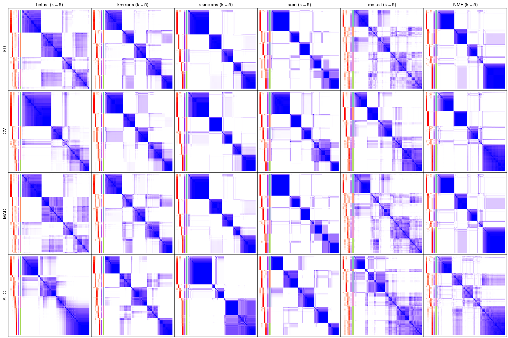</p>

</div>
<div id='tab-collect-consensus-heatmap-5'>
<pre><code class="r">collect_plots(res_list, k = 6, fun = consensus_heatmap, mc.cores = 4)
</code></pre>

<p></p>

</div>
</div>


### Membership heatmap

Membership heatmaps for all methods. ([What is a membership heatmap?](http://bioconductor.org/packages/devel/bioc/vignettes/cola/inst/doc/cola.html#toc_12))


<script>
$( function() {
	$( '#tabs-collect-membership-heatmap' ).tabs();
} );
</script>
<div id='tabs-collect-membership-heatmap'>
<ul>
<li><a href='#tab-collect-membership-heatmap-1'>k = 2</a></li>
<li><a href='#tab-collect-membership-heatmap-2'>k = 3</a></li>
<li><a href='#tab-collect-membership-heatmap-3'>k = 4</a></li>
<li><a href='#tab-collect-membership-heatmap-4'>k = 5</a></li>
<li><a href='#tab-collect-membership-heatmap-5'>k = 6</a></li>
</ul>
<div id='tab-collect-membership-heatmap-1'>
<pre><code class="r">collect_plots(res_list, k = 2, fun = membership_heatmap, mc.cores = 4)
</code></pre>

<p></p>

</div>
<div id='tab-collect-membership-heatmap-2'>
<pre><code class="r">collect_plots(res_list, k = 3, fun = membership_heatmap, mc.cores = 4)
</code></pre>

<p></p>

</div>
<div id='tab-collect-membership-heatmap-3'>
<pre><code class="r">collect_plots(res_list, k = 4, fun = membership_heatmap, mc.cores = 4)
</code></pre>

<p></p>

</div>
<div id='tab-collect-membership-heatmap-4'>
<pre><code class="r">collect_plots(res_list, k = 5, fun = membership_heatmap, mc.cores = 4)
</code></pre>

<p></p>

</div>
<div id='tab-collect-membership-heatmap-5'>
<pre><code class="r">collect_plots(res_list, k = 6, fun = membership_heatmap, mc.cores = 4)
</code></pre>

<p></p>

</div>
</div>


### Signature heatmap

Signature heatmaps for all methods. ([What is a signature heatmap?](http://bioconductor.org/packages/devel/bioc/vignettes/cola/inst/doc/cola.html#toc_22))


Note in following heatmaps, rows are scaled.


<script>
$( function() {
	$( '#tabs-collect-get-signatures' ).tabs();
} );
</script>
<div id='tabs-collect-get-signatures'>
<ul>
<li><a href='#tab-collect-get-signatures-1'>k = 2</a></li>
<li><a href='#tab-collect-get-signatures-2'>k = 3</a></li>
<li><a href='#tab-collect-get-signatures-3'>k = 4</a></li>
<li><a href='#tab-collect-get-signatures-4'>k = 5</a></li>
<li><a href='#tab-collect-get-signatures-5'>k = 6</a></li>
</ul>
<div id='tab-collect-get-signatures-1'>
<pre><code class="r">collect_plots(res_list, k = 2, fun = get_signatures, mc.cores = 4)
</code></pre>

<p></p>

</div>
<div id='tab-collect-get-signatures-2'>
<pre><code class="r">collect_plots(res_list, k = 3, fun = get_signatures, mc.cores = 4)
</code></pre>

<p></p>

</div>
<div id='tab-collect-get-signatures-3'>
<pre><code class="r">collect_plots(res_list, k = 4, fun = get_signatures, mc.cores = 4)
</code></pre>

<p></p>

</div>
<div id='tab-collect-get-signatures-4'>
<pre><code class="r">collect_plots(res_list, k = 5, fun = get_signatures, mc.cores = 4)
</code></pre>

<p></p>

</div>
<div id='tab-collect-get-signatures-5'>
<pre><code class="r">collect_plots(res_list, k = 6, fun = get_signatures, mc.cores = 4)
</code></pre>

<p></p>

</div>
</div>


### Statistics table

The statistics used for measuring the stability of consensus partitioning.
([How are they
defined?](http://bioconductor.org/packages/devel/bioc/vignettes/cola/inst/doc/cola.html#toc_13))


<script>
$( function() {
	$( '#tabs-get-stats-from-consensus-partition-list' ).tabs();
} );
</script>
<div id='tabs-get-stats-from-consensus-partition-list'>
<ul>
<li><a href='#tab-get-stats-from-consensus-partition-list-1'>k = 2</a></li>
<li><a href='#tab-get-stats-from-consensus-partition-list-2'>k = 3</a></li>
<li><a href='#tab-get-stats-from-consensus-partition-list-3'>k = 4</a></li>
<li><a href='#tab-get-stats-from-consensus-partition-list-4'>k = 5</a></li>
<li><a href='#tab-get-stats-from-consensus-partition-list-5'>k = 6</a></li>
</ul>
<div id='tab-get-stats-from-consensus-partition-list-1'>
<pre><code class="r">get_stats(res_list, k = 2)
</code></pre>

<pre><code>#&gt;             k 1-PAC mean_silhouette concordance area_increased  Rand Jaccard
#&gt; SD:NMF      2 1.000           0.985       0.994          0.501 0.499   0.499
#&gt; CV:NMF      2 1.000           0.961       0.985          0.496 0.502   0.502
#&gt; MAD:NMF     2 1.000           0.985       0.994          0.501 0.499   0.499
#&gt; ATC:NMF     2 1.000           0.981       0.992          0.490 0.510   0.510
#&gt; SD:skmeans  2 1.000           0.990       0.996          0.502 0.499   0.499
#&gt; CV:skmeans  2 1.000           0.989       0.996          0.502 0.499   0.499
#&gt; MAD:skmeans 2 1.000           0.991       0.996          0.502 0.498   0.498
#&gt; ATC:skmeans 2 1.000           0.992       0.997          0.503 0.498   0.498
#&gt; SD:mclust   2 0.864           0.944       0.972          0.480 0.522   0.522
#&gt; CV:mclust   2 1.000           0.973       0.984          0.457 0.547   0.547
#&gt; MAD:mclust  2 0.971           0.949       0.975          0.474 0.520   0.520
#&gt; ATC:mclust  2 0.837           0.867       0.946          0.478 0.524   0.524
#&gt; SD:kmeans   2 1.000           0.975       0.990          0.500 0.500   0.500
#&gt; CV:kmeans   2 1.000           0.978       0.992          0.501 0.499   0.499
#&gt; MAD:kmeans  2 1.000           0.977       0.991          0.501 0.499   0.499
#&gt; ATC:kmeans  2 1.000           0.993       0.997          0.502 0.498   0.498
#&gt; SD:pam      2 0.962           0.951       0.978          0.499 0.498   0.498
#&gt; CV:pam      2 1.000           0.980       0.991          0.501 0.500   0.500
#&gt; MAD:pam     2 0.944           0.963       0.984          0.498 0.500   0.500
#&gt; ATC:pam     2 1.000           0.981       0.992          0.502 0.498   0.498
#&gt; SD:hclust   2 0.862           0.896       0.953          0.497 0.499   0.499
#&gt; CV:hclust   2 0.884           0.919       0.962          0.499 0.499   0.499
#&gt; MAD:hclust  2 0.876           0.912       0.961          0.498 0.498   0.498
#&gt; ATC:hclust  2 0.879           0.919       0.965          0.497 0.499   0.499
</code></pre>

</div>
<div id='tab-get-stats-from-consensus-partition-list-2'>
<pre><code class="r">get_stats(res_list, k = 3)
</code></pre>

<pre><code>#&gt;             k 1-PAC mean_silhouette concordance area_increased  Rand Jaccard
#&gt; SD:NMF      3 0.949           0.938       0.974          0.256 0.844   0.695
#&gt; CV:NMF      3 0.740           0.852       0.881          0.287 0.829   0.667
#&gt; MAD:NMF     3 0.927           0.939       0.973          0.251 0.850   0.706
#&gt; ATC:NMF     3 0.824           0.866       0.945          0.295 0.783   0.603
#&gt; SD:skmeans  3 0.758           0.874       0.909          0.242 0.860   0.726
#&gt; CV:skmeans  3 1.000           0.972       0.986          0.260 0.851   0.707
#&gt; MAD:skmeans 3 0.762           0.881       0.915          0.236 0.868   0.739
#&gt; ATC:skmeans 3 0.882           0.951       0.969          0.122 0.943   0.885
#&gt; SD:mclust   3 0.543           0.594       0.772          0.317 0.815   0.650
#&gt; CV:mclust   3 0.723           0.942       0.888          0.399 0.784   0.605
#&gt; MAD:mclust  3 0.581           0.677       0.793          0.333 0.837   0.689
#&gt; ATC:mclust  3 0.566           0.644       0.774          0.298 0.689   0.474
#&gt; SD:kmeans   3 0.655           0.470       0.700          0.284 0.860   0.728
#&gt; CV:kmeans   3 0.671           0.789       0.815          0.265 0.851   0.707
#&gt; MAD:kmeans  3 0.684           0.681       0.796          0.284 0.867   0.740
#&gt; ATC:kmeans  3 0.800           0.708       0.871          0.300 0.771   0.571
#&gt; SD:pam      3 0.735           0.876       0.885          0.242 0.850   0.712
#&gt; CV:pam      3 0.798           0.875       0.934          0.258 0.857   0.718
#&gt; MAD:pam     3 0.670           0.753       0.825          0.266 0.862   0.729
#&gt; ATC:pam     3 0.893           0.880       0.954          0.326 0.759   0.551
#&gt; SD:hclust   3 0.619           0.732       0.847          0.257 0.851   0.709
#&gt; CV:hclust   3 0.676           0.609       0.778          0.230 0.972   0.945
#&gt; MAD:hclust  3 0.634           0.753       0.855          0.251 0.875   0.752
#&gt; ATC:hclust  3 0.779           0.849       0.917          0.249 0.867   0.735
</code></pre>

</div>
<div id='tab-get-stats-from-consensus-partition-list-3'>
<pre><code class="r">get_stats(res_list, k = 4)
</code></pre>

<pre><code>#&gt;             k 1-PAC mean_silhouette concordance area_increased  Rand Jaccard
#&gt; SD:NMF      4 0.783           0.788       0.837         0.1244 0.852   0.618
#&gt; CV:NMF      4 0.926           0.925       0.946         0.1522 0.876   0.664
#&gt; MAD:NMF     4 0.770           0.671       0.857         0.1119 0.960   0.893
#&gt; ATC:NMF     4 0.638           0.669       0.823         0.0778 0.895   0.741
#&gt; SD:skmeans  4 0.837           0.859       0.918         0.1755 0.851   0.625
#&gt; CV:skmeans  4 0.874           0.893       0.936         0.1376 0.892   0.714
#&gt; MAD:skmeans 4 0.827           0.780       0.897         0.1758 0.855   0.636
#&gt; ATC:skmeans 4 0.950           0.913       0.957         0.1402 0.917   0.812
#&gt; SD:mclust   4 0.582           0.525       0.740         0.1406 0.761   0.439
#&gt; CV:mclust   4 0.795           0.825       0.916         0.1405 0.907   0.730
#&gt; MAD:mclust  4 0.554           0.566       0.774         0.1500 0.815   0.545
#&gt; ATC:mclust  4 0.504           0.605       0.741         0.1215 0.856   0.628
#&gt; SD:kmeans   4 0.660           0.741       0.816         0.1383 0.740   0.426
#&gt; CV:kmeans   4 0.692           0.616       0.806         0.1431 0.899   0.734
#&gt; MAD:kmeans  4 0.688           0.791       0.854         0.1442 0.810   0.546
#&gt; ATC:kmeans  4 0.925           0.924       0.962         0.1449 0.852   0.600
#&gt; SD:pam      4 0.718           0.803       0.879         0.1817 0.843   0.619
#&gt; CV:pam      4 0.734           0.711       0.835         0.1150 0.905   0.754
#&gt; MAD:pam     4 0.774           0.765       0.902         0.1612 0.818   0.557
#&gt; ATC:pam     4 0.724           0.723       0.784         0.1065 0.884   0.673
#&gt; SD:hclust   4 0.626           0.652       0.787         0.1159 0.889   0.717
#&gt; CV:hclust   4 0.706           0.701       0.824         0.1194 0.838   0.662
#&gt; MAD:hclust  4 0.625           0.671       0.818         0.1305 0.862   0.658
#&gt; ATC:hclust  4 0.659           0.733       0.771         0.1200 0.887   0.696
</code></pre>

</div>
<div id='tab-get-stats-from-consensus-partition-list-4'>
<pre><code class="r">get_stats(res_list, k = 5)
</code></pre>

<pre><code>#&gt;             k 1-PAC mean_silhouette concordance area_increased  Rand Jaccard
#&gt; SD:NMF      5 0.785           0.823       0.895         0.0679 0.937   0.771
#&gt; CV:NMF      5 0.837           0.777       0.896         0.0448 0.966   0.870
#&gt; MAD:NMF     5 0.781           0.800       0.880         0.0785 0.825   0.535
#&gt; ATC:NMF     5 0.631           0.589       0.787         0.0929 0.842   0.570
#&gt; SD:skmeans  5 0.947           0.908       0.943         0.0661 0.926   0.733
#&gt; CV:skmeans  5 0.889           0.904       0.932         0.0777 0.926   0.738
#&gt; MAD:skmeans 5 0.921           0.900       0.932         0.0662 0.887   0.626
#&gt; ATC:skmeans 5 0.785           0.757       0.857         0.0882 0.969   0.917
#&gt; SD:mclust   5 0.568           0.454       0.701         0.0814 0.843   0.496
#&gt; CV:mclust   5 0.735           0.777       0.840         0.0771 0.901   0.653
#&gt; MAD:mclust  5 0.556           0.461       0.653         0.0616 0.884   0.606
#&gt; ATC:mclust  5 0.581           0.507       0.717         0.0680 0.893   0.672
#&gt; SD:kmeans   5 0.789           0.794       0.846         0.0790 0.911   0.673
#&gt; CV:kmeans   5 0.795           0.806       0.839         0.0765 0.839   0.508
#&gt; MAD:kmeans  5 0.761           0.723       0.826         0.0718 0.916   0.687
#&gt; ATC:kmeans  5 0.787           0.764       0.839         0.0593 0.903   0.647
#&gt; SD:pam      5 0.857           0.788       0.900         0.0803 0.913   0.696
#&gt; CV:pam      5 0.842           0.779       0.903         0.1173 0.829   0.505
#&gt; MAD:pam     5 0.863           0.802       0.909         0.0805 0.889   0.618
#&gt; ATC:pam     5 0.812           0.816       0.909         0.0839 0.908   0.668
#&gt; SD:hclust   5 0.619           0.613       0.754         0.0733 0.896   0.682
#&gt; CV:hclust   5 0.721           0.732       0.817         0.0630 0.918   0.756
#&gt; MAD:hclust  5 0.611           0.559       0.743         0.0693 0.925   0.757
#&gt; ATC:hclust  5 0.703           0.749       0.868         0.0676 0.961   0.858
</code></pre>

</div>
<div id='tab-get-stats-from-consensus-partition-list-5'>
<pre><code class="r">get_stats(res_list, k = 6)
</code></pre>

<pre><code>#&gt;             k 1-PAC mean_silhouette concordance area_increased  Rand Jaccard
#&gt; SD:NMF      6 0.947           0.877       0.944         0.0479 0.960   0.828
#&gt; CV:NMF      6 0.810           0.733       0.845         0.0467 0.967   0.861
#&gt; MAD:NMF     6 0.951           0.874       0.942         0.0501 0.954   0.809
#&gt; ATC:NMF     6 0.671           0.576       0.755         0.0649 0.895   0.613
#&gt; SD:skmeans  6 0.868           0.778       0.899         0.0354 0.970   0.866
#&gt; CV:skmeans  6 0.886           0.788       0.900         0.0377 0.989   0.948
#&gt; MAD:skmeans 6 0.849           0.764       0.876         0.0354 0.970   0.870
#&gt; ATC:skmeans 6 0.768           0.564       0.792         0.0496 0.965   0.900
#&gt; SD:mclust   6 0.591           0.409       0.668         0.0306 0.865   0.476
#&gt; CV:mclust   6 0.754           0.694       0.766         0.0445 0.931   0.692
#&gt; MAD:mclust  6 0.605           0.463       0.659         0.0315 0.870   0.514
#&gt; ATC:mclust  6 0.567           0.474       0.634         0.0460 0.854   0.533
#&gt; SD:kmeans   6 0.771           0.694       0.806         0.0422 0.969   0.853
#&gt; CV:kmeans   6 0.742           0.715       0.821         0.0453 0.943   0.742
#&gt; MAD:kmeans  6 0.740           0.662       0.785         0.0394 0.951   0.773
#&gt; ATC:kmeans  6 0.764           0.612       0.797         0.0364 0.959   0.812
#&gt; SD:pam      6 0.761           0.468       0.694         0.0400 0.846   0.419
#&gt; CV:pam      6 0.806           0.745       0.853         0.0515 0.900   0.593
#&gt; MAD:pam     6 0.755           0.590       0.781         0.0413 0.871   0.492
#&gt; ATC:pam     6 0.855           0.823       0.919         0.0382 0.939   0.720
#&gt; SD:hclust   6 0.629           0.642       0.746         0.0633 0.932   0.734
#&gt; CV:hclust   6 0.724           0.685       0.814         0.0454 0.961   0.857
#&gt; MAD:hclust  6 0.623           0.549       0.683         0.0458 0.909   0.674
#&gt; ATC:hclust  6 0.718           0.663       0.827         0.0453 0.961   0.847
</code></pre>

</div>
</div>

Following heatmap plots the partition for each combination of methods and the
lightness correspond to the silhouette scores for samples in each method. On
top the consensus subgroup is inferred from all methods by taking the mean
silhouette scores as weight.


<script>
$( function() {
	$( '#tabs-collect-stats-from-consensus-partition-list' ).tabs();
} );
</script>
<div id='tabs-collect-stats-from-consensus-partition-list'>
<ul>
<li><a href='#tab-collect-stats-from-consensus-partition-list-1'>k = 2</a></li>
<li><a href='#tab-collect-stats-from-consensus-partition-list-2'>k = 3</a></li>
<li><a href='#tab-collect-stats-from-consensus-partition-list-3'>k = 4</a></li>
<li><a href='#tab-collect-stats-from-consensus-partition-list-4'>k = 5</a></li>
<li><a href='#tab-collect-stats-from-consensus-partition-list-5'>k = 6</a></li>
</ul>
<div id='tab-collect-stats-from-consensus-partition-list-1'>
<pre><code class="r">collect_stats(res_list, k = 2)
</code></pre>

<p></p>

</div>
<div id='tab-collect-stats-from-consensus-partition-list-2'>
<pre><code class="r">collect_stats(res_list, k = 3)
</code></pre>

<p></p>

</div>
<div id='tab-collect-stats-from-consensus-partition-list-3'>
<pre><code class="r">collect_stats(res_list, k = 4)
</code></pre>

<p></p>

</div>
<div id='tab-collect-stats-from-consensus-partition-list-4'>
<pre><code class="r">collect_stats(res_list, k = 5)
</code></pre>

<p></p>

</div>
<div id='tab-collect-stats-from-consensus-partition-list-5'>
<pre><code class="r">collect_stats(res_list, k = 6)
</code></pre>

<p></p>

</div>
</div>

### Partition from all methods


Collect partitions from all methods:


<script>
$( function() {
	$( '#tabs-collect-classes-from-consensus-partition-list' ).tabs();
} );
</script>
<div id='tabs-collect-classes-from-consensus-partition-list'>
<ul>
<li><a href='#tab-collect-classes-from-consensus-partition-list-1'>k = 2</a></li>
<li><a href='#tab-collect-classes-from-consensus-partition-list-2'>k = 3</a></li>
<li><a href='#tab-collect-classes-from-consensus-partition-list-3'>k = 4</a></li>
<li><a href='#tab-collect-classes-from-consensus-partition-list-4'>k = 5</a></li>
<li><a href='#tab-collect-classes-from-consensus-partition-list-5'>k = 6</a></li>
</ul>
<div id='tab-collect-classes-from-consensus-partition-list-1'>
<pre><code class="r">collect_classes(res_list, k = 2)
</code></pre>

<p></p>

</div>
<div id='tab-collect-classes-from-consensus-partition-list-2'>
<pre><code class="r">collect_classes(res_list, k = 3)
</code></pre>

<p></p>

</div>
<div id='tab-collect-classes-from-consensus-partition-list-3'>
<pre><code class="r">collect_classes(res_list, k = 4)
</code></pre>

<p></p>

</div>
<div id='tab-collect-classes-from-consensus-partition-list-4'>
<pre><code class="r">collect_classes(res_list, k = 5)
</code></pre>

<p></p>

</div>
<div id='tab-collect-classes-from-consensus-partition-list-5'>
<pre><code class="r">collect_classes(res_list, k = 6)
</code></pre>

<p></p>

</div>
</div>


### Top rows overlap


Overlap of top rows from different top-row methods:


<script>
$( function() {
	$( '#tabs-top-rows-overlap-by-euler' ).tabs();
} );
</script>
<div id='tabs-top-rows-overlap-by-euler'>
<ul>
<li><a href='#tab-top-rows-overlap-by-euler-1'>top_n = 1000</a></li>
<li><a href='#tab-top-rows-overlap-by-euler-2'>top_n = 2000</a></li>
<li><a href='#tab-top-rows-overlap-by-euler-3'>top_n = 3000</a></li>
<li><a href='#tab-top-rows-overlap-by-euler-4'>top_n = 4000</a></li>
<li><a href='#tab-top-rows-overlap-by-euler-5'>top_n = 5000</a></li>
</ul>
<div id='tab-top-rows-overlap-by-euler-1'>
<pre><code class="r">top_rows_overlap(res_list, top_n = 1000, method = &quot;euler&quot;)
</code></pre>

<p></p>

</div>
<div id='tab-top-rows-overlap-by-euler-2'>
<pre><code class="r">top_rows_overlap(res_list, top_n = 2000, method = &quot;euler&quot;)
</code></pre>

<p></p>

</div>
<div id='tab-top-rows-overlap-by-euler-3'>
<pre><code class="r">top_rows_overlap(res_list, top_n = 3000, method = &quot;euler&quot;)
</code></pre>

<p></p>

</div>
<div id='tab-top-rows-overlap-by-euler-4'>
<pre><code class="r">top_rows_overlap(res_list, top_n = 4000, method = &quot;euler&quot;)
</code></pre>

<p></p>

</div>
<div id='tab-top-rows-overlap-by-euler-5'>
<pre><code class="r">top_rows_overlap(res_list, top_n = 5000, method = &quot;euler&quot;)
</code></pre>

<p></p>

</div>
</div>

Also visualize the correspondance of rankings between different top-row methods:


<script>
$( function() {
	$( '#tabs-top-rows-overlap-by-correspondance' ).tabs();
} );
</script>
<div id='tabs-top-rows-overlap-by-correspondance'>
<ul>
<li><a href='#tab-top-rows-overlap-by-correspondance-1'>top_n = 1000</a></li>
<li><a href='#tab-top-rows-overlap-by-correspondance-2'>top_n = 2000</a></li>
<li><a href='#tab-top-rows-overlap-by-correspondance-3'>top_n = 3000</a></li>
<li><a href='#tab-top-rows-overlap-by-correspondance-4'>top_n = 4000</a></li>
<li><a href='#tab-top-rows-overlap-by-correspondance-5'>top_n = 5000</a></li>
</ul>
<div id='tab-top-rows-overlap-by-correspondance-1'>
<pre><code class="r">top_rows_overlap(res_list, top_n = 1000, method = &quot;correspondance&quot;)
</code></pre>

<p></p>

</div>
<div id='tab-top-rows-overlap-by-correspondance-2'>
<pre><code class="r">top_rows_overlap(res_list, top_n = 2000, method = &quot;correspondance&quot;)
</code></pre>

<p></p>

</div>
<div id='tab-top-rows-overlap-by-correspondance-3'>
<pre><code class="r">top_rows_overlap(res_list, top_n = 3000, method = &quot;correspondance&quot;)
</code></pre>

<p></p>

</div>
<div id='tab-top-rows-overlap-by-correspondance-4'>
<pre><code class="r">top_rows_overlap(res_list, top_n = 4000, method = &quot;correspondance&quot;)
</code></pre>

<p></p>

</div>
<div id='tab-top-rows-overlap-by-correspondance-5'>
<pre><code class="r">top_rows_overlap(res_list, top_n = 5000, method = &quot;correspondance&quot;)
</code></pre>

<p></p>

</div>
</div>


Heatmaps of the top rows:


<script>
$( function() {
	$( '#tabs-top-rows-heatmap' ).tabs();
} );
</script>
<div id='tabs-top-rows-heatmap'>
<ul>
<li><a href='#tab-top-rows-heatmap-1'>top_n = 1000</a></li>
<li><a href='#tab-top-rows-heatmap-2'>top_n = 2000</a></li>
<li><a href='#tab-top-rows-heatmap-3'>top_n = 3000</a></li>
<li><a href='#tab-top-rows-heatmap-4'>top_n = 4000</a></li>
<li><a href='#tab-top-rows-heatmap-5'>top_n = 5000</a></li>
</ul>
<div id='tab-top-rows-heatmap-1'>
<pre><code class="r">top_rows_heatmap(res_list, top_n = 1000)
</code></pre>

<p>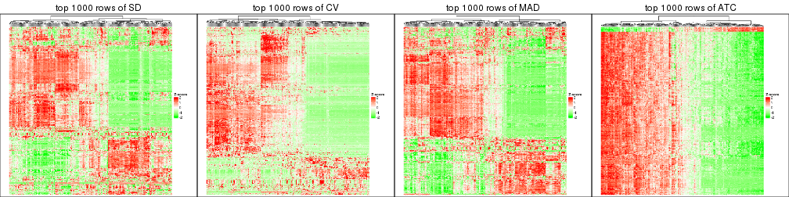</p>

</div>
<div id='tab-top-rows-heatmap-2'>
<pre><code class="r">top_rows_heatmap(res_list, top_n = 2000)
</code></pre>

<p></p>

</div>
<div id='tab-top-rows-heatmap-3'>
<pre><code class="r">top_rows_heatmap(res_list, top_n = 3000)
</code></pre>

<p></p>

</div>
<div id='tab-top-rows-heatmap-4'>
<pre><code class="r">top_rows_heatmap(res_list, top_n = 4000)
</code></pre>

<p></p>

</div>
<div id='tab-top-rows-heatmap-5'>
<pre><code class="r">top_rows_heatmap(res_list, top_n = 5000)
</code></pre>

<p></p>

</div>
</div>


 
## Results for each method


---------------------------------------------------


### SD:hclust


The object with results only for a single top-value method and a single partition method 
can be extracted as:

```r
res = res_list["SD", "hclust"]
# you can also extract it by
# res = res_list["SD:hclust"]
```

A summary of `res` and all the functions that can be applied to it:

```r
res
```

```
#> A 'ConsensusPartition' object with k = 2, 3, 4, 5, 6.
#>   On a matrix with 17680 rows and 218 columns.
#>   Top rows (1000, 2000, 3000, 4000, 5000) are extracted by 'SD' method.
#>   Subgroups are detected by 'hclust' method.
#>   Performed in total 1250 partitions by row resampling.
#>   Best k for subgroups seems to be 2.
#> 
#> Following methods can be applied to this 'ConsensusPartition' object:
#>  [1] "cola_report"             "collect_classes"         "collect_plots"          
#>  [4] "collect_stats"           "colnames"                "compare_signatures"     
#>  [7] "consensus_heatmap"       "dimension_reduction"     "functional_enrichment"  
#> [10] "get_anno_col"            "get_anno"                "get_classes"            
#> [13] "get_consensus"           "get_matrix"              "get_membership"         
#> [16] "get_param"               "get_signatures"          "get_stats"              
#> [19] "is_best_k"               "is_stable_k"             "membership_heatmap"     
#> [22] "ncol"                    "nrow"                    "plot_ecdf"              
#> [25] "rownames"                "select_partition_number" "show"                   
#> [28] "suggest_best_k"          "test_to_known_factors"
```

`collect_plots()` function collects all the plots made from `res` for all `k` (number of partitions)
into one single page to provide an easy and fast comparison between different `k`.

```r
collect_plots(res)
```


The plots are:

- The first row: a plot of the ECDF (Empirical cumulative distribution
  function) curves of the consensus matrix for each `k` and the heatmap of
  predicted classes for each `k`.
- The second row: heatmaps of the consensus matrix for each `k`.
- The third row: heatmaps of the membership matrix for each `k`.
- The fouth row: heatmaps of the signatures for each `k`.

All the plots in panels can be made by individual functions and they are
plotted later in this section.

`select_partition_number()` produces several plots showing different
statistics for choosing "optimized" `k`. There are following statistics:

- ECDF curves of the consensus matrix for each `k`;
- 1-PAC. [The PAC
  score](https://en.wikipedia.org/wiki/Consensus_clustering#Over-interpretation_potential_of_consensus_clustering)
  measures the proportion of the ambiguous subgrouping.
- Mean silhouette score.
- Concordance. The mean probability of fiting the consensus class ids in all
  partitions.
- Area increased. Denote $A_k$ as the area under the ECDF curve for current
  `k`, the area increased is defined as $A_k - A_{k-1}$.
- Rand index. The percent of pairs of samples that are both in a same cluster
  or both are not in a same cluster in the partition of k and k-1.
- Jaccard index. The ratio of pairs of samples are both in a same cluster in
  the partition of k and k-1 and the pairs of samples are both in a same
  cluster in the partition k or k-1.

The detailed explanations of these statistics can be found in [the cola
vignette](http://bioconductor.org/packages/devel/bioc/vignettes/cola/inst/doc/cola.html#toc_13).

Generally speaking, lower PAC score, higher mean silhouette score or higher
concordance corresponds to better partition. Rand index and Jaccard index
measure how similar the current partition is compared to partition with `k-1`.
If they are too similar, we won't accept `k` is better than `k-1`.

```r
select_partition_number(res)
```


The numeric values for all these statistics can be obtained by `get_stats()`.

```r
get_stats(res)
```

```
#>   k 1-PAC mean_silhouette concordance area_increased  Rand Jaccard
#> 2 2 0.862           0.896       0.953         0.4970 0.499   0.499
#> 3 3 0.619           0.732       0.847         0.2571 0.851   0.709
#> 4 4 0.626           0.652       0.787         0.1159 0.889   0.717
#> 5 5 0.619           0.613       0.754         0.0733 0.896   0.682
#> 6 6 0.629           0.642       0.746         0.0633 0.932   0.734
```

`suggest_best_k()` suggests the best $k$ based on these statistics. The rules are as follows:

- All $k$ with Jaccard index larger than 0.95 are removed because the increase of
  the partition number does not provides enough extra information. If all $k$ are removed,
  the best $k$ is assigned by `NA`.
- For $k$ with 1-PAC larger than 0.9, the maximal $k$ is taken as the "best k". Other $k$ is called "optional k".
- If it does not fit the second rule. The $k$ with the highest vote of highest
  1-PAC, mean silhouette and concordance is taken as the "best k".

```r
suggest_best_k(res)
```

```
#> [1] 2
```


Following shows the table of the partitions (You need to click the **show/hide
code output** link to see it). The membership matrix (columns with name `p*`)
is inferred by
[`clue::cl_consensus()`](https://www.rdocumentation.org/link/cl_consensus?package=clue)
function with the `SE` method. Basically the value in the membership matrix
represents the probability to belong to a certain group. The finall class
label for an item is determined with the group with highest probability it
belongs to.

In `get_classes()` function, the entropy is calculated from the membership
matrix and the silhouette score is calculated from the consensus matrix.


<script>
$( function() {
	$( '#tabs-SD-hclust-get-classes' ).tabs();
} );
</script>
<div id='tabs-SD-hclust-get-classes'>
<ul>
<li><a href='#tab-SD-hclust-get-classes-1'>k = 2</a></li>
<li><a href='#tab-SD-hclust-get-classes-2'>k = 3</a></li>
<li><a href='#tab-SD-hclust-get-classes-3'>k = 4</a></li>
<li><a href='#tab-SD-hclust-get-classes-4'>k = 5</a></li>
<li><a href='#tab-SD-hclust-get-classes-5'>k = 6</a></li>
</ul>

<div id='tab-SD-hclust-get-classes-1'>
<p><a id='tab-SD-hclust-get-classes-1-a' style='color:#0366d6' href='#'>show/hide code output</a></p>
<pre><code class="r">cbind(get_classes(res, k = 2), get_membership(res, k = 2))
</code></pre>

<pre><code>#&gt;            class entropy silhouette    p1    p2
#&gt; SRR1498997     2  0.0000     0.9419 0.000 1.000
#&gt; SRR1076441     1  0.0000     0.9590 1.000 0.000
#&gt; SRR1489803     2  0.0000     0.9419 0.000 1.000
#&gt; SRR1345953     2  0.0000     0.9419 0.000 1.000
#&gt; SRR1357826     2  0.0000     0.9419 0.000 1.000
#&gt; SRR1419656     1  0.0000     0.9590 1.000 0.000
#&gt; SRR1454158     2  0.1184     0.9388 0.016 0.984
#&gt; SRR1475408     2  0.9795     0.3271 0.416 0.584
#&gt; SRR1472704     2  0.0000     0.9419 0.000 1.000
#&gt; SRR1090046     1  0.2236     0.9313 0.964 0.036
#&gt; SRR1312822     1  0.0000     0.9590 1.000 0.000
#&gt; SRR1096987     2  0.3733     0.9080 0.072 0.928
#&gt; SRR1334587     2  0.0938     0.9401 0.012 0.988
#&gt; SRR1490246     1  0.0000     0.9590 1.000 0.000
#&gt; SRR1467522     1  0.0000     0.9590 1.000 0.000
#&gt; SRR1324206     1  0.0000     0.9590 1.000 0.000
#&gt; SRR1408574     2  0.1414     0.9380 0.020 0.980
#&gt; SRR1083959     2  0.0000     0.9419 0.000 1.000
#&gt; SRR1079948     2  0.3879     0.9048 0.076 0.924
#&gt; SRR1310667     2  0.0000     0.9419 0.000 1.000
#&gt; SRR655852      2  0.2603     0.9263 0.044 0.956
#&gt; SRR1352457     2  0.0000     0.9419 0.000 1.000
#&gt; SRR1353994     2  0.0000     0.9419 0.000 1.000
#&gt; SRR1459561     2  0.0000     0.9419 0.000 1.000
#&gt; SRR1454009     1  0.3431     0.9060 0.936 0.064
#&gt; SRR1071084     1  0.0000     0.9590 1.000 0.000
#&gt; SRR1082859     2  0.0000     0.9419 0.000 1.000
#&gt; SRR1086538     1  0.0000     0.9590 1.000 0.000
#&gt; SRR1486262     2  0.4022     0.9014 0.080 0.920
#&gt; SRR658105      1  0.0000     0.9590 1.000 0.000
#&gt; SRR811073      2  0.0000     0.9419 0.000 1.000
#&gt; SRR1429181     2  0.3431     0.9118 0.064 0.936
#&gt; SRR1327896     2  0.4022     0.9014 0.080 0.920
#&gt; SRR1464788     2  0.0000     0.9419 0.000 1.000
#&gt; SRR1346861     2  0.0000     0.9419 0.000 1.000
#&gt; SRR1318774     2  0.0000     0.9419 0.000 1.000
#&gt; SRR1420517     1  0.0000     0.9590 1.000 0.000
#&gt; SRR1369584     2  0.0000     0.9419 0.000 1.000
#&gt; SRR1443244     1  0.8909     0.5541 0.692 0.308
#&gt; SRR1455391     1  0.0000     0.9590 1.000 0.000
#&gt; SRR1068999     1  0.0000     0.9590 1.000 0.000
#&gt; SRR1481297     1  0.0000     0.9590 1.000 0.000
#&gt; SRR1070208     1  0.0000     0.9590 1.000 0.000
#&gt; SRR1317282     1  0.0000     0.9590 1.000 0.000
#&gt; SRR1096125     2  0.4161     0.8986 0.084 0.916
#&gt; SRR1472506     1  0.8813     0.5746 0.700 0.300
#&gt; SRR1388281     2  0.0000     0.9419 0.000 1.000
#&gt; SRR1365622     2  0.1843     0.9341 0.028 0.972
#&gt; SRR662306      1  0.0000     0.9590 1.000 0.000
#&gt; SRR662811      1  0.0000     0.9590 1.000 0.000
#&gt; SRR820571      1  0.7219     0.7467 0.800 0.200
#&gt; SRR1357166     1  0.0000     0.9590 1.000 0.000
#&gt; SRR1488586     1  0.4161     0.8869 0.916 0.084
#&gt; SRR1485398     1  0.0000     0.9590 1.000 0.000
#&gt; SRR1417725     2  0.9963     0.1724 0.464 0.536
#&gt; SRR1409397     2  0.0000     0.9419 0.000 1.000
#&gt; SRR1465693     2  0.0000     0.9419 0.000 1.000
#&gt; SRR1096547     1  0.8144     0.6645 0.748 0.252
#&gt; SRR1456818     1  0.0000     0.9590 1.000 0.000
#&gt; SRR816336      1  0.7219     0.7467 0.800 0.200
#&gt; SRR1420238     1  0.0000     0.9590 1.000 0.000
#&gt; SRR1433374     1  0.0000     0.9590 1.000 0.000
#&gt; SRR1436990     1  0.0000     0.9590 1.000 0.000
#&gt; SRR662378      1  0.0000     0.9590 1.000 0.000
#&gt; SRR1477671     1  0.0000     0.9590 1.000 0.000
#&gt; SRR1084079     1  0.9044     0.5277 0.680 0.320
#&gt; SRR1102949     1  0.0000     0.9590 1.000 0.000
#&gt; SRR1458090     1  0.0000     0.9590 1.000 0.000
#&gt; SRR1418729     2  0.2236     0.9302 0.036 0.964
#&gt; SRR1403814     2  0.3879     0.9048 0.076 0.924
#&gt; SRR1404887     1  0.8909     0.5541 0.692 0.308
#&gt; SRR1434955     1  0.0000     0.9590 1.000 0.000
#&gt; SRR1360652     1  0.0000     0.9590 1.000 0.000
#&gt; SRR1356765     2  0.1843     0.9341 0.028 0.972
#&gt; SRR1078258     2  0.1843     0.9337 0.028 0.972
#&gt; SRR1455861     1  0.0000     0.9590 1.000 0.000
#&gt; SRR1420296     2  0.0000     0.9419 0.000 1.000
#&gt; SRR1070260     2  0.0000     0.9419 0.000 1.000
#&gt; SRR1410765     1  0.0000     0.9590 1.000 0.000
#&gt; SRR1481315     1  0.0938     0.9503 0.988 0.012
#&gt; SRR1414661     2  0.0000     0.9419 0.000 1.000
#&gt; SRR1359147     2  0.2423     0.9290 0.040 0.960
#&gt; SRR1488694     1  0.4431     0.8794 0.908 0.092
#&gt; SRR1477273     1  0.0000     0.9590 1.000 0.000
#&gt; SRR1415792     1  0.0938     0.9506 0.988 0.012
#&gt; SRR1369088     2  0.9866     0.2874 0.432 0.568
#&gt; SRR1406621     2  0.1843     0.9341 0.028 0.972
#&gt; SRR1401017     2  0.0000     0.9419 0.000 1.000
#&gt; SRR1099981     2  0.1843     0.9351 0.028 0.972
#&gt; SRR815208      2  0.0000     0.9419 0.000 1.000
#&gt; SRR1380460     2  0.3431     0.9148 0.064 0.936
#&gt; SRR1091097     2  0.2778     0.9243 0.048 0.952
#&gt; SRR1456010     1  0.0000     0.9590 1.000 0.000
#&gt; SRR1498416     2  0.0000     0.9419 0.000 1.000
#&gt; SRR818873      2  0.0000     0.9419 0.000 1.000
#&gt; SRR813868      2  0.3431     0.9148 0.064 0.936
#&gt; SRR1394912     1  0.0000     0.9590 1.000 0.000
#&gt; SRR1475824     2  0.5946     0.8363 0.144 0.856
#&gt; SRR1459866     1  0.0000     0.9590 1.000 0.000
#&gt; SRR1364871     1  0.7219     0.7467 0.800 0.200
#&gt; SRR1100472     2  0.0000     0.9419 0.000 1.000
#&gt; SRR1331267     1  0.8713     0.5867 0.708 0.292
#&gt; SRR1068977     2  0.0376     0.9414 0.004 0.996
#&gt; SRR1391511     2  0.0000     0.9419 0.000 1.000
#&gt; SRR1077920     2  0.0000     0.9419 0.000 1.000
#&gt; SRR1457705     1  0.0000     0.9590 1.000 0.000
#&gt; SRR1437073     1  0.0000     0.9590 1.000 0.000
#&gt; SRR1473124     1  0.0000     0.9590 1.000 0.000
#&gt; SRR1469279     1  0.0000     0.9590 1.000 0.000
#&gt; SRR1091791     2  0.4161     0.8981 0.084 0.916
#&gt; SRR1341539     2  0.1843     0.9341 0.028 0.972
#&gt; SRR1446354     1  0.0000     0.9590 1.000 0.000
#&gt; SRR1415420     1  0.0000     0.9590 1.000 0.000
#&gt; SRR1368050     1  0.0000     0.9590 1.000 0.000
#&gt; SRR656970      2  0.0000     0.9419 0.000 1.000
#&gt; SRR1473403     2  0.0938     0.9397 0.012 0.988
#&gt; SRR1084674     1  0.0376     0.9562 0.996 0.004
#&gt; SRR1464702     1  0.0000     0.9590 1.000 0.000
#&gt; SRR1074860     2  0.9866     0.2774 0.432 0.568
#&gt; SRR655447      2  0.1414     0.9374 0.020 0.980
#&gt; SRR1404442     2  0.0000     0.9419 0.000 1.000
#&gt; SRR1418795     1  0.0000     0.9590 1.000 0.000
#&gt; SRR1458335     2  0.2778     0.9220 0.048 0.952
#&gt; SRR1489589     2  0.0000     0.9419 0.000 1.000
#&gt; SRR1378284     1  0.5629     0.8367 0.868 0.132
#&gt; SRR1408014     2  0.0000     0.9419 0.000 1.000
#&gt; SRR1083052     1  0.0000     0.9590 1.000 0.000
#&gt; SRR1339236     2  0.9248     0.5066 0.340 0.660
#&gt; SRR1323829     2  0.0000     0.9419 0.000 1.000
#&gt; SRR1086772     2  0.0000     0.9419 0.000 1.000
#&gt; SRR1486457     1  0.5408     0.8454 0.876 0.124
#&gt; SRR1415257     2  0.0000     0.9419 0.000 1.000
#&gt; SRR1071905     1  0.0000     0.9590 1.000 0.000
#&gt; SRR659223      2  0.0000     0.9419 0.000 1.000
#&gt; SRR1386945     1  0.0000     0.9590 1.000 0.000
#&gt; SRR821498      2  0.2043     0.9338 0.032 0.968
#&gt; SRR1378903     2  0.4298     0.8942 0.088 0.912
#&gt; SRR1472907     1  0.0000     0.9590 1.000 0.000
#&gt; SRR1442313     2  0.0000     0.9419 0.000 1.000
#&gt; SRR1077139     2  0.0000     0.9419 0.000 1.000
#&gt; SRR1342758     1  0.0000     0.9590 1.000 0.000
#&gt; SRR656911      2  0.3274     0.9176 0.060 0.940
#&gt; SRR1070738     1  0.0000     0.9590 1.000 0.000
#&gt; SRR1476950     1  0.0000     0.9590 1.000 0.000
#&gt; SRR1488196     1  0.3431     0.9060 0.936 0.064
#&gt; SRR1498951     1  0.0000     0.9590 1.000 0.000
#&gt; SRR1413392     1  0.0000     0.9590 1.000 0.000
#&gt; SRR657528      2  0.6438     0.8051 0.164 0.836
#&gt; SRR812198      1  0.0000     0.9590 1.000 0.000
#&gt; SRR660283      2  0.0000     0.9419 0.000 1.000
#&gt; SRR1420936     1  0.0000     0.9590 1.000 0.000
#&gt; SRR1469547     2  0.0000     0.9419 0.000 1.000
#&gt; SRR1322249     1  0.0672     0.9533 0.992 0.008
#&gt; SRR1396682     1  0.0000     0.9590 1.000 0.000
#&gt; SRR1095816     2  0.4431     0.8904 0.092 0.908
#&gt; SRR1081023     1  0.0000     0.9590 1.000 0.000
#&gt; SRR1092517     2  0.0938     0.9398 0.012 0.988
#&gt; SRR811285      2  0.0376     0.9414 0.004 0.996
#&gt; SRR657018      1  0.0000     0.9590 1.000 0.000
#&gt; SRR1365534     1  0.0000     0.9590 1.000 0.000
#&gt; SRR1090791     2  0.0000     0.9419 0.000 1.000
#&gt; SRR1439915     2  0.0000     0.9419 0.000 1.000
#&gt; SRR1391575     2  0.4022     0.9017 0.080 0.920
#&gt; SRR1314092     2  0.2778     0.9220 0.048 0.952
#&gt; SRR1328941     1  0.0000     0.9590 1.000 0.000
#&gt; SRR1336181     2  0.0000     0.9419 0.000 1.000
#&gt; SRR1362972     1  0.0000     0.9590 1.000 0.000
#&gt; SRR1366790     2  0.2043     0.9335 0.032 0.968
#&gt; SRR1455902     1  0.0000     0.9590 1.000 0.000
#&gt; SRR1437644     1  0.9775     0.2798 0.588 0.412
#&gt; SRR1105009     2  0.0000     0.9419 0.000 1.000
#&gt; SRR1367024     1  0.0000     0.9590 1.000 0.000
#&gt; SRR660248      2  0.9580     0.4224 0.380 0.620
#&gt; SRR1409620     1  0.0000     0.9590 1.000 0.000
#&gt; SRR1455807     2  0.0000     0.9419 0.000 1.000
#&gt; SRR1339431     1  0.0000     0.9590 1.000 0.000
#&gt; SRR1378948     2  0.9970     0.1600 0.468 0.532
#&gt; SRR1469237     1  0.0000     0.9590 1.000 0.000
#&gt; SRR1098264     2  0.0000     0.9419 0.000 1.000
#&gt; SRR1406224     2  0.1184     0.9388 0.016 0.984
#&gt; SRR1393026     1  0.0000     0.9590 1.000 0.000
#&gt; SRR808428      2  0.0000     0.9419 0.000 1.000
#&gt; SRR615910      2  0.0000     0.9419 0.000 1.000
#&gt; SRR1076219     1  0.0000     0.9590 1.000 0.000
#&gt; SRR1481128     1  0.0000     0.9590 1.000 0.000
#&gt; SRR1359262     2  0.0000     0.9419 0.000 1.000
#&gt; SRR1407648     2  0.4022     0.9014 0.080 0.920
#&gt; SRR1386775     1  0.9044     0.5294 0.680 0.320
#&gt; SRR1388399     2  0.9998     0.0776 0.492 0.508
#&gt; SRR1361499     2  0.0000     0.9419 0.000 1.000
#&gt; SRR1500709     2  0.3431     0.9148 0.064 0.936
#&gt; SRR1335917     1  0.0000     0.9590 1.000 0.000
#&gt; SRR1430615     2  0.0000     0.9419 0.000 1.000
#&gt; SRR1335212     1  0.4161     0.8869 0.916 0.084
#&gt; SRR1400159     2  0.9933     0.2140 0.452 0.548
#&gt; SRR1457245     2  0.0000     0.9419 0.000 1.000
#&gt; SRR1356746     2  0.0000     0.9419 0.000 1.000
#&gt; SRR658319      2  0.1184     0.9388 0.016 0.984
#&gt; SRR1435946     1  0.0000     0.9590 1.000 0.000
#&gt; SRR1370308     1  0.0000     0.9590 1.000 0.000
#&gt; SRR1100893     1  0.0000     0.9590 1.000 0.000
#&gt; SRR1389432     1  0.0000     0.9590 1.000 0.000
#&gt; SRR1381799     2  0.0376     0.9413 0.004 0.996
#&gt; SRR1310158     1  0.0000     0.9590 1.000 0.000
#&gt; SRR1341100     2  0.4022     0.9019 0.080 0.920
#&gt; SRR1342873     1  0.0000     0.9590 1.000 0.000
#&gt; SRR1472102     2  0.0376     0.9414 0.004 0.996
#&gt; SRR1409421     1  0.0000     0.9590 1.000 0.000
#&gt; SRR1328577     2  0.1414     0.9374 0.020 0.980
#&gt; SRR808942      2  0.1184     0.9388 0.016 0.984
#&gt; SRR1343818     2  0.0938     0.9398 0.012 0.988
#&gt; SRR1472415     2  0.0000     0.9419 0.000 1.000
#&gt; SRR658409      2  0.4431     0.8904 0.092 0.908
#&gt; SRR1469681     1  0.0000     0.9590 1.000 0.000
#&gt; SRR1075484     2  0.3584     0.9067 0.068 0.932
#&gt; SRR1417894     1  0.0000     0.9590 1.000 0.000
#&gt; SRR1417422     2  0.0000     0.9419 0.000 1.000
#&gt; SRR1090674     1  0.0000     0.9590 1.000 0.000
</code></pre>

<script>
$('#tab-SD-hclust-get-classes-1-a').parent().next().next().hide();
$('#tab-SD-hclust-get-classes-1-a').click(function(){
  $('#tab-SD-hclust-get-classes-1-a').parent().next().next().toggle();
  return(false);
});
</script>
</div>

<div id='tab-SD-hclust-get-classes-2'>
<p><a id='tab-SD-hclust-get-classes-2-a' style='color:#0366d6' href='#'>show/hide code output</a></p>
<pre><code class="r">cbind(get_classes(res, k = 3), get_membership(res, k = 3))
</code></pre>

<pre><code>#&gt;            class entropy silhouette    p1    p2    p3
#&gt; SRR1498997     2  0.1031     0.8901 0.000 0.976 0.024
#&gt; SRR1076441     1  0.0000     0.8738 1.000 0.000 0.000
#&gt; SRR1489803     2  0.0237     0.8891 0.000 0.996 0.004
#&gt; SRR1345953     2  0.0000     0.8886 0.000 1.000 0.000
#&gt; SRR1357826     2  0.0000     0.8886 0.000 1.000 0.000
#&gt; SRR1419656     1  0.6225     0.0188 0.568 0.000 0.432
#&gt; SRR1454158     2  0.3816     0.8598 0.000 0.852 0.148
#&gt; SRR1475408     3  0.5480     0.2612 0.004 0.264 0.732
#&gt; SRR1472704     2  0.0000     0.8886 0.000 1.000 0.000
#&gt; SRR1090046     1  0.4702     0.7038 0.788 0.000 0.212
#&gt; SRR1312822     1  0.0000     0.8738 1.000 0.000 0.000
#&gt; SRR1096987     2  0.5905     0.7023 0.000 0.648 0.352
#&gt; SRR1334587     2  0.1860     0.8854 0.000 0.948 0.052
#&gt; SRR1490246     1  0.0000     0.8738 1.000 0.000 0.000
#&gt; SRR1467522     1  0.1031     0.8730 0.976 0.000 0.024
#&gt; SRR1324206     1  0.1529     0.8742 0.960 0.000 0.040
#&gt; SRR1408574     2  0.2959     0.8786 0.000 0.900 0.100
#&gt; SRR1083959     2  0.1163     0.8897 0.000 0.972 0.028
#&gt; SRR1079948     2  0.5926     0.6980 0.000 0.644 0.356
#&gt; SRR1310667     2  0.0000     0.8886 0.000 1.000 0.000
#&gt; SRR655852      2  0.5529     0.7593 0.000 0.704 0.296
#&gt; SRR1352457     2  0.0000     0.8886 0.000 1.000 0.000
#&gt; SRR1353994     2  0.0000     0.8886 0.000 1.000 0.000
#&gt; SRR1459561     2  0.0000     0.8886 0.000 1.000 0.000
#&gt; SRR1454009     3  0.6307     0.1986 0.488 0.000 0.512
#&gt; SRR1071084     3  0.6235     0.3802 0.436 0.000 0.564
#&gt; SRR1082859     2  0.0000     0.8886 0.000 1.000 0.000
#&gt; SRR1086538     1  0.2356     0.8565 0.928 0.000 0.072
#&gt; SRR1486262     2  0.6008     0.6781 0.000 0.628 0.372
#&gt; SRR658105      1  0.1289     0.8745 0.968 0.000 0.032
#&gt; SRR811073      2  0.3116     0.8736 0.000 0.892 0.108
#&gt; SRR1429181     2  0.4399     0.8367 0.000 0.812 0.188
#&gt; SRR1327896     2  0.6008     0.6781 0.000 0.628 0.372
#&gt; SRR1464788     2  0.0000     0.8886 0.000 1.000 0.000
#&gt; SRR1346861     2  0.0000     0.8886 0.000 1.000 0.000
#&gt; SRR1318774     2  0.0747     0.8899 0.000 0.984 0.016
#&gt; SRR1420517     3  0.6252     0.3631 0.444 0.000 0.556
#&gt; SRR1369584     2  0.0000     0.8886 0.000 1.000 0.000
#&gt; SRR1443244     3  0.4483     0.5490 0.128 0.024 0.848
#&gt; SRR1455391     1  0.2537     0.8509 0.920 0.000 0.080
#&gt; SRR1068999     1  0.1860     0.8625 0.948 0.000 0.052
#&gt; SRR1481297     1  0.6225     0.0188 0.568 0.000 0.432
#&gt; SRR1070208     1  0.2537     0.8488 0.920 0.000 0.080
#&gt; SRR1317282     1  0.6235     0.0156 0.564 0.000 0.436
#&gt; SRR1096125     2  0.6008     0.6802 0.000 0.628 0.372
#&gt; SRR1472506     3  0.6144     0.5730 0.132 0.088 0.780
#&gt; SRR1388281     2  0.0237     0.8894 0.000 0.996 0.004
#&gt; SRR1365622     2  0.3038     0.8755 0.000 0.896 0.104
#&gt; SRR662306      1  0.3412     0.8113 0.876 0.000 0.124
#&gt; SRR662811      1  0.1411     0.8746 0.964 0.000 0.036
#&gt; SRR820571      3  0.7106     0.5580 0.232 0.072 0.696
#&gt; SRR1357166     1  0.2796     0.8436 0.908 0.000 0.092
#&gt; SRR1488586     3  0.5678     0.4902 0.316 0.000 0.684
#&gt; SRR1485398     1  0.0000     0.8738 1.000 0.000 0.000
#&gt; SRR1417725     3  0.5115     0.3634 0.004 0.228 0.768
#&gt; SRR1409397     2  0.0237     0.8891 0.000 0.996 0.004
#&gt; SRR1465693     2  0.1031     0.8898 0.000 0.976 0.024
#&gt; SRR1096547     3  0.7036     0.5682 0.184 0.096 0.720
#&gt; SRR1456818     1  0.1411     0.8764 0.964 0.000 0.036
#&gt; SRR816336      3  0.7106     0.5580 0.232 0.072 0.696
#&gt; SRR1420238     1  0.0000     0.8738 1.000 0.000 0.000
#&gt; SRR1433374     3  0.6235     0.3802 0.436 0.000 0.564
#&gt; SRR1436990     1  0.0000     0.8738 1.000 0.000 0.000
#&gt; SRR662378      1  0.1163     0.8721 0.972 0.000 0.028
#&gt; SRR1477671     1  0.0000     0.8738 1.000 0.000 0.000
#&gt; SRR1084079     3  0.4591     0.5494 0.120 0.032 0.848
#&gt; SRR1102949     1  0.0000     0.8738 1.000 0.000 0.000
#&gt; SRR1458090     1  0.0000     0.8738 1.000 0.000 0.000
#&gt; SRR1418729     2  0.4291     0.8459 0.000 0.820 0.180
#&gt; SRR1403814     2  0.5926     0.6972 0.000 0.644 0.356
#&gt; SRR1404887     3  0.4483     0.5490 0.128 0.024 0.848
#&gt; SRR1434955     1  0.0000     0.8738 1.000 0.000 0.000
#&gt; SRR1360652     1  0.1753     0.8718 0.952 0.000 0.048
#&gt; SRR1356765     2  0.3038     0.8755 0.000 0.896 0.104
#&gt; SRR1078258     2  0.4796     0.8150 0.000 0.780 0.220
#&gt; SRR1455861     1  0.2261     0.8583 0.932 0.000 0.068
#&gt; SRR1420296     2  0.0237     0.8892 0.000 0.996 0.004
#&gt; SRR1070260     2  0.0000     0.8886 0.000 1.000 0.000
#&gt; SRR1410765     1  0.0237     0.8739 0.996 0.000 0.004
#&gt; SRR1481315     1  0.2878     0.8290 0.904 0.000 0.096
#&gt; SRR1414661     2  0.2711     0.8807 0.000 0.912 0.088
#&gt; SRR1359147     2  0.5138     0.7951 0.000 0.748 0.252
#&gt; SRR1488694     1  0.5016     0.5903 0.760 0.000 0.240
#&gt; SRR1477273     3  0.6235     0.3802 0.436 0.000 0.564
#&gt; SRR1415792     1  0.4178     0.7668 0.828 0.000 0.172
#&gt; SRR1369088     3  0.7764     0.1701 0.068 0.328 0.604
#&gt; SRR1406621     2  0.2878     0.8772 0.000 0.904 0.096
#&gt; SRR1401017     2  0.1163     0.8896 0.000 0.972 0.028
#&gt; SRR1099981     2  0.2356     0.8803 0.000 0.928 0.072
#&gt; SRR815208      2  0.0000     0.8886 0.000 1.000 0.000
#&gt; SRR1380460     2  0.5327     0.7817 0.000 0.728 0.272
#&gt; SRR1091097     2  0.5706     0.7372 0.000 0.680 0.320
#&gt; SRR1456010     3  0.6260     0.3543 0.448 0.000 0.552
#&gt; SRR1498416     2  0.0592     0.8899 0.000 0.988 0.012
#&gt; SRR818873      2  0.1163     0.8896 0.000 0.972 0.028
#&gt; SRR813868      2  0.5291     0.7852 0.000 0.732 0.268
#&gt; SRR1394912     1  0.1031     0.8756 0.976 0.000 0.024
#&gt; SRR1475824     2  0.6359     0.6202 0.004 0.592 0.404
#&gt; SRR1459866     1  0.0000     0.8738 1.000 0.000 0.000
#&gt; SRR1364871     3  0.7106     0.5580 0.232 0.072 0.696
#&gt; SRR1100472     2  0.0000     0.8886 0.000 1.000 0.000
#&gt; SRR1331267     3  0.4634     0.5402 0.164 0.012 0.824
#&gt; SRR1068977     2  0.2261     0.8845 0.000 0.932 0.068
#&gt; SRR1391511     2  0.1031     0.8901 0.000 0.976 0.024
#&gt; SRR1077920     2  0.0000     0.8886 0.000 1.000 0.000
#&gt; SRR1457705     3  0.6309     0.2247 0.496 0.000 0.504
#&gt; SRR1437073     1  0.1411     0.8746 0.964 0.000 0.036
#&gt; SRR1473124     3  0.6252     0.3631 0.444 0.000 0.556
#&gt; SRR1469279     1  0.6267    -0.0538 0.548 0.000 0.452
#&gt; SRR1091791     2  0.5968     0.6876 0.000 0.636 0.364
#&gt; SRR1341539     2  0.3038     0.8755 0.000 0.896 0.104
#&gt; SRR1446354     3  0.6235     0.3802 0.436 0.000 0.564
#&gt; SRR1415420     1  0.0000     0.8738 1.000 0.000 0.000
#&gt; SRR1368050     1  0.1411     0.8746 0.964 0.000 0.036
#&gt; SRR656970      2  0.0000     0.8886 0.000 1.000 0.000
#&gt; SRR1473403     2  0.4121     0.8477 0.000 0.832 0.168
#&gt; SRR1084674     1  0.3686     0.8033 0.860 0.000 0.140
#&gt; SRR1464702     1  0.2448     0.8543 0.924 0.000 0.076
#&gt; SRR1074860     3  0.8371     0.2361 0.116 0.292 0.592
#&gt; SRR655447      2  0.4931     0.8095 0.000 0.768 0.232
#&gt; SRR1404442     2  0.0000     0.8886 0.000 1.000 0.000
#&gt; SRR1418795     1  0.1163     0.8750 0.972 0.000 0.028
#&gt; SRR1458335     2  0.4555     0.8318 0.000 0.800 0.200
#&gt; SRR1489589     2  0.0237     0.8891 0.000 0.996 0.004
#&gt; SRR1378284     1  0.7170     0.2114 0.612 0.036 0.352
#&gt; SRR1408014     2  0.1163     0.8896 0.000 0.972 0.028
#&gt; SRR1083052     1  0.2537     0.8488 0.920 0.000 0.080
#&gt; SRR1339236     3  0.6111    -0.0546 0.000 0.396 0.604
#&gt; SRR1323829     2  0.0000     0.8886 0.000 1.000 0.000
#&gt; SRR1086772     2  0.2711     0.8791 0.000 0.912 0.088
#&gt; SRR1486457     3  0.5938     0.5393 0.248 0.020 0.732
#&gt; SRR1415257     2  0.0747     0.8898 0.000 0.984 0.016
#&gt; SRR1071905     1  0.2796     0.8436 0.908 0.000 0.092
#&gt; SRR659223      2  0.0237     0.8892 0.000 0.996 0.004
#&gt; SRR1386945     1  0.6235     0.0156 0.564 0.000 0.436
#&gt; SRR821498      2  0.4605     0.8331 0.000 0.796 0.204
#&gt; SRR1378903     2  0.6045     0.6660 0.000 0.620 0.380
#&gt; SRR1472907     3  0.6309     0.2103 0.500 0.000 0.500
#&gt; SRR1442313     2  0.0000     0.8886 0.000 1.000 0.000
#&gt; SRR1077139     2  0.0000     0.8886 0.000 1.000 0.000
#&gt; SRR1342758     1  0.1411     0.8746 0.964 0.000 0.036
#&gt; SRR656911      2  0.5431     0.7707 0.000 0.716 0.284
#&gt; SRR1070738     1  0.0237     0.8739 0.996 0.000 0.004
#&gt; SRR1476950     1  0.4504     0.7036 0.804 0.000 0.196
#&gt; SRR1488196     3  0.6045     0.4340 0.380 0.000 0.620
#&gt; SRR1498951     3  0.6291     0.3090 0.468 0.000 0.532
#&gt; SRR1413392     1  0.1289     0.8745 0.968 0.000 0.032
#&gt; SRR657528      2  0.5948     0.6555 0.000 0.640 0.360
#&gt; SRR812198      1  0.1411     0.8746 0.964 0.000 0.036
#&gt; SRR660283      2  0.0000     0.8886 0.000 1.000 0.000
#&gt; SRR1420936     1  0.0000     0.8738 1.000 0.000 0.000
#&gt; SRR1469547     2  0.0000     0.8886 0.000 1.000 0.000
#&gt; SRR1322249     1  0.3038     0.8356 0.896 0.000 0.104
#&gt; SRR1396682     1  0.0000     0.8738 1.000 0.000 0.000
#&gt; SRR1095816     2  0.6062     0.6600 0.000 0.616 0.384
#&gt; SRR1081023     1  0.0000     0.8738 1.000 0.000 0.000
#&gt; SRR1092517     2  0.4842     0.8149 0.000 0.776 0.224
#&gt; SRR811285      2  0.2261     0.8845 0.000 0.932 0.068
#&gt; SRR657018      1  0.0000     0.8738 1.000 0.000 0.000
#&gt; SRR1365534     3  0.6235     0.3802 0.436 0.000 0.564
#&gt; SRR1090791     2  0.0237     0.8882 0.000 0.996 0.004
#&gt; SRR1439915     2  0.1163     0.8896 0.000 0.972 0.028
#&gt; SRR1391575     2  0.5948     0.6925 0.000 0.640 0.360
#&gt; SRR1314092     2  0.4555     0.8318 0.000 0.800 0.200
#&gt; SRR1328941     3  0.6252     0.3631 0.444 0.000 0.556
#&gt; SRR1336181     2  0.0000     0.8886 0.000 1.000 0.000
#&gt; SRR1362972     1  0.1860     0.8625 0.948 0.000 0.052
#&gt; SRR1366790     2  0.4346     0.8441 0.000 0.816 0.184
#&gt; SRR1455902     3  0.6235     0.3802 0.436 0.000 0.564
#&gt; SRR1437644     3  0.6380     0.5390 0.076 0.164 0.760
#&gt; SRR1105009     2  0.0000     0.8886 0.000 1.000 0.000
#&gt; SRR1367024     3  0.6244     0.3748 0.440 0.000 0.560
#&gt; SRR660248      3  0.5815     0.1560 0.004 0.304 0.692
#&gt; SRR1409620     1  0.1411     0.8746 0.964 0.000 0.036
#&gt; SRR1455807     2  0.0000     0.8886 0.000 1.000 0.000
#&gt; SRR1339431     1  0.1860     0.8625 0.948 0.000 0.052
#&gt; SRR1378948     3  0.5024     0.3715 0.004 0.220 0.776
#&gt; SRR1469237     1  0.1411     0.8746 0.964 0.000 0.036
#&gt; SRR1098264     2  0.0000     0.8886 0.000 1.000 0.000
#&gt; SRR1406224     2  0.3879     0.8584 0.000 0.848 0.152
#&gt; SRR1393026     1  0.3340     0.8155 0.880 0.000 0.120
#&gt; SRR808428      2  0.0000     0.8886 0.000 1.000 0.000
#&gt; SRR615910      2  0.0237     0.8892 0.000 0.996 0.004
#&gt; SRR1076219     1  0.5497     0.4938 0.708 0.000 0.292
#&gt; SRR1481128     1  0.0000     0.8738 1.000 0.000 0.000
#&gt; SRR1359262     2  0.0237     0.8882 0.000 0.996 0.004
#&gt; SRR1407648     2  0.6008     0.6781 0.000 0.628 0.372
#&gt; SRR1386775     3  0.5166     0.5631 0.116 0.056 0.828
#&gt; SRR1388399     3  0.8122     0.3131 0.100 0.292 0.608
#&gt; SRR1361499     2  0.0000     0.8886 0.000 1.000 0.000
#&gt; SRR1500709     2  0.5327     0.7817 0.000 0.728 0.272
#&gt; SRR1335917     1  0.0000     0.8738 1.000 0.000 0.000
#&gt; SRR1430615     2  0.0237     0.8892 0.000 0.996 0.004
#&gt; SRR1335212     3  0.5678     0.4902 0.316 0.000 0.684
#&gt; SRR1400159     3  0.5201     0.3418 0.004 0.236 0.760
#&gt; SRR1457245     2  0.0000     0.8886 0.000 1.000 0.000
#&gt; SRR1356746     2  0.0000     0.8886 0.000 1.000 0.000
#&gt; SRR658319      2  0.3686     0.8630 0.000 0.860 0.140
#&gt; SRR1435946     1  0.0000     0.8738 1.000 0.000 0.000
#&gt; SRR1370308     1  0.1289     0.8741 0.968 0.000 0.032
#&gt; SRR1100893     1  0.2261     0.8572 0.932 0.000 0.068
#&gt; SRR1389432     1  0.3340     0.8155 0.880 0.000 0.120
#&gt; SRR1381799     2  0.3038     0.8751 0.000 0.896 0.104
#&gt; SRR1310158     3  0.6235     0.3802 0.436 0.000 0.564
#&gt; SRR1341100     2  0.5948     0.6925 0.000 0.640 0.360
#&gt; SRR1342873     1  0.6095     0.2104 0.608 0.000 0.392
#&gt; SRR1472102     2  0.2261     0.8845 0.000 0.932 0.068
#&gt; SRR1409421     1  0.5431     0.5263 0.716 0.000 0.284
#&gt; SRR1328577     2  0.4931     0.8095 0.000 0.768 0.232
#&gt; SRR808942      2  0.3941     0.8567 0.000 0.844 0.156
#&gt; SRR1343818     2  0.4842     0.8149 0.000 0.776 0.224
#&gt; SRR1472415     2  0.0000     0.8886 0.000 1.000 0.000
#&gt; SRR658409      2  0.6062     0.6600 0.000 0.616 0.384
#&gt; SRR1469681     1  0.0000     0.8738 1.000 0.000 0.000
#&gt; SRR1075484     2  0.4750     0.8170 0.000 0.784 0.216
#&gt; SRR1417894     3  0.6235     0.3802 0.436 0.000 0.564
#&gt; SRR1417422     2  0.1163     0.8896 0.000 0.972 0.028
#&gt; SRR1090674     1  0.0000     0.8738 1.000 0.000 0.000
</code></pre>

<script>
$('#tab-SD-hclust-get-classes-2-a').parent().next().next().hide();
$('#tab-SD-hclust-get-classes-2-a').click(function(){
  $('#tab-SD-hclust-get-classes-2-a').parent().next().next().toggle();
  return(false);
});
</script>
</div>

<div id='tab-SD-hclust-get-classes-3'>
<p><a id='tab-SD-hclust-get-classes-3-a' style='color:#0366d6' href='#'>show/hide code output</a></p>
<pre><code class="r">cbind(get_classes(res, k = 4), get_membership(res, k = 4))
</code></pre>

<pre><code>#&gt;            class entropy silhouette    p1    p2    p3    p4
#&gt; SRR1498997     2  0.2081    0.77715 0.000 0.916 0.000 0.084
#&gt; SRR1076441     1  0.0000    0.90081 1.000 0.000 0.000 0.000
#&gt; SRR1489803     2  0.1022    0.78842 0.000 0.968 0.000 0.032
#&gt; SRR1345953     2  0.0817    0.77903 0.000 0.976 0.000 0.024
#&gt; SRR1357826     2  0.0817    0.77903 0.000 0.976 0.000 0.024
#&gt; SRR1419656     3  0.4690    0.67443 0.276 0.000 0.712 0.012
#&gt; SRR1454158     2  0.4713    0.47703 0.000 0.640 0.000 0.360
#&gt; SRR1475408     4  0.3652    0.44611 0.000 0.052 0.092 0.856
#&gt; SRR1472704     2  0.0817    0.77903 0.000 0.976 0.000 0.024
#&gt; SRR1090046     1  0.5432    0.69962 0.716 0.000 0.216 0.068
#&gt; SRR1312822     1  0.0000    0.90081 1.000 0.000 0.000 0.000
#&gt; SRR1096987     4  0.4985    0.22292 0.000 0.468 0.000 0.532
#&gt; SRR1334587     2  0.2530    0.76129 0.000 0.888 0.000 0.112
#&gt; SRR1490246     1  0.0000    0.90081 1.000 0.000 0.000 0.000
#&gt; SRR1467522     1  0.1211    0.89759 0.960 0.000 0.040 0.000
#&gt; SRR1324206     1  0.2125    0.88739 0.920 0.000 0.076 0.004
#&gt; SRR1408574     2  0.3528    0.70922 0.000 0.808 0.000 0.192
#&gt; SRR1083959     2  0.2149    0.77963 0.000 0.912 0.000 0.088
#&gt; SRR1079948     4  0.4981    0.23783 0.000 0.464 0.000 0.536
#&gt; SRR1310667     2  0.0921    0.78795 0.000 0.972 0.000 0.028
#&gt; SRR655852      2  0.4985    0.03023 0.000 0.532 0.000 0.468
#&gt; SRR1352457     2  0.1022    0.78892 0.000 0.968 0.000 0.032
#&gt; SRR1353994     2  0.0921    0.78326 0.000 0.972 0.000 0.028
#&gt; SRR1459561     2  0.0921    0.78795 0.000 0.972 0.000 0.028
#&gt; SRR1454009     3  0.6440    0.71481 0.208 0.000 0.644 0.148
#&gt; SRR1071084     3  0.3156    0.81089 0.068 0.000 0.884 0.048
#&gt; SRR1082859     2  0.1022    0.78095 0.000 0.968 0.000 0.032
#&gt; SRR1086538     1  0.2266    0.87961 0.912 0.000 0.084 0.004
#&gt; SRR1486262     4  0.4961    0.29435 0.000 0.448 0.000 0.552
#&gt; SRR658105      1  0.1305    0.90117 0.960 0.000 0.036 0.004
#&gt; SRR811073      2  0.3942    0.63445 0.000 0.764 0.000 0.236
#&gt; SRR1429181     2  0.4917    0.50058 0.000 0.656 0.008 0.336
#&gt; SRR1327896     4  0.4961    0.29435 0.000 0.448 0.000 0.552
#&gt; SRR1464788     2  0.0592    0.78378 0.000 0.984 0.000 0.016
#&gt; SRR1346861     2  0.0817    0.77903 0.000 0.976 0.000 0.024
#&gt; SRR1318774     2  0.1716    0.77962 0.000 0.936 0.000 0.064
#&gt; SRR1420517     3  0.1970    0.80518 0.060 0.000 0.932 0.008
#&gt; SRR1369584     2  0.0707    0.78121 0.000 0.980 0.000 0.020
#&gt; SRR1443244     4  0.6446    0.00277 0.088 0.000 0.328 0.584
#&gt; SRR1455391     1  0.2714    0.86171 0.884 0.000 0.112 0.004
#&gt; SRR1068999     1  0.3547    0.80687 0.840 0.000 0.144 0.016
#&gt; SRR1481297     3  0.4690    0.67443 0.276 0.000 0.712 0.012
#&gt; SRR1070208     1  0.3479    0.81052 0.840 0.000 0.148 0.012
#&gt; SRR1317282     3  0.4454    0.62504 0.308 0.000 0.692 0.000
#&gt; SRR1096125     4  0.5268    0.28186 0.000 0.452 0.008 0.540
#&gt; SRR1472506     4  0.5139   -0.18187 0.004 0.004 0.380 0.612
#&gt; SRR1388281     2  0.0921    0.78016 0.000 0.972 0.000 0.028
#&gt; SRR1365622     2  0.3710    0.70515 0.000 0.804 0.004 0.192
#&gt; SRR662306      1  0.3945    0.76227 0.780 0.000 0.216 0.004
#&gt; SRR662811      1  0.1398    0.90094 0.956 0.000 0.040 0.004
#&gt; SRR820571      3  0.5511    0.47832 0.008 0.012 0.604 0.376
#&gt; SRR1357166     1  0.3052    0.84627 0.860 0.000 0.136 0.004
#&gt; SRR1488586     3  0.6222    0.64502 0.080 0.000 0.616 0.304
#&gt; SRR1485398     1  0.0000    0.90081 1.000 0.000 0.000 0.000
#&gt; SRR1417725     4  0.4499    0.39392 0.000 0.048 0.160 0.792
#&gt; SRR1409397     2  0.1022    0.78842 0.000 0.968 0.000 0.032
#&gt; SRR1465693     2  0.1940    0.78078 0.000 0.924 0.000 0.076
#&gt; SRR1096547     3  0.5751    0.37006 0.004 0.020 0.528 0.448
#&gt; SRR1456818     1  0.1902    0.89950 0.932 0.000 0.064 0.004
#&gt; SRR816336      3  0.5511    0.47832 0.008 0.012 0.604 0.376
#&gt; SRR1420238     1  0.0000    0.90081 1.000 0.000 0.000 0.000
#&gt; SRR1433374     3  0.3156    0.81089 0.068 0.000 0.884 0.048
#&gt; SRR1436990     1  0.0188    0.90138 0.996 0.000 0.004 0.000
#&gt; SRR662378      1  0.1474    0.89503 0.948 0.000 0.052 0.000
#&gt; SRR1477671     1  0.0592    0.90157 0.984 0.000 0.016 0.000
#&gt; SRR1084079     4  0.6316    0.02651 0.080 0.000 0.324 0.596
#&gt; SRR1102949     1  0.0000    0.90081 1.000 0.000 0.000 0.000
#&gt; SRR1458090     1  0.0000    0.90081 1.000 0.000 0.000 0.000
#&gt; SRR1418729     2  0.5138    0.39768 0.000 0.600 0.008 0.392
#&gt; SRR1403814     4  0.4981    0.23669 0.000 0.464 0.000 0.536
#&gt; SRR1404887     4  0.6446    0.00277 0.088 0.000 0.328 0.584
#&gt; SRR1434955     1  0.0000    0.90081 1.000 0.000 0.000 0.000
#&gt; SRR1360652     1  0.1824    0.89721 0.936 0.000 0.060 0.004
#&gt; SRR1356765     2  0.3668    0.70899 0.000 0.808 0.004 0.188
#&gt; SRR1078258     2  0.4776    0.34312 0.000 0.624 0.000 0.376
#&gt; SRR1455861     1  0.2266    0.88231 0.912 0.000 0.084 0.004
#&gt; SRR1420296     2  0.1022    0.78854 0.000 0.968 0.000 0.032
#&gt; SRR1070260     2  0.0817    0.77903 0.000 0.976 0.000 0.024
#&gt; SRR1410765     1  0.0188    0.90141 0.996 0.000 0.004 0.000
#&gt; SRR1481315     1  0.3176    0.84736 0.880 0.000 0.084 0.036
#&gt; SRR1414661     2  0.3764    0.68125 0.000 0.784 0.000 0.216
#&gt; SRR1359147     2  0.4916    0.22459 0.000 0.576 0.000 0.424
#&gt; SRR1488694     1  0.5395    0.66483 0.732 0.000 0.084 0.184
#&gt; SRR1477273     3  0.3156    0.81089 0.068 0.000 0.884 0.048
#&gt; SRR1415792     1  0.4919    0.75094 0.752 0.000 0.200 0.048
#&gt; SRR1369088     4  0.7320    0.48647 0.012 0.180 0.228 0.580
#&gt; SRR1406621     2  0.3157    0.74242 0.000 0.852 0.004 0.144
#&gt; SRR1401017     2  0.2408    0.77060 0.000 0.896 0.000 0.104
#&gt; SRR1099981     2  0.3266    0.72665 0.000 0.832 0.000 0.168
#&gt; SRR815208      2  0.0817    0.77903 0.000 0.976 0.000 0.024
#&gt; SRR1380460     2  0.5158    0.10888 0.000 0.524 0.004 0.472
#&gt; SRR1091097     2  0.5000   -0.09735 0.000 0.504 0.000 0.496
#&gt; SRR1456010     3  0.1970    0.80501 0.060 0.000 0.932 0.008
#&gt; SRR1498416     2  0.1557    0.78246 0.000 0.944 0.000 0.056
#&gt; SRR818873      2  0.2408    0.77060 0.000 0.896 0.000 0.104
#&gt; SRR813868      2  0.5155    0.12622 0.000 0.528 0.004 0.468
#&gt; SRR1394912     1  0.1109    0.90247 0.968 0.000 0.028 0.004
#&gt; SRR1475824     4  0.5628    0.30885 0.000 0.420 0.024 0.556
#&gt; SRR1459866     1  0.0592    0.90157 0.984 0.000 0.016 0.000
#&gt; SRR1364871     3  0.5511    0.47832 0.008 0.012 0.604 0.376
#&gt; SRR1100472     2  0.0817    0.77903 0.000 0.976 0.000 0.024
#&gt; SRR1331267     4  0.6867   -0.06065 0.124 0.000 0.324 0.552
#&gt; SRR1068977     2  0.2921    0.74685 0.000 0.860 0.000 0.140
#&gt; SRR1391511     2  0.2149    0.77571 0.000 0.912 0.000 0.088
#&gt; SRR1077920     2  0.0921    0.77995 0.000 0.972 0.000 0.028
#&gt; SRR1457705     3  0.3539    0.78269 0.176 0.000 0.820 0.004
#&gt; SRR1437073     1  0.1576    0.90008 0.948 0.000 0.048 0.004
#&gt; SRR1473124     3  0.1970    0.80518 0.060 0.000 0.932 0.008
#&gt; SRR1469279     3  0.4356    0.65284 0.292 0.000 0.708 0.000
#&gt; SRR1091791     4  0.4972    0.26334 0.000 0.456 0.000 0.544
#&gt; SRR1341539     2  0.3626    0.71046 0.000 0.812 0.004 0.184
#&gt; SRR1446354     3  0.3156    0.81089 0.068 0.000 0.884 0.048
#&gt; SRR1415420     1  0.0592    0.90157 0.984 0.000 0.016 0.000
#&gt; SRR1368050     1  0.1576    0.90008 0.948 0.000 0.048 0.004
#&gt; SRR656970      2  0.0921    0.78795 0.000 0.972 0.000 0.028
#&gt; SRR1473403     2  0.4431    0.52116 0.000 0.696 0.000 0.304
#&gt; SRR1084674     1  0.4508    0.78308 0.780 0.000 0.184 0.036
#&gt; SRR1464702     1  0.2654    0.86519 0.888 0.000 0.108 0.004
#&gt; SRR1074860     4  0.8237    0.47957 0.080 0.200 0.160 0.560
#&gt; SRR655447      2  0.4855    0.28836 0.000 0.600 0.000 0.400
#&gt; SRR1404442     2  0.0817    0.77903 0.000 0.976 0.000 0.024
#&gt; SRR1418795     1  0.1209    0.90174 0.964 0.000 0.032 0.004
#&gt; SRR1458335     2  0.5183    0.36151 0.000 0.584 0.008 0.408
#&gt; SRR1489589     2  0.1022    0.78842 0.000 0.968 0.000 0.032
#&gt; SRR1378284     1  0.7261    0.26891 0.536 0.000 0.196 0.268
#&gt; SRR1408014     2  0.2408    0.77060 0.000 0.896 0.000 0.104
#&gt; SRR1083052     1  0.3479    0.81052 0.840 0.000 0.148 0.012
#&gt; SRR1339236     4  0.5279    0.50106 0.000 0.192 0.072 0.736
#&gt; SRR1323829     2  0.0921    0.78795 0.000 0.972 0.000 0.028
#&gt; SRR1086772     2  0.3726    0.66398 0.000 0.788 0.000 0.212
#&gt; SRR1486457     3  0.4690    0.59269 0.012 0.000 0.712 0.276
#&gt; SRR1415257     2  0.1557    0.78524 0.000 0.944 0.000 0.056
#&gt; SRR1071905     1  0.3052    0.84627 0.860 0.000 0.136 0.004
#&gt; SRR659223      2  0.1022    0.78854 0.000 0.968 0.000 0.032
#&gt; SRR1386945     3  0.4454    0.62504 0.308 0.000 0.692 0.000
#&gt; SRR821498      2  0.4907    0.33243 0.000 0.580 0.000 0.420
#&gt; SRR1378903     4  0.4948    0.31202 0.000 0.440 0.000 0.560
#&gt; SRR1472907     3  0.3392    0.79437 0.124 0.000 0.856 0.020
#&gt; SRR1442313     2  0.0817    0.77903 0.000 0.976 0.000 0.024
#&gt; SRR1077139     2  0.1022    0.78814 0.000 0.968 0.000 0.032
#&gt; SRR1342758     1  0.1576    0.90008 0.948 0.000 0.048 0.004
#&gt; SRR656911      2  0.5165    0.04865 0.000 0.512 0.004 0.484
#&gt; SRR1070738     1  0.0188    0.90141 0.996 0.000 0.004 0.000
#&gt; SRR1476950     1  0.5013    0.56883 0.688 0.000 0.292 0.020
#&gt; SRR1488196     3  0.4919    0.76657 0.076 0.000 0.772 0.152
#&gt; SRR1498951     3  0.2546    0.80732 0.092 0.000 0.900 0.008
#&gt; SRR1413392     1  0.1305    0.90117 0.960 0.000 0.036 0.004
#&gt; SRR657528      4  0.5982    0.15485 0.000 0.436 0.040 0.524
#&gt; SRR812198      1  0.1398    0.90094 0.956 0.000 0.040 0.004
#&gt; SRR660283      2  0.0817    0.77903 0.000 0.976 0.000 0.024
#&gt; SRR1420936     1  0.0000    0.90081 1.000 0.000 0.000 0.000
#&gt; SRR1469547     2  0.0817    0.77903 0.000 0.976 0.000 0.024
#&gt; SRR1322249     1  0.3707    0.83566 0.840 0.000 0.132 0.028
#&gt; SRR1396682     1  0.0469    0.90172 0.988 0.000 0.012 0.000
#&gt; SRR1095816     4  0.4941    0.31905 0.000 0.436 0.000 0.564
#&gt; SRR1081023     1  0.0000    0.90081 1.000 0.000 0.000 0.000
#&gt; SRR1092517     2  0.4817    0.32431 0.000 0.612 0.000 0.388
#&gt; SRR811285      2  0.2814    0.75130 0.000 0.868 0.000 0.132
#&gt; SRR657018      1  0.0188    0.90138 0.996 0.000 0.004 0.000
#&gt; SRR1365534     3  0.3156    0.81089 0.068 0.000 0.884 0.048
#&gt; SRR1090791     2  0.1118    0.78790 0.000 0.964 0.000 0.036
#&gt; SRR1439915     2  0.2408    0.77060 0.000 0.896 0.000 0.104
#&gt; SRR1391575     4  0.4977    0.25150 0.000 0.460 0.000 0.540
#&gt; SRR1314092     2  0.5183    0.36151 0.000 0.584 0.008 0.408
#&gt; SRR1328941     3  0.1970    0.80518 0.060 0.000 0.932 0.008
#&gt; SRR1336181     2  0.0817    0.77903 0.000 0.976 0.000 0.024
#&gt; SRR1362972     1  0.3547    0.80687 0.840 0.000 0.144 0.016
#&gt; SRR1366790     2  0.4855    0.38922 0.000 0.600 0.000 0.400
#&gt; SRR1455902     3  0.3156    0.81089 0.068 0.000 0.884 0.048
#&gt; SRR1437644     4  0.6709    0.18115 0.012 0.068 0.364 0.556
#&gt; SRR1105009     2  0.0817    0.77903 0.000 0.976 0.000 0.024
#&gt; SRR1367024     3  0.2376    0.80845 0.068 0.000 0.916 0.016
#&gt; SRR660248      4  0.3687    0.48366 0.000 0.080 0.064 0.856
#&gt; SRR1409620     1  0.1576    0.90008 0.948 0.000 0.048 0.004
#&gt; SRR1455807     2  0.0817    0.77903 0.000 0.976 0.000 0.024
#&gt; SRR1339431     1  0.3547    0.80687 0.840 0.000 0.144 0.016
#&gt; SRR1378948     4  0.4332    0.38783 0.000 0.040 0.160 0.800
#&gt; SRR1469237     1  0.1489    0.90062 0.952 0.000 0.044 0.004
#&gt; SRR1098264     2  0.0817    0.77903 0.000 0.976 0.000 0.024
#&gt; SRR1406224     2  0.4746    0.46243 0.000 0.632 0.000 0.368
#&gt; SRR1393026     1  0.3626    0.79410 0.812 0.000 0.184 0.004
#&gt; SRR808428      2  0.0817    0.77903 0.000 0.976 0.000 0.024
#&gt; SRR615910      2  0.1022    0.78854 0.000 0.968 0.000 0.032
#&gt; SRR1076219     1  0.5000   -0.10480 0.500 0.000 0.500 0.000
#&gt; SRR1481128     1  0.0469    0.90172 0.988 0.000 0.012 0.000
#&gt; SRR1359262     2  0.1118    0.78790 0.000 0.964 0.000 0.036
#&gt; SRR1407648     4  0.4961    0.29435 0.000 0.448 0.000 0.552
#&gt; SRR1386775     4  0.6660   -0.06681 0.052 0.016 0.404 0.528
#&gt; SRR1388399     4  0.7724    0.42228 0.024 0.160 0.276 0.540
#&gt; SRR1361499     2  0.0921    0.78326 0.000 0.972 0.000 0.028
#&gt; SRR1500709     2  0.5158    0.10888 0.000 0.524 0.004 0.472
#&gt; SRR1335917     1  0.0469    0.90172 0.988 0.000 0.012 0.000
#&gt; SRR1430615     2  0.1022    0.78854 0.000 0.968 0.000 0.032
#&gt; SRR1335212     3  0.6222    0.64502 0.080 0.000 0.616 0.304
#&gt; SRR1400159     4  0.4257    0.41223 0.000 0.048 0.140 0.812
#&gt; SRR1457245     2  0.0817    0.77903 0.000 0.976 0.000 0.024
#&gt; SRR1356746     2  0.0817    0.77903 0.000 0.976 0.000 0.024
#&gt; SRR658319      2  0.4605    0.51924 0.000 0.664 0.000 0.336
#&gt; SRR1435946     1  0.0000    0.90081 1.000 0.000 0.000 0.000
#&gt; SRR1370308     1  0.1716    0.89147 0.936 0.000 0.064 0.000
#&gt; SRR1100893     1  0.3161    0.83210 0.864 0.000 0.124 0.012
#&gt; SRR1389432     1  0.3626    0.79410 0.812 0.000 0.184 0.004
#&gt; SRR1381799     2  0.4304    0.59917 0.000 0.716 0.000 0.284
#&gt; SRR1310158     3  0.3156    0.81089 0.068 0.000 0.884 0.048
#&gt; SRR1341100     4  0.4977    0.25020 0.000 0.460 0.000 0.540
#&gt; SRR1342873     3  0.5062    0.60848 0.300 0.000 0.680 0.020
#&gt; SRR1472102     2  0.2814    0.75130 0.000 0.868 0.000 0.132
#&gt; SRR1409421     3  0.5512    0.03366 0.488 0.000 0.496 0.016
#&gt; SRR1328577     2  0.4855    0.28836 0.000 0.600 0.000 0.400
#&gt; SRR808942      2  0.4746    0.46220 0.000 0.632 0.000 0.368
#&gt; SRR1343818     2  0.4817    0.32431 0.000 0.612 0.000 0.388
#&gt; SRR1472415     2  0.0817    0.77903 0.000 0.976 0.000 0.024
#&gt; SRR658409      4  0.4941    0.31905 0.000 0.436 0.000 0.564
#&gt; SRR1469681     1  0.0000    0.90081 1.000 0.000 0.000 0.000
#&gt; SRR1075484     2  0.5376    0.36184 0.000 0.588 0.016 0.396
#&gt; SRR1417894     3  0.3156    0.81089 0.068 0.000 0.884 0.048
#&gt; SRR1417422     2  0.2408    0.77060 0.000 0.896 0.000 0.104
#&gt; SRR1090674     1  0.0469    0.90172 0.988 0.000 0.012 0.000
</code></pre>

<script>
$('#tab-SD-hclust-get-classes-3-a').parent().next().next().hide();
$('#tab-SD-hclust-get-classes-3-a').click(function(){
  $('#tab-SD-hclust-get-classes-3-a').parent().next().next().toggle();
  return(false);
});
</script>
</div>

<div id='tab-SD-hclust-get-classes-4'>
<p><a id='tab-SD-hclust-get-classes-4-a' style='color:#0366d6' href='#'>show/hide code output</a></p>
<pre><code class="r">cbind(get_classes(res, k = 5), get_membership(res, k = 5))
</code></pre>

<pre><code>#&gt;            class entropy silhouette    p1    p2    p3    p4    p5
#&gt; SRR1498997     2  0.3492    0.65635 0.000 0.796 0.000 0.188 0.016
#&gt; SRR1076441     1  0.0290    0.89177 0.992 0.000 0.000 0.000 0.008
#&gt; SRR1489803     2  0.4169    0.72544 0.000 0.784 0.000 0.116 0.100
#&gt; SRR1345953     2  0.2069    0.71280 0.000 0.912 0.000 0.076 0.012
#&gt; SRR1357826     2  0.1082    0.71950 0.000 0.964 0.000 0.028 0.008
#&gt; SRR1419656     3  0.4824    0.57557 0.200 0.000 0.720 0.004 0.076
#&gt; SRR1454158     4  0.5294    0.37818 0.000 0.380 0.000 0.564 0.056
#&gt; SRR1475408     4  0.4822   -0.33135 0.000 0.004 0.028 0.636 0.332
#&gt; SRR1472704     2  0.1082    0.71950 0.000 0.964 0.000 0.028 0.008
#&gt; SRR1090046     1  0.6004    0.66007 0.640 0.000 0.104 0.032 0.224
#&gt; SRR1312822     1  0.0000    0.89146 1.000 0.000 0.000 0.000 0.000
#&gt; SRR1096987     4  0.4163    0.64218 0.000 0.228 0.000 0.740 0.032
#&gt; SRR1334587     2  0.5167    0.64299 0.000 0.668 0.000 0.240 0.092
#&gt; SRR1490246     1  0.0000    0.89146 1.000 0.000 0.000 0.000 0.000
#&gt; SRR1467522     1  0.1522    0.88417 0.944 0.000 0.044 0.000 0.012
#&gt; SRR1324206     1  0.2754    0.87128 0.880 0.000 0.080 0.000 0.040
#&gt; SRR1408574     2  0.5925    0.45470 0.000 0.556 0.000 0.316 0.128
#&gt; SRR1083959     2  0.3355    0.65558 0.000 0.804 0.000 0.184 0.012
#&gt; SRR1079948     4  0.4163    0.64265 0.000 0.228 0.000 0.740 0.032
#&gt; SRR1310667     2  0.4121    0.72608 0.000 0.788 0.000 0.112 0.100
#&gt; SRR655852      4  0.4506    0.60973 0.000 0.296 0.000 0.676 0.028
#&gt; SRR1352457     2  0.4509    0.71947 0.000 0.752 0.000 0.152 0.096
#&gt; SRR1353994     2  0.2248    0.71287 0.000 0.900 0.000 0.088 0.012
#&gt; SRR1459561     2  0.4121    0.72608 0.000 0.788 0.000 0.112 0.100
#&gt; SRR1454009     3  0.6674    0.41681 0.136 0.000 0.592 0.056 0.216
#&gt; SRR1071084     3  0.1549    0.68479 0.000 0.000 0.944 0.016 0.040
#&gt; SRR1082859     2  0.1121    0.71887 0.000 0.956 0.000 0.044 0.000
#&gt; SRR1086538     1  0.2864    0.85201 0.852 0.000 0.012 0.000 0.136
#&gt; SRR1486262     4  0.4584    0.64113 0.000 0.228 0.000 0.716 0.056
#&gt; SRR658105      1  0.1568    0.89094 0.944 0.000 0.020 0.000 0.036
#&gt; SRR811073      2  0.4811   -0.01536 0.000 0.528 0.000 0.452 0.020
#&gt; SRR1429181     2  0.6322    0.00549 0.000 0.436 0.000 0.408 0.156
#&gt; SRR1327896     4  0.4584    0.64113 0.000 0.228 0.000 0.716 0.056
#&gt; SRR1464788     2  0.4364    0.72772 0.000 0.768 0.000 0.120 0.112
#&gt; SRR1346861     2  0.1082    0.71950 0.000 0.964 0.000 0.028 0.008
#&gt; SRR1318774     2  0.3321    0.68519 0.000 0.832 0.000 0.136 0.032
#&gt; SRR1420517     3  0.0992    0.68082 0.000 0.000 0.968 0.008 0.024
#&gt; SRR1369584     2  0.3064    0.72065 0.000 0.856 0.000 0.036 0.108
#&gt; SRR1443244     5  0.5570    0.86092 0.000 0.000 0.104 0.288 0.608
#&gt; SRR1455391     1  0.3825    0.82396 0.804 0.000 0.060 0.000 0.136
#&gt; SRR1068999     1  0.4123    0.76643 0.788 0.000 0.108 0.000 0.104
#&gt; SRR1481297     3  0.4824    0.57557 0.200 0.000 0.720 0.004 0.076
#&gt; SRR1070208     1  0.3912    0.79907 0.804 0.000 0.108 0.000 0.088
#&gt; SRR1317282     3  0.4169    0.54070 0.240 0.000 0.732 0.000 0.028
#&gt; SRR1096125     4  0.4793    0.63970 0.000 0.232 0.000 0.700 0.068
#&gt; SRR1472506     5  0.6739    0.45575 0.000 0.000 0.260 0.348 0.392
#&gt; SRR1388281     2  0.2069    0.71338 0.000 0.912 0.000 0.076 0.012
#&gt; SRR1365622     2  0.6068    0.44014 0.000 0.544 0.000 0.308 0.148
#&gt; SRR662306      1  0.5354    0.69231 0.668 0.000 0.192 0.000 0.140
#&gt; SRR662811      1  0.1725    0.88987 0.936 0.000 0.020 0.000 0.044
#&gt; SRR820571      3  0.6073    0.11721 0.000 0.000 0.564 0.264 0.172
#&gt; SRR1357166     1  0.4183    0.80903 0.780 0.000 0.084 0.000 0.136
#&gt; SRR1488586     3  0.6343    0.04924 0.028 0.000 0.472 0.080 0.420
#&gt; SRR1485398     1  0.0000    0.89146 1.000 0.000 0.000 0.000 0.000
#&gt; SRR1417725     4  0.5847   -0.41295 0.000 0.008 0.092 0.576 0.324
#&gt; SRR1409397     2  0.4169    0.72544 0.000 0.784 0.000 0.116 0.100
#&gt; SRR1465693     2  0.5076    0.67782 0.000 0.692 0.000 0.200 0.108
#&gt; SRR1096547     3  0.6586   -0.10836 0.000 0.004 0.476 0.324 0.196
#&gt; SRR1456818     1  0.2520    0.88517 0.896 0.000 0.056 0.000 0.048
#&gt; SRR816336      3  0.6073    0.11721 0.000 0.000 0.564 0.264 0.172
#&gt; SRR1420238     1  0.0162    0.89192 0.996 0.000 0.004 0.000 0.000
#&gt; SRR1433374     3  0.1549    0.68479 0.000 0.000 0.944 0.016 0.040
#&gt; SRR1436990     1  0.0451    0.89284 0.988 0.000 0.004 0.000 0.008
#&gt; SRR662378      1  0.1809    0.87983 0.928 0.000 0.060 0.000 0.012
#&gt; SRR1477671     1  0.1041    0.89242 0.964 0.000 0.032 0.000 0.004
#&gt; SRR1084079     5  0.5640    0.85424 0.000 0.000 0.104 0.304 0.592
#&gt; SRR1102949     1  0.0000    0.89146 1.000 0.000 0.000 0.000 0.000
#&gt; SRR1458090     1  0.0000    0.89146 1.000 0.000 0.000 0.000 0.000
#&gt; SRR1418729     4  0.5595    0.43074 0.000 0.356 0.004 0.568 0.072
#&gt; SRR1403814     4  0.4134    0.64289 0.000 0.224 0.000 0.744 0.032
#&gt; SRR1404887     5  0.5570    0.86092 0.000 0.000 0.104 0.288 0.608
#&gt; SRR1434955     1  0.0000    0.89146 1.000 0.000 0.000 0.000 0.000
#&gt; SRR1360652     1  0.2139    0.88850 0.916 0.000 0.032 0.000 0.052
#&gt; SRR1356765     2  0.6054    0.45019 0.000 0.548 0.000 0.304 0.148
#&gt; SRR1078258     4  0.4114    0.51964 0.000 0.376 0.000 0.624 0.000
#&gt; SRR1455861     1  0.3012    0.85728 0.852 0.000 0.024 0.000 0.124
#&gt; SRR1420296     2  0.4617    0.71683 0.000 0.744 0.000 0.148 0.108
#&gt; SRR1070260     2  0.1082    0.71950 0.000 0.964 0.000 0.028 0.008
#&gt; SRR1410765     1  0.0404    0.89156 0.988 0.000 0.000 0.000 0.012
#&gt; SRR1481315     1  0.3003    0.81739 0.812 0.000 0.000 0.000 0.188
#&gt; SRR1414661     2  0.4354    0.29354 0.000 0.624 0.000 0.368 0.008
#&gt; SRR1359147     4  0.4288    0.58086 0.000 0.324 0.000 0.664 0.012
#&gt; SRR1488694     1  0.5277    0.59988 0.664 0.000 0.000 0.108 0.228
#&gt; SRR1477273     3  0.1549    0.68479 0.000 0.000 0.944 0.016 0.040
#&gt; SRR1415792     1  0.5615    0.69491 0.664 0.000 0.120 0.012 0.204
#&gt; SRR1369088     4  0.7552   -0.19503 0.000 0.108 0.112 0.432 0.348
#&gt; SRR1406621     2  0.5750    0.57747 0.000 0.616 0.000 0.228 0.156
#&gt; SRR1401017     2  0.4951    0.66515 0.000 0.704 0.000 0.196 0.100
#&gt; SRR1099981     2  0.5570    0.55667 0.000 0.608 0.000 0.288 0.104
#&gt; SRR815208      2  0.1082    0.71950 0.000 0.964 0.000 0.028 0.008
#&gt; SRR1380460     4  0.4747    0.59031 0.000 0.284 0.004 0.676 0.036
#&gt; SRR1091097     4  0.4428    0.62777 0.000 0.268 0.000 0.700 0.032
#&gt; SRR1456010     3  0.0992    0.67928 0.000 0.000 0.968 0.008 0.024
#&gt; SRR1498416     2  0.3321    0.69075 0.000 0.832 0.000 0.136 0.032
#&gt; SRR818873      2  0.4951    0.66515 0.000 0.704 0.000 0.196 0.100
#&gt; SRR813868      4  0.4887    0.58591 0.000 0.284 0.004 0.668 0.044
#&gt; SRR1394912     1  0.1310    0.89281 0.956 0.000 0.020 0.000 0.024
#&gt; SRR1475824     4  0.5312    0.60894 0.000 0.208 0.000 0.668 0.124
#&gt; SRR1459866     1  0.1041    0.89242 0.964 0.000 0.032 0.000 0.004
#&gt; SRR1364871     3  0.6073    0.11721 0.000 0.000 0.564 0.264 0.172
#&gt; SRR1100472     2  0.2069    0.71280 0.000 0.912 0.000 0.076 0.012
#&gt; SRR1331267     5  0.6215    0.82549 0.032 0.000 0.104 0.260 0.604
#&gt; SRR1068977     2  0.5600    0.56058 0.000 0.616 0.000 0.268 0.116
#&gt; SRR1391511     2  0.3427    0.65074 0.000 0.796 0.000 0.192 0.012
#&gt; SRR1077920     2  0.1205    0.71820 0.000 0.956 0.000 0.040 0.004
#&gt; SRR1457705     3  0.2513    0.65262 0.116 0.000 0.876 0.000 0.008
#&gt; SRR1437073     1  0.1992    0.88861 0.924 0.000 0.032 0.000 0.044
#&gt; SRR1473124     3  0.0992    0.68082 0.000 0.000 0.968 0.008 0.024
#&gt; SRR1469279     3  0.3942    0.55481 0.232 0.000 0.748 0.000 0.020
#&gt; SRR1091791     4  0.4180    0.64374 0.000 0.220 0.000 0.744 0.036
#&gt; SRR1341539     2  0.6039    0.45477 0.000 0.552 0.000 0.300 0.148
#&gt; SRR1446354     3  0.1549    0.68479 0.000 0.000 0.944 0.016 0.040
#&gt; SRR1415420     1  0.0955    0.89296 0.968 0.000 0.028 0.000 0.004
#&gt; SRR1368050     1  0.1992    0.88861 0.924 0.000 0.032 0.000 0.044
#&gt; SRR656970      2  0.4121    0.72608 0.000 0.788 0.000 0.112 0.100
#&gt; SRR1473403     4  0.4803    0.31812 0.000 0.444 0.000 0.536 0.020
#&gt; SRR1084674     1  0.5512    0.72021 0.680 0.000 0.128 0.012 0.180
#&gt; SRR1464702     1  0.3780    0.82710 0.808 0.000 0.060 0.000 0.132
#&gt; SRR1074860     4  0.5329   -0.29947 0.000 0.052 0.000 0.516 0.432
#&gt; SRR655447      4  0.4030    0.54792 0.000 0.352 0.000 0.648 0.000
#&gt; SRR1404442     2  0.1082    0.71950 0.000 0.964 0.000 0.028 0.008
#&gt; SRR1418795     1  0.1168    0.89211 0.960 0.000 0.008 0.000 0.032
#&gt; SRR1458335     4  0.5741    0.41952 0.000 0.360 0.000 0.544 0.096
#&gt; SRR1489589     2  0.4169    0.72544 0.000 0.784 0.000 0.116 0.100
#&gt; SRR1378284     1  0.7445    0.18385 0.504 0.000 0.096 0.144 0.256
#&gt; SRR1408014     2  0.4951    0.66515 0.000 0.704 0.000 0.196 0.100
#&gt; SRR1083052     1  0.3912    0.79907 0.804 0.000 0.108 0.000 0.088
#&gt; SRR1339236     4  0.6283   -0.12380 0.000 0.108 0.020 0.552 0.320
#&gt; SRR1323829     2  0.4121    0.72608 0.000 0.788 0.000 0.112 0.100
#&gt; SRR1086772     2  0.4774    0.11488 0.000 0.556 0.000 0.424 0.020
#&gt; SRR1486457     3  0.5597    0.26998 0.000 0.000 0.640 0.160 0.200
#&gt; SRR1415257     2  0.4901    0.69147 0.000 0.712 0.000 0.184 0.104
#&gt; SRR1071905     1  0.4183    0.80903 0.780 0.000 0.084 0.000 0.136
#&gt; SRR659223      2  0.4617    0.71683 0.000 0.744 0.000 0.148 0.108
#&gt; SRR1386945     3  0.4169    0.54070 0.240 0.000 0.732 0.000 0.028
#&gt; SRR821498      4  0.4984    0.51872 0.000 0.308 0.000 0.640 0.052
#&gt; SRR1378903     4  0.4649    0.63697 0.000 0.220 0.000 0.716 0.064
#&gt; SRR1472907     3  0.2886    0.64623 0.016 0.000 0.864 0.004 0.116
#&gt; SRR1442313     2  0.1740    0.71953 0.000 0.932 0.000 0.056 0.012
#&gt; SRR1077139     2  0.3912    0.73172 0.000 0.804 0.000 0.108 0.088
#&gt; SRR1342758     1  0.1907    0.88981 0.928 0.000 0.028 0.000 0.044
#&gt; SRR656911      4  0.4680    0.60346 0.000 0.272 0.004 0.688 0.036
#&gt; SRR1070738     1  0.0404    0.89156 0.988 0.000 0.000 0.000 0.012
#&gt; SRR1476950     1  0.5422    0.60476 0.656 0.000 0.212 0.000 0.132
#&gt; SRR1488196     3  0.4475    0.55627 0.008 0.000 0.756 0.056 0.180
#&gt; SRR1498951     3  0.1405    0.68327 0.016 0.000 0.956 0.008 0.020
#&gt; SRR1413392     1  0.1648    0.89028 0.940 0.000 0.020 0.000 0.040
#&gt; SRR657528      4  0.6228    0.45114 0.000 0.248 0.004 0.564 0.184
#&gt; SRR812198      1  0.1725    0.88987 0.936 0.000 0.020 0.000 0.044
#&gt; SRR660283      2  0.1082    0.71950 0.000 0.964 0.000 0.028 0.008
#&gt; SRR1420936     1  0.0000    0.89146 1.000 0.000 0.000 0.000 0.000
#&gt; SRR1469547     2  0.1082    0.71950 0.000 0.964 0.000 0.028 0.008
#&gt; SRR1322249     1  0.3916    0.83103 0.812 0.000 0.092 0.004 0.092
#&gt; SRR1396682     1  0.0510    0.89218 0.984 0.000 0.016 0.000 0.000
#&gt; SRR1095816     4  0.4619    0.63180 0.000 0.216 0.000 0.720 0.064
#&gt; SRR1081023     1  0.0000    0.89146 1.000 0.000 0.000 0.000 0.000
#&gt; SRR1092517     4  0.4074    0.53233 0.000 0.364 0.000 0.636 0.000
#&gt; SRR811285      2  0.5535    0.57889 0.000 0.628 0.000 0.256 0.116
#&gt; SRR657018      1  0.0451    0.89284 0.988 0.000 0.004 0.000 0.008
#&gt; SRR1365534     3  0.1549    0.68479 0.000 0.000 0.944 0.016 0.040
#&gt; SRR1090791     2  0.4648    0.71553 0.000 0.740 0.000 0.156 0.104
#&gt; SRR1439915     2  0.4951    0.66515 0.000 0.704 0.000 0.196 0.100
#&gt; SRR1391575     4  0.4210    0.64414 0.000 0.224 0.000 0.740 0.036
#&gt; SRR1314092     4  0.5741    0.41952 0.000 0.360 0.000 0.544 0.096
#&gt; SRR1328941     3  0.0992    0.68082 0.000 0.000 0.968 0.008 0.024
#&gt; SRR1336181     2  0.1082    0.71950 0.000 0.964 0.000 0.028 0.008
#&gt; SRR1362972     1  0.4123    0.76643 0.788 0.000 0.108 0.000 0.104
#&gt; SRR1366790     4  0.5129    0.47507 0.000 0.328 0.000 0.616 0.056
#&gt; SRR1455902     3  0.1549    0.68479 0.000 0.000 0.944 0.016 0.040
#&gt; SRR1437644     4  0.7120   -0.68629 0.000 0.024 0.200 0.396 0.380
#&gt; SRR1105009     2  0.0955    0.72093 0.000 0.968 0.000 0.028 0.004
#&gt; SRR1367024     3  0.0833    0.68303 0.004 0.000 0.976 0.004 0.016
#&gt; SRR660248      4  0.4972   -0.22793 0.000 0.024 0.016 0.648 0.312
#&gt; SRR1409620     1  0.1992    0.88861 0.924 0.000 0.032 0.000 0.044
#&gt; SRR1455807     2  0.1082    0.71950 0.000 0.964 0.000 0.028 0.008
#&gt; SRR1339431     1  0.4123    0.76643 0.788 0.000 0.108 0.000 0.104
#&gt; SRR1378948     4  0.5718   -0.42198 0.000 0.004 0.092 0.584 0.320
#&gt; SRR1469237     1  0.1818    0.88956 0.932 0.000 0.024 0.000 0.044
#&gt; SRR1098264     2  0.2069    0.71280 0.000 0.912 0.000 0.076 0.012
#&gt; SRR1406224     4  0.5273    0.42195 0.000 0.352 0.000 0.588 0.060
#&gt; SRR1393026     1  0.4968    0.73896 0.712 0.000 0.152 0.000 0.136
#&gt; SRR808428      2  0.1082    0.71950 0.000 0.964 0.000 0.028 0.008
#&gt; SRR615910      2  0.4617    0.71683 0.000 0.744 0.000 0.148 0.108
#&gt; SRR1076219     3  0.5818    0.07877 0.444 0.000 0.464 0.000 0.092
#&gt; SRR1481128     1  0.0609    0.89209 0.980 0.000 0.020 0.000 0.000
#&gt; SRR1359262     2  0.4648    0.71553 0.000 0.740 0.000 0.156 0.104
#&gt; SRR1407648     4  0.4584    0.64113 0.000 0.228 0.000 0.716 0.056
#&gt; SRR1386775     5  0.6640    0.77355 0.000 0.008 0.200 0.296 0.496
#&gt; SRR1388399     4  0.8031   -0.33478 0.012 0.092 0.152 0.400 0.344
#&gt; SRR1361499     2  0.2248    0.71287 0.000 0.900 0.000 0.088 0.012
#&gt; SRR1500709     4  0.4747    0.59031 0.000 0.284 0.004 0.676 0.036
#&gt; SRR1335917     1  0.0771    0.89317 0.976 0.000 0.020 0.000 0.004
#&gt; SRR1430615     2  0.4617    0.71683 0.000 0.744 0.000 0.148 0.108
#&gt; SRR1335212     3  0.6343    0.04924 0.028 0.000 0.472 0.080 0.420
#&gt; SRR1400159     4  0.5669   -0.39008 0.000 0.008 0.076 0.588 0.328
#&gt; SRR1457245     2  0.1740    0.71953 0.000 0.932 0.000 0.056 0.012
#&gt; SRR1356746     2  0.1082    0.71950 0.000 0.964 0.000 0.028 0.008
#&gt; SRR658319      4  0.5376    0.26978 0.000 0.424 0.000 0.520 0.056
#&gt; SRR1435946     1  0.0162    0.89192 0.996 0.000 0.004 0.000 0.000
#&gt; SRR1370308     1  0.2270    0.87228 0.904 0.000 0.076 0.000 0.020
#&gt; SRR1100893     1  0.3535    0.82144 0.832 0.000 0.088 0.000 0.080
#&gt; SRR1389432     1  0.4968    0.73896 0.712 0.000 0.152 0.000 0.136
#&gt; SRR1381799     4  0.5236    0.19245 0.000 0.464 0.000 0.492 0.044
#&gt; SRR1310158     3  0.1549    0.68479 0.000 0.000 0.944 0.016 0.040
#&gt; SRR1341100     4  0.4210    0.64376 0.000 0.224 0.000 0.740 0.036
#&gt; SRR1342873     3  0.5272    0.52160 0.212 0.000 0.680 0.004 0.104
#&gt; SRR1472102     2  0.5535    0.57889 0.000 0.628 0.000 0.256 0.116
#&gt; SRR1409421     3  0.6180    0.10082 0.404 0.000 0.460 0.000 0.136
#&gt; SRR1328577     4  0.4030    0.54792 0.000 0.352 0.000 0.648 0.000
#&gt; SRR808942      4  0.5131    0.42096 0.000 0.364 0.000 0.588 0.048
#&gt; SRR1343818     4  0.4074    0.53233 0.000 0.364 0.000 0.636 0.000
#&gt; SRR1472415     2  0.1082    0.71950 0.000 0.964 0.000 0.028 0.008
#&gt; SRR658409      4  0.4619    0.63180 0.000 0.216 0.000 0.720 0.064
#&gt; SRR1469681     1  0.0000    0.89146 1.000 0.000 0.000 0.000 0.000
#&gt; SRR1075484     4  0.6169    0.22133 0.000 0.392 0.000 0.472 0.136
#&gt; SRR1417894     3  0.1549    0.68479 0.000 0.000 0.944 0.016 0.040
#&gt; SRR1417422     2  0.4951    0.66515 0.000 0.704 0.000 0.196 0.100
#&gt; SRR1090674     1  0.0510    0.89218 0.984 0.000 0.016 0.000 0.000
</code></pre>

<script>
$('#tab-SD-hclust-get-classes-4-a').parent().next().next().hide();
$('#tab-SD-hclust-get-classes-4-a').click(function(){
  $('#tab-SD-hclust-get-classes-4-a').parent().next().next().toggle();
  return(false);
});
</script>
</div>

<div id='tab-SD-hclust-get-classes-5'>
<p><a id='tab-SD-hclust-get-classes-5-a' style='color:#0366d6' href='#'>show/hide code output</a></p>
<pre><code class="r">cbind(get_classes(res, k = 6), get_membership(res, k = 6))
</code></pre>

<pre><code>#&gt;            class entropy silhouette    p1    p2    p3    p4    p5    p6
#&gt; SRR1498997     5  0.5166     0.6436 0.000 0.240 0.000 0.120 0.632 0.008
#&gt; SRR1076441     1  0.0291     0.8850 0.992 0.000 0.000 0.000 0.004 0.004
#&gt; SRR1489803     2  0.2520     0.7598 0.000 0.844 0.000 0.000 0.152 0.004
#&gt; SRR1345953     5  0.3949     0.8018 0.000 0.152 0.000 0.068 0.772 0.008
#&gt; SRR1357826     5  0.2378     0.8556 0.000 0.152 0.000 0.000 0.848 0.000
#&gt; SRR1419656     3  0.5113     0.5579 0.188 0.000 0.700 0.016 0.032 0.064
#&gt; SRR1454158     4  0.7009     0.4851 0.000 0.340 0.000 0.396 0.172 0.092
#&gt; SRR1475408     4  0.6233    -0.1955 0.000 0.076 0.020 0.460 0.036 0.408
#&gt; SRR1472704     5  0.2378     0.8556 0.000 0.152 0.000 0.000 0.848 0.000
#&gt; SRR1090046     1  0.5706     0.6549 0.620 0.000 0.088 0.028 0.016 0.248
#&gt; SRR1312822     1  0.0000     0.8848 1.000 0.000 0.000 0.000 0.000 0.000
#&gt; SRR1096987     4  0.4179     0.6279 0.000 0.204 0.000 0.736 0.048 0.012
#&gt; SRR1334587     2  0.3629     0.7549 0.000 0.820 0.000 0.076 0.080 0.024
#&gt; SRR1490246     1  0.0000     0.8848 1.000 0.000 0.000 0.000 0.000 0.000
#&gt; SRR1467522     1  0.1699     0.8765 0.936 0.000 0.040 0.004 0.008 0.012
#&gt; SRR1324206     1  0.3076     0.8620 0.856 0.000 0.076 0.004 0.008 0.056
#&gt; SRR1408574     2  0.3631     0.6448 0.000 0.792 0.000 0.156 0.008 0.044
#&gt; SRR1083959     5  0.5243     0.6668 0.000 0.216 0.000 0.124 0.644 0.016
#&gt; SRR1079948     4  0.4020     0.6287 0.000 0.204 0.000 0.744 0.044 0.008
#&gt; SRR1310667     2  0.2416     0.7574 0.000 0.844 0.000 0.000 0.156 0.000
#&gt; SRR655852      4  0.4883     0.6492 0.000 0.224 0.000 0.672 0.092 0.012
#&gt; SRR1352457     2  0.2214     0.7854 0.000 0.892 0.000 0.012 0.092 0.004
#&gt; SRR1353994     5  0.4331     0.7672 0.000 0.192 0.000 0.072 0.728 0.008
#&gt; SRR1459561     2  0.2416     0.7574 0.000 0.844 0.000 0.000 0.156 0.000
#&gt; SRR1454009     3  0.6418     0.3511 0.124 0.004 0.572 0.040 0.020 0.240
#&gt; SRR1071084     3  0.1493     0.6787 0.000 0.004 0.936 0.000 0.004 0.056
#&gt; SRR1082859     5  0.3159     0.8449 0.000 0.152 0.000 0.020 0.820 0.008
#&gt; SRR1086538     1  0.2909     0.8413 0.828 0.000 0.004 0.000 0.012 0.156
#&gt; SRR1486262     4  0.4398     0.6109 0.000 0.184 0.000 0.736 0.056 0.024
#&gt; SRR658105      1  0.1549     0.8844 0.936 0.000 0.020 0.000 0.000 0.044
#&gt; SRR811073      4  0.6412     0.4376 0.000 0.320 0.000 0.400 0.264 0.016
#&gt; SRR1429181     2  0.6466     0.0986 0.000 0.532 0.000 0.256 0.120 0.092
#&gt; SRR1327896     4  0.4398     0.6109 0.000 0.184 0.000 0.736 0.056 0.024
#&gt; SRR1464788     2  0.2915     0.7417 0.000 0.848 0.000 0.024 0.120 0.008
#&gt; SRR1346861     5  0.2378     0.8556 0.000 0.152 0.000 0.000 0.848 0.000
#&gt; SRR1318774     5  0.5868     0.3007 0.000 0.348 0.000 0.136 0.500 0.016
#&gt; SRR1420517     3  0.1269     0.6746 0.000 0.000 0.956 0.012 0.012 0.020
#&gt; SRR1369584     2  0.4130     0.5673 0.000 0.700 0.000 0.028 0.264 0.008
#&gt; SRR1443244     6  0.5522     0.6809 0.000 0.004 0.084 0.340 0.016 0.556
#&gt; SRR1455391     1  0.3853     0.8124 0.780 0.000 0.052 0.000 0.012 0.156
#&gt; SRR1068999     1  0.4436     0.7611 0.776 0.000 0.084 0.008 0.044 0.088
#&gt; SRR1481297     3  0.5113     0.5579 0.188 0.000 0.700 0.016 0.032 0.064
#&gt; SRR1070208     1  0.4196     0.7913 0.784 0.000 0.096 0.004 0.028 0.088
#&gt; SRR1317282     3  0.4094     0.5295 0.224 0.000 0.728 0.000 0.008 0.040
#&gt; SRR1096125     4  0.4794     0.6096 0.000 0.192 0.000 0.708 0.060 0.040
#&gt; SRR1472506     6  0.6761     0.3913 0.000 0.016 0.236 0.276 0.024 0.448
#&gt; SRR1388281     5  0.4038     0.7995 0.000 0.156 0.000 0.072 0.764 0.008
#&gt; SRR1365622     2  0.3529     0.6401 0.000 0.788 0.000 0.172 0.004 0.036
#&gt; SRR662306      1  0.5253     0.6788 0.644 0.000 0.184 0.000 0.012 0.160
#&gt; SRR662811      1  0.1807     0.8819 0.920 0.000 0.020 0.000 0.000 0.060
#&gt; SRR820571      3  0.5984     0.1590 0.000 0.004 0.556 0.216 0.016 0.208
#&gt; SRR1357166     1  0.4187     0.7971 0.756 0.000 0.076 0.000 0.012 0.156
#&gt; SRR1488586     6  0.5641     0.0707 0.012 0.004 0.444 0.076 0.004 0.460
#&gt; SRR1485398     1  0.0000     0.8848 1.000 0.000 0.000 0.000 0.000 0.000
#&gt; SRR1417725     4  0.6857    -0.2814 0.000 0.064 0.080 0.416 0.036 0.404
#&gt; SRR1409397     2  0.2520     0.7598 0.000 0.844 0.000 0.000 0.152 0.004
#&gt; SRR1465693     2  0.2934     0.7784 0.000 0.864 0.000 0.044 0.076 0.016
#&gt; SRR1096547     3  0.6689    -0.0404 0.000 0.012 0.468 0.244 0.028 0.248
#&gt; SRR1456818     1  0.2471     0.8796 0.888 0.000 0.052 0.000 0.004 0.056
#&gt; SRR816336      3  0.5984     0.1590 0.000 0.004 0.556 0.216 0.016 0.208
#&gt; SRR1420238     1  0.0146     0.8852 0.996 0.000 0.004 0.000 0.000 0.000
#&gt; SRR1433374     3  0.1493     0.6787 0.000 0.004 0.936 0.000 0.004 0.056
#&gt; SRR1436990     1  0.0436     0.8861 0.988 0.000 0.004 0.000 0.004 0.004
#&gt; SRR662378      1  0.1964     0.8721 0.920 0.000 0.056 0.004 0.008 0.012
#&gt; SRR1477671     1  0.0935     0.8855 0.964 0.000 0.032 0.000 0.000 0.004
#&gt; SRR1084079     6  0.5563     0.6712 0.000 0.004 0.084 0.356 0.016 0.540
#&gt; SRR1102949     1  0.0000     0.8848 1.000 0.000 0.000 0.000 0.000 0.000
#&gt; SRR1458090     1  0.0000     0.8848 1.000 0.000 0.000 0.000 0.000 0.000
#&gt; SRR1418729     4  0.7110     0.4956 0.000 0.312 0.000 0.412 0.152 0.124
#&gt; SRR1403814     4  0.4150     0.6258 0.000 0.200 0.000 0.740 0.048 0.012
#&gt; SRR1404887     6  0.5522     0.6809 0.000 0.004 0.084 0.340 0.016 0.556
#&gt; SRR1434955     1  0.0000     0.8848 1.000 0.000 0.000 0.000 0.000 0.000
#&gt; SRR1360652     1  0.2164     0.8806 0.900 0.000 0.032 0.000 0.000 0.068
#&gt; SRR1356765     2  0.3494     0.6453 0.000 0.792 0.000 0.168 0.004 0.036
#&gt; SRR1078258     4  0.5582     0.6263 0.000 0.272 0.000 0.576 0.140 0.012
#&gt; SRR1455861     1  0.2971     0.8488 0.832 0.000 0.020 0.000 0.004 0.144
#&gt; SRR1420296     2  0.1918     0.7863 0.000 0.904 0.000 0.000 0.088 0.008
#&gt; SRR1070260     5  0.2378     0.8556 0.000 0.152 0.000 0.000 0.848 0.000
#&gt; SRR1410765     1  0.0405     0.8848 0.988 0.000 0.000 0.000 0.004 0.008
#&gt; SRR1481315     1  0.3197     0.8152 0.804 0.000 0.000 0.008 0.012 0.176
#&gt; SRR1414661     5  0.6410    -0.0816 0.000 0.276 0.000 0.300 0.408 0.016
#&gt; SRR1359147     4  0.5605     0.6409 0.000 0.224 0.000 0.604 0.152 0.020
#&gt; SRR1488694     1  0.5095     0.6059 0.656 0.000 0.000 0.120 0.012 0.212
#&gt; SRR1477273     3  0.1493     0.6787 0.000 0.004 0.936 0.000 0.004 0.056
#&gt; SRR1415792     1  0.5394     0.6862 0.644 0.000 0.112 0.008 0.016 0.220
#&gt; SRR1369088     6  0.7052     0.1601 0.000 0.180 0.092 0.352 0.000 0.376
#&gt; SRR1406621     2  0.4165     0.6757 0.000 0.768 0.000 0.152 0.044 0.036
#&gt; SRR1401017     2  0.4103     0.7121 0.000 0.768 0.000 0.084 0.136 0.012
#&gt; SRR1099981     2  0.4018     0.6987 0.000 0.788 0.000 0.124 0.052 0.036
#&gt; SRR815208      5  0.2378     0.8556 0.000 0.152 0.000 0.000 0.848 0.000
#&gt; SRR1380460     4  0.6235     0.6092 0.000 0.280 0.000 0.540 0.112 0.068
#&gt; SRR1091097     4  0.4748     0.6434 0.000 0.204 0.000 0.696 0.084 0.016
#&gt; SRR1456010     3  0.1269     0.6733 0.000 0.000 0.956 0.012 0.012 0.020
#&gt; SRR1498416     5  0.5824     0.3172 0.000 0.356 0.000 0.128 0.500 0.016
#&gt; SRR818873      2  0.4103     0.7121 0.000 0.768 0.000 0.084 0.136 0.012
#&gt; SRR813868      4  0.6367     0.6049 0.000 0.280 0.000 0.528 0.112 0.080
#&gt; SRR1394912     1  0.1334     0.8861 0.948 0.000 0.020 0.000 0.000 0.032
#&gt; SRR1475824     4  0.5569     0.5590 0.000 0.240 0.000 0.620 0.040 0.100
#&gt; SRR1459866     1  0.0935     0.8855 0.964 0.000 0.032 0.000 0.000 0.004
#&gt; SRR1364871     3  0.5984     0.1590 0.000 0.004 0.556 0.216 0.016 0.208
#&gt; SRR1100472     5  0.3785     0.8068 0.000 0.152 0.000 0.064 0.780 0.004
#&gt; SRR1331267     6  0.6127     0.6669 0.032 0.004 0.084 0.312 0.016 0.552
#&gt; SRR1068977     2  0.3424     0.6953 0.000 0.816 0.000 0.136 0.032 0.016
#&gt; SRR1391511     5  0.5295     0.6303 0.000 0.240 0.000 0.124 0.624 0.012
#&gt; SRR1077920     5  0.2872     0.8503 0.000 0.152 0.000 0.012 0.832 0.004
#&gt; SRR1457705     3  0.2669     0.6450 0.108 0.000 0.864 0.000 0.004 0.024
#&gt; SRR1437073     1  0.2046     0.8807 0.908 0.000 0.032 0.000 0.000 0.060
#&gt; SRR1473124     3  0.1269     0.6746 0.000 0.000 0.956 0.012 0.012 0.020
#&gt; SRR1469279     3  0.3906     0.5444 0.216 0.000 0.744 0.000 0.008 0.032
#&gt; SRR1091791     4  0.4058     0.6226 0.000 0.196 0.000 0.748 0.044 0.012
#&gt; SRR1341539     2  0.3604     0.6453 0.000 0.788 0.000 0.168 0.008 0.036
#&gt; SRR1446354     3  0.1493     0.6787 0.000 0.004 0.936 0.000 0.004 0.056
#&gt; SRR1415420     1  0.0858     0.8861 0.968 0.000 0.028 0.000 0.000 0.004
#&gt; SRR1368050     1  0.2046     0.8807 0.908 0.000 0.032 0.000 0.000 0.060
#&gt; SRR656970      2  0.2416     0.7574 0.000 0.844 0.000 0.000 0.156 0.000
#&gt; SRR1473403     4  0.6078     0.5449 0.000 0.316 0.000 0.488 0.180 0.016
#&gt; SRR1084674     1  0.5345     0.7085 0.656 0.000 0.120 0.008 0.016 0.200
#&gt; SRR1464702     1  0.3817     0.8156 0.784 0.000 0.052 0.000 0.012 0.152
#&gt; SRR1074860     4  0.5361    -0.2006 0.000 0.056 0.000 0.544 0.028 0.372
#&gt; SRR655447      4  0.5410     0.6382 0.000 0.224 0.000 0.616 0.148 0.012
#&gt; SRR1404442     5  0.2378     0.8556 0.000 0.152 0.000 0.000 0.848 0.000
#&gt; SRR1418795     1  0.1265     0.8852 0.948 0.000 0.008 0.000 0.000 0.044
#&gt; SRR1458335     4  0.7075     0.4465 0.000 0.344 0.000 0.392 0.144 0.120
#&gt; SRR1489589     2  0.2520     0.7598 0.000 0.844 0.000 0.000 0.152 0.004
#&gt; SRR1378284     1  0.6872     0.2007 0.492 0.008 0.076 0.132 0.004 0.288
#&gt; SRR1408014     2  0.4103     0.7121 0.000 0.768 0.000 0.084 0.136 0.012
#&gt; SRR1083052     1  0.4196     0.7913 0.784 0.000 0.096 0.004 0.028 0.088
#&gt; SRR1339236     4  0.6796    -0.1512 0.000 0.240 0.016 0.404 0.020 0.320
#&gt; SRR1323829     2  0.2416     0.7574 0.000 0.844 0.000 0.000 0.156 0.000
#&gt; SRR1086772     4  0.6390     0.3802 0.000 0.320 0.000 0.376 0.292 0.012
#&gt; SRR1486457     3  0.5194     0.2592 0.000 0.000 0.632 0.128 0.008 0.232
#&gt; SRR1415257     2  0.2556     0.7825 0.000 0.884 0.000 0.028 0.076 0.012
#&gt; SRR1071905     1  0.4187     0.7971 0.756 0.000 0.076 0.000 0.012 0.156
#&gt; SRR659223      2  0.1918     0.7863 0.000 0.904 0.000 0.000 0.088 0.008
#&gt; SRR1386945     3  0.4094     0.5295 0.224 0.000 0.728 0.000 0.008 0.040
#&gt; SRR821498      4  0.6975     0.5516 0.000 0.296 0.000 0.444 0.144 0.116
#&gt; SRR1378903     4  0.4441     0.6022 0.000 0.180 0.000 0.736 0.056 0.028
#&gt; SRR1472907     3  0.3348     0.6264 0.004 0.000 0.840 0.016 0.048 0.092
#&gt; SRR1442313     5  0.3387     0.8276 0.000 0.164 0.000 0.040 0.796 0.000
#&gt; SRR1077139     2  0.2762     0.7270 0.000 0.804 0.000 0.000 0.196 0.000
#&gt; SRR1342758     1  0.1970     0.8818 0.912 0.000 0.028 0.000 0.000 0.060
#&gt; SRR656911      4  0.5882     0.6234 0.000 0.276 0.000 0.576 0.092 0.056
#&gt; SRR1070738     1  0.0405     0.8848 0.988 0.000 0.000 0.000 0.004 0.008
#&gt; SRR1476950     1  0.5529     0.6113 0.648 0.000 0.188 0.004 0.032 0.128
#&gt; SRR1488196     3  0.4414     0.5136 0.004 0.004 0.740 0.040 0.020 0.192
#&gt; SRR1498951     3  0.1396     0.6782 0.008 0.000 0.952 0.012 0.004 0.024
#&gt; SRR1413392     1  0.1745     0.8823 0.924 0.000 0.020 0.000 0.000 0.056
#&gt; SRR657528      2  0.6210    -0.2557 0.000 0.420 0.004 0.388 0.012 0.176
#&gt; SRR812198      1  0.1807     0.8819 0.920 0.000 0.020 0.000 0.000 0.060
#&gt; SRR660283      5  0.2378     0.8556 0.000 0.152 0.000 0.000 0.848 0.000
#&gt; SRR1420936     1  0.0000     0.8848 1.000 0.000 0.000 0.000 0.000 0.000
#&gt; SRR1469547     5  0.2378     0.8556 0.000 0.152 0.000 0.000 0.848 0.000
#&gt; SRR1322249     1  0.3764     0.8246 0.796 0.000 0.088 0.008 0.000 0.108
#&gt; SRR1396682     1  0.0458     0.8852 0.984 0.000 0.016 0.000 0.000 0.000
#&gt; SRR1095816     4  0.4383     0.5981 0.000 0.180 0.000 0.740 0.052 0.028
#&gt; SRR1081023     1  0.0000     0.8848 1.000 0.000 0.000 0.000 0.000 0.000
#&gt; SRR1092517     4  0.5539     0.6329 0.000 0.232 0.000 0.604 0.148 0.016
#&gt; SRR811285      2  0.3372     0.7085 0.000 0.824 0.000 0.124 0.036 0.016
#&gt; SRR657018      1  0.0436     0.8861 0.988 0.000 0.004 0.000 0.004 0.004
#&gt; SRR1365534     3  0.1493     0.6787 0.000 0.004 0.936 0.000 0.004 0.056
#&gt; SRR1090791     2  0.1700     0.7901 0.000 0.916 0.000 0.004 0.080 0.000
#&gt; SRR1439915     2  0.4103     0.7121 0.000 0.768 0.000 0.084 0.136 0.012
#&gt; SRR1391575     4  0.4150     0.6261 0.000 0.200 0.000 0.740 0.048 0.012
#&gt; SRR1314092     4  0.7075     0.4465 0.000 0.344 0.000 0.392 0.144 0.120
#&gt; SRR1328941     3  0.1269     0.6746 0.000 0.000 0.956 0.012 0.012 0.020
#&gt; SRR1336181     5  0.2378     0.8556 0.000 0.152 0.000 0.000 0.848 0.000
#&gt; SRR1362972     1  0.4436     0.7611 0.776 0.000 0.084 0.008 0.044 0.088
#&gt; SRR1366790     4  0.6996     0.5213 0.000 0.320 0.000 0.424 0.140 0.116
#&gt; SRR1455902     3  0.1493     0.6787 0.000 0.004 0.936 0.000 0.004 0.056
#&gt; SRR1437644     6  0.6919     0.5521 0.000 0.056 0.176 0.356 0.008 0.404
#&gt; SRR1105009     5  0.2558     0.8526 0.000 0.156 0.000 0.000 0.840 0.004
#&gt; SRR1367024     3  0.0837     0.6778 0.000 0.000 0.972 0.004 0.004 0.020
#&gt; SRR660248      4  0.6194    -0.1066 0.000 0.084 0.012 0.480 0.040 0.384
#&gt; SRR1409620     1  0.2046     0.8807 0.908 0.000 0.032 0.000 0.000 0.060
#&gt; SRR1455807     5  0.2378     0.8556 0.000 0.152 0.000 0.000 0.848 0.000
#&gt; SRR1339431     1  0.4436     0.7611 0.776 0.000 0.084 0.008 0.044 0.088
#&gt; SRR1378948     4  0.6814    -0.2863 0.000 0.060 0.080 0.424 0.036 0.400
#&gt; SRR1469237     1  0.1890     0.8816 0.916 0.000 0.024 0.000 0.000 0.060
#&gt; SRR1098264     5  0.3949     0.8018 0.000 0.152 0.000 0.068 0.772 0.008
#&gt; SRR1406224     4  0.6882     0.4925 0.000 0.352 0.000 0.412 0.140 0.096
#&gt; SRR1393026     1  0.4907     0.7260 0.688 0.000 0.144 0.000 0.012 0.156
#&gt; SRR808428      5  0.2520     0.8545 0.000 0.152 0.000 0.000 0.844 0.004
#&gt; SRR615910      2  0.1918     0.7863 0.000 0.904 0.000 0.000 0.088 0.008
#&gt; SRR1076219     3  0.5873     0.0810 0.428 0.000 0.444 0.004 0.016 0.108
#&gt; SRR1481128     1  0.0547     0.8850 0.980 0.000 0.020 0.000 0.000 0.000
#&gt; SRR1359262     2  0.1700     0.7901 0.000 0.916 0.000 0.004 0.080 0.000
#&gt; SRR1407648     4  0.4398     0.6109 0.000 0.184 0.000 0.736 0.056 0.024
#&gt; SRR1386775     6  0.6301     0.6574 0.000 0.016 0.176 0.324 0.008 0.476
#&gt; SRR1388399     4  0.7300    -0.3470 0.004 0.144 0.136 0.360 0.000 0.356
#&gt; SRR1361499     5  0.4352     0.7653 0.000 0.188 0.000 0.076 0.728 0.008
#&gt; SRR1500709     4  0.6235     0.6092 0.000 0.280 0.000 0.540 0.112 0.068
#&gt; SRR1335917     1  0.0692     0.8863 0.976 0.000 0.020 0.000 0.000 0.004
#&gt; SRR1430615     2  0.1918     0.7863 0.000 0.904 0.000 0.000 0.088 0.008
#&gt; SRR1335212     6  0.5641     0.0707 0.012 0.004 0.444 0.076 0.004 0.460
#&gt; SRR1400159     4  0.6701    -0.2589 0.000 0.064 0.064 0.424 0.036 0.412
#&gt; SRR1457245     5  0.3387     0.8276 0.000 0.164 0.000 0.040 0.796 0.000
#&gt; SRR1356746     5  0.2378     0.8556 0.000 0.152 0.000 0.000 0.848 0.000
#&gt; SRR658319      4  0.7139     0.4382 0.000 0.340 0.000 0.368 0.196 0.096
#&gt; SRR1435946     1  0.0146     0.8852 0.996 0.000 0.004 0.000 0.000 0.000
#&gt; SRR1370308     1  0.2644     0.8633 0.884 0.000 0.072 0.004 0.012 0.028
#&gt; SRR1100893     1  0.3793     0.8158 0.812 0.000 0.080 0.004 0.020 0.084
#&gt; SRR1389432     1  0.4907     0.7260 0.688 0.000 0.144 0.000 0.012 0.156
#&gt; SRR1381799     4  0.7051     0.4526 0.000 0.316 0.000 0.360 0.256 0.068
#&gt; SRR1310158     3  0.1493     0.6787 0.000 0.004 0.936 0.000 0.004 0.056
#&gt; SRR1341100     4  0.4238     0.6250 0.000 0.200 0.000 0.736 0.048 0.016
#&gt; SRR1342873     3  0.5292     0.5033 0.204 0.000 0.672 0.008 0.032 0.084
#&gt; SRR1472102     2  0.3372     0.7085 0.000 0.824 0.000 0.124 0.036 0.016
#&gt; SRR1409421     3  0.6325     0.0907 0.396 0.000 0.440 0.004 0.040 0.120
#&gt; SRR1328577     4  0.5410     0.6382 0.000 0.224 0.000 0.616 0.148 0.012
#&gt; SRR808942      4  0.6990     0.5050 0.000 0.328 0.000 0.412 0.164 0.096
#&gt; SRR1343818     4  0.5539     0.6329 0.000 0.232 0.000 0.604 0.148 0.016
#&gt; SRR1472415     5  0.2378     0.8556 0.000 0.152 0.000 0.000 0.848 0.000
#&gt; SRR658409      4  0.4383     0.5981 0.000 0.180 0.000 0.740 0.052 0.028
#&gt; SRR1469681     1  0.0000     0.8848 1.000 0.000 0.000 0.000 0.000 0.000
#&gt; SRR1075484     2  0.7061    -0.2441 0.000 0.416 0.000 0.316 0.152 0.116
#&gt; SRR1417894     3  0.1493     0.6787 0.000 0.004 0.936 0.000 0.004 0.056
#&gt; SRR1417422     2  0.4103     0.7121 0.000 0.768 0.000 0.084 0.136 0.012
#&gt; SRR1090674     1  0.0458     0.8852 0.984 0.000 0.016 0.000 0.000 0.000
</code></pre>

<script>
$('#tab-SD-hclust-get-classes-5-a').parent().next().next().hide();
$('#tab-SD-hclust-get-classes-5-a').click(function(){
  $('#tab-SD-hclust-get-classes-5-a').parent().next().next().toggle();
  return(false);
});
</script>
</div>
</div>

Heatmaps for the consensus matrix. It visualizes the probability of two
samples to be in a same group.


<script>
$( function() {
	$( '#tabs-SD-hclust-consensus-heatmap' ).tabs();
} );
</script>
<div id='tabs-SD-hclust-consensus-heatmap'>
<ul>
<li><a href='#tab-SD-hclust-consensus-heatmap-1'>k = 2</a></li>
<li><a href='#tab-SD-hclust-consensus-heatmap-2'>k = 3</a></li>
<li><a href='#tab-SD-hclust-consensus-heatmap-3'>k = 4</a></li>
<li><a href='#tab-SD-hclust-consensus-heatmap-4'>k = 5</a></li>
<li><a href='#tab-SD-hclust-consensus-heatmap-5'>k = 6</a></li>
</ul>
<div id='tab-SD-hclust-consensus-heatmap-1'>
<pre><code class="r">consensus_heatmap(res, k = 2)
</code></pre>

<p></p>

</div>
<div id='tab-SD-hclust-consensus-heatmap-2'>
<pre><code class="r">consensus_heatmap(res, k = 3)
</code></pre>

<p></p>

</div>
<div id='tab-SD-hclust-consensus-heatmap-3'>
<pre><code class="r">consensus_heatmap(res, k = 4)
</code></pre>

<p></p>

</div>
<div id='tab-SD-hclust-consensus-heatmap-4'>
<pre><code class="r">consensus_heatmap(res, k = 5)
</code></pre>

<p></p>

</div>
<div id='tab-SD-hclust-consensus-heatmap-5'>
<pre><code class="r">consensus_heatmap(res, k = 6)
</code></pre>

<p></p>

</div>
</div>

Heatmaps for the membership of samples in all partitions to see how consistent they are:


<script>
$( function() {
	$( '#tabs-SD-hclust-membership-heatmap' ).tabs();
} );
</script>
<div id='tabs-SD-hclust-membership-heatmap'>
<ul>
<li><a href='#tab-SD-hclust-membership-heatmap-1'>k = 2</a></li>
<li><a href='#tab-SD-hclust-membership-heatmap-2'>k = 3</a></li>
<li><a href='#tab-SD-hclust-membership-heatmap-3'>k = 4</a></li>
<li><a href='#tab-SD-hclust-membership-heatmap-4'>k = 5</a></li>
<li><a href='#tab-SD-hclust-membership-heatmap-5'>k = 6</a></li>
</ul>
<div id='tab-SD-hclust-membership-heatmap-1'>
<pre><code class="r">membership_heatmap(res, k = 2)
</code></pre>

<p></p>

</div>
<div id='tab-SD-hclust-membership-heatmap-2'>
<pre><code class="r">membership_heatmap(res, k = 3)
</code></pre>

<p></p>

</div>
<div id='tab-SD-hclust-membership-heatmap-3'>
<pre><code class="r">membership_heatmap(res, k = 4)
</code></pre>

<p></p>

</div>
<div id='tab-SD-hclust-membership-heatmap-4'>
<pre><code class="r">membership_heatmap(res, k = 5)
</code></pre>

<p></p>

</div>
<div id='tab-SD-hclust-membership-heatmap-5'>
<pre><code class="r">membership_heatmap(res, k = 6)
</code></pre>

<p></p>

</div>
</div>

As soon as we have had the classes for columns, we can look for signatures
which are significantly different between classes which can be candidate marks
for certain classes. Following are the heatmaps for signatures.


Signature heatmaps where rows are scaled:


<script>
$( function() {
	$( '#tabs-SD-hclust-get-signatures' ).tabs();
} );
</script>
<div id='tabs-SD-hclust-get-signatures'>
<ul>
<li><a href='#tab-SD-hclust-get-signatures-1'>k = 2</a></li>
<li><a href='#tab-SD-hclust-get-signatures-2'>k = 3</a></li>
<li><a href='#tab-SD-hclust-get-signatures-3'>k = 4</a></li>
<li><a href='#tab-SD-hclust-get-signatures-4'>k = 5</a></li>
<li><a href='#tab-SD-hclust-get-signatures-5'>k = 6</a></li>
</ul>
<div id='tab-SD-hclust-get-signatures-1'>
<pre><code class="r">get_signatures(res, k = 2)
</code></pre>

<p></p>

</div>
<div id='tab-SD-hclust-get-signatures-2'>
<pre><code class="r">get_signatures(res, k = 3)
</code></pre>

<p></p>

</div>
<div id='tab-SD-hclust-get-signatures-3'>
<pre><code class="r">get_signatures(res, k = 4)
</code></pre>

<p></p>

</div>
<div id='tab-SD-hclust-get-signatures-4'>
<pre><code class="r">get_signatures(res, k = 5)
</code></pre>

<p></p>

</div>
<div id='tab-SD-hclust-get-signatures-5'>
<pre><code class="r">get_signatures(res, k = 6)
</code></pre>

<p></p>

</div>
</div>


Signature heatmaps where rows are not scaled:


<script>
$( function() {
	$( '#tabs-SD-hclust-get-signatures-no-scale' ).tabs();
} );
</script>
<div id='tabs-SD-hclust-get-signatures-no-scale'>
<ul>
<li><a href='#tab-SD-hclust-get-signatures-no-scale-1'>k = 2</a></li>
<li><a href='#tab-SD-hclust-get-signatures-no-scale-2'>k = 3</a></li>
<li><a href='#tab-SD-hclust-get-signatures-no-scale-3'>k = 4</a></li>
<li><a href='#tab-SD-hclust-get-signatures-no-scale-4'>k = 5</a></li>
<li><a href='#tab-SD-hclust-get-signatures-no-scale-5'>k = 6</a></li>
</ul>
<div id='tab-SD-hclust-get-signatures-no-scale-1'>
<pre><code class="r">get_signatures(res, k = 2, scale_rows = FALSE)
</code></pre>

<p></p>

</div>
<div id='tab-SD-hclust-get-signatures-no-scale-2'>
<pre><code class="r">get_signatures(res, k = 3, scale_rows = FALSE)
</code></pre>

<p></p>

</div>
<div id='tab-SD-hclust-get-signatures-no-scale-3'>
<pre><code class="r">get_signatures(res, k = 4, scale_rows = FALSE)
</code></pre>

<p></p>

</div>
<div id='tab-SD-hclust-get-signatures-no-scale-4'>
<pre><code class="r">get_signatures(res, k = 5, scale_rows = FALSE)
</code></pre>

<p></p>

</div>
<div id='tab-SD-hclust-get-signatures-no-scale-5'>
<pre><code class="r">get_signatures(res, k = 6, scale_rows = FALSE)
</code></pre>

<p></p>

</div>
</div>


Compare the overlap of signatures from different k:

```r
compare_signatures(res)
```


`get_signature()` returns a data frame invisibly. TO get the list of signatures, the function
call should be assigned to a variable explicitly. In following code, if `plot` argument is set
to `FALSE`, no heatmap is plotted while only the differential analysis is performed.

```r
# code only for demonstration
tb = get_signature(res, k = ..., plot = FALSE)
```

An example of the output of `tb` is:

```
#>   which_row         fdr    mean_1    mean_2 scaled_mean_1 scaled_mean_2 km
#> 1        38 0.042760348  8.373488  9.131774    -0.5533452     0.5164555  1
#> 2        40 0.018707592  7.106213  8.469186    -0.6173731     0.5762149  1
#> 3        55 0.019134737 10.221463 11.207825    -0.6159697     0.5749050  1
#> 4        59 0.006059896  5.921854  7.869574    -0.6899429     0.6439467  1
#> 5        60 0.018055526  8.928898 10.211722    -0.6204761     0.5791110  1
#> 6        98 0.009384629 15.714769 14.887706     0.6635654    -0.6193277  2
...
```

The columns in `tb` are:

1. `which_row`: row indices corresponding to the input matrix.
2. `fdr`: FDR for the differential test. 
3. `mean_x`: The mean value in group x.
4. `scaled_mean_x`: The mean value in group x after rows are scaled.
5. `km`: Row groups if k-means clustering is applied to rows.


UMAP plot which shows how samples are separated.


<script>
$( function() {
	$( '#tabs-SD-hclust-dimension-reduction' ).tabs();
} );
</script>
<div id='tabs-SD-hclust-dimension-reduction'>
<ul>
<li><a href='#tab-SD-hclust-dimension-reduction-1'>k = 2</a></li>
<li><a href='#tab-SD-hclust-dimension-reduction-2'>k = 3</a></li>
<li><a href='#tab-SD-hclust-dimension-reduction-3'>k = 4</a></li>
<li><a href='#tab-SD-hclust-dimension-reduction-4'>k = 5</a></li>
<li><a href='#tab-SD-hclust-dimension-reduction-5'>k = 6</a></li>
</ul>
<div id='tab-SD-hclust-dimension-reduction-1'>
<pre><code class="r">dimension_reduction(res, k = 2, method = &quot;UMAP&quot;)
</code></pre>

<p></p>

</div>
<div id='tab-SD-hclust-dimension-reduction-2'>
<pre><code class="r">dimension_reduction(res, k = 3, method = &quot;UMAP&quot;)
</code></pre>

<p></p>

</div>
<div id='tab-SD-hclust-dimension-reduction-3'>
<pre><code class="r">dimension_reduction(res, k = 4, method = &quot;UMAP&quot;)
</code></pre>

<p></p>

</div>
<div id='tab-SD-hclust-dimension-reduction-4'>
<pre><code class="r">dimension_reduction(res, k = 5, method = &quot;UMAP&quot;)
</code></pre>

<p>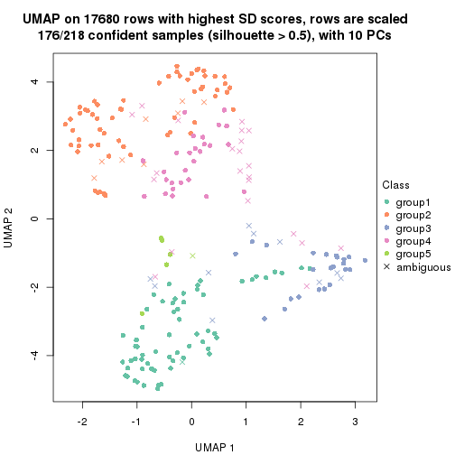</p>

</div>
<div id='tab-SD-hclust-dimension-reduction-5'>
<pre><code class="r">dimension_reduction(res, k = 6, method = &quot;UMAP&quot;)
</code></pre>

<p></p>

</div>
</div>


Following heatmap shows how subgroups are split when increasing `k`:

```r
collect_classes(res)
```


If matrix rows can be associated to genes, consider to use `GO_Enrichment(res,
...)` to perform function enrichment for the signature genes.


 

---------------------------------------------------


### SD:kmeans**


The object with results only for a single top-value method and a single partition method 
can be extracted as:

```r
res = res_list["SD", "kmeans"]
# you can also extract it by
# res = res_list["SD:kmeans"]
```

A summary of `res` and all the functions that can be applied to it:

```r
res
```

```
#> A 'ConsensusPartition' object with k = 2, 3, 4, 5, 6.
#>   On a matrix with 17680 rows and 218 columns.
#>   Top rows (1000, 2000, 3000, 4000, 5000) are extracted by 'SD' method.
#>   Subgroups are detected by 'kmeans' method.
#>   Performed in total 1250 partitions by row resampling.
#>   Best k for subgroups seems to be 2.
#> 
#> Following methods can be applied to this 'ConsensusPartition' object:
#>  [1] "cola_report"             "collect_classes"         "collect_plots"          
#>  [4] "collect_stats"           "colnames"                "compare_signatures"     
#>  [7] "consensus_heatmap"       "dimension_reduction"     "functional_enrichment"  
#> [10] "get_anno_col"            "get_anno"                "get_classes"            
#> [13] "get_consensus"           "get_matrix"              "get_membership"         
#> [16] "get_param"               "get_signatures"          "get_stats"              
#> [19] "is_best_k"               "is_stable_k"             "membership_heatmap"     
#> [22] "ncol"                    "nrow"                    "plot_ecdf"              
#> [25] "rownames"                "select_partition_number" "show"                   
#> [28] "suggest_best_k"          "test_to_known_factors"
```

`collect_plots()` function collects all the plots made from `res` for all `k` (number of partitions)
into one single page to provide an easy and fast comparison between different `k`.

```r
collect_plots(res)
```

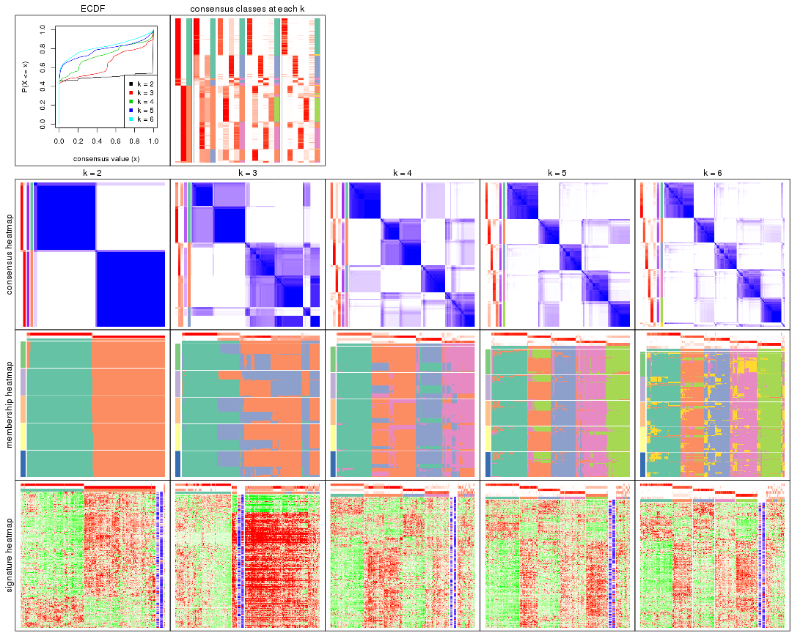

The plots are:

- The first row: a plot of the ECDF (Empirical cumulative distribution
  function) curves of the consensus matrix for each `k` and the heatmap of
  predicted classes for each `k`.
- The second row: heatmaps of the consensus matrix for each `k`.
- The third row: heatmaps of the membership matrix for each `k`.
- The fouth row: heatmaps of the signatures for each `k`.

All the plots in panels can be made by individual functions and they are
plotted later in this section.

`select_partition_number()` produces several plots showing different
statistics for choosing "optimized" `k`. There are following statistics:

- ECDF curves of the consensus matrix for each `k`;
- 1-PAC. [The PAC
  score](https://en.wikipedia.org/wiki/Consensus_clustering#Over-interpretation_potential_of_consensus_clustering)
  measures the proportion of the ambiguous subgrouping.
- Mean silhouette score.
- Concordance. The mean probability of fiting the consensus class ids in all
  partitions.
- Area increased. Denote $A_k$ as the area under the ECDF curve for current
  `k`, the area increased is defined as $A_k - A_{k-1}$.
- Rand index. The percent of pairs of samples that are both in a same cluster
  or both are not in a same cluster in the partition of k and k-1.
- Jaccard index. The ratio of pairs of samples are both in a same cluster in
  the partition of k and k-1 and the pairs of samples are both in a same
  cluster in the partition k or k-1.

The detailed explanations of these statistics can be found in [the cola
vignette](http://bioconductor.org/packages/devel/bioc/vignettes/cola/inst/doc/cola.html#toc_13).

Generally speaking, lower PAC score, higher mean silhouette score or higher
concordance corresponds to better partition. Rand index and Jaccard index
measure how similar the current partition is compared to partition with `k-1`.
If they are too similar, we won't accept `k` is better than `k-1`.

```r
select_partition_number(res)
```


The numeric values for all these statistics can be obtained by `get_stats()`.

```r
get_stats(res)
```

```
#>   k 1-PAC mean_silhouette concordance area_increased  Rand Jaccard
#> 2 2 1.000           0.975       0.990         0.5004 0.500   0.500
#> 3 3 0.655           0.470       0.700         0.2836 0.860   0.728
#> 4 4 0.660           0.741       0.816         0.1383 0.740   0.426
#> 5 5 0.789           0.794       0.846         0.0790 0.911   0.673
#> 6 6 0.771           0.694       0.806         0.0422 0.969   0.853
```

`suggest_best_k()` suggests the best $k$ based on these statistics. The rules are as follows:

- All $k$ with Jaccard index larger than 0.95 are removed because the increase of
  the partition number does not provides enough extra information. If all $k$ are removed,
  the best $k$ is assigned by `NA`.
- For $k$ with 1-PAC larger than 0.9, the maximal $k$ is taken as the "best k". Other $k$ is called "optional k".
- If it does not fit the second rule. The $k$ with the highest vote of highest
  1-PAC, mean silhouette and concordance is taken as the "best k".

```r
suggest_best_k(res)
```

```
#> [1] 2
```


Following shows the table of the partitions (You need to click the **show/hide
code output** link to see it). The membership matrix (columns with name `p*`)
is inferred by
[`clue::cl_consensus()`](https://www.rdocumentation.org/link/cl_consensus?package=clue)
function with the `SE` method. Basically the value in the membership matrix
represents the probability to belong to a certain group. The finall class
label for an item is determined with the group with highest probability it
belongs to.

In `get_classes()` function, the entropy is calculated from the membership
matrix and the silhouette score is calculated from the consensus matrix.


<script>
$( function() {
	$( '#tabs-SD-kmeans-get-classes' ).tabs();
} );
</script>
<div id='tabs-SD-kmeans-get-classes'>
<ul>
<li><a href='#tab-SD-kmeans-get-classes-1'>k = 2</a></li>
<li><a href='#tab-SD-kmeans-get-classes-2'>k = 3</a></li>
<li><a href='#tab-SD-kmeans-get-classes-3'>k = 4</a></li>
<li><a href='#tab-SD-kmeans-get-classes-4'>k = 5</a></li>
<li><a href='#tab-SD-kmeans-get-classes-5'>k = 6</a></li>
</ul>

<div id='tab-SD-kmeans-get-classes-1'>
<p><a id='tab-SD-kmeans-get-classes-1-a' style='color:#0366d6' href='#'>show/hide code output</a></p>
<pre><code class="r">cbind(get_classes(res, k = 2), get_membership(res, k = 2))
</code></pre>

<pre><code>#&gt;            class entropy silhouette    p1    p2
#&gt; SRR1498997     2   0.000      0.990 0.000 1.000
#&gt; SRR1076441     1   0.000      0.989 1.000 0.000
#&gt; SRR1489803     2   0.000      0.990 0.000 1.000
#&gt; SRR1345953     2   0.000      0.990 0.000 1.000
#&gt; SRR1357826     2   0.000      0.990 0.000 1.000
#&gt; SRR1419656     1   0.000      0.989 1.000 0.000
#&gt; SRR1454158     2   0.000      0.990 0.000 1.000
#&gt; SRR1475408     2   0.000      0.990 0.000 1.000
#&gt; SRR1472704     2   0.000      0.990 0.000 1.000
#&gt; SRR1090046     1   0.000      0.989 1.000 0.000
#&gt; SRR1312822     1   0.000      0.989 1.000 0.000
#&gt; SRR1096987     2   0.000      0.990 0.000 1.000
#&gt; SRR1334587     2   0.000      0.990 0.000 1.000
#&gt; SRR1490246     1   0.000      0.989 1.000 0.000
#&gt; SRR1467522     1   0.000      0.989 1.000 0.000
#&gt; SRR1324206     1   0.000      0.989 1.000 0.000
#&gt; SRR1408574     2   0.000      0.990 0.000 1.000
#&gt; SRR1083959     2   0.000      0.990 0.000 1.000
#&gt; SRR1079948     2   0.000      0.990 0.000 1.000
#&gt; SRR1310667     2   0.000      0.990 0.000 1.000
#&gt; SRR655852      2   0.000      0.990 0.000 1.000
#&gt; SRR1352457     2   0.000      0.990 0.000 1.000
#&gt; SRR1353994     2   0.000      0.990 0.000 1.000
#&gt; SRR1459561     2   0.000      0.990 0.000 1.000
#&gt; SRR1454009     1   0.000      0.989 1.000 0.000
#&gt; SRR1071084     1   0.000      0.989 1.000 0.000
#&gt; SRR1082859     2   0.000      0.990 0.000 1.000
#&gt; SRR1086538     1   0.000      0.989 1.000 0.000
#&gt; SRR1486262     2   0.000      0.990 0.000 1.000
#&gt; SRR658105      1   0.000      0.989 1.000 0.000
#&gt; SRR811073      2   0.000      0.990 0.000 1.000
#&gt; SRR1429181     2   0.000      0.990 0.000 1.000
#&gt; SRR1327896     2   0.000      0.990 0.000 1.000
#&gt; SRR1464788     2   0.000      0.990 0.000 1.000
#&gt; SRR1346861     2   0.000      0.990 0.000 1.000
#&gt; SRR1318774     2   0.000      0.990 0.000 1.000
#&gt; SRR1420517     1   0.000      0.989 1.000 0.000
#&gt; SRR1369584     2   0.000      0.990 0.000 1.000
#&gt; SRR1443244     1   0.722      0.756 0.800 0.200
#&gt; SRR1455391     1   0.000      0.989 1.000 0.000
#&gt; SRR1068999     1   0.000      0.989 1.000 0.000
#&gt; SRR1481297     1   0.000      0.989 1.000 0.000
#&gt; SRR1070208     1   0.000      0.989 1.000 0.000
#&gt; SRR1317282     1   0.000      0.989 1.000 0.000
#&gt; SRR1096125     2   0.000      0.990 0.000 1.000
#&gt; SRR1472506     1   0.714      0.762 0.804 0.196
#&gt; SRR1388281     2   0.000      0.990 0.000 1.000
#&gt; SRR1365622     2   0.000      0.990 0.000 1.000
#&gt; SRR662306      1   0.000      0.989 1.000 0.000
#&gt; SRR662811      1   0.000      0.989 1.000 0.000
#&gt; SRR820571      1   0.714      0.762 0.804 0.196
#&gt; SRR1357166     1   0.000      0.989 1.000 0.000
#&gt; SRR1488586     1   0.000      0.989 1.000 0.000
#&gt; SRR1485398     1   0.000      0.989 1.000 0.000
#&gt; SRR1417725     2   0.000      0.990 0.000 1.000
#&gt; SRR1409397     2   0.000      0.990 0.000 1.000
#&gt; SRR1465693     2   0.000      0.990 0.000 1.000
#&gt; SRR1096547     1   0.373      0.917 0.928 0.072
#&gt; SRR1456818     1   0.000      0.989 1.000 0.000
#&gt; SRR816336      1   0.000      0.989 1.000 0.000
#&gt; SRR1420238     1   0.000      0.989 1.000 0.000
#&gt; SRR1433374     1   0.000      0.989 1.000 0.000
#&gt; SRR1436990     1   0.000      0.989 1.000 0.000
#&gt; SRR662378      1   0.000      0.989 1.000 0.000
#&gt; SRR1477671     1   0.000      0.989 1.000 0.000
#&gt; SRR1084079     2   0.913      0.505 0.328 0.672
#&gt; SRR1102949     1   0.000      0.989 1.000 0.000
#&gt; SRR1458090     1   0.000      0.989 1.000 0.000
#&gt; SRR1418729     2   0.000      0.990 0.000 1.000
#&gt; SRR1403814     2   0.000      0.990 0.000 1.000
#&gt; SRR1404887     1   0.722      0.756 0.800 0.200
#&gt; SRR1434955     1   0.000      0.989 1.000 0.000
#&gt; SRR1360652     1   0.000      0.989 1.000 0.000
#&gt; SRR1356765     2   0.000      0.990 0.000 1.000
#&gt; SRR1078258     2   0.000      0.990 0.000 1.000
#&gt; SRR1455861     1   0.000      0.989 1.000 0.000
#&gt; SRR1420296     2   0.000      0.990 0.000 1.000
#&gt; SRR1070260     2   0.000      0.990 0.000 1.000
#&gt; SRR1410765     1   0.000      0.989 1.000 0.000
#&gt; SRR1481315     1   0.000      0.989 1.000 0.000
#&gt; SRR1414661     2   0.000      0.990 0.000 1.000
#&gt; SRR1359147     2   0.000      0.990 0.000 1.000
#&gt; SRR1488694     1   0.000      0.989 1.000 0.000
#&gt; SRR1477273     1   0.000      0.989 1.000 0.000
#&gt; SRR1415792     1   0.000      0.989 1.000 0.000
#&gt; SRR1369088     2   0.000      0.990 0.000 1.000
#&gt; SRR1406621     2   0.000      0.990 0.000 1.000
#&gt; SRR1401017     2   0.000      0.990 0.000 1.000
#&gt; SRR1099981     2   0.000      0.990 0.000 1.000
#&gt; SRR815208      2   0.000      0.990 0.000 1.000
#&gt; SRR1380460     2   0.000      0.990 0.000 1.000
#&gt; SRR1091097     2   0.000      0.990 0.000 1.000
#&gt; SRR1456010     1   0.000      0.989 1.000 0.000
#&gt; SRR1498416     2   0.000      0.990 0.000 1.000
#&gt; SRR818873      2   0.000      0.990 0.000 1.000
#&gt; SRR813868      2   0.000      0.990 0.000 1.000
#&gt; SRR1394912     1   0.000      0.989 1.000 0.000
#&gt; SRR1475824     2   0.000      0.990 0.000 1.000
#&gt; SRR1459866     1   0.000      0.989 1.000 0.000
#&gt; SRR1364871     2   0.991      0.189 0.444 0.556
#&gt; SRR1100472     2   0.000      0.990 0.000 1.000
#&gt; SRR1331267     1   0.000      0.989 1.000 0.000
#&gt; SRR1068977     2   0.000      0.990 0.000 1.000
#&gt; SRR1391511     2   0.000      0.990 0.000 1.000
#&gt; SRR1077920     2   0.000      0.990 0.000 1.000
#&gt; SRR1457705     1   0.000      0.989 1.000 0.000
#&gt; SRR1437073     1   0.000      0.989 1.000 0.000
#&gt; SRR1473124     1   0.000      0.989 1.000 0.000
#&gt; SRR1469279     1   0.000      0.989 1.000 0.000
#&gt; SRR1091791     2   0.000      0.990 0.000 1.000
#&gt; SRR1341539     2   0.000      0.990 0.000 1.000
#&gt; SRR1446354     1   0.000      0.989 1.000 0.000
#&gt; SRR1415420     1   0.000      0.989 1.000 0.000
#&gt; SRR1368050     1   0.000      0.989 1.000 0.000
#&gt; SRR656970      2   0.000      0.990 0.000 1.000
#&gt; SRR1473403     2   0.000      0.990 0.000 1.000
#&gt; SRR1084674     1   0.000      0.989 1.000 0.000
#&gt; SRR1464702     1   0.000      0.989 1.000 0.000
#&gt; SRR1074860     2   0.000      0.990 0.000 1.000
#&gt; SRR655447      2   0.000      0.990 0.000 1.000
#&gt; SRR1404442     2   0.000      0.990 0.000 1.000
#&gt; SRR1418795     1   0.000      0.989 1.000 0.000
#&gt; SRR1458335     2   0.000      0.990 0.000 1.000
#&gt; SRR1489589     2   0.000      0.990 0.000 1.000
#&gt; SRR1378284     1   0.000      0.989 1.000 0.000
#&gt; SRR1408014     2   0.000      0.990 0.000 1.000
#&gt; SRR1083052     1   0.000      0.989 1.000 0.000
#&gt; SRR1339236     2   0.000      0.990 0.000 1.000
#&gt; SRR1323829     2   0.000      0.990 0.000 1.000
#&gt; SRR1086772     2   0.000      0.990 0.000 1.000
#&gt; SRR1486457     1   0.000      0.989 1.000 0.000
#&gt; SRR1415257     2   0.000      0.990 0.000 1.000
#&gt; SRR1071905     1   0.000      0.989 1.000 0.000
#&gt; SRR659223      2   0.000      0.990 0.000 1.000
#&gt; SRR1386945     1   0.000      0.989 1.000 0.000
#&gt; SRR821498      2   0.000      0.990 0.000 1.000
#&gt; SRR1378903     2   0.000      0.990 0.000 1.000
#&gt; SRR1472907     1   0.000      0.989 1.000 0.000
#&gt; SRR1442313     2   0.000      0.990 0.000 1.000
#&gt; SRR1077139     2   0.000      0.990 0.000 1.000
#&gt; SRR1342758     1   0.000      0.989 1.000 0.000
#&gt; SRR656911      2   0.000      0.990 0.000 1.000
#&gt; SRR1070738     1   0.000      0.989 1.000 0.000
#&gt; SRR1476950     1   0.000      0.989 1.000 0.000
#&gt; SRR1488196     1   0.000      0.989 1.000 0.000
#&gt; SRR1498951     1   0.000      0.989 1.000 0.000
#&gt; SRR1413392     1   0.000      0.989 1.000 0.000
#&gt; SRR657528      2   0.000      0.990 0.000 1.000
#&gt; SRR812198      1   0.000      0.989 1.000 0.000
#&gt; SRR660283      2   0.000      0.990 0.000 1.000
#&gt; SRR1420936     1   0.000      0.989 1.000 0.000
#&gt; SRR1469547     2   0.000      0.990 0.000 1.000
#&gt; SRR1322249     1   0.000      0.989 1.000 0.000
#&gt; SRR1396682     1   0.000      0.989 1.000 0.000
#&gt; SRR1095816     2   0.000      0.990 0.000 1.000
#&gt; SRR1081023     1   0.000      0.989 1.000 0.000
#&gt; SRR1092517     2   0.000      0.990 0.000 1.000
#&gt; SRR811285      2   0.000      0.990 0.000 1.000
#&gt; SRR657018      1   0.000      0.989 1.000 0.000
#&gt; SRR1365534     1   0.000      0.989 1.000 0.000
#&gt; SRR1090791     2   0.000      0.990 0.000 1.000
#&gt; SRR1439915     2   0.000      0.990 0.000 1.000
#&gt; SRR1391575     2   0.000      0.990 0.000 1.000
#&gt; SRR1314092     2   0.000      0.990 0.000 1.000
#&gt; SRR1328941     1   0.000      0.989 1.000 0.000
#&gt; SRR1336181     2   0.000      0.990 0.000 1.000
#&gt; SRR1362972     1   0.000      0.989 1.000 0.000
#&gt; SRR1366790     2   0.000      0.990 0.000 1.000
#&gt; SRR1455902     1   0.000      0.989 1.000 0.000
#&gt; SRR1437644     2   0.943      0.430 0.360 0.640
#&gt; SRR1105009     2   0.000      0.990 0.000 1.000
#&gt; SRR1367024     1   0.000      0.989 1.000 0.000
#&gt; SRR660248      2   0.000      0.990 0.000 1.000
#&gt; SRR1409620     1   0.000      0.989 1.000 0.000
#&gt; SRR1455807     2   0.000      0.990 0.000 1.000
#&gt; SRR1339431     1   0.000      0.989 1.000 0.000
#&gt; SRR1378948     1   0.767      0.719 0.776 0.224
#&gt; SRR1469237     1   0.000      0.989 1.000 0.000
#&gt; SRR1098264     2   0.000      0.990 0.000 1.000
#&gt; SRR1406224     2   0.000      0.990 0.000 1.000
#&gt; SRR1393026     1   0.000      0.989 1.000 0.000
#&gt; SRR808428      2   0.000      0.990 0.000 1.000
#&gt; SRR615910      2   0.000      0.990 0.000 1.000
#&gt; SRR1076219     1   0.000      0.989 1.000 0.000
#&gt; SRR1481128     1   0.000      0.989 1.000 0.000
#&gt; SRR1359262     2   0.000      0.990 0.000 1.000
#&gt; SRR1407648     2   0.000      0.990 0.000 1.000
#&gt; SRR1386775     1   0.000      0.989 1.000 0.000
#&gt; SRR1388399     1   0.000      0.989 1.000 0.000
#&gt; SRR1361499     2   0.000      0.990 0.000 1.000
#&gt; SRR1500709     2   0.000      0.990 0.000 1.000
#&gt; SRR1335917     1   0.000      0.989 1.000 0.000
#&gt; SRR1430615     2   0.000      0.990 0.000 1.000
#&gt; SRR1335212     1   0.000      0.989 1.000 0.000
#&gt; SRR1400159     2   0.000      0.990 0.000 1.000
#&gt; SRR1457245     2   0.000      0.990 0.000 1.000
#&gt; SRR1356746     2   0.000      0.990 0.000 1.000
#&gt; SRR658319      2   0.000      0.990 0.000 1.000
#&gt; SRR1435946     1   0.000      0.989 1.000 0.000
#&gt; SRR1370308     1   0.000      0.989 1.000 0.000
#&gt; SRR1100893     1   0.000      0.989 1.000 0.000
#&gt; SRR1389432     1   0.000      0.989 1.000 0.000
#&gt; SRR1381799     2   0.000      0.990 0.000 1.000
#&gt; SRR1310158     1   0.000      0.989 1.000 0.000
#&gt; SRR1341100     2   0.000      0.990 0.000 1.000
#&gt; SRR1342873     1   0.000      0.989 1.000 0.000
#&gt; SRR1472102     2   0.000      0.990 0.000 1.000
#&gt; SRR1409421     1   0.000      0.989 1.000 0.000
#&gt; SRR1328577     2   0.000      0.990 0.000 1.000
#&gt; SRR808942      2   0.000      0.990 0.000 1.000
#&gt; SRR1343818     2   0.000      0.990 0.000 1.000
#&gt; SRR1472415     2   0.000      0.990 0.000 1.000
#&gt; SRR658409      2   0.000      0.990 0.000 1.000
#&gt; SRR1469681     1   0.000      0.989 1.000 0.000
#&gt; SRR1075484     2   0.000      0.990 0.000 1.000
#&gt; SRR1417894     1   0.000      0.989 1.000 0.000
#&gt; SRR1417422     2   0.000      0.990 0.000 1.000
#&gt; SRR1090674     1   0.000      0.989 1.000 0.000
</code></pre>

<script>
$('#tab-SD-kmeans-get-classes-1-a').parent().next().next().hide();
$('#tab-SD-kmeans-get-classes-1-a').click(function(){
  $('#tab-SD-kmeans-get-classes-1-a').parent().next().next().toggle();
  return(false);
});
</script>
</div>

<div id='tab-SD-kmeans-get-classes-2'>
<p><a id='tab-SD-kmeans-get-classes-2-a' style='color:#0366d6' href='#'>show/hide code output</a></p>
<pre><code class="r">cbind(get_classes(res, k = 3), get_membership(res, k = 3))
</code></pre>

<pre><code>#&gt;            class entropy silhouette    p1    p2    p3
#&gt; SRR1498997     2  0.6215     0.4313 0.000 0.572 0.428
#&gt; SRR1076441     1  0.0000     0.8038 1.000 0.000 0.000
#&gt; SRR1489803     3  0.6308    -0.3437 0.000 0.492 0.508
#&gt; SRR1345953     2  0.6215     0.4313 0.000 0.572 0.428
#&gt; SRR1357826     2  0.6215     0.4313 0.000 0.572 0.428
#&gt; SRR1419656     1  0.6168     0.6630 0.588 0.000 0.412
#&gt; SRR1454158     2  0.6235     0.4178 0.000 0.564 0.436
#&gt; SRR1475408     2  0.6235    -0.1263 0.000 0.564 0.436
#&gt; SRR1472704     2  0.6215     0.4313 0.000 0.572 0.428
#&gt; SRR1090046     3  0.8747    -0.4957 0.396 0.112 0.492
#&gt; SRR1312822     1  0.0000     0.8038 1.000 0.000 0.000
#&gt; SRR1096987     2  0.0747     0.4905 0.000 0.984 0.016
#&gt; SRR1334587     3  0.6308    -0.3437 0.000 0.492 0.508
#&gt; SRR1490246     1  0.0000     0.8038 1.000 0.000 0.000
#&gt; SRR1467522     1  0.0000     0.8038 1.000 0.000 0.000
#&gt; SRR1324206     1  0.0000     0.8038 1.000 0.000 0.000
#&gt; SRR1408574     2  0.2537     0.4646 0.000 0.920 0.080
#&gt; SRR1083959     2  0.6215     0.4313 0.000 0.572 0.428
#&gt; SRR1079948     2  0.0000     0.4946 0.000 1.000 0.000
#&gt; SRR1310667     3  0.6308    -0.3437 0.000 0.492 0.508
#&gt; SRR655852      2  0.0000     0.4946 0.000 1.000 0.000
#&gt; SRR1352457     2  0.6308     0.3375 0.000 0.508 0.492
#&gt; SRR1353994     2  0.6215     0.4313 0.000 0.572 0.428
#&gt; SRR1459561     3  0.6308    -0.3437 0.000 0.492 0.508
#&gt; SRR1454009     1  0.6308     0.6265 0.508 0.000 0.492
#&gt; SRR1071084     1  0.6308     0.6265 0.508 0.000 0.492
#&gt; SRR1082859     2  0.6215     0.4313 0.000 0.572 0.428
#&gt; SRR1086538     1  0.0000     0.8038 1.000 0.000 0.000
#&gt; SRR1486262     2  0.0000     0.4946 0.000 1.000 0.000
#&gt; SRR658105      1  0.0000     0.8038 1.000 0.000 0.000
#&gt; SRR811073      2  0.6215     0.4313 0.000 0.572 0.428
#&gt; SRR1429181     2  0.2537     0.4646 0.000 0.920 0.080
#&gt; SRR1327896     2  0.0000     0.4946 0.000 1.000 0.000
#&gt; SRR1464788     2  0.6244     0.3958 0.000 0.560 0.440
#&gt; SRR1346861     2  0.6215     0.4313 0.000 0.572 0.428
#&gt; SRR1318774     2  0.5988     0.4448 0.000 0.632 0.368
#&gt; SRR1420517     1  0.6308     0.6265 0.508 0.000 0.492
#&gt; SRR1369584     3  0.6309    -0.3497 0.000 0.496 0.504
#&gt; SRR1443244     2  0.9231    -0.1225 0.308 0.512 0.180
#&gt; SRR1455391     1  0.0000     0.8038 1.000 0.000 0.000
#&gt; SRR1068999     1  0.0000     0.8038 1.000 0.000 0.000
#&gt; SRR1481297     1  0.6307     0.6288 0.512 0.000 0.488
#&gt; SRR1070208     1  0.5905     0.6850 0.648 0.000 0.352
#&gt; SRR1317282     1  0.6308     0.6265 0.508 0.000 0.492
#&gt; SRR1096125     2  0.0000     0.4946 0.000 1.000 0.000
#&gt; SRR1472506     3  0.7729     0.2385 0.048 0.436 0.516
#&gt; SRR1388281     2  0.6215     0.4313 0.000 0.572 0.428
#&gt; SRR1365622     2  0.2537     0.4646 0.000 0.920 0.080
#&gt; SRR662306      1  0.6307     0.6288 0.512 0.000 0.488
#&gt; SRR662811      1  0.0000     0.8038 1.000 0.000 0.000
#&gt; SRR820571      3  0.7722     0.2376 0.048 0.432 0.520
#&gt; SRR1357166     1  0.6225     0.6533 0.568 0.000 0.432
#&gt; SRR1488586     3  0.9437    -0.0993 0.208 0.300 0.492
#&gt; SRR1485398     1  0.0000     0.8038 1.000 0.000 0.000
#&gt; SRR1417725     2  0.6286    -0.1913 0.000 0.536 0.464
#&gt; SRR1409397     3  0.6308    -0.3437 0.000 0.492 0.508
#&gt; SRR1465693     3  0.6308    -0.3437 0.000 0.492 0.508
#&gt; SRR1096547     3  0.7801     0.2319 0.052 0.428 0.520
#&gt; SRR1456818     1  0.0000     0.8038 1.000 0.000 0.000
#&gt; SRR816336      3  0.9303    -0.0482 0.184 0.316 0.500
#&gt; SRR1420238     1  0.0000     0.8038 1.000 0.000 0.000
#&gt; SRR1433374     1  0.6308     0.6265 0.508 0.000 0.492
#&gt; SRR1436990     1  0.0000     0.8038 1.000 0.000 0.000
#&gt; SRR662378      1  0.0000     0.8038 1.000 0.000 0.000
#&gt; SRR1477671     1  0.0000     0.8038 1.000 0.000 0.000
#&gt; SRR1084079     2  0.6777    -0.0999 0.020 0.616 0.364
#&gt; SRR1102949     1  0.0000     0.8038 1.000 0.000 0.000
#&gt; SRR1458090     1  0.0000     0.8038 1.000 0.000 0.000
#&gt; SRR1418729     2  0.4062     0.5077 0.000 0.836 0.164
#&gt; SRR1403814     2  0.0747     0.4905 0.000 0.984 0.016
#&gt; SRR1404887     2  0.9159    -0.1177 0.328 0.508 0.164
#&gt; SRR1434955     1  0.0000     0.8038 1.000 0.000 0.000
#&gt; SRR1360652     1  0.0000     0.8038 1.000 0.000 0.000
#&gt; SRR1356765     2  0.4291     0.4913 0.000 0.820 0.180
#&gt; SRR1078258     2  0.1860     0.5036 0.000 0.948 0.052
#&gt; SRR1455861     1  0.0000     0.8038 1.000 0.000 0.000
#&gt; SRR1420296     3  0.6308    -0.3437 0.000 0.492 0.508
#&gt; SRR1070260     2  0.6215     0.4313 0.000 0.572 0.428
#&gt; SRR1410765     1  0.0000     0.8038 1.000 0.000 0.000
#&gt; SRR1481315     1  0.0000     0.8038 1.000 0.000 0.000
#&gt; SRR1414661     2  0.6215     0.4313 0.000 0.572 0.428
#&gt; SRR1359147     2  0.0000     0.4946 0.000 1.000 0.000
#&gt; SRR1488694     1  0.5982     0.4218 0.668 0.328 0.004
#&gt; SRR1477273     1  0.6308     0.6265 0.508 0.000 0.492
#&gt; SRR1415792     1  0.6307     0.6288 0.512 0.000 0.488
#&gt; SRR1369088     2  0.6302    -0.1763 0.000 0.520 0.480
#&gt; SRR1406621     2  0.2537     0.4646 0.000 0.920 0.080
#&gt; SRR1401017     2  0.6095     0.4325 0.000 0.608 0.392
#&gt; SRR1099981     2  0.2625     0.4665 0.000 0.916 0.084
#&gt; SRR815208      2  0.6215     0.4313 0.000 0.572 0.428
#&gt; SRR1380460     2  0.0237     0.4961 0.000 0.996 0.004
#&gt; SRR1091097     2  0.0000     0.4946 0.000 1.000 0.000
#&gt; SRR1456010     1  0.6308     0.6265 0.508 0.000 0.492
#&gt; SRR1498416     2  0.6062     0.4393 0.000 0.616 0.384
#&gt; SRR818873      2  0.6291     0.3707 0.000 0.532 0.468
#&gt; SRR813868      2  0.1289     0.4893 0.000 0.968 0.032
#&gt; SRR1394912     1  0.0000     0.8038 1.000 0.000 0.000
#&gt; SRR1475824     2  0.1411     0.4837 0.000 0.964 0.036
#&gt; SRR1459866     1  0.0000     0.8038 1.000 0.000 0.000
#&gt; SRR1364871     3  0.7466     0.2515 0.036 0.444 0.520
#&gt; SRR1100472     2  0.6215     0.4313 0.000 0.572 0.428
#&gt; SRR1331267     1  0.2796     0.7319 0.908 0.092 0.000
#&gt; SRR1068977     2  0.2537     0.4646 0.000 0.920 0.080
#&gt; SRR1391511     2  0.6215     0.4313 0.000 0.572 0.428
#&gt; SRR1077920     2  0.6215     0.4313 0.000 0.572 0.428
#&gt; SRR1457705     1  0.6308     0.6265 0.508 0.000 0.492
#&gt; SRR1437073     1  0.0000     0.8038 1.000 0.000 0.000
#&gt; SRR1473124     1  0.6308     0.6265 0.508 0.000 0.492
#&gt; SRR1469279     1  0.6307     0.6288 0.512 0.000 0.488
#&gt; SRR1091791     2  0.0747     0.4905 0.000 0.984 0.016
#&gt; SRR1341539     2  0.3192     0.4794 0.000 0.888 0.112
#&gt; SRR1446354     1  0.6308     0.6265 0.508 0.000 0.492
#&gt; SRR1415420     1  0.0000     0.8038 1.000 0.000 0.000
#&gt; SRR1368050     1  0.0000     0.8038 1.000 0.000 0.000
#&gt; SRR656970      3  0.6308    -0.3437 0.000 0.492 0.508
#&gt; SRR1473403     2  0.1860     0.5036 0.000 0.948 0.052
#&gt; SRR1084674     1  0.6308     0.6265 0.508 0.000 0.492
#&gt; SRR1464702     1  0.0000     0.8038 1.000 0.000 0.000
#&gt; SRR1074860     2  0.0592     0.4919 0.000 0.988 0.012
#&gt; SRR655447      2  0.0237     0.4965 0.000 0.996 0.004
#&gt; SRR1404442     2  0.6215     0.4313 0.000 0.572 0.428
#&gt; SRR1418795     1  0.0000     0.8038 1.000 0.000 0.000
#&gt; SRR1458335     2  0.3941     0.5099 0.000 0.844 0.156
#&gt; SRR1489589     3  0.6308    -0.3437 0.000 0.492 0.508
#&gt; SRR1378284     1  0.7898     0.6446 0.652 0.116 0.232
#&gt; SRR1408014     3  0.6308    -0.3437 0.000 0.492 0.508
#&gt; SRR1083052     1  0.0000     0.8038 1.000 0.000 0.000
#&gt; SRR1339236     3  0.6307     0.1817 0.000 0.488 0.512
#&gt; SRR1323829     2  0.6308     0.3375 0.000 0.508 0.492
#&gt; SRR1086772     2  0.6215     0.4313 0.000 0.572 0.428
#&gt; SRR1486457     1  0.6308     0.6265 0.508 0.000 0.492
#&gt; SRR1415257     3  0.6308    -0.3437 0.000 0.492 0.508
#&gt; SRR1071905     1  0.6307     0.6288 0.512 0.000 0.488
#&gt; SRR659223      2  0.6308     0.3375 0.000 0.508 0.492
#&gt; SRR1386945     1  0.6308     0.6265 0.508 0.000 0.492
#&gt; SRR821498      2  0.1163     0.4866 0.000 0.972 0.028
#&gt; SRR1378903     2  0.0000     0.4946 0.000 1.000 0.000
#&gt; SRR1472907     1  0.6308     0.6265 0.508 0.000 0.492
#&gt; SRR1442313     2  0.6215     0.4313 0.000 0.572 0.428
#&gt; SRR1077139     2  0.6308     0.3375 0.000 0.508 0.492
#&gt; SRR1342758     1  0.0000     0.8038 1.000 0.000 0.000
#&gt; SRR656911      2  0.1163     0.4907 0.000 0.972 0.028
#&gt; SRR1070738     1  0.0000     0.8038 1.000 0.000 0.000
#&gt; SRR1476950     1  0.1860     0.7894 0.948 0.000 0.052
#&gt; SRR1488196     1  0.6308     0.6265 0.508 0.000 0.492
#&gt; SRR1498951     1  0.6308     0.6265 0.508 0.000 0.492
#&gt; SRR1413392     1  0.0000     0.8038 1.000 0.000 0.000
#&gt; SRR657528      2  0.4842     0.4903 0.000 0.776 0.224
#&gt; SRR812198      1  0.0000     0.8038 1.000 0.000 0.000
#&gt; SRR660283      2  0.6215     0.4313 0.000 0.572 0.428
#&gt; SRR1420936     1  0.0000     0.8038 1.000 0.000 0.000
#&gt; SRR1469547     2  0.6225     0.4262 0.000 0.568 0.432
#&gt; SRR1322249     1  0.0000     0.8038 1.000 0.000 0.000
#&gt; SRR1396682     1  0.0000     0.8038 1.000 0.000 0.000
#&gt; SRR1095816     2  0.0000     0.4946 0.000 1.000 0.000
#&gt; SRR1081023     1  0.0000     0.8038 1.000 0.000 0.000
#&gt; SRR1092517     2  0.3752     0.5099 0.000 0.856 0.144
#&gt; SRR811285      2  0.6079     0.4346 0.000 0.612 0.388
#&gt; SRR657018      1  0.0000     0.8038 1.000 0.000 0.000
#&gt; SRR1365534     1  0.6308     0.6265 0.508 0.000 0.492
#&gt; SRR1090791     3  0.6308    -0.3437 0.000 0.492 0.508
#&gt; SRR1439915     2  0.6305     0.3515 0.000 0.516 0.484
#&gt; SRR1391575     2  0.5835    -0.0281 0.000 0.660 0.340
#&gt; SRR1314092     2  0.4062     0.5078 0.000 0.836 0.164
#&gt; SRR1328941     1  0.6308     0.6265 0.508 0.000 0.492
#&gt; SRR1336181     2  0.6215     0.4313 0.000 0.572 0.428
#&gt; SRR1362972     1  0.0000     0.8038 1.000 0.000 0.000
#&gt; SRR1366790     2  0.4346     0.5076 0.000 0.816 0.184
#&gt; SRR1455902     1  0.6308     0.6265 0.508 0.000 0.492
#&gt; SRR1437644     3  0.7555     0.2475 0.040 0.440 0.520
#&gt; SRR1105009     2  0.6215     0.4313 0.000 0.572 0.428
#&gt; SRR1367024     1  0.6308     0.6265 0.508 0.000 0.492
#&gt; SRR660248      2  0.3879     0.5079 0.000 0.848 0.152
#&gt; SRR1409620     1  0.0000     0.8038 1.000 0.000 0.000
#&gt; SRR1455807     2  0.6225     0.4262 0.000 0.568 0.432
#&gt; SRR1339431     1  0.0000     0.8038 1.000 0.000 0.000
#&gt; SRR1378948     3  0.7729     0.2385 0.048 0.436 0.516
#&gt; SRR1469237     1  0.0000     0.8038 1.000 0.000 0.000
#&gt; SRR1098264     2  0.6215     0.4313 0.000 0.572 0.428
#&gt; SRR1406224     2  0.4555     0.4914 0.000 0.800 0.200
#&gt; SRR1393026     1  0.6302     0.6325 0.520 0.000 0.480
#&gt; SRR808428      2  0.6215     0.4313 0.000 0.572 0.428
#&gt; SRR615910      3  0.6308    -0.3437 0.000 0.492 0.508
#&gt; SRR1076219     1  0.2959     0.7749 0.900 0.000 0.100
#&gt; SRR1481128     1  0.0000     0.8038 1.000 0.000 0.000
#&gt; SRR1359262     3  0.6308    -0.3437 0.000 0.492 0.508
#&gt; SRR1407648     2  0.0000     0.4946 0.000 1.000 0.000
#&gt; SRR1386775     3  0.8322     0.1852 0.080 0.428 0.492
#&gt; SRR1388399     3  0.8039     0.2136 0.064 0.428 0.508
#&gt; SRR1361499     2  0.6215     0.4313 0.000 0.572 0.428
#&gt; SRR1500709     2  0.0424     0.4930 0.000 0.992 0.008
#&gt; SRR1335917     1  0.0000     0.8038 1.000 0.000 0.000
#&gt; SRR1430615     3  0.6308    -0.3437 0.000 0.492 0.508
#&gt; SRR1335212     1  0.6154     0.6629 0.592 0.000 0.408
#&gt; SRR1400159     3  0.6225     0.2368 0.000 0.432 0.568
#&gt; SRR1457245     2  0.6215     0.4313 0.000 0.572 0.428
#&gt; SRR1356746     2  0.6225     0.4262 0.000 0.568 0.432
#&gt; SRR658319      2  0.6192     0.4290 0.000 0.580 0.420
#&gt; SRR1435946     1  0.0000     0.8038 1.000 0.000 0.000
#&gt; SRR1370308     1  0.0000     0.8038 1.000 0.000 0.000
#&gt; SRR1100893     1  0.0000     0.8038 1.000 0.000 0.000
#&gt; SRR1389432     1  0.6225     0.6533 0.568 0.000 0.432
#&gt; SRR1381799     2  0.6215     0.4313 0.000 0.572 0.428
#&gt; SRR1310158     1  0.6308     0.6265 0.508 0.000 0.492
#&gt; SRR1341100     2  0.5859    -0.0188 0.000 0.656 0.344
#&gt; SRR1342873     1  0.5327     0.7152 0.728 0.000 0.272
#&gt; SRR1472102     2  0.5529     0.4716 0.000 0.704 0.296
#&gt; SRR1409421     1  0.6307     0.6288 0.512 0.000 0.488
#&gt; SRR1328577     2  0.5650     0.4656 0.000 0.688 0.312
#&gt; SRR808942      2  0.6180     0.4332 0.000 0.584 0.416
#&gt; SRR1343818     2  0.0000     0.4946 0.000 1.000 0.000
#&gt; SRR1472415     2  0.6215     0.4313 0.000 0.572 0.428
#&gt; SRR658409      2  0.0000     0.4946 0.000 1.000 0.000
#&gt; SRR1469681     1  0.0000     0.8038 1.000 0.000 0.000
#&gt; SRR1075484     2  0.6305     0.3517 0.000 0.516 0.484
#&gt; SRR1417894     1  0.6308     0.6265 0.508 0.000 0.492
#&gt; SRR1417422     2  0.6308     0.3405 0.000 0.508 0.492
#&gt; SRR1090674     1  0.0000     0.8038 1.000 0.000 0.000
</code></pre>

<script>
$('#tab-SD-kmeans-get-classes-2-a').parent().next().next().hide();
$('#tab-SD-kmeans-get-classes-2-a').click(function(){
  $('#tab-SD-kmeans-get-classes-2-a').parent().next().next().toggle();
  return(false);
});
</script>
</div>

<div id='tab-SD-kmeans-get-classes-3'>
<p><a id='tab-SD-kmeans-get-classes-3-a' style='color:#0366d6' href='#'>show/hide code output</a></p>
<pre><code class="r">cbind(get_classes(res, k = 4), get_membership(res, k = 4))
</code></pre>

<pre><code>#&gt;            class entropy silhouette    p1    p2    p3    p4
#&gt; SRR1498997     2  0.0000     0.7579 0.000 1.000 0.000 0.000
#&gt; SRR1076441     1  0.4011     0.9709 0.784 0.000 0.208 0.008
#&gt; SRR1489803     2  0.6563     0.6807 0.208 0.632 0.000 0.160
#&gt; SRR1345953     2  0.2216     0.6795 0.000 0.908 0.000 0.092
#&gt; SRR1357826     2  0.0000     0.7579 0.000 1.000 0.000 0.000
#&gt; SRR1419656     3  0.2021     0.8707 0.012 0.000 0.932 0.056
#&gt; SRR1454158     2  0.0779     0.7526 0.004 0.980 0.000 0.016
#&gt; SRR1475408     4  0.6583     0.3232 0.044 0.020 0.388 0.548
#&gt; SRR1472704     2  0.0000     0.7579 0.000 1.000 0.000 0.000
#&gt; SRR1090046     3  0.3266     0.7505 0.000 0.000 0.832 0.168
#&gt; SRR1312822     1  0.3688     0.9744 0.792 0.000 0.208 0.000
#&gt; SRR1096987     4  0.3801     0.7514 0.000 0.220 0.000 0.780
#&gt; SRR1334587     2  0.6563     0.6807 0.208 0.632 0.000 0.160
#&gt; SRR1490246     1  0.3688     0.9744 0.792 0.000 0.208 0.000
#&gt; SRR1467522     1  0.4361     0.9675 0.772 0.000 0.208 0.020
#&gt; SRR1324206     1  0.4011     0.9725 0.784 0.000 0.208 0.008
#&gt; SRR1408574     4  0.6032     0.5021 0.208 0.100 0.004 0.688
#&gt; SRR1083959     2  0.0000     0.7579 0.000 1.000 0.000 0.000
#&gt; SRR1079948     4  0.3837     0.7509 0.000 0.224 0.000 0.776
#&gt; SRR1310667     2  0.6563     0.6807 0.208 0.632 0.000 0.160
#&gt; SRR655852      4  0.3837     0.7509 0.000 0.224 0.000 0.776
#&gt; SRR1352457     2  0.6531     0.6817 0.204 0.636 0.000 0.160
#&gt; SRR1353994     2  0.1940     0.6966 0.000 0.924 0.000 0.076
#&gt; SRR1459561     2  0.6531     0.6817 0.204 0.636 0.000 0.160
#&gt; SRR1454009     3  0.0779     0.8966 0.004 0.000 0.980 0.016
#&gt; SRR1071084     3  0.0376     0.8998 0.004 0.000 0.992 0.004
#&gt; SRR1082859     2  0.0000     0.7579 0.000 1.000 0.000 0.000
#&gt; SRR1086538     1  0.3688     0.9744 0.792 0.000 0.208 0.000
#&gt; SRR1486262     4  0.3801     0.7514 0.000 0.220 0.000 0.780
#&gt; SRR658105      1  0.3688     0.9744 0.792 0.000 0.208 0.000
#&gt; SRR811073      2  0.0188     0.7555 0.000 0.996 0.000 0.004
#&gt; SRR1429181     4  0.4892     0.6143 0.120 0.088 0.004 0.788
#&gt; SRR1327896     4  0.3837     0.7509 0.000 0.224 0.000 0.776
#&gt; SRR1464788     2  0.7623     0.3616 0.204 0.416 0.000 0.380
#&gt; SRR1346861     2  0.0000     0.7579 0.000 1.000 0.000 0.000
#&gt; SRR1318774     2  0.3486     0.5761 0.000 0.812 0.000 0.188
#&gt; SRR1420517     3  0.1109     0.8935 0.004 0.000 0.968 0.028
#&gt; SRR1369584     2  0.6449     0.6834 0.204 0.644 0.000 0.152
#&gt; SRR1443244     4  0.4650     0.6858 0.116 0.040 0.028 0.816
#&gt; SRR1455391     1  0.4464     0.9651 0.768 0.000 0.208 0.024
#&gt; SRR1068999     1  0.4868     0.9458 0.748 0.000 0.212 0.040
#&gt; SRR1481297     3  0.1743     0.8767 0.004 0.000 0.940 0.056
#&gt; SRR1070208     3  0.6280     0.2162 0.316 0.000 0.604 0.080
#&gt; SRR1317282     3  0.0188     0.8993 0.004 0.000 0.996 0.000
#&gt; SRR1096125     4  0.3837     0.7509 0.000 0.224 0.000 0.776
#&gt; SRR1472506     4  0.4500     0.4558 0.000 0.000 0.316 0.684
#&gt; SRR1388281     2  0.0000     0.7579 0.000 1.000 0.000 0.000
#&gt; SRR1365622     4  0.2266     0.7030 0.000 0.084 0.004 0.912
#&gt; SRR662306      3  0.0657     0.8963 0.004 0.000 0.984 0.012
#&gt; SRR662811      1  0.4137     0.9713 0.780 0.000 0.208 0.012
#&gt; SRR820571      4  0.5050     0.2744 0.004 0.000 0.408 0.588
#&gt; SRR1357166     3  0.1284     0.8857 0.024 0.000 0.964 0.012
#&gt; SRR1488586     4  0.4454     0.4719 0.000 0.000 0.308 0.692
#&gt; SRR1485398     1  0.3688     0.9744 0.792 0.000 0.208 0.000
#&gt; SRR1417725     3  0.5365     0.1897 0.004 0.008 0.576 0.412
#&gt; SRR1409397     2  0.6563     0.6807 0.208 0.632 0.000 0.160
#&gt; SRR1465693     2  0.6563     0.6807 0.208 0.632 0.000 0.160
#&gt; SRR1096547     3  0.3945     0.5982 0.004 0.000 0.780 0.216
#&gt; SRR1456818     1  0.4692     0.9579 0.756 0.000 0.212 0.032
#&gt; SRR816336      3  0.3208     0.7305 0.004 0.000 0.848 0.148
#&gt; SRR1420238     1  0.3688     0.9744 0.792 0.000 0.208 0.000
#&gt; SRR1433374     3  0.0376     0.8998 0.004 0.000 0.992 0.004
#&gt; SRR1436990     1  0.3688     0.9744 0.792 0.000 0.208 0.000
#&gt; SRR662378      1  0.3688     0.9744 0.792 0.000 0.208 0.000
#&gt; SRR1477671     1  0.3688     0.9744 0.792 0.000 0.208 0.000
#&gt; SRR1084079     4  0.4300     0.7238 0.000 0.088 0.092 0.820
#&gt; SRR1102949     1  0.3688     0.9744 0.792 0.000 0.208 0.000
#&gt; SRR1458090     1  0.3688     0.9744 0.792 0.000 0.208 0.000
#&gt; SRR1418729     2  0.5778    -0.2162 0.028 0.500 0.000 0.472
#&gt; SRR1403814     4  0.3801     0.7514 0.000 0.220 0.000 0.780
#&gt; SRR1404887     4  0.4618     0.6818 0.120 0.036 0.028 0.816
#&gt; SRR1434955     1  0.3688     0.9744 0.792 0.000 0.208 0.000
#&gt; SRR1360652     1  0.4831     0.9533 0.752 0.000 0.208 0.040
#&gt; SRR1356765     4  0.6397     0.4163 0.184 0.164 0.000 0.652
#&gt; SRR1078258     4  0.4697     0.6233 0.000 0.356 0.000 0.644
#&gt; SRR1455861     1  0.3688     0.9744 0.792 0.000 0.208 0.000
#&gt; SRR1420296     2  0.6563     0.6807 0.208 0.632 0.000 0.160
#&gt; SRR1070260     2  0.0000     0.7579 0.000 1.000 0.000 0.000
#&gt; SRR1410765     1  0.3688     0.9744 0.792 0.000 0.208 0.000
#&gt; SRR1481315     1  0.3688     0.9744 0.792 0.000 0.208 0.000
#&gt; SRR1414661     2  0.0188     0.7555 0.000 0.996 0.000 0.004
#&gt; SRR1359147     4  0.4103     0.7286 0.000 0.256 0.000 0.744
#&gt; SRR1488694     4  0.5414     0.2798 0.376 0.000 0.020 0.604
#&gt; SRR1477273     3  0.0376     0.8998 0.004 0.000 0.992 0.004
#&gt; SRR1415792     3  0.1837     0.8731 0.028 0.000 0.944 0.028
#&gt; SRR1369088     4  0.2596     0.7066 0.000 0.024 0.068 0.908
#&gt; SRR1406621     4  0.5169     0.5750 0.164 0.072 0.004 0.760
#&gt; SRR1401017     2  0.7064     0.6193 0.208 0.572 0.000 0.220
#&gt; SRR1099981     4  0.6032     0.5021 0.208 0.100 0.004 0.688
#&gt; SRR815208      2  0.0000     0.7579 0.000 1.000 0.000 0.000
#&gt; SRR1380460     4  0.4250     0.7095 0.000 0.276 0.000 0.724
#&gt; SRR1091097     4  0.3801     0.7514 0.000 0.220 0.000 0.780
#&gt; SRR1456010     3  0.0657     0.8984 0.004 0.000 0.984 0.012
#&gt; SRR1498416     2  0.3649     0.5507 0.000 0.796 0.000 0.204
#&gt; SRR818873      2  0.6750     0.6636 0.208 0.612 0.000 0.180
#&gt; SRR813868      4  0.4973     0.6151 0.008 0.348 0.000 0.644
#&gt; SRR1394912     1  0.3688     0.9744 0.792 0.000 0.208 0.000
#&gt; SRR1475824     4  0.3982     0.7515 0.000 0.220 0.004 0.776
#&gt; SRR1459866     1  0.4137     0.9713 0.780 0.000 0.208 0.012
#&gt; SRR1364871     4  0.4819     0.4312 0.004 0.000 0.344 0.652
#&gt; SRR1100472     2  0.0000     0.7579 0.000 1.000 0.000 0.000
#&gt; SRR1331267     1  0.5676     0.8205 0.720 0.000 0.144 0.136
#&gt; SRR1068977     4  0.4591     0.6176 0.116 0.084 0.000 0.800
#&gt; SRR1391511     2  0.0188     0.7571 0.004 0.996 0.000 0.000
#&gt; SRR1077920     2  0.0000     0.7579 0.000 1.000 0.000 0.000
#&gt; SRR1457705     3  0.0188     0.8993 0.004 0.000 0.996 0.000
#&gt; SRR1437073     1  0.4464     0.9651 0.768 0.000 0.208 0.024
#&gt; SRR1473124     3  0.0376     0.8998 0.004 0.000 0.992 0.004
#&gt; SRR1469279     3  0.1109     0.8889 0.004 0.000 0.968 0.028
#&gt; SRR1091791     4  0.3801     0.7514 0.000 0.220 0.000 0.780
#&gt; SRR1341539     4  0.6392     0.4572 0.208 0.128 0.004 0.660
#&gt; SRR1446354     3  0.0376     0.8998 0.004 0.000 0.992 0.004
#&gt; SRR1415420     1  0.3688     0.9744 0.792 0.000 0.208 0.000
#&gt; SRR1368050     1  0.4464     0.9651 0.768 0.000 0.208 0.024
#&gt; SRR656970      2  0.6531     0.6817 0.204 0.636 0.000 0.160
#&gt; SRR1473403     4  0.4936     0.6299 0.008 0.340 0.000 0.652
#&gt; SRR1084674     3  0.0779     0.8966 0.004 0.000 0.980 0.016
#&gt; SRR1464702     1  0.4464     0.9651 0.768 0.000 0.208 0.024
#&gt; SRR1074860     4  0.3400     0.7448 0.000 0.180 0.000 0.820
#&gt; SRR655447      4  0.4331     0.6997 0.000 0.288 0.000 0.712
#&gt; SRR1404442     2  0.0000     0.7579 0.000 1.000 0.000 0.000
#&gt; SRR1418795     1  0.4137     0.9713 0.780 0.000 0.208 0.012
#&gt; SRR1458335     2  0.5219     0.4846 0.044 0.712 0.000 0.244
#&gt; SRR1489589     2  0.6563     0.6807 0.208 0.632 0.000 0.160
#&gt; SRR1378284     1  0.7394     0.4842 0.520 0.000 0.240 0.240
#&gt; SRR1408014     2  0.6563     0.6807 0.208 0.632 0.000 0.160
#&gt; SRR1083052     1  0.5464     0.9292 0.716 0.000 0.212 0.072
#&gt; SRR1339236     4  0.7617     0.3094 0.208 0.004 0.292 0.496
#&gt; SRR1323829     2  0.6275     0.6854 0.204 0.660 0.000 0.136
#&gt; SRR1086772     2  0.0000     0.7579 0.000 1.000 0.000 0.000
#&gt; SRR1486457     3  0.0188     0.8981 0.000 0.000 0.996 0.004
#&gt; SRR1415257     2  0.6563     0.6807 0.208 0.632 0.000 0.160
#&gt; SRR1071905     3  0.0657     0.8968 0.004 0.000 0.984 0.012
#&gt; SRR659223      2  0.6320     0.6841 0.204 0.656 0.000 0.140
#&gt; SRR1386945     3  0.0376     0.8987 0.004 0.000 0.992 0.004
#&gt; SRR821498      4  0.4163     0.7509 0.004 0.220 0.004 0.772
#&gt; SRR1378903     4  0.3837     0.7509 0.000 0.224 0.000 0.776
#&gt; SRR1472907     3  0.1743     0.8767 0.004 0.000 0.940 0.056
#&gt; SRR1442313     2  0.0000     0.7579 0.000 1.000 0.000 0.000
#&gt; SRR1077139     2  0.6275     0.6854 0.204 0.660 0.000 0.136
#&gt; SRR1342758     1  0.4137     0.9713 0.780 0.000 0.208 0.012
#&gt; SRR656911      4  0.4560     0.6861 0.004 0.296 0.000 0.700
#&gt; SRR1070738     1  0.4868     0.9458 0.748 0.000 0.212 0.040
#&gt; SRR1476950     1  0.5694     0.9084 0.696 0.000 0.224 0.080
#&gt; SRR1488196     3  0.0376     0.8998 0.004 0.000 0.992 0.004
#&gt; SRR1498951     3  0.0376     0.8987 0.004 0.000 0.992 0.004
#&gt; SRR1413392     1  0.4137     0.9713 0.780 0.000 0.208 0.012
#&gt; SRR657528      2  0.7433     0.5177 0.208 0.504 0.000 0.288
#&gt; SRR812198      1  0.4137     0.9713 0.780 0.000 0.208 0.012
#&gt; SRR660283      2  0.0000     0.7579 0.000 1.000 0.000 0.000
#&gt; SRR1420936     1  0.3688     0.9744 0.792 0.000 0.208 0.000
#&gt; SRR1469547     2  0.0000     0.7579 0.000 1.000 0.000 0.000
#&gt; SRR1322249     1  0.4831     0.9533 0.752 0.000 0.208 0.040
#&gt; SRR1396682     1  0.3688     0.9744 0.792 0.000 0.208 0.000
#&gt; SRR1095816     4  0.3837     0.7509 0.000 0.224 0.000 0.776
#&gt; SRR1081023     1  0.3688     0.9744 0.792 0.000 0.208 0.000
#&gt; SRR1092517     2  0.4713     0.1447 0.000 0.640 0.000 0.360
#&gt; SRR811285      4  0.7599    -0.1686 0.208 0.344 0.000 0.448
#&gt; SRR657018      1  0.3688     0.9744 0.792 0.000 0.208 0.000
#&gt; SRR1365534     3  0.0376     0.8998 0.004 0.000 0.992 0.004
#&gt; SRR1090791     2  0.6563     0.6807 0.208 0.632 0.000 0.160
#&gt; SRR1439915     2  0.6563     0.6807 0.208 0.632 0.000 0.160
#&gt; SRR1391575     4  0.4237     0.7408 0.000 0.152 0.040 0.808
#&gt; SRR1314092     2  0.5947     0.0773 0.044 0.572 0.000 0.384
#&gt; SRR1328941     3  0.0376     0.8998 0.004 0.000 0.992 0.004
#&gt; SRR1336181     2  0.0000     0.7579 0.000 1.000 0.000 0.000
#&gt; SRR1362972     1  0.4868     0.9458 0.748 0.000 0.212 0.040
#&gt; SRR1366790     2  0.5279     0.4657 0.044 0.704 0.000 0.252
#&gt; SRR1455902     3  0.0376     0.8998 0.004 0.000 0.992 0.004
#&gt; SRR1437644     4  0.4978     0.3288 0.004 0.000 0.384 0.612
#&gt; SRR1105009     2  0.0000     0.7579 0.000 1.000 0.000 0.000
#&gt; SRR1367024     3  0.0376     0.8998 0.004 0.000 0.992 0.004
#&gt; SRR660248      2  0.5923     0.1240 0.044 0.580 0.000 0.376
#&gt; SRR1409620     1  0.4137     0.9713 0.780 0.000 0.208 0.012
#&gt; SRR1455807     2  0.0000     0.7579 0.000 1.000 0.000 0.000
#&gt; SRR1339431     1  0.4868     0.9458 0.748 0.000 0.212 0.040
#&gt; SRR1378948     3  0.5039     0.2328 0.004 0.000 0.592 0.404
#&gt; SRR1469237     1  0.4137     0.9713 0.780 0.000 0.208 0.012
#&gt; SRR1098264     2  0.1118     0.7324 0.000 0.964 0.000 0.036
#&gt; SRR1406224     4  0.6992     0.1561 0.156 0.280 0.000 0.564
#&gt; SRR1393026     3  0.0895     0.8954 0.004 0.000 0.976 0.020
#&gt; SRR808428      2  0.0000     0.7579 0.000 1.000 0.000 0.000
#&gt; SRR615910      2  0.6563     0.6807 0.208 0.632 0.000 0.160
#&gt; SRR1076219     1  0.5727     0.9034 0.692 0.000 0.228 0.080
#&gt; SRR1481128     1  0.3688     0.9744 0.792 0.000 0.208 0.000
#&gt; SRR1359262     2  0.6563     0.6807 0.208 0.632 0.000 0.160
#&gt; SRR1407648     4  0.3837     0.7509 0.000 0.224 0.000 0.776
#&gt; SRR1386775     4  0.3610     0.6148 0.000 0.000 0.200 0.800
#&gt; SRR1388399     4  0.3400     0.6390 0.000 0.000 0.180 0.820
#&gt; SRR1361499     2  0.0188     0.7555 0.000 0.996 0.000 0.004
#&gt; SRR1500709     4  0.3837     0.7509 0.000 0.224 0.000 0.776
#&gt; SRR1335917     1  0.3688     0.9744 0.792 0.000 0.208 0.000
#&gt; SRR1430615     2  0.6563     0.6807 0.208 0.632 0.000 0.160
#&gt; SRR1335212     3  0.5339     0.4268 0.272 0.000 0.688 0.040
#&gt; SRR1400159     3  0.5636     0.3973 0.044 0.000 0.648 0.308
#&gt; SRR1457245     2  0.0000     0.7579 0.000 1.000 0.000 0.000
#&gt; SRR1356746     2  0.0000     0.7579 0.000 1.000 0.000 0.000
#&gt; SRR658319      2  0.1356     0.7453 0.008 0.960 0.000 0.032
#&gt; SRR1435946     1  0.3688     0.9744 0.792 0.000 0.208 0.000
#&gt; SRR1370308     1  0.3688     0.9744 0.792 0.000 0.208 0.000
#&gt; SRR1100893     1  0.3688     0.9744 0.792 0.000 0.208 0.000
#&gt; SRR1389432     3  0.1174     0.8911 0.012 0.000 0.968 0.020
#&gt; SRR1381799     2  0.0000     0.7579 0.000 1.000 0.000 0.000
#&gt; SRR1310158     3  0.0376     0.8998 0.004 0.000 0.992 0.004
#&gt; SRR1341100     4  0.4297     0.7224 0.000 0.084 0.096 0.820
#&gt; SRR1342873     3  0.5697     0.3713 0.280 0.000 0.664 0.056
#&gt; SRR1472102     4  0.7479    -0.0319 0.208 0.300 0.000 0.492
#&gt; SRR1409421     3  0.1824     0.8757 0.004 0.000 0.936 0.060
#&gt; SRR1328577     2  0.4830     0.0428 0.000 0.608 0.000 0.392
#&gt; SRR808942      2  0.0524     0.7553 0.004 0.988 0.000 0.008
#&gt; SRR1343818     4  0.3837     0.7509 0.000 0.224 0.000 0.776
#&gt; SRR1472415     2  0.0000     0.7579 0.000 1.000 0.000 0.000
#&gt; SRR658409      4  0.3837     0.7509 0.000 0.224 0.000 0.776
#&gt; SRR1469681     1  0.3688     0.9744 0.792 0.000 0.208 0.000
#&gt; SRR1075484     2  0.6750     0.6636 0.208 0.612 0.000 0.180
#&gt; SRR1417894     3  0.0376     0.8998 0.004 0.000 0.992 0.004
#&gt; SRR1417422     2  0.6531     0.6825 0.204 0.636 0.000 0.160
#&gt; SRR1090674     1  0.3688     0.9744 0.792 0.000 0.208 0.000
</code></pre>

<script>
$('#tab-SD-kmeans-get-classes-3-a').parent().next().next().hide();
$('#tab-SD-kmeans-get-classes-3-a').click(function(){
  $('#tab-SD-kmeans-get-classes-3-a').parent().next().next().toggle();
  return(false);
});
</script>
</div>

<div id='tab-SD-kmeans-get-classes-4'>
<p><a id='tab-SD-kmeans-get-classes-4-a' style='color:#0366d6' href='#'>show/hide code output</a></p>
<pre><code class="r">cbind(get_classes(res, k = 5), get_membership(res, k = 5))
</code></pre>

<pre><code>#&gt;            class entropy silhouette    p1    p2    p3    p4    p5
#&gt; SRR1498997     5  0.4015     0.9064 0.000 0.348 0.000 0.000 0.652
#&gt; SRR1076441     1  0.1197     0.9261 0.952 0.000 0.000 0.000 0.048
#&gt; SRR1489803     2  0.0566     0.8040 0.000 0.984 0.000 0.004 0.012
#&gt; SRR1345953     5  0.4719     0.8258 0.000 0.248 0.000 0.056 0.696
#&gt; SRR1357826     5  0.4045     0.9068 0.000 0.356 0.000 0.000 0.644
#&gt; SRR1419656     3  0.3911     0.8336 0.016 0.004 0.800 0.016 0.164
#&gt; SRR1454158     5  0.4639     0.8791 0.000 0.344 0.000 0.024 0.632
#&gt; SRR1475408     4  0.6861     0.2542 0.000 0.132 0.344 0.488 0.036
#&gt; SRR1472704     5  0.4045     0.9068 0.000 0.356 0.000 0.000 0.644
#&gt; SRR1090046     3  0.4816     0.7384 0.004 0.000 0.732 0.168 0.096
#&gt; SRR1312822     1  0.0880     0.9293 0.968 0.000 0.000 0.000 0.032
#&gt; SRR1096987     4  0.2237     0.8474 0.000 0.008 0.004 0.904 0.084
#&gt; SRR1334587     2  0.1728     0.7954 0.000 0.940 0.004 0.020 0.036
#&gt; SRR1490246     1  0.0880     0.9293 0.968 0.000 0.000 0.000 0.032
#&gt; SRR1467522     1  0.1991     0.9164 0.916 0.000 0.004 0.004 0.076
#&gt; SRR1324206     1  0.1205     0.9276 0.956 0.000 0.004 0.000 0.040
#&gt; SRR1408574     2  0.4647     0.4179 0.000 0.628 0.004 0.352 0.016
#&gt; SRR1083959     5  0.3966     0.9048 0.000 0.336 0.000 0.000 0.664
#&gt; SRR1079948     4  0.1956     0.8495 0.000 0.008 0.000 0.916 0.076
#&gt; SRR1310667     2  0.0566     0.8040 0.000 0.984 0.000 0.004 0.012
#&gt; SRR655852      4  0.2237     0.8474 0.000 0.008 0.004 0.904 0.084
#&gt; SRR1352457     2  0.0771     0.8038 0.000 0.976 0.000 0.004 0.020
#&gt; SRR1353994     5  0.4452     0.8556 0.000 0.272 0.000 0.032 0.696
#&gt; SRR1459561     2  0.0566     0.8040 0.000 0.984 0.000 0.004 0.012
#&gt; SRR1454009     3  0.2116     0.8836 0.008 0.000 0.912 0.004 0.076
#&gt; SRR1071084     3  0.0579     0.8987 0.008 0.000 0.984 0.000 0.008
#&gt; SRR1082859     5  0.4045     0.9068 0.000 0.356 0.000 0.000 0.644
#&gt; SRR1086538     1  0.1478     0.9283 0.936 0.000 0.000 0.000 0.064
#&gt; SRR1486262     4  0.1956     0.8495 0.000 0.008 0.000 0.916 0.076
#&gt; SRR658105      1  0.0290     0.9306 0.992 0.000 0.000 0.000 0.008
#&gt; SRR811073      5  0.4009     0.8956 0.000 0.312 0.000 0.004 0.684
#&gt; SRR1429181     4  0.4999     0.3663 0.000 0.360 0.004 0.604 0.032
#&gt; SRR1327896     4  0.1956     0.8495 0.000 0.008 0.000 0.916 0.076
#&gt; SRR1464788     2  0.3484     0.7151 0.000 0.820 0.004 0.152 0.024
#&gt; SRR1346861     5  0.4045     0.9068 0.000 0.356 0.000 0.000 0.644
#&gt; SRR1318774     5  0.6061     0.6152 0.000 0.212 0.000 0.212 0.576
#&gt; SRR1420517     3  0.2925     0.8735 0.008 0.004 0.880 0.024 0.084
#&gt; SRR1369584     2  0.0566     0.8040 0.000 0.984 0.000 0.004 0.012
#&gt; SRR1443244     4  0.0865     0.8294 0.004 0.000 0.000 0.972 0.024
#&gt; SRR1455391     1  0.2844     0.8968 0.876 0.000 0.028 0.004 0.092
#&gt; SRR1068999     1  0.3209     0.8487 0.812 0.000 0.000 0.008 0.180
#&gt; SRR1481297     3  0.3911     0.8336 0.016 0.004 0.800 0.016 0.164
#&gt; SRR1070208     1  0.7358     0.0367 0.412 0.000 0.332 0.036 0.220
#&gt; SRR1317282     3  0.0451     0.8993 0.008 0.000 0.988 0.000 0.004
#&gt; SRR1096125     4  0.1956     0.8495 0.000 0.008 0.000 0.916 0.076
#&gt; SRR1472506     4  0.3395     0.7648 0.000 0.004 0.104 0.844 0.048
#&gt; SRR1388281     5  0.3990     0.8929 0.000 0.308 0.000 0.004 0.688
#&gt; SRR1365622     4  0.1365     0.8323 0.000 0.040 0.004 0.952 0.004
#&gt; SRR662306      3  0.1557     0.8924 0.008 0.000 0.940 0.000 0.052
#&gt; SRR662811      1  0.1357     0.9240 0.948 0.000 0.000 0.004 0.048
#&gt; SRR820571      4  0.5855     0.2214 0.000 0.004 0.348 0.552 0.096
#&gt; SRR1357166     3  0.2116     0.8841 0.008 0.000 0.912 0.004 0.076
#&gt; SRR1488586     4  0.4319     0.7343 0.036 0.004 0.048 0.808 0.104
#&gt; SRR1485398     1  0.0794     0.9296 0.972 0.000 0.000 0.000 0.028
#&gt; SRR1417725     3  0.5154     0.3807 0.000 0.012 0.596 0.364 0.028
#&gt; SRR1409397     2  0.0162     0.8051 0.000 0.996 0.000 0.004 0.000
#&gt; SRR1465693     2  0.0727     0.8040 0.000 0.980 0.004 0.004 0.012
#&gt; SRR1096547     3  0.1579     0.8844 0.000 0.000 0.944 0.024 0.032
#&gt; SRR1456818     1  0.1965     0.9178 0.924 0.000 0.000 0.024 0.052
#&gt; SRR816336      3  0.1990     0.8879 0.004 0.004 0.928 0.012 0.052
#&gt; SRR1420238     1  0.0880     0.9293 0.968 0.000 0.000 0.000 0.032
#&gt; SRR1433374     3  0.0451     0.8993 0.008 0.000 0.988 0.000 0.004
#&gt; SRR1436990     1  0.0794     0.9296 0.972 0.000 0.000 0.000 0.028
#&gt; SRR662378      1  0.1043     0.9284 0.960 0.000 0.000 0.000 0.040
#&gt; SRR1477671     1  0.0609     0.9296 0.980 0.000 0.000 0.000 0.020
#&gt; SRR1084079     4  0.0865     0.8294 0.000 0.000 0.004 0.972 0.024
#&gt; SRR1102949     1  0.0880     0.9293 0.968 0.000 0.000 0.000 0.032
#&gt; SRR1458090     1  0.0880     0.9293 0.968 0.000 0.000 0.000 0.032
#&gt; SRR1418729     4  0.6553     0.1818 0.000 0.220 0.004 0.504 0.272
#&gt; SRR1403814     4  0.1990     0.8498 0.000 0.008 0.004 0.920 0.068
#&gt; SRR1404887     4  0.0865     0.8294 0.004 0.000 0.000 0.972 0.024
#&gt; SRR1434955     1  0.0880     0.9293 0.968 0.000 0.000 0.000 0.032
#&gt; SRR1360652     1  0.2654     0.8976 0.884 0.000 0.000 0.032 0.084
#&gt; SRR1356765     2  0.4900     0.2919 0.000 0.564 0.004 0.412 0.020
#&gt; SRR1078258     4  0.3960     0.7844 0.000 0.056 0.004 0.800 0.140
#&gt; SRR1455861     1  0.1197     0.9298 0.952 0.000 0.000 0.000 0.048
#&gt; SRR1420296     2  0.0566     0.8040 0.000 0.984 0.000 0.004 0.012
#&gt; SRR1070260     5  0.4045     0.9068 0.000 0.356 0.000 0.000 0.644
#&gt; SRR1410765     1  0.0880     0.9293 0.968 0.000 0.000 0.000 0.032
#&gt; SRR1481315     1  0.1041     0.9285 0.964 0.000 0.000 0.004 0.032
#&gt; SRR1414661     5  0.4108     0.8928 0.000 0.308 0.000 0.008 0.684
#&gt; SRR1359147     4  0.2517     0.8389 0.000 0.008 0.004 0.884 0.104
#&gt; SRR1488694     4  0.4119     0.6768 0.152 0.000 0.000 0.780 0.068
#&gt; SRR1477273     3  0.0693     0.8982 0.008 0.000 0.980 0.000 0.012
#&gt; SRR1415792     3  0.3963     0.8314 0.056 0.000 0.820 0.020 0.104
#&gt; SRR1369088     4  0.1074     0.8360 0.000 0.016 0.004 0.968 0.012
#&gt; SRR1406621     4  0.4787     0.0350 0.000 0.456 0.004 0.528 0.012
#&gt; SRR1401017     2  0.1408     0.7913 0.000 0.948 0.000 0.044 0.008
#&gt; SRR1099981     2  0.4914     0.4182 0.000 0.628 0.004 0.336 0.032
#&gt; SRR815208      5  0.4045     0.9068 0.000 0.356 0.000 0.000 0.644
#&gt; SRR1380460     4  0.3195     0.8226 0.000 0.040 0.004 0.856 0.100
#&gt; SRR1091097     4  0.2237     0.8474 0.000 0.008 0.004 0.904 0.084
#&gt; SRR1456010     3  0.1856     0.8922 0.008 0.004 0.936 0.008 0.044
#&gt; SRR1498416     5  0.6059     0.6038 0.000 0.204 0.000 0.220 0.576
#&gt; SRR818873      2  0.1168     0.7971 0.000 0.960 0.000 0.032 0.008
#&gt; SRR813868      4  0.4123     0.7543 0.000 0.132 0.004 0.792 0.072
#&gt; SRR1394912     1  0.0510     0.9303 0.984 0.000 0.000 0.000 0.016
#&gt; SRR1475824     4  0.1484     0.8475 0.000 0.008 0.000 0.944 0.048
#&gt; SRR1459866     1  0.0865     0.9288 0.972 0.000 0.000 0.004 0.024
#&gt; SRR1364871     4  0.3576     0.7621 0.000 0.012 0.100 0.840 0.048
#&gt; SRR1100472     5  0.3913     0.9011 0.000 0.324 0.000 0.000 0.676
#&gt; SRR1331267     1  0.4390     0.7771 0.760 0.000 0.000 0.156 0.084
#&gt; SRR1068977     4  0.3795     0.6873 0.000 0.184 0.004 0.788 0.024
#&gt; SRR1391511     5  0.4045     0.9016 0.000 0.356 0.000 0.000 0.644
#&gt; SRR1077920     5  0.4045     0.9068 0.000 0.356 0.000 0.000 0.644
#&gt; SRR1457705     3  0.0290     0.8992 0.008 0.000 0.992 0.000 0.000
#&gt; SRR1437073     1  0.1956     0.9129 0.916 0.000 0.000 0.008 0.076
#&gt; SRR1473124     3  0.1573     0.8941 0.008 0.004 0.948 0.004 0.036
#&gt; SRR1469279     3  0.1329     0.8974 0.008 0.000 0.956 0.004 0.032
#&gt; SRR1091791     4  0.2017     0.8497 0.000 0.008 0.000 0.912 0.080
#&gt; SRR1341539     2  0.4589     0.4757 0.000 0.660 0.004 0.316 0.020
#&gt; SRR1446354     3  0.0451     0.8993 0.008 0.000 0.988 0.000 0.004
#&gt; SRR1415420     1  0.0703     0.9293 0.976 0.000 0.000 0.000 0.024
#&gt; SRR1368050     1  0.1956     0.9129 0.916 0.000 0.000 0.008 0.076
#&gt; SRR656970      2  0.0566     0.8040 0.000 0.984 0.000 0.004 0.012
#&gt; SRR1473403     4  0.3906     0.7907 0.000 0.080 0.004 0.812 0.104
#&gt; SRR1084674     3  0.2054     0.8849 0.008 0.000 0.916 0.004 0.072
#&gt; SRR1464702     1  0.2899     0.8963 0.872 0.000 0.020 0.008 0.100
#&gt; SRR1074860     4  0.1121     0.8398 0.000 0.000 0.000 0.956 0.044
#&gt; SRR655447      4  0.3544     0.7654 0.000 0.008 0.004 0.788 0.200
#&gt; SRR1404442     5  0.4045     0.9068 0.000 0.356 0.000 0.000 0.644
#&gt; SRR1418795     1  0.0771     0.9294 0.976 0.000 0.000 0.004 0.020
#&gt; SRR1458335     2  0.6940    -0.2945 0.000 0.360 0.004 0.296 0.340
#&gt; SRR1489589     2  0.0162     0.8051 0.000 0.996 0.000 0.004 0.000
#&gt; SRR1378284     1  0.5599     0.6208 0.656 0.000 0.020 0.244 0.080
#&gt; SRR1408014     2  0.0162     0.8051 0.000 0.996 0.000 0.004 0.000
#&gt; SRR1083052     1  0.3632     0.8402 0.800 0.000 0.004 0.020 0.176
#&gt; SRR1339236     2  0.6167     0.4880 0.000 0.636 0.128 0.200 0.036
#&gt; SRR1323829     2  0.0609     0.7941 0.000 0.980 0.000 0.000 0.020
#&gt; SRR1086772     5  0.3876     0.8971 0.000 0.316 0.000 0.000 0.684
#&gt; SRR1486457     3  0.1168     0.8956 0.008 0.000 0.960 0.000 0.032
#&gt; SRR1415257     2  0.0932     0.8030 0.000 0.972 0.004 0.004 0.020
#&gt; SRR1071905     3  0.2054     0.8849 0.008 0.000 0.916 0.004 0.072
#&gt; SRR659223      2  0.0609     0.7941 0.000 0.980 0.000 0.000 0.020
#&gt; SRR1386945     3  0.0579     0.8992 0.008 0.000 0.984 0.000 0.008
#&gt; SRR821498      4  0.1862     0.8441 0.000 0.016 0.004 0.932 0.048
#&gt; SRR1378903     4  0.1956     0.8495 0.000 0.008 0.000 0.916 0.076
#&gt; SRR1472907     3  0.3756     0.8363 0.008 0.004 0.808 0.020 0.160
#&gt; SRR1442313     5  0.4045     0.9068 0.000 0.356 0.000 0.000 0.644
#&gt; SRR1077139     2  0.0609     0.7941 0.000 0.980 0.000 0.000 0.020
#&gt; SRR1342758     1  0.1430     0.9228 0.944 0.000 0.000 0.004 0.052
#&gt; SRR656911      4  0.3384     0.8143 0.000 0.060 0.004 0.848 0.088
#&gt; SRR1070738     1  0.2971     0.8625 0.836 0.000 0.000 0.008 0.156
#&gt; SRR1476950     1  0.4592     0.7915 0.728 0.000 0.012 0.036 0.224
#&gt; SRR1488196     3  0.0693     0.8989 0.008 0.000 0.980 0.000 0.012
#&gt; SRR1498951     3  0.1730     0.8933 0.008 0.004 0.940 0.004 0.044
#&gt; SRR1413392     1  0.0865     0.9288 0.972 0.000 0.000 0.004 0.024
#&gt; SRR657528      2  0.2511     0.7603 0.000 0.892 0.004 0.088 0.016
#&gt; SRR812198      1  0.1357     0.9240 0.948 0.000 0.000 0.004 0.048
#&gt; SRR660283      5  0.4045     0.9068 0.000 0.356 0.000 0.000 0.644
#&gt; SRR1420936     1  0.0880     0.9293 0.968 0.000 0.000 0.000 0.032
#&gt; SRR1469547     5  0.4045     0.9068 0.000 0.356 0.000 0.000 0.644
#&gt; SRR1322249     1  0.2928     0.8924 0.872 0.000 0.004 0.032 0.092
#&gt; SRR1396682     1  0.0963     0.9299 0.964 0.000 0.000 0.000 0.036
#&gt; SRR1095816     4  0.2017     0.8497 0.000 0.008 0.000 0.912 0.080
#&gt; SRR1081023     1  0.0880     0.9293 0.968 0.000 0.000 0.000 0.032
#&gt; SRR1092517     5  0.6357     0.2374 0.000 0.144 0.004 0.380 0.472
#&gt; SRR811285      2  0.3759     0.6944 0.000 0.792 0.004 0.180 0.024
#&gt; SRR657018      1  0.0794     0.9296 0.972 0.000 0.000 0.000 0.028
#&gt; SRR1365534     3  0.0451     0.8993 0.008 0.000 0.988 0.000 0.004
#&gt; SRR1090791     2  0.0566     0.8040 0.000 0.984 0.000 0.004 0.012
#&gt; SRR1439915     2  0.0609     0.8034 0.000 0.980 0.000 0.020 0.000
#&gt; SRR1391575     4  0.0833     0.8394 0.000 0.004 0.004 0.976 0.016
#&gt; SRR1314092     4  0.6473     0.0760 0.000 0.384 0.004 0.452 0.160
#&gt; SRR1328941     3  0.1412     0.8948 0.008 0.004 0.952 0.000 0.036
#&gt; SRR1336181     5  0.4045     0.9068 0.000 0.356 0.000 0.000 0.644
#&gt; SRR1362972     1  0.3010     0.8566 0.824 0.000 0.000 0.004 0.172
#&gt; SRR1366790     2  0.6908    -0.3244 0.000 0.368 0.004 0.272 0.356
#&gt; SRR1455902     3  0.0451     0.8993 0.008 0.000 0.988 0.000 0.004
#&gt; SRR1437644     4  0.3921     0.7383 0.000 0.012 0.128 0.812 0.048
#&gt; SRR1105009     5  0.4045     0.9068 0.000 0.356 0.000 0.000 0.644
#&gt; SRR1367024     3  0.0898     0.8969 0.008 0.000 0.972 0.000 0.020
#&gt; SRR660248      4  0.6529     0.1347 0.000 0.368 0.004 0.456 0.172
#&gt; SRR1409620     1  0.1357     0.9240 0.948 0.000 0.000 0.004 0.048
#&gt; SRR1455807     5  0.4045     0.9068 0.000 0.356 0.000 0.000 0.644
#&gt; SRR1339431     1  0.3171     0.8517 0.816 0.000 0.000 0.008 0.176
#&gt; SRR1378948     3  0.4986     0.4167 0.000 0.004 0.608 0.356 0.032
#&gt; SRR1469237     1  0.1357     0.9240 0.948 0.000 0.000 0.004 0.048
#&gt; SRR1098264     5  0.4130     0.8778 0.000 0.292 0.000 0.012 0.696
#&gt; SRR1406224     2  0.4507     0.4747 0.000 0.644 0.004 0.340 0.012
#&gt; SRR1393026     3  0.2116     0.8836 0.008 0.000 0.912 0.004 0.076
#&gt; SRR808428      5  0.4045     0.9068 0.000 0.356 0.000 0.000 0.644
#&gt; SRR615910      2  0.0727     0.8040 0.000 0.980 0.004 0.004 0.012
#&gt; SRR1076219     1  0.5044     0.7692 0.704 0.004 0.016 0.044 0.232
#&gt; SRR1481128     1  0.0404     0.9304 0.988 0.000 0.000 0.000 0.012
#&gt; SRR1359262     2  0.0566     0.8040 0.000 0.984 0.000 0.004 0.012
#&gt; SRR1407648     4  0.1956     0.8495 0.000 0.008 0.000 0.916 0.076
#&gt; SRR1386775     4  0.1282     0.8212 0.000 0.004 0.000 0.952 0.044
#&gt; SRR1388399     4  0.1205     0.8243 0.000 0.000 0.004 0.956 0.040
#&gt; SRR1361499     5  0.3816     0.8892 0.000 0.304 0.000 0.000 0.696
#&gt; SRR1500709     4  0.1990     0.8498 0.000 0.008 0.004 0.920 0.068
#&gt; SRR1335917     1  0.0880     0.9293 0.968 0.000 0.000 0.000 0.032
#&gt; SRR1430615     2  0.0162     0.8051 0.000 0.996 0.000 0.004 0.000
#&gt; SRR1335212     3  0.6530     0.2211 0.388 0.000 0.488 0.036 0.088
#&gt; SRR1400159     3  0.4592     0.6558 0.000 0.016 0.724 0.232 0.028
#&gt; SRR1457245     5  0.3999     0.9053 0.000 0.344 0.000 0.000 0.656
#&gt; SRR1356746     5  0.4045     0.9068 0.000 0.356 0.000 0.000 0.644
#&gt; SRR658319      5  0.5341     0.8188 0.000 0.356 0.000 0.064 0.580
#&gt; SRR1435946     1  0.0880     0.9293 0.968 0.000 0.000 0.000 0.032
#&gt; SRR1370308     1  0.1956     0.9185 0.916 0.000 0.008 0.000 0.076
#&gt; SRR1100893     1  0.0794     0.9314 0.972 0.000 0.000 0.000 0.028
#&gt; SRR1389432     3  0.2054     0.8849 0.008 0.000 0.916 0.004 0.072
#&gt; SRR1381799     5  0.4047     0.8997 0.000 0.320 0.000 0.004 0.676
#&gt; SRR1310158     3  0.0693     0.8982 0.008 0.000 0.980 0.000 0.012
#&gt; SRR1341100     4  0.0486     0.8361 0.000 0.004 0.004 0.988 0.004
#&gt; SRR1342873     3  0.6937     0.1950 0.364 0.004 0.436 0.012 0.184
#&gt; SRR1472102     2  0.3968     0.6745 0.000 0.768 0.004 0.204 0.024
#&gt; SRR1409421     3  0.4104     0.8231 0.012 0.004 0.772 0.016 0.196
#&gt; SRR1328577     5  0.6070     0.0453 0.000 0.120 0.000 0.440 0.440
#&gt; SRR808942      5  0.4435     0.8911 0.000 0.336 0.000 0.016 0.648
#&gt; SRR1343818     4  0.2237     0.8474 0.000 0.008 0.004 0.904 0.084
#&gt; SRR1472415     5  0.4045     0.9068 0.000 0.356 0.000 0.000 0.644
#&gt; SRR658409      4  0.2017     0.8497 0.000 0.008 0.000 0.912 0.080
#&gt; SRR1469681     1  0.0880     0.9293 0.968 0.000 0.000 0.000 0.032
#&gt; SRR1075484     2  0.1412     0.7952 0.000 0.952 0.004 0.036 0.008
#&gt; SRR1417894     3  0.0451     0.8993 0.008 0.000 0.988 0.000 0.004
#&gt; SRR1417422     2  0.0807     0.7987 0.000 0.976 0.000 0.012 0.012
#&gt; SRR1090674     1  0.0290     0.9306 0.992 0.000 0.000 0.000 0.008
</code></pre>

<script>
$('#tab-SD-kmeans-get-classes-4-a').parent().next().next().hide();
$('#tab-SD-kmeans-get-classes-4-a').click(function(){
  $('#tab-SD-kmeans-get-classes-4-a').parent().next().next().toggle();
  return(false);
});
</script>
</div>

<div id='tab-SD-kmeans-get-classes-5'>
<p><a id='tab-SD-kmeans-get-classes-5-a' style='color:#0366d6' href='#'>show/hide code output</a></p>
<pre><code class="r">cbind(get_classes(res, k = 6), get_membership(res, k = 6))
</code></pre>

<pre><code>#&gt;            class entropy silhouette    p1    p2    p3    p4    p5    p6
#&gt; SRR1498997     5  0.0405    0.88512 0.000 0.008 0.000 0.000 0.988 0.004
#&gt; SRR1076441     1  0.0777    0.83262 0.972 0.004 0.000 0.000 0.000 0.024
#&gt; SRR1489803     2  0.2527    0.84429 0.000 0.832 0.000 0.000 0.168 0.000
#&gt; SRR1345953     5  0.2588    0.78766 0.000 0.004 0.000 0.124 0.860 0.012
#&gt; SRR1357826     5  0.0458    0.88692 0.000 0.016 0.000 0.000 0.984 0.000
#&gt; SRR1419656     3  0.5157    0.57363 0.012 0.084 0.608 0.000 0.000 0.296
#&gt; SRR1454158     5  0.4099    0.66956 0.000 0.036 0.000 0.020 0.748 0.196
#&gt; SRR1475408     6  0.7298    0.21560 0.000 0.132 0.248 0.212 0.000 0.408
#&gt; SRR1472704     5  0.0458    0.88692 0.000 0.016 0.000 0.000 0.984 0.000
#&gt; SRR1090046     3  0.4830    0.56262 0.000 0.012 0.648 0.064 0.000 0.276
#&gt; SRR1312822     1  0.0146    0.84140 0.996 0.000 0.000 0.000 0.000 0.004
#&gt; SRR1096987     4  0.1173    0.77852 0.000 0.008 0.000 0.960 0.016 0.016
#&gt; SRR1334587     2  0.3663    0.83560 0.000 0.796 0.000 0.020 0.152 0.032
#&gt; SRR1490246     1  0.0146    0.84140 0.996 0.000 0.000 0.000 0.000 0.004
#&gt; SRR1467522     1  0.3788    0.74692 0.704 0.004 0.012 0.000 0.000 0.280
#&gt; SRR1324206     1  0.2703    0.82562 0.824 0.004 0.000 0.000 0.000 0.172
#&gt; SRR1408574     2  0.3351    0.71474 0.000 0.808 0.000 0.152 0.004 0.036
#&gt; SRR1083959     5  0.0291    0.88300 0.000 0.000 0.000 0.004 0.992 0.004
#&gt; SRR1079948     4  0.0622    0.78062 0.000 0.008 0.000 0.980 0.012 0.000
#&gt; SRR1310667     2  0.2527    0.84429 0.000 0.832 0.000 0.000 0.168 0.000
#&gt; SRR655852      4  0.1873    0.76763 0.000 0.008 0.000 0.924 0.020 0.048
#&gt; SRR1352457     2  0.2669    0.84279 0.000 0.836 0.000 0.008 0.156 0.000
#&gt; SRR1353994     5  0.2002    0.83338 0.000 0.004 0.000 0.076 0.908 0.012
#&gt; SRR1459561     2  0.2527    0.84429 0.000 0.832 0.000 0.000 0.168 0.000
#&gt; SRR1454009     3  0.2632    0.71865 0.000 0.004 0.832 0.000 0.000 0.164
#&gt; SRR1071084     3  0.0725    0.77361 0.000 0.012 0.976 0.000 0.000 0.012
#&gt; SRR1082859     5  0.0458    0.88692 0.000 0.016 0.000 0.000 0.984 0.000
#&gt; SRR1086538     1  0.1285    0.83724 0.944 0.004 0.000 0.000 0.000 0.052
#&gt; SRR1486262     4  0.0779    0.78022 0.000 0.008 0.000 0.976 0.008 0.008
#&gt; SRR658105      1  0.1462    0.84525 0.936 0.008 0.000 0.000 0.000 0.056
#&gt; SRR811073      5  0.0951    0.87701 0.000 0.004 0.000 0.020 0.968 0.008
#&gt; SRR1429181     2  0.6375   -0.00582 0.000 0.384 0.000 0.364 0.016 0.236
#&gt; SRR1327896     4  0.0881    0.78017 0.000 0.008 0.000 0.972 0.012 0.008
#&gt; SRR1464788     2  0.4121    0.77649 0.000 0.784 0.000 0.112 0.068 0.036
#&gt; SRR1346861     5  0.0458    0.88692 0.000 0.016 0.000 0.000 0.984 0.000
#&gt; SRR1318774     5  0.4043    0.56677 0.000 0.008 0.000 0.276 0.696 0.020
#&gt; SRR1420517     3  0.4314    0.65859 0.000 0.064 0.712 0.004 0.000 0.220
#&gt; SRR1369584     2  0.2778    0.84397 0.000 0.824 0.000 0.000 0.168 0.008
#&gt; SRR1443244     4  0.2536    0.73081 0.000 0.020 0.000 0.864 0.000 0.116
#&gt; SRR1455391     1  0.5027    0.64935 0.624 0.004 0.100 0.000 0.000 0.272
#&gt; SRR1068999     1  0.4305    0.62662 0.704 0.056 0.004 0.000 0.000 0.236
#&gt; SRR1481297     3  0.5124    0.58230 0.012 0.084 0.616 0.000 0.000 0.288
#&gt; SRR1070208     6  0.6550   -0.04017 0.256 0.040 0.236 0.000 0.000 0.468
#&gt; SRR1317282     3  0.0363    0.77529 0.000 0.000 0.988 0.000 0.000 0.012
#&gt; SRR1096125     4  0.0881    0.78017 0.000 0.008 0.000 0.972 0.012 0.008
#&gt; SRR1472506     4  0.5628    0.35818 0.000 0.044 0.068 0.564 0.000 0.324
#&gt; SRR1388281     5  0.1053    0.87468 0.000 0.004 0.000 0.020 0.964 0.012
#&gt; SRR1365622     4  0.2436    0.75354 0.000 0.032 0.000 0.880 0.000 0.088
#&gt; SRR662306      3  0.1700    0.75969 0.000 0.004 0.916 0.000 0.000 0.080
#&gt; SRR662811      1  0.3023    0.81651 0.808 0.008 0.000 0.004 0.000 0.180
#&gt; SRR820571      6  0.6433    0.19015 0.000 0.072 0.152 0.240 0.000 0.536
#&gt; SRR1357166     3  0.2558    0.72235 0.000 0.004 0.840 0.000 0.000 0.156
#&gt; SRR1488586     4  0.5067    0.28121 0.008 0.024 0.020 0.528 0.000 0.420
#&gt; SRR1485398     1  0.0146    0.84140 0.996 0.000 0.000 0.000 0.000 0.004
#&gt; SRR1417725     3  0.6758   -0.14874 0.000 0.056 0.388 0.188 0.000 0.368
#&gt; SRR1409397     2  0.2320    0.84344 0.000 0.864 0.000 0.004 0.132 0.000
#&gt; SRR1465693     2  0.2454    0.84528 0.000 0.840 0.000 0.000 0.160 0.000
#&gt; SRR1096547     3  0.4154    0.63158 0.000 0.028 0.748 0.032 0.000 0.192
#&gt; SRR1456818     1  0.3329    0.80109 0.768 0.008 0.000 0.004 0.000 0.220
#&gt; SRR816336      3  0.4198    0.64055 0.000 0.052 0.716 0.004 0.000 0.228
#&gt; SRR1420238     1  0.0000    0.84227 1.000 0.000 0.000 0.000 0.000 0.000
#&gt; SRR1433374     3  0.0146    0.77471 0.000 0.000 0.996 0.000 0.000 0.004
#&gt; SRR1436990     1  0.0146    0.84140 0.996 0.000 0.000 0.000 0.000 0.004
#&gt; SRR662378      1  0.0363    0.84006 0.988 0.000 0.000 0.000 0.000 0.012
#&gt; SRR1477671     1  0.2302    0.83719 0.872 0.008 0.000 0.000 0.000 0.120
#&gt; SRR1084079     4  0.2445    0.73571 0.000 0.020 0.000 0.872 0.000 0.108
#&gt; SRR1102949     1  0.0146    0.84140 0.996 0.000 0.000 0.000 0.000 0.004
#&gt; SRR1458090     1  0.0146    0.84140 0.996 0.000 0.000 0.000 0.000 0.004
#&gt; SRR1418729     6  0.7276   -0.00463 0.000 0.092 0.000 0.308 0.284 0.316
#&gt; SRR1403814     4  0.0767    0.78029 0.000 0.012 0.000 0.976 0.004 0.008
#&gt; SRR1404887     4  0.2581    0.73097 0.000 0.020 0.000 0.860 0.000 0.120
#&gt; SRR1434955     1  0.0146    0.84140 0.996 0.000 0.000 0.000 0.000 0.004
#&gt; SRR1360652     1  0.3753    0.74340 0.696 0.008 0.000 0.004 0.000 0.292
#&gt; SRR1356765     2  0.5609    0.46139 0.000 0.580 0.000 0.280 0.020 0.120
#&gt; SRR1078258     4  0.3016    0.72112 0.000 0.008 0.000 0.852 0.092 0.048
#&gt; SRR1455861     1  0.2632    0.82717 0.832 0.004 0.000 0.000 0.000 0.164
#&gt; SRR1420296     2  0.2527    0.84429 0.000 0.832 0.000 0.000 0.168 0.000
#&gt; SRR1070260     5  0.0458    0.88692 0.000 0.016 0.000 0.000 0.984 0.000
#&gt; SRR1410765     1  0.0260    0.84070 0.992 0.000 0.000 0.000 0.000 0.008
#&gt; SRR1481315     1  0.0363    0.84268 0.988 0.000 0.000 0.000 0.000 0.012
#&gt; SRR1414661     5  0.1410    0.86436 0.000 0.004 0.000 0.044 0.944 0.008
#&gt; SRR1359147     4  0.2101    0.76448 0.000 0.008 0.000 0.912 0.028 0.052
#&gt; SRR1488694     4  0.4742    0.43330 0.052 0.012 0.000 0.644 0.000 0.292
#&gt; SRR1477273     3  0.0820    0.77287 0.000 0.012 0.972 0.000 0.000 0.016
#&gt; SRR1415792     3  0.4072    0.59934 0.032 0.004 0.704 0.000 0.000 0.260
#&gt; SRR1369088     4  0.3172    0.70938 0.000 0.036 0.000 0.816 0.000 0.148
#&gt; SRR1406621     2  0.5089    0.28461 0.000 0.540 0.000 0.384 0.004 0.072
#&gt; SRR1401017     2  0.3415    0.82798 0.000 0.824 0.000 0.020 0.120 0.036
#&gt; SRR1099981     2  0.3559    0.72102 0.000 0.800 0.000 0.152 0.012 0.036
#&gt; SRR815208      5  0.0458    0.88692 0.000 0.016 0.000 0.000 0.984 0.000
#&gt; SRR1380460     4  0.1857    0.76803 0.000 0.004 0.000 0.924 0.028 0.044
#&gt; SRR1091097     4  0.1806    0.76933 0.000 0.008 0.000 0.928 0.020 0.044
#&gt; SRR1456010     3  0.3076    0.73617 0.000 0.044 0.840 0.004 0.000 0.112
#&gt; SRR1498416     5  0.4342    0.50779 0.000 0.008 0.000 0.308 0.656 0.028
#&gt; SRR818873      2  0.3067    0.83512 0.000 0.844 0.000 0.020 0.116 0.020
#&gt; SRR813868      4  0.5431    0.40727 0.000 0.060 0.000 0.600 0.044 0.296
#&gt; SRR1394912     1  0.1866    0.84229 0.908 0.008 0.000 0.000 0.000 0.084
#&gt; SRR1475824     4  0.1088    0.77627 0.000 0.016 0.000 0.960 0.000 0.024
#&gt; SRR1459866     1  0.2573    0.83356 0.856 0.008 0.000 0.004 0.000 0.132
#&gt; SRR1364871     4  0.5750    0.17341 0.000 0.068 0.040 0.472 0.000 0.420
#&gt; SRR1100472     5  0.0862    0.87703 0.000 0.004 0.000 0.016 0.972 0.008
#&gt; SRR1331267     1  0.5566    0.53368 0.556 0.012 0.000 0.120 0.000 0.312
#&gt; SRR1068977     4  0.4059    0.54062 0.000 0.216 0.000 0.732 0.004 0.048
#&gt; SRR1391511     5  0.2586    0.79939 0.000 0.032 0.000 0.000 0.868 0.100
#&gt; SRR1077920     5  0.0458    0.88692 0.000 0.016 0.000 0.000 0.984 0.000
#&gt; SRR1457705     3  0.0717    0.77601 0.000 0.016 0.976 0.000 0.000 0.008
#&gt; SRR1437073     1  0.3583    0.76772 0.728 0.008 0.000 0.004 0.000 0.260
#&gt; SRR1473124     3  0.2937    0.74070 0.000 0.044 0.852 0.004 0.000 0.100
#&gt; SRR1469279     3  0.1141    0.77029 0.000 0.000 0.948 0.000 0.000 0.052
#&gt; SRR1091791     4  0.0622    0.78121 0.000 0.008 0.000 0.980 0.012 0.000
#&gt; SRR1341539     2  0.4661    0.66585 0.000 0.724 0.000 0.108 0.020 0.148
#&gt; SRR1446354     3  0.0405    0.77478 0.000 0.008 0.988 0.000 0.000 0.004
#&gt; SRR1415420     1  0.2302    0.83719 0.872 0.008 0.000 0.000 0.000 0.120
#&gt; SRR1368050     1  0.3583    0.76772 0.728 0.008 0.000 0.004 0.000 0.260
#&gt; SRR656970      2  0.2527    0.84429 0.000 0.832 0.000 0.000 0.168 0.000
#&gt; SRR1473403     4  0.2314    0.75905 0.000 0.008 0.000 0.900 0.036 0.056
#&gt; SRR1084674     3  0.2558    0.72314 0.000 0.004 0.840 0.000 0.000 0.156
#&gt; SRR1464702     1  0.4544    0.70185 0.660 0.004 0.056 0.000 0.000 0.280
#&gt; SRR1074860     4  0.1398    0.76624 0.000 0.008 0.000 0.940 0.000 0.052
#&gt; SRR655447      4  0.3099    0.70833 0.000 0.008 0.000 0.848 0.084 0.060
#&gt; SRR1404442     5  0.0458    0.88692 0.000 0.016 0.000 0.000 0.984 0.000
#&gt; SRR1418795     1  0.2445    0.83601 0.868 0.008 0.000 0.004 0.000 0.120
#&gt; SRR1458335     5  0.7370   -0.11904 0.000 0.128 0.000 0.220 0.372 0.280
#&gt; SRR1489589     2  0.2320    0.84344 0.000 0.864 0.000 0.004 0.132 0.000
#&gt; SRR1378284     1  0.5940    0.29303 0.500 0.028 0.000 0.116 0.000 0.356
#&gt; SRR1408014     2  0.3465    0.83170 0.000 0.812 0.000 0.008 0.132 0.048
#&gt; SRR1083052     1  0.4602    0.56643 0.572 0.044 0.000 0.000 0.000 0.384
#&gt; SRR1339236     2  0.5690    0.37927 0.000 0.580 0.072 0.052 0.000 0.296
#&gt; SRR1323829     2  0.2631    0.83761 0.000 0.820 0.000 0.000 0.180 0.000
#&gt; SRR1086772     5  0.1644    0.85874 0.000 0.004 0.000 0.052 0.932 0.012
#&gt; SRR1486457     3  0.2680    0.74195 0.000 0.032 0.860 0.000 0.000 0.108
#&gt; SRR1415257     2  0.3494    0.83918 0.000 0.792 0.000 0.004 0.168 0.036
#&gt; SRR1071905     3  0.2595    0.72062 0.000 0.004 0.836 0.000 0.000 0.160
#&gt; SRR659223      2  0.2562    0.84133 0.000 0.828 0.000 0.000 0.172 0.000
#&gt; SRR1386945     3  0.0547    0.77407 0.000 0.000 0.980 0.000 0.000 0.020
#&gt; SRR821498      4  0.4861    0.38660 0.000 0.056 0.000 0.572 0.004 0.368
#&gt; SRR1378903     4  0.0779    0.78022 0.000 0.008 0.000 0.976 0.008 0.008
#&gt; SRR1472907     3  0.4905    0.58611 0.000 0.096 0.620 0.000 0.000 0.284
#&gt; SRR1442313     5  0.0458    0.88692 0.000 0.016 0.000 0.000 0.984 0.000
#&gt; SRR1077139     2  0.2597    0.83963 0.000 0.824 0.000 0.000 0.176 0.000
#&gt; SRR1342758     1  0.3301    0.79594 0.772 0.008 0.000 0.004 0.000 0.216
#&gt; SRR656911      4  0.4184    0.60663 0.000 0.040 0.000 0.748 0.024 0.188
#&gt; SRR1070738     1  0.3646    0.67440 0.776 0.052 0.000 0.000 0.000 0.172
#&gt; SRR1476950     1  0.5097    0.41717 0.476 0.044 0.016 0.000 0.000 0.464
#&gt; SRR1488196     3  0.0458    0.77437 0.000 0.000 0.984 0.000 0.000 0.016
#&gt; SRR1498951     3  0.2889    0.74037 0.000 0.044 0.848 0.000 0.000 0.108
#&gt; SRR1413392     1  0.2488    0.83528 0.864 0.008 0.000 0.004 0.000 0.124
#&gt; SRR657528      2  0.5332    0.64552 0.000 0.648 0.000 0.036 0.092 0.224
#&gt; SRR812198      1  0.3023    0.81656 0.808 0.008 0.000 0.004 0.000 0.180
#&gt; SRR660283      5  0.0458    0.88692 0.000 0.016 0.000 0.000 0.984 0.000
#&gt; SRR1420936     1  0.0146    0.84140 0.996 0.000 0.000 0.000 0.000 0.004
#&gt; SRR1469547     5  0.0458    0.88692 0.000 0.016 0.000 0.000 0.984 0.000
#&gt; SRR1322249     1  0.3972    0.71684 0.664 0.012 0.000 0.004 0.000 0.320
#&gt; SRR1396682     1  0.0146    0.84280 0.996 0.000 0.000 0.000 0.000 0.004
#&gt; SRR1095816     4  0.0779    0.78040 0.000 0.008 0.000 0.976 0.008 0.008
#&gt; SRR1081023     1  0.0146    0.84140 0.996 0.000 0.000 0.000 0.000 0.004
#&gt; SRR1092517     4  0.5028    0.21551 0.000 0.008 0.000 0.536 0.400 0.056
#&gt; SRR811285      2  0.3889    0.78393 0.000 0.800 0.000 0.104 0.068 0.028
#&gt; SRR657018      1  0.0146    0.84140 0.996 0.000 0.000 0.000 0.000 0.004
#&gt; SRR1365534     3  0.0146    0.77471 0.000 0.000 0.996 0.000 0.000 0.004
#&gt; SRR1090791     2  0.2527    0.84429 0.000 0.832 0.000 0.000 0.168 0.000
#&gt; SRR1439915     2  0.3350    0.82995 0.000 0.824 0.000 0.012 0.124 0.040
#&gt; SRR1391575     4  0.1950    0.75785 0.000 0.024 0.000 0.912 0.000 0.064
#&gt; SRR1314092     4  0.7603   -0.15510 0.000 0.180 0.000 0.316 0.216 0.288
#&gt; SRR1328941     3  0.2870    0.74200 0.000 0.040 0.856 0.004 0.000 0.100
#&gt; SRR1336181     5  0.0458    0.88692 0.000 0.016 0.000 0.000 0.984 0.000
#&gt; SRR1362972     1  0.4063    0.63872 0.736 0.052 0.004 0.000 0.000 0.208
#&gt; SRR1366790     5  0.7405   -0.17958 0.000 0.128 0.000 0.224 0.348 0.300
#&gt; SRR1455902     3  0.0146    0.77471 0.000 0.000 0.996 0.000 0.000 0.004
#&gt; SRR1437644     4  0.5700    0.21998 0.000 0.064 0.040 0.484 0.000 0.412
#&gt; SRR1105009     5  0.0458    0.88692 0.000 0.016 0.000 0.000 0.984 0.000
#&gt; SRR1367024     3  0.1480    0.76634 0.000 0.020 0.940 0.000 0.000 0.040
#&gt; SRR660248      6  0.7618    0.04231 0.000 0.184 0.012 0.300 0.136 0.368
#&gt; SRR1409620     1  0.3089    0.81284 0.800 0.008 0.000 0.004 0.000 0.188
#&gt; SRR1455807     5  0.0458    0.88692 0.000 0.016 0.000 0.000 0.984 0.000
#&gt; SRR1339431     1  0.4305    0.62662 0.704 0.056 0.004 0.000 0.000 0.236
#&gt; SRR1378948     3  0.6476    0.11467 0.000 0.040 0.468 0.188 0.000 0.304
#&gt; SRR1469237     1  0.3023    0.81651 0.808 0.008 0.000 0.004 0.000 0.180
#&gt; SRR1098264     5  0.1511    0.86047 0.000 0.004 0.000 0.044 0.940 0.012
#&gt; SRR1406224     2  0.6685    0.23824 0.000 0.444 0.000 0.220 0.048 0.288
#&gt; SRR1393026     3  0.2738    0.71177 0.000 0.004 0.820 0.000 0.000 0.176
#&gt; SRR808428      5  0.0458    0.88692 0.000 0.016 0.000 0.000 0.984 0.000
#&gt; SRR615910      2  0.2668    0.84463 0.000 0.828 0.000 0.000 0.168 0.004
#&gt; SRR1076219     6  0.5384   -0.46109 0.440 0.064 0.012 0.004 0.000 0.480
#&gt; SRR1481128     1  0.1812    0.84319 0.912 0.008 0.000 0.000 0.000 0.080
#&gt; SRR1359262     2  0.2527    0.84429 0.000 0.832 0.000 0.000 0.168 0.000
#&gt; SRR1407648     4  0.0767    0.78062 0.000 0.008 0.000 0.976 0.012 0.004
#&gt; SRR1386775     4  0.3670    0.61847 0.000 0.024 0.000 0.736 0.000 0.240
#&gt; SRR1388399     4  0.3743    0.61723 0.000 0.024 0.000 0.724 0.000 0.252
#&gt; SRR1361499     5  0.1116    0.87156 0.000 0.004 0.000 0.028 0.960 0.008
#&gt; SRR1500709     4  0.1442    0.77375 0.000 0.004 0.000 0.944 0.012 0.040
#&gt; SRR1335917     1  0.0000    0.84227 1.000 0.000 0.000 0.000 0.000 0.000
#&gt; SRR1430615     2  0.2219    0.84348 0.000 0.864 0.000 0.000 0.136 0.000
#&gt; SRR1335212     3  0.6541   -0.07977 0.324 0.012 0.332 0.004 0.000 0.328
#&gt; SRR1400159     3  0.6505    0.00246 0.000 0.072 0.424 0.112 0.000 0.392
#&gt; SRR1457245     5  0.0363    0.88222 0.000 0.000 0.000 0.000 0.988 0.012
#&gt; SRR1356746     5  0.0458    0.88692 0.000 0.016 0.000 0.000 0.984 0.000
#&gt; SRR658319      5  0.5080    0.57509 0.000 0.036 0.000 0.088 0.684 0.192
#&gt; SRR1435946     1  0.0146    0.84140 0.996 0.000 0.000 0.000 0.000 0.004
#&gt; SRR1370308     1  0.4223    0.74907 0.712 0.004 0.052 0.000 0.000 0.232
#&gt; SRR1100893     1  0.1285    0.84685 0.944 0.004 0.000 0.000 0.000 0.052
#&gt; SRR1389432     3  0.2632    0.71935 0.000 0.004 0.832 0.000 0.000 0.164
#&gt; SRR1381799     5  0.1053    0.87450 0.000 0.004 0.000 0.020 0.964 0.012
#&gt; SRR1310158     3  0.0820    0.77287 0.000 0.012 0.972 0.000 0.000 0.016
#&gt; SRR1341100     4  0.2176    0.75007 0.000 0.024 0.000 0.896 0.000 0.080
#&gt; SRR1342873     3  0.7033    0.23469 0.204 0.084 0.408 0.000 0.000 0.304
#&gt; SRR1472102     2  0.3919    0.75981 0.000 0.796 0.000 0.120 0.044 0.040
#&gt; SRR1409421     3  0.5260    0.52950 0.008 0.084 0.552 0.000 0.000 0.356
#&gt; SRR1328577     4  0.4722    0.40194 0.000 0.008 0.000 0.640 0.296 0.056
#&gt; SRR808942      5  0.4069    0.67416 0.000 0.036 0.000 0.020 0.752 0.192
#&gt; SRR1343818     4  0.1938    0.76611 0.000 0.008 0.000 0.920 0.020 0.052
#&gt; SRR1472415     5  0.0458    0.88692 0.000 0.016 0.000 0.000 0.984 0.000
#&gt; SRR658409      4  0.0767    0.78120 0.000 0.008 0.000 0.976 0.012 0.004
#&gt; SRR1469681     1  0.0146    0.84140 0.996 0.000 0.000 0.000 0.000 0.004
#&gt; SRR1075484     2  0.4479    0.78671 0.000 0.744 0.000 0.020 0.120 0.116
#&gt; SRR1417894     3  0.0146    0.77471 0.000 0.000 0.996 0.000 0.000 0.004
#&gt; SRR1417422     2  0.3473    0.82647 0.000 0.812 0.000 0.012 0.136 0.040
#&gt; SRR1090674     1  0.1462    0.84480 0.936 0.008 0.000 0.000 0.000 0.056
</code></pre>

<script>
$('#tab-SD-kmeans-get-classes-5-a').parent().next().next().hide();
$('#tab-SD-kmeans-get-classes-5-a').click(function(){
  $('#tab-SD-kmeans-get-classes-5-a').parent().next().next().toggle();
  return(false);
});
</script>
</div>
</div>

Heatmaps for the consensus matrix. It visualizes the probability of two
samples to be in a same group.


<script>
$( function() {
	$( '#tabs-SD-kmeans-consensus-heatmap' ).tabs();
} );
</script>
<div id='tabs-SD-kmeans-consensus-heatmap'>
<ul>
<li><a href='#tab-SD-kmeans-consensus-heatmap-1'>k = 2</a></li>
<li><a href='#tab-SD-kmeans-consensus-heatmap-2'>k = 3</a></li>
<li><a href='#tab-SD-kmeans-consensus-heatmap-3'>k = 4</a></li>
<li><a href='#tab-SD-kmeans-consensus-heatmap-4'>k = 5</a></li>
<li><a href='#tab-SD-kmeans-consensus-heatmap-5'>k = 6</a></li>
</ul>
<div id='tab-SD-kmeans-consensus-heatmap-1'>
<pre><code class="r">consensus_heatmap(res, k = 2)
</code></pre>

<p></p>

</div>
<div id='tab-SD-kmeans-consensus-heatmap-2'>
<pre><code class="r">consensus_heatmap(res, k = 3)
</code></pre>

<p></p>

</div>
<div id='tab-SD-kmeans-consensus-heatmap-3'>
<pre><code class="r">consensus_heatmap(res, k = 4)
</code></pre>

<p></p>

</div>
<div id='tab-SD-kmeans-consensus-heatmap-4'>
<pre><code class="r">consensus_heatmap(res, k = 5)
</code></pre>

<p>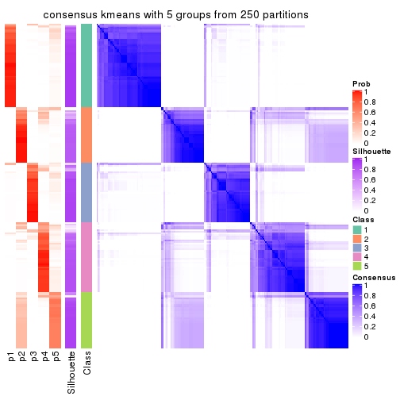</p>

</div>
<div id='tab-SD-kmeans-consensus-heatmap-5'>
<pre><code class="r">consensus_heatmap(res, k = 6)
</code></pre>

<p></p>

</div>
</div>

Heatmaps for the membership of samples in all partitions to see how consistent they are:


<script>
$( function() {
	$( '#tabs-SD-kmeans-membership-heatmap' ).tabs();
} );
</script>
<div id='tabs-SD-kmeans-membership-heatmap'>
<ul>
<li><a href='#tab-SD-kmeans-membership-heatmap-1'>k = 2</a></li>
<li><a href='#tab-SD-kmeans-membership-heatmap-2'>k = 3</a></li>
<li><a href='#tab-SD-kmeans-membership-heatmap-3'>k = 4</a></li>
<li><a href='#tab-SD-kmeans-membership-heatmap-4'>k = 5</a></li>
<li><a href='#tab-SD-kmeans-membership-heatmap-5'>k = 6</a></li>
</ul>
<div id='tab-SD-kmeans-membership-heatmap-1'>
<pre><code class="r">membership_heatmap(res, k = 2)
</code></pre>

<p></p>

</div>
<div id='tab-SD-kmeans-membership-heatmap-2'>
<pre><code class="r">membership_heatmap(res, k = 3)
</code></pre>

<p></p>

</div>
<div id='tab-SD-kmeans-membership-heatmap-3'>
<pre><code class="r">membership_heatmap(res, k = 4)
</code></pre>

<p></p>

</div>
<div id='tab-SD-kmeans-membership-heatmap-4'>
<pre><code class="r">membership_heatmap(res, k = 5)
</code></pre>

<p>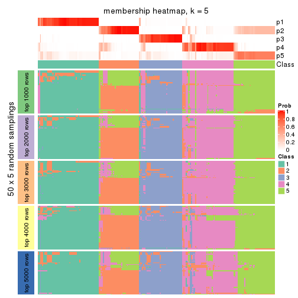</p>

</div>
<div id='tab-SD-kmeans-membership-heatmap-5'>
<pre><code class="r">membership_heatmap(res, k = 6)
</code></pre>

<p></p>

</div>
</div>

As soon as we have had the classes for columns, we can look for signatures
which are significantly different between classes which can be candidate marks
for certain classes. Following are the heatmaps for signatures.


Signature heatmaps where rows are scaled:


<script>
$( function() {
	$( '#tabs-SD-kmeans-get-signatures' ).tabs();
} );
</script>
<div id='tabs-SD-kmeans-get-signatures'>
<ul>
<li><a href='#tab-SD-kmeans-get-signatures-1'>k = 2</a></li>
<li><a href='#tab-SD-kmeans-get-signatures-2'>k = 3</a></li>
<li><a href='#tab-SD-kmeans-get-signatures-3'>k = 4</a></li>
<li><a href='#tab-SD-kmeans-get-signatures-4'>k = 5</a></li>
<li><a href='#tab-SD-kmeans-get-signatures-5'>k = 6</a></li>
</ul>
<div id='tab-SD-kmeans-get-signatures-1'>
<pre><code class="r">get_signatures(res, k = 2)
</code></pre>

<p></p>

</div>
<div id='tab-SD-kmeans-get-signatures-2'>
<pre><code class="r">get_signatures(res, k = 3)
</code></pre>

<p></p>

</div>
<div id='tab-SD-kmeans-get-signatures-3'>
<pre><code class="r">get_signatures(res, k = 4)
</code></pre>

<p></p>

</div>
<div id='tab-SD-kmeans-get-signatures-4'>
<pre><code class="r">get_signatures(res, k = 5)
</code></pre>

<p></p>

</div>
<div id='tab-SD-kmeans-get-signatures-5'>
<pre><code class="r">get_signatures(res, k = 6)
</code></pre>

<p></p>

</div>
</div>


Signature heatmaps where rows are not scaled:


<script>
$( function() {
	$( '#tabs-SD-kmeans-get-signatures-no-scale' ).tabs();
} );
</script>
<div id='tabs-SD-kmeans-get-signatures-no-scale'>
<ul>
<li><a href='#tab-SD-kmeans-get-signatures-no-scale-1'>k = 2</a></li>
<li><a href='#tab-SD-kmeans-get-signatures-no-scale-2'>k = 3</a></li>
<li><a href='#tab-SD-kmeans-get-signatures-no-scale-3'>k = 4</a></li>
<li><a href='#tab-SD-kmeans-get-signatures-no-scale-4'>k = 5</a></li>
<li><a href='#tab-SD-kmeans-get-signatures-no-scale-5'>k = 6</a></li>
</ul>
<div id='tab-SD-kmeans-get-signatures-no-scale-1'>
<pre><code class="r">get_signatures(res, k = 2, scale_rows = FALSE)
</code></pre>

<p></p>

</div>
<div id='tab-SD-kmeans-get-signatures-no-scale-2'>
<pre><code class="r">get_signatures(res, k = 3, scale_rows = FALSE)
</code></pre>

<p></p>

</div>
<div id='tab-SD-kmeans-get-signatures-no-scale-3'>
<pre><code class="r">get_signatures(res, k = 4, scale_rows = FALSE)
</code></pre>

<p></p>

</div>
<div id='tab-SD-kmeans-get-signatures-no-scale-4'>
<pre><code class="r">get_signatures(res, k = 5, scale_rows = FALSE)
</code></pre>

<p></p>

</div>
<div id='tab-SD-kmeans-get-signatures-no-scale-5'>
<pre><code class="r">get_signatures(res, k = 6, scale_rows = FALSE)
</code></pre>

<p></p>

</div>
</div>


Compare the overlap of signatures from different k:

```r
compare_signatures(res)
```


`get_signature()` returns a data frame invisibly. TO get the list of signatures, the function
call should be assigned to a variable explicitly. In following code, if `plot` argument is set
to `FALSE`, no heatmap is plotted while only the differential analysis is performed.

```r
# code only for demonstration
tb = get_signature(res, k = ..., plot = FALSE)
```

An example of the output of `tb` is:

```
#>   which_row         fdr    mean_1    mean_2 scaled_mean_1 scaled_mean_2 km
#> 1        38 0.042760348  8.373488  9.131774    -0.5533452     0.5164555  1
#> 2        40 0.018707592  7.106213  8.469186    -0.6173731     0.5762149  1
#> 3        55 0.019134737 10.221463 11.207825    -0.6159697     0.5749050  1
#> 4        59 0.006059896  5.921854  7.869574    -0.6899429     0.6439467  1
#> 5        60 0.018055526  8.928898 10.211722    -0.6204761     0.5791110  1
#> 6        98 0.009384629 15.714769 14.887706     0.6635654    -0.6193277  2
...
```

The columns in `tb` are:

1. `which_row`: row indices corresponding to the input matrix.
2. `fdr`: FDR for the differential test. 
3. `mean_x`: The mean value in group x.
4. `scaled_mean_x`: The mean value in group x after rows are scaled.
5. `km`: Row groups if k-means clustering is applied to rows.


UMAP plot which shows how samples are separated.


<script>
$( function() {
	$( '#tabs-SD-kmeans-dimension-reduction' ).tabs();
} );
</script>
<div id='tabs-SD-kmeans-dimension-reduction'>
<ul>
<li><a href='#tab-SD-kmeans-dimension-reduction-1'>k = 2</a></li>
<li><a href='#tab-SD-kmeans-dimension-reduction-2'>k = 3</a></li>
<li><a href='#tab-SD-kmeans-dimension-reduction-3'>k = 4</a></li>
<li><a href='#tab-SD-kmeans-dimension-reduction-4'>k = 5</a></li>
<li><a href='#tab-SD-kmeans-dimension-reduction-5'>k = 6</a></li>
</ul>
<div id='tab-SD-kmeans-dimension-reduction-1'>
<pre><code class="r">dimension_reduction(res, k = 2, method = &quot;UMAP&quot;)
</code></pre>

<p></p>

</div>
<div id='tab-SD-kmeans-dimension-reduction-2'>
<pre><code class="r">dimension_reduction(res, k = 3, method = &quot;UMAP&quot;)
</code></pre>

<p></p>

</div>
<div id='tab-SD-kmeans-dimension-reduction-3'>
<pre><code class="r">dimension_reduction(res, k = 4, method = &quot;UMAP&quot;)
</code></pre>

<p></p>

</div>
<div id='tab-SD-kmeans-dimension-reduction-4'>
<pre><code class="r">dimension_reduction(res, k = 5, method = &quot;UMAP&quot;)
</code></pre>

<p></p>

</div>
<div id='tab-SD-kmeans-dimension-reduction-5'>
<pre><code class="r">dimension_reduction(res, k = 6, method = &quot;UMAP&quot;)
</code></pre>

<p></p>

</div>
</div>


Following heatmap shows how subgroups are split when increasing `k`:

```r
collect_classes(res)
```


If matrix rows can be associated to genes, consider to use `GO_Enrichment(res,
...)` to perform function enrichment for the signature genes.


 

---------------------------------------------------


### SD:skmeans*


The object with results only for a single top-value method and a single partition method 
can be extracted as:

```r
res = res_list["SD", "skmeans"]
# you can also extract it by
# res = res_list["SD:skmeans"]
```

A summary of `res` and all the functions that can be applied to it:

```r
res
```

```
#> A 'ConsensusPartition' object with k = 2, 3, 4, 5, 6.
#>   On a matrix with 17680 rows and 218 columns.
#>   Top rows (1000, 2000, 3000, 4000, 5000) are extracted by 'SD' method.
#>   Subgroups are detected by 'skmeans' method.
#>   Performed in total 1250 partitions by row resampling.
#>   Best k for subgroups seems to be 5.
#> 
#> Following methods can be applied to this 'ConsensusPartition' object:
#>  [1] "cola_report"             "collect_classes"         "collect_plots"          
#>  [4] "collect_stats"           "colnames"                "compare_signatures"     
#>  [7] "consensus_heatmap"       "dimension_reduction"     "functional_enrichment"  
#> [10] "get_anno_col"            "get_anno"                "get_classes"            
#> [13] "get_consensus"           "get_matrix"              "get_membership"         
#> [16] "get_param"               "get_signatures"          "get_stats"              
#> [19] "is_best_k"               "is_stable_k"             "membership_heatmap"     
#> [22] "ncol"                    "nrow"                    "plot_ecdf"              
#> [25] "rownames"                "select_partition_number" "show"                   
#> [28] "suggest_best_k"          "test_to_known_factors"
```

`collect_plots()` function collects all the plots made from `res` for all `k` (number of partitions)
into one single page to provide an easy and fast comparison between different `k`.

```r
collect_plots(res)
```


The plots are:

- The first row: a plot of the ECDF (Empirical cumulative distribution
  function) curves of the consensus matrix for each `k` and the heatmap of
  predicted classes for each `k`.
- The second row: heatmaps of the consensus matrix for each `k`.
- The third row: heatmaps of the membership matrix for each `k`.
- The fouth row: heatmaps of the signatures for each `k`.

All the plots in panels can be made by individual functions and they are
plotted later in this section.

`select_partition_number()` produces several plots showing different
statistics for choosing "optimized" `k`. There are following statistics:

- ECDF curves of the consensus matrix for each `k`;
- 1-PAC. [The PAC
  score](https://en.wikipedia.org/wiki/Consensus_clustering#Over-interpretation_potential_of_consensus_clustering)
  measures the proportion of the ambiguous subgrouping.
- Mean silhouette score.
- Concordance. The mean probability of fiting the consensus class ids in all
  partitions.
- Area increased. Denote $A_k$ as the area under the ECDF curve for current
  `k`, the area increased is defined as $A_k - A_{k-1}$.
- Rand index. The percent of pairs of samples that are both in a same cluster
  or both are not in a same cluster in the partition of k and k-1.
- Jaccard index. The ratio of pairs of samples are both in a same cluster in
  the partition of k and k-1 and the pairs of samples are both in a same
  cluster in the partition k or k-1.

The detailed explanations of these statistics can be found in [the cola
vignette](http://bioconductor.org/packages/devel/bioc/vignettes/cola/inst/doc/cola.html#toc_13).

Generally speaking, lower PAC score, higher mean silhouette score or higher
concordance corresponds to better partition. Rand index and Jaccard index
measure how similar the current partition is compared to partition with `k-1`.
If they are too similar, we won't accept `k` is better than `k-1`.

```r
select_partition_number(res)
```


The numeric values for all these statistics can be obtained by `get_stats()`.

```r
get_stats(res)
```

```
#>   k 1-PAC mean_silhouette concordance area_increased  Rand Jaccard
#> 2 2 1.000           0.990       0.996         0.5017 0.499   0.499
#> 3 3 0.758           0.874       0.909         0.2421 0.860   0.726
#> 4 4 0.837           0.859       0.918         0.1755 0.851   0.625
#> 5 5 0.947           0.908       0.943         0.0661 0.926   0.733
#> 6 6 0.868           0.778       0.899         0.0354 0.970   0.866
```

`suggest_best_k()` suggests the best $k$ based on these statistics. The rules are as follows:

- All $k$ with Jaccard index larger than 0.95 are removed because the increase of
  the partition number does not provides enough extra information. If all $k$ are removed,
  the best $k$ is assigned by `NA`.
- For $k$ with 1-PAC larger than 0.9, the maximal $k$ is taken as the "best k". Other $k$ is called "optional k".
- If it does not fit the second rule. The $k$ with the highest vote of highest
  1-PAC, mean silhouette and concordance is taken as the "best k".

```r
suggest_best_k(res)
```

```
#> [1] 5
#> attr(,"optional")
#> [1] 2
```

There is also optional best $k$ = 2 that is worth to check.

Following shows the table of the partitions (You need to click the **show/hide
code output** link to see it). The membership matrix (columns with name `p*`)
is inferred by
[`clue::cl_consensus()`](https://www.rdocumentation.org/link/cl_consensus?package=clue)
function with the `SE` method. Basically the value in the membership matrix
represents the probability to belong to a certain group. The finall class
label for an item is determined with the group with highest probability it
belongs to.

In `get_classes()` function, the entropy is calculated from the membership
matrix and the silhouette score is calculated from the consensus matrix.


<script>
$( function() {
	$( '#tabs-SD-skmeans-get-classes' ).tabs();
} );
</script>
<div id='tabs-SD-skmeans-get-classes'>
<ul>
<li><a href='#tab-SD-skmeans-get-classes-1'>k = 2</a></li>
<li><a href='#tab-SD-skmeans-get-classes-2'>k = 3</a></li>
<li><a href='#tab-SD-skmeans-get-classes-3'>k = 4</a></li>
<li><a href='#tab-SD-skmeans-get-classes-4'>k = 5</a></li>
<li><a href='#tab-SD-skmeans-get-classes-5'>k = 6</a></li>
</ul>

<div id='tab-SD-skmeans-get-classes-1'>
<p><a id='tab-SD-skmeans-get-classes-1-a' style='color:#0366d6' href='#'>show/hide code output</a></p>
<pre><code class="r">cbind(get_classes(res, k = 2), get_membership(res, k = 2))
</code></pre>

<pre><code>#&gt;            class entropy silhouette    p1    p2
#&gt; SRR1498997     2  0.0000      0.996 0.000 1.000
#&gt; SRR1076441     1  0.0000      0.996 1.000 0.000
#&gt; SRR1489803     2  0.0000      0.996 0.000 1.000
#&gt; SRR1345953     2  0.0000      0.996 0.000 1.000
#&gt; SRR1357826     2  0.0000      0.996 0.000 1.000
#&gt; SRR1419656     1  0.0000      0.996 1.000 0.000
#&gt; SRR1454158     2  0.0000      0.996 0.000 1.000
#&gt; SRR1475408     2  0.0000      0.996 0.000 1.000
#&gt; SRR1472704     2  0.0000      0.996 0.000 1.000
#&gt; SRR1090046     1  0.0000      0.996 1.000 0.000
#&gt; SRR1312822     1  0.0000      0.996 1.000 0.000
#&gt; SRR1096987     2  0.0000      0.996 0.000 1.000
#&gt; SRR1334587     2  0.0000      0.996 0.000 1.000
#&gt; SRR1490246     1  0.0000      0.996 1.000 0.000
#&gt; SRR1467522     1  0.0000      0.996 1.000 0.000
#&gt; SRR1324206     1  0.0000      0.996 1.000 0.000
#&gt; SRR1408574     2  0.0000      0.996 0.000 1.000
#&gt; SRR1083959     2  0.0000      0.996 0.000 1.000
#&gt; SRR1079948     2  0.0000      0.996 0.000 1.000
#&gt; SRR1310667     2  0.0000      0.996 0.000 1.000
#&gt; SRR655852      2  0.0000      0.996 0.000 1.000
#&gt; SRR1352457     2  0.0000      0.996 0.000 1.000
#&gt; SRR1353994     2  0.0000      0.996 0.000 1.000
#&gt; SRR1459561     2  0.0000      0.996 0.000 1.000
#&gt; SRR1454009     1  0.0000      0.996 1.000 0.000
#&gt; SRR1071084     1  0.0000      0.996 1.000 0.000
#&gt; SRR1082859     2  0.0000      0.996 0.000 1.000
#&gt; SRR1086538     1  0.0000      0.996 1.000 0.000
#&gt; SRR1486262     2  0.0000      0.996 0.000 1.000
#&gt; SRR658105      1  0.0000      0.996 1.000 0.000
#&gt; SRR811073      2  0.0000      0.996 0.000 1.000
#&gt; SRR1429181     2  0.0000      0.996 0.000 1.000
#&gt; SRR1327896     2  0.0000      0.996 0.000 1.000
#&gt; SRR1464788     2  0.0000      0.996 0.000 1.000
#&gt; SRR1346861     2  0.0000      0.996 0.000 1.000
#&gt; SRR1318774     2  0.0000      0.996 0.000 1.000
#&gt; SRR1420517     1  0.0000      0.996 1.000 0.000
#&gt; SRR1369584     2  0.0000      0.996 0.000 1.000
#&gt; SRR1443244     1  0.5629      0.847 0.868 0.132
#&gt; SRR1455391     1  0.0000      0.996 1.000 0.000
#&gt; SRR1068999     1  0.0000      0.996 1.000 0.000
#&gt; SRR1481297     1  0.0000      0.996 1.000 0.000
#&gt; SRR1070208     1  0.0000      0.996 1.000 0.000
#&gt; SRR1317282     1  0.0000      0.996 1.000 0.000
#&gt; SRR1096125     2  0.0000      0.996 0.000 1.000
#&gt; SRR1472506     1  0.0000      0.996 1.000 0.000
#&gt; SRR1388281     2  0.0000      0.996 0.000 1.000
#&gt; SRR1365622     2  0.0000      0.996 0.000 1.000
#&gt; SRR662306      1  0.0000      0.996 1.000 0.000
#&gt; SRR662811      1  0.0000      0.996 1.000 0.000
#&gt; SRR820571      1  0.0000      0.996 1.000 0.000
#&gt; SRR1357166     1  0.0000      0.996 1.000 0.000
#&gt; SRR1488586     1  0.0000      0.996 1.000 0.000
#&gt; SRR1485398     1  0.0000      0.996 1.000 0.000
#&gt; SRR1417725     2  0.0000      0.996 0.000 1.000
#&gt; SRR1409397     2  0.0000      0.996 0.000 1.000
#&gt; SRR1465693     2  0.0000      0.996 0.000 1.000
#&gt; SRR1096547     1  0.0000      0.996 1.000 0.000
#&gt; SRR1456818     1  0.0000      0.996 1.000 0.000
#&gt; SRR816336      1  0.0000      0.996 1.000 0.000
#&gt; SRR1420238     1  0.0000      0.996 1.000 0.000
#&gt; SRR1433374     1  0.0000      0.996 1.000 0.000
#&gt; SRR1436990     1  0.0000      0.996 1.000 0.000
#&gt; SRR662378      1  0.0000      0.996 1.000 0.000
#&gt; SRR1477671     1  0.0000      0.996 1.000 0.000
#&gt; SRR1084079     2  0.9795      0.279 0.416 0.584
#&gt; SRR1102949     1  0.0000      0.996 1.000 0.000
#&gt; SRR1458090     1  0.0000      0.996 1.000 0.000
#&gt; SRR1418729     2  0.0000      0.996 0.000 1.000
#&gt; SRR1403814     2  0.0000      0.996 0.000 1.000
#&gt; SRR1404887     1  0.0672      0.988 0.992 0.008
#&gt; SRR1434955     1  0.0000      0.996 1.000 0.000
#&gt; SRR1360652     1  0.0000      0.996 1.000 0.000
#&gt; SRR1356765     2  0.0000      0.996 0.000 1.000
#&gt; SRR1078258     2  0.0000      0.996 0.000 1.000
#&gt; SRR1455861     1  0.0000      0.996 1.000 0.000
#&gt; SRR1420296     2  0.0000      0.996 0.000 1.000
#&gt; SRR1070260     2  0.0000      0.996 0.000 1.000
#&gt; SRR1410765     1  0.0000      0.996 1.000 0.000
#&gt; SRR1481315     1  0.0000      0.996 1.000 0.000
#&gt; SRR1414661     2  0.0000      0.996 0.000 1.000
#&gt; SRR1359147     2  0.0000      0.996 0.000 1.000
#&gt; SRR1488694     1  0.0000      0.996 1.000 0.000
#&gt; SRR1477273     1  0.0000      0.996 1.000 0.000
#&gt; SRR1415792     1  0.0000      0.996 1.000 0.000
#&gt; SRR1369088     2  0.0000      0.996 0.000 1.000
#&gt; SRR1406621     2  0.0000      0.996 0.000 1.000
#&gt; SRR1401017     2  0.0000      0.996 0.000 1.000
#&gt; SRR1099981     2  0.0000      0.996 0.000 1.000
#&gt; SRR815208      2  0.0000      0.996 0.000 1.000
#&gt; SRR1380460     2  0.0000      0.996 0.000 1.000
#&gt; SRR1091097     2  0.0000      0.996 0.000 1.000
#&gt; SRR1456010     1  0.0000      0.996 1.000 0.000
#&gt; SRR1498416     2  0.0000      0.996 0.000 1.000
#&gt; SRR818873      2  0.0000      0.996 0.000 1.000
#&gt; SRR813868      2  0.0000      0.996 0.000 1.000
#&gt; SRR1394912     1  0.0000      0.996 1.000 0.000
#&gt; SRR1475824     2  0.0000      0.996 0.000 1.000
#&gt; SRR1459866     1  0.0000      0.996 1.000 0.000
#&gt; SRR1364871     1  0.8499      0.619 0.724 0.276
#&gt; SRR1100472     2  0.0000      0.996 0.000 1.000
#&gt; SRR1331267     1  0.0000      0.996 1.000 0.000
#&gt; SRR1068977     2  0.0000      0.996 0.000 1.000
#&gt; SRR1391511     2  0.0000      0.996 0.000 1.000
#&gt; SRR1077920     2  0.0000      0.996 0.000 1.000
#&gt; SRR1457705     1  0.0000      0.996 1.000 0.000
#&gt; SRR1437073     1  0.0000      0.996 1.000 0.000
#&gt; SRR1473124     1  0.0000      0.996 1.000 0.000
#&gt; SRR1469279     1  0.0000      0.996 1.000 0.000
#&gt; SRR1091791     2  0.0000      0.996 0.000 1.000
#&gt; SRR1341539     2  0.0000      0.996 0.000 1.000
#&gt; SRR1446354     1  0.0000      0.996 1.000 0.000
#&gt; SRR1415420     1  0.0000      0.996 1.000 0.000
#&gt; SRR1368050     1  0.0000      0.996 1.000 0.000
#&gt; SRR656970      2  0.0000      0.996 0.000 1.000
#&gt; SRR1473403     2  0.0000      0.996 0.000 1.000
#&gt; SRR1084674     1  0.0000      0.996 1.000 0.000
#&gt; SRR1464702     1  0.0000      0.996 1.000 0.000
#&gt; SRR1074860     2  0.0000      0.996 0.000 1.000
#&gt; SRR655447      2  0.0000      0.996 0.000 1.000
#&gt; SRR1404442     2  0.0000      0.996 0.000 1.000
#&gt; SRR1418795     1  0.0000      0.996 1.000 0.000
#&gt; SRR1458335     2  0.0000      0.996 0.000 1.000
#&gt; SRR1489589     2  0.0000      0.996 0.000 1.000
#&gt; SRR1378284     1  0.0000      0.996 1.000 0.000
#&gt; SRR1408014     2  0.0000      0.996 0.000 1.000
#&gt; SRR1083052     1  0.0000      0.996 1.000 0.000
#&gt; SRR1339236     2  0.0000      0.996 0.000 1.000
#&gt; SRR1323829     2  0.0000      0.996 0.000 1.000
#&gt; SRR1086772     2  0.0000      0.996 0.000 1.000
#&gt; SRR1486457     1  0.0000      0.996 1.000 0.000
#&gt; SRR1415257     2  0.0000      0.996 0.000 1.000
#&gt; SRR1071905     1  0.0000      0.996 1.000 0.000
#&gt; SRR659223      2  0.0000      0.996 0.000 1.000
#&gt; SRR1386945     1  0.0000      0.996 1.000 0.000
#&gt; SRR821498      2  0.0000      0.996 0.000 1.000
#&gt; SRR1378903     2  0.0000      0.996 0.000 1.000
#&gt; SRR1472907     1  0.0000      0.996 1.000 0.000
#&gt; SRR1442313     2  0.0000      0.996 0.000 1.000
#&gt; SRR1077139     2  0.0000      0.996 0.000 1.000
#&gt; SRR1342758     1  0.0000      0.996 1.000 0.000
#&gt; SRR656911      2  0.0000      0.996 0.000 1.000
#&gt; SRR1070738     1  0.0000      0.996 1.000 0.000
#&gt; SRR1476950     1  0.0000      0.996 1.000 0.000
#&gt; SRR1488196     1  0.0000      0.996 1.000 0.000
#&gt; SRR1498951     1  0.0000      0.996 1.000 0.000
#&gt; SRR1413392     1  0.0000      0.996 1.000 0.000
#&gt; SRR657528      2  0.0000      0.996 0.000 1.000
#&gt; SRR812198      1  0.0000      0.996 1.000 0.000
#&gt; SRR660283      2  0.0000      0.996 0.000 1.000
#&gt; SRR1420936     1  0.0000      0.996 1.000 0.000
#&gt; SRR1469547     2  0.0000      0.996 0.000 1.000
#&gt; SRR1322249     1  0.0000      0.996 1.000 0.000
#&gt; SRR1396682     1  0.0000      0.996 1.000 0.000
#&gt; SRR1095816     2  0.0000      0.996 0.000 1.000
#&gt; SRR1081023     1  0.0000      0.996 1.000 0.000
#&gt; SRR1092517     2  0.0000      0.996 0.000 1.000
#&gt; SRR811285      2  0.0000      0.996 0.000 1.000
#&gt; SRR657018      1  0.0000      0.996 1.000 0.000
#&gt; SRR1365534     1  0.0000      0.996 1.000 0.000
#&gt; SRR1090791     2  0.0000      0.996 0.000 1.000
#&gt; SRR1439915     2  0.0000      0.996 0.000 1.000
#&gt; SRR1391575     2  0.0000      0.996 0.000 1.000
#&gt; SRR1314092     2  0.0000      0.996 0.000 1.000
#&gt; SRR1328941     1  0.0000      0.996 1.000 0.000
#&gt; SRR1336181     2  0.0000      0.996 0.000 1.000
#&gt; SRR1362972     1  0.0000      0.996 1.000 0.000
#&gt; SRR1366790     2  0.0000      0.996 0.000 1.000
#&gt; SRR1455902     1  0.0000      0.996 1.000 0.000
#&gt; SRR1437644     1  0.0000      0.996 1.000 0.000
#&gt; SRR1105009     2  0.0000      0.996 0.000 1.000
#&gt; SRR1367024     1  0.0000      0.996 1.000 0.000
#&gt; SRR660248      2  0.0000      0.996 0.000 1.000
#&gt; SRR1409620     1  0.0000      0.996 1.000 0.000
#&gt; SRR1455807     2  0.0000      0.996 0.000 1.000
#&gt; SRR1339431     1  0.0000      0.996 1.000 0.000
#&gt; SRR1378948     1  0.1414      0.976 0.980 0.020
#&gt; SRR1469237     1  0.0000      0.996 1.000 0.000
#&gt; SRR1098264     2  0.0000      0.996 0.000 1.000
#&gt; SRR1406224     2  0.0000      0.996 0.000 1.000
#&gt; SRR1393026     1  0.0000      0.996 1.000 0.000
#&gt; SRR808428      2  0.0000      0.996 0.000 1.000
#&gt; SRR615910      2  0.0000      0.996 0.000 1.000
#&gt; SRR1076219     1  0.0000      0.996 1.000 0.000
#&gt; SRR1481128     1  0.0000      0.996 1.000 0.000
#&gt; SRR1359262     2  0.0000      0.996 0.000 1.000
#&gt; SRR1407648     2  0.0000      0.996 0.000 1.000
#&gt; SRR1386775     1  0.0000      0.996 1.000 0.000
#&gt; SRR1388399     1  0.0000      0.996 1.000 0.000
#&gt; SRR1361499     2  0.0000      0.996 0.000 1.000
#&gt; SRR1500709     2  0.0000      0.996 0.000 1.000
#&gt; SRR1335917     1  0.0000      0.996 1.000 0.000
#&gt; SRR1430615     2  0.0000      0.996 0.000 1.000
#&gt; SRR1335212     1  0.0000      0.996 1.000 0.000
#&gt; SRR1400159     2  0.0000      0.996 0.000 1.000
#&gt; SRR1457245     2  0.0000      0.996 0.000 1.000
#&gt; SRR1356746     2  0.0000      0.996 0.000 1.000
#&gt; SRR658319      2  0.0000      0.996 0.000 1.000
#&gt; SRR1435946     1  0.0000      0.996 1.000 0.000
#&gt; SRR1370308     1  0.0000      0.996 1.000 0.000
#&gt; SRR1100893     1  0.0000      0.996 1.000 0.000
#&gt; SRR1389432     1  0.0000      0.996 1.000 0.000
#&gt; SRR1381799     2  0.0000      0.996 0.000 1.000
#&gt; SRR1310158     1  0.0000      0.996 1.000 0.000
#&gt; SRR1341100     2  0.0000      0.996 0.000 1.000
#&gt; SRR1342873     1  0.0000      0.996 1.000 0.000
#&gt; SRR1472102     2  0.0000      0.996 0.000 1.000
#&gt; SRR1409421     1  0.0000      0.996 1.000 0.000
#&gt; SRR1328577     2  0.0000      0.996 0.000 1.000
#&gt; SRR808942      2  0.0000      0.996 0.000 1.000
#&gt; SRR1343818     2  0.0000      0.996 0.000 1.000
#&gt; SRR1472415     2  0.0000      0.996 0.000 1.000
#&gt; SRR658409      2  0.0000      0.996 0.000 1.000
#&gt; SRR1469681     1  0.0000      0.996 1.000 0.000
#&gt; SRR1075484     2  0.0000      0.996 0.000 1.000
#&gt; SRR1417894     1  0.0000      0.996 1.000 0.000
#&gt; SRR1417422     2  0.0000      0.996 0.000 1.000
#&gt; SRR1090674     1  0.0000      0.996 1.000 0.000
</code></pre>

<script>
$('#tab-SD-skmeans-get-classes-1-a').parent().next().next().hide();
$('#tab-SD-skmeans-get-classes-1-a').click(function(){
  $('#tab-SD-skmeans-get-classes-1-a').parent().next().next().toggle();
  return(false);
});
</script>
</div>

<div id='tab-SD-skmeans-get-classes-2'>
<p><a id='tab-SD-skmeans-get-classes-2-a' style='color:#0366d6' href='#'>show/hide code output</a></p>
<pre><code class="r">cbind(get_classes(res, k = 3), get_membership(res, k = 3))
</code></pre>

<pre><code>#&gt;            class entropy silhouette    p1    p2    p3
#&gt; SRR1498997     2  0.0000     0.9291 0.000 1.000 0.000
#&gt; SRR1076441     1  0.0000     0.9319 1.000 0.000 0.000
#&gt; SRR1489803     2  0.0424     0.9282 0.000 0.992 0.008
#&gt; SRR1345953     2  0.4654     0.8578 0.000 0.792 0.208
#&gt; SRR1357826     2  0.0000     0.9291 0.000 1.000 0.000
#&gt; SRR1419656     3  0.5178     0.8749 0.256 0.000 0.744
#&gt; SRR1454158     2  0.0000     0.9291 0.000 1.000 0.000
#&gt; SRR1475408     3  0.5497     0.6113 0.000 0.292 0.708
#&gt; SRR1472704     2  0.0000     0.9291 0.000 1.000 0.000
#&gt; SRR1090046     1  0.3551     0.7597 0.868 0.000 0.132
#&gt; SRR1312822     1  0.0000     0.9319 1.000 0.000 0.000
#&gt; SRR1096987     2  0.4654     0.8578 0.000 0.792 0.208
#&gt; SRR1334587     2  0.0424     0.9282 0.000 0.992 0.008
#&gt; SRR1490246     1  0.0000     0.9319 1.000 0.000 0.000
#&gt; SRR1467522     1  0.0000     0.9319 1.000 0.000 0.000
#&gt; SRR1324206     1  0.0000     0.9319 1.000 0.000 0.000
#&gt; SRR1408574     2  0.0424     0.9282 0.000 0.992 0.008
#&gt; SRR1083959     2  0.0000     0.9291 0.000 1.000 0.000
#&gt; SRR1079948     2  0.4654     0.8578 0.000 0.792 0.208
#&gt; SRR1310667     2  0.0424     0.9282 0.000 0.992 0.008
#&gt; SRR655852      2  0.4654     0.8578 0.000 0.792 0.208
#&gt; SRR1352457     2  0.0424     0.9282 0.000 0.992 0.008
#&gt; SRR1353994     2  0.4654     0.8578 0.000 0.792 0.208
#&gt; SRR1459561     2  0.0424     0.9282 0.000 0.992 0.008
#&gt; SRR1454009     3  0.6026     0.6708 0.376 0.000 0.624
#&gt; SRR1071084     3  0.4750     0.9187 0.216 0.000 0.784
#&gt; SRR1082859     2  0.0000     0.9291 0.000 1.000 0.000
#&gt; SRR1086538     1  0.0000     0.9319 1.000 0.000 0.000
#&gt; SRR1486262     2  0.4654     0.8578 0.000 0.792 0.208
#&gt; SRR658105      1  0.0000     0.9319 1.000 0.000 0.000
#&gt; SRR811073      2  0.3340     0.8901 0.000 0.880 0.120
#&gt; SRR1429181     2  0.0424     0.9282 0.000 0.992 0.008
#&gt; SRR1327896     2  0.4654     0.8578 0.000 0.792 0.208
#&gt; SRR1464788     2  0.0424     0.9282 0.000 0.992 0.008
#&gt; SRR1346861     2  0.0000     0.9291 0.000 1.000 0.000
#&gt; SRR1318774     2  0.4452     0.8642 0.000 0.808 0.192
#&gt; SRR1420517     3  0.4750     0.9187 0.216 0.000 0.784
#&gt; SRR1369584     2  0.0424     0.9282 0.000 0.992 0.008
#&gt; SRR1443244     1  0.4654     0.6622 0.792 0.000 0.208
#&gt; SRR1455391     1  0.0000     0.9319 1.000 0.000 0.000
#&gt; SRR1068999     1  0.0000     0.9319 1.000 0.000 0.000
#&gt; SRR1481297     3  0.5058     0.8896 0.244 0.000 0.756
#&gt; SRR1070208     1  0.0000     0.9319 1.000 0.000 0.000
#&gt; SRR1317282     3  0.4750     0.9187 0.216 0.000 0.784
#&gt; SRR1096125     2  0.4654     0.8578 0.000 0.792 0.208
#&gt; SRR1472506     3  0.4750     0.9187 0.216 0.000 0.784
#&gt; SRR1388281     2  0.0000     0.9291 0.000 1.000 0.000
#&gt; SRR1365622     2  0.4702     0.8594 0.000 0.788 0.212
#&gt; SRR662306      3  0.4750     0.9187 0.216 0.000 0.784
#&gt; SRR662811      1  0.0000     0.9319 1.000 0.000 0.000
#&gt; SRR820571      3  0.4887     0.9072 0.228 0.000 0.772
#&gt; SRR1357166     1  0.6267    -0.1858 0.548 0.000 0.452
#&gt; SRR1488586     1  0.0000     0.9319 1.000 0.000 0.000
#&gt; SRR1485398     1  0.0000     0.9319 1.000 0.000 0.000
#&gt; SRR1417725     3  0.4796     0.7021 0.000 0.220 0.780
#&gt; SRR1409397     2  0.0424     0.9282 0.000 0.992 0.008
#&gt; SRR1465693     2  0.0424     0.9282 0.000 0.992 0.008
#&gt; SRR1096547     3  0.4750     0.9187 0.216 0.000 0.784
#&gt; SRR1456818     1  0.0000     0.9319 1.000 0.000 0.000
#&gt; SRR816336      3  0.4750     0.9187 0.216 0.000 0.784
#&gt; SRR1420238     1  0.0000     0.9319 1.000 0.000 0.000
#&gt; SRR1433374     3  0.4750     0.9187 0.216 0.000 0.784
#&gt; SRR1436990     1  0.0000     0.9319 1.000 0.000 0.000
#&gt; SRR662378      1  0.0000     0.9319 1.000 0.000 0.000
#&gt; SRR1477671     1  0.0000     0.9319 1.000 0.000 0.000
#&gt; SRR1084079     1  0.8688     0.3784 0.596 0.196 0.208
#&gt; SRR1102949     1  0.0000     0.9319 1.000 0.000 0.000
#&gt; SRR1458090     1  0.0000     0.9319 1.000 0.000 0.000
#&gt; SRR1418729     2  0.0000     0.9291 0.000 1.000 0.000
#&gt; SRR1403814     2  0.4654     0.8578 0.000 0.792 0.208
#&gt; SRR1404887     1  0.4654     0.6622 0.792 0.000 0.208
#&gt; SRR1434955     1  0.0000     0.9319 1.000 0.000 0.000
#&gt; SRR1360652     1  0.0000     0.9319 1.000 0.000 0.000
#&gt; SRR1356765     2  0.0424     0.9282 0.000 0.992 0.008
#&gt; SRR1078258     2  0.4654     0.8578 0.000 0.792 0.208
#&gt; SRR1455861     1  0.0000     0.9319 1.000 0.000 0.000
#&gt; SRR1420296     2  0.0424     0.9282 0.000 0.992 0.008
#&gt; SRR1070260     2  0.0000     0.9291 0.000 1.000 0.000
#&gt; SRR1410765     1  0.0000     0.9319 1.000 0.000 0.000
#&gt; SRR1481315     1  0.0000     0.9319 1.000 0.000 0.000
#&gt; SRR1414661     2  0.4452     0.8642 0.000 0.808 0.192
#&gt; SRR1359147     2  0.4654     0.8578 0.000 0.792 0.208
#&gt; SRR1488694     1  0.0000     0.9319 1.000 0.000 0.000
#&gt; SRR1477273     3  0.4750     0.9187 0.216 0.000 0.784
#&gt; SRR1415792     1  0.0000     0.9319 1.000 0.000 0.000
#&gt; SRR1369088     2  0.0592     0.9261 0.000 0.988 0.012
#&gt; SRR1406621     2  0.0424     0.9282 0.000 0.992 0.008
#&gt; SRR1401017     2  0.0424     0.9282 0.000 0.992 0.008
#&gt; SRR1099981     2  0.0424     0.9282 0.000 0.992 0.008
#&gt; SRR815208      2  0.0000     0.9291 0.000 1.000 0.000
#&gt; SRR1380460     2  0.4654     0.8578 0.000 0.792 0.208
#&gt; SRR1091097     2  0.4654     0.8578 0.000 0.792 0.208
#&gt; SRR1456010     3  0.4750     0.9187 0.216 0.000 0.784
#&gt; SRR1498416     2  0.4555     0.8613 0.000 0.800 0.200
#&gt; SRR818873      2  0.0424     0.9282 0.000 0.992 0.008
#&gt; SRR813868      2  0.0000     0.9291 0.000 1.000 0.000
#&gt; SRR1394912     1  0.0000     0.9319 1.000 0.000 0.000
#&gt; SRR1475824     2  0.4654     0.8578 0.000 0.792 0.208
#&gt; SRR1459866     1  0.0000     0.9319 1.000 0.000 0.000
#&gt; SRR1364871     3  0.5220     0.7122 0.012 0.208 0.780
#&gt; SRR1100472     2  0.0000     0.9291 0.000 1.000 0.000
#&gt; SRR1331267     1  0.0000     0.9319 1.000 0.000 0.000
#&gt; SRR1068977     2  0.4654     0.8613 0.000 0.792 0.208
#&gt; SRR1391511     2  0.0000     0.9291 0.000 1.000 0.000
#&gt; SRR1077920     2  0.0000     0.9291 0.000 1.000 0.000
#&gt; SRR1457705     3  0.4750     0.9187 0.216 0.000 0.784
#&gt; SRR1437073     1  0.0000     0.9319 1.000 0.000 0.000
#&gt; SRR1473124     3  0.4750     0.9187 0.216 0.000 0.784
#&gt; SRR1469279     3  0.4750     0.9187 0.216 0.000 0.784
#&gt; SRR1091791     2  0.4654     0.8578 0.000 0.792 0.208
#&gt; SRR1341539     2  0.0424     0.9282 0.000 0.992 0.008
#&gt; SRR1446354     3  0.4750     0.9187 0.216 0.000 0.784
#&gt; SRR1415420     1  0.0000     0.9319 1.000 0.000 0.000
#&gt; SRR1368050     1  0.0000     0.9319 1.000 0.000 0.000
#&gt; SRR656970      2  0.0424     0.9282 0.000 0.992 0.008
#&gt; SRR1473403     2  0.4654     0.8578 0.000 0.792 0.208
#&gt; SRR1084674     3  0.4750     0.9187 0.216 0.000 0.784
#&gt; SRR1464702     1  0.0000     0.9319 1.000 0.000 0.000
#&gt; SRR1074860     1  0.9076     0.3114 0.552 0.240 0.208
#&gt; SRR655447      2  0.4654     0.8578 0.000 0.792 0.208
#&gt; SRR1404442     2  0.0000     0.9291 0.000 1.000 0.000
#&gt; SRR1418795     1  0.0000     0.9319 1.000 0.000 0.000
#&gt; SRR1458335     2  0.0000     0.9291 0.000 1.000 0.000
#&gt; SRR1489589     2  0.0424     0.9282 0.000 0.992 0.008
#&gt; SRR1378284     1  0.0000     0.9319 1.000 0.000 0.000
#&gt; SRR1408014     2  0.0424     0.9282 0.000 0.992 0.008
#&gt; SRR1083052     1  0.0000     0.9319 1.000 0.000 0.000
#&gt; SRR1339236     3  0.4796     0.6954 0.000 0.220 0.780
#&gt; SRR1323829     2  0.0424     0.9282 0.000 0.992 0.008
#&gt; SRR1086772     2  0.0424     0.9274 0.000 0.992 0.008
#&gt; SRR1486457     3  0.4750     0.9187 0.216 0.000 0.784
#&gt; SRR1415257     2  0.0424     0.9282 0.000 0.992 0.008
#&gt; SRR1071905     1  0.6267    -0.1855 0.548 0.000 0.452
#&gt; SRR659223      2  0.0424     0.9282 0.000 0.992 0.008
#&gt; SRR1386945     3  0.4750     0.9187 0.216 0.000 0.784
#&gt; SRR821498      2  0.4654     0.8578 0.000 0.792 0.208
#&gt; SRR1378903     2  0.4654     0.8578 0.000 0.792 0.208
#&gt; SRR1472907     3  0.4796     0.9151 0.220 0.000 0.780
#&gt; SRR1442313     2  0.0000     0.9291 0.000 1.000 0.000
#&gt; SRR1077139     2  0.0424     0.9282 0.000 0.992 0.008
#&gt; SRR1342758     1  0.0000     0.9319 1.000 0.000 0.000
#&gt; SRR656911      2  0.4654     0.8578 0.000 0.792 0.208
#&gt; SRR1070738     1  0.0000     0.9319 1.000 0.000 0.000
#&gt; SRR1476950     1  0.0000     0.9319 1.000 0.000 0.000
#&gt; SRR1488196     3  0.4750     0.9187 0.216 0.000 0.784
#&gt; SRR1498951     3  0.4750     0.9187 0.216 0.000 0.784
#&gt; SRR1413392     1  0.0000     0.9319 1.000 0.000 0.000
#&gt; SRR657528      2  0.0424     0.9282 0.000 0.992 0.008
#&gt; SRR812198      1  0.0000     0.9319 1.000 0.000 0.000
#&gt; SRR660283      2  0.0000     0.9291 0.000 1.000 0.000
#&gt; SRR1420936     1  0.0000     0.9319 1.000 0.000 0.000
#&gt; SRR1469547     2  0.0000     0.9291 0.000 1.000 0.000
#&gt; SRR1322249     1  0.0000     0.9319 1.000 0.000 0.000
#&gt; SRR1396682     1  0.0000     0.9319 1.000 0.000 0.000
#&gt; SRR1095816     2  0.4654     0.8578 0.000 0.792 0.208
#&gt; SRR1081023     1  0.0000     0.9319 1.000 0.000 0.000
#&gt; SRR1092517     2  0.4654     0.8578 0.000 0.792 0.208
#&gt; SRR811285      2  0.0424     0.9282 0.000 0.992 0.008
#&gt; SRR657018      1  0.0000     0.9319 1.000 0.000 0.000
#&gt; SRR1365534     3  0.4750     0.9187 0.216 0.000 0.784
#&gt; SRR1090791     2  0.0424     0.9282 0.000 0.992 0.008
#&gt; SRR1439915     2  0.0424     0.9282 0.000 0.992 0.008
#&gt; SRR1391575     2  0.4654     0.8578 0.000 0.792 0.208
#&gt; SRR1314092     2  0.0000     0.9291 0.000 1.000 0.000
#&gt; SRR1328941     3  0.4750     0.9187 0.216 0.000 0.784
#&gt; SRR1336181     2  0.0000     0.9291 0.000 1.000 0.000
#&gt; SRR1362972     1  0.0000     0.9319 1.000 0.000 0.000
#&gt; SRR1366790     2  0.0000     0.9291 0.000 1.000 0.000
#&gt; SRR1455902     3  0.4750     0.9187 0.216 0.000 0.784
#&gt; SRR1437644     3  0.0892     0.7235 0.020 0.000 0.980
#&gt; SRR1105009     2  0.0000     0.9291 0.000 1.000 0.000
#&gt; SRR1367024     3  0.4750     0.9187 0.216 0.000 0.784
#&gt; SRR660248      2  0.0000     0.9291 0.000 1.000 0.000
#&gt; SRR1409620     1  0.0000     0.9319 1.000 0.000 0.000
#&gt; SRR1455807     2  0.0000     0.9291 0.000 1.000 0.000
#&gt; SRR1339431     1  0.0000     0.9319 1.000 0.000 0.000
#&gt; SRR1378948     3  0.2448     0.7812 0.076 0.000 0.924
#&gt; SRR1469237     1  0.0000     0.9319 1.000 0.000 0.000
#&gt; SRR1098264     2  0.4605     0.8595 0.000 0.796 0.204
#&gt; SRR1406224     2  0.0424     0.9282 0.000 0.992 0.008
#&gt; SRR1393026     1  0.6267    -0.1858 0.548 0.000 0.452
#&gt; SRR808428      2  0.0000     0.9291 0.000 1.000 0.000
#&gt; SRR615910      2  0.0424     0.9282 0.000 0.992 0.008
#&gt; SRR1076219     1  0.0000     0.9319 1.000 0.000 0.000
#&gt; SRR1481128     1  0.0000     0.9319 1.000 0.000 0.000
#&gt; SRR1359262     2  0.0424     0.9282 0.000 0.992 0.008
#&gt; SRR1407648     2  0.4654     0.8578 0.000 0.792 0.208
#&gt; SRR1386775     1  0.0000     0.9319 1.000 0.000 0.000
#&gt; SRR1388399     1  0.0000     0.9319 1.000 0.000 0.000
#&gt; SRR1361499     2  0.4605     0.8595 0.000 0.796 0.204
#&gt; SRR1500709     2  0.4654     0.8578 0.000 0.792 0.208
#&gt; SRR1335917     1  0.0000     0.9319 1.000 0.000 0.000
#&gt; SRR1430615     2  0.0424     0.9282 0.000 0.992 0.008
#&gt; SRR1335212     1  0.0000     0.9319 1.000 0.000 0.000
#&gt; SRR1400159     3  0.4654     0.7048 0.000 0.208 0.792
#&gt; SRR1457245     2  0.0000     0.9291 0.000 1.000 0.000
#&gt; SRR1356746     2  0.0000     0.9291 0.000 1.000 0.000
#&gt; SRR658319      2  0.0000     0.9291 0.000 1.000 0.000
#&gt; SRR1435946     1  0.0000     0.9319 1.000 0.000 0.000
#&gt; SRR1370308     1  0.0000     0.9319 1.000 0.000 0.000
#&gt; SRR1100893     1  0.0000     0.9319 1.000 0.000 0.000
#&gt; SRR1389432     1  0.6267    -0.1858 0.548 0.000 0.452
#&gt; SRR1381799     2  0.0000     0.9291 0.000 1.000 0.000
#&gt; SRR1310158     3  0.4750     0.9187 0.216 0.000 0.784
#&gt; SRR1341100     2  0.4654     0.8578 0.000 0.792 0.208
#&gt; SRR1342873     1  0.6062     0.0976 0.616 0.000 0.384
#&gt; SRR1472102     2  0.0424     0.9282 0.000 0.992 0.008
#&gt; SRR1409421     3  0.5859     0.7395 0.344 0.000 0.656
#&gt; SRR1328577     2  0.4654     0.8578 0.000 0.792 0.208
#&gt; SRR808942      2  0.0000     0.9291 0.000 1.000 0.000
#&gt; SRR1343818     2  0.4654     0.8578 0.000 0.792 0.208
#&gt; SRR1472415     2  0.0000     0.9291 0.000 1.000 0.000
#&gt; SRR658409      2  0.4654     0.8578 0.000 0.792 0.208
#&gt; SRR1469681     1  0.0000     0.9319 1.000 0.000 0.000
#&gt; SRR1075484     2  0.0424     0.9282 0.000 0.992 0.008
#&gt; SRR1417894     3  0.4750     0.9187 0.216 0.000 0.784
#&gt; SRR1417422     2  0.0424     0.9282 0.000 0.992 0.008
#&gt; SRR1090674     1  0.0000     0.9319 1.000 0.000 0.000
</code></pre>

<script>
$('#tab-SD-skmeans-get-classes-2-a').parent().next().next().hide();
$('#tab-SD-skmeans-get-classes-2-a').click(function(){
  $('#tab-SD-skmeans-get-classes-2-a').parent().next().next().toggle();
  return(false);
});
</script>
</div>

<div id='tab-SD-skmeans-get-classes-3'>
<p><a id='tab-SD-skmeans-get-classes-3-a' style='color:#0366d6' href='#'>show/hide code output</a></p>
<pre><code class="r">cbind(get_classes(res, k = 4), get_membership(res, k = 4))
</code></pre>

<pre><code>#&gt;            class entropy silhouette    p1    p2    p3    p4
#&gt; SRR1498997     4  0.4585     0.7453 0.000 0.332 0.000 0.668
#&gt; SRR1076441     1  0.0000     0.9808 1.000 0.000 0.000 0.000
#&gt; SRR1489803     2  0.0188     0.9620 0.000 0.996 0.000 0.004
#&gt; SRR1345953     4  0.0000     0.7797 0.000 0.000 0.000 1.000
#&gt; SRR1357826     4  0.4585     0.7453 0.000 0.332 0.000 0.668
#&gt; SRR1419656     3  0.0592     0.9089 0.016 0.000 0.984 0.000
#&gt; SRR1454158     4  0.4585     0.7453 0.000 0.332 0.000 0.668
#&gt; SRR1475408     2  0.4989     0.0934 0.000 0.528 0.472 0.000
#&gt; SRR1472704     4  0.4585     0.7453 0.000 0.332 0.000 0.668
#&gt; SRR1090046     1  0.2921     0.8135 0.860 0.000 0.140 0.000
#&gt; SRR1312822     1  0.0000     0.9808 1.000 0.000 0.000 0.000
#&gt; SRR1096987     4  0.0000     0.7797 0.000 0.000 0.000 1.000
#&gt; SRR1334587     2  0.0188     0.9620 0.000 0.996 0.000 0.004
#&gt; SRR1490246     1  0.0000     0.9808 1.000 0.000 0.000 0.000
#&gt; SRR1467522     1  0.0000     0.9808 1.000 0.000 0.000 0.000
#&gt; SRR1324206     1  0.0000     0.9808 1.000 0.000 0.000 0.000
#&gt; SRR1408574     2  0.0188     0.9620 0.000 0.996 0.000 0.004
#&gt; SRR1083959     4  0.4585     0.7453 0.000 0.332 0.000 0.668
#&gt; SRR1079948     4  0.0000     0.7797 0.000 0.000 0.000 1.000
#&gt; SRR1310667     2  0.0188     0.9620 0.000 0.996 0.000 0.004
#&gt; SRR655852      4  0.0000     0.7797 0.000 0.000 0.000 1.000
#&gt; SRR1352457     2  0.0188     0.9620 0.000 0.996 0.000 0.004
#&gt; SRR1353994     4  0.0000     0.7797 0.000 0.000 0.000 1.000
#&gt; SRR1459561     2  0.0188     0.9620 0.000 0.996 0.000 0.004
#&gt; SRR1454009     3  0.1940     0.8629 0.076 0.000 0.924 0.000
#&gt; SRR1071084     3  0.0000     0.9168 0.000 0.000 1.000 0.000
#&gt; SRR1082859     4  0.4585     0.7453 0.000 0.332 0.000 0.668
#&gt; SRR1086538     1  0.0000     0.9808 1.000 0.000 0.000 0.000
#&gt; SRR1486262     4  0.0000     0.7797 0.000 0.000 0.000 1.000
#&gt; SRR658105      1  0.0000     0.9808 1.000 0.000 0.000 0.000
#&gt; SRR811073      4  0.3569     0.7698 0.000 0.196 0.000 0.804
#&gt; SRR1429181     2  0.0188     0.9620 0.000 0.996 0.000 0.004
#&gt; SRR1327896     4  0.0000     0.7797 0.000 0.000 0.000 1.000
#&gt; SRR1464788     2  0.0188     0.9620 0.000 0.996 0.000 0.004
#&gt; SRR1346861     4  0.4585     0.7453 0.000 0.332 0.000 0.668
#&gt; SRR1318774     4  0.2469     0.7799 0.000 0.108 0.000 0.892
#&gt; SRR1420517     3  0.0188     0.9160 0.000 0.004 0.996 0.000
#&gt; SRR1369584     2  0.0188     0.9620 0.000 0.996 0.000 0.004
#&gt; SRR1443244     1  0.4500     0.5965 0.684 0.000 0.000 0.316
#&gt; SRR1455391     1  0.0000     0.9808 1.000 0.000 0.000 0.000
#&gt; SRR1068999     1  0.0000     0.9808 1.000 0.000 0.000 0.000
#&gt; SRR1481297     3  0.0469     0.9115 0.012 0.000 0.988 0.000
#&gt; SRR1070208     1  0.0000     0.9808 1.000 0.000 0.000 0.000
#&gt; SRR1317282     3  0.0000     0.9168 0.000 0.000 1.000 0.000
#&gt; SRR1096125     4  0.0000     0.7797 0.000 0.000 0.000 1.000
#&gt; SRR1472506     3  0.0188     0.9160 0.000 0.004 0.996 0.000
#&gt; SRR1388281     4  0.4585     0.7453 0.000 0.332 0.000 0.668
#&gt; SRR1365622     2  0.4543     0.5228 0.000 0.676 0.000 0.324
#&gt; SRR662306      3  0.0000     0.9168 0.000 0.000 1.000 0.000
#&gt; SRR662811      1  0.0000     0.9808 1.000 0.000 0.000 0.000
#&gt; SRR820571      3  0.0524     0.9130 0.008 0.004 0.988 0.000
#&gt; SRR1357166     3  0.4989     0.1867 0.472 0.000 0.528 0.000
#&gt; SRR1488586     1  0.0000     0.9808 1.000 0.000 0.000 0.000
#&gt; SRR1485398     1  0.0000     0.9808 1.000 0.000 0.000 0.000
#&gt; SRR1417725     3  0.3852     0.6855 0.000 0.192 0.800 0.008
#&gt; SRR1409397     2  0.0188     0.9620 0.000 0.996 0.000 0.004
#&gt; SRR1465693     2  0.0188     0.9620 0.000 0.996 0.000 0.004
#&gt; SRR1096547     3  0.0000     0.9168 0.000 0.000 1.000 0.000
#&gt; SRR1456818     1  0.0000     0.9808 1.000 0.000 0.000 0.000
#&gt; SRR816336      3  0.0188     0.9160 0.000 0.004 0.996 0.000
#&gt; SRR1420238     1  0.0000     0.9808 1.000 0.000 0.000 0.000
#&gt; SRR1433374     3  0.0000     0.9168 0.000 0.000 1.000 0.000
#&gt; SRR1436990     1  0.0000     0.9808 1.000 0.000 0.000 0.000
#&gt; SRR662378      1  0.0000     0.9808 1.000 0.000 0.000 0.000
#&gt; SRR1477671     1  0.0000     0.9808 1.000 0.000 0.000 0.000
#&gt; SRR1084079     4  0.4697     0.2756 0.356 0.000 0.000 0.644
#&gt; SRR1102949     1  0.0000     0.9808 1.000 0.000 0.000 0.000
#&gt; SRR1458090     1  0.0000     0.9808 1.000 0.000 0.000 0.000
#&gt; SRR1418729     4  0.4605     0.7434 0.000 0.336 0.000 0.664
#&gt; SRR1403814     4  0.0000     0.7797 0.000 0.000 0.000 1.000
#&gt; SRR1404887     1  0.4406     0.6185 0.700 0.000 0.000 0.300
#&gt; SRR1434955     1  0.0000     0.9808 1.000 0.000 0.000 0.000
#&gt; SRR1360652     1  0.0000     0.9808 1.000 0.000 0.000 0.000
#&gt; SRR1356765     2  0.0188     0.9620 0.000 0.996 0.000 0.004
#&gt; SRR1078258     4  0.0188     0.7799 0.000 0.004 0.000 0.996
#&gt; SRR1455861     1  0.0000     0.9808 1.000 0.000 0.000 0.000
#&gt; SRR1420296     2  0.0188     0.9620 0.000 0.996 0.000 0.004
#&gt; SRR1070260     4  0.4585     0.7453 0.000 0.332 0.000 0.668
#&gt; SRR1410765     1  0.0000     0.9808 1.000 0.000 0.000 0.000
#&gt; SRR1481315     1  0.0000     0.9808 1.000 0.000 0.000 0.000
#&gt; SRR1414661     4  0.2921     0.7770 0.000 0.140 0.000 0.860
#&gt; SRR1359147     4  0.0000     0.7797 0.000 0.000 0.000 1.000
#&gt; SRR1488694     1  0.0000     0.9808 1.000 0.000 0.000 0.000
#&gt; SRR1477273     3  0.0000     0.9168 0.000 0.000 1.000 0.000
#&gt; SRR1415792     1  0.0188     0.9770 0.996 0.000 0.004 0.000
#&gt; SRR1369088     2  0.0188     0.9620 0.000 0.996 0.000 0.004
#&gt; SRR1406621     2  0.1118     0.9260 0.000 0.964 0.000 0.036
#&gt; SRR1401017     2  0.0188     0.9620 0.000 0.996 0.000 0.004
#&gt; SRR1099981     2  0.0188     0.9620 0.000 0.996 0.000 0.004
#&gt; SRR815208      4  0.4585     0.7453 0.000 0.332 0.000 0.668
#&gt; SRR1380460     4  0.0000     0.7797 0.000 0.000 0.000 1.000
#&gt; SRR1091097     4  0.0000     0.7797 0.000 0.000 0.000 1.000
#&gt; SRR1456010     3  0.0188     0.9160 0.000 0.004 0.996 0.000
#&gt; SRR1498416     4  0.0188     0.7798 0.000 0.004 0.000 0.996
#&gt; SRR818873      2  0.0188     0.9620 0.000 0.996 0.000 0.004
#&gt; SRR813868      4  0.4585     0.7453 0.000 0.332 0.000 0.668
#&gt; SRR1394912     1  0.0000     0.9808 1.000 0.000 0.000 0.000
#&gt; SRR1475824     4  0.0000     0.7797 0.000 0.000 0.000 1.000
#&gt; SRR1459866     1  0.0000     0.9808 1.000 0.000 0.000 0.000
#&gt; SRR1364871     3  0.3725     0.7099 0.000 0.180 0.812 0.008
#&gt; SRR1100472     4  0.4585     0.7453 0.000 0.332 0.000 0.668
#&gt; SRR1331267     1  0.0000     0.9808 1.000 0.000 0.000 0.000
#&gt; SRR1068977     2  0.4522     0.5291 0.000 0.680 0.000 0.320
#&gt; SRR1391511     4  0.4585     0.7453 0.000 0.332 0.000 0.668
#&gt; SRR1077920     4  0.4585     0.7453 0.000 0.332 0.000 0.668
#&gt; SRR1457705     3  0.0000     0.9168 0.000 0.000 1.000 0.000
#&gt; SRR1437073     1  0.0000     0.9808 1.000 0.000 0.000 0.000
#&gt; SRR1473124     3  0.0188     0.9160 0.000 0.004 0.996 0.000
#&gt; SRR1469279     3  0.0000     0.9168 0.000 0.000 1.000 0.000
#&gt; SRR1091791     4  0.0000     0.7797 0.000 0.000 0.000 1.000
#&gt; SRR1341539     2  0.0188     0.9620 0.000 0.996 0.000 0.004
#&gt; SRR1446354     3  0.0000     0.9168 0.000 0.000 1.000 0.000
#&gt; SRR1415420     1  0.0000     0.9808 1.000 0.000 0.000 0.000
#&gt; SRR1368050     1  0.0000     0.9808 1.000 0.000 0.000 0.000
#&gt; SRR656970      2  0.0188     0.9620 0.000 0.996 0.000 0.004
#&gt; SRR1473403     4  0.2704     0.7789 0.000 0.124 0.000 0.876
#&gt; SRR1084674     3  0.1302     0.8896 0.044 0.000 0.956 0.000
#&gt; SRR1464702     1  0.0000     0.9808 1.000 0.000 0.000 0.000
#&gt; SRR1074860     4  0.4164     0.4894 0.264 0.000 0.000 0.736
#&gt; SRR655447      4  0.0000     0.7797 0.000 0.000 0.000 1.000
#&gt; SRR1404442     4  0.4585     0.7453 0.000 0.332 0.000 0.668
#&gt; SRR1418795     1  0.0000     0.9808 1.000 0.000 0.000 0.000
#&gt; SRR1458335     4  0.4585     0.7453 0.000 0.332 0.000 0.668
#&gt; SRR1489589     2  0.0188     0.9620 0.000 0.996 0.000 0.004
#&gt; SRR1378284     1  0.0000     0.9808 1.000 0.000 0.000 0.000
#&gt; SRR1408014     2  0.0188     0.9620 0.000 0.996 0.000 0.004
#&gt; SRR1083052     1  0.0000     0.9808 1.000 0.000 0.000 0.000
#&gt; SRR1339236     2  0.1557     0.8948 0.000 0.944 0.056 0.000
#&gt; SRR1323829     2  0.0188     0.9620 0.000 0.996 0.000 0.004
#&gt; SRR1086772     4  0.4382     0.7500 0.000 0.296 0.000 0.704
#&gt; SRR1486457     3  0.0000     0.9168 0.000 0.000 1.000 0.000
#&gt; SRR1415257     2  0.0188     0.9620 0.000 0.996 0.000 0.004
#&gt; SRR1071905     3  0.4961     0.2579 0.448 0.000 0.552 0.000
#&gt; SRR659223      2  0.0188     0.9620 0.000 0.996 0.000 0.004
#&gt; SRR1386945     3  0.0000     0.9168 0.000 0.000 1.000 0.000
#&gt; SRR821498      4  0.1940     0.7801 0.000 0.076 0.000 0.924
#&gt; SRR1378903     4  0.0000     0.7797 0.000 0.000 0.000 1.000
#&gt; SRR1472907     3  0.0524     0.9130 0.008 0.004 0.988 0.000
#&gt; SRR1442313     4  0.4585     0.7453 0.000 0.332 0.000 0.668
#&gt; SRR1077139     2  0.0188     0.9620 0.000 0.996 0.000 0.004
#&gt; SRR1342758     1  0.0000     0.9808 1.000 0.000 0.000 0.000
#&gt; SRR656911      4  0.2704     0.7789 0.000 0.124 0.000 0.876
#&gt; SRR1070738     1  0.0000     0.9808 1.000 0.000 0.000 0.000
#&gt; SRR1476950     1  0.0000     0.9808 1.000 0.000 0.000 0.000
#&gt; SRR1488196     3  0.0000     0.9168 0.000 0.000 1.000 0.000
#&gt; SRR1498951     3  0.0000     0.9168 0.000 0.000 1.000 0.000
#&gt; SRR1413392     1  0.0000     0.9808 1.000 0.000 0.000 0.000
#&gt; SRR657528      2  0.0188     0.9620 0.000 0.996 0.000 0.004
#&gt; SRR812198      1  0.0000     0.9808 1.000 0.000 0.000 0.000
#&gt; SRR660283      4  0.4585     0.7453 0.000 0.332 0.000 0.668
#&gt; SRR1420936     1  0.0000     0.9808 1.000 0.000 0.000 0.000
#&gt; SRR1469547     4  0.4585     0.7453 0.000 0.332 0.000 0.668
#&gt; SRR1322249     1  0.0000     0.9808 1.000 0.000 0.000 0.000
#&gt; SRR1396682     1  0.0000     0.9808 1.000 0.000 0.000 0.000
#&gt; SRR1095816     4  0.0000     0.7797 0.000 0.000 0.000 1.000
#&gt; SRR1081023     1  0.0000     0.9808 1.000 0.000 0.000 0.000
#&gt; SRR1092517     4  0.0000     0.7797 0.000 0.000 0.000 1.000
#&gt; SRR811285      2  0.0188     0.9620 0.000 0.996 0.000 0.004
#&gt; SRR657018      1  0.0000     0.9808 1.000 0.000 0.000 0.000
#&gt; SRR1365534     3  0.0000     0.9168 0.000 0.000 1.000 0.000
#&gt; SRR1090791     2  0.0188     0.9620 0.000 0.996 0.000 0.004
#&gt; SRR1439915     2  0.0188     0.9620 0.000 0.996 0.000 0.004
#&gt; SRR1391575     4  0.0188     0.7768 0.000 0.004 0.000 0.996
#&gt; SRR1314092     4  0.4585     0.7453 0.000 0.332 0.000 0.668
#&gt; SRR1328941     3  0.0188     0.9160 0.000 0.004 0.996 0.000
#&gt; SRR1336181     4  0.4585     0.7453 0.000 0.332 0.000 0.668
#&gt; SRR1362972     1  0.0000     0.9808 1.000 0.000 0.000 0.000
#&gt; SRR1366790     4  0.4585     0.7453 0.000 0.332 0.000 0.668
#&gt; SRR1455902     3  0.0000     0.9168 0.000 0.000 1.000 0.000
#&gt; SRR1437644     3  0.2773     0.8299 0.000 0.004 0.880 0.116
#&gt; SRR1105009     4  0.4585     0.7453 0.000 0.332 0.000 0.668
#&gt; SRR1367024     3  0.0000     0.9168 0.000 0.000 1.000 0.000
#&gt; SRR660248      4  0.4605     0.7434 0.000 0.336 0.000 0.664
#&gt; SRR1409620     1  0.0000     0.9808 1.000 0.000 0.000 0.000
#&gt; SRR1455807     4  0.4585     0.7453 0.000 0.332 0.000 0.668
#&gt; SRR1339431     1  0.0000     0.9808 1.000 0.000 0.000 0.000
#&gt; SRR1378948     3  0.0188     0.9160 0.000 0.004 0.996 0.000
#&gt; SRR1469237     1  0.0000     0.9808 1.000 0.000 0.000 0.000
#&gt; SRR1098264     4  0.0000     0.7797 0.000 0.000 0.000 1.000
#&gt; SRR1406224     2  0.0188     0.9620 0.000 0.996 0.000 0.004
#&gt; SRR1393026     3  0.4948     0.2825 0.440 0.000 0.560 0.000
#&gt; SRR808428      4  0.4585     0.7453 0.000 0.332 0.000 0.668
#&gt; SRR615910      2  0.0188     0.9620 0.000 0.996 0.000 0.004
#&gt; SRR1076219     1  0.0000     0.9808 1.000 0.000 0.000 0.000
#&gt; SRR1481128     1  0.0000     0.9808 1.000 0.000 0.000 0.000
#&gt; SRR1359262     2  0.0188     0.9620 0.000 0.996 0.000 0.004
#&gt; SRR1407648     4  0.0000     0.7797 0.000 0.000 0.000 1.000
#&gt; SRR1386775     1  0.0000     0.9808 1.000 0.000 0.000 0.000
#&gt; SRR1388399     1  0.0000     0.9808 1.000 0.000 0.000 0.000
#&gt; SRR1361499     4  0.0000     0.7797 0.000 0.000 0.000 1.000
#&gt; SRR1500709     4  0.0000     0.7797 0.000 0.000 0.000 1.000
#&gt; SRR1335917     1  0.0000     0.9808 1.000 0.000 0.000 0.000
#&gt; SRR1430615     2  0.0188     0.9620 0.000 0.996 0.000 0.004
#&gt; SRR1335212     1  0.0000     0.9808 1.000 0.000 0.000 0.000
#&gt; SRR1400159     3  0.3649     0.6827 0.000 0.204 0.796 0.000
#&gt; SRR1457245     4  0.4585     0.7453 0.000 0.332 0.000 0.668
#&gt; SRR1356746     4  0.4585     0.7453 0.000 0.332 0.000 0.668
#&gt; SRR658319      4  0.4585     0.7453 0.000 0.332 0.000 0.668
#&gt; SRR1435946     1  0.0000     0.9808 1.000 0.000 0.000 0.000
#&gt; SRR1370308     1  0.0000     0.9808 1.000 0.000 0.000 0.000
#&gt; SRR1100893     1  0.0000     0.9808 1.000 0.000 0.000 0.000
#&gt; SRR1389432     3  0.4948     0.2825 0.440 0.000 0.560 0.000
#&gt; SRR1381799     4  0.4585     0.7453 0.000 0.332 0.000 0.668
#&gt; SRR1310158     3  0.0000     0.9168 0.000 0.000 1.000 0.000
#&gt; SRR1341100     4  0.0000     0.7797 0.000 0.000 0.000 1.000
#&gt; SRR1342873     1  0.4804     0.3007 0.616 0.000 0.384 0.000
#&gt; SRR1472102     2  0.0188     0.9620 0.000 0.996 0.000 0.004
#&gt; SRR1409421     3  0.2469     0.8329 0.108 0.000 0.892 0.000
#&gt; SRR1328577     4  0.0000     0.7797 0.000 0.000 0.000 1.000
#&gt; SRR808942      4  0.4585     0.7453 0.000 0.332 0.000 0.668
#&gt; SRR1343818     4  0.0000     0.7797 0.000 0.000 0.000 1.000
#&gt; SRR1472415     4  0.4585     0.7453 0.000 0.332 0.000 0.668
#&gt; SRR658409      4  0.0000     0.7797 0.000 0.000 0.000 1.000
#&gt; SRR1469681     1  0.0000     0.9808 1.000 0.000 0.000 0.000
#&gt; SRR1075484     2  0.0188     0.9620 0.000 0.996 0.000 0.004
#&gt; SRR1417894     3  0.0000     0.9168 0.000 0.000 1.000 0.000
#&gt; SRR1417422     2  0.0188     0.9620 0.000 0.996 0.000 0.004
#&gt; SRR1090674     1  0.0000     0.9808 1.000 0.000 0.000 0.000
</code></pre>

<script>
$('#tab-SD-skmeans-get-classes-3-a').parent().next().next().hide();
$('#tab-SD-skmeans-get-classes-3-a').click(function(){
  $('#tab-SD-skmeans-get-classes-3-a').parent().next().next().toggle();
  return(false);
});
</script>
</div>

<div id='tab-SD-skmeans-get-classes-4'>
<p><a id='tab-SD-skmeans-get-classes-4-a' style='color:#0366d6' href='#'>show/hide code output</a></p>
<pre><code class="r">cbind(get_classes(res, k = 5), get_membership(res, k = 5))
</code></pre>

<pre><code>#&gt;            class entropy silhouette    p1    p2    p3    p4    p5
#&gt; SRR1498997     5  0.0290      0.940 0.000 0.008 0.000 0.000 0.992
#&gt; SRR1076441     1  0.0000      0.965 1.000 0.000 0.000 0.000 0.000
#&gt; SRR1489803     2  0.1197      0.985 0.000 0.952 0.000 0.000 0.048
#&gt; SRR1345953     5  0.3707      0.608 0.000 0.000 0.000 0.284 0.716
#&gt; SRR1357826     5  0.0404      0.940 0.000 0.012 0.000 0.000 0.988
#&gt; SRR1419656     3  0.2827      0.887 0.044 0.020 0.892 0.044 0.000
#&gt; SRR1454158     5  0.0451      0.938 0.000 0.008 0.000 0.004 0.988
#&gt; SRR1475408     3  0.7036      0.437 0.000 0.180 0.500 0.036 0.284
#&gt; SRR1472704     5  0.0404      0.940 0.000 0.012 0.000 0.000 0.988
#&gt; SRR1090046     1  0.2629      0.836 0.860 0.000 0.136 0.004 0.000
#&gt; SRR1312822     1  0.0000      0.965 1.000 0.000 0.000 0.000 0.000
#&gt; SRR1096987     4  0.1270      0.935 0.000 0.000 0.000 0.948 0.052
#&gt; SRR1334587     2  0.1121      0.986 0.000 0.956 0.000 0.000 0.044
#&gt; SRR1490246     1  0.0000      0.965 1.000 0.000 0.000 0.000 0.000
#&gt; SRR1467522     1  0.0162      0.964 0.996 0.000 0.000 0.004 0.000
#&gt; SRR1324206     1  0.0000      0.965 1.000 0.000 0.000 0.000 0.000
#&gt; SRR1408574     2  0.1121      0.986 0.000 0.956 0.000 0.000 0.044
#&gt; SRR1083959     5  0.0404      0.940 0.000 0.012 0.000 0.000 0.988
#&gt; SRR1079948     4  0.1270      0.935 0.000 0.000 0.000 0.948 0.052
#&gt; SRR1310667     2  0.1197      0.985 0.000 0.952 0.000 0.000 0.048
#&gt; SRR655852      4  0.1478      0.930 0.000 0.000 0.000 0.936 0.064
#&gt; SRR1352457     2  0.1121      0.986 0.000 0.956 0.000 0.000 0.044
#&gt; SRR1353994     5  0.3730      0.600 0.000 0.000 0.000 0.288 0.712
#&gt; SRR1459561     2  0.1197      0.985 0.000 0.952 0.000 0.000 0.048
#&gt; SRR1454009     3  0.3196      0.711 0.192 0.000 0.804 0.004 0.000
#&gt; SRR1071084     3  0.0000      0.923 0.000 0.000 1.000 0.000 0.000
#&gt; SRR1082859     5  0.0290      0.940 0.000 0.008 0.000 0.000 0.992
#&gt; SRR1086538     1  0.0162      0.964 0.996 0.000 0.000 0.004 0.000
#&gt; SRR1486262     4  0.1270      0.935 0.000 0.000 0.000 0.948 0.052
#&gt; SRR658105      1  0.0000      0.965 1.000 0.000 0.000 0.000 0.000
#&gt; SRR811073      5  0.0912      0.931 0.000 0.012 0.000 0.016 0.972
#&gt; SRR1429181     2  0.1197      0.984 0.000 0.952 0.000 0.000 0.048
#&gt; SRR1327896     4  0.1270      0.935 0.000 0.000 0.000 0.948 0.052
#&gt; SRR1464788     2  0.1121      0.986 0.000 0.956 0.000 0.000 0.044
#&gt; SRR1346861     5  0.0404      0.940 0.000 0.012 0.000 0.000 0.988
#&gt; SRR1318774     5  0.1041      0.920 0.000 0.004 0.000 0.032 0.964
#&gt; SRR1420517     3  0.1990      0.912 0.004 0.028 0.928 0.040 0.000
#&gt; SRR1369584     2  0.1121      0.986 0.000 0.956 0.000 0.000 0.044
#&gt; SRR1443244     4  0.2110      0.857 0.072 0.016 0.000 0.912 0.000
#&gt; SRR1455391     1  0.0162      0.964 0.996 0.000 0.000 0.004 0.000
#&gt; SRR1068999     1  0.0404      0.960 0.988 0.000 0.000 0.012 0.000
#&gt; SRR1481297     3  0.2507      0.900 0.028 0.020 0.908 0.044 0.000
#&gt; SRR1070208     1  0.0404      0.960 0.988 0.000 0.000 0.012 0.000
#&gt; SRR1317282     3  0.0000      0.923 0.000 0.000 1.000 0.000 0.000
#&gt; SRR1096125     4  0.1341      0.934 0.000 0.000 0.000 0.944 0.056
#&gt; SRR1472506     3  0.2036      0.912 0.000 0.028 0.928 0.036 0.008
#&gt; SRR1388281     5  0.0404      0.940 0.000 0.012 0.000 0.000 0.988
#&gt; SRR1365622     2  0.1270      0.928 0.000 0.948 0.000 0.052 0.000
#&gt; SRR662306      3  0.0162      0.922 0.000 0.000 0.996 0.004 0.000
#&gt; SRR662811      1  0.0000      0.965 1.000 0.000 0.000 0.000 0.000
#&gt; SRR820571      3  0.3137      0.892 0.028 0.036 0.884 0.044 0.008
#&gt; SRR1357166     1  0.4066      0.544 0.672 0.000 0.324 0.004 0.000
#&gt; SRR1488586     1  0.0510      0.956 0.984 0.016 0.000 0.000 0.000
#&gt; SRR1485398     1  0.0000      0.965 1.000 0.000 0.000 0.000 0.000
#&gt; SRR1417725     3  0.4003      0.683 0.000 0.008 0.740 0.008 0.244
#&gt; SRR1409397     2  0.1270      0.984 0.000 0.948 0.000 0.000 0.052
#&gt; SRR1465693     2  0.1121      0.986 0.000 0.956 0.000 0.000 0.044
#&gt; SRR1096547     3  0.0579      0.921 0.000 0.008 0.984 0.000 0.008
#&gt; SRR1456818     1  0.0000      0.965 1.000 0.000 0.000 0.000 0.000
#&gt; SRR816336      3  0.2116      0.911 0.000 0.028 0.924 0.040 0.008
#&gt; SRR1420238     1  0.0000      0.965 1.000 0.000 0.000 0.000 0.000
#&gt; SRR1433374     3  0.0000      0.923 0.000 0.000 1.000 0.000 0.000
#&gt; SRR1436990     1  0.0000      0.965 1.000 0.000 0.000 0.000 0.000
#&gt; SRR662378      1  0.0162      0.964 0.996 0.000 0.000 0.004 0.000
#&gt; SRR1477671     1  0.0000      0.965 1.000 0.000 0.000 0.000 0.000
#&gt; SRR1084079     4  0.1787      0.894 0.032 0.016 0.000 0.940 0.012
#&gt; SRR1102949     1  0.0000      0.965 1.000 0.000 0.000 0.000 0.000
#&gt; SRR1458090     1  0.0000      0.965 1.000 0.000 0.000 0.000 0.000
#&gt; SRR1418729     5  0.1281      0.915 0.000 0.012 0.000 0.032 0.956
#&gt; SRR1403814     4  0.1270      0.935 0.000 0.000 0.000 0.948 0.052
#&gt; SRR1404887     4  0.3011      0.777 0.140 0.016 0.000 0.844 0.000
#&gt; SRR1434955     1  0.0000      0.965 1.000 0.000 0.000 0.000 0.000
#&gt; SRR1360652     1  0.0000      0.965 1.000 0.000 0.000 0.000 0.000
#&gt; SRR1356765     2  0.1121      0.986 0.000 0.956 0.000 0.000 0.044
#&gt; SRR1078258     5  0.3534      0.650 0.000 0.000 0.000 0.256 0.744
#&gt; SRR1455861     1  0.0162      0.964 0.996 0.000 0.000 0.004 0.000
#&gt; SRR1420296     2  0.1121      0.986 0.000 0.956 0.000 0.000 0.044
#&gt; SRR1070260     5  0.0404      0.940 0.000 0.012 0.000 0.000 0.988
#&gt; SRR1410765     1  0.0000      0.965 1.000 0.000 0.000 0.000 0.000
#&gt; SRR1481315     1  0.0000      0.965 1.000 0.000 0.000 0.000 0.000
#&gt; SRR1414661     5  0.0865      0.925 0.000 0.004 0.000 0.024 0.972
#&gt; SRR1359147     4  0.2074      0.892 0.000 0.000 0.000 0.896 0.104
#&gt; SRR1488694     1  0.0671      0.954 0.980 0.016 0.000 0.004 0.000
#&gt; SRR1477273     3  0.0000      0.923 0.000 0.000 1.000 0.000 0.000
#&gt; SRR1415792     1  0.1704      0.908 0.928 0.000 0.068 0.004 0.000
#&gt; SRR1369088     2  0.0912      0.961 0.000 0.972 0.012 0.000 0.016
#&gt; SRR1406621     2  0.1331      0.981 0.000 0.952 0.000 0.008 0.040
#&gt; SRR1401017     2  0.1270      0.984 0.000 0.948 0.000 0.000 0.052
#&gt; SRR1099981     2  0.1121      0.986 0.000 0.956 0.000 0.000 0.044
#&gt; SRR815208      5  0.0404      0.940 0.000 0.012 0.000 0.000 0.988
#&gt; SRR1380460     5  0.3336      0.693 0.000 0.000 0.000 0.228 0.772
#&gt; SRR1091097     4  0.1410      0.932 0.000 0.000 0.000 0.940 0.060
#&gt; SRR1456010     3  0.1485      0.917 0.000 0.020 0.948 0.032 0.000
#&gt; SRR1498416     5  0.4350      0.293 0.000 0.004 0.000 0.408 0.588
#&gt; SRR818873      2  0.1270      0.984 0.000 0.948 0.000 0.000 0.052
#&gt; SRR813868      5  0.0579      0.936 0.000 0.008 0.000 0.008 0.984
#&gt; SRR1394912     1  0.0000      0.965 1.000 0.000 0.000 0.000 0.000
#&gt; SRR1475824     4  0.1270      0.935 0.000 0.000 0.000 0.948 0.052
#&gt; SRR1459866     1  0.0000      0.965 1.000 0.000 0.000 0.000 0.000
#&gt; SRR1364871     3  0.4912      0.727 0.000 0.028 0.728 0.044 0.200
#&gt; SRR1100472     5  0.0404      0.940 0.000 0.012 0.000 0.000 0.988
#&gt; SRR1331267     1  0.0510      0.956 0.984 0.016 0.000 0.000 0.000
#&gt; SRR1068977     2  0.1282      0.938 0.000 0.952 0.000 0.044 0.004
#&gt; SRR1391511     5  0.0451      0.938 0.000 0.008 0.000 0.004 0.988
#&gt; SRR1077920     5  0.0290      0.940 0.000 0.008 0.000 0.000 0.992
#&gt; SRR1457705     3  0.0162      0.923 0.000 0.004 0.996 0.000 0.000
#&gt; SRR1437073     1  0.0000      0.965 1.000 0.000 0.000 0.000 0.000
#&gt; SRR1473124     3  0.1668      0.915 0.000 0.028 0.940 0.032 0.000
#&gt; SRR1469279     3  0.0162      0.922 0.000 0.000 0.996 0.004 0.000
#&gt; SRR1091791     4  0.1270      0.935 0.000 0.000 0.000 0.948 0.052
#&gt; SRR1341539     2  0.1121      0.986 0.000 0.956 0.000 0.000 0.044
#&gt; SRR1446354     3  0.0000      0.923 0.000 0.000 1.000 0.000 0.000
#&gt; SRR1415420     1  0.0000      0.965 1.000 0.000 0.000 0.000 0.000
#&gt; SRR1368050     1  0.0000      0.965 1.000 0.000 0.000 0.000 0.000
#&gt; SRR656970      2  0.1197      0.985 0.000 0.952 0.000 0.000 0.048
#&gt; SRR1473403     5  0.1124      0.918 0.000 0.004 0.000 0.036 0.960
#&gt; SRR1084674     3  0.1124      0.901 0.036 0.000 0.960 0.004 0.000
#&gt; SRR1464702     1  0.0162      0.964 0.996 0.000 0.000 0.004 0.000
#&gt; SRR1074860     4  0.1444      0.898 0.040 0.000 0.000 0.948 0.012
#&gt; SRR655447      4  0.4294      0.141 0.000 0.000 0.000 0.532 0.468
#&gt; SRR1404442     5  0.0404      0.940 0.000 0.012 0.000 0.000 0.988
#&gt; SRR1418795     1  0.0000      0.965 1.000 0.000 0.000 0.000 0.000
#&gt; SRR1458335     5  0.0579      0.936 0.000 0.008 0.000 0.008 0.984
#&gt; SRR1489589     2  0.1270      0.984 0.000 0.948 0.000 0.000 0.052
#&gt; SRR1378284     1  0.0000      0.965 1.000 0.000 0.000 0.000 0.000
#&gt; SRR1408014     2  0.1544      0.971 0.000 0.932 0.000 0.000 0.068
#&gt; SRR1083052     1  0.0290      0.962 0.992 0.000 0.000 0.008 0.000
#&gt; SRR1339236     2  0.1168      0.949 0.000 0.960 0.008 0.000 0.032
#&gt; SRR1323829     2  0.1197      0.985 0.000 0.952 0.000 0.000 0.048
#&gt; SRR1086772     5  0.0807      0.935 0.000 0.012 0.000 0.012 0.976
#&gt; SRR1486457     3  0.0290      0.923 0.000 0.008 0.992 0.000 0.000
#&gt; SRR1415257     2  0.1121      0.986 0.000 0.956 0.000 0.000 0.044
#&gt; SRR1071905     1  0.4101      0.530 0.664 0.000 0.332 0.004 0.000
#&gt; SRR659223      2  0.1197      0.985 0.000 0.952 0.000 0.000 0.048
#&gt; SRR1386945     3  0.0000      0.923 0.000 0.000 1.000 0.000 0.000
#&gt; SRR821498      5  0.1872      0.889 0.000 0.020 0.000 0.052 0.928
#&gt; SRR1378903     4  0.1270      0.935 0.000 0.000 0.000 0.948 0.052
#&gt; SRR1472907     3  0.2244      0.908 0.016 0.024 0.920 0.040 0.000
#&gt; SRR1442313     5  0.0404      0.940 0.000 0.012 0.000 0.000 0.988
#&gt; SRR1077139     2  0.1270      0.983 0.000 0.948 0.000 0.000 0.052
#&gt; SRR1342758     1  0.0000      0.965 1.000 0.000 0.000 0.000 0.000
#&gt; SRR656911      5  0.1043      0.915 0.000 0.000 0.000 0.040 0.960
#&gt; SRR1070738     1  0.0290      0.962 0.992 0.000 0.000 0.008 0.000
#&gt; SRR1476950     1  0.0404      0.960 0.988 0.000 0.000 0.012 0.000
#&gt; SRR1488196     3  0.0000      0.923 0.000 0.000 1.000 0.000 0.000
#&gt; SRR1498951     3  0.1485      0.917 0.000 0.020 0.948 0.032 0.000
#&gt; SRR1413392     1  0.0000      0.965 1.000 0.000 0.000 0.000 0.000
#&gt; SRR657528      2  0.1341      0.982 0.000 0.944 0.000 0.000 0.056
#&gt; SRR812198      1  0.0000      0.965 1.000 0.000 0.000 0.000 0.000
#&gt; SRR660283      5  0.0404      0.940 0.000 0.012 0.000 0.000 0.988
#&gt; SRR1420936     1  0.0000      0.965 1.000 0.000 0.000 0.000 0.000
#&gt; SRR1469547     5  0.0404      0.940 0.000 0.012 0.000 0.000 0.988
#&gt; SRR1322249     1  0.0000      0.965 1.000 0.000 0.000 0.000 0.000
#&gt; SRR1396682     1  0.0000      0.965 1.000 0.000 0.000 0.000 0.000
#&gt; SRR1095816     4  0.1270      0.935 0.000 0.000 0.000 0.948 0.052
#&gt; SRR1081023     1  0.0000      0.965 1.000 0.000 0.000 0.000 0.000
#&gt; SRR1092517     5  0.2852      0.782 0.000 0.000 0.000 0.172 0.828
#&gt; SRR811285      2  0.1121      0.986 0.000 0.956 0.000 0.000 0.044
#&gt; SRR657018      1  0.0000      0.965 1.000 0.000 0.000 0.000 0.000
#&gt; SRR1365534     3  0.0000      0.923 0.000 0.000 1.000 0.000 0.000
#&gt; SRR1090791     2  0.1121      0.986 0.000 0.956 0.000 0.000 0.044
#&gt; SRR1439915     2  0.1270      0.984 0.000 0.948 0.000 0.000 0.052
#&gt; SRR1391575     4  0.0880      0.923 0.000 0.000 0.000 0.968 0.032
#&gt; SRR1314092     5  0.0579      0.936 0.000 0.008 0.000 0.008 0.984
#&gt; SRR1328941     3  0.1493      0.917 0.000 0.024 0.948 0.028 0.000
#&gt; SRR1336181     5  0.0404      0.940 0.000 0.012 0.000 0.000 0.988
#&gt; SRR1362972     1  0.0404      0.960 0.988 0.000 0.000 0.012 0.000
#&gt; SRR1366790     5  0.0579      0.936 0.000 0.008 0.000 0.008 0.984
#&gt; SRR1455902     3  0.0000      0.923 0.000 0.000 1.000 0.000 0.000
#&gt; SRR1437644     3  0.4338      0.755 0.000 0.036 0.760 0.192 0.012
#&gt; SRR1105009     5  0.0290      0.940 0.000 0.008 0.000 0.000 0.992
#&gt; SRR1367024     3  0.0162      0.923 0.000 0.004 0.996 0.000 0.000
#&gt; SRR660248      5  0.0579      0.928 0.000 0.008 0.000 0.008 0.984
#&gt; SRR1409620     1  0.0000      0.965 1.000 0.000 0.000 0.000 0.000
#&gt; SRR1455807     5  0.0404      0.940 0.000 0.012 0.000 0.000 0.988
#&gt; SRR1339431     1  0.0404      0.960 0.988 0.000 0.000 0.012 0.000
#&gt; SRR1378948     3  0.1772      0.915 0.000 0.020 0.940 0.032 0.008
#&gt; SRR1469237     1  0.0000      0.965 1.000 0.000 0.000 0.000 0.000
#&gt; SRR1098264     5  0.3534      0.658 0.000 0.000 0.000 0.256 0.744
#&gt; SRR1406224     2  0.1341      0.978 0.000 0.944 0.000 0.000 0.056
#&gt; SRR1393026     1  0.4397      0.278 0.564 0.000 0.432 0.004 0.000
#&gt; SRR808428      5  0.0404      0.940 0.000 0.012 0.000 0.000 0.988
#&gt; SRR615910      2  0.1121      0.986 0.000 0.956 0.000 0.000 0.044
#&gt; SRR1076219     1  0.0404      0.960 0.988 0.000 0.000 0.012 0.000
#&gt; SRR1481128     1  0.0000      0.965 1.000 0.000 0.000 0.000 0.000
#&gt; SRR1359262     2  0.1121      0.986 0.000 0.956 0.000 0.000 0.044
#&gt; SRR1407648     4  0.1270      0.935 0.000 0.000 0.000 0.948 0.052
#&gt; SRR1386775     1  0.0798      0.953 0.976 0.016 0.000 0.008 0.000
#&gt; SRR1388399     1  0.0510      0.956 0.984 0.016 0.000 0.000 0.000
#&gt; SRR1361499     5  0.3231      0.749 0.000 0.004 0.000 0.196 0.800
#&gt; SRR1500709     4  0.1671      0.921 0.000 0.000 0.000 0.924 0.076
#&gt; SRR1335917     1  0.0000      0.965 1.000 0.000 0.000 0.000 0.000
#&gt; SRR1430615     2  0.1197      0.985 0.000 0.952 0.000 0.000 0.048
#&gt; SRR1335212     1  0.0000      0.965 1.000 0.000 0.000 0.000 0.000
#&gt; SRR1400159     3  0.4979      0.776 0.000 0.112 0.756 0.036 0.096
#&gt; SRR1457245     5  0.0404      0.940 0.000 0.012 0.000 0.000 0.988
#&gt; SRR1356746     5  0.0404      0.940 0.000 0.012 0.000 0.000 0.988
#&gt; SRR658319      5  0.0451      0.938 0.000 0.008 0.000 0.004 0.988
#&gt; SRR1435946     1  0.0000      0.965 1.000 0.000 0.000 0.000 0.000
#&gt; SRR1370308     1  0.0162      0.964 0.996 0.000 0.000 0.004 0.000
#&gt; SRR1100893     1  0.0000      0.965 1.000 0.000 0.000 0.000 0.000
#&gt; SRR1389432     1  0.4390      0.289 0.568 0.000 0.428 0.004 0.000
#&gt; SRR1381799     5  0.0404      0.940 0.000 0.012 0.000 0.000 0.988
#&gt; SRR1310158     3  0.0000      0.923 0.000 0.000 1.000 0.000 0.000
#&gt; SRR1341100     4  0.1701      0.927 0.000 0.016 0.000 0.936 0.048
#&gt; SRR1342873     1  0.5112      0.568 0.684 0.020 0.252 0.044 0.000
#&gt; SRR1472102     2  0.1121      0.986 0.000 0.956 0.000 0.000 0.044
#&gt; SRR1409421     3  0.4487      0.707 0.196 0.020 0.752 0.032 0.000
#&gt; SRR1328577     4  0.4262      0.239 0.000 0.000 0.000 0.560 0.440
#&gt; SRR808942      5  0.0451      0.938 0.000 0.008 0.000 0.004 0.988
#&gt; SRR1343818     4  0.1478      0.930 0.000 0.000 0.000 0.936 0.064
#&gt; SRR1472415     5  0.0404      0.940 0.000 0.012 0.000 0.000 0.988
#&gt; SRR658409      4  0.1270      0.935 0.000 0.000 0.000 0.948 0.052
#&gt; SRR1469681     1  0.0000      0.965 1.000 0.000 0.000 0.000 0.000
#&gt; SRR1075484     2  0.1197      0.984 0.000 0.952 0.000 0.000 0.048
#&gt; SRR1417894     3  0.0000      0.923 0.000 0.000 1.000 0.000 0.000
#&gt; SRR1417422     2  0.3395      0.749 0.000 0.764 0.000 0.000 0.236
#&gt; SRR1090674     1  0.0000      0.965 1.000 0.000 0.000 0.000 0.000
</code></pre>

<script>
$('#tab-SD-skmeans-get-classes-4-a').parent().next().next().hide();
$('#tab-SD-skmeans-get-classes-4-a').click(function(){
  $('#tab-SD-skmeans-get-classes-4-a').parent().next().next().toggle();
  return(false);
});
</script>
</div>

<div id='tab-SD-skmeans-get-classes-5'>
<p><a id='tab-SD-skmeans-get-classes-5-a' style='color:#0366d6' href='#'>show/hide code output</a></p>
<pre><code class="r">cbind(get_classes(res, k = 6), get_membership(res, k = 6))
</code></pre>

<pre><code>#&gt;            class entropy silhouette    p1    p2    p3    p4    p5    p6
#&gt; SRR1498997     5  0.0146      0.887 0.000 0.000 0.000 0.000 0.996 0.004
#&gt; SRR1076441     1  0.1501      0.902 0.924 0.000 0.000 0.000 0.000 0.076
#&gt; SRR1489803     2  0.0260      0.973 0.000 0.992 0.000 0.000 0.000 0.008
#&gt; SRR1345953     5  0.3647      0.497 0.000 0.000 0.000 0.360 0.640 0.000
#&gt; SRR1357826     5  0.0363      0.893 0.000 0.000 0.000 0.012 0.988 0.000
#&gt; SRR1419656     3  0.4756     -0.211 0.052 0.000 0.540 0.000 0.000 0.408
#&gt; SRR1454158     5  0.1806      0.846 0.000 0.000 0.000 0.004 0.908 0.088
#&gt; SRR1475408     6  0.6652      0.421 0.000 0.064 0.196 0.004 0.220 0.516
#&gt; SRR1472704     5  0.0363      0.893 0.000 0.000 0.000 0.012 0.988 0.000
#&gt; SRR1090046     3  0.4176      0.151 0.404 0.000 0.580 0.000 0.000 0.016
#&gt; SRR1312822     1  0.0000      0.944 1.000 0.000 0.000 0.000 0.000 0.000
#&gt; SRR1096987     4  0.0405      0.892 0.000 0.000 0.000 0.988 0.008 0.004
#&gt; SRR1334587     2  0.0632      0.969 0.000 0.976 0.000 0.000 0.000 0.024
#&gt; SRR1490246     1  0.0000      0.944 1.000 0.000 0.000 0.000 0.000 0.000
#&gt; SRR1467522     1  0.0405      0.939 0.988 0.000 0.004 0.000 0.000 0.008
#&gt; SRR1324206     1  0.0000      0.944 1.000 0.000 0.000 0.000 0.000 0.000
#&gt; SRR1408574     2  0.0790      0.966 0.000 0.968 0.000 0.000 0.000 0.032
#&gt; SRR1083959     5  0.0363      0.893 0.000 0.000 0.000 0.012 0.988 0.000
#&gt; SRR1079948     4  0.0405      0.892 0.000 0.000 0.000 0.988 0.008 0.004
#&gt; SRR1310667     2  0.0363      0.972 0.000 0.988 0.000 0.000 0.000 0.012
#&gt; SRR655852      4  0.1082      0.881 0.000 0.000 0.000 0.956 0.040 0.004
#&gt; SRR1352457     2  0.0146      0.973 0.000 0.996 0.000 0.000 0.000 0.004
#&gt; SRR1353994     5  0.3647      0.497 0.000 0.000 0.000 0.360 0.640 0.000
#&gt; SRR1459561     2  0.0260      0.973 0.000 0.992 0.000 0.000 0.000 0.008
#&gt; SRR1454009     3  0.1341      0.620 0.028 0.000 0.948 0.000 0.000 0.024
#&gt; SRR1071084     3  0.1007      0.621 0.000 0.000 0.956 0.000 0.000 0.044
#&gt; SRR1082859     5  0.0146      0.887 0.000 0.000 0.000 0.000 0.996 0.004
#&gt; SRR1086538     1  0.0622      0.934 0.980 0.000 0.012 0.000 0.000 0.008
#&gt; SRR1486262     4  0.0260      0.893 0.000 0.000 0.000 0.992 0.008 0.000
#&gt; SRR658105      1  0.0000      0.944 1.000 0.000 0.000 0.000 0.000 0.000
#&gt; SRR811073      5  0.1075      0.879 0.000 0.000 0.000 0.048 0.952 0.000
#&gt; SRR1429181     2  0.0405      0.971 0.000 0.988 0.000 0.000 0.008 0.004
#&gt; SRR1327896     4  0.0363      0.892 0.000 0.000 0.000 0.988 0.012 0.000
#&gt; SRR1464788     2  0.0790      0.966 0.000 0.968 0.000 0.000 0.000 0.032
#&gt; SRR1346861     5  0.0363      0.893 0.000 0.000 0.000 0.012 0.988 0.000
#&gt; SRR1318774     5  0.0790      0.888 0.000 0.000 0.000 0.032 0.968 0.000
#&gt; SRR1420517     6  0.3854      0.405 0.000 0.000 0.464 0.000 0.000 0.536
#&gt; SRR1369584     2  0.0146      0.973 0.000 0.996 0.000 0.000 0.000 0.004
#&gt; SRR1443244     4  0.3422      0.743 0.040 0.000 0.000 0.792 0.000 0.168
#&gt; SRR1455391     1  0.2170      0.865 0.888 0.000 0.100 0.000 0.000 0.012
#&gt; SRR1068999     1  0.2531      0.854 0.856 0.000 0.012 0.000 0.000 0.132
#&gt; SRR1481297     3  0.4591     -0.197 0.040 0.000 0.552 0.000 0.000 0.408
#&gt; SRR1070208     1  0.2489      0.857 0.860 0.000 0.012 0.000 0.000 0.128
#&gt; SRR1317282     3  0.0260      0.642 0.000 0.000 0.992 0.000 0.000 0.008
#&gt; SRR1096125     4  0.1610      0.842 0.000 0.000 0.000 0.916 0.084 0.000
#&gt; SRR1472506     6  0.3934      0.536 0.000 0.000 0.376 0.008 0.000 0.616
#&gt; SRR1388281     5  0.0458      0.892 0.000 0.000 0.000 0.016 0.984 0.000
#&gt; SRR1365622     2  0.1225      0.959 0.000 0.952 0.000 0.012 0.000 0.036
#&gt; SRR662306      3  0.0547      0.637 0.000 0.000 0.980 0.000 0.000 0.020
#&gt; SRR662811      1  0.0146      0.943 0.996 0.000 0.000 0.000 0.000 0.004
#&gt; SRR820571      6  0.3833      0.599 0.016 0.004 0.272 0.000 0.000 0.708
#&gt; SRR1357166     3  0.3014      0.443 0.184 0.000 0.804 0.000 0.000 0.012
#&gt; SRR1488586     1  0.2772      0.801 0.816 0.000 0.000 0.004 0.000 0.180
#&gt; SRR1485398     1  0.0000      0.944 1.000 0.000 0.000 0.000 0.000 0.000
#&gt; SRR1417725     3  0.5856     -0.194 0.000 0.004 0.508 0.004 0.164 0.320
#&gt; SRR1409397     2  0.0458      0.971 0.000 0.984 0.000 0.000 0.000 0.016
#&gt; SRR1465693     2  0.0146      0.973 0.000 0.996 0.000 0.000 0.000 0.004
#&gt; SRR1096547     3  0.2793      0.424 0.000 0.000 0.800 0.000 0.000 0.200
#&gt; SRR1456818     1  0.0000      0.944 1.000 0.000 0.000 0.000 0.000 0.000
#&gt; SRR816336      6  0.3634      0.581 0.000 0.000 0.356 0.000 0.000 0.644
#&gt; SRR1420238     1  0.0000      0.944 1.000 0.000 0.000 0.000 0.000 0.000
#&gt; SRR1433374     3  0.0000      0.642 0.000 0.000 1.000 0.000 0.000 0.000
#&gt; SRR1436990     1  0.0000      0.944 1.000 0.000 0.000 0.000 0.000 0.000
#&gt; SRR662378      1  0.0000      0.944 1.000 0.000 0.000 0.000 0.000 0.000
#&gt; SRR1477671     1  0.0260      0.942 0.992 0.000 0.000 0.000 0.000 0.008
#&gt; SRR1084079     4  0.2877      0.774 0.012 0.000 0.000 0.820 0.000 0.168
#&gt; SRR1102949     1  0.0000      0.944 1.000 0.000 0.000 0.000 0.000 0.000
#&gt; SRR1458090     1  0.0000      0.944 1.000 0.000 0.000 0.000 0.000 0.000
#&gt; SRR1418729     5  0.3189      0.705 0.000 0.000 0.000 0.004 0.760 0.236
#&gt; SRR1403814     4  0.0405      0.890 0.000 0.000 0.000 0.988 0.004 0.008
#&gt; SRR1404887     4  0.4361      0.639 0.112 0.000 0.000 0.720 0.000 0.168
#&gt; SRR1434955     1  0.0000      0.944 1.000 0.000 0.000 0.000 0.000 0.000
#&gt; SRR1360652     1  0.0260      0.942 0.992 0.000 0.000 0.000 0.000 0.008
#&gt; SRR1356765     2  0.0790      0.966 0.000 0.968 0.000 0.000 0.000 0.032
#&gt; SRR1078258     5  0.3330      0.640 0.000 0.000 0.000 0.284 0.716 0.000
#&gt; SRR1455861     1  0.0000      0.944 1.000 0.000 0.000 0.000 0.000 0.000
#&gt; SRR1420296     2  0.0146      0.973 0.000 0.996 0.000 0.000 0.000 0.004
#&gt; SRR1070260     5  0.0363      0.893 0.000 0.000 0.000 0.012 0.988 0.000
#&gt; SRR1410765     1  0.0146      0.943 0.996 0.000 0.000 0.000 0.000 0.004
#&gt; SRR1481315     1  0.0000      0.944 1.000 0.000 0.000 0.000 0.000 0.000
#&gt; SRR1414661     5  0.0937      0.883 0.000 0.000 0.000 0.040 0.960 0.000
#&gt; SRR1359147     4  0.1556      0.844 0.000 0.000 0.000 0.920 0.080 0.000
#&gt; SRR1488694     1  0.2706      0.815 0.832 0.000 0.000 0.008 0.000 0.160
#&gt; SRR1477273     3  0.1075      0.618 0.000 0.000 0.952 0.000 0.000 0.048
#&gt; SRR1415792     1  0.4159      0.316 0.588 0.000 0.396 0.000 0.000 0.016
#&gt; SRR1369088     2  0.0713      0.971 0.000 0.972 0.000 0.000 0.000 0.028
#&gt; SRR1406621     2  0.1745      0.934 0.000 0.920 0.000 0.012 0.000 0.068
#&gt; SRR1401017     2  0.0458      0.971 0.000 0.984 0.000 0.000 0.000 0.016
#&gt; SRR1099981     2  0.0790      0.966 0.000 0.968 0.000 0.000 0.000 0.032
#&gt; SRR815208      5  0.0363      0.893 0.000 0.000 0.000 0.012 0.988 0.000
#&gt; SRR1380460     5  0.3076      0.698 0.000 0.000 0.000 0.240 0.760 0.000
#&gt; SRR1091097     4  0.0858      0.887 0.000 0.000 0.000 0.968 0.028 0.004
#&gt; SRR1456010     3  0.3833     -0.278 0.000 0.000 0.556 0.000 0.000 0.444
#&gt; SRR1498416     5  0.3854      0.217 0.000 0.000 0.000 0.464 0.536 0.000
#&gt; SRR818873      2  0.0458      0.971 0.000 0.984 0.000 0.000 0.000 0.016
#&gt; SRR813868      5  0.2146      0.830 0.000 0.000 0.000 0.004 0.880 0.116
#&gt; SRR1394912     1  0.0146      0.943 0.996 0.000 0.000 0.000 0.000 0.004
#&gt; SRR1475824     4  0.0603      0.889 0.000 0.000 0.000 0.980 0.004 0.016
#&gt; SRR1459866     1  0.0363      0.941 0.988 0.000 0.000 0.000 0.000 0.012
#&gt; SRR1364871     6  0.4031      0.591 0.004 0.000 0.188 0.000 0.060 0.748
#&gt; SRR1100472     5  0.0632      0.889 0.000 0.000 0.000 0.024 0.976 0.000
#&gt; SRR1331267     1  0.2416      0.827 0.844 0.000 0.000 0.000 0.000 0.156
#&gt; SRR1068977     2  0.0937      0.963 0.000 0.960 0.000 0.000 0.000 0.040
#&gt; SRR1391511     5  0.0508      0.883 0.000 0.000 0.000 0.004 0.984 0.012
#&gt; SRR1077920     5  0.0146      0.887 0.000 0.000 0.000 0.000 0.996 0.004
#&gt; SRR1457705     3  0.1327      0.602 0.000 0.000 0.936 0.000 0.000 0.064
#&gt; SRR1437073     1  0.0363      0.941 0.988 0.000 0.000 0.000 0.000 0.012
#&gt; SRR1473124     3  0.3789     -0.200 0.000 0.000 0.584 0.000 0.000 0.416
#&gt; SRR1469279     3  0.0632      0.639 0.000 0.000 0.976 0.000 0.000 0.024
#&gt; SRR1091791     4  0.0260      0.893 0.000 0.000 0.000 0.992 0.008 0.000
#&gt; SRR1341539     2  0.0790      0.966 0.000 0.968 0.000 0.000 0.000 0.032
#&gt; SRR1446354     3  0.0260      0.639 0.000 0.000 0.992 0.000 0.000 0.008
#&gt; SRR1415420     1  0.0000      0.944 1.000 0.000 0.000 0.000 0.000 0.000
#&gt; SRR1368050     1  0.0363      0.941 0.988 0.000 0.000 0.000 0.000 0.012
#&gt; SRR656970      2  0.0260      0.973 0.000 0.992 0.000 0.000 0.000 0.008
#&gt; SRR1473403     5  0.1765      0.848 0.000 0.000 0.000 0.096 0.904 0.000
#&gt; SRR1084674     3  0.1408      0.615 0.036 0.000 0.944 0.000 0.000 0.020
#&gt; SRR1464702     1  0.1838      0.892 0.916 0.000 0.068 0.000 0.000 0.016
#&gt; SRR1074860     4  0.2278      0.815 0.000 0.000 0.000 0.868 0.004 0.128
#&gt; SRR655447      4  0.3789      0.195 0.000 0.000 0.000 0.584 0.416 0.000
#&gt; SRR1404442     5  0.0363      0.893 0.000 0.000 0.000 0.012 0.988 0.000
#&gt; SRR1418795     1  0.0146      0.943 0.996 0.000 0.000 0.000 0.000 0.004
#&gt; SRR1458335     5  0.2278      0.818 0.000 0.000 0.000 0.004 0.868 0.128
#&gt; SRR1489589     2  0.0458      0.971 0.000 0.984 0.000 0.000 0.000 0.016
#&gt; SRR1378284     1  0.0146      0.943 0.996 0.000 0.000 0.000 0.000 0.004
#&gt; SRR1408014     2  0.1411      0.922 0.000 0.936 0.000 0.000 0.060 0.004
#&gt; SRR1083052     1  0.1714      0.890 0.908 0.000 0.000 0.000 0.000 0.092
#&gt; SRR1339236     2  0.1364      0.944 0.000 0.944 0.004 0.004 0.000 0.048
#&gt; SRR1323829     2  0.0260      0.973 0.000 0.992 0.000 0.000 0.000 0.008
#&gt; SRR1086772     5  0.2454      0.793 0.000 0.000 0.000 0.160 0.840 0.000
#&gt; SRR1486457     3  0.2378      0.503 0.000 0.000 0.848 0.000 0.000 0.152
#&gt; SRR1415257     2  0.0790      0.966 0.000 0.968 0.000 0.000 0.000 0.032
#&gt; SRR1071905     3  0.2968      0.464 0.168 0.000 0.816 0.000 0.000 0.016
#&gt; SRR659223      2  0.0146      0.973 0.000 0.996 0.000 0.000 0.000 0.004
#&gt; SRR1386945     3  0.0363      0.640 0.000 0.000 0.988 0.000 0.000 0.012
#&gt; SRR821498      5  0.3742      0.518 0.000 0.000 0.000 0.004 0.648 0.348
#&gt; SRR1378903     4  0.0260      0.893 0.000 0.000 0.000 0.992 0.008 0.000
#&gt; SRR1472907     6  0.4305      0.420 0.020 0.000 0.436 0.000 0.000 0.544
#&gt; SRR1442313     5  0.0363      0.893 0.000 0.000 0.000 0.012 0.988 0.000
#&gt; SRR1077139     2  0.0405      0.972 0.000 0.988 0.000 0.000 0.004 0.008
#&gt; SRR1342758     1  0.0260      0.942 0.992 0.000 0.000 0.000 0.000 0.008
#&gt; SRR656911      5  0.1549      0.877 0.000 0.000 0.000 0.044 0.936 0.020
#&gt; SRR1070738     1  0.2048      0.869 0.880 0.000 0.000 0.000 0.000 0.120
#&gt; SRR1476950     1  0.2431      0.857 0.860 0.000 0.008 0.000 0.000 0.132
#&gt; SRR1488196     3  0.0146      0.642 0.000 0.000 0.996 0.000 0.000 0.004
#&gt; SRR1498951     3  0.3756     -0.146 0.000 0.000 0.600 0.000 0.000 0.400
#&gt; SRR1413392     1  0.0260      0.942 0.992 0.000 0.000 0.000 0.000 0.008
#&gt; SRR657528      2  0.0964      0.965 0.000 0.968 0.000 0.004 0.012 0.016
#&gt; SRR812198      1  0.0260      0.942 0.992 0.000 0.000 0.000 0.000 0.008
#&gt; SRR660283      5  0.0363      0.893 0.000 0.000 0.000 0.012 0.988 0.000
#&gt; SRR1420936     1  0.0000      0.944 1.000 0.000 0.000 0.000 0.000 0.000
#&gt; SRR1469547     5  0.0363      0.893 0.000 0.000 0.000 0.012 0.988 0.000
#&gt; SRR1322249     1  0.0260      0.942 0.992 0.000 0.000 0.000 0.000 0.008
#&gt; SRR1396682     1  0.0000      0.944 1.000 0.000 0.000 0.000 0.000 0.000
#&gt; SRR1095816     4  0.0260      0.893 0.000 0.000 0.000 0.992 0.008 0.000
#&gt; SRR1081023     1  0.0000      0.944 1.000 0.000 0.000 0.000 0.000 0.000
#&gt; SRR1092517     5  0.3288      0.654 0.000 0.000 0.000 0.276 0.724 0.000
#&gt; SRR811285      2  0.0547      0.970 0.000 0.980 0.000 0.000 0.000 0.020
#&gt; SRR657018      1  0.0000      0.944 1.000 0.000 0.000 0.000 0.000 0.000
#&gt; SRR1365534     3  0.0000      0.642 0.000 0.000 1.000 0.000 0.000 0.000
#&gt; SRR1090791     2  0.0146      0.973 0.000 0.996 0.000 0.000 0.000 0.004
#&gt; SRR1439915     2  0.0458      0.971 0.000 0.984 0.000 0.000 0.000 0.016
#&gt; SRR1391575     4  0.0363      0.888 0.000 0.000 0.000 0.988 0.000 0.012
#&gt; SRR1314092     5  0.2146      0.827 0.000 0.000 0.000 0.004 0.880 0.116
#&gt; SRR1328941     3  0.3782     -0.189 0.000 0.000 0.588 0.000 0.000 0.412
#&gt; SRR1336181     5  0.0363      0.893 0.000 0.000 0.000 0.012 0.988 0.000
#&gt; SRR1362972     1  0.2531      0.854 0.856 0.000 0.012 0.000 0.000 0.132
#&gt; SRR1366790     5  0.1908      0.841 0.000 0.000 0.000 0.004 0.900 0.096
#&gt; SRR1455902     3  0.0000      0.642 0.000 0.000 1.000 0.000 0.000 0.000
#&gt; SRR1437644     6  0.5084      0.417 0.000 0.000 0.360 0.060 0.012 0.568
#&gt; SRR1105009     5  0.0146      0.887 0.000 0.000 0.000 0.000 0.996 0.004
#&gt; SRR1367024     3  0.1863      0.566 0.000 0.000 0.896 0.000 0.000 0.104
#&gt; SRR660248      5  0.2362      0.814 0.000 0.000 0.000 0.004 0.860 0.136
#&gt; SRR1409620     1  0.0260      0.942 0.992 0.000 0.000 0.000 0.000 0.008
#&gt; SRR1455807     5  0.0363      0.893 0.000 0.000 0.000 0.012 0.988 0.000
#&gt; SRR1339431     1  0.2531      0.854 0.856 0.000 0.012 0.000 0.000 0.132
#&gt; SRR1378948     3  0.3862     -0.364 0.000 0.000 0.524 0.000 0.000 0.476
#&gt; SRR1469237     1  0.0260      0.942 0.992 0.000 0.000 0.000 0.000 0.008
#&gt; SRR1098264     5  0.3578      0.539 0.000 0.000 0.000 0.340 0.660 0.000
#&gt; SRR1406224     2  0.1995      0.921 0.000 0.912 0.000 0.000 0.036 0.052
#&gt; SRR1393026     3  0.3017      0.467 0.164 0.000 0.816 0.000 0.000 0.020
#&gt; SRR808428      5  0.0363      0.893 0.000 0.000 0.000 0.012 0.988 0.000
#&gt; SRR615910      2  0.0146      0.973 0.000 0.996 0.000 0.000 0.000 0.004
#&gt; SRR1076219     1  0.2631      0.824 0.820 0.000 0.000 0.000 0.000 0.180
#&gt; SRR1481128     1  0.0000      0.944 1.000 0.000 0.000 0.000 0.000 0.000
#&gt; SRR1359262     2  0.0000      0.973 0.000 1.000 0.000 0.000 0.000 0.000
#&gt; SRR1407648     4  0.0363      0.892 0.000 0.000 0.000 0.988 0.012 0.000
#&gt; SRR1386775     1  0.3541      0.726 0.728 0.000 0.000 0.012 0.000 0.260
#&gt; SRR1388399     1  0.3103      0.765 0.784 0.000 0.000 0.008 0.000 0.208
#&gt; SRR1361499     5  0.3428      0.606 0.000 0.000 0.000 0.304 0.696 0.000
#&gt; SRR1500709     4  0.1204      0.871 0.000 0.000 0.000 0.944 0.056 0.000
#&gt; SRR1335917     1  0.0000      0.944 1.000 0.000 0.000 0.000 0.000 0.000
#&gt; SRR1430615     2  0.0260      0.973 0.000 0.992 0.000 0.000 0.000 0.008
#&gt; SRR1335212     1  0.0458      0.940 0.984 0.000 0.000 0.000 0.000 0.016
#&gt; SRR1400159     6  0.5857      0.437 0.000 0.040 0.396 0.004 0.068 0.492
#&gt; SRR1457245     5  0.0363      0.893 0.000 0.000 0.000 0.012 0.988 0.000
#&gt; SRR1356746     5  0.0363      0.893 0.000 0.000 0.000 0.012 0.988 0.000
#&gt; SRR658319      5  0.1806      0.846 0.000 0.000 0.000 0.004 0.908 0.088
#&gt; SRR1435946     1  0.0000      0.944 1.000 0.000 0.000 0.000 0.000 0.000
#&gt; SRR1370308     1  0.1812      0.884 0.912 0.000 0.080 0.000 0.000 0.008
#&gt; SRR1100893     1  0.0000      0.944 1.000 0.000 0.000 0.000 0.000 0.000
#&gt; SRR1389432     3  0.2821      0.485 0.152 0.000 0.832 0.000 0.000 0.016
#&gt; SRR1381799     5  0.0363      0.893 0.000 0.000 0.000 0.012 0.988 0.000
#&gt; SRR1310158     3  0.1075      0.618 0.000 0.000 0.952 0.000 0.000 0.048
#&gt; SRR1341100     4  0.2632      0.789 0.000 0.000 0.000 0.832 0.004 0.164
#&gt; SRR1342873     1  0.5134      0.228 0.524 0.000 0.088 0.000 0.000 0.388
#&gt; SRR1472102     2  0.0790      0.966 0.000 0.968 0.000 0.000 0.000 0.032
#&gt; SRR1409421     3  0.5678     -0.181 0.160 0.000 0.464 0.000 0.000 0.376
#&gt; SRR1328577     4  0.3737      0.275 0.000 0.000 0.000 0.608 0.392 0.000
#&gt; SRR808942      5  0.1806      0.846 0.000 0.000 0.000 0.004 0.908 0.088
#&gt; SRR1343818     4  0.0858      0.887 0.000 0.000 0.000 0.968 0.028 0.004
#&gt; SRR1472415     5  0.0363      0.893 0.000 0.000 0.000 0.012 0.988 0.000
#&gt; SRR658409      4  0.0260      0.893 0.000 0.000 0.000 0.992 0.008 0.000
#&gt; SRR1469681     1  0.0000      0.944 1.000 0.000 0.000 0.000 0.000 0.000
#&gt; SRR1075484     2  0.0405      0.971 0.000 0.988 0.000 0.000 0.008 0.004
#&gt; SRR1417894     3  0.0000      0.642 0.000 0.000 1.000 0.000 0.000 0.000
#&gt; SRR1417422     2  0.3348      0.674 0.000 0.768 0.000 0.000 0.216 0.016
#&gt; SRR1090674     1  0.0000      0.944 1.000 0.000 0.000 0.000 0.000 0.000
</code></pre>

<script>
$('#tab-SD-skmeans-get-classes-5-a').parent().next().next().hide();
$('#tab-SD-skmeans-get-classes-5-a').click(function(){
  $('#tab-SD-skmeans-get-classes-5-a').parent().next().next().toggle();
  return(false);
});
</script>
</div>
</div>

Heatmaps for the consensus matrix. It visualizes the probability of two
samples to be in a same group.


<script>
$( function() {
	$( '#tabs-SD-skmeans-consensus-heatmap' ).tabs();
} );
</script>
<div id='tabs-SD-skmeans-consensus-heatmap'>
<ul>
<li><a href='#tab-SD-skmeans-consensus-heatmap-1'>k = 2</a></li>
<li><a href='#tab-SD-skmeans-consensus-heatmap-2'>k = 3</a></li>
<li><a href='#tab-SD-skmeans-consensus-heatmap-3'>k = 4</a></li>
<li><a href='#tab-SD-skmeans-consensus-heatmap-4'>k = 5</a></li>
<li><a href='#tab-SD-skmeans-consensus-heatmap-5'>k = 6</a></li>
</ul>
<div id='tab-SD-skmeans-consensus-heatmap-1'>
<pre><code class="r">consensus_heatmap(res, k = 2)
</code></pre>

<p></p>

</div>
<div id='tab-SD-skmeans-consensus-heatmap-2'>
<pre><code class="r">consensus_heatmap(res, k = 3)
</code></pre>

<p></p>

</div>
<div id='tab-SD-skmeans-consensus-heatmap-3'>
<pre><code class="r">consensus_heatmap(res, k = 4)
</code></pre>

<p></p>

</div>
<div id='tab-SD-skmeans-consensus-heatmap-4'>
<pre><code class="r">consensus_heatmap(res, k = 5)
</code></pre>

<p></p>

</div>
<div id='tab-SD-skmeans-consensus-heatmap-5'>
<pre><code class="r">consensus_heatmap(res, k = 6)
</code></pre>

<p></p>

</div>
</div>

Heatmaps for the membership of samples in all partitions to see how consistent they are:


<script>
$( function() {
	$( '#tabs-SD-skmeans-membership-heatmap' ).tabs();
} );
</script>
<div id='tabs-SD-skmeans-membership-heatmap'>
<ul>
<li><a href='#tab-SD-skmeans-membership-heatmap-1'>k = 2</a></li>
<li><a href='#tab-SD-skmeans-membership-heatmap-2'>k = 3</a></li>
<li><a href='#tab-SD-skmeans-membership-heatmap-3'>k = 4</a></li>
<li><a href='#tab-SD-skmeans-membership-heatmap-4'>k = 5</a></li>
<li><a href='#tab-SD-skmeans-membership-heatmap-5'>k = 6</a></li>
</ul>
<div id='tab-SD-skmeans-membership-heatmap-1'>
<pre><code class="r">membership_heatmap(res, k = 2)
</code></pre>

<p></p>

</div>
<div id='tab-SD-skmeans-membership-heatmap-2'>
<pre><code class="r">membership_heatmap(res, k = 3)
</code></pre>

<p></p>

</div>
<div id='tab-SD-skmeans-membership-heatmap-3'>
<pre><code class="r">membership_heatmap(res, k = 4)
</code></pre>

<p></p>

</div>
<div id='tab-SD-skmeans-membership-heatmap-4'>
<pre><code class="r">membership_heatmap(res, k = 5)
</code></pre>

<p></p>

</div>
<div id='tab-SD-skmeans-membership-heatmap-5'>
<pre><code class="r">membership_heatmap(res, k = 6)
</code></pre>

<p></p>

</div>
</div>

As soon as we have had the classes for columns, we can look for signatures
which are significantly different between classes which can be candidate marks
for certain classes. Following are the heatmaps for signatures.


Signature heatmaps where rows are scaled:


<script>
$( function() {
	$( '#tabs-SD-skmeans-get-signatures' ).tabs();
} );
</script>
<div id='tabs-SD-skmeans-get-signatures'>
<ul>
<li><a href='#tab-SD-skmeans-get-signatures-1'>k = 2</a></li>
<li><a href='#tab-SD-skmeans-get-signatures-2'>k = 3</a></li>
<li><a href='#tab-SD-skmeans-get-signatures-3'>k = 4</a></li>
<li><a href='#tab-SD-skmeans-get-signatures-4'>k = 5</a></li>
<li><a href='#tab-SD-skmeans-get-signatures-5'>k = 6</a></li>
</ul>
<div id='tab-SD-skmeans-get-signatures-1'>
<pre><code class="r">get_signatures(res, k = 2)
</code></pre>

<p></p>

</div>
<div id='tab-SD-skmeans-get-signatures-2'>
<pre><code class="r">get_signatures(res, k = 3)
</code></pre>

<p></p>

</div>
<div id='tab-SD-skmeans-get-signatures-3'>
<pre><code class="r">get_signatures(res, k = 4)
</code></pre>

<p></p>

</div>
<div id='tab-SD-skmeans-get-signatures-4'>
<pre><code class="r">get_signatures(res, k = 5)
</code></pre>

<p></p>

</div>
<div id='tab-SD-skmeans-get-signatures-5'>
<pre><code class="r">get_signatures(res, k = 6)
</code></pre>

<p></p>

</div>
</div>


Signature heatmaps where rows are not scaled:


<script>
$( function() {
	$( '#tabs-SD-skmeans-get-signatures-no-scale' ).tabs();
} );
</script>
<div id='tabs-SD-skmeans-get-signatures-no-scale'>
<ul>
<li><a href='#tab-SD-skmeans-get-signatures-no-scale-1'>k = 2</a></li>
<li><a href='#tab-SD-skmeans-get-signatures-no-scale-2'>k = 3</a></li>
<li><a href='#tab-SD-skmeans-get-signatures-no-scale-3'>k = 4</a></li>
<li><a href='#tab-SD-skmeans-get-signatures-no-scale-4'>k = 5</a></li>
<li><a href='#tab-SD-skmeans-get-signatures-no-scale-5'>k = 6</a></li>
</ul>
<div id='tab-SD-skmeans-get-signatures-no-scale-1'>
<pre><code class="r">get_signatures(res, k = 2, scale_rows = FALSE)
</code></pre>

<p></p>

</div>
<div id='tab-SD-skmeans-get-signatures-no-scale-2'>
<pre><code class="r">get_signatures(res, k = 3, scale_rows = FALSE)
</code></pre>

<p></p>

</div>
<div id='tab-SD-skmeans-get-signatures-no-scale-3'>
<pre><code class="r">get_signatures(res, k = 4, scale_rows = FALSE)
</code></pre>

<p></p>

</div>
<div id='tab-SD-skmeans-get-signatures-no-scale-4'>
<pre><code class="r">get_signatures(res, k = 5, scale_rows = FALSE)
</code></pre>

<p></p>

</div>
<div id='tab-SD-skmeans-get-signatures-no-scale-5'>
<pre><code class="r">get_signatures(res, k = 6, scale_rows = FALSE)
</code></pre>

<p>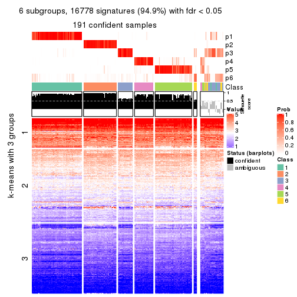</p>

</div>
</div>


Compare the overlap of signatures from different k:

```r
compare_signatures(res)
```


`get_signature()` returns a data frame invisibly. TO get the list of signatures, the function
call should be assigned to a variable explicitly. In following code, if `plot` argument is set
to `FALSE`, no heatmap is plotted while only the differential analysis is performed.

```r
# code only for demonstration
tb = get_signature(res, k = ..., plot = FALSE)
```

An example of the output of `tb` is:

```
#>   which_row         fdr    mean_1    mean_2 scaled_mean_1 scaled_mean_2 km
#> 1        38 0.042760348  8.373488  9.131774    -0.5533452     0.5164555  1
#> 2        40 0.018707592  7.106213  8.469186    -0.6173731     0.5762149  1
#> 3        55 0.019134737 10.221463 11.207825    -0.6159697     0.5749050  1
#> 4        59 0.006059896  5.921854  7.869574    -0.6899429     0.6439467  1
#> 5        60 0.018055526  8.928898 10.211722    -0.6204761     0.5791110  1
#> 6        98 0.009384629 15.714769 14.887706     0.6635654    -0.6193277  2
...
```

The columns in `tb` are:

1. `which_row`: row indices corresponding to the input matrix.
2. `fdr`: FDR for the differential test. 
3. `mean_x`: The mean value in group x.
4. `scaled_mean_x`: The mean value in group x after rows are scaled.
5. `km`: Row groups if k-means clustering is applied to rows.


UMAP plot which shows how samples are separated.


<script>
$( function() {
	$( '#tabs-SD-skmeans-dimension-reduction' ).tabs();
} );
</script>
<div id='tabs-SD-skmeans-dimension-reduction'>
<ul>
<li><a href='#tab-SD-skmeans-dimension-reduction-1'>k = 2</a></li>
<li><a href='#tab-SD-skmeans-dimension-reduction-2'>k = 3</a></li>
<li><a href='#tab-SD-skmeans-dimension-reduction-3'>k = 4</a></li>
<li><a href='#tab-SD-skmeans-dimension-reduction-4'>k = 5</a></li>
<li><a href='#tab-SD-skmeans-dimension-reduction-5'>k = 6</a></li>
</ul>
<div id='tab-SD-skmeans-dimension-reduction-1'>
<pre><code class="r">dimension_reduction(res, k = 2, method = &quot;UMAP&quot;)
</code></pre>

<p></p>

</div>
<div id='tab-SD-skmeans-dimension-reduction-2'>
<pre><code class="r">dimension_reduction(res, k = 3, method = &quot;UMAP&quot;)
</code></pre>

<p></p>

</div>
<div id='tab-SD-skmeans-dimension-reduction-3'>
<pre><code class="r">dimension_reduction(res, k = 4, method = &quot;UMAP&quot;)
</code></pre>

<p></p>

</div>
<div id='tab-SD-skmeans-dimension-reduction-4'>
<pre><code class="r">dimension_reduction(res, k = 5, method = &quot;UMAP&quot;)
</code></pre>

<p></p>

</div>
<div id='tab-SD-skmeans-dimension-reduction-5'>
<pre><code class="r">dimension_reduction(res, k = 6, method = &quot;UMAP&quot;)
</code></pre>

<p></p>

</div>
</div>


Following heatmap shows how subgroups are split when increasing `k`:

```r
collect_classes(res)
```


If matrix rows can be associated to genes, consider to use `GO_Enrichment(res,
...)` to perform function enrichment for the signature genes.


 

---------------------------------------------------


### SD:pam**


The object with results only for a single top-value method and a single partition method 
can be extracted as:

```r
res = res_list["SD", "pam"]
# you can also extract it by
# res = res_list["SD:pam"]
```

A summary of `res` and all the functions that can be applied to it:

```r
res
```

```
#> A 'ConsensusPartition' object with k = 2, 3, 4, 5, 6.
#>   On a matrix with 17680 rows and 218 columns.
#>   Top rows (1000, 2000, 3000, 4000, 5000) are extracted by 'SD' method.
#>   Subgroups are detected by 'pam' method.
#>   Performed in total 1250 partitions by row resampling.
#>   Best k for subgroups seems to be 2.
#> 
#> Following methods can be applied to this 'ConsensusPartition' object:
#>  [1] "cola_report"             "collect_classes"         "collect_plots"          
#>  [4] "collect_stats"           "colnames"                "compare_signatures"     
#>  [7] "consensus_heatmap"       "dimension_reduction"     "functional_enrichment"  
#> [10] "get_anno_col"            "get_anno"                "get_classes"            
#> [13] "get_consensus"           "get_matrix"              "get_membership"         
#> [16] "get_param"               "get_signatures"          "get_stats"              
#> [19] "is_best_k"               "is_stable_k"             "membership_heatmap"     
#> [22] "ncol"                    "nrow"                    "plot_ecdf"              
#> [25] "rownames"                "select_partition_number" "show"                   
#> [28] "suggest_best_k"          "test_to_known_factors"
```

`collect_plots()` function collects all the plots made from `res` for all `k` (number of partitions)
into one single page to provide an easy and fast comparison between different `k`.

```r
collect_plots(res)
```


The plots are:

- The first row: a plot of the ECDF (Empirical cumulative distribution
  function) curves of the consensus matrix for each `k` and the heatmap of
  predicted classes for each `k`.
- The second row: heatmaps of the consensus matrix for each `k`.
- The third row: heatmaps of the membership matrix for each `k`.
- The fouth row: heatmaps of the signatures for each `k`.

All the plots in panels can be made by individual functions and they are
plotted later in this section.

`select_partition_number()` produces several plots showing different
statistics for choosing "optimized" `k`. There are following statistics:

- ECDF curves of the consensus matrix for each `k`;
- 1-PAC. [The PAC
  score](https://en.wikipedia.org/wiki/Consensus_clustering#Over-interpretation_potential_of_consensus_clustering)
  measures the proportion of the ambiguous subgrouping.
- Mean silhouette score.
- Concordance. The mean probability of fiting the consensus class ids in all
  partitions.
- Area increased. Denote $A_k$ as the area under the ECDF curve for current
  `k`, the area increased is defined as $A_k - A_{k-1}$.
- Rand index. The percent of pairs of samples that are both in a same cluster
  or both are not in a same cluster in the partition of k and k-1.
- Jaccard index. The ratio of pairs of samples are both in a same cluster in
  the partition of k and k-1 and the pairs of samples are both in a same
  cluster in the partition k or k-1.

The detailed explanations of these statistics can be found in [the cola
vignette](http://bioconductor.org/packages/devel/bioc/vignettes/cola/inst/doc/cola.html#toc_13).

Generally speaking, lower PAC score, higher mean silhouette score or higher
concordance corresponds to better partition. Rand index and Jaccard index
measure how similar the current partition is compared to partition with `k-1`.
If they are too similar, we won't accept `k` is better than `k-1`.

```r
select_partition_number(res)
```


The numeric values for all these statistics can be obtained by `get_stats()`.

```r
get_stats(res)
```

```
#>   k 1-PAC mean_silhouette concordance area_increased  Rand Jaccard
#> 2 2 0.962           0.951       0.978         0.4989 0.498   0.498
#> 3 3 0.735           0.876       0.885         0.2420 0.850   0.712
#> 4 4 0.718           0.803       0.879         0.1817 0.843   0.619
#> 5 5 0.857           0.788       0.900         0.0803 0.913   0.696
#> 6 6 0.761           0.468       0.694         0.0400 0.846   0.419
```

`suggest_best_k()` suggests the best $k$ based on these statistics. The rules are as follows:

- All $k$ with Jaccard index larger than 0.95 are removed because the increase of
  the partition number does not provides enough extra information. If all $k$ are removed,
  the best $k$ is assigned by `NA`.
- For $k$ with 1-PAC larger than 0.9, the maximal $k$ is taken as the "best k". Other $k$ is called "optional k".
- If it does not fit the second rule. The $k$ with the highest vote of highest
  1-PAC, mean silhouette and concordance is taken as the "best k".

```r
suggest_best_k(res)
```

```
#> [1] 2
```


Following shows the table of the partitions (You need to click the **show/hide
code output** link to see it). The membership matrix (columns with name `p*`)
is inferred by
[`clue::cl_consensus()`](https://www.rdocumentation.org/link/cl_consensus?package=clue)
function with the `SE` method. Basically the value in the membership matrix
represents the probability to belong to a certain group. The finall class
label for an item is determined with the group with highest probability it
belongs to.

In `get_classes()` function, the entropy is calculated from the membership
matrix and the silhouette score is calculated from the consensus matrix.


<script>
$( function() {
	$( '#tabs-SD-pam-get-classes' ).tabs();
} );
</script>
<div id='tabs-SD-pam-get-classes'>
<ul>
<li><a href='#tab-SD-pam-get-classes-1'>k = 2</a></li>
<li><a href='#tab-SD-pam-get-classes-2'>k = 3</a></li>
<li><a href='#tab-SD-pam-get-classes-3'>k = 4</a></li>
<li><a href='#tab-SD-pam-get-classes-4'>k = 5</a></li>
<li><a href='#tab-SD-pam-get-classes-5'>k = 6</a></li>
</ul>

<div id='tab-SD-pam-get-classes-1'>
<p><a id='tab-SD-pam-get-classes-1-a' style='color:#0366d6' href='#'>show/hide code output</a></p>
<pre><code class="r">cbind(get_classes(res, k = 2), get_membership(res, k = 2))
</code></pre>

<pre><code>#&gt;            class entropy silhouette    p1    p2
#&gt; SRR1498997     2   0.000      0.997 0.000 1.000
#&gt; SRR1076441     1   0.000      0.956 1.000 0.000
#&gt; SRR1489803     2   0.000      0.997 0.000 1.000
#&gt; SRR1345953     2   0.000      0.997 0.000 1.000
#&gt; SRR1357826     2   0.000      0.997 0.000 1.000
#&gt; SRR1419656     1   0.000      0.956 1.000 0.000
#&gt; SRR1454158     2   0.000      0.997 0.000 1.000
#&gt; SRR1475408     2   0.000      0.997 0.000 1.000
#&gt; SRR1472704     2   0.000      0.997 0.000 1.000
#&gt; SRR1090046     1   0.000      0.956 1.000 0.000
#&gt; SRR1312822     1   0.000      0.956 1.000 0.000
#&gt; SRR1096987     2   0.000      0.997 0.000 1.000
#&gt; SRR1334587     2   0.000      0.997 0.000 1.000
#&gt; SRR1490246     1   0.000      0.956 1.000 0.000
#&gt; SRR1467522     1   0.000      0.956 1.000 0.000
#&gt; SRR1324206     1   0.000      0.956 1.000 0.000
#&gt; SRR1408574     2   0.000      0.997 0.000 1.000
#&gt; SRR1083959     2   0.000      0.997 0.000 1.000
#&gt; SRR1079948     2   0.000      0.997 0.000 1.000
#&gt; SRR1310667     2   0.000      0.997 0.000 1.000
#&gt; SRR655852      2   0.000      0.997 0.000 1.000
#&gt; SRR1352457     2   0.000      0.997 0.000 1.000
#&gt; SRR1353994     2   0.000      0.997 0.000 1.000
#&gt; SRR1459561     2   0.000      0.997 0.000 1.000
#&gt; SRR1454009     1   0.000      0.956 1.000 0.000
#&gt; SRR1071084     1   0.000      0.956 1.000 0.000
#&gt; SRR1082859     2   0.000      0.997 0.000 1.000
#&gt; SRR1086538     1   0.000      0.956 1.000 0.000
#&gt; SRR1486262     2   0.000      0.997 0.000 1.000
#&gt; SRR658105      1   0.000      0.956 1.000 0.000
#&gt; SRR811073      2   0.000      0.997 0.000 1.000
#&gt; SRR1429181     2   0.000      0.997 0.000 1.000
#&gt; SRR1327896     2   0.000      0.997 0.000 1.000
#&gt; SRR1464788     2   0.000      0.997 0.000 1.000
#&gt; SRR1346861     2   0.000      0.997 0.000 1.000
#&gt; SRR1318774     2   0.000      0.997 0.000 1.000
#&gt; SRR1420517     1   0.000      0.956 1.000 0.000
#&gt; SRR1369584     2   0.000      0.997 0.000 1.000
#&gt; SRR1443244     1   0.939      0.508 0.644 0.356
#&gt; SRR1455391     1   0.000      0.956 1.000 0.000
#&gt; SRR1068999     1   0.000      0.956 1.000 0.000
#&gt; SRR1481297     1   0.000      0.956 1.000 0.000
#&gt; SRR1070208     1   0.000      0.956 1.000 0.000
#&gt; SRR1317282     1   0.000      0.956 1.000 0.000
#&gt; SRR1096125     2   0.000      0.997 0.000 1.000
#&gt; SRR1472506     1   0.855      0.647 0.720 0.280
#&gt; SRR1388281     2   0.000      0.997 0.000 1.000
#&gt; SRR1365622     2   0.000      0.997 0.000 1.000
#&gt; SRR662306      1   0.000      0.956 1.000 0.000
#&gt; SRR662811      1   0.000      0.956 1.000 0.000
#&gt; SRR820571      1   0.855      0.647 0.720 0.280
#&gt; SRR1357166     1   0.000      0.956 1.000 0.000
#&gt; SRR1488586     1   0.456      0.873 0.904 0.096
#&gt; SRR1485398     1   0.000      0.956 1.000 0.000
#&gt; SRR1417725     2   0.000      0.997 0.000 1.000
#&gt; SRR1409397     2   0.000      0.997 0.000 1.000
#&gt; SRR1465693     2   0.000      0.997 0.000 1.000
#&gt; SRR1096547     1   0.952      0.474 0.628 0.372
#&gt; SRR1456818     1   0.000      0.956 1.000 0.000
#&gt; SRR816336      1   0.814      0.689 0.748 0.252
#&gt; SRR1420238     1   0.000      0.956 1.000 0.000
#&gt; SRR1433374     1   0.000      0.956 1.000 0.000
#&gt; SRR1436990     1   0.000      0.956 1.000 0.000
#&gt; SRR662378      1   0.000      0.956 1.000 0.000
#&gt; SRR1477671     1   0.000      0.956 1.000 0.000
#&gt; SRR1084079     1   0.955      0.465 0.624 0.376
#&gt; SRR1102949     1   0.000      0.956 1.000 0.000
#&gt; SRR1458090     1   0.000      0.956 1.000 0.000
#&gt; SRR1418729     2   0.000      0.997 0.000 1.000
#&gt; SRR1403814     2   0.000      0.997 0.000 1.000
#&gt; SRR1404887     1   0.855      0.647 0.720 0.280
#&gt; SRR1434955     1   0.000      0.956 1.000 0.000
#&gt; SRR1360652     1   0.000      0.956 1.000 0.000
#&gt; SRR1356765     2   0.000      0.997 0.000 1.000
#&gt; SRR1078258     2   0.000      0.997 0.000 1.000
#&gt; SRR1455861     1   0.000      0.956 1.000 0.000
#&gt; SRR1420296     2   0.000      0.997 0.000 1.000
#&gt; SRR1070260     2   0.000      0.997 0.000 1.000
#&gt; SRR1410765     1   0.000      0.956 1.000 0.000
#&gt; SRR1481315     1   0.000      0.956 1.000 0.000
#&gt; SRR1414661     2   0.000      0.997 0.000 1.000
#&gt; SRR1359147     2   0.000      0.997 0.000 1.000
#&gt; SRR1488694     1   0.671      0.787 0.824 0.176
#&gt; SRR1477273     1   0.000      0.956 1.000 0.000
#&gt; SRR1415792     1   0.000      0.956 1.000 0.000
#&gt; SRR1369088     2   0.260      0.949 0.044 0.956
#&gt; SRR1406621     2   0.000      0.997 0.000 1.000
#&gt; SRR1401017     2   0.000      0.997 0.000 1.000
#&gt; SRR1099981     2   0.000      0.997 0.000 1.000
#&gt; SRR815208      2   0.000      0.997 0.000 1.000
#&gt; SRR1380460     2   0.000      0.997 0.000 1.000
#&gt; SRR1091097     2   0.000      0.997 0.000 1.000
#&gt; SRR1456010     1   0.000      0.956 1.000 0.000
#&gt; SRR1498416     2   0.000      0.997 0.000 1.000
#&gt; SRR818873      2   0.000      0.997 0.000 1.000
#&gt; SRR813868      2   0.000      0.997 0.000 1.000
#&gt; SRR1394912     1   0.000      0.956 1.000 0.000
#&gt; SRR1475824     2   0.000      0.997 0.000 1.000
#&gt; SRR1459866     1   0.000      0.956 1.000 0.000
#&gt; SRR1364871     1   0.963      0.436 0.612 0.388
#&gt; SRR1100472     2   0.000      0.997 0.000 1.000
#&gt; SRR1331267     1   0.000      0.956 1.000 0.000
#&gt; SRR1068977     2   0.000      0.997 0.000 1.000
#&gt; SRR1391511     2   0.000      0.997 0.000 1.000
#&gt; SRR1077920     2   0.000      0.997 0.000 1.000
#&gt; SRR1457705     1   0.000      0.956 1.000 0.000
#&gt; SRR1437073     1   0.000      0.956 1.000 0.000
#&gt; SRR1473124     1   0.000      0.956 1.000 0.000
#&gt; SRR1469279     1   0.000      0.956 1.000 0.000
#&gt; SRR1091791     2   0.000      0.997 0.000 1.000
#&gt; SRR1341539     2   0.000      0.997 0.000 1.000
#&gt; SRR1446354     1   0.000      0.956 1.000 0.000
#&gt; SRR1415420     1   0.000      0.956 1.000 0.000
#&gt; SRR1368050     1   0.000      0.956 1.000 0.000
#&gt; SRR656970      2   0.000      0.997 0.000 1.000
#&gt; SRR1473403     2   0.000      0.997 0.000 1.000
#&gt; SRR1084674     1   0.000      0.956 1.000 0.000
#&gt; SRR1464702     1   0.000      0.956 1.000 0.000
#&gt; SRR1074860     2   0.000      0.997 0.000 1.000
#&gt; SRR655447      2   0.000      0.997 0.000 1.000
#&gt; SRR1404442     2   0.000      0.997 0.000 1.000
#&gt; SRR1418795     1   0.000      0.956 1.000 0.000
#&gt; SRR1458335     2   0.000      0.997 0.000 1.000
#&gt; SRR1489589     2   0.000      0.997 0.000 1.000
#&gt; SRR1378284     1   0.000      0.956 1.000 0.000
#&gt; SRR1408014     2   0.000      0.997 0.000 1.000
#&gt; SRR1083052     1   0.000      0.956 1.000 0.000
#&gt; SRR1339236     2   0.000      0.997 0.000 1.000
#&gt; SRR1323829     2   0.000      0.997 0.000 1.000
#&gt; SRR1086772     2   0.000      0.997 0.000 1.000
#&gt; SRR1486457     1   0.000      0.956 1.000 0.000
#&gt; SRR1415257     2   0.000      0.997 0.000 1.000
#&gt; SRR1071905     1   0.000      0.956 1.000 0.000
#&gt; SRR659223      2   0.000      0.997 0.000 1.000
#&gt; SRR1386945     1   0.000      0.956 1.000 0.000
#&gt; SRR821498      2   0.000      0.997 0.000 1.000
#&gt; SRR1378903     2   0.000      0.997 0.000 1.000
#&gt; SRR1472907     1   0.000      0.956 1.000 0.000
#&gt; SRR1442313     2   0.000      0.997 0.000 1.000
#&gt; SRR1077139     2   0.000      0.997 0.000 1.000
#&gt; SRR1342758     1   0.000      0.956 1.000 0.000
#&gt; SRR656911      2   0.000      0.997 0.000 1.000
#&gt; SRR1070738     1   0.000      0.956 1.000 0.000
#&gt; SRR1476950     1   0.000      0.956 1.000 0.000
#&gt; SRR1488196     1   0.000      0.956 1.000 0.000
#&gt; SRR1498951     1   0.000      0.956 1.000 0.000
#&gt; SRR1413392     1   0.000      0.956 1.000 0.000
#&gt; SRR657528      2   0.000      0.997 0.000 1.000
#&gt; SRR812198      1   0.000      0.956 1.000 0.000
#&gt; SRR660283      2   0.000      0.997 0.000 1.000
#&gt; SRR1420936     1   0.000      0.956 1.000 0.000
#&gt; SRR1469547     2   0.000      0.997 0.000 1.000
#&gt; SRR1322249     1   0.000      0.956 1.000 0.000
#&gt; SRR1396682     1   0.000      0.956 1.000 0.000
#&gt; SRR1095816     2   0.000      0.997 0.000 1.000
#&gt; SRR1081023     1   0.000      0.956 1.000 0.000
#&gt; SRR1092517     2   0.000      0.997 0.000 1.000
#&gt; SRR811285      2   0.000      0.997 0.000 1.000
#&gt; SRR657018      1   0.000      0.956 1.000 0.000
#&gt; SRR1365534     1   0.000      0.956 1.000 0.000
#&gt; SRR1090791     2   0.000      0.997 0.000 1.000
#&gt; SRR1439915     2   0.000      0.997 0.000 1.000
#&gt; SRR1391575     2   0.760      0.693 0.220 0.780
#&gt; SRR1314092     2   0.000      0.997 0.000 1.000
#&gt; SRR1328941     1   0.000      0.956 1.000 0.000
#&gt; SRR1336181     2   0.000      0.997 0.000 1.000
#&gt; SRR1362972     1   0.000      0.956 1.000 0.000
#&gt; SRR1366790     2   0.000      0.997 0.000 1.000
#&gt; SRR1455902     1   0.000      0.956 1.000 0.000
#&gt; SRR1437644     1   0.952      0.474 0.628 0.372
#&gt; SRR1105009     2   0.000      0.997 0.000 1.000
#&gt; SRR1367024     1   0.000      0.956 1.000 0.000
#&gt; SRR660248      2   0.000      0.997 0.000 1.000
#&gt; SRR1409620     1   0.000      0.956 1.000 0.000
#&gt; SRR1455807     2   0.000      0.997 0.000 1.000
#&gt; SRR1339431     1   0.000      0.956 1.000 0.000
#&gt; SRR1378948     1   0.952      0.474 0.628 0.372
#&gt; SRR1469237     1   0.000      0.956 1.000 0.000
#&gt; SRR1098264     2   0.000      0.997 0.000 1.000
#&gt; SRR1406224     2   0.000      0.997 0.000 1.000
#&gt; SRR1393026     1   0.000      0.956 1.000 0.000
#&gt; SRR808428      2   0.000      0.997 0.000 1.000
#&gt; SRR615910      2   0.000      0.997 0.000 1.000
#&gt; SRR1076219     1   0.000      0.956 1.000 0.000
#&gt; SRR1481128     1   0.000      0.956 1.000 0.000
#&gt; SRR1359262     2   0.000      0.997 0.000 1.000
#&gt; SRR1407648     2   0.000      0.997 0.000 1.000
#&gt; SRR1386775     1   0.795      0.706 0.760 0.240
#&gt; SRR1388399     1   0.844      0.660 0.728 0.272
#&gt; SRR1361499     2   0.000      0.997 0.000 1.000
#&gt; SRR1500709     2   0.000      0.997 0.000 1.000
#&gt; SRR1335917     1   0.000      0.956 1.000 0.000
#&gt; SRR1430615     2   0.000      0.997 0.000 1.000
#&gt; SRR1335212     1   0.000      0.956 1.000 0.000
#&gt; SRR1400159     2   0.000      0.997 0.000 1.000
#&gt; SRR1457245     2   0.000      0.997 0.000 1.000
#&gt; SRR1356746     2   0.000      0.997 0.000 1.000
#&gt; SRR658319      2   0.000      0.997 0.000 1.000
#&gt; SRR1435946     1   0.000      0.956 1.000 0.000
#&gt; SRR1370308     1   0.000      0.956 1.000 0.000
#&gt; SRR1100893     1   0.000      0.956 1.000 0.000
#&gt; SRR1389432     1   0.000      0.956 1.000 0.000
#&gt; SRR1381799     2   0.000      0.997 0.000 1.000
#&gt; SRR1310158     1   0.000      0.956 1.000 0.000
#&gt; SRR1341100     1   0.952      0.474 0.628 0.372
#&gt; SRR1342873     1   0.000      0.956 1.000 0.000
#&gt; SRR1472102     2   0.000      0.997 0.000 1.000
#&gt; SRR1409421     1   0.000      0.956 1.000 0.000
#&gt; SRR1328577     2   0.000      0.997 0.000 1.000
#&gt; SRR808942      2   0.000      0.997 0.000 1.000
#&gt; SRR1343818     2   0.000      0.997 0.000 1.000
#&gt; SRR1472415     2   0.000      0.997 0.000 1.000
#&gt; SRR658409      2   0.000      0.997 0.000 1.000
#&gt; SRR1469681     1   0.000      0.956 1.000 0.000
#&gt; SRR1075484     2   0.000      0.997 0.000 1.000
#&gt; SRR1417894     1   0.000      0.956 1.000 0.000
#&gt; SRR1417422     2   0.000      0.997 0.000 1.000
#&gt; SRR1090674     1   0.000      0.956 1.000 0.000
</code></pre>

<script>
$('#tab-SD-pam-get-classes-1-a').parent().next().next().hide();
$('#tab-SD-pam-get-classes-1-a').click(function(){
  $('#tab-SD-pam-get-classes-1-a').parent().next().next().toggle();
  return(false);
});
</script>
</div>

<div id='tab-SD-pam-get-classes-2'>
<p><a id='tab-SD-pam-get-classes-2-a' style='color:#0366d6' href='#'>show/hide code output</a></p>
<pre><code class="r">cbind(get_classes(res, k = 3), get_membership(res, k = 3))
</code></pre>

<pre><code>#&gt;            class entropy silhouette    p1    p2    p3
#&gt; SRR1498997     2  0.4887      0.880 0.000 0.772 0.228
#&gt; SRR1076441     1  0.0000      0.945 1.000 0.000 0.000
#&gt; SRR1489803     2  0.5058      0.876 0.000 0.756 0.244
#&gt; SRR1345953     2  0.0000      0.885 0.000 1.000 0.000
#&gt; SRR1357826     2  0.4931      0.878 0.000 0.768 0.232
#&gt; SRR1419656     1  0.2711      0.838 0.912 0.000 0.088
#&gt; SRR1454158     2  0.4504      0.890 0.000 0.804 0.196
#&gt; SRR1475408     2  0.4931      0.633 0.000 0.768 0.232
#&gt; SRR1472704     2  0.4887      0.879 0.000 0.772 0.228
#&gt; SRR1090046     3  0.5138      0.909 0.252 0.000 0.748
#&gt; SRR1312822     1  0.0000      0.945 1.000 0.000 0.000
#&gt; SRR1096987     2  0.0424      0.882 0.000 0.992 0.008
#&gt; SRR1334587     2  0.4452      0.889 0.000 0.808 0.192
#&gt; SRR1490246     1  0.0000      0.945 1.000 0.000 0.000
#&gt; SRR1467522     1  0.0000      0.945 1.000 0.000 0.000
#&gt; SRR1324206     1  0.0000      0.945 1.000 0.000 0.000
#&gt; SRR1408574     2  0.1031      0.881 0.000 0.976 0.024
#&gt; SRR1083959     2  0.4346      0.890 0.000 0.816 0.184
#&gt; SRR1079948     2  0.0424      0.882 0.000 0.992 0.008
#&gt; SRR1310667     2  0.5058      0.876 0.000 0.756 0.244
#&gt; SRR655852      2  0.0424      0.882 0.000 0.992 0.008
#&gt; SRR1352457     2  0.4346      0.889 0.000 0.816 0.184
#&gt; SRR1353994     2  0.0000      0.885 0.000 1.000 0.000
#&gt; SRR1459561     2  0.5058      0.876 0.000 0.756 0.244
#&gt; SRR1454009     3  0.5138      0.909 0.252 0.000 0.748
#&gt; SRR1071084     3  0.5058      0.906 0.244 0.000 0.756
#&gt; SRR1082859     2  0.4931      0.878 0.000 0.768 0.232
#&gt; SRR1086538     1  0.0000      0.945 1.000 0.000 0.000
#&gt; SRR1486262     2  0.0424      0.882 0.000 0.992 0.008
#&gt; SRR658105      1  0.0000      0.945 1.000 0.000 0.000
#&gt; SRR811073      2  0.0000      0.885 0.000 1.000 0.000
#&gt; SRR1429181     2  0.1643      0.891 0.000 0.956 0.044
#&gt; SRR1327896     2  0.0000      0.885 0.000 1.000 0.000
#&gt; SRR1464788     2  0.4178      0.893 0.000 0.828 0.172
#&gt; SRR1346861     2  0.4887      0.879 0.000 0.772 0.228
#&gt; SRR1318774     2  0.2165      0.889 0.000 0.936 0.064
#&gt; SRR1420517     1  0.1529      0.908 0.960 0.000 0.040
#&gt; SRR1369584     2  0.5058      0.876 0.000 0.756 0.244
#&gt; SRR1443244     1  0.6680      0.190 0.508 0.484 0.008
#&gt; SRR1455391     3  0.5497      0.859 0.292 0.000 0.708
#&gt; SRR1068999     1  0.0000      0.945 1.000 0.000 0.000
#&gt; SRR1481297     1  0.6309     -0.416 0.500 0.000 0.500
#&gt; SRR1070208     1  0.0000      0.945 1.000 0.000 0.000
#&gt; SRR1317282     3  0.5138      0.909 0.252 0.000 0.748
#&gt; SRR1096125     2  0.0000      0.885 0.000 1.000 0.000
#&gt; SRR1472506     3  0.5244      0.690 0.004 0.240 0.756
#&gt; SRR1388281     2  0.2878      0.896 0.000 0.904 0.096
#&gt; SRR1365622     2  0.0892      0.881 0.000 0.980 0.020
#&gt; SRR662306      3  0.5138      0.909 0.252 0.000 0.748
#&gt; SRR662811      1  0.0000      0.945 1.000 0.000 0.000
#&gt; SRR820571      1  0.6067      0.595 0.736 0.236 0.028
#&gt; SRR1357166     3  0.5138      0.909 0.252 0.000 0.748
#&gt; SRR1488586     1  0.2280      0.874 0.940 0.052 0.008
#&gt; SRR1485398     1  0.0000      0.945 1.000 0.000 0.000
#&gt; SRR1417725     3  0.6111      0.428 0.000 0.396 0.604
#&gt; SRR1409397     2  0.4555      0.887 0.000 0.800 0.200
#&gt; SRR1465693     2  0.4555      0.887 0.000 0.800 0.200
#&gt; SRR1096547     3  0.4887      0.694 0.000 0.228 0.772
#&gt; SRR1456818     1  0.0000      0.945 1.000 0.000 0.000
#&gt; SRR816336      3  0.5551      0.710 0.020 0.212 0.768
#&gt; SRR1420238     1  0.0000      0.945 1.000 0.000 0.000
#&gt; SRR1433374     3  0.5138      0.909 0.252 0.000 0.748
#&gt; SRR1436990     1  0.0000      0.945 1.000 0.000 0.000
#&gt; SRR662378      1  0.0000      0.945 1.000 0.000 0.000
#&gt; SRR1477671     1  0.0000      0.945 1.000 0.000 0.000
#&gt; SRR1084079     2  0.0661      0.881 0.004 0.988 0.008
#&gt; SRR1102949     1  0.0000      0.945 1.000 0.000 0.000
#&gt; SRR1458090     1  0.0000      0.945 1.000 0.000 0.000
#&gt; SRR1418729     2  0.0424      0.882 0.000 0.992 0.008
#&gt; SRR1403814     2  0.0424      0.882 0.000 0.992 0.008
#&gt; SRR1404887     1  0.5541      0.594 0.740 0.252 0.008
#&gt; SRR1434955     1  0.0000      0.945 1.000 0.000 0.000
#&gt; SRR1360652     1  0.0000      0.945 1.000 0.000 0.000
#&gt; SRR1356765     2  0.1529      0.886 0.000 0.960 0.040
#&gt; SRR1078258     2  0.0000      0.885 0.000 1.000 0.000
#&gt; SRR1455861     1  0.0000      0.945 1.000 0.000 0.000
#&gt; SRR1420296     2  0.4974      0.879 0.000 0.764 0.236
#&gt; SRR1070260     2  0.4887      0.879 0.000 0.772 0.228
#&gt; SRR1410765     1  0.0000      0.945 1.000 0.000 0.000
#&gt; SRR1481315     1  0.0000      0.945 1.000 0.000 0.000
#&gt; SRR1414661     2  0.2066      0.893 0.000 0.940 0.060
#&gt; SRR1359147     2  0.0000      0.885 0.000 1.000 0.000
#&gt; SRR1488694     1  0.4963      0.667 0.792 0.200 0.008
#&gt; SRR1477273     3  0.5058      0.906 0.244 0.000 0.756
#&gt; SRR1415792     3  0.5138      0.909 0.252 0.000 0.748
#&gt; SRR1369088     2  0.1163      0.880 0.000 0.972 0.028
#&gt; SRR1406621     2  0.0892      0.881 0.000 0.980 0.020
#&gt; SRR1401017     2  0.4654      0.887 0.000 0.792 0.208
#&gt; SRR1099981     2  0.4452      0.889 0.000 0.808 0.192
#&gt; SRR815208      2  0.4931      0.878 0.000 0.768 0.232
#&gt; SRR1380460     2  0.0000      0.885 0.000 1.000 0.000
#&gt; SRR1091097     2  0.0424      0.882 0.000 0.992 0.008
#&gt; SRR1456010     3  0.5138      0.909 0.252 0.000 0.748
#&gt; SRR1498416     2  0.0000      0.885 0.000 1.000 0.000
#&gt; SRR818873      2  0.4555      0.887 0.000 0.800 0.200
#&gt; SRR813868      2  0.0237      0.885 0.000 0.996 0.004
#&gt; SRR1394912     1  0.0000      0.945 1.000 0.000 0.000
#&gt; SRR1475824     2  0.0424      0.882 0.000 0.992 0.008
#&gt; SRR1459866     1  0.0000      0.945 1.000 0.000 0.000
#&gt; SRR1364871     2  0.6975      0.308 0.356 0.616 0.028
#&gt; SRR1100472     2  0.4842      0.880 0.000 0.776 0.224
#&gt; SRR1331267     1  0.0424      0.937 0.992 0.000 0.008
#&gt; SRR1068977     2  0.0892      0.881 0.000 0.980 0.020
#&gt; SRR1391511     2  0.4796      0.882 0.000 0.780 0.220
#&gt; SRR1077920     2  0.4931      0.878 0.000 0.768 0.232
#&gt; SRR1457705     3  0.5138      0.909 0.252 0.000 0.748
#&gt; SRR1437073     1  0.0000      0.945 1.000 0.000 0.000
#&gt; SRR1473124     3  0.5058      0.906 0.244 0.000 0.756
#&gt; SRR1469279     3  0.5138      0.909 0.252 0.000 0.748
#&gt; SRR1091791     2  0.0424      0.882 0.000 0.992 0.008
#&gt; SRR1341539     2  0.1529      0.886 0.000 0.960 0.040
#&gt; SRR1446354     3  0.5138      0.909 0.252 0.000 0.748
#&gt; SRR1415420     1  0.0000      0.945 1.000 0.000 0.000
#&gt; SRR1368050     1  0.0000      0.945 1.000 0.000 0.000
#&gt; SRR656970      2  0.5058      0.876 0.000 0.756 0.244
#&gt; SRR1473403     2  0.0000      0.885 0.000 1.000 0.000
#&gt; SRR1084674     3  0.5138      0.909 0.252 0.000 0.748
#&gt; SRR1464702     1  0.0000      0.945 1.000 0.000 0.000
#&gt; SRR1074860     2  0.0424      0.882 0.000 0.992 0.008
#&gt; SRR655447      2  0.0000      0.885 0.000 1.000 0.000
#&gt; SRR1404442     2  0.4887      0.879 0.000 0.772 0.228
#&gt; SRR1418795     1  0.0000      0.945 1.000 0.000 0.000
#&gt; SRR1458335     2  0.3038      0.895 0.000 0.896 0.104
#&gt; SRR1489589     2  0.4702      0.885 0.000 0.788 0.212
#&gt; SRR1378284     1  0.2400      0.862 0.932 0.064 0.004
#&gt; SRR1408014     2  0.5058      0.876 0.000 0.756 0.244
#&gt; SRR1083052     1  0.0000      0.945 1.000 0.000 0.000
#&gt; SRR1339236     3  0.2066      0.680 0.000 0.060 0.940
#&gt; SRR1323829     2  0.5016      0.877 0.000 0.760 0.240
#&gt; SRR1086772     2  0.2796      0.896 0.000 0.908 0.092
#&gt; SRR1486457     3  0.5138      0.909 0.252 0.000 0.748
#&gt; SRR1415257     2  0.4555      0.887 0.000 0.800 0.200
#&gt; SRR1071905     3  0.5138      0.909 0.252 0.000 0.748
#&gt; SRR659223      2  0.5058      0.876 0.000 0.756 0.244
#&gt; SRR1386945     3  0.5138      0.909 0.252 0.000 0.748
#&gt; SRR821498      2  0.0424      0.882 0.000 0.992 0.008
#&gt; SRR1378903     2  0.0000      0.885 0.000 1.000 0.000
#&gt; SRR1472907     1  0.1964      0.882 0.944 0.000 0.056
#&gt; SRR1442313     2  0.4931      0.878 0.000 0.768 0.232
#&gt; SRR1077139     2  0.5058      0.876 0.000 0.756 0.244
#&gt; SRR1342758     1  0.0000      0.945 1.000 0.000 0.000
#&gt; SRR656911      2  0.0000      0.885 0.000 1.000 0.000
#&gt; SRR1070738     1  0.0000      0.945 1.000 0.000 0.000
#&gt; SRR1476950     1  0.0000      0.945 1.000 0.000 0.000
#&gt; SRR1488196     3  0.5058      0.906 0.244 0.000 0.756
#&gt; SRR1498951     3  0.5138      0.909 0.252 0.000 0.748
#&gt; SRR1413392     1  0.0000      0.945 1.000 0.000 0.000
#&gt; SRR657528      2  0.4452      0.889 0.000 0.808 0.192
#&gt; SRR812198      1  0.0000      0.945 1.000 0.000 0.000
#&gt; SRR660283      2  0.4931      0.878 0.000 0.768 0.232
#&gt; SRR1420936     1  0.0000      0.945 1.000 0.000 0.000
#&gt; SRR1469547     2  0.4931      0.878 0.000 0.768 0.232
#&gt; SRR1322249     1  0.0000      0.945 1.000 0.000 0.000
#&gt; SRR1396682     1  0.0000      0.945 1.000 0.000 0.000
#&gt; SRR1095816     2  0.0424      0.882 0.000 0.992 0.008
#&gt; SRR1081023     1  0.0000      0.945 1.000 0.000 0.000
#&gt; SRR1092517     2  0.0000      0.885 0.000 1.000 0.000
#&gt; SRR811285      2  0.3267      0.894 0.000 0.884 0.116
#&gt; SRR657018      1  0.0000      0.945 1.000 0.000 0.000
#&gt; SRR1365534     3  0.5138      0.909 0.252 0.000 0.748
#&gt; SRR1090791     2  0.5058      0.876 0.000 0.756 0.244
#&gt; SRR1439915     2  0.4555      0.887 0.000 0.800 0.200
#&gt; SRR1391575     2  0.0424      0.882 0.000 0.992 0.008
#&gt; SRR1314092     2  0.0892      0.881 0.000 0.980 0.020
#&gt; SRR1328941     3  0.5058      0.906 0.244 0.000 0.756
#&gt; SRR1336181     2  0.4887      0.879 0.000 0.772 0.228
#&gt; SRR1362972     1  0.0000      0.945 1.000 0.000 0.000
#&gt; SRR1366790     2  0.4291      0.890 0.000 0.820 0.180
#&gt; SRR1455902     3  0.5138      0.909 0.252 0.000 0.748
#&gt; SRR1437644     2  0.2496      0.842 0.004 0.928 0.068
#&gt; SRR1105009     2  0.4887      0.879 0.000 0.772 0.228
#&gt; SRR1367024     3  0.5058      0.906 0.244 0.000 0.756
#&gt; SRR660248      2  0.2448      0.893 0.000 0.924 0.076
#&gt; SRR1409620     1  0.0000      0.945 1.000 0.000 0.000
#&gt; SRR1455807     2  0.4931      0.878 0.000 0.768 0.232
#&gt; SRR1339431     1  0.0000      0.945 1.000 0.000 0.000
#&gt; SRR1378948     3  0.5244      0.690 0.004 0.240 0.756
#&gt; SRR1469237     1  0.0000      0.945 1.000 0.000 0.000
#&gt; SRR1098264     2  0.2625      0.892 0.000 0.916 0.084
#&gt; SRR1406224     2  0.2356      0.892 0.000 0.928 0.072
#&gt; SRR1393026     3  0.5138      0.909 0.252 0.000 0.748
#&gt; SRR808428      2  0.4887      0.879 0.000 0.772 0.228
#&gt; SRR615910      2  0.5016      0.878 0.000 0.760 0.240
#&gt; SRR1076219     1  0.0000      0.945 1.000 0.000 0.000
#&gt; SRR1481128     1  0.0000      0.945 1.000 0.000 0.000
#&gt; SRR1359262     2  0.5058      0.876 0.000 0.756 0.244
#&gt; SRR1407648     2  0.0000      0.885 0.000 1.000 0.000
#&gt; SRR1386775     1  0.5292      0.628 0.764 0.228 0.008
#&gt; SRR1388399     1  0.5578      0.605 0.748 0.240 0.012
#&gt; SRR1361499     2  0.3816      0.893 0.000 0.852 0.148
#&gt; SRR1500709     2  0.0000      0.885 0.000 1.000 0.000
#&gt; SRR1335917     1  0.0000      0.945 1.000 0.000 0.000
#&gt; SRR1430615     2  0.5016      0.878 0.000 0.760 0.240
#&gt; SRR1335212     1  0.0424      0.937 0.992 0.000 0.008
#&gt; SRR1400159     3  0.4887      0.694 0.000 0.228 0.772
#&gt; SRR1457245     2  0.4887      0.880 0.000 0.772 0.228
#&gt; SRR1356746     2  0.4931      0.878 0.000 0.768 0.232
#&gt; SRR658319      2  0.3619      0.894 0.000 0.864 0.136
#&gt; SRR1435946     1  0.0000      0.945 1.000 0.000 0.000
#&gt; SRR1370308     1  0.0000      0.945 1.000 0.000 0.000
#&gt; SRR1100893     1  0.0000      0.945 1.000 0.000 0.000
#&gt; SRR1389432     3  0.5138      0.909 0.252 0.000 0.748
#&gt; SRR1381799     2  0.1643      0.886 0.000 0.956 0.044
#&gt; SRR1310158     3  0.5058      0.906 0.244 0.000 0.756
#&gt; SRR1341100     2  0.0829      0.880 0.004 0.984 0.012
#&gt; SRR1342873     1  0.0000      0.945 1.000 0.000 0.000
#&gt; SRR1472102     2  0.3267      0.894 0.000 0.884 0.116
#&gt; SRR1409421     1  0.0424      0.937 0.992 0.000 0.008
#&gt; SRR1328577     2  0.0000      0.885 0.000 1.000 0.000
#&gt; SRR808942      2  0.3192      0.895 0.000 0.888 0.112
#&gt; SRR1343818     2  0.0424      0.882 0.000 0.992 0.008
#&gt; SRR1472415     2  0.4887      0.879 0.000 0.772 0.228
#&gt; SRR658409      2  0.0000      0.885 0.000 1.000 0.000
#&gt; SRR1469681     1  0.0000      0.945 1.000 0.000 0.000
#&gt; SRR1075484     2  0.3267      0.895 0.000 0.884 0.116
#&gt; SRR1417894     3  0.5138      0.909 0.252 0.000 0.748
#&gt; SRR1417422     2  0.5016      0.878 0.000 0.760 0.240
#&gt; SRR1090674     1  0.0000      0.945 1.000 0.000 0.000
</code></pre>

<script>
$('#tab-SD-pam-get-classes-2-a').parent().next().next().hide();
$('#tab-SD-pam-get-classes-2-a').click(function(){
  $('#tab-SD-pam-get-classes-2-a').parent().next().next().toggle();
  return(false);
});
</script>
</div>

<div id='tab-SD-pam-get-classes-3'>
<p><a id='tab-SD-pam-get-classes-3-a' style='color:#0366d6' href='#'>show/hide code output</a></p>
<pre><code class="r">cbind(get_classes(res, k = 4), get_membership(res, k = 4))
</code></pre>

<pre><code>#&gt;            class entropy silhouette    p1    p2    p3    p4
#&gt; SRR1498997     2  0.0188     0.7953 0.000 0.996 0.000 0.004
#&gt; SRR1076441     1  0.0000     0.9637 1.000 0.000 0.000 0.000
#&gt; SRR1489803     2  0.2408     0.7668 0.000 0.896 0.000 0.104
#&gt; SRR1345953     2  0.4925     0.4522 0.000 0.572 0.000 0.428
#&gt; SRR1357826     2  0.0000     0.7950 0.000 1.000 0.000 0.000
#&gt; SRR1419656     1  0.4522     0.5352 0.680 0.000 0.320 0.000
#&gt; SRR1454158     2  0.3024     0.7802 0.000 0.852 0.000 0.148
#&gt; SRR1475408     4  0.6394     0.4115 0.000 0.244 0.120 0.636
#&gt; SRR1472704     2  0.0000     0.7950 0.000 1.000 0.000 0.000
#&gt; SRR1090046     3  0.0000     0.9599 0.000 0.000 1.000 0.000
#&gt; SRR1312822     1  0.0000     0.9637 1.000 0.000 0.000 0.000
#&gt; SRR1096987     4  0.2408     0.8289 0.000 0.104 0.000 0.896
#&gt; SRR1334587     2  0.3726     0.7574 0.000 0.788 0.000 0.212
#&gt; SRR1490246     1  0.0000     0.9637 1.000 0.000 0.000 0.000
#&gt; SRR1467522     1  0.0000     0.9637 1.000 0.000 0.000 0.000
#&gt; SRR1324206     1  0.0336     0.9574 0.992 0.000 0.008 0.000
#&gt; SRR1408574     4  0.0000     0.8263 0.000 0.000 0.000 1.000
#&gt; SRR1083959     2  0.1940     0.7837 0.000 0.924 0.000 0.076
#&gt; SRR1079948     4  0.2408     0.8289 0.000 0.104 0.000 0.896
#&gt; SRR1310667     2  0.2408     0.7668 0.000 0.896 0.000 0.104
#&gt; SRR655852      4  0.3907     0.6667 0.000 0.232 0.000 0.768
#&gt; SRR1352457     2  0.3801     0.7134 0.000 0.780 0.000 0.220
#&gt; SRR1353994     2  0.4564     0.6149 0.000 0.672 0.000 0.328
#&gt; SRR1459561     2  0.2408     0.7668 0.000 0.896 0.000 0.104
#&gt; SRR1454009     3  0.0188     0.9567 0.004 0.000 0.996 0.000
#&gt; SRR1071084     3  0.0000     0.9599 0.000 0.000 1.000 0.000
#&gt; SRR1082859     2  0.0000     0.7950 0.000 1.000 0.000 0.000
#&gt; SRR1086538     1  0.0000     0.9637 1.000 0.000 0.000 0.000
#&gt; SRR1486262     4  0.2408     0.8289 0.000 0.104 0.000 0.896
#&gt; SRR658105      1  0.0000     0.9637 1.000 0.000 0.000 0.000
#&gt; SRR811073      2  0.4522     0.6244 0.000 0.680 0.000 0.320
#&gt; SRR1429181     2  0.4888     0.6038 0.000 0.588 0.000 0.412
#&gt; SRR1327896     2  0.4925     0.4522 0.000 0.572 0.000 0.428
#&gt; SRR1464788     4  0.3024     0.7014 0.000 0.148 0.000 0.852
#&gt; SRR1346861     2  0.0000     0.7950 0.000 1.000 0.000 0.000
#&gt; SRR1318774     2  0.3688     0.7088 0.000 0.792 0.000 0.208
#&gt; SRR1420517     4  0.7621     0.2393 0.296 0.000 0.236 0.468
#&gt; SRR1369584     2  0.2408     0.7668 0.000 0.896 0.000 0.104
#&gt; SRR1443244     4  0.2676     0.8299 0.012 0.092 0.000 0.896
#&gt; SRR1455391     3  0.4477     0.5483 0.312 0.000 0.688 0.000
#&gt; SRR1068999     1  0.0592     0.9508 0.984 0.000 0.016 0.000
#&gt; SRR1481297     3  0.4454     0.5395 0.308 0.000 0.692 0.000
#&gt; SRR1070208     1  0.0000     0.9637 1.000 0.000 0.000 0.000
#&gt; SRR1317282     3  0.0000     0.9599 0.000 0.000 1.000 0.000
#&gt; SRR1096125     2  0.4925     0.4522 0.000 0.572 0.000 0.428
#&gt; SRR1472506     4  0.1406     0.8343 0.000 0.016 0.024 0.960
#&gt; SRR1388281     2  0.3569     0.7379 0.000 0.804 0.000 0.196
#&gt; SRR1365622     4  0.0469     0.8312 0.000 0.012 0.000 0.988
#&gt; SRR662306      3  0.0000     0.9599 0.000 0.000 1.000 0.000
#&gt; SRR662811      1  0.0000     0.9637 1.000 0.000 0.000 0.000
#&gt; SRR820571      4  0.2589     0.7728 0.116 0.000 0.000 0.884
#&gt; SRR1357166     3  0.0000     0.9599 0.000 0.000 1.000 0.000
#&gt; SRR1488586     4  0.4406     0.5570 0.300 0.000 0.000 0.700
#&gt; SRR1485398     1  0.0000     0.9637 1.000 0.000 0.000 0.000
#&gt; SRR1417725     4  0.2944     0.7645 0.000 0.004 0.128 0.868
#&gt; SRR1409397     2  0.3569     0.7602 0.000 0.804 0.000 0.196
#&gt; SRR1465693     2  0.3569     0.7602 0.000 0.804 0.000 0.196
#&gt; SRR1096547     3  0.0000     0.9599 0.000 0.000 1.000 0.000
#&gt; SRR1456818     1  0.0000     0.9637 1.000 0.000 0.000 0.000
#&gt; SRR816336      3  0.0000     0.9599 0.000 0.000 1.000 0.000
#&gt; SRR1420238     1  0.0000     0.9637 1.000 0.000 0.000 0.000
#&gt; SRR1433374     3  0.0000     0.9599 0.000 0.000 1.000 0.000
#&gt; SRR1436990     1  0.0000     0.9637 1.000 0.000 0.000 0.000
#&gt; SRR662378      1  0.0000     0.9637 1.000 0.000 0.000 0.000
#&gt; SRR1477671     1  0.0000     0.9637 1.000 0.000 0.000 0.000
#&gt; SRR1084079     4  0.2408     0.8289 0.000 0.104 0.000 0.896
#&gt; SRR1102949     1  0.0000     0.9637 1.000 0.000 0.000 0.000
#&gt; SRR1458090     1  0.0000     0.9637 1.000 0.000 0.000 0.000
#&gt; SRR1418729     4  0.3764     0.7262 0.000 0.216 0.000 0.784
#&gt; SRR1403814     4  0.2408     0.8289 0.000 0.104 0.000 0.896
#&gt; SRR1404887     4  0.2530     0.8031 0.100 0.004 0.000 0.896
#&gt; SRR1434955     1  0.0000     0.9637 1.000 0.000 0.000 0.000
#&gt; SRR1360652     1  0.0000     0.9637 1.000 0.000 0.000 0.000
#&gt; SRR1356765     4  0.3444     0.6421 0.000 0.184 0.000 0.816
#&gt; SRR1078258     2  0.4522     0.6244 0.000 0.680 0.000 0.320
#&gt; SRR1455861     1  0.0000     0.9637 1.000 0.000 0.000 0.000
#&gt; SRR1420296     2  0.2973     0.7700 0.000 0.856 0.000 0.144
#&gt; SRR1070260     2  0.0000     0.7950 0.000 1.000 0.000 0.000
#&gt; SRR1410765     1  0.0000     0.9637 1.000 0.000 0.000 0.000
#&gt; SRR1481315     1  0.0000     0.9637 1.000 0.000 0.000 0.000
#&gt; SRR1414661     2  0.3356     0.7406 0.000 0.824 0.000 0.176
#&gt; SRR1359147     2  0.4925     0.4522 0.000 0.572 0.000 0.428
#&gt; SRR1488694     4  0.3726     0.6971 0.212 0.000 0.000 0.788
#&gt; SRR1477273     3  0.0000     0.9599 0.000 0.000 1.000 0.000
#&gt; SRR1415792     3  0.0707     0.9419 0.020 0.000 0.980 0.000
#&gt; SRR1369088     4  0.0469     0.8312 0.000 0.012 0.000 0.988
#&gt; SRR1406621     4  0.0000     0.8263 0.000 0.000 0.000 1.000
#&gt; SRR1401017     4  0.3801     0.5970 0.000 0.220 0.000 0.780
#&gt; SRR1099981     2  0.4522     0.6651 0.000 0.680 0.000 0.320
#&gt; SRR815208      2  0.0000     0.7950 0.000 1.000 0.000 0.000
#&gt; SRR1380460     2  0.4522     0.6244 0.000 0.680 0.000 0.320
#&gt; SRR1091097     4  0.2408     0.8289 0.000 0.104 0.000 0.896
#&gt; SRR1456010     3  0.0000     0.9599 0.000 0.000 1.000 0.000
#&gt; SRR1498416     2  0.4543     0.6198 0.000 0.676 0.000 0.324
#&gt; SRR818873      2  0.3569     0.7602 0.000 0.804 0.000 0.196
#&gt; SRR813868      2  0.4564     0.6360 0.000 0.672 0.000 0.328
#&gt; SRR1394912     1  0.0000     0.9637 1.000 0.000 0.000 0.000
#&gt; SRR1475824     4  0.2408     0.8289 0.000 0.104 0.000 0.896
#&gt; SRR1459866     1  0.0000     0.9637 1.000 0.000 0.000 0.000
#&gt; SRR1364871     4  0.1211     0.8367 0.000 0.040 0.000 0.960
#&gt; SRR1100472     2  0.0469     0.7954 0.000 0.988 0.000 0.012
#&gt; SRR1331267     1  0.4992     0.0779 0.524 0.000 0.000 0.476
#&gt; SRR1068977     4  0.0592     0.8332 0.000 0.016 0.000 0.984
#&gt; SRR1391511     2  0.0336     0.7954 0.000 0.992 0.000 0.008
#&gt; SRR1077920     2  0.0000     0.7950 0.000 1.000 0.000 0.000
#&gt; SRR1457705     3  0.0000     0.9599 0.000 0.000 1.000 0.000
#&gt; SRR1437073     1  0.0000     0.9637 1.000 0.000 0.000 0.000
#&gt; SRR1473124     3  0.0000     0.9599 0.000 0.000 1.000 0.000
#&gt; SRR1469279     3  0.0000     0.9599 0.000 0.000 1.000 0.000
#&gt; SRR1091791     4  0.2408     0.8289 0.000 0.104 0.000 0.896
#&gt; SRR1341539     4  0.0707     0.8205 0.000 0.020 0.000 0.980
#&gt; SRR1446354     3  0.0000     0.9599 0.000 0.000 1.000 0.000
#&gt; SRR1415420     1  0.0000     0.9637 1.000 0.000 0.000 0.000
#&gt; SRR1368050     1  0.0000     0.9637 1.000 0.000 0.000 0.000
#&gt; SRR656970      2  0.2408     0.7668 0.000 0.896 0.000 0.104
#&gt; SRR1473403     2  0.4522     0.6244 0.000 0.680 0.000 0.320
#&gt; SRR1084674     3  0.0000     0.9599 0.000 0.000 1.000 0.000
#&gt; SRR1464702     1  0.0000     0.9637 1.000 0.000 0.000 0.000
#&gt; SRR1074860     4  0.2408     0.8289 0.000 0.104 0.000 0.896
#&gt; SRR655447      2  0.4925     0.4474 0.000 0.572 0.000 0.428
#&gt; SRR1404442     2  0.0000     0.7950 0.000 1.000 0.000 0.000
#&gt; SRR1418795     1  0.0000     0.9637 1.000 0.000 0.000 0.000
#&gt; SRR1458335     2  0.4164     0.7240 0.000 0.736 0.000 0.264
#&gt; SRR1489589     2  0.3400     0.7648 0.000 0.820 0.000 0.180
#&gt; SRR1378284     1  0.3384     0.8307 0.860 0.000 0.116 0.024
#&gt; SRR1408014     2  0.2408     0.7668 0.000 0.896 0.000 0.104
#&gt; SRR1083052     1  0.0000     0.9637 1.000 0.000 0.000 0.000
#&gt; SRR1339236     3  0.7146     0.3860 0.000 0.212 0.560 0.228
#&gt; SRR1323829     2  0.2149     0.7738 0.000 0.912 0.000 0.088
#&gt; SRR1086772     2  0.3764     0.7246 0.000 0.784 0.000 0.216
#&gt; SRR1486457     3  0.0000     0.9599 0.000 0.000 1.000 0.000
#&gt; SRR1415257     2  0.4477     0.6682 0.000 0.688 0.000 0.312
#&gt; SRR1071905     3  0.0000     0.9599 0.000 0.000 1.000 0.000
#&gt; SRR659223      2  0.2408     0.7668 0.000 0.896 0.000 0.104
#&gt; SRR1386945     3  0.0000     0.9599 0.000 0.000 1.000 0.000
#&gt; SRR821498      4  0.2408     0.8289 0.000 0.104 0.000 0.896
#&gt; SRR1378903     2  0.4925     0.4522 0.000 0.572 0.000 0.428
#&gt; SRR1472907     1  0.4679     0.4689 0.648 0.000 0.352 0.000
#&gt; SRR1442313     2  0.0000     0.7950 0.000 1.000 0.000 0.000
#&gt; SRR1077139     2  0.2011     0.7772 0.000 0.920 0.000 0.080
#&gt; SRR1342758     1  0.0000     0.9637 1.000 0.000 0.000 0.000
#&gt; SRR656911      2  0.4605     0.6276 0.000 0.664 0.000 0.336
#&gt; SRR1070738     1  0.0000     0.9637 1.000 0.000 0.000 0.000
#&gt; SRR1476950     1  0.0000     0.9637 1.000 0.000 0.000 0.000
#&gt; SRR1488196     3  0.0000     0.9599 0.000 0.000 1.000 0.000
#&gt; SRR1498951     3  0.0000     0.9599 0.000 0.000 1.000 0.000
#&gt; SRR1413392     1  0.0000     0.9637 1.000 0.000 0.000 0.000
#&gt; SRR657528      2  0.3649     0.7593 0.000 0.796 0.000 0.204
#&gt; SRR812198      1  0.0000     0.9637 1.000 0.000 0.000 0.000
#&gt; SRR660283      2  0.0000     0.7950 0.000 1.000 0.000 0.000
#&gt; SRR1420936     1  0.0000     0.9637 1.000 0.000 0.000 0.000
#&gt; SRR1469547     2  0.0000     0.7950 0.000 1.000 0.000 0.000
#&gt; SRR1322249     1  0.0000     0.9637 1.000 0.000 0.000 0.000
#&gt; SRR1396682     1  0.0000     0.9637 1.000 0.000 0.000 0.000
#&gt; SRR1095816     4  0.5000    -0.2414 0.000 0.496 0.000 0.504
#&gt; SRR1081023     1  0.0000     0.9637 1.000 0.000 0.000 0.000
#&gt; SRR1092517     2  0.4941     0.4322 0.000 0.564 0.000 0.436
#&gt; SRR811285      4  0.2408     0.7534 0.000 0.104 0.000 0.896
#&gt; SRR657018      1  0.0000     0.9637 1.000 0.000 0.000 0.000
#&gt; SRR1365534     3  0.0000     0.9599 0.000 0.000 1.000 0.000
#&gt; SRR1090791     2  0.2408     0.7668 0.000 0.896 0.000 0.104
#&gt; SRR1439915     2  0.3569     0.7602 0.000 0.804 0.000 0.196
#&gt; SRR1391575     4  0.2408     0.8289 0.000 0.104 0.000 0.896
#&gt; SRR1314092     4  0.1118     0.8353 0.000 0.036 0.000 0.964
#&gt; SRR1328941     3  0.0000     0.9599 0.000 0.000 1.000 0.000
#&gt; SRR1336181     2  0.0000     0.7950 0.000 1.000 0.000 0.000
#&gt; SRR1362972     1  0.2081     0.8853 0.916 0.000 0.084 0.000
#&gt; SRR1366790     2  0.2589     0.7851 0.000 0.884 0.000 0.116
#&gt; SRR1455902     3  0.0000     0.9599 0.000 0.000 1.000 0.000
#&gt; SRR1437644     4  0.0469     0.8312 0.000 0.012 0.000 0.988
#&gt; SRR1105009     2  0.0000     0.7950 0.000 1.000 0.000 0.000
#&gt; SRR1367024     3  0.0000     0.9599 0.000 0.000 1.000 0.000
#&gt; SRR660248      4  0.3726     0.6725 0.000 0.212 0.000 0.788
#&gt; SRR1409620     1  0.0000     0.9637 1.000 0.000 0.000 0.000
#&gt; SRR1455807     2  0.0000     0.7950 0.000 1.000 0.000 0.000
#&gt; SRR1339431     1  0.0000     0.9637 1.000 0.000 0.000 0.000
#&gt; SRR1378948     4  0.3837     0.6850 0.000 0.000 0.224 0.776
#&gt; SRR1469237     1  0.0000     0.9637 1.000 0.000 0.000 0.000
#&gt; SRR1098264     2  0.3649     0.7160 0.000 0.796 0.000 0.204
#&gt; SRR1406224     4  0.1792     0.8046 0.000 0.068 0.000 0.932
#&gt; SRR1393026     3  0.0188     0.9566 0.004 0.000 0.996 0.000
#&gt; SRR808428      2  0.0000     0.7950 0.000 1.000 0.000 0.000
#&gt; SRR615910      2  0.2530     0.7685 0.000 0.888 0.000 0.112
#&gt; SRR1076219     1  0.0000     0.9637 1.000 0.000 0.000 0.000
#&gt; SRR1481128     1  0.0000     0.9637 1.000 0.000 0.000 0.000
#&gt; SRR1359262     2  0.2408     0.7668 0.000 0.896 0.000 0.104
#&gt; SRR1407648     2  0.4925     0.4522 0.000 0.572 0.000 0.428
#&gt; SRR1386775     4  0.2868     0.7762 0.136 0.000 0.000 0.864
#&gt; SRR1388399     4  0.2469     0.7978 0.108 0.000 0.000 0.892
#&gt; SRR1361499     2  0.2589     0.7707 0.000 0.884 0.000 0.116
#&gt; SRR1500709     2  0.4522     0.6244 0.000 0.680 0.000 0.320
#&gt; SRR1335917     1  0.0000     0.9637 1.000 0.000 0.000 0.000
#&gt; SRR1430615     2  0.2647     0.7696 0.000 0.880 0.000 0.120
#&gt; SRR1335212     1  0.4643     0.4456 0.656 0.000 0.000 0.344
#&gt; SRR1400159     3  0.2760     0.8314 0.000 0.000 0.872 0.128
#&gt; SRR1457245     2  0.0188     0.7953 0.000 0.996 0.000 0.004
#&gt; SRR1356746     2  0.0000     0.7950 0.000 1.000 0.000 0.000
#&gt; SRR658319      2  0.2647     0.7676 0.000 0.880 0.000 0.120
#&gt; SRR1435946     1  0.0000     0.9637 1.000 0.000 0.000 0.000
#&gt; SRR1370308     1  0.0000     0.9637 1.000 0.000 0.000 0.000
#&gt; SRR1100893     1  0.0000     0.9637 1.000 0.000 0.000 0.000
#&gt; SRR1389432     3  0.0000     0.9599 0.000 0.000 1.000 0.000
#&gt; SRR1381799     2  0.3801     0.6956 0.000 0.780 0.000 0.220
#&gt; SRR1310158     3  0.0000     0.9599 0.000 0.000 1.000 0.000
#&gt; SRR1341100     4  0.1557     0.8370 0.000 0.056 0.000 0.944
#&gt; SRR1342873     1  0.1022     0.9368 0.968 0.000 0.032 0.000
#&gt; SRR1472102     4  0.2345     0.7574 0.000 0.100 0.000 0.900
#&gt; SRR1409421     1  0.4040     0.6701 0.752 0.000 0.248 0.000
#&gt; SRR1328577     2  0.4925     0.4522 0.000 0.572 0.000 0.428
#&gt; SRR808942      2  0.3024     0.7530 0.000 0.852 0.000 0.148
#&gt; SRR1343818     4  0.2408     0.8289 0.000 0.104 0.000 0.896
#&gt; SRR1472415     2  0.0000     0.7950 0.000 1.000 0.000 0.000
#&gt; SRR658409      2  0.4925     0.4522 0.000 0.572 0.000 0.428
#&gt; SRR1469681     1  0.0000     0.9637 1.000 0.000 0.000 0.000
#&gt; SRR1075484     2  0.4888     0.5897 0.000 0.588 0.000 0.412
#&gt; SRR1417894     3  0.0000     0.9599 0.000 0.000 1.000 0.000
#&gt; SRR1417422     2  0.3074     0.7694 0.000 0.848 0.000 0.152
#&gt; SRR1090674     1  0.0000     0.9637 1.000 0.000 0.000 0.000
</code></pre>

<script>
$('#tab-SD-pam-get-classes-3-a').parent().next().next().hide();
$('#tab-SD-pam-get-classes-3-a').click(function(){
  $('#tab-SD-pam-get-classes-3-a').parent().next().next().toggle();
  return(false);
});
</script>
</div>

<div id='tab-SD-pam-get-classes-4'>
<p><a id='tab-SD-pam-get-classes-4-a' style='color:#0366d6' href='#'>show/hide code output</a></p>
<pre><code class="r">cbind(get_classes(res, k = 5), get_membership(res, k = 5))
</code></pre>

<pre><code>#&gt;            class entropy silhouette    p1    p2    p3    p4    p5
#&gt; SRR1498997     5  0.0000     0.7826 0.000 0.000 0.000 0.000 1.000
#&gt; SRR1076441     1  0.0000     0.9695 1.000 0.000 0.000 0.000 0.000
#&gt; SRR1489803     2  0.4201     0.9264 0.000 0.592 0.000 0.408 0.000
#&gt; SRR1345953     5  0.4201     0.5918 0.000 0.408 0.000 0.000 0.592
#&gt; SRR1357826     5  0.0000     0.7826 0.000 0.000 0.000 0.000 1.000
#&gt; SRR1419656     1  0.3895     0.5370 0.680 0.000 0.320 0.000 0.000
#&gt; SRR1454158     5  0.1364     0.7697 0.000 0.012 0.000 0.036 0.952
#&gt; SRR1475408     4  0.5090    -0.0381 0.000 0.000 0.104 0.688 0.208
#&gt; SRR1472704     5  0.0000     0.7826 0.000 0.000 0.000 0.000 1.000
#&gt; SRR1090046     3  0.0000     0.9458 0.000 0.000 1.000 0.000 0.000
#&gt; SRR1312822     1  0.0000     0.9695 1.000 0.000 0.000 0.000 0.000
#&gt; SRR1096987     4  0.4201     0.7949 0.000 0.408 0.000 0.592 0.000
#&gt; SRR1334587     2  0.4182     0.9221 0.000 0.600 0.000 0.400 0.000
#&gt; SRR1490246     1  0.0000     0.9695 1.000 0.000 0.000 0.000 0.000
#&gt; SRR1467522     1  0.0000     0.9695 1.000 0.000 0.000 0.000 0.000
#&gt; SRR1324206     1  0.0290     0.9630 0.992 0.000 0.008 0.000 0.000
#&gt; SRR1408574     2  0.4256     0.8909 0.000 0.564 0.000 0.436 0.000
#&gt; SRR1083959     5  0.0000     0.7826 0.000 0.000 0.000 0.000 1.000
#&gt; SRR1079948     4  0.4201     0.7949 0.000 0.408 0.000 0.592 0.000
#&gt; SRR1310667     2  0.4201     0.9264 0.000 0.592 0.000 0.408 0.000
#&gt; SRR655852      4  0.6460     0.5377 0.000 0.408 0.000 0.412 0.180
#&gt; SRR1352457     2  0.3074     0.6297 0.000 0.804 0.000 0.196 0.000
#&gt; SRR1353994     5  0.3796     0.6615 0.000 0.300 0.000 0.000 0.700
#&gt; SRR1459561     2  0.4201     0.9264 0.000 0.592 0.000 0.408 0.000
#&gt; SRR1454009     3  0.0162     0.9423 0.004 0.000 0.996 0.000 0.000
#&gt; SRR1071084     3  0.0000     0.9458 0.000 0.000 1.000 0.000 0.000
#&gt; SRR1082859     5  0.0000     0.7826 0.000 0.000 0.000 0.000 1.000
#&gt; SRR1086538     1  0.0000     0.9695 1.000 0.000 0.000 0.000 0.000
#&gt; SRR1486262     4  0.4201     0.7949 0.000 0.408 0.000 0.592 0.000
#&gt; SRR658105      1  0.0000     0.9695 1.000 0.000 0.000 0.000 0.000
#&gt; SRR811073      5  0.4201     0.5918 0.000 0.408 0.000 0.000 0.592
#&gt; SRR1429181     5  0.6021     0.0683 0.000 0.116 0.000 0.408 0.476
#&gt; SRR1327896     5  0.4201     0.5918 0.000 0.408 0.000 0.000 0.592
#&gt; SRR1464788     2  0.4182     0.9221 0.000 0.600 0.000 0.400 0.000
#&gt; SRR1346861     5  0.0000     0.7826 0.000 0.000 0.000 0.000 1.000
#&gt; SRR1318774     5  0.3039     0.7171 0.000 0.192 0.000 0.000 0.808
#&gt; SRR1420517     4  0.5950     0.4193 0.188 0.000 0.220 0.592 0.000
#&gt; SRR1369584     2  0.5613     0.8312 0.000 0.592 0.000 0.308 0.100
#&gt; SRR1443244     4  0.4201     0.7949 0.000 0.408 0.000 0.592 0.000
#&gt; SRR1455391     3  0.3876     0.5341 0.316 0.000 0.684 0.000 0.000
#&gt; SRR1068999     1  0.0510     0.9563 0.984 0.000 0.016 0.000 0.000
#&gt; SRR1481297     3  0.3837     0.5309 0.308 0.000 0.692 0.000 0.000
#&gt; SRR1070208     1  0.0000     0.9695 1.000 0.000 0.000 0.000 0.000
#&gt; SRR1317282     3  0.0000     0.9458 0.000 0.000 1.000 0.000 0.000
#&gt; SRR1096125     5  0.4201     0.5918 0.000 0.408 0.000 0.000 0.592
#&gt; SRR1472506     4  0.4201     0.7949 0.000 0.408 0.000 0.592 0.000
#&gt; SRR1388281     5  0.1211     0.7737 0.000 0.016 0.000 0.024 0.960
#&gt; SRR1365622     4  0.4201     0.7949 0.000 0.408 0.000 0.592 0.000
#&gt; SRR662306      3  0.0000     0.9458 0.000 0.000 1.000 0.000 0.000
#&gt; SRR662811      1  0.0000     0.9695 1.000 0.000 0.000 0.000 0.000
#&gt; SRR820571      4  0.0798     0.3770 0.008 0.016 0.000 0.976 0.000
#&gt; SRR1357166     3  0.0000     0.9458 0.000 0.000 1.000 0.000 0.000
#&gt; SRR1488586     4  0.5956     0.6513 0.196 0.212 0.000 0.592 0.000
#&gt; SRR1485398     1  0.0000     0.9695 1.000 0.000 0.000 0.000 0.000
#&gt; SRR1417725     4  0.0000     0.3360 0.000 0.000 0.000 1.000 0.000
#&gt; SRR1409397     2  0.4201     0.9264 0.000 0.592 0.000 0.408 0.000
#&gt; SRR1465693     2  0.4201     0.9264 0.000 0.592 0.000 0.408 0.000
#&gt; SRR1096547     3  0.0000     0.9458 0.000 0.000 1.000 0.000 0.000
#&gt; SRR1456818     1  0.0000     0.9695 1.000 0.000 0.000 0.000 0.000
#&gt; SRR816336      3  0.0000     0.9458 0.000 0.000 1.000 0.000 0.000
#&gt; SRR1420238     1  0.0000     0.9695 1.000 0.000 0.000 0.000 0.000
#&gt; SRR1433374     3  0.0000     0.9458 0.000 0.000 1.000 0.000 0.000
#&gt; SRR1436990     1  0.0000     0.9695 1.000 0.000 0.000 0.000 0.000
#&gt; SRR662378      1  0.0000     0.9695 1.000 0.000 0.000 0.000 0.000
#&gt; SRR1477671     1  0.0000     0.9695 1.000 0.000 0.000 0.000 0.000
#&gt; SRR1084079     4  0.4201     0.7949 0.000 0.408 0.000 0.592 0.000
#&gt; SRR1102949     1  0.0000     0.9695 1.000 0.000 0.000 0.000 0.000
#&gt; SRR1458090     1  0.0000     0.9695 1.000 0.000 0.000 0.000 0.000
#&gt; SRR1418729     4  0.3164     0.4927 0.000 0.044 0.000 0.852 0.104
#&gt; SRR1403814     4  0.4201     0.7949 0.000 0.408 0.000 0.592 0.000
#&gt; SRR1404887     4  0.4201     0.7949 0.000 0.408 0.000 0.592 0.000
#&gt; SRR1434955     1  0.0000     0.9695 1.000 0.000 0.000 0.000 0.000
#&gt; SRR1360652     1  0.0000     0.9695 1.000 0.000 0.000 0.000 0.000
#&gt; SRR1356765     4  0.5557     0.2631 0.000 0.116 0.000 0.624 0.260
#&gt; SRR1078258     5  0.4201     0.5918 0.000 0.408 0.000 0.000 0.592
#&gt; SRR1455861     1  0.0000     0.9695 1.000 0.000 0.000 0.000 0.000
#&gt; SRR1420296     2  0.4201     0.9264 0.000 0.592 0.000 0.408 0.000
#&gt; SRR1070260     5  0.0000     0.7826 0.000 0.000 0.000 0.000 1.000
#&gt; SRR1410765     1  0.0000     0.9695 1.000 0.000 0.000 0.000 0.000
#&gt; SRR1481315     1  0.0000     0.9695 1.000 0.000 0.000 0.000 0.000
#&gt; SRR1414661     5  0.3480     0.6894 0.000 0.248 0.000 0.000 0.752
#&gt; SRR1359147     5  0.4201     0.5918 0.000 0.408 0.000 0.000 0.592
#&gt; SRR1488694     4  0.4620     0.7862 0.016 0.392 0.000 0.592 0.000
#&gt; SRR1477273     3  0.0000     0.9458 0.000 0.000 1.000 0.000 0.000
#&gt; SRR1415792     3  0.0609     0.9266 0.020 0.000 0.980 0.000 0.000
#&gt; SRR1369088     4  0.0000     0.3360 0.000 0.000 0.000 1.000 0.000
#&gt; SRR1406621     2  0.2127    -0.0961 0.000 0.892 0.000 0.108 0.000
#&gt; SRR1401017     2  0.4273     0.8913 0.000 0.552 0.000 0.448 0.000
#&gt; SRR1099981     2  0.4182     0.9221 0.000 0.600 0.000 0.400 0.000
#&gt; SRR815208      5  0.0000     0.7826 0.000 0.000 0.000 0.000 1.000
#&gt; SRR1380460     5  0.4201     0.5918 0.000 0.408 0.000 0.000 0.592
#&gt; SRR1091097     4  0.4201     0.7949 0.000 0.408 0.000 0.592 0.000
#&gt; SRR1456010     3  0.0000     0.9458 0.000 0.000 1.000 0.000 0.000
#&gt; SRR1498416     5  0.4201     0.5918 0.000 0.408 0.000 0.000 0.592
#&gt; SRR818873      2  0.4201     0.9264 0.000 0.592 0.000 0.408 0.000
#&gt; SRR813868      5  0.4201     0.3834 0.000 0.000 0.000 0.408 0.592
#&gt; SRR1394912     1  0.0000     0.9695 1.000 0.000 0.000 0.000 0.000
#&gt; SRR1475824     4  0.4201     0.7949 0.000 0.408 0.000 0.592 0.000
#&gt; SRR1459866     1  0.0000     0.9695 1.000 0.000 0.000 0.000 0.000
#&gt; SRR1364871     4  0.3752     0.7342 0.000 0.292 0.000 0.708 0.000
#&gt; SRR1100472     5  0.0000     0.7826 0.000 0.000 0.000 0.000 1.000
#&gt; SRR1331267     4  0.4620     0.3177 0.392 0.016 0.000 0.592 0.000
#&gt; SRR1068977     4  0.4201     0.7949 0.000 0.408 0.000 0.592 0.000
#&gt; SRR1391511     5  0.0000     0.7826 0.000 0.000 0.000 0.000 1.000
#&gt; SRR1077920     5  0.0000     0.7826 0.000 0.000 0.000 0.000 1.000
#&gt; SRR1457705     3  0.0000     0.9458 0.000 0.000 1.000 0.000 0.000
#&gt; SRR1437073     1  0.0000     0.9695 1.000 0.000 0.000 0.000 0.000
#&gt; SRR1473124     3  0.0000     0.9458 0.000 0.000 1.000 0.000 0.000
#&gt; SRR1469279     3  0.0000     0.9458 0.000 0.000 1.000 0.000 0.000
#&gt; SRR1091791     4  0.4201     0.7949 0.000 0.408 0.000 0.592 0.000
#&gt; SRR1341539     2  0.4201     0.9264 0.000 0.592 0.000 0.408 0.000
#&gt; SRR1446354     3  0.0000     0.9458 0.000 0.000 1.000 0.000 0.000
#&gt; SRR1415420     1  0.0000     0.9695 1.000 0.000 0.000 0.000 0.000
#&gt; SRR1368050     1  0.0000     0.9695 1.000 0.000 0.000 0.000 0.000
#&gt; SRR656970      2  0.4201     0.9264 0.000 0.592 0.000 0.408 0.000
#&gt; SRR1473403     5  0.4201     0.5918 0.000 0.408 0.000 0.000 0.592
#&gt; SRR1084674     3  0.0000     0.9458 0.000 0.000 1.000 0.000 0.000
#&gt; SRR1464702     1  0.0000     0.9695 1.000 0.000 0.000 0.000 0.000
#&gt; SRR1074860     4  0.4201     0.7949 0.000 0.408 0.000 0.592 0.000
#&gt; SRR655447      5  0.4744     0.5606 0.000 0.408 0.000 0.020 0.572
#&gt; SRR1404442     5  0.0000     0.7826 0.000 0.000 0.000 0.000 1.000
#&gt; SRR1418795     1  0.0000     0.9695 1.000 0.000 0.000 0.000 0.000
#&gt; SRR1458335     5  0.4201     0.3834 0.000 0.000 0.000 0.408 0.592
#&gt; SRR1489589     2  0.4201     0.9264 0.000 0.592 0.000 0.408 0.000
#&gt; SRR1378284     1  0.3205     0.7562 0.816 0.004 0.004 0.176 0.000
#&gt; SRR1408014     2  0.4201     0.9264 0.000 0.592 0.000 0.408 0.000
#&gt; SRR1083052     1  0.0000     0.9695 1.000 0.000 0.000 0.000 0.000
#&gt; SRR1339236     3  0.4904     0.0954 0.000 0.024 0.504 0.472 0.000
#&gt; SRR1323829     2  0.4201     0.4049 0.000 0.592 0.000 0.000 0.408
#&gt; SRR1086772     5  0.0510     0.7798 0.000 0.016 0.000 0.000 0.984
#&gt; SRR1486457     3  0.0000     0.9458 0.000 0.000 1.000 0.000 0.000
#&gt; SRR1415257     2  0.4182     0.9221 0.000 0.600 0.000 0.400 0.000
#&gt; SRR1071905     3  0.0000     0.9458 0.000 0.000 1.000 0.000 0.000
#&gt; SRR659223      2  0.4768     0.4483 0.000 0.592 0.000 0.024 0.384
#&gt; SRR1386945     3  0.0000     0.9458 0.000 0.000 1.000 0.000 0.000
#&gt; SRR821498      4  0.4201     0.7949 0.000 0.408 0.000 0.592 0.000
#&gt; SRR1378903     5  0.4201     0.5918 0.000 0.408 0.000 0.000 0.592
#&gt; SRR1472907     1  0.4045     0.4605 0.644 0.000 0.356 0.000 0.000
#&gt; SRR1442313     5  0.0000     0.7826 0.000 0.000 0.000 0.000 1.000
#&gt; SRR1077139     5  0.4182     0.3943 0.000 0.000 0.000 0.400 0.600
#&gt; SRR1342758     1  0.0000     0.9695 1.000 0.000 0.000 0.000 0.000
#&gt; SRR656911      5  0.4201     0.5918 0.000 0.408 0.000 0.000 0.592
#&gt; SRR1070738     1  0.0000     0.9695 1.000 0.000 0.000 0.000 0.000
#&gt; SRR1476950     1  0.0000     0.9695 1.000 0.000 0.000 0.000 0.000
#&gt; SRR1488196     3  0.0000     0.9458 0.000 0.000 1.000 0.000 0.000
#&gt; SRR1498951     3  0.0000     0.9458 0.000 0.000 1.000 0.000 0.000
#&gt; SRR1413392     1  0.0000     0.9695 1.000 0.000 0.000 0.000 0.000
#&gt; SRR657528      2  0.4201     0.9264 0.000 0.592 0.000 0.408 0.000
#&gt; SRR812198      1  0.0000     0.9695 1.000 0.000 0.000 0.000 0.000
#&gt; SRR660283      5  0.0000     0.7826 0.000 0.000 0.000 0.000 1.000
#&gt; SRR1420936     1  0.0000     0.9695 1.000 0.000 0.000 0.000 0.000
#&gt; SRR1469547     5  0.0000     0.7826 0.000 0.000 0.000 0.000 1.000
#&gt; SRR1322249     1  0.0000     0.9695 1.000 0.000 0.000 0.000 0.000
#&gt; SRR1396682     1  0.0000     0.9695 1.000 0.000 0.000 0.000 0.000
#&gt; SRR1095816     5  0.5703     0.4335 0.000 0.408 0.000 0.084 0.508
#&gt; SRR1081023     1  0.0000     0.9695 1.000 0.000 0.000 0.000 0.000
#&gt; SRR1092517     5  0.4464     0.5798 0.000 0.408 0.000 0.008 0.584
#&gt; SRR811285      2  0.4192     0.9242 0.000 0.596 0.000 0.404 0.000
#&gt; SRR657018      1  0.0000     0.9695 1.000 0.000 0.000 0.000 0.000
#&gt; SRR1365534     3  0.0000     0.9458 0.000 0.000 1.000 0.000 0.000
#&gt; SRR1090791     2  0.4201     0.9264 0.000 0.592 0.000 0.408 0.000
#&gt; SRR1439915     2  0.4201     0.9264 0.000 0.592 0.000 0.408 0.000
#&gt; SRR1391575     4  0.4201     0.7949 0.000 0.408 0.000 0.592 0.000
#&gt; SRR1314092     4  0.3274     0.6707 0.000 0.220 0.000 0.780 0.000
#&gt; SRR1328941     3  0.0000     0.9458 0.000 0.000 1.000 0.000 0.000
#&gt; SRR1336181     5  0.0000     0.7826 0.000 0.000 0.000 0.000 1.000
#&gt; SRR1362972     1  0.1792     0.8893 0.916 0.000 0.084 0.000 0.000
#&gt; SRR1366790     5  0.4201     0.3834 0.000 0.000 0.000 0.408 0.592
#&gt; SRR1455902     3  0.0000     0.9458 0.000 0.000 1.000 0.000 0.000
#&gt; SRR1437644     4  0.4201     0.7949 0.000 0.408 0.000 0.592 0.000
#&gt; SRR1105009     5  0.0000     0.7826 0.000 0.000 0.000 0.000 1.000
#&gt; SRR1367024     3  0.0000     0.9458 0.000 0.000 1.000 0.000 0.000
#&gt; SRR660248      4  0.0510     0.3698 0.000 0.016 0.000 0.984 0.000
#&gt; SRR1409620     1  0.0000     0.9695 1.000 0.000 0.000 0.000 0.000
#&gt; SRR1455807     5  0.0000     0.7826 0.000 0.000 0.000 0.000 1.000
#&gt; SRR1339431     1  0.0000     0.9695 1.000 0.000 0.000 0.000 0.000
#&gt; SRR1378948     4  0.5954     0.6480 0.000 0.216 0.192 0.592 0.000
#&gt; SRR1469237     1  0.0000     0.9695 1.000 0.000 0.000 0.000 0.000
#&gt; SRR1098264     5  0.1732     0.7623 0.000 0.080 0.000 0.000 0.920
#&gt; SRR1406224     4  0.0794     0.3906 0.000 0.028 0.000 0.972 0.000
#&gt; SRR1393026     3  0.0162     0.9423 0.004 0.000 0.996 0.000 0.000
#&gt; SRR808428      5  0.0000     0.7826 0.000 0.000 0.000 0.000 1.000
#&gt; SRR615910      2  0.4201     0.9264 0.000 0.592 0.000 0.408 0.000
#&gt; SRR1076219     1  0.0000     0.9695 1.000 0.000 0.000 0.000 0.000
#&gt; SRR1481128     1  0.0000     0.9695 1.000 0.000 0.000 0.000 0.000
#&gt; SRR1359262     2  0.4201     0.9264 0.000 0.592 0.000 0.408 0.000
#&gt; SRR1407648     5  0.4201     0.5918 0.000 0.408 0.000 0.000 0.592
#&gt; SRR1386775     4  0.4446     0.7908 0.008 0.400 0.000 0.592 0.000
#&gt; SRR1388399     4  0.4201     0.7949 0.000 0.408 0.000 0.592 0.000
#&gt; SRR1361499     5  0.0000     0.7826 0.000 0.000 0.000 0.000 1.000
#&gt; SRR1500709     5  0.4201     0.5918 0.000 0.408 0.000 0.000 0.592
#&gt; SRR1335917     1  0.0000     0.9695 1.000 0.000 0.000 0.000 0.000
#&gt; SRR1430615     2  0.4201     0.9264 0.000 0.592 0.000 0.408 0.000
#&gt; SRR1335212     1  0.4210     0.2553 0.588 0.000 0.000 0.412 0.000
#&gt; SRR1400159     3  0.4201     0.2676 0.000 0.000 0.592 0.408 0.000
#&gt; SRR1457245     5  0.0000     0.7826 0.000 0.000 0.000 0.000 1.000
#&gt; SRR1356746     5  0.0000     0.7826 0.000 0.000 0.000 0.000 1.000
#&gt; SRR658319      5  0.0000     0.7826 0.000 0.000 0.000 0.000 1.000
#&gt; SRR1435946     1  0.0000     0.9695 1.000 0.000 0.000 0.000 0.000
#&gt; SRR1370308     1  0.0000     0.9695 1.000 0.000 0.000 0.000 0.000
#&gt; SRR1100893     1  0.0000     0.9695 1.000 0.000 0.000 0.000 0.000
#&gt; SRR1389432     3  0.0000     0.9458 0.000 0.000 1.000 0.000 0.000
#&gt; SRR1381799     5  0.0703     0.7788 0.000 0.024 0.000 0.000 0.976
#&gt; SRR1310158     3  0.0000     0.9458 0.000 0.000 1.000 0.000 0.000
#&gt; SRR1341100     4  0.4201     0.7949 0.000 0.408 0.000 0.592 0.000
#&gt; SRR1342873     1  0.0963     0.9386 0.964 0.000 0.036 0.000 0.000
#&gt; SRR1472102     2  0.4171     0.9191 0.000 0.604 0.000 0.396 0.000
#&gt; SRR1409421     1  0.3508     0.6644 0.748 0.000 0.252 0.000 0.000
#&gt; SRR1328577     5  0.4201     0.5918 0.000 0.408 0.000 0.000 0.592
#&gt; SRR808942      5  0.0162     0.7821 0.000 0.004 0.000 0.000 0.996
#&gt; SRR1343818     4  0.4201     0.7949 0.000 0.408 0.000 0.592 0.000
#&gt; SRR1472415     5  0.0000     0.7826 0.000 0.000 0.000 0.000 1.000
#&gt; SRR658409      5  0.4201     0.5918 0.000 0.408 0.000 0.000 0.592
#&gt; SRR1469681     1  0.0000     0.9695 1.000 0.000 0.000 0.000 0.000
#&gt; SRR1075484     2  0.4201     0.9264 0.000 0.592 0.000 0.408 0.000
#&gt; SRR1417894     3  0.0000     0.9458 0.000 0.000 1.000 0.000 0.000
#&gt; SRR1417422     4  0.6684    -0.6269 0.000 0.352 0.000 0.408 0.240
#&gt; SRR1090674     1  0.0000     0.9695 1.000 0.000 0.000 0.000 0.000
</code></pre>

<script>
$('#tab-SD-pam-get-classes-4-a').parent().next().next().hide();
$('#tab-SD-pam-get-classes-4-a').click(function(){
  $('#tab-SD-pam-get-classes-4-a').parent().next().next().toggle();
  return(false);
});
</script>
</div>

<div id='tab-SD-pam-get-classes-5'>
<p><a id='tab-SD-pam-get-classes-5-a' style='color:#0366d6' href='#'>show/hide code output</a></p>
<pre><code class="r">cbind(get_classes(res, k = 6), get_membership(res, k = 6))
</code></pre>

<pre><code>#&gt;            class entropy silhouette    p1    p2    p3    p4    p5    p6
#&gt; SRR1498997     5  0.3789    0.64007 0.000 0.000 0.000 0.416 0.584 0.000
#&gt; SRR1076441     1  0.0000    0.49988 1.000 0.000 0.000 0.000 0.000 0.000
#&gt; SRR1489803     2  0.0000    0.81208 0.000 1.000 0.000 0.000 0.000 0.000
#&gt; SRR1345953     4  0.0000    0.57839 0.000 0.000 0.000 1.000 0.000 0.000
#&gt; SRR1357826     5  0.3782    0.64274 0.000 0.000 0.000 0.412 0.588 0.000
#&gt; SRR1419656     1  0.5842    0.15355 0.512 0.000 0.276 0.000 0.004 0.208
#&gt; SRR1454158     4  0.5386   -0.35724 0.000 0.120 0.000 0.512 0.368 0.000
#&gt; SRR1475408     2  0.6795    0.42503 0.000 0.516 0.124 0.176 0.000 0.184
#&gt; SRR1472704     5  0.3782    0.64274 0.000 0.000 0.000 0.412 0.588 0.000
#&gt; SRR1090046     3  0.0260    0.95211 0.000 0.000 0.992 0.000 0.000 0.008
#&gt; SRR1312822     1  0.3993    0.68120 0.592 0.000 0.000 0.000 0.400 0.008
#&gt; SRR1096987     4  0.3804    0.39824 0.000 0.000 0.000 0.576 0.000 0.424
#&gt; SRR1334587     2  0.0790    0.79974 0.000 0.968 0.000 0.032 0.000 0.000
#&gt; SRR1490246     1  0.3993    0.68120 0.592 0.000 0.000 0.000 0.400 0.008
#&gt; SRR1467522     1  0.5608    0.59289 0.472 0.000 0.000 0.000 0.380 0.148
#&gt; SRR1324206     1  0.5778    0.61129 0.460 0.000 0.012 0.000 0.404 0.124
#&gt; SRR1408574     2  0.1498    0.78974 0.000 0.940 0.000 0.032 0.000 0.028
#&gt; SRR1083959     5  0.3789    0.64007 0.000 0.000 0.000 0.416 0.584 0.000
#&gt; SRR1079948     4  0.3789    0.40240 0.000 0.000 0.000 0.584 0.000 0.416
#&gt; SRR1310667     2  0.0000    0.81208 0.000 1.000 0.000 0.000 0.000 0.000
#&gt; SRR655852      4  0.3266    0.49214 0.000 0.000 0.000 0.728 0.000 0.272
#&gt; SRR1352457     2  0.3563    0.42957 0.000 0.664 0.000 0.336 0.000 0.000
#&gt; SRR1353994     4  0.1863    0.44082 0.000 0.000 0.000 0.896 0.104 0.000
#&gt; SRR1459561     2  0.0000    0.81208 0.000 1.000 0.000 0.000 0.000 0.000
#&gt; SRR1454009     3  0.1471    0.90157 0.004 0.000 0.932 0.000 0.000 0.064
#&gt; SRR1071084     3  0.0000    0.95688 0.000 0.000 1.000 0.000 0.000 0.000
#&gt; SRR1082859     5  0.3789    0.64007 0.000 0.000 0.000 0.416 0.584 0.000
#&gt; SRR1086538     1  0.3975    0.68133 0.600 0.000 0.000 0.000 0.392 0.008
#&gt; SRR1486262     4  0.3789    0.40240 0.000 0.000 0.000 0.584 0.000 0.416
#&gt; SRR658105      1  0.5462    0.61822 0.476 0.000 0.000 0.000 0.400 0.124
#&gt; SRR811073      4  0.0458    0.56716 0.000 0.000 0.000 0.984 0.016 0.000
#&gt; SRR1429181     2  0.3737    0.41891 0.000 0.608 0.000 0.392 0.000 0.000
#&gt; SRR1327896     4  0.0146    0.57825 0.000 0.000 0.000 0.996 0.000 0.004
#&gt; SRR1464788     2  0.1910    0.74535 0.000 0.892 0.000 0.108 0.000 0.000
#&gt; SRR1346861     5  0.3782    0.64274 0.000 0.000 0.000 0.412 0.588 0.000
#&gt; SRR1318774     4  0.4099    0.08323 0.000 0.048 0.000 0.708 0.244 0.000
#&gt; SRR1420517     6  0.0937    0.34816 0.000 0.000 0.040 0.000 0.000 0.960
#&gt; SRR1369584     2  0.1910    0.74451 0.000 0.892 0.000 0.000 0.108 0.000
#&gt; SRR1443244     6  0.3862   -0.27192 0.000 0.000 0.000 0.476 0.000 0.524
#&gt; SRR1455391     5  0.7334   -0.51413 0.144 0.000 0.192 0.000 0.400 0.264
#&gt; SRR1068999     1  0.2730    0.42176 0.808 0.000 0.000 0.000 0.000 0.192
#&gt; SRR1481297     6  0.5607    0.04387 0.008 0.000 0.136 0.000 0.312 0.544
#&gt; SRR1070208     5  0.6513   -0.63014 0.308 0.000 0.020 0.000 0.384 0.288
#&gt; SRR1317282     3  0.0000    0.95688 0.000 0.000 1.000 0.000 0.000 0.000
#&gt; SRR1096125     4  0.0000    0.57839 0.000 0.000 0.000 1.000 0.000 0.000
#&gt; SRR1472506     6  0.3101    0.15023 0.000 0.000 0.000 0.244 0.000 0.756
#&gt; SRR1388281     5  0.4407    0.50716 0.000 0.024 0.000 0.484 0.492 0.000
#&gt; SRR1365622     4  0.3823    0.39005 0.000 0.000 0.000 0.564 0.000 0.436
#&gt; SRR662306      3  0.0000    0.95688 0.000 0.000 1.000 0.000 0.000 0.000
#&gt; SRR662811      6  0.5157    0.02029 0.088 0.000 0.000 0.000 0.404 0.508
#&gt; SRR820571      6  0.4399    0.04055 0.004 0.352 0.000 0.028 0.000 0.616
#&gt; SRR1357166     3  0.0000    0.95688 0.000 0.000 1.000 0.000 0.000 0.000
#&gt; SRR1488586     6  0.1075    0.34464 0.048 0.000 0.000 0.000 0.000 0.952
#&gt; SRR1485398     1  0.3993    0.68120 0.592 0.000 0.000 0.000 0.400 0.008
#&gt; SRR1417725     6  0.5688   -0.20242 0.000 0.424 0.136 0.004 0.000 0.436
#&gt; SRR1409397     2  0.0000    0.81208 0.000 1.000 0.000 0.000 0.000 0.000
#&gt; SRR1465693     2  0.0000    0.81208 0.000 1.000 0.000 0.000 0.000 0.000
#&gt; SRR1096547     3  0.0000    0.95688 0.000 0.000 1.000 0.000 0.000 0.000
#&gt; SRR1456818     1  0.3565    0.31275 0.692 0.000 0.000 0.000 0.004 0.304
#&gt; SRR816336      3  0.0937    0.93194 0.000 0.000 0.960 0.000 0.000 0.040
#&gt; SRR1420238     1  0.3993    0.68120 0.592 0.000 0.000 0.000 0.400 0.008
#&gt; SRR1433374     3  0.0000    0.95688 0.000 0.000 1.000 0.000 0.000 0.000
#&gt; SRR1436990     1  0.3792    0.52921 0.780 0.000 0.000 0.000 0.108 0.112
#&gt; SRR662378      1  0.3945    0.68003 0.612 0.000 0.000 0.000 0.380 0.008
#&gt; SRR1477671     6  0.5205   -0.00696 0.092 0.000 0.000 0.000 0.412 0.496
#&gt; SRR1084079     4  0.3823    0.39005 0.000 0.000 0.000 0.564 0.000 0.436
#&gt; SRR1102949     1  0.3993    0.68120 0.592 0.000 0.000 0.000 0.400 0.008
#&gt; SRR1458090     1  0.3993    0.68120 0.592 0.000 0.000 0.000 0.400 0.008
#&gt; SRR1418729     6  0.7100   -0.09928 0.000 0.260 0.000 0.220 0.096 0.424
#&gt; SRR1403814     4  0.3823    0.39005 0.000 0.000 0.000 0.564 0.000 0.436
#&gt; SRR1404887     6  0.3862   -0.27254 0.000 0.000 0.000 0.476 0.000 0.524
#&gt; SRR1434955     1  0.3993    0.68120 0.592 0.000 0.000 0.000 0.400 0.008
#&gt; SRR1360652     6  0.5179    0.03148 0.092 0.000 0.000 0.000 0.392 0.516
#&gt; SRR1356765     4  0.5945    0.04896 0.000 0.360 0.000 0.420 0.000 0.220
#&gt; SRR1078258     4  0.0000    0.57839 0.000 0.000 0.000 1.000 0.000 0.000
#&gt; SRR1455861     1  0.5943    0.51656 0.404 0.000 0.000 0.000 0.380 0.216
#&gt; SRR1420296     2  0.0000    0.81208 0.000 1.000 0.000 0.000 0.000 0.000
#&gt; SRR1070260     5  0.3782    0.64274 0.000 0.000 0.000 0.412 0.588 0.000
#&gt; SRR1410765     1  0.0260    0.50036 0.992 0.000 0.000 0.000 0.008 0.000
#&gt; SRR1481315     1  0.3965    0.68108 0.604 0.000 0.000 0.000 0.388 0.008
#&gt; SRR1414661     4  0.3547   -0.10341 0.000 0.000 0.000 0.668 0.332 0.000
#&gt; SRR1359147     4  0.0000    0.57839 0.000 0.000 0.000 1.000 0.000 0.000
#&gt; SRR1488694     6  0.3706   -0.09337 0.000 0.000 0.000 0.380 0.000 0.620
#&gt; SRR1477273     3  0.0000    0.95688 0.000 0.000 1.000 0.000 0.000 0.000
#&gt; SRR1415792     3  0.4126    0.49427 0.008 0.000 0.624 0.000 0.008 0.360
#&gt; SRR1369088     2  0.4929    0.24388 0.000 0.508 0.000 0.064 0.000 0.428
#&gt; SRR1406621     4  0.5029    0.15998 0.000 0.400 0.000 0.524 0.000 0.076
#&gt; SRR1401017     2  0.0891    0.79996 0.000 0.968 0.000 0.008 0.000 0.024
#&gt; SRR1099981     2  0.0790    0.79974 0.000 0.968 0.000 0.032 0.000 0.000
#&gt; SRR815208      5  0.3782    0.64274 0.000 0.000 0.000 0.412 0.588 0.000
#&gt; SRR1380460     4  0.0146    0.57825 0.000 0.000 0.000 0.996 0.000 0.004
#&gt; SRR1091097     4  0.3789    0.40240 0.000 0.000 0.000 0.584 0.000 0.416
#&gt; SRR1456010     3  0.1007    0.92899 0.000 0.000 0.956 0.000 0.000 0.044
#&gt; SRR1498416     4  0.0790    0.55838 0.000 0.032 0.000 0.968 0.000 0.000
#&gt; SRR818873      2  0.0000    0.81208 0.000 1.000 0.000 0.000 0.000 0.000
#&gt; SRR813868      2  0.4181    0.25543 0.000 0.512 0.000 0.476 0.000 0.012
#&gt; SRR1394912     5  0.5954   -0.63569 0.372 0.000 0.000 0.000 0.408 0.220
#&gt; SRR1475824     4  0.3804    0.39824 0.000 0.000 0.000 0.576 0.000 0.424
#&gt; SRR1459866     6  0.5077    0.03360 0.080 0.000 0.000 0.000 0.404 0.516
#&gt; SRR1364871     4  0.5361    0.27864 0.000 0.108 0.000 0.452 0.000 0.440
#&gt; SRR1100472     5  0.3789    0.64007 0.000 0.000 0.000 0.416 0.584 0.000
#&gt; SRR1331267     6  0.2842    0.33139 0.104 0.000 0.000 0.044 0.000 0.852
#&gt; SRR1068977     4  0.3804    0.39824 0.000 0.000 0.000 0.576 0.000 0.424
#&gt; SRR1391511     5  0.3789    0.64007 0.000 0.000 0.000 0.416 0.584 0.000
#&gt; SRR1077920     5  0.3782    0.64274 0.000 0.000 0.000 0.412 0.588 0.000
#&gt; SRR1457705     3  0.0000    0.95688 0.000 0.000 1.000 0.000 0.000 0.000
#&gt; SRR1437073     6  0.5112    0.03383 0.084 0.000 0.000 0.000 0.400 0.516
#&gt; SRR1473124     3  0.0713    0.94011 0.000 0.000 0.972 0.000 0.000 0.028
#&gt; SRR1469279     3  0.0000    0.95688 0.000 0.000 1.000 0.000 0.000 0.000
#&gt; SRR1091791     4  0.3797    0.40145 0.000 0.000 0.000 0.580 0.000 0.420
#&gt; SRR1341539     2  0.0000    0.81208 0.000 1.000 0.000 0.000 0.000 0.000
#&gt; SRR1446354     3  0.0000    0.95688 0.000 0.000 1.000 0.000 0.000 0.000
#&gt; SRR1415420     6  0.5002    0.03151 0.072 0.000 0.000 0.000 0.412 0.516
#&gt; SRR1368050     6  0.5112    0.03383 0.084 0.000 0.000 0.000 0.400 0.516
#&gt; SRR656970      2  0.0000    0.81208 0.000 1.000 0.000 0.000 0.000 0.000
#&gt; SRR1473403     4  0.0260    0.57877 0.000 0.000 0.000 0.992 0.000 0.008
#&gt; SRR1084674     3  0.0000    0.95688 0.000 0.000 1.000 0.000 0.000 0.000
#&gt; SRR1464702     6  0.5418   -0.02763 0.120 0.000 0.000 0.000 0.388 0.492
#&gt; SRR1074860     4  0.3817    0.39363 0.000 0.000 0.000 0.568 0.000 0.432
#&gt; SRR655447      4  0.0547    0.58455 0.000 0.000 0.000 0.980 0.000 0.020
#&gt; SRR1404442     5  0.3782    0.64274 0.000 0.000 0.000 0.412 0.588 0.000
#&gt; SRR1418795     5  0.6089   -0.62352 0.300 0.000 0.000 0.000 0.392 0.308
#&gt; SRR1458335     2  0.3867    0.25086 0.000 0.512 0.000 0.488 0.000 0.000
#&gt; SRR1489589     2  0.0000    0.81208 0.000 1.000 0.000 0.000 0.000 0.000
#&gt; SRR1378284     1  0.6457    0.52269 0.424 0.160 0.000 0.004 0.380 0.032
#&gt; SRR1408014     2  0.0000    0.81208 0.000 1.000 0.000 0.000 0.000 0.000
#&gt; SRR1083052     5  0.6100   -0.62053 0.304 0.000 0.000 0.000 0.384 0.312
#&gt; SRR1339236     2  0.4851    0.22072 0.000 0.536 0.404 0.000 0.000 0.060
#&gt; SRR1323829     5  0.3866   -0.15919 0.000 0.484 0.000 0.000 0.516 0.000
#&gt; SRR1086772     4  0.3857   -0.46072 0.000 0.000 0.000 0.532 0.468 0.000
#&gt; SRR1486457     3  0.0000    0.95688 0.000 0.000 1.000 0.000 0.000 0.000
#&gt; SRR1415257     2  0.1714    0.75866 0.000 0.908 0.000 0.092 0.000 0.000
#&gt; SRR1071905     3  0.0000    0.95688 0.000 0.000 1.000 0.000 0.000 0.000
#&gt; SRR659223      2  0.3868    0.16882 0.000 0.508 0.000 0.000 0.492 0.000
#&gt; SRR1386945     3  0.0000    0.95688 0.000 0.000 1.000 0.000 0.000 0.000
#&gt; SRR821498      4  0.3797    0.40145 0.000 0.000 0.000 0.580 0.000 0.420
#&gt; SRR1378903     4  0.0146    0.57825 0.000 0.000 0.000 0.996 0.000 0.004
#&gt; SRR1472907     1  0.5671    0.19679 0.552 0.000 0.244 0.000 0.004 0.200
#&gt; SRR1442313     5  0.3782    0.64274 0.000 0.000 0.000 0.412 0.588 0.000
#&gt; SRR1077139     2  0.4603    0.28846 0.000 0.544 0.000 0.416 0.040 0.000
#&gt; SRR1342758     6  0.5002    0.03151 0.072 0.000 0.000 0.000 0.412 0.516
#&gt; SRR656911      4  0.1500    0.54173 0.000 0.052 0.000 0.936 0.000 0.012
#&gt; SRR1070738     1  0.0146    0.49756 0.996 0.000 0.000 0.000 0.000 0.004
#&gt; SRR1476950     1  0.3565    0.33360 0.692 0.000 0.000 0.000 0.004 0.304
#&gt; SRR1488196     3  0.0146    0.95447 0.000 0.000 0.996 0.000 0.000 0.004
#&gt; SRR1498951     3  0.0000    0.95688 0.000 0.000 1.000 0.000 0.000 0.000
#&gt; SRR1413392     5  0.6057   -0.65540 0.340 0.000 0.000 0.000 0.396 0.264
#&gt; SRR657528      2  0.0000    0.81208 0.000 1.000 0.000 0.000 0.000 0.000
#&gt; SRR812198      5  0.6058   -0.59323 0.260 0.000 0.000 0.000 0.384 0.356
#&gt; SRR660283      5  0.3782    0.64274 0.000 0.000 0.000 0.412 0.588 0.000
#&gt; SRR1420936     1  0.3993    0.68120 0.592 0.000 0.000 0.000 0.400 0.008
#&gt; SRR1469547     5  0.3789    0.64007 0.000 0.000 0.000 0.416 0.584 0.000
#&gt; SRR1322249     6  0.5713   -0.12898 0.164 0.000 0.000 0.000 0.388 0.448
#&gt; SRR1396682     1  0.4516    0.66632 0.564 0.000 0.000 0.000 0.400 0.036
#&gt; SRR1095816     4  0.1387    0.59163 0.000 0.000 0.000 0.932 0.000 0.068
#&gt; SRR1081023     1  0.3965    0.68108 0.604 0.000 0.000 0.000 0.388 0.008
#&gt; SRR1092517     4  0.0260    0.58210 0.000 0.000 0.000 0.992 0.000 0.008
#&gt; SRR811285      2  0.1444    0.77647 0.000 0.928 0.000 0.072 0.000 0.000
#&gt; SRR657018      1  0.2003    0.47115 0.884 0.000 0.000 0.000 0.000 0.116
#&gt; SRR1365534     3  0.0000    0.95688 0.000 0.000 1.000 0.000 0.000 0.000
#&gt; SRR1090791     2  0.0000    0.81208 0.000 1.000 0.000 0.000 0.000 0.000
#&gt; SRR1439915     2  0.0000    0.81208 0.000 1.000 0.000 0.000 0.000 0.000
#&gt; SRR1391575     4  0.3828    0.38817 0.000 0.000 0.000 0.560 0.000 0.440
#&gt; SRR1314092     6  0.6029   -0.13009 0.000 0.276 0.000 0.300 0.000 0.424
#&gt; SRR1328941     3  0.0000    0.95688 0.000 0.000 1.000 0.000 0.000 0.000
#&gt; SRR1336181     5  0.3782    0.64274 0.000 0.000 0.000 0.412 0.588 0.000
#&gt; SRR1362972     1  0.1265    0.46349 0.948 0.000 0.008 0.000 0.000 0.044
#&gt; SRR1366790     2  0.3866    0.25768 0.000 0.516 0.000 0.484 0.000 0.000
#&gt; SRR1455902     3  0.0000    0.95688 0.000 0.000 1.000 0.000 0.000 0.000
#&gt; SRR1437644     6  0.3851   -0.24687 0.000 0.000 0.000 0.460 0.000 0.540
#&gt; SRR1105009     5  0.3782    0.64274 0.000 0.000 0.000 0.412 0.588 0.000
#&gt; SRR1367024     3  0.0000    0.95688 0.000 0.000 1.000 0.000 0.000 0.000
#&gt; SRR660248      2  0.5419    0.16835 0.000 0.460 0.000 0.116 0.000 0.424
#&gt; SRR1409620     6  0.5112    0.03383 0.084 0.000 0.000 0.000 0.400 0.516
#&gt; SRR1455807     5  0.3782    0.64274 0.000 0.000 0.000 0.412 0.588 0.000
#&gt; SRR1339431     1  0.4158    0.35125 0.704 0.000 0.052 0.000 0.000 0.244
#&gt; SRR1378948     6  0.5504    0.04295 0.000 0.000 0.204 0.232 0.000 0.564
#&gt; SRR1469237     6  0.5002    0.03151 0.072 0.000 0.000 0.000 0.412 0.516
#&gt; SRR1098264     4  0.3817   -0.37305 0.000 0.000 0.000 0.568 0.432 0.000
#&gt; SRR1406224     6  0.5865   -0.09661 0.000 0.380 0.000 0.196 0.000 0.424
#&gt; SRR1393026     3  0.2340    0.78058 0.000 0.000 0.852 0.000 0.000 0.148
#&gt; SRR808428      5  0.3782    0.64274 0.000 0.000 0.000 0.412 0.588 0.000
#&gt; SRR615910      2  0.0000    0.81208 0.000 1.000 0.000 0.000 0.000 0.000
#&gt; SRR1076219     6  0.4161   -0.04998 0.448 0.000 0.000 0.000 0.012 0.540
#&gt; SRR1481128     1  0.5742    0.55154 0.432 0.000 0.000 0.000 0.400 0.168
#&gt; SRR1359262     2  0.0000    0.81208 0.000 1.000 0.000 0.000 0.000 0.000
#&gt; SRR1407648     4  0.0000    0.57839 0.000 0.000 0.000 1.000 0.000 0.000
#&gt; SRR1386775     6  0.4192   -0.15480 0.016 0.000 0.000 0.412 0.000 0.572
#&gt; SRR1388399     6  0.3351    0.07046 0.000 0.000 0.000 0.288 0.000 0.712
#&gt; SRR1361499     5  0.3782    0.64274 0.000 0.000 0.000 0.412 0.588 0.000
#&gt; SRR1500709     4  0.0146    0.57825 0.000 0.000 0.000 0.996 0.000 0.004
#&gt; SRR1335917     1  0.4084    0.68029 0.588 0.000 0.000 0.000 0.400 0.012
#&gt; SRR1430615     2  0.0000    0.81208 0.000 1.000 0.000 0.000 0.000 0.000
#&gt; SRR1335212     6  0.4566    0.13781 0.068 0.000 0.000 0.000 0.280 0.652
#&gt; SRR1400159     3  0.3857    0.05535 0.000 0.468 0.532 0.000 0.000 0.000
#&gt; SRR1457245     5  0.3782    0.64274 0.000 0.000 0.000 0.412 0.588 0.000
#&gt; SRR1356746     5  0.3782    0.64274 0.000 0.000 0.000 0.412 0.588 0.000
#&gt; SRR658319      5  0.3810    0.62311 0.000 0.000 0.000 0.428 0.572 0.000
#&gt; SRR1435946     1  0.3965    0.68108 0.604 0.000 0.000 0.000 0.388 0.008
#&gt; SRR1370308     1  0.5888    0.58282 0.400 0.000 0.000 0.000 0.400 0.200
#&gt; SRR1100893     1  0.5438    0.61588 0.496 0.000 0.000 0.000 0.380 0.124
#&gt; SRR1389432     3  0.0000    0.95688 0.000 0.000 1.000 0.000 0.000 0.000
#&gt; SRR1381799     4  0.3860   -0.46198 0.000 0.000 0.000 0.528 0.472 0.000
#&gt; SRR1310158     3  0.0000    0.95688 0.000 0.000 1.000 0.000 0.000 0.000
#&gt; SRR1341100     4  0.3823    0.39005 0.000 0.000 0.000 0.564 0.000 0.436
#&gt; SRR1342873     1  0.4512    0.34923 0.708 0.000 0.096 0.000 0.004 0.192
#&gt; SRR1472102     2  0.1075    0.79263 0.000 0.952 0.000 0.048 0.000 0.000
#&gt; SRR1409421     1  0.4417    0.22587 0.588 0.000 0.024 0.000 0.004 0.384
#&gt; SRR1328577     4  0.0000    0.57839 0.000 0.000 0.000 1.000 0.000 0.000
#&gt; SRR808942      4  0.4177   -0.47545 0.000 0.012 0.000 0.520 0.468 0.000
#&gt; SRR1343818     4  0.3789    0.40240 0.000 0.000 0.000 0.584 0.000 0.416
#&gt; SRR1472415     5  0.3782    0.64274 0.000 0.000 0.000 0.412 0.588 0.000
#&gt; SRR658409      4  0.0146    0.57825 0.000 0.000 0.000 0.996 0.000 0.004
#&gt; SRR1469681     1  0.3993    0.68120 0.592 0.000 0.000 0.000 0.400 0.008
#&gt; SRR1075484     2  0.0000    0.81208 0.000 1.000 0.000 0.000 0.000 0.000
#&gt; SRR1417894     3  0.0000    0.95688 0.000 0.000 1.000 0.000 0.000 0.000
#&gt; SRR1417422     2  0.2730    0.67596 0.000 0.808 0.000 0.192 0.000 0.000
#&gt; SRR1090674     1  0.5112    0.63677 0.516 0.000 0.000 0.000 0.400 0.084
</code></pre>

<script>
$('#tab-SD-pam-get-classes-5-a').parent().next().next().hide();
$('#tab-SD-pam-get-classes-5-a').click(function(){
  $('#tab-SD-pam-get-classes-5-a').parent().next().next().toggle();
  return(false);
});
</script>
</div>
</div>

Heatmaps for the consensus matrix. It visualizes the probability of two
samples to be in a same group.


<script>
$( function() {
	$( '#tabs-SD-pam-consensus-heatmap' ).tabs();
} );
</script>
<div id='tabs-SD-pam-consensus-heatmap'>
<ul>
<li><a href='#tab-SD-pam-consensus-heatmap-1'>k = 2</a></li>
<li><a href='#tab-SD-pam-consensus-heatmap-2'>k = 3</a></li>
<li><a href='#tab-SD-pam-consensus-heatmap-3'>k = 4</a></li>
<li><a href='#tab-SD-pam-consensus-heatmap-4'>k = 5</a></li>
<li><a href='#tab-SD-pam-consensus-heatmap-5'>k = 6</a></li>
</ul>
<div id='tab-SD-pam-consensus-heatmap-1'>
<pre><code class="r">consensus_heatmap(res, k = 2)
</code></pre>

<p></p>

</div>
<div id='tab-SD-pam-consensus-heatmap-2'>
<pre><code class="r">consensus_heatmap(res, k = 3)
</code></pre>

<p></p>

</div>
<div id='tab-SD-pam-consensus-heatmap-3'>
<pre><code class="r">consensus_heatmap(res, k = 4)
</code></pre>

<p></p>

</div>
<div id='tab-SD-pam-consensus-heatmap-4'>
<pre><code class="r">consensus_heatmap(res, k = 5)
</code></pre>

<p></p>

</div>
<div id='tab-SD-pam-consensus-heatmap-5'>
<pre><code class="r">consensus_heatmap(res, k = 6)
</code></pre>

<p></p>

</div>
</div>

Heatmaps for the membership of samples in all partitions to see how consistent they are:


<script>
$( function() {
	$( '#tabs-SD-pam-membership-heatmap' ).tabs();
} );
</script>
<div id='tabs-SD-pam-membership-heatmap'>
<ul>
<li><a href='#tab-SD-pam-membership-heatmap-1'>k = 2</a></li>
<li><a href='#tab-SD-pam-membership-heatmap-2'>k = 3</a></li>
<li><a href='#tab-SD-pam-membership-heatmap-3'>k = 4</a></li>
<li><a href='#tab-SD-pam-membership-heatmap-4'>k = 5</a></li>
<li><a href='#tab-SD-pam-membership-heatmap-5'>k = 6</a></li>
</ul>
<div id='tab-SD-pam-membership-heatmap-1'>
<pre><code class="r">membership_heatmap(res, k = 2)
</code></pre>

<p></p>

</div>
<div id='tab-SD-pam-membership-heatmap-2'>
<pre><code class="r">membership_heatmap(res, k = 3)
</code></pre>

<p></p>

</div>
<div id='tab-SD-pam-membership-heatmap-3'>
<pre><code class="r">membership_heatmap(res, k = 4)
</code></pre>

<p></p>

</div>
<div id='tab-SD-pam-membership-heatmap-4'>
<pre><code class="r">membership_heatmap(res, k = 5)
</code></pre>

<p></p>

</div>
<div id='tab-SD-pam-membership-heatmap-5'>
<pre><code class="r">membership_heatmap(res, k = 6)
</code></pre>

<p></p>

</div>
</div>

As soon as we have had the classes for columns, we can look for signatures
which are significantly different between classes which can be candidate marks
for certain classes. Following are the heatmaps for signatures.


Signature heatmaps where rows are scaled:


<script>
$( function() {
	$( '#tabs-SD-pam-get-signatures' ).tabs();
} );
</script>
<div id='tabs-SD-pam-get-signatures'>
<ul>
<li><a href='#tab-SD-pam-get-signatures-1'>k = 2</a></li>
<li><a href='#tab-SD-pam-get-signatures-2'>k = 3</a></li>
<li><a href='#tab-SD-pam-get-signatures-3'>k = 4</a></li>
<li><a href='#tab-SD-pam-get-signatures-4'>k = 5</a></li>
<li><a href='#tab-SD-pam-get-signatures-5'>k = 6</a></li>
</ul>
<div id='tab-SD-pam-get-signatures-1'>
<pre><code class="r">get_signatures(res, k = 2)
</code></pre>

<p></p>

</div>
<div id='tab-SD-pam-get-signatures-2'>
<pre><code class="r">get_signatures(res, k = 3)
</code></pre>

<p></p>

</div>
<div id='tab-SD-pam-get-signatures-3'>
<pre><code class="r">get_signatures(res, k = 4)
</code></pre>

<p></p>

</div>
<div id='tab-SD-pam-get-signatures-4'>
<pre><code class="r">get_signatures(res, k = 5)
</code></pre>

<p></p>

</div>
<div id='tab-SD-pam-get-signatures-5'>
<pre><code class="r">get_signatures(res, k = 6)
</code></pre>

<p></p>

</div>
</div>


Signature heatmaps where rows are not scaled:


<script>
$( function() {
	$( '#tabs-SD-pam-get-signatures-no-scale' ).tabs();
} );
</script>
<div id='tabs-SD-pam-get-signatures-no-scale'>
<ul>
<li><a href='#tab-SD-pam-get-signatures-no-scale-1'>k = 2</a></li>
<li><a href='#tab-SD-pam-get-signatures-no-scale-2'>k = 3</a></li>
<li><a href='#tab-SD-pam-get-signatures-no-scale-3'>k = 4</a></li>
<li><a href='#tab-SD-pam-get-signatures-no-scale-4'>k = 5</a></li>
<li><a href='#tab-SD-pam-get-signatures-no-scale-5'>k = 6</a></li>
</ul>
<div id='tab-SD-pam-get-signatures-no-scale-1'>
<pre><code class="r">get_signatures(res, k = 2, scale_rows = FALSE)
</code></pre>

<p></p>

</div>
<div id='tab-SD-pam-get-signatures-no-scale-2'>
<pre><code class="r">get_signatures(res, k = 3, scale_rows = FALSE)
</code></pre>

<p></p>

</div>
<div id='tab-SD-pam-get-signatures-no-scale-3'>
<pre><code class="r">get_signatures(res, k = 4, scale_rows = FALSE)
</code></pre>

<p></p>

</div>
<div id='tab-SD-pam-get-signatures-no-scale-4'>
<pre><code class="r">get_signatures(res, k = 5, scale_rows = FALSE)
</code></pre>

<p></p>

</div>
<div id='tab-SD-pam-get-signatures-no-scale-5'>
<pre><code class="r">get_signatures(res, k = 6, scale_rows = FALSE)
</code></pre>

<p></p>

</div>
</div>


Compare the overlap of signatures from different k:

```r
compare_signatures(res)
```


`get_signature()` returns a data frame invisibly. TO get the list of signatures, the function
call should be assigned to a variable explicitly. In following code, if `plot` argument is set
to `FALSE`, no heatmap is plotted while only the differential analysis is performed.

```r
# code only for demonstration
tb = get_signature(res, k = ..., plot = FALSE)
```

An example of the output of `tb` is:

```
#>   which_row         fdr    mean_1    mean_2 scaled_mean_1 scaled_mean_2 km
#> 1        38 0.042760348  8.373488  9.131774    -0.5533452     0.5164555  1
#> 2        40 0.018707592  7.106213  8.469186    -0.6173731     0.5762149  1
#> 3        55 0.019134737 10.221463 11.207825    -0.6159697     0.5749050  1
#> 4        59 0.006059896  5.921854  7.869574    -0.6899429     0.6439467  1
#> 5        60 0.018055526  8.928898 10.211722    -0.6204761     0.5791110  1
#> 6        98 0.009384629 15.714769 14.887706     0.6635654    -0.6193277  2
...
```

The columns in `tb` are:

1. `which_row`: row indices corresponding to the input matrix.
2. `fdr`: FDR for the differential test. 
3. `mean_x`: The mean value in group x.
4. `scaled_mean_x`: The mean value in group x after rows are scaled.
5. `km`: Row groups if k-means clustering is applied to rows.


UMAP plot which shows how samples are separated.


<script>
$( function() {
	$( '#tabs-SD-pam-dimension-reduction' ).tabs();
} );
</script>
<div id='tabs-SD-pam-dimension-reduction'>
<ul>
<li><a href='#tab-SD-pam-dimension-reduction-1'>k = 2</a></li>
<li><a href='#tab-SD-pam-dimension-reduction-2'>k = 3</a></li>
<li><a href='#tab-SD-pam-dimension-reduction-3'>k = 4</a></li>
<li><a href='#tab-SD-pam-dimension-reduction-4'>k = 5</a></li>
<li><a href='#tab-SD-pam-dimension-reduction-5'>k = 6</a></li>
</ul>
<div id='tab-SD-pam-dimension-reduction-1'>
<pre><code class="r">dimension_reduction(res, k = 2, method = &quot;UMAP&quot;)
</code></pre>

<p></p>

</div>
<div id='tab-SD-pam-dimension-reduction-2'>
<pre><code class="r">dimension_reduction(res, k = 3, method = &quot;UMAP&quot;)
</code></pre>

<p></p>

</div>
<div id='tab-SD-pam-dimension-reduction-3'>
<pre><code class="r">dimension_reduction(res, k = 4, method = &quot;UMAP&quot;)
</code></pre>

<p>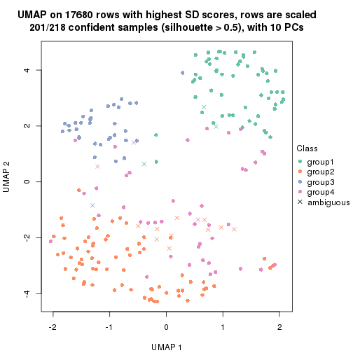</p>

</div>
<div id='tab-SD-pam-dimension-reduction-4'>
<pre><code class="r">dimension_reduction(res, k = 5, method = &quot;UMAP&quot;)
</code></pre>

<p></p>

</div>
<div id='tab-SD-pam-dimension-reduction-5'>
<pre><code class="r">dimension_reduction(res, k = 6, method = &quot;UMAP&quot;)
</code></pre>

<p></p>

</div>
</div>


Following heatmap shows how subgroups are split when increasing `k`:

```r
collect_classes(res)
```


If matrix rows can be associated to genes, consider to use `GO_Enrichment(res,
...)` to perform function enrichment for the signature genes.


 

---------------------------------------------------


### SD:mclust


The object with results only for a single top-value method and a single partition method 
can be extracted as:

```r
res = res_list["SD", "mclust"]
# you can also extract it by
# res = res_list["SD:mclust"]
```

A summary of `res` and all the functions that can be applied to it:

```r
res
```

```
#> A 'ConsensusPartition' object with k = 2, 3, 4, 5, 6.
#>   On a matrix with 17680 rows and 218 columns.
#>   Top rows (1000, 2000, 3000, 4000, 5000) are extracted by 'SD' method.
#>   Subgroups are detected by 'mclust' method.
#>   Performed in total 1250 partitions by row resampling.
#>   Best k for subgroups seems to be 2.
#> 
#> Following methods can be applied to this 'ConsensusPartition' object:
#>  [1] "cola_report"             "collect_classes"         "collect_plots"          
#>  [4] "collect_stats"           "colnames"                "compare_signatures"     
#>  [7] "consensus_heatmap"       "dimension_reduction"     "functional_enrichment"  
#> [10] "get_anno_col"            "get_anno"                "get_classes"            
#> [13] "get_consensus"           "get_matrix"              "get_membership"         
#> [16] "get_param"               "get_signatures"          "get_stats"              
#> [19] "is_best_k"               "is_stable_k"             "membership_heatmap"     
#> [22] "ncol"                    "nrow"                    "plot_ecdf"              
#> [25] "rownames"                "select_partition_number" "show"                   
#> [28] "suggest_best_k"          "test_to_known_factors"
```

`collect_plots()` function collects all the plots made from `res` for all `k` (number of partitions)
into one single page to provide an easy and fast comparison between different `k`.

```r
collect_plots(res)
```


The plots are:

- The first row: a plot of the ECDF (Empirical cumulative distribution
  function) curves of the consensus matrix for each `k` and the heatmap of
  predicted classes for each `k`.
- The second row: heatmaps of the consensus matrix for each `k`.
- The third row: heatmaps of the membership matrix for each `k`.
- The fouth row: heatmaps of the signatures for each `k`.

All the plots in panels can be made by individual functions and they are
plotted later in this section.

`select_partition_number()` produces several plots showing different
statistics for choosing "optimized" `k`. There are following statistics:

- ECDF curves of the consensus matrix for each `k`;
- 1-PAC. [The PAC
  score](https://en.wikipedia.org/wiki/Consensus_clustering#Over-interpretation_potential_of_consensus_clustering)
  measures the proportion of the ambiguous subgrouping.
- Mean silhouette score.
- Concordance. The mean probability of fiting the consensus class ids in all
  partitions.
- Area increased. Denote $A_k$ as the area under the ECDF curve for current
  `k`, the area increased is defined as $A_k - A_{k-1}$.
- Rand index. The percent of pairs of samples that are both in a same cluster
  or both are not in a same cluster in the partition of k and k-1.
- Jaccard index. The ratio of pairs of samples are both in a same cluster in
  the partition of k and k-1 and the pairs of samples are both in a same
  cluster in the partition k or k-1.

The detailed explanations of these statistics can be found in [the cola
vignette](http://bioconductor.org/packages/devel/bioc/vignettes/cola/inst/doc/cola.html#toc_13).

Generally speaking, lower PAC score, higher mean silhouette score or higher
concordance corresponds to better partition. Rand index and Jaccard index
measure how similar the current partition is compared to partition with `k-1`.
If they are too similar, we won't accept `k` is better than `k-1`.

```r
select_partition_number(res)
```


The numeric values for all these statistics can be obtained by `get_stats()`.

```r
get_stats(res)
```

```
#>   k 1-PAC mean_silhouette concordance area_increased  Rand Jaccard
#> 2 2 0.864           0.944       0.972         0.4797 0.522   0.522
#> 3 3 0.543           0.594       0.772         0.3170 0.815   0.650
#> 4 4 0.582           0.525       0.740         0.1406 0.761   0.439
#> 5 5 0.568           0.454       0.701         0.0814 0.843   0.496
#> 6 6 0.591           0.409       0.668         0.0306 0.865   0.476
```

`suggest_best_k()` suggests the best $k$ based on these statistics. The rules are as follows:

- All $k$ with Jaccard index larger than 0.95 are removed because the increase of
  the partition number does not provides enough extra information. If all $k$ are removed,
  the best $k$ is assigned by `NA`.
- For $k$ with 1-PAC larger than 0.9, the maximal $k$ is taken as the "best k". Other $k$ is called "optional k".
- If it does not fit the second rule. The $k$ with the highest vote of highest
  1-PAC, mean silhouette and concordance is taken as the "best k".

```r
suggest_best_k(res)
```

```
#> [1] 2
```


Following shows the table of the partitions (You need to click the **show/hide
code output** link to see it). The membership matrix (columns with name `p*`)
is inferred by
[`clue::cl_consensus()`](https://www.rdocumentation.org/link/cl_consensus?package=clue)
function with the `SE` method. Basically the value in the membership matrix
represents the probability to belong to a certain group. The finall class
label for an item is determined with the group with highest probability it
belongs to.

In `get_classes()` function, the entropy is calculated from the membership
matrix and the silhouette score is calculated from the consensus matrix.


<script>
$( function() {
	$( '#tabs-SD-mclust-get-classes' ).tabs();
} );
</script>
<div id='tabs-SD-mclust-get-classes'>
<ul>
<li><a href='#tab-SD-mclust-get-classes-1'>k = 2</a></li>
<li><a href='#tab-SD-mclust-get-classes-2'>k = 3</a></li>
<li><a href='#tab-SD-mclust-get-classes-3'>k = 4</a></li>
<li><a href='#tab-SD-mclust-get-classes-4'>k = 5</a></li>
<li><a href='#tab-SD-mclust-get-classes-5'>k = 6</a></li>
</ul>

<div id='tab-SD-mclust-get-classes-1'>
<p><a id='tab-SD-mclust-get-classes-1-a' style='color:#0366d6' href='#'>show/hide code output</a></p>
<pre><code class="r">cbind(get_classes(res, k = 2), get_membership(res, k = 2))
</code></pre>

<pre><code>#&gt;            class entropy silhouette    p1    p2
#&gt; SRR1498997     2  0.0000      0.965 0.000 1.000
#&gt; SRR1076441     1  0.0000      0.981 1.000 0.000
#&gt; SRR1489803     2  0.1414      0.961 0.020 0.980
#&gt; SRR1345953     2  0.0000      0.965 0.000 1.000
#&gt; SRR1357826     2  0.0000      0.965 0.000 1.000
#&gt; SRR1419656     1  0.0000      0.981 1.000 0.000
#&gt; SRR1454158     2  0.0000      0.965 0.000 1.000
#&gt; SRR1475408     2  0.5178      0.880 0.116 0.884
#&gt; SRR1472704     2  0.0000      0.965 0.000 1.000
#&gt; SRR1090046     2  0.8327      0.679 0.264 0.736
#&gt; SRR1312822     1  0.0000      0.981 1.000 0.000
#&gt; SRR1096987     2  0.0000      0.965 0.000 1.000
#&gt; SRR1334587     2  0.1414      0.961 0.020 0.980
#&gt; SRR1490246     1  0.0000      0.981 1.000 0.000
#&gt; SRR1467522     1  0.0000      0.981 1.000 0.000
#&gt; SRR1324206     1  0.0000      0.981 1.000 0.000
#&gt; SRR1408574     2  0.1414      0.961 0.020 0.980
#&gt; SRR1083959     2  0.0000      0.965 0.000 1.000
#&gt; SRR1079948     2  0.0000      0.965 0.000 1.000
#&gt; SRR1310667     2  0.1414      0.961 0.020 0.980
#&gt; SRR655852      2  0.0000      0.965 0.000 1.000
#&gt; SRR1352457     2  0.1414      0.961 0.020 0.980
#&gt; SRR1353994     2  0.0000      0.965 0.000 1.000
#&gt; SRR1459561     2  0.1414      0.961 0.020 0.980
#&gt; SRR1454009     1  0.0000      0.981 1.000 0.000
#&gt; SRR1071084     1  0.0000      0.981 1.000 0.000
#&gt; SRR1082859     2  0.0000      0.965 0.000 1.000
#&gt; SRR1086538     1  0.0000      0.981 1.000 0.000
#&gt; SRR1486262     2  0.0000      0.965 0.000 1.000
#&gt; SRR658105      1  0.0000      0.981 1.000 0.000
#&gt; SRR811073      2  0.0000      0.965 0.000 1.000
#&gt; SRR1429181     2  0.0938      0.963 0.012 0.988
#&gt; SRR1327896     2  0.0000      0.965 0.000 1.000
#&gt; SRR1464788     2  0.1414      0.961 0.020 0.980
#&gt; SRR1346861     2  0.0000      0.965 0.000 1.000
#&gt; SRR1318774     2  0.0000      0.965 0.000 1.000
#&gt; SRR1420517     2  0.9933      0.238 0.452 0.548
#&gt; SRR1369584     2  0.1414      0.961 0.020 0.980
#&gt; SRR1443244     2  0.0672      0.963 0.008 0.992
#&gt; SRR1455391     1  0.0000      0.981 1.000 0.000
#&gt; SRR1068999     1  0.0000      0.981 1.000 0.000
#&gt; SRR1481297     1  0.0000      0.981 1.000 0.000
#&gt; SRR1070208     1  0.7602      0.711 0.780 0.220
#&gt; SRR1317282     1  0.0000      0.981 1.000 0.000
#&gt; SRR1096125     2  0.0000      0.965 0.000 1.000
#&gt; SRR1472506     2  0.5842      0.858 0.140 0.860
#&gt; SRR1388281     2  0.0000      0.965 0.000 1.000
#&gt; SRR1365622     2  0.1414      0.961 0.020 0.980
#&gt; SRR662306      1  0.0000      0.981 1.000 0.000
#&gt; SRR662811      1  0.0000      0.981 1.000 0.000
#&gt; SRR820571      2  0.5842      0.858 0.140 0.860
#&gt; SRR1357166     1  0.0000      0.981 1.000 0.000
#&gt; SRR1488586     2  0.5842      0.858 0.140 0.860
#&gt; SRR1485398     1  0.0000      0.981 1.000 0.000
#&gt; SRR1417725     2  0.5178      0.877 0.116 0.884
#&gt; SRR1409397     2  0.1414      0.961 0.020 0.980
#&gt; SRR1465693     2  0.1414      0.961 0.020 0.980
#&gt; SRR1096547     2  0.5842      0.858 0.140 0.860
#&gt; SRR1456818     2  0.8813      0.619 0.300 0.700
#&gt; SRR816336      2  0.9087      0.571 0.324 0.676
#&gt; SRR1420238     1  0.0000      0.981 1.000 0.000
#&gt; SRR1433374     1  0.0000      0.981 1.000 0.000
#&gt; SRR1436990     1  0.0000      0.981 1.000 0.000
#&gt; SRR662378      1  0.0000      0.981 1.000 0.000
#&gt; SRR1477671     1  0.0000      0.981 1.000 0.000
#&gt; SRR1084079     2  0.0672      0.963 0.008 0.992
#&gt; SRR1102949     1  0.0000      0.981 1.000 0.000
#&gt; SRR1458090     1  0.0000      0.981 1.000 0.000
#&gt; SRR1418729     2  0.0000      0.965 0.000 1.000
#&gt; SRR1403814     2  0.0000      0.965 0.000 1.000
#&gt; SRR1404887     2  0.0672      0.963 0.008 0.992
#&gt; SRR1434955     1  0.0000      0.981 1.000 0.000
#&gt; SRR1360652     1  0.6438      0.797 0.836 0.164
#&gt; SRR1356765     2  0.0938      0.963 0.012 0.988
#&gt; SRR1078258     2  0.0000      0.965 0.000 1.000
#&gt; SRR1455861     1  0.0000      0.981 1.000 0.000
#&gt; SRR1420296     2  0.1414      0.961 0.020 0.980
#&gt; SRR1070260     2  0.0000      0.965 0.000 1.000
#&gt; SRR1410765     1  0.0000      0.981 1.000 0.000
#&gt; SRR1481315     2  0.8608      0.646 0.284 0.716
#&gt; SRR1414661     2  0.0000      0.965 0.000 1.000
#&gt; SRR1359147     2  0.0000      0.965 0.000 1.000
#&gt; SRR1488694     2  0.5629      0.864 0.132 0.868
#&gt; SRR1477273     1  0.0000      0.981 1.000 0.000
#&gt; SRR1415792     1  0.7745      0.697 0.772 0.228
#&gt; SRR1369088     2  0.2423      0.948 0.040 0.960
#&gt; SRR1406621     2  0.1414      0.961 0.020 0.980
#&gt; SRR1401017     2  0.1414      0.961 0.020 0.980
#&gt; SRR1099981     2  0.1414      0.961 0.020 0.980
#&gt; SRR815208      2  0.0000      0.965 0.000 1.000
#&gt; SRR1380460     2  0.0000      0.965 0.000 1.000
#&gt; SRR1091097     2  0.0000      0.965 0.000 1.000
#&gt; SRR1456010     1  0.0000      0.981 1.000 0.000
#&gt; SRR1498416     2  0.0000      0.965 0.000 1.000
#&gt; SRR818873      2  0.1414      0.961 0.020 0.980
#&gt; SRR813868      2  0.0376      0.964 0.004 0.996
#&gt; SRR1394912     1  0.0000      0.981 1.000 0.000
#&gt; SRR1475824     2  0.0376      0.964 0.004 0.996
#&gt; SRR1459866     1  0.0000      0.981 1.000 0.000
#&gt; SRR1364871     2  0.4562      0.896 0.096 0.904
#&gt; SRR1100472     2  0.0000      0.965 0.000 1.000
#&gt; SRR1331267     2  0.7139      0.780 0.196 0.804
#&gt; SRR1068977     2  0.1414      0.961 0.020 0.980
#&gt; SRR1391511     2  0.0000      0.965 0.000 1.000
#&gt; SRR1077920     2  0.0000      0.965 0.000 1.000
#&gt; SRR1457705     1  0.0000      0.981 1.000 0.000
#&gt; SRR1437073     1  0.0000      0.981 1.000 0.000
#&gt; SRR1473124     1  0.0000      0.981 1.000 0.000
#&gt; SRR1469279     1  0.0000      0.981 1.000 0.000
#&gt; SRR1091791     2  0.0000      0.965 0.000 1.000
#&gt; SRR1341539     2  0.1414      0.961 0.020 0.980
#&gt; SRR1446354     1  0.0000      0.981 1.000 0.000
#&gt; SRR1415420     1  0.0000      0.981 1.000 0.000
#&gt; SRR1368050     1  0.0000      0.981 1.000 0.000
#&gt; SRR656970      2  0.1414      0.961 0.020 0.980
#&gt; SRR1473403     2  0.0000      0.965 0.000 1.000
#&gt; SRR1084674     1  0.6438      0.797 0.836 0.164
#&gt; SRR1464702     1  0.0000      0.981 1.000 0.000
#&gt; SRR1074860     2  0.0672      0.963 0.008 0.992
#&gt; SRR655447      2  0.0000      0.965 0.000 1.000
#&gt; SRR1404442     2  0.0000      0.965 0.000 1.000
#&gt; SRR1418795     1  0.0000      0.981 1.000 0.000
#&gt; SRR1458335     2  0.0000      0.965 0.000 1.000
#&gt; SRR1489589     2  0.1414      0.961 0.020 0.980
#&gt; SRR1378284     2  0.8016      0.717 0.244 0.756
#&gt; SRR1408014     2  0.0938      0.963 0.012 0.988
#&gt; SRR1083052     1  0.0000      0.981 1.000 0.000
#&gt; SRR1339236     2  0.3114      0.936 0.056 0.944
#&gt; SRR1323829     2  0.1414      0.961 0.020 0.980
#&gt; SRR1086772     2  0.0000      0.965 0.000 1.000
#&gt; SRR1486457     1  0.9732      0.283 0.596 0.404
#&gt; SRR1415257     2  0.1414      0.961 0.020 0.980
#&gt; SRR1071905     1  0.0000      0.981 1.000 0.000
#&gt; SRR659223      2  0.1414      0.961 0.020 0.980
#&gt; SRR1386945     1  0.0000      0.981 1.000 0.000
#&gt; SRR821498      2  0.0000      0.965 0.000 1.000
#&gt; SRR1378903     2  0.0000      0.965 0.000 1.000
#&gt; SRR1472907     1  0.0000      0.981 1.000 0.000
#&gt; SRR1442313     2  0.0000      0.965 0.000 1.000
#&gt; SRR1077139     2  0.1184      0.962 0.016 0.984
#&gt; SRR1342758     1  0.0000      0.981 1.000 0.000
#&gt; SRR656911      2  0.0000      0.965 0.000 1.000
#&gt; SRR1070738     1  0.0000      0.981 1.000 0.000
#&gt; SRR1476950     1  0.5737      0.835 0.864 0.136
#&gt; SRR1488196     1  0.0000      0.981 1.000 0.000
#&gt; SRR1498951     1  0.0000      0.981 1.000 0.000
#&gt; SRR1413392     1  0.0000      0.981 1.000 0.000
#&gt; SRR657528      2  0.1414      0.961 0.020 0.980
#&gt; SRR812198      1  0.0000      0.981 1.000 0.000
#&gt; SRR660283      2  0.0000      0.965 0.000 1.000
#&gt; SRR1420936     1  0.0000      0.981 1.000 0.000
#&gt; SRR1469547     2  0.0000      0.965 0.000 1.000
#&gt; SRR1322249     1  0.6623      0.786 0.828 0.172
#&gt; SRR1396682     1  0.0000      0.981 1.000 0.000
#&gt; SRR1095816     2  0.0000      0.965 0.000 1.000
#&gt; SRR1081023     1  0.0000      0.981 1.000 0.000
#&gt; SRR1092517     2  0.0000      0.965 0.000 1.000
#&gt; SRR811285      2  0.1414      0.961 0.020 0.980
#&gt; SRR657018      1  0.0000      0.981 1.000 0.000
#&gt; SRR1365534     1  0.0000      0.981 1.000 0.000
#&gt; SRR1090791     2  0.1414      0.961 0.020 0.980
#&gt; SRR1439915     2  0.1414      0.961 0.020 0.980
#&gt; SRR1391575     2  0.0000      0.965 0.000 1.000
#&gt; SRR1314092     2  0.0000      0.965 0.000 1.000
#&gt; SRR1328941     1  0.0000      0.981 1.000 0.000
#&gt; SRR1336181     2  0.0000      0.965 0.000 1.000
#&gt; SRR1362972     1  0.0000      0.981 1.000 0.000
#&gt; SRR1366790     2  0.0000      0.965 0.000 1.000
#&gt; SRR1455902     1  0.0000      0.981 1.000 0.000
#&gt; SRR1437644     2  0.5408      0.869 0.124 0.876
#&gt; SRR1105009     2  0.0000      0.965 0.000 1.000
#&gt; SRR1367024     1  0.0000      0.981 1.000 0.000
#&gt; SRR660248      2  0.1184      0.961 0.016 0.984
#&gt; SRR1409620     1  0.0000      0.981 1.000 0.000
#&gt; SRR1455807     2  0.0000      0.965 0.000 1.000
#&gt; SRR1339431     1  0.0000      0.981 1.000 0.000
#&gt; SRR1378948     2  0.5629      0.864 0.132 0.868
#&gt; SRR1469237     1  0.0000      0.981 1.000 0.000
#&gt; SRR1098264     2  0.0000      0.965 0.000 1.000
#&gt; SRR1406224     2  0.0672      0.964 0.008 0.992
#&gt; SRR1393026     1  0.0000      0.981 1.000 0.000
#&gt; SRR808428      2  0.0000      0.965 0.000 1.000
#&gt; SRR615910      2  0.1414      0.961 0.020 0.980
#&gt; SRR1076219     1  0.0000      0.981 1.000 0.000
#&gt; SRR1481128     1  0.0000      0.981 1.000 0.000
#&gt; SRR1359262     2  0.1414      0.961 0.020 0.980
#&gt; SRR1407648     2  0.0000      0.965 0.000 1.000
#&gt; SRR1386775     2  0.5629      0.864 0.132 0.868
#&gt; SRR1388399     2  0.5059      0.887 0.112 0.888
#&gt; SRR1361499     2  0.0000      0.965 0.000 1.000
#&gt; SRR1500709     2  0.0000      0.965 0.000 1.000
#&gt; SRR1335917     1  0.0000      0.981 1.000 0.000
#&gt; SRR1430615     2  0.1414      0.961 0.020 0.980
#&gt; SRR1335212     1  0.0000      0.981 1.000 0.000
#&gt; SRR1400159     2  0.5842      0.858 0.140 0.860
#&gt; SRR1457245     2  0.0000      0.965 0.000 1.000
#&gt; SRR1356746     2  0.0000      0.965 0.000 1.000
#&gt; SRR658319      2  0.0000      0.965 0.000 1.000
#&gt; SRR1435946     1  0.0000      0.981 1.000 0.000
#&gt; SRR1370308     1  0.0000      0.981 1.000 0.000
#&gt; SRR1100893     1  0.0000      0.981 1.000 0.000
#&gt; SRR1389432     1  0.0000      0.981 1.000 0.000
#&gt; SRR1381799     2  0.0000      0.965 0.000 1.000
#&gt; SRR1310158     1  0.0000      0.981 1.000 0.000
#&gt; SRR1341100     2  0.0938      0.963 0.012 0.988
#&gt; SRR1342873     1  0.0000      0.981 1.000 0.000
#&gt; SRR1472102     2  0.1414      0.961 0.020 0.980
#&gt; SRR1409421     1  0.0000      0.981 1.000 0.000
#&gt; SRR1328577     2  0.0000      0.965 0.000 1.000
#&gt; SRR808942      2  0.0000      0.965 0.000 1.000
#&gt; SRR1343818     2  0.0000      0.965 0.000 1.000
#&gt; SRR1472415     2  0.0000      0.965 0.000 1.000
#&gt; SRR658409      2  0.0376      0.964 0.004 0.996
#&gt; SRR1469681     1  0.0000      0.981 1.000 0.000
#&gt; SRR1075484     2  0.1414      0.961 0.020 0.980
#&gt; SRR1417894     1  0.0000      0.981 1.000 0.000
#&gt; SRR1417422     2  0.0938      0.963 0.012 0.988
#&gt; SRR1090674     1  0.0000      0.981 1.000 0.000
</code></pre>

<script>
$('#tab-SD-mclust-get-classes-1-a').parent().next().next().hide();
$('#tab-SD-mclust-get-classes-1-a').click(function(){
  $('#tab-SD-mclust-get-classes-1-a').parent().next().next().toggle();
  return(false);
});
</script>
</div>

<div id='tab-SD-mclust-get-classes-2'>
<p><a id='tab-SD-mclust-get-classes-2-a' style='color:#0366d6' href='#'>show/hide code output</a></p>
<pre><code class="r">cbind(get_classes(res, k = 3), get_membership(res, k = 3))
</code></pre>

<pre><code>#&gt;            class entropy silhouette    p1    p2    p3
#&gt; SRR1498997     2  0.0000    0.54887 0.000 1.000 0.000
#&gt; SRR1076441     1  0.0424    0.90356 0.992 0.000 0.008
#&gt; SRR1489803     2  0.5859    0.48371 0.000 0.656 0.344
#&gt; SRR1345953     3  0.6295    0.73680 0.000 0.472 0.528
#&gt; SRR1357826     2  0.3879    0.40855 0.000 0.848 0.152
#&gt; SRR1419656     1  0.1163    0.90243 0.972 0.000 0.028
#&gt; SRR1454158     2  0.1163    0.54550 0.000 0.972 0.028
#&gt; SRR1475408     2  0.3619    0.54192 0.000 0.864 0.136
#&gt; SRR1472704     2  0.4235    0.36731 0.000 0.824 0.176
#&gt; SRR1090046     3  0.9827    0.22394 0.244 0.376 0.380
#&gt; SRR1312822     1  0.4291    0.88521 0.820 0.000 0.180
#&gt; SRR1096987     3  0.6286    0.73620 0.000 0.464 0.536
#&gt; SRR1334587     3  0.5529    0.35713 0.000 0.296 0.704
#&gt; SRR1490246     1  0.3038    0.89739 0.896 0.000 0.104
#&gt; SRR1467522     1  0.0000    0.90349 1.000 0.000 0.000
#&gt; SRR1324206     1  0.0592    0.90360 0.988 0.000 0.012
#&gt; SRR1408574     3  0.4750    0.49091 0.000 0.216 0.784
#&gt; SRR1083959     2  0.4504    0.32519 0.000 0.804 0.196
#&gt; SRR1079948     3  0.6295    0.73680 0.000 0.472 0.528
#&gt; SRR1310667     2  0.5216    0.50570 0.000 0.740 0.260
#&gt; SRR655852      2  0.6225   -0.52668 0.000 0.568 0.432
#&gt; SRR1352457     3  0.6307   -0.26394 0.000 0.488 0.512
#&gt; SRR1353994     3  0.6295    0.73680 0.000 0.472 0.528
#&gt; SRR1459561     2  0.6140    0.43295 0.000 0.596 0.404
#&gt; SRR1454009     1  0.1163    0.90243 0.972 0.000 0.028
#&gt; SRR1071084     1  0.1163    0.90243 0.972 0.000 0.028
#&gt; SRR1082859     2  0.0000    0.54887 0.000 1.000 0.000
#&gt; SRR1086538     1  0.0424    0.90356 0.992 0.000 0.008
#&gt; SRR1486262     3  0.6295    0.73680 0.000 0.472 0.528
#&gt; SRR658105      1  0.4291    0.88521 0.820 0.000 0.180
#&gt; SRR811073      2  0.4796    0.28185 0.000 0.780 0.220
#&gt; SRR1429181     3  0.6126    0.59604 0.000 0.400 0.600
#&gt; SRR1327896     3  0.6291    0.73777 0.000 0.468 0.532
#&gt; SRR1464788     3  0.4887    0.46456 0.000 0.228 0.772
#&gt; SRR1346861     2  0.4002    0.39573 0.000 0.840 0.160
#&gt; SRR1318774     3  0.6305    0.72174 0.000 0.484 0.516
#&gt; SRR1420517     1  0.8745    0.26714 0.524 0.356 0.120
#&gt; SRR1369584     2  0.6291    0.33451 0.000 0.532 0.468
#&gt; SRR1443244     3  0.6244    0.71647 0.000 0.440 0.560
#&gt; SRR1455391     1  0.0424    0.90344 0.992 0.000 0.008
#&gt; SRR1068999     1  0.0592    0.90376 0.988 0.000 0.012
#&gt; SRR1481297     1  0.1163    0.90243 0.972 0.000 0.028
#&gt; SRR1070208     1  0.6673    0.66592 0.732 0.200 0.068
#&gt; SRR1317282     1  0.1163    0.90243 0.972 0.000 0.028
#&gt; SRR1096125     3  0.6295    0.73680 0.000 0.472 0.528
#&gt; SRR1472506     3  0.5905    0.54453 0.000 0.352 0.648
#&gt; SRR1388281     3  0.6302    0.72555 0.000 0.480 0.520
#&gt; SRR1365622     3  0.4887    0.51297 0.000 0.228 0.772
#&gt; SRR662306      1  0.1163    0.90243 0.972 0.000 0.028
#&gt; SRR662811      1  0.4291    0.88521 0.820 0.000 0.180
#&gt; SRR820571      2  0.6192    0.00374 0.000 0.580 0.420
#&gt; SRR1357166     1  0.1163    0.90243 0.972 0.000 0.028
#&gt; SRR1488586     3  0.4796    0.52891 0.000 0.220 0.780
#&gt; SRR1485398     1  0.4291    0.88521 0.820 0.000 0.180
#&gt; SRR1417725     2  0.3412    0.54310 0.000 0.876 0.124
#&gt; SRR1409397     2  0.5216    0.50570 0.000 0.740 0.260
#&gt; SRR1465693     2  0.5216    0.50570 0.000 0.740 0.260
#&gt; SRR1096547     2  0.4121    0.52417 0.000 0.832 0.168
#&gt; SRR1456818     1  0.8875    0.21090 0.528 0.336 0.136
#&gt; SRR816336      2  0.8410    0.22564 0.216 0.620 0.164
#&gt; SRR1420238     1  0.3686    0.89266 0.860 0.000 0.140
#&gt; SRR1433374     1  0.1163    0.90243 0.972 0.000 0.028
#&gt; SRR1436990     1  0.4291    0.88521 0.820 0.000 0.180
#&gt; SRR662378      1  0.0237    0.90351 0.996 0.000 0.004
#&gt; SRR1477671     1  0.3879    0.89122 0.848 0.000 0.152
#&gt; SRR1084079     3  0.6252    0.72082 0.000 0.444 0.556
#&gt; SRR1102949     1  0.4291    0.88521 0.820 0.000 0.180
#&gt; SRR1458090     1  0.4291    0.88521 0.820 0.000 0.180
#&gt; SRR1418729     2  0.1643    0.53545 0.000 0.956 0.044
#&gt; SRR1403814     3  0.6291    0.73666 0.000 0.468 0.532
#&gt; SRR1404887     3  0.6244    0.71647 0.000 0.440 0.560
#&gt; SRR1434955     1  0.4291    0.88521 0.820 0.000 0.180
#&gt; SRR1360652     1  0.4873    0.77083 0.824 0.152 0.024
#&gt; SRR1356765     2  0.6026    0.33641 0.000 0.624 0.376
#&gt; SRR1078258     2  0.5733   -0.13473 0.000 0.676 0.324
#&gt; SRR1455861     1  0.4235    0.88632 0.824 0.000 0.176
#&gt; SRR1420296     2  0.5216    0.50570 0.000 0.740 0.260
#&gt; SRR1070260     2  0.4842    0.25599 0.000 0.776 0.224
#&gt; SRR1410765     1  0.2261    0.90082 0.932 0.000 0.068
#&gt; SRR1481315     2  0.9766   -0.29904 0.236 0.416 0.348
#&gt; SRR1414661     2  0.5529   -0.00052 0.000 0.704 0.296
#&gt; SRR1359147     3  0.6295    0.73680 0.000 0.472 0.528
#&gt; SRR1488694     3  0.6204    0.71464 0.000 0.424 0.576
#&gt; SRR1477273     1  0.1163    0.90243 0.972 0.000 0.028
#&gt; SRR1415792     1  0.6463    0.71406 0.756 0.164 0.080
#&gt; SRR1369088     3  0.5678    0.37970 0.000 0.316 0.684
#&gt; SRR1406621     3  0.4842    0.50826 0.000 0.224 0.776
#&gt; SRR1401017     2  0.5216    0.50570 0.000 0.740 0.260
#&gt; SRR1099981     3  0.4750    0.49091 0.000 0.216 0.784
#&gt; SRR815208      2  0.4452    0.33482 0.000 0.808 0.192
#&gt; SRR1380460     2  0.6062   -0.36459 0.000 0.616 0.384
#&gt; SRR1091097     2  0.6286   -0.60004 0.000 0.536 0.464
#&gt; SRR1456010     1  0.1163    0.90243 0.972 0.000 0.028
#&gt; SRR1498416     3  0.6291    0.73666 0.000 0.468 0.532
#&gt; SRR818873      2  0.5216    0.50570 0.000 0.740 0.260
#&gt; SRR813868      2  0.0892    0.55558 0.000 0.980 0.020
#&gt; SRR1394912     1  0.4291    0.88521 0.820 0.000 0.180
#&gt; SRR1475824     3  0.6267    0.73241 0.000 0.452 0.548
#&gt; SRR1459866     1  0.4291    0.88521 0.820 0.000 0.180
#&gt; SRR1364871     2  0.6140   -0.34797 0.000 0.596 0.404
#&gt; SRR1100472     2  0.5810   -0.17493 0.000 0.664 0.336
#&gt; SRR1331267     3  0.6451    0.71206 0.004 0.436 0.560
#&gt; SRR1068977     3  0.4842    0.50207 0.000 0.224 0.776
#&gt; SRR1391511     2  0.0000    0.54887 0.000 1.000 0.000
#&gt; SRR1077920     2  0.0000    0.54887 0.000 1.000 0.000
#&gt; SRR1457705     1  0.1163    0.90243 0.972 0.000 0.028
#&gt; SRR1437073     1  0.4235    0.88586 0.824 0.000 0.176
#&gt; SRR1473124     1  0.1163    0.90243 0.972 0.000 0.028
#&gt; SRR1469279     1  0.1163    0.90243 0.972 0.000 0.028
#&gt; SRR1091791     3  0.6291    0.73777 0.000 0.468 0.532
#&gt; SRR1341539     2  0.6126    0.36764 0.000 0.600 0.400
#&gt; SRR1446354     1  0.1163    0.90243 0.972 0.000 0.028
#&gt; SRR1415420     1  0.3752    0.89218 0.856 0.000 0.144
#&gt; SRR1368050     1  0.4178    0.88669 0.828 0.000 0.172
#&gt; SRR656970      2  0.5859    0.48387 0.000 0.656 0.344
#&gt; SRR1473403     2  0.5835   -0.17734 0.000 0.660 0.340
#&gt; SRR1084674     1  0.5608    0.77844 0.808 0.120 0.072
#&gt; SRR1464702     1  0.0237    0.90373 0.996 0.000 0.004
#&gt; SRR1074860     3  0.6291    0.73777 0.000 0.468 0.532
#&gt; SRR655447      3  0.6295    0.73680 0.000 0.472 0.528
#&gt; SRR1404442     2  0.4750    0.27868 0.000 0.784 0.216
#&gt; SRR1418795     1  0.4121    0.88815 0.832 0.000 0.168
#&gt; SRR1458335     2  0.0237    0.55052 0.000 0.996 0.004
#&gt; SRR1489589     2  0.5216    0.50570 0.000 0.740 0.260
#&gt; SRR1378284     3  0.5378    0.54455 0.008 0.236 0.756
#&gt; SRR1408014     2  0.3941    0.54685 0.000 0.844 0.156
#&gt; SRR1083052     1  0.0661    0.90297 0.988 0.008 0.004
#&gt; SRR1339236     2  0.5327    0.50064 0.000 0.728 0.272
#&gt; SRR1323829     2  0.6045    0.45802 0.000 0.620 0.380
#&gt; SRR1086772     2  0.5560    0.00181 0.000 0.700 0.300
#&gt; SRR1486457     1  0.8437    0.41358 0.596 0.276 0.128
#&gt; SRR1415257     2  0.6204    0.35407 0.000 0.576 0.424
#&gt; SRR1071905     1  0.1163    0.90243 0.972 0.000 0.028
#&gt; SRR659223      2  0.6235    0.38979 0.000 0.564 0.436
#&gt; SRR1386945     1  0.1163    0.90243 0.972 0.000 0.028
#&gt; SRR821498      2  0.1964    0.52877 0.000 0.944 0.056
#&gt; SRR1378903     3  0.6291    0.73777 0.000 0.468 0.532
#&gt; SRR1472907     1  0.6496    0.67762 0.736 0.208 0.056
#&gt; SRR1442313     2  0.5138    0.17319 0.000 0.748 0.252
#&gt; SRR1077139     2  0.5988    0.46771 0.000 0.632 0.368
#&gt; SRR1342758     1  0.4291    0.88521 0.820 0.000 0.180
#&gt; SRR656911      2  0.4796    0.26947 0.000 0.780 0.220
#&gt; SRR1070738     1  0.0592    0.90414 0.988 0.000 0.012
#&gt; SRR1476950     1  0.4868    0.80546 0.844 0.100 0.056
#&gt; SRR1488196     1  0.1163    0.90243 0.972 0.000 0.028
#&gt; SRR1498951     1  0.1163    0.90243 0.972 0.000 0.028
#&gt; SRR1413392     1  0.4291    0.88521 0.820 0.000 0.180
#&gt; SRR657528      2  0.4931    0.51948 0.000 0.768 0.232
#&gt; SRR812198      1  0.4291    0.88521 0.820 0.000 0.180
#&gt; SRR660283      2  0.0592    0.54463 0.000 0.988 0.012
#&gt; SRR1420936     1  0.4291    0.88521 0.820 0.000 0.180
#&gt; SRR1469547     2  0.5216    0.16189 0.000 0.740 0.260
#&gt; SRR1322249     1  0.5810    0.77888 0.796 0.132 0.072
#&gt; SRR1396682     1  0.4291    0.88521 0.820 0.000 0.180
#&gt; SRR1095816     3  0.6291    0.73777 0.000 0.468 0.532
#&gt; SRR1081023     1  0.4291    0.88521 0.820 0.000 0.180
#&gt; SRR1092517     2  0.5497   -0.01116 0.000 0.708 0.292
#&gt; SRR811285      3  0.6225   -0.10212 0.000 0.432 0.568
#&gt; SRR657018      1  0.4291    0.88521 0.820 0.000 0.180
#&gt; SRR1365534     1  0.1163    0.90243 0.972 0.000 0.028
#&gt; SRR1090791     2  0.5948    0.47355 0.000 0.640 0.360
#&gt; SRR1439915     2  0.5216    0.50570 0.000 0.740 0.260
#&gt; SRR1391575     3  0.6274    0.73162 0.000 0.456 0.544
#&gt; SRR1314092     2  0.1031    0.55080 0.000 0.976 0.024
#&gt; SRR1328941     1  0.1163    0.90243 0.972 0.000 0.028
#&gt; SRR1336181     2  0.5058    0.19722 0.000 0.756 0.244
#&gt; SRR1362972     1  0.0592    0.90376 0.988 0.000 0.012
#&gt; SRR1366790     2  0.0424    0.55208 0.000 0.992 0.008
#&gt; SRR1455902     1  0.1163    0.90243 0.972 0.000 0.028
#&gt; SRR1437644     2  0.6045   -0.05700 0.000 0.620 0.380
#&gt; SRR1105009     2  0.1031    0.53818 0.000 0.976 0.024
#&gt; SRR1367024     1  0.1163    0.90243 0.972 0.000 0.028
#&gt; SRR660248      2  0.1860    0.55858 0.000 0.948 0.052
#&gt; SRR1409620     1  0.4291    0.88521 0.820 0.000 0.180
#&gt; SRR1455807     2  0.4002    0.39573 0.000 0.840 0.160
#&gt; SRR1339431     1  0.0592    0.90376 0.988 0.000 0.012
#&gt; SRR1378948     2  0.6062    0.04329 0.000 0.616 0.384
#&gt; SRR1469237     1  0.4291    0.88521 0.820 0.000 0.180
#&gt; SRR1098264     3  0.6295    0.73680 0.000 0.472 0.528
#&gt; SRR1406224     2  0.3686    0.55215 0.000 0.860 0.140
#&gt; SRR1393026     1  0.1163    0.90243 0.972 0.000 0.028
#&gt; SRR808428      2  0.1860    0.52096 0.000 0.948 0.052
#&gt; SRR615910      2  0.5291    0.50557 0.000 0.732 0.268
#&gt; SRR1076219     1  0.1163    0.90243 0.972 0.000 0.028
#&gt; SRR1481128     1  0.4291    0.88521 0.820 0.000 0.180
#&gt; SRR1359262     2  0.6140    0.43266 0.000 0.596 0.404
#&gt; SRR1407648     3  0.6295    0.73680 0.000 0.472 0.528
#&gt; SRR1386775     3  0.6168    0.70669 0.000 0.412 0.588
#&gt; SRR1388399     3  0.4750    0.52385 0.000 0.216 0.784
#&gt; SRR1361499     2  0.6225   -0.52414 0.000 0.568 0.432
#&gt; SRR1500709     3  0.6309    0.70127 0.000 0.496 0.504
#&gt; SRR1335917     1  0.4121    0.88794 0.832 0.000 0.168
#&gt; SRR1430615     2  0.5178    0.50759 0.000 0.744 0.256
#&gt; SRR1335212     1  0.4733    0.88701 0.800 0.004 0.196
#&gt; SRR1400159     2  0.3619    0.54192 0.000 0.864 0.136
#&gt; SRR1457245     2  0.3551    0.42194 0.000 0.868 0.132
#&gt; SRR1356746     2  0.4291    0.35930 0.000 0.820 0.180
#&gt; SRR658319      2  0.0237    0.54810 0.000 0.996 0.004
#&gt; SRR1435946     1  0.4291    0.88521 0.820 0.000 0.180
#&gt; SRR1370308     1  0.0424    0.90356 0.992 0.000 0.008
#&gt; SRR1100893     1  0.4291    0.88521 0.820 0.000 0.180
#&gt; SRR1389432     1  0.1163    0.90243 0.972 0.000 0.028
#&gt; SRR1381799     2  0.0892    0.54138 0.000 0.980 0.020
#&gt; SRR1310158     1  0.1163    0.90243 0.972 0.000 0.028
#&gt; SRR1341100     3  0.6225    0.72446 0.000 0.432 0.568
#&gt; SRR1342873     1  0.1031    0.90256 0.976 0.000 0.024
#&gt; SRR1472102     3  0.6140    0.02680 0.000 0.404 0.596
#&gt; SRR1409421     1  0.1163    0.90243 0.972 0.000 0.028
#&gt; SRR1328577     2  0.6267   -0.56355 0.000 0.548 0.452
#&gt; SRR808942      2  0.0892    0.54130 0.000 0.980 0.020
#&gt; SRR1343818     2  0.6154   -0.43265 0.000 0.592 0.408
#&gt; SRR1472415     2  0.4062    0.39757 0.000 0.836 0.164
#&gt; SRR658409      3  0.6291    0.73777 0.000 0.468 0.532
#&gt; SRR1469681     1  0.4291    0.88521 0.820 0.000 0.180
#&gt; SRR1075484     2  0.5016    0.51957 0.000 0.760 0.240
#&gt; SRR1417894     1  0.1163    0.90243 0.972 0.000 0.028
#&gt; SRR1417422     2  0.4750    0.52884 0.000 0.784 0.216
#&gt; SRR1090674     1  0.4291    0.88521 0.820 0.000 0.180
</code></pre>

<script>
$('#tab-SD-mclust-get-classes-2-a').parent().next().next().hide();
$('#tab-SD-mclust-get-classes-2-a').click(function(){
  $('#tab-SD-mclust-get-classes-2-a').parent().next().next().toggle();
  return(false);
});
</script>
</div>

<div id='tab-SD-mclust-get-classes-3'>
<p><a id='tab-SD-mclust-get-classes-3-a' style='color:#0366d6' href='#'>show/hide code output</a></p>
<pre><code class="r">cbind(get_classes(res, k = 4), get_membership(res, k = 4))
</code></pre>

<pre><code>#&gt;            class entropy silhouette    p1    p2    p3    p4
#&gt; SRR1498997     2  0.5466   0.169029 0.016 0.548 0.000 0.436
#&gt; SRR1076441     1  0.5000   0.259843 0.504 0.000 0.496 0.000
#&gt; SRR1489803     2  0.1902   0.567706 0.004 0.932 0.000 0.064
#&gt; SRR1345953     4  0.2376   0.659846 0.068 0.016 0.000 0.916
#&gt; SRR1357826     2  0.5126   0.158975 0.004 0.552 0.000 0.444
#&gt; SRR1419656     3  0.5271   0.579054 0.340 0.000 0.640 0.020
#&gt; SRR1454158     4  0.5856  -0.085789 0.032 0.464 0.000 0.504
#&gt; SRR1475408     2  0.5793   0.325391 0.020 0.628 0.016 0.336
#&gt; SRR1472704     4  0.4372   0.457882 0.004 0.268 0.000 0.728
#&gt; SRR1090046     4  0.8084   0.184074 0.072 0.084 0.376 0.468
#&gt; SRR1312822     1  0.3975   0.917665 0.760 0.000 0.240 0.000
#&gt; SRR1096987     4  0.0804   0.662362 0.008 0.012 0.000 0.980
#&gt; SRR1334587     2  0.5167   0.069193 0.004 0.508 0.000 0.488
#&gt; SRR1490246     1  0.4040   0.912098 0.752 0.000 0.248 0.000
#&gt; SRR1467522     3  0.4454   0.532335 0.308 0.000 0.692 0.000
#&gt; SRR1324206     1  0.4994   0.360896 0.520 0.000 0.480 0.000
#&gt; SRR1408574     4  0.6552  -0.028845 0.076 0.440 0.000 0.484
#&gt; SRR1083959     4  0.5407  -0.066373 0.012 0.484 0.000 0.504
#&gt; SRR1079948     4  0.1716   0.656438 0.064 0.000 0.000 0.936
#&gt; SRR1310667     2  0.0376   0.580779 0.004 0.992 0.000 0.004
#&gt; SRR655852      4  0.2522   0.642100 0.016 0.076 0.000 0.908
#&gt; SRR1352457     2  0.5364   0.208029 0.016 0.592 0.000 0.392
#&gt; SRR1353994     4  0.2521   0.662090 0.064 0.024 0.000 0.912
#&gt; SRR1459561     2  0.4220   0.413805 0.004 0.748 0.000 0.248
#&gt; SRR1454009     3  0.0469   0.726572 0.012 0.000 0.988 0.000
#&gt; SRR1071084     3  0.0000   0.727910 0.000 0.000 1.000 0.000
#&gt; SRR1082859     2  0.5250   0.165294 0.008 0.552 0.000 0.440
#&gt; SRR1086538     1  0.4989   0.396502 0.528 0.000 0.472 0.000
#&gt; SRR1486262     4  0.1792   0.655006 0.068 0.000 0.000 0.932
#&gt; SRR658105      1  0.4008   0.915008 0.756 0.000 0.244 0.000
#&gt; SRR811073      4  0.3710   0.557377 0.004 0.192 0.000 0.804
#&gt; SRR1429181     4  0.4360   0.448463 0.008 0.248 0.000 0.744
#&gt; SRR1327896     4  0.1792   0.655006 0.068 0.000 0.000 0.932
#&gt; SRR1464788     4  0.5163  -0.063880 0.004 0.480 0.000 0.516
#&gt; SRR1346861     4  0.4477   0.386460 0.000 0.312 0.000 0.688
#&gt; SRR1318774     4  0.1854   0.654473 0.012 0.048 0.000 0.940
#&gt; SRR1420517     3  0.7772   0.446583 0.384 0.068 0.484 0.064
#&gt; SRR1369584     2  0.4761   0.301533 0.004 0.664 0.000 0.332
#&gt; SRR1443244     4  0.2345   0.647554 0.100 0.000 0.000 0.900
#&gt; SRR1455391     3  0.1022   0.726161 0.032 0.000 0.968 0.000
#&gt; SRR1068999     3  0.4605   0.471766 0.336 0.000 0.664 0.000
#&gt; SRR1481297     3  0.4933   0.586363 0.296 0.000 0.688 0.016
#&gt; SRR1070208     3  0.6716   0.550778 0.256 0.056 0.644 0.044
#&gt; SRR1317282     3  0.0817   0.730195 0.024 0.000 0.976 0.000
#&gt; SRR1096125     4  0.2011   0.657453 0.080 0.000 0.000 0.920
#&gt; SRR1472506     4  0.9310   0.135911 0.156 0.204 0.192 0.448
#&gt; SRR1388281     4  0.1406   0.663031 0.016 0.024 0.000 0.960
#&gt; SRR1365622     4  0.6430  -0.000763 0.068 0.428 0.000 0.504
#&gt; SRR662306      3  0.1211   0.727617 0.040 0.000 0.960 0.000
#&gt; SRR662811      1  0.4103   0.900250 0.744 0.000 0.256 0.000
#&gt; SRR820571      2  0.9604   0.111148 0.164 0.332 0.172 0.332
#&gt; SRR1357166     3  0.0469   0.726572 0.012 0.000 0.988 0.000
#&gt; SRR1488586     2  0.9143   0.141855 0.080 0.380 0.220 0.320
#&gt; SRR1485398     1  0.3975   0.917665 0.760 0.000 0.240 0.000
#&gt; SRR1417725     2  0.6041   0.281996 0.032 0.600 0.012 0.356
#&gt; SRR1409397     2  0.0376   0.580779 0.004 0.992 0.000 0.004
#&gt; SRR1465693     2  0.0524   0.581319 0.004 0.988 0.000 0.008
#&gt; SRR1096547     2  0.9023   0.095077 0.076 0.392 0.200 0.332
#&gt; SRR1456818     1  0.8983  -0.170611 0.372 0.056 0.288 0.284
#&gt; SRR816336      2  0.8261   0.218245 0.112 0.464 0.064 0.360
#&gt; SRR1420238     1  0.4008   0.915531 0.756 0.000 0.244 0.000
#&gt; SRR1433374     3  0.0000   0.727910 0.000 0.000 1.000 0.000
#&gt; SRR1436990     1  0.3975   0.917665 0.760 0.000 0.240 0.000
#&gt; SRR662378      3  0.4888   0.205281 0.412 0.000 0.588 0.000
#&gt; SRR1477671     1  0.4134   0.896346 0.740 0.000 0.260 0.000
#&gt; SRR1084079     4  0.2081   0.652663 0.084 0.000 0.000 0.916
#&gt; SRR1102949     1  0.3975   0.917665 0.760 0.000 0.240 0.000
#&gt; SRR1458090     1  0.3975   0.917665 0.760 0.000 0.240 0.000
#&gt; SRR1418729     4  0.6652   0.000962 0.088 0.396 0.000 0.516
#&gt; SRR1403814     4  0.1211   0.662352 0.040 0.000 0.000 0.960
#&gt; SRR1404887     4  0.1792   0.653867 0.068 0.000 0.000 0.932
#&gt; SRR1434955     1  0.3975   0.917665 0.760 0.000 0.240 0.000
#&gt; SRR1360652     3  0.6772   0.461249 0.308 0.056 0.604 0.032
#&gt; SRR1356765     2  0.6249   0.288003 0.068 0.580 0.000 0.352
#&gt; SRR1078258     4  0.3108   0.625651 0.016 0.112 0.000 0.872
#&gt; SRR1455861     1  0.4072   0.908738 0.748 0.000 0.252 0.000
#&gt; SRR1420296     2  0.0524   0.581319 0.004 0.988 0.000 0.008
#&gt; SRR1070260     4  0.4008   0.497490 0.000 0.244 0.000 0.756
#&gt; SRR1410765     1  0.4304   0.860251 0.716 0.000 0.284 0.000
#&gt; SRR1481315     4  0.7108   0.337068 0.148 0.004 0.284 0.564
#&gt; SRR1414661     4  0.3108   0.620605 0.016 0.112 0.000 0.872
#&gt; SRR1359147     4  0.0707   0.662213 0.020 0.000 0.000 0.980
#&gt; SRR1488694     4  0.6565   0.423488 0.132 0.004 0.224 0.640
#&gt; SRR1477273     3  0.0000   0.727910 0.000 0.000 1.000 0.000
#&gt; SRR1415792     3  0.2838   0.665502 0.016 0.056 0.908 0.020
#&gt; SRR1369088     2  0.6299   0.131148 0.060 0.520 0.000 0.420
#&gt; SRR1406621     4  0.5558  -0.014853 0.020 0.432 0.000 0.548
#&gt; SRR1401017     2  0.0376   0.580779 0.004 0.992 0.000 0.004
#&gt; SRR1099981     4  0.5257  -0.022922 0.008 0.444 0.000 0.548
#&gt; SRR815208      4  0.4655   0.383050 0.004 0.312 0.000 0.684
#&gt; SRR1380460     4  0.2775   0.637587 0.020 0.084 0.000 0.896
#&gt; SRR1091097     4  0.1716   0.650011 0.000 0.064 0.000 0.936
#&gt; SRR1456010     3  0.4690   0.588516 0.276 0.000 0.712 0.012
#&gt; SRR1498416     4  0.2174   0.663557 0.052 0.020 0.000 0.928
#&gt; SRR818873      2  0.0376   0.580779 0.004 0.992 0.000 0.004
#&gt; SRR813868      2  0.5459   0.174342 0.016 0.552 0.000 0.432
#&gt; SRR1394912     1  0.4008   0.914909 0.756 0.000 0.244 0.000
#&gt; SRR1475824     4  0.0921   0.661806 0.028 0.000 0.000 0.972
#&gt; SRR1459866     1  0.4008   0.915059 0.756 0.000 0.244 0.000
#&gt; SRR1364871     4  0.8148   0.354287 0.184 0.080 0.164 0.572
#&gt; SRR1100472     4  0.2412   0.639844 0.008 0.084 0.000 0.908
#&gt; SRR1331267     4  0.6465   0.419214 0.136 0.000 0.228 0.636
#&gt; SRR1068977     4  0.4981  -0.041299 0.000 0.464 0.000 0.536
#&gt; SRR1391511     2  0.5558   0.173588 0.020 0.548 0.000 0.432
#&gt; SRR1077920     2  0.5459   0.174864 0.016 0.552 0.000 0.432
#&gt; SRR1457705     3  0.4283   0.604047 0.256 0.000 0.740 0.004
#&gt; SRR1437073     1  0.4193   0.889858 0.732 0.000 0.268 0.000
#&gt; SRR1473124     3  0.5013   0.638802 0.228 0.032 0.736 0.004
#&gt; SRR1469279     3  0.4422   0.603512 0.256 0.000 0.736 0.008
#&gt; SRR1091791     4  0.0000   0.660648 0.000 0.000 0.000 1.000
#&gt; SRR1341539     2  0.4959   0.459709 0.052 0.752 0.000 0.196
#&gt; SRR1446354     3  0.0000   0.727910 0.000 0.000 1.000 0.000
#&gt; SRR1415420     1  0.4008   0.915531 0.756 0.000 0.244 0.000
#&gt; SRR1368050     1  0.4356   0.855491 0.708 0.000 0.292 0.000
#&gt; SRR656970      2  0.2773   0.543426 0.004 0.880 0.000 0.116
#&gt; SRR1473403     4  0.2610   0.636653 0.012 0.088 0.000 0.900
#&gt; SRR1084674     3  0.2021   0.679861 0.000 0.056 0.932 0.012
#&gt; SRR1464702     3  0.4382   0.553607 0.296 0.000 0.704 0.000
#&gt; SRR1074860     4  0.1867   0.653798 0.072 0.000 0.000 0.928
#&gt; SRR655447      4  0.0657   0.661087 0.004 0.012 0.000 0.984
#&gt; SRR1404442     4  0.5161  -0.028741 0.004 0.476 0.000 0.520
#&gt; SRR1418795     1  0.4008   0.915433 0.756 0.000 0.244 0.000
#&gt; SRR1458335     2  0.5600   0.132333 0.020 0.512 0.000 0.468
#&gt; SRR1489589     2  0.0376   0.580779 0.004 0.992 0.000 0.004
#&gt; SRR1378284     2  0.9670   0.148110 0.152 0.364 0.232 0.252
#&gt; SRR1408014     2  0.3895   0.515566 0.012 0.804 0.000 0.184
#&gt; SRR1083052     3  0.4585   0.483520 0.332 0.000 0.668 0.000
#&gt; SRR1339236     2  0.0657   0.581151 0.004 0.984 0.000 0.012
#&gt; SRR1323829     2  0.3052   0.529238 0.004 0.860 0.000 0.136
#&gt; SRR1086772     4  0.2867   0.627116 0.012 0.104 0.000 0.884
#&gt; SRR1486457     3  0.4681   0.559375 0.024 0.068 0.820 0.088
#&gt; SRR1415257     2  0.4922   0.449934 0.036 0.736 0.000 0.228
#&gt; SRR1071905     3  0.0469   0.726572 0.012 0.000 0.988 0.000
#&gt; SRR659223      2  0.3831   0.466549 0.004 0.792 0.000 0.204
#&gt; SRR1386945     3  0.0469   0.730142 0.012 0.000 0.988 0.000
#&gt; SRR821498      4  0.6850   0.036266 0.108 0.376 0.000 0.516
#&gt; SRR1378903     4  0.1792   0.655006 0.068 0.000 0.000 0.932
#&gt; SRR1472907     3  0.6602   0.539588 0.348 0.052 0.580 0.020
#&gt; SRR1442313     4  0.3672   0.582209 0.012 0.164 0.000 0.824
#&gt; SRR1077139     2  0.2654   0.547183 0.004 0.888 0.000 0.108
#&gt; SRR1342758     1  0.4008   0.915008 0.756 0.000 0.244 0.000
#&gt; SRR656911      4  0.4323   0.537388 0.020 0.204 0.000 0.776
#&gt; SRR1070738     1  0.4977   0.412937 0.540 0.000 0.460 0.000
#&gt; SRR1476950     3  0.6199   0.533749 0.288 0.036 0.648 0.028
#&gt; SRR1488196     3  0.0000   0.727910 0.000 0.000 1.000 0.000
#&gt; SRR1498951     3  0.3942   0.623646 0.236 0.000 0.764 0.000
#&gt; SRR1413392     1  0.3975   0.917665 0.760 0.000 0.240 0.000
#&gt; SRR657528      2  0.1256   0.579476 0.008 0.964 0.000 0.028
#&gt; SRR812198      1  0.4008   0.915008 0.756 0.000 0.244 0.000
#&gt; SRR660283      2  0.5158   0.112602 0.004 0.524 0.000 0.472
#&gt; SRR1420936     1  0.3975   0.917665 0.760 0.000 0.240 0.000
#&gt; SRR1469547     4  0.3324   0.604751 0.012 0.136 0.000 0.852
#&gt; SRR1322249     3  0.6142   0.598549 0.236 0.056 0.684 0.024
#&gt; SRR1396682     1  0.3975   0.917665 0.760 0.000 0.240 0.000
#&gt; SRR1095816     4  0.1867   0.653798 0.072 0.000 0.000 0.928
#&gt; SRR1081023     1  0.3975   0.917665 0.760 0.000 0.240 0.000
#&gt; SRR1092517     4  0.5558   0.483054 0.080 0.208 0.000 0.712
#&gt; SRR811285      2  0.5378   0.125258 0.012 0.540 0.000 0.448
#&gt; SRR657018      1  0.3975   0.917665 0.760 0.000 0.240 0.000
#&gt; SRR1365534     3  0.0000   0.727910 0.000 0.000 1.000 0.000
#&gt; SRR1090791     2  0.0524   0.581319 0.004 0.988 0.000 0.008
#&gt; SRR1439915     2  0.0376   0.580779 0.004 0.992 0.000 0.004
#&gt; SRR1391575     4  0.2281   0.650270 0.096 0.000 0.000 0.904
#&gt; SRR1314092     2  0.5594   0.152524 0.020 0.520 0.000 0.460
#&gt; SRR1328941     3  0.1211   0.698545 0.000 0.040 0.960 0.000
#&gt; SRR1336181     4  0.3831   0.545229 0.004 0.204 0.000 0.792
#&gt; SRR1362972     3  0.4697   0.417136 0.356 0.000 0.644 0.000
#&gt; SRR1366790     2  0.5586   0.154737 0.020 0.528 0.000 0.452
#&gt; SRR1455902     3  0.0000   0.727910 0.000 0.000 1.000 0.000
#&gt; SRR1437644     4  0.8236   0.044619 0.076 0.352 0.096 0.476
#&gt; SRR1105009     2  0.5597   0.138725 0.020 0.516 0.000 0.464
#&gt; SRR1367024     3  0.0000   0.727910 0.000 0.000 1.000 0.000
#&gt; SRR660248      2  0.5298   0.273350 0.016 0.612 0.000 0.372
#&gt; SRR1409620     1  0.3975   0.917665 0.760 0.000 0.240 0.000
#&gt; SRR1455807     4  0.4543   0.363224 0.000 0.324 0.000 0.676
#&gt; SRR1339431     3  0.4679   0.430174 0.352 0.000 0.648 0.000
#&gt; SRR1378948     4  0.9053   0.019971 0.076 0.304 0.216 0.404
#&gt; SRR1469237     1  0.3975   0.917665 0.760 0.000 0.240 0.000
#&gt; SRR1098264     4  0.2124   0.658024 0.068 0.008 0.000 0.924
#&gt; SRR1406224     2  0.4594   0.450158 0.008 0.712 0.000 0.280
#&gt; SRR1393026     3  0.0921   0.729844 0.028 0.000 0.972 0.000
#&gt; SRR808428      2  0.4999   0.074578 0.000 0.508 0.000 0.492
#&gt; SRR615910      2  0.1398   0.579023 0.004 0.956 0.000 0.040
#&gt; SRR1076219     3  0.4955   0.563100 0.344 0.000 0.648 0.008
#&gt; SRR1481128     1  0.3975   0.917665 0.760 0.000 0.240 0.000
#&gt; SRR1359262     2  0.2053   0.565849 0.004 0.924 0.000 0.072
#&gt; SRR1407648     4  0.1716   0.656545 0.064 0.000 0.000 0.936
#&gt; SRR1386775     4  0.5217   0.574283 0.120 0.056 0.036 0.788
#&gt; SRR1388399     4  0.7159  -0.005570 0.080 0.396 0.020 0.504
#&gt; SRR1361499     4  0.3383   0.660913 0.076 0.052 0.000 0.872
#&gt; SRR1500709     4  0.2706   0.640117 0.020 0.080 0.000 0.900
#&gt; SRR1335917     1  0.3975   0.917665 0.760 0.000 0.240 0.000
#&gt; SRR1430615     2  0.0657   0.581401 0.004 0.984 0.000 0.012
#&gt; SRR1335212     3  0.4054   0.521994 0.188 0.016 0.796 0.000
#&gt; SRR1400159     2  0.6453   0.321465 0.044 0.608 0.024 0.324
#&gt; SRR1457245     4  0.5881   0.105678 0.036 0.420 0.000 0.544
#&gt; SRR1356746     4  0.4790   0.243059 0.000 0.380 0.000 0.620
#&gt; SRR658319      2  0.5602   0.125374 0.020 0.508 0.000 0.472
#&gt; SRR1435946     1  0.3975   0.917665 0.760 0.000 0.240 0.000
#&gt; SRR1370308     3  0.4500   0.511930 0.316 0.000 0.684 0.000
#&gt; SRR1100893     1  0.3975   0.917665 0.760 0.000 0.240 0.000
#&gt; SRR1389432     3  0.0336   0.729690 0.008 0.000 0.992 0.000
#&gt; SRR1381799     4  0.6055  -0.030420 0.044 0.436 0.000 0.520
#&gt; SRR1310158     3  0.0000   0.727910 0.000 0.000 1.000 0.000
#&gt; SRR1341100     4  0.0336   0.660329 0.000 0.008 0.000 0.992
#&gt; SRR1342873     3  0.4697   0.549093 0.356 0.000 0.644 0.000
#&gt; SRR1472102     2  0.6482   0.096642 0.072 0.504 0.000 0.424
#&gt; SRR1409421     3  0.4483   0.572140 0.284 0.000 0.712 0.004
#&gt; SRR1328577     4  0.1302   0.655735 0.000 0.044 0.000 0.956
#&gt; SRR808942      4  0.5774  -0.078160 0.028 0.464 0.000 0.508
#&gt; SRR1343818     4  0.1867   0.647038 0.000 0.072 0.000 0.928
#&gt; SRR1472415     4  0.4624   0.330131 0.000 0.340 0.000 0.660
#&gt; SRR658409      4  0.1867   0.653798 0.072 0.000 0.000 0.928
#&gt; SRR1469681     1  0.3975   0.917665 0.760 0.000 0.240 0.000
#&gt; SRR1075484     2  0.2401   0.569418 0.004 0.904 0.000 0.092
#&gt; SRR1417894     3  0.0000   0.727910 0.000 0.000 1.000 0.000
#&gt; SRR1417422     2  0.3257   0.526826 0.004 0.844 0.000 0.152
#&gt; SRR1090674     1  0.3975   0.917665 0.760 0.000 0.240 0.000
</code></pre>

<script>
$('#tab-SD-mclust-get-classes-3-a').parent().next().next().hide();
$('#tab-SD-mclust-get-classes-3-a').click(function(){
  $('#tab-SD-mclust-get-classes-3-a').parent().next().next().toggle();
  return(false);
});
</script>
</div>

<div id='tab-SD-mclust-get-classes-4'>
<p><a id='tab-SD-mclust-get-classes-4-a' style='color:#0366d6' href='#'>show/hide code output</a></p>
<pre><code class="r">cbind(get_classes(res, k = 5), get_membership(res, k = 5))
</code></pre>

<pre><code>#&gt;            class entropy silhouette    p1    p2    p3    p4    p5
#&gt; SRR1498997     5  0.4270    0.50668 0.000 0.112 0.000 0.112 0.776
#&gt; SRR1076441     1  0.5037    0.26976 0.612 0.024 0.352 0.000 0.012
#&gt; SRR1489803     2  0.4671    0.38383 0.000 0.640 0.000 0.028 0.332
#&gt; SRR1345953     4  0.2189    0.64499 0.000 0.012 0.000 0.904 0.084
#&gt; SRR1357826     5  0.4316    0.50048 0.000 0.120 0.000 0.108 0.772
#&gt; SRR1419656     3  0.6104    0.29529 0.408 0.048 0.512 0.024 0.008
#&gt; SRR1454158     5  0.3730    0.51126 0.000 0.028 0.004 0.168 0.800
#&gt; SRR1475408     5  0.4806    0.41547 0.000 0.084 0.024 0.132 0.760
#&gt; SRR1472704     5  0.6059    0.37496 0.000 0.244 0.000 0.184 0.572
#&gt; SRR1090046     3  0.7921    0.07499 0.016 0.156 0.476 0.088 0.264
#&gt; SRR1312822     1  0.0404    0.81460 0.988 0.012 0.000 0.000 0.000
#&gt; SRR1096987     4  0.2233    0.64898 0.000 0.080 0.000 0.904 0.016
#&gt; SRR1334587     2  0.4857    0.36590 0.000 0.636 0.000 0.324 0.040
#&gt; SRR1490246     1  0.1956    0.77805 0.916 0.008 0.076 0.000 0.000
#&gt; SRR1467522     3  0.4747    0.15650 0.484 0.000 0.500 0.000 0.016
#&gt; SRR1324206     1  0.3728    0.57447 0.748 0.000 0.244 0.000 0.008
#&gt; SRR1408574     4  0.4449   -0.18056 0.000 0.484 0.000 0.512 0.004
#&gt; SRR1083959     5  0.5002    0.48637 0.000 0.160 0.000 0.132 0.708
#&gt; SRR1079948     4  0.0865    0.65353 0.000 0.024 0.000 0.972 0.004
#&gt; SRR1310667     2  0.4656    0.24430 0.000 0.508 0.000 0.012 0.480
#&gt; SRR655852      4  0.5289    0.52924 0.000 0.208 0.004 0.680 0.108
#&gt; SRR1352457     2  0.4982    0.46262 0.000 0.700 0.000 0.200 0.100
#&gt; SRR1353994     4  0.3033    0.64429 0.000 0.052 0.000 0.864 0.084
#&gt; SRR1459561     2  0.4712    0.45551 0.000 0.732 0.000 0.100 0.168
#&gt; SRR1454009     3  0.2305    0.73509 0.092 0.000 0.896 0.000 0.012
#&gt; SRR1071084     3  0.2228    0.73407 0.068 0.012 0.912 0.000 0.008
#&gt; SRR1082859     5  0.3608    0.51708 0.000 0.064 0.000 0.112 0.824
#&gt; SRR1086538     1  0.3689    0.56063 0.740 0.000 0.256 0.000 0.004
#&gt; SRR1486262     4  0.0451    0.64958 0.000 0.008 0.000 0.988 0.004
#&gt; SRR658105      1  0.0693    0.81476 0.980 0.008 0.012 0.000 0.000
#&gt; SRR811073      4  0.6282    0.35037 0.000 0.248 0.000 0.536 0.216
#&gt; SRR1429181     4  0.5313    0.24662 0.000 0.388 0.000 0.556 0.056
#&gt; SRR1327896     4  0.0451    0.64742 0.000 0.008 0.000 0.988 0.004
#&gt; SRR1464788     2  0.4640    0.28707 0.000 0.584 0.000 0.400 0.016
#&gt; SRR1346861     5  0.6166    0.37411 0.000 0.244 0.000 0.200 0.556
#&gt; SRR1318774     4  0.5927    0.43204 0.000 0.128 0.004 0.588 0.280
#&gt; SRR1420517     3  0.7744    0.54135 0.124 0.204 0.552 0.048 0.072
#&gt; SRR1369584     2  0.5032    0.46280 0.000 0.704 0.000 0.168 0.128
#&gt; SRR1443244     4  0.3209    0.60132 0.000 0.100 0.020 0.860 0.020
#&gt; SRR1455391     3  0.3011    0.71549 0.140 0.000 0.844 0.000 0.016
#&gt; SRR1068999     1  0.6042   -0.10242 0.488 0.040 0.440 0.016 0.016
#&gt; SRR1481297     3  0.5804    0.28738 0.420 0.044 0.512 0.024 0.000
#&gt; SRR1070208     3  0.6956    0.45115 0.340 0.092 0.512 0.012 0.044
#&gt; SRR1317282     3  0.2286    0.73327 0.108 0.004 0.888 0.000 0.000
#&gt; SRR1096125     4  0.0451    0.65045 0.000 0.008 0.000 0.988 0.004
#&gt; SRR1472506     2  0.7552    0.03690 0.000 0.400 0.132 0.380 0.088
#&gt; SRR1388281     4  0.3916    0.63447 0.000 0.092 0.000 0.804 0.104
#&gt; SRR1365622     4  0.4510   -0.11661 0.000 0.432 0.000 0.560 0.008
#&gt; SRR662306      3  0.2233    0.73403 0.104 0.000 0.892 0.000 0.004
#&gt; SRR662811      1  0.0609    0.81546 0.980 0.000 0.020 0.000 0.000
#&gt; SRR820571      2  0.8326    0.18114 0.008 0.424 0.152 0.228 0.188
#&gt; SRR1357166     3  0.2006    0.73582 0.072 0.000 0.916 0.000 0.012
#&gt; SRR1488586     4  0.7570   -0.08809 0.000 0.368 0.188 0.384 0.060
#&gt; SRR1485398     1  0.0404    0.81460 0.988 0.012 0.000 0.000 0.000
#&gt; SRR1417725     5  0.4334    0.43836 0.000 0.056 0.028 0.120 0.796
#&gt; SRR1409397     2  0.4723    0.25237 0.000 0.536 0.000 0.016 0.448
#&gt; SRR1465693     2  0.4689    0.31206 0.000 0.560 0.000 0.016 0.424
#&gt; SRR1096547     5  0.6920    0.26418 0.004 0.156 0.180 0.068 0.592
#&gt; SRR1456818     3  0.9451    0.24817 0.184 0.256 0.300 0.192 0.068
#&gt; SRR816336      5  0.7851    0.15317 0.000 0.220 0.244 0.096 0.440
#&gt; SRR1420238     1  0.1518    0.79879 0.944 0.004 0.048 0.000 0.004
#&gt; SRR1433374     3  0.2228    0.73407 0.068 0.012 0.912 0.000 0.008
#&gt; SRR1436990     1  0.0324    0.81739 0.992 0.004 0.004 0.000 0.000
#&gt; SRR662378      1  0.4494    0.24656 0.608 0.000 0.380 0.000 0.012
#&gt; SRR1477671     1  0.0771    0.81486 0.976 0.004 0.020 0.000 0.000
#&gt; SRR1084079     4  0.2297    0.61908 0.000 0.060 0.020 0.912 0.008
#&gt; SRR1102949     1  0.0566    0.81526 0.984 0.012 0.004 0.000 0.000
#&gt; SRR1458090     1  0.0404    0.81460 0.988 0.012 0.000 0.000 0.000
#&gt; SRR1418729     5  0.5411    0.45225 0.000 0.092 0.008 0.236 0.664
#&gt; SRR1403814     4  0.1357    0.65473 0.000 0.048 0.000 0.948 0.004
#&gt; SRR1404887     4  0.3441    0.59781 0.000 0.092 0.020 0.852 0.036
#&gt; SRR1434955     1  0.0290    0.81585 0.992 0.008 0.000 0.000 0.000
#&gt; SRR1360652     1  0.6929   -0.09221 0.488 0.068 0.376 0.012 0.056
#&gt; SRR1356765     2  0.6247    0.33213 0.000 0.432 0.000 0.424 0.144
#&gt; SRR1078258     4  0.6461    0.30695 0.000 0.260 0.004 0.524 0.212
#&gt; SRR1455861     1  0.0703    0.81518 0.976 0.000 0.024 0.000 0.000
#&gt; SRR1420296     2  0.4718    0.29497 0.000 0.540 0.000 0.016 0.444
#&gt; SRR1070260     5  0.6459    0.28225 0.000 0.244 0.000 0.256 0.500
#&gt; SRR1410765     1  0.3706    0.63744 0.796 0.012 0.180 0.000 0.012
#&gt; SRR1481315     4  0.7731    0.24412 0.028 0.108 0.328 0.468 0.068
#&gt; SRR1414661     4  0.6821    0.14551 0.000 0.248 0.004 0.420 0.328
#&gt; SRR1359147     4  0.4268    0.63010 0.000 0.144 0.000 0.772 0.084
#&gt; SRR1488694     4  0.6427    0.39662 0.004 0.108 0.176 0.644 0.068
#&gt; SRR1477273     3  0.2228    0.73407 0.068 0.012 0.912 0.000 0.008
#&gt; SRR1415792     3  0.5630    0.60949 0.088 0.136 0.720 0.008 0.048
#&gt; SRR1369088     2  0.6710    0.34127 0.000 0.580 0.068 0.248 0.104
#&gt; SRR1406621     2  0.4443    0.17794 0.000 0.524 0.000 0.472 0.004
#&gt; SRR1401017     5  0.4747   -0.22576 0.000 0.484 0.000 0.016 0.500
#&gt; SRR1099981     2  0.4555    0.18738 0.000 0.520 0.000 0.472 0.008
#&gt; SRR815208      5  0.5716    0.40898 0.000 0.240 0.000 0.144 0.616
#&gt; SRR1380460     4  0.6593    0.24114 0.000 0.228 0.004 0.496 0.272
#&gt; SRR1091097     4  0.4170    0.57807 0.000 0.192 0.000 0.760 0.048
#&gt; SRR1456010     3  0.6073    0.37442 0.380 0.048 0.540 0.020 0.012
#&gt; SRR1498416     4  0.2153    0.65520 0.000 0.044 0.000 0.916 0.040
#&gt; SRR818873      5  0.4747   -0.22576 0.000 0.484 0.000 0.016 0.500
#&gt; SRR813868      5  0.4781    0.49376 0.000 0.080 0.004 0.188 0.728
#&gt; SRR1394912     1  0.0566    0.81756 0.984 0.004 0.012 0.000 0.000
#&gt; SRR1475824     4  0.2171    0.65002 0.000 0.064 0.000 0.912 0.024
#&gt; SRR1459866     1  0.1012    0.81065 0.968 0.020 0.012 0.000 0.000
#&gt; SRR1364871     4  0.7316    0.17735 0.000 0.220 0.040 0.456 0.284
#&gt; SRR1100472     4  0.5668    0.48863 0.000 0.232 0.000 0.624 0.144
#&gt; SRR1331267     4  0.6606    0.37770 0.004 0.116 0.188 0.624 0.068
#&gt; SRR1068977     2  0.4632    0.22482 0.000 0.540 0.000 0.448 0.012
#&gt; SRR1391511     5  0.2625    0.52030 0.000 0.016 0.000 0.108 0.876
#&gt; SRR1077920     5  0.3216    0.52017 0.000 0.044 0.000 0.108 0.848
#&gt; SRR1457705     3  0.5032    0.38847 0.392 0.016 0.580 0.008 0.004
#&gt; SRR1437073     1  0.2179    0.74863 0.896 0.000 0.100 0.000 0.004
#&gt; SRR1473124     3  0.4465    0.69382 0.148 0.084 0.764 0.004 0.000
#&gt; SRR1469279     3  0.4954    0.41310 0.380 0.016 0.592 0.012 0.000
#&gt; SRR1091791     4  0.1831    0.65090 0.000 0.076 0.000 0.920 0.004
#&gt; SRR1341539     2  0.6637    0.35137 0.000 0.488 0.004 0.260 0.248
#&gt; SRR1446354     3  0.2291    0.73426 0.072 0.012 0.908 0.000 0.008
#&gt; SRR1415420     1  0.0833    0.81560 0.976 0.004 0.016 0.000 0.004
#&gt; SRR1368050     1  0.3160    0.64417 0.808 0.000 0.188 0.000 0.004
#&gt; SRR656970      2  0.4430    0.42931 0.000 0.708 0.000 0.036 0.256
#&gt; SRR1473403     4  0.5040    0.50440 0.000 0.236 0.000 0.680 0.084
#&gt; SRR1084674     3  0.3923    0.69893 0.080 0.064 0.832 0.004 0.020
#&gt; SRR1464702     1  0.4747   -0.12317 0.500 0.000 0.484 0.000 0.016
#&gt; SRR1074860     4  0.1626    0.62826 0.000 0.044 0.016 0.940 0.000
#&gt; SRR655447      4  0.3754    0.63297 0.000 0.100 0.000 0.816 0.084
#&gt; SRR1404442     5  0.4981    0.46956 0.000 0.188 0.000 0.108 0.704
#&gt; SRR1418795     1  0.0324    0.81739 0.992 0.004 0.004 0.000 0.000
#&gt; SRR1458335     5  0.3231    0.50610 0.000 0.004 0.000 0.196 0.800
#&gt; SRR1489589     5  0.4723   -0.19074 0.000 0.448 0.000 0.016 0.536
#&gt; SRR1378284     2  0.7994    0.08444 0.012 0.380 0.216 0.332 0.060
#&gt; SRR1408014     5  0.5905   -0.00104 0.000 0.292 0.000 0.136 0.572
#&gt; SRR1083052     1  0.5090   -0.09313 0.512 0.012 0.460 0.000 0.016
#&gt; SRR1339236     5  0.6135   -0.11871 0.000 0.360 0.060 0.036 0.544
#&gt; SRR1323829     2  0.4666    0.41842 0.000 0.676 0.000 0.040 0.284
#&gt; SRR1086772     4  0.5962    0.43506 0.000 0.248 0.000 0.584 0.168
#&gt; SRR1486457     3  0.6033    0.50683 0.028 0.184 0.684 0.032 0.072
#&gt; SRR1415257     2  0.6156    0.41277 0.000 0.560 0.000 0.224 0.216
#&gt; SRR1071905     3  0.2069    0.73603 0.076 0.000 0.912 0.000 0.012
#&gt; SRR659223      2  0.4550    0.42043 0.000 0.688 0.000 0.036 0.276
#&gt; SRR1386945     3  0.2020    0.73499 0.100 0.000 0.900 0.000 0.000
#&gt; SRR821498      5  0.6238    0.40383 0.000 0.096 0.028 0.300 0.576
#&gt; SRR1378903     4  0.0510    0.64397 0.000 0.016 0.000 0.984 0.000
#&gt; SRR1472907     3  0.6723    0.41471 0.332 0.088 0.536 0.024 0.020
#&gt; SRR1442313     5  0.6608    0.11427 0.000 0.244 0.000 0.300 0.456
#&gt; SRR1077139     2  0.4969    0.40971 0.000 0.652 0.000 0.056 0.292
#&gt; SRR1342758     1  0.0609    0.81546 0.980 0.000 0.020 0.000 0.000
#&gt; SRR656911      4  0.6874   -0.00991 0.000 0.264 0.004 0.400 0.332
#&gt; SRR1070738     1  0.4806    0.35592 0.640 0.028 0.328 0.000 0.004
#&gt; SRR1476950     3  0.6112    0.27253 0.436 0.052 0.484 0.008 0.020
#&gt; SRR1488196     3  0.2228    0.73407 0.068 0.012 0.912 0.000 0.008
#&gt; SRR1498951     3  0.4378    0.62255 0.248 0.036 0.716 0.000 0.000
#&gt; SRR1413392     1  0.0324    0.81739 0.992 0.004 0.004 0.000 0.000
#&gt; SRR657528      5  0.5272   -0.15580 0.000 0.396 0.000 0.052 0.552
#&gt; SRR812198      1  0.0609    0.81546 0.980 0.000 0.020 0.000 0.000
#&gt; SRR660283      5  0.4541    0.49705 0.000 0.136 0.000 0.112 0.752
#&gt; SRR1420936     1  0.0324    0.81777 0.992 0.004 0.004 0.000 0.000
#&gt; SRR1469547     4  0.6141    0.40928 0.000 0.244 0.000 0.560 0.196
#&gt; SRR1322249     3  0.7174    0.52273 0.200 0.160 0.572 0.016 0.052
#&gt; SRR1396682     1  0.0404    0.81774 0.988 0.000 0.012 0.000 0.000
#&gt; SRR1095816     4  0.1043    0.63433 0.000 0.040 0.000 0.960 0.000
#&gt; SRR1081023     1  0.0566    0.81526 0.984 0.012 0.004 0.000 0.000
#&gt; SRR1092517     4  0.5906    0.09030 0.000 0.104 0.000 0.492 0.404
#&gt; SRR811285      2  0.4906    0.46150 0.000 0.692 0.000 0.232 0.076
#&gt; SRR657018      1  0.0451    0.81786 0.988 0.004 0.008 0.000 0.000
#&gt; SRR1365534     3  0.2228    0.73407 0.068 0.012 0.912 0.000 0.008
#&gt; SRR1090791     2  0.4689    0.31239 0.000 0.560 0.000 0.016 0.424
#&gt; SRR1439915     5  0.4743   -0.21388 0.000 0.472 0.000 0.016 0.512
#&gt; SRR1391575     4  0.4979    0.45601 0.000 0.072 0.008 0.708 0.212
#&gt; SRR1314092     5  0.4206    0.47639 0.000 0.020 0.000 0.272 0.708
#&gt; SRR1328941     3  0.3443    0.72717 0.076 0.060 0.852 0.000 0.012
#&gt; SRR1336181     5  0.6507    0.19982 0.000 0.244 0.000 0.268 0.488
#&gt; SRR1362972     1  0.5803    0.02391 0.532 0.028 0.408 0.016 0.016
#&gt; SRR1366790     5  0.3205    0.50363 0.000 0.004 0.004 0.176 0.816
#&gt; SRR1455902     3  0.2228    0.73407 0.068 0.012 0.912 0.000 0.008
#&gt; SRR1437644     5  0.7653    0.17769 0.000 0.184 0.080 0.288 0.448
#&gt; SRR1105009     5  0.3064    0.52197 0.000 0.036 0.000 0.108 0.856
#&gt; SRR1367024     3  0.2069    0.73657 0.076 0.012 0.912 0.000 0.000
#&gt; SRR660248      5  0.3752    0.46379 0.000 0.044 0.004 0.140 0.812
#&gt; SRR1409620     1  0.0451    0.81814 0.988 0.004 0.008 0.000 0.000
#&gt; SRR1455807     5  0.6120    0.38092 0.000 0.240 0.000 0.196 0.564
#&gt; SRR1339431     1  0.5959   -0.02416 0.512 0.036 0.420 0.016 0.016
#&gt; SRR1378948     5  0.7949    0.16668 0.000 0.184 0.176 0.176 0.464
#&gt; SRR1469237     1  0.0566    0.81556 0.984 0.004 0.012 0.000 0.000
#&gt; SRR1098264     4  0.2077    0.64313 0.000 0.008 0.000 0.908 0.084
#&gt; SRR1406224     5  0.6590   -0.07942 0.000 0.248 0.000 0.288 0.464
#&gt; SRR1393026     3  0.2723    0.72664 0.124 0.000 0.864 0.000 0.012
#&gt; SRR808428      5  0.5414    0.45673 0.000 0.140 0.000 0.200 0.660
#&gt; SRR615910      2  0.4989    0.31951 0.000 0.552 0.000 0.032 0.416
#&gt; SRR1076219     3  0.6309    0.27903 0.424 0.048 0.488 0.024 0.016
#&gt; SRR1481128     1  0.0324    0.81739 0.992 0.004 0.004 0.000 0.000
#&gt; SRR1359262     2  0.5028    0.34104 0.000 0.564 0.000 0.036 0.400
#&gt; SRR1407648     4  0.1082    0.65339 0.000 0.028 0.000 0.964 0.008
#&gt; SRR1386775     4  0.6068    0.41596 0.000 0.152 0.108 0.672 0.068
#&gt; SRR1388399     4  0.7087    0.00590 0.000 0.352 0.116 0.472 0.060
#&gt; SRR1361499     4  0.3115    0.63623 0.000 0.036 0.000 0.852 0.112
#&gt; SRR1500709     4  0.6438    0.29632 0.000 0.208 0.004 0.528 0.260
#&gt; SRR1335917     1  0.0671    0.81440 0.980 0.016 0.004 0.000 0.000
#&gt; SRR1430615     5  0.4731   -0.23795 0.000 0.456 0.000 0.016 0.528
#&gt; SRR1335212     3  0.5692    0.47061 0.320 0.036 0.612 0.012 0.020
#&gt; SRR1400159     5  0.5405    0.35431 0.000 0.104 0.100 0.064 0.732
#&gt; SRR1457245     5  0.5961    0.43225 0.000 0.160 0.000 0.260 0.580
#&gt; SRR1356746     5  0.6080    0.38879 0.000 0.228 0.000 0.200 0.572
#&gt; SRR658319      5  0.2605    0.52091 0.000 0.000 0.000 0.148 0.852
#&gt; SRR1435946     1  0.0566    0.81754 0.984 0.004 0.012 0.000 0.000
#&gt; SRR1370308     1  0.4713    0.05525 0.544 0.000 0.440 0.000 0.016
#&gt; SRR1100893     1  0.0290    0.81812 0.992 0.000 0.008 0.000 0.000
#&gt; SRR1389432     3  0.2077    0.73726 0.084 0.000 0.908 0.000 0.008
#&gt; SRR1381799     5  0.5757    0.45056 0.000 0.104 0.008 0.272 0.616
#&gt; SRR1310158     3  0.2228    0.73407 0.068 0.012 0.912 0.000 0.008
#&gt; SRR1341100     4  0.3701    0.62222 0.000 0.112 0.004 0.824 0.060
#&gt; SRR1342873     3  0.6150    0.25175 0.432 0.048 0.488 0.020 0.012
#&gt; SRR1472102     4  0.4976   -0.24394 0.000 0.468 0.000 0.504 0.028
#&gt; SRR1409421     3  0.5866    0.31650 0.416 0.044 0.516 0.020 0.004
#&gt; SRR1328577     4  0.4558    0.59338 0.000 0.168 0.000 0.744 0.088
#&gt; SRR808942      5  0.3343    0.51303 0.000 0.016 0.000 0.172 0.812
#&gt; SRR1343818     4  0.4982    0.55318 0.000 0.200 0.000 0.700 0.100
#&gt; SRR1472415     5  0.6491    0.30020 0.000 0.244 0.000 0.264 0.492
#&gt; SRR658409      4  0.1282    0.63227 0.000 0.044 0.004 0.952 0.000
#&gt; SRR1469681     1  0.0404    0.81460 0.988 0.012 0.000 0.000 0.000
#&gt; SRR1075484     5  0.6247   -0.29484 0.000 0.420 0.000 0.144 0.436
#&gt; SRR1417894     3  0.2228    0.73407 0.068 0.012 0.912 0.000 0.008
#&gt; SRR1417422     5  0.5069    0.08537 0.000 0.328 0.000 0.052 0.620
#&gt; SRR1090674     1  0.0579    0.81566 0.984 0.008 0.008 0.000 0.000
</code></pre>

<script>
$('#tab-SD-mclust-get-classes-4-a').parent().next().next().hide();
$('#tab-SD-mclust-get-classes-4-a').click(function(){
  $('#tab-SD-mclust-get-classes-4-a').parent().next().next().toggle();
  return(false);
});
</script>
</div>

<div id='tab-SD-mclust-get-classes-5'>
<p><a id='tab-SD-mclust-get-classes-5-a' style='color:#0366d6' href='#'>show/hide code output</a></p>
<pre><code class="r">cbind(get_classes(res, k = 6), get_membership(res, k = 6))
</code></pre>

<pre><code>#&gt;            class entropy silhouette    p1    p2    p3    p4    p5    p6
#&gt; SRR1498997     5  0.3025    0.56599 0.000 0.052 0.000 0.080 0.856 0.012
#&gt; SRR1076441     1  0.5398    0.42357 0.540 0.004 0.112 0.000 0.000 0.344
#&gt; SRR1489803     2  0.4979    0.32089 0.000 0.556 0.000 0.064 0.376 0.004
#&gt; SRR1345953     4  0.3847    0.21263 0.000 0.000 0.000 0.544 0.456 0.000
#&gt; SRR1357826     5  0.1542    0.58018 0.000 0.052 0.000 0.004 0.936 0.008
#&gt; SRR1419656     6  0.6349   -0.11407 0.256 0.012 0.364 0.000 0.000 0.368
#&gt; SRR1454158     5  0.6122    0.21172 0.000 0.308 0.000 0.192 0.484 0.016
#&gt; SRR1475408     2  0.7240    0.19865 0.000 0.432 0.000 0.204 0.224 0.140
#&gt; SRR1472704     5  0.0363    0.59784 0.000 0.000 0.000 0.012 0.988 0.000
#&gt; SRR1090046     3  0.8108   -0.01562 0.008 0.060 0.408 0.112 0.148 0.264
#&gt; SRR1312822     1  0.1245    0.77518 0.952 0.016 0.000 0.000 0.000 0.032
#&gt; SRR1096987     4  0.2562    0.57929 0.000 0.000 0.000 0.828 0.172 0.000
#&gt; SRR1334587     2  0.6570    0.19035 0.000 0.400 0.000 0.348 0.220 0.032
#&gt; SRR1490246     1  0.2264    0.75875 0.888 0.012 0.004 0.000 0.000 0.096
#&gt; SRR1467522     1  0.5487    0.42054 0.532 0.000 0.148 0.000 0.000 0.320
#&gt; SRR1324206     1  0.4449    0.61574 0.712 0.000 0.124 0.000 0.000 0.164
#&gt; SRR1408574     4  0.4693    0.06501 0.000 0.392 0.000 0.564 0.004 0.040
#&gt; SRR1083959     5  0.2213    0.58997 0.000 0.048 0.000 0.044 0.904 0.004
#&gt; SRR1079948     4  0.1714    0.61499 0.000 0.000 0.000 0.908 0.092 0.000
#&gt; SRR1310667     2  0.4912    0.31955 0.000 0.568 0.000 0.060 0.368 0.004
#&gt; SRR655852      4  0.3996    0.37351 0.000 0.000 0.008 0.636 0.352 0.004
#&gt; SRR1352457     5  0.5392   -0.20917 0.000 0.416 0.000 0.048 0.504 0.032
#&gt; SRR1353994     4  0.3851    0.20681 0.000 0.000 0.000 0.540 0.460 0.000
#&gt; SRR1459561     5  0.5214   -0.26530 0.000 0.452 0.000 0.060 0.476 0.012
#&gt; SRR1454009     3  0.3806    0.64432 0.048 0.000 0.752 0.000 0.000 0.200
#&gt; SRR1071084     3  0.1218    0.67535 0.028 0.004 0.956 0.000 0.000 0.012
#&gt; SRR1082859     5  0.3709    0.54351 0.000 0.100 0.000 0.076 0.808 0.016
#&gt; SRR1086538     1  0.4526    0.62323 0.708 0.004 0.100 0.000 0.000 0.188
#&gt; SRR1486262     4  0.1556    0.61471 0.000 0.000 0.000 0.920 0.080 0.000
#&gt; SRR658105      1  0.1036    0.77644 0.964 0.008 0.004 0.000 0.000 0.024
#&gt; SRR811073      5  0.3547    0.41829 0.000 0.004 0.000 0.300 0.696 0.000
#&gt; SRR1429181     4  0.4407    0.40561 0.000 0.184 0.004 0.720 0.092 0.000
#&gt; SRR1327896     4  0.1556    0.61471 0.000 0.000 0.000 0.920 0.080 0.000
#&gt; SRR1464788     2  0.6521    0.17774 0.000 0.404 0.000 0.360 0.204 0.032
#&gt; SRR1346861     5  0.1080    0.60116 0.000 0.004 0.000 0.032 0.960 0.004
#&gt; SRR1318774     5  0.3817    0.04701 0.000 0.000 0.000 0.432 0.568 0.000
#&gt; SRR1420517     6  0.6456    0.01516 0.128 0.072 0.228 0.004 0.004 0.564
#&gt; SRR1369584     5  0.5301   -0.25392 0.000 0.444 0.000 0.068 0.476 0.012
#&gt; SRR1443244     4  0.5335    0.42369 0.000 0.044 0.004 0.656 0.068 0.228
#&gt; SRR1455391     3  0.5760    0.35358 0.224 0.000 0.508 0.000 0.000 0.268
#&gt; SRR1068999     1  0.5732    0.24730 0.448 0.004 0.144 0.000 0.000 0.404
#&gt; SRR1481297     3  0.6281    0.06299 0.268 0.008 0.388 0.000 0.000 0.336
#&gt; SRR1070208     1  0.6687    0.16470 0.412 0.012 0.184 0.020 0.004 0.368
#&gt; SRR1317282     3  0.3370    0.66924 0.064 0.000 0.812 0.000 0.000 0.124
#&gt; SRR1096125     4  0.1863    0.61020 0.000 0.000 0.000 0.896 0.104 0.000
#&gt; SRR1472506     6  0.6458    0.30313 0.000 0.212 0.028 0.328 0.000 0.432
#&gt; SRR1388281     4  0.3833    0.24339 0.000 0.000 0.000 0.556 0.444 0.000
#&gt; SRR1365622     4  0.4751    0.07393 0.000 0.400 0.000 0.556 0.008 0.036
#&gt; SRR662306      3  0.3123    0.67351 0.040 0.000 0.824 0.000 0.000 0.136
#&gt; SRR662811      1  0.0603    0.78158 0.980 0.000 0.016 0.000 0.000 0.004
#&gt; SRR820571      6  0.5651    0.36429 0.000 0.240 0.016 0.140 0.004 0.600
#&gt; SRR1357166     3  0.3755    0.64033 0.036 0.000 0.744 0.000 0.000 0.220
#&gt; SRR1488586     6  0.7489    0.33870 0.024 0.180 0.048 0.288 0.020 0.440
#&gt; SRR1485398     1  0.1003    0.77534 0.964 0.016 0.000 0.000 0.000 0.020
#&gt; SRR1417725     2  0.7265    0.20710 0.000 0.420 0.000 0.200 0.244 0.136
#&gt; SRR1409397     2  0.3652    0.42266 0.000 0.760 0.000 0.020 0.212 0.008
#&gt; SRR1465693     2  0.5513    0.26699 0.000 0.480 0.000 0.068 0.428 0.024
#&gt; SRR1096547     3  0.8455   -0.11946 0.004 0.104 0.332 0.104 0.164 0.292
#&gt; SRR1456818     6  0.8182    0.30997 0.268 0.096 0.112 0.120 0.004 0.400
#&gt; SRR816336      6  0.7669    0.28443 0.004 0.212 0.076 0.092 0.124 0.492
#&gt; SRR1420238     1  0.1555    0.77633 0.932 0.004 0.004 0.000 0.000 0.060
#&gt; SRR1433374     3  0.0713    0.67257 0.028 0.000 0.972 0.000 0.000 0.000
#&gt; SRR1436990     1  0.0551    0.78273 0.984 0.004 0.004 0.000 0.000 0.008
#&gt; SRR662378      1  0.5206    0.48147 0.588 0.000 0.128 0.000 0.000 0.284
#&gt; SRR1477671     1  0.0692    0.78268 0.976 0.000 0.004 0.000 0.000 0.020
#&gt; SRR1084079     4  0.5108    0.47775 0.000 0.036 0.004 0.684 0.072 0.204
#&gt; SRR1102949     1  0.1088    0.77386 0.960 0.016 0.000 0.000 0.000 0.024
#&gt; SRR1458090     1  0.1168    0.77489 0.956 0.016 0.000 0.000 0.000 0.028
#&gt; SRR1418729     2  0.6790    0.06727 0.000 0.404 0.000 0.216 0.328 0.052
#&gt; SRR1403814     4  0.1806    0.61540 0.000 0.004 0.000 0.908 0.088 0.000
#&gt; SRR1404887     4  0.5120    0.39187 0.000 0.044 0.004 0.672 0.052 0.228
#&gt; SRR1434955     1  0.1138    0.77768 0.960 0.012 0.004 0.000 0.000 0.024
#&gt; SRR1360652     1  0.6537    0.37972 0.532 0.032 0.124 0.032 0.000 0.280
#&gt; SRR1356765     4  0.5699   -0.07475 0.000 0.404 0.000 0.476 0.104 0.016
#&gt; SRR1078258     5  0.4033    0.24180 0.000 0.004 0.000 0.404 0.588 0.004
#&gt; SRR1455861     1  0.0820    0.78139 0.972 0.000 0.016 0.000 0.000 0.012
#&gt; SRR1420296     2  0.5500    0.27965 0.000 0.496 0.000 0.068 0.412 0.024
#&gt; SRR1070260     5  0.1082    0.60130 0.000 0.000 0.000 0.040 0.956 0.004
#&gt; SRR1410765     1  0.3883    0.62646 0.728 0.004 0.028 0.000 0.000 0.240
#&gt; SRR1481315     6  0.7502    0.39438 0.156 0.048 0.068 0.304 0.000 0.424
#&gt; SRR1414661     5  0.2491    0.56966 0.000 0.000 0.000 0.164 0.836 0.000
#&gt; SRR1359147     4  0.3586    0.50583 0.000 0.000 0.004 0.712 0.280 0.004
#&gt; SRR1488694     4  0.5147   -0.14539 0.000 0.044 0.020 0.512 0.000 0.424
#&gt; SRR1477273     3  0.0858    0.67220 0.028 0.004 0.968 0.000 0.000 0.000
#&gt; SRR1415792     3  0.6160    0.44669 0.036 0.092 0.584 0.028 0.000 0.260
#&gt; SRR1369088     2  0.7523    0.12915 0.000 0.404 0.020 0.292 0.104 0.180
#&gt; SRR1406621     4  0.5583    0.02827 0.000 0.400 0.000 0.504 0.036 0.060
#&gt; SRR1401017     2  0.3836    0.43048 0.000 0.764 0.000 0.040 0.188 0.008
#&gt; SRR1099981     4  0.5663   -0.01384 0.000 0.404 0.000 0.492 0.072 0.032
#&gt; SRR815208      5  0.1036    0.59355 0.000 0.024 0.000 0.008 0.964 0.004
#&gt; SRR1380460     5  0.4399    0.02515 0.000 0.000 0.000 0.460 0.516 0.024
#&gt; SRR1091097     4  0.3446    0.43046 0.000 0.000 0.000 0.692 0.308 0.000
#&gt; SRR1456010     3  0.6336    0.15436 0.236 0.024 0.476 0.000 0.000 0.264
#&gt; SRR1498416     4  0.3727    0.32666 0.000 0.000 0.000 0.612 0.388 0.000
#&gt; SRR818873      2  0.3539    0.42342 0.000 0.768 0.000 0.016 0.208 0.008
#&gt; SRR813868      5  0.6469   -0.07327 0.000 0.340 0.000 0.184 0.440 0.036
#&gt; SRR1394912     1  0.0291    0.78197 0.992 0.004 0.004 0.000 0.000 0.000
#&gt; SRR1475824     4  0.1867    0.60049 0.000 0.020 0.000 0.916 0.064 0.000
#&gt; SRR1459866     1  0.1398    0.76442 0.940 0.000 0.008 0.000 0.000 0.052
#&gt; SRR1364871     4  0.6739   -0.09424 0.000 0.056 0.008 0.420 0.140 0.376
#&gt; SRR1100472     5  0.3668    0.29599 0.000 0.004 0.000 0.328 0.668 0.000
#&gt; SRR1331267     6  0.6672    0.32939 0.156 0.044 0.008 0.356 0.000 0.436
#&gt; SRR1068977     2  0.6433    0.14730 0.000 0.400 0.000 0.388 0.180 0.032
#&gt; SRR1391511     5  0.4370    0.48657 0.000 0.160 0.000 0.088 0.740 0.012
#&gt; SRR1077920     5  0.3517    0.54812 0.000 0.096 0.000 0.072 0.820 0.012
#&gt; SRR1457705     3  0.5002    0.46924 0.228 0.000 0.636 0.000 0.000 0.136
#&gt; SRR1437073     1  0.2480    0.72448 0.872 0.000 0.024 0.000 0.000 0.104
#&gt; SRR1473124     3  0.6145    0.30589 0.140 0.036 0.512 0.000 0.000 0.312
#&gt; SRR1469279     3  0.4602    0.56456 0.160 0.000 0.696 0.000 0.000 0.144
#&gt; SRR1091791     4  0.2500    0.61131 0.000 0.012 0.004 0.868 0.116 0.000
#&gt; SRR1341539     2  0.4841    0.24855 0.000 0.608 0.000 0.332 0.012 0.048
#&gt; SRR1446354     3  0.0713    0.67257 0.028 0.000 0.972 0.000 0.000 0.000
#&gt; SRR1415420     1  0.1194    0.77965 0.956 0.004 0.008 0.000 0.000 0.032
#&gt; SRR1368050     1  0.3138    0.69803 0.832 0.000 0.060 0.000 0.000 0.108
#&gt; SRR656970      5  0.5495   -0.26847 0.000 0.440 0.000 0.060 0.472 0.028
#&gt; SRR1473403     4  0.4095    0.00886 0.000 0.008 0.000 0.512 0.480 0.000
#&gt; SRR1084674     3  0.5213    0.57155 0.032 0.048 0.676 0.020 0.000 0.224
#&gt; SRR1464702     1  0.5783    0.30682 0.500 0.000 0.280 0.000 0.000 0.220
#&gt; SRR1074860     4  0.3571    0.59325 0.000 0.012 0.000 0.816 0.076 0.096
#&gt; SRR655447      4  0.3706    0.33484 0.000 0.000 0.000 0.620 0.380 0.000
#&gt; SRR1404442     5  0.1364    0.58219 0.000 0.048 0.000 0.004 0.944 0.004
#&gt; SRR1418795     1  0.0508    0.78313 0.984 0.000 0.004 0.000 0.000 0.012
#&gt; SRR1458335     2  0.6501    0.04839 0.000 0.380 0.000 0.268 0.332 0.020
#&gt; SRR1489589     2  0.4528    0.42685 0.000 0.740 0.000 0.080 0.152 0.028
#&gt; SRR1378284     6  0.7981    0.42204 0.156 0.188 0.036 0.176 0.008 0.436
#&gt; SRR1408014     2  0.6060    0.27878 0.000 0.484 0.000 0.260 0.248 0.008
#&gt; SRR1083052     1  0.5508    0.37676 0.508 0.000 0.140 0.000 0.000 0.352
#&gt; SRR1339236     2  0.5679    0.30691 0.000 0.672 0.008 0.096 0.092 0.132
#&gt; SRR1323829     2  0.4648    0.23624 0.000 0.496 0.000 0.040 0.464 0.000
#&gt; SRR1086772     5  0.3508    0.39033 0.000 0.004 0.000 0.292 0.704 0.000
#&gt; SRR1486457     3  0.6579    0.39729 0.020 0.076 0.552 0.040 0.024 0.288
#&gt; SRR1415257     2  0.6539    0.25680 0.000 0.440 0.000 0.316 0.208 0.036
#&gt; SRR1071905     3  0.3709    0.64634 0.040 0.000 0.756 0.000 0.000 0.204
#&gt; SRR659223      5  0.4405   -0.23449 0.000 0.472 0.000 0.000 0.504 0.024
#&gt; SRR1386945     3  0.2474    0.67857 0.040 0.000 0.880 0.000 0.000 0.080
#&gt; SRR821498      2  0.7024    0.08585 0.000 0.416 0.004 0.228 0.288 0.064
#&gt; SRR1378903     4  0.2686    0.61276 0.000 0.012 0.000 0.876 0.080 0.032
#&gt; SRR1472907     6  0.6368   -0.13249 0.216 0.012 0.376 0.000 0.004 0.392
#&gt; SRR1442313     5  0.1075    0.59784 0.000 0.000 0.000 0.048 0.952 0.000
#&gt; SRR1077139     2  0.5153    0.22598 0.000 0.460 0.000 0.084 0.456 0.000
#&gt; SRR1342758     1  0.0405    0.78331 0.988 0.000 0.008 0.000 0.000 0.004
#&gt; SRR656911      5  0.6481    0.04988 0.000 0.240 0.000 0.248 0.476 0.036
#&gt; SRR1070738     1  0.5266    0.45027 0.560 0.004 0.100 0.000 0.000 0.336
#&gt; SRR1476950     1  0.5750    0.26640 0.448 0.000 0.172 0.000 0.000 0.380
#&gt; SRR1488196     3  0.1003    0.67375 0.028 0.004 0.964 0.000 0.000 0.004
#&gt; SRR1498951     3  0.5964    0.29330 0.216 0.012 0.524 0.000 0.000 0.248
#&gt; SRR1413392     1  0.0146    0.78263 0.996 0.000 0.004 0.000 0.000 0.000
#&gt; SRR657528      2  0.4715    0.44130 0.000 0.736 0.000 0.112 0.112 0.040
#&gt; SRR812198      1  0.0363    0.78079 0.988 0.000 0.012 0.000 0.000 0.000
#&gt; SRR660283      5  0.1672    0.58564 0.000 0.048 0.000 0.016 0.932 0.004
#&gt; SRR1420936     1  0.0508    0.78323 0.984 0.012 0.004 0.000 0.000 0.000
#&gt; SRR1469547     5  0.3215    0.44674 0.000 0.004 0.000 0.240 0.756 0.000
#&gt; SRR1322249     1  0.7436    0.15309 0.444 0.072 0.228 0.032 0.000 0.224
#&gt; SRR1396682     1  0.0146    0.78173 0.996 0.000 0.000 0.000 0.000 0.004
#&gt; SRR1095816     4  0.2908    0.60994 0.000 0.012 0.000 0.864 0.076 0.048
#&gt; SRR1081023     1  0.1088    0.77386 0.960 0.016 0.000 0.000 0.000 0.024
#&gt; SRR1092517     5  0.3899    0.17309 0.000 0.004 0.000 0.404 0.592 0.000
#&gt; SRR811285      2  0.6443    0.24689 0.000 0.416 0.000 0.184 0.368 0.032
#&gt; SRR657018      1  0.0922    0.78213 0.968 0.004 0.004 0.000 0.000 0.024
#&gt; SRR1365534     3  0.0713    0.67257 0.028 0.000 0.972 0.000 0.000 0.000
#&gt; SRR1090791     2  0.5423    0.26837 0.000 0.488 0.000 0.060 0.428 0.024
#&gt; SRR1439915     2  0.3703    0.43698 0.000 0.796 0.000 0.064 0.132 0.008
#&gt; SRR1391575     4  0.6075    0.39622 0.000 0.032 0.004 0.572 0.216 0.176
#&gt; SRR1314092     2  0.6520    0.04690 0.000 0.364 0.000 0.340 0.276 0.020
#&gt; SRR1328941     3  0.4065    0.60953 0.064 0.044 0.792 0.000 0.000 0.100
#&gt; SRR1336181     5  0.0603    0.59834 0.000 0.000 0.000 0.016 0.980 0.004
#&gt; SRR1362972     1  0.5641    0.37383 0.512 0.004 0.144 0.000 0.000 0.340
#&gt; SRR1366790     2  0.6487    0.12569 0.000 0.400 0.000 0.280 0.300 0.020
#&gt; SRR1455902     3  0.0858    0.67220 0.028 0.004 0.968 0.000 0.000 0.000
#&gt; SRR1437644     6  0.7720    0.07441 0.000 0.224 0.012 0.280 0.136 0.348
#&gt; SRR1105009     5  0.3383    0.56188 0.000 0.104 0.000 0.056 0.828 0.012
#&gt; SRR1367024     3  0.2173    0.67833 0.028 0.004 0.904 0.000 0.000 0.064
#&gt; SRR660248      2  0.6843    0.19705 0.000 0.420 0.000 0.216 0.304 0.060
#&gt; SRR1409620     1  0.0146    0.78263 0.996 0.000 0.004 0.000 0.000 0.000
#&gt; SRR1455807     5  0.1924    0.59916 0.000 0.028 0.000 0.048 0.920 0.004
#&gt; SRR1339431     1  0.5748    0.34022 0.496 0.004 0.160 0.000 0.000 0.340
#&gt; SRR1378948     6  0.8176    0.30516 0.000 0.120 0.144 0.176 0.128 0.432
#&gt; SRR1469237     1  0.0291    0.78187 0.992 0.004 0.004 0.000 0.000 0.000
#&gt; SRR1098264     4  0.3847    0.21263 0.000 0.000 0.000 0.544 0.456 0.000
#&gt; SRR1406224     2  0.5536    0.16043 0.000 0.452 0.000 0.452 0.076 0.020
#&gt; SRR1393026     3  0.4700    0.57911 0.084 0.000 0.648 0.000 0.000 0.268
#&gt; SRR808428      5  0.2344    0.59277 0.000 0.052 0.000 0.048 0.896 0.004
#&gt; SRR615910      2  0.5934    0.26390 0.000 0.464 0.000 0.108 0.400 0.028
#&gt; SRR1076219     6  0.6004   -0.00922 0.300 0.004 0.228 0.000 0.000 0.468
#&gt; SRR1481128     1  0.0146    0.78263 0.996 0.000 0.004 0.000 0.000 0.000
#&gt; SRR1359262     2  0.5426    0.26400 0.000 0.484 0.000 0.060 0.432 0.024
#&gt; SRR1407648     4  0.1910    0.60697 0.000 0.000 0.000 0.892 0.108 0.000
#&gt; SRR1386775     4  0.5377   -0.13486 0.000 0.056 0.012 0.500 0.008 0.424
#&gt; SRR1388399     6  0.6618    0.25490 0.000 0.184 0.020 0.348 0.016 0.432
#&gt; SRR1361499     5  0.3991   -0.05260 0.000 0.004 0.000 0.472 0.524 0.000
#&gt; SRR1500709     4  0.4397    0.43947 0.000 0.016 0.000 0.664 0.296 0.024
#&gt; SRR1335917     1  0.1493    0.76072 0.936 0.004 0.004 0.000 0.000 0.056
#&gt; SRR1430615     2  0.5071    0.34465 0.000 0.584 0.000 0.072 0.336 0.008
#&gt; SRR1335212     3  0.6962    0.25002 0.284 0.032 0.432 0.020 0.000 0.232
#&gt; SRR1400159     2  0.7485    0.03494 0.000 0.436 0.020 0.104 0.208 0.232
#&gt; SRR1457245     5  0.3156    0.56680 0.000 0.020 0.000 0.180 0.800 0.000
#&gt; SRR1356746     5  0.2333    0.59820 0.000 0.040 0.000 0.060 0.896 0.004
#&gt; SRR658319      5  0.5624    0.35827 0.000 0.236 0.000 0.168 0.584 0.012
#&gt; SRR1435946     1  0.0291    0.78197 0.992 0.004 0.004 0.000 0.000 0.000
#&gt; SRR1370308     1  0.5590    0.40650 0.548 0.000 0.220 0.000 0.000 0.232
#&gt; SRR1100893     1  0.0146    0.78263 0.996 0.000 0.004 0.000 0.000 0.000
#&gt; SRR1389432     3  0.3912    0.63866 0.044 0.000 0.732 0.000 0.000 0.224
#&gt; SRR1381799     5  0.5040    0.47351 0.000 0.156 0.000 0.172 0.664 0.008
#&gt; SRR1310158     3  0.0858    0.67220 0.028 0.004 0.968 0.000 0.000 0.000
#&gt; SRR1341100     4  0.3722    0.52059 0.000 0.044 0.004 0.824 0.048 0.080
#&gt; SRR1342873     6  0.6008   -0.01385 0.284 0.004 0.240 0.000 0.000 0.472
#&gt; SRR1472102     2  0.6359    0.15718 0.000 0.404 0.000 0.400 0.164 0.032
#&gt; SRR1409421     6  0.6184   -0.08757 0.280 0.004 0.312 0.000 0.000 0.404
#&gt; SRR1328577     4  0.3847    0.23007 0.000 0.000 0.000 0.544 0.456 0.000
#&gt; SRR808942      5  0.5797    0.30989 0.000 0.268 0.000 0.160 0.556 0.016
#&gt; SRR1343818     4  0.3774    0.30356 0.000 0.000 0.000 0.592 0.408 0.000
#&gt; SRR1472415     5  0.2056    0.59062 0.000 0.012 0.000 0.080 0.904 0.004
#&gt; SRR658409      4  0.3205    0.60542 0.000 0.012 0.000 0.844 0.080 0.064
#&gt; SRR1469681     1  0.1088    0.77386 0.960 0.016 0.000 0.000 0.000 0.024
#&gt; SRR1075484     2  0.5723    0.38400 0.000 0.568 0.000 0.264 0.152 0.016
#&gt; SRR1417894     3  0.0858    0.67220 0.028 0.004 0.968 0.000 0.000 0.000
#&gt; SRR1417422     2  0.4791    0.36774 0.000 0.664 0.000 0.080 0.248 0.008
#&gt; SRR1090674     1  0.0748    0.77956 0.976 0.004 0.004 0.000 0.000 0.016
</code></pre>

<script>
$('#tab-SD-mclust-get-classes-5-a').parent().next().next().hide();
$('#tab-SD-mclust-get-classes-5-a').click(function(){
  $('#tab-SD-mclust-get-classes-5-a').parent().next().next().toggle();
  return(false);
});
</script>
</div>
</div>

Heatmaps for the consensus matrix. It visualizes the probability of two
samples to be in a same group.


<script>
$( function() {
	$( '#tabs-SD-mclust-consensus-heatmap' ).tabs();
} );
</script>
<div id='tabs-SD-mclust-consensus-heatmap'>
<ul>
<li><a href='#tab-SD-mclust-consensus-heatmap-1'>k = 2</a></li>
<li><a href='#tab-SD-mclust-consensus-heatmap-2'>k = 3</a></li>
<li><a href='#tab-SD-mclust-consensus-heatmap-3'>k = 4</a></li>
<li><a href='#tab-SD-mclust-consensus-heatmap-4'>k = 5</a></li>
<li><a href='#tab-SD-mclust-consensus-heatmap-5'>k = 6</a></li>
</ul>
<div id='tab-SD-mclust-consensus-heatmap-1'>
<pre><code class="r">consensus_heatmap(res, k = 2)
</code></pre>

<p></p>

</div>
<div id='tab-SD-mclust-consensus-heatmap-2'>
<pre><code class="r">consensus_heatmap(res, k = 3)
</code></pre>

<p></p>

</div>
<div id='tab-SD-mclust-consensus-heatmap-3'>
<pre><code class="r">consensus_heatmap(res, k = 4)
</code></pre>

<p></p>

</div>
<div id='tab-SD-mclust-consensus-heatmap-4'>
<pre><code class="r">consensus_heatmap(res, k = 5)
</code></pre>

<p></p>

</div>
<div id='tab-SD-mclust-consensus-heatmap-5'>
<pre><code class="r">consensus_heatmap(res, k = 6)
</code></pre>

<p></p>

</div>
</div>

Heatmaps for the membership of samples in all partitions to see how consistent they are:


<script>
$( function() {
	$( '#tabs-SD-mclust-membership-heatmap' ).tabs();
} );
</script>
<div id='tabs-SD-mclust-membership-heatmap'>
<ul>
<li><a href='#tab-SD-mclust-membership-heatmap-1'>k = 2</a></li>
<li><a href='#tab-SD-mclust-membership-heatmap-2'>k = 3</a></li>
<li><a href='#tab-SD-mclust-membership-heatmap-3'>k = 4</a></li>
<li><a href='#tab-SD-mclust-membership-heatmap-4'>k = 5</a></li>
<li><a href='#tab-SD-mclust-membership-heatmap-5'>k = 6</a></li>
</ul>
<div id='tab-SD-mclust-membership-heatmap-1'>
<pre><code class="r">membership_heatmap(res, k = 2)
</code></pre>

<p></p>

</div>
<div id='tab-SD-mclust-membership-heatmap-2'>
<pre><code class="r">membership_heatmap(res, k = 3)
</code></pre>

<p></p>

</div>
<div id='tab-SD-mclust-membership-heatmap-3'>
<pre><code class="r">membership_heatmap(res, k = 4)
</code></pre>

<p></p>

</div>
<div id='tab-SD-mclust-membership-heatmap-4'>
<pre><code class="r">membership_heatmap(res, k = 5)
</code></pre>

<p></p>

</div>
<div id='tab-SD-mclust-membership-heatmap-5'>
<pre><code class="r">membership_heatmap(res, k = 6)
</code></pre>

<p></p>

</div>
</div>

As soon as we have had the classes for columns, we can look for signatures
which are significantly different between classes which can be candidate marks
for certain classes. Following are the heatmaps for signatures.


Signature heatmaps where rows are scaled:


<script>
$( function() {
	$( '#tabs-SD-mclust-get-signatures' ).tabs();
} );
</script>
<div id='tabs-SD-mclust-get-signatures'>
<ul>
<li><a href='#tab-SD-mclust-get-signatures-1'>k = 2</a></li>
<li><a href='#tab-SD-mclust-get-signatures-2'>k = 3</a></li>
<li><a href='#tab-SD-mclust-get-signatures-3'>k = 4</a></li>
<li><a href='#tab-SD-mclust-get-signatures-4'>k = 5</a></li>
<li><a href='#tab-SD-mclust-get-signatures-5'>k = 6</a></li>
</ul>
<div id='tab-SD-mclust-get-signatures-1'>
<pre><code class="r">get_signatures(res, k = 2)
</code></pre>

<p></p>

</div>
<div id='tab-SD-mclust-get-signatures-2'>
<pre><code class="r">get_signatures(res, k = 3)
</code></pre>

<p></p>

</div>
<div id='tab-SD-mclust-get-signatures-3'>
<pre><code class="r">get_signatures(res, k = 4)
</code></pre>

<p></p>

</div>
<div id='tab-SD-mclust-get-signatures-4'>
<pre><code class="r">get_signatures(res, k = 5)
</code></pre>

<p></p>

</div>
<div id='tab-SD-mclust-get-signatures-5'>
<pre><code class="r">get_signatures(res, k = 6)
</code></pre>

<p>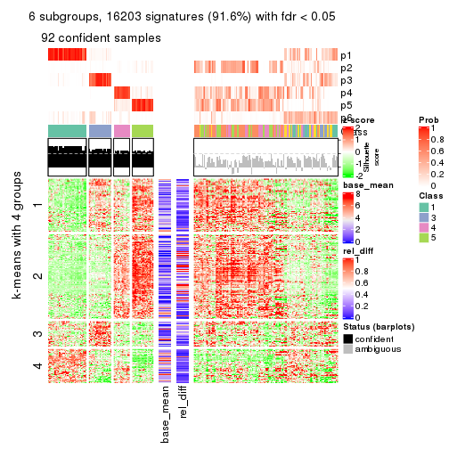</p>

</div>
</div>


Signature heatmaps where rows are not scaled:


<script>
$( function() {
	$( '#tabs-SD-mclust-get-signatures-no-scale' ).tabs();
} );
</script>
<div id='tabs-SD-mclust-get-signatures-no-scale'>
<ul>
<li><a href='#tab-SD-mclust-get-signatures-no-scale-1'>k = 2</a></li>
<li><a href='#tab-SD-mclust-get-signatures-no-scale-2'>k = 3</a></li>
<li><a href='#tab-SD-mclust-get-signatures-no-scale-3'>k = 4</a></li>
<li><a href='#tab-SD-mclust-get-signatures-no-scale-4'>k = 5</a></li>
<li><a href='#tab-SD-mclust-get-signatures-no-scale-5'>k = 6</a></li>
</ul>
<div id='tab-SD-mclust-get-signatures-no-scale-1'>
<pre><code class="r">get_signatures(res, k = 2, scale_rows = FALSE)
</code></pre>

<p></p>

</div>
<div id='tab-SD-mclust-get-signatures-no-scale-2'>
<pre><code class="r">get_signatures(res, k = 3, scale_rows = FALSE)
</code></pre>

<p></p>

</div>
<div id='tab-SD-mclust-get-signatures-no-scale-3'>
<pre><code class="r">get_signatures(res, k = 4, scale_rows = FALSE)
</code></pre>

<p></p>

</div>
<div id='tab-SD-mclust-get-signatures-no-scale-4'>
<pre><code class="r">get_signatures(res, k = 5, scale_rows = FALSE)
</code></pre>

<p></p>

</div>
<div id='tab-SD-mclust-get-signatures-no-scale-5'>
<pre><code class="r">get_signatures(res, k = 6, scale_rows = FALSE)
</code></pre>

<p></p>

</div>
</div>


Compare the overlap of signatures from different k:

```r
compare_signatures(res)
```


`get_signature()` returns a data frame invisibly. TO get the list of signatures, the function
call should be assigned to a variable explicitly. In following code, if `plot` argument is set
to `FALSE`, no heatmap is plotted while only the differential analysis is performed.

```r
# code only for demonstration
tb = get_signature(res, k = ..., plot = FALSE)
```

An example of the output of `tb` is:

```
#>   which_row         fdr    mean_1    mean_2 scaled_mean_1 scaled_mean_2 km
#> 1        38 0.042760348  8.373488  9.131774    -0.5533452     0.5164555  1
#> 2        40 0.018707592  7.106213  8.469186    -0.6173731     0.5762149  1
#> 3        55 0.019134737 10.221463 11.207825    -0.6159697     0.5749050  1
#> 4        59 0.006059896  5.921854  7.869574    -0.6899429     0.6439467  1
#> 5        60 0.018055526  8.928898 10.211722    -0.6204761     0.5791110  1
#> 6        98 0.009384629 15.714769 14.887706     0.6635654    -0.6193277  2
...
```

The columns in `tb` are:

1. `which_row`: row indices corresponding to the input matrix.
2. `fdr`: FDR for the differential test. 
3. `mean_x`: The mean value in group x.
4. `scaled_mean_x`: The mean value in group x after rows are scaled.
5. `km`: Row groups if k-means clustering is applied to rows.


UMAP plot which shows how samples are separated.


<script>
$( function() {
	$( '#tabs-SD-mclust-dimension-reduction' ).tabs();
} );
</script>
<div id='tabs-SD-mclust-dimension-reduction'>
<ul>
<li><a href='#tab-SD-mclust-dimension-reduction-1'>k = 2</a></li>
<li><a href='#tab-SD-mclust-dimension-reduction-2'>k = 3</a></li>
<li><a href='#tab-SD-mclust-dimension-reduction-3'>k = 4</a></li>
<li><a href='#tab-SD-mclust-dimension-reduction-4'>k = 5</a></li>
<li><a href='#tab-SD-mclust-dimension-reduction-5'>k = 6</a></li>
</ul>
<div id='tab-SD-mclust-dimension-reduction-1'>
<pre><code class="r">dimension_reduction(res, k = 2, method = &quot;UMAP&quot;)
</code></pre>

<p></p>

</div>
<div id='tab-SD-mclust-dimension-reduction-2'>
<pre><code class="r">dimension_reduction(res, k = 3, method = &quot;UMAP&quot;)
</code></pre>

<p>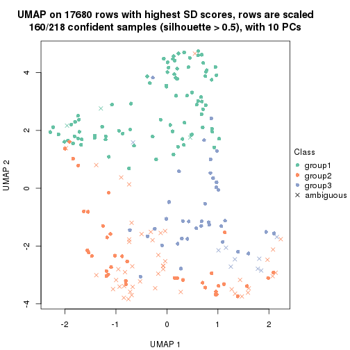</p>

</div>
<div id='tab-SD-mclust-dimension-reduction-3'>
<pre><code class="r">dimension_reduction(res, k = 4, method = &quot;UMAP&quot;)
</code></pre>

<p></p>

</div>
<div id='tab-SD-mclust-dimension-reduction-4'>
<pre><code class="r">dimension_reduction(res, k = 5, method = &quot;UMAP&quot;)
</code></pre>

<p></p>

</div>
<div id='tab-SD-mclust-dimension-reduction-5'>
<pre><code class="r">dimension_reduction(res, k = 6, method = &quot;UMAP&quot;)
</code></pre>

<p></p>

</div>
</div>


Following heatmap shows how subgroups are split when increasing `k`:

```r
collect_classes(res)
```


If matrix rows can be associated to genes, consider to use `GO_Enrichment(res,
...)` to perform function enrichment for the signature genes.


 

---------------------------------------------------


### SD:NMF*


The object with results only for a single top-value method and a single partition method 
can be extracted as:

```r
res = res_list["SD", "NMF"]
# you can also extract it by
# res = res_list["SD:NMF"]
```

A summary of `res` and all the functions that can be applied to it:

```r
res
```

```
#> A 'ConsensusPartition' object with k = 2, 3, 4, 5, 6.
#>   On a matrix with 17680 rows and 218 columns.
#>   Top rows (1000, 2000, 3000, 4000, 5000) are extracted by 'SD' method.
#>   Subgroups are detected by 'NMF' method.
#>   Performed in total 1250 partitions by row resampling.
#>   Best k for subgroups seems to be 6.
#> 
#> Following methods can be applied to this 'ConsensusPartition' object:
#>  [1] "cola_report"             "collect_classes"         "collect_plots"          
#>  [4] "collect_stats"           "colnames"                "compare_signatures"     
#>  [7] "consensus_heatmap"       "dimension_reduction"     "functional_enrichment"  
#> [10] "get_anno_col"            "get_anno"                "get_classes"            
#> [13] "get_consensus"           "get_matrix"              "get_membership"         
#> [16] "get_param"               "get_signatures"          "get_stats"              
#> [19] "is_best_k"               "is_stable_k"             "membership_heatmap"     
#> [22] "ncol"                    "nrow"                    "plot_ecdf"              
#> [25] "rownames"                "select_partition_number" "show"                   
#> [28] "suggest_best_k"          "test_to_known_factors"
```

`collect_plots()` function collects all the plots made from `res` for all `k` (number of partitions)
into one single page to provide an easy and fast comparison between different `k`.

```r
collect_plots(res)
```


The plots are:

- The first row: a plot of the ECDF (Empirical cumulative distribution
  function) curves of the consensus matrix for each `k` and the heatmap of
  predicted classes for each `k`.
- The second row: heatmaps of the consensus matrix for each `k`.
- The third row: heatmaps of the membership matrix for each `k`.
- The fouth row: heatmaps of the signatures for each `k`.

All the plots in panels can be made by individual functions and they are
plotted later in this section.

`select_partition_number()` produces several plots showing different
statistics for choosing "optimized" `k`. There are following statistics:

- ECDF curves of the consensus matrix for each `k`;
- 1-PAC. [The PAC
  score](https://en.wikipedia.org/wiki/Consensus_clustering#Over-interpretation_potential_of_consensus_clustering)
  measures the proportion of the ambiguous subgrouping.
- Mean silhouette score.
- Concordance. The mean probability of fiting the consensus class ids in all
  partitions.
- Area increased. Denote $A_k$ as the area under the ECDF curve for current
  `k`, the area increased is defined as $A_k - A_{k-1}$.
- Rand index. The percent of pairs of samples that are both in a same cluster
  or both are not in a same cluster in the partition of k and k-1.
- Jaccard index. The ratio of pairs of samples are both in a same cluster in
  the partition of k and k-1 and the pairs of samples are both in a same
  cluster in the partition k or k-1.

The detailed explanations of these statistics can be found in [the cola
vignette](http://bioconductor.org/packages/devel/bioc/vignettes/cola/inst/doc/cola.html#toc_13).

Generally speaking, lower PAC score, higher mean silhouette score or higher
concordance corresponds to better partition. Rand index and Jaccard index
measure how similar the current partition is compared to partition with `k-1`.
If they are too similar, we won't accept `k` is better than `k-1`.

```r
select_partition_number(res)
```


The numeric values for all these statistics can be obtained by `get_stats()`.

```r
get_stats(res)
```

```
#>   k 1-PAC mean_silhouette concordance area_increased  Rand Jaccard
#> 2 2 1.000           0.985       0.994         0.5012 0.499   0.499
#> 3 3 0.949           0.938       0.974         0.2561 0.844   0.695
#> 4 4 0.783           0.788       0.837         0.1244 0.852   0.618
#> 5 5 0.785           0.823       0.895         0.0679 0.937   0.771
#> 6 6 0.947           0.877       0.944         0.0479 0.960   0.828
```

`suggest_best_k()` suggests the best $k$ based on these statistics. The rules are as follows:

- All $k$ with Jaccard index larger than 0.95 are removed because the increase of
  the partition number does not provides enough extra information. If all $k$ are removed,
  the best $k$ is assigned by `NA`.
- For $k$ with 1-PAC larger than 0.9, the maximal $k$ is taken as the "best k". Other $k$ is called "optional k".
- If it does not fit the second rule. The $k$ with the highest vote of highest
  1-PAC, mean silhouette and concordance is taken as the "best k".

```r
suggest_best_k(res)
```

```
#> [1] 6
#> attr(,"optional")
#> [1] 2 3
```

There is also optional best $k$ = 2 3 that is worth to check.

Following shows the table of the partitions (You need to click the **show/hide
code output** link to see it). The membership matrix (columns with name `p*`)
is inferred by
[`clue::cl_consensus()`](https://www.rdocumentation.org/link/cl_consensus?package=clue)
function with the `SE` method. Basically the value in the membership matrix
represents the probability to belong to a certain group. The finall class
label for an item is determined with the group with highest probability it
belongs to.

In `get_classes()` function, the entropy is calculated from the membership
matrix and the silhouette score is calculated from the consensus matrix.


<script>
$( function() {
	$( '#tabs-SD-NMF-get-classes' ).tabs();
} );
</script>
<div id='tabs-SD-NMF-get-classes'>
<ul>
<li><a href='#tab-SD-NMF-get-classes-1'>k = 2</a></li>
<li><a href='#tab-SD-NMF-get-classes-2'>k = 3</a></li>
<li><a href='#tab-SD-NMF-get-classes-3'>k = 4</a></li>
<li><a href='#tab-SD-NMF-get-classes-4'>k = 5</a></li>
<li><a href='#tab-SD-NMF-get-classes-5'>k = 6</a></li>
</ul>

<div id='tab-SD-NMF-get-classes-1'>
<p><a id='tab-SD-NMF-get-classes-1-a' style='color:#0366d6' href='#'>show/hide code output</a></p>
<pre><code class="r">cbind(get_classes(res, k = 2), get_membership(res, k = 2))
</code></pre>

<pre><code>#&gt;            class entropy silhouette    p1    p2
#&gt; SRR1498997     2  0.0000    0.99357 0.000 1.000
#&gt; SRR1076441     1  0.0000    0.99408 1.000 0.000
#&gt; SRR1489803     2  0.0000    0.99357 0.000 1.000
#&gt; SRR1345953     2  0.0000    0.99357 0.000 1.000
#&gt; SRR1357826     2  0.0000    0.99357 0.000 1.000
#&gt; SRR1419656     1  0.0000    0.99408 1.000 0.000
#&gt; SRR1454158     2  0.0000    0.99357 0.000 1.000
#&gt; SRR1475408     2  0.0000    0.99357 0.000 1.000
#&gt; SRR1472704     2  0.0000    0.99357 0.000 1.000
#&gt; SRR1090046     1  0.0000    0.99408 1.000 0.000
#&gt; SRR1312822     1  0.0000    0.99408 1.000 0.000
#&gt; SRR1096987     2  0.0000    0.99357 0.000 1.000
#&gt; SRR1334587     2  0.0000    0.99357 0.000 1.000
#&gt; SRR1490246     1  0.0000    0.99408 1.000 0.000
#&gt; SRR1467522     1  0.0000    0.99408 1.000 0.000
#&gt; SRR1324206     1  0.0000    0.99408 1.000 0.000
#&gt; SRR1408574     2  0.0000    0.99357 0.000 1.000
#&gt; SRR1083959     2  0.0000    0.99357 0.000 1.000
#&gt; SRR1079948     2  0.0000    0.99357 0.000 1.000
#&gt; SRR1310667     2  0.0000    0.99357 0.000 1.000
#&gt; SRR655852      2  0.0000    0.99357 0.000 1.000
#&gt; SRR1352457     2  0.0000    0.99357 0.000 1.000
#&gt; SRR1353994     2  0.0000    0.99357 0.000 1.000
#&gt; SRR1459561     2  0.0000    0.99357 0.000 1.000
#&gt; SRR1454009     1  0.0000    0.99408 1.000 0.000
#&gt; SRR1071084     1  0.0000    0.99408 1.000 0.000
#&gt; SRR1082859     2  0.0000    0.99357 0.000 1.000
#&gt; SRR1086538     1  0.0000    0.99408 1.000 0.000
#&gt; SRR1486262     2  0.0000    0.99357 0.000 1.000
#&gt; SRR658105      1  0.0000    0.99408 1.000 0.000
#&gt; SRR811073      2  0.0000    0.99357 0.000 1.000
#&gt; SRR1429181     2  0.0000    0.99357 0.000 1.000
#&gt; SRR1327896     2  0.0000    0.99357 0.000 1.000
#&gt; SRR1464788     2  0.0000    0.99357 0.000 1.000
#&gt; SRR1346861     2  0.0000    0.99357 0.000 1.000
#&gt; SRR1318774     2  0.0000    0.99357 0.000 1.000
#&gt; SRR1420517     1  0.0000    0.99408 1.000 0.000
#&gt; SRR1369584     2  0.0000    0.99357 0.000 1.000
#&gt; SRR1443244     1  0.3114    0.94083 0.944 0.056
#&gt; SRR1455391     1  0.0000    0.99408 1.000 0.000
#&gt; SRR1068999     1  0.0000    0.99408 1.000 0.000
#&gt; SRR1481297     1  0.0000    0.99408 1.000 0.000
#&gt; SRR1070208     1  0.0000    0.99408 1.000 0.000
#&gt; SRR1317282     1  0.0000    0.99408 1.000 0.000
#&gt; SRR1096125     2  0.0000    0.99357 0.000 1.000
#&gt; SRR1472506     1  0.7056    0.76688 0.808 0.192
#&gt; SRR1388281     2  0.0000    0.99357 0.000 1.000
#&gt; SRR1365622     2  0.0000    0.99357 0.000 1.000
#&gt; SRR662306      1  0.0000    0.99408 1.000 0.000
#&gt; SRR662811      1  0.0000    0.99408 1.000 0.000
#&gt; SRR820571      1  0.6148    0.82458 0.848 0.152
#&gt; SRR1357166     1  0.0000    0.99408 1.000 0.000
#&gt; SRR1488586     1  0.0000    0.99408 1.000 0.000
#&gt; SRR1485398     1  0.0000    0.99408 1.000 0.000
#&gt; SRR1417725     2  0.0000    0.99357 0.000 1.000
#&gt; SRR1409397     2  0.0000    0.99357 0.000 1.000
#&gt; SRR1465693     2  0.0000    0.99357 0.000 1.000
#&gt; SRR1096547     1  0.3584    0.92790 0.932 0.068
#&gt; SRR1456818     1  0.0000    0.99408 1.000 0.000
#&gt; SRR816336      1  0.0000    0.99408 1.000 0.000
#&gt; SRR1420238     1  0.0000    0.99408 1.000 0.000
#&gt; SRR1433374     1  0.0000    0.99408 1.000 0.000
#&gt; SRR1436990     1  0.0000    0.99408 1.000 0.000
#&gt; SRR662378      1  0.0000    0.99408 1.000 0.000
#&gt; SRR1477671     1  0.0000    0.99408 1.000 0.000
#&gt; SRR1084079     2  1.0000    0.00201 0.496 0.504
#&gt; SRR1102949     1  0.0000    0.99408 1.000 0.000
#&gt; SRR1458090     1  0.0000    0.99408 1.000 0.000
#&gt; SRR1418729     2  0.0000    0.99357 0.000 1.000
#&gt; SRR1403814     2  0.0000    0.99357 0.000 1.000
#&gt; SRR1404887     1  0.3114    0.94083 0.944 0.056
#&gt; SRR1434955     1  0.0000    0.99408 1.000 0.000
#&gt; SRR1360652     1  0.0000    0.99408 1.000 0.000
#&gt; SRR1356765     2  0.0000    0.99357 0.000 1.000
#&gt; SRR1078258     2  0.0000    0.99357 0.000 1.000
#&gt; SRR1455861     1  0.0000    0.99408 1.000 0.000
#&gt; SRR1420296     2  0.0000    0.99357 0.000 1.000
#&gt; SRR1070260     2  0.0000    0.99357 0.000 1.000
#&gt; SRR1410765     1  0.0000    0.99408 1.000 0.000
#&gt; SRR1481315     1  0.0000    0.99408 1.000 0.000
#&gt; SRR1414661     2  0.0000    0.99357 0.000 1.000
#&gt; SRR1359147     2  0.0000    0.99357 0.000 1.000
#&gt; SRR1488694     1  0.0000    0.99408 1.000 0.000
#&gt; SRR1477273     1  0.0000    0.99408 1.000 0.000
#&gt; SRR1415792     1  0.0000    0.99408 1.000 0.000
#&gt; SRR1369088     2  0.7299    0.73965 0.204 0.796
#&gt; SRR1406621     2  0.0000    0.99357 0.000 1.000
#&gt; SRR1401017     2  0.0000    0.99357 0.000 1.000
#&gt; SRR1099981     2  0.0000    0.99357 0.000 1.000
#&gt; SRR815208      2  0.0000    0.99357 0.000 1.000
#&gt; SRR1380460     2  0.0000    0.99357 0.000 1.000
#&gt; SRR1091097     2  0.0000    0.99357 0.000 1.000
#&gt; SRR1456010     1  0.0000    0.99408 1.000 0.000
#&gt; SRR1498416     2  0.0000    0.99357 0.000 1.000
#&gt; SRR818873      2  0.0000    0.99357 0.000 1.000
#&gt; SRR813868      2  0.0000    0.99357 0.000 1.000
#&gt; SRR1394912     1  0.0000    0.99408 1.000 0.000
#&gt; SRR1475824     2  0.0000    0.99357 0.000 1.000
#&gt; SRR1459866     1  0.0000    0.99408 1.000 0.000
#&gt; SRR1364871     2  0.1414    0.97377 0.020 0.980
#&gt; SRR1100472     2  0.0000    0.99357 0.000 1.000
#&gt; SRR1331267     1  0.0000    0.99408 1.000 0.000
#&gt; SRR1068977     2  0.0000    0.99357 0.000 1.000
#&gt; SRR1391511     2  0.0000    0.99357 0.000 1.000
#&gt; SRR1077920     2  0.0000    0.99357 0.000 1.000
#&gt; SRR1457705     1  0.0000    0.99408 1.000 0.000
#&gt; SRR1437073     1  0.0000    0.99408 1.000 0.000
#&gt; SRR1473124     1  0.0000    0.99408 1.000 0.000
#&gt; SRR1469279     1  0.0000    0.99408 1.000 0.000
#&gt; SRR1091791     2  0.0000    0.99357 0.000 1.000
#&gt; SRR1341539     2  0.0000    0.99357 0.000 1.000
#&gt; SRR1446354     1  0.0000    0.99408 1.000 0.000
#&gt; SRR1415420     1  0.0000    0.99408 1.000 0.000
#&gt; SRR1368050     1  0.0000    0.99408 1.000 0.000
#&gt; SRR656970      2  0.0000    0.99357 0.000 1.000
#&gt; SRR1473403     2  0.0000    0.99357 0.000 1.000
#&gt; SRR1084674     1  0.0000    0.99408 1.000 0.000
#&gt; SRR1464702     1  0.0000    0.99408 1.000 0.000
#&gt; SRR1074860     2  0.0000    0.99357 0.000 1.000
#&gt; SRR655447      2  0.0000    0.99357 0.000 1.000
#&gt; SRR1404442     2  0.0000    0.99357 0.000 1.000
#&gt; SRR1418795     1  0.0000    0.99408 1.000 0.000
#&gt; SRR1458335     2  0.0000    0.99357 0.000 1.000
#&gt; SRR1489589     2  0.0000    0.99357 0.000 1.000
#&gt; SRR1378284     1  0.0000    0.99408 1.000 0.000
#&gt; SRR1408014     2  0.0000    0.99357 0.000 1.000
#&gt; SRR1083052     1  0.0000    0.99408 1.000 0.000
#&gt; SRR1339236     2  0.0000    0.99357 0.000 1.000
#&gt; SRR1323829     2  0.0000    0.99357 0.000 1.000
#&gt; SRR1086772     2  0.0000    0.99357 0.000 1.000
#&gt; SRR1486457     1  0.0000    0.99408 1.000 0.000
#&gt; SRR1415257     2  0.0000    0.99357 0.000 1.000
#&gt; SRR1071905     1  0.0000    0.99408 1.000 0.000
#&gt; SRR659223      2  0.0000    0.99357 0.000 1.000
#&gt; SRR1386945     1  0.0000    0.99408 1.000 0.000
#&gt; SRR821498      2  0.0000    0.99357 0.000 1.000
#&gt; SRR1378903     2  0.0000    0.99357 0.000 1.000
#&gt; SRR1472907     1  0.0000    0.99408 1.000 0.000
#&gt; SRR1442313     2  0.0000    0.99357 0.000 1.000
#&gt; SRR1077139     2  0.0000    0.99357 0.000 1.000
#&gt; SRR1342758     1  0.0000    0.99408 1.000 0.000
#&gt; SRR656911      2  0.0000    0.99357 0.000 1.000
#&gt; SRR1070738     1  0.0000    0.99408 1.000 0.000
#&gt; SRR1476950     1  0.0000    0.99408 1.000 0.000
#&gt; SRR1488196     1  0.0000    0.99408 1.000 0.000
#&gt; SRR1498951     1  0.0000    0.99408 1.000 0.000
#&gt; SRR1413392     1  0.0000    0.99408 1.000 0.000
#&gt; SRR657528      2  0.0000    0.99357 0.000 1.000
#&gt; SRR812198      1  0.0000    0.99408 1.000 0.000
#&gt; SRR660283      2  0.0000    0.99357 0.000 1.000
#&gt; SRR1420936     1  0.0000    0.99408 1.000 0.000
#&gt; SRR1469547     2  0.0000    0.99357 0.000 1.000
#&gt; SRR1322249     1  0.0000    0.99408 1.000 0.000
#&gt; SRR1396682     1  0.0000    0.99408 1.000 0.000
#&gt; SRR1095816     2  0.0000    0.99357 0.000 1.000
#&gt; SRR1081023     1  0.0000    0.99408 1.000 0.000
#&gt; SRR1092517     2  0.0000    0.99357 0.000 1.000
#&gt; SRR811285      2  0.0000    0.99357 0.000 1.000
#&gt; SRR657018      1  0.0000    0.99408 1.000 0.000
#&gt; SRR1365534     1  0.0000    0.99408 1.000 0.000
#&gt; SRR1090791     2  0.0000    0.99357 0.000 1.000
#&gt; SRR1439915     2  0.0000    0.99357 0.000 1.000
#&gt; SRR1391575     2  0.0000    0.99357 0.000 1.000
#&gt; SRR1314092     2  0.0000    0.99357 0.000 1.000
#&gt; SRR1328941     1  0.0000    0.99408 1.000 0.000
#&gt; SRR1336181     2  0.0000    0.99357 0.000 1.000
#&gt; SRR1362972     1  0.0000    0.99408 1.000 0.000
#&gt; SRR1366790     2  0.0000    0.99357 0.000 1.000
#&gt; SRR1455902     1  0.0000    0.99408 1.000 0.000
#&gt; SRR1437644     1  0.1414    0.97591 0.980 0.020
#&gt; SRR1105009     2  0.0000    0.99357 0.000 1.000
#&gt; SRR1367024     1  0.0000    0.99408 1.000 0.000
#&gt; SRR660248      2  0.0000    0.99357 0.000 1.000
#&gt; SRR1409620     1  0.0000    0.99408 1.000 0.000
#&gt; SRR1455807     2  0.0000    0.99357 0.000 1.000
#&gt; SRR1339431     1  0.0000    0.99408 1.000 0.000
#&gt; SRR1378948     1  0.3114    0.94077 0.944 0.056
#&gt; SRR1469237     1  0.0000    0.99408 1.000 0.000
#&gt; SRR1098264     2  0.0000    0.99357 0.000 1.000
#&gt; SRR1406224     2  0.0000    0.99357 0.000 1.000
#&gt; SRR1393026     1  0.0000    0.99408 1.000 0.000
#&gt; SRR808428      2  0.0000    0.99357 0.000 1.000
#&gt; SRR615910      2  0.0000    0.99357 0.000 1.000
#&gt; SRR1076219     1  0.0000    0.99408 1.000 0.000
#&gt; SRR1481128     1  0.0000    0.99408 1.000 0.000
#&gt; SRR1359262     2  0.0000    0.99357 0.000 1.000
#&gt; SRR1407648     2  0.0000    0.99357 0.000 1.000
#&gt; SRR1386775     1  0.0000    0.99408 1.000 0.000
#&gt; SRR1388399     1  0.0000    0.99408 1.000 0.000
#&gt; SRR1361499     2  0.0000    0.99357 0.000 1.000
#&gt; SRR1500709     2  0.0000    0.99357 0.000 1.000
#&gt; SRR1335917     1  0.0000    0.99408 1.000 0.000
#&gt; SRR1430615     2  0.0000    0.99357 0.000 1.000
#&gt; SRR1335212     1  0.0000    0.99408 1.000 0.000
#&gt; SRR1400159     2  0.0000    0.99357 0.000 1.000
#&gt; SRR1457245     2  0.0000    0.99357 0.000 1.000
#&gt; SRR1356746     2  0.0000    0.99357 0.000 1.000
#&gt; SRR658319      2  0.0000    0.99357 0.000 1.000
#&gt; SRR1435946     1  0.0000    0.99408 1.000 0.000
#&gt; SRR1370308     1  0.0000    0.99408 1.000 0.000
#&gt; SRR1100893     1  0.0000    0.99408 1.000 0.000
#&gt; SRR1389432     1  0.0000    0.99408 1.000 0.000
#&gt; SRR1381799     2  0.0000    0.99357 0.000 1.000
#&gt; SRR1310158     1  0.0000    0.99408 1.000 0.000
#&gt; SRR1341100     2  0.0376    0.98972 0.004 0.996
#&gt; SRR1342873     1  0.0000    0.99408 1.000 0.000
#&gt; SRR1472102     2  0.0000    0.99357 0.000 1.000
#&gt; SRR1409421     1  0.0000    0.99408 1.000 0.000
#&gt; SRR1328577     2  0.0000    0.99357 0.000 1.000
#&gt; SRR808942      2  0.0000    0.99357 0.000 1.000
#&gt; SRR1343818     2  0.0000    0.99357 0.000 1.000
#&gt; SRR1472415     2  0.0000    0.99357 0.000 1.000
#&gt; SRR658409      2  0.0000    0.99357 0.000 1.000
#&gt; SRR1469681     1  0.0000    0.99408 1.000 0.000
#&gt; SRR1075484     2  0.0000    0.99357 0.000 1.000
#&gt; SRR1417894     1  0.0000    0.99408 1.000 0.000
#&gt; SRR1417422     2  0.0000    0.99357 0.000 1.000
#&gt; SRR1090674     1  0.0000    0.99408 1.000 0.000
</code></pre>

<script>
$('#tab-SD-NMF-get-classes-1-a').parent().next().next().hide();
$('#tab-SD-NMF-get-classes-1-a').click(function(){
  $('#tab-SD-NMF-get-classes-1-a').parent().next().next().toggle();
  return(false);
});
</script>
</div>

<div id='tab-SD-NMF-get-classes-2'>
<p><a id='tab-SD-NMF-get-classes-2-a' style='color:#0366d6' href='#'>show/hide code output</a></p>
<pre><code class="r">cbind(get_classes(res, k = 3), get_membership(res, k = 3))
</code></pre>

<pre><code>#&gt;            class entropy silhouette    p1    p2    p3
#&gt; SRR1498997     2  0.0000     0.9778 0.000 1.000 0.000
#&gt; SRR1076441     1  0.0000     0.9873 1.000 0.000 0.000
#&gt; SRR1489803     2  0.0000     0.9778 0.000 1.000 0.000
#&gt; SRR1345953     2  0.0000     0.9778 0.000 1.000 0.000
#&gt; SRR1357826     2  0.0000     0.9778 0.000 1.000 0.000
#&gt; SRR1419656     3  0.0000     0.9357 0.000 0.000 1.000
#&gt; SRR1454158     2  0.0000     0.9778 0.000 1.000 0.000
#&gt; SRR1475408     3  0.4291     0.7893 0.000 0.180 0.820
#&gt; SRR1472704     2  0.0000     0.9778 0.000 1.000 0.000
#&gt; SRR1090046     1  0.1411     0.9536 0.964 0.000 0.036
#&gt; SRR1312822     1  0.0000     0.9873 1.000 0.000 0.000
#&gt; SRR1096987     2  0.0000     0.9778 0.000 1.000 0.000
#&gt; SRR1334587     2  0.0000     0.9778 0.000 1.000 0.000
#&gt; SRR1490246     1  0.0000     0.9873 1.000 0.000 0.000
#&gt; SRR1467522     1  0.0000     0.9873 1.000 0.000 0.000
#&gt; SRR1324206     1  0.0000     0.9873 1.000 0.000 0.000
#&gt; SRR1408574     2  0.0000     0.9778 0.000 1.000 0.000
#&gt; SRR1083959     2  0.0000     0.9778 0.000 1.000 0.000
#&gt; SRR1079948     2  0.0000     0.9778 0.000 1.000 0.000
#&gt; SRR1310667     2  0.0000     0.9778 0.000 1.000 0.000
#&gt; SRR655852      2  0.0000     0.9778 0.000 1.000 0.000
#&gt; SRR1352457     2  0.0000     0.9778 0.000 1.000 0.000
#&gt; SRR1353994     2  0.0000     0.9778 0.000 1.000 0.000
#&gt; SRR1459561     2  0.0000     0.9778 0.000 1.000 0.000
#&gt; SRR1454009     3  0.0000     0.9357 0.000 0.000 1.000
#&gt; SRR1071084     3  0.0000     0.9357 0.000 0.000 1.000
#&gt; SRR1082859     2  0.0000     0.9778 0.000 1.000 0.000
#&gt; SRR1086538     1  0.0000     0.9873 1.000 0.000 0.000
#&gt; SRR1486262     2  0.0000     0.9778 0.000 1.000 0.000
#&gt; SRR658105      1  0.0000     0.9873 1.000 0.000 0.000
#&gt; SRR811073      2  0.0000     0.9778 0.000 1.000 0.000
#&gt; SRR1429181     2  0.0000     0.9778 0.000 1.000 0.000
#&gt; SRR1327896     2  0.0000     0.9778 0.000 1.000 0.000
#&gt; SRR1464788     2  0.0000     0.9778 0.000 1.000 0.000
#&gt; SRR1346861     2  0.0000     0.9778 0.000 1.000 0.000
#&gt; SRR1318774     2  0.0000     0.9778 0.000 1.000 0.000
#&gt; SRR1420517     3  0.0000     0.9357 0.000 0.000 1.000
#&gt; SRR1369584     2  0.0000     0.9778 0.000 1.000 0.000
#&gt; SRR1443244     1  0.2066     0.9123 0.940 0.060 0.000
#&gt; SRR1455391     1  0.0424     0.9811 0.992 0.000 0.008
#&gt; SRR1068999     1  0.0000     0.9873 1.000 0.000 0.000
#&gt; SRR1481297     3  0.0000     0.9357 0.000 0.000 1.000
#&gt; SRR1070208     1  0.2448     0.9104 0.924 0.000 0.076
#&gt; SRR1317282     3  0.0000     0.9357 0.000 0.000 1.000
#&gt; SRR1096125     2  0.0000     0.9778 0.000 1.000 0.000
#&gt; SRR1472506     3  0.2796     0.8703 0.000 0.092 0.908
#&gt; SRR1388281     2  0.0000     0.9778 0.000 1.000 0.000
#&gt; SRR1365622     2  0.0000     0.9778 0.000 1.000 0.000
#&gt; SRR662306      3  0.0000     0.9357 0.000 0.000 1.000
#&gt; SRR662811      1  0.0000     0.9873 1.000 0.000 0.000
#&gt; SRR820571      3  0.2448     0.8834 0.000 0.076 0.924
#&gt; SRR1357166     3  0.3879     0.8178 0.152 0.000 0.848
#&gt; SRR1488586     1  0.0237     0.9844 0.996 0.000 0.004
#&gt; SRR1485398     1  0.0000     0.9873 1.000 0.000 0.000
#&gt; SRR1417725     3  0.0000     0.9357 0.000 0.000 1.000
#&gt; SRR1409397     2  0.3551     0.8313 0.000 0.868 0.132
#&gt; SRR1465693     2  0.0000     0.9778 0.000 1.000 0.000
#&gt; SRR1096547     3  0.0000     0.9357 0.000 0.000 1.000
#&gt; SRR1456818     1  0.0000     0.9873 1.000 0.000 0.000
#&gt; SRR816336      3  0.0000     0.9357 0.000 0.000 1.000
#&gt; SRR1420238     1  0.0000     0.9873 1.000 0.000 0.000
#&gt; SRR1433374     3  0.0000     0.9357 0.000 0.000 1.000
#&gt; SRR1436990     1  0.0000     0.9873 1.000 0.000 0.000
#&gt; SRR662378      1  0.0000     0.9873 1.000 0.000 0.000
#&gt; SRR1477671     1  0.0000     0.9873 1.000 0.000 0.000
#&gt; SRR1084079     2  0.3340     0.8460 0.120 0.880 0.000
#&gt; SRR1102949     1  0.0000     0.9873 1.000 0.000 0.000
#&gt; SRR1458090     1  0.0000     0.9873 1.000 0.000 0.000
#&gt; SRR1418729     2  0.0424     0.9705 0.000 0.992 0.008
#&gt; SRR1403814     2  0.0000     0.9778 0.000 1.000 0.000
#&gt; SRR1404887     1  0.1411     0.9444 0.964 0.036 0.000
#&gt; SRR1434955     1  0.0000     0.9873 1.000 0.000 0.000
#&gt; SRR1360652     1  0.0000     0.9873 1.000 0.000 0.000
#&gt; SRR1356765     2  0.0000     0.9778 0.000 1.000 0.000
#&gt; SRR1078258     2  0.0000     0.9778 0.000 1.000 0.000
#&gt; SRR1455861     1  0.0000     0.9873 1.000 0.000 0.000
#&gt; SRR1420296     2  0.0000     0.9778 0.000 1.000 0.000
#&gt; SRR1070260     2  0.0000     0.9778 0.000 1.000 0.000
#&gt; SRR1410765     1  0.0000     0.9873 1.000 0.000 0.000
#&gt; SRR1481315     1  0.0000     0.9873 1.000 0.000 0.000
#&gt; SRR1414661     2  0.0000     0.9778 0.000 1.000 0.000
#&gt; SRR1359147     2  0.0000     0.9778 0.000 1.000 0.000
#&gt; SRR1488694     1  0.0000     0.9873 1.000 0.000 0.000
#&gt; SRR1477273     3  0.0000     0.9357 0.000 0.000 1.000
#&gt; SRR1415792     1  0.6140     0.2740 0.596 0.000 0.404
#&gt; SRR1369088     2  0.0000     0.9778 0.000 1.000 0.000
#&gt; SRR1406621     2  0.0000     0.9778 0.000 1.000 0.000
#&gt; SRR1401017     2  0.6291     0.0654 0.000 0.532 0.468
#&gt; SRR1099981     2  0.0000     0.9778 0.000 1.000 0.000
#&gt; SRR815208      2  0.0000     0.9778 0.000 1.000 0.000
#&gt; SRR1380460     2  0.0000     0.9778 0.000 1.000 0.000
#&gt; SRR1091097     2  0.0000     0.9778 0.000 1.000 0.000
#&gt; SRR1456010     3  0.0000     0.9357 0.000 0.000 1.000
#&gt; SRR1498416     2  0.0000     0.9778 0.000 1.000 0.000
#&gt; SRR818873      2  0.0237     0.9742 0.000 0.996 0.004
#&gt; SRR813868      2  0.1964     0.9219 0.000 0.944 0.056
#&gt; SRR1394912     1  0.0000     0.9873 1.000 0.000 0.000
#&gt; SRR1475824     2  0.0000     0.9778 0.000 1.000 0.000
#&gt; SRR1459866     1  0.0000     0.9873 1.000 0.000 0.000
#&gt; SRR1364871     2  0.6252     0.1561 0.000 0.556 0.444
#&gt; SRR1100472     2  0.0000     0.9778 0.000 1.000 0.000
#&gt; SRR1331267     1  0.0000     0.9873 1.000 0.000 0.000
#&gt; SRR1068977     2  0.0000     0.9778 0.000 1.000 0.000
#&gt; SRR1391511     2  0.0000     0.9778 0.000 1.000 0.000
#&gt; SRR1077920     2  0.0000     0.9778 0.000 1.000 0.000
#&gt; SRR1457705     3  0.0000     0.9357 0.000 0.000 1.000
#&gt; SRR1437073     1  0.0000     0.9873 1.000 0.000 0.000
#&gt; SRR1473124     3  0.0000     0.9357 0.000 0.000 1.000
#&gt; SRR1469279     3  0.0000     0.9357 0.000 0.000 1.000
#&gt; SRR1091791     2  0.0000     0.9778 0.000 1.000 0.000
#&gt; SRR1341539     2  0.0000     0.9778 0.000 1.000 0.000
#&gt; SRR1446354     3  0.0000     0.9357 0.000 0.000 1.000
#&gt; SRR1415420     1  0.0000     0.9873 1.000 0.000 0.000
#&gt; SRR1368050     1  0.0237     0.9844 0.996 0.000 0.004
#&gt; SRR656970      2  0.0000     0.9778 0.000 1.000 0.000
#&gt; SRR1473403     2  0.0000     0.9778 0.000 1.000 0.000
#&gt; SRR1084674     3  0.0747     0.9270 0.016 0.000 0.984
#&gt; SRR1464702     1  0.0592     0.9777 0.988 0.000 0.012
#&gt; SRR1074860     2  0.0000     0.9778 0.000 1.000 0.000
#&gt; SRR655447      2  0.0000     0.9778 0.000 1.000 0.000
#&gt; SRR1404442     2  0.0000     0.9778 0.000 1.000 0.000
#&gt; SRR1418795     1  0.0000     0.9873 1.000 0.000 0.000
#&gt; SRR1458335     2  0.5254     0.6219 0.000 0.736 0.264
#&gt; SRR1489589     3  0.5497     0.6145 0.000 0.292 0.708
#&gt; SRR1378284     1  0.0000     0.9873 1.000 0.000 0.000
#&gt; SRR1408014     2  0.0000     0.9778 0.000 1.000 0.000
#&gt; SRR1083052     1  0.0000     0.9873 1.000 0.000 0.000
#&gt; SRR1339236     3  0.0000     0.9357 0.000 0.000 1.000
#&gt; SRR1323829     2  0.0000     0.9778 0.000 1.000 0.000
#&gt; SRR1086772     2  0.0000     0.9778 0.000 1.000 0.000
#&gt; SRR1486457     3  0.0000     0.9357 0.000 0.000 1.000
#&gt; SRR1415257     2  0.0000     0.9778 0.000 1.000 0.000
#&gt; SRR1071905     3  0.1643     0.9093 0.044 0.000 0.956
#&gt; SRR659223      2  0.0000     0.9778 0.000 1.000 0.000
#&gt; SRR1386945     3  0.0000     0.9357 0.000 0.000 1.000
#&gt; SRR821498      2  0.4702     0.7136 0.000 0.788 0.212
#&gt; SRR1378903     2  0.0000     0.9778 0.000 1.000 0.000
#&gt; SRR1472907     3  0.0000     0.9357 0.000 0.000 1.000
#&gt; SRR1442313     2  0.0000     0.9778 0.000 1.000 0.000
#&gt; SRR1077139     2  0.0000     0.9778 0.000 1.000 0.000
#&gt; SRR1342758     1  0.0000     0.9873 1.000 0.000 0.000
#&gt; SRR656911      2  0.0000     0.9778 0.000 1.000 0.000
#&gt; SRR1070738     1  0.0000     0.9873 1.000 0.000 0.000
#&gt; SRR1476950     1  0.2261     0.9199 0.932 0.000 0.068
#&gt; SRR1488196     3  0.0000     0.9357 0.000 0.000 1.000
#&gt; SRR1498951     3  0.0000     0.9357 0.000 0.000 1.000
#&gt; SRR1413392     1  0.0000     0.9873 1.000 0.000 0.000
#&gt; SRR657528      2  0.6295     0.0518 0.000 0.528 0.472
#&gt; SRR812198      1  0.0000     0.9873 1.000 0.000 0.000
#&gt; SRR660283      2  0.0000     0.9778 0.000 1.000 0.000
#&gt; SRR1420936     1  0.0000     0.9873 1.000 0.000 0.000
#&gt; SRR1469547     2  0.0000     0.9778 0.000 1.000 0.000
#&gt; SRR1322249     1  0.0000     0.9873 1.000 0.000 0.000
#&gt; SRR1396682     1  0.0000     0.9873 1.000 0.000 0.000
#&gt; SRR1095816     2  0.0000     0.9778 0.000 1.000 0.000
#&gt; SRR1081023     1  0.0000     0.9873 1.000 0.000 0.000
#&gt; SRR1092517     2  0.0000     0.9778 0.000 1.000 0.000
#&gt; SRR811285      2  0.0000     0.9778 0.000 1.000 0.000
#&gt; SRR657018      1  0.0000     0.9873 1.000 0.000 0.000
#&gt; SRR1365534     3  0.0000     0.9357 0.000 0.000 1.000
#&gt; SRR1090791     2  0.0000     0.9778 0.000 1.000 0.000
#&gt; SRR1439915     3  0.4654     0.7537 0.000 0.208 0.792
#&gt; SRR1391575     2  0.0000     0.9778 0.000 1.000 0.000
#&gt; SRR1314092     2  0.0000     0.9778 0.000 1.000 0.000
#&gt; SRR1328941     3  0.0000     0.9357 0.000 0.000 1.000
#&gt; SRR1336181     2  0.0000     0.9778 0.000 1.000 0.000
#&gt; SRR1362972     1  0.0000     0.9873 1.000 0.000 0.000
#&gt; SRR1366790     3  0.6291     0.1560 0.000 0.468 0.532
#&gt; SRR1455902     3  0.0000     0.9357 0.000 0.000 1.000
#&gt; SRR1437644     3  0.4555     0.7647 0.000 0.200 0.800
#&gt; SRR1105009     2  0.0000     0.9778 0.000 1.000 0.000
#&gt; SRR1367024     3  0.0000     0.9357 0.000 0.000 1.000
#&gt; SRR660248      3  0.4605     0.7593 0.000 0.204 0.796
#&gt; SRR1409620     1  0.0000     0.9873 1.000 0.000 0.000
#&gt; SRR1455807     2  0.0000     0.9778 0.000 1.000 0.000
#&gt; SRR1339431     1  0.0000     0.9873 1.000 0.000 0.000
#&gt; SRR1378948     3  0.0000     0.9357 0.000 0.000 1.000
#&gt; SRR1469237     1  0.0000     0.9873 1.000 0.000 0.000
#&gt; SRR1098264     2  0.0000     0.9778 0.000 1.000 0.000
#&gt; SRR1406224     2  0.0000     0.9778 0.000 1.000 0.000
#&gt; SRR1393026     3  0.3340     0.8500 0.120 0.000 0.880
#&gt; SRR808428      2  0.0000     0.9778 0.000 1.000 0.000
#&gt; SRR615910      2  0.0000     0.9778 0.000 1.000 0.000
#&gt; SRR1076219     3  0.3482     0.8428 0.128 0.000 0.872
#&gt; SRR1481128     1  0.0000     0.9873 1.000 0.000 0.000
#&gt; SRR1359262     2  0.0000     0.9778 0.000 1.000 0.000
#&gt; SRR1407648     2  0.0000     0.9778 0.000 1.000 0.000
#&gt; SRR1386775     1  0.0237     0.9832 0.996 0.004 0.000
#&gt; SRR1388399     1  0.0000     0.9873 1.000 0.000 0.000
#&gt; SRR1361499     2  0.0000     0.9778 0.000 1.000 0.000
#&gt; SRR1500709     2  0.0000     0.9778 0.000 1.000 0.000
#&gt; SRR1335917     1  0.0000     0.9873 1.000 0.000 0.000
#&gt; SRR1430615     2  0.0000     0.9778 0.000 1.000 0.000
#&gt; SRR1335212     3  0.4555     0.7596 0.200 0.000 0.800
#&gt; SRR1400159     3  0.0000     0.9357 0.000 0.000 1.000
#&gt; SRR1457245     2  0.0000     0.9778 0.000 1.000 0.000
#&gt; SRR1356746     2  0.0000     0.9778 0.000 1.000 0.000
#&gt; SRR658319      2  0.0000     0.9778 0.000 1.000 0.000
#&gt; SRR1435946     1  0.0000     0.9873 1.000 0.000 0.000
#&gt; SRR1370308     1  0.0237     0.9844 0.996 0.000 0.004
#&gt; SRR1100893     1  0.0000     0.9873 1.000 0.000 0.000
#&gt; SRR1389432     3  0.3412     0.8462 0.124 0.000 0.876
#&gt; SRR1381799     2  0.0000     0.9778 0.000 1.000 0.000
#&gt; SRR1310158     3  0.0000     0.9357 0.000 0.000 1.000
#&gt; SRR1341100     2  0.0000     0.9778 0.000 1.000 0.000
#&gt; SRR1342873     3  0.4346     0.7806 0.184 0.000 0.816
#&gt; SRR1472102     2  0.0000     0.9778 0.000 1.000 0.000
#&gt; SRR1409421     3  0.0000     0.9357 0.000 0.000 1.000
#&gt; SRR1328577     2  0.0000     0.9778 0.000 1.000 0.000
#&gt; SRR808942      2  0.0000     0.9778 0.000 1.000 0.000
#&gt; SRR1343818     2  0.0000     0.9778 0.000 1.000 0.000
#&gt; SRR1472415     2  0.0000     0.9778 0.000 1.000 0.000
#&gt; SRR658409      2  0.0000     0.9778 0.000 1.000 0.000
#&gt; SRR1469681     1  0.0000     0.9873 1.000 0.000 0.000
#&gt; SRR1075484     2  0.0000     0.9778 0.000 1.000 0.000
#&gt; SRR1417894     3  0.0000     0.9357 0.000 0.000 1.000
#&gt; SRR1417422     2  0.0892     0.9590 0.000 0.980 0.020
#&gt; SRR1090674     1  0.0000     0.9873 1.000 0.000 0.000
</code></pre>

<script>
$('#tab-SD-NMF-get-classes-2-a').parent().next().next().hide();
$('#tab-SD-NMF-get-classes-2-a').click(function(){
  $('#tab-SD-NMF-get-classes-2-a').parent().next().next().toggle();
  return(false);
});
</script>
</div>

<div id='tab-SD-NMF-get-classes-3'>
<p><a id='tab-SD-NMF-get-classes-3-a' style='color:#0366d6' href='#'>show/hide code output</a></p>
<pre><code class="r">cbind(get_classes(res, k = 4), get_membership(res, k = 4))
</code></pre>

<pre><code>#&gt;            class entropy silhouette    p1    p2    p3    p4
#&gt; SRR1498997     4  0.4996     0.9122 0.000 0.484 0.000 0.516
#&gt; SRR1076441     1  0.0000     0.9243 1.000 0.000 0.000 0.000
#&gt; SRR1489803     2  0.0000     0.8040 0.000 1.000 0.000 0.000
#&gt; SRR1345953     4  0.4996     0.9122 0.000 0.484 0.000 0.516
#&gt; SRR1357826     4  0.4996     0.9122 0.000 0.484 0.000 0.516
#&gt; SRR1419656     3  0.4898     0.7101 0.000 0.000 0.584 0.416
#&gt; SRR1454158     4  0.4994     0.9070 0.000 0.480 0.000 0.520
#&gt; SRR1475408     3  0.2494     0.8357 0.000 0.036 0.916 0.048
#&gt; SRR1472704     4  0.4996     0.9122 0.000 0.484 0.000 0.516
#&gt; SRR1090046     1  0.4933     0.2693 0.568 0.000 0.432 0.000
#&gt; SRR1312822     1  0.0000     0.9243 1.000 0.000 0.000 0.000
#&gt; SRR1096987     4  0.4996     0.9122 0.000 0.484 0.000 0.516
#&gt; SRR1334587     2  0.0000     0.8040 0.000 1.000 0.000 0.000
#&gt; SRR1490246     1  0.0000     0.9243 1.000 0.000 0.000 0.000
#&gt; SRR1467522     1  0.0000     0.9243 1.000 0.000 0.000 0.000
#&gt; SRR1324206     1  0.0000     0.9243 1.000 0.000 0.000 0.000
#&gt; SRR1408574     2  0.0000     0.8040 0.000 1.000 0.000 0.000
#&gt; SRR1083959     4  0.4996     0.9122 0.000 0.484 0.000 0.516
#&gt; SRR1079948     4  0.4996     0.9122 0.000 0.484 0.000 0.516
#&gt; SRR1310667     2  0.0000     0.8040 0.000 1.000 0.000 0.000
#&gt; SRR655852      4  0.4996     0.9122 0.000 0.484 0.000 0.516
#&gt; SRR1352457     2  0.0000     0.8040 0.000 1.000 0.000 0.000
#&gt; SRR1353994     4  0.4996     0.9122 0.000 0.484 0.000 0.516
#&gt; SRR1459561     2  0.0000     0.8040 0.000 1.000 0.000 0.000
#&gt; SRR1454009     3  0.0000     0.8653 0.000 0.000 1.000 0.000
#&gt; SRR1071084     3  0.0000     0.8653 0.000 0.000 1.000 0.000
#&gt; SRR1082859     4  0.4996     0.9122 0.000 0.484 0.000 0.516
#&gt; SRR1086538     1  0.0000     0.9243 1.000 0.000 0.000 0.000
#&gt; SRR1486262     4  0.4996     0.9122 0.000 0.484 0.000 0.516
#&gt; SRR658105      1  0.0000     0.9243 1.000 0.000 0.000 0.000
#&gt; SRR811073      4  0.4996     0.9122 0.000 0.484 0.000 0.516
#&gt; SRR1429181     2  0.0000     0.8040 0.000 1.000 0.000 0.000
#&gt; SRR1327896     4  0.4996     0.9122 0.000 0.484 0.000 0.516
#&gt; SRR1464788     2  0.0000     0.8040 0.000 1.000 0.000 0.000
#&gt; SRR1346861     4  0.4996     0.9122 0.000 0.484 0.000 0.516
#&gt; SRR1318774     4  0.4996     0.9122 0.000 0.484 0.000 0.516
#&gt; SRR1420517     3  0.4996     0.6762 0.000 0.000 0.516 0.484
#&gt; SRR1369584     2  0.0000     0.8040 0.000 1.000 0.000 0.000
#&gt; SRR1443244     1  0.6143     0.0612 0.496 0.048 0.000 0.456
#&gt; SRR1455391     1  0.4972     0.2043 0.544 0.000 0.456 0.000
#&gt; SRR1068999     1  0.4543     0.6181 0.676 0.000 0.000 0.324
#&gt; SRR1481297     3  0.4898     0.7105 0.000 0.000 0.584 0.416
#&gt; SRR1070208     1  0.3172     0.7674 0.840 0.000 0.160 0.000
#&gt; SRR1317282     3  0.0000     0.8653 0.000 0.000 1.000 0.000
#&gt; SRR1096125     4  0.4996     0.9122 0.000 0.484 0.000 0.516
#&gt; SRR1472506     3  0.4999     0.6658 0.000 0.000 0.508 0.492
#&gt; SRR1388281     4  0.4996     0.9122 0.000 0.484 0.000 0.516
#&gt; SRR1365622     2  0.0000     0.8040 0.000 1.000 0.000 0.000
#&gt; SRR662306      3  0.0000     0.8653 0.000 0.000 1.000 0.000
#&gt; SRR662811      1  0.0000     0.9243 1.000 0.000 0.000 0.000
#&gt; SRR820571      4  0.6741    -0.3804 0.000 0.424 0.092 0.484
#&gt; SRR1357166     3  0.1716     0.8283 0.064 0.000 0.936 0.000
#&gt; SRR1488586     1  0.7489     0.4420 0.528 0.248 0.004 0.220
#&gt; SRR1485398     1  0.0000     0.9243 1.000 0.000 0.000 0.000
#&gt; SRR1417725     3  0.0336     0.8616 0.000 0.000 0.992 0.008
#&gt; SRR1409397     2  0.4955     0.0758 0.000 0.556 0.444 0.000
#&gt; SRR1465693     2  0.0000     0.8040 0.000 1.000 0.000 0.000
#&gt; SRR1096547     3  0.0000     0.8653 0.000 0.000 1.000 0.000
#&gt; SRR1456818     1  0.0000     0.9243 1.000 0.000 0.000 0.000
#&gt; SRR816336      3  0.4624     0.7438 0.000 0.000 0.660 0.340
#&gt; SRR1420238     1  0.0000     0.9243 1.000 0.000 0.000 0.000
#&gt; SRR1433374     3  0.0000     0.8653 0.000 0.000 1.000 0.000
#&gt; SRR1436990     1  0.0000     0.9243 1.000 0.000 0.000 0.000
#&gt; SRR662378      1  0.0000     0.9243 1.000 0.000 0.000 0.000
#&gt; SRR1477671     1  0.0000     0.9243 1.000 0.000 0.000 0.000
#&gt; SRR1084079     4  0.4985     0.8903 0.000 0.468 0.000 0.532
#&gt; SRR1102949     1  0.0000     0.9243 1.000 0.000 0.000 0.000
#&gt; SRR1458090     1  0.0000     0.9243 1.000 0.000 0.000 0.000
#&gt; SRR1418729     4  0.2928     0.3156 0.000 0.108 0.012 0.880
#&gt; SRR1403814     4  0.4994     0.9069 0.000 0.480 0.000 0.520
#&gt; SRR1404887     1  0.4485     0.7021 0.796 0.052 0.000 0.152
#&gt; SRR1434955     1  0.0000     0.9243 1.000 0.000 0.000 0.000
#&gt; SRR1360652     1  0.0000     0.9243 1.000 0.000 0.000 0.000
#&gt; SRR1356765     2  0.0000     0.8040 0.000 1.000 0.000 0.000
#&gt; SRR1078258     4  0.4996     0.9122 0.000 0.484 0.000 0.516
#&gt; SRR1455861     1  0.0000     0.9243 1.000 0.000 0.000 0.000
#&gt; SRR1420296     2  0.0000     0.8040 0.000 1.000 0.000 0.000
#&gt; SRR1070260     4  0.4996     0.9122 0.000 0.484 0.000 0.516
#&gt; SRR1410765     1  0.0000     0.9243 1.000 0.000 0.000 0.000
#&gt; SRR1481315     1  0.0000     0.9243 1.000 0.000 0.000 0.000
#&gt; SRR1414661     4  0.4996     0.9122 0.000 0.484 0.000 0.516
#&gt; SRR1359147     4  0.4996     0.9122 0.000 0.484 0.000 0.516
#&gt; SRR1488694     1  0.0000     0.9243 1.000 0.000 0.000 0.000
#&gt; SRR1477273     3  0.0000     0.8653 0.000 0.000 1.000 0.000
#&gt; SRR1415792     3  0.5558     0.1301 0.432 0.020 0.548 0.000
#&gt; SRR1369088     2  0.0469     0.7947 0.000 0.988 0.012 0.000
#&gt; SRR1406621     2  0.0000     0.8040 0.000 1.000 0.000 0.000
#&gt; SRR1401017     2  0.4382     0.4606 0.000 0.704 0.296 0.000
#&gt; SRR1099981     2  0.0000     0.8040 0.000 1.000 0.000 0.000
#&gt; SRR815208      4  0.4996     0.9122 0.000 0.484 0.000 0.516
#&gt; SRR1380460     4  0.4996     0.9122 0.000 0.484 0.000 0.516
#&gt; SRR1091097     4  0.4996     0.9122 0.000 0.484 0.000 0.516
#&gt; SRR1456010     3  0.4907     0.7107 0.000 0.000 0.580 0.420
#&gt; SRR1498416     4  0.4996     0.9122 0.000 0.484 0.000 0.516
#&gt; SRR818873      2  0.1474     0.7546 0.000 0.948 0.052 0.000
#&gt; SRR813868      4  0.7430     0.5065 0.000 0.260 0.228 0.512
#&gt; SRR1394912     1  0.0000     0.9243 1.000 0.000 0.000 0.000
#&gt; SRR1475824     2  0.4624    -0.4946 0.000 0.660 0.000 0.340
#&gt; SRR1459866     1  0.3024     0.8300 0.852 0.000 0.000 0.148
#&gt; SRR1364871     4  0.6490     0.0789 0.000 0.156 0.204 0.640
#&gt; SRR1100472     4  0.4996     0.9122 0.000 0.484 0.000 0.516
#&gt; SRR1331267     1  0.0000     0.9243 1.000 0.000 0.000 0.000
#&gt; SRR1068977     2  0.0921     0.7814 0.000 0.972 0.000 0.028
#&gt; SRR1391511     4  0.4996     0.9122 0.000 0.484 0.000 0.516
#&gt; SRR1077920     4  0.4996     0.9122 0.000 0.484 0.000 0.516
#&gt; SRR1457705     3  0.0000     0.8653 0.000 0.000 1.000 0.000
#&gt; SRR1437073     1  0.1867     0.8851 0.928 0.000 0.000 0.072
#&gt; SRR1473124     3  0.4697     0.7373 0.000 0.000 0.644 0.356
#&gt; SRR1469279     3  0.0817     0.8617 0.000 0.000 0.976 0.024
#&gt; SRR1091791     4  0.4996     0.9122 0.000 0.484 0.000 0.516
#&gt; SRR1341539     2  0.3569     0.6093 0.000 0.804 0.000 0.196
#&gt; SRR1446354     3  0.0000     0.8653 0.000 0.000 1.000 0.000
#&gt; SRR1415420     1  0.0336     0.9205 0.992 0.000 0.000 0.008
#&gt; SRR1368050     1  0.2401     0.8699 0.904 0.000 0.004 0.092
#&gt; SRR656970      2  0.0000     0.8040 0.000 1.000 0.000 0.000
#&gt; SRR1473403     4  0.4996     0.9122 0.000 0.484 0.000 0.516
#&gt; SRR1084674     3  0.0469     0.8597 0.000 0.012 0.988 0.000
#&gt; SRR1464702     1  0.4331     0.5929 0.712 0.000 0.288 0.000
#&gt; SRR1074860     4  0.5503     0.8861 0.016 0.468 0.000 0.516
#&gt; SRR655447      4  0.4996     0.9122 0.000 0.484 0.000 0.516
#&gt; SRR1404442     4  0.4996     0.9122 0.000 0.484 0.000 0.516
#&gt; SRR1418795     1  0.0000     0.9243 1.000 0.000 0.000 0.000
#&gt; SRR1458335     4  0.5696     0.8764 0.000 0.484 0.024 0.492
#&gt; SRR1489589     2  0.4989    -0.0167 0.000 0.528 0.472 0.000
#&gt; SRR1378284     2  0.4994    -0.1193 0.480 0.520 0.000 0.000
#&gt; SRR1408014     2  0.0000     0.8040 0.000 1.000 0.000 0.000
#&gt; SRR1083052     1  0.0000     0.9243 1.000 0.000 0.000 0.000
#&gt; SRR1339236     2  0.4992    -0.0301 0.000 0.524 0.476 0.000
#&gt; SRR1323829     2  0.0000     0.8040 0.000 1.000 0.000 0.000
#&gt; SRR1086772     4  0.4996     0.9122 0.000 0.484 0.000 0.516
#&gt; SRR1486457     3  0.0000     0.8653 0.000 0.000 1.000 0.000
#&gt; SRR1415257     2  0.0000     0.8040 0.000 1.000 0.000 0.000
#&gt; SRR1071905     3  0.0336     0.8630 0.008 0.000 0.992 0.000
#&gt; SRR659223      2  0.0000     0.8040 0.000 1.000 0.000 0.000
#&gt; SRR1386945     3  0.0000     0.8653 0.000 0.000 1.000 0.000
#&gt; SRR821498      4  0.1716     0.2789 0.000 0.064 0.000 0.936
#&gt; SRR1378903     4  0.4996     0.9122 0.000 0.484 0.000 0.516
#&gt; SRR1472907     3  0.4925     0.7052 0.000 0.000 0.572 0.428
#&gt; SRR1442313     4  0.4996     0.9122 0.000 0.484 0.000 0.516
#&gt; SRR1077139     2  0.0000     0.8040 0.000 1.000 0.000 0.000
#&gt; SRR1342758     1  0.1302     0.9018 0.956 0.000 0.000 0.044
#&gt; SRR656911      4  0.7353     0.5620 0.000 0.288 0.196 0.516
#&gt; SRR1070738     1  0.2760     0.8343 0.872 0.000 0.000 0.128
#&gt; SRR1476950     1  0.6756     0.4598 0.612 0.000 0.200 0.188
#&gt; SRR1488196     3  0.0000     0.8653 0.000 0.000 1.000 0.000
#&gt; SRR1498951     3  0.3024     0.8253 0.000 0.000 0.852 0.148
#&gt; SRR1413392     1  0.0000     0.9243 1.000 0.000 0.000 0.000
#&gt; SRR657528      2  0.0336     0.7982 0.000 0.992 0.008 0.000
#&gt; SRR812198      1  0.0000     0.9243 1.000 0.000 0.000 0.000
#&gt; SRR660283      4  0.4996     0.9122 0.000 0.484 0.000 0.516
#&gt; SRR1420936     1  0.0000     0.9243 1.000 0.000 0.000 0.000
#&gt; SRR1469547     4  0.4996     0.9122 0.000 0.484 0.000 0.516
#&gt; SRR1322249     1  0.0000     0.9243 1.000 0.000 0.000 0.000
#&gt; SRR1396682     1  0.0000     0.9243 1.000 0.000 0.000 0.000
#&gt; SRR1095816     4  0.4996     0.9122 0.000 0.484 0.000 0.516
#&gt; SRR1081023     1  0.0000     0.9243 1.000 0.000 0.000 0.000
#&gt; SRR1092517     4  0.4996     0.9122 0.000 0.484 0.000 0.516
#&gt; SRR811285      2  0.0188     0.8013 0.000 0.996 0.000 0.004
#&gt; SRR657018      1  0.0000     0.9243 1.000 0.000 0.000 0.000
#&gt; SRR1365534     3  0.0000     0.8653 0.000 0.000 1.000 0.000
#&gt; SRR1090791     2  0.0000     0.8040 0.000 1.000 0.000 0.000
#&gt; SRR1439915     2  0.4933     0.1127 0.000 0.568 0.432 0.000
#&gt; SRR1391575     4  0.4996     0.9122 0.000 0.484 0.000 0.516
#&gt; SRR1314092     4  0.4996     0.9122 0.000 0.484 0.000 0.516
#&gt; SRR1328941     3  0.1474     0.8550 0.000 0.000 0.948 0.052
#&gt; SRR1336181     4  0.4996     0.9122 0.000 0.484 0.000 0.516
#&gt; SRR1362972     1  0.2011     0.8739 0.920 0.000 0.000 0.080
#&gt; SRR1366790     4  0.5503     0.8883 0.000 0.468 0.016 0.516
#&gt; SRR1455902     3  0.0000     0.8653 0.000 0.000 1.000 0.000
#&gt; SRR1437644     4  0.5947    -0.5403 0.000 0.044 0.384 0.572
#&gt; SRR1105009     4  0.4996     0.9122 0.000 0.484 0.000 0.516
#&gt; SRR1367024     3  0.0000     0.8653 0.000 0.000 1.000 0.000
#&gt; SRR660248      3  0.5742     0.4151 0.000 0.052 0.648 0.300
#&gt; SRR1409620     1  0.1637     0.8925 0.940 0.000 0.000 0.060
#&gt; SRR1455807     4  0.4996     0.9122 0.000 0.484 0.000 0.516
#&gt; SRR1339431     1  0.4454     0.6386 0.692 0.000 0.000 0.308
#&gt; SRR1378948     3  0.4018     0.7927 0.000 0.004 0.772 0.224
#&gt; SRR1469237     1  0.0000     0.9243 1.000 0.000 0.000 0.000
#&gt; SRR1098264     4  0.4996     0.9122 0.000 0.484 0.000 0.516
#&gt; SRR1406224     2  0.0188     0.7973 0.000 0.996 0.000 0.004
#&gt; SRR1393026     3  0.0469     0.8616 0.012 0.000 0.988 0.000
#&gt; SRR808428      4  0.4996     0.9122 0.000 0.484 0.000 0.516
#&gt; SRR615910      2  0.0000     0.8040 0.000 1.000 0.000 0.000
#&gt; SRR1076219     3  0.5294     0.6714 0.008 0.000 0.508 0.484
#&gt; SRR1481128     1  0.0000     0.9243 1.000 0.000 0.000 0.000
#&gt; SRR1359262     2  0.0000     0.8040 0.000 1.000 0.000 0.000
#&gt; SRR1407648     4  0.4996     0.9122 0.000 0.484 0.000 0.516
#&gt; SRR1386775     1  0.2408     0.8733 0.920 0.036 0.000 0.044
#&gt; SRR1388399     2  0.6850     0.0271 0.376 0.516 0.000 0.108
#&gt; SRR1361499     4  0.4996     0.9122 0.000 0.484 0.000 0.516
#&gt; SRR1500709     4  0.4996     0.9122 0.000 0.484 0.000 0.516
#&gt; SRR1335917     1  0.0000     0.9243 1.000 0.000 0.000 0.000
#&gt; SRR1430615     2  0.0000     0.8040 0.000 1.000 0.000 0.000
#&gt; SRR1335212     3  0.5714     0.6818 0.156 0.000 0.716 0.128
#&gt; SRR1400159     3  0.0000     0.8653 0.000 0.000 1.000 0.000
#&gt; SRR1457245     4  0.4996     0.9122 0.000 0.484 0.000 0.516
#&gt; SRR1356746     4  0.4996     0.9122 0.000 0.484 0.000 0.516
#&gt; SRR658319      4  0.4996     0.9122 0.000 0.484 0.000 0.516
#&gt; SRR1435946     1  0.0000     0.9243 1.000 0.000 0.000 0.000
#&gt; SRR1370308     1  0.0921     0.9066 0.972 0.000 0.028 0.000
#&gt; SRR1100893     1  0.0000     0.9243 1.000 0.000 0.000 0.000
#&gt; SRR1389432     3  0.0592     0.8597 0.016 0.000 0.984 0.000
#&gt; SRR1381799     4  0.4996     0.9122 0.000 0.484 0.000 0.516
#&gt; SRR1310158     3  0.0000     0.8653 0.000 0.000 1.000 0.000
#&gt; SRR1341100     4  0.4916     0.8234 0.000 0.424 0.000 0.576
#&gt; SRR1342873     3  0.6471     0.6577 0.072 0.000 0.512 0.416
#&gt; SRR1472102     2  0.1211     0.7704 0.000 0.960 0.000 0.040
#&gt; SRR1409421     3  0.4941     0.7021 0.000 0.000 0.564 0.436
#&gt; SRR1328577     4  0.4996     0.9122 0.000 0.484 0.000 0.516
#&gt; SRR808942      4  0.4996     0.9122 0.000 0.484 0.000 0.516
#&gt; SRR1343818     4  0.4996     0.9122 0.000 0.484 0.000 0.516
#&gt; SRR1472415     4  0.4996     0.9122 0.000 0.484 0.000 0.516
#&gt; SRR658409      4  0.4996     0.9122 0.000 0.484 0.000 0.516
#&gt; SRR1469681     1  0.0000     0.9243 1.000 0.000 0.000 0.000
#&gt; SRR1075484     2  0.0000     0.8040 0.000 1.000 0.000 0.000
#&gt; SRR1417894     3  0.0000     0.8653 0.000 0.000 1.000 0.000
#&gt; SRR1417422     2  0.5540     0.4416 0.000 0.728 0.108 0.164
#&gt; SRR1090674     1  0.0000     0.9243 1.000 0.000 0.000 0.000
</code></pre>

<script>
$('#tab-SD-NMF-get-classes-3-a').parent().next().next().hide();
$('#tab-SD-NMF-get-classes-3-a').click(function(){
  $('#tab-SD-NMF-get-classes-3-a').parent().next().next().toggle();
  return(false);
});
</script>
</div>

<div id='tab-SD-NMF-get-classes-4'>
<p><a id='tab-SD-NMF-get-classes-4-a' style='color:#0366d6' href='#'>show/hide code output</a></p>
<pre><code class="r">cbind(get_classes(res, k = 5), get_membership(res, k = 5))
</code></pre>

<pre><code>#&gt;            class entropy silhouette    p1    p2    p3    p4    p5
#&gt; SRR1498997     5  0.0162     0.9616 0.000 0.000 0.000 0.004 0.996
#&gt; SRR1076441     1  0.0000     0.9293 1.000 0.000 0.000 0.000 0.000
#&gt; SRR1489803     2  0.3706     0.8979 0.000 0.792 0.020 0.004 0.184
#&gt; SRR1345953     5  0.0000     0.9627 0.000 0.000 0.000 0.000 1.000
#&gt; SRR1357826     5  0.0162     0.9616 0.000 0.000 0.000 0.004 0.996
#&gt; SRR1419656     4  0.3586     0.5746 0.000 0.000 0.264 0.736 0.000
#&gt; SRR1454158     5  0.0000     0.9627 0.000 0.000 0.000 0.000 1.000
#&gt; SRR1475408     3  0.3691     0.6691 0.000 0.000 0.804 0.156 0.040
#&gt; SRR1472704     5  0.0162     0.9616 0.000 0.000 0.000 0.004 0.996
#&gt; SRR1090046     3  0.4182     0.4023 0.352 0.000 0.644 0.004 0.000
#&gt; SRR1312822     1  0.0000     0.9293 1.000 0.000 0.000 0.000 0.000
#&gt; SRR1096987     5  0.2124     0.8566 0.000 0.096 0.000 0.004 0.900
#&gt; SRR1334587     2  0.3143     0.9115 0.000 0.796 0.000 0.000 0.204
#&gt; SRR1490246     1  0.0000     0.9293 1.000 0.000 0.000 0.000 0.000
#&gt; SRR1467522     1  0.0000     0.9293 1.000 0.000 0.000 0.000 0.000
#&gt; SRR1324206     1  0.0000     0.9293 1.000 0.000 0.000 0.000 0.000
#&gt; SRR1408574     2  0.3143     0.9115 0.000 0.796 0.000 0.000 0.204
#&gt; SRR1083959     5  0.0000     0.9627 0.000 0.000 0.000 0.000 1.000
#&gt; SRR1079948     5  0.0000     0.9627 0.000 0.000 0.000 0.000 1.000
#&gt; SRR1310667     2  0.3300     0.9097 0.000 0.792 0.000 0.004 0.204
#&gt; SRR655852      5  0.0000     0.9627 0.000 0.000 0.000 0.000 1.000
#&gt; SRR1352457     2  0.3143     0.9115 0.000 0.796 0.000 0.000 0.204
#&gt; SRR1353994     5  0.0000     0.9627 0.000 0.000 0.000 0.000 1.000
#&gt; SRR1459561     2  0.3300     0.9097 0.000 0.792 0.000 0.004 0.204
#&gt; SRR1454009     3  0.0000     0.8625 0.000 0.000 1.000 0.000 0.000
#&gt; SRR1071084     3  0.0162     0.8622 0.000 0.000 0.996 0.004 0.000
#&gt; SRR1082859     5  0.0162     0.9616 0.000 0.000 0.000 0.004 0.996
#&gt; SRR1086538     1  0.0000     0.9293 1.000 0.000 0.000 0.000 0.000
#&gt; SRR1486262     5  0.0000     0.9627 0.000 0.000 0.000 0.000 1.000
#&gt; SRR658105      1  0.0000     0.9293 1.000 0.000 0.000 0.000 0.000
#&gt; SRR811073      5  0.0000     0.9627 0.000 0.000 0.000 0.000 1.000
#&gt; SRR1429181     2  0.3143     0.9115 0.000 0.796 0.000 0.000 0.204
#&gt; SRR1327896     5  0.0000     0.9627 0.000 0.000 0.000 0.000 1.000
#&gt; SRR1464788     2  0.3143     0.9115 0.000 0.796 0.000 0.000 0.204
#&gt; SRR1346861     5  0.0162     0.9616 0.000 0.000 0.000 0.004 0.996
#&gt; SRR1318774     5  0.0162     0.9616 0.000 0.000 0.000 0.004 0.996
#&gt; SRR1420517     4  0.2124     0.5889 0.000 0.096 0.004 0.900 0.000
#&gt; SRR1369584     2  0.3300     0.9097 0.000 0.792 0.000 0.004 0.204
#&gt; SRR1443244     5  0.2966     0.6975 0.184 0.000 0.000 0.000 0.816
#&gt; SRR1455391     3  0.3336     0.5922 0.228 0.000 0.772 0.000 0.000
#&gt; SRR1068999     4  0.4045     0.3589 0.356 0.000 0.000 0.644 0.000
#&gt; SRR1481297     4  0.3661     0.5657 0.000 0.000 0.276 0.724 0.000
#&gt; SRR1070208     1  0.0404     0.9205 0.988 0.000 0.000 0.012 0.000
#&gt; SRR1317282     3  0.0162     0.8622 0.000 0.000 0.996 0.004 0.000
#&gt; SRR1096125     5  0.0000     0.9627 0.000 0.000 0.000 0.000 1.000
#&gt; SRR1472506     4  0.4557     0.5052 0.000 0.204 0.056 0.736 0.004
#&gt; SRR1388281     5  0.0000     0.9627 0.000 0.000 0.000 0.000 1.000
#&gt; SRR1365622     2  0.3143     0.9115 0.000 0.796 0.000 0.000 0.204
#&gt; SRR662306      3  0.0162     0.8622 0.000 0.000 0.996 0.004 0.000
#&gt; SRR662811      1  0.0162     0.9262 0.996 0.000 0.004 0.000 0.000
#&gt; SRR820571      4  0.1282     0.6136 0.000 0.044 0.000 0.952 0.004
#&gt; SRR1357166     3  0.1792     0.7898 0.084 0.000 0.916 0.000 0.000
#&gt; SRR1488586     4  0.6782     0.2677 0.228 0.352 0.004 0.416 0.000
#&gt; SRR1485398     1  0.0000     0.9293 1.000 0.000 0.000 0.000 0.000
#&gt; SRR1417725     3  0.0290     0.8610 0.000 0.000 0.992 0.008 0.000
#&gt; SRR1409397     2  0.3422     0.6994 0.000 0.792 0.200 0.004 0.004
#&gt; SRR1465693     2  0.3143     0.9115 0.000 0.796 0.000 0.000 0.204
#&gt; SRR1096547     3  0.0162     0.8622 0.000 0.000 0.996 0.004 0.000
#&gt; SRR1456818     1  0.0000     0.9293 1.000 0.000 0.000 0.000 0.000
#&gt; SRR816336      4  0.3999     0.4823 0.000 0.000 0.344 0.656 0.000
#&gt; SRR1420238     1  0.0000     0.9293 1.000 0.000 0.000 0.000 0.000
#&gt; SRR1433374     3  0.0000     0.8625 0.000 0.000 1.000 0.000 0.000
#&gt; SRR1436990     1  0.0000     0.9293 1.000 0.000 0.000 0.000 0.000
#&gt; SRR662378      1  0.0000     0.9293 1.000 0.000 0.000 0.000 0.000
#&gt; SRR1477671     1  0.0000     0.9293 1.000 0.000 0.000 0.000 0.000
#&gt; SRR1084079     5  0.2929     0.7420 0.000 0.180 0.000 0.000 0.820
#&gt; SRR1102949     1  0.0000     0.9293 1.000 0.000 0.000 0.000 0.000
#&gt; SRR1458090     1  0.0000     0.9293 1.000 0.000 0.000 0.000 0.000
#&gt; SRR1418729     4  0.4210     0.3342 0.000 0.000 0.000 0.588 0.412
#&gt; SRR1403814     5  0.2732     0.7723 0.000 0.160 0.000 0.000 0.840
#&gt; SRR1404887     5  0.5585     0.0989 0.432 0.060 0.000 0.004 0.504
#&gt; SRR1434955     1  0.0000     0.9293 1.000 0.000 0.000 0.000 0.000
#&gt; SRR1360652     1  0.1557     0.8847 0.940 0.052 0.000 0.008 0.000
#&gt; SRR1356765     2  0.3143     0.9115 0.000 0.796 0.000 0.000 0.204
#&gt; SRR1078258     5  0.0000     0.9627 0.000 0.000 0.000 0.000 1.000
#&gt; SRR1455861     1  0.0000     0.9293 1.000 0.000 0.000 0.000 0.000
#&gt; SRR1420296     2  0.3143     0.9115 0.000 0.796 0.000 0.000 0.204
#&gt; SRR1070260     5  0.0162     0.9616 0.000 0.000 0.000 0.004 0.996
#&gt; SRR1410765     1  0.0000     0.9293 1.000 0.000 0.000 0.000 0.000
#&gt; SRR1481315     1  0.0000     0.9293 1.000 0.000 0.000 0.000 0.000
#&gt; SRR1414661     5  0.0162     0.9616 0.000 0.000 0.000 0.004 0.996
#&gt; SRR1359147     5  0.0000     0.9627 0.000 0.000 0.000 0.000 1.000
#&gt; SRR1488694     1  0.0000     0.9293 1.000 0.000 0.000 0.000 0.000
#&gt; SRR1477273     3  0.0000     0.8625 0.000 0.000 1.000 0.000 0.000
#&gt; SRR1415792     3  0.3928     0.4891 0.296 0.004 0.700 0.000 0.000
#&gt; SRR1369088     2  0.3143     0.9115 0.000 0.796 0.000 0.000 0.204
#&gt; SRR1406621     2  0.3143     0.9115 0.000 0.796 0.000 0.000 0.204
#&gt; SRR1401017     2  0.3492     0.7173 0.000 0.796 0.188 0.000 0.016
#&gt; SRR1099981     2  0.3143     0.9115 0.000 0.796 0.000 0.000 0.204
#&gt; SRR815208      5  0.0162     0.9616 0.000 0.000 0.000 0.004 0.996
#&gt; SRR1380460     5  0.0000     0.9627 0.000 0.000 0.000 0.000 1.000
#&gt; SRR1091097     5  0.0000     0.9627 0.000 0.000 0.000 0.000 1.000
#&gt; SRR1456010     4  0.3684     0.5608 0.000 0.000 0.280 0.720 0.000
#&gt; SRR1498416     5  0.0162     0.9599 0.000 0.004 0.000 0.000 0.996
#&gt; SRR818873      2  0.3835     0.8749 0.000 0.796 0.048 0.000 0.156
#&gt; SRR813868      5  0.2389     0.8199 0.000 0.000 0.116 0.004 0.880
#&gt; SRR1394912     1  0.0000     0.9293 1.000 0.000 0.000 0.000 0.000
#&gt; SRR1475824     5  0.3849     0.5774 0.000 0.232 0.000 0.016 0.752
#&gt; SRR1459866     1  0.6519     0.1715 0.456 0.204 0.000 0.340 0.000
#&gt; SRR1364871     4  0.4101     0.4290 0.000 0.000 0.000 0.628 0.372
#&gt; SRR1100472     5  0.0000     0.9627 0.000 0.000 0.000 0.000 1.000
#&gt; SRR1331267     1  0.0000     0.9293 1.000 0.000 0.000 0.000 0.000
#&gt; SRR1068977     2  0.0510     0.7275 0.000 0.984 0.000 0.000 0.016
#&gt; SRR1391511     5  0.0162     0.9616 0.000 0.000 0.000 0.004 0.996
#&gt; SRR1077920     5  0.0162     0.9616 0.000 0.000 0.000 0.004 0.996
#&gt; SRR1457705     3  0.0162     0.8614 0.000 0.000 0.996 0.004 0.000
#&gt; SRR1437073     1  0.5117     0.6223 0.696 0.204 0.004 0.096 0.000
#&gt; SRR1473124     4  0.4074     0.4496 0.000 0.000 0.364 0.636 0.000
#&gt; SRR1469279     3  0.3074     0.6435 0.000 0.000 0.804 0.196 0.000
#&gt; SRR1091791     5  0.0000     0.9627 0.000 0.000 0.000 0.000 1.000
#&gt; SRR1341539     2  0.3911     0.8617 0.000 0.796 0.000 0.060 0.144
#&gt; SRR1446354     3  0.0000     0.8625 0.000 0.000 1.000 0.000 0.000
#&gt; SRR1415420     1  0.0000     0.9293 1.000 0.000 0.000 0.000 0.000
#&gt; SRR1368050     1  0.6158     0.4366 0.580 0.204 0.004 0.212 0.000
#&gt; SRR656970      2  0.3143     0.9115 0.000 0.796 0.000 0.000 0.204
#&gt; SRR1473403     5  0.0000     0.9627 0.000 0.000 0.000 0.000 1.000
#&gt; SRR1084674     3  0.0880     0.8435 0.032 0.000 0.968 0.000 0.000
#&gt; SRR1464702     1  0.4126     0.3479 0.620 0.000 0.380 0.000 0.000
#&gt; SRR1074860     5  0.0000     0.9627 0.000 0.000 0.000 0.000 1.000
#&gt; SRR655447      5  0.0000     0.9627 0.000 0.000 0.000 0.000 1.000
#&gt; SRR1404442     5  0.0162     0.9616 0.000 0.000 0.000 0.004 0.996
#&gt; SRR1418795     1  0.0000     0.9293 1.000 0.000 0.000 0.000 0.000
#&gt; SRR1458335     5  0.1043     0.9234 0.000 0.000 0.000 0.040 0.960
#&gt; SRR1489589     2  0.3300     0.6932 0.000 0.792 0.204 0.004 0.000
#&gt; SRR1378284     2  0.3143     0.6431 0.204 0.796 0.000 0.000 0.000
#&gt; SRR1408014     2  0.3143     0.9115 0.000 0.796 0.000 0.000 0.204
#&gt; SRR1083052     1  0.0162     0.9266 0.996 0.000 0.000 0.004 0.000
#&gt; SRR1339236     2  0.3143     0.6938 0.000 0.796 0.204 0.000 0.000
#&gt; SRR1323829     2  0.3300     0.9097 0.000 0.792 0.000 0.004 0.204
#&gt; SRR1086772     5  0.0000     0.9627 0.000 0.000 0.000 0.000 1.000
#&gt; SRR1486457     3  0.0290     0.8600 0.000 0.000 0.992 0.008 0.000
#&gt; SRR1415257     2  0.3143     0.9115 0.000 0.796 0.000 0.000 0.204
#&gt; SRR1071905     3  0.1197     0.8300 0.048 0.000 0.952 0.000 0.000
#&gt; SRR659223      2  0.3143     0.9115 0.000 0.796 0.000 0.000 0.204
#&gt; SRR1386945     3  0.0162     0.8622 0.000 0.000 0.996 0.004 0.000
#&gt; SRR821498      4  0.4249     0.2923 0.000 0.000 0.000 0.568 0.432
#&gt; SRR1378903     5  0.0000     0.9627 0.000 0.000 0.000 0.000 1.000
#&gt; SRR1472907     4  0.3366     0.5905 0.000 0.000 0.232 0.768 0.000
#&gt; SRR1442313     5  0.0162     0.9616 0.000 0.000 0.000 0.004 0.996
#&gt; SRR1077139     2  0.3300     0.9097 0.000 0.792 0.000 0.004 0.204
#&gt; SRR1342758     1  0.4238     0.7236 0.776 0.136 0.000 0.088 0.000
#&gt; SRR656911      5  0.2179     0.8409 0.000 0.000 0.100 0.004 0.896
#&gt; SRR1070738     1  0.3876     0.5107 0.684 0.000 0.000 0.316 0.000
#&gt; SRR1476950     1  0.4306     0.0268 0.508 0.000 0.000 0.492 0.000
#&gt; SRR1488196     3  0.0000     0.8625 0.000 0.000 1.000 0.000 0.000
#&gt; SRR1498951     3  0.4138     0.2365 0.000 0.000 0.616 0.384 0.000
#&gt; SRR1413392     1  0.0000     0.9293 1.000 0.000 0.000 0.000 0.000
#&gt; SRR657528      2  0.3143     0.9115 0.000 0.796 0.000 0.000 0.204
#&gt; SRR812198      1  0.0000     0.9293 1.000 0.000 0.000 0.000 0.000
#&gt; SRR660283      5  0.0162     0.9616 0.000 0.000 0.000 0.004 0.996
#&gt; SRR1420936     1  0.0000     0.9293 1.000 0.000 0.000 0.000 0.000
#&gt; SRR1469547     5  0.0324     0.9586 0.000 0.004 0.000 0.004 0.992
#&gt; SRR1322249     1  0.0000     0.9293 1.000 0.000 0.000 0.000 0.000
#&gt; SRR1396682     1  0.0000     0.9293 1.000 0.000 0.000 0.000 0.000
#&gt; SRR1095816     5  0.0000     0.9627 0.000 0.000 0.000 0.000 1.000
#&gt; SRR1081023     1  0.0000     0.9293 1.000 0.000 0.000 0.000 0.000
#&gt; SRR1092517     5  0.0000     0.9627 0.000 0.000 0.000 0.000 1.000
#&gt; SRR811285      2  0.0963     0.7539 0.000 0.964 0.000 0.000 0.036
#&gt; SRR657018      1  0.0000     0.9293 1.000 0.000 0.000 0.000 0.000
#&gt; SRR1365534     3  0.0000     0.8625 0.000 0.000 1.000 0.000 0.000
#&gt; SRR1090791     2  0.3143     0.9115 0.000 0.796 0.000 0.000 0.204
#&gt; SRR1439915     2  0.3648     0.7163 0.000 0.792 0.188 0.004 0.016
#&gt; SRR1391575     5  0.0000     0.9627 0.000 0.000 0.000 0.000 1.000
#&gt; SRR1314092     5  0.0963     0.9313 0.000 0.000 0.000 0.036 0.964
#&gt; SRR1328941     3  0.0510     0.8561 0.000 0.000 0.984 0.016 0.000
#&gt; SRR1336181     5  0.0162     0.9616 0.000 0.000 0.000 0.004 0.996
#&gt; SRR1362972     1  0.3395     0.6582 0.764 0.000 0.000 0.236 0.000
#&gt; SRR1366790     5  0.0880     0.9323 0.000 0.000 0.000 0.032 0.968
#&gt; SRR1455902     3  0.0000     0.8625 0.000 0.000 1.000 0.000 0.000
#&gt; SRR1437644     4  0.5659     0.5026 0.000 0.000 0.116 0.604 0.280
#&gt; SRR1105009     5  0.0162     0.9616 0.000 0.000 0.000 0.004 0.996
#&gt; SRR1367024     3  0.0162     0.8622 0.000 0.000 0.996 0.004 0.000
#&gt; SRR660248      3  0.4425     0.1270 0.000 0.000 0.544 0.004 0.452
#&gt; SRR1409620     1  0.5030     0.6217 0.696 0.200 0.000 0.104 0.000
#&gt; SRR1455807     5  0.0162     0.9616 0.000 0.000 0.000 0.004 0.996
#&gt; SRR1339431     4  0.4273     0.1322 0.448 0.000 0.000 0.552 0.000
#&gt; SRR1378948     3  0.4568     0.6190 0.000 0.032 0.764 0.168 0.036
#&gt; SRR1469237     1  0.0000     0.9293 1.000 0.000 0.000 0.000 0.000
#&gt; SRR1098264     5  0.0000     0.9627 0.000 0.000 0.000 0.000 1.000
#&gt; SRR1406224     2  0.3530     0.9045 0.000 0.784 0.000 0.012 0.204
#&gt; SRR1393026     3  0.1043     0.8390 0.040 0.000 0.960 0.000 0.000
#&gt; SRR808428      5  0.0000     0.9627 0.000 0.000 0.000 0.000 1.000
#&gt; SRR615910      2  0.3143     0.9115 0.000 0.796 0.000 0.000 0.204
#&gt; SRR1076219     4  0.1074     0.6133 0.004 0.016 0.012 0.968 0.000
#&gt; SRR1481128     1  0.0000     0.9293 1.000 0.000 0.000 0.000 0.000
#&gt; SRR1359262     2  0.3143     0.9115 0.000 0.796 0.000 0.000 0.204
#&gt; SRR1407648     5  0.0000     0.9627 0.000 0.000 0.000 0.000 1.000
#&gt; SRR1386775     1  0.2151     0.8709 0.924 0.016 0.000 0.040 0.020
#&gt; SRR1388399     2  0.0000     0.7047 0.000 1.000 0.000 0.000 0.000
#&gt; SRR1361499     5  0.0000     0.9627 0.000 0.000 0.000 0.000 1.000
#&gt; SRR1500709     5  0.0000     0.9627 0.000 0.000 0.000 0.000 1.000
#&gt; SRR1335917     1  0.0000     0.9293 1.000 0.000 0.000 0.000 0.000
#&gt; SRR1430615     2  0.3300     0.9097 0.000 0.792 0.000 0.004 0.204
#&gt; SRR1335212     3  0.6881     0.2145 0.016 0.204 0.472 0.308 0.000
#&gt; SRR1400159     3  0.0510     0.8585 0.000 0.000 0.984 0.016 0.000
#&gt; SRR1457245     5  0.0000     0.9627 0.000 0.000 0.000 0.000 1.000
#&gt; SRR1356746     5  0.0162     0.9616 0.000 0.000 0.000 0.004 0.996
#&gt; SRR658319      5  0.0000     0.9627 0.000 0.000 0.000 0.000 1.000
#&gt; SRR1435946     1  0.0000     0.9293 1.000 0.000 0.000 0.000 0.000
#&gt; SRR1370308     1  0.0880     0.9011 0.968 0.000 0.032 0.000 0.000
#&gt; SRR1100893     1  0.0000     0.9293 1.000 0.000 0.000 0.000 0.000
#&gt; SRR1389432     3  0.1197     0.8312 0.048 0.000 0.952 0.000 0.000
#&gt; SRR1381799     5  0.0000     0.9627 0.000 0.000 0.000 0.000 1.000
#&gt; SRR1310158     3  0.0000     0.8625 0.000 0.000 1.000 0.000 0.000
#&gt; SRR1341100     5  0.4522     0.6226 0.000 0.196 0.000 0.068 0.736
#&gt; SRR1342873     4  0.4680     0.5835 0.132 0.000 0.128 0.740 0.000
#&gt; SRR1472102     2  0.1043     0.7586 0.000 0.960 0.000 0.000 0.040
#&gt; SRR1409421     4  0.3534     0.5796 0.000 0.000 0.256 0.744 0.000
#&gt; SRR1328577     5  0.0000     0.9627 0.000 0.000 0.000 0.000 1.000
#&gt; SRR808942      5  0.0000     0.9627 0.000 0.000 0.000 0.000 1.000
#&gt; SRR1343818     5  0.0000     0.9627 0.000 0.000 0.000 0.000 1.000
#&gt; SRR1472415     5  0.0162     0.9616 0.000 0.000 0.000 0.004 0.996
#&gt; SRR658409      5  0.0000     0.9627 0.000 0.000 0.000 0.000 1.000
#&gt; SRR1469681     1  0.0000     0.9293 1.000 0.000 0.000 0.000 0.000
#&gt; SRR1075484     2  0.3143     0.9115 0.000 0.796 0.000 0.000 0.204
#&gt; SRR1417894     3  0.0000     0.8625 0.000 0.000 1.000 0.000 0.000
#&gt; SRR1417422     2  0.6577     0.3908 0.000 0.488 0.304 0.004 0.204
#&gt; SRR1090674     1  0.0000     0.9293 1.000 0.000 0.000 0.000 0.000
</code></pre>

<script>
$('#tab-SD-NMF-get-classes-4-a').parent().next().next().hide();
$('#tab-SD-NMF-get-classes-4-a').click(function(){
  $('#tab-SD-NMF-get-classes-4-a').parent().next().next().toggle();
  return(false);
});
</script>
</div>

<div id='tab-SD-NMF-get-classes-5'>
<p><a id='tab-SD-NMF-get-classes-5-a' style='color:#0366d6' href='#'>show/hide code output</a></p>
<pre><code class="r">cbind(get_classes(res, k = 6), get_membership(res, k = 6))
</code></pre>

<pre><code>#&gt;            class entropy silhouette    p1    p2    p3    p4    p5    p6
#&gt; SRR1498997     5  0.0146     0.9685 0.000 0.000 0.000 0.004 0.996 0.000
#&gt; SRR1076441     1  0.0000     0.9691 1.000 0.000 0.000 0.000 0.000 0.000
#&gt; SRR1489803     2  0.0922     0.9719 0.000 0.968 0.004 0.004 0.024 0.000
#&gt; SRR1345953     5  0.0458     0.9684 0.000 0.000 0.000 0.016 0.984 0.000
#&gt; SRR1357826     5  0.0146     0.9685 0.000 0.000 0.000 0.004 0.996 0.000
#&gt; SRR1419656     6  0.0260     0.7329 0.000 0.000 0.008 0.000 0.000 0.992
#&gt; SRR1454158     5  0.0146     0.9685 0.000 0.000 0.000 0.004 0.996 0.000
#&gt; SRR1475408     6  0.4887     0.2825 0.000 0.016 0.380 0.004 0.028 0.572
#&gt; SRR1472704     5  0.0146     0.9685 0.000 0.000 0.000 0.004 0.996 0.000
#&gt; SRR1090046     3  0.3290     0.6077 0.252 0.000 0.744 0.000 0.004 0.000
#&gt; SRR1312822     1  0.0000     0.9691 1.000 0.000 0.000 0.000 0.000 0.000
#&gt; SRR1096987     4  0.3789     0.2680 0.000 0.000 0.000 0.584 0.416 0.000
#&gt; SRR1334587     2  0.0632     0.9749 0.000 0.976 0.000 0.000 0.024 0.000
#&gt; SRR1490246     1  0.0146     0.9686 0.996 0.004 0.000 0.000 0.000 0.000
#&gt; SRR1467522     1  0.0000     0.9691 1.000 0.000 0.000 0.000 0.000 0.000
#&gt; SRR1324206     1  0.0363     0.9646 0.988 0.012 0.000 0.000 0.000 0.000
#&gt; SRR1408574     2  0.0632     0.9749 0.000 0.976 0.000 0.000 0.024 0.000
#&gt; SRR1083959     5  0.0146     0.9691 0.000 0.000 0.000 0.004 0.996 0.000
#&gt; SRR1079948     5  0.0937     0.9605 0.000 0.000 0.000 0.040 0.960 0.000
#&gt; SRR1310667     2  0.0777     0.9738 0.000 0.972 0.000 0.004 0.024 0.000
#&gt; SRR655852      5  0.0865     0.9624 0.000 0.000 0.000 0.036 0.964 0.000
#&gt; SRR1352457     2  0.0891     0.9726 0.000 0.968 0.000 0.008 0.024 0.000
#&gt; SRR1353994     5  0.0713     0.9654 0.000 0.000 0.000 0.028 0.972 0.000
#&gt; SRR1459561     2  0.0777     0.9738 0.000 0.972 0.000 0.004 0.024 0.000
#&gt; SRR1454009     3  0.0000     0.9275 0.000 0.000 1.000 0.000 0.000 0.000
#&gt; SRR1071084     3  0.0363     0.9260 0.000 0.000 0.988 0.000 0.000 0.012
#&gt; SRR1082859     5  0.0146     0.9685 0.000 0.000 0.000 0.004 0.996 0.000
#&gt; SRR1086538     1  0.0000     0.9691 1.000 0.000 0.000 0.000 0.000 0.000
#&gt; SRR1486262     5  0.0937     0.9605 0.000 0.000 0.000 0.040 0.960 0.000
#&gt; SRR658105      1  0.0000     0.9691 1.000 0.000 0.000 0.000 0.000 0.000
#&gt; SRR811073      5  0.0458     0.9686 0.000 0.000 0.000 0.016 0.984 0.000
#&gt; SRR1429181     2  0.0713     0.9727 0.000 0.972 0.000 0.000 0.028 0.000
#&gt; SRR1327896     5  0.0363     0.9690 0.000 0.000 0.000 0.012 0.988 0.000
#&gt; SRR1464788     2  0.0777     0.9743 0.000 0.972 0.000 0.004 0.024 0.000
#&gt; SRR1346861     5  0.0260     0.9688 0.000 0.000 0.000 0.008 0.992 0.000
#&gt; SRR1318774     5  0.0146     0.9685 0.000 0.000 0.000 0.004 0.996 0.000
#&gt; SRR1420517     6  0.3706     0.3174 0.000 0.000 0.000 0.380 0.000 0.620
#&gt; SRR1369584     2  0.0858     0.9710 0.000 0.968 0.000 0.004 0.028 0.000
#&gt; SRR1443244     5  0.1480     0.9439 0.020 0.000 0.000 0.040 0.940 0.000
#&gt; SRR1455391     3  0.0937     0.8977 0.040 0.000 0.960 0.000 0.000 0.000
#&gt; SRR1068999     6  0.0858     0.7265 0.028 0.004 0.000 0.000 0.000 0.968
#&gt; SRR1481297     6  0.0858     0.7322 0.000 0.000 0.028 0.004 0.000 0.968
#&gt; SRR1070208     1  0.1285     0.9201 0.944 0.004 0.000 0.000 0.000 0.052
#&gt; SRR1317282     3  0.0405     0.9263 0.000 0.004 0.988 0.000 0.000 0.008
#&gt; SRR1096125     5  0.0547     0.9679 0.000 0.000 0.000 0.020 0.980 0.000
#&gt; SRR1472506     4  0.0291     0.7425 0.000 0.000 0.004 0.992 0.004 0.000
#&gt; SRR1388281     5  0.0146     0.9691 0.000 0.000 0.000 0.004 0.996 0.000
#&gt; SRR1365622     2  0.0777     0.9743 0.000 0.972 0.000 0.004 0.024 0.000
#&gt; SRR662306      3  0.0146     0.9274 0.000 0.000 0.996 0.000 0.000 0.004
#&gt; SRR662811      1  0.0000     0.9691 1.000 0.000 0.000 0.000 0.000 0.000
#&gt; SRR820571      6  0.1074     0.7261 0.000 0.028 0.000 0.012 0.000 0.960
#&gt; SRR1357166     3  0.0146     0.9266 0.004 0.000 0.996 0.000 0.000 0.000
#&gt; SRR1488586     4  0.0696     0.7446 0.004 0.004 0.004 0.980 0.000 0.008
#&gt; SRR1485398     1  0.0000     0.9691 1.000 0.000 0.000 0.000 0.000 0.000
#&gt; SRR1417725     3  0.0436     0.9250 0.000 0.000 0.988 0.004 0.004 0.004
#&gt; SRR1409397     2  0.0632     0.9558 0.000 0.976 0.024 0.000 0.000 0.000
#&gt; SRR1465693     2  0.0632     0.9749 0.000 0.976 0.000 0.000 0.024 0.000
#&gt; SRR1096547     3  0.0291     0.9261 0.000 0.004 0.992 0.000 0.004 0.000
#&gt; SRR1456818     1  0.0146     0.9677 0.996 0.004 0.000 0.000 0.000 0.000
#&gt; SRR816336      6  0.0820     0.7332 0.000 0.012 0.016 0.000 0.000 0.972
#&gt; SRR1420238     1  0.0146     0.9686 0.996 0.004 0.000 0.000 0.000 0.000
#&gt; SRR1433374     3  0.0000     0.9275 0.000 0.000 1.000 0.000 0.000 0.000
#&gt; SRR1436990     1  0.0146     0.9677 0.996 0.004 0.000 0.000 0.000 0.000
#&gt; SRR662378      1  0.0547     0.9584 0.980 0.020 0.000 0.000 0.000 0.000
#&gt; SRR1477671     1  0.0146     0.9686 0.996 0.004 0.000 0.000 0.000 0.000
#&gt; SRR1084079     5  0.2737     0.8204 0.000 0.004 0.000 0.160 0.832 0.004
#&gt; SRR1102949     1  0.0146     0.9686 0.996 0.004 0.000 0.000 0.000 0.000
#&gt; SRR1458090     1  0.0000     0.9691 1.000 0.000 0.000 0.000 0.000 0.000
#&gt; SRR1418729     6  0.3950     0.2318 0.000 0.000 0.000 0.004 0.432 0.564
#&gt; SRR1403814     5  0.3151     0.6830 0.000 0.000 0.000 0.252 0.748 0.000
#&gt; SRR1404887     5  0.4544     0.5735 0.076 0.004 0.000 0.232 0.688 0.000
#&gt; SRR1434955     1  0.0000     0.9691 1.000 0.000 0.000 0.000 0.000 0.000
#&gt; SRR1360652     1  0.3727     0.3250 0.612 0.000 0.000 0.388 0.000 0.000
#&gt; SRR1356765     2  0.1257     0.9594 0.000 0.952 0.000 0.020 0.028 0.000
#&gt; SRR1078258     5  0.0713     0.9657 0.000 0.000 0.000 0.028 0.972 0.000
#&gt; SRR1455861     1  0.0000     0.9691 1.000 0.000 0.000 0.000 0.000 0.000
#&gt; SRR1420296     2  0.0632     0.9749 0.000 0.976 0.000 0.000 0.024 0.000
#&gt; SRR1070260     5  0.0146     0.9685 0.000 0.000 0.000 0.004 0.996 0.000
#&gt; SRR1410765     1  0.0000     0.9691 1.000 0.000 0.000 0.000 0.000 0.000
#&gt; SRR1481315     1  0.0000     0.9691 1.000 0.000 0.000 0.000 0.000 0.000
#&gt; SRR1414661     5  0.0146     0.9685 0.000 0.000 0.000 0.004 0.996 0.000
#&gt; SRR1359147     5  0.0790     0.9640 0.000 0.000 0.000 0.032 0.968 0.000
#&gt; SRR1488694     1  0.0547     0.9521 0.980 0.000 0.000 0.020 0.000 0.000
#&gt; SRR1477273     3  0.0000     0.9275 0.000 0.000 1.000 0.000 0.000 0.000
#&gt; SRR1415792     3  0.2883     0.6733 0.212 0.000 0.788 0.000 0.000 0.000
#&gt; SRR1369088     2  0.0717     0.9713 0.000 0.976 0.008 0.000 0.016 0.000
#&gt; SRR1406621     2  0.0777     0.9743 0.000 0.972 0.000 0.004 0.024 0.000
#&gt; SRR1401017     2  0.0713     0.9532 0.000 0.972 0.028 0.000 0.000 0.000
#&gt; SRR1099981     2  0.0632     0.9749 0.000 0.976 0.000 0.000 0.024 0.000
#&gt; SRR815208      5  0.0146     0.9685 0.000 0.000 0.000 0.004 0.996 0.000
#&gt; SRR1380460     5  0.0146     0.9685 0.000 0.000 0.000 0.004 0.996 0.000
#&gt; SRR1091097     5  0.0937     0.9605 0.000 0.000 0.000 0.040 0.960 0.000
#&gt; SRR1456010     6  0.1059     0.7325 0.000 0.016 0.016 0.004 0.000 0.964
#&gt; SRR1498416     5  0.1151     0.9583 0.000 0.012 0.000 0.032 0.956 0.000
#&gt; SRR818873      2  0.0692     0.9739 0.000 0.976 0.004 0.000 0.020 0.000
#&gt; SRR813868      5  0.2595     0.7733 0.000 0.000 0.160 0.004 0.836 0.000
#&gt; SRR1394912     1  0.0000     0.9691 1.000 0.000 0.000 0.000 0.000 0.000
#&gt; SRR1475824     4  0.3390     0.4797 0.000 0.000 0.000 0.704 0.296 0.000
#&gt; SRR1459866     4  0.1334     0.7469 0.032 0.000 0.000 0.948 0.000 0.020
#&gt; SRR1364871     6  0.1390     0.7223 0.000 0.016 0.000 0.004 0.032 0.948
#&gt; SRR1100472     5  0.0632     0.9668 0.000 0.000 0.000 0.024 0.976 0.000
#&gt; SRR1331267     1  0.0865     0.9352 0.964 0.000 0.000 0.036 0.000 0.000
#&gt; SRR1068977     2  0.3857     0.1756 0.000 0.532 0.000 0.468 0.000 0.000
#&gt; SRR1391511     5  0.0146     0.9685 0.000 0.000 0.000 0.004 0.996 0.000
#&gt; SRR1077920     5  0.0291     0.9668 0.000 0.004 0.000 0.004 0.992 0.000
#&gt; SRR1457705     3  0.0820     0.9177 0.000 0.016 0.972 0.000 0.000 0.012
#&gt; SRR1437073     4  0.1398     0.7477 0.052 0.000 0.008 0.940 0.000 0.000
#&gt; SRR1473124     6  0.1812     0.7105 0.000 0.008 0.080 0.000 0.000 0.912
#&gt; SRR1469279     6  0.4224     0.2233 0.000 0.016 0.432 0.000 0.000 0.552
#&gt; SRR1091791     5  0.0713     0.9654 0.000 0.000 0.000 0.028 0.972 0.000
#&gt; SRR1341539     2  0.0692     0.9738 0.000 0.976 0.000 0.000 0.020 0.004
#&gt; SRR1446354     3  0.0000     0.9275 0.000 0.000 1.000 0.000 0.000 0.000
#&gt; SRR1415420     1  0.0405     0.9646 0.988 0.004 0.000 0.000 0.000 0.008
#&gt; SRR1368050     4  0.1511     0.7492 0.044 0.000 0.012 0.940 0.000 0.004
#&gt; SRR656970      2  0.0632     0.9749 0.000 0.976 0.000 0.000 0.024 0.000
#&gt; SRR1473403     5  0.0790     0.9638 0.000 0.000 0.000 0.032 0.968 0.000
#&gt; SRR1084674     3  0.0146     0.9266 0.004 0.000 0.996 0.000 0.000 0.000
#&gt; SRR1464702     1  0.3851     0.1157 0.540 0.000 0.460 0.000 0.000 0.000
#&gt; SRR1074860     5  0.0713     0.9657 0.000 0.000 0.000 0.028 0.972 0.000
#&gt; SRR655447      5  0.0937     0.9605 0.000 0.000 0.000 0.040 0.960 0.000
#&gt; SRR1404442     5  0.0146     0.9685 0.000 0.000 0.000 0.004 0.996 0.000
#&gt; SRR1418795     1  0.0146     0.9677 0.996 0.004 0.000 0.000 0.000 0.000
#&gt; SRR1458335     5  0.0632     0.9554 0.000 0.000 0.000 0.000 0.976 0.024
#&gt; SRR1489589     2  0.0632     0.9558 0.000 0.976 0.024 0.000 0.000 0.000
#&gt; SRR1378284     2  0.0260     0.9559 0.008 0.992 0.000 0.000 0.000 0.000
#&gt; SRR1408014     2  0.0935     0.9688 0.000 0.964 0.000 0.004 0.032 0.000
#&gt; SRR1083052     1  0.0405     0.9636 0.988 0.004 0.000 0.000 0.000 0.008
#&gt; SRR1339236     2  0.0363     0.9566 0.000 0.988 0.012 0.000 0.000 0.000
#&gt; SRR1323829     2  0.0858     0.9710 0.000 0.968 0.000 0.004 0.028 0.000
#&gt; SRR1086772     5  0.0937     0.9605 0.000 0.000 0.000 0.040 0.960 0.000
#&gt; SRR1486457     3  0.2197     0.8621 0.000 0.044 0.900 0.000 0.000 0.056
#&gt; SRR1415257     2  0.0632     0.9749 0.000 0.976 0.000 0.000 0.024 0.000
#&gt; SRR1071905     3  0.0260     0.9252 0.008 0.000 0.992 0.000 0.000 0.000
#&gt; SRR659223      2  0.0632     0.9749 0.000 0.976 0.000 0.000 0.024 0.000
#&gt; SRR1386945     3  0.0363     0.9260 0.000 0.000 0.988 0.000 0.000 0.012
#&gt; SRR821498      6  0.3489     0.4181 0.000 0.000 0.000 0.004 0.288 0.708
#&gt; SRR1378903     5  0.0790     0.9641 0.000 0.000 0.000 0.032 0.968 0.000
#&gt; SRR1472907     6  0.0260     0.7329 0.000 0.000 0.008 0.000 0.000 0.992
#&gt; SRR1442313     5  0.0146     0.9685 0.000 0.000 0.000 0.004 0.996 0.000
#&gt; SRR1077139     2  0.0858     0.9710 0.000 0.968 0.000 0.004 0.028 0.000
#&gt; SRR1342758     4  0.3887     0.3908 0.360 0.000 0.000 0.632 0.000 0.008
#&gt; SRR656911      5  0.0858     0.9475 0.000 0.000 0.028 0.004 0.968 0.000
#&gt; SRR1070738     6  0.3547     0.4827 0.300 0.004 0.000 0.000 0.000 0.696
#&gt; SRR1476950     6  0.3109     0.5584 0.224 0.004 0.000 0.000 0.000 0.772
#&gt; SRR1488196     3  0.0000     0.9275 0.000 0.000 1.000 0.000 0.000 0.000
#&gt; SRR1498951     6  0.2214     0.6914 0.000 0.016 0.096 0.000 0.000 0.888
#&gt; SRR1413392     1  0.0000     0.9691 1.000 0.000 0.000 0.000 0.000 0.000
#&gt; SRR657528      2  0.0260     0.9652 0.000 0.992 0.000 0.000 0.008 0.000
#&gt; SRR812198      1  0.0000     0.9691 1.000 0.000 0.000 0.000 0.000 0.000
#&gt; SRR660283      5  0.0146     0.9685 0.000 0.000 0.000 0.004 0.996 0.000
#&gt; SRR1420936     1  0.0146     0.9686 0.996 0.004 0.000 0.000 0.000 0.000
#&gt; SRR1469547     5  0.0777     0.9515 0.000 0.024 0.000 0.004 0.972 0.000
#&gt; SRR1322249     1  0.0291     0.9658 0.992 0.004 0.000 0.004 0.000 0.000
#&gt; SRR1396682     1  0.0146     0.9686 0.996 0.004 0.000 0.000 0.000 0.000
#&gt; SRR1095816     5  0.0547     0.9677 0.000 0.000 0.000 0.020 0.980 0.000
#&gt; SRR1081023     1  0.0000     0.9691 1.000 0.000 0.000 0.000 0.000 0.000
#&gt; SRR1092517     5  0.0865     0.9624 0.000 0.000 0.000 0.036 0.964 0.000
#&gt; SRR811285      2  0.0713     0.9558 0.000 0.972 0.000 0.028 0.000 0.000
#&gt; SRR657018      1  0.0146     0.9677 0.996 0.004 0.000 0.000 0.000 0.000
#&gt; SRR1365534     3  0.0146     0.9274 0.000 0.000 0.996 0.000 0.000 0.004
#&gt; SRR1090791     2  0.0632     0.9749 0.000 0.976 0.000 0.000 0.024 0.000
#&gt; SRR1439915     2  0.0777     0.9559 0.000 0.972 0.024 0.004 0.000 0.000
#&gt; SRR1391575     5  0.0865     0.9624 0.000 0.000 0.000 0.036 0.964 0.000
#&gt; SRR1314092     5  0.0405     0.9690 0.000 0.000 0.000 0.008 0.988 0.004
#&gt; SRR1328941     3  0.0363     0.9252 0.000 0.000 0.988 0.000 0.000 0.012
#&gt; SRR1336181     5  0.0146     0.9685 0.000 0.000 0.000 0.004 0.996 0.000
#&gt; SRR1362972     6  0.3807     0.3988 0.368 0.004 0.000 0.000 0.000 0.628
#&gt; SRR1366790     5  0.0405     0.9682 0.000 0.000 0.000 0.008 0.988 0.004
#&gt; SRR1455902     3  0.0146     0.9274 0.000 0.000 0.996 0.000 0.000 0.004
#&gt; SRR1437644     6  0.4782     0.0812 0.000 0.004 0.012 0.020 0.472 0.492
#&gt; SRR1105009     5  0.0146     0.9685 0.000 0.000 0.000 0.004 0.996 0.000
#&gt; SRR1367024     3  0.0405     0.9263 0.000 0.004 0.988 0.000 0.000 0.008
#&gt; SRR660248      3  0.3728     0.3637 0.000 0.000 0.652 0.004 0.344 0.000
#&gt; SRR1409620     4  0.1858     0.7189 0.092 0.000 0.000 0.904 0.000 0.004
#&gt; SRR1455807     5  0.0146     0.9685 0.000 0.000 0.000 0.004 0.996 0.000
#&gt; SRR1339431     6  0.3163     0.5635 0.232 0.004 0.000 0.000 0.000 0.764
#&gt; SRR1378948     3  0.3643     0.7661 0.000 0.000 0.820 0.088 0.064 0.028
#&gt; SRR1469237     1  0.0000     0.9691 1.000 0.000 0.000 0.000 0.000 0.000
#&gt; SRR1098264     5  0.0260     0.9691 0.000 0.000 0.000 0.008 0.992 0.000
#&gt; SRR1406224     2  0.1088     0.9679 0.000 0.960 0.000 0.016 0.024 0.000
#&gt; SRR1393026     3  0.0547     0.9176 0.020 0.000 0.980 0.000 0.000 0.000
#&gt; SRR808428      5  0.0146     0.9685 0.000 0.000 0.000 0.004 0.996 0.000
#&gt; SRR615910      2  0.0632     0.9749 0.000 0.976 0.000 0.000 0.024 0.000
#&gt; SRR1076219     6  0.1843     0.6983 0.004 0.004 0.000 0.080 0.000 0.912
#&gt; SRR1481128     1  0.0291     0.9670 0.992 0.004 0.000 0.000 0.000 0.004
#&gt; SRR1359262     2  0.0632     0.9749 0.000 0.976 0.000 0.000 0.024 0.000
#&gt; SRR1407648     5  0.0790     0.9641 0.000 0.000 0.000 0.032 0.968 0.000
#&gt; SRR1386775     1  0.1829     0.8970 0.920 0.004 0.000 0.064 0.012 0.000
#&gt; SRR1388399     2  0.0713     0.9558 0.000 0.972 0.000 0.028 0.000 0.000
#&gt; SRR1361499     5  0.0713     0.9659 0.000 0.000 0.000 0.028 0.972 0.000
#&gt; SRR1500709     5  0.0260     0.9693 0.000 0.000 0.000 0.008 0.992 0.000
#&gt; SRR1335917     1  0.0508     0.9617 0.984 0.004 0.000 0.000 0.000 0.012
#&gt; SRR1430615     2  0.0777     0.9738 0.000 0.972 0.000 0.004 0.024 0.000
#&gt; SRR1335212     4  0.1364     0.7296 0.004 0.000 0.048 0.944 0.000 0.004
#&gt; SRR1400159     3  0.1080     0.9101 0.000 0.000 0.960 0.004 0.004 0.032
#&gt; SRR1457245     5  0.0260     0.9689 0.000 0.000 0.000 0.008 0.992 0.000
#&gt; SRR1356746     5  0.0291     0.9668 0.000 0.004 0.000 0.004 0.992 0.000
#&gt; SRR658319      5  0.0000     0.9689 0.000 0.000 0.000 0.000 1.000 0.000
#&gt; SRR1435946     1  0.0146     0.9686 0.996 0.004 0.000 0.000 0.000 0.000
#&gt; SRR1370308     1  0.0547     0.9537 0.980 0.000 0.020 0.000 0.000 0.000
#&gt; SRR1100893     1  0.0146     0.9686 0.996 0.004 0.000 0.000 0.000 0.000
#&gt; SRR1389432     3  0.0458     0.9206 0.016 0.000 0.984 0.000 0.000 0.000
#&gt; SRR1381799     5  0.0146     0.9691 0.000 0.000 0.000 0.004 0.996 0.000
#&gt; SRR1310158     3  0.0000     0.9275 0.000 0.000 1.000 0.000 0.000 0.000
#&gt; SRR1341100     4  0.2178     0.6556 0.000 0.000 0.000 0.868 0.132 0.000
#&gt; SRR1342873     6  0.0717     0.7326 0.008 0.016 0.000 0.000 0.000 0.976
#&gt; SRR1472102     2  0.0713     0.9558 0.000 0.972 0.000 0.028 0.000 0.000
#&gt; SRR1409421     6  0.0291     0.7319 0.000 0.004 0.004 0.000 0.000 0.992
#&gt; SRR1328577     5  0.0937     0.9605 0.000 0.000 0.000 0.040 0.960 0.000
#&gt; SRR808942      5  0.0000     0.9689 0.000 0.000 0.000 0.000 1.000 0.000
#&gt; SRR1343818     5  0.0937     0.9605 0.000 0.000 0.000 0.040 0.960 0.000
#&gt; SRR1472415     5  0.0260     0.9688 0.000 0.000 0.000 0.008 0.992 0.000
#&gt; SRR658409      5  0.0363     0.9690 0.000 0.000 0.000 0.012 0.988 0.000
#&gt; SRR1469681     1  0.0146     0.9686 0.996 0.004 0.000 0.000 0.000 0.000
#&gt; SRR1075484     2  0.0547     0.9740 0.000 0.980 0.000 0.000 0.020 0.000
#&gt; SRR1417894     3  0.0000     0.9275 0.000 0.000 1.000 0.000 0.000 0.000
#&gt; SRR1417422     3  0.5347     0.4454 0.000 0.208 0.620 0.008 0.164 0.000
#&gt; SRR1090674     1  0.0146     0.9686 0.996 0.004 0.000 0.000 0.000 0.000
</code></pre>

<script>
$('#tab-SD-NMF-get-classes-5-a').parent().next().next().hide();
$('#tab-SD-NMF-get-classes-5-a').click(function(){
  $('#tab-SD-NMF-get-classes-5-a').parent().next().next().toggle();
  return(false);
});
</script>
</div>
</div>

Heatmaps for the consensus matrix. It visualizes the probability of two
samples to be in a same group.


<script>
$( function() {
	$( '#tabs-SD-NMF-consensus-heatmap' ).tabs();
} );
</script>
<div id='tabs-SD-NMF-consensus-heatmap'>
<ul>
<li><a href='#tab-SD-NMF-consensus-heatmap-1'>k = 2</a></li>
<li><a href='#tab-SD-NMF-consensus-heatmap-2'>k = 3</a></li>
<li><a href='#tab-SD-NMF-consensus-heatmap-3'>k = 4</a></li>
<li><a href='#tab-SD-NMF-consensus-heatmap-4'>k = 5</a></li>
<li><a href='#tab-SD-NMF-consensus-heatmap-5'>k = 6</a></li>
</ul>
<div id='tab-SD-NMF-consensus-heatmap-1'>
<pre><code class="r">consensus_heatmap(res, k = 2)
</code></pre>

<p></p>

</div>
<div id='tab-SD-NMF-consensus-heatmap-2'>
<pre><code class="r">consensus_heatmap(res, k = 3)
</code></pre>

<p></p>

</div>
<div id='tab-SD-NMF-consensus-heatmap-3'>
<pre><code class="r">consensus_heatmap(res, k = 4)
</code></pre>

<p></p>

</div>
<div id='tab-SD-NMF-consensus-heatmap-4'>
<pre><code class="r">consensus_heatmap(res, k = 5)
</code></pre>

<p></p>

</div>
<div id='tab-SD-NMF-consensus-heatmap-5'>
<pre><code class="r">consensus_heatmap(res, k = 6)
</code></pre>

<p></p>

</div>
</div>

Heatmaps for the membership of samples in all partitions to see how consistent they are:


<script>
$( function() {
	$( '#tabs-SD-NMF-membership-heatmap' ).tabs();
} );
</script>
<div id='tabs-SD-NMF-membership-heatmap'>
<ul>
<li><a href='#tab-SD-NMF-membership-heatmap-1'>k = 2</a></li>
<li><a href='#tab-SD-NMF-membership-heatmap-2'>k = 3</a></li>
<li><a href='#tab-SD-NMF-membership-heatmap-3'>k = 4</a></li>
<li><a href='#tab-SD-NMF-membership-heatmap-4'>k = 5</a></li>
<li><a href='#tab-SD-NMF-membership-heatmap-5'>k = 6</a></li>
</ul>
<div id='tab-SD-NMF-membership-heatmap-1'>
<pre><code class="r">membership_heatmap(res, k = 2)
</code></pre>

<p></p>

</div>
<div id='tab-SD-NMF-membership-heatmap-2'>
<pre><code class="r">membership_heatmap(res, k = 3)
</code></pre>

<p></p>

</div>
<div id='tab-SD-NMF-membership-heatmap-3'>
<pre><code class="r">membership_heatmap(res, k = 4)
</code></pre>

<p></p>

</div>
<div id='tab-SD-NMF-membership-heatmap-4'>
<pre><code class="r">membership_heatmap(res, k = 5)
</code></pre>

<p></p>

</div>
<div id='tab-SD-NMF-membership-heatmap-5'>
<pre><code class="r">membership_heatmap(res, k = 6)
</code></pre>

<p></p>

</div>
</div>

As soon as we have had the classes for columns, we can look for signatures
which are significantly different between classes which can be candidate marks
for certain classes. Following are the heatmaps for signatures.


Signature heatmaps where rows are scaled:


<script>
$( function() {
	$( '#tabs-SD-NMF-get-signatures' ).tabs();
} );
</script>
<div id='tabs-SD-NMF-get-signatures'>
<ul>
<li><a href='#tab-SD-NMF-get-signatures-1'>k = 2</a></li>
<li><a href='#tab-SD-NMF-get-signatures-2'>k = 3</a></li>
<li><a href='#tab-SD-NMF-get-signatures-3'>k = 4</a></li>
<li><a href='#tab-SD-NMF-get-signatures-4'>k = 5</a></li>
<li><a href='#tab-SD-NMF-get-signatures-5'>k = 6</a></li>
</ul>
<div id='tab-SD-NMF-get-signatures-1'>
<pre><code class="r">get_signatures(res, k = 2)
</code></pre>

<p></p>

</div>
<div id='tab-SD-NMF-get-signatures-2'>
<pre><code class="r">get_signatures(res, k = 3)
</code></pre>

<p></p>

</div>
<div id='tab-SD-NMF-get-signatures-3'>
<pre><code class="r">get_signatures(res, k = 4)
</code></pre>

<p></p>

</div>
<div id='tab-SD-NMF-get-signatures-4'>
<pre><code class="r">get_signatures(res, k = 5)
</code></pre>

<p></p>

</div>
<div id='tab-SD-NMF-get-signatures-5'>
<pre><code class="r">get_signatures(res, k = 6)
</code></pre>

<p></p>

</div>
</div>


Signature heatmaps where rows are not scaled:


<script>
$( function() {
	$( '#tabs-SD-NMF-get-signatures-no-scale' ).tabs();
} );
</script>
<div id='tabs-SD-NMF-get-signatures-no-scale'>
<ul>
<li><a href='#tab-SD-NMF-get-signatures-no-scale-1'>k = 2</a></li>
<li><a href='#tab-SD-NMF-get-signatures-no-scale-2'>k = 3</a></li>
<li><a href='#tab-SD-NMF-get-signatures-no-scale-3'>k = 4</a></li>
<li><a href='#tab-SD-NMF-get-signatures-no-scale-4'>k = 5</a></li>
<li><a href='#tab-SD-NMF-get-signatures-no-scale-5'>k = 6</a></li>
</ul>
<div id='tab-SD-NMF-get-signatures-no-scale-1'>
<pre><code class="r">get_signatures(res, k = 2, scale_rows = FALSE)
</code></pre>

<p></p>

</div>
<div id='tab-SD-NMF-get-signatures-no-scale-2'>
<pre><code class="r">get_signatures(res, k = 3, scale_rows = FALSE)
</code></pre>

<p></p>

</div>
<div id='tab-SD-NMF-get-signatures-no-scale-3'>
<pre><code class="r">get_signatures(res, k = 4, scale_rows = FALSE)
</code></pre>

<p></p>

</div>
<div id='tab-SD-NMF-get-signatures-no-scale-4'>
<pre><code class="r">get_signatures(res, k = 5, scale_rows = FALSE)
</code></pre>

<p></p>

</div>
<div id='tab-SD-NMF-get-signatures-no-scale-5'>
<pre><code class="r">get_signatures(res, k = 6, scale_rows = FALSE)
</code></pre>

<p></p>

</div>
</div>


Compare the overlap of signatures from different k:

```r
compare_signatures(res)
```


`get_signature()` returns a data frame invisibly. TO get the list of signatures, the function
call should be assigned to a variable explicitly. In following code, if `plot` argument is set
to `FALSE`, no heatmap is plotted while only the differential analysis is performed.

```r
# code only for demonstration
tb = get_signature(res, k = ..., plot = FALSE)
```

An example of the output of `tb` is:

```
#>   which_row         fdr    mean_1    mean_2 scaled_mean_1 scaled_mean_2 km
#> 1        38 0.042760348  8.373488  9.131774    -0.5533452     0.5164555  1
#> 2        40 0.018707592  7.106213  8.469186    -0.6173731     0.5762149  1
#> 3        55 0.019134737 10.221463 11.207825    -0.6159697     0.5749050  1
#> 4        59 0.006059896  5.921854  7.869574    -0.6899429     0.6439467  1
#> 5        60 0.018055526  8.928898 10.211722    -0.6204761     0.5791110  1
#> 6        98 0.009384629 15.714769 14.887706     0.6635654    -0.6193277  2
...
```

The columns in `tb` are:

1. `which_row`: row indices corresponding to the input matrix.
2. `fdr`: FDR for the differential test. 
3. `mean_x`: The mean value in group x.
4. `scaled_mean_x`: The mean value in group x after rows are scaled.
5. `km`: Row groups if k-means clustering is applied to rows.


UMAP plot which shows how samples are separated.


<script>
$( function() {
	$( '#tabs-SD-NMF-dimension-reduction' ).tabs();
} );
</script>
<div id='tabs-SD-NMF-dimension-reduction'>
<ul>
<li><a href='#tab-SD-NMF-dimension-reduction-1'>k = 2</a></li>
<li><a href='#tab-SD-NMF-dimension-reduction-2'>k = 3</a></li>
<li><a href='#tab-SD-NMF-dimension-reduction-3'>k = 4</a></li>
<li><a href='#tab-SD-NMF-dimension-reduction-4'>k = 5</a></li>
<li><a href='#tab-SD-NMF-dimension-reduction-5'>k = 6</a></li>
</ul>
<div id='tab-SD-NMF-dimension-reduction-1'>
<pre><code class="r">dimension_reduction(res, k = 2, method = &quot;UMAP&quot;)
</code></pre>

<p></p>

</div>
<div id='tab-SD-NMF-dimension-reduction-2'>
<pre><code class="r">dimension_reduction(res, k = 3, method = &quot;UMAP&quot;)
</code></pre>

<p></p>

</div>
<div id='tab-SD-NMF-dimension-reduction-3'>
<pre><code class="r">dimension_reduction(res, k = 4, method = &quot;UMAP&quot;)
</code></pre>

<p></p>

</div>
<div id='tab-SD-NMF-dimension-reduction-4'>
<pre><code class="r">dimension_reduction(res, k = 5, method = &quot;UMAP&quot;)
</code></pre>

<p></p>

</div>
<div id='tab-SD-NMF-dimension-reduction-5'>
<pre><code class="r">dimension_reduction(res, k = 6, method = &quot;UMAP&quot;)
</code></pre>

<p></p>

</div>
</div>


Following heatmap shows how subgroups are split when increasing `k`:

```r
collect_classes(res)
```


If matrix rows can be associated to genes, consider to use `GO_Enrichment(res,
...)` to perform function enrichment for the signature genes.


 

---------------------------------------------------


### CV:hclust


The object with results only for a single top-value method and a single partition method 
can be extracted as:

```r
res = res_list["CV", "hclust"]
# you can also extract it by
# res = res_list["CV:hclust"]
```

A summary of `res` and all the functions that can be applied to it:

```r
res
```

```
#> A 'ConsensusPartition' object with k = 2, 3, 4, 5, 6.
#>   On a matrix with 17680 rows and 218 columns.
#>   Top rows (1000, 2000, 3000, 4000, 5000) are extracted by 'CV' method.
#>   Subgroups are detected by 'hclust' method.
#>   Performed in total 1250 partitions by row resampling.
#>   Best k for subgroups seems to be 2.
#> 
#> Following methods can be applied to this 'ConsensusPartition' object:
#>  [1] "cola_report"             "collect_classes"         "collect_plots"          
#>  [4] "collect_stats"           "colnames"                "compare_signatures"     
#>  [7] "consensus_heatmap"       "dimension_reduction"     "functional_enrichment"  
#> [10] "get_anno_col"            "get_anno"                "get_classes"            
#> [13] "get_consensus"           "get_matrix"              "get_membership"         
#> [16] "get_param"               "get_signatures"          "get_stats"              
#> [19] "is_best_k"               "is_stable_k"             "membership_heatmap"     
#> [22] "ncol"                    "nrow"                    "plot_ecdf"              
#> [25] "rownames"                "select_partition_number" "show"                   
#> [28] "suggest_best_k"          "test_to_known_factors"
```

`collect_plots()` function collects all the plots made from `res` for all `k` (number of partitions)
into one single page to provide an easy and fast comparison between different `k`.

```r
collect_plots(res)
```


The plots are:

- The first row: a plot of the ECDF (Empirical cumulative distribution
  function) curves of the consensus matrix for each `k` and the heatmap of
  predicted classes for each `k`.
- The second row: heatmaps of the consensus matrix for each `k`.
- The third row: heatmaps of the membership matrix for each `k`.
- The fouth row: heatmaps of the signatures for each `k`.

All the plots in panels can be made by individual functions and they are
plotted later in this section.

`select_partition_number()` produces several plots showing different
statistics for choosing "optimized" `k`. There are following statistics:

- ECDF curves of the consensus matrix for each `k`;
- 1-PAC. [The PAC
  score](https://en.wikipedia.org/wiki/Consensus_clustering#Over-interpretation_potential_of_consensus_clustering)
  measures the proportion of the ambiguous subgrouping.
- Mean silhouette score.
- Concordance. The mean probability of fiting the consensus class ids in all
  partitions.
- Area increased. Denote $A_k$ as the area under the ECDF curve for current
  `k`, the area increased is defined as $A_k - A_{k-1}$.
- Rand index. The percent of pairs of samples that are both in a same cluster
  or both are not in a same cluster in the partition of k and k-1.
- Jaccard index. The ratio of pairs of samples are both in a same cluster in
  the partition of k and k-1 and the pairs of samples are both in a same
  cluster in the partition k or k-1.

The detailed explanations of these statistics can be found in [the cola
vignette](http://bioconductor.org/packages/devel/bioc/vignettes/cola/inst/doc/cola.html#toc_13).

Generally speaking, lower PAC score, higher mean silhouette score or higher
concordance corresponds to better partition. Rand index and Jaccard index
measure how similar the current partition is compared to partition with `k-1`.
If they are too similar, we won't accept `k` is better than `k-1`.

```r
select_partition_number(res)
```


The numeric values for all these statistics can be obtained by `get_stats()`.

```r
get_stats(res)
```

```
#>   k 1-PAC mean_silhouette concordance area_increased  Rand Jaccard
#> 2 2 0.884           0.919       0.962         0.4985 0.499   0.499
#> 3 3 0.676           0.609       0.778         0.2296 0.972   0.945
#> 4 4 0.706           0.701       0.824         0.1194 0.838   0.662
#> 5 5 0.721           0.732       0.817         0.0630 0.918   0.756
#> 6 6 0.724           0.685       0.814         0.0454 0.961   0.857
```

`suggest_best_k()` suggests the best $k$ based on these statistics. The rules are as follows:

- All $k$ with Jaccard index larger than 0.95 are removed because the increase of
  the partition number does not provides enough extra information. If all $k$ are removed,
  the best $k$ is assigned by `NA`.
- For $k$ with 1-PAC larger than 0.9, the maximal $k$ is taken as the "best k". Other $k$ is called "optional k".
- If it does not fit the second rule. The $k$ with the highest vote of highest
  1-PAC, mean silhouette and concordance is taken as the "best k".

```r
suggest_best_k(res)
```

```
#> [1] 2
```


Following shows the table of the partitions (You need to click the **show/hide
code output** link to see it). The membership matrix (columns with name `p*`)
is inferred by
[`clue::cl_consensus()`](https://www.rdocumentation.org/link/cl_consensus?package=clue)
function with the `SE` method. Basically the value in the membership matrix
represents the probability to belong to a certain group. The finall class
label for an item is determined with the group with highest probability it
belongs to.

In `get_classes()` function, the entropy is calculated from the membership
matrix and the silhouette score is calculated from the consensus matrix.


<script>
$( function() {
	$( '#tabs-CV-hclust-get-classes' ).tabs();
} );
</script>
<div id='tabs-CV-hclust-get-classes'>
<ul>
<li><a href='#tab-CV-hclust-get-classes-1'>k = 2</a></li>
<li><a href='#tab-CV-hclust-get-classes-2'>k = 3</a></li>
<li><a href='#tab-CV-hclust-get-classes-3'>k = 4</a></li>
<li><a href='#tab-CV-hclust-get-classes-4'>k = 5</a></li>
<li><a href='#tab-CV-hclust-get-classes-5'>k = 6</a></li>
</ul>

<div id='tab-CV-hclust-get-classes-1'>
<p><a id='tab-CV-hclust-get-classes-1-a' style='color:#0366d6' href='#'>show/hide code output</a></p>
<pre><code class="r">cbind(get_classes(res, k = 2), get_membership(res, k = 2))
</code></pre>

<pre><code>#&gt;            class entropy silhouette    p1    p2
#&gt; SRR1498997     2  0.0000     0.9487 0.000 1.000
#&gt; SRR1076441     1  0.0000     0.9744 1.000 0.000
#&gt; SRR1489803     2  0.0000     0.9487 0.000 1.000
#&gt; SRR1345953     2  0.0000     0.9487 0.000 1.000
#&gt; SRR1357826     2  0.0000     0.9487 0.000 1.000
#&gt; SRR1419656     1  0.0000     0.9744 1.000 0.000
#&gt; SRR1454158     2  0.0376     0.9488 0.004 0.996
#&gt; SRR1475408     2  0.9983     0.1494 0.476 0.524
#&gt; SRR1472704     2  0.0000     0.9487 0.000 1.000
#&gt; SRR1090046     1  0.3584     0.9170 0.932 0.068
#&gt; SRR1312822     1  0.0000     0.9744 1.000 0.000
#&gt; SRR1096987     2  0.4298     0.8991 0.088 0.912
#&gt; SRR1334587     2  0.0938     0.9480 0.012 0.988
#&gt; SRR1490246     1  0.0000     0.9744 1.000 0.000
#&gt; SRR1467522     1  0.0000     0.9744 1.000 0.000
#&gt; SRR1324206     1  0.0000     0.9744 1.000 0.000
#&gt; SRR1408574     2  0.1414     0.9459 0.020 0.980
#&gt; SRR1083959     2  0.0000     0.9487 0.000 1.000
#&gt; SRR1079948     2  0.2236     0.9401 0.036 0.964
#&gt; SRR1310667     2  0.0000     0.9487 0.000 1.000
#&gt; SRR655852      2  0.2236     0.9401 0.036 0.964
#&gt; SRR1352457     2  0.0000     0.9487 0.000 1.000
#&gt; SRR1353994     2  0.0000     0.9487 0.000 1.000
#&gt; SRR1459561     2  0.0000     0.9487 0.000 1.000
#&gt; SRR1454009     1  0.0000     0.9744 1.000 0.000
#&gt; SRR1071084     1  0.0000     0.9744 1.000 0.000
#&gt; SRR1082859     2  0.0000     0.9487 0.000 1.000
#&gt; SRR1086538     1  0.0000     0.9744 1.000 0.000
#&gt; SRR1486262     2  0.2423     0.9380 0.040 0.960
#&gt; SRR658105      1  0.0000     0.9744 1.000 0.000
#&gt; SRR811073      2  0.0000     0.9487 0.000 1.000
#&gt; SRR1429181     2  0.2043     0.9408 0.032 0.968
#&gt; SRR1327896     2  0.2423     0.9380 0.040 0.960
#&gt; SRR1464788     2  0.0672     0.9482 0.008 0.992
#&gt; SRR1346861     2  0.0000     0.9487 0.000 1.000
#&gt; SRR1318774     2  0.1184     0.9473 0.016 0.984
#&gt; SRR1420517     1  0.0000     0.9744 1.000 0.000
#&gt; SRR1369584     2  0.0000     0.9487 0.000 1.000
#&gt; SRR1443244     1  0.7950     0.6827 0.760 0.240
#&gt; SRR1455391     1  0.0000     0.9744 1.000 0.000
#&gt; SRR1068999     1  0.0000     0.9744 1.000 0.000
#&gt; SRR1481297     1  0.0000     0.9744 1.000 0.000
#&gt; SRR1070208     1  0.0000     0.9744 1.000 0.000
#&gt; SRR1317282     1  0.4431     0.8908 0.908 0.092
#&gt; SRR1096125     2  0.0376     0.9488 0.004 0.996
#&gt; SRR1472506     1  0.3431     0.9207 0.936 0.064
#&gt; SRR1388281     2  0.0376     0.9488 0.004 0.996
#&gt; SRR1365622     2  0.3114     0.9223 0.056 0.944
#&gt; SRR662306      1  0.0000     0.9744 1.000 0.000
#&gt; SRR662811      1  0.0000     0.9744 1.000 0.000
#&gt; SRR820571      1  0.2603     0.9390 0.956 0.044
#&gt; SRR1357166     1  0.0000     0.9744 1.000 0.000
#&gt; SRR1488586     1  0.1414     0.9594 0.980 0.020
#&gt; SRR1485398     1  0.0000     0.9744 1.000 0.000
#&gt; SRR1417725     2  0.7883     0.7168 0.236 0.764
#&gt; SRR1409397     2  0.0000     0.9487 0.000 1.000
#&gt; SRR1465693     2  0.0000     0.9487 0.000 1.000
#&gt; SRR1096547     1  0.6148     0.8195 0.848 0.152
#&gt; SRR1456818     1  0.0000     0.9744 1.000 0.000
#&gt; SRR816336      1  0.2603     0.9390 0.956 0.044
#&gt; SRR1420238     1  0.0000     0.9744 1.000 0.000
#&gt; SRR1433374     1  0.0000     0.9744 1.000 0.000
#&gt; SRR1436990     1  0.0000     0.9744 1.000 0.000
#&gt; SRR662378      1  0.0000     0.9744 1.000 0.000
#&gt; SRR1477671     1  0.0000     0.9744 1.000 0.000
#&gt; SRR1084079     1  0.9460     0.4102 0.636 0.364
#&gt; SRR1102949     1  0.0000     0.9744 1.000 0.000
#&gt; SRR1458090     1  0.0000     0.9744 1.000 0.000
#&gt; SRR1418729     2  0.1843     0.9434 0.028 0.972
#&gt; SRR1403814     2  0.4562     0.8916 0.096 0.904
#&gt; SRR1404887     1  0.6973     0.7670 0.812 0.188
#&gt; SRR1434955     1  0.0000     0.9744 1.000 0.000
#&gt; SRR1360652     1  0.0000     0.9744 1.000 0.000
#&gt; SRR1356765     2  0.0376     0.9487 0.004 0.996
#&gt; SRR1078258     2  0.1184     0.9474 0.016 0.984
#&gt; SRR1455861     1  0.0000     0.9744 1.000 0.000
#&gt; SRR1420296     2  0.0000     0.9487 0.000 1.000
#&gt; SRR1070260     2  0.0000     0.9487 0.000 1.000
#&gt; SRR1410765     1  0.0000     0.9744 1.000 0.000
#&gt; SRR1481315     1  0.1843     0.9526 0.972 0.028
#&gt; SRR1414661     2  0.0000     0.9487 0.000 1.000
#&gt; SRR1359147     2  0.2236     0.9401 0.036 0.964
#&gt; SRR1488694     1  0.1843     0.9526 0.972 0.028
#&gt; SRR1477273     1  0.0000     0.9744 1.000 0.000
#&gt; SRR1415792     1  0.0000     0.9744 1.000 0.000
#&gt; SRR1369088     2  0.9580     0.4303 0.380 0.620
#&gt; SRR1406621     2  0.0938     0.9480 0.012 0.988
#&gt; SRR1401017     2  0.1843     0.9421 0.028 0.972
#&gt; SRR1099981     2  0.1414     0.9459 0.020 0.980
#&gt; SRR815208      2  0.0000     0.9487 0.000 1.000
#&gt; SRR1380460     2  0.2043     0.9424 0.032 0.968
#&gt; SRR1091097     2  0.2236     0.9401 0.036 0.964
#&gt; SRR1456010     1  0.0000     0.9744 1.000 0.000
#&gt; SRR1498416     2  0.1184     0.9473 0.016 0.984
#&gt; SRR818873      2  0.2043     0.9409 0.032 0.968
#&gt; SRR813868      2  0.3114     0.9266 0.056 0.944
#&gt; SRR1394912     1  0.0000     0.9744 1.000 0.000
#&gt; SRR1475824     2  0.6887     0.7892 0.184 0.816
#&gt; SRR1459866     1  0.0000     0.9744 1.000 0.000
#&gt; SRR1364871     1  0.5059     0.8700 0.888 0.112
#&gt; SRR1100472     2  0.0000     0.9487 0.000 1.000
#&gt; SRR1331267     1  0.5294     0.8598 0.880 0.120
#&gt; SRR1068977     2  0.0938     0.9480 0.012 0.988
#&gt; SRR1391511     2  0.0000     0.9487 0.000 1.000
#&gt; SRR1077920     2  0.0000     0.9487 0.000 1.000
#&gt; SRR1457705     1  0.0000     0.9744 1.000 0.000
#&gt; SRR1437073     1  0.0000     0.9744 1.000 0.000
#&gt; SRR1473124     1  0.0000     0.9744 1.000 0.000
#&gt; SRR1469279     1  0.0000     0.9744 1.000 0.000
#&gt; SRR1091791     2  0.2236     0.9401 0.036 0.964
#&gt; SRR1341539     2  0.1184     0.9471 0.016 0.984
#&gt; SRR1446354     1  0.0000     0.9744 1.000 0.000
#&gt; SRR1415420     1  0.0000     0.9744 1.000 0.000
#&gt; SRR1368050     1  0.0000     0.9744 1.000 0.000
#&gt; SRR656970      2  0.0000     0.9487 0.000 1.000
#&gt; SRR1473403     2  0.0376     0.9488 0.004 0.996
#&gt; SRR1084674     1  0.0672     0.9686 0.992 0.008
#&gt; SRR1464702     1  0.0000     0.9744 1.000 0.000
#&gt; SRR1074860     2  0.9998     0.0800 0.492 0.508
#&gt; SRR655447      2  0.1184     0.9474 0.016 0.984
#&gt; SRR1404442     2  0.0000     0.9487 0.000 1.000
#&gt; SRR1418795     1  0.0000     0.9744 1.000 0.000
#&gt; SRR1458335     2  0.1843     0.9434 0.028 0.972
#&gt; SRR1489589     2  0.0938     0.9474 0.012 0.988
#&gt; SRR1378284     1  0.5946     0.8297 0.856 0.144
#&gt; SRR1408014     2  0.0376     0.9489 0.004 0.996
#&gt; SRR1083052     1  0.0000     0.9744 1.000 0.000
#&gt; SRR1339236     2  0.9661     0.3914 0.392 0.608
#&gt; SRR1323829     2  0.0000     0.9487 0.000 1.000
#&gt; SRR1086772     2  0.0000     0.9487 0.000 1.000
#&gt; SRR1486457     1  0.6887     0.7723 0.816 0.184
#&gt; SRR1415257     2  0.0672     0.9482 0.008 0.992
#&gt; SRR1071905     1  0.0000     0.9744 1.000 0.000
#&gt; SRR659223      2  0.0000     0.9487 0.000 1.000
#&gt; SRR1386945     1  0.0000     0.9744 1.000 0.000
#&gt; SRR821498      2  0.2043     0.9419 0.032 0.968
#&gt; SRR1378903     2  0.2423     0.9380 0.040 0.960
#&gt; SRR1472907     1  0.0000     0.9744 1.000 0.000
#&gt; SRR1442313     2  0.0000     0.9487 0.000 1.000
#&gt; SRR1077139     2  0.0000     0.9487 0.000 1.000
#&gt; SRR1342758     1  0.0000     0.9744 1.000 0.000
#&gt; SRR656911      2  0.5059     0.8751 0.112 0.888
#&gt; SRR1070738     1  0.0000     0.9744 1.000 0.000
#&gt; SRR1476950     1  0.0000     0.9744 1.000 0.000
#&gt; SRR1488196     1  0.0000     0.9744 1.000 0.000
#&gt; SRR1498951     1  0.0000     0.9744 1.000 0.000
#&gt; SRR1413392     1  0.0000     0.9744 1.000 0.000
#&gt; SRR657528      2  0.2948     0.9282 0.052 0.948
#&gt; SRR812198      1  0.0000     0.9744 1.000 0.000
#&gt; SRR660283      2  0.0000     0.9487 0.000 1.000
#&gt; SRR1420936     1  0.0000     0.9744 1.000 0.000
#&gt; SRR1469547     2  0.0000     0.9487 0.000 1.000
#&gt; SRR1322249     1  0.0000     0.9744 1.000 0.000
#&gt; SRR1396682     1  0.0000     0.9744 1.000 0.000
#&gt; SRR1095816     2  0.2423     0.9380 0.040 0.960
#&gt; SRR1081023     1  0.0000     0.9744 1.000 0.000
#&gt; SRR1092517     2  0.1184     0.9474 0.016 0.984
#&gt; SRR811285      2  0.0672     0.9486 0.008 0.992
#&gt; SRR657018      1  0.0000     0.9744 1.000 0.000
#&gt; SRR1365534     1  0.0000     0.9744 1.000 0.000
#&gt; SRR1090791     2  0.0000     0.9487 0.000 1.000
#&gt; SRR1439915     2  0.2043     0.9409 0.032 0.968
#&gt; SRR1391575     2  0.9996     0.0964 0.488 0.512
#&gt; SRR1314092     2  0.1843     0.9434 0.028 0.972
#&gt; SRR1328941     1  0.0000     0.9744 1.000 0.000
#&gt; SRR1336181     2  0.0000     0.9487 0.000 1.000
#&gt; SRR1362972     1  0.0000     0.9744 1.000 0.000
#&gt; SRR1366790     2  0.2236     0.9405 0.036 0.964
#&gt; SRR1455902     1  0.0000     0.9744 1.000 0.000
#&gt; SRR1437644     1  0.9710     0.3000 0.600 0.400
#&gt; SRR1105009     2  0.0000     0.9487 0.000 1.000
#&gt; SRR1367024     1  0.0000     0.9744 1.000 0.000
#&gt; SRR660248      2  0.7299     0.7654 0.204 0.796
#&gt; SRR1409620     1  0.0000     0.9744 1.000 0.000
#&gt; SRR1455807     2  0.0000     0.9487 0.000 1.000
#&gt; SRR1339431     1  0.0000     0.9744 1.000 0.000
#&gt; SRR1378948     2  0.9977     0.1687 0.472 0.528
#&gt; SRR1469237     1  0.0000     0.9744 1.000 0.000
#&gt; SRR1098264     2  0.0000     0.9487 0.000 1.000
#&gt; SRR1406224     2  0.4562     0.8901 0.096 0.904
#&gt; SRR1393026     1  0.0000     0.9744 1.000 0.000
#&gt; SRR808428      2  0.0000     0.9487 0.000 1.000
#&gt; SRR615910      2  0.0000     0.9487 0.000 1.000
#&gt; SRR1076219     1  0.0000     0.9744 1.000 0.000
#&gt; SRR1481128     1  0.0000     0.9744 1.000 0.000
#&gt; SRR1359262     2  0.0000     0.9487 0.000 1.000
#&gt; SRR1407648     2  0.2423     0.9380 0.040 0.960
#&gt; SRR1386775     1  0.5842     0.8348 0.860 0.140
#&gt; SRR1388399     2  0.9286     0.5168 0.344 0.656
#&gt; SRR1361499     2  0.0000     0.9487 0.000 1.000
#&gt; SRR1500709     2  0.2043     0.9424 0.032 0.968
#&gt; SRR1335917     1  0.0000     0.9744 1.000 0.000
#&gt; SRR1430615     2  0.0000     0.9487 0.000 1.000
#&gt; SRR1335212     1  0.0000     0.9744 1.000 0.000
#&gt; SRR1400159     2  0.8608     0.6376 0.284 0.716
#&gt; SRR1457245     2  0.0376     0.9488 0.004 0.996
#&gt; SRR1356746     2  0.0000     0.9487 0.000 1.000
#&gt; SRR658319      2  0.1843     0.9434 0.028 0.972
#&gt; SRR1435946     1  0.0000     0.9744 1.000 0.000
#&gt; SRR1370308     1  0.0000     0.9744 1.000 0.000
#&gt; SRR1100893     1  0.0000     0.9744 1.000 0.000
#&gt; SRR1389432     1  0.0000     0.9744 1.000 0.000
#&gt; SRR1381799     2  0.2043     0.9419 0.032 0.968
#&gt; SRR1310158     1  0.0000     0.9744 1.000 0.000
#&gt; SRR1341100     2  0.4815     0.8840 0.104 0.896
#&gt; SRR1342873     1  0.0000     0.9744 1.000 0.000
#&gt; SRR1472102     2  0.0938     0.9480 0.012 0.988
#&gt; SRR1409421     1  0.0000     0.9744 1.000 0.000
#&gt; SRR1328577     2  0.1184     0.9474 0.016 0.984
#&gt; SRR808942      2  0.2043     0.9419 0.032 0.968
#&gt; SRR1343818     2  0.1184     0.9474 0.016 0.984
#&gt; SRR1472415     2  0.0000     0.9487 0.000 1.000
#&gt; SRR658409      2  0.2423     0.9380 0.040 0.960
#&gt; SRR1469681     1  0.0000     0.9744 1.000 0.000
#&gt; SRR1075484     2  0.2043     0.9408 0.032 0.968
#&gt; SRR1417894     1  0.0000     0.9744 1.000 0.000
#&gt; SRR1417422     2  0.0000     0.9487 0.000 1.000
#&gt; SRR1090674     1  0.0000     0.9744 1.000 0.000
</code></pre>

<script>
$('#tab-CV-hclust-get-classes-1-a').parent().next().next().hide();
$('#tab-CV-hclust-get-classes-1-a').click(function(){
  $('#tab-CV-hclust-get-classes-1-a').parent().next().next().toggle();
  return(false);
});
</script>
</div>

<div id='tab-CV-hclust-get-classes-2'>
<p><a id='tab-CV-hclust-get-classes-2-a' style='color:#0366d6' href='#'>show/hide code output</a></p>
<pre><code class="r">cbind(get_classes(res, k = 3), get_membership(res, k = 3))
</code></pre>

<pre><code>#&gt;            class entropy silhouette    p1    p2    p3
#&gt; SRR1498997     2  0.5431     0.5467 0.000 0.716 0.284
#&gt; SRR1076441     1  0.0000     0.9281 1.000 0.000 0.000
#&gt; SRR1489803     2  0.6260     0.2619 0.000 0.552 0.448
#&gt; SRR1345953     2  0.5327     0.5505 0.000 0.728 0.272
#&gt; SRR1357826     2  0.5465     0.5448 0.000 0.712 0.288
#&gt; SRR1419656     1  0.0237     0.9276 0.996 0.000 0.004
#&gt; SRR1454158     2  0.5327     0.5554 0.000 0.728 0.272
#&gt; SRR1475408     3  0.9919     0.6495 0.312 0.292 0.396
#&gt; SRR1472704     2  0.5465     0.5448 0.000 0.712 0.288
#&gt; SRR1090046     1  0.5285     0.7890 0.824 0.064 0.112
#&gt; SRR1312822     1  0.0000     0.9281 1.000 0.000 0.000
#&gt; SRR1096987     2  0.3967     0.4763 0.044 0.884 0.072
#&gt; SRR1334587     2  0.6244     0.2284 0.000 0.560 0.440
#&gt; SRR1490246     1  0.0000     0.9281 1.000 0.000 0.000
#&gt; SRR1467522     1  0.0237     0.9277 0.996 0.000 0.004
#&gt; SRR1324206     1  0.0000     0.9281 1.000 0.000 0.000
#&gt; SRR1408574     2  0.6476     0.1988 0.004 0.548 0.448
#&gt; SRR1083959     2  0.5016     0.5594 0.000 0.760 0.240
#&gt; SRR1079948     2  0.1163     0.5484 0.000 0.972 0.028
#&gt; SRR1310667     2  0.6267     0.2629 0.000 0.548 0.452
#&gt; SRR655852      2  0.1289     0.5480 0.000 0.968 0.032
#&gt; SRR1352457     2  0.6267     0.2629 0.000 0.548 0.452
#&gt; SRR1353994     2  0.5327     0.5505 0.000 0.728 0.272
#&gt; SRR1459561     2  0.6267     0.2629 0.000 0.548 0.452
#&gt; SRR1454009     1  0.1411     0.9181 0.964 0.000 0.036
#&gt; SRR1071084     1  0.1411     0.9181 0.964 0.000 0.036
#&gt; SRR1082859     2  0.5465     0.5448 0.000 0.712 0.288
#&gt; SRR1086538     1  0.0592     0.9258 0.988 0.000 0.012
#&gt; SRR1486262     2  0.1860     0.5351 0.000 0.948 0.052
#&gt; SRR658105      1  0.0000     0.9281 1.000 0.000 0.000
#&gt; SRR811073      2  0.5397     0.5473 0.000 0.720 0.280
#&gt; SRR1429181     2  0.5115     0.4684 0.004 0.768 0.228
#&gt; SRR1327896     2  0.1860     0.5351 0.000 0.948 0.052
#&gt; SRR1464788     2  0.6252     0.2424 0.000 0.556 0.444
#&gt; SRR1346861     2  0.5465     0.5448 0.000 0.712 0.288
#&gt; SRR1318774     2  0.2261     0.5646 0.000 0.932 0.068
#&gt; SRR1420517     1  0.1289     0.9192 0.968 0.000 0.032
#&gt; SRR1369584     2  0.6252     0.2604 0.000 0.556 0.444
#&gt; SRR1443244     1  0.8770     0.2486 0.584 0.180 0.236
#&gt; SRR1455391     1  0.1031     0.9226 0.976 0.000 0.024
#&gt; SRR1068999     1  0.0000     0.9281 1.000 0.000 0.000
#&gt; SRR1481297     1  0.0237     0.9276 0.996 0.000 0.004
#&gt; SRR1070208     1  0.0424     0.9269 0.992 0.000 0.008
#&gt; SRR1317282     1  0.5848     0.6612 0.720 0.012 0.268
#&gt; SRR1096125     2  0.5216     0.5527 0.000 0.740 0.260
#&gt; SRR1472506     1  0.5473     0.7725 0.808 0.052 0.140
#&gt; SRR1388281     2  0.4555     0.5663 0.000 0.800 0.200
#&gt; SRR1365622     2  0.7382     0.1002 0.032 0.512 0.456
#&gt; SRR662306      1  0.3192     0.8656 0.888 0.000 0.112
#&gt; SRR662811      1  0.0000     0.9281 1.000 0.000 0.000
#&gt; SRR820571      1  0.5111     0.7925 0.820 0.036 0.144
#&gt; SRR1357166     1  0.1163     0.9212 0.972 0.000 0.028
#&gt; SRR1488586     1  0.4342     0.8322 0.856 0.024 0.120
#&gt; SRR1485398     1  0.0000     0.9281 1.000 0.000 0.000
#&gt; SRR1417725     2  0.9262    -0.5249 0.156 0.436 0.408
#&gt; SRR1409397     2  0.6260     0.2619 0.000 0.552 0.448
#&gt; SRR1465693     2  0.6252     0.2604 0.000 0.556 0.444
#&gt; SRR1096547     1  0.7245     0.5850 0.712 0.120 0.168
#&gt; SRR1456818     1  0.0000     0.9281 1.000 0.000 0.000
#&gt; SRR816336      1  0.5111     0.7925 0.820 0.036 0.144
#&gt; SRR1420238     1  0.0000     0.9281 1.000 0.000 0.000
#&gt; SRR1433374     1  0.1411     0.9181 0.964 0.000 0.036
#&gt; SRR1436990     1  0.0000     0.9281 1.000 0.000 0.000
#&gt; SRR662378      1  0.0237     0.9277 0.996 0.000 0.004
#&gt; SRR1477671     1  0.0000     0.9281 1.000 0.000 0.000
#&gt; SRR1084079     1  0.9638    -0.2727 0.460 0.308 0.232
#&gt; SRR1102949     1  0.0000     0.9281 1.000 0.000 0.000
#&gt; SRR1458090     1  0.0000     0.9281 1.000 0.000 0.000
#&gt; SRR1418729     2  0.3340     0.5427 0.000 0.880 0.120
#&gt; SRR1403814     2  0.4179     0.4578 0.052 0.876 0.072
#&gt; SRR1404887     1  0.8153     0.4091 0.632 0.128 0.240
#&gt; SRR1434955     1  0.0000     0.9281 1.000 0.000 0.000
#&gt; SRR1360652     1  0.0000     0.9281 1.000 0.000 0.000
#&gt; SRR1356765     2  0.6225     0.2858 0.000 0.568 0.432
#&gt; SRR1078258     2  0.2625     0.5669 0.000 0.916 0.084
#&gt; SRR1455861     1  0.0000     0.9281 1.000 0.000 0.000
#&gt; SRR1420296     2  0.6267     0.2629 0.000 0.548 0.452
#&gt; SRR1070260     2  0.5465     0.5448 0.000 0.712 0.288
#&gt; SRR1410765     1  0.0000     0.9281 1.000 0.000 0.000
#&gt; SRR1481315     1  0.4779     0.8031 0.840 0.036 0.124
#&gt; SRR1414661     2  0.5397     0.5441 0.000 0.720 0.280
#&gt; SRR1359147     2  0.1643     0.5415 0.000 0.956 0.044
#&gt; SRR1488694     1  0.4779     0.8031 0.840 0.036 0.124
#&gt; SRR1477273     1  0.1411     0.9181 0.964 0.000 0.036
#&gt; SRR1415792     1  0.1289     0.9196 0.968 0.000 0.032
#&gt; SRR1369088     3  0.8190     0.6170 0.156 0.204 0.640
#&gt; SRR1406621     2  0.6244     0.2381 0.000 0.560 0.440
#&gt; SRR1401017     2  0.6286     0.2047 0.000 0.536 0.464
#&gt; SRR1099981     2  0.6468     0.2085 0.004 0.552 0.444
#&gt; SRR815208      2  0.5465     0.5448 0.000 0.712 0.288
#&gt; SRR1380460     2  0.3267     0.5072 0.000 0.884 0.116
#&gt; SRR1091097     2  0.1163     0.5484 0.000 0.972 0.028
#&gt; SRR1456010     1  0.0237     0.9276 0.996 0.000 0.004
#&gt; SRR1498416     2  0.2165     0.5644 0.000 0.936 0.064
#&gt; SRR818873      2  0.6302     0.1698 0.000 0.520 0.480
#&gt; SRR813868      2  0.5480     0.3535 0.004 0.732 0.264
#&gt; SRR1394912     1  0.0000     0.9281 1.000 0.000 0.000
#&gt; SRR1475824     2  0.8005     0.0538 0.128 0.648 0.224
#&gt; SRR1459866     1  0.0000     0.9281 1.000 0.000 0.000
#&gt; SRR1364871     1  0.6935     0.6344 0.724 0.088 0.188
#&gt; SRR1100472     2  0.5327     0.5505 0.000 0.728 0.272
#&gt; SRR1331267     1  0.7144     0.5944 0.700 0.080 0.220
#&gt; SRR1068977     2  0.6267     0.2367 0.000 0.548 0.452
#&gt; SRR1391511     2  0.5465     0.5448 0.000 0.712 0.288
#&gt; SRR1077920     2  0.5465     0.5448 0.000 0.712 0.288
#&gt; SRR1457705     1  0.0592     0.9256 0.988 0.000 0.012
#&gt; SRR1437073     1  0.0000     0.9281 1.000 0.000 0.000
#&gt; SRR1473124     1  0.1289     0.9192 0.968 0.000 0.032
#&gt; SRR1469279     1  0.3192     0.8656 0.888 0.000 0.112
#&gt; SRR1091791     2  0.1289     0.5459 0.000 0.968 0.032
#&gt; SRR1341539     2  0.6460     0.2276 0.004 0.556 0.440
#&gt; SRR1446354     1  0.1031     0.9226 0.976 0.000 0.024
#&gt; SRR1415420     1  0.0000     0.9281 1.000 0.000 0.000
#&gt; SRR1368050     1  0.0000     0.9281 1.000 0.000 0.000
#&gt; SRR656970      2  0.6267     0.2629 0.000 0.548 0.452
#&gt; SRR1473403     2  0.5216     0.5515 0.000 0.740 0.260
#&gt; SRR1084674     1  0.2945     0.8839 0.908 0.004 0.088
#&gt; SRR1464702     1  0.0592     0.9262 0.988 0.000 0.012
#&gt; SRR1074860     2  0.9560    -0.4920 0.344 0.452 0.204
#&gt; SRR655447      2  0.1031     0.5600 0.000 0.976 0.024
#&gt; SRR1404442     2  0.5465     0.5448 0.000 0.712 0.288
#&gt; SRR1418795     1  0.0000     0.9281 1.000 0.000 0.000
#&gt; SRR1458335     2  0.3340     0.5427 0.000 0.880 0.120
#&gt; SRR1489589     2  0.6260     0.2304 0.000 0.552 0.448
#&gt; SRR1378284     1  0.7022     0.5784 0.700 0.068 0.232
#&gt; SRR1408014     2  0.6180     0.3060 0.000 0.584 0.416
#&gt; SRR1083052     1  0.0424     0.9269 0.992 0.000 0.008
#&gt; SRR1339236     3  0.9557     0.6564 0.248 0.268 0.484
#&gt; SRR1323829     2  0.6235     0.2829 0.000 0.564 0.436
#&gt; SRR1086772     2  0.5254     0.5537 0.000 0.736 0.264
#&gt; SRR1486457     1  0.7391     0.5338 0.696 0.108 0.196
#&gt; SRR1415257     2  0.6252     0.2424 0.000 0.556 0.444
#&gt; SRR1071905     1  0.1031     0.9226 0.976 0.000 0.024
#&gt; SRR659223      2  0.6267     0.2629 0.000 0.548 0.452
#&gt; SRR1386945     1  0.2448     0.8957 0.924 0.000 0.076
#&gt; SRR821498      2  0.3038     0.5363 0.000 0.896 0.104
#&gt; SRR1378903     2  0.1860     0.5370 0.000 0.948 0.052
#&gt; SRR1472907     1  0.0237     0.9276 0.996 0.000 0.004
#&gt; SRR1442313     2  0.5431     0.5466 0.000 0.716 0.284
#&gt; SRR1077139     2  0.6244     0.2936 0.000 0.560 0.440
#&gt; SRR1342758     1  0.0000     0.9281 1.000 0.000 0.000
#&gt; SRR656911      2  0.7618     0.0404 0.068 0.628 0.304
#&gt; SRR1070738     1  0.0000     0.9281 1.000 0.000 0.000
#&gt; SRR1476950     1  0.0424     0.9269 0.992 0.000 0.008
#&gt; SRR1488196     1  0.1411     0.9181 0.964 0.000 0.036
#&gt; SRR1498951     1  0.0424     0.9269 0.992 0.000 0.008
#&gt; SRR1413392     1  0.0000     0.9281 1.000 0.000 0.000
#&gt; SRR657528      3  0.6500    -0.0437 0.004 0.464 0.532
#&gt; SRR812198      1  0.0000     0.9281 1.000 0.000 0.000
#&gt; SRR660283      2  0.5465     0.5448 0.000 0.712 0.288
#&gt; SRR1420936     1  0.0000     0.9281 1.000 0.000 0.000
#&gt; SRR1469547     2  0.5465     0.5448 0.000 0.712 0.288
#&gt; SRR1322249     1  0.2625     0.8874 0.916 0.000 0.084
#&gt; SRR1396682     1  0.0000     0.9281 1.000 0.000 0.000
#&gt; SRR1095816     2  0.1964     0.5343 0.000 0.944 0.056
#&gt; SRR1081023     1  0.0000     0.9281 1.000 0.000 0.000
#&gt; SRR1092517     2  0.1031     0.5600 0.000 0.976 0.024
#&gt; SRR811285      2  0.6260     0.2445 0.000 0.552 0.448
#&gt; SRR657018      1  0.0000     0.9281 1.000 0.000 0.000
#&gt; SRR1365534     1  0.1411     0.9181 0.964 0.000 0.036
#&gt; SRR1090791     2  0.6267     0.2629 0.000 0.548 0.452
#&gt; SRR1439915     2  0.6302     0.1698 0.000 0.520 0.480
#&gt; SRR1391575     2  0.9570    -0.4942 0.348 0.448 0.204
#&gt; SRR1314092     2  0.3340     0.5427 0.000 0.880 0.120
#&gt; SRR1328941     1  0.1289     0.9192 0.968 0.000 0.032
#&gt; SRR1336181     2  0.5465     0.5448 0.000 0.712 0.288
#&gt; SRR1362972     1  0.0000     0.9281 1.000 0.000 0.000
#&gt; SRR1366790     2  0.4291     0.4804 0.000 0.820 0.180
#&gt; SRR1455902     1  0.1411     0.9181 0.964 0.000 0.036
#&gt; SRR1437644     1  0.9557    -0.3486 0.484 0.248 0.268
#&gt; SRR1105009     2  0.5465     0.5448 0.000 0.712 0.288
#&gt; SRR1367024     1  0.1964     0.9075 0.944 0.000 0.056
#&gt; SRR660248      2  0.9021    -0.4522 0.132 0.452 0.416
#&gt; SRR1409620     1  0.0000     0.9281 1.000 0.000 0.000
#&gt; SRR1455807     2  0.5465     0.5448 0.000 0.712 0.288
#&gt; SRR1339431     1  0.0000     0.9281 1.000 0.000 0.000
#&gt; SRR1378948     3  0.9955     0.6307 0.348 0.288 0.364
#&gt; SRR1469237     1  0.0000     0.9281 1.000 0.000 0.000
#&gt; SRR1098264     2  0.5327     0.5505 0.000 0.728 0.272
#&gt; SRR1406224     2  0.7075    -0.1327 0.020 0.496 0.484
#&gt; SRR1393026     1  0.3267     0.8626 0.884 0.000 0.116
#&gt; SRR808428      2  0.5465     0.5448 0.000 0.712 0.288
#&gt; SRR615910      2  0.6267     0.2629 0.000 0.548 0.452
#&gt; SRR1076219     1  0.0000     0.9281 1.000 0.000 0.000
#&gt; SRR1481128     1  0.0000     0.9281 1.000 0.000 0.000
#&gt; SRR1359262     2  0.6260     0.2624 0.000 0.552 0.448
#&gt; SRR1407648     2  0.1860     0.5351 0.000 0.948 0.052
#&gt; SRR1386775     1  0.7413     0.5562 0.684 0.092 0.224
#&gt; SRR1388399     2  0.9937    -0.5471 0.288 0.384 0.328
#&gt; SRR1361499     2  0.5327     0.5505 0.000 0.728 0.272
#&gt; SRR1500709     2  0.3267     0.5044 0.000 0.884 0.116
#&gt; SRR1335917     1  0.0000     0.9281 1.000 0.000 0.000
#&gt; SRR1430615     2  0.6267     0.2629 0.000 0.548 0.452
#&gt; SRR1335212     1  0.2796     0.8824 0.908 0.000 0.092
#&gt; SRR1400159     3  0.9488     0.5490 0.184 0.392 0.424
#&gt; SRR1457245     2  0.4555     0.5668 0.000 0.800 0.200
#&gt; SRR1356746     2  0.5465     0.5448 0.000 0.712 0.288
#&gt; SRR658319      2  0.3340     0.5427 0.000 0.880 0.120
#&gt; SRR1435946     1  0.0000     0.9281 1.000 0.000 0.000
#&gt; SRR1370308     1  0.0237     0.9277 0.996 0.000 0.004
#&gt; SRR1100893     1  0.0237     0.9276 0.996 0.000 0.004
#&gt; SRR1389432     1  0.3267     0.8626 0.884 0.000 0.116
#&gt; SRR1381799     2  0.3038     0.5363 0.000 0.896 0.104
#&gt; SRR1310158     1  0.1411     0.9181 0.964 0.000 0.036
#&gt; SRR1341100     2  0.4379     0.4480 0.060 0.868 0.072
#&gt; SRR1342873     1  0.0237     0.9276 0.996 0.000 0.004
#&gt; SRR1472102     2  0.6267     0.2367 0.000 0.548 0.452
#&gt; SRR1409421     1  0.0000     0.9281 1.000 0.000 0.000
#&gt; SRR1328577     2  0.1031     0.5600 0.000 0.976 0.024
#&gt; SRR808942      2  0.3038     0.5363 0.000 0.896 0.104
#&gt; SRR1343818     2  0.1031     0.5600 0.000 0.976 0.024
#&gt; SRR1472415     2  0.5465     0.5448 0.000 0.712 0.288
#&gt; SRR658409      2  0.1860     0.5351 0.000 0.948 0.052
#&gt; SRR1469681     1  0.0000     0.9281 1.000 0.000 0.000
#&gt; SRR1075484     2  0.5158     0.4646 0.004 0.764 0.232
#&gt; SRR1417894     1  0.1411     0.9181 0.964 0.000 0.036
#&gt; SRR1417422     2  0.6168     0.3118 0.000 0.588 0.412
#&gt; SRR1090674     1  0.0000     0.9281 1.000 0.000 0.000
</code></pre>

<script>
$('#tab-CV-hclust-get-classes-2-a').parent().next().next().hide();
$('#tab-CV-hclust-get-classes-2-a').click(function(){
  $('#tab-CV-hclust-get-classes-2-a').parent().next().next().toggle();
  return(false);
});
</script>
</div>

<div id='tab-CV-hclust-get-classes-3'>
<p><a id='tab-CV-hclust-get-classes-3-a' style='color:#0366d6' href='#'>show/hide code output</a></p>
<pre><code class="r">cbind(get_classes(res, k = 4), get_membership(res, k = 4))
</code></pre>

<pre><code>#&gt;            class entropy silhouette    p1    p2    p3    p4
#&gt; SRR1498997     4  0.0804     0.6658 0.000 0.012 0.008 0.980
#&gt; SRR1076441     1  0.0000     0.9164 1.000 0.000 0.000 0.000
#&gt; SRR1489803     2  0.1302     0.8901 0.000 0.956 0.000 0.044
#&gt; SRR1345953     4  0.2546     0.6725 0.000 0.028 0.060 0.912
#&gt; SRR1357826     4  0.0469     0.6629 0.000 0.012 0.000 0.988
#&gt; SRR1419656     1  0.0336     0.9163 0.992 0.000 0.008 0.000
#&gt; SRR1454158     4  0.4168     0.6310 0.000 0.092 0.080 0.828
#&gt; SRR1475408     3  0.6677     0.4733 0.172 0.160 0.656 0.012
#&gt; SRR1472704     4  0.0469     0.6629 0.000 0.012 0.000 0.988
#&gt; SRR1090046     1  0.4795     0.6412 0.696 0.012 0.292 0.000
#&gt; SRR1312822     1  0.0000     0.9164 1.000 0.000 0.000 0.000
#&gt; SRR1096987     4  0.7426     0.3450 0.000 0.168 0.416 0.416
#&gt; SRR1334587     2  0.1256     0.8761 0.000 0.964 0.028 0.008
#&gt; SRR1490246     1  0.0000     0.9164 1.000 0.000 0.000 0.000
#&gt; SRR1467522     1  0.0336     0.9164 0.992 0.000 0.008 0.000
#&gt; SRR1324206     1  0.0000     0.9164 1.000 0.000 0.000 0.000
#&gt; SRR1408574     2  0.1639     0.8739 0.004 0.952 0.036 0.008
#&gt; SRR1083959     4  0.2214     0.6741 0.000 0.028 0.044 0.928
#&gt; SRR1079948     4  0.7272     0.4878 0.000 0.160 0.344 0.496
#&gt; SRR1310667     2  0.1211     0.8888 0.000 0.960 0.000 0.040
#&gt; SRR655852      4  0.7282     0.4848 0.000 0.160 0.348 0.492
#&gt; SRR1352457     2  0.1211     0.8888 0.000 0.960 0.000 0.040
#&gt; SRR1353994     4  0.2466     0.6727 0.000 0.028 0.056 0.916
#&gt; SRR1459561     2  0.1211     0.8888 0.000 0.960 0.000 0.040
#&gt; SRR1454009     1  0.2081     0.8905 0.916 0.000 0.084 0.000
#&gt; SRR1071084     1  0.2081     0.8905 0.916 0.000 0.084 0.000
#&gt; SRR1082859     4  0.1059     0.6630 0.000 0.012 0.016 0.972
#&gt; SRR1086538     1  0.1022     0.9099 0.968 0.000 0.032 0.000
#&gt; SRR1486262     4  0.7293     0.4646 0.000 0.156 0.368 0.476
#&gt; SRR658105      1  0.0000     0.9164 1.000 0.000 0.000 0.000
#&gt; SRR811073      4  0.2174     0.6680 0.000 0.052 0.020 0.928
#&gt; SRR1429181     4  0.7502     0.2756 0.000 0.356 0.188 0.456
#&gt; SRR1327896     4  0.7293     0.4646 0.000 0.156 0.368 0.476
#&gt; SRR1464788     2  0.1059     0.8858 0.000 0.972 0.012 0.016
#&gt; SRR1346861     4  0.0469     0.6629 0.000 0.012 0.000 0.988
#&gt; SRR1318774     4  0.7105     0.5360 0.000 0.184 0.256 0.560
#&gt; SRR1420517     1  0.2011     0.8930 0.920 0.000 0.080 0.000
#&gt; SRR1369584     2  0.1474     0.8819 0.000 0.948 0.000 0.052
#&gt; SRR1443244     3  0.6177     0.1252 0.436 0.024 0.524 0.016
#&gt; SRR1455391     1  0.1389     0.9052 0.952 0.000 0.048 0.000
#&gt; SRR1068999     1  0.0000     0.9164 1.000 0.000 0.000 0.000
#&gt; SRR1481297     1  0.0336     0.9163 0.992 0.000 0.008 0.000
#&gt; SRR1070208     1  0.0336     0.9164 0.992 0.000 0.008 0.000
#&gt; SRR1317282     1  0.5040     0.5356 0.628 0.008 0.364 0.000
#&gt; SRR1096125     4  0.2376     0.6717 0.000 0.016 0.068 0.916
#&gt; SRR1472506     1  0.4820     0.6406 0.692 0.012 0.296 0.000
#&gt; SRR1388281     4  0.5280     0.6325 0.000 0.120 0.128 0.752
#&gt; SRR1365622     2  0.2660     0.8422 0.012 0.908 0.072 0.008
#&gt; SRR662306      1  0.3219     0.8311 0.836 0.000 0.164 0.000
#&gt; SRR662811      1  0.0188     0.9165 0.996 0.000 0.004 0.000
#&gt; SRR820571      1  0.4356     0.6582 0.708 0.000 0.292 0.000
#&gt; SRR1357166     1  0.1637     0.9009 0.940 0.000 0.060 0.000
#&gt; SRR1488586     1  0.4313     0.7133 0.736 0.004 0.260 0.000
#&gt; SRR1485398     1  0.0000     0.9164 1.000 0.000 0.000 0.000
#&gt; SRR1417725     3  0.6787     0.3574 0.056 0.280 0.624 0.040
#&gt; SRR1409397     2  0.1302     0.8901 0.000 0.956 0.000 0.044
#&gt; SRR1465693     2  0.0657     0.8860 0.000 0.984 0.004 0.012
#&gt; SRR1096547     1  0.6052     0.3141 0.556 0.048 0.396 0.000
#&gt; SRR1456818     1  0.0000     0.9164 1.000 0.000 0.000 0.000
#&gt; SRR816336      1  0.4356     0.6582 0.708 0.000 0.292 0.000
#&gt; SRR1420238     1  0.0000     0.9164 1.000 0.000 0.000 0.000
#&gt; SRR1433374     1  0.2081     0.8905 0.916 0.000 0.084 0.000
#&gt; SRR1436990     1  0.0000     0.9164 1.000 0.000 0.000 0.000
#&gt; SRR662378      1  0.0336     0.9164 0.992 0.000 0.008 0.000
#&gt; SRR1477671     1  0.0000     0.9164 1.000 0.000 0.000 0.000
#&gt; SRR1084079     3  0.6249     0.4330 0.332 0.032 0.612 0.024
#&gt; SRR1102949     1  0.0000     0.9164 1.000 0.000 0.000 0.000
#&gt; SRR1458090     1  0.0000     0.9164 1.000 0.000 0.000 0.000
#&gt; SRR1418729     4  0.7576     0.4182 0.000 0.212 0.324 0.464
#&gt; SRR1403814     3  0.7585    -0.3578 0.004 0.168 0.428 0.400
#&gt; SRR1404887     3  0.5902    -0.0728 0.484 0.020 0.488 0.008
#&gt; SRR1434955     1  0.0000     0.9164 1.000 0.000 0.000 0.000
#&gt; SRR1360652     1  0.0188     0.9167 0.996 0.000 0.004 0.000
#&gt; SRR1356765     2  0.2926     0.8455 0.000 0.896 0.048 0.056
#&gt; SRR1078258     4  0.6444     0.5726 0.000 0.104 0.284 0.612
#&gt; SRR1455861     1  0.0336     0.9164 0.992 0.000 0.008 0.000
#&gt; SRR1420296     2  0.1118     0.8897 0.000 0.964 0.000 0.036
#&gt; SRR1070260     4  0.0804     0.6658 0.000 0.012 0.008 0.980
#&gt; SRR1410765     1  0.0000     0.9164 1.000 0.000 0.000 0.000
#&gt; SRR1481315     1  0.4343     0.6667 0.732 0.004 0.264 0.000
#&gt; SRR1414661     4  0.1635     0.6718 0.000 0.044 0.008 0.948
#&gt; SRR1359147     4  0.7341     0.4643 0.000 0.164 0.360 0.476
#&gt; SRR1488694     1  0.4343     0.6667 0.732 0.004 0.264 0.000
#&gt; SRR1477273     1  0.2081     0.8905 0.916 0.000 0.084 0.000
#&gt; SRR1415792     1  0.2081     0.8922 0.916 0.000 0.084 0.000
#&gt; SRR1369088     3  0.6201     0.0173 0.060 0.376 0.564 0.000
#&gt; SRR1406621     2  0.1042     0.8799 0.000 0.972 0.020 0.008
#&gt; SRR1401017     2  0.3706     0.8375 0.000 0.848 0.112 0.040
#&gt; SRR1099981     2  0.1543     0.8744 0.004 0.956 0.032 0.008
#&gt; SRR815208      4  0.0469     0.6629 0.000 0.012 0.000 0.988
#&gt; SRR1380460     4  0.7423     0.3729 0.000 0.168 0.404 0.428
#&gt; SRR1091097     4  0.7272     0.4878 0.000 0.160 0.344 0.496
#&gt; SRR1456010     1  0.0336     0.9163 0.992 0.000 0.008 0.000
#&gt; SRR1498416     4  0.7128     0.5335 0.000 0.184 0.260 0.556
#&gt; SRR818873      2  0.3999     0.8120 0.000 0.824 0.140 0.036
#&gt; SRR813868      3  0.7363    -0.0246 0.000 0.208 0.520 0.272
#&gt; SRR1394912     1  0.0188     0.9167 0.996 0.000 0.004 0.000
#&gt; SRR1475824     3  0.7623     0.1383 0.036 0.436 0.440 0.088
#&gt; SRR1459866     1  0.0000     0.9164 1.000 0.000 0.000 0.000
#&gt; SRR1364871     1  0.5560     0.3791 0.584 0.024 0.392 0.000
#&gt; SRR1100472     4  0.2385     0.6725 0.000 0.028 0.052 0.920
#&gt; SRR1331267     1  0.5754     0.2658 0.548 0.016 0.428 0.008
#&gt; SRR1068977     2  0.1724     0.8901 0.000 0.948 0.020 0.032
#&gt; SRR1391511     4  0.0657     0.6645 0.000 0.012 0.004 0.984
#&gt; SRR1077920     4  0.0469     0.6629 0.000 0.012 0.000 0.988
#&gt; SRR1457705     1  0.0921     0.9122 0.972 0.000 0.028 0.000
#&gt; SRR1437073     1  0.0188     0.9167 0.996 0.000 0.004 0.000
#&gt; SRR1473124     1  0.2011     0.8930 0.920 0.000 0.080 0.000
#&gt; SRR1469279     1  0.3219     0.8311 0.836 0.000 0.164 0.000
#&gt; SRR1091791     4  0.7314     0.4788 0.000 0.164 0.348 0.488
#&gt; SRR1341539     2  0.1229     0.8789 0.004 0.968 0.020 0.008
#&gt; SRR1446354     1  0.1637     0.9010 0.940 0.000 0.060 0.000
#&gt; SRR1415420     1  0.0000     0.9164 1.000 0.000 0.000 0.000
#&gt; SRR1368050     1  0.0188     0.9167 0.996 0.000 0.004 0.000
#&gt; SRR656970      2  0.1211     0.8888 0.000 0.960 0.000 0.040
#&gt; SRR1473403     4  0.3168     0.6675 0.000 0.056 0.060 0.884
#&gt; SRR1084674     1  0.3052     0.8539 0.860 0.004 0.136 0.000
#&gt; SRR1464702     1  0.1118     0.9092 0.964 0.000 0.036 0.000
#&gt; SRR1074860     3  0.7993     0.4801 0.228 0.112 0.576 0.084
#&gt; SRR655447      4  0.6878     0.5391 0.000 0.128 0.316 0.556
#&gt; SRR1404442     4  0.0657     0.6645 0.000 0.012 0.004 0.984
#&gt; SRR1418795     1  0.0000     0.9164 1.000 0.000 0.000 0.000
#&gt; SRR1458335     4  0.7576     0.4182 0.000 0.212 0.324 0.464
#&gt; SRR1489589     2  0.2214     0.8877 0.000 0.928 0.028 0.044
#&gt; SRR1378284     1  0.6548     0.4038 0.592 0.104 0.304 0.000
#&gt; SRR1408014     2  0.4827     0.7520 0.000 0.784 0.124 0.092
#&gt; SRR1083052     1  0.0336     0.9164 0.992 0.000 0.008 0.000
#&gt; SRR1339236     2  0.7708    -0.0937 0.168 0.424 0.400 0.008
#&gt; SRR1323829     2  0.1637     0.8811 0.000 0.940 0.000 0.060
#&gt; SRR1086772     4  0.3156     0.6651 0.000 0.068 0.048 0.884
#&gt; SRR1486457     1  0.6031     0.3263 0.564 0.048 0.388 0.000
#&gt; SRR1415257     2  0.0927     0.8813 0.000 0.976 0.016 0.008
#&gt; SRR1071905     1  0.1557     0.9025 0.944 0.000 0.056 0.000
#&gt; SRR659223      2  0.1118     0.8897 0.000 0.964 0.000 0.036
#&gt; SRR1386945     1  0.2760     0.8639 0.872 0.000 0.128 0.000
#&gt; SRR821498      4  0.7665     0.3706 0.000 0.216 0.360 0.424
#&gt; SRR1378903     4  0.7325     0.4613 0.000 0.160 0.368 0.472
#&gt; SRR1472907     1  0.0336     0.9163 0.992 0.000 0.008 0.000
#&gt; SRR1442313     4  0.1724     0.6730 0.000 0.020 0.032 0.948
#&gt; SRR1077139     2  0.2011     0.8652 0.000 0.920 0.000 0.080
#&gt; SRR1342758     1  0.0000     0.9164 1.000 0.000 0.000 0.000
#&gt; SRR656911      3  0.7509     0.2628 0.016 0.252 0.560 0.172
#&gt; SRR1070738     1  0.0000     0.9164 1.000 0.000 0.000 0.000
#&gt; SRR1476950     1  0.0336     0.9164 0.992 0.000 0.008 0.000
#&gt; SRR1488196     1  0.2081     0.8905 0.916 0.000 0.084 0.000
#&gt; SRR1498951     1  0.0336     0.9164 0.992 0.000 0.008 0.000
#&gt; SRR1413392     1  0.0000     0.9164 1.000 0.000 0.000 0.000
#&gt; SRR657528      2  0.5873     0.3177 0.000 0.548 0.416 0.036
#&gt; SRR812198      1  0.0336     0.9164 0.992 0.000 0.008 0.000
#&gt; SRR660283      4  0.1059     0.6674 0.000 0.012 0.016 0.972
#&gt; SRR1420936     1  0.0000     0.9164 1.000 0.000 0.000 0.000
#&gt; SRR1469547     4  0.0804     0.6586 0.000 0.012 0.008 0.980
#&gt; SRR1322249     1  0.3123     0.8371 0.844 0.000 0.156 0.000
#&gt; SRR1396682     1  0.0000     0.9164 1.000 0.000 0.000 0.000
#&gt; SRR1095816     4  0.7300     0.4592 0.000 0.156 0.372 0.472
#&gt; SRR1081023     1  0.0000     0.9164 1.000 0.000 0.000 0.000
#&gt; SRR1092517     4  0.6920     0.5368 0.000 0.132 0.316 0.552
#&gt; SRR811285      2  0.1610     0.8909 0.000 0.952 0.016 0.032
#&gt; SRR657018      1  0.0000     0.9164 1.000 0.000 0.000 0.000
#&gt; SRR1365534     1  0.2081     0.8905 0.916 0.000 0.084 0.000
#&gt; SRR1090791     2  0.1118     0.8897 0.000 0.964 0.000 0.036
#&gt; SRR1439915     2  0.3999     0.8120 0.000 0.824 0.140 0.036
#&gt; SRR1391575     3  0.7972     0.4836 0.232 0.108 0.576 0.084
#&gt; SRR1314092     4  0.7576     0.4182 0.000 0.212 0.324 0.464
#&gt; SRR1328941     1  0.2011     0.8930 0.920 0.000 0.080 0.000
#&gt; SRR1336181     4  0.0469     0.6629 0.000 0.012 0.000 0.988
#&gt; SRR1362972     1  0.0000     0.9164 1.000 0.000 0.000 0.000
#&gt; SRR1366790     3  0.7711    -0.2379 0.000 0.228 0.420 0.352
#&gt; SRR1455902     1  0.2081     0.8905 0.916 0.000 0.084 0.000
#&gt; SRR1437644     3  0.7910     0.4156 0.348 0.152 0.476 0.024
#&gt; SRR1105009     4  0.0657     0.6645 0.000 0.012 0.004 0.984
#&gt; SRR1367024     1  0.2345     0.8823 0.900 0.000 0.100 0.000
#&gt; SRR660248      3  0.6922     0.3105 0.052 0.304 0.600 0.044
#&gt; SRR1409620     1  0.0188     0.9167 0.996 0.000 0.004 0.000
#&gt; SRR1455807     4  0.0804     0.6586 0.000 0.012 0.008 0.980
#&gt; SRR1339431     1  0.0000     0.9164 1.000 0.000 0.000 0.000
#&gt; SRR1378948     3  0.6955     0.4649 0.212 0.180 0.604 0.004
#&gt; SRR1469237     1  0.0336     0.9164 0.992 0.000 0.008 0.000
#&gt; SRR1098264     4  0.2546     0.6725 0.000 0.028 0.060 0.912
#&gt; SRR1406224     2  0.6014     0.3785 0.000 0.588 0.360 0.052
#&gt; SRR1393026     1  0.3528     0.8045 0.808 0.000 0.192 0.000
#&gt; SRR808428      4  0.0657     0.6645 0.000 0.012 0.004 0.984
#&gt; SRR615910      2  0.1118     0.8897 0.000 0.964 0.000 0.036
#&gt; SRR1076219     1  0.0336     0.9164 0.992 0.000 0.008 0.000
#&gt; SRR1481128     1  0.0000     0.9164 1.000 0.000 0.000 0.000
#&gt; SRR1359262     2  0.0817     0.8892 0.000 0.976 0.000 0.024
#&gt; SRR1407648     4  0.7286     0.4689 0.000 0.156 0.364 0.480
#&gt; SRR1386775     1  0.5865     0.2206 0.536 0.020 0.436 0.008
#&gt; SRR1388399     2  0.7128     0.1914 0.204 0.596 0.192 0.008
#&gt; SRR1361499     4  0.2466     0.6719 0.000 0.028 0.056 0.916
#&gt; SRR1500709     4  0.7499     0.3577 0.000 0.180 0.400 0.420
#&gt; SRR1335917     1  0.0000     0.9164 1.000 0.000 0.000 0.000
#&gt; SRR1430615     2  0.1118     0.8897 0.000 0.964 0.000 0.036
#&gt; SRR1335212     1  0.3219     0.8329 0.836 0.000 0.164 0.000
#&gt; SRR1400159     3  0.6355     0.3655 0.064 0.260 0.656 0.020
#&gt; SRR1457245     4  0.5533     0.6225 0.000 0.136 0.132 0.732
#&gt; SRR1356746     4  0.0804     0.6586 0.000 0.012 0.008 0.980
#&gt; SRR658319      4  0.7576     0.4182 0.000 0.212 0.324 0.464
#&gt; SRR1435946     1  0.0000     0.9164 1.000 0.000 0.000 0.000
#&gt; SRR1370308     1  0.0336     0.9164 0.992 0.000 0.008 0.000
#&gt; SRR1100893     1  0.0188     0.9165 0.996 0.000 0.004 0.000
#&gt; SRR1389432     1  0.3311     0.8240 0.828 0.000 0.172 0.000
#&gt; SRR1381799     4  0.7665     0.3706 0.000 0.216 0.360 0.424
#&gt; SRR1310158     1  0.2081     0.8905 0.916 0.000 0.084 0.000
#&gt; SRR1341100     3  0.7817    -0.3480 0.012 0.168 0.420 0.400
#&gt; SRR1342873     1  0.0188     0.9165 0.996 0.000 0.004 0.000
#&gt; SRR1472102     2  0.1724     0.8901 0.000 0.948 0.020 0.032
#&gt; SRR1409421     1  0.0000     0.9164 1.000 0.000 0.000 0.000
#&gt; SRR1328577     4  0.6878     0.5391 0.000 0.128 0.316 0.556
#&gt; SRR808942      4  0.7665     0.3706 0.000 0.216 0.360 0.424
#&gt; SRR1343818     4  0.6920     0.5368 0.000 0.132 0.316 0.552
#&gt; SRR1472415     4  0.0804     0.6586 0.000 0.012 0.008 0.980
#&gt; SRR658409      4  0.7293     0.4646 0.000 0.156 0.368 0.476
#&gt; SRR1469681     1  0.0000     0.9164 1.000 0.000 0.000 0.000
#&gt; SRR1075484     4  0.7521     0.2518 0.000 0.368 0.188 0.444
#&gt; SRR1417894     1  0.2081     0.8905 0.916 0.000 0.084 0.000
#&gt; SRR1417422     2  0.4036     0.8109 0.000 0.836 0.076 0.088
#&gt; SRR1090674     1  0.0000     0.9164 1.000 0.000 0.000 0.000
</code></pre>

<script>
$('#tab-CV-hclust-get-classes-3-a').parent().next().next().hide();
$('#tab-CV-hclust-get-classes-3-a').click(function(){
  $('#tab-CV-hclust-get-classes-3-a').parent().next().next().toggle();
  return(false);
});
</script>
</div>

<div id='tab-CV-hclust-get-classes-4'>
<p><a id='tab-CV-hclust-get-classes-4-a' style='color:#0366d6' href='#'>show/hide code output</a></p>
<pre><code class="r">cbind(get_classes(res, k = 5), get_membership(res, k = 5))
</code></pre>

<pre><code>#&gt;            class entropy silhouette    p1    p2    p3    p4    p5
#&gt; SRR1498997     5  0.2970     0.8642 0.000 0.004 0.000 0.168 0.828
#&gt; SRR1076441     1  0.0000     0.8951 1.000 0.000 0.000 0.000 0.000
#&gt; SRR1489803     2  0.0671     0.8976 0.000 0.980 0.000 0.004 0.016
#&gt; SRR1345953     5  0.4415     0.5490 0.000 0.004 0.000 0.444 0.552
#&gt; SRR1357826     5  0.2848     0.8632 0.000 0.004 0.000 0.156 0.840
#&gt; SRR1419656     1  0.0794     0.8916 0.972 0.000 0.028 0.000 0.000
#&gt; SRR1454158     5  0.5020     0.5480 0.000 0.016 0.012 0.408 0.564
#&gt; SRR1475408     3  0.6310     0.4559 0.064 0.032 0.668 0.188 0.048
#&gt; SRR1472704     5  0.2890     0.8642 0.000 0.004 0.000 0.160 0.836
#&gt; SRR1090046     1  0.4964     0.1772 0.548 0.000 0.428 0.012 0.012
#&gt; SRR1312822     1  0.0000     0.8951 1.000 0.000 0.000 0.000 0.000
#&gt; SRR1096987     4  0.4065     0.7377 0.000 0.020 0.084 0.816 0.080
#&gt; SRR1334587     2  0.2813     0.8757 0.000 0.884 0.064 0.048 0.004
#&gt; SRR1490246     1  0.0000     0.8951 1.000 0.000 0.000 0.000 0.000
#&gt; SRR1467522     1  0.0404     0.8960 0.988 0.000 0.012 0.000 0.000
#&gt; SRR1324206     1  0.0000     0.8951 1.000 0.000 0.000 0.000 0.000
#&gt; SRR1408574     2  0.2790     0.8742 0.000 0.880 0.068 0.052 0.000
#&gt; SRR1083959     5  0.3689     0.8068 0.000 0.004 0.000 0.256 0.740
#&gt; SRR1079948     4  0.2393     0.7525 0.000 0.016 0.004 0.900 0.080
#&gt; SRR1310667     2  0.0510     0.8968 0.000 0.984 0.000 0.000 0.016
#&gt; SRR655852      4  0.2577     0.7541 0.000 0.016 0.008 0.892 0.084
#&gt; SRR1352457     2  0.0510     0.8968 0.000 0.984 0.000 0.000 0.016
#&gt; SRR1353994     5  0.4375     0.6036 0.000 0.004 0.000 0.420 0.576
#&gt; SRR1459561     2  0.0510     0.8968 0.000 0.984 0.000 0.000 0.016
#&gt; SRR1454009     1  0.2424     0.8427 0.868 0.000 0.132 0.000 0.000
#&gt; SRR1071084     1  0.2424     0.8427 0.868 0.000 0.132 0.000 0.000
#&gt; SRR1082859     5  0.3145     0.8469 0.000 0.008 0.012 0.136 0.844
#&gt; SRR1086538     1  0.1544     0.8771 0.932 0.000 0.068 0.000 0.000
#&gt; SRR1486262     4  0.1914     0.7586 0.000 0.008 0.008 0.928 0.056
#&gt; SRR658105      1  0.0000     0.8951 1.000 0.000 0.000 0.000 0.000
#&gt; SRR811073      5  0.4012     0.8124 0.000 0.012 0.012 0.216 0.760
#&gt; SRR1429181     4  0.7710     0.3277 0.000 0.228 0.116 0.484 0.172
#&gt; SRR1327896     4  0.1914     0.7586 0.000 0.008 0.008 0.928 0.056
#&gt; SRR1464788     2  0.2234     0.8887 0.000 0.916 0.036 0.044 0.004
#&gt; SRR1346861     5  0.2890     0.8642 0.000 0.004 0.000 0.160 0.836
#&gt; SRR1318774     4  0.3920     0.6811 0.000 0.044 0.004 0.796 0.156
#&gt; SRR1420517     1  0.2471     0.8411 0.864 0.000 0.136 0.000 0.000
#&gt; SRR1369584     2  0.2075     0.8856 0.000 0.924 0.004 0.032 0.040
#&gt; SRR1443244     3  0.6717     0.5427 0.328 0.004 0.472 0.192 0.004
#&gt; SRR1455391     1  0.1792     0.8699 0.916 0.000 0.084 0.000 0.000
#&gt; SRR1068999     1  0.0000     0.8951 1.000 0.000 0.000 0.000 0.000
#&gt; SRR1481297     1  0.0794     0.8916 0.972 0.000 0.028 0.000 0.000
#&gt; SRR1070208     1  0.0290     0.8960 0.992 0.000 0.008 0.000 0.000
#&gt; SRR1317282     1  0.4874     0.3314 0.588 0.000 0.388 0.008 0.016
#&gt; SRR1096125     5  0.4286     0.7208 0.000 0.004 0.004 0.340 0.652
#&gt; SRR1472506     1  0.5059     0.1701 0.548 0.000 0.416 0.036 0.000
#&gt; SRR1388281     4  0.5456    -0.0079 0.000 0.048 0.008 0.556 0.388
#&gt; SRR1365622     2  0.3375     0.8469 0.000 0.840 0.104 0.056 0.000
#&gt; SRR662306      1  0.3109     0.7685 0.800 0.000 0.200 0.000 0.000
#&gt; SRR662811      1  0.0162     0.8957 0.996 0.000 0.004 0.000 0.000
#&gt; SRR820571      1  0.4582     0.2112 0.572 0.000 0.416 0.012 0.000
#&gt; SRR1357166     1  0.1965     0.8637 0.904 0.000 0.096 0.000 0.000
#&gt; SRR1488586     1  0.4354     0.4283 0.624 0.000 0.368 0.008 0.000
#&gt; SRR1485398     1  0.0000     0.8951 1.000 0.000 0.000 0.000 0.000
#&gt; SRR1417725     3  0.6989     0.2111 0.000 0.064 0.524 0.296 0.116
#&gt; SRR1409397     2  0.0671     0.8976 0.000 0.980 0.000 0.004 0.016
#&gt; SRR1465693     2  0.1412     0.8936 0.000 0.952 0.004 0.036 0.008
#&gt; SRR1096547     3  0.5805     0.3562 0.404 0.004 0.524 0.060 0.008
#&gt; SRR1456818     1  0.0162     0.8946 0.996 0.000 0.004 0.000 0.000
#&gt; SRR816336      1  0.4582     0.2112 0.572 0.000 0.416 0.012 0.000
#&gt; SRR1420238     1  0.0000     0.8951 1.000 0.000 0.000 0.000 0.000
#&gt; SRR1433374     1  0.2424     0.8427 0.868 0.000 0.132 0.000 0.000
#&gt; SRR1436990     1  0.0000     0.8951 1.000 0.000 0.000 0.000 0.000
#&gt; SRR662378      1  0.0404     0.8960 0.988 0.000 0.012 0.000 0.000
#&gt; SRR1477671     1  0.0290     0.8958 0.992 0.000 0.008 0.000 0.000
#&gt; SRR1084079     3  0.7023     0.4109 0.264 0.004 0.384 0.344 0.004
#&gt; SRR1102949     1  0.0000     0.8951 1.000 0.000 0.000 0.000 0.000
#&gt; SRR1458090     1  0.0000     0.8951 1.000 0.000 0.000 0.000 0.000
#&gt; SRR1418729     4  0.3511     0.7189 0.000 0.028 0.028 0.848 0.096
#&gt; SRR1403814     4  0.4171     0.7324 0.000 0.020 0.096 0.808 0.076
#&gt; SRR1404887     3  0.6246     0.5353 0.336 0.004 0.532 0.124 0.004
#&gt; SRR1434955     1  0.0000     0.8951 1.000 0.000 0.000 0.000 0.000
#&gt; SRR1360652     1  0.0290     0.8958 0.992 0.000 0.008 0.000 0.000
#&gt; SRR1356765     2  0.3564     0.8427 0.000 0.844 0.028 0.100 0.028
#&gt; SRR1078258     4  0.4288     0.5579 0.000 0.016 0.012 0.732 0.240
#&gt; SRR1455861     1  0.0794     0.8931 0.972 0.000 0.028 0.000 0.000
#&gt; SRR1420296     2  0.0404     0.8975 0.000 0.988 0.000 0.000 0.012
#&gt; SRR1070260     5  0.3250     0.8651 0.000 0.004 0.008 0.168 0.820
#&gt; SRR1410765     1  0.0000     0.8951 1.000 0.000 0.000 0.000 0.000
#&gt; SRR1481315     1  0.4686     0.1630 0.588 0.000 0.396 0.012 0.004
#&gt; SRR1414661     5  0.3519     0.8373 0.000 0.008 0.000 0.216 0.776
#&gt; SRR1359147     4  0.2037     0.7595 0.000 0.012 0.004 0.920 0.064
#&gt; SRR1488694     1  0.4686     0.1630 0.588 0.000 0.396 0.012 0.004
#&gt; SRR1477273     1  0.2424     0.8427 0.868 0.000 0.132 0.000 0.000
#&gt; SRR1415792     1  0.2891     0.8052 0.824 0.000 0.176 0.000 0.000
#&gt; SRR1369088     3  0.6412     0.0973 0.008 0.292 0.588 0.048 0.064
#&gt; SRR1406621     2  0.2378     0.8824 0.000 0.904 0.048 0.048 0.000
#&gt; SRR1401017     2  0.4254     0.8063 0.000 0.804 0.108 0.060 0.028
#&gt; SRR1099981     2  0.2719     0.8749 0.000 0.884 0.068 0.048 0.000
#&gt; SRR815208      5  0.2848     0.8633 0.000 0.004 0.000 0.156 0.840
#&gt; SRR1380460     4  0.4001     0.7279 0.000 0.024 0.056 0.820 0.100
#&gt; SRR1091097     4  0.2393     0.7525 0.000 0.016 0.004 0.900 0.080
#&gt; SRR1456010     1  0.0794     0.8916 0.972 0.000 0.028 0.000 0.000
#&gt; SRR1498416     4  0.3838     0.6912 0.000 0.044 0.004 0.804 0.148
#&gt; SRR818873      2  0.5183     0.7430 0.000 0.740 0.128 0.092 0.040
#&gt; SRR813868      4  0.5672     0.5675 0.000 0.036 0.160 0.692 0.112
#&gt; SRR1394912     1  0.0404     0.8961 0.988 0.000 0.012 0.000 0.000
#&gt; SRR1475824     4  0.6707     0.0386 0.000 0.380 0.204 0.412 0.004
#&gt; SRR1459866     1  0.0290     0.8958 0.992 0.000 0.008 0.000 0.000
#&gt; SRR1364871     3  0.5618     0.3096 0.436 0.008 0.508 0.044 0.004
#&gt; SRR1100472     5  0.4655     0.6385 0.000 0.004 0.012 0.384 0.600
#&gt; SRR1331267     3  0.5778     0.4351 0.392 0.000 0.524 0.080 0.004
#&gt; SRR1068977     2  0.1569     0.8935 0.000 0.944 0.044 0.004 0.008
#&gt; SRR1391511     5  0.2970     0.8639 0.000 0.004 0.000 0.168 0.828
#&gt; SRR1077920     5  0.2890     0.8646 0.000 0.004 0.000 0.160 0.836
#&gt; SRR1457705     1  0.1270     0.8855 0.948 0.000 0.052 0.000 0.000
#&gt; SRR1437073     1  0.0404     0.8958 0.988 0.000 0.012 0.000 0.000
#&gt; SRR1473124     1  0.2424     0.8436 0.868 0.000 0.132 0.000 0.000
#&gt; SRR1469279     1  0.3109     0.7685 0.800 0.000 0.200 0.000 0.000
#&gt; SRR1091791     4  0.2206     0.7552 0.000 0.016 0.004 0.912 0.068
#&gt; SRR1341539     2  0.2592     0.8779 0.000 0.892 0.056 0.052 0.000
#&gt; SRR1446354     1  0.1965     0.8637 0.904 0.000 0.096 0.000 0.000
#&gt; SRR1415420     1  0.0290     0.8958 0.992 0.000 0.008 0.000 0.000
#&gt; SRR1368050     1  0.0404     0.8958 0.988 0.000 0.012 0.000 0.000
#&gt; SRR656970      2  0.0510     0.8968 0.000 0.984 0.000 0.000 0.016
#&gt; SRR1473403     5  0.4380     0.7508 0.000 0.012 0.008 0.288 0.692
#&gt; SRR1084674     1  0.3455     0.7603 0.784 0.000 0.208 0.000 0.008
#&gt; SRR1464702     1  0.1341     0.8823 0.944 0.000 0.056 0.000 0.000
#&gt; SRR1074860     4  0.6689    -0.1531 0.168 0.008 0.332 0.488 0.004
#&gt; SRR655447      4  0.3055     0.7036 0.000 0.016 0.000 0.840 0.144
#&gt; SRR1404442     5  0.2930     0.8643 0.000 0.004 0.000 0.164 0.832
#&gt; SRR1418795     1  0.0000     0.8951 1.000 0.000 0.000 0.000 0.000
#&gt; SRR1458335     4  0.3511     0.7189 0.000 0.028 0.028 0.848 0.096
#&gt; SRR1489589     2  0.1787     0.8940 0.000 0.936 0.044 0.004 0.016
#&gt; SRR1378284     1  0.5753    -0.1666 0.488 0.064 0.440 0.008 0.000
#&gt; SRR1408014     2  0.5472     0.6982 0.000 0.716 0.060 0.156 0.068
#&gt; SRR1083052     1  0.0290     0.8960 0.992 0.000 0.008 0.000 0.000
#&gt; SRR1339236     3  0.8061     0.2097 0.108 0.324 0.436 0.108 0.024
#&gt; SRR1323829     2  0.1041     0.8922 0.000 0.964 0.000 0.004 0.032
#&gt; SRR1086772     5  0.4831     0.7144 0.000 0.016 0.020 0.300 0.664
#&gt; SRR1486457     3  0.6002     0.2933 0.428 0.000 0.492 0.052 0.028
#&gt; SRR1415257     2  0.2228     0.8827 0.000 0.912 0.040 0.048 0.000
#&gt; SRR1071905     1  0.1908     0.8659 0.908 0.000 0.092 0.000 0.000
#&gt; SRR659223      2  0.0404     0.8975 0.000 0.988 0.000 0.000 0.012
#&gt; SRR1386945     1  0.2773     0.8137 0.836 0.000 0.164 0.000 0.000
#&gt; SRR821498      4  0.2673     0.7382 0.000 0.024 0.028 0.900 0.048
#&gt; SRR1378903     4  0.2208     0.7595 0.000 0.012 0.012 0.916 0.060
#&gt; SRR1472907     1  0.0794     0.8916 0.972 0.000 0.028 0.000 0.000
#&gt; SRR1442313     5  0.4218     0.7196 0.000 0.008 0.000 0.332 0.660
#&gt; SRR1077139     2  0.1484     0.8819 0.000 0.944 0.000 0.008 0.048
#&gt; SRR1342758     1  0.0290     0.8958 0.992 0.000 0.008 0.000 0.000
#&gt; SRR656911      4  0.6697     0.3195 0.000 0.040 0.312 0.532 0.116
#&gt; SRR1070738     1  0.0000     0.8951 1.000 0.000 0.000 0.000 0.000
#&gt; SRR1476950     1  0.0404     0.8959 0.988 0.000 0.012 0.000 0.000
#&gt; SRR1488196     1  0.2424     0.8427 0.868 0.000 0.132 0.000 0.000
#&gt; SRR1498951     1  0.0510     0.8952 0.984 0.000 0.016 0.000 0.000
#&gt; SRR1413392     1  0.0000     0.8951 1.000 0.000 0.000 0.000 0.000
#&gt; SRR657528      3  0.8280     0.0106 0.000 0.300 0.348 0.212 0.140
#&gt; SRR812198      1  0.0404     0.8961 0.988 0.000 0.012 0.000 0.000
#&gt; SRR660283      5  0.3048     0.8624 0.000 0.004 0.000 0.176 0.820
#&gt; SRR1420936     1  0.0000     0.8951 1.000 0.000 0.000 0.000 0.000
#&gt; SRR1469547     5  0.3053     0.8424 0.000 0.008 0.012 0.128 0.852
#&gt; SRR1322249     1  0.3579     0.7020 0.756 0.000 0.240 0.004 0.000
#&gt; SRR1396682     1  0.0000     0.8951 1.000 0.000 0.000 0.000 0.000
#&gt; SRR1095816     4  0.2026     0.7592 0.000 0.008 0.012 0.924 0.056
#&gt; SRR1081023     1  0.0000     0.8951 1.000 0.000 0.000 0.000 0.000
#&gt; SRR1092517     4  0.2966     0.7108 0.000 0.016 0.000 0.848 0.136
#&gt; SRR811285      2  0.1492     0.8944 0.000 0.948 0.040 0.004 0.008
#&gt; SRR657018      1  0.0000     0.8951 1.000 0.000 0.000 0.000 0.000
#&gt; SRR1365534     1  0.2424     0.8427 0.868 0.000 0.132 0.000 0.000
#&gt; SRR1090791     2  0.0404     0.8975 0.000 0.988 0.000 0.000 0.012
#&gt; SRR1439915     2  0.5183     0.7430 0.000 0.740 0.128 0.092 0.040
#&gt; SRR1391575     4  0.6766    -0.1891 0.176 0.008 0.344 0.468 0.004
#&gt; SRR1314092     4  0.3511     0.7189 0.000 0.028 0.028 0.848 0.096
#&gt; SRR1328941     1  0.2424     0.8436 0.868 0.000 0.132 0.000 0.000
#&gt; SRR1336181     5  0.2890     0.8642 0.000 0.004 0.000 0.160 0.836
#&gt; SRR1362972     1  0.0000     0.8951 1.000 0.000 0.000 0.000 0.000
#&gt; SRR1366790     4  0.4874     0.6609 0.000 0.036 0.088 0.764 0.112
#&gt; SRR1455902     1  0.2424     0.8427 0.868 0.000 0.132 0.000 0.000
#&gt; SRR1437644     3  0.7752     0.5390 0.208 0.024 0.516 0.188 0.064
#&gt; SRR1105009     5  0.2930     0.8643 0.000 0.004 0.000 0.164 0.832
#&gt; SRR1367024     1  0.2561     0.8343 0.856 0.000 0.144 0.000 0.000
#&gt; SRR660248      3  0.7149     0.1833 0.000 0.060 0.496 0.308 0.136
#&gt; SRR1409620     1  0.0404     0.8958 0.988 0.000 0.012 0.000 0.000
#&gt; SRR1455807     5  0.3005     0.8402 0.000 0.008 0.012 0.124 0.856
#&gt; SRR1339431     1  0.0000     0.8951 1.000 0.000 0.000 0.000 0.000
#&gt; SRR1378948     3  0.7028     0.4801 0.108 0.028 0.612 0.188 0.064
#&gt; SRR1469237     1  0.0404     0.8961 0.988 0.000 0.012 0.000 0.000
#&gt; SRR1098264     5  0.4415     0.5490 0.000 0.004 0.000 0.444 0.552
#&gt; SRR1406224     2  0.7959     0.0882 0.000 0.364 0.292 0.264 0.080
#&gt; SRR1393026     1  0.3395     0.7193 0.764 0.000 0.236 0.000 0.000
#&gt; SRR808428      5  0.3088     0.8649 0.000 0.004 0.004 0.164 0.828
#&gt; SRR615910      2  0.0404     0.8975 0.000 0.988 0.000 0.000 0.012
#&gt; SRR1076219     1  0.0880     0.8920 0.968 0.000 0.032 0.000 0.000
#&gt; SRR1481128     1  0.0290     0.8958 0.992 0.000 0.008 0.000 0.000
#&gt; SRR1359262     2  0.1074     0.8972 0.000 0.968 0.004 0.016 0.012
#&gt; SRR1407648     4  0.1983     0.7585 0.000 0.008 0.008 0.924 0.060
#&gt; SRR1386775     3  0.5992     0.4619 0.380 0.004 0.524 0.088 0.004
#&gt; SRR1388399     2  0.7024     0.2568 0.132 0.516 0.296 0.056 0.000
#&gt; SRR1361499     5  0.4644     0.6406 0.000 0.004 0.012 0.380 0.604
#&gt; SRR1500709     4  0.4014     0.7280 0.000 0.024 0.060 0.820 0.096
#&gt; SRR1335917     1  0.0000     0.8951 1.000 0.000 0.000 0.000 0.000
#&gt; SRR1430615     2  0.0404     0.8975 0.000 0.988 0.000 0.000 0.012
#&gt; SRR1335212     1  0.3461     0.7342 0.772 0.000 0.224 0.004 0.000
#&gt; SRR1400159     3  0.6599     0.2818 0.000 0.060 0.584 0.256 0.100
#&gt; SRR1457245     4  0.5427     0.0617 0.000 0.048 0.008 0.568 0.376
#&gt; SRR1356746     5  0.3005     0.8402 0.000 0.008 0.012 0.124 0.856
#&gt; SRR658319      4  0.3511     0.7189 0.000 0.028 0.028 0.848 0.096
#&gt; SRR1435946     1  0.0000     0.8951 1.000 0.000 0.000 0.000 0.000
#&gt; SRR1370308     1  0.0404     0.8960 0.988 0.000 0.012 0.000 0.000
#&gt; SRR1100893     1  0.0162     0.8956 0.996 0.000 0.004 0.000 0.000
#&gt; SRR1389432     1  0.3177     0.7586 0.792 0.000 0.208 0.000 0.000
#&gt; SRR1381799     4  0.2673     0.7382 0.000 0.024 0.028 0.900 0.048
#&gt; SRR1310158     1  0.2424     0.8427 0.868 0.000 0.132 0.000 0.000
#&gt; SRR1341100     4  0.4380     0.7297 0.004 0.020 0.100 0.800 0.076
#&gt; SRR1342873     1  0.0290     0.8955 0.992 0.000 0.008 0.000 0.000
#&gt; SRR1472102     2  0.1569     0.8935 0.000 0.944 0.044 0.004 0.008
#&gt; SRR1409421     1  0.0290     0.8946 0.992 0.000 0.008 0.000 0.000
#&gt; SRR1328577     4  0.3055     0.7036 0.000 0.016 0.000 0.840 0.144
#&gt; SRR808942      4  0.2673     0.7382 0.000 0.024 0.028 0.900 0.048
#&gt; SRR1343818     4  0.2966     0.7108 0.000 0.016 0.000 0.848 0.136
#&gt; SRR1472415     5  0.3005     0.8402 0.000 0.008 0.012 0.124 0.856
#&gt; SRR658409      4  0.1914     0.7586 0.000 0.008 0.008 0.928 0.056
#&gt; SRR1469681     1  0.0000     0.8951 1.000 0.000 0.000 0.000 0.000
#&gt; SRR1075484     4  0.7729     0.3187 0.000 0.244 0.116 0.476 0.164
#&gt; SRR1417894     1  0.2424     0.8427 0.868 0.000 0.132 0.000 0.000
#&gt; SRR1417422     2  0.3853     0.8206 0.000 0.832 0.032 0.092 0.044
#&gt; SRR1090674     1  0.0000     0.8951 1.000 0.000 0.000 0.000 0.000
</code></pre>

<script>
$('#tab-CV-hclust-get-classes-4-a').parent().next().next().hide();
$('#tab-CV-hclust-get-classes-4-a').click(function(){
  $('#tab-CV-hclust-get-classes-4-a').parent().next().next().toggle();
  return(false);
});
</script>
</div>

<div id='tab-CV-hclust-get-classes-5'>
<p><a id='tab-CV-hclust-get-classes-5-a' style='color:#0366d6' href='#'>show/hide code output</a></p>
<pre><code class="r">cbind(get_classes(res, k = 6), get_membership(res, k = 6))
</code></pre>

<pre><code>#&gt;            class entropy silhouette    p1    p2    p3    p4    p5    p6
#&gt; SRR1498997     5  0.1010     0.7971 0.000 0.000 0.000 0.036 0.960 0.004
#&gt; SRR1076441     1  0.0146     0.8634 0.996 0.000 0.004 0.000 0.000 0.000
#&gt; SRR1489803     2  0.0622     0.8611 0.000 0.980 0.008 0.000 0.012 0.000
#&gt; SRR1345953     5  0.4864     0.2279 0.000 0.000 0.016 0.464 0.492 0.028
#&gt; SRR1357826     5  0.0858     0.7967 0.000 0.000 0.004 0.028 0.968 0.000
#&gt; SRR1419656     1  0.1918     0.8406 0.904 0.000 0.008 0.000 0.000 0.088
#&gt; SRR1454158     5  0.5685     0.4386 0.000 0.000 0.120 0.300 0.560 0.020
#&gt; SRR1475408     6  0.5643    -0.3964 0.012 0.008 0.388 0.084 0.000 0.508
#&gt; SRR1472704     5  0.0790     0.7974 0.000 0.000 0.000 0.032 0.968 0.000
#&gt; SRR1090046     6  0.5071     0.3986 0.400 0.000 0.068 0.004 0.000 0.528
#&gt; SRR1312822     1  0.0146     0.8634 0.996 0.000 0.004 0.000 0.000 0.000
#&gt; SRR1096987     4  0.3186     0.7179 0.000 0.008 0.016 0.852 0.032 0.092
#&gt; SRR1334587     2  0.3988     0.8079 0.000 0.784 0.140 0.040 0.000 0.036
#&gt; SRR1490246     1  0.0146     0.8634 0.996 0.000 0.004 0.000 0.000 0.000
#&gt; SRR1467522     1  0.0547     0.8673 0.980 0.000 0.000 0.000 0.000 0.020
#&gt; SRR1324206     1  0.0146     0.8650 0.996 0.000 0.000 0.000 0.000 0.004
#&gt; SRR1408574     2  0.4093     0.8040 0.000 0.776 0.144 0.040 0.000 0.040
#&gt; SRR1083959     5  0.2573     0.7520 0.000 0.000 0.008 0.132 0.856 0.004
#&gt; SRR1079948     4  0.1647     0.7566 0.000 0.008 0.016 0.940 0.032 0.004
#&gt; SRR1310667     2  0.0508     0.8613 0.000 0.984 0.004 0.000 0.012 0.000
#&gt; SRR655852      4  0.1819     0.7580 0.000 0.008 0.024 0.932 0.032 0.004
#&gt; SRR1352457     2  0.0508     0.8613 0.000 0.984 0.004 0.000 0.012 0.000
#&gt; SRR1353994     5  0.4761     0.3259 0.000 0.000 0.012 0.432 0.528 0.028
#&gt; SRR1459561     2  0.0508     0.8613 0.000 0.984 0.004 0.000 0.012 0.000
#&gt; SRR1454009     1  0.3753     0.7214 0.748 0.000 0.028 0.000 0.004 0.220
#&gt; SRR1071084     1  0.3780     0.7167 0.744 0.000 0.028 0.000 0.004 0.224
#&gt; SRR1082859     5  0.2800     0.7567 0.000 0.004 0.076 0.020 0.876 0.024
#&gt; SRR1086538     1  0.2450     0.8200 0.868 0.000 0.016 0.000 0.000 0.116
#&gt; SRR1486262     4  0.0870     0.7556 0.000 0.000 0.004 0.972 0.012 0.012
#&gt; SRR658105      1  0.0146     0.8650 0.996 0.000 0.000 0.000 0.000 0.004
#&gt; SRR811073      5  0.4166     0.7237 0.000 0.008 0.052 0.144 0.776 0.020
#&gt; SRR1429181     4  0.7588     0.2078 0.000 0.144 0.208 0.476 0.128 0.044
#&gt; SRR1327896     4  0.0870     0.7556 0.000 0.000 0.004 0.972 0.012 0.012
#&gt; SRR1464788     2  0.3343     0.8301 0.000 0.824 0.128 0.032 0.000 0.016
#&gt; SRR1346861     5  0.0935     0.7977 0.000 0.000 0.004 0.032 0.964 0.000
#&gt; SRR1318774     4  0.3750     0.7153 0.000 0.008 0.052 0.816 0.104 0.020
#&gt; SRR1420517     1  0.3645     0.7119 0.740 0.000 0.024 0.000 0.000 0.236
#&gt; SRR1369584     2  0.2427     0.8456 0.000 0.904 0.040 0.016 0.032 0.008
#&gt; SRR1443244     6  0.5787     0.3678 0.192 0.000 0.028 0.184 0.000 0.596
#&gt; SRR1455391     1  0.3239     0.7777 0.808 0.000 0.024 0.000 0.004 0.164
#&gt; SRR1068999     1  0.0146     0.8634 0.996 0.000 0.004 0.000 0.000 0.000
#&gt; SRR1481297     1  0.1918     0.8406 0.904 0.000 0.008 0.000 0.000 0.088
#&gt; SRR1070208     1  0.1124     0.8618 0.956 0.000 0.008 0.000 0.000 0.036
#&gt; SRR1317282     1  0.5230     0.0990 0.552 0.000 0.092 0.004 0.000 0.352
#&gt; SRR1096125     5  0.5342     0.5743 0.000 0.000 0.072 0.300 0.600 0.028
#&gt; SRR1472506     6  0.5018     0.4638 0.372 0.000 0.024 0.028 0.004 0.572
#&gt; SRR1388281     4  0.6029     0.2795 0.000 0.024 0.076 0.548 0.324 0.028
#&gt; SRR1365622     2  0.4561     0.7745 0.000 0.744 0.144 0.040 0.000 0.072
#&gt; SRR662306      1  0.3745     0.6653 0.732 0.000 0.028 0.000 0.000 0.240
#&gt; SRR662811      1  0.0260     0.8661 0.992 0.000 0.000 0.000 0.000 0.008
#&gt; SRR820571      6  0.3979     0.3967 0.456 0.000 0.004 0.000 0.000 0.540
#&gt; SRR1357166     1  0.3409     0.7605 0.788 0.000 0.024 0.000 0.004 0.184
#&gt; SRR1488586     6  0.4726     0.2140 0.460 0.000 0.028 0.004 0.004 0.504
#&gt; SRR1485398     1  0.0146     0.8634 0.996 0.000 0.004 0.000 0.000 0.000
#&gt; SRR1417725     3  0.5569     0.6803 0.000 0.016 0.596 0.144 0.000 0.244
#&gt; SRR1409397     2  0.0622     0.8611 0.000 0.980 0.008 0.000 0.012 0.000
#&gt; SRR1465693     2  0.1667     0.8569 0.000 0.940 0.012 0.032 0.008 0.008
#&gt; SRR1096547     6  0.5591     0.5236 0.256 0.000 0.100 0.028 0.004 0.612
#&gt; SRR1456818     1  0.0291     0.8624 0.992 0.000 0.004 0.000 0.000 0.004
#&gt; SRR816336      6  0.3979     0.3967 0.456 0.000 0.004 0.000 0.000 0.540
#&gt; SRR1420238     1  0.0146     0.8634 0.996 0.000 0.004 0.000 0.000 0.000
#&gt; SRR1433374     1  0.3780     0.7167 0.744 0.000 0.028 0.000 0.004 0.224
#&gt; SRR1436990     1  0.0146     0.8634 0.996 0.000 0.004 0.000 0.000 0.000
#&gt; SRR662378      1  0.0547     0.8673 0.980 0.000 0.000 0.000 0.000 0.020
#&gt; SRR1477671     1  0.0547     0.8666 0.980 0.000 0.000 0.000 0.000 0.020
#&gt; SRR1084079     6  0.6123     0.1158 0.156 0.000 0.024 0.336 0.000 0.484
#&gt; SRR1102949     1  0.0146     0.8634 0.996 0.000 0.004 0.000 0.000 0.000
#&gt; SRR1458090     1  0.0146     0.8634 0.996 0.000 0.004 0.000 0.000 0.000
#&gt; SRR1418729     4  0.3822     0.7040 0.000 0.000 0.112 0.800 0.068 0.020
#&gt; SRR1403814     4  0.3295     0.7100 0.000 0.008 0.020 0.844 0.028 0.100
#&gt; SRR1404887     6  0.5389     0.4237 0.200 0.000 0.036 0.112 0.000 0.652
#&gt; SRR1434955     1  0.0146     0.8634 0.996 0.000 0.004 0.000 0.000 0.000
#&gt; SRR1360652     1  0.0547     0.8665 0.980 0.000 0.000 0.000 0.000 0.020
#&gt; SRR1356765     2  0.4095     0.7935 0.000 0.796 0.096 0.076 0.020 0.012
#&gt; SRR1078258     4  0.4002     0.6196 0.000 0.008 0.036 0.736 0.220 0.000
#&gt; SRR1455861     1  0.1075     0.8629 0.952 0.000 0.000 0.000 0.000 0.048
#&gt; SRR1420296     2  0.0405     0.8628 0.000 0.988 0.004 0.000 0.008 0.000
#&gt; SRR1070260     5  0.1370     0.7984 0.000 0.000 0.004 0.036 0.948 0.012
#&gt; SRR1410765     1  0.0146     0.8634 0.996 0.000 0.004 0.000 0.000 0.000
#&gt; SRR1481315     6  0.4297     0.4912 0.452 0.000 0.012 0.004 0.000 0.532
#&gt; SRR1414661     5  0.2356     0.7752 0.000 0.004 0.008 0.100 0.884 0.004
#&gt; SRR1359147     4  0.1414     0.7584 0.000 0.004 0.012 0.952 0.020 0.012
#&gt; SRR1488694     6  0.4297     0.4912 0.452 0.000 0.012 0.004 0.000 0.532
#&gt; SRR1477273     1  0.3780     0.7167 0.744 0.000 0.028 0.000 0.004 0.224
#&gt; SRR1415792     1  0.4014     0.6380 0.696 0.000 0.024 0.000 0.004 0.276
#&gt; SRR1369088     6  0.6368    -0.4289 0.000 0.216 0.376 0.012 0.004 0.392
#&gt; SRR1406621     2  0.3729     0.8183 0.000 0.800 0.136 0.040 0.000 0.024
#&gt; SRR1401017     2  0.4041     0.7367 0.000 0.752 0.204 0.016 0.012 0.016
#&gt; SRR1099981     2  0.4055     0.8052 0.000 0.780 0.140 0.040 0.000 0.040
#&gt; SRR815208      5  0.0858     0.7968 0.000 0.000 0.004 0.028 0.968 0.000
#&gt; SRR1380460     4  0.3453     0.6911 0.000 0.008 0.148 0.812 0.024 0.008
#&gt; SRR1091097     4  0.1647     0.7566 0.000 0.008 0.016 0.940 0.032 0.004
#&gt; SRR1456010     1  0.1970     0.8389 0.900 0.000 0.008 0.000 0.000 0.092
#&gt; SRR1498416     4  0.3668     0.7211 0.000 0.008 0.056 0.824 0.092 0.020
#&gt; SRR818873      2  0.4540     0.6295 0.000 0.680 0.268 0.032 0.004 0.016
#&gt; SRR813868      4  0.4845     0.3419 0.000 0.016 0.324 0.624 0.012 0.024
#&gt; SRR1394912     1  0.0508     0.8667 0.984 0.000 0.004 0.000 0.000 0.012
#&gt; SRR1475824     4  0.6824    -0.1620 0.000 0.348 0.056 0.388 0.000 0.208
#&gt; SRR1459866     1  0.0547     0.8666 0.980 0.000 0.000 0.000 0.000 0.020
#&gt; SRR1364871     6  0.4927     0.5780 0.320 0.000 0.028 0.036 0.000 0.616
#&gt; SRR1100472     5  0.5795     0.3472 0.000 0.000 0.064 0.400 0.488 0.048
#&gt; SRR1331267     6  0.4997     0.5145 0.256 0.000 0.020 0.072 0.000 0.652
#&gt; SRR1068977     2  0.2658     0.8427 0.000 0.864 0.112 0.000 0.008 0.016
#&gt; SRR1391511     5  0.1155     0.7979 0.000 0.000 0.004 0.036 0.956 0.004
#&gt; SRR1077920     5  0.1194     0.7968 0.000 0.000 0.008 0.032 0.956 0.004
#&gt; SRR1457705     1  0.2500     0.8235 0.868 0.000 0.012 0.000 0.004 0.116
#&gt; SRR1437073     1  0.0632     0.8661 0.976 0.000 0.000 0.000 0.000 0.024
#&gt; SRR1473124     1  0.3619     0.7170 0.744 0.000 0.024 0.000 0.000 0.232
#&gt; SRR1469279     1  0.3745     0.6653 0.732 0.000 0.028 0.000 0.000 0.240
#&gt; SRR1091791     4  0.1396     0.7554 0.000 0.008 0.012 0.952 0.024 0.004
#&gt; SRR1341539     2  0.3791     0.8172 0.000 0.800 0.128 0.044 0.000 0.028
#&gt; SRR1446354     1  0.3409     0.7607 0.788 0.000 0.024 0.000 0.004 0.184
#&gt; SRR1415420     1  0.0547     0.8666 0.980 0.000 0.000 0.000 0.000 0.020
#&gt; SRR1368050     1  0.0632     0.8661 0.976 0.000 0.000 0.000 0.000 0.024
#&gt; SRR656970      2  0.0508     0.8613 0.000 0.984 0.004 0.000 0.012 0.000
#&gt; SRR1473403     5  0.4848     0.6625 0.000 0.008 0.064 0.220 0.692 0.016
#&gt; SRR1084674     1  0.4219     0.5395 0.648 0.000 0.032 0.000 0.000 0.320
#&gt; SRR1464702     1  0.2400     0.8234 0.872 0.000 0.008 0.000 0.004 0.116
#&gt; SRR1074860     4  0.5596    -0.0119 0.092 0.000 0.016 0.484 0.000 0.408
#&gt; SRR655447      4  0.2468     0.7368 0.000 0.008 0.016 0.880 0.096 0.000
#&gt; SRR1404442     5  0.0935     0.7966 0.000 0.000 0.000 0.032 0.964 0.004
#&gt; SRR1418795     1  0.0146     0.8650 0.996 0.000 0.000 0.000 0.000 0.004
#&gt; SRR1458335     4  0.3822     0.7040 0.000 0.000 0.112 0.800 0.068 0.020
#&gt; SRR1489589     2  0.1952     0.8586 0.000 0.920 0.052 0.000 0.012 0.016
#&gt; SRR1378284     6  0.5652     0.5516 0.376 0.012 0.112 0.000 0.000 0.500
#&gt; SRR1408014     2  0.5167     0.5645 0.000 0.684 0.188 0.092 0.032 0.004
#&gt; SRR1083052     1  0.1124     0.8618 0.956 0.000 0.008 0.000 0.000 0.036
#&gt; SRR1339236     6  0.7319    -0.3256 0.020 0.240 0.312 0.044 0.004 0.380
#&gt; SRR1323829     2  0.1003     0.8544 0.000 0.964 0.004 0.004 0.028 0.000
#&gt; SRR1086772     5  0.5749     0.5364 0.000 0.008 0.100 0.284 0.584 0.024
#&gt; SRR1486457     6  0.5704     0.5392 0.296 0.000 0.144 0.012 0.000 0.548
#&gt; SRR1415257     2  0.3398     0.8260 0.000 0.824 0.120 0.040 0.000 0.016
#&gt; SRR1071905     1  0.3376     0.7643 0.792 0.000 0.024 0.000 0.004 0.180
#&gt; SRR659223      2  0.0405     0.8614 0.000 0.988 0.004 0.000 0.008 0.000
#&gt; SRR1386945     1  0.3558     0.7210 0.760 0.000 0.028 0.000 0.000 0.212
#&gt; SRR821498      4  0.3486     0.7057 0.000 0.000 0.116 0.820 0.048 0.016
#&gt; SRR1378903     4  0.1148     0.7578 0.000 0.004 0.000 0.960 0.020 0.016
#&gt; SRR1472907     1  0.1970     0.8389 0.900 0.000 0.008 0.000 0.000 0.092
#&gt; SRR1442313     5  0.4499     0.5846 0.000 0.000 0.024 0.284 0.668 0.024
#&gt; SRR1077139     2  0.1364     0.8433 0.000 0.944 0.004 0.004 0.048 0.000
#&gt; SRR1342758     1  0.0547     0.8666 0.980 0.000 0.000 0.000 0.000 0.020
#&gt; SRR656911      3  0.5635     0.2347 0.000 0.008 0.468 0.428 0.008 0.088
#&gt; SRR1070738     1  0.0146     0.8634 0.996 0.000 0.004 0.000 0.000 0.000
#&gt; SRR1476950     1  0.1265     0.8597 0.948 0.000 0.008 0.000 0.000 0.044
#&gt; SRR1488196     1  0.3780     0.7167 0.744 0.000 0.028 0.000 0.004 0.224
#&gt; SRR1498951     1  0.1411     0.8545 0.936 0.000 0.004 0.000 0.000 0.060
#&gt; SRR1413392     1  0.0146     0.8650 0.996 0.000 0.000 0.000 0.000 0.004
#&gt; SRR657528      3  0.4738     0.5914 0.000 0.176 0.728 0.052 0.008 0.036
#&gt; SRR812198      1  0.0458     0.8670 0.984 0.000 0.000 0.000 0.000 0.016
#&gt; SRR660283      5  0.1152     0.7966 0.000 0.000 0.000 0.044 0.952 0.004
#&gt; SRR1420936     1  0.0146     0.8634 0.996 0.000 0.004 0.000 0.000 0.000
#&gt; SRR1469547     5  0.2767     0.7559 0.000 0.004 0.080 0.016 0.876 0.024
#&gt; SRR1322249     1  0.4450     0.4130 0.620 0.000 0.024 0.004 0.004 0.348
#&gt; SRR1396682     1  0.0146     0.8634 0.996 0.000 0.004 0.000 0.000 0.000
#&gt; SRR1095816     4  0.0964     0.7548 0.000 0.000 0.004 0.968 0.012 0.016
#&gt; SRR1081023     1  0.0146     0.8634 0.996 0.000 0.004 0.000 0.000 0.000
#&gt; SRR1092517     4  0.2367     0.7401 0.000 0.008 0.016 0.888 0.088 0.000
#&gt; SRR811285      2  0.2658     0.8433 0.000 0.864 0.112 0.000 0.008 0.016
#&gt; SRR657018      1  0.0146     0.8634 0.996 0.000 0.004 0.000 0.000 0.000
#&gt; SRR1365534     1  0.3780     0.7167 0.744 0.000 0.028 0.000 0.004 0.224
#&gt; SRR1090791     2  0.0520     0.8627 0.000 0.984 0.008 0.000 0.008 0.000
#&gt; SRR1439915     2  0.4540     0.6295 0.000 0.680 0.268 0.032 0.004 0.016
#&gt; SRR1391575     4  0.5928    -0.0520 0.092 0.000 0.036 0.456 0.000 0.416
#&gt; SRR1314092     4  0.3822     0.7040 0.000 0.000 0.112 0.800 0.068 0.020
#&gt; SRR1328941     1  0.3619     0.7170 0.744 0.000 0.024 0.000 0.000 0.232
#&gt; SRR1336181     5  0.0790     0.7974 0.000 0.000 0.000 0.032 0.968 0.000
#&gt; SRR1362972     1  0.0146     0.8634 0.996 0.000 0.004 0.000 0.000 0.000
#&gt; SRR1366790     4  0.4836     0.5360 0.000 0.008 0.256 0.672 0.048 0.016
#&gt; SRR1455902     1  0.3780     0.7167 0.744 0.000 0.028 0.000 0.004 0.224
#&gt; SRR1437644     6  0.7040    -0.0106 0.116 0.008 0.208 0.148 0.004 0.516
#&gt; SRR1105009     5  0.0935     0.7966 0.000 0.000 0.000 0.032 0.964 0.004
#&gt; SRR1367024     1  0.3566     0.7254 0.752 0.000 0.024 0.000 0.000 0.224
#&gt; SRR660248      3  0.5273     0.6910 0.000 0.020 0.648 0.124 0.000 0.208
#&gt; SRR1409620     1  0.0632     0.8661 0.976 0.000 0.000 0.000 0.000 0.024
#&gt; SRR1455807     5  0.2574     0.7535 0.000 0.004 0.080 0.008 0.884 0.024
#&gt; SRR1339431     1  0.0146     0.8634 0.996 0.000 0.004 0.000 0.000 0.000
#&gt; SRR1378948     6  0.6587    -0.2948 0.072 0.012 0.408 0.084 0.000 0.424
#&gt; SRR1469237     1  0.0458     0.8670 0.984 0.000 0.000 0.000 0.000 0.016
#&gt; SRR1098264     5  0.4864     0.2279 0.000 0.000 0.016 0.464 0.492 0.028
#&gt; SRR1406224     3  0.6824     0.4520 0.000 0.240 0.516 0.140 0.008 0.096
#&gt; SRR1393026     1  0.4045     0.5883 0.696 0.000 0.036 0.000 0.000 0.268
#&gt; SRR808428      5  0.1049     0.7975 0.000 0.000 0.000 0.032 0.960 0.008
#&gt; SRR615910      2  0.0260     0.8623 0.000 0.992 0.000 0.000 0.008 0.000
#&gt; SRR1076219     1  0.1471     0.8557 0.932 0.000 0.004 0.000 0.000 0.064
#&gt; SRR1481128     1  0.0405     0.8649 0.988 0.000 0.004 0.000 0.000 0.008
#&gt; SRR1359262     2  0.1140     0.8617 0.000 0.964 0.008 0.012 0.008 0.008
#&gt; SRR1407648     4  0.1053     0.7576 0.000 0.000 0.004 0.964 0.020 0.012
#&gt; SRR1386775     6  0.5223     0.5007 0.240 0.000 0.032 0.080 0.000 0.648
#&gt; SRR1388399     2  0.7561     0.1656 0.092 0.432 0.152 0.040 0.000 0.284
#&gt; SRR1361499     5  0.6003     0.3388 0.000 0.000 0.084 0.400 0.468 0.048
#&gt; SRR1500709     4  0.3410     0.6874 0.000 0.008 0.152 0.812 0.020 0.008
#&gt; SRR1335917     1  0.0146     0.8634 0.996 0.000 0.004 0.000 0.000 0.000
#&gt; SRR1430615     2  0.0260     0.8623 0.000 0.992 0.000 0.000 0.008 0.000
#&gt; SRR1335212     1  0.4410     0.4708 0.632 0.000 0.024 0.004 0.004 0.336
#&gt; SRR1400159     3  0.5563     0.6355 0.000 0.020 0.576 0.108 0.000 0.296
#&gt; SRR1457245     4  0.5992     0.3089 0.000 0.024 0.076 0.560 0.312 0.028
#&gt; SRR1356746     5  0.2574     0.7535 0.000 0.004 0.080 0.008 0.884 0.024
#&gt; SRR658319      4  0.3822     0.7040 0.000 0.000 0.112 0.800 0.068 0.020
#&gt; SRR1435946     1  0.0146     0.8634 0.996 0.000 0.004 0.000 0.000 0.000
#&gt; SRR1370308     1  0.0547     0.8673 0.980 0.000 0.000 0.000 0.000 0.020
#&gt; SRR1100893     1  0.0777     0.8646 0.972 0.000 0.004 0.000 0.000 0.024
#&gt; SRR1389432     1  0.3816     0.6565 0.728 0.000 0.032 0.000 0.000 0.240
#&gt; SRR1381799     4  0.3486     0.7057 0.000 0.000 0.116 0.820 0.048 0.016
#&gt; SRR1310158     1  0.3780     0.7167 0.744 0.000 0.028 0.000 0.004 0.224
#&gt; SRR1341100     4  0.3388     0.7058 0.000 0.008 0.020 0.836 0.028 0.108
#&gt; SRR1342873     1  0.1219     0.8607 0.948 0.000 0.004 0.000 0.000 0.048
#&gt; SRR1472102     2  0.2658     0.8427 0.000 0.864 0.112 0.000 0.008 0.016
#&gt; SRR1409421     1  0.1010     0.8589 0.960 0.000 0.004 0.000 0.000 0.036
#&gt; SRR1328577     4  0.2468     0.7368 0.000 0.008 0.016 0.880 0.096 0.000
#&gt; SRR808942      4  0.3486     0.7057 0.000 0.000 0.116 0.820 0.048 0.016
#&gt; SRR1343818     4  0.2367     0.7401 0.000 0.008 0.016 0.888 0.088 0.000
#&gt; SRR1472415     5  0.2574     0.7535 0.000 0.004 0.080 0.008 0.884 0.024
#&gt; SRR658409      4  0.0870     0.7556 0.000 0.000 0.004 0.972 0.012 0.012
#&gt; SRR1469681     1  0.0146     0.8634 0.996 0.000 0.004 0.000 0.000 0.000
#&gt; SRR1075484     4  0.7659     0.1735 0.000 0.160 0.208 0.464 0.124 0.044
#&gt; SRR1417894     1  0.3780     0.7167 0.744 0.000 0.028 0.000 0.004 0.224
#&gt; SRR1417422     2  0.3710     0.7737 0.000 0.824 0.080 0.056 0.036 0.004
#&gt; SRR1090674     1  0.0146     0.8634 0.996 0.000 0.004 0.000 0.000 0.000
</code></pre>

<script>
$('#tab-CV-hclust-get-classes-5-a').parent().next().next().hide();
$('#tab-CV-hclust-get-classes-5-a').click(function(){
  $('#tab-CV-hclust-get-classes-5-a').parent().next().next().toggle();
  return(false);
});
</script>
</div>
</div>

Heatmaps for the consensus matrix. It visualizes the probability of two
samples to be in a same group.


<script>
$( function() {
	$( '#tabs-CV-hclust-consensus-heatmap' ).tabs();
} );
</script>
<div id='tabs-CV-hclust-consensus-heatmap'>
<ul>
<li><a href='#tab-CV-hclust-consensus-heatmap-1'>k = 2</a></li>
<li><a href='#tab-CV-hclust-consensus-heatmap-2'>k = 3</a></li>
<li><a href='#tab-CV-hclust-consensus-heatmap-3'>k = 4</a></li>
<li><a href='#tab-CV-hclust-consensus-heatmap-4'>k = 5</a></li>
<li><a href='#tab-CV-hclust-consensus-heatmap-5'>k = 6</a></li>
</ul>
<div id='tab-CV-hclust-consensus-heatmap-1'>
<pre><code class="r">consensus_heatmap(res, k = 2)
</code></pre>

<p></p>

</div>
<div id='tab-CV-hclust-consensus-heatmap-2'>
<pre><code class="r">consensus_heatmap(res, k = 3)
</code></pre>

<p></p>

</div>
<div id='tab-CV-hclust-consensus-heatmap-3'>
<pre><code class="r">consensus_heatmap(res, k = 4)
</code></pre>

<p>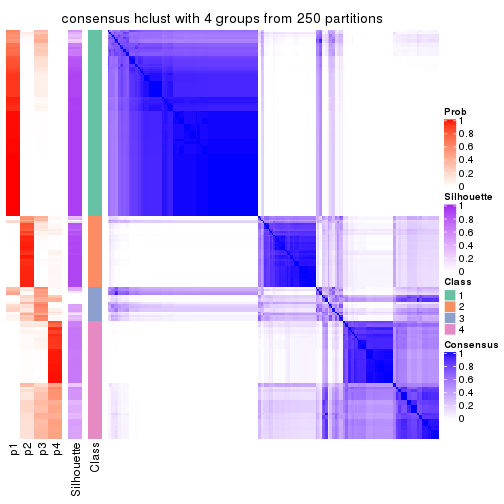</p>

</div>
<div id='tab-CV-hclust-consensus-heatmap-4'>
<pre><code class="r">consensus_heatmap(res, k = 5)
</code></pre>

<p></p>

</div>
<div id='tab-CV-hclust-consensus-heatmap-5'>
<pre><code class="r">consensus_heatmap(res, k = 6)
</code></pre>

<p></p>

</div>
</div>

Heatmaps for the membership of samples in all partitions to see how consistent they are:


<script>
$( function() {
	$( '#tabs-CV-hclust-membership-heatmap' ).tabs();
} );
</script>
<div id='tabs-CV-hclust-membership-heatmap'>
<ul>
<li><a href='#tab-CV-hclust-membership-heatmap-1'>k = 2</a></li>
<li><a href='#tab-CV-hclust-membership-heatmap-2'>k = 3</a></li>
<li><a href='#tab-CV-hclust-membership-heatmap-3'>k = 4</a></li>
<li><a href='#tab-CV-hclust-membership-heatmap-4'>k = 5</a></li>
<li><a href='#tab-CV-hclust-membership-heatmap-5'>k = 6</a></li>
</ul>
<div id='tab-CV-hclust-membership-heatmap-1'>
<pre><code class="r">membership_heatmap(res, k = 2)
</code></pre>

<p></p>

</div>
<div id='tab-CV-hclust-membership-heatmap-2'>
<pre><code class="r">membership_heatmap(res, k = 3)
</code></pre>

<p></p>

</div>
<div id='tab-CV-hclust-membership-heatmap-3'>
<pre><code class="r">membership_heatmap(res, k = 4)
</code></pre>

<p></p>

</div>
<div id='tab-CV-hclust-membership-heatmap-4'>
<pre><code class="r">membership_heatmap(res, k = 5)
</code></pre>

<p></p>

</div>
<div id='tab-CV-hclust-membership-heatmap-5'>
<pre><code class="r">membership_heatmap(res, k = 6)
</code></pre>

<p></p>

</div>
</div>

As soon as we have had the classes for columns, we can look for signatures
which are significantly different between classes which can be candidate marks
for certain classes. Following are the heatmaps for signatures.


Signature heatmaps where rows are scaled:


<script>
$( function() {
	$( '#tabs-CV-hclust-get-signatures' ).tabs();
} );
</script>
<div id='tabs-CV-hclust-get-signatures'>
<ul>
<li><a href='#tab-CV-hclust-get-signatures-1'>k = 2</a></li>
<li><a href='#tab-CV-hclust-get-signatures-2'>k = 3</a></li>
<li><a href='#tab-CV-hclust-get-signatures-3'>k = 4</a></li>
<li><a href='#tab-CV-hclust-get-signatures-4'>k = 5</a></li>
<li><a href='#tab-CV-hclust-get-signatures-5'>k = 6</a></li>
</ul>
<div id='tab-CV-hclust-get-signatures-1'>
<pre><code class="r">get_signatures(res, k = 2)
</code></pre>

<p></p>

</div>
<div id='tab-CV-hclust-get-signatures-2'>
<pre><code class="r">get_signatures(res, k = 3)
</code></pre>

<p></p>

</div>
<div id='tab-CV-hclust-get-signatures-3'>
<pre><code class="r">get_signatures(res, k = 4)
</code></pre>

<p></p>

</div>
<div id='tab-CV-hclust-get-signatures-4'>
<pre><code class="r">get_signatures(res, k = 5)
</code></pre>

<p></p>

</div>
<div id='tab-CV-hclust-get-signatures-5'>
<pre><code class="r">get_signatures(res, k = 6)
</code></pre>

<p>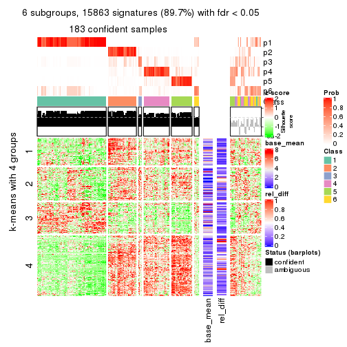</p>

</div>
</div>


Signature heatmaps where rows are not scaled:


<script>
$( function() {
	$( '#tabs-CV-hclust-get-signatures-no-scale' ).tabs();
} );
</script>
<div id='tabs-CV-hclust-get-signatures-no-scale'>
<ul>
<li><a href='#tab-CV-hclust-get-signatures-no-scale-1'>k = 2</a></li>
<li><a href='#tab-CV-hclust-get-signatures-no-scale-2'>k = 3</a></li>
<li><a href='#tab-CV-hclust-get-signatures-no-scale-3'>k = 4</a></li>
<li><a href='#tab-CV-hclust-get-signatures-no-scale-4'>k = 5</a></li>
<li><a href='#tab-CV-hclust-get-signatures-no-scale-5'>k = 6</a></li>
</ul>
<div id='tab-CV-hclust-get-signatures-no-scale-1'>
<pre><code class="r">get_signatures(res, k = 2, scale_rows = FALSE)
</code></pre>

<p></p>

</div>
<div id='tab-CV-hclust-get-signatures-no-scale-2'>
<pre><code class="r">get_signatures(res, k = 3, scale_rows = FALSE)
</code></pre>

<p></p>

</div>
<div id='tab-CV-hclust-get-signatures-no-scale-3'>
<pre><code class="r">get_signatures(res, k = 4, scale_rows = FALSE)
</code></pre>

<p></p>

</div>
<div id='tab-CV-hclust-get-signatures-no-scale-4'>
<pre><code class="r">get_signatures(res, k = 5, scale_rows = FALSE)
</code></pre>

<p></p>

</div>
<div id='tab-CV-hclust-get-signatures-no-scale-5'>
<pre><code class="r">get_signatures(res, k = 6, scale_rows = FALSE)
</code></pre>

<p></p>

</div>
</div>


Compare the overlap of signatures from different k:

```r
compare_signatures(res)
```


`get_signature()` returns a data frame invisibly. TO get the list of signatures, the function
call should be assigned to a variable explicitly. In following code, if `plot` argument is set
to `FALSE`, no heatmap is plotted while only the differential analysis is performed.

```r
# code only for demonstration
tb = get_signature(res, k = ..., plot = FALSE)
```

An example of the output of `tb` is:

```
#>   which_row         fdr    mean_1    mean_2 scaled_mean_1 scaled_mean_2 km
#> 1        38 0.042760348  8.373488  9.131774    -0.5533452     0.5164555  1
#> 2        40 0.018707592  7.106213  8.469186    -0.6173731     0.5762149  1
#> 3        55 0.019134737 10.221463 11.207825    -0.6159697     0.5749050  1
#> 4        59 0.006059896  5.921854  7.869574    -0.6899429     0.6439467  1
#> 5        60 0.018055526  8.928898 10.211722    -0.6204761     0.5791110  1
#> 6        98 0.009384629 15.714769 14.887706     0.6635654    -0.6193277  2
...
```

The columns in `tb` are:

1. `which_row`: row indices corresponding to the input matrix.
2. `fdr`: FDR for the differential test. 
3. `mean_x`: The mean value in group x.
4. `scaled_mean_x`: The mean value in group x after rows are scaled.
5. `km`: Row groups if k-means clustering is applied to rows.


UMAP plot which shows how samples are separated.


<script>
$( function() {
	$( '#tabs-CV-hclust-dimension-reduction' ).tabs();
} );
</script>
<div id='tabs-CV-hclust-dimension-reduction'>
<ul>
<li><a href='#tab-CV-hclust-dimension-reduction-1'>k = 2</a></li>
<li><a href='#tab-CV-hclust-dimension-reduction-2'>k = 3</a></li>
<li><a href='#tab-CV-hclust-dimension-reduction-3'>k = 4</a></li>
<li><a href='#tab-CV-hclust-dimension-reduction-4'>k = 5</a></li>
<li><a href='#tab-CV-hclust-dimension-reduction-5'>k = 6</a></li>
</ul>
<div id='tab-CV-hclust-dimension-reduction-1'>
<pre><code class="r">dimension_reduction(res, k = 2, method = &quot;UMAP&quot;)
</code></pre>

<p></p>

</div>
<div id='tab-CV-hclust-dimension-reduction-2'>
<pre><code class="r">dimension_reduction(res, k = 3, method = &quot;UMAP&quot;)
</code></pre>

<p></p>

</div>
<div id='tab-CV-hclust-dimension-reduction-3'>
<pre><code class="r">dimension_reduction(res, k = 4, method = &quot;UMAP&quot;)
</code></pre>

<p></p>

</div>
<div id='tab-CV-hclust-dimension-reduction-4'>
<pre><code class="r">dimension_reduction(res, k = 5, method = &quot;UMAP&quot;)
</code></pre>

<p></p>

</div>
<div id='tab-CV-hclust-dimension-reduction-5'>
<pre><code class="r">dimension_reduction(res, k = 6, method = &quot;UMAP&quot;)
</code></pre>

<p></p>

</div>
</div>


Following heatmap shows how subgroups are split when increasing `k`:

```r
collect_classes(res)
```


If matrix rows can be associated to genes, consider to use `GO_Enrichment(res,
...)` to perform function enrichment for the signature genes.


 

---------------------------------------------------


### CV:kmeans**


The object with results only for a single top-value method and a single partition method 
can be extracted as:

```r
res = res_list["CV", "kmeans"]
# you can also extract it by
# res = res_list["CV:kmeans"]
```

A summary of `res` and all the functions that can be applied to it:

```r
res
```

```
#> A 'ConsensusPartition' object with k = 2, 3, 4, 5, 6.
#>   On a matrix with 17680 rows and 218 columns.
#>   Top rows (1000, 2000, 3000, 4000, 5000) are extracted by 'CV' method.
#>   Subgroups are detected by 'kmeans' method.
#>   Performed in total 1250 partitions by row resampling.
#>   Best k for subgroups seems to be 2.
#> 
#> Following methods can be applied to this 'ConsensusPartition' object:
#>  [1] "cola_report"             "collect_classes"         "collect_plots"          
#>  [4] "collect_stats"           "colnames"                "compare_signatures"     
#>  [7] "consensus_heatmap"       "dimension_reduction"     "functional_enrichment"  
#> [10] "get_anno_col"            "get_anno"                "get_classes"            
#> [13] "get_consensus"           "get_matrix"              "get_membership"         
#> [16] "get_param"               "get_signatures"          "get_stats"              
#> [19] "is_best_k"               "is_stable_k"             "membership_heatmap"     
#> [22] "ncol"                    "nrow"                    "plot_ecdf"              
#> [25] "rownames"                "select_partition_number" "show"                   
#> [28] "suggest_best_k"          "test_to_known_factors"
```

`collect_plots()` function collects all the plots made from `res` for all `k` (number of partitions)
into one single page to provide an easy and fast comparison between different `k`.

```r
collect_plots(res)
```


The plots are:

- The first row: a plot of the ECDF (Empirical cumulative distribution
  function) curves of the consensus matrix for each `k` and the heatmap of
  predicted classes for each `k`.
- The second row: heatmaps of the consensus matrix for each `k`.
- The third row: heatmaps of the membership matrix for each `k`.
- The fouth row: heatmaps of the signatures for each `k`.

All the plots in panels can be made by individual functions and they are
plotted later in this section.

`select_partition_number()` produces several plots showing different
statistics for choosing "optimized" `k`. There are following statistics:

- ECDF curves of the consensus matrix for each `k`;
- 1-PAC. [The PAC
  score](https://en.wikipedia.org/wiki/Consensus_clustering#Over-interpretation_potential_of_consensus_clustering)
  measures the proportion of the ambiguous subgrouping.
- Mean silhouette score.
- Concordance. The mean probability of fiting the consensus class ids in all
  partitions.
- Area increased. Denote $A_k$ as the area under the ECDF curve for current
  `k`, the area increased is defined as $A_k - A_{k-1}$.
- Rand index. The percent of pairs of samples that are both in a same cluster
  or both are not in a same cluster in the partition of k and k-1.
- Jaccard index. The ratio of pairs of samples are both in a same cluster in
  the partition of k and k-1 and the pairs of samples are both in a same
  cluster in the partition k or k-1.

The detailed explanations of these statistics can be found in [the cola
vignette](http://bioconductor.org/packages/devel/bioc/vignettes/cola/inst/doc/cola.html#toc_13).

Generally speaking, lower PAC score, higher mean silhouette score or higher
concordance corresponds to better partition. Rand index and Jaccard index
measure how similar the current partition is compared to partition with `k-1`.
If they are too similar, we won't accept `k` is better than `k-1`.

```r
select_partition_number(res)
```


The numeric values for all these statistics can be obtained by `get_stats()`.

```r
get_stats(res)
```

```
#>   k 1-PAC mean_silhouette concordance area_increased  Rand Jaccard
#> 2 2 1.000           0.978       0.992         0.5012 0.499   0.499
#> 3 3 0.671           0.789       0.815         0.2651 0.851   0.707
#> 4 4 0.692           0.616       0.806         0.1431 0.899   0.734
#> 5 5 0.795           0.806       0.839         0.0765 0.839   0.508
#> 6 6 0.742           0.715       0.821         0.0453 0.943   0.742
```

`suggest_best_k()` suggests the best $k$ based on these statistics. The rules are as follows:

- All $k$ with Jaccard index larger than 0.95 are removed because the increase of
  the partition number does not provides enough extra information. If all $k$ are removed,
  the best $k$ is assigned by `NA`.
- For $k$ with 1-PAC larger than 0.9, the maximal $k$ is taken as the "best k". Other $k$ is called "optional k".
- If it does not fit the second rule. The $k$ with the highest vote of highest
  1-PAC, mean silhouette and concordance is taken as the "best k".

```r
suggest_best_k(res)
```

```
#> [1] 2
```


Following shows the table of the partitions (You need to click the **show/hide
code output** link to see it). The membership matrix (columns with name `p*`)
is inferred by
[`clue::cl_consensus()`](https://www.rdocumentation.org/link/cl_consensus?package=clue)
function with the `SE` method. Basically the value in the membership matrix
represents the probability to belong to a certain group. The finall class
label for an item is determined with the group with highest probability it
belongs to.

In `get_classes()` function, the entropy is calculated from the membership
matrix and the silhouette score is calculated from the consensus matrix.


<script>
$( function() {
	$( '#tabs-CV-kmeans-get-classes' ).tabs();
} );
</script>
<div id='tabs-CV-kmeans-get-classes'>
<ul>
<li><a href='#tab-CV-kmeans-get-classes-1'>k = 2</a></li>
<li><a href='#tab-CV-kmeans-get-classes-2'>k = 3</a></li>
<li><a href='#tab-CV-kmeans-get-classes-3'>k = 4</a></li>
<li><a href='#tab-CV-kmeans-get-classes-4'>k = 5</a></li>
<li><a href='#tab-CV-kmeans-get-classes-5'>k = 6</a></li>
</ul>

<div id='tab-CV-kmeans-get-classes-1'>
<p><a id='tab-CV-kmeans-get-classes-1-a' style='color:#0366d6' href='#'>show/hide code output</a></p>
<pre><code class="r">cbind(get_classes(res, k = 2), get_membership(res, k = 2))
</code></pre>

<pre><code>#&gt;            class entropy silhouette    p1    p2
#&gt; SRR1498997     2  0.0000     0.9968 0.000 1.000
#&gt; SRR1076441     1  0.0000     0.9859 1.000 0.000
#&gt; SRR1489803     2  0.0000     0.9968 0.000 1.000
#&gt; SRR1345953     2  0.0000     0.9968 0.000 1.000
#&gt; SRR1357826     2  0.0000     0.9968 0.000 1.000
#&gt; SRR1419656     1  0.0000     0.9859 1.000 0.000
#&gt; SRR1454158     2  0.0000     0.9968 0.000 1.000
#&gt; SRR1475408     2  0.0000     0.9968 0.000 1.000
#&gt; SRR1472704     2  0.0000     0.9968 0.000 1.000
#&gt; SRR1090046     1  0.0000     0.9859 1.000 0.000
#&gt; SRR1312822     1  0.0000     0.9859 1.000 0.000
#&gt; SRR1096987     2  0.0000     0.9968 0.000 1.000
#&gt; SRR1334587     2  0.0000     0.9968 0.000 1.000
#&gt; SRR1490246     1  0.0000     0.9859 1.000 0.000
#&gt; SRR1467522     1  0.0000     0.9859 1.000 0.000
#&gt; SRR1324206     1  0.0000     0.9859 1.000 0.000
#&gt; SRR1408574     2  0.0000     0.9968 0.000 1.000
#&gt; SRR1083959     2  0.0000     0.9968 0.000 1.000
#&gt; SRR1079948     2  0.0000     0.9968 0.000 1.000
#&gt; SRR1310667     2  0.0000     0.9968 0.000 1.000
#&gt; SRR655852      2  0.0000     0.9968 0.000 1.000
#&gt; SRR1352457     2  0.0000     0.9968 0.000 1.000
#&gt; SRR1353994     2  0.0000     0.9968 0.000 1.000
#&gt; SRR1459561     2  0.0000     0.9968 0.000 1.000
#&gt; SRR1454009     1  0.0000     0.9859 1.000 0.000
#&gt; SRR1071084     1  0.0000     0.9859 1.000 0.000
#&gt; SRR1082859     2  0.0000     0.9968 0.000 1.000
#&gt; SRR1086538     1  0.0000     0.9859 1.000 0.000
#&gt; SRR1486262     2  0.0000     0.9968 0.000 1.000
#&gt; SRR658105      1  0.0000     0.9859 1.000 0.000
#&gt; SRR811073      2  0.0000     0.9968 0.000 1.000
#&gt; SRR1429181     2  0.0000     0.9968 0.000 1.000
#&gt; SRR1327896     2  0.0000     0.9968 0.000 1.000
#&gt; SRR1464788     2  0.0000     0.9968 0.000 1.000
#&gt; SRR1346861     2  0.0000     0.9968 0.000 1.000
#&gt; SRR1318774     2  0.0000     0.9968 0.000 1.000
#&gt; SRR1420517     1  0.0000     0.9859 1.000 0.000
#&gt; SRR1369584     2  0.0000     0.9968 0.000 1.000
#&gt; SRR1443244     1  0.9732     0.3289 0.596 0.404
#&gt; SRR1455391     1  0.0000     0.9859 1.000 0.000
#&gt; SRR1068999     1  0.0000     0.9859 1.000 0.000
#&gt; SRR1481297     1  0.0000     0.9859 1.000 0.000
#&gt; SRR1070208     1  0.0000     0.9859 1.000 0.000
#&gt; SRR1317282     1  0.0000     0.9859 1.000 0.000
#&gt; SRR1096125     2  0.0000     0.9968 0.000 1.000
#&gt; SRR1472506     1  0.0000     0.9859 1.000 0.000
#&gt; SRR1388281     2  0.0000     0.9968 0.000 1.000
#&gt; SRR1365622     2  0.0000     0.9968 0.000 1.000
#&gt; SRR662306      1  0.0000     0.9859 1.000 0.000
#&gt; SRR662811      1  0.0000     0.9859 1.000 0.000
#&gt; SRR820571      1  0.0000     0.9859 1.000 0.000
#&gt; SRR1357166     1  0.0000     0.9859 1.000 0.000
#&gt; SRR1488586     1  0.0000     0.9859 1.000 0.000
#&gt; SRR1485398     1  0.0000     0.9859 1.000 0.000
#&gt; SRR1417725     2  0.0000     0.9968 0.000 1.000
#&gt; SRR1409397     2  0.0000     0.9968 0.000 1.000
#&gt; SRR1465693     2  0.0000     0.9968 0.000 1.000
#&gt; SRR1096547     1  0.0000     0.9859 1.000 0.000
#&gt; SRR1456818     1  0.0000     0.9859 1.000 0.000
#&gt; SRR816336      1  0.0000     0.9859 1.000 0.000
#&gt; SRR1420238     1  0.0000     0.9859 1.000 0.000
#&gt; SRR1433374     1  0.0000     0.9859 1.000 0.000
#&gt; SRR1436990     1  0.0000     0.9859 1.000 0.000
#&gt; SRR662378      1  0.0000     0.9859 1.000 0.000
#&gt; SRR1477671     1  0.0000     0.9859 1.000 0.000
#&gt; SRR1084079     2  0.9358     0.4422 0.352 0.648
#&gt; SRR1102949     1  0.0000     0.9859 1.000 0.000
#&gt; SRR1458090     1  0.0000     0.9859 1.000 0.000
#&gt; SRR1418729     2  0.0000     0.9968 0.000 1.000
#&gt; SRR1403814     2  0.0000     0.9968 0.000 1.000
#&gt; SRR1404887     1  1.0000     0.0122 0.500 0.500
#&gt; SRR1434955     1  0.0000     0.9859 1.000 0.000
#&gt; SRR1360652     1  0.0000     0.9859 1.000 0.000
#&gt; SRR1356765     2  0.0000     0.9968 0.000 1.000
#&gt; SRR1078258     2  0.0000     0.9968 0.000 1.000
#&gt; SRR1455861     1  0.0000     0.9859 1.000 0.000
#&gt; SRR1420296     2  0.0000     0.9968 0.000 1.000
#&gt; SRR1070260     2  0.0000     0.9968 0.000 1.000
#&gt; SRR1410765     1  0.0000     0.9859 1.000 0.000
#&gt; SRR1481315     1  0.0000     0.9859 1.000 0.000
#&gt; SRR1414661     2  0.0000     0.9968 0.000 1.000
#&gt; SRR1359147     2  0.0000     0.9968 0.000 1.000
#&gt; SRR1488694     1  0.0000     0.9859 1.000 0.000
#&gt; SRR1477273     1  0.0000     0.9859 1.000 0.000
#&gt; SRR1415792     1  0.0000     0.9859 1.000 0.000
#&gt; SRR1369088     2  0.0000     0.9968 0.000 1.000
#&gt; SRR1406621     2  0.0000     0.9968 0.000 1.000
#&gt; SRR1401017     2  0.0000     0.9968 0.000 1.000
#&gt; SRR1099981     2  0.0000     0.9968 0.000 1.000
#&gt; SRR815208      2  0.0000     0.9968 0.000 1.000
#&gt; SRR1380460     2  0.0000     0.9968 0.000 1.000
#&gt; SRR1091097     2  0.0000     0.9968 0.000 1.000
#&gt; SRR1456010     1  0.0000     0.9859 1.000 0.000
#&gt; SRR1498416     2  0.0000     0.9968 0.000 1.000
#&gt; SRR818873      2  0.0000     0.9968 0.000 1.000
#&gt; SRR813868      2  0.0000     0.9968 0.000 1.000
#&gt; SRR1394912     1  0.0000     0.9859 1.000 0.000
#&gt; SRR1475824     2  0.0000     0.9968 0.000 1.000
#&gt; SRR1459866     1  0.0000     0.9859 1.000 0.000
#&gt; SRR1364871     1  0.5519     0.8455 0.872 0.128
#&gt; SRR1100472     2  0.0000     0.9968 0.000 1.000
#&gt; SRR1331267     1  0.0000     0.9859 1.000 0.000
#&gt; SRR1068977     2  0.0000     0.9968 0.000 1.000
#&gt; SRR1391511     2  0.0000     0.9968 0.000 1.000
#&gt; SRR1077920     2  0.0000     0.9968 0.000 1.000
#&gt; SRR1457705     1  0.0000     0.9859 1.000 0.000
#&gt; SRR1437073     1  0.0000     0.9859 1.000 0.000
#&gt; SRR1473124     1  0.0000     0.9859 1.000 0.000
#&gt; SRR1469279     1  0.0000     0.9859 1.000 0.000
#&gt; SRR1091791     2  0.0000     0.9968 0.000 1.000
#&gt; SRR1341539     2  0.0000     0.9968 0.000 1.000
#&gt; SRR1446354     1  0.0000     0.9859 1.000 0.000
#&gt; SRR1415420     1  0.0000     0.9859 1.000 0.000
#&gt; SRR1368050     1  0.0000     0.9859 1.000 0.000
#&gt; SRR656970      2  0.0000     0.9968 0.000 1.000
#&gt; SRR1473403     2  0.0000     0.9968 0.000 1.000
#&gt; SRR1084674     1  0.0000     0.9859 1.000 0.000
#&gt; SRR1464702     1  0.0000     0.9859 1.000 0.000
#&gt; SRR1074860     2  0.0000     0.9968 0.000 1.000
#&gt; SRR655447      2  0.0000     0.9968 0.000 1.000
#&gt; SRR1404442     2  0.0000     0.9968 0.000 1.000
#&gt; SRR1418795     1  0.0000     0.9859 1.000 0.000
#&gt; SRR1458335     2  0.0000     0.9968 0.000 1.000
#&gt; SRR1489589     2  0.0000     0.9968 0.000 1.000
#&gt; SRR1378284     1  0.0000     0.9859 1.000 0.000
#&gt; SRR1408014     2  0.0000     0.9968 0.000 1.000
#&gt; SRR1083052     1  0.0000     0.9859 1.000 0.000
#&gt; SRR1339236     2  0.0000     0.9968 0.000 1.000
#&gt; SRR1323829     2  0.0000     0.9968 0.000 1.000
#&gt; SRR1086772     2  0.0000     0.9968 0.000 1.000
#&gt; SRR1486457     1  0.0000     0.9859 1.000 0.000
#&gt; SRR1415257     2  0.0000     0.9968 0.000 1.000
#&gt; SRR1071905     1  0.0000     0.9859 1.000 0.000
#&gt; SRR659223      2  0.0000     0.9968 0.000 1.000
#&gt; SRR1386945     1  0.0000     0.9859 1.000 0.000
#&gt; SRR821498      2  0.0000     0.9968 0.000 1.000
#&gt; SRR1378903     2  0.0000     0.9968 0.000 1.000
#&gt; SRR1472907     1  0.0000     0.9859 1.000 0.000
#&gt; SRR1442313     2  0.0000     0.9968 0.000 1.000
#&gt; SRR1077139     2  0.0000     0.9968 0.000 1.000
#&gt; SRR1342758     1  0.0000     0.9859 1.000 0.000
#&gt; SRR656911      2  0.0000     0.9968 0.000 1.000
#&gt; SRR1070738     1  0.0000     0.9859 1.000 0.000
#&gt; SRR1476950     1  0.0000     0.9859 1.000 0.000
#&gt; SRR1488196     1  0.0000     0.9859 1.000 0.000
#&gt; SRR1498951     1  0.0000     0.9859 1.000 0.000
#&gt; SRR1413392     1  0.0000     0.9859 1.000 0.000
#&gt; SRR657528      2  0.0000     0.9968 0.000 1.000
#&gt; SRR812198      1  0.0000     0.9859 1.000 0.000
#&gt; SRR660283      2  0.0000     0.9968 0.000 1.000
#&gt; SRR1420936     1  0.0000     0.9859 1.000 0.000
#&gt; SRR1469547     2  0.0000     0.9968 0.000 1.000
#&gt; SRR1322249     1  0.0000     0.9859 1.000 0.000
#&gt; SRR1396682     1  0.0000     0.9859 1.000 0.000
#&gt; SRR1095816     2  0.0000     0.9968 0.000 1.000
#&gt; SRR1081023     1  0.0000     0.9859 1.000 0.000
#&gt; SRR1092517     2  0.0000     0.9968 0.000 1.000
#&gt; SRR811285      2  0.0000     0.9968 0.000 1.000
#&gt; SRR657018      1  0.0000     0.9859 1.000 0.000
#&gt; SRR1365534     1  0.0000     0.9859 1.000 0.000
#&gt; SRR1090791     2  0.0000     0.9968 0.000 1.000
#&gt; SRR1439915     2  0.0000     0.9968 0.000 1.000
#&gt; SRR1391575     2  0.0000     0.9968 0.000 1.000
#&gt; SRR1314092     2  0.0000     0.9968 0.000 1.000
#&gt; SRR1328941     1  0.0000     0.9859 1.000 0.000
#&gt; SRR1336181     2  0.0000     0.9968 0.000 1.000
#&gt; SRR1362972     1  0.0000     0.9859 1.000 0.000
#&gt; SRR1366790     2  0.0000     0.9968 0.000 1.000
#&gt; SRR1455902     1  0.0000     0.9859 1.000 0.000
#&gt; SRR1437644     1  0.9710     0.3395 0.600 0.400
#&gt; SRR1105009     2  0.0000     0.9968 0.000 1.000
#&gt; SRR1367024     1  0.0000     0.9859 1.000 0.000
#&gt; SRR660248      2  0.0000     0.9968 0.000 1.000
#&gt; SRR1409620     1  0.0000     0.9859 1.000 0.000
#&gt; SRR1455807     2  0.0000     0.9968 0.000 1.000
#&gt; SRR1339431     1  0.0000     0.9859 1.000 0.000
#&gt; SRR1378948     1  0.0672     0.9783 0.992 0.008
#&gt; SRR1469237     1  0.0000     0.9859 1.000 0.000
#&gt; SRR1098264     2  0.0000     0.9968 0.000 1.000
#&gt; SRR1406224     2  0.0000     0.9968 0.000 1.000
#&gt; SRR1393026     1  0.0000     0.9859 1.000 0.000
#&gt; SRR808428      2  0.0000     0.9968 0.000 1.000
#&gt; SRR615910      2  0.0000     0.9968 0.000 1.000
#&gt; SRR1076219     1  0.0000     0.9859 1.000 0.000
#&gt; SRR1481128     1  0.0000     0.9859 1.000 0.000
#&gt; SRR1359262     2  0.0000     0.9968 0.000 1.000
#&gt; SRR1407648     2  0.0000     0.9968 0.000 1.000
#&gt; SRR1386775     1  0.0000     0.9859 1.000 0.000
#&gt; SRR1388399     1  0.0000     0.9859 1.000 0.000
#&gt; SRR1361499     2  0.0000     0.9968 0.000 1.000
#&gt; SRR1500709     2  0.0000     0.9968 0.000 1.000
#&gt; SRR1335917     1  0.0000     0.9859 1.000 0.000
#&gt; SRR1430615     2  0.0000     0.9968 0.000 1.000
#&gt; SRR1335212     1  0.0000     0.9859 1.000 0.000
#&gt; SRR1400159     2  0.0000     0.9968 0.000 1.000
#&gt; SRR1457245     2  0.0000     0.9968 0.000 1.000
#&gt; SRR1356746     2  0.0000     0.9968 0.000 1.000
#&gt; SRR658319      2  0.0000     0.9968 0.000 1.000
#&gt; SRR1435946     1  0.0000     0.9859 1.000 0.000
#&gt; SRR1370308     1  0.0000     0.9859 1.000 0.000
#&gt; SRR1100893     1  0.0000     0.9859 1.000 0.000
#&gt; SRR1389432     1  0.0000     0.9859 1.000 0.000
#&gt; SRR1381799     2  0.0000     0.9968 0.000 1.000
#&gt; SRR1310158     1  0.0000     0.9859 1.000 0.000
#&gt; SRR1341100     2  0.0000     0.9968 0.000 1.000
#&gt; SRR1342873     1  0.0000     0.9859 1.000 0.000
#&gt; SRR1472102     2  0.0000     0.9968 0.000 1.000
#&gt; SRR1409421     1  0.0000     0.9859 1.000 0.000
#&gt; SRR1328577     2  0.0000     0.9968 0.000 1.000
#&gt; SRR808942      2  0.0000     0.9968 0.000 1.000
#&gt; SRR1343818     2  0.0000     0.9968 0.000 1.000
#&gt; SRR1472415     2  0.0000     0.9968 0.000 1.000
#&gt; SRR658409      2  0.0000     0.9968 0.000 1.000
#&gt; SRR1469681     1  0.0000     0.9859 1.000 0.000
#&gt; SRR1075484     2  0.0000     0.9968 0.000 1.000
#&gt; SRR1417894     1  0.0000     0.9859 1.000 0.000
#&gt; SRR1417422     2  0.0000     0.9968 0.000 1.000
#&gt; SRR1090674     1  0.0000     0.9859 1.000 0.000
</code></pre>

<script>
$('#tab-CV-kmeans-get-classes-1-a').parent().next().next().hide();
$('#tab-CV-kmeans-get-classes-1-a').click(function(){
  $('#tab-CV-kmeans-get-classes-1-a').parent().next().next().toggle();
  return(false);
});
</script>
</div>

<div id='tab-CV-kmeans-get-classes-2'>
<p><a id='tab-CV-kmeans-get-classes-2-a' style='color:#0366d6' href='#'>show/hide code output</a></p>
<pre><code class="r">cbind(get_classes(res, k = 3), get_membership(res, k = 3))
</code></pre>

<pre><code>#&gt;            class entropy silhouette    p1    p2    p3
#&gt; SRR1498997     2  0.6305      0.717 0.000 0.516 0.484
#&gt; SRR1076441     1  0.0000      0.879 1.000 0.000 0.000
#&gt; SRR1489803     3  0.0000      0.850 0.000 0.000 1.000
#&gt; SRR1345953     2  0.5859      0.799 0.000 0.656 0.344
#&gt; SRR1357826     2  0.6305      0.717 0.000 0.516 0.484
#&gt; SRR1419656     1  0.0000      0.879 1.000 0.000 0.000
#&gt; SRR1454158     2  0.5650      0.800 0.000 0.688 0.312
#&gt; SRR1475408     2  0.5098      0.305 0.000 0.752 0.248
#&gt; SRR1472704     2  0.6305      0.717 0.000 0.516 0.484
#&gt; SRR1090046     1  0.5810      0.795 0.664 0.336 0.000
#&gt; SRR1312822     1  0.0000      0.879 1.000 0.000 0.000
#&gt; SRR1096987     2  0.5621      0.800 0.000 0.692 0.308
#&gt; SRR1334587     3  0.1031      0.853 0.000 0.024 0.976
#&gt; SRR1490246     1  0.0000      0.879 1.000 0.000 0.000
#&gt; SRR1467522     1  0.0000      0.879 1.000 0.000 0.000
#&gt; SRR1324206     1  0.0000      0.879 1.000 0.000 0.000
#&gt; SRR1408574     3  0.4291      0.738 0.000 0.180 0.820
#&gt; SRR1083959     2  0.5859      0.799 0.000 0.656 0.344
#&gt; SRR1079948     2  0.5621      0.800 0.000 0.692 0.308
#&gt; SRR1310667     3  0.0000      0.850 0.000 0.000 1.000
#&gt; SRR655852      2  0.5621      0.800 0.000 0.692 0.308
#&gt; SRR1352457     3  0.0000      0.850 0.000 0.000 1.000
#&gt; SRR1353994     2  0.5859      0.799 0.000 0.656 0.344
#&gt; SRR1459561     3  0.0000      0.850 0.000 0.000 1.000
#&gt; SRR1454009     1  0.5591      0.818 0.696 0.304 0.000
#&gt; SRR1071084     1  0.5591      0.818 0.696 0.304 0.000
#&gt; SRR1082859     2  0.6305      0.717 0.000 0.516 0.484
#&gt; SRR1086538     1  0.0000      0.879 1.000 0.000 0.000
#&gt; SRR1486262     2  0.5621      0.800 0.000 0.692 0.308
#&gt; SRR658105      1  0.0000      0.879 1.000 0.000 0.000
#&gt; SRR811073      2  0.6305      0.717 0.000 0.516 0.484
#&gt; SRR1429181     3  0.4291      0.738 0.000 0.180 0.820
#&gt; SRR1327896     2  0.5621      0.800 0.000 0.692 0.308
#&gt; SRR1464788     3  0.1031      0.853 0.000 0.024 0.976
#&gt; SRR1346861     2  0.6305      0.717 0.000 0.516 0.484
#&gt; SRR1318774     2  0.5835      0.801 0.000 0.660 0.340
#&gt; SRR1420517     1  0.5591      0.818 0.696 0.304 0.000
#&gt; SRR1369584     3  0.0000      0.850 0.000 0.000 1.000
#&gt; SRR1443244     2  0.4692      0.198 0.168 0.820 0.012
#&gt; SRR1455391     1  0.5431      0.825 0.716 0.284 0.000
#&gt; SRR1068999     1  0.0000      0.879 1.000 0.000 0.000
#&gt; SRR1481297     1  0.0237      0.879 0.996 0.004 0.000
#&gt; SRR1070208     1  0.5397      0.827 0.720 0.280 0.000
#&gt; SRR1317282     1  0.5591      0.818 0.696 0.304 0.000
#&gt; SRR1096125     2  0.5859      0.799 0.000 0.656 0.344
#&gt; SRR1472506     1  0.5810      0.795 0.664 0.336 0.000
#&gt; SRR1388281     2  0.5810      0.801 0.000 0.664 0.336
#&gt; SRR1365622     3  0.4291      0.738 0.000 0.180 0.820
#&gt; SRR662306      1  0.5560      0.820 0.700 0.300 0.000
#&gt; SRR662811      1  0.0000      0.879 1.000 0.000 0.000
#&gt; SRR820571      1  0.5760      0.802 0.672 0.328 0.000
#&gt; SRR1357166     1  0.5465      0.824 0.712 0.288 0.000
#&gt; SRR1488586     1  0.5591      0.818 0.696 0.304 0.000
#&gt; SRR1485398     1  0.0000      0.879 1.000 0.000 0.000
#&gt; SRR1417725     2  0.0892      0.422 0.000 0.980 0.020
#&gt; SRR1409397     3  0.0747      0.853 0.000 0.016 0.984
#&gt; SRR1465693     3  0.0000      0.850 0.000 0.000 1.000
#&gt; SRR1096547     1  0.5785      0.799 0.668 0.332 0.000
#&gt; SRR1456818     1  0.0000      0.879 1.000 0.000 0.000
#&gt; SRR816336      1  0.5591      0.818 0.696 0.304 0.000
#&gt; SRR1420238     1  0.0000      0.879 1.000 0.000 0.000
#&gt; SRR1433374     1  0.5591      0.818 0.696 0.304 0.000
#&gt; SRR1436990     1  0.0000      0.879 1.000 0.000 0.000
#&gt; SRR662378      1  0.0000      0.879 1.000 0.000 0.000
#&gt; SRR1477671     1  0.0000      0.879 1.000 0.000 0.000
#&gt; SRR1084079     2  0.3502      0.314 0.084 0.896 0.020
#&gt; SRR1102949     1  0.0000      0.879 1.000 0.000 0.000
#&gt; SRR1458090     1  0.0000      0.879 1.000 0.000 0.000
#&gt; SRR1418729     2  0.5621      0.800 0.000 0.692 0.308
#&gt; SRR1403814     2  0.5621      0.800 0.000 0.692 0.308
#&gt; SRR1404887     2  0.4514      0.213 0.156 0.832 0.012
#&gt; SRR1434955     1  0.0000      0.879 1.000 0.000 0.000
#&gt; SRR1360652     1  0.0000      0.879 1.000 0.000 0.000
#&gt; SRR1356765     3  0.4291      0.738 0.000 0.180 0.820
#&gt; SRR1078258     2  0.5810      0.801 0.000 0.664 0.336
#&gt; SRR1455861     1  0.0000      0.879 1.000 0.000 0.000
#&gt; SRR1420296     3  0.0000      0.850 0.000 0.000 1.000
#&gt; SRR1070260     2  0.6305      0.717 0.000 0.516 0.484
#&gt; SRR1410765     1  0.0000      0.879 1.000 0.000 0.000
#&gt; SRR1481315     1  0.1964      0.869 0.944 0.056 0.000
#&gt; SRR1414661     2  0.6305      0.717 0.000 0.516 0.484
#&gt; SRR1359147     2  0.5621      0.800 0.000 0.692 0.308
#&gt; SRR1488694     1  0.4887      0.835 0.772 0.228 0.000
#&gt; SRR1477273     1  0.5591      0.818 0.696 0.304 0.000
#&gt; SRR1415792     1  0.5591      0.818 0.696 0.304 0.000
#&gt; SRR1369088     3  0.5733      0.604 0.000 0.324 0.676
#&gt; SRR1406621     3  0.4291      0.738 0.000 0.180 0.820
#&gt; SRR1401017     3  0.1529      0.845 0.000 0.040 0.960
#&gt; SRR1099981     3  0.4291      0.738 0.000 0.180 0.820
#&gt; SRR815208      2  0.6305      0.717 0.000 0.516 0.484
#&gt; SRR1380460     2  0.5810      0.801 0.000 0.664 0.336
#&gt; SRR1091097     2  0.5621      0.800 0.000 0.692 0.308
#&gt; SRR1456010     1  0.4931      0.839 0.768 0.232 0.000
#&gt; SRR1498416     2  0.5810      0.801 0.000 0.664 0.336
#&gt; SRR818873      3  0.1289      0.850 0.000 0.032 0.968
#&gt; SRR813868      2  0.5621      0.800 0.000 0.692 0.308
#&gt; SRR1394912     1  0.0000      0.879 1.000 0.000 0.000
#&gt; SRR1475824     2  0.6225      0.602 0.000 0.568 0.432
#&gt; SRR1459866     1  0.0000      0.879 1.000 0.000 0.000
#&gt; SRR1364871     1  0.6305      0.619 0.516 0.484 0.000
#&gt; SRR1100472     2  0.6305      0.717 0.000 0.516 0.484
#&gt; SRR1331267     1  0.3412      0.859 0.876 0.124 0.000
#&gt; SRR1068977     3  0.4291      0.738 0.000 0.180 0.820
#&gt; SRR1391511     2  0.6305      0.717 0.000 0.516 0.484
#&gt; SRR1077920     2  0.6305      0.717 0.000 0.516 0.484
#&gt; SRR1457705     1  0.4931      0.839 0.768 0.232 0.000
#&gt; SRR1437073     1  0.0000      0.879 1.000 0.000 0.000
#&gt; SRR1473124     1  0.5591      0.818 0.696 0.304 0.000
#&gt; SRR1469279     1  0.4452      0.848 0.808 0.192 0.000
#&gt; SRR1091791     2  0.5621      0.800 0.000 0.692 0.308
#&gt; SRR1341539     3  0.4291      0.738 0.000 0.180 0.820
#&gt; SRR1446354     1  0.5497      0.823 0.708 0.292 0.000
#&gt; SRR1415420     1  0.0000      0.879 1.000 0.000 0.000
#&gt; SRR1368050     1  0.0000      0.879 1.000 0.000 0.000
#&gt; SRR656970      3  0.0000      0.850 0.000 0.000 1.000
#&gt; SRR1473403     2  0.6302      0.720 0.000 0.520 0.480
#&gt; SRR1084674     1  0.5591      0.818 0.696 0.304 0.000
#&gt; SRR1464702     1  0.0000      0.879 1.000 0.000 0.000
#&gt; SRR1074860     2  0.5621      0.800 0.000 0.692 0.308
#&gt; SRR655447      2  0.5621      0.800 0.000 0.692 0.308
#&gt; SRR1404442     2  0.6305      0.717 0.000 0.516 0.484
#&gt; SRR1418795     1  0.0000      0.879 1.000 0.000 0.000
#&gt; SRR1458335     2  0.5621      0.800 0.000 0.692 0.308
#&gt; SRR1489589     3  0.1031      0.853 0.000 0.024 0.976
#&gt; SRR1378284     1  0.6363      0.797 0.768 0.136 0.096
#&gt; SRR1408014     3  0.0592      0.852 0.000 0.012 0.988
#&gt; SRR1083052     1  0.0000      0.879 1.000 0.000 0.000
#&gt; SRR1339236     3  0.6305      0.432 0.000 0.484 0.516
#&gt; SRR1323829     3  0.0237      0.845 0.000 0.004 0.996
#&gt; SRR1086772     2  0.6305      0.717 0.000 0.516 0.484
#&gt; SRR1486457     1  0.5591      0.818 0.696 0.304 0.000
#&gt; SRR1415257     3  0.1031      0.853 0.000 0.024 0.976
#&gt; SRR1071905     1  0.5560      0.820 0.700 0.300 0.000
#&gt; SRR659223      3  0.0000      0.850 0.000 0.000 1.000
#&gt; SRR1386945     1  0.5529      0.821 0.704 0.296 0.000
#&gt; SRR821498      2  0.5621      0.800 0.000 0.692 0.308
#&gt; SRR1378903     2  0.5621      0.800 0.000 0.692 0.308
#&gt; SRR1472907     1  0.4346      0.850 0.816 0.184 0.000
#&gt; SRR1442313     2  0.6305      0.717 0.000 0.516 0.484
#&gt; SRR1077139     3  0.0237      0.845 0.000 0.004 0.996
#&gt; SRR1342758     1  0.0000      0.879 1.000 0.000 0.000
#&gt; SRR656911      2  0.5621      0.800 0.000 0.692 0.308
#&gt; SRR1070738     1  0.0000      0.879 1.000 0.000 0.000
#&gt; SRR1476950     1  0.0000      0.879 1.000 0.000 0.000
#&gt; SRR1488196     1  0.5591      0.818 0.696 0.304 0.000
#&gt; SRR1498951     1  0.4931      0.839 0.768 0.232 0.000
#&gt; SRR1413392     1  0.0000      0.879 1.000 0.000 0.000
#&gt; SRR657528      3  0.1289      0.850 0.000 0.032 0.968
#&gt; SRR812198      1  0.0000      0.879 1.000 0.000 0.000
#&gt; SRR660283      2  0.6305      0.717 0.000 0.516 0.484
#&gt; SRR1420936     1  0.0000      0.879 1.000 0.000 0.000
#&gt; SRR1469547     2  0.6305      0.717 0.000 0.516 0.484
#&gt; SRR1322249     1  0.0237      0.879 0.996 0.004 0.000
#&gt; SRR1396682     1  0.0000      0.879 1.000 0.000 0.000
#&gt; SRR1095816     2  0.5621      0.800 0.000 0.692 0.308
#&gt; SRR1081023     1  0.0000      0.879 1.000 0.000 0.000
#&gt; SRR1092517     2  0.5650      0.800 0.000 0.688 0.312
#&gt; SRR811285      3  0.1163      0.852 0.000 0.028 0.972
#&gt; SRR657018      1  0.0000      0.879 1.000 0.000 0.000
#&gt; SRR1365534     1  0.5560      0.820 0.700 0.300 0.000
#&gt; SRR1090791     3  0.0000      0.850 0.000 0.000 1.000
#&gt; SRR1439915     3  0.1163      0.852 0.000 0.028 0.972
#&gt; SRR1391575     2  0.3192      0.544 0.000 0.888 0.112
#&gt; SRR1314092     2  0.5621      0.800 0.000 0.692 0.308
#&gt; SRR1328941     1  0.5591      0.818 0.696 0.304 0.000
#&gt; SRR1336181     2  0.6305      0.717 0.000 0.516 0.484
#&gt; SRR1362972     1  0.0000      0.879 1.000 0.000 0.000
#&gt; SRR1366790     2  0.5621      0.800 0.000 0.692 0.308
#&gt; SRR1455902     1  0.5591      0.818 0.696 0.304 0.000
#&gt; SRR1437644     2  0.6442     -0.503 0.432 0.564 0.004
#&gt; SRR1105009     2  0.6305      0.717 0.000 0.516 0.484
#&gt; SRR1367024     1  0.5560      0.820 0.700 0.300 0.000
#&gt; SRR660248      2  0.5560      0.793 0.000 0.700 0.300
#&gt; SRR1409620     1  0.0000      0.879 1.000 0.000 0.000
#&gt; SRR1455807     2  0.6305      0.717 0.000 0.516 0.484
#&gt; SRR1339431     1  0.0000      0.879 1.000 0.000 0.000
#&gt; SRR1378948     1  0.6305      0.619 0.516 0.484 0.000
#&gt; SRR1469237     1  0.0000      0.879 1.000 0.000 0.000
#&gt; SRR1098264     2  0.5859      0.799 0.000 0.656 0.344
#&gt; SRR1406224     3  0.4346      0.732 0.000 0.184 0.816
#&gt; SRR1393026     1  0.5560      0.820 0.700 0.300 0.000
#&gt; SRR808428      2  0.6305      0.717 0.000 0.516 0.484
#&gt; SRR615910      3  0.0000      0.850 0.000 0.000 1.000
#&gt; SRR1076219     1  0.0000      0.879 1.000 0.000 0.000
#&gt; SRR1481128     1  0.0000      0.879 1.000 0.000 0.000
#&gt; SRR1359262     3  0.0000      0.850 0.000 0.000 1.000
#&gt; SRR1407648     2  0.5621      0.800 0.000 0.692 0.308
#&gt; SRR1386775     1  0.5835      0.792 0.660 0.340 0.000
#&gt; SRR1388399     1  0.9004      0.557 0.468 0.400 0.132
#&gt; SRR1361499     2  0.6305      0.717 0.000 0.516 0.484
#&gt; SRR1500709     2  0.5621      0.800 0.000 0.692 0.308
#&gt; SRR1335917     1  0.0000      0.879 1.000 0.000 0.000
#&gt; SRR1430615     3  0.0000      0.850 0.000 0.000 1.000
#&gt; SRR1335212     1  0.4796      0.842 0.780 0.220 0.000
#&gt; SRR1400159     3  0.6305      0.432 0.000 0.484 0.516
#&gt; SRR1457245     2  0.5859      0.799 0.000 0.656 0.344
#&gt; SRR1356746     2  0.6305      0.717 0.000 0.516 0.484
#&gt; SRR658319      2  0.5810      0.801 0.000 0.664 0.336
#&gt; SRR1435946     1  0.0000      0.879 1.000 0.000 0.000
#&gt; SRR1370308     1  0.0000      0.879 1.000 0.000 0.000
#&gt; SRR1100893     1  0.0000      0.879 1.000 0.000 0.000
#&gt; SRR1389432     1  0.5397      0.827 0.720 0.280 0.000
#&gt; SRR1381799     2  0.5810      0.801 0.000 0.664 0.336
#&gt; SRR1310158     1  0.5591      0.818 0.696 0.304 0.000
#&gt; SRR1341100     2  0.1289      0.437 0.000 0.968 0.032
#&gt; SRR1342873     1  0.0000      0.879 1.000 0.000 0.000
#&gt; SRR1472102     3  0.4291      0.738 0.000 0.180 0.820
#&gt; SRR1409421     1  0.0424      0.878 0.992 0.008 0.000
#&gt; SRR1328577     2  0.5835      0.801 0.000 0.660 0.340
#&gt; SRR808942      2  0.5621      0.800 0.000 0.692 0.308
#&gt; SRR1343818     2  0.5621      0.800 0.000 0.692 0.308
#&gt; SRR1472415     2  0.6305      0.717 0.000 0.516 0.484
#&gt; SRR658409      2  0.5621      0.800 0.000 0.692 0.308
#&gt; SRR1469681     1  0.0000      0.879 1.000 0.000 0.000
#&gt; SRR1075484     3  0.4291      0.738 0.000 0.180 0.820
#&gt; SRR1417894     1  0.5591      0.818 0.696 0.304 0.000
#&gt; SRR1417422     3  0.2878      0.711 0.000 0.096 0.904
#&gt; SRR1090674     1  0.0000      0.879 1.000 0.000 0.000
</code></pre>

<script>
$('#tab-CV-kmeans-get-classes-2-a').parent().next().next().hide();
$('#tab-CV-kmeans-get-classes-2-a').click(function(){
  $('#tab-CV-kmeans-get-classes-2-a').parent().next().next().toggle();
  return(false);
});
</script>
</div>

<div id='tab-CV-kmeans-get-classes-3'>
<p><a id='tab-CV-kmeans-get-classes-3-a' style='color:#0366d6' href='#'>show/hide code output</a></p>
<pre><code class="r">cbind(get_classes(res, k = 4), get_membership(res, k = 4))
</code></pre>

<pre><code>#&gt;            class entropy silhouette    p1    p2    p3    p4
#&gt; SRR1498997     4  0.3024     0.7058 0.000 0.148 0.000 0.852
#&gt; SRR1076441     1  0.0000     0.7801 1.000 0.000 0.000 0.000
#&gt; SRR1489803     2  0.1211     0.9029 0.000 0.960 0.000 0.040
#&gt; SRR1345953     4  0.0921     0.7193 0.000 0.000 0.028 0.972
#&gt; SRR1357826     4  0.3024     0.7058 0.000 0.148 0.000 0.852
#&gt; SRR1419656     1  0.0336     0.7775 0.992 0.008 0.000 0.000
#&gt; SRR1454158     4  0.5157     0.6700 0.000 0.028 0.284 0.688
#&gt; SRR1475408     3  0.4964     0.2909 0.000 0.032 0.724 0.244
#&gt; SRR1472704     4  0.3024     0.7058 0.000 0.148 0.000 0.852
#&gt; SRR1090046     3  0.3801     0.3696 0.220 0.000 0.780 0.000
#&gt; SRR1312822     1  0.0000     0.7801 1.000 0.000 0.000 0.000
#&gt; SRR1096987     4  0.5432     0.6438 0.000 0.032 0.316 0.652
#&gt; SRR1334587     2  0.0592     0.8991 0.000 0.984 0.000 0.016
#&gt; SRR1490246     1  0.0000     0.7801 1.000 0.000 0.000 0.000
#&gt; SRR1467522     1  0.0000     0.7801 1.000 0.000 0.000 0.000
#&gt; SRR1324206     1  0.0000     0.7801 1.000 0.000 0.000 0.000
#&gt; SRR1408574     2  0.3123     0.8072 0.000 0.844 0.000 0.156
#&gt; SRR1083959     4  0.0336     0.7171 0.000 0.008 0.000 0.992
#&gt; SRR1079948     4  0.5367     0.6546 0.000 0.032 0.304 0.664
#&gt; SRR1310667     2  0.1211     0.9029 0.000 0.960 0.000 0.040
#&gt; SRR655852      4  0.5367     0.6546 0.000 0.032 0.304 0.664
#&gt; SRR1352457     2  0.1211     0.9029 0.000 0.960 0.000 0.040
#&gt; SRR1353994     4  0.0000     0.7169 0.000 0.000 0.000 1.000
#&gt; SRR1459561     2  0.1211     0.9029 0.000 0.960 0.000 0.040
#&gt; SRR1454009     1  0.5000     0.2829 0.500 0.000 0.500 0.000
#&gt; SRR1071084     1  0.5000     0.2829 0.500 0.000 0.500 0.000
#&gt; SRR1082859     4  0.3024     0.7058 0.000 0.148 0.000 0.852
#&gt; SRR1086538     1  0.0000     0.7801 1.000 0.000 0.000 0.000
#&gt; SRR1486262     4  0.5389     0.6515 0.000 0.032 0.308 0.660
#&gt; SRR658105      1  0.0000     0.7801 1.000 0.000 0.000 0.000
#&gt; SRR811073      4  0.3024     0.7058 0.000 0.148 0.000 0.852
#&gt; SRR1429181     2  0.6992     0.4082 0.000 0.564 0.280 0.156
#&gt; SRR1327896     4  0.5050     0.6768 0.000 0.028 0.268 0.704
#&gt; SRR1464788     2  0.0817     0.8958 0.000 0.976 0.000 0.024
#&gt; SRR1346861     4  0.3024     0.7058 0.000 0.148 0.000 0.852
#&gt; SRR1318774     4  0.3610     0.7031 0.000 0.000 0.200 0.800
#&gt; SRR1420517     1  0.5296     0.2884 0.500 0.008 0.492 0.000
#&gt; SRR1369584     2  0.1211     0.9029 0.000 0.960 0.000 0.040
#&gt; SRR1443244     3  0.4764     0.3337 0.000 0.032 0.748 0.220
#&gt; SRR1455391     1  0.4994     0.3174 0.520 0.000 0.480 0.000
#&gt; SRR1068999     1  0.0336     0.7775 0.992 0.008 0.000 0.000
#&gt; SRR1481297     1  0.4194     0.6132 0.764 0.008 0.228 0.000
#&gt; SRR1070208     1  0.5040     0.4579 0.628 0.008 0.364 0.000
#&gt; SRR1317282     1  0.5000     0.2829 0.500 0.000 0.500 0.000
#&gt; SRR1096125     4  0.0336     0.7171 0.000 0.008 0.000 0.992
#&gt; SRR1472506     3  0.3975     0.3382 0.240 0.000 0.760 0.000
#&gt; SRR1388281     4  0.3384     0.7111 0.000 0.024 0.116 0.860
#&gt; SRR1365622     2  0.3306     0.8051 0.000 0.840 0.004 0.156
#&gt; SRR662306      1  0.4999     0.2990 0.508 0.000 0.492 0.000
#&gt; SRR662811      1  0.0000     0.7801 1.000 0.000 0.000 0.000
#&gt; SRR820571      3  0.5036     0.2774 0.280 0.024 0.696 0.000
#&gt; SRR1357166     1  0.4996     0.3107 0.516 0.000 0.484 0.000
#&gt; SRR1488586     3  0.4713     0.0639 0.360 0.000 0.640 0.000
#&gt; SRR1485398     1  0.0000     0.7801 1.000 0.000 0.000 0.000
#&gt; SRR1417725     3  0.4418     0.3632 0.000 0.032 0.784 0.184
#&gt; SRR1409397     2  0.0817     0.9033 0.000 0.976 0.000 0.024
#&gt; SRR1465693     2  0.1118     0.9029 0.000 0.964 0.000 0.036
#&gt; SRR1096547     3  0.3907     0.3519 0.232 0.000 0.768 0.000
#&gt; SRR1456818     1  0.0336     0.7762 0.992 0.000 0.008 0.000
#&gt; SRR816336      3  0.4836     0.1659 0.320 0.008 0.672 0.000
#&gt; SRR1420238     1  0.0000     0.7801 1.000 0.000 0.000 0.000
#&gt; SRR1433374     3  0.5000    -0.3158 0.500 0.000 0.500 0.000
#&gt; SRR1436990     1  0.0000     0.7801 1.000 0.000 0.000 0.000
#&gt; SRR662378      1  0.0000     0.7801 1.000 0.000 0.000 0.000
#&gt; SRR1477671     1  0.0000     0.7801 1.000 0.000 0.000 0.000
#&gt; SRR1084079     3  0.4995     0.2825 0.000 0.032 0.720 0.248
#&gt; SRR1102949     1  0.0000     0.7801 1.000 0.000 0.000 0.000
#&gt; SRR1458090     1  0.0000     0.7801 1.000 0.000 0.000 0.000
#&gt; SRR1418729     4  0.5599     0.5995 0.000 0.032 0.352 0.616
#&gt; SRR1403814     4  0.5838     0.4497 0.000 0.032 0.444 0.524
#&gt; SRR1404887     3  0.4833     0.3207 0.000 0.032 0.740 0.228
#&gt; SRR1434955     1  0.0000     0.7801 1.000 0.000 0.000 0.000
#&gt; SRR1360652     1  0.0000     0.7801 1.000 0.000 0.000 0.000
#&gt; SRR1356765     2  0.3306     0.8051 0.000 0.840 0.004 0.156
#&gt; SRR1078258     4  0.2198     0.7196 0.000 0.008 0.072 0.920
#&gt; SRR1455861     1  0.0000     0.7801 1.000 0.000 0.000 0.000
#&gt; SRR1420296     2  0.1211     0.9029 0.000 0.960 0.000 0.040
#&gt; SRR1070260     4  0.3024     0.7058 0.000 0.148 0.000 0.852
#&gt; SRR1410765     1  0.0000     0.7801 1.000 0.000 0.000 0.000
#&gt; SRR1481315     1  0.3726     0.5426 0.788 0.000 0.212 0.000
#&gt; SRR1414661     4  0.3024     0.7058 0.000 0.148 0.000 0.852
#&gt; SRR1359147     4  0.5389     0.6515 0.000 0.032 0.308 0.660
#&gt; SRR1488694     3  0.5968     0.0961 0.444 0.024 0.524 0.008
#&gt; SRR1477273     1  0.5000     0.2829 0.500 0.000 0.500 0.000
#&gt; SRR1415792     1  0.5000     0.2829 0.500 0.000 0.500 0.000
#&gt; SRR1369088     2  0.6115     0.6066 0.000 0.680 0.172 0.148
#&gt; SRR1406621     2  0.3306     0.8051 0.000 0.840 0.004 0.156
#&gt; SRR1401017     2  0.0336     0.9016 0.000 0.992 0.000 0.008
#&gt; SRR1099981     2  0.3123     0.8072 0.000 0.844 0.000 0.156
#&gt; SRR815208      4  0.3024     0.7058 0.000 0.148 0.000 0.852
#&gt; SRR1380460     4  0.1151     0.7197 0.000 0.008 0.024 0.968
#&gt; SRR1091097     4  0.5231     0.6628 0.000 0.028 0.296 0.676
#&gt; SRR1456010     1  0.5268     0.3520 0.540 0.008 0.452 0.000
#&gt; SRR1498416     4  0.4502     0.6909 0.000 0.016 0.236 0.748
#&gt; SRR818873      2  0.0336     0.9016 0.000 0.992 0.000 0.008
#&gt; SRR813868      4  0.5475     0.6589 0.000 0.036 0.308 0.656
#&gt; SRR1394912     1  0.0000     0.7801 1.000 0.000 0.000 0.000
#&gt; SRR1475824     3  0.7467    -0.0467 0.000 0.216 0.500 0.284
#&gt; SRR1459866     1  0.0000     0.7801 1.000 0.000 0.000 0.000
#&gt; SRR1364871     3  0.3013     0.4687 0.000 0.032 0.888 0.080
#&gt; SRR1100472     4  0.3024     0.7058 0.000 0.148 0.000 0.852
#&gt; SRR1331267     1  0.4454     0.4179 0.692 0.000 0.308 0.000
#&gt; SRR1068977     2  0.3123     0.8072 0.000 0.844 0.000 0.156
#&gt; SRR1391511     4  0.3024     0.7058 0.000 0.148 0.000 0.852
#&gt; SRR1077920     4  0.3024     0.7058 0.000 0.148 0.000 0.852
#&gt; SRR1457705     1  0.4977     0.3479 0.540 0.000 0.460 0.000
#&gt; SRR1437073     1  0.0000     0.7801 1.000 0.000 0.000 0.000
#&gt; SRR1473124     3  0.5000    -0.3158 0.500 0.000 0.500 0.000
#&gt; SRR1469279     1  0.5236     0.3802 0.560 0.008 0.432 0.000
#&gt; SRR1091791     4  0.5453     0.6398 0.000 0.032 0.320 0.648
#&gt; SRR1341539     2  0.3306     0.8051 0.000 0.840 0.004 0.156
#&gt; SRR1446354     1  0.4999     0.2990 0.508 0.000 0.492 0.000
#&gt; SRR1415420     1  0.0000     0.7801 1.000 0.000 0.000 0.000
#&gt; SRR1368050     1  0.0000     0.7801 1.000 0.000 0.000 0.000
#&gt; SRR656970      2  0.1211     0.9029 0.000 0.960 0.000 0.040
#&gt; SRR1473403     4  0.3606     0.7075 0.000 0.140 0.020 0.840
#&gt; SRR1084674     1  0.5000     0.2829 0.500 0.000 0.500 0.000
#&gt; SRR1464702     1  0.0188     0.7788 0.996 0.000 0.004 0.000
#&gt; SRR1074860     4  0.5858     0.4015 0.000 0.032 0.468 0.500
#&gt; SRR655447      4  0.5231     0.6628 0.000 0.028 0.296 0.676
#&gt; SRR1404442     4  0.3024     0.7058 0.000 0.148 0.000 0.852
#&gt; SRR1418795     1  0.0000     0.7801 1.000 0.000 0.000 0.000
#&gt; SRR1458335     4  0.5389     0.6515 0.000 0.032 0.308 0.660
#&gt; SRR1489589     2  0.0707     0.9030 0.000 0.980 0.000 0.020
#&gt; SRR1378284     1  0.5331     0.3904 0.644 0.024 0.332 0.000
#&gt; SRR1408014     2  0.1118     0.9034 0.000 0.964 0.000 0.036
#&gt; SRR1083052     1  0.0336     0.7775 0.992 0.008 0.000 0.000
#&gt; SRR1339236     2  0.4008     0.6797 0.000 0.756 0.244 0.000
#&gt; SRR1323829     2  0.1211     0.9029 0.000 0.960 0.000 0.040
#&gt; SRR1086772     4  0.3024     0.7058 0.000 0.148 0.000 0.852
#&gt; SRR1486457     3  0.4543     0.1597 0.324 0.000 0.676 0.000
#&gt; SRR1415257     2  0.0592     0.8991 0.000 0.984 0.000 0.016
#&gt; SRR1071905     1  0.4999     0.2990 0.508 0.000 0.492 0.000
#&gt; SRR659223      2  0.1211     0.9029 0.000 0.960 0.000 0.040
#&gt; SRR1386945     1  0.4999     0.2990 0.508 0.000 0.492 0.000
#&gt; SRR821498      3  0.5858    -0.3632 0.000 0.032 0.500 0.468
#&gt; SRR1378903     4  0.5453     0.6398 0.000 0.032 0.320 0.648
#&gt; SRR1472907     1  0.5138     0.4323 0.600 0.008 0.392 0.000
#&gt; SRR1442313     4  0.3024     0.7058 0.000 0.148 0.000 0.852
#&gt; SRR1077139     2  0.1211     0.9029 0.000 0.960 0.000 0.040
#&gt; SRR1342758     1  0.0000     0.7801 1.000 0.000 0.000 0.000
#&gt; SRR656911      4  0.5538     0.6493 0.000 0.036 0.320 0.644
#&gt; SRR1070738     1  0.0336     0.7775 0.992 0.008 0.000 0.000
#&gt; SRR1476950     1  0.0336     0.7775 0.992 0.008 0.000 0.000
#&gt; SRR1488196     1  0.5000     0.2829 0.500 0.000 0.500 0.000
#&gt; SRR1498951     1  0.5268     0.3529 0.540 0.008 0.452 0.000
#&gt; SRR1413392     1  0.0000     0.7801 1.000 0.000 0.000 0.000
#&gt; SRR657528      2  0.0336     0.9016 0.000 0.992 0.000 0.008
#&gt; SRR812198      1  0.0000     0.7801 1.000 0.000 0.000 0.000
#&gt; SRR660283      4  0.3024     0.7058 0.000 0.148 0.000 0.852
#&gt; SRR1420936     1  0.0000     0.7801 1.000 0.000 0.000 0.000
#&gt; SRR1469547     4  0.3024     0.7058 0.000 0.148 0.000 0.852
#&gt; SRR1322249     1  0.0336     0.7762 0.992 0.000 0.008 0.000
#&gt; SRR1396682     1  0.0000     0.7801 1.000 0.000 0.000 0.000
#&gt; SRR1095816     4  0.5453     0.6398 0.000 0.032 0.320 0.648
#&gt; SRR1081023     1  0.0000     0.7801 1.000 0.000 0.000 0.000
#&gt; SRR1092517     4  0.5050     0.6768 0.000 0.028 0.268 0.704
#&gt; SRR811285      2  0.0336     0.9016 0.000 0.992 0.000 0.008
#&gt; SRR657018      1  0.0000     0.7801 1.000 0.000 0.000 0.000
#&gt; SRR1365534     1  0.5000     0.2829 0.500 0.000 0.500 0.000
#&gt; SRR1090791     2  0.1211     0.9029 0.000 0.960 0.000 0.040
#&gt; SRR1439915     2  0.0336     0.9016 0.000 0.992 0.000 0.008
#&gt; SRR1391575     3  0.5511     0.0445 0.000 0.032 0.636 0.332
#&gt; SRR1314092     4  0.5389     0.6515 0.000 0.032 0.308 0.660
#&gt; SRR1328941     3  0.5000    -0.3158 0.500 0.000 0.500 0.000
#&gt; SRR1336181     4  0.3024     0.7058 0.000 0.148 0.000 0.852
#&gt; SRR1362972     1  0.0336     0.7775 0.992 0.008 0.000 0.000
#&gt; SRR1366790     4  0.5853     0.4179 0.000 0.032 0.460 0.508
#&gt; SRR1455902     1  0.5000     0.2829 0.500 0.000 0.500 0.000
#&gt; SRR1437644     3  0.3749     0.4371 0.000 0.032 0.840 0.128
#&gt; SRR1105009     4  0.3024     0.7058 0.000 0.148 0.000 0.852
#&gt; SRR1367024     1  0.5000     0.2911 0.504 0.000 0.496 0.000
#&gt; SRR660248      3  0.5987    -0.3212 0.000 0.040 0.520 0.440
#&gt; SRR1409620     1  0.0000     0.7801 1.000 0.000 0.000 0.000
#&gt; SRR1455807     4  0.3024     0.7058 0.000 0.148 0.000 0.852
#&gt; SRR1339431     1  0.0336     0.7775 0.992 0.008 0.000 0.000
#&gt; SRR1378948     3  0.0707     0.5042 0.000 0.020 0.980 0.000
#&gt; SRR1469237     1  0.0000     0.7801 1.000 0.000 0.000 0.000
#&gt; SRR1098264     4  0.0921     0.7193 0.000 0.000 0.028 0.972
#&gt; SRR1406224     3  0.7319    -0.0939 0.000 0.384 0.460 0.156
#&gt; SRR1393026     1  0.4999     0.2990 0.508 0.000 0.492 0.000
#&gt; SRR808428      4  0.3024     0.7058 0.000 0.148 0.000 0.852
#&gt; SRR615910      2  0.1211     0.9029 0.000 0.960 0.000 0.040
#&gt; SRR1076219     1  0.0336     0.7775 0.992 0.008 0.000 0.000
#&gt; SRR1481128     1  0.0000     0.7801 1.000 0.000 0.000 0.000
#&gt; SRR1359262     2  0.1211     0.9029 0.000 0.960 0.000 0.040
#&gt; SRR1407648     4  0.5050     0.6768 0.000 0.028 0.268 0.704
#&gt; SRR1386775     3  0.4244     0.4536 0.168 0.032 0.800 0.000
#&gt; SRR1388399     3  0.7075     0.4335 0.212 0.060 0.648 0.080
#&gt; SRR1361499     4  0.3024     0.7058 0.000 0.148 0.000 0.852
#&gt; SRR1500709     4  0.5389     0.6515 0.000 0.032 0.308 0.660
#&gt; SRR1335917     1  0.0000     0.7801 1.000 0.000 0.000 0.000
#&gt; SRR1430615     2  0.1211     0.9029 0.000 0.960 0.000 0.040
#&gt; SRR1335212     1  0.4830     0.4307 0.608 0.000 0.392 0.000
#&gt; SRR1400159     3  0.1792     0.5030 0.000 0.068 0.932 0.000
#&gt; SRR1457245     4  0.0921     0.7193 0.000 0.000 0.028 0.972
#&gt; SRR1356746     4  0.3024     0.7058 0.000 0.148 0.000 0.852
#&gt; SRR658319      4  0.4776     0.6859 0.000 0.024 0.244 0.732
#&gt; SRR1435946     1  0.0000     0.7801 1.000 0.000 0.000 0.000
#&gt; SRR1370308     1  0.0000     0.7801 1.000 0.000 0.000 0.000
#&gt; SRR1100893     1  0.0000     0.7801 1.000 0.000 0.000 0.000
#&gt; SRR1389432     1  0.4994     0.3174 0.520 0.000 0.480 0.000
#&gt; SRR1381799     4  0.3718     0.7064 0.000 0.012 0.168 0.820
#&gt; SRR1310158     1  0.5000     0.2829 0.500 0.000 0.500 0.000
#&gt; SRR1341100     3  0.4995     0.2825 0.000 0.032 0.720 0.248
#&gt; SRR1342873     1  0.0336     0.7775 0.992 0.008 0.000 0.000
#&gt; SRR1472102     2  0.3123     0.8072 0.000 0.844 0.000 0.156
#&gt; SRR1409421     1  0.2611     0.7181 0.896 0.008 0.096 0.000
#&gt; SRR1328577     4  0.4353     0.6942 0.000 0.012 0.232 0.756
#&gt; SRR808942      4  0.5207     0.6652 0.000 0.028 0.292 0.680
#&gt; SRR1343818     4  0.5050     0.6768 0.000 0.028 0.268 0.704
#&gt; SRR1472415     4  0.3024     0.7058 0.000 0.148 0.000 0.852
#&gt; SRR658409      4  0.5389     0.6515 0.000 0.032 0.308 0.660
#&gt; SRR1469681     1  0.0000     0.7801 1.000 0.000 0.000 0.000
#&gt; SRR1075484     2  0.3123     0.8072 0.000 0.844 0.000 0.156
#&gt; SRR1417894     3  0.5000    -0.3158 0.500 0.000 0.500 0.000
#&gt; SRR1417422     2  0.1661     0.8948 0.000 0.944 0.004 0.052
#&gt; SRR1090674     1  0.0000     0.7801 1.000 0.000 0.000 0.000
</code></pre>

<script>
$('#tab-CV-kmeans-get-classes-3-a').parent().next().next().hide();
$('#tab-CV-kmeans-get-classes-3-a').click(function(){
  $('#tab-CV-kmeans-get-classes-3-a').parent().next().next().toggle();
  return(false);
});
</script>
</div>

<div id='tab-CV-kmeans-get-classes-4'>
<p><a id='tab-CV-kmeans-get-classes-4-a' style='color:#0366d6' href='#'>show/hide code output</a></p>
<pre><code class="r">cbind(get_classes(res, k = 5), get_membership(res, k = 5))
</code></pre>

<pre><code>#&gt;            class entropy silhouette    p1    p2    p3    p4    p5
#&gt; SRR1498997     5  0.2149     0.8871 0.000 0.048 0.000 0.036 0.916
#&gt; SRR1076441     1  0.0000     0.9351 1.000 0.000 0.000 0.000 0.000
#&gt; SRR1489803     2  0.0703     0.9444 0.000 0.976 0.024 0.000 0.000
#&gt; SRR1345953     5  0.4088     0.5421 0.000 0.000 0.008 0.304 0.688
#&gt; SRR1357826     5  0.1197     0.9078 0.000 0.048 0.000 0.000 0.952
#&gt; SRR1419656     1  0.3722     0.7389 0.824 0.000 0.128 0.016 0.032
#&gt; SRR1454158     4  0.4193     0.7312 0.000 0.000 0.024 0.720 0.256
#&gt; SRR1475408     4  0.3242     0.6559 0.000 0.000 0.172 0.816 0.012
#&gt; SRR1472704     5  0.1197     0.9078 0.000 0.048 0.000 0.000 0.952
#&gt; SRR1090046     3  0.4536     0.5515 0.048 0.000 0.712 0.240 0.000
#&gt; SRR1312822     1  0.0000     0.9351 1.000 0.000 0.000 0.000 0.000
#&gt; SRR1096987     4  0.3274     0.7547 0.000 0.000 0.000 0.780 0.220
#&gt; SRR1334587     2  0.0963     0.9406 0.000 0.964 0.036 0.000 0.000
#&gt; SRR1490246     1  0.0000     0.9351 1.000 0.000 0.000 0.000 0.000
#&gt; SRR1467522     1  0.0451     0.9325 0.988 0.000 0.000 0.008 0.004
#&gt; SRR1324206     1  0.0290     0.9339 0.992 0.000 0.000 0.000 0.008
#&gt; SRR1408574     2  0.2149     0.9187 0.000 0.916 0.036 0.048 0.000
#&gt; SRR1083959     5  0.1410     0.8575 0.000 0.000 0.000 0.060 0.940
#&gt; SRR1079948     4  0.3424     0.7501 0.000 0.000 0.000 0.760 0.240
#&gt; SRR1310667     2  0.0703     0.9444 0.000 0.976 0.024 0.000 0.000
#&gt; SRR655852      4  0.3452     0.7477 0.000 0.000 0.000 0.756 0.244
#&gt; SRR1352457     2  0.0609     0.9448 0.000 0.980 0.020 0.000 0.000
#&gt; SRR1353994     5  0.3388     0.7164 0.000 0.000 0.008 0.200 0.792
#&gt; SRR1459561     2  0.0703     0.9444 0.000 0.976 0.024 0.000 0.000
#&gt; SRR1454009     3  0.3480     0.8424 0.248 0.000 0.752 0.000 0.000
#&gt; SRR1071084     3  0.3424     0.8458 0.240 0.000 0.760 0.000 0.000
#&gt; SRR1082859     5  0.1357     0.9070 0.000 0.048 0.004 0.000 0.948
#&gt; SRR1086538     1  0.0000     0.9351 1.000 0.000 0.000 0.000 0.000
#&gt; SRR1486262     4  0.3424     0.7501 0.000 0.000 0.000 0.760 0.240
#&gt; SRR658105      1  0.0290     0.9339 0.992 0.000 0.000 0.000 0.008
#&gt; SRR811073      5  0.1197     0.9078 0.000 0.048 0.000 0.000 0.952
#&gt; SRR1429181     4  0.5716     0.4702 0.000 0.240 0.144 0.616 0.000
#&gt; SRR1327896     4  0.3561     0.7342 0.000 0.000 0.000 0.740 0.260
#&gt; SRR1464788     2  0.0963     0.9406 0.000 0.964 0.036 0.000 0.000
#&gt; SRR1346861     5  0.1197     0.9078 0.000 0.048 0.000 0.000 0.952
#&gt; SRR1318774     4  0.4114     0.5668 0.000 0.000 0.000 0.624 0.376
#&gt; SRR1420517     3  0.5012     0.8227 0.240 0.000 0.696 0.016 0.048
#&gt; SRR1369584     2  0.0609     0.9448 0.000 0.980 0.020 0.000 0.000
#&gt; SRR1443244     4  0.3123     0.6585 0.000 0.000 0.160 0.828 0.012
#&gt; SRR1455391     3  0.3534     0.8380 0.256 0.000 0.744 0.000 0.000
#&gt; SRR1068999     1  0.1372     0.9106 0.956 0.000 0.004 0.016 0.024
#&gt; SRR1481297     3  0.5355     0.7342 0.316 0.000 0.624 0.016 0.044
#&gt; SRR1070208     1  0.4775     0.5189 0.724 0.000 0.216 0.016 0.044
#&gt; SRR1317282     3  0.3855     0.8440 0.240 0.000 0.748 0.008 0.004
#&gt; SRR1096125     5  0.2305     0.8306 0.000 0.000 0.012 0.092 0.896
#&gt; SRR1472506     3  0.5227     0.5556 0.052 0.000 0.688 0.236 0.024
#&gt; SRR1388281     5  0.4481     0.2045 0.000 0.000 0.008 0.416 0.576
#&gt; SRR1365622     2  0.2446     0.9099 0.000 0.900 0.044 0.056 0.000
#&gt; SRR662306      3  0.3579     0.8455 0.240 0.000 0.756 0.000 0.004
#&gt; SRR662811      1  0.0290     0.9339 0.992 0.000 0.000 0.000 0.008
#&gt; SRR820571      3  0.6348     0.5292 0.092 0.004 0.616 0.244 0.044
#&gt; SRR1357166     3  0.3480     0.8424 0.248 0.000 0.752 0.000 0.000
#&gt; SRR1488586     3  0.5073     0.6364 0.080 0.000 0.732 0.164 0.024
#&gt; SRR1485398     1  0.0000     0.9351 1.000 0.000 0.000 0.000 0.000
#&gt; SRR1417725     4  0.3582     0.6203 0.000 0.000 0.224 0.768 0.008
#&gt; SRR1409397     2  0.0703     0.9444 0.000 0.976 0.024 0.000 0.000
#&gt; SRR1465693     2  0.0609     0.9448 0.000 0.980 0.020 0.000 0.000
#&gt; SRR1096547     3  0.4607     0.5629 0.048 0.000 0.720 0.228 0.004
#&gt; SRR1456818     1  0.1419     0.9161 0.956 0.000 0.012 0.016 0.016
#&gt; SRR816336      3  0.5364     0.6159 0.064 0.000 0.708 0.188 0.040
#&gt; SRR1420238     1  0.0000     0.9351 1.000 0.000 0.000 0.000 0.000
#&gt; SRR1433374     3  0.3424     0.8458 0.240 0.000 0.760 0.000 0.000
#&gt; SRR1436990     1  0.0000     0.9351 1.000 0.000 0.000 0.000 0.000
#&gt; SRR662378      1  0.0000     0.9351 1.000 0.000 0.000 0.000 0.000
#&gt; SRR1477671     1  0.0162     0.9346 0.996 0.000 0.000 0.000 0.004
#&gt; SRR1084079     4  0.3123     0.6585 0.000 0.000 0.160 0.828 0.012
#&gt; SRR1102949     1  0.0000     0.9351 1.000 0.000 0.000 0.000 0.000
#&gt; SRR1458090     1  0.0000     0.9351 1.000 0.000 0.000 0.000 0.000
#&gt; SRR1418729     4  0.3289     0.7343 0.000 0.000 0.048 0.844 0.108
#&gt; SRR1403814     4  0.1341     0.7299 0.000 0.000 0.000 0.944 0.056
#&gt; SRR1404887     4  0.3123     0.6585 0.000 0.000 0.160 0.828 0.012
#&gt; SRR1434955     1  0.0000     0.9351 1.000 0.000 0.000 0.000 0.000
#&gt; SRR1360652     1  0.0290     0.9339 0.992 0.000 0.000 0.000 0.008
#&gt; SRR1356765     2  0.2446     0.9099 0.000 0.900 0.044 0.056 0.000
#&gt; SRR1078258     5  0.3949     0.4898 0.000 0.000 0.000 0.332 0.668
#&gt; SRR1455861     1  0.0000     0.9351 1.000 0.000 0.000 0.000 0.000
#&gt; SRR1420296     2  0.0609     0.9448 0.000 0.980 0.020 0.000 0.000
#&gt; SRR1070260     5  0.1197     0.9078 0.000 0.048 0.000 0.000 0.952
#&gt; SRR1410765     1  0.0000     0.9351 1.000 0.000 0.000 0.000 0.000
#&gt; SRR1481315     1  0.4401     0.6476 0.764 0.000 0.104 0.132 0.000
#&gt; SRR1414661     5  0.1197     0.9078 0.000 0.048 0.000 0.000 0.952
#&gt; SRR1359147     4  0.3424     0.7501 0.000 0.000 0.000 0.760 0.240
#&gt; SRR1488694     1  0.7148     0.1259 0.436 0.000 0.200 0.336 0.028
#&gt; SRR1477273     3  0.3424     0.8458 0.240 0.000 0.760 0.000 0.000
#&gt; SRR1415792     3  0.3807     0.8437 0.240 0.000 0.748 0.000 0.012
#&gt; SRR1369088     2  0.6257     0.1552 0.000 0.460 0.148 0.392 0.000
#&gt; SRR1406621     2  0.2304     0.9159 0.000 0.908 0.044 0.048 0.000
#&gt; SRR1401017     2  0.0880     0.9427 0.000 0.968 0.032 0.000 0.000
#&gt; SRR1099981     2  0.2149     0.9187 0.000 0.916 0.036 0.048 0.000
#&gt; SRR815208      5  0.1197     0.9078 0.000 0.048 0.000 0.000 0.952
#&gt; SRR1380460     5  0.3636     0.6122 0.000 0.000 0.000 0.272 0.728
#&gt; SRR1091097     4  0.3452     0.7477 0.000 0.000 0.000 0.756 0.244
#&gt; SRR1456010     3  0.5064     0.8180 0.248 0.000 0.688 0.016 0.048
#&gt; SRR1498416     4  0.3966     0.6556 0.000 0.000 0.000 0.664 0.336
#&gt; SRR818873      2  0.0794     0.9430 0.000 0.972 0.028 0.000 0.000
#&gt; SRR813868      4  0.3671     0.7521 0.000 0.000 0.008 0.756 0.236
#&gt; SRR1394912     1  0.0000     0.9351 1.000 0.000 0.000 0.000 0.000
#&gt; SRR1475824     4  0.3360     0.6534 0.000 0.004 0.168 0.816 0.012
#&gt; SRR1459866     1  0.0290     0.9339 0.992 0.000 0.000 0.000 0.008
#&gt; SRR1364871     4  0.4352     0.5330 0.000 0.000 0.244 0.720 0.036
#&gt; SRR1100472     5  0.1597     0.9049 0.000 0.048 0.012 0.000 0.940
#&gt; SRR1331267     1  0.6204     0.3599 0.580 0.000 0.168 0.244 0.008
#&gt; SRR1068977     2  0.2228     0.9176 0.000 0.912 0.040 0.048 0.000
#&gt; SRR1391511     5  0.1197     0.9078 0.000 0.048 0.000 0.000 0.952
#&gt; SRR1077920     5  0.1197     0.9078 0.000 0.048 0.000 0.000 0.952
#&gt; SRR1457705     3  0.4295     0.8352 0.248 0.000 0.724 0.004 0.024
#&gt; SRR1437073     1  0.0671     0.9285 0.980 0.000 0.004 0.000 0.016
#&gt; SRR1473124     3  0.4288     0.8403 0.240 0.000 0.732 0.012 0.016
#&gt; SRR1469279     3  0.4618     0.8272 0.248 0.000 0.712 0.016 0.024
#&gt; SRR1091791     4  0.3177     0.7550 0.000 0.000 0.000 0.792 0.208
#&gt; SRR1341539     2  0.2304     0.9159 0.000 0.908 0.044 0.048 0.000
#&gt; SRR1446354     3  0.3452     0.8446 0.244 0.000 0.756 0.000 0.000
#&gt; SRR1415420     1  0.0290     0.9339 0.992 0.000 0.000 0.000 0.008
#&gt; SRR1368050     1  0.0671     0.9285 0.980 0.000 0.004 0.000 0.016
#&gt; SRR656970      2  0.0703     0.9444 0.000 0.976 0.024 0.000 0.000
#&gt; SRR1473403     5  0.2538     0.8780 0.000 0.048 0.004 0.048 0.900
#&gt; SRR1084674     3  0.3424     0.8458 0.240 0.000 0.760 0.000 0.000
#&gt; SRR1464702     1  0.1251     0.9055 0.956 0.000 0.036 0.000 0.008
#&gt; SRR1074860     4  0.1444     0.7220 0.000 0.000 0.012 0.948 0.040
#&gt; SRR655447      4  0.3452     0.7477 0.000 0.000 0.000 0.756 0.244
#&gt; SRR1404442     5  0.1197     0.9078 0.000 0.048 0.000 0.000 0.952
#&gt; SRR1418795     1  0.0290     0.9339 0.992 0.000 0.000 0.000 0.008
#&gt; SRR1458335     4  0.3807     0.7498 0.000 0.000 0.012 0.748 0.240
#&gt; SRR1489589     2  0.0290     0.9449 0.000 0.992 0.008 0.000 0.000
#&gt; SRR1378284     1  0.7401     0.2588 0.516 0.020 0.204 0.228 0.032
#&gt; SRR1408014     2  0.0703     0.9439 0.000 0.976 0.024 0.000 0.000
#&gt; SRR1083052     1  0.1549     0.9059 0.944 0.000 0.000 0.016 0.040
#&gt; SRR1339236     2  0.4665     0.7472 0.000 0.724 0.224 0.040 0.012
#&gt; SRR1323829     2  0.0703     0.9444 0.000 0.976 0.024 0.000 0.000
#&gt; SRR1086772     5  0.1518     0.9063 0.000 0.048 0.004 0.004 0.944
#&gt; SRR1486457     3  0.3339     0.6986 0.068 0.000 0.856 0.068 0.008
#&gt; SRR1415257     2  0.0963     0.9406 0.000 0.964 0.036 0.000 0.000
#&gt; SRR1071905     3  0.3424     0.8458 0.240 0.000 0.760 0.000 0.000
#&gt; SRR659223      2  0.0609     0.9448 0.000 0.980 0.020 0.000 0.000
#&gt; SRR1386945     3  0.3734     0.8450 0.240 0.000 0.752 0.004 0.004
#&gt; SRR821498      4  0.1386     0.7085 0.000 0.000 0.032 0.952 0.016
#&gt; SRR1378903     4  0.3366     0.7529 0.000 0.000 0.000 0.768 0.232
#&gt; SRR1472907     3  0.5564     0.6701 0.356 0.000 0.580 0.016 0.048
#&gt; SRR1442313     5  0.1597     0.9049 0.000 0.048 0.012 0.000 0.940
#&gt; SRR1077139     2  0.0992     0.9411 0.000 0.968 0.024 0.000 0.008
#&gt; SRR1342758     1  0.0290     0.9339 0.992 0.000 0.000 0.000 0.008
#&gt; SRR656911      4  0.3551     0.7548 0.000 0.000 0.008 0.772 0.220
#&gt; SRR1070738     1  0.0898     0.9214 0.972 0.000 0.000 0.008 0.020
#&gt; SRR1476950     1  0.1710     0.9028 0.940 0.000 0.004 0.016 0.040
#&gt; SRR1488196     3  0.3424     0.8458 0.240 0.000 0.760 0.000 0.000
#&gt; SRR1498951     3  0.5094     0.8070 0.264 0.000 0.676 0.016 0.044
#&gt; SRR1413392     1  0.0290     0.9339 0.992 0.000 0.000 0.000 0.008
#&gt; SRR657528      2  0.1121     0.9409 0.000 0.956 0.044 0.000 0.000
#&gt; SRR812198      1  0.0290     0.9339 0.992 0.000 0.000 0.000 0.008
#&gt; SRR660283      5  0.1357     0.9066 0.000 0.048 0.000 0.004 0.948
#&gt; SRR1420936     1  0.0000     0.9351 1.000 0.000 0.000 0.000 0.000
#&gt; SRR1469547     5  0.1197     0.9078 0.000 0.048 0.000 0.000 0.952
#&gt; SRR1322249     1  0.1560     0.9072 0.948 0.000 0.020 0.004 0.028
#&gt; SRR1396682     1  0.0000     0.9351 1.000 0.000 0.000 0.000 0.000
#&gt; SRR1095816     4  0.3003     0.7537 0.000 0.000 0.000 0.812 0.188
#&gt; SRR1081023     1  0.0000     0.9351 1.000 0.000 0.000 0.000 0.000
#&gt; SRR1092517     4  0.3636     0.7205 0.000 0.000 0.000 0.728 0.272
#&gt; SRR811285      2  0.0880     0.9415 0.000 0.968 0.032 0.000 0.000
#&gt; SRR657018      1  0.0000     0.9351 1.000 0.000 0.000 0.000 0.000
#&gt; SRR1365534     3  0.3424     0.8458 0.240 0.000 0.760 0.000 0.000
#&gt; SRR1090791     2  0.0703     0.9444 0.000 0.976 0.024 0.000 0.000
#&gt; SRR1439915     2  0.0880     0.9427 0.000 0.968 0.032 0.000 0.000
#&gt; SRR1391575     4  0.2727     0.6774 0.000 0.000 0.116 0.868 0.016
#&gt; SRR1314092     4  0.3807     0.7498 0.000 0.000 0.012 0.748 0.240
#&gt; SRR1328941     3  0.3700     0.8451 0.240 0.000 0.752 0.000 0.008
#&gt; SRR1336181     5  0.1197     0.9078 0.000 0.048 0.000 0.000 0.952
#&gt; SRR1362972     1  0.0798     0.9238 0.976 0.000 0.000 0.008 0.016
#&gt; SRR1366790     4  0.1942     0.7327 0.000 0.000 0.012 0.920 0.068
#&gt; SRR1455902     3  0.3424     0.8458 0.240 0.000 0.760 0.000 0.000
#&gt; SRR1437644     4  0.3333     0.6264 0.000 0.000 0.208 0.788 0.004
#&gt; SRR1105009     5  0.1197     0.9078 0.000 0.048 0.000 0.000 0.952
#&gt; SRR1367024     3  0.3962     0.8427 0.240 0.000 0.744 0.012 0.004
#&gt; SRR660248      4  0.3203     0.6583 0.000 0.000 0.168 0.820 0.012
#&gt; SRR1409620     1  0.0290     0.9339 0.992 0.000 0.000 0.000 0.008
#&gt; SRR1455807     5  0.1357     0.9070 0.000 0.048 0.004 0.000 0.948
#&gt; SRR1339431     1  0.1498     0.9078 0.952 0.000 0.008 0.016 0.024
#&gt; SRR1378948     3  0.4298     0.3431 0.000 0.000 0.640 0.352 0.008
#&gt; SRR1469237     1  0.0290     0.9339 0.992 0.000 0.000 0.000 0.008
#&gt; SRR1098264     5  0.4025     0.5689 0.000 0.000 0.008 0.292 0.700
#&gt; SRR1406224     4  0.4783     0.5965 0.000 0.100 0.176 0.724 0.000
#&gt; SRR1393026     3  0.3855     0.8440 0.240 0.000 0.748 0.008 0.004
#&gt; SRR808428      5  0.1197     0.9078 0.000 0.048 0.000 0.000 0.952
#&gt; SRR615910      2  0.0609     0.9448 0.000 0.980 0.020 0.000 0.000
#&gt; SRR1076219     1  0.1988     0.8927 0.928 0.000 0.008 0.016 0.048
#&gt; SRR1481128     1  0.0000     0.9351 1.000 0.000 0.000 0.000 0.000
#&gt; SRR1359262     2  0.0609     0.9448 0.000 0.980 0.020 0.000 0.000
#&gt; SRR1407648     4  0.3561     0.7342 0.000 0.000 0.000 0.740 0.260
#&gt; SRR1386775     4  0.6199    -0.0141 0.048 0.000 0.420 0.488 0.044
#&gt; SRR1388399     3  0.6001     0.0409 0.020 0.020 0.500 0.432 0.028
#&gt; SRR1361499     5  0.1597     0.9049 0.000 0.048 0.012 0.000 0.940
#&gt; SRR1500709     4  0.3424     0.7501 0.000 0.000 0.000 0.760 0.240
#&gt; SRR1335917     1  0.0000     0.9351 1.000 0.000 0.000 0.000 0.000
#&gt; SRR1430615     2  0.0609     0.9448 0.000 0.980 0.020 0.000 0.000
#&gt; SRR1335212     3  0.4900     0.4885 0.464 0.000 0.512 0.000 0.024
#&gt; SRR1400159     3  0.4253     0.3467 0.000 0.004 0.660 0.332 0.004
#&gt; SRR1457245     5  0.4003     0.5709 0.000 0.000 0.008 0.288 0.704
#&gt; SRR1356746     5  0.1197     0.9078 0.000 0.048 0.000 0.000 0.952
#&gt; SRR658319      4  0.3928     0.6950 0.000 0.000 0.004 0.700 0.296
#&gt; SRR1435946     1  0.0000     0.9351 1.000 0.000 0.000 0.000 0.000
#&gt; SRR1370308     1  0.0162     0.9337 0.996 0.000 0.004 0.000 0.000
#&gt; SRR1100893     1  0.0000     0.9351 1.000 0.000 0.000 0.000 0.000
#&gt; SRR1389432     3  0.3635     0.8419 0.248 0.000 0.748 0.000 0.004
#&gt; SRR1381799     4  0.4066     0.6399 0.000 0.000 0.004 0.672 0.324
#&gt; SRR1310158     3  0.3424     0.8458 0.240 0.000 0.760 0.000 0.000
#&gt; SRR1341100     4  0.3123     0.6585 0.000 0.000 0.160 0.828 0.012
#&gt; SRR1342873     1  0.1547     0.9049 0.948 0.000 0.004 0.016 0.032
#&gt; SRR1472102     2  0.2228     0.9176 0.000 0.912 0.040 0.048 0.000
#&gt; SRR1409421     1  0.5138     0.4199 0.676 0.000 0.260 0.016 0.048
#&gt; SRR1328577     4  0.3636     0.7205 0.000 0.000 0.000 0.728 0.272
#&gt; SRR808942      4  0.3728     0.7483 0.000 0.000 0.008 0.748 0.244
#&gt; SRR1343818     4  0.3480     0.7446 0.000 0.000 0.000 0.752 0.248
#&gt; SRR1472415     5  0.1357     0.9070 0.000 0.048 0.004 0.000 0.948
#&gt; SRR658409      4  0.3424     0.7501 0.000 0.000 0.000 0.760 0.240
#&gt; SRR1469681     1  0.0000     0.9351 1.000 0.000 0.000 0.000 0.000
#&gt; SRR1075484     2  0.2228     0.9176 0.000 0.912 0.040 0.048 0.000
#&gt; SRR1417894     3  0.3424     0.8458 0.240 0.000 0.760 0.000 0.000
#&gt; SRR1417422     2  0.1299     0.9306 0.000 0.960 0.008 0.012 0.020
#&gt; SRR1090674     1  0.0000     0.9351 1.000 0.000 0.000 0.000 0.000
</code></pre>

<script>
$('#tab-CV-kmeans-get-classes-4-a').parent().next().next().hide();
$('#tab-CV-kmeans-get-classes-4-a').click(function(){
  $('#tab-CV-kmeans-get-classes-4-a').parent().next().next().toggle();
  return(false);
});
</script>
</div>

<div id='tab-CV-kmeans-get-classes-5'>
<p><a id='tab-CV-kmeans-get-classes-5-a' style='color:#0366d6' href='#'>show/hide code output</a></p>
<pre><code class="r">cbind(get_classes(res, k = 6), get_membership(res, k = 6))
</code></pre>

<pre><code>#&gt;            class entropy silhouette    p1    p2    p3    p4    p5    p6
#&gt; SRR1498997     5  0.2846     0.9043 0.000 0.016 0.004 0.140 0.840 0.000
#&gt; SRR1076441     1  0.0146     0.8800 0.996 0.000 0.004 0.000 0.000 0.000
#&gt; SRR1489803     2  0.1421     0.9055 0.000 0.944 0.028 0.000 0.028 0.000
#&gt; SRR1345953     4  0.4344     0.1212 0.000 0.000 0.008 0.568 0.412 0.012
#&gt; SRR1357826     5  0.2006     0.9573 0.000 0.016 0.000 0.080 0.904 0.000
#&gt; SRR1419656     1  0.5912     0.5041 0.588 0.000 0.124 0.000 0.048 0.240
#&gt; SRR1454158     4  0.3362     0.7270 0.000 0.000 0.028 0.840 0.052 0.080
#&gt; SRR1475408     6  0.4175     0.1975 0.000 0.000 0.012 0.464 0.000 0.524
#&gt; SRR1472704     5  0.2149     0.9566 0.000 0.016 0.004 0.080 0.900 0.000
#&gt; SRR1090046     3  0.5017    -0.1063 0.008 0.000 0.508 0.052 0.000 0.432
#&gt; SRR1312822     1  0.0000     0.8805 1.000 0.000 0.000 0.000 0.000 0.000
#&gt; SRR1096987     4  0.0717     0.7337 0.000 0.000 0.000 0.976 0.016 0.008
#&gt; SRR1334587     2  0.3120     0.8821 0.000 0.860 0.040 0.016 0.008 0.076
#&gt; SRR1490246     1  0.0436     0.8790 0.988 0.000 0.004 0.000 0.004 0.004
#&gt; SRR1467522     1  0.1888     0.8725 0.916 0.000 0.004 0.000 0.012 0.068
#&gt; SRR1324206     1  0.1881     0.8755 0.924 0.004 0.004 0.000 0.016 0.052
#&gt; SRR1408574     2  0.3668     0.8642 0.000 0.824 0.040 0.028 0.008 0.100
#&gt; SRR1083959     5  0.2773     0.8894 0.000 0.000 0.004 0.152 0.836 0.008
#&gt; SRR1079948     4  0.1398     0.7477 0.000 0.000 0.000 0.940 0.052 0.008
#&gt; SRR1310667     2  0.1565     0.9044 0.000 0.940 0.028 0.000 0.028 0.004
#&gt; SRR655852      4  0.1141     0.7483 0.000 0.000 0.000 0.948 0.052 0.000
#&gt; SRR1352457     2  0.1421     0.9055 0.000 0.944 0.028 0.000 0.028 0.000
#&gt; SRR1353994     5  0.4403     0.2303 0.000 0.000 0.008 0.460 0.520 0.012
#&gt; SRR1459561     2  0.1421     0.9055 0.000 0.944 0.028 0.000 0.028 0.000
#&gt; SRR1454009     3  0.2556     0.8538 0.120 0.000 0.864 0.000 0.008 0.008
#&gt; SRR1071084     3  0.2636     0.8544 0.120 0.000 0.860 0.000 0.004 0.016
#&gt; SRR1082859     5  0.2767     0.9520 0.000 0.016 0.024 0.080 0.876 0.004
#&gt; SRR1086538     1  0.0436     0.8790 0.988 0.000 0.004 0.000 0.004 0.004
#&gt; SRR1486262     4  0.1333     0.7472 0.000 0.000 0.000 0.944 0.048 0.008
#&gt; SRR658105      1  0.1938     0.8730 0.920 0.008 0.000 0.000 0.020 0.052
#&gt; SRR811073      5  0.2262     0.9564 0.000 0.016 0.008 0.080 0.896 0.000
#&gt; SRR1429181     4  0.7045    -0.1877 0.000 0.208 0.056 0.368 0.008 0.360
#&gt; SRR1327896     4  0.1462     0.7475 0.000 0.000 0.000 0.936 0.056 0.008
#&gt; SRR1464788     2  0.3120     0.8821 0.000 0.860 0.040 0.016 0.008 0.076
#&gt; SRR1346861     5  0.2006     0.9573 0.000 0.016 0.000 0.080 0.904 0.000
#&gt; SRR1318774     4  0.2597     0.6869 0.000 0.000 0.000 0.824 0.176 0.000
#&gt; SRR1420517     3  0.6151     0.5634 0.116 0.000 0.496 0.000 0.044 0.344
#&gt; SRR1369584     2  0.1421     0.9055 0.000 0.944 0.028 0.000 0.028 0.000
#&gt; SRR1443244     4  0.3867    -0.1878 0.000 0.000 0.000 0.512 0.000 0.488
#&gt; SRR1455391     3  0.2531     0.8474 0.128 0.000 0.860 0.000 0.004 0.008
#&gt; SRR1068999     1  0.4321     0.7190 0.732 0.000 0.020 0.000 0.048 0.200
#&gt; SRR1481297     3  0.6696     0.4720 0.204 0.000 0.444 0.000 0.052 0.300
#&gt; SRR1070208     1  0.5646     0.5098 0.560 0.000 0.080 0.000 0.036 0.324
#&gt; SRR1317282     3  0.3609     0.8413 0.116 0.000 0.812 0.000 0.016 0.056
#&gt; SRR1096125     5  0.3648     0.8609 0.000 0.000 0.028 0.168 0.788 0.016
#&gt; SRR1472506     6  0.5051     0.4361 0.016 0.008 0.260 0.052 0.004 0.660
#&gt; SRR1388281     4  0.4257     0.3882 0.000 0.000 0.016 0.652 0.320 0.012
#&gt; SRR1365622     2  0.4128     0.8315 0.000 0.784 0.040 0.032 0.008 0.136
#&gt; SRR662306      3  0.2760     0.8521 0.116 0.000 0.856 0.000 0.004 0.024
#&gt; SRR662811      1  0.1964     0.8727 0.920 0.012 0.004 0.000 0.008 0.056
#&gt; SRR820571      6  0.3544     0.5342 0.020 0.000 0.108 0.052 0.000 0.820
#&gt; SRR1357166     3  0.2146     0.8548 0.116 0.000 0.880 0.000 0.000 0.004
#&gt; SRR1488586     6  0.5230     0.4010 0.016 0.012 0.264 0.028 0.024 0.656
#&gt; SRR1485398     1  0.0508     0.8808 0.984 0.000 0.000 0.000 0.012 0.004
#&gt; SRR1417725     6  0.4775     0.2090 0.000 0.000 0.040 0.456 0.004 0.500
#&gt; SRR1409397     2  0.1629     0.9050 0.000 0.940 0.028 0.004 0.024 0.004
#&gt; SRR1465693     2  0.1421     0.9055 0.000 0.944 0.028 0.000 0.028 0.000
#&gt; SRR1096547     3  0.4962    -0.0302 0.008 0.000 0.516 0.048 0.000 0.428
#&gt; SRR1456818     1  0.3916     0.7685 0.748 0.004 0.012 0.000 0.020 0.216
#&gt; SRR816336      6  0.4452     0.3023 0.012 0.000 0.244 0.004 0.040 0.700
#&gt; SRR1420238     1  0.0436     0.8790 0.988 0.000 0.004 0.000 0.004 0.004
#&gt; SRR1433374     3  0.2288     0.8543 0.116 0.000 0.876 0.000 0.004 0.004
#&gt; SRR1436990     1  0.0405     0.8810 0.988 0.000 0.000 0.000 0.008 0.004
#&gt; SRR662378      1  0.0405     0.8806 0.988 0.000 0.000 0.000 0.008 0.004
#&gt; SRR1477671     1  0.2058     0.8723 0.916 0.008 0.004 0.000 0.016 0.056
#&gt; SRR1084079     4  0.3864    -0.1702 0.000 0.000 0.000 0.520 0.000 0.480
#&gt; SRR1102949     1  0.0000     0.8805 1.000 0.000 0.000 0.000 0.000 0.000
#&gt; SRR1458090     1  0.0000     0.8805 1.000 0.000 0.000 0.000 0.000 0.000
#&gt; SRR1418729     4  0.3231     0.5448 0.000 0.000 0.016 0.784 0.000 0.200
#&gt; SRR1403814     4  0.1610     0.6458 0.000 0.000 0.000 0.916 0.000 0.084
#&gt; SRR1404887     4  0.3867    -0.1878 0.000 0.000 0.000 0.512 0.000 0.488
#&gt; SRR1434955     1  0.0000     0.8805 1.000 0.000 0.000 0.000 0.000 0.000
#&gt; SRR1360652     1  0.2786     0.8514 0.864 0.012 0.000 0.000 0.024 0.100
#&gt; SRR1356765     2  0.3834     0.8561 0.000 0.812 0.040 0.032 0.008 0.108
#&gt; SRR1078258     4  0.4123     0.1163 0.000 0.000 0.000 0.568 0.420 0.012
#&gt; SRR1455861     1  0.0767     0.8810 0.976 0.008 0.000 0.000 0.012 0.004
#&gt; SRR1420296     2  0.1421     0.9055 0.000 0.944 0.028 0.000 0.028 0.000
#&gt; SRR1070260     5  0.2006     0.9573 0.000 0.016 0.000 0.080 0.904 0.000
#&gt; SRR1410765     1  0.0146     0.8800 0.996 0.000 0.004 0.000 0.000 0.000
#&gt; SRR1481315     1  0.3915     0.4534 0.692 0.000 0.004 0.016 0.000 0.288
#&gt; SRR1414661     5  0.2006     0.9573 0.000 0.016 0.000 0.080 0.904 0.000
#&gt; SRR1359147     4  0.1398     0.7477 0.000 0.000 0.000 0.940 0.052 0.008
#&gt; SRR1488694     6  0.5275     0.5491 0.176 0.008 0.008 0.124 0.008 0.676
#&gt; SRR1477273     3  0.2191     0.8551 0.120 0.000 0.876 0.000 0.000 0.004
#&gt; SRR1415792     3  0.4288     0.7977 0.120 0.008 0.768 0.000 0.012 0.092
#&gt; SRR1369088     6  0.6914     0.0519 0.000 0.360 0.040 0.200 0.012 0.388
#&gt; SRR1406621     2  0.4015     0.8394 0.000 0.792 0.040 0.028 0.008 0.132
#&gt; SRR1401017     2  0.1772     0.9035 0.000 0.936 0.020 0.008 0.008 0.028
#&gt; SRR1099981     2  0.3366     0.8763 0.000 0.848 0.040 0.028 0.008 0.076
#&gt; SRR815208      5  0.2006     0.9573 0.000 0.016 0.000 0.080 0.904 0.000
#&gt; SRR1380460     4  0.4093    -0.0898 0.000 0.000 0.000 0.516 0.476 0.008
#&gt; SRR1091097     4  0.1141     0.7483 0.000 0.000 0.000 0.948 0.052 0.000
#&gt; SRR1456010     3  0.6024     0.6089 0.120 0.000 0.536 0.000 0.040 0.304
#&gt; SRR1498416     4  0.3056     0.6866 0.000 0.000 0.012 0.820 0.160 0.008
#&gt; SRR818873      2  0.1772     0.9035 0.000 0.936 0.020 0.008 0.008 0.028
#&gt; SRR813868      4  0.2803     0.7316 0.000 0.000 0.012 0.872 0.052 0.064
#&gt; SRR1394912     1  0.1053     0.8800 0.964 0.004 0.000 0.000 0.020 0.012
#&gt; SRR1475824     6  0.4386     0.2090 0.000 0.000 0.016 0.464 0.004 0.516
#&gt; SRR1459866     1  0.2063     0.8701 0.912 0.008 0.000 0.000 0.020 0.060
#&gt; SRR1364871     6  0.3368     0.5204 0.000 0.000 0.012 0.232 0.000 0.756
#&gt; SRR1100472     5  0.3109     0.9463 0.000 0.012 0.028 0.084 0.860 0.016
#&gt; SRR1331267     6  0.5317     0.3128 0.348 0.012 0.004 0.052 0.008 0.576
#&gt; SRR1068977     2  0.3715     0.8618 0.000 0.820 0.040 0.028 0.008 0.104
#&gt; SRR1391511     5  0.2006     0.9573 0.000 0.016 0.000 0.080 0.904 0.000
#&gt; SRR1077920     5  0.2006     0.9573 0.000 0.016 0.000 0.080 0.904 0.000
#&gt; SRR1457705     3  0.4681     0.7732 0.120 0.004 0.724 0.000 0.012 0.140
#&gt; SRR1437073     1  0.3048     0.8396 0.844 0.012 0.000 0.000 0.028 0.116
#&gt; SRR1473124     3  0.4713     0.7912 0.120 0.000 0.728 0.000 0.028 0.124
#&gt; SRR1469279     3  0.5116     0.7585 0.128 0.000 0.692 0.000 0.036 0.144
#&gt; SRR1091791     4  0.0260     0.7229 0.000 0.000 0.000 0.992 0.000 0.008
#&gt; SRR1341539     2  0.3715     0.8619 0.000 0.820 0.040 0.028 0.008 0.104
#&gt; SRR1446354     3  0.2191     0.8551 0.120 0.000 0.876 0.000 0.000 0.004
#&gt; SRR1415420     1  0.2022     0.8721 0.916 0.008 0.000 0.000 0.024 0.052
#&gt; SRR1368050     1  0.3048     0.8396 0.844 0.012 0.000 0.000 0.028 0.116
#&gt; SRR656970      2  0.1421     0.9055 0.000 0.944 0.028 0.000 0.028 0.000
#&gt; SRR1473403     5  0.3572     0.9030 0.000 0.012 0.024 0.140 0.812 0.012
#&gt; SRR1084674     3  0.2146     0.8548 0.116 0.000 0.880 0.000 0.000 0.004
#&gt; SRR1464702     1  0.2892     0.8600 0.876 0.012 0.016 0.000 0.028 0.068
#&gt; SRR1074860     4  0.2491     0.5602 0.000 0.000 0.000 0.836 0.000 0.164
#&gt; SRR655447      4  0.1398     0.7473 0.000 0.000 0.000 0.940 0.052 0.008
#&gt; SRR1404442     5  0.2149     0.9566 0.000 0.016 0.004 0.080 0.900 0.000
#&gt; SRR1418795     1  0.1799     0.8734 0.928 0.008 0.004 0.000 0.008 0.052
#&gt; SRR1458335     4  0.2895     0.7319 0.000 0.000 0.016 0.868 0.052 0.064
#&gt; SRR1489589     2  0.0665     0.9072 0.000 0.980 0.000 0.008 0.004 0.008
#&gt; SRR1378284     6  0.5196     0.3423 0.340 0.012 0.012 0.048 0.000 0.588
#&gt; SRR1408014     2  0.1680     0.9062 0.000 0.940 0.024 0.004 0.012 0.020
#&gt; SRR1083052     1  0.4136     0.7014 0.692 0.000 0.004 0.000 0.032 0.272
#&gt; SRR1339236     2  0.5115     0.4871 0.000 0.576 0.052 0.008 0.008 0.356
#&gt; SRR1323829     2  0.1421     0.9055 0.000 0.944 0.028 0.000 0.028 0.000
#&gt; SRR1086772     5  0.3041     0.9454 0.000 0.012 0.024 0.092 0.860 0.012
#&gt; SRR1486457     3  0.3816     0.4512 0.016 0.000 0.688 0.000 0.000 0.296
#&gt; SRR1415257     2  0.3028     0.8832 0.000 0.864 0.040 0.012 0.008 0.076
#&gt; SRR1071905     3  0.2146     0.8548 0.116 0.000 0.880 0.000 0.000 0.004
#&gt; SRR659223      2  0.1421     0.9055 0.000 0.944 0.028 0.000 0.028 0.000
#&gt; SRR1386945     3  0.2913     0.8508 0.116 0.000 0.848 0.000 0.004 0.032
#&gt; SRR821498      4  0.3483     0.4749 0.000 0.000 0.016 0.748 0.000 0.236
#&gt; SRR1378903     4  0.0972     0.7403 0.000 0.000 0.000 0.964 0.028 0.008
#&gt; SRR1472907     6  0.6902    -0.3343 0.292 0.000 0.320 0.000 0.048 0.340
#&gt; SRR1442313     5  0.2902     0.9514 0.000 0.016 0.016 0.080 0.872 0.016
#&gt; SRR1077139     2  0.1713     0.8969 0.000 0.928 0.028 0.000 0.044 0.000
#&gt; SRR1342758     1  0.2386     0.8664 0.896 0.012 0.000 0.000 0.028 0.064
#&gt; SRR656911      4  0.2485     0.7281 0.000 0.000 0.012 0.892 0.040 0.056
#&gt; SRR1070738     1  0.2445     0.8215 0.872 0.000 0.000 0.000 0.020 0.108
#&gt; SRR1476950     1  0.4843     0.6452 0.632 0.000 0.020 0.000 0.044 0.304
#&gt; SRR1488196     3  0.2333     0.8551 0.120 0.000 0.872 0.000 0.004 0.004
#&gt; SRR1498951     3  0.6266     0.5927 0.140 0.000 0.516 0.000 0.048 0.296
#&gt; SRR1413392     1  0.1914     0.8717 0.920 0.008 0.000 0.000 0.016 0.056
#&gt; SRR657528      2  0.3578     0.8649 0.000 0.828 0.052 0.012 0.012 0.096
#&gt; SRR812198      1  0.2076     0.8696 0.912 0.012 0.000 0.000 0.016 0.060
#&gt; SRR660283      5  0.2306     0.9507 0.000 0.016 0.004 0.092 0.888 0.000
#&gt; SRR1420936     1  0.0000     0.8805 1.000 0.000 0.000 0.000 0.000 0.000
#&gt; SRR1469547     5  0.2542     0.9540 0.000 0.016 0.020 0.080 0.884 0.000
#&gt; SRR1322249     1  0.4022     0.7599 0.740 0.012 0.004 0.000 0.024 0.220
#&gt; SRR1396682     1  0.0146     0.8800 0.996 0.000 0.004 0.000 0.000 0.000
#&gt; SRR1095816     4  0.0603     0.7194 0.000 0.000 0.000 0.980 0.004 0.016
#&gt; SRR1081023     1  0.0291     0.8807 0.992 0.000 0.000 0.000 0.004 0.004
#&gt; SRR1092517     4  0.1204     0.7479 0.000 0.000 0.000 0.944 0.056 0.000
#&gt; SRR811285      2  0.2407     0.8963 0.000 0.904 0.036 0.008 0.012 0.040
#&gt; SRR657018      1  0.0405     0.8810 0.988 0.000 0.000 0.000 0.008 0.004
#&gt; SRR1365534     3  0.2146     0.8548 0.116 0.000 0.880 0.000 0.000 0.004
#&gt; SRR1090791     2  0.1421     0.9055 0.000 0.944 0.028 0.000 0.028 0.000
#&gt; SRR1439915     2  0.1684     0.9040 0.000 0.940 0.016 0.008 0.008 0.028
#&gt; SRR1391575     4  0.3717     0.1017 0.000 0.000 0.000 0.616 0.000 0.384
#&gt; SRR1314092     4  0.2895     0.7319 0.000 0.000 0.016 0.868 0.052 0.064
#&gt; SRR1328941     3  0.3307     0.8438 0.120 0.000 0.828 0.000 0.012 0.040
#&gt; SRR1336181     5  0.2149     0.9566 0.000 0.016 0.004 0.080 0.900 0.000
#&gt; SRR1362972     1  0.2301     0.8300 0.884 0.000 0.000 0.000 0.020 0.096
#&gt; SRR1366790     4  0.2592     0.6444 0.000 0.000 0.016 0.864 0.004 0.116
#&gt; SRR1455902     3  0.2288     0.8543 0.116 0.000 0.876 0.000 0.004 0.004
#&gt; SRR1437644     6  0.4111     0.2239 0.000 0.000 0.004 0.456 0.004 0.536
#&gt; SRR1105009     5  0.2006     0.9573 0.000 0.016 0.000 0.080 0.904 0.000
#&gt; SRR1367024     3  0.4021     0.8294 0.116 0.000 0.788 0.000 0.028 0.068
#&gt; SRR660248      4  0.4303    -0.1051 0.000 0.000 0.012 0.524 0.004 0.460
#&gt; SRR1409620     1  0.2326     0.8674 0.900 0.012 0.000 0.000 0.028 0.060
#&gt; SRR1455807     5  0.2767     0.9520 0.000 0.016 0.024 0.080 0.876 0.004
#&gt; SRR1339431     1  0.4200     0.7283 0.744 0.000 0.020 0.000 0.044 0.192
#&gt; SRR1378948     6  0.4922     0.4662 0.000 0.000 0.288 0.096 0.000 0.616
#&gt; SRR1469237     1  0.2247     0.8681 0.904 0.012 0.000 0.000 0.024 0.060
#&gt; SRR1098264     4  0.4370     0.0607 0.000 0.000 0.008 0.552 0.428 0.012
#&gt; SRR1406224     6  0.6204     0.2201 0.000 0.072 0.056 0.396 0.008 0.468
#&gt; SRR1393026     3  0.3457     0.8421 0.116 0.000 0.820 0.000 0.012 0.052
#&gt; SRR808428      5  0.2149     0.9566 0.000 0.016 0.004 0.080 0.900 0.000
#&gt; SRR615910      2  0.1421     0.9055 0.000 0.944 0.028 0.000 0.028 0.000
#&gt; SRR1076219     1  0.4929     0.6219 0.604 0.004 0.004 0.000 0.060 0.328
#&gt; SRR1481128     1  0.0291     0.8807 0.992 0.000 0.004 0.000 0.004 0.000
#&gt; SRR1359262     2  0.1421     0.9055 0.000 0.944 0.028 0.000 0.028 0.000
#&gt; SRR1407648     4  0.1462     0.7475 0.000 0.000 0.000 0.936 0.056 0.008
#&gt; SRR1386775     6  0.4223     0.5945 0.012 0.008 0.080 0.128 0.000 0.772
#&gt; SRR1388399     6  0.4538     0.5876 0.008 0.020 0.084 0.104 0.012 0.772
#&gt; SRR1361499     5  0.3109     0.9463 0.000 0.012 0.028 0.084 0.860 0.016
#&gt; SRR1500709     4  0.1141     0.7483 0.000 0.000 0.000 0.948 0.052 0.000
#&gt; SRR1335917     1  0.0000     0.8805 1.000 0.000 0.000 0.000 0.000 0.000
#&gt; SRR1430615     2  0.1485     0.9054 0.000 0.944 0.028 0.004 0.024 0.000
#&gt; SRR1335212     1  0.6720    -0.1712 0.404 0.012 0.364 0.000 0.028 0.192
#&gt; SRR1400159     6  0.5098     0.3992 0.000 0.000 0.352 0.092 0.000 0.556
#&gt; SRR1457245     4  0.4566    -0.0103 0.000 0.000 0.016 0.520 0.452 0.012
#&gt; SRR1356746     5  0.2542     0.9540 0.000 0.016 0.020 0.080 0.884 0.000
#&gt; SRR658319      4  0.3125     0.7303 0.000 0.000 0.016 0.852 0.076 0.056
#&gt; SRR1435946     1  0.0146     0.8800 0.996 0.000 0.004 0.000 0.000 0.000
#&gt; SRR1370308     1  0.0653     0.8807 0.980 0.000 0.004 0.000 0.012 0.004
#&gt; SRR1100893     1  0.0000     0.8805 1.000 0.000 0.000 0.000 0.000 0.000
#&gt; SRR1389432     3  0.2804     0.8525 0.120 0.000 0.852 0.000 0.004 0.024
#&gt; SRR1381799     4  0.2600     0.7132 0.000 0.000 0.008 0.860 0.124 0.008
#&gt; SRR1310158     3  0.2191     0.8551 0.120 0.000 0.876 0.000 0.000 0.004
#&gt; SRR1341100     4  0.3866    -0.1758 0.000 0.000 0.000 0.516 0.000 0.484
#&gt; SRR1342873     1  0.4584     0.6766 0.692 0.000 0.020 0.000 0.048 0.240
#&gt; SRR1472102     2  0.3366     0.8763 0.000 0.848 0.040 0.028 0.008 0.076
#&gt; SRR1409421     1  0.6711     0.1568 0.424 0.000 0.212 0.000 0.048 0.316
#&gt; SRR1328577     4  0.1524     0.7454 0.000 0.000 0.000 0.932 0.060 0.008
#&gt; SRR808942      4  0.2836     0.7331 0.000 0.000 0.016 0.872 0.052 0.060
#&gt; SRR1343818     4  0.1141     0.7483 0.000 0.000 0.000 0.948 0.052 0.000
#&gt; SRR1472415     5  0.2767     0.9520 0.000 0.016 0.024 0.080 0.876 0.004
#&gt; SRR658409      4  0.1398     0.7477 0.000 0.000 0.000 0.940 0.052 0.008
#&gt; SRR1469681     1  0.0000     0.8805 1.000 0.000 0.000 0.000 0.000 0.000
#&gt; SRR1075484     2  0.3675     0.8690 0.000 0.828 0.056 0.028 0.008 0.080
#&gt; SRR1417894     3  0.2003     0.8548 0.116 0.000 0.884 0.000 0.000 0.000
#&gt; SRR1417422     2  0.1410     0.8942 0.000 0.944 0.000 0.044 0.008 0.004
#&gt; SRR1090674     1  0.0146     0.8800 0.996 0.000 0.004 0.000 0.000 0.000
</code></pre>

<script>
$('#tab-CV-kmeans-get-classes-5-a').parent().next().next().hide();
$('#tab-CV-kmeans-get-classes-5-a').click(function(){
  $('#tab-CV-kmeans-get-classes-5-a').parent().next().next().toggle();
  return(false);
});
</script>
</div>
</div>

Heatmaps for the consensus matrix. It visualizes the probability of two
samples to be in a same group.


<script>
$( function() {
	$( '#tabs-CV-kmeans-consensus-heatmap' ).tabs();
} );
</script>
<div id='tabs-CV-kmeans-consensus-heatmap'>
<ul>
<li><a href='#tab-CV-kmeans-consensus-heatmap-1'>k = 2</a></li>
<li><a href='#tab-CV-kmeans-consensus-heatmap-2'>k = 3</a></li>
<li><a href='#tab-CV-kmeans-consensus-heatmap-3'>k = 4</a></li>
<li><a href='#tab-CV-kmeans-consensus-heatmap-4'>k = 5</a></li>
<li><a href='#tab-CV-kmeans-consensus-heatmap-5'>k = 6</a></li>
</ul>
<div id='tab-CV-kmeans-consensus-heatmap-1'>
<pre><code class="r">consensus_heatmap(res, k = 2)
</code></pre>

<p></p>

</div>
<div id='tab-CV-kmeans-consensus-heatmap-2'>
<pre><code class="r">consensus_heatmap(res, k = 3)
</code></pre>

<p></p>

</div>
<div id='tab-CV-kmeans-consensus-heatmap-3'>
<pre><code class="r">consensus_heatmap(res, k = 4)
</code></pre>

<p></p>

</div>
<div id='tab-CV-kmeans-consensus-heatmap-4'>
<pre><code class="r">consensus_heatmap(res, k = 5)
</code></pre>

<p></p>

</div>
<div id='tab-CV-kmeans-consensus-heatmap-5'>
<pre><code class="r">consensus_heatmap(res, k = 6)
</code></pre>

<p>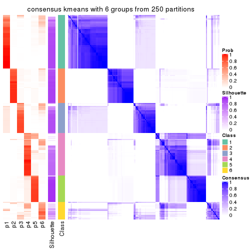</p>

</div>
</div>

Heatmaps for the membership of samples in all partitions to see how consistent they are:


<script>
$( function() {
	$( '#tabs-CV-kmeans-membership-heatmap' ).tabs();
} );
</script>
<div id='tabs-CV-kmeans-membership-heatmap'>
<ul>
<li><a href='#tab-CV-kmeans-membership-heatmap-1'>k = 2</a></li>
<li><a href='#tab-CV-kmeans-membership-heatmap-2'>k = 3</a></li>
<li><a href='#tab-CV-kmeans-membership-heatmap-3'>k = 4</a></li>
<li><a href='#tab-CV-kmeans-membership-heatmap-4'>k = 5</a></li>
<li><a href='#tab-CV-kmeans-membership-heatmap-5'>k = 6</a></li>
</ul>
<div id='tab-CV-kmeans-membership-heatmap-1'>
<pre><code class="r">membership_heatmap(res, k = 2)
</code></pre>

<p></p>

</div>
<div id='tab-CV-kmeans-membership-heatmap-2'>
<pre><code class="r">membership_heatmap(res, k = 3)
</code></pre>

<p></p>

</div>
<div id='tab-CV-kmeans-membership-heatmap-3'>
<pre><code class="r">membership_heatmap(res, k = 4)
</code></pre>

<p></p>

</div>
<div id='tab-CV-kmeans-membership-heatmap-4'>
<pre><code class="r">membership_heatmap(res, k = 5)
</code></pre>

<p></p>

</div>
<div id='tab-CV-kmeans-membership-heatmap-5'>
<pre><code class="r">membership_heatmap(res, k = 6)
</code></pre>

<p></p>

</div>
</div>

As soon as we have had the classes for columns, we can look for signatures
which are significantly different between classes which can be candidate marks
for certain classes. Following are the heatmaps for signatures.


Signature heatmaps where rows are scaled:


<script>
$( function() {
	$( '#tabs-CV-kmeans-get-signatures' ).tabs();
} );
</script>
<div id='tabs-CV-kmeans-get-signatures'>
<ul>
<li><a href='#tab-CV-kmeans-get-signatures-1'>k = 2</a></li>
<li><a href='#tab-CV-kmeans-get-signatures-2'>k = 3</a></li>
<li><a href='#tab-CV-kmeans-get-signatures-3'>k = 4</a></li>
<li><a href='#tab-CV-kmeans-get-signatures-4'>k = 5</a></li>
<li><a href='#tab-CV-kmeans-get-signatures-5'>k = 6</a></li>
</ul>
<div id='tab-CV-kmeans-get-signatures-1'>
<pre><code class="r">get_signatures(res, k = 2)
</code></pre>

<p></p>

</div>
<div id='tab-CV-kmeans-get-signatures-2'>
<pre><code class="r">get_signatures(res, k = 3)
</code></pre>

<p></p>

</div>
<div id='tab-CV-kmeans-get-signatures-3'>
<pre><code class="r">get_signatures(res, k = 4)
</code></pre>

<p></p>

</div>
<div id='tab-CV-kmeans-get-signatures-4'>
<pre><code class="r">get_signatures(res, k = 5)
</code></pre>

<p></p>

</div>
<div id='tab-CV-kmeans-get-signatures-5'>
<pre><code class="r">get_signatures(res, k = 6)
</code></pre>

<p></p>

</div>
</div>


Signature heatmaps where rows are not scaled:


<script>
$( function() {
	$( '#tabs-CV-kmeans-get-signatures-no-scale' ).tabs();
} );
</script>
<div id='tabs-CV-kmeans-get-signatures-no-scale'>
<ul>
<li><a href='#tab-CV-kmeans-get-signatures-no-scale-1'>k = 2</a></li>
<li><a href='#tab-CV-kmeans-get-signatures-no-scale-2'>k = 3</a></li>
<li><a href='#tab-CV-kmeans-get-signatures-no-scale-3'>k = 4</a></li>
<li><a href='#tab-CV-kmeans-get-signatures-no-scale-4'>k = 5</a></li>
<li><a href='#tab-CV-kmeans-get-signatures-no-scale-5'>k = 6</a></li>
</ul>
<div id='tab-CV-kmeans-get-signatures-no-scale-1'>
<pre><code class="r">get_signatures(res, k = 2, scale_rows = FALSE)
</code></pre>

<p></p>

</div>
<div id='tab-CV-kmeans-get-signatures-no-scale-2'>
<pre><code class="r">get_signatures(res, k = 3, scale_rows = FALSE)
</code></pre>

<p></p>

</div>
<div id='tab-CV-kmeans-get-signatures-no-scale-3'>
<pre><code class="r">get_signatures(res, k = 4, scale_rows = FALSE)
</code></pre>

<p></p>

</div>
<div id='tab-CV-kmeans-get-signatures-no-scale-4'>
<pre><code class="r">get_signatures(res, k = 5, scale_rows = FALSE)
</code></pre>

<p></p>

</div>
<div id='tab-CV-kmeans-get-signatures-no-scale-5'>
<pre><code class="r">get_signatures(res, k = 6, scale_rows = FALSE)
</code></pre>

<p></p>

</div>
</div>


Compare the overlap of signatures from different k:

```r
compare_signatures(res)
```


`get_signature()` returns a data frame invisibly. TO get the list of signatures, the function
call should be assigned to a variable explicitly. In following code, if `plot` argument is set
to `FALSE`, no heatmap is plotted while only the differential analysis is performed.

```r
# code only for demonstration
tb = get_signature(res, k = ..., plot = FALSE)
```

An example of the output of `tb` is:

```
#>   which_row         fdr    mean_1    mean_2 scaled_mean_1 scaled_mean_2 km
#> 1        38 0.042760348  8.373488  9.131774    -0.5533452     0.5164555  1
#> 2        40 0.018707592  7.106213  8.469186    -0.6173731     0.5762149  1
#> 3        55 0.019134737 10.221463 11.207825    -0.6159697     0.5749050  1
#> 4        59 0.006059896  5.921854  7.869574    -0.6899429     0.6439467  1
#> 5        60 0.018055526  8.928898 10.211722    -0.6204761     0.5791110  1
#> 6        98 0.009384629 15.714769 14.887706     0.6635654    -0.6193277  2
...
```

The columns in `tb` are:

1. `which_row`: row indices corresponding to the input matrix.
2. `fdr`: FDR for the differential test. 
3. `mean_x`: The mean value in group x.
4. `scaled_mean_x`: The mean value in group x after rows are scaled.
5. `km`: Row groups if k-means clustering is applied to rows.


UMAP plot which shows how samples are separated.


<script>
$( function() {
	$( '#tabs-CV-kmeans-dimension-reduction' ).tabs();
} );
</script>
<div id='tabs-CV-kmeans-dimension-reduction'>
<ul>
<li><a href='#tab-CV-kmeans-dimension-reduction-1'>k = 2</a></li>
<li><a href='#tab-CV-kmeans-dimension-reduction-2'>k = 3</a></li>
<li><a href='#tab-CV-kmeans-dimension-reduction-3'>k = 4</a></li>
<li><a href='#tab-CV-kmeans-dimension-reduction-4'>k = 5</a></li>
<li><a href='#tab-CV-kmeans-dimension-reduction-5'>k = 6</a></li>
</ul>
<div id='tab-CV-kmeans-dimension-reduction-1'>
<pre><code class="r">dimension_reduction(res, k = 2, method = &quot;UMAP&quot;)
</code></pre>

<p></p>

</div>
<div id='tab-CV-kmeans-dimension-reduction-2'>
<pre><code class="r">dimension_reduction(res, k = 3, method = &quot;UMAP&quot;)
</code></pre>

<p></p>

</div>
<div id='tab-CV-kmeans-dimension-reduction-3'>
<pre><code class="r">dimension_reduction(res, k = 4, method = &quot;UMAP&quot;)
</code></pre>

<p></p>

</div>
<div id='tab-CV-kmeans-dimension-reduction-4'>
<pre><code class="r">dimension_reduction(res, k = 5, method = &quot;UMAP&quot;)
</code></pre>

<p></p>

</div>
<div id='tab-CV-kmeans-dimension-reduction-5'>
<pre><code class="r">dimension_reduction(res, k = 6, method = &quot;UMAP&quot;)
</code></pre>

<p></p>

</div>
</div>


Following heatmap shows how subgroups are split when increasing `k`:

```r
collect_classes(res)
```


If matrix rows can be associated to genes, consider to use `GO_Enrichment(res,
...)` to perform function enrichment for the signature genes.


 

---------------------------------------------------


### CV:skmeans**


The object with results only for a single top-value method and a single partition method 
can be extracted as:

```r
res = res_list["CV", "skmeans"]
# you can also extract it by
# res = res_list["CV:skmeans"]
```

A summary of `res` and all the functions that can be applied to it:

```r
res
```

```
#> A 'ConsensusPartition' object with k = 2, 3, 4, 5, 6.
#>   On a matrix with 17680 rows and 218 columns.
#>   Top rows (1000, 2000, 3000, 4000, 5000) are extracted by 'CV' method.
#>   Subgroups are detected by 'skmeans' method.
#>   Performed in total 1250 partitions by row resampling.
#>   Best k for subgroups seems to be 3.
#> 
#> Following methods can be applied to this 'ConsensusPartition' object:
#>  [1] "cola_report"             "collect_classes"         "collect_plots"          
#>  [4] "collect_stats"           "colnames"                "compare_signatures"     
#>  [7] "consensus_heatmap"       "dimension_reduction"     "functional_enrichment"  
#> [10] "get_anno_col"            "get_anno"                "get_classes"            
#> [13] "get_consensus"           "get_matrix"              "get_membership"         
#> [16] "get_param"               "get_signatures"          "get_stats"              
#> [19] "is_best_k"               "is_stable_k"             "membership_heatmap"     
#> [22] "ncol"                    "nrow"                    "plot_ecdf"              
#> [25] "rownames"                "select_partition_number" "show"                   
#> [28] "suggest_best_k"          "test_to_known_factors"
```

`collect_plots()` function collects all the plots made from `res` for all `k` (number of partitions)
into one single page to provide an easy and fast comparison between different `k`.

```r
collect_plots(res)
```


The plots are:

- The first row: a plot of the ECDF (Empirical cumulative distribution
  function) curves of the consensus matrix for each `k` and the heatmap of
  predicted classes for each `k`.
- The second row: heatmaps of the consensus matrix for each `k`.
- The third row: heatmaps of the membership matrix for each `k`.
- The fouth row: heatmaps of the signatures for each `k`.

All the plots in panels can be made by individual functions and they are
plotted later in this section.

`select_partition_number()` produces several plots showing different
statistics for choosing "optimized" `k`. There are following statistics:

- ECDF curves of the consensus matrix for each `k`;
- 1-PAC. [The PAC
  score](https://en.wikipedia.org/wiki/Consensus_clustering#Over-interpretation_potential_of_consensus_clustering)
  measures the proportion of the ambiguous subgrouping.
- Mean silhouette score.
- Concordance. The mean probability of fiting the consensus class ids in all
  partitions.
- Area increased. Denote $A_k$ as the area under the ECDF curve for current
  `k`, the area increased is defined as $A_k - A_{k-1}$.
- Rand index. The percent of pairs of samples that are both in a same cluster
  or both are not in a same cluster in the partition of k and k-1.
- Jaccard index. The ratio of pairs of samples are both in a same cluster in
  the partition of k and k-1 and the pairs of samples are both in a same
  cluster in the partition k or k-1.

The detailed explanations of these statistics can be found in [the cola
vignette](http://bioconductor.org/packages/devel/bioc/vignettes/cola/inst/doc/cola.html#toc_13).

Generally speaking, lower PAC score, higher mean silhouette score or higher
concordance corresponds to better partition. Rand index and Jaccard index
measure how similar the current partition is compared to partition with `k-1`.
If they are too similar, we won't accept `k` is better than `k-1`.

```r
select_partition_number(res)
```


The numeric values for all these statistics can be obtained by `get_stats()`.

```r
get_stats(res)
```

```
#>   k 1-PAC mean_silhouette concordance area_increased  Rand Jaccard
#> 2 2 1.000           0.989       0.996         0.5016 0.499   0.499
#> 3 3 1.000           0.972       0.986         0.2601 0.851   0.707
#> 4 4 0.874           0.893       0.936         0.1376 0.892   0.714
#> 5 5 0.889           0.904       0.932         0.0777 0.926   0.738
#> 6 6 0.886           0.788       0.900         0.0377 0.989   0.948
```

`suggest_best_k()` suggests the best $k$ based on these statistics. The rules are as follows:

- All $k$ with Jaccard index larger than 0.95 are removed because the increase of
  the partition number does not provides enough extra information. If all $k$ are removed,
  the best $k$ is assigned by `NA`.
- For $k$ with 1-PAC larger than 0.9, the maximal $k$ is taken as the "best k". Other $k$ is called "optional k".
- If it does not fit the second rule. The $k$ with the highest vote of highest
  1-PAC, mean silhouette and concordance is taken as the "best k".

```r
suggest_best_k(res)
```

```
#> [1] 3
#> attr(,"optional")
#> [1] 2
```

There is also optional best $k$ = 2 that is worth to check.

Following shows the table of the partitions (You need to click the **show/hide
code output** link to see it). The membership matrix (columns with name `p*`)
is inferred by
[`clue::cl_consensus()`](https://www.rdocumentation.org/link/cl_consensus?package=clue)
function with the `SE` method. Basically the value in the membership matrix
represents the probability to belong to a certain group. The finall class
label for an item is determined with the group with highest probability it
belongs to.

In `get_classes()` function, the entropy is calculated from the membership
matrix and the silhouette score is calculated from the consensus matrix.


<script>
$( function() {
	$( '#tabs-CV-skmeans-get-classes' ).tabs();
} );
</script>
<div id='tabs-CV-skmeans-get-classes'>
<ul>
<li><a href='#tab-CV-skmeans-get-classes-1'>k = 2</a></li>
<li><a href='#tab-CV-skmeans-get-classes-2'>k = 3</a></li>
<li><a href='#tab-CV-skmeans-get-classes-3'>k = 4</a></li>
<li><a href='#tab-CV-skmeans-get-classes-4'>k = 5</a></li>
<li><a href='#tab-CV-skmeans-get-classes-5'>k = 6</a></li>
</ul>

<div id='tab-CV-skmeans-get-classes-1'>
<p><a id='tab-CV-skmeans-get-classes-1-a' style='color:#0366d6' href='#'>show/hide code output</a></p>
<pre><code class="r">cbind(get_classes(res, k = 2), get_membership(res, k = 2))
</code></pre>

<pre><code>#&gt;            class entropy silhouette    p1    p2
#&gt; SRR1498997     2  0.0000      0.996 0.000 1.000
#&gt; SRR1076441     1  0.0000      0.995 1.000 0.000
#&gt; SRR1489803     2  0.0000      0.996 0.000 1.000
#&gt; SRR1345953     2  0.0000      0.996 0.000 1.000
#&gt; SRR1357826     2  0.0000      0.996 0.000 1.000
#&gt; SRR1419656     1  0.0000      0.995 1.000 0.000
#&gt; SRR1454158     2  0.0000      0.996 0.000 1.000
#&gt; SRR1475408     2  0.0000      0.996 0.000 1.000
#&gt; SRR1472704     2  0.0000      0.996 0.000 1.000
#&gt; SRR1090046     1  0.0000      0.995 1.000 0.000
#&gt; SRR1312822     1  0.0000      0.995 1.000 0.000
#&gt; SRR1096987     2  0.0000      0.996 0.000 1.000
#&gt; SRR1334587     2  0.0000      0.996 0.000 1.000
#&gt; SRR1490246     1  0.0000      0.995 1.000 0.000
#&gt; SRR1467522     1  0.0000      0.995 1.000 0.000
#&gt; SRR1324206     1  0.0000      0.995 1.000 0.000
#&gt; SRR1408574     2  0.0000      0.996 0.000 1.000
#&gt; SRR1083959     2  0.0000      0.996 0.000 1.000
#&gt; SRR1079948     2  0.0000      0.996 0.000 1.000
#&gt; SRR1310667     2  0.0000      0.996 0.000 1.000
#&gt; SRR655852      2  0.0000      0.996 0.000 1.000
#&gt; SRR1352457     2  0.0000      0.996 0.000 1.000
#&gt; SRR1353994     2  0.0000      0.996 0.000 1.000
#&gt; SRR1459561     2  0.0000      0.996 0.000 1.000
#&gt; SRR1454009     1  0.0000      0.995 1.000 0.000
#&gt; SRR1071084     1  0.0000      0.995 1.000 0.000
#&gt; SRR1082859     2  0.0000      0.996 0.000 1.000
#&gt; SRR1086538     1  0.0000      0.995 1.000 0.000
#&gt; SRR1486262     2  0.0000      0.996 0.000 1.000
#&gt; SRR658105      1  0.0000      0.995 1.000 0.000
#&gt; SRR811073      2  0.0000      0.996 0.000 1.000
#&gt; SRR1429181     2  0.0000      0.996 0.000 1.000
#&gt; SRR1327896     2  0.0000      0.996 0.000 1.000
#&gt; SRR1464788     2  0.0000      0.996 0.000 1.000
#&gt; SRR1346861     2  0.0000      0.996 0.000 1.000
#&gt; SRR1318774     2  0.0000      0.996 0.000 1.000
#&gt; SRR1420517     1  0.0000      0.995 1.000 0.000
#&gt; SRR1369584     2  0.0000      0.996 0.000 1.000
#&gt; SRR1443244     1  0.7602      0.717 0.780 0.220
#&gt; SRR1455391     1  0.0000      0.995 1.000 0.000
#&gt; SRR1068999     1  0.0000      0.995 1.000 0.000
#&gt; SRR1481297     1  0.0000      0.995 1.000 0.000
#&gt; SRR1070208     1  0.0000      0.995 1.000 0.000
#&gt; SRR1317282     1  0.0000      0.995 1.000 0.000
#&gt; SRR1096125     2  0.0000      0.996 0.000 1.000
#&gt; SRR1472506     1  0.0000      0.995 1.000 0.000
#&gt; SRR1388281     2  0.0000      0.996 0.000 1.000
#&gt; SRR1365622     2  0.0000      0.996 0.000 1.000
#&gt; SRR662306      1  0.0000      0.995 1.000 0.000
#&gt; SRR662811      1  0.0000      0.995 1.000 0.000
#&gt; SRR820571      1  0.0000      0.995 1.000 0.000
#&gt; SRR1357166     1  0.0000      0.995 1.000 0.000
#&gt; SRR1488586     1  0.0000      0.995 1.000 0.000
#&gt; SRR1485398     1  0.0000      0.995 1.000 0.000
#&gt; SRR1417725     2  0.0000      0.996 0.000 1.000
#&gt; SRR1409397     2  0.0000      0.996 0.000 1.000
#&gt; SRR1465693     2  0.0000      0.996 0.000 1.000
#&gt; SRR1096547     1  0.0000      0.995 1.000 0.000
#&gt; SRR1456818     1  0.0000      0.995 1.000 0.000
#&gt; SRR816336      1  0.0000      0.995 1.000 0.000
#&gt; SRR1420238     1  0.0000      0.995 1.000 0.000
#&gt; SRR1433374     1  0.0000      0.995 1.000 0.000
#&gt; SRR1436990     1  0.0000      0.995 1.000 0.000
#&gt; SRR662378      1  0.0000      0.995 1.000 0.000
#&gt; SRR1477671     1  0.0000      0.995 1.000 0.000
#&gt; SRR1084079     2  0.9710      0.324 0.400 0.600
#&gt; SRR1102949     1  0.0000      0.995 1.000 0.000
#&gt; SRR1458090     1  0.0000      0.995 1.000 0.000
#&gt; SRR1418729     2  0.0000      0.996 0.000 1.000
#&gt; SRR1403814     2  0.0000      0.996 0.000 1.000
#&gt; SRR1404887     1  0.9170      0.504 0.668 0.332
#&gt; SRR1434955     1  0.0000      0.995 1.000 0.000
#&gt; SRR1360652     1  0.0000      0.995 1.000 0.000
#&gt; SRR1356765     2  0.0000      0.996 0.000 1.000
#&gt; SRR1078258     2  0.0000      0.996 0.000 1.000
#&gt; SRR1455861     1  0.0000      0.995 1.000 0.000
#&gt; SRR1420296     2  0.0000      0.996 0.000 1.000
#&gt; SRR1070260     2  0.0000      0.996 0.000 1.000
#&gt; SRR1410765     1  0.0000      0.995 1.000 0.000
#&gt; SRR1481315     1  0.0000      0.995 1.000 0.000
#&gt; SRR1414661     2  0.0000      0.996 0.000 1.000
#&gt; SRR1359147     2  0.0000      0.996 0.000 1.000
#&gt; SRR1488694     1  0.0000      0.995 1.000 0.000
#&gt; SRR1477273     1  0.0000      0.995 1.000 0.000
#&gt; SRR1415792     1  0.0000      0.995 1.000 0.000
#&gt; SRR1369088     2  0.0000      0.996 0.000 1.000
#&gt; SRR1406621     2  0.0000      0.996 0.000 1.000
#&gt; SRR1401017     2  0.0000      0.996 0.000 1.000
#&gt; SRR1099981     2  0.0000      0.996 0.000 1.000
#&gt; SRR815208      2  0.0000      0.996 0.000 1.000
#&gt; SRR1380460     2  0.0000      0.996 0.000 1.000
#&gt; SRR1091097     2  0.0000      0.996 0.000 1.000
#&gt; SRR1456010     1  0.0000      0.995 1.000 0.000
#&gt; SRR1498416     2  0.0000      0.996 0.000 1.000
#&gt; SRR818873      2  0.0000      0.996 0.000 1.000
#&gt; SRR813868      2  0.0000      0.996 0.000 1.000
#&gt; SRR1394912     1  0.0000      0.995 1.000 0.000
#&gt; SRR1475824     2  0.0000      0.996 0.000 1.000
#&gt; SRR1459866     1  0.0000      0.995 1.000 0.000
#&gt; SRR1364871     1  0.0000      0.995 1.000 0.000
#&gt; SRR1100472     2  0.0000      0.996 0.000 1.000
#&gt; SRR1331267     1  0.0000      0.995 1.000 0.000
#&gt; SRR1068977     2  0.0000      0.996 0.000 1.000
#&gt; SRR1391511     2  0.0000      0.996 0.000 1.000
#&gt; SRR1077920     2  0.0000      0.996 0.000 1.000
#&gt; SRR1457705     1  0.0000      0.995 1.000 0.000
#&gt; SRR1437073     1  0.0000      0.995 1.000 0.000
#&gt; SRR1473124     1  0.0000      0.995 1.000 0.000
#&gt; SRR1469279     1  0.0000      0.995 1.000 0.000
#&gt; SRR1091791     2  0.0000      0.996 0.000 1.000
#&gt; SRR1341539     2  0.0000      0.996 0.000 1.000
#&gt; SRR1446354     1  0.0000      0.995 1.000 0.000
#&gt; SRR1415420     1  0.0000      0.995 1.000 0.000
#&gt; SRR1368050     1  0.0000      0.995 1.000 0.000
#&gt; SRR656970      2  0.0000      0.996 0.000 1.000
#&gt; SRR1473403     2  0.0000      0.996 0.000 1.000
#&gt; SRR1084674     1  0.0000      0.995 1.000 0.000
#&gt; SRR1464702     1  0.0000      0.995 1.000 0.000
#&gt; SRR1074860     2  0.0000      0.996 0.000 1.000
#&gt; SRR655447      2  0.0000      0.996 0.000 1.000
#&gt; SRR1404442     2  0.0000      0.996 0.000 1.000
#&gt; SRR1418795     1  0.0000      0.995 1.000 0.000
#&gt; SRR1458335     2  0.0000      0.996 0.000 1.000
#&gt; SRR1489589     2  0.0000      0.996 0.000 1.000
#&gt; SRR1378284     1  0.0000      0.995 1.000 0.000
#&gt; SRR1408014     2  0.0000      0.996 0.000 1.000
#&gt; SRR1083052     1  0.0000      0.995 1.000 0.000
#&gt; SRR1339236     2  0.0000      0.996 0.000 1.000
#&gt; SRR1323829     2  0.0000      0.996 0.000 1.000
#&gt; SRR1086772     2  0.0000      0.996 0.000 1.000
#&gt; SRR1486457     1  0.0000      0.995 1.000 0.000
#&gt; SRR1415257     2  0.0000      0.996 0.000 1.000
#&gt; SRR1071905     1  0.0000      0.995 1.000 0.000
#&gt; SRR659223      2  0.0000      0.996 0.000 1.000
#&gt; SRR1386945     1  0.0000      0.995 1.000 0.000
#&gt; SRR821498      2  0.0000      0.996 0.000 1.000
#&gt; SRR1378903     2  0.0000      0.996 0.000 1.000
#&gt; SRR1472907     1  0.0000      0.995 1.000 0.000
#&gt; SRR1442313     2  0.0000      0.996 0.000 1.000
#&gt; SRR1077139     2  0.0000      0.996 0.000 1.000
#&gt; SRR1342758     1  0.0000      0.995 1.000 0.000
#&gt; SRR656911      2  0.0000      0.996 0.000 1.000
#&gt; SRR1070738     1  0.0000      0.995 1.000 0.000
#&gt; SRR1476950     1  0.0000      0.995 1.000 0.000
#&gt; SRR1488196     1  0.0000      0.995 1.000 0.000
#&gt; SRR1498951     1  0.0000      0.995 1.000 0.000
#&gt; SRR1413392     1  0.0000      0.995 1.000 0.000
#&gt; SRR657528      2  0.0000      0.996 0.000 1.000
#&gt; SRR812198      1  0.0000      0.995 1.000 0.000
#&gt; SRR660283      2  0.0000      0.996 0.000 1.000
#&gt; SRR1420936     1  0.0000      0.995 1.000 0.000
#&gt; SRR1469547     2  0.0000      0.996 0.000 1.000
#&gt; SRR1322249     1  0.0000      0.995 1.000 0.000
#&gt; SRR1396682     1  0.0000      0.995 1.000 0.000
#&gt; SRR1095816     2  0.0000      0.996 0.000 1.000
#&gt; SRR1081023     1  0.0000      0.995 1.000 0.000
#&gt; SRR1092517     2  0.0000      0.996 0.000 1.000
#&gt; SRR811285      2  0.0000      0.996 0.000 1.000
#&gt; SRR657018      1  0.0000      0.995 1.000 0.000
#&gt; SRR1365534     1  0.0000      0.995 1.000 0.000
#&gt; SRR1090791     2  0.0000      0.996 0.000 1.000
#&gt; SRR1439915     2  0.0000      0.996 0.000 1.000
#&gt; SRR1391575     2  0.0000      0.996 0.000 1.000
#&gt; SRR1314092     2  0.0000      0.996 0.000 1.000
#&gt; SRR1328941     1  0.0000      0.995 1.000 0.000
#&gt; SRR1336181     2  0.0000      0.996 0.000 1.000
#&gt; SRR1362972     1  0.0000      0.995 1.000 0.000
#&gt; SRR1366790     2  0.0000      0.996 0.000 1.000
#&gt; SRR1455902     1  0.0000      0.995 1.000 0.000
#&gt; SRR1437644     1  0.0672      0.987 0.992 0.008
#&gt; SRR1105009     2  0.0000      0.996 0.000 1.000
#&gt; SRR1367024     1  0.0000      0.995 1.000 0.000
#&gt; SRR660248      2  0.0000      0.996 0.000 1.000
#&gt; SRR1409620     1  0.0000      0.995 1.000 0.000
#&gt; SRR1455807     2  0.0000      0.996 0.000 1.000
#&gt; SRR1339431     1  0.0000      0.995 1.000 0.000
#&gt; SRR1378948     1  0.0000      0.995 1.000 0.000
#&gt; SRR1469237     1  0.0000      0.995 1.000 0.000
#&gt; SRR1098264     2  0.0000      0.996 0.000 1.000
#&gt; SRR1406224     2  0.0000      0.996 0.000 1.000
#&gt; SRR1393026     1  0.0000      0.995 1.000 0.000
#&gt; SRR808428      2  0.0000      0.996 0.000 1.000
#&gt; SRR615910      2  0.0000      0.996 0.000 1.000
#&gt; SRR1076219     1  0.0000      0.995 1.000 0.000
#&gt; SRR1481128     1  0.0000      0.995 1.000 0.000
#&gt; SRR1359262     2  0.0000      0.996 0.000 1.000
#&gt; SRR1407648     2  0.0000      0.996 0.000 1.000
#&gt; SRR1386775     1  0.0000      0.995 1.000 0.000
#&gt; SRR1388399     1  0.0000      0.995 1.000 0.000
#&gt; SRR1361499     2  0.0000      0.996 0.000 1.000
#&gt; SRR1500709     2  0.0000      0.996 0.000 1.000
#&gt; SRR1335917     1  0.0000      0.995 1.000 0.000
#&gt; SRR1430615     2  0.0000      0.996 0.000 1.000
#&gt; SRR1335212     1  0.0000      0.995 1.000 0.000
#&gt; SRR1400159     2  0.0000      0.996 0.000 1.000
#&gt; SRR1457245     2  0.0000      0.996 0.000 1.000
#&gt; SRR1356746     2  0.0000      0.996 0.000 1.000
#&gt; SRR658319      2  0.0000      0.996 0.000 1.000
#&gt; SRR1435946     1  0.0000      0.995 1.000 0.000
#&gt; SRR1370308     1  0.0000      0.995 1.000 0.000
#&gt; SRR1100893     1  0.0000      0.995 1.000 0.000
#&gt; SRR1389432     1  0.0000      0.995 1.000 0.000
#&gt; SRR1381799     2  0.0000      0.996 0.000 1.000
#&gt; SRR1310158     1  0.0000      0.995 1.000 0.000
#&gt; SRR1341100     2  0.0000      0.996 0.000 1.000
#&gt; SRR1342873     1  0.0000      0.995 1.000 0.000
#&gt; SRR1472102     2  0.0000      0.996 0.000 1.000
#&gt; SRR1409421     1  0.0000      0.995 1.000 0.000
#&gt; SRR1328577     2  0.0000      0.996 0.000 1.000
#&gt; SRR808942      2  0.0000      0.996 0.000 1.000
#&gt; SRR1343818     2  0.0000      0.996 0.000 1.000
#&gt; SRR1472415     2  0.0000      0.996 0.000 1.000
#&gt; SRR658409      2  0.0000      0.996 0.000 1.000
#&gt; SRR1469681     1  0.0000      0.995 1.000 0.000
#&gt; SRR1075484     2  0.0000      0.996 0.000 1.000
#&gt; SRR1417894     1  0.0000      0.995 1.000 0.000
#&gt; SRR1417422     2  0.0000      0.996 0.000 1.000
#&gt; SRR1090674     1  0.0000      0.995 1.000 0.000
</code></pre>

<script>
$('#tab-CV-skmeans-get-classes-1-a').parent().next().next().hide();
$('#tab-CV-skmeans-get-classes-1-a').click(function(){
  $('#tab-CV-skmeans-get-classes-1-a').parent().next().next().toggle();
  return(false);
});
</script>
</div>

<div id='tab-CV-skmeans-get-classes-2'>
<p><a id='tab-CV-skmeans-get-classes-2-a' style='color:#0366d6' href='#'>show/hide code output</a></p>
<pre><code class="r">cbind(get_classes(res, k = 3), get_membership(res, k = 3))
</code></pre>

<pre><code>#&gt;            class entropy silhouette    p1    p2    p3
#&gt; SRR1498997     2  0.0000      0.974 0.000 1.000 0.000
#&gt; SRR1076441     1  0.0000      0.993 1.000 0.000 0.000
#&gt; SRR1489803     3  0.0592      0.996 0.000 0.012 0.988
#&gt; SRR1345953     2  0.0000      0.974 0.000 1.000 0.000
#&gt; SRR1357826     2  0.0000      0.974 0.000 1.000 0.000
#&gt; SRR1419656     1  0.0237      0.992 0.996 0.000 0.004
#&gt; SRR1454158     2  0.0000      0.974 0.000 1.000 0.000
#&gt; SRR1475408     2  0.6244      0.205 0.000 0.560 0.440
#&gt; SRR1472704     2  0.0000      0.974 0.000 1.000 0.000
#&gt; SRR1090046     1  0.0592      0.990 0.988 0.000 0.012
#&gt; SRR1312822     1  0.0000      0.993 1.000 0.000 0.000
#&gt; SRR1096987     2  0.0000      0.974 0.000 1.000 0.000
#&gt; SRR1334587     3  0.0592      0.996 0.000 0.012 0.988
#&gt; SRR1490246     1  0.0000      0.993 1.000 0.000 0.000
#&gt; SRR1467522     1  0.0000      0.993 1.000 0.000 0.000
#&gt; SRR1324206     1  0.0000      0.993 1.000 0.000 0.000
#&gt; SRR1408574     3  0.0592      0.996 0.000 0.012 0.988
#&gt; SRR1083959     2  0.0000      0.974 0.000 1.000 0.000
#&gt; SRR1079948     2  0.0000      0.974 0.000 1.000 0.000
#&gt; SRR1310667     3  0.0592      0.996 0.000 0.012 0.988
#&gt; SRR655852      2  0.0000      0.974 0.000 1.000 0.000
#&gt; SRR1352457     3  0.0592      0.996 0.000 0.012 0.988
#&gt; SRR1353994     2  0.0000      0.974 0.000 1.000 0.000
#&gt; SRR1459561     3  0.0592      0.996 0.000 0.012 0.988
#&gt; SRR1454009     1  0.0592      0.990 0.988 0.000 0.012
#&gt; SRR1071084     1  0.0592      0.990 0.988 0.000 0.012
#&gt; SRR1082859     2  0.0000      0.974 0.000 1.000 0.000
#&gt; SRR1086538     1  0.0000      0.993 1.000 0.000 0.000
#&gt; SRR1486262     2  0.0000      0.974 0.000 1.000 0.000
#&gt; SRR658105      1  0.0000      0.993 1.000 0.000 0.000
#&gt; SRR811073      2  0.0000      0.974 0.000 1.000 0.000
#&gt; SRR1429181     3  0.0592      0.996 0.000 0.012 0.988
#&gt; SRR1327896     2  0.0000      0.974 0.000 1.000 0.000
#&gt; SRR1464788     3  0.0592      0.996 0.000 0.012 0.988
#&gt; SRR1346861     2  0.0000      0.974 0.000 1.000 0.000
#&gt; SRR1318774     2  0.0000      0.974 0.000 1.000 0.000
#&gt; SRR1420517     1  0.0237      0.992 0.996 0.000 0.004
#&gt; SRR1369584     3  0.0592      0.996 0.000 0.012 0.988
#&gt; SRR1443244     2  0.5650      0.557 0.312 0.688 0.000
#&gt; SRR1455391     1  0.0592      0.990 0.988 0.000 0.012
#&gt; SRR1068999     1  0.0000      0.993 1.000 0.000 0.000
#&gt; SRR1481297     1  0.0237      0.992 0.996 0.000 0.004
#&gt; SRR1070208     1  0.0000      0.993 1.000 0.000 0.000
#&gt; SRR1317282     1  0.0592      0.990 0.988 0.000 0.012
#&gt; SRR1096125     2  0.0000      0.974 0.000 1.000 0.000
#&gt; SRR1472506     1  0.0424      0.991 0.992 0.000 0.008
#&gt; SRR1388281     2  0.0000      0.974 0.000 1.000 0.000
#&gt; SRR1365622     3  0.0592      0.996 0.000 0.012 0.988
#&gt; SRR662306      1  0.0592      0.990 0.988 0.000 0.012
#&gt; SRR662811      1  0.0000      0.993 1.000 0.000 0.000
#&gt; SRR820571      1  0.0000      0.993 1.000 0.000 0.000
#&gt; SRR1357166     1  0.0592      0.990 0.988 0.000 0.012
#&gt; SRR1488586     1  0.0000      0.993 1.000 0.000 0.000
#&gt; SRR1485398     1  0.0000      0.993 1.000 0.000 0.000
#&gt; SRR1417725     2  0.0424      0.966 0.000 0.992 0.008
#&gt; SRR1409397     3  0.0592      0.996 0.000 0.012 0.988
#&gt; SRR1465693     3  0.0592      0.996 0.000 0.012 0.988
#&gt; SRR1096547     1  0.0592      0.990 0.988 0.000 0.012
#&gt; SRR1456818     1  0.0000      0.993 1.000 0.000 0.000
#&gt; SRR816336      1  0.0424      0.991 0.992 0.000 0.008
#&gt; SRR1420238     1  0.0000      0.993 1.000 0.000 0.000
#&gt; SRR1433374     1  0.0592      0.990 0.988 0.000 0.012
#&gt; SRR1436990     1  0.0000      0.993 1.000 0.000 0.000
#&gt; SRR662378      1  0.0000      0.993 1.000 0.000 0.000
#&gt; SRR1477671     1  0.0000      0.993 1.000 0.000 0.000
#&gt; SRR1084079     2  0.0592      0.961 0.012 0.988 0.000
#&gt; SRR1102949     1  0.0000      0.993 1.000 0.000 0.000
#&gt; SRR1458090     1  0.0000      0.993 1.000 0.000 0.000
#&gt; SRR1418729     2  0.0000      0.974 0.000 1.000 0.000
#&gt; SRR1403814     2  0.0000      0.974 0.000 1.000 0.000
#&gt; SRR1404887     2  0.5058      0.661 0.244 0.756 0.000
#&gt; SRR1434955     1  0.0000      0.993 1.000 0.000 0.000
#&gt; SRR1360652     1  0.0000      0.993 1.000 0.000 0.000
#&gt; SRR1356765     3  0.0592      0.996 0.000 0.012 0.988
#&gt; SRR1078258     2  0.0000      0.974 0.000 1.000 0.000
#&gt; SRR1455861     1  0.0000      0.993 1.000 0.000 0.000
#&gt; SRR1420296     3  0.0592      0.996 0.000 0.012 0.988
#&gt; SRR1070260     2  0.0000      0.974 0.000 1.000 0.000
#&gt; SRR1410765     1  0.0000      0.993 1.000 0.000 0.000
#&gt; SRR1481315     1  0.0000      0.993 1.000 0.000 0.000
#&gt; SRR1414661     2  0.0000      0.974 0.000 1.000 0.000
#&gt; SRR1359147     2  0.0000      0.974 0.000 1.000 0.000
#&gt; SRR1488694     1  0.0000      0.993 1.000 0.000 0.000
#&gt; SRR1477273     1  0.0592      0.990 0.988 0.000 0.012
#&gt; SRR1415792     1  0.0424      0.991 0.992 0.000 0.008
#&gt; SRR1369088     3  0.0592      0.996 0.000 0.012 0.988
#&gt; SRR1406621     3  0.0592      0.996 0.000 0.012 0.988
#&gt; SRR1401017     3  0.0592      0.996 0.000 0.012 0.988
#&gt; SRR1099981     3  0.0592      0.996 0.000 0.012 0.988
#&gt; SRR815208      2  0.0000      0.974 0.000 1.000 0.000
#&gt; SRR1380460     2  0.0000      0.974 0.000 1.000 0.000
#&gt; SRR1091097     2  0.0000      0.974 0.000 1.000 0.000
#&gt; SRR1456010     1  0.0424      0.991 0.992 0.000 0.008
#&gt; SRR1498416     2  0.0000      0.974 0.000 1.000 0.000
#&gt; SRR818873      3  0.0592      0.996 0.000 0.012 0.988
#&gt; SRR813868      2  0.0000      0.974 0.000 1.000 0.000
#&gt; SRR1394912     1  0.0000      0.993 1.000 0.000 0.000
#&gt; SRR1475824     2  0.5560      0.562 0.000 0.700 0.300
#&gt; SRR1459866     1  0.0000      0.993 1.000 0.000 0.000
#&gt; SRR1364871     1  0.0000      0.993 1.000 0.000 0.000
#&gt; SRR1100472     2  0.0000      0.974 0.000 1.000 0.000
#&gt; SRR1331267     1  0.0000      0.993 1.000 0.000 0.000
#&gt; SRR1068977     3  0.0592      0.996 0.000 0.012 0.988
#&gt; SRR1391511     2  0.0000      0.974 0.000 1.000 0.000
#&gt; SRR1077920     2  0.0000      0.974 0.000 1.000 0.000
#&gt; SRR1457705     1  0.0424      0.991 0.992 0.000 0.008
#&gt; SRR1437073     1  0.0000      0.993 1.000 0.000 0.000
#&gt; SRR1473124     1  0.0592      0.990 0.988 0.000 0.012
#&gt; SRR1469279     1  0.0592      0.990 0.988 0.000 0.012
#&gt; SRR1091791     2  0.0000      0.974 0.000 1.000 0.000
#&gt; SRR1341539     3  0.0592      0.996 0.000 0.012 0.988
#&gt; SRR1446354     1  0.0592      0.990 0.988 0.000 0.012
#&gt; SRR1415420     1  0.0000      0.993 1.000 0.000 0.000
#&gt; SRR1368050     1  0.0000      0.993 1.000 0.000 0.000
#&gt; SRR656970      3  0.0592      0.996 0.000 0.012 0.988
#&gt; SRR1473403     2  0.0000      0.974 0.000 1.000 0.000
#&gt; SRR1084674     1  0.0592      0.990 0.988 0.000 0.012
#&gt; SRR1464702     1  0.0000      0.993 1.000 0.000 0.000
#&gt; SRR1074860     2  0.0000      0.974 0.000 1.000 0.000
#&gt; SRR655447      2  0.0000      0.974 0.000 1.000 0.000
#&gt; SRR1404442     2  0.0000      0.974 0.000 1.000 0.000
#&gt; SRR1418795     1  0.0000      0.993 1.000 0.000 0.000
#&gt; SRR1458335     2  0.0000      0.974 0.000 1.000 0.000
#&gt; SRR1489589     3  0.0592      0.996 0.000 0.012 0.988
#&gt; SRR1378284     1  0.4002      0.812 0.840 0.000 0.160
#&gt; SRR1408014     3  0.0592      0.996 0.000 0.012 0.988
#&gt; SRR1083052     1  0.0000      0.993 1.000 0.000 0.000
#&gt; SRR1339236     3  0.0000      0.984 0.000 0.000 1.000
#&gt; SRR1323829     3  0.0592      0.996 0.000 0.012 0.988
#&gt; SRR1086772     2  0.0000      0.974 0.000 1.000 0.000
#&gt; SRR1486457     1  0.0592      0.990 0.988 0.000 0.012
#&gt; SRR1415257     3  0.0592      0.996 0.000 0.012 0.988
#&gt; SRR1071905     1  0.0592      0.990 0.988 0.000 0.012
#&gt; SRR659223      3  0.0592      0.996 0.000 0.012 0.988
#&gt; SRR1386945     1  0.0592      0.990 0.988 0.000 0.012
#&gt; SRR821498      2  0.0000      0.974 0.000 1.000 0.000
#&gt; SRR1378903     2  0.0000      0.974 0.000 1.000 0.000
#&gt; SRR1472907     1  0.0237      0.992 0.996 0.000 0.004
#&gt; SRR1442313     2  0.0000      0.974 0.000 1.000 0.000
#&gt; SRR1077139     3  0.0592      0.996 0.000 0.012 0.988
#&gt; SRR1342758     1  0.0000      0.993 1.000 0.000 0.000
#&gt; SRR656911      2  0.0000      0.974 0.000 1.000 0.000
#&gt; SRR1070738     1  0.0000      0.993 1.000 0.000 0.000
#&gt; SRR1476950     1  0.0000      0.993 1.000 0.000 0.000
#&gt; SRR1488196     1  0.0592      0.990 0.988 0.000 0.012
#&gt; SRR1498951     1  0.0237      0.992 0.996 0.000 0.004
#&gt; SRR1413392     1  0.0000      0.993 1.000 0.000 0.000
#&gt; SRR657528      3  0.0592      0.996 0.000 0.012 0.988
#&gt; SRR812198      1  0.0000      0.993 1.000 0.000 0.000
#&gt; SRR660283      2  0.0000      0.974 0.000 1.000 0.000
#&gt; SRR1420936     1  0.0000      0.993 1.000 0.000 0.000
#&gt; SRR1469547     2  0.0000      0.974 0.000 1.000 0.000
#&gt; SRR1322249     1  0.0000      0.993 1.000 0.000 0.000
#&gt; SRR1396682     1  0.0000      0.993 1.000 0.000 0.000
#&gt; SRR1095816     2  0.0000      0.974 0.000 1.000 0.000
#&gt; SRR1081023     1  0.0000      0.993 1.000 0.000 0.000
#&gt; SRR1092517     2  0.0000      0.974 0.000 1.000 0.000
#&gt; SRR811285      3  0.0592      0.996 0.000 0.012 0.988
#&gt; SRR657018      1  0.0000      0.993 1.000 0.000 0.000
#&gt; SRR1365534     1  0.0592      0.990 0.988 0.000 0.012
#&gt; SRR1090791     3  0.0592      0.996 0.000 0.012 0.988
#&gt; SRR1439915     3  0.0592      0.996 0.000 0.012 0.988
#&gt; SRR1391575     2  0.0000      0.974 0.000 1.000 0.000
#&gt; SRR1314092     2  0.0000      0.974 0.000 1.000 0.000
#&gt; SRR1328941     1  0.0592      0.990 0.988 0.000 0.012
#&gt; SRR1336181     2  0.0000      0.974 0.000 1.000 0.000
#&gt; SRR1362972     1  0.0000      0.993 1.000 0.000 0.000
#&gt; SRR1366790     2  0.0000      0.974 0.000 1.000 0.000
#&gt; SRR1455902     1  0.0592      0.990 0.988 0.000 0.012
#&gt; SRR1437644     2  0.6647      0.327 0.396 0.592 0.012
#&gt; SRR1105009     2  0.0000      0.974 0.000 1.000 0.000
#&gt; SRR1367024     1  0.0592      0.990 0.988 0.000 0.012
#&gt; SRR660248      2  0.0000      0.974 0.000 1.000 0.000
#&gt; SRR1409620     1  0.0000      0.993 1.000 0.000 0.000
#&gt; SRR1455807     2  0.0000      0.974 0.000 1.000 0.000
#&gt; SRR1339431     1  0.0000      0.993 1.000 0.000 0.000
#&gt; SRR1378948     1  0.0592      0.990 0.988 0.000 0.012
#&gt; SRR1469237     1  0.0000      0.993 1.000 0.000 0.000
#&gt; SRR1098264     2  0.0000      0.974 0.000 1.000 0.000
#&gt; SRR1406224     3  0.0592      0.996 0.000 0.012 0.988
#&gt; SRR1393026     1  0.0592      0.990 0.988 0.000 0.012
#&gt; SRR808428      2  0.0000      0.974 0.000 1.000 0.000
#&gt; SRR615910      3  0.0592      0.996 0.000 0.012 0.988
#&gt; SRR1076219     1  0.0000      0.993 1.000 0.000 0.000
#&gt; SRR1481128     1  0.0000      0.993 1.000 0.000 0.000
#&gt; SRR1359262     3  0.0592      0.996 0.000 0.012 0.988
#&gt; SRR1407648     2  0.0000      0.974 0.000 1.000 0.000
#&gt; SRR1386775     1  0.0000      0.993 1.000 0.000 0.000
#&gt; SRR1388399     1  0.4452      0.765 0.808 0.000 0.192
#&gt; SRR1361499     2  0.0000      0.974 0.000 1.000 0.000
#&gt; SRR1500709     2  0.0000      0.974 0.000 1.000 0.000
#&gt; SRR1335917     1  0.0000      0.993 1.000 0.000 0.000
#&gt; SRR1430615     3  0.0592      0.996 0.000 0.012 0.988
#&gt; SRR1335212     1  0.0000      0.993 1.000 0.000 0.000
#&gt; SRR1400159     3  0.0237      0.988 0.000 0.004 0.996
#&gt; SRR1457245     2  0.0000      0.974 0.000 1.000 0.000
#&gt; SRR1356746     2  0.0000      0.974 0.000 1.000 0.000
#&gt; SRR658319      2  0.0000      0.974 0.000 1.000 0.000
#&gt; SRR1435946     1  0.0000      0.993 1.000 0.000 0.000
#&gt; SRR1370308     1  0.0000      0.993 1.000 0.000 0.000
#&gt; SRR1100893     1  0.0000      0.993 1.000 0.000 0.000
#&gt; SRR1389432     1  0.0592      0.990 0.988 0.000 0.012
#&gt; SRR1381799     2  0.0000      0.974 0.000 1.000 0.000
#&gt; SRR1310158     1  0.0592      0.990 0.988 0.000 0.012
#&gt; SRR1341100     2  0.0000      0.974 0.000 1.000 0.000
#&gt; SRR1342873     1  0.0000      0.993 1.000 0.000 0.000
#&gt; SRR1472102     3  0.0592      0.996 0.000 0.012 0.988
#&gt; SRR1409421     1  0.0237      0.992 0.996 0.000 0.004
#&gt; SRR1328577     2  0.0000      0.974 0.000 1.000 0.000
#&gt; SRR808942      2  0.0000      0.974 0.000 1.000 0.000
#&gt; SRR1343818     2  0.0000      0.974 0.000 1.000 0.000
#&gt; SRR1472415     2  0.0000      0.974 0.000 1.000 0.000
#&gt; SRR658409      2  0.0000      0.974 0.000 1.000 0.000
#&gt; SRR1469681     1  0.0000      0.993 1.000 0.000 0.000
#&gt; SRR1075484     3  0.0592      0.996 0.000 0.012 0.988
#&gt; SRR1417894     1  0.0592      0.990 0.988 0.000 0.012
#&gt; SRR1417422     3  0.3412      0.867 0.000 0.124 0.876
#&gt; SRR1090674     1  0.0000      0.993 1.000 0.000 0.000
</code></pre>

<script>
$('#tab-CV-skmeans-get-classes-2-a').parent().next().next().hide();
$('#tab-CV-skmeans-get-classes-2-a').click(function(){
  $('#tab-CV-skmeans-get-classes-2-a').parent().next().next().toggle();
  return(false);
});
</script>
</div>

<div id='tab-CV-skmeans-get-classes-3'>
<p><a id='tab-CV-skmeans-get-classes-3-a' style='color:#0366d6' href='#'>show/hide code output</a></p>
<pre><code class="r">cbind(get_classes(res, k = 4), get_membership(res, k = 4))
</code></pre>

<pre><code>#&gt;            class entropy silhouette    p1    p2    p3    p4
#&gt; SRR1498997     4  0.0000      0.963 0.000 0.000 0.000 1.000
#&gt; SRR1076441     1  0.0000      0.919 1.000 0.000 0.000 0.000
#&gt; SRR1489803     2  0.0000      0.995 0.000 1.000 0.000 0.000
#&gt; SRR1345953     4  0.1118      0.955 0.000 0.000 0.036 0.964
#&gt; SRR1357826     4  0.0000      0.963 0.000 0.000 0.000 1.000
#&gt; SRR1419656     1  0.1792      0.854 0.932 0.000 0.068 0.000
#&gt; SRR1454158     4  0.0000      0.963 0.000 0.000 0.000 1.000
#&gt; SRR1475408     4  0.6758      0.473 0.000 0.240 0.156 0.604
#&gt; SRR1472704     4  0.0000      0.963 0.000 0.000 0.000 1.000
#&gt; SRR1090046     3  0.1389      0.796 0.048 0.000 0.952 0.000
#&gt; SRR1312822     1  0.0000      0.919 1.000 0.000 0.000 0.000
#&gt; SRR1096987     4  0.1118      0.955 0.000 0.000 0.036 0.964
#&gt; SRR1334587     2  0.0000      0.995 0.000 1.000 0.000 0.000
#&gt; SRR1490246     1  0.0000      0.919 1.000 0.000 0.000 0.000
#&gt; SRR1467522     1  0.0000      0.919 1.000 0.000 0.000 0.000
#&gt; SRR1324206     1  0.0000      0.919 1.000 0.000 0.000 0.000
#&gt; SRR1408574     2  0.0000      0.995 0.000 1.000 0.000 0.000
#&gt; SRR1083959     4  0.0000      0.963 0.000 0.000 0.000 1.000
#&gt; SRR1079948     4  0.1118      0.955 0.000 0.000 0.036 0.964
#&gt; SRR1310667     2  0.0000      0.995 0.000 1.000 0.000 0.000
#&gt; SRR655852      4  0.1118      0.955 0.000 0.000 0.036 0.964
#&gt; SRR1352457     2  0.0000      0.995 0.000 1.000 0.000 0.000
#&gt; SRR1353994     4  0.1022      0.956 0.000 0.000 0.032 0.968
#&gt; SRR1459561     2  0.0000      0.995 0.000 1.000 0.000 0.000
#&gt; SRR1454009     3  0.3610      0.941 0.200 0.000 0.800 0.000
#&gt; SRR1071084     3  0.3610      0.941 0.200 0.000 0.800 0.000
#&gt; SRR1082859     4  0.0000      0.963 0.000 0.000 0.000 1.000
#&gt; SRR1086538     1  0.0000      0.919 1.000 0.000 0.000 0.000
#&gt; SRR1486262     4  0.1118      0.955 0.000 0.000 0.036 0.964
#&gt; SRR658105      1  0.0000      0.919 1.000 0.000 0.000 0.000
#&gt; SRR811073      4  0.0000      0.963 0.000 0.000 0.000 1.000
#&gt; SRR1429181     2  0.0000      0.995 0.000 1.000 0.000 0.000
#&gt; SRR1327896     4  0.1118      0.955 0.000 0.000 0.036 0.964
#&gt; SRR1464788     2  0.0000      0.995 0.000 1.000 0.000 0.000
#&gt; SRR1346861     4  0.0000      0.963 0.000 0.000 0.000 1.000
#&gt; SRR1318774     4  0.0000      0.963 0.000 0.000 0.000 1.000
#&gt; SRR1420517     1  0.4331      0.465 0.712 0.000 0.288 0.000
#&gt; SRR1369584     2  0.0000      0.995 0.000 1.000 0.000 0.000
#&gt; SRR1443244     1  0.6855      0.447 0.600 0.000 0.200 0.200
#&gt; SRR1455391     3  0.3649      0.936 0.204 0.000 0.796 0.000
#&gt; SRR1068999     1  0.0336      0.913 0.992 0.000 0.008 0.000
#&gt; SRR1481297     1  0.4564      0.352 0.672 0.000 0.328 0.000
#&gt; SRR1070208     1  0.0336      0.913 0.992 0.000 0.008 0.000
#&gt; SRR1317282     3  0.3610      0.941 0.200 0.000 0.800 0.000
#&gt; SRR1096125     4  0.0000      0.963 0.000 0.000 0.000 1.000
#&gt; SRR1472506     1  0.4948     -0.112 0.560 0.000 0.440 0.000
#&gt; SRR1388281     4  0.0000      0.963 0.000 0.000 0.000 1.000
#&gt; SRR1365622     2  0.0000      0.995 0.000 1.000 0.000 0.000
#&gt; SRR662306      3  0.3610      0.941 0.200 0.000 0.800 0.000
#&gt; SRR662811      1  0.0000      0.919 1.000 0.000 0.000 0.000
#&gt; SRR820571      1  0.0000      0.919 1.000 0.000 0.000 0.000
#&gt; SRR1357166     3  0.3610      0.941 0.200 0.000 0.800 0.000
#&gt; SRR1488586     1  0.0000      0.919 1.000 0.000 0.000 0.000
#&gt; SRR1485398     1  0.0000      0.919 1.000 0.000 0.000 0.000
#&gt; SRR1417725     4  0.4981      0.177 0.000 0.000 0.464 0.536
#&gt; SRR1409397     2  0.0000      0.995 0.000 1.000 0.000 0.000
#&gt; SRR1465693     2  0.0000      0.995 0.000 1.000 0.000 0.000
#&gt; SRR1096547     3  0.3610      0.941 0.200 0.000 0.800 0.000
#&gt; SRR1456818     1  0.0000      0.919 1.000 0.000 0.000 0.000
#&gt; SRR816336      1  0.4992     -0.275 0.524 0.000 0.476 0.000
#&gt; SRR1420238     1  0.0000      0.919 1.000 0.000 0.000 0.000
#&gt; SRR1433374     3  0.3610      0.941 0.200 0.000 0.800 0.000
#&gt; SRR1436990     1  0.0000      0.919 1.000 0.000 0.000 0.000
#&gt; SRR662378      1  0.0000      0.919 1.000 0.000 0.000 0.000
#&gt; SRR1477671     1  0.0000      0.919 1.000 0.000 0.000 0.000
#&gt; SRR1084079     4  0.7085      0.465 0.232 0.000 0.200 0.568
#&gt; SRR1102949     1  0.0000      0.919 1.000 0.000 0.000 0.000
#&gt; SRR1458090     1  0.0000      0.919 1.000 0.000 0.000 0.000
#&gt; SRR1418729     4  0.0000      0.963 0.000 0.000 0.000 1.000
#&gt; SRR1403814     4  0.1118      0.955 0.000 0.000 0.036 0.964
#&gt; SRR1404887     1  0.7004      0.415 0.580 0.000 0.200 0.220
#&gt; SRR1434955     1  0.0000      0.919 1.000 0.000 0.000 0.000
#&gt; SRR1360652     1  0.0000      0.919 1.000 0.000 0.000 0.000
#&gt; SRR1356765     2  0.0000      0.995 0.000 1.000 0.000 0.000
#&gt; SRR1078258     4  0.0000      0.963 0.000 0.000 0.000 1.000
#&gt; SRR1455861     1  0.0000      0.919 1.000 0.000 0.000 0.000
#&gt; SRR1420296     2  0.0000      0.995 0.000 1.000 0.000 0.000
#&gt; SRR1070260     4  0.0000      0.963 0.000 0.000 0.000 1.000
#&gt; SRR1410765     1  0.0000      0.919 1.000 0.000 0.000 0.000
#&gt; SRR1481315     1  0.3219      0.760 0.836 0.000 0.164 0.000
#&gt; SRR1414661     4  0.0000      0.963 0.000 0.000 0.000 1.000
#&gt; SRR1359147     4  0.1118      0.955 0.000 0.000 0.036 0.964
#&gt; SRR1488694     1  0.3356      0.747 0.824 0.000 0.176 0.000
#&gt; SRR1477273     3  0.3610      0.941 0.200 0.000 0.800 0.000
#&gt; SRR1415792     1  0.4564      0.337 0.672 0.000 0.328 0.000
#&gt; SRR1369088     2  0.0000      0.995 0.000 1.000 0.000 0.000
#&gt; SRR1406621     2  0.0000      0.995 0.000 1.000 0.000 0.000
#&gt; SRR1401017     2  0.0000      0.995 0.000 1.000 0.000 0.000
#&gt; SRR1099981     2  0.0000      0.995 0.000 1.000 0.000 0.000
#&gt; SRR815208      4  0.0000      0.963 0.000 0.000 0.000 1.000
#&gt; SRR1380460     4  0.0336      0.961 0.000 0.000 0.008 0.992
#&gt; SRR1091097     4  0.1118      0.955 0.000 0.000 0.036 0.964
#&gt; SRR1456010     3  0.4855      0.610 0.400 0.000 0.600 0.000
#&gt; SRR1498416     4  0.0469      0.961 0.000 0.000 0.012 0.988
#&gt; SRR818873      2  0.0000      0.995 0.000 1.000 0.000 0.000
#&gt; SRR813868      4  0.0000      0.963 0.000 0.000 0.000 1.000
#&gt; SRR1394912     1  0.0000      0.919 1.000 0.000 0.000 0.000
#&gt; SRR1475824     4  0.7527      0.165 0.000 0.356 0.192 0.452
#&gt; SRR1459866     1  0.0000      0.919 1.000 0.000 0.000 0.000
#&gt; SRR1364871     1  0.3400      0.753 0.820 0.000 0.180 0.000
#&gt; SRR1100472     4  0.0000      0.963 0.000 0.000 0.000 1.000
#&gt; SRR1331267     1  0.3219      0.760 0.836 0.000 0.164 0.000
#&gt; SRR1068977     2  0.0000      0.995 0.000 1.000 0.000 0.000
#&gt; SRR1391511     4  0.0000      0.963 0.000 0.000 0.000 1.000
#&gt; SRR1077920     4  0.0000      0.963 0.000 0.000 0.000 1.000
#&gt; SRR1457705     3  0.4898      0.573 0.416 0.000 0.584 0.000
#&gt; SRR1437073     1  0.0000      0.919 1.000 0.000 0.000 0.000
#&gt; SRR1473124     3  0.3610      0.941 0.200 0.000 0.800 0.000
#&gt; SRR1469279     3  0.3610      0.941 0.200 0.000 0.800 0.000
#&gt; SRR1091791     4  0.1118      0.955 0.000 0.000 0.036 0.964
#&gt; SRR1341539     2  0.0000      0.995 0.000 1.000 0.000 0.000
#&gt; SRR1446354     3  0.3610      0.941 0.200 0.000 0.800 0.000
#&gt; SRR1415420     1  0.0000      0.919 1.000 0.000 0.000 0.000
#&gt; SRR1368050     1  0.0000      0.919 1.000 0.000 0.000 0.000
#&gt; SRR656970      2  0.0000      0.995 0.000 1.000 0.000 0.000
#&gt; SRR1473403     4  0.0000      0.963 0.000 0.000 0.000 1.000
#&gt; SRR1084674     3  0.3610      0.941 0.200 0.000 0.800 0.000
#&gt; SRR1464702     1  0.0336      0.913 0.992 0.000 0.008 0.000
#&gt; SRR1074860     4  0.1557      0.943 0.000 0.000 0.056 0.944
#&gt; SRR655447      4  0.1022      0.956 0.000 0.000 0.032 0.968
#&gt; SRR1404442     4  0.0000      0.963 0.000 0.000 0.000 1.000
#&gt; SRR1418795     1  0.0000      0.919 1.000 0.000 0.000 0.000
#&gt; SRR1458335     4  0.0000      0.963 0.000 0.000 0.000 1.000
#&gt; SRR1489589     2  0.0000      0.995 0.000 1.000 0.000 0.000
#&gt; SRR1378284     1  0.3172      0.733 0.840 0.160 0.000 0.000
#&gt; SRR1408014     2  0.0000      0.995 0.000 1.000 0.000 0.000
#&gt; SRR1083052     1  0.0000      0.919 1.000 0.000 0.000 0.000
#&gt; SRR1339236     2  0.0000      0.995 0.000 1.000 0.000 0.000
#&gt; SRR1323829     2  0.0000      0.995 0.000 1.000 0.000 0.000
#&gt; SRR1086772     4  0.0000      0.963 0.000 0.000 0.000 1.000
#&gt; SRR1486457     3  0.3610      0.941 0.200 0.000 0.800 0.000
#&gt; SRR1415257     2  0.0000      0.995 0.000 1.000 0.000 0.000
#&gt; SRR1071905     3  0.3610      0.941 0.200 0.000 0.800 0.000
#&gt; SRR659223      2  0.0000      0.995 0.000 1.000 0.000 0.000
#&gt; SRR1386945     3  0.3610      0.941 0.200 0.000 0.800 0.000
#&gt; SRR821498      4  0.0921      0.957 0.000 0.000 0.028 0.972
#&gt; SRR1378903     4  0.1118      0.955 0.000 0.000 0.036 0.964
#&gt; SRR1472907     1  0.1940      0.845 0.924 0.000 0.076 0.000
#&gt; SRR1442313     4  0.0000      0.963 0.000 0.000 0.000 1.000
#&gt; SRR1077139     2  0.0000      0.995 0.000 1.000 0.000 0.000
#&gt; SRR1342758     1  0.0000      0.919 1.000 0.000 0.000 0.000
#&gt; SRR656911      4  0.0000      0.963 0.000 0.000 0.000 1.000
#&gt; SRR1070738     1  0.0000      0.919 1.000 0.000 0.000 0.000
#&gt; SRR1476950     1  0.0336      0.913 0.992 0.000 0.008 0.000
#&gt; SRR1488196     3  0.3610      0.941 0.200 0.000 0.800 0.000
#&gt; SRR1498951     1  0.4989     -0.260 0.528 0.000 0.472 0.000
#&gt; SRR1413392     1  0.0000      0.919 1.000 0.000 0.000 0.000
#&gt; SRR657528      2  0.0000      0.995 0.000 1.000 0.000 0.000
#&gt; SRR812198      1  0.0000      0.919 1.000 0.000 0.000 0.000
#&gt; SRR660283      4  0.0000      0.963 0.000 0.000 0.000 1.000
#&gt; SRR1420936     1  0.0000      0.919 1.000 0.000 0.000 0.000
#&gt; SRR1469547     4  0.0000      0.963 0.000 0.000 0.000 1.000
#&gt; SRR1322249     1  0.0000      0.919 1.000 0.000 0.000 0.000
#&gt; SRR1396682     1  0.0000      0.919 1.000 0.000 0.000 0.000
#&gt; SRR1095816     4  0.1118      0.955 0.000 0.000 0.036 0.964
#&gt; SRR1081023     1  0.0000      0.919 1.000 0.000 0.000 0.000
#&gt; SRR1092517     4  0.1118      0.955 0.000 0.000 0.036 0.964
#&gt; SRR811285      2  0.0000      0.995 0.000 1.000 0.000 0.000
#&gt; SRR657018      1  0.0000      0.919 1.000 0.000 0.000 0.000
#&gt; SRR1365534     3  0.3610      0.941 0.200 0.000 0.800 0.000
#&gt; SRR1090791     2  0.0000      0.995 0.000 1.000 0.000 0.000
#&gt; SRR1439915     2  0.0000      0.995 0.000 1.000 0.000 0.000
#&gt; SRR1391575     4  0.1474      0.946 0.000 0.000 0.052 0.948
#&gt; SRR1314092     4  0.0000      0.963 0.000 0.000 0.000 1.000
#&gt; SRR1328941     3  0.3610      0.941 0.200 0.000 0.800 0.000
#&gt; SRR1336181     4  0.0000      0.963 0.000 0.000 0.000 1.000
#&gt; SRR1362972     1  0.0000      0.919 1.000 0.000 0.000 0.000
#&gt; SRR1366790     4  0.0000      0.963 0.000 0.000 0.000 1.000
#&gt; SRR1455902     3  0.3610      0.941 0.200 0.000 0.800 0.000
#&gt; SRR1437644     3  0.1109      0.773 0.028 0.000 0.968 0.004
#&gt; SRR1105009     4  0.0000      0.963 0.000 0.000 0.000 1.000
#&gt; SRR1367024     3  0.3610      0.941 0.200 0.000 0.800 0.000
#&gt; SRR660248      4  0.0000      0.963 0.000 0.000 0.000 1.000
#&gt; SRR1409620     1  0.0000      0.919 1.000 0.000 0.000 0.000
#&gt; SRR1455807     4  0.0000      0.963 0.000 0.000 0.000 1.000
#&gt; SRR1339431     1  0.0000      0.919 1.000 0.000 0.000 0.000
#&gt; SRR1378948     3  0.1118      0.782 0.036 0.000 0.964 0.000
#&gt; SRR1469237     1  0.0000      0.919 1.000 0.000 0.000 0.000
#&gt; SRR1098264     4  0.1118      0.955 0.000 0.000 0.036 0.964
#&gt; SRR1406224     2  0.0000      0.995 0.000 1.000 0.000 0.000
#&gt; SRR1393026     3  0.3610      0.941 0.200 0.000 0.800 0.000
#&gt; SRR808428      4  0.0000      0.963 0.000 0.000 0.000 1.000
#&gt; SRR615910      2  0.0000      0.995 0.000 1.000 0.000 0.000
#&gt; SRR1076219     1  0.0000      0.919 1.000 0.000 0.000 0.000
#&gt; SRR1481128     1  0.0000      0.919 1.000 0.000 0.000 0.000
#&gt; SRR1359262     2  0.0000      0.995 0.000 1.000 0.000 0.000
#&gt; SRR1407648     4  0.1118      0.955 0.000 0.000 0.036 0.964
#&gt; SRR1386775     1  0.3219      0.760 0.836 0.000 0.164 0.000
#&gt; SRR1388399     1  0.3356      0.712 0.824 0.176 0.000 0.000
#&gt; SRR1361499     4  0.0000      0.963 0.000 0.000 0.000 1.000
#&gt; SRR1500709     4  0.1118      0.955 0.000 0.000 0.036 0.964
#&gt; SRR1335917     1  0.0000      0.919 1.000 0.000 0.000 0.000
#&gt; SRR1430615     2  0.0000      0.995 0.000 1.000 0.000 0.000
#&gt; SRR1335212     1  0.0000      0.919 1.000 0.000 0.000 0.000
#&gt; SRR1400159     3  0.5097      0.178 0.000 0.428 0.568 0.004
#&gt; SRR1457245     4  0.0000      0.963 0.000 0.000 0.000 1.000
#&gt; SRR1356746     4  0.0000      0.963 0.000 0.000 0.000 1.000
#&gt; SRR658319      4  0.0000      0.963 0.000 0.000 0.000 1.000
#&gt; SRR1435946     1  0.0000      0.919 1.000 0.000 0.000 0.000
#&gt; SRR1370308     1  0.0469      0.910 0.988 0.000 0.012 0.000
#&gt; SRR1100893     1  0.0000      0.919 1.000 0.000 0.000 0.000
#&gt; SRR1389432     3  0.3610      0.941 0.200 0.000 0.800 0.000
#&gt; SRR1381799     4  0.0000      0.963 0.000 0.000 0.000 1.000
#&gt; SRR1310158     3  0.3610      0.941 0.200 0.000 0.800 0.000
#&gt; SRR1341100     4  0.3610      0.812 0.000 0.000 0.200 0.800
#&gt; SRR1342873     1  0.0336      0.913 0.992 0.000 0.008 0.000
#&gt; SRR1472102     2  0.0000      0.995 0.000 1.000 0.000 0.000
#&gt; SRR1409421     1  0.1940      0.845 0.924 0.000 0.076 0.000
#&gt; SRR1328577     4  0.1022      0.956 0.000 0.000 0.032 0.968
#&gt; SRR808942      4  0.0000      0.963 0.000 0.000 0.000 1.000
#&gt; SRR1343818     4  0.1118      0.955 0.000 0.000 0.036 0.964
#&gt; SRR1472415     4  0.0000      0.963 0.000 0.000 0.000 1.000
#&gt; SRR658409      4  0.1118      0.955 0.000 0.000 0.036 0.964
#&gt; SRR1469681     1  0.0000      0.919 1.000 0.000 0.000 0.000
#&gt; SRR1075484     2  0.0000      0.995 0.000 1.000 0.000 0.000
#&gt; SRR1417894     3  0.3610      0.941 0.200 0.000 0.800 0.000
#&gt; SRR1417422     2  0.2973      0.811 0.000 0.856 0.000 0.144
#&gt; SRR1090674     1  0.0000      0.919 1.000 0.000 0.000 0.000
</code></pre>

<script>
$('#tab-CV-skmeans-get-classes-3-a').parent().next().next().hide();
$('#tab-CV-skmeans-get-classes-3-a').click(function(){
  $('#tab-CV-skmeans-get-classes-3-a').parent().next().next().toggle();
  return(false);
});
</script>
</div>

<div id='tab-CV-skmeans-get-classes-4'>
<p><a id='tab-CV-skmeans-get-classes-4-a' style='color:#0366d6' href='#'>show/hide code output</a></p>
<pre><code class="r">cbind(get_classes(res, k = 5), get_membership(res, k = 5))
</code></pre>

<pre><code>#&gt;            class entropy silhouette    p1    p2    p3    p4    p5
#&gt; SRR1498997     5  0.0000    0.97581 0.000 0.000 0.000 0.000 1.000
#&gt; SRR1076441     1  0.0703    0.93415 0.976 0.000 0.000 0.024 0.000
#&gt; SRR1489803     2  0.0000    0.99203 0.000 1.000 0.000 0.000 0.000
#&gt; SRR1345953     4  0.3274    0.91244 0.000 0.000 0.000 0.780 0.220
#&gt; SRR1357826     5  0.0000    0.97581 0.000 0.000 0.000 0.000 1.000
#&gt; SRR1419656     1  0.3535    0.75992 0.808 0.000 0.164 0.028 0.000
#&gt; SRR1454158     5  0.0609    0.96304 0.000 0.000 0.000 0.020 0.980
#&gt; SRR1475408     5  0.2436    0.89643 0.000 0.020 0.036 0.032 0.912
#&gt; SRR1472704     5  0.0000    0.97581 0.000 0.000 0.000 0.000 1.000
#&gt; SRR1090046     3  0.2209    0.81066 0.032 0.000 0.912 0.056 0.000
#&gt; SRR1312822     1  0.0000    0.94366 1.000 0.000 0.000 0.000 0.000
#&gt; SRR1096987     4  0.2966    0.92959 0.000 0.000 0.000 0.816 0.184
#&gt; SRR1334587     2  0.0000    0.99203 0.000 1.000 0.000 0.000 0.000
#&gt; SRR1490246     1  0.0000    0.94366 1.000 0.000 0.000 0.000 0.000
#&gt; SRR1467522     1  0.0290    0.94093 0.992 0.000 0.000 0.008 0.000
#&gt; SRR1324206     1  0.0000    0.94366 1.000 0.000 0.000 0.000 0.000
#&gt; SRR1408574     2  0.0000    0.99203 0.000 1.000 0.000 0.000 0.000
#&gt; SRR1083959     5  0.0000    0.97581 0.000 0.000 0.000 0.000 1.000
#&gt; SRR1079948     4  0.2966    0.92959 0.000 0.000 0.000 0.816 0.184
#&gt; SRR1310667     2  0.0000    0.99203 0.000 1.000 0.000 0.000 0.000
#&gt; SRR655852      4  0.3143    0.92336 0.000 0.000 0.000 0.796 0.204
#&gt; SRR1352457     2  0.0000    0.99203 0.000 1.000 0.000 0.000 0.000
#&gt; SRR1353994     4  0.3395    0.89772 0.000 0.000 0.000 0.764 0.236
#&gt; SRR1459561     2  0.0000    0.99203 0.000 1.000 0.000 0.000 0.000
#&gt; SRR1454009     3  0.1792    0.89849 0.084 0.000 0.916 0.000 0.000
#&gt; SRR1071084     3  0.1608    0.90536 0.072 0.000 0.928 0.000 0.000
#&gt; SRR1082859     5  0.0000    0.97581 0.000 0.000 0.000 0.000 1.000
#&gt; SRR1086538     1  0.0000    0.94366 1.000 0.000 0.000 0.000 0.000
#&gt; SRR1486262     4  0.2966    0.92959 0.000 0.000 0.000 0.816 0.184
#&gt; SRR658105      1  0.0000    0.94366 1.000 0.000 0.000 0.000 0.000
#&gt; SRR811073      5  0.0000    0.97581 0.000 0.000 0.000 0.000 1.000
#&gt; SRR1429181     2  0.0000    0.99203 0.000 1.000 0.000 0.000 0.000
#&gt; SRR1327896     4  0.3003    0.92880 0.000 0.000 0.000 0.812 0.188
#&gt; SRR1464788     2  0.0000    0.99203 0.000 1.000 0.000 0.000 0.000
#&gt; SRR1346861     5  0.0000    0.97581 0.000 0.000 0.000 0.000 1.000
#&gt; SRR1318774     5  0.1478    0.90459 0.000 0.000 0.000 0.064 0.936
#&gt; SRR1420517     1  0.4948    0.06158 0.536 0.000 0.436 0.028 0.000
#&gt; SRR1369584     2  0.0000    0.99203 0.000 1.000 0.000 0.000 0.000
#&gt; SRR1443244     4  0.1682    0.79423 0.044 0.000 0.004 0.940 0.012
#&gt; SRR1455391     3  0.2020    0.88735 0.100 0.000 0.900 0.000 0.000
#&gt; SRR1068999     1  0.0992    0.93031 0.968 0.000 0.008 0.024 0.000
#&gt; SRR1481297     1  0.4965   -0.00834 0.520 0.000 0.452 0.028 0.000
#&gt; SRR1070208     1  0.0865    0.93275 0.972 0.000 0.004 0.024 0.000
#&gt; SRR1317282     3  0.1608    0.90536 0.072 0.000 0.928 0.000 0.000
#&gt; SRR1096125     5  0.0000    0.97581 0.000 0.000 0.000 0.000 1.000
#&gt; SRR1472506     3  0.4481    0.40938 0.416 0.000 0.576 0.008 0.000
#&gt; SRR1388281     5  0.0162    0.97271 0.000 0.000 0.000 0.004 0.996
#&gt; SRR1365622     2  0.0000    0.99203 0.000 1.000 0.000 0.000 0.000
#&gt; SRR662306      3  0.1608    0.90536 0.072 0.000 0.928 0.000 0.000
#&gt; SRR662811      1  0.0000    0.94366 1.000 0.000 0.000 0.000 0.000
#&gt; SRR820571      1  0.1668    0.91069 0.940 0.000 0.032 0.028 0.000
#&gt; SRR1357166     3  0.1671    0.90325 0.076 0.000 0.924 0.000 0.000
#&gt; SRR1488586     1  0.0290    0.94099 0.992 0.000 0.000 0.008 0.000
#&gt; SRR1485398     1  0.0000    0.94366 1.000 0.000 0.000 0.000 0.000
#&gt; SRR1417725     5  0.4603    0.54663 0.000 0.000 0.300 0.032 0.668
#&gt; SRR1409397     2  0.0000    0.99203 0.000 1.000 0.000 0.000 0.000
#&gt; SRR1465693     2  0.0000    0.99203 0.000 1.000 0.000 0.000 0.000
#&gt; SRR1096547     3  0.1357    0.88267 0.048 0.000 0.948 0.004 0.000
#&gt; SRR1456818     1  0.0000    0.94366 1.000 0.000 0.000 0.000 0.000
#&gt; SRR816336      3  0.4942    0.32342 0.432 0.000 0.540 0.028 0.000
#&gt; SRR1420238     1  0.0000    0.94366 1.000 0.000 0.000 0.000 0.000
#&gt; SRR1433374     3  0.1608    0.90536 0.072 0.000 0.928 0.000 0.000
#&gt; SRR1436990     1  0.0000    0.94366 1.000 0.000 0.000 0.000 0.000
#&gt; SRR662378      1  0.0510    0.93768 0.984 0.000 0.000 0.016 0.000
#&gt; SRR1477671     1  0.0000    0.94366 1.000 0.000 0.000 0.000 0.000
#&gt; SRR1084079     4  0.1653    0.81455 0.024 0.000 0.004 0.944 0.028
#&gt; SRR1102949     1  0.0000    0.94366 1.000 0.000 0.000 0.000 0.000
#&gt; SRR1458090     1  0.0000    0.94366 1.000 0.000 0.000 0.000 0.000
#&gt; SRR1418729     5  0.0703    0.96234 0.000 0.000 0.000 0.024 0.976
#&gt; SRR1403814     4  0.2690    0.91652 0.000 0.000 0.000 0.844 0.156
#&gt; SRR1404887     4  0.2696    0.76767 0.040 0.000 0.052 0.896 0.012
#&gt; SRR1434955     1  0.0000    0.94366 1.000 0.000 0.000 0.000 0.000
#&gt; SRR1360652     1  0.0000    0.94366 1.000 0.000 0.000 0.000 0.000
#&gt; SRR1356765     2  0.0000    0.99203 0.000 1.000 0.000 0.000 0.000
#&gt; SRR1078258     5  0.1671    0.88736 0.000 0.000 0.000 0.076 0.924
#&gt; SRR1455861     1  0.0000    0.94366 1.000 0.000 0.000 0.000 0.000
#&gt; SRR1420296     2  0.0000    0.99203 0.000 1.000 0.000 0.000 0.000
#&gt; SRR1070260     5  0.0000    0.97581 0.000 0.000 0.000 0.000 1.000
#&gt; SRR1410765     1  0.0162    0.94232 0.996 0.000 0.000 0.004 0.000
#&gt; SRR1481315     1  0.2726    0.85763 0.884 0.000 0.052 0.064 0.000
#&gt; SRR1414661     5  0.0000    0.97581 0.000 0.000 0.000 0.000 1.000
#&gt; SRR1359147     4  0.2966    0.92959 0.000 0.000 0.000 0.816 0.184
#&gt; SRR1488694     1  0.3657    0.79899 0.820 0.000 0.064 0.116 0.000
#&gt; SRR1477273     3  0.1608    0.90536 0.072 0.000 0.928 0.000 0.000
#&gt; SRR1415792     1  0.4161    0.25465 0.608 0.000 0.392 0.000 0.000
#&gt; SRR1369088     2  0.0000    0.99203 0.000 1.000 0.000 0.000 0.000
#&gt; SRR1406621     2  0.0000    0.99203 0.000 1.000 0.000 0.000 0.000
#&gt; SRR1401017     2  0.0000    0.99203 0.000 1.000 0.000 0.000 0.000
#&gt; SRR1099981     2  0.0000    0.99203 0.000 1.000 0.000 0.000 0.000
#&gt; SRR815208      5  0.0000    0.97581 0.000 0.000 0.000 0.000 1.000
#&gt; SRR1380460     5  0.2329    0.81348 0.000 0.000 0.000 0.124 0.876
#&gt; SRR1091097     4  0.3143    0.92333 0.000 0.000 0.000 0.796 0.204
#&gt; SRR1456010     3  0.4584    0.60593 0.312 0.000 0.660 0.028 0.000
#&gt; SRR1498416     4  0.3932    0.76622 0.000 0.000 0.000 0.672 0.328
#&gt; SRR818873      2  0.0000    0.99203 0.000 1.000 0.000 0.000 0.000
#&gt; SRR813868      5  0.0404    0.96887 0.000 0.000 0.000 0.012 0.988
#&gt; SRR1394912     1  0.0000    0.94366 1.000 0.000 0.000 0.000 0.000
#&gt; SRR1475824     4  0.2654    0.86658 0.000 0.032 0.000 0.884 0.084
#&gt; SRR1459866     1  0.0000    0.94366 1.000 0.000 0.000 0.000 0.000
#&gt; SRR1364871     1  0.4676    0.73867 0.740 0.000 0.120 0.140 0.000
#&gt; SRR1100472     5  0.0000    0.97581 0.000 0.000 0.000 0.000 1.000
#&gt; SRR1331267     1  0.3507    0.80774 0.828 0.000 0.052 0.120 0.000
#&gt; SRR1068977     2  0.0000    0.99203 0.000 1.000 0.000 0.000 0.000
#&gt; SRR1391511     5  0.0000    0.97581 0.000 0.000 0.000 0.000 1.000
#&gt; SRR1077920     5  0.0000    0.97581 0.000 0.000 0.000 0.000 1.000
#&gt; SRR1457705     3  0.4047    0.61922 0.320 0.000 0.676 0.004 0.000
#&gt; SRR1437073     1  0.0000    0.94366 1.000 0.000 0.000 0.000 0.000
#&gt; SRR1473124     3  0.1768    0.90395 0.072 0.000 0.924 0.004 0.000
#&gt; SRR1469279     3  0.2069    0.89790 0.076 0.000 0.912 0.012 0.000
#&gt; SRR1091791     4  0.2966    0.92959 0.000 0.000 0.000 0.816 0.184
#&gt; SRR1341539     2  0.0000    0.99203 0.000 1.000 0.000 0.000 0.000
#&gt; SRR1446354     3  0.1608    0.90536 0.072 0.000 0.928 0.000 0.000
#&gt; SRR1415420     1  0.0000    0.94366 1.000 0.000 0.000 0.000 0.000
#&gt; SRR1368050     1  0.0000    0.94366 1.000 0.000 0.000 0.000 0.000
#&gt; SRR656970      2  0.0000    0.99203 0.000 1.000 0.000 0.000 0.000
#&gt; SRR1473403     5  0.0000    0.97581 0.000 0.000 0.000 0.000 1.000
#&gt; SRR1084674     3  0.1608    0.90536 0.072 0.000 0.928 0.000 0.000
#&gt; SRR1464702     1  0.0880    0.92364 0.968 0.000 0.032 0.000 0.000
#&gt; SRR1074860     4  0.2127    0.88712 0.000 0.000 0.000 0.892 0.108
#&gt; SRR655447      4  0.3177    0.92106 0.000 0.000 0.000 0.792 0.208
#&gt; SRR1404442     5  0.0000    0.97581 0.000 0.000 0.000 0.000 1.000
#&gt; SRR1418795     1  0.0000    0.94366 1.000 0.000 0.000 0.000 0.000
#&gt; SRR1458335     5  0.0510    0.96623 0.000 0.000 0.000 0.016 0.984
#&gt; SRR1489589     2  0.0000    0.99203 0.000 1.000 0.000 0.000 0.000
#&gt; SRR1378284     1  0.3197    0.81920 0.852 0.116 0.008 0.024 0.000
#&gt; SRR1408014     2  0.0000    0.99203 0.000 1.000 0.000 0.000 0.000
#&gt; SRR1083052     1  0.0703    0.93415 0.976 0.000 0.000 0.024 0.000
#&gt; SRR1339236     2  0.0000    0.99203 0.000 1.000 0.000 0.000 0.000
#&gt; SRR1323829     2  0.0000    0.99203 0.000 1.000 0.000 0.000 0.000
#&gt; SRR1086772     5  0.0000    0.97581 0.000 0.000 0.000 0.000 1.000
#&gt; SRR1486457     3  0.1608    0.90536 0.072 0.000 0.928 0.000 0.000
#&gt; SRR1415257     2  0.0000    0.99203 0.000 1.000 0.000 0.000 0.000
#&gt; SRR1071905     3  0.1608    0.90536 0.072 0.000 0.928 0.000 0.000
#&gt; SRR659223      2  0.0000    0.99203 0.000 1.000 0.000 0.000 0.000
#&gt; SRR1386945     3  0.1608    0.90536 0.072 0.000 0.928 0.000 0.000
#&gt; SRR821498      4  0.4219    0.52774 0.000 0.000 0.000 0.584 0.416
#&gt; SRR1378903     4  0.2966    0.92959 0.000 0.000 0.000 0.816 0.184
#&gt; SRR1472907     1  0.3612    0.74769 0.800 0.000 0.172 0.028 0.000
#&gt; SRR1442313     5  0.0000    0.97581 0.000 0.000 0.000 0.000 1.000
#&gt; SRR1077139     2  0.0000    0.99203 0.000 1.000 0.000 0.000 0.000
#&gt; SRR1342758     1  0.0000    0.94366 1.000 0.000 0.000 0.000 0.000
#&gt; SRR656911      5  0.0290    0.97133 0.000 0.000 0.000 0.008 0.992
#&gt; SRR1070738     1  0.0703    0.93415 0.976 0.000 0.000 0.024 0.000
#&gt; SRR1476950     1  0.0865    0.93248 0.972 0.000 0.004 0.024 0.000
#&gt; SRR1488196     3  0.1608    0.90536 0.072 0.000 0.928 0.000 0.000
#&gt; SRR1498951     3  0.4965    0.25940 0.452 0.000 0.520 0.028 0.000
#&gt; SRR1413392     1  0.0000    0.94366 1.000 0.000 0.000 0.000 0.000
#&gt; SRR657528      2  0.0162    0.98805 0.000 0.996 0.000 0.000 0.004
#&gt; SRR812198      1  0.0000    0.94366 1.000 0.000 0.000 0.000 0.000
#&gt; SRR660283      5  0.0000    0.97581 0.000 0.000 0.000 0.000 1.000
#&gt; SRR1420936     1  0.0000    0.94366 1.000 0.000 0.000 0.000 0.000
#&gt; SRR1469547     5  0.0000    0.97581 0.000 0.000 0.000 0.000 1.000
#&gt; SRR1322249     1  0.0000    0.94366 1.000 0.000 0.000 0.000 0.000
#&gt; SRR1396682     1  0.0000    0.94366 1.000 0.000 0.000 0.000 0.000
#&gt; SRR1095816     4  0.2966    0.92959 0.000 0.000 0.000 0.816 0.184
#&gt; SRR1081023     1  0.0000    0.94366 1.000 0.000 0.000 0.000 0.000
#&gt; SRR1092517     4  0.3143    0.92333 0.000 0.000 0.000 0.796 0.204
#&gt; SRR811285      2  0.0000    0.99203 0.000 1.000 0.000 0.000 0.000
#&gt; SRR657018      1  0.0000    0.94366 1.000 0.000 0.000 0.000 0.000
#&gt; SRR1365534     3  0.1608    0.90536 0.072 0.000 0.928 0.000 0.000
#&gt; SRR1090791     2  0.0000    0.99203 0.000 1.000 0.000 0.000 0.000
#&gt; SRR1439915     2  0.0000    0.99203 0.000 1.000 0.000 0.000 0.000
#&gt; SRR1391575     4  0.2280    0.89519 0.000 0.000 0.000 0.880 0.120
#&gt; SRR1314092     5  0.0510    0.96623 0.000 0.000 0.000 0.016 0.984
#&gt; SRR1328941     3  0.1768    0.90395 0.072 0.000 0.924 0.004 0.000
#&gt; SRR1336181     5  0.0000    0.97581 0.000 0.000 0.000 0.000 1.000
#&gt; SRR1362972     1  0.0703    0.93415 0.976 0.000 0.000 0.024 0.000
#&gt; SRR1366790     5  0.0609    0.96304 0.000 0.000 0.000 0.020 0.980
#&gt; SRR1455902     3  0.1608    0.90536 0.072 0.000 0.928 0.000 0.000
#&gt; SRR1437644     3  0.3536    0.72336 0.032 0.000 0.812 0.156 0.000
#&gt; SRR1105009     5  0.0000    0.97581 0.000 0.000 0.000 0.000 1.000
#&gt; SRR1367024     3  0.1608    0.90536 0.072 0.000 0.928 0.000 0.000
#&gt; SRR660248      5  0.1041    0.94943 0.000 0.000 0.004 0.032 0.964
#&gt; SRR1409620     1  0.0000    0.94366 1.000 0.000 0.000 0.000 0.000
#&gt; SRR1455807     5  0.0000    0.97581 0.000 0.000 0.000 0.000 1.000
#&gt; SRR1339431     1  0.0865    0.93248 0.972 0.000 0.004 0.024 0.000
#&gt; SRR1378948     3  0.1608    0.79466 0.000 0.000 0.928 0.072 0.000
#&gt; SRR1469237     1  0.0000    0.94366 1.000 0.000 0.000 0.000 0.000
#&gt; SRR1098264     4  0.3305    0.90929 0.000 0.000 0.000 0.776 0.224
#&gt; SRR1406224     2  0.2249    0.87833 0.000 0.896 0.000 0.008 0.096
#&gt; SRR1393026     3  0.1608    0.90536 0.072 0.000 0.928 0.000 0.000
#&gt; SRR808428      5  0.0000    0.97581 0.000 0.000 0.000 0.000 1.000
#&gt; SRR615910      2  0.0000    0.99203 0.000 1.000 0.000 0.000 0.000
#&gt; SRR1076219     1  0.0794    0.93261 0.972 0.000 0.000 0.028 0.000
#&gt; SRR1481128     1  0.0000    0.94366 1.000 0.000 0.000 0.000 0.000
#&gt; SRR1359262     2  0.0000    0.99203 0.000 1.000 0.000 0.000 0.000
#&gt; SRR1407648     4  0.2966    0.92959 0.000 0.000 0.000 0.816 0.184
#&gt; SRR1386775     1  0.3888    0.78622 0.800 0.000 0.064 0.136 0.000
#&gt; SRR1388399     1  0.3099    0.80123 0.848 0.132 0.012 0.008 0.000
#&gt; SRR1361499     5  0.0000    0.97581 0.000 0.000 0.000 0.000 1.000
#&gt; SRR1500709     4  0.3395    0.89703 0.000 0.000 0.000 0.764 0.236
#&gt; SRR1335917     1  0.0000    0.94366 1.000 0.000 0.000 0.000 0.000
#&gt; SRR1430615     2  0.0000    0.99203 0.000 1.000 0.000 0.000 0.000
#&gt; SRR1335212     1  0.0000    0.94366 1.000 0.000 0.000 0.000 0.000
#&gt; SRR1400159     3  0.5703    0.34768 0.000 0.340 0.588 0.032 0.040
#&gt; SRR1457245     5  0.0000    0.97581 0.000 0.000 0.000 0.000 1.000
#&gt; SRR1356746     5  0.0000    0.97581 0.000 0.000 0.000 0.000 1.000
#&gt; SRR658319      5  0.0510    0.96623 0.000 0.000 0.000 0.016 0.984
#&gt; SRR1435946     1  0.0000    0.94366 1.000 0.000 0.000 0.000 0.000
#&gt; SRR1370308     1  0.1121    0.91376 0.956 0.000 0.044 0.000 0.000
#&gt; SRR1100893     1  0.0000    0.94366 1.000 0.000 0.000 0.000 0.000
#&gt; SRR1389432     3  0.1608    0.90536 0.072 0.000 0.928 0.000 0.000
#&gt; SRR1381799     5  0.0000    0.97581 0.000 0.000 0.000 0.000 1.000
#&gt; SRR1310158     3  0.1608    0.90536 0.072 0.000 0.928 0.000 0.000
#&gt; SRR1341100     4  0.1430    0.83935 0.000 0.000 0.004 0.944 0.052
#&gt; SRR1342873     1  0.1399    0.91992 0.952 0.000 0.020 0.028 0.000
#&gt; SRR1472102     2  0.0000    0.99203 0.000 1.000 0.000 0.000 0.000
#&gt; SRR1409421     1  0.3535    0.76028 0.808 0.000 0.164 0.028 0.000
#&gt; SRR1328577     4  0.3177    0.92106 0.000 0.000 0.000 0.792 0.208
#&gt; SRR808942      5  0.0609    0.96304 0.000 0.000 0.000 0.020 0.980
#&gt; SRR1343818     4  0.3003    0.92879 0.000 0.000 0.000 0.812 0.188
#&gt; SRR1472415     5  0.0000    0.97581 0.000 0.000 0.000 0.000 1.000
#&gt; SRR658409      4  0.2966    0.92959 0.000 0.000 0.000 0.816 0.184
#&gt; SRR1469681     1  0.0000    0.94366 1.000 0.000 0.000 0.000 0.000
#&gt; SRR1075484     2  0.0000    0.99203 0.000 1.000 0.000 0.000 0.000
#&gt; SRR1417894     3  0.1608    0.90536 0.072 0.000 0.928 0.000 0.000
#&gt; SRR1417422     2  0.2813    0.78462 0.000 0.832 0.000 0.000 0.168
#&gt; SRR1090674     1  0.0000    0.94366 1.000 0.000 0.000 0.000 0.000
</code></pre>

<script>
$('#tab-CV-skmeans-get-classes-4-a').parent().next().next().hide();
$('#tab-CV-skmeans-get-classes-4-a').click(function(){
  $('#tab-CV-skmeans-get-classes-4-a').parent().next().next().toggle();
  return(false);
});
</script>
</div>

<div id='tab-CV-skmeans-get-classes-5'>
<p><a id='tab-CV-skmeans-get-classes-5-a' style='color:#0366d6' href='#'>show/hide code output</a></p>
<pre><code class="r">cbind(get_classes(res, k = 6), get_membership(res, k = 6))
</code></pre>

<pre><code>#&gt;            class entropy silhouette    p1    p2    p3    p4    p5    p6
#&gt; SRR1498997     5  0.0146    0.95151 0.000 0.000 0.000 0.004 0.996 0.000
#&gt; SRR1076441     1  0.1814    0.78722 0.900 0.000 0.000 0.000 0.000 0.100
#&gt; SRR1489803     2  0.0146    0.96081 0.000 0.996 0.000 0.000 0.000 0.004
#&gt; SRR1345953     4  0.1863    0.89683 0.000 0.000 0.000 0.896 0.104 0.000
#&gt; SRR1357826     5  0.0000    0.95214 0.000 0.000 0.000 0.000 1.000 0.000
#&gt; SRR1419656     1  0.5648   -0.08844 0.516 0.000 0.180 0.000 0.000 0.304
#&gt; SRR1454158     5  0.1349    0.92684 0.000 0.000 0.004 0.000 0.940 0.056
#&gt; SRR1475408     5  0.4915    0.55643 0.000 0.024 0.028 0.004 0.608 0.336
#&gt; SRR1472704     5  0.0146    0.95151 0.000 0.000 0.000 0.004 0.996 0.000
#&gt; SRR1090046     3  0.3183    0.49452 0.008 0.000 0.788 0.004 0.000 0.200
#&gt; SRR1312822     1  0.0000    0.85466 1.000 0.000 0.000 0.000 0.000 0.000
#&gt; SRR1096987     4  0.1007    0.92619 0.000 0.000 0.000 0.956 0.044 0.000
#&gt; SRR1334587     2  0.1556    0.94120 0.000 0.920 0.000 0.000 0.000 0.080
#&gt; SRR1490246     1  0.0000    0.85466 1.000 0.000 0.000 0.000 0.000 0.000
#&gt; SRR1467522     1  0.0777    0.84560 0.972 0.000 0.004 0.000 0.000 0.024
#&gt; SRR1324206     1  0.0260    0.85468 0.992 0.000 0.000 0.000 0.000 0.008
#&gt; SRR1408574     2  0.1714    0.93713 0.000 0.908 0.000 0.000 0.000 0.092
#&gt; SRR1083959     5  0.0146    0.95151 0.000 0.000 0.000 0.004 0.996 0.000
#&gt; SRR1079948     4  0.0937    0.92675 0.000 0.000 0.000 0.960 0.040 0.000
#&gt; SRR1310667     2  0.0146    0.96081 0.000 0.996 0.000 0.000 0.000 0.004
#&gt; SRR655852      4  0.1327    0.92182 0.000 0.000 0.000 0.936 0.064 0.000
#&gt; SRR1352457     2  0.0000    0.96119 0.000 1.000 0.000 0.000 0.000 0.000
#&gt; SRR1353994     4  0.2631    0.81952 0.000 0.000 0.000 0.820 0.180 0.000
#&gt; SRR1459561     2  0.0146    0.96081 0.000 0.996 0.000 0.000 0.000 0.004
#&gt; SRR1454009     3  0.1588    0.75245 0.072 0.000 0.924 0.000 0.000 0.004
#&gt; SRR1071084     3  0.1219    0.77315 0.048 0.000 0.948 0.000 0.000 0.004
#&gt; SRR1082859     5  0.0146    0.95200 0.000 0.000 0.004 0.000 0.996 0.000
#&gt; SRR1086538     1  0.0000    0.85466 1.000 0.000 0.000 0.000 0.000 0.000
#&gt; SRR1486262     4  0.0937    0.92675 0.000 0.000 0.000 0.960 0.040 0.000
#&gt; SRR658105      1  0.0790    0.85027 0.968 0.000 0.000 0.000 0.000 0.032
#&gt; SRR811073      5  0.0000    0.95214 0.000 0.000 0.000 0.000 1.000 0.000
#&gt; SRR1429181     2  0.1444    0.94507 0.000 0.928 0.000 0.000 0.000 0.072
#&gt; SRR1327896     4  0.1075    0.92636 0.000 0.000 0.000 0.952 0.048 0.000
#&gt; SRR1464788     2  0.1663    0.93850 0.000 0.912 0.000 0.000 0.000 0.088
#&gt; SRR1346861     5  0.0000    0.95214 0.000 0.000 0.000 0.000 1.000 0.000
#&gt; SRR1318774     5  0.1863    0.86669 0.000 0.000 0.000 0.104 0.896 0.000
#&gt; SRR1420517     6  0.6061    0.05545 0.260 0.000 0.368 0.000 0.000 0.372
#&gt; SRR1369584     2  0.0000    0.96119 0.000 1.000 0.000 0.000 0.000 0.000
#&gt; SRR1443244     4  0.2051    0.84976 0.004 0.000 0.004 0.896 0.000 0.096
#&gt; SRR1455391     3  0.2212    0.70009 0.112 0.000 0.880 0.000 0.000 0.008
#&gt; SRR1068999     1  0.2912    0.65155 0.784 0.000 0.000 0.000 0.000 0.216
#&gt; SRR1481297     3  0.6090   -0.35978 0.284 0.000 0.384 0.000 0.000 0.332
#&gt; SRR1070208     1  0.2941    0.64624 0.780 0.000 0.000 0.000 0.000 0.220
#&gt; SRR1317282     3  0.2263    0.74971 0.048 0.000 0.896 0.000 0.000 0.056
#&gt; SRR1096125     5  0.0146    0.95200 0.000 0.000 0.004 0.000 0.996 0.000
#&gt; SRR1472506     3  0.5836   -0.07018 0.312 0.000 0.476 0.000 0.000 0.212
#&gt; SRR1388281     5  0.0858    0.93756 0.000 0.000 0.004 0.028 0.968 0.000
#&gt; SRR1365622     2  0.1714    0.93713 0.000 0.908 0.000 0.000 0.000 0.092
#&gt; SRR662306      3  0.1333    0.77223 0.048 0.000 0.944 0.000 0.000 0.008
#&gt; SRR662811      1  0.1007    0.84621 0.956 0.000 0.000 0.000 0.000 0.044
#&gt; SRR820571      1  0.4508    0.21199 0.568 0.000 0.036 0.000 0.000 0.396
#&gt; SRR1357166     3  0.1075    0.77386 0.048 0.000 0.952 0.000 0.000 0.000
#&gt; SRR1488586     1  0.2431    0.78227 0.860 0.000 0.008 0.000 0.000 0.132
#&gt; SRR1485398     1  0.0000    0.85466 1.000 0.000 0.000 0.000 0.000 0.000
#&gt; SRR1417725     5  0.6125    0.13793 0.000 0.000 0.264 0.004 0.432 0.300
#&gt; SRR1409397     2  0.0146    0.96081 0.000 0.996 0.000 0.000 0.000 0.004
#&gt; SRR1465693     2  0.0000    0.96119 0.000 1.000 0.000 0.000 0.000 0.000
#&gt; SRR1096547     3  0.2030    0.71967 0.028 0.000 0.908 0.000 0.000 0.064
#&gt; SRR1456818     1  0.0146    0.85463 0.996 0.000 0.000 0.000 0.000 0.004
#&gt; SRR816336      3  0.5959   -0.24182 0.224 0.000 0.416 0.000 0.000 0.360
#&gt; SRR1420238     1  0.0000    0.85466 1.000 0.000 0.000 0.000 0.000 0.000
#&gt; SRR1433374     3  0.1075    0.77386 0.048 0.000 0.952 0.000 0.000 0.000
#&gt; SRR1436990     1  0.0000    0.85466 1.000 0.000 0.000 0.000 0.000 0.000
#&gt; SRR662378      1  0.0363    0.85124 0.988 0.000 0.000 0.000 0.000 0.012
#&gt; SRR1477671     1  0.0865    0.84961 0.964 0.000 0.000 0.000 0.000 0.036
#&gt; SRR1084079     4  0.1908    0.85737 0.000 0.000 0.000 0.900 0.004 0.096
#&gt; SRR1102949     1  0.0000    0.85466 1.000 0.000 0.000 0.000 0.000 0.000
#&gt; SRR1458090     1  0.0000    0.85466 1.000 0.000 0.000 0.000 0.000 0.000
#&gt; SRR1418729     5  0.2420    0.87230 0.000 0.000 0.004 0.004 0.864 0.128
#&gt; SRR1403814     4  0.0713    0.92007 0.000 0.000 0.000 0.972 0.028 0.000
#&gt; SRR1404887     4  0.3194    0.77195 0.004 0.000 0.020 0.808 0.000 0.168
#&gt; SRR1434955     1  0.0000    0.85466 1.000 0.000 0.000 0.000 0.000 0.000
#&gt; SRR1360652     1  0.0865    0.84919 0.964 0.000 0.000 0.000 0.000 0.036
#&gt; SRR1356765     2  0.1267    0.94866 0.000 0.940 0.000 0.000 0.000 0.060
#&gt; SRR1078258     5  0.1663    0.88103 0.000 0.000 0.000 0.088 0.912 0.000
#&gt; SRR1455861     1  0.0547    0.85329 0.980 0.000 0.000 0.000 0.000 0.020
#&gt; SRR1420296     2  0.0000    0.96119 0.000 1.000 0.000 0.000 0.000 0.000
#&gt; SRR1070260     5  0.0000    0.95214 0.000 0.000 0.000 0.000 1.000 0.000
#&gt; SRR1410765     1  0.0363    0.85116 0.988 0.000 0.000 0.000 0.000 0.012
#&gt; SRR1481315     1  0.2682    0.75515 0.876 0.000 0.020 0.020 0.000 0.084
#&gt; SRR1414661     5  0.0146    0.95151 0.000 0.000 0.000 0.004 0.996 0.000
#&gt; SRR1359147     4  0.0937    0.92675 0.000 0.000 0.000 0.960 0.040 0.000
#&gt; SRR1488694     1  0.4252    0.55003 0.728 0.000 0.024 0.032 0.000 0.216
#&gt; SRR1477273     3  0.1075    0.77386 0.048 0.000 0.952 0.000 0.000 0.000
#&gt; SRR1415792     1  0.4630    0.08678 0.580 0.000 0.372 0.000 0.000 0.048
#&gt; SRR1369088     2  0.0937    0.95420 0.000 0.960 0.000 0.000 0.000 0.040
#&gt; SRR1406621     2  0.1714    0.93713 0.000 0.908 0.000 0.000 0.000 0.092
#&gt; SRR1401017     2  0.0260    0.95964 0.000 0.992 0.000 0.000 0.000 0.008
#&gt; SRR1099981     2  0.1714    0.93713 0.000 0.908 0.000 0.000 0.000 0.092
#&gt; SRR815208      5  0.0000    0.95214 0.000 0.000 0.000 0.000 1.000 0.000
#&gt; SRR1380460     5  0.2340    0.80587 0.000 0.000 0.000 0.148 0.852 0.000
#&gt; SRR1091097     4  0.1267    0.92262 0.000 0.000 0.000 0.940 0.060 0.000
#&gt; SRR1456010     3  0.5605   -0.00386 0.152 0.000 0.488 0.000 0.000 0.360
#&gt; SRR1498416     4  0.3189    0.73153 0.000 0.000 0.004 0.760 0.236 0.000
#&gt; SRR818873      2  0.0146    0.96081 0.000 0.996 0.000 0.000 0.000 0.004
#&gt; SRR813868      5  0.0260    0.95039 0.000 0.000 0.000 0.000 0.992 0.008
#&gt; SRR1394912     1  0.0865    0.84919 0.964 0.000 0.000 0.000 0.000 0.036
#&gt; SRR1475824     4  0.2009    0.85644 0.000 0.008 0.000 0.904 0.004 0.084
#&gt; SRR1459866     1  0.1204    0.84220 0.944 0.000 0.000 0.000 0.000 0.056
#&gt; SRR1364871     6  0.4629    0.18330 0.364 0.000 0.028 0.012 0.000 0.596
#&gt; SRR1100472     5  0.0146    0.95200 0.000 0.000 0.004 0.000 0.996 0.000
#&gt; SRR1331267     1  0.3767    0.64702 0.780 0.000 0.020 0.028 0.000 0.172
#&gt; SRR1068977     2  0.1714    0.93713 0.000 0.908 0.000 0.000 0.000 0.092
#&gt; SRR1391511     5  0.0000    0.95214 0.000 0.000 0.000 0.000 1.000 0.000
#&gt; SRR1077920     5  0.0000    0.95214 0.000 0.000 0.000 0.000 1.000 0.000
#&gt; SRR1457705     3  0.5065    0.23575 0.260 0.000 0.616 0.000 0.000 0.124
#&gt; SRR1437073     1  0.1444    0.83373 0.928 0.000 0.000 0.000 0.000 0.072
#&gt; SRR1473124     3  0.3806    0.60347 0.048 0.000 0.752 0.000 0.000 0.200
#&gt; SRR1469279     3  0.3150    0.68469 0.052 0.000 0.828 0.000 0.000 0.120
#&gt; SRR1091791     4  0.0937    0.92675 0.000 0.000 0.000 0.960 0.040 0.000
#&gt; SRR1341539     2  0.1714    0.93713 0.000 0.908 0.000 0.000 0.000 0.092
#&gt; SRR1446354     3  0.1075    0.77386 0.048 0.000 0.952 0.000 0.000 0.000
#&gt; SRR1415420     1  0.0865    0.85061 0.964 0.000 0.000 0.000 0.000 0.036
#&gt; SRR1368050     1  0.1444    0.83373 0.928 0.000 0.000 0.000 0.000 0.072
#&gt; SRR656970      2  0.0146    0.96081 0.000 0.996 0.000 0.000 0.000 0.004
#&gt; SRR1473403     5  0.0146    0.95200 0.000 0.000 0.004 0.000 0.996 0.000
#&gt; SRR1084674     3  0.1333    0.77223 0.048 0.000 0.944 0.000 0.000 0.008
#&gt; SRR1464702     1  0.1480    0.84118 0.940 0.000 0.020 0.000 0.000 0.040
#&gt; SRR1074860     4  0.1003    0.90745 0.000 0.000 0.000 0.964 0.016 0.020
#&gt; SRR655447      4  0.1610    0.91102 0.000 0.000 0.000 0.916 0.084 0.000
#&gt; SRR1404442     5  0.0000    0.95214 0.000 0.000 0.000 0.000 1.000 0.000
#&gt; SRR1418795     1  0.0790    0.85027 0.968 0.000 0.000 0.000 0.000 0.032
#&gt; SRR1458335     5  0.1556    0.91228 0.000 0.000 0.000 0.000 0.920 0.080
#&gt; SRR1489589     2  0.0146    0.96081 0.000 0.996 0.000 0.000 0.000 0.004
#&gt; SRR1378284     1  0.3930    0.62856 0.764 0.092 0.000 0.000 0.000 0.144
#&gt; SRR1408014     2  0.0146    0.96081 0.000 0.996 0.000 0.000 0.000 0.004
#&gt; SRR1083052     1  0.2562    0.71064 0.828 0.000 0.000 0.000 0.000 0.172
#&gt; SRR1339236     2  0.0790    0.95247 0.000 0.968 0.000 0.000 0.000 0.032
#&gt; SRR1323829     2  0.0146    0.96081 0.000 0.996 0.000 0.000 0.000 0.004
#&gt; SRR1086772     5  0.0146    0.95200 0.000 0.000 0.004 0.000 0.996 0.000
#&gt; SRR1486457     3  0.1713    0.76346 0.044 0.000 0.928 0.000 0.000 0.028
#&gt; SRR1415257     2  0.1714    0.93713 0.000 0.908 0.000 0.000 0.000 0.092
#&gt; SRR1071905     3  0.1075    0.77386 0.048 0.000 0.952 0.000 0.000 0.000
#&gt; SRR659223      2  0.0000    0.96119 0.000 1.000 0.000 0.000 0.000 0.000
#&gt; SRR1386945     3  0.1333    0.77223 0.048 0.000 0.944 0.000 0.000 0.008
#&gt; SRR821498      4  0.5154    0.55309 0.000 0.000 0.000 0.604 0.264 0.132
#&gt; SRR1378903     4  0.0937    0.92675 0.000 0.000 0.000 0.960 0.040 0.000
#&gt; SRR1472907     1  0.5799   -0.22556 0.468 0.000 0.192 0.000 0.000 0.340
#&gt; SRR1442313     5  0.0146    0.95200 0.000 0.000 0.004 0.000 0.996 0.000
#&gt; SRR1077139     2  0.0146    0.96081 0.000 0.996 0.000 0.000 0.000 0.004
#&gt; SRR1342758     1  0.1204    0.84220 0.944 0.000 0.000 0.000 0.000 0.056
#&gt; SRR656911      5  0.0291    0.95112 0.000 0.000 0.000 0.004 0.992 0.004
#&gt; SRR1070738     1  0.2491    0.72028 0.836 0.000 0.000 0.000 0.000 0.164
#&gt; SRR1476950     1  0.2969    0.63994 0.776 0.000 0.000 0.000 0.000 0.224
#&gt; SRR1488196     3  0.1075    0.77386 0.048 0.000 0.952 0.000 0.000 0.000
#&gt; SRR1498951     3  0.5994   -0.24321 0.244 0.000 0.424 0.000 0.000 0.332
#&gt; SRR1413392     1  0.0865    0.84919 0.964 0.000 0.000 0.000 0.000 0.036
#&gt; SRR657528      2  0.0405    0.95810 0.000 0.988 0.000 0.000 0.004 0.008
#&gt; SRR812198      1  0.1007    0.84621 0.956 0.000 0.000 0.000 0.000 0.044
#&gt; SRR660283      5  0.0146    0.95151 0.000 0.000 0.000 0.004 0.996 0.000
#&gt; SRR1420936     1  0.0000    0.85466 1.000 0.000 0.000 0.000 0.000 0.000
#&gt; SRR1469547     5  0.0146    0.95200 0.000 0.000 0.004 0.000 0.996 0.000
#&gt; SRR1322249     1  0.1267    0.84051 0.940 0.000 0.000 0.000 0.000 0.060
#&gt; SRR1396682     1  0.0000    0.85466 1.000 0.000 0.000 0.000 0.000 0.000
#&gt; SRR1095816     4  0.0937    0.92675 0.000 0.000 0.000 0.960 0.040 0.000
#&gt; SRR1081023     1  0.0000    0.85466 1.000 0.000 0.000 0.000 0.000 0.000
#&gt; SRR1092517     4  0.1204    0.92384 0.000 0.000 0.000 0.944 0.056 0.000
#&gt; SRR811285      2  0.1075    0.95267 0.000 0.952 0.000 0.000 0.000 0.048
#&gt; SRR657018      1  0.0000    0.85466 1.000 0.000 0.000 0.000 0.000 0.000
#&gt; SRR1365534     3  0.1075    0.77386 0.048 0.000 0.952 0.000 0.000 0.000
#&gt; SRR1090791     2  0.0000    0.96119 0.000 1.000 0.000 0.000 0.000 0.000
#&gt; SRR1439915     2  0.0260    0.95964 0.000 0.992 0.000 0.000 0.000 0.008
#&gt; SRR1391575     4  0.1176    0.91440 0.000 0.000 0.000 0.956 0.024 0.020
#&gt; SRR1314092     5  0.1644    0.91450 0.000 0.000 0.004 0.000 0.920 0.076
#&gt; SRR1328941     3  0.2608    0.72475 0.048 0.000 0.872 0.000 0.000 0.080
#&gt; SRR1336181     5  0.0146    0.95151 0.000 0.000 0.000 0.004 0.996 0.000
#&gt; SRR1362972     1  0.2454    0.72507 0.840 0.000 0.000 0.000 0.000 0.160
#&gt; SRR1366790     5  0.1219    0.93126 0.000 0.000 0.000 0.004 0.948 0.048
#&gt; SRR1455902     3  0.1075    0.77386 0.048 0.000 0.952 0.000 0.000 0.000
#&gt; SRR1437644     6  0.4591   -0.16145 0.000 0.000 0.408 0.040 0.000 0.552
#&gt; SRR1105009     5  0.0000    0.95214 0.000 0.000 0.000 0.000 1.000 0.000
#&gt; SRR1367024     3  0.2762    0.71799 0.048 0.000 0.860 0.000 0.000 0.092
#&gt; SRR660248      5  0.3680    0.75765 0.000 0.000 0.020 0.008 0.756 0.216
#&gt; SRR1409620     1  0.1327    0.83839 0.936 0.000 0.000 0.000 0.000 0.064
#&gt; SRR1455807     5  0.0146    0.95200 0.000 0.000 0.004 0.000 0.996 0.000
#&gt; SRR1339431     1  0.2969    0.64046 0.776 0.000 0.000 0.000 0.000 0.224
#&gt; SRR1378948     3  0.3940    0.25464 0.000 0.000 0.640 0.012 0.000 0.348
#&gt; SRR1469237     1  0.1007    0.84621 0.956 0.000 0.000 0.000 0.000 0.044
#&gt; SRR1098264     4  0.2135    0.87578 0.000 0.000 0.000 0.872 0.128 0.000
#&gt; SRR1406224     2  0.3932    0.78360 0.000 0.776 0.004 0.000 0.112 0.108
#&gt; SRR1393026     3  0.2263    0.74971 0.048 0.000 0.896 0.000 0.000 0.056
#&gt; SRR808428      5  0.0000    0.95214 0.000 0.000 0.000 0.000 1.000 0.000
#&gt; SRR615910      2  0.0146    0.96094 0.000 0.996 0.000 0.000 0.000 0.004
#&gt; SRR1076219     1  0.3409    0.56779 0.700 0.000 0.000 0.000 0.000 0.300
#&gt; SRR1481128     1  0.0458    0.85393 0.984 0.000 0.000 0.000 0.000 0.016
#&gt; SRR1359262     2  0.0000    0.96119 0.000 1.000 0.000 0.000 0.000 0.000
#&gt; SRR1407648     4  0.0937    0.92675 0.000 0.000 0.000 0.960 0.040 0.000
#&gt; SRR1386775     1  0.4995    0.29073 0.596 0.000 0.028 0.036 0.000 0.340
#&gt; SRR1388399     1  0.4809    0.43204 0.652 0.108 0.000 0.000 0.000 0.240
#&gt; SRR1361499     5  0.0603    0.94428 0.000 0.000 0.004 0.016 0.980 0.000
#&gt; SRR1500709     4  0.2092    0.87850 0.000 0.000 0.000 0.876 0.124 0.000
#&gt; SRR1335917     1  0.0000    0.85466 1.000 0.000 0.000 0.000 0.000 0.000
#&gt; SRR1430615     2  0.0000    0.96119 0.000 1.000 0.000 0.000 0.000 0.000
#&gt; SRR1335212     1  0.2019    0.81462 0.900 0.000 0.012 0.000 0.000 0.088
#&gt; SRR1400159     3  0.6537   -0.05282 0.000 0.240 0.420 0.004 0.020 0.316
#&gt; SRR1457245     5  0.0436    0.95106 0.000 0.000 0.004 0.004 0.988 0.004
#&gt; SRR1356746     5  0.0146    0.95200 0.000 0.000 0.004 0.000 0.996 0.000
#&gt; SRR658319      5  0.1387    0.91967 0.000 0.000 0.000 0.000 0.932 0.068
#&gt; SRR1435946     1  0.0000    0.85466 1.000 0.000 0.000 0.000 0.000 0.000
#&gt; SRR1370308     1  0.0713    0.84293 0.972 0.000 0.028 0.000 0.000 0.000
#&gt; SRR1100893     1  0.0000    0.85466 1.000 0.000 0.000 0.000 0.000 0.000
#&gt; SRR1389432     3  0.1333    0.77223 0.048 0.000 0.944 0.000 0.000 0.008
#&gt; SRR1381799     5  0.0291    0.95128 0.000 0.000 0.000 0.004 0.992 0.004
#&gt; SRR1310158     3  0.1075    0.77386 0.048 0.000 0.952 0.000 0.000 0.000
#&gt; SRR1341100     4  0.1644    0.86292 0.000 0.000 0.004 0.920 0.000 0.076
#&gt; SRR1342873     1  0.3601    0.47194 0.684 0.000 0.004 0.000 0.000 0.312
#&gt; SRR1472102     2  0.1714    0.93713 0.000 0.908 0.000 0.000 0.000 0.092
#&gt; SRR1409421     1  0.5692   -0.12921 0.500 0.000 0.180 0.000 0.000 0.320
#&gt; SRR1328577     4  0.1556    0.91352 0.000 0.000 0.000 0.920 0.080 0.000
#&gt; SRR808942      5  0.1588    0.91745 0.000 0.000 0.000 0.004 0.924 0.072
#&gt; SRR1343818     4  0.1007    0.92645 0.000 0.000 0.000 0.956 0.044 0.000
#&gt; SRR1472415     5  0.0146    0.95200 0.000 0.000 0.004 0.000 0.996 0.000
#&gt; SRR658409      4  0.0937    0.92675 0.000 0.000 0.000 0.960 0.040 0.000
#&gt; SRR1469681     1  0.0000    0.85466 1.000 0.000 0.000 0.000 0.000 0.000
#&gt; SRR1075484     2  0.1141    0.95174 0.000 0.948 0.000 0.000 0.000 0.052
#&gt; SRR1417894     3  0.1075    0.77386 0.048 0.000 0.952 0.000 0.000 0.000
#&gt; SRR1417422     2  0.2814    0.75263 0.000 0.820 0.000 0.000 0.172 0.008
#&gt; SRR1090674     1  0.0363    0.85418 0.988 0.000 0.000 0.000 0.000 0.012
</code></pre>

<script>
$('#tab-CV-skmeans-get-classes-5-a').parent().next().next().hide();
$('#tab-CV-skmeans-get-classes-5-a').click(function(){
  $('#tab-CV-skmeans-get-classes-5-a').parent().next().next().toggle();
  return(false);
});
</script>
</div>
</div>

Heatmaps for the consensus matrix. It visualizes the probability of two
samples to be in a same group.


<script>
$( function() {
	$( '#tabs-CV-skmeans-consensus-heatmap' ).tabs();
} );
</script>
<div id='tabs-CV-skmeans-consensus-heatmap'>
<ul>
<li><a href='#tab-CV-skmeans-consensus-heatmap-1'>k = 2</a></li>
<li><a href='#tab-CV-skmeans-consensus-heatmap-2'>k = 3</a></li>
<li><a href='#tab-CV-skmeans-consensus-heatmap-3'>k = 4</a></li>
<li><a href='#tab-CV-skmeans-consensus-heatmap-4'>k = 5</a></li>
<li><a href='#tab-CV-skmeans-consensus-heatmap-5'>k = 6</a></li>
</ul>
<div id='tab-CV-skmeans-consensus-heatmap-1'>
<pre><code class="r">consensus_heatmap(res, k = 2)
</code></pre>

<p></p>

</div>
<div id='tab-CV-skmeans-consensus-heatmap-2'>
<pre><code class="r">consensus_heatmap(res, k = 3)
</code></pre>

<p></p>

</div>
<div id='tab-CV-skmeans-consensus-heatmap-3'>
<pre><code class="r">consensus_heatmap(res, k = 4)
</code></pre>

<p></p>

</div>
<div id='tab-CV-skmeans-consensus-heatmap-4'>
<pre><code class="r">consensus_heatmap(res, k = 5)
</code></pre>

<p></p>

</div>
<div id='tab-CV-skmeans-consensus-heatmap-5'>
<pre><code class="r">consensus_heatmap(res, k = 6)
</code></pre>

<p></p>

</div>
</div>

Heatmaps for the membership of samples in all partitions to see how consistent they are:


<script>
$( function() {
	$( '#tabs-CV-skmeans-membership-heatmap' ).tabs();
} );
</script>
<div id='tabs-CV-skmeans-membership-heatmap'>
<ul>
<li><a href='#tab-CV-skmeans-membership-heatmap-1'>k = 2</a></li>
<li><a href='#tab-CV-skmeans-membership-heatmap-2'>k = 3</a></li>
<li><a href='#tab-CV-skmeans-membership-heatmap-3'>k = 4</a></li>
<li><a href='#tab-CV-skmeans-membership-heatmap-4'>k = 5</a></li>
<li><a href='#tab-CV-skmeans-membership-heatmap-5'>k = 6</a></li>
</ul>
<div id='tab-CV-skmeans-membership-heatmap-1'>
<pre><code class="r">membership_heatmap(res, k = 2)
</code></pre>

<p></p>

</div>
<div id='tab-CV-skmeans-membership-heatmap-2'>
<pre><code class="r">membership_heatmap(res, k = 3)
</code></pre>

<p></p>

</div>
<div id='tab-CV-skmeans-membership-heatmap-3'>
<pre><code class="r">membership_heatmap(res, k = 4)
</code></pre>

<p></p>

</div>
<div id='tab-CV-skmeans-membership-heatmap-4'>
<pre><code class="r">membership_heatmap(res, k = 5)
</code></pre>

<p></p>

</div>
<div id='tab-CV-skmeans-membership-heatmap-5'>
<pre><code class="r">membership_heatmap(res, k = 6)
</code></pre>

<p></p>

</div>
</div>

As soon as we have had the classes for columns, we can look for signatures
which are significantly different between classes which can be candidate marks
for certain classes. Following are the heatmaps for signatures.


Signature heatmaps where rows are scaled:


<script>
$( function() {
	$( '#tabs-CV-skmeans-get-signatures' ).tabs();
} );
</script>
<div id='tabs-CV-skmeans-get-signatures'>
<ul>
<li><a href='#tab-CV-skmeans-get-signatures-1'>k = 2</a></li>
<li><a href='#tab-CV-skmeans-get-signatures-2'>k = 3</a></li>
<li><a href='#tab-CV-skmeans-get-signatures-3'>k = 4</a></li>
<li><a href='#tab-CV-skmeans-get-signatures-4'>k = 5</a></li>
<li><a href='#tab-CV-skmeans-get-signatures-5'>k = 6</a></li>
</ul>
<div id='tab-CV-skmeans-get-signatures-1'>
<pre><code class="r">get_signatures(res, k = 2)
</code></pre>

<p></p>

</div>
<div id='tab-CV-skmeans-get-signatures-2'>
<pre><code class="r">get_signatures(res, k = 3)
</code></pre>

<p></p>

</div>
<div id='tab-CV-skmeans-get-signatures-3'>
<pre><code class="r">get_signatures(res, k = 4)
</code></pre>

<p></p>

</div>
<div id='tab-CV-skmeans-get-signatures-4'>
<pre><code class="r">get_signatures(res, k = 5)
</code></pre>

<p></p>

</div>
<div id='tab-CV-skmeans-get-signatures-5'>
<pre><code class="r">get_signatures(res, k = 6)
</code></pre>

<p></p>

</div>
</div>


Signature heatmaps where rows are not scaled:


<script>
$( function() {
	$( '#tabs-CV-skmeans-get-signatures-no-scale' ).tabs();
} );
</script>
<div id='tabs-CV-skmeans-get-signatures-no-scale'>
<ul>
<li><a href='#tab-CV-skmeans-get-signatures-no-scale-1'>k = 2</a></li>
<li><a href='#tab-CV-skmeans-get-signatures-no-scale-2'>k = 3</a></li>
<li><a href='#tab-CV-skmeans-get-signatures-no-scale-3'>k = 4</a></li>
<li><a href='#tab-CV-skmeans-get-signatures-no-scale-4'>k = 5</a></li>
<li><a href='#tab-CV-skmeans-get-signatures-no-scale-5'>k = 6</a></li>
</ul>
<div id='tab-CV-skmeans-get-signatures-no-scale-1'>
<pre><code class="r">get_signatures(res, k = 2, scale_rows = FALSE)
</code></pre>

<p></p>

</div>
<div id='tab-CV-skmeans-get-signatures-no-scale-2'>
<pre><code class="r">get_signatures(res, k = 3, scale_rows = FALSE)
</code></pre>

<p></p>

</div>
<div id='tab-CV-skmeans-get-signatures-no-scale-3'>
<pre><code class="r">get_signatures(res, k = 4, scale_rows = FALSE)
</code></pre>

<p></p>

</div>
<div id='tab-CV-skmeans-get-signatures-no-scale-4'>
<pre><code class="r">get_signatures(res, k = 5, scale_rows = FALSE)
</code></pre>

<p></p>

</div>
<div id='tab-CV-skmeans-get-signatures-no-scale-5'>
<pre><code class="r">get_signatures(res, k = 6, scale_rows = FALSE)
</code></pre>

<p></p>

</div>
</div>


Compare the overlap of signatures from different k:

```r
compare_signatures(res)
```


`get_signature()` returns a data frame invisibly. TO get the list of signatures, the function
call should be assigned to a variable explicitly. In following code, if `plot` argument is set
to `FALSE`, no heatmap is plotted while only the differential analysis is performed.

```r
# code only for demonstration
tb = get_signature(res, k = ..., plot = FALSE)
```

An example of the output of `tb` is:

```
#>   which_row         fdr    mean_1    mean_2 scaled_mean_1 scaled_mean_2 km
#> 1        38 0.042760348  8.373488  9.131774    -0.5533452     0.5164555  1
#> 2        40 0.018707592  7.106213  8.469186    -0.6173731     0.5762149  1
#> 3        55 0.019134737 10.221463 11.207825    -0.6159697     0.5749050  1
#> 4        59 0.006059896  5.921854  7.869574    -0.6899429     0.6439467  1
#> 5        60 0.018055526  8.928898 10.211722    -0.6204761     0.5791110  1
#> 6        98 0.009384629 15.714769 14.887706     0.6635654    -0.6193277  2
...
```

The columns in `tb` are:

1. `which_row`: row indices corresponding to the input matrix.
2. `fdr`: FDR for the differential test. 
3. `mean_x`: The mean value in group x.
4. `scaled_mean_x`: The mean value in group x after rows are scaled.
5. `km`: Row groups if k-means clustering is applied to rows.


UMAP plot which shows how samples are separated.


<script>
$( function() {
	$( '#tabs-CV-skmeans-dimension-reduction' ).tabs();
} );
</script>
<div id='tabs-CV-skmeans-dimension-reduction'>
<ul>
<li><a href='#tab-CV-skmeans-dimension-reduction-1'>k = 2</a></li>
<li><a href='#tab-CV-skmeans-dimension-reduction-2'>k = 3</a></li>
<li><a href='#tab-CV-skmeans-dimension-reduction-3'>k = 4</a></li>
<li><a href='#tab-CV-skmeans-dimension-reduction-4'>k = 5</a></li>
<li><a href='#tab-CV-skmeans-dimension-reduction-5'>k = 6</a></li>
</ul>
<div id='tab-CV-skmeans-dimension-reduction-1'>
<pre><code class="r">dimension_reduction(res, k = 2, method = &quot;UMAP&quot;)
</code></pre>

<p></p>

</div>
<div id='tab-CV-skmeans-dimension-reduction-2'>
<pre><code class="r">dimension_reduction(res, k = 3, method = &quot;UMAP&quot;)
</code></pre>

<p>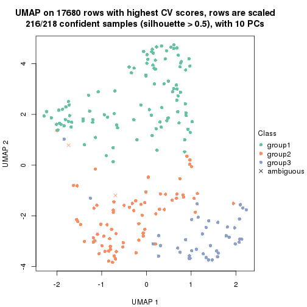</p>

</div>
<div id='tab-CV-skmeans-dimension-reduction-3'>
<pre><code class="r">dimension_reduction(res, k = 4, method = &quot;UMAP&quot;)
</code></pre>

<p></p>

</div>
<div id='tab-CV-skmeans-dimension-reduction-4'>
<pre><code class="r">dimension_reduction(res, k = 5, method = &quot;UMAP&quot;)
</code></pre>

<p></p>

</div>
<div id='tab-CV-skmeans-dimension-reduction-5'>
<pre><code class="r">dimension_reduction(res, k = 6, method = &quot;UMAP&quot;)
</code></pre>

<p></p>

</div>
</div>


Following heatmap shows how subgroups are split when increasing `k`:

```r
collect_classes(res)
```


If matrix rows can be associated to genes, consider to use `GO_Enrichment(res,
...)` to perform function enrichment for the signature genes.


 

---------------------------------------------------


### CV:pam**


The object with results only for a single top-value method and a single partition method 
can be extracted as:

```r
res = res_list["CV", "pam"]
# you can also extract it by
# res = res_list["CV:pam"]
```

A summary of `res` and all the functions that can be applied to it:

```r
res
```

```
#> A 'ConsensusPartition' object with k = 2, 3, 4, 5, 6.
#>   On a matrix with 17680 rows and 218 columns.
#>   Top rows (1000, 2000, 3000, 4000, 5000) are extracted by 'CV' method.
#>   Subgroups are detected by 'pam' method.
#>   Performed in total 1250 partitions by row resampling.
#>   Best k for subgroups seems to be 2.
#> 
#> Following methods can be applied to this 'ConsensusPartition' object:
#>  [1] "cola_report"             "collect_classes"         "collect_plots"          
#>  [4] "collect_stats"           "colnames"                "compare_signatures"     
#>  [7] "consensus_heatmap"       "dimension_reduction"     "functional_enrichment"  
#> [10] "get_anno_col"            "get_anno"                "get_classes"            
#> [13] "get_consensus"           "get_matrix"              "get_membership"         
#> [16] "get_param"               "get_signatures"          "get_stats"              
#> [19] "is_best_k"               "is_stable_k"             "membership_heatmap"     
#> [22] "ncol"                    "nrow"                    "plot_ecdf"              
#> [25] "rownames"                "select_partition_number" "show"                   
#> [28] "suggest_best_k"          "test_to_known_factors"
```

`collect_plots()` function collects all the plots made from `res` for all `k` (number of partitions)
into one single page to provide an easy and fast comparison between different `k`.

```r
collect_plots(res)
```


The plots are:

- The first row: a plot of the ECDF (Empirical cumulative distribution
  function) curves of the consensus matrix for each `k` and the heatmap of
  predicted classes for each `k`.
- The second row: heatmaps of the consensus matrix for each `k`.
- The third row: heatmaps of the membership matrix for each `k`.
- The fouth row: heatmaps of the signatures for each `k`.

All the plots in panels can be made by individual functions and they are
plotted later in this section.

`select_partition_number()` produces several plots showing different
statistics for choosing "optimized" `k`. There are following statistics:

- ECDF curves of the consensus matrix for each `k`;
- 1-PAC. [The PAC
  score](https://en.wikipedia.org/wiki/Consensus_clustering#Over-interpretation_potential_of_consensus_clustering)
  measures the proportion of the ambiguous subgrouping.
- Mean silhouette score.
- Concordance. The mean probability of fiting the consensus class ids in all
  partitions.
- Area increased. Denote $A_k$ as the area under the ECDF curve for current
  `k`, the area increased is defined as $A_k - A_{k-1}$.
- Rand index. The percent of pairs of samples that are both in a same cluster
  or both are not in a same cluster in the partition of k and k-1.
- Jaccard index. The ratio of pairs of samples are both in a same cluster in
  the partition of k and k-1 and the pairs of samples are both in a same
  cluster in the partition k or k-1.

The detailed explanations of these statistics can be found in [the cola
vignette](http://bioconductor.org/packages/devel/bioc/vignettes/cola/inst/doc/cola.html#toc_13).

Generally speaking, lower PAC score, higher mean silhouette score or higher
concordance corresponds to better partition. Rand index and Jaccard index
measure how similar the current partition is compared to partition with `k-1`.
If they are too similar, we won't accept `k` is better than `k-1`.

```r
select_partition_number(res)
```


The numeric values for all these statistics can be obtained by `get_stats()`.

```r
get_stats(res)
```

```
#>   k 1-PAC mean_silhouette concordance area_increased  Rand Jaccard
#> 2 2 1.000           0.980       0.991         0.5005 0.500   0.500
#> 3 3 0.798           0.875       0.934         0.2583 0.857   0.718
#> 4 4 0.734           0.711       0.835         0.1150 0.905   0.754
#> 5 5 0.842           0.779       0.903         0.1173 0.829   0.505
#> 6 6 0.806           0.745       0.853         0.0515 0.900   0.593
```

`suggest_best_k()` suggests the best $k$ based on these statistics. The rules are as follows:

- All $k$ with Jaccard index larger than 0.95 are removed because the increase of
  the partition number does not provides enough extra information. If all $k$ are removed,
  the best $k$ is assigned by `NA`.
- For $k$ with 1-PAC larger than 0.9, the maximal $k$ is taken as the "best k". Other $k$ is called "optional k".
- If it does not fit the second rule. The $k$ with the highest vote of highest
  1-PAC, mean silhouette and concordance is taken as the "best k".

```r
suggest_best_k(res)
```

```
#> [1] 2
```


Following shows the table of the partitions (You need to click the **show/hide
code output** link to see it). The membership matrix (columns with name `p*`)
is inferred by
[`clue::cl_consensus()`](https://www.rdocumentation.org/link/cl_consensus?package=clue)
function with the `SE` method. Basically the value in the membership matrix
represents the probability to belong to a certain group. The finall class
label for an item is determined with the group with highest probability it
belongs to.

In `get_classes()` function, the entropy is calculated from the membership
matrix and the silhouette score is calculated from the consensus matrix.


<script>
$( function() {
	$( '#tabs-CV-pam-get-classes' ).tabs();
} );
</script>
<div id='tabs-CV-pam-get-classes'>
<ul>
<li><a href='#tab-CV-pam-get-classes-1'>k = 2</a></li>
<li><a href='#tab-CV-pam-get-classes-2'>k = 3</a></li>
<li><a href='#tab-CV-pam-get-classes-3'>k = 4</a></li>
<li><a href='#tab-CV-pam-get-classes-4'>k = 5</a></li>
<li><a href='#tab-CV-pam-get-classes-5'>k = 6</a></li>
</ul>

<div id='tab-CV-pam-get-classes-1'>
<p><a id='tab-CV-pam-get-classes-1-a' style='color:#0366d6' href='#'>show/hide code output</a></p>
<pre><code class="r">cbind(get_classes(res, k = 2), get_membership(res, k = 2))
</code></pre>

<pre><code>#&gt;            class entropy silhouette    p1    p2
#&gt; SRR1498997     2   0.000      0.991 0.000 1.000
#&gt; SRR1076441     1   0.000      0.991 1.000 0.000
#&gt; SRR1489803     2   0.000      0.991 0.000 1.000
#&gt; SRR1345953     2   0.000      0.991 0.000 1.000
#&gt; SRR1357826     2   0.000      0.991 0.000 1.000
#&gt; SRR1419656     1   0.000      0.991 1.000 0.000
#&gt; SRR1454158     2   0.000      0.991 0.000 1.000
#&gt; SRR1475408     2   0.000      0.991 0.000 1.000
#&gt; SRR1472704     2   0.000      0.991 0.000 1.000
#&gt; SRR1090046     1   0.000      0.991 1.000 0.000
#&gt; SRR1312822     1   0.000      0.991 1.000 0.000
#&gt; SRR1096987     2   0.000      0.991 0.000 1.000
#&gt; SRR1334587     2   0.000      0.991 0.000 1.000
#&gt; SRR1490246     1   0.000      0.991 1.000 0.000
#&gt; SRR1467522     1   0.000      0.991 1.000 0.000
#&gt; SRR1324206     1   0.000      0.991 1.000 0.000
#&gt; SRR1408574     2   0.000      0.991 0.000 1.000
#&gt; SRR1083959     2   0.000      0.991 0.000 1.000
#&gt; SRR1079948     2   0.000      0.991 0.000 1.000
#&gt; SRR1310667     2   0.000      0.991 0.000 1.000
#&gt; SRR655852      2   0.000      0.991 0.000 1.000
#&gt; SRR1352457     2   0.000      0.991 0.000 1.000
#&gt; SRR1353994     2   0.000      0.991 0.000 1.000
#&gt; SRR1459561     2   0.000      0.991 0.000 1.000
#&gt; SRR1454009     1   0.000      0.991 1.000 0.000
#&gt; SRR1071084     1   0.000      0.991 1.000 0.000
#&gt; SRR1082859     2   0.000      0.991 0.000 1.000
#&gt; SRR1086538     1   0.000      0.991 1.000 0.000
#&gt; SRR1486262     2   0.000      0.991 0.000 1.000
#&gt; SRR658105      1   0.000      0.991 1.000 0.000
#&gt; SRR811073      2   0.000      0.991 0.000 1.000
#&gt; SRR1429181     2   0.000      0.991 0.000 1.000
#&gt; SRR1327896     2   0.000      0.991 0.000 1.000
#&gt; SRR1464788     2   0.000      0.991 0.000 1.000
#&gt; SRR1346861     2   0.000      0.991 0.000 1.000
#&gt; SRR1318774     2   0.000      0.991 0.000 1.000
#&gt; SRR1420517     1   0.000      0.991 1.000 0.000
#&gt; SRR1369584     2   0.000      0.991 0.000 1.000
#&gt; SRR1443244     2   0.917      0.502 0.332 0.668
#&gt; SRR1455391     1   0.000      0.991 1.000 0.000
#&gt; SRR1068999     1   0.000      0.991 1.000 0.000
#&gt; SRR1481297     1   0.000      0.991 1.000 0.000
#&gt; SRR1070208     1   0.000      0.991 1.000 0.000
#&gt; SRR1317282     1   0.000      0.991 1.000 0.000
#&gt; SRR1096125     2   0.000      0.991 0.000 1.000
#&gt; SRR1472506     1   0.000      0.991 1.000 0.000
#&gt; SRR1388281     2   0.000      0.991 0.000 1.000
#&gt; SRR1365622     2   0.000      0.991 0.000 1.000
#&gt; SRR662306      1   0.000      0.991 1.000 0.000
#&gt; SRR662811      1   0.000      0.991 1.000 0.000
#&gt; SRR820571      1   0.000      0.991 1.000 0.000
#&gt; SRR1357166     1   0.000      0.991 1.000 0.000
#&gt; SRR1488586     1   0.000      0.991 1.000 0.000
#&gt; SRR1485398     1   0.000      0.991 1.000 0.000
#&gt; SRR1417725     2   0.000      0.991 0.000 1.000
#&gt; SRR1409397     2   0.000      0.991 0.000 1.000
#&gt; SRR1465693     2   0.000      0.991 0.000 1.000
#&gt; SRR1096547     1   0.000      0.991 1.000 0.000
#&gt; SRR1456818     1   0.000      0.991 1.000 0.000
#&gt; SRR816336      1   0.000      0.991 1.000 0.000
#&gt; SRR1420238     1   0.000      0.991 1.000 0.000
#&gt; SRR1433374     1   0.000      0.991 1.000 0.000
#&gt; SRR1436990     1   0.000      0.991 1.000 0.000
#&gt; SRR662378      1   0.000      0.991 1.000 0.000
#&gt; SRR1477671     1   0.000      0.991 1.000 0.000
#&gt; SRR1084079     2   0.605      0.823 0.148 0.852
#&gt; SRR1102949     1   0.000      0.991 1.000 0.000
#&gt; SRR1458090     1   0.000      0.991 1.000 0.000
#&gt; SRR1418729     2   0.000      0.991 0.000 1.000
#&gt; SRR1403814     2   0.000      0.991 0.000 1.000
#&gt; SRR1404887     2   0.925      0.484 0.340 0.660
#&gt; SRR1434955     1   0.000      0.991 1.000 0.000
#&gt; SRR1360652     1   0.000      0.991 1.000 0.000
#&gt; SRR1356765     2   0.000      0.991 0.000 1.000
#&gt; SRR1078258     2   0.000      0.991 0.000 1.000
#&gt; SRR1455861     1   0.000      0.991 1.000 0.000
#&gt; SRR1420296     2   0.000      0.991 0.000 1.000
#&gt; SRR1070260     2   0.000      0.991 0.000 1.000
#&gt; SRR1410765     1   0.000      0.991 1.000 0.000
#&gt; SRR1481315     1   0.000      0.991 1.000 0.000
#&gt; SRR1414661     2   0.000      0.991 0.000 1.000
#&gt; SRR1359147     2   0.000      0.991 0.000 1.000
#&gt; SRR1488694     1   0.706      0.765 0.808 0.192
#&gt; SRR1477273     1   0.000      0.991 1.000 0.000
#&gt; SRR1415792     1   0.000      0.991 1.000 0.000
#&gt; SRR1369088     2   0.506      0.871 0.112 0.888
#&gt; SRR1406621     2   0.000      0.991 0.000 1.000
#&gt; SRR1401017     2   0.000      0.991 0.000 1.000
#&gt; SRR1099981     2   0.000      0.991 0.000 1.000
#&gt; SRR815208      2   0.000      0.991 0.000 1.000
#&gt; SRR1380460     2   0.000      0.991 0.000 1.000
#&gt; SRR1091097     2   0.000      0.991 0.000 1.000
#&gt; SRR1456010     1   0.000      0.991 1.000 0.000
#&gt; SRR1498416     2   0.000      0.991 0.000 1.000
#&gt; SRR818873      2   0.000      0.991 0.000 1.000
#&gt; SRR813868      2   0.000      0.991 0.000 1.000
#&gt; SRR1394912     1   0.000      0.991 1.000 0.000
#&gt; SRR1475824     2   0.000      0.991 0.000 1.000
#&gt; SRR1459866     1   0.000      0.991 1.000 0.000
#&gt; SRR1364871     1   0.714      0.759 0.804 0.196
#&gt; SRR1100472     2   0.000      0.991 0.000 1.000
#&gt; SRR1331267     1   0.000      0.991 1.000 0.000
#&gt; SRR1068977     2   0.000      0.991 0.000 1.000
#&gt; SRR1391511     2   0.000      0.991 0.000 1.000
#&gt; SRR1077920     2   0.000      0.991 0.000 1.000
#&gt; SRR1457705     1   0.000      0.991 1.000 0.000
#&gt; SRR1437073     1   0.000      0.991 1.000 0.000
#&gt; SRR1473124     1   0.000      0.991 1.000 0.000
#&gt; SRR1469279     1   0.000      0.991 1.000 0.000
#&gt; SRR1091791     2   0.000      0.991 0.000 1.000
#&gt; SRR1341539     2   0.000      0.991 0.000 1.000
#&gt; SRR1446354     1   0.000      0.991 1.000 0.000
#&gt; SRR1415420     1   0.000      0.991 1.000 0.000
#&gt; SRR1368050     1   0.000      0.991 1.000 0.000
#&gt; SRR656970      2   0.000      0.991 0.000 1.000
#&gt; SRR1473403     2   0.000      0.991 0.000 1.000
#&gt; SRR1084674     1   0.000      0.991 1.000 0.000
#&gt; SRR1464702     1   0.000      0.991 1.000 0.000
#&gt; SRR1074860     2   0.000      0.991 0.000 1.000
#&gt; SRR655447      2   0.000      0.991 0.000 1.000
#&gt; SRR1404442     2   0.000      0.991 0.000 1.000
#&gt; SRR1418795     1   0.000      0.991 1.000 0.000
#&gt; SRR1458335     2   0.000      0.991 0.000 1.000
#&gt; SRR1489589     2   0.000      0.991 0.000 1.000
#&gt; SRR1378284     1   0.000      0.991 1.000 0.000
#&gt; SRR1408014     2   0.000      0.991 0.000 1.000
#&gt; SRR1083052     1   0.000      0.991 1.000 0.000
#&gt; SRR1339236     2   0.311      0.936 0.056 0.944
#&gt; SRR1323829     2   0.000      0.991 0.000 1.000
#&gt; SRR1086772     2   0.000      0.991 0.000 1.000
#&gt; SRR1486457     1   0.000      0.991 1.000 0.000
#&gt; SRR1415257     2   0.000      0.991 0.000 1.000
#&gt; SRR1071905     1   0.000      0.991 1.000 0.000
#&gt; SRR659223      2   0.000      0.991 0.000 1.000
#&gt; SRR1386945     1   0.000      0.991 1.000 0.000
#&gt; SRR821498      2   0.000      0.991 0.000 1.000
#&gt; SRR1378903     2   0.000      0.991 0.000 1.000
#&gt; SRR1472907     1   0.000      0.991 1.000 0.000
#&gt; SRR1442313     2   0.000      0.991 0.000 1.000
#&gt; SRR1077139     2   0.000      0.991 0.000 1.000
#&gt; SRR1342758     1   0.000      0.991 1.000 0.000
#&gt; SRR656911      2   0.000      0.991 0.000 1.000
#&gt; SRR1070738     1   0.000      0.991 1.000 0.000
#&gt; SRR1476950     1   0.000      0.991 1.000 0.000
#&gt; SRR1488196     1   0.000      0.991 1.000 0.000
#&gt; SRR1498951     1   0.000      0.991 1.000 0.000
#&gt; SRR1413392     1   0.000      0.991 1.000 0.000
#&gt; SRR657528      2   0.000      0.991 0.000 1.000
#&gt; SRR812198      1   0.000      0.991 1.000 0.000
#&gt; SRR660283      2   0.000      0.991 0.000 1.000
#&gt; SRR1420936     1   0.000      0.991 1.000 0.000
#&gt; SRR1469547     2   0.000      0.991 0.000 1.000
#&gt; SRR1322249     1   0.000      0.991 1.000 0.000
#&gt; SRR1396682     1   0.000      0.991 1.000 0.000
#&gt; SRR1095816     2   0.000      0.991 0.000 1.000
#&gt; SRR1081023     1   0.000      0.991 1.000 0.000
#&gt; SRR1092517     2   0.000      0.991 0.000 1.000
#&gt; SRR811285      2   0.000      0.991 0.000 1.000
#&gt; SRR657018      1   0.000      0.991 1.000 0.000
#&gt; SRR1365534     1   0.000      0.991 1.000 0.000
#&gt; SRR1090791     2   0.000      0.991 0.000 1.000
#&gt; SRR1439915     2   0.000      0.991 0.000 1.000
#&gt; SRR1391575     2   0.000      0.991 0.000 1.000
#&gt; SRR1314092     2   0.000      0.991 0.000 1.000
#&gt; SRR1328941     1   0.000      0.991 1.000 0.000
#&gt; SRR1336181     2   0.000      0.991 0.000 1.000
#&gt; SRR1362972     1   0.000      0.991 1.000 0.000
#&gt; SRR1366790     2   0.000      0.991 0.000 1.000
#&gt; SRR1455902     1   0.000      0.991 1.000 0.000
#&gt; SRR1437644     1   0.855      0.618 0.720 0.280
#&gt; SRR1105009     2   0.000      0.991 0.000 1.000
#&gt; SRR1367024     1   0.000      0.991 1.000 0.000
#&gt; SRR660248      2   0.000      0.991 0.000 1.000
#&gt; SRR1409620     1   0.000      0.991 1.000 0.000
#&gt; SRR1455807     2   0.000      0.991 0.000 1.000
#&gt; SRR1339431     1   0.000      0.991 1.000 0.000
#&gt; SRR1378948     1   0.714      0.759 0.804 0.196
#&gt; SRR1469237     1   0.000      0.991 1.000 0.000
#&gt; SRR1098264     2   0.000      0.991 0.000 1.000
#&gt; SRR1406224     2   0.000      0.991 0.000 1.000
#&gt; SRR1393026     1   0.000      0.991 1.000 0.000
#&gt; SRR808428      2   0.000      0.991 0.000 1.000
#&gt; SRR615910      2   0.000      0.991 0.000 1.000
#&gt; SRR1076219     1   0.000      0.991 1.000 0.000
#&gt; SRR1481128     1   0.000      0.991 1.000 0.000
#&gt; SRR1359262     2   0.000      0.991 0.000 1.000
#&gt; SRR1407648     2   0.000      0.991 0.000 1.000
#&gt; SRR1386775     1   0.373      0.918 0.928 0.072
#&gt; SRR1388399     1   0.000      0.991 1.000 0.000
#&gt; SRR1361499     2   0.000      0.991 0.000 1.000
#&gt; SRR1500709     2   0.000      0.991 0.000 1.000
#&gt; SRR1335917     1   0.000      0.991 1.000 0.000
#&gt; SRR1430615     2   0.000      0.991 0.000 1.000
#&gt; SRR1335212     1   0.000      0.991 1.000 0.000
#&gt; SRR1400159     2   0.000      0.991 0.000 1.000
#&gt; SRR1457245     2   0.000      0.991 0.000 1.000
#&gt; SRR1356746     2   0.000      0.991 0.000 1.000
#&gt; SRR658319      2   0.000      0.991 0.000 1.000
#&gt; SRR1435946     1   0.000      0.991 1.000 0.000
#&gt; SRR1370308     1   0.000      0.991 1.000 0.000
#&gt; SRR1100893     1   0.000      0.991 1.000 0.000
#&gt; SRR1389432     1   0.000      0.991 1.000 0.000
#&gt; SRR1381799     2   0.000      0.991 0.000 1.000
#&gt; SRR1310158     1   0.000      0.991 1.000 0.000
#&gt; SRR1341100     2   0.000      0.991 0.000 1.000
#&gt; SRR1342873     1   0.000      0.991 1.000 0.000
#&gt; SRR1472102     2   0.000      0.991 0.000 1.000
#&gt; SRR1409421     1   0.000      0.991 1.000 0.000
#&gt; SRR1328577     2   0.000      0.991 0.000 1.000
#&gt; SRR808942      2   0.000      0.991 0.000 1.000
#&gt; SRR1343818     2   0.000      0.991 0.000 1.000
#&gt; SRR1472415     2   0.000      0.991 0.000 1.000
#&gt; SRR658409      2   0.000      0.991 0.000 1.000
#&gt; SRR1469681     1   0.000      0.991 1.000 0.000
#&gt; SRR1075484     2   0.000      0.991 0.000 1.000
#&gt; SRR1417894     1   0.000      0.991 1.000 0.000
#&gt; SRR1417422     2   0.000      0.991 0.000 1.000
#&gt; SRR1090674     1   0.000      0.991 1.000 0.000
</code></pre>

<script>
$('#tab-CV-pam-get-classes-1-a').parent().next().next().hide();
$('#tab-CV-pam-get-classes-1-a').click(function(){
  $('#tab-CV-pam-get-classes-1-a').parent().next().next().toggle();
  return(false);
});
</script>
</div>

<div id='tab-CV-pam-get-classes-2'>
<p><a id='tab-CV-pam-get-classes-2-a' style='color:#0366d6' href='#'>show/hide code output</a></p>
<pre><code class="r">cbind(get_classes(res, k = 3), get_membership(res, k = 3))
</code></pre>

<pre><code>#&gt;            class entropy silhouette    p1    p2    p3
#&gt; SRR1498997     2  0.0000      0.891 0.000 1.000 0.000
#&gt; SRR1076441     1  0.0000      0.961 1.000 0.000 0.000
#&gt; SRR1489803     3  0.2448      0.865 0.000 0.076 0.924
#&gt; SRR1345953     2  0.0000      0.891 0.000 1.000 0.000
#&gt; SRR1357826     2  0.0000      0.891 0.000 1.000 0.000
#&gt; SRR1419656     1  0.0000      0.961 1.000 0.000 0.000
#&gt; SRR1454158     2  0.3686      0.886 0.000 0.860 0.140
#&gt; SRR1475408     3  0.6307     -0.111 0.000 0.488 0.512
#&gt; SRR1472704     2  0.0000      0.891 0.000 1.000 0.000
#&gt; SRR1090046     1  0.3551      0.847 0.868 0.000 0.132
#&gt; SRR1312822     1  0.0000      0.961 1.000 0.000 0.000
#&gt; SRR1096987     2  0.3686      0.886 0.000 0.860 0.140
#&gt; SRR1334587     3  0.0000      0.877 0.000 0.000 1.000
#&gt; SRR1490246     1  0.0000      0.961 1.000 0.000 0.000
#&gt; SRR1467522     1  0.0000      0.961 1.000 0.000 0.000
#&gt; SRR1324206     1  0.0000      0.961 1.000 0.000 0.000
#&gt; SRR1408574     3  0.0000      0.877 0.000 0.000 1.000
#&gt; SRR1083959     2  0.0000      0.891 0.000 1.000 0.000
#&gt; SRR1079948     2  0.3686      0.886 0.000 0.860 0.140
#&gt; SRR1310667     3  0.3686      0.829 0.000 0.140 0.860
#&gt; SRR655852      2  0.3686      0.886 0.000 0.860 0.140
#&gt; SRR1352457     3  0.2625      0.861 0.000 0.084 0.916
#&gt; SRR1353994     2  0.0000      0.891 0.000 1.000 0.000
#&gt; SRR1459561     3  0.3686      0.829 0.000 0.140 0.860
#&gt; SRR1454009     1  0.0237      0.959 0.996 0.000 0.004
#&gt; SRR1071084     1  0.0237      0.959 0.996 0.000 0.004
#&gt; SRR1082859     2  0.0000      0.891 0.000 1.000 0.000
#&gt; SRR1086538     1  0.0000      0.961 1.000 0.000 0.000
#&gt; SRR1486262     2  0.3686      0.886 0.000 0.860 0.140
#&gt; SRR658105      1  0.0000      0.961 1.000 0.000 0.000
#&gt; SRR811073      2  0.0000      0.891 0.000 1.000 0.000
#&gt; SRR1429181     3  0.6045      0.307 0.000 0.380 0.620
#&gt; SRR1327896     2  0.2711      0.897 0.000 0.912 0.088
#&gt; SRR1464788     3  0.0000      0.877 0.000 0.000 1.000
#&gt; SRR1346861     2  0.0000      0.891 0.000 1.000 0.000
#&gt; SRR1318774     2  0.0000      0.891 0.000 1.000 0.000
#&gt; SRR1420517     1  0.0592      0.954 0.988 0.000 0.012
#&gt; SRR1369584     3  0.3686      0.829 0.000 0.140 0.860
#&gt; SRR1443244     1  0.8137      0.531 0.640 0.220 0.140
#&gt; SRR1455391     1  0.0000      0.961 1.000 0.000 0.000
#&gt; SRR1068999     1  0.0000      0.961 1.000 0.000 0.000
#&gt; SRR1481297     1  0.0000      0.961 1.000 0.000 0.000
#&gt; SRR1070208     1  0.0000      0.961 1.000 0.000 0.000
#&gt; SRR1317282     1  0.1031      0.946 0.976 0.000 0.024
#&gt; SRR1096125     2  0.3340      0.892 0.000 0.880 0.120
#&gt; SRR1472506     1  0.3686      0.838 0.860 0.000 0.140
#&gt; SRR1388281     2  0.2356      0.897 0.000 0.928 0.072
#&gt; SRR1365622     3  0.3816      0.760 0.000 0.148 0.852
#&gt; SRR662306      1  0.0000      0.961 1.000 0.000 0.000
#&gt; SRR662811      1  0.0000      0.961 1.000 0.000 0.000
#&gt; SRR820571      1  0.4002      0.819 0.840 0.000 0.160
#&gt; SRR1357166     1  0.0000      0.961 1.000 0.000 0.000
#&gt; SRR1488586     1  0.3412      0.855 0.876 0.000 0.124
#&gt; SRR1485398     1  0.0000      0.961 1.000 0.000 0.000
#&gt; SRR1417725     2  0.3686      0.886 0.000 0.860 0.140
#&gt; SRR1409397     3  0.0237      0.877 0.000 0.004 0.996
#&gt; SRR1465693     3  0.2448      0.865 0.000 0.076 0.924
#&gt; SRR1096547     1  0.3686      0.838 0.860 0.000 0.140
#&gt; SRR1456818     1  0.0000      0.961 1.000 0.000 0.000
#&gt; SRR816336      1  0.1163      0.943 0.972 0.000 0.028
#&gt; SRR1420238     1  0.0000      0.961 1.000 0.000 0.000
#&gt; SRR1433374     1  0.0747      0.951 0.984 0.000 0.016
#&gt; SRR1436990     1  0.0000      0.961 1.000 0.000 0.000
#&gt; SRR662378      1  0.0000      0.961 1.000 0.000 0.000
#&gt; SRR1477671     1  0.0000      0.961 1.000 0.000 0.000
#&gt; SRR1084079     2  0.7702      0.631 0.180 0.680 0.140
#&gt; SRR1102949     1  0.0000      0.961 1.000 0.000 0.000
#&gt; SRR1458090     1  0.0000      0.961 1.000 0.000 0.000
#&gt; SRR1418729     2  0.3686      0.886 0.000 0.860 0.140
#&gt; SRR1403814     2  0.3686      0.886 0.000 0.860 0.140
#&gt; SRR1404887     1  0.8137      0.531 0.640 0.220 0.140
#&gt; SRR1434955     1  0.0000      0.961 1.000 0.000 0.000
#&gt; SRR1360652     1  0.0000      0.961 1.000 0.000 0.000
#&gt; SRR1356765     3  0.1643      0.855 0.000 0.044 0.956
#&gt; SRR1078258     2  0.2711      0.897 0.000 0.912 0.088
#&gt; SRR1455861     1  0.0000      0.961 1.000 0.000 0.000
#&gt; SRR1420296     3  0.1529      0.874 0.000 0.040 0.960
#&gt; SRR1070260     2  0.0000      0.891 0.000 1.000 0.000
#&gt; SRR1410765     1  0.0000      0.961 1.000 0.000 0.000
#&gt; SRR1481315     1  0.2537      0.895 0.920 0.000 0.080
#&gt; SRR1414661     2  0.0000      0.891 0.000 1.000 0.000
#&gt; SRR1359147     2  0.3686      0.886 0.000 0.860 0.140
#&gt; SRR1488694     1  0.7104      0.671 0.724 0.136 0.140
#&gt; SRR1477273     1  0.1643      0.931 0.956 0.000 0.044
#&gt; SRR1415792     1  0.0000      0.961 1.000 0.000 0.000
#&gt; SRR1369088     3  0.6045      0.307 0.000 0.380 0.620
#&gt; SRR1406621     3  0.2796      0.820 0.000 0.092 0.908
#&gt; SRR1401017     3  0.0000      0.877 0.000 0.000 1.000
#&gt; SRR1099981     3  0.0000      0.877 0.000 0.000 1.000
#&gt; SRR815208      2  0.0000      0.891 0.000 1.000 0.000
#&gt; SRR1380460     2  0.0237      0.891 0.000 0.996 0.004
#&gt; SRR1091097     2  0.3686      0.886 0.000 0.860 0.140
#&gt; SRR1456010     1  0.0000      0.961 1.000 0.000 0.000
#&gt; SRR1498416     2  0.1163      0.895 0.000 0.972 0.028
#&gt; SRR818873      3  0.0000      0.877 0.000 0.000 1.000
#&gt; SRR813868      2  0.3686      0.886 0.000 0.860 0.140
#&gt; SRR1394912     1  0.0000      0.961 1.000 0.000 0.000
#&gt; SRR1475824     2  0.3686      0.886 0.000 0.860 0.140
#&gt; SRR1459866     1  0.0000      0.961 1.000 0.000 0.000
#&gt; SRR1364871     1  0.7164      0.665 0.720 0.140 0.140
#&gt; SRR1100472     2  0.0000      0.891 0.000 1.000 0.000
#&gt; SRR1331267     1  0.3686      0.838 0.860 0.000 0.140
#&gt; SRR1068977     2  0.6291      0.251 0.000 0.532 0.468
#&gt; SRR1391511     2  0.0000      0.891 0.000 1.000 0.000
#&gt; SRR1077920     2  0.0000      0.891 0.000 1.000 0.000
#&gt; SRR1457705     1  0.0000      0.961 1.000 0.000 0.000
#&gt; SRR1437073     1  0.0000      0.961 1.000 0.000 0.000
#&gt; SRR1473124     1  0.0237      0.959 0.996 0.000 0.004
#&gt; SRR1469279     1  0.0000      0.961 1.000 0.000 0.000
#&gt; SRR1091791     2  0.3686      0.886 0.000 0.860 0.140
#&gt; SRR1341539     3  0.0000      0.877 0.000 0.000 1.000
#&gt; SRR1446354     1  0.0000      0.961 1.000 0.000 0.000
#&gt; SRR1415420     1  0.0000      0.961 1.000 0.000 0.000
#&gt; SRR1368050     1  0.0000      0.961 1.000 0.000 0.000
#&gt; SRR656970      3  0.3686      0.829 0.000 0.140 0.860
#&gt; SRR1473403     2  0.2625      0.897 0.000 0.916 0.084
#&gt; SRR1084674     1  0.0237      0.959 0.996 0.000 0.004
#&gt; SRR1464702     1  0.0000      0.961 1.000 0.000 0.000
#&gt; SRR1074860     2  0.3686      0.886 0.000 0.860 0.140
#&gt; SRR655447      2  0.3619      0.887 0.000 0.864 0.136
#&gt; SRR1404442     2  0.0000      0.891 0.000 1.000 0.000
#&gt; SRR1418795     1  0.0000      0.961 1.000 0.000 0.000
#&gt; SRR1458335     2  0.3192      0.894 0.000 0.888 0.112
#&gt; SRR1489589     3  0.0000      0.877 0.000 0.000 1.000
#&gt; SRR1378284     1  0.4555      0.765 0.800 0.000 0.200
#&gt; SRR1408014     3  0.2448      0.865 0.000 0.076 0.924
#&gt; SRR1083052     1  0.0000      0.961 1.000 0.000 0.000
#&gt; SRR1339236     3  0.0000      0.877 0.000 0.000 1.000
#&gt; SRR1323829     3  0.3686      0.829 0.000 0.140 0.860
#&gt; SRR1086772     2  0.0000      0.891 0.000 1.000 0.000
#&gt; SRR1486457     1  0.1163      0.943 0.972 0.000 0.028
#&gt; SRR1415257     3  0.0237      0.877 0.000 0.004 0.996
#&gt; SRR1071905     1  0.0000      0.961 1.000 0.000 0.000
#&gt; SRR659223      3  0.3686      0.829 0.000 0.140 0.860
#&gt; SRR1386945     1  0.0000      0.961 1.000 0.000 0.000
#&gt; SRR821498      2  0.3686      0.886 0.000 0.860 0.140
#&gt; SRR1378903     2  0.3686      0.886 0.000 0.860 0.140
#&gt; SRR1472907     1  0.0000      0.961 1.000 0.000 0.000
#&gt; SRR1442313     2  0.0000      0.891 0.000 1.000 0.000
#&gt; SRR1077139     3  0.3686      0.829 0.000 0.140 0.860
#&gt; SRR1342758     1  0.0000      0.961 1.000 0.000 0.000
#&gt; SRR656911      2  0.2711      0.897 0.000 0.912 0.088
#&gt; SRR1070738     1  0.0000      0.961 1.000 0.000 0.000
#&gt; SRR1476950     1  0.0000      0.961 1.000 0.000 0.000
#&gt; SRR1488196     1  0.1860      0.924 0.948 0.000 0.052
#&gt; SRR1498951     1  0.0000      0.961 1.000 0.000 0.000
#&gt; SRR1413392     1  0.0000      0.961 1.000 0.000 0.000
#&gt; SRR657528      3  0.5859      0.441 0.000 0.344 0.656
#&gt; SRR812198      1  0.0000      0.961 1.000 0.000 0.000
#&gt; SRR660283      2  0.0000      0.891 0.000 1.000 0.000
#&gt; SRR1420936     1  0.0000      0.961 1.000 0.000 0.000
#&gt; SRR1469547     2  0.5810      0.328 0.000 0.664 0.336
#&gt; SRR1322249     1  0.0000      0.961 1.000 0.000 0.000
#&gt; SRR1396682     1  0.0000      0.961 1.000 0.000 0.000
#&gt; SRR1095816     2  0.3686      0.886 0.000 0.860 0.140
#&gt; SRR1081023     1  0.0000      0.961 1.000 0.000 0.000
#&gt; SRR1092517     2  0.3686      0.886 0.000 0.860 0.140
#&gt; SRR811285      3  0.0000      0.877 0.000 0.000 1.000
#&gt; SRR657018      1  0.0000      0.961 1.000 0.000 0.000
#&gt; SRR1365534     1  0.0000      0.961 1.000 0.000 0.000
#&gt; SRR1090791     3  0.0592      0.877 0.000 0.012 0.988
#&gt; SRR1439915     3  0.0000      0.877 0.000 0.000 1.000
#&gt; SRR1391575     2  0.3686      0.886 0.000 0.860 0.140
#&gt; SRR1314092     2  0.3340      0.891 0.000 0.880 0.120
#&gt; SRR1328941     1  0.1529      0.934 0.960 0.000 0.040
#&gt; SRR1336181     2  0.0000      0.891 0.000 1.000 0.000
#&gt; SRR1362972     1  0.0000      0.961 1.000 0.000 0.000
#&gt; SRR1366790     2  0.3116      0.894 0.000 0.892 0.108
#&gt; SRR1455902     1  0.0000      0.961 1.000 0.000 0.000
#&gt; SRR1437644     1  0.8017      0.553 0.652 0.208 0.140
#&gt; SRR1105009     2  0.0000      0.891 0.000 1.000 0.000
#&gt; SRR1367024     1  0.0000      0.961 1.000 0.000 0.000
#&gt; SRR660248      2  0.3686      0.886 0.000 0.860 0.140
#&gt; SRR1409620     1  0.0000      0.961 1.000 0.000 0.000
#&gt; SRR1455807     2  0.1163      0.872 0.000 0.972 0.028
#&gt; SRR1339431     1  0.0000      0.961 1.000 0.000 0.000
#&gt; SRR1378948     1  0.7164      0.665 0.720 0.140 0.140
#&gt; SRR1469237     1  0.0000      0.961 1.000 0.000 0.000
#&gt; SRR1098264     2  0.0237      0.891 0.000 0.996 0.004
#&gt; SRR1406224     2  0.5810      0.609 0.000 0.664 0.336
#&gt; SRR1393026     1  0.0237      0.959 0.996 0.000 0.004
#&gt; SRR808428      2  0.0000      0.891 0.000 1.000 0.000
#&gt; SRR615910      3  0.2066      0.870 0.000 0.060 0.940
#&gt; SRR1076219     1  0.0000      0.961 1.000 0.000 0.000
#&gt; SRR1481128     1  0.0000      0.961 1.000 0.000 0.000
#&gt; SRR1359262     3  0.3686      0.829 0.000 0.140 0.860
#&gt; SRR1407648     2  0.2711      0.897 0.000 0.912 0.088
#&gt; SRR1386775     1  0.5267      0.792 0.816 0.044 0.140
#&gt; SRR1388399     1  0.5363      0.665 0.724 0.000 0.276
#&gt; SRR1361499     2  0.0000      0.891 0.000 1.000 0.000
#&gt; SRR1500709     2  0.2796      0.897 0.000 0.908 0.092
#&gt; SRR1335917     1  0.0000      0.961 1.000 0.000 0.000
#&gt; SRR1430615     3  0.2448      0.865 0.000 0.076 0.924
#&gt; SRR1335212     1  0.0237      0.959 0.996 0.000 0.004
#&gt; SRR1400159     3  0.6045      0.307 0.000 0.380 0.620
#&gt; SRR1457245     2  0.0000      0.891 0.000 1.000 0.000
#&gt; SRR1356746     2  0.6095      0.159 0.000 0.608 0.392
#&gt; SRR658319      2  0.0237      0.891 0.000 0.996 0.004
#&gt; SRR1435946     1  0.0000      0.961 1.000 0.000 0.000
#&gt; SRR1370308     1  0.0000      0.961 1.000 0.000 0.000
#&gt; SRR1100893     1  0.0000      0.961 1.000 0.000 0.000
#&gt; SRR1389432     1  0.0000      0.961 1.000 0.000 0.000
#&gt; SRR1381799     2  0.1529      0.896 0.000 0.960 0.040
#&gt; SRR1310158     1  0.1163      0.943 0.972 0.000 0.028
#&gt; SRR1341100     2  0.3686      0.886 0.000 0.860 0.140
#&gt; SRR1342873     1  0.0000      0.961 1.000 0.000 0.000
#&gt; SRR1472102     3  0.0000      0.877 0.000 0.000 1.000
#&gt; SRR1409421     1  0.0000      0.961 1.000 0.000 0.000
#&gt; SRR1328577     2  0.3551      0.889 0.000 0.868 0.132
#&gt; SRR808942      2  0.2448      0.897 0.000 0.924 0.076
#&gt; SRR1343818     2  0.3619      0.887 0.000 0.864 0.136
#&gt; SRR1472415     2  0.0000      0.891 0.000 1.000 0.000
#&gt; SRR658409      2  0.3686      0.886 0.000 0.860 0.140
#&gt; SRR1469681     1  0.0000      0.961 1.000 0.000 0.000
#&gt; SRR1075484     3  0.0237      0.875 0.000 0.004 0.996
#&gt; SRR1417894     1  0.0592      0.954 0.988 0.000 0.012
#&gt; SRR1417422     3  0.3879      0.770 0.000 0.152 0.848
#&gt; SRR1090674     1  0.0000      0.961 1.000 0.000 0.000
</code></pre>

<script>
$('#tab-CV-pam-get-classes-2-a').parent().next().next().hide();
$('#tab-CV-pam-get-classes-2-a').click(function(){
  $('#tab-CV-pam-get-classes-2-a').parent().next().next().toggle();
  return(false);
});
</script>
</div>

<div id='tab-CV-pam-get-classes-3'>
<p><a id='tab-CV-pam-get-classes-3-a' style='color:#0366d6' href='#'>show/hide code output</a></p>
<pre><code class="r">cbind(get_classes(res, k = 4), get_membership(res, k = 4))
</code></pre>

<pre><code>#&gt;            class entropy silhouette    p1    p2    p3    p4
#&gt; SRR1498997     3  0.0592    0.71455 0.000 0.000 0.984 0.016
#&gt; SRR1076441     1  0.0000    0.89201 1.000 0.000 0.000 0.000
#&gt; SRR1489803     2  0.0188    0.93069 0.000 0.996 0.004 0.000
#&gt; SRR1345953     3  0.4790    0.35615 0.000 0.000 0.620 0.380
#&gt; SRR1357826     3  0.0000    0.72162 0.000 0.000 1.000 0.000
#&gt; SRR1419656     1  0.0707    0.88791 0.980 0.000 0.000 0.020
#&gt; SRR1454158     4  0.4193    0.73490 0.000 0.000 0.268 0.732
#&gt; SRR1475408     4  0.7509    0.30234 0.000 0.360 0.188 0.452
#&gt; SRR1472704     3  0.0000    0.72162 0.000 0.000 1.000 0.000
#&gt; SRR1090046     1  0.5050    0.64890 0.588 0.004 0.000 0.408
#&gt; SRR1312822     1  0.0000    0.89201 1.000 0.000 0.000 0.000
#&gt; SRR1096987     4  0.4103    0.73664 0.000 0.000 0.256 0.744
#&gt; SRR1334587     2  0.0188    0.93011 0.000 0.996 0.000 0.004
#&gt; SRR1490246     1  0.0000    0.89201 1.000 0.000 0.000 0.000
#&gt; SRR1467522     1  0.0188    0.89128 0.996 0.000 0.000 0.004
#&gt; SRR1324206     1  0.0000    0.89201 1.000 0.000 0.000 0.000
#&gt; SRR1408574     2  0.0336    0.92825 0.000 0.992 0.000 0.008
#&gt; SRR1083959     3  0.0188    0.72010 0.000 0.000 0.996 0.004
#&gt; SRR1079948     4  0.4193    0.73490 0.000 0.000 0.268 0.732
#&gt; SRR1310667     2  0.0188    0.93069 0.000 0.996 0.004 0.000
#&gt; SRR655852      4  0.4193    0.73490 0.000 0.000 0.268 0.732
#&gt; SRR1352457     2  0.0188    0.93069 0.000 0.996 0.004 0.000
#&gt; SRR1353994     3  0.4790    0.35615 0.000 0.000 0.620 0.380
#&gt; SRR1459561     2  0.0188    0.93069 0.000 0.996 0.004 0.000
#&gt; SRR1454009     1  0.4220    0.80667 0.748 0.004 0.000 0.248
#&gt; SRR1071084     1  0.4252    0.80483 0.744 0.004 0.000 0.252
#&gt; SRR1082859     3  0.0000    0.72162 0.000 0.000 1.000 0.000
#&gt; SRR1086538     1  0.1867    0.87217 0.928 0.000 0.000 0.072
#&gt; SRR1486262     4  0.4193    0.73490 0.000 0.000 0.268 0.732
#&gt; SRR658105      1  0.0000    0.89201 1.000 0.000 0.000 0.000
#&gt; SRR811073      3  0.0000    0.72162 0.000 0.000 1.000 0.000
#&gt; SRR1429181     2  0.7048    0.28993 0.000 0.556 0.160 0.284
#&gt; SRR1327896     3  0.4996    0.03177 0.000 0.000 0.516 0.484
#&gt; SRR1464788     2  0.0188    0.93011 0.000 0.996 0.000 0.004
#&gt; SRR1346861     3  0.0000    0.72162 0.000 0.000 1.000 0.000
#&gt; SRR1318774     3  0.4790    0.35615 0.000 0.000 0.620 0.380
#&gt; SRR1420517     1  0.3219    0.84561 0.836 0.000 0.000 0.164
#&gt; SRR1369584     2  0.0188    0.93069 0.000 0.996 0.004 0.000
#&gt; SRR1443244     4  0.5229    0.62854 0.084 0.000 0.168 0.748
#&gt; SRR1455391     1  0.4220    0.80686 0.748 0.004 0.000 0.248
#&gt; SRR1068999     1  0.0000    0.89201 1.000 0.000 0.000 0.000
#&gt; SRR1481297     1  0.1474    0.88023 0.948 0.000 0.000 0.052
#&gt; SRR1070208     1  0.0000    0.89201 1.000 0.000 0.000 0.000
#&gt; SRR1317282     1  0.4401    0.79282 0.724 0.004 0.000 0.272
#&gt; SRR1096125     4  0.4989    0.12938 0.000 0.000 0.472 0.528
#&gt; SRR1472506     4  0.5151   -0.31628 0.464 0.000 0.004 0.532
#&gt; SRR1388281     3  0.5292    0.03030 0.000 0.008 0.512 0.480
#&gt; SRR1365622     2  0.6338    0.40570 0.000 0.600 0.084 0.316
#&gt; SRR662306      1  0.4252    0.80483 0.744 0.004 0.000 0.252
#&gt; SRR662811      1  0.0000    0.89201 1.000 0.000 0.000 0.000
#&gt; SRR820571      1  0.3539    0.77916 0.820 0.004 0.000 0.176
#&gt; SRR1357166     1  0.4252    0.80483 0.744 0.004 0.000 0.252
#&gt; SRR1488586     1  0.5392    0.38407 0.528 0.000 0.012 0.460
#&gt; SRR1485398     1  0.0000    0.89201 1.000 0.000 0.000 0.000
#&gt; SRR1417725     4  0.2921    0.60222 0.000 0.000 0.140 0.860
#&gt; SRR1409397     2  0.0188    0.93069 0.000 0.996 0.004 0.000
#&gt; SRR1465693     2  0.0188    0.93069 0.000 0.996 0.004 0.000
#&gt; SRR1096547     4  0.4964   -0.23939 0.380 0.004 0.000 0.616
#&gt; SRR1456818     1  0.0000    0.89201 1.000 0.000 0.000 0.000
#&gt; SRR816336      1  0.3710    0.83298 0.804 0.004 0.000 0.192
#&gt; SRR1420238     1  0.0000    0.89201 1.000 0.000 0.000 0.000
#&gt; SRR1433374     1  0.4313    0.80031 0.736 0.004 0.000 0.260
#&gt; SRR1436990     1  0.0000    0.89201 1.000 0.000 0.000 0.000
#&gt; SRR662378      1  0.0000    0.89201 1.000 0.000 0.000 0.000
#&gt; SRR1477671     1  0.0000    0.89201 1.000 0.000 0.000 0.000
#&gt; SRR1084079     4  0.4502    0.72086 0.016 0.000 0.236 0.748
#&gt; SRR1102949     1  0.0000    0.89201 1.000 0.000 0.000 0.000
#&gt; SRR1458090     1  0.0000    0.89201 1.000 0.000 0.000 0.000
#&gt; SRR1418729     4  0.4103    0.73652 0.000 0.000 0.256 0.744
#&gt; SRR1403814     4  0.4072    0.73596 0.000 0.000 0.252 0.748
#&gt; SRR1404887     4  0.5229    0.62854 0.084 0.000 0.168 0.748
#&gt; SRR1434955     1  0.0000    0.89201 1.000 0.000 0.000 0.000
#&gt; SRR1360652     1  0.0000    0.89201 1.000 0.000 0.000 0.000
#&gt; SRR1356765     2  0.6058    0.47479 0.000 0.632 0.072 0.296
#&gt; SRR1078258     3  0.4998    0.01459 0.000 0.000 0.512 0.488
#&gt; SRR1455861     1  0.0000    0.89201 1.000 0.000 0.000 0.000
#&gt; SRR1420296     2  0.0188    0.93069 0.000 0.996 0.004 0.000
#&gt; SRR1070260     3  0.0000    0.72162 0.000 0.000 1.000 0.000
#&gt; SRR1410765     1  0.0000    0.89201 1.000 0.000 0.000 0.000
#&gt; SRR1481315     1  0.2530    0.81099 0.888 0.000 0.000 0.112
#&gt; SRR1414661     3  0.0000    0.72162 0.000 0.000 1.000 0.000
#&gt; SRR1359147     4  0.4193    0.73490 0.000 0.000 0.268 0.732
#&gt; SRR1488694     1  0.5650    0.61191 0.716 0.000 0.104 0.180
#&gt; SRR1477273     1  0.4720    0.74669 0.672 0.004 0.000 0.324
#&gt; SRR1415792     1  0.3448    0.84187 0.828 0.004 0.000 0.168
#&gt; SRR1369088     2  0.7086    0.26840 0.000 0.548 0.160 0.292
#&gt; SRR1406621     4  0.6633    0.21140 0.000 0.416 0.084 0.500
#&gt; SRR1401017     2  0.0336    0.92818 0.000 0.992 0.000 0.008
#&gt; SRR1099981     2  0.0188    0.93011 0.000 0.996 0.000 0.004
#&gt; SRR815208      3  0.0000    0.72162 0.000 0.000 1.000 0.000
#&gt; SRR1380460     3  0.4331    0.49565 0.000 0.000 0.712 0.288
#&gt; SRR1091097     4  0.4193    0.73490 0.000 0.000 0.268 0.732
#&gt; SRR1456010     1  0.3074    0.84929 0.848 0.000 0.000 0.152
#&gt; SRR1498416     3  0.4985    0.06982 0.000 0.000 0.532 0.468
#&gt; SRR818873      2  0.0188    0.93011 0.000 0.996 0.000 0.004
#&gt; SRR813868      4  0.4072    0.73596 0.000 0.000 0.252 0.748
#&gt; SRR1394912     1  0.0000    0.89201 1.000 0.000 0.000 0.000
#&gt; SRR1475824     4  0.4072    0.73596 0.000 0.000 0.252 0.748
#&gt; SRR1459866     1  0.0000    0.89201 1.000 0.000 0.000 0.000
#&gt; SRR1364871     1  0.7206   -0.04423 0.460 0.000 0.140 0.400
#&gt; SRR1100472     3  0.4564    0.44298 0.000 0.000 0.672 0.328
#&gt; SRR1331267     1  0.3024    0.77903 0.852 0.000 0.000 0.148
#&gt; SRR1068977     4  0.7475    0.33241 0.000 0.332 0.192 0.476
#&gt; SRR1391511     3  0.0000    0.72162 0.000 0.000 1.000 0.000
#&gt; SRR1077920     3  0.0000    0.72162 0.000 0.000 1.000 0.000
#&gt; SRR1457705     1  0.4252    0.80483 0.744 0.004 0.000 0.252
#&gt; SRR1437073     1  0.0000    0.89201 1.000 0.000 0.000 0.000
#&gt; SRR1473124     1  0.3626    0.83618 0.812 0.004 0.000 0.184
#&gt; SRR1469279     1  0.4252    0.80483 0.744 0.004 0.000 0.252
#&gt; SRR1091791     4  0.4164    0.73609 0.000 0.000 0.264 0.736
#&gt; SRR1341539     2  0.0188    0.93011 0.000 0.996 0.000 0.004
#&gt; SRR1446354     1  0.4252    0.80483 0.744 0.004 0.000 0.252
#&gt; SRR1415420     1  0.0000    0.89201 1.000 0.000 0.000 0.000
#&gt; SRR1368050     1  0.0000    0.89201 1.000 0.000 0.000 0.000
#&gt; SRR656970      2  0.0188    0.93069 0.000 0.996 0.004 0.000
#&gt; SRR1473403     3  0.4999    0.00322 0.000 0.000 0.508 0.492
#&gt; SRR1084674     1  0.4252    0.80483 0.744 0.004 0.000 0.252
#&gt; SRR1464702     1  0.0000    0.89201 1.000 0.000 0.000 0.000
#&gt; SRR1074860     4  0.4193    0.73490 0.000 0.000 0.268 0.732
#&gt; SRR655447      4  0.4193    0.73490 0.000 0.000 0.268 0.732
#&gt; SRR1404442     3  0.0000    0.72162 0.000 0.000 1.000 0.000
#&gt; SRR1418795     1  0.0000    0.89201 1.000 0.000 0.000 0.000
#&gt; SRR1458335     4  0.4331    0.70236 0.000 0.000 0.288 0.712
#&gt; SRR1489589     2  0.0000    0.92890 0.000 1.000 0.000 0.000
#&gt; SRR1378284     1  0.3937    0.73423 0.800 0.188 0.000 0.012
#&gt; SRR1408014     2  0.0188    0.93069 0.000 0.996 0.004 0.000
#&gt; SRR1083052     1  0.0000    0.89201 1.000 0.000 0.000 0.000
#&gt; SRR1339236     2  0.4454    0.65951 0.000 0.692 0.000 0.308
#&gt; SRR1323829     2  0.0188    0.93069 0.000 0.996 0.004 0.000
#&gt; SRR1086772     3  0.1940    0.68207 0.000 0.000 0.924 0.076
#&gt; SRR1486457     1  0.4428    0.79074 0.720 0.004 0.000 0.276
#&gt; SRR1415257     2  0.0188    0.93069 0.000 0.996 0.004 0.000
#&gt; SRR1071905     1  0.4252    0.80483 0.744 0.004 0.000 0.252
#&gt; SRR659223      2  0.0188    0.93069 0.000 0.996 0.004 0.000
#&gt; SRR1386945     1  0.4252    0.80483 0.744 0.004 0.000 0.252
#&gt; SRR821498      4  0.4072    0.73596 0.000 0.000 0.252 0.748
#&gt; SRR1378903     4  0.4193    0.73490 0.000 0.000 0.268 0.732
#&gt; SRR1472907     1  0.0188    0.89128 0.996 0.000 0.000 0.004
#&gt; SRR1442313     3  0.0000    0.72162 0.000 0.000 1.000 0.000
#&gt; SRR1077139     2  0.0188    0.93069 0.000 0.996 0.004 0.000
#&gt; SRR1342758     1  0.0000    0.89201 1.000 0.000 0.000 0.000
#&gt; SRR656911      4  0.5000   -0.01336 0.000 0.000 0.496 0.504
#&gt; SRR1070738     1  0.0000    0.89201 1.000 0.000 0.000 0.000
#&gt; SRR1476950     1  0.0000    0.89201 1.000 0.000 0.000 0.000
#&gt; SRR1488196     1  0.4456    0.78689 0.716 0.004 0.000 0.280
#&gt; SRR1498951     1  0.2216    0.86808 0.908 0.000 0.000 0.092
#&gt; SRR1413392     1  0.0000    0.89201 1.000 0.000 0.000 0.000
#&gt; SRR657528      2  0.2149    0.84674 0.000 0.912 0.088 0.000
#&gt; SRR812198      1  0.0000    0.89201 1.000 0.000 0.000 0.000
#&gt; SRR660283      3  0.0000    0.72162 0.000 0.000 1.000 0.000
#&gt; SRR1420936     1  0.0000    0.89201 1.000 0.000 0.000 0.000
#&gt; SRR1469547     3  0.2081    0.63215 0.000 0.084 0.916 0.000
#&gt; SRR1322249     1  0.0000    0.89201 1.000 0.000 0.000 0.000
#&gt; SRR1396682     1  0.0000    0.89201 1.000 0.000 0.000 0.000
#&gt; SRR1095816     4  0.4164    0.73593 0.000 0.000 0.264 0.736
#&gt; SRR1081023     1  0.0000    0.89201 1.000 0.000 0.000 0.000
#&gt; SRR1092517     4  0.4193    0.73490 0.000 0.000 0.268 0.732
#&gt; SRR811285      2  0.0188    0.93011 0.000 0.996 0.000 0.004
#&gt; SRR657018      1  0.0000    0.89201 1.000 0.000 0.000 0.000
#&gt; SRR1365534     1  0.4252    0.80483 0.744 0.004 0.000 0.252
#&gt; SRR1090791     2  0.0188    0.93011 0.000 0.996 0.000 0.004
#&gt; SRR1439915     2  0.0188    0.93011 0.000 0.996 0.000 0.004
#&gt; SRR1391575     4  0.4072    0.73596 0.000 0.000 0.252 0.748
#&gt; SRR1314092     4  0.4134    0.73660 0.000 0.000 0.260 0.740
#&gt; SRR1328941     1  0.4428    0.78995 0.720 0.004 0.000 0.276
#&gt; SRR1336181     3  0.0000    0.72162 0.000 0.000 1.000 0.000
#&gt; SRR1362972     1  0.0000    0.89201 1.000 0.000 0.000 0.000
#&gt; SRR1366790     4  0.5000   -0.01336 0.000 0.000 0.496 0.504
#&gt; SRR1455902     1  0.4252    0.80483 0.744 0.004 0.000 0.252
#&gt; SRR1437644     1  0.7474   -0.15393 0.424 0.000 0.176 0.400
#&gt; SRR1105009     3  0.0000    0.72162 0.000 0.000 1.000 0.000
#&gt; SRR1367024     1  0.4252    0.80483 0.744 0.004 0.000 0.252
#&gt; SRR660248      4  0.4072    0.73596 0.000 0.000 0.252 0.748
#&gt; SRR1409620     1  0.0000    0.89201 1.000 0.000 0.000 0.000
#&gt; SRR1455807     3  0.1022    0.68864 0.000 0.032 0.968 0.000
#&gt; SRR1339431     1  0.0336    0.89058 0.992 0.000 0.000 0.008
#&gt; SRR1378948     4  0.6376   -0.12015 0.432 0.000 0.064 0.504
#&gt; SRR1469237     1  0.0000    0.89201 1.000 0.000 0.000 0.000
#&gt; SRR1098264     3  0.4790    0.35615 0.000 0.000 0.620 0.380
#&gt; SRR1406224     4  0.5254    0.67799 0.000 0.056 0.220 0.724
#&gt; SRR1393026     1  0.3448    0.84187 0.828 0.004 0.000 0.168
#&gt; SRR808428      3  0.0000    0.72162 0.000 0.000 1.000 0.000
#&gt; SRR615910      2  0.0188    0.93069 0.000 0.996 0.004 0.000
#&gt; SRR1076219     1  0.0000    0.89201 1.000 0.000 0.000 0.000
#&gt; SRR1481128     1  0.0000    0.89201 1.000 0.000 0.000 0.000
#&gt; SRR1359262     2  0.0188    0.93069 0.000 0.996 0.004 0.000
#&gt; SRR1407648     3  0.4998    0.01358 0.000 0.000 0.512 0.488
#&gt; SRR1386775     1  0.6798    0.09294 0.504 0.000 0.100 0.396
#&gt; SRR1388399     1  0.8361    0.04850 0.452 0.100 0.080 0.368
#&gt; SRR1361499     3  0.0000    0.72162 0.000 0.000 1.000 0.000
#&gt; SRR1500709     3  0.4999   -0.00626 0.000 0.000 0.508 0.492
#&gt; SRR1335917     1  0.0000    0.89201 1.000 0.000 0.000 0.000
#&gt; SRR1430615     2  0.0188    0.93069 0.000 0.996 0.004 0.000
#&gt; SRR1335212     1  0.2401    0.86698 0.904 0.004 0.000 0.092
#&gt; SRR1400159     4  0.4941   -0.23553 0.000 0.436 0.000 0.564
#&gt; SRR1457245     3  0.4382    0.48236 0.000 0.000 0.704 0.296
#&gt; SRR1356746     3  0.3266    0.53553 0.000 0.168 0.832 0.000
#&gt; SRR658319      3  0.4713    0.38633 0.000 0.000 0.640 0.360
#&gt; SRR1435946     1  0.0000    0.89201 1.000 0.000 0.000 0.000
#&gt; SRR1370308     1  0.0000    0.89201 1.000 0.000 0.000 0.000
#&gt; SRR1100893     1  0.0000    0.89201 1.000 0.000 0.000 0.000
#&gt; SRR1389432     1  0.4252    0.80483 0.744 0.004 0.000 0.252
#&gt; SRR1381799     3  0.4985    0.09481 0.000 0.000 0.532 0.468
#&gt; SRR1310158     1  0.4372    0.79532 0.728 0.004 0.000 0.268
#&gt; SRR1341100     4  0.4072    0.73596 0.000 0.000 0.252 0.748
#&gt; SRR1342873     1  0.0000    0.89201 1.000 0.000 0.000 0.000
#&gt; SRR1472102     2  0.0188    0.93011 0.000 0.996 0.000 0.004
#&gt; SRR1409421     1  0.0000    0.89201 1.000 0.000 0.000 0.000
#&gt; SRR1328577     4  0.4222    0.72984 0.000 0.000 0.272 0.728
#&gt; SRR808942      3  0.4996    0.03177 0.000 0.000 0.516 0.484
#&gt; SRR1343818     4  0.4222    0.72984 0.000 0.000 0.272 0.728
#&gt; SRR1472415     3  0.0000    0.72162 0.000 0.000 1.000 0.000
#&gt; SRR658409      4  0.4193    0.73490 0.000 0.000 0.268 0.732
#&gt; SRR1469681     1  0.0000    0.89201 1.000 0.000 0.000 0.000
#&gt; SRR1075484     2  0.0707    0.92013 0.000 0.980 0.000 0.020
#&gt; SRR1417894     1  0.4283    0.80251 0.740 0.004 0.000 0.256
#&gt; SRR1417422     2  0.5031    0.71314 0.000 0.768 0.140 0.092
#&gt; SRR1090674     1  0.0000    0.89201 1.000 0.000 0.000 0.000
</code></pre>

<script>
$('#tab-CV-pam-get-classes-3-a').parent().next().next().hide();
$('#tab-CV-pam-get-classes-3-a').click(function(){
  $('#tab-CV-pam-get-classes-3-a').parent().next().next().toggle();
  return(false);
});
</script>
</div>

<div id='tab-CV-pam-get-classes-4'>
<p><a id='tab-CV-pam-get-classes-4-a' style='color:#0366d6' href='#'>show/hide code output</a></p>
<pre><code class="r">cbind(get_classes(res, k = 5), get_membership(res, k = 5))
</code></pre>

<pre><code>#&gt;            class entropy silhouette    p1    p2    p3    p4    p5
#&gt; SRR1498997     5  0.1197    0.87366 0.000 0.000 0.000 0.048 0.952
#&gt; SRR1076441     1  0.0162    0.96630 0.996 0.000 0.000 0.000 0.004
#&gt; SRR1489803     2  0.0000    0.93371 0.000 1.000 0.000 0.000 0.000
#&gt; SRR1345953     4  0.4273    0.19637 0.000 0.000 0.000 0.552 0.448
#&gt; SRR1357826     5  0.0162    0.90682 0.000 0.000 0.000 0.004 0.996
#&gt; SRR1419656     1  0.1704    0.91343 0.928 0.000 0.068 0.000 0.004
#&gt; SRR1454158     4  0.0880    0.75254 0.000 0.000 0.000 0.968 0.032
#&gt; SRR1475408     4  0.4592    0.34194 0.000 0.332 0.024 0.644 0.000
#&gt; SRR1472704     5  0.0162    0.90682 0.000 0.000 0.000 0.004 0.996
#&gt; SRR1090046     3  0.3420    0.80237 0.076 0.000 0.840 0.084 0.000
#&gt; SRR1312822     1  0.0162    0.96630 0.996 0.000 0.000 0.000 0.004
#&gt; SRR1096987     4  0.1117    0.75157 0.000 0.000 0.020 0.964 0.016
#&gt; SRR1334587     2  0.0000    0.93371 0.000 1.000 0.000 0.000 0.000
#&gt; SRR1490246     1  0.0162    0.96630 0.996 0.000 0.000 0.000 0.004
#&gt; SRR1467522     1  0.0162    0.96507 0.996 0.000 0.004 0.000 0.000
#&gt; SRR1324206     1  0.0162    0.96495 0.996 0.000 0.004 0.000 0.000
#&gt; SRR1408574     2  0.0162    0.93088 0.000 0.996 0.000 0.004 0.000
#&gt; SRR1083959     5  0.1121    0.87954 0.000 0.000 0.000 0.044 0.956
#&gt; SRR1079948     4  0.0880    0.75254 0.000 0.000 0.000 0.968 0.032
#&gt; SRR1310667     2  0.0000    0.93371 0.000 1.000 0.000 0.000 0.000
#&gt; SRR655852      4  0.0880    0.75254 0.000 0.000 0.000 0.968 0.032
#&gt; SRR1352457     2  0.0000    0.93371 0.000 1.000 0.000 0.000 0.000
#&gt; SRR1353994     4  0.4273    0.19637 0.000 0.000 0.000 0.552 0.448
#&gt; SRR1459561     2  0.0000    0.93371 0.000 1.000 0.000 0.000 0.000
#&gt; SRR1454009     3  0.0880    0.91119 0.032 0.000 0.968 0.000 0.000
#&gt; SRR1071084     3  0.0703    0.91391 0.024 0.000 0.976 0.000 0.000
#&gt; SRR1082859     5  0.0162    0.90682 0.000 0.000 0.000 0.004 0.996
#&gt; SRR1086538     1  0.2763    0.80717 0.848 0.000 0.148 0.000 0.004
#&gt; SRR1486262     4  0.0880    0.75254 0.000 0.000 0.000 0.968 0.032
#&gt; SRR658105      1  0.0000    0.96591 1.000 0.000 0.000 0.000 0.000
#&gt; SRR811073      5  0.0510    0.90045 0.000 0.000 0.000 0.016 0.984
#&gt; SRR1429181     2  0.4294    0.18645 0.000 0.532 0.000 0.468 0.000
#&gt; SRR1327896     4  0.4074    0.40543 0.000 0.000 0.000 0.636 0.364
#&gt; SRR1464788     2  0.0000    0.93371 0.000 1.000 0.000 0.000 0.000
#&gt; SRR1346861     5  0.0162    0.90682 0.000 0.000 0.000 0.004 0.996
#&gt; SRR1318774     4  0.4262    0.22037 0.000 0.000 0.000 0.560 0.440
#&gt; SRR1420517     3  0.4548    0.75031 0.128 0.000 0.752 0.120 0.000
#&gt; SRR1369584     2  0.0000    0.93371 0.000 1.000 0.000 0.000 0.000
#&gt; SRR1443244     4  0.0865    0.74748 0.004 0.000 0.024 0.972 0.000
#&gt; SRR1455391     3  0.1478    0.89176 0.064 0.000 0.936 0.000 0.000
#&gt; SRR1068999     1  0.0324    0.96572 0.992 0.000 0.004 0.000 0.004
#&gt; SRR1481297     1  0.3336    0.68861 0.772 0.000 0.228 0.000 0.000
#&gt; SRR1070208     1  0.0880    0.94411 0.968 0.000 0.032 0.000 0.000
#&gt; SRR1317282     3  0.0794    0.91293 0.028 0.000 0.972 0.000 0.000
#&gt; SRR1096125     4  0.3949    0.50961 0.000 0.000 0.004 0.696 0.300
#&gt; SRR1472506     4  0.5933   -0.06370 0.104 0.000 0.444 0.452 0.000
#&gt; SRR1388281     4  0.4251    0.38472 0.000 0.004 0.000 0.624 0.372
#&gt; SRR1365622     4  0.4452   -0.11892 0.000 0.496 0.004 0.500 0.000
#&gt; SRR662306      3  0.0703    0.91391 0.024 0.000 0.976 0.000 0.000
#&gt; SRR662811      1  0.0000    0.96591 1.000 0.000 0.000 0.000 0.000
#&gt; SRR820571      4  0.6242    0.01588 0.428 0.004 0.124 0.444 0.000
#&gt; SRR1357166     3  0.0703    0.91391 0.024 0.000 0.976 0.000 0.000
#&gt; SRR1488586     4  0.6531   -0.00149 0.208 0.000 0.336 0.456 0.000
#&gt; SRR1485398     1  0.0162    0.96630 0.996 0.000 0.000 0.000 0.004
#&gt; SRR1417725     4  0.2561    0.67960 0.000 0.000 0.144 0.856 0.000
#&gt; SRR1409397     2  0.0000    0.93371 0.000 1.000 0.000 0.000 0.000
#&gt; SRR1465693     2  0.0000    0.93371 0.000 1.000 0.000 0.000 0.000
#&gt; SRR1096547     3  0.1341    0.85223 0.000 0.000 0.944 0.056 0.000
#&gt; SRR1456818     1  0.0162    0.96495 0.996 0.000 0.004 0.000 0.000
#&gt; SRR816336      3  0.2891    0.79852 0.176 0.000 0.824 0.000 0.000
#&gt; SRR1420238     1  0.0162    0.96630 0.996 0.000 0.000 0.000 0.004
#&gt; SRR1433374     3  0.0794    0.91293 0.028 0.000 0.972 0.000 0.000
#&gt; SRR1436990     1  0.0162    0.96630 0.996 0.000 0.000 0.000 0.004
#&gt; SRR662378      1  0.0324    0.96572 0.992 0.000 0.004 0.000 0.004
#&gt; SRR1477671     1  0.0000    0.96591 1.000 0.000 0.000 0.000 0.000
#&gt; SRR1084079     4  0.0865    0.74748 0.004 0.000 0.024 0.972 0.000
#&gt; SRR1102949     1  0.0162    0.96630 0.996 0.000 0.000 0.000 0.004
#&gt; SRR1458090     1  0.0162    0.96630 0.996 0.000 0.000 0.000 0.004
#&gt; SRR1418729     4  0.0609    0.74920 0.000 0.000 0.020 0.980 0.000
#&gt; SRR1403814     4  0.0703    0.74847 0.000 0.000 0.024 0.976 0.000
#&gt; SRR1404887     4  0.0865    0.74748 0.004 0.000 0.024 0.972 0.000
#&gt; SRR1434955     1  0.0162    0.96630 0.996 0.000 0.000 0.000 0.004
#&gt; SRR1360652     1  0.0162    0.96542 0.996 0.000 0.004 0.000 0.000
#&gt; SRR1356765     2  0.4449    0.13032 0.000 0.512 0.004 0.484 0.000
#&gt; SRR1078258     4  0.4101    0.38876 0.000 0.000 0.000 0.628 0.372
#&gt; SRR1455861     1  0.0162    0.96542 0.996 0.000 0.004 0.000 0.000
#&gt; SRR1420296     2  0.0000    0.93371 0.000 1.000 0.000 0.000 0.000
#&gt; SRR1070260     5  0.0162    0.90682 0.000 0.000 0.000 0.004 0.996
#&gt; SRR1410765     1  0.0162    0.96630 0.996 0.000 0.000 0.000 0.004
#&gt; SRR1481315     1  0.2582    0.86521 0.892 0.000 0.024 0.080 0.004
#&gt; SRR1414661     5  0.0162    0.90682 0.000 0.000 0.000 0.004 0.996
#&gt; SRR1359147     4  0.0880    0.75254 0.000 0.000 0.000 0.968 0.032
#&gt; SRR1488694     4  0.4029    0.56114 0.232 0.000 0.024 0.744 0.000
#&gt; SRR1477273     3  0.0703    0.91391 0.024 0.000 0.976 0.000 0.000
#&gt; SRR1415792     3  0.2329    0.84647 0.124 0.000 0.876 0.000 0.000
#&gt; SRR1369088     2  0.4450    0.12102 0.000 0.508 0.004 0.488 0.000
#&gt; SRR1406621     4  0.4066    0.46048 0.000 0.324 0.004 0.672 0.000
#&gt; SRR1401017     2  0.0162    0.93091 0.000 0.996 0.004 0.000 0.000
#&gt; SRR1099981     2  0.0000    0.93371 0.000 1.000 0.000 0.000 0.000
#&gt; SRR815208      5  0.0162    0.90682 0.000 0.000 0.000 0.004 0.996
#&gt; SRR1380460     5  0.4192    0.26374 0.000 0.000 0.000 0.404 0.596
#&gt; SRR1091097     4  0.0880    0.75254 0.000 0.000 0.000 0.968 0.032
#&gt; SRR1456010     3  0.3210    0.76407 0.212 0.000 0.788 0.000 0.000
#&gt; SRR1498416     4  0.3949    0.46231 0.000 0.000 0.000 0.668 0.332
#&gt; SRR818873      2  0.0000    0.93371 0.000 1.000 0.000 0.000 0.000
#&gt; SRR813868      4  0.0703    0.74847 0.000 0.000 0.024 0.976 0.000
#&gt; SRR1394912     1  0.0162    0.96630 0.996 0.000 0.000 0.000 0.004
#&gt; SRR1475824     4  0.0703    0.74847 0.000 0.000 0.024 0.976 0.000
#&gt; SRR1459866     1  0.0000    0.96591 1.000 0.000 0.000 0.000 0.000
#&gt; SRR1364871     4  0.3241    0.65023 0.144 0.000 0.024 0.832 0.000
#&gt; SRR1100472     5  0.4283    0.09909 0.000 0.000 0.000 0.456 0.544
#&gt; SRR1331267     1  0.4886    0.14392 0.528 0.000 0.024 0.448 0.000
#&gt; SRR1068977     4  0.4402    0.31558 0.000 0.352 0.012 0.636 0.000
#&gt; SRR1391511     5  0.0162    0.90682 0.000 0.000 0.000 0.004 0.996
#&gt; SRR1077920     5  0.0162    0.90682 0.000 0.000 0.000 0.004 0.996
#&gt; SRR1457705     3  0.0794    0.91293 0.028 0.000 0.972 0.000 0.000
#&gt; SRR1437073     1  0.0162    0.96542 0.996 0.000 0.004 0.000 0.000
#&gt; SRR1473124     3  0.1121    0.90479 0.044 0.000 0.956 0.000 0.000
#&gt; SRR1469279     3  0.0794    0.91293 0.028 0.000 0.972 0.000 0.000
#&gt; SRR1091791     4  0.0671    0.75261 0.000 0.000 0.004 0.980 0.016
#&gt; SRR1341539     2  0.0000    0.93371 0.000 1.000 0.000 0.000 0.000
#&gt; SRR1446354     3  0.0703    0.91391 0.024 0.000 0.976 0.000 0.000
#&gt; SRR1415420     1  0.0162    0.96542 0.996 0.000 0.004 0.000 0.000
#&gt; SRR1368050     1  0.0912    0.95034 0.972 0.000 0.012 0.016 0.000
#&gt; SRR656970      2  0.0000    0.93371 0.000 1.000 0.000 0.000 0.000
#&gt; SRR1473403     4  0.4211    0.41406 0.000 0.000 0.004 0.636 0.360
#&gt; SRR1084674     3  0.0703    0.91391 0.024 0.000 0.976 0.000 0.000
#&gt; SRR1464702     1  0.1043    0.93861 0.960 0.000 0.040 0.000 0.000
#&gt; SRR1074860     4  0.1041    0.75279 0.000 0.000 0.004 0.964 0.032
#&gt; SRR655447      4  0.0880    0.75254 0.000 0.000 0.000 0.968 0.032
#&gt; SRR1404442     5  0.0162    0.90682 0.000 0.000 0.000 0.004 0.996
#&gt; SRR1418795     1  0.0000    0.96591 1.000 0.000 0.000 0.000 0.000
#&gt; SRR1458335     4  0.1410    0.73966 0.000 0.000 0.000 0.940 0.060
#&gt; SRR1489589     2  0.0000    0.93371 0.000 1.000 0.000 0.000 0.000
#&gt; SRR1378284     1  0.3681    0.74619 0.796 0.184 0.008 0.008 0.004
#&gt; SRR1408014     2  0.0000    0.93371 0.000 1.000 0.000 0.000 0.000
#&gt; SRR1083052     1  0.0162    0.96495 0.996 0.000 0.004 0.000 0.000
#&gt; SRR1339236     2  0.5260    0.38181 0.000 0.592 0.348 0.060 0.000
#&gt; SRR1323829     2  0.0000    0.93371 0.000 1.000 0.000 0.000 0.000
#&gt; SRR1086772     5  0.2773    0.74349 0.000 0.000 0.000 0.164 0.836
#&gt; SRR1486457     3  0.0609    0.91070 0.020 0.000 0.980 0.000 0.000
#&gt; SRR1415257     2  0.0000    0.93371 0.000 1.000 0.000 0.000 0.000
#&gt; SRR1071905     3  0.0703    0.91391 0.024 0.000 0.976 0.000 0.000
#&gt; SRR659223      2  0.0000    0.93371 0.000 1.000 0.000 0.000 0.000
#&gt; SRR1386945     3  0.0703    0.91391 0.024 0.000 0.976 0.000 0.000
#&gt; SRR821498      4  0.0510    0.74979 0.000 0.000 0.016 0.984 0.000
#&gt; SRR1378903     4  0.0880    0.75254 0.000 0.000 0.000 0.968 0.032
#&gt; SRR1472907     1  0.1732    0.89780 0.920 0.000 0.080 0.000 0.000
#&gt; SRR1442313     5  0.0162    0.90682 0.000 0.000 0.000 0.004 0.996
#&gt; SRR1077139     2  0.0000    0.93371 0.000 1.000 0.000 0.000 0.000
#&gt; SRR1342758     1  0.0162    0.96542 0.996 0.000 0.004 0.000 0.000
#&gt; SRR656911      4  0.4575    0.44435 0.000 0.000 0.024 0.648 0.328
#&gt; SRR1070738     1  0.0162    0.96630 0.996 0.000 0.000 0.000 0.004
#&gt; SRR1476950     1  0.0162    0.96542 0.996 0.000 0.004 0.000 0.000
#&gt; SRR1488196     3  0.0703    0.91391 0.024 0.000 0.976 0.000 0.000
#&gt; SRR1498951     3  0.4306    0.15856 0.492 0.000 0.508 0.000 0.000
#&gt; SRR1413392     1  0.0000    0.96591 1.000 0.000 0.000 0.000 0.000
#&gt; SRR657528      2  0.0324    0.92689 0.000 0.992 0.000 0.004 0.004
#&gt; SRR812198      1  0.0162    0.96542 0.996 0.000 0.004 0.000 0.000
#&gt; SRR660283      5  0.0290    0.90511 0.000 0.000 0.000 0.008 0.992
#&gt; SRR1420936     1  0.0162    0.96630 0.996 0.000 0.000 0.000 0.004
#&gt; SRR1469547     5  0.0510    0.89065 0.000 0.016 0.000 0.000 0.984
#&gt; SRR1322249     1  0.0963    0.94246 0.964 0.000 0.036 0.000 0.000
#&gt; SRR1396682     1  0.0162    0.96630 0.996 0.000 0.000 0.000 0.004
#&gt; SRR1095816     4  0.1041    0.75277 0.000 0.000 0.004 0.964 0.032
#&gt; SRR1081023     1  0.0324    0.96572 0.992 0.000 0.004 0.000 0.004
#&gt; SRR1092517     4  0.0880    0.75254 0.000 0.000 0.000 0.968 0.032
#&gt; SRR811285      2  0.0000    0.93371 0.000 1.000 0.000 0.000 0.000
#&gt; SRR657018      1  0.0162    0.96630 0.996 0.000 0.000 0.000 0.004
#&gt; SRR1365534     3  0.0703    0.91391 0.024 0.000 0.976 0.000 0.000
#&gt; SRR1090791     2  0.0000    0.93371 0.000 1.000 0.000 0.000 0.000
#&gt; SRR1439915     2  0.0000    0.93371 0.000 1.000 0.000 0.000 0.000
#&gt; SRR1391575     4  0.0703    0.74847 0.000 0.000 0.024 0.976 0.000
#&gt; SRR1314092     4  0.0794    0.75288 0.000 0.000 0.000 0.972 0.028
#&gt; SRR1328941     3  0.0703    0.91391 0.024 0.000 0.976 0.000 0.000
#&gt; SRR1336181     5  0.0162    0.90682 0.000 0.000 0.000 0.004 0.996
#&gt; SRR1362972     1  0.0324    0.96572 0.992 0.000 0.004 0.000 0.004
#&gt; SRR1366790     4  0.4575    0.44435 0.000 0.000 0.024 0.648 0.328
#&gt; SRR1455902     3  0.0794    0.91293 0.028 0.000 0.972 0.000 0.000
#&gt; SRR1437644     4  0.2597    0.69330 0.092 0.000 0.024 0.884 0.000
#&gt; SRR1105009     5  0.0290    0.90511 0.000 0.000 0.000 0.008 0.992
#&gt; SRR1367024     3  0.0794    0.91293 0.028 0.000 0.972 0.000 0.000
#&gt; SRR660248      4  0.0703    0.74847 0.000 0.000 0.024 0.976 0.000
#&gt; SRR1409620     1  0.0162    0.96542 0.996 0.000 0.004 0.000 0.000
#&gt; SRR1455807     5  0.0162    0.90682 0.000 0.000 0.000 0.004 0.996
#&gt; SRR1339431     1  0.1124    0.94174 0.960 0.000 0.036 0.000 0.004
#&gt; SRR1378948     4  0.5579    0.35008 0.100 0.000 0.300 0.600 0.000
#&gt; SRR1469237     1  0.0162    0.96542 0.996 0.000 0.004 0.000 0.000
#&gt; SRR1098264     4  0.4273    0.19637 0.000 0.000 0.000 0.552 0.448
#&gt; SRR1406224     4  0.1818    0.73157 0.000 0.044 0.024 0.932 0.000
#&gt; SRR1393026     3  0.2280    0.84991 0.120 0.000 0.880 0.000 0.000
#&gt; SRR808428      5  0.0162    0.90682 0.000 0.000 0.000 0.004 0.996
#&gt; SRR615910      2  0.0000    0.93371 0.000 1.000 0.000 0.000 0.000
#&gt; SRR1076219     1  0.0290    0.96390 0.992 0.000 0.008 0.000 0.000
#&gt; SRR1481128     1  0.0162    0.96630 0.996 0.000 0.000 0.000 0.004
#&gt; SRR1359262     2  0.0000    0.93371 0.000 1.000 0.000 0.000 0.000
#&gt; SRR1407648     4  0.4060    0.41313 0.000 0.000 0.000 0.640 0.360
#&gt; SRR1386775     4  0.3284    0.64760 0.148 0.000 0.024 0.828 0.000
#&gt; SRR1388399     4  0.6252    0.40542 0.144 0.224 0.024 0.608 0.000
#&gt; SRR1361499     5  0.0162    0.90682 0.000 0.000 0.000 0.004 0.996
#&gt; SRR1500709     4  0.4015    0.43456 0.000 0.000 0.000 0.652 0.348
#&gt; SRR1335917     1  0.0162    0.96630 0.996 0.000 0.000 0.000 0.004
#&gt; SRR1430615     2  0.0000    0.93371 0.000 1.000 0.000 0.000 0.000
#&gt; SRR1335212     3  0.4291    0.25333 0.464 0.000 0.536 0.000 0.000
#&gt; SRR1400159     3  0.5942    0.20082 0.000 0.360 0.524 0.116 0.000
#&gt; SRR1457245     5  0.4182    0.24624 0.000 0.000 0.000 0.400 0.600
#&gt; SRR1356746     5  0.0290    0.89919 0.000 0.008 0.000 0.000 0.992
#&gt; SRR658319      5  0.4300   -0.03236 0.000 0.000 0.000 0.476 0.524
#&gt; SRR1435946     1  0.0162    0.96630 0.996 0.000 0.000 0.000 0.004
#&gt; SRR1370308     1  0.0290    0.96422 0.992 0.000 0.008 0.000 0.000
#&gt; SRR1100893     1  0.0162    0.96630 0.996 0.000 0.000 0.000 0.004
#&gt; SRR1389432     3  0.0703    0.91391 0.024 0.000 0.976 0.000 0.000
#&gt; SRR1381799     4  0.4150    0.35440 0.000 0.000 0.000 0.612 0.388
#&gt; SRR1310158     3  0.0703    0.91391 0.024 0.000 0.976 0.000 0.000
#&gt; SRR1341100     4  0.0703    0.74847 0.000 0.000 0.024 0.976 0.000
#&gt; SRR1342873     1  0.0324    0.96572 0.992 0.000 0.004 0.000 0.004
#&gt; SRR1472102     2  0.0000    0.93371 0.000 1.000 0.000 0.000 0.000
#&gt; SRR1409421     1  0.2690    0.79627 0.844 0.000 0.156 0.000 0.000
#&gt; SRR1328577     4  0.0963    0.75118 0.000 0.000 0.000 0.964 0.036
#&gt; SRR808942      4  0.4074    0.40543 0.000 0.000 0.000 0.636 0.364
#&gt; SRR1343818     4  0.0963    0.75118 0.000 0.000 0.000 0.964 0.036
#&gt; SRR1472415     5  0.0162    0.90682 0.000 0.000 0.000 0.004 0.996
#&gt; SRR658409      4  0.0880    0.75254 0.000 0.000 0.000 0.968 0.032
#&gt; SRR1469681     1  0.0162    0.96630 0.996 0.000 0.000 0.000 0.004
#&gt; SRR1075484     2  0.0510    0.92040 0.000 0.984 0.000 0.016 0.000
#&gt; SRR1417894     3  0.0703    0.91391 0.024 0.000 0.976 0.000 0.000
#&gt; SRR1417422     2  0.4713    0.67092 0.000 0.740 0.004 0.168 0.088
#&gt; SRR1090674     1  0.0162    0.96630 0.996 0.000 0.000 0.000 0.004
</code></pre>

<script>
$('#tab-CV-pam-get-classes-4-a').parent().next().next().hide();
$('#tab-CV-pam-get-classes-4-a').click(function(){
  $('#tab-CV-pam-get-classes-4-a').parent().next().next().toggle();
  return(false);
});
</script>
</div>

<div id='tab-CV-pam-get-classes-5'>
<p><a id='tab-CV-pam-get-classes-5-a' style='color:#0366d6' href='#'>show/hide code output</a></p>
<pre><code class="r">cbind(get_classes(res, k = 6), get_membership(res, k = 6))
</code></pre>

<pre><code>#&gt;            class entropy silhouette    p1    p2    p3    p4    p5    p6
#&gt; SRR1498997     5  0.1501     0.9021 0.000 0.000 0.000 0.076 0.924 0.000
#&gt; SRR1076441     1  0.3482     0.9319 0.684 0.000 0.000 0.000 0.000 0.316
#&gt; SRR1489803     2  0.0000     0.9320 0.000 1.000 0.000 0.000 0.000 0.000
#&gt; SRR1345953     4  0.2454     0.7126 0.000 0.000 0.000 0.840 0.160 0.000
#&gt; SRR1357826     5  0.0000     0.9698 0.000 0.000 0.000 0.000 1.000 0.000
#&gt; SRR1419656     1  0.5071     0.6458 0.520 0.000 0.080 0.000 0.000 0.400
#&gt; SRR1454158     4  0.1387     0.7780 0.068 0.000 0.000 0.932 0.000 0.000
#&gt; SRR1475408     4  0.6024     0.4167 0.316 0.224 0.004 0.456 0.000 0.000
#&gt; SRR1472704     5  0.0000     0.9698 0.000 0.000 0.000 0.000 1.000 0.000
#&gt; SRR1090046     3  0.4756     0.5990 0.200 0.000 0.672 0.000 0.000 0.128
#&gt; SRR1312822     1  0.3482     0.9319 0.684 0.000 0.000 0.000 0.000 0.316
#&gt; SRR1096987     4  0.3175     0.7233 0.256 0.000 0.000 0.744 0.000 0.000
#&gt; SRR1334587     2  0.0000     0.9320 0.000 1.000 0.000 0.000 0.000 0.000
#&gt; SRR1490246     1  0.3482     0.9319 0.684 0.000 0.000 0.000 0.000 0.316
#&gt; SRR1467522     6  0.2915     0.4265 0.184 0.000 0.008 0.000 0.000 0.808
#&gt; SRR1324206     6  0.2793     0.3766 0.200 0.000 0.000 0.000 0.000 0.800
#&gt; SRR1408574     2  0.0146     0.9292 0.000 0.996 0.000 0.004 0.000 0.000
#&gt; SRR1083959     5  0.2730     0.7588 0.000 0.000 0.000 0.192 0.808 0.000
#&gt; SRR1079948     4  0.0000     0.7810 0.000 0.000 0.000 1.000 0.000 0.000
#&gt; SRR1310667     2  0.0000     0.9320 0.000 1.000 0.000 0.000 0.000 0.000
#&gt; SRR655852      4  0.0458     0.7815 0.016 0.000 0.000 0.984 0.000 0.000
#&gt; SRR1352457     2  0.0000     0.9320 0.000 1.000 0.000 0.000 0.000 0.000
#&gt; SRR1353994     4  0.2454     0.7126 0.000 0.000 0.000 0.840 0.160 0.000
#&gt; SRR1459561     2  0.0000     0.9320 0.000 1.000 0.000 0.000 0.000 0.000
#&gt; SRR1454009     3  0.0363     0.9331 0.000 0.000 0.988 0.000 0.000 0.012
#&gt; SRR1071084     3  0.0000     0.9421 0.000 0.000 1.000 0.000 0.000 0.000
#&gt; SRR1082859     5  0.0000     0.9698 0.000 0.000 0.000 0.000 1.000 0.000
#&gt; SRR1086538     1  0.4247     0.8983 0.664 0.000 0.040 0.000 0.000 0.296
#&gt; SRR1486262     4  0.0000     0.7810 0.000 0.000 0.000 1.000 0.000 0.000
#&gt; SRR658105      6  0.3050     0.2801 0.236 0.000 0.000 0.000 0.000 0.764
#&gt; SRR811073      5  0.0865     0.9405 0.000 0.000 0.000 0.036 0.964 0.000
#&gt; SRR1429181     2  0.5019     0.0904 0.072 0.500 0.000 0.428 0.000 0.000
#&gt; SRR1327896     4  0.2454     0.7126 0.000 0.000 0.000 0.840 0.160 0.000
#&gt; SRR1464788     2  0.0000     0.9320 0.000 1.000 0.000 0.000 0.000 0.000
#&gt; SRR1346861     5  0.0000     0.9698 0.000 0.000 0.000 0.000 1.000 0.000
#&gt; SRR1318774     4  0.2454     0.7126 0.000 0.000 0.000 0.840 0.160 0.000
#&gt; SRR1420517     6  0.3852     0.3475 0.004 0.000 0.384 0.000 0.000 0.612
#&gt; SRR1369584     2  0.0000     0.9320 0.000 1.000 0.000 0.000 0.000 0.000
#&gt; SRR1443244     4  0.3986     0.6785 0.316 0.000 0.000 0.664 0.000 0.020
#&gt; SRR1455391     3  0.1141     0.8865 0.000 0.000 0.948 0.000 0.000 0.052
#&gt; SRR1068999     1  0.4089     0.7117 0.524 0.000 0.008 0.000 0.000 0.468
#&gt; SRR1481297     6  0.2969     0.5946 0.000 0.000 0.224 0.000 0.000 0.776
#&gt; SRR1070208     6  0.0622     0.6692 0.008 0.000 0.012 0.000 0.000 0.980
#&gt; SRR1317282     3  0.0146     0.9403 0.000 0.000 0.996 0.000 0.000 0.004
#&gt; SRR1096125     4  0.2442     0.7251 0.004 0.000 0.000 0.852 0.144 0.000
#&gt; SRR1472506     6  0.5558     0.4391 0.316 0.000 0.000 0.160 0.000 0.524
#&gt; SRR1388281     4  0.2454     0.7126 0.000 0.000 0.000 0.840 0.160 0.000
#&gt; SRR1365622     4  0.5479     0.0692 0.124 0.428 0.000 0.448 0.000 0.000
#&gt; SRR662306      3  0.0000     0.9421 0.000 0.000 1.000 0.000 0.000 0.000
#&gt; SRR662811      6  0.0458     0.6575 0.016 0.000 0.000 0.000 0.000 0.984
#&gt; SRR820571      6  0.3584     0.5747 0.308 0.000 0.000 0.004 0.000 0.688
#&gt; SRR1357166     3  0.0000     0.9421 0.000 0.000 1.000 0.000 0.000 0.000
#&gt; SRR1488586     6  0.5463     0.4566 0.312 0.000 0.000 0.148 0.000 0.540
#&gt; SRR1485398     1  0.3482     0.9319 0.684 0.000 0.000 0.000 0.000 0.316
#&gt; SRR1417725     4  0.6038     0.3285 0.316 0.000 0.268 0.416 0.000 0.000
#&gt; SRR1409397     2  0.0000     0.9320 0.000 1.000 0.000 0.000 0.000 0.000
#&gt; SRR1465693     2  0.0000     0.9320 0.000 1.000 0.000 0.000 0.000 0.000
#&gt; SRR1096547     3  0.2135     0.8256 0.128 0.000 0.872 0.000 0.000 0.000
#&gt; SRR1456818     6  0.0363     0.6607 0.012 0.000 0.000 0.000 0.000 0.988
#&gt; SRR816336      6  0.3854     0.1648 0.000 0.000 0.464 0.000 0.000 0.536
#&gt; SRR1420238     1  0.3672     0.8842 0.632 0.000 0.000 0.000 0.000 0.368
#&gt; SRR1433374     3  0.0146     0.9403 0.000 0.000 0.996 0.000 0.000 0.004
#&gt; SRR1436990     1  0.3828     0.7890 0.560 0.000 0.000 0.000 0.000 0.440
#&gt; SRR662378      1  0.3690     0.9266 0.684 0.000 0.008 0.000 0.000 0.308
#&gt; SRR1477671     6  0.3854    -0.5814 0.464 0.000 0.000 0.000 0.000 0.536
#&gt; SRR1084079     4  0.3482     0.6951 0.316 0.000 0.000 0.684 0.000 0.000
#&gt; SRR1102949     1  0.3482     0.9319 0.684 0.000 0.000 0.000 0.000 0.316
#&gt; SRR1458090     1  0.3482     0.9319 0.684 0.000 0.000 0.000 0.000 0.316
#&gt; SRR1418729     4  0.3464     0.6970 0.312 0.000 0.000 0.688 0.000 0.000
#&gt; SRR1403814     4  0.3482     0.6951 0.316 0.000 0.000 0.684 0.000 0.000
#&gt; SRR1404887     4  0.4062     0.6748 0.316 0.000 0.000 0.660 0.000 0.024
#&gt; SRR1434955     1  0.3482     0.9319 0.684 0.000 0.000 0.000 0.000 0.316
#&gt; SRR1360652     6  0.0260     0.6712 0.000 0.000 0.008 0.000 0.000 0.992
#&gt; SRR1356765     2  0.4947     0.0130 0.064 0.480 0.000 0.456 0.000 0.000
#&gt; SRR1078258     4  0.2491     0.7111 0.000 0.000 0.000 0.836 0.164 0.000
#&gt; SRR1455861     6  0.3699    -0.1306 0.336 0.000 0.004 0.000 0.000 0.660
#&gt; SRR1420296     2  0.0000     0.9320 0.000 1.000 0.000 0.000 0.000 0.000
#&gt; SRR1070260     5  0.0000     0.9698 0.000 0.000 0.000 0.000 1.000 0.000
#&gt; SRR1410765     1  0.3482     0.9319 0.684 0.000 0.000 0.000 0.000 0.316
#&gt; SRR1481315     1  0.3464     0.3654 0.688 0.000 0.000 0.000 0.000 0.312
#&gt; SRR1414661     5  0.0000     0.9698 0.000 0.000 0.000 0.000 1.000 0.000
#&gt; SRR1359147     4  0.0000     0.7810 0.000 0.000 0.000 1.000 0.000 0.000
#&gt; SRR1488694     6  0.3819     0.5689 0.316 0.000 0.000 0.012 0.000 0.672
#&gt; SRR1477273     3  0.0000     0.9421 0.000 0.000 1.000 0.000 0.000 0.000
#&gt; SRR1415792     6  0.3482     0.4599 0.000 0.000 0.316 0.000 0.000 0.684
#&gt; SRR1369088     2  0.5218     0.0436 0.092 0.480 0.000 0.428 0.000 0.000
#&gt; SRR1406621     4  0.4751     0.5035 0.072 0.312 0.000 0.616 0.000 0.000
#&gt; SRR1401017     2  0.0363     0.9235 0.012 0.988 0.000 0.000 0.000 0.000
#&gt; SRR1099981     2  0.0000     0.9320 0.000 1.000 0.000 0.000 0.000 0.000
#&gt; SRR815208      5  0.0000     0.9698 0.000 0.000 0.000 0.000 1.000 0.000
#&gt; SRR1380460     4  0.3854     0.0869 0.000 0.000 0.000 0.536 0.464 0.000
#&gt; SRR1091097     4  0.0000     0.7810 0.000 0.000 0.000 1.000 0.000 0.000
#&gt; SRR1456010     6  0.3986     0.1538 0.004 0.000 0.464 0.000 0.000 0.532
#&gt; SRR1498416     4  0.1765     0.7492 0.000 0.000 0.000 0.904 0.096 0.000
#&gt; SRR818873      2  0.0000     0.9320 0.000 1.000 0.000 0.000 0.000 0.000
#&gt; SRR813868      4  0.3482     0.6951 0.316 0.000 0.000 0.684 0.000 0.000
#&gt; SRR1394912     1  0.3482     0.9319 0.684 0.000 0.000 0.000 0.000 0.316
#&gt; SRR1475824     4  0.3482     0.6951 0.316 0.000 0.000 0.684 0.000 0.000
#&gt; SRR1459866     6  0.3499    -0.0695 0.320 0.000 0.000 0.000 0.000 0.680
#&gt; SRR1364871     6  0.5558     0.4391 0.316 0.000 0.000 0.160 0.000 0.524
#&gt; SRR1100472     4  0.3810     0.2300 0.000 0.000 0.000 0.572 0.428 0.000
#&gt; SRR1331267     6  0.3819     0.5689 0.316 0.000 0.000 0.012 0.000 0.672
#&gt; SRR1068977     4  0.5663     0.4942 0.248 0.220 0.000 0.532 0.000 0.000
#&gt; SRR1391511     5  0.0000     0.9698 0.000 0.000 0.000 0.000 1.000 0.000
#&gt; SRR1077920     5  0.0000     0.9698 0.000 0.000 0.000 0.000 1.000 0.000
#&gt; SRR1457705     3  0.0146     0.9403 0.000 0.000 0.996 0.000 0.000 0.004
#&gt; SRR1437073     6  0.0260     0.6712 0.000 0.000 0.008 0.000 0.000 0.992
#&gt; SRR1473124     3  0.3672     0.3222 0.000 0.000 0.632 0.000 0.000 0.368
#&gt; SRR1469279     3  0.0146     0.9403 0.000 0.000 0.996 0.000 0.000 0.004
#&gt; SRR1091791     4  0.1141     0.7802 0.052 0.000 0.000 0.948 0.000 0.000
#&gt; SRR1341539     2  0.0000     0.9320 0.000 1.000 0.000 0.000 0.000 0.000
#&gt; SRR1446354     3  0.0000     0.9421 0.000 0.000 1.000 0.000 0.000 0.000
#&gt; SRR1415420     6  0.0622     0.6645 0.012 0.000 0.008 0.000 0.000 0.980
#&gt; SRR1368050     6  0.0260     0.6712 0.000 0.000 0.008 0.000 0.000 0.992
#&gt; SRR656970      2  0.0000     0.9320 0.000 1.000 0.000 0.000 0.000 0.000
#&gt; SRR1473403     4  0.3062     0.7187 0.024 0.000 0.000 0.816 0.160 0.000
#&gt; SRR1084674     3  0.0000     0.9421 0.000 0.000 1.000 0.000 0.000 0.000
#&gt; SRR1464702     6  0.0363     0.6720 0.000 0.000 0.012 0.000 0.000 0.988
#&gt; SRR1074860     4  0.1910     0.7669 0.108 0.000 0.000 0.892 0.000 0.000
#&gt; SRR655447      4  0.0146     0.7813 0.004 0.000 0.000 0.996 0.000 0.000
#&gt; SRR1404442     5  0.0000     0.9698 0.000 0.000 0.000 0.000 1.000 0.000
#&gt; SRR1418795     6  0.1957     0.5473 0.112 0.000 0.000 0.000 0.000 0.888
#&gt; SRR1458335     4  0.0363     0.7789 0.000 0.000 0.000 0.988 0.012 0.000
#&gt; SRR1489589     2  0.0000     0.9320 0.000 1.000 0.000 0.000 0.000 0.000
#&gt; SRR1378284     1  0.5300     0.5691 0.600 0.188 0.000 0.000 0.000 0.212
#&gt; SRR1408014     2  0.0000     0.9320 0.000 1.000 0.000 0.000 0.000 0.000
#&gt; SRR1083052     6  0.0363     0.6607 0.012 0.000 0.000 0.000 0.000 0.988
#&gt; SRR1339236     2  0.4876     0.3156 0.068 0.564 0.368 0.000 0.000 0.000
#&gt; SRR1323829     2  0.0000     0.9320 0.000 1.000 0.000 0.000 0.000 0.000
#&gt; SRR1086772     5  0.3531     0.5252 0.000 0.000 0.000 0.328 0.672 0.000
#&gt; SRR1486457     3  0.0000     0.9421 0.000 0.000 1.000 0.000 0.000 0.000
#&gt; SRR1415257     2  0.0000     0.9320 0.000 1.000 0.000 0.000 0.000 0.000
#&gt; SRR1071905     3  0.0000     0.9421 0.000 0.000 1.000 0.000 0.000 0.000
#&gt; SRR659223      2  0.0000     0.9320 0.000 1.000 0.000 0.000 0.000 0.000
#&gt; SRR1386945     3  0.0000     0.9421 0.000 0.000 1.000 0.000 0.000 0.000
#&gt; SRR821498      4  0.2854     0.7401 0.208 0.000 0.000 0.792 0.000 0.000
#&gt; SRR1378903     4  0.0000     0.7810 0.000 0.000 0.000 1.000 0.000 0.000
#&gt; SRR1472907     6  0.1500     0.6689 0.012 0.000 0.052 0.000 0.000 0.936
#&gt; SRR1442313     5  0.0000     0.9698 0.000 0.000 0.000 0.000 1.000 0.000
#&gt; SRR1077139     2  0.0000     0.9320 0.000 1.000 0.000 0.000 0.000 0.000
#&gt; SRR1342758     6  0.0260     0.6712 0.000 0.000 0.008 0.000 0.000 0.992
#&gt; SRR656911      4  0.5027     0.6950 0.200 0.000 0.000 0.640 0.160 0.000
#&gt; SRR1070738     1  0.3531     0.9237 0.672 0.000 0.000 0.000 0.000 0.328
#&gt; SRR1476950     6  0.0405     0.6694 0.004 0.000 0.008 0.000 0.000 0.988
#&gt; SRR1488196     3  0.0000     0.9421 0.000 0.000 1.000 0.000 0.000 0.000
#&gt; SRR1498951     6  0.1556     0.6629 0.000 0.000 0.080 0.000 0.000 0.920
#&gt; SRR1413392     6  0.1910     0.5544 0.108 0.000 0.000 0.000 0.000 0.892
#&gt; SRR657528      2  0.0260     0.9261 0.000 0.992 0.000 0.008 0.000 0.000
#&gt; SRR812198      6  0.0405     0.6652 0.008 0.000 0.004 0.000 0.000 0.988
#&gt; SRR660283      5  0.0146     0.9672 0.000 0.000 0.000 0.004 0.996 0.000
#&gt; SRR1420936     1  0.3482     0.9319 0.684 0.000 0.000 0.000 0.000 0.316
#&gt; SRR1469547     5  0.0000     0.9698 0.000 0.000 0.000 0.000 1.000 0.000
#&gt; SRR1322249     6  0.0260     0.6712 0.000 0.000 0.008 0.000 0.000 0.992
#&gt; SRR1396682     1  0.3482     0.9319 0.684 0.000 0.000 0.000 0.000 0.316
#&gt; SRR1095816     4  0.0260     0.7818 0.008 0.000 0.000 0.992 0.000 0.000
#&gt; SRR1081023     1  0.3601     0.9290 0.684 0.000 0.004 0.000 0.000 0.312
#&gt; SRR1092517     4  0.0000     0.7810 0.000 0.000 0.000 1.000 0.000 0.000
#&gt; SRR811285      2  0.0000     0.9320 0.000 1.000 0.000 0.000 0.000 0.000
#&gt; SRR657018      1  0.3482     0.9319 0.684 0.000 0.000 0.000 0.000 0.316
#&gt; SRR1365534     3  0.0000     0.9421 0.000 0.000 1.000 0.000 0.000 0.000
#&gt; SRR1090791     2  0.0000     0.9320 0.000 1.000 0.000 0.000 0.000 0.000
#&gt; SRR1439915     2  0.0000     0.9320 0.000 1.000 0.000 0.000 0.000 0.000
#&gt; SRR1391575     4  0.3482     0.6951 0.316 0.000 0.000 0.684 0.000 0.000
#&gt; SRR1314092     4  0.0713     0.7815 0.028 0.000 0.000 0.972 0.000 0.000
#&gt; SRR1328941     3  0.0000     0.9421 0.000 0.000 1.000 0.000 0.000 0.000
#&gt; SRR1336181     5  0.0000     0.9698 0.000 0.000 0.000 0.000 1.000 0.000
#&gt; SRR1362972     1  0.3707     0.9246 0.680 0.000 0.008 0.000 0.000 0.312
#&gt; SRR1366790     4  0.5509     0.6545 0.300 0.000 0.000 0.540 0.160 0.000
#&gt; SRR1455902     3  0.0146     0.9403 0.000 0.000 0.996 0.000 0.000 0.004
#&gt; SRR1437644     6  0.5658     0.4096 0.316 0.000 0.000 0.176 0.000 0.508
#&gt; SRR1105009     5  0.0146     0.9672 0.000 0.000 0.000 0.004 0.996 0.000
#&gt; SRR1367024     3  0.0146     0.9403 0.000 0.000 0.996 0.000 0.000 0.004
#&gt; SRR660248      4  0.3076     0.7286 0.240 0.000 0.000 0.760 0.000 0.000
#&gt; SRR1409620     6  0.0260     0.6712 0.000 0.000 0.008 0.000 0.000 0.992
#&gt; SRR1455807     5  0.0000     0.9698 0.000 0.000 0.000 0.000 1.000 0.000
#&gt; SRR1339431     1  0.4591     0.7472 0.552 0.000 0.040 0.000 0.000 0.408
#&gt; SRR1378948     6  0.5558     0.4391 0.316 0.000 0.000 0.160 0.000 0.524
#&gt; SRR1469237     6  0.0260     0.6712 0.000 0.000 0.008 0.000 0.000 0.992
#&gt; SRR1098264     4  0.2454     0.7126 0.000 0.000 0.000 0.840 0.160 0.000
#&gt; SRR1406224     4  0.3634     0.7026 0.296 0.008 0.000 0.696 0.000 0.000
#&gt; SRR1393026     6  0.3592     0.4221 0.000 0.000 0.344 0.000 0.000 0.656
#&gt; SRR808428      5  0.0000     0.9698 0.000 0.000 0.000 0.000 1.000 0.000
#&gt; SRR615910      2  0.0000     0.9320 0.000 1.000 0.000 0.000 0.000 0.000
#&gt; SRR1076219     6  0.0260     0.6712 0.000 0.000 0.008 0.000 0.000 0.992
#&gt; SRR1481128     1  0.3482     0.9319 0.684 0.000 0.000 0.000 0.000 0.316
#&gt; SRR1359262     2  0.0000     0.9320 0.000 1.000 0.000 0.000 0.000 0.000
#&gt; SRR1407648     4  0.2416     0.7157 0.000 0.000 0.000 0.844 0.156 0.000
#&gt; SRR1386775     6  0.5558     0.4391 0.316 0.000 0.000 0.160 0.000 0.524
#&gt; SRR1388399     6  0.5558     0.4391 0.316 0.000 0.000 0.160 0.000 0.524
#&gt; SRR1361499     5  0.0000     0.9698 0.000 0.000 0.000 0.000 1.000 0.000
#&gt; SRR1500709     4  0.2416     0.7157 0.000 0.000 0.000 0.844 0.156 0.000
#&gt; SRR1335917     1  0.3482     0.9319 0.684 0.000 0.000 0.000 0.000 0.316
#&gt; SRR1430615     2  0.0000     0.9320 0.000 1.000 0.000 0.000 0.000 0.000
#&gt; SRR1335212     6  0.1204     0.6693 0.000 0.000 0.056 0.000 0.000 0.944
#&gt; SRR1400159     3  0.5737     0.3896 0.304 0.196 0.500 0.000 0.000 0.000
#&gt; SRR1457245     4  0.3499     0.5654 0.000 0.000 0.000 0.680 0.320 0.000
#&gt; SRR1356746     5  0.0000     0.9698 0.000 0.000 0.000 0.000 1.000 0.000
#&gt; SRR658319      4  0.3592     0.5574 0.000 0.000 0.000 0.656 0.344 0.000
#&gt; SRR1435946     1  0.3482     0.9319 0.684 0.000 0.000 0.000 0.000 0.316
#&gt; SRR1370308     6  0.2980     0.4234 0.180 0.000 0.012 0.000 0.000 0.808
#&gt; SRR1100893     1  0.3482     0.9319 0.684 0.000 0.000 0.000 0.000 0.316
#&gt; SRR1389432     3  0.0000     0.9421 0.000 0.000 1.000 0.000 0.000 0.000
#&gt; SRR1381799     4  0.2454     0.7126 0.000 0.000 0.000 0.840 0.160 0.000
#&gt; SRR1310158     3  0.0000     0.9421 0.000 0.000 1.000 0.000 0.000 0.000
#&gt; SRR1341100     4  0.3482     0.6951 0.316 0.000 0.000 0.684 0.000 0.000
#&gt; SRR1342873     1  0.3774     0.9124 0.664 0.000 0.008 0.000 0.000 0.328
#&gt; SRR1472102     2  0.0000     0.9320 0.000 1.000 0.000 0.000 0.000 0.000
#&gt; SRR1409421     6  0.1444     0.6653 0.000 0.000 0.072 0.000 0.000 0.928
#&gt; SRR1328577     4  0.0000     0.7810 0.000 0.000 0.000 1.000 0.000 0.000
#&gt; SRR808942      4  0.2454     0.7126 0.000 0.000 0.000 0.840 0.160 0.000
#&gt; SRR1343818     4  0.0146     0.7813 0.004 0.000 0.000 0.996 0.000 0.000
#&gt; SRR1472415     5  0.0000     0.9698 0.000 0.000 0.000 0.000 1.000 0.000
#&gt; SRR658409      4  0.0000     0.7810 0.000 0.000 0.000 1.000 0.000 0.000
#&gt; SRR1469681     1  0.3482     0.9319 0.684 0.000 0.000 0.000 0.000 0.316
#&gt; SRR1075484     2  0.1151     0.8995 0.032 0.956 0.000 0.012 0.000 0.000
#&gt; SRR1417894     3  0.0000     0.9421 0.000 0.000 1.000 0.000 0.000 0.000
#&gt; SRR1417422     2  0.3514     0.7751 0.036 0.828 0.000 0.096 0.040 0.000
#&gt; SRR1090674     1  0.3482     0.9319 0.684 0.000 0.000 0.000 0.000 0.316
</code></pre>

<script>
$('#tab-CV-pam-get-classes-5-a').parent().next().next().hide();
$('#tab-CV-pam-get-classes-5-a').click(function(){
  $('#tab-CV-pam-get-classes-5-a').parent().next().next().toggle();
  return(false);
});
</script>
</div>
</div>

Heatmaps for the consensus matrix. It visualizes the probability of two
samples to be in a same group.


<script>
$( function() {
	$( '#tabs-CV-pam-consensus-heatmap' ).tabs();
} );
</script>
<div id='tabs-CV-pam-consensus-heatmap'>
<ul>
<li><a href='#tab-CV-pam-consensus-heatmap-1'>k = 2</a></li>
<li><a href='#tab-CV-pam-consensus-heatmap-2'>k = 3</a></li>
<li><a href='#tab-CV-pam-consensus-heatmap-3'>k = 4</a></li>
<li><a href='#tab-CV-pam-consensus-heatmap-4'>k = 5</a></li>
<li><a href='#tab-CV-pam-consensus-heatmap-5'>k = 6</a></li>
</ul>
<div id='tab-CV-pam-consensus-heatmap-1'>
<pre><code class="r">consensus_heatmap(res, k = 2)
</code></pre>

<p></p>

</div>
<div id='tab-CV-pam-consensus-heatmap-2'>
<pre><code class="r">consensus_heatmap(res, k = 3)
</code></pre>

<p>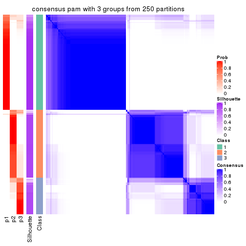</p>

</div>
<div id='tab-CV-pam-consensus-heatmap-3'>
<pre><code class="r">consensus_heatmap(res, k = 4)
</code></pre>

<p></p>

</div>
<div id='tab-CV-pam-consensus-heatmap-4'>
<pre><code class="r">consensus_heatmap(res, k = 5)
</code></pre>

<p></p>

</div>
<div id='tab-CV-pam-consensus-heatmap-5'>
<pre><code class="r">consensus_heatmap(res, k = 6)
</code></pre>

<p></p>

</div>
</div>

Heatmaps for the membership of samples in all partitions to see how consistent they are:


<script>
$( function() {
	$( '#tabs-CV-pam-membership-heatmap' ).tabs();
} );
</script>
<div id='tabs-CV-pam-membership-heatmap'>
<ul>
<li><a href='#tab-CV-pam-membership-heatmap-1'>k = 2</a></li>
<li><a href='#tab-CV-pam-membership-heatmap-2'>k = 3</a></li>
<li><a href='#tab-CV-pam-membership-heatmap-3'>k = 4</a></li>
<li><a href='#tab-CV-pam-membership-heatmap-4'>k = 5</a></li>
<li><a href='#tab-CV-pam-membership-heatmap-5'>k = 6</a></li>
</ul>
<div id='tab-CV-pam-membership-heatmap-1'>
<pre><code class="r">membership_heatmap(res, k = 2)
</code></pre>

<p></p>

</div>
<div id='tab-CV-pam-membership-heatmap-2'>
<pre><code class="r">membership_heatmap(res, k = 3)
</code></pre>

<p></p>

</div>
<div id='tab-CV-pam-membership-heatmap-3'>
<pre><code class="r">membership_heatmap(res, k = 4)
</code></pre>

<p></p>

</div>
<div id='tab-CV-pam-membership-heatmap-4'>
<pre><code class="r">membership_heatmap(res, k = 5)
</code></pre>

<p></p>

</div>
<div id='tab-CV-pam-membership-heatmap-5'>
<pre><code class="r">membership_heatmap(res, k = 6)
</code></pre>

<p></p>

</div>
</div>

As soon as we have had the classes for columns, we can look for signatures
which are significantly different between classes which can be candidate marks
for certain classes. Following are the heatmaps for signatures.


Signature heatmaps where rows are scaled:


<script>
$( function() {
	$( '#tabs-CV-pam-get-signatures' ).tabs();
} );
</script>
<div id='tabs-CV-pam-get-signatures'>
<ul>
<li><a href='#tab-CV-pam-get-signatures-1'>k = 2</a></li>
<li><a href='#tab-CV-pam-get-signatures-2'>k = 3</a></li>
<li><a href='#tab-CV-pam-get-signatures-3'>k = 4</a></li>
<li><a href='#tab-CV-pam-get-signatures-4'>k = 5</a></li>
<li><a href='#tab-CV-pam-get-signatures-5'>k = 6</a></li>
</ul>
<div id='tab-CV-pam-get-signatures-1'>
<pre><code class="r">get_signatures(res, k = 2)
</code></pre>

<p></p>

</div>
<div id='tab-CV-pam-get-signatures-2'>
<pre><code class="r">get_signatures(res, k = 3)
</code></pre>

<p></p>

</div>
<div id='tab-CV-pam-get-signatures-3'>
<pre><code class="r">get_signatures(res, k = 4)
</code></pre>

<p></p>

</div>
<div id='tab-CV-pam-get-signatures-4'>
<pre><code class="r">get_signatures(res, k = 5)
</code></pre>

<p></p>

</div>
<div id='tab-CV-pam-get-signatures-5'>
<pre><code class="r">get_signatures(res, k = 6)
</code></pre>

<p></p>

</div>
</div>


Signature heatmaps where rows are not scaled:


<script>
$( function() {
	$( '#tabs-CV-pam-get-signatures-no-scale' ).tabs();
} );
</script>
<div id='tabs-CV-pam-get-signatures-no-scale'>
<ul>
<li><a href='#tab-CV-pam-get-signatures-no-scale-1'>k = 2</a></li>
<li><a href='#tab-CV-pam-get-signatures-no-scale-2'>k = 3</a></li>
<li><a href='#tab-CV-pam-get-signatures-no-scale-3'>k = 4</a></li>
<li><a href='#tab-CV-pam-get-signatures-no-scale-4'>k = 5</a></li>
<li><a href='#tab-CV-pam-get-signatures-no-scale-5'>k = 6</a></li>
</ul>
<div id='tab-CV-pam-get-signatures-no-scale-1'>
<pre><code class="r">get_signatures(res, k = 2, scale_rows = FALSE)
</code></pre>

<p></p>

</div>
<div id='tab-CV-pam-get-signatures-no-scale-2'>
<pre><code class="r">get_signatures(res, k = 3, scale_rows = FALSE)
</code></pre>

<p></p>

</div>
<div id='tab-CV-pam-get-signatures-no-scale-3'>
<pre><code class="r">get_signatures(res, k = 4, scale_rows = FALSE)
</code></pre>

<p></p>

</div>
<div id='tab-CV-pam-get-signatures-no-scale-4'>
<pre><code class="r">get_signatures(res, k = 5, scale_rows = FALSE)
</code></pre>

<p></p>

</div>
<div id='tab-CV-pam-get-signatures-no-scale-5'>
<pre><code class="r">get_signatures(res, k = 6, scale_rows = FALSE)
</code></pre>

<p></p>

</div>
</div>


Compare the overlap of signatures from different k:

```r
compare_signatures(res)
```


`get_signature()` returns a data frame invisibly. TO get the list of signatures, the function
call should be assigned to a variable explicitly. In following code, if `plot` argument is set
to `FALSE`, no heatmap is plotted while only the differential analysis is performed.

```r
# code only for demonstration
tb = get_signature(res, k = ..., plot = FALSE)
```

An example of the output of `tb` is:

```
#>   which_row         fdr    mean_1    mean_2 scaled_mean_1 scaled_mean_2 km
#> 1        38 0.042760348  8.373488  9.131774    -0.5533452     0.5164555  1
#> 2        40 0.018707592  7.106213  8.469186    -0.6173731     0.5762149  1
#> 3        55 0.019134737 10.221463 11.207825    -0.6159697     0.5749050  1
#> 4        59 0.006059896  5.921854  7.869574    -0.6899429     0.6439467  1
#> 5        60 0.018055526  8.928898 10.211722    -0.6204761     0.5791110  1
#> 6        98 0.009384629 15.714769 14.887706     0.6635654    -0.6193277  2
...
```

The columns in `tb` are:

1. `which_row`: row indices corresponding to the input matrix.
2. `fdr`: FDR for the differential test. 
3. `mean_x`: The mean value in group x.
4. `scaled_mean_x`: The mean value in group x after rows are scaled.
5. `km`: Row groups if k-means clustering is applied to rows.


UMAP plot which shows how samples are separated.


<script>
$( function() {
	$( '#tabs-CV-pam-dimension-reduction' ).tabs();
} );
</script>
<div id='tabs-CV-pam-dimension-reduction'>
<ul>
<li><a href='#tab-CV-pam-dimension-reduction-1'>k = 2</a></li>
<li><a href='#tab-CV-pam-dimension-reduction-2'>k = 3</a></li>
<li><a href='#tab-CV-pam-dimension-reduction-3'>k = 4</a></li>
<li><a href='#tab-CV-pam-dimension-reduction-4'>k = 5</a></li>
<li><a href='#tab-CV-pam-dimension-reduction-5'>k = 6</a></li>
</ul>
<div id='tab-CV-pam-dimension-reduction-1'>
<pre><code class="r">dimension_reduction(res, k = 2, method = &quot;UMAP&quot;)
</code></pre>

<p></p>

</div>
<div id='tab-CV-pam-dimension-reduction-2'>
<pre><code class="r">dimension_reduction(res, k = 3, method = &quot;UMAP&quot;)
</code></pre>

<p></p>

</div>
<div id='tab-CV-pam-dimension-reduction-3'>
<pre><code class="r">dimension_reduction(res, k = 4, method = &quot;UMAP&quot;)
</code></pre>

<p></p>

</div>
<div id='tab-CV-pam-dimension-reduction-4'>
<pre><code class="r">dimension_reduction(res, k = 5, method = &quot;UMAP&quot;)
</code></pre>

<p></p>

</div>
<div id='tab-CV-pam-dimension-reduction-5'>
<pre><code class="r">dimension_reduction(res, k = 6, method = &quot;UMAP&quot;)
</code></pre>

<p></p>

</div>
</div>


Following heatmap shows how subgroups are split when increasing `k`:

```r
collect_classes(res)
```


If matrix rows can be associated to genes, consider to use `GO_Enrichment(res,
...)` to perform function enrichment for the signature genes.


 

---------------------------------------------------


### CV:mclust**


The object with results only for a single top-value method and a single partition method 
can be extracted as:

```r
res = res_list["CV", "mclust"]
# you can also extract it by
# res = res_list["CV:mclust"]
```

A summary of `res` and all the functions that can be applied to it:

```r
res
```

```
#> A 'ConsensusPartition' object with k = 2, 3, 4, 5, 6.
#>   On a matrix with 17680 rows and 218 columns.
#>   Top rows (1000, 2000, 3000, 4000, 5000) are extracted by 'CV' method.
#>   Subgroups are detected by 'mclust' method.
#>   Performed in total 1250 partitions by row resampling.
#>   Best k for subgroups seems to be 2.
#> 
#> Following methods can be applied to this 'ConsensusPartition' object:
#>  [1] "cola_report"             "collect_classes"         "collect_plots"          
#>  [4] "collect_stats"           "colnames"                "compare_signatures"     
#>  [7] "consensus_heatmap"       "dimension_reduction"     "functional_enrichment"  
#> [10] "get_anno_col"            "get_anno"                "get_classes"            
#> [13] "get_consensus"           "get_matrix"              "get_membership"         
#> [16] "get_param"               "get_signatures"          "get_stats"              
#> [19] "is_best_k"               "is_stable_k"             "membership_heatmap"     
#> [22] "ncol"                    "nrow"                    "plot_ecdf"              
#> [25] "rownames"                "select_partition_number" "show"                   
#> [28] "suggest_best_k"          "test_to_known_factors"
```

`collect_plots()` function collects all the plots made from `res` for all `k` (number of partitions)
into one single page to provide an easy and fast comparison between different `k`.

```r
collect_plots(res)
```


The plots are:

- The first row: a plot of the ECDF (Empirical cumulative distribution
  function) curves of the consensus matrix for each `k` and the heatmap of
  predicted classes for each `k`.
- The second row: heatmaps of the consensus matrix for each `k`.
- The third row: heatmaps of the membership matrix for each `k`.
- The fouth row: heatmaps of the signatures for each `k`.

All the plots in panels can be made by individual functions and they are
plotted later in this section.

`select_partition_number()` produces several plots showing different
statistics for choosing "optimized" `k`. There are following statistics:

- ECDF curves of the consensus matrix for each `k`;
- 1-PAC. [The PAC
  score](https://en.wikipedia.org/wiki/Consensus_clustering#Over-interpretation_potential_of_consensus_clustering)
  measures the proportion of the ambiguous subgrouping.
- Mean silhouette score.
- Concordance. The mean probability of fiting the consensus class ids in all
  partitions.
- Area increased. Denote $A_k$ as the area under the ECDF curve for current
  `k`, the area increased is defined as $A_k - A_{k-1}$.
- Rand index. The percent of pairs of samples that are both in a same cluster
  or both are not in a same cluster in the partition of k and k-1.
- Jaccard index. The ratio of pairs of samples are both in a same cluster in
  the partition of k and k-1 and the pairs of samples are both in a same
  cluster in the partition k or k-1.

The detailed explanations of these statistics can be found in [the cola
vignette](http://bioconductor.org/packages/devel/bioc/vignettes/cola/inst/doc/cola.html#toc_13).

Generally speaking, lower PAC score, higher mean silhouette score or higher
concordance corresponds to better partition. Rand index and Jaccard index
measure how similar the current partition is compared to partition with `k-1`.
If they are too similar, we won't accept `k` is better than `k-1`.

```r
select_partition_number(res)
```


The numeric values for all these statistics can be obtained by `get_stats()`.

```r
get_stats(res)
```

```
#>   k 1-PAC mean_silhouette concordance area_increased  Rand Jaccard
#> 2 2 1.000           0.973       0.984         0.4570 0.547   0.547
#> 3 3 0.723           0.942       0.888         0.3991 0.784   0.605
#> 4 4 0.795           0.825       0.916         0.1405 0.907   0.730
#> 5 5 0.735           0.777       0.840         0.0771 0.901   0.653
#> 6 6 0.754           0.694       0.766         0.0445 0.931   0.692
```

`suggest_best_k()` suggests the best $k$ based on these statistics. The rules are as follows:

- All $k$ with Jaccard index larger than 0.95 are removed because the increase of
  the partition number does not provides enough extra information. If all $k$ are removed,
  the best $k$ is assigned by `NA`.
- For $k$ with 1-PAC larger than 0.9, the maximal $k$ is taken as the "best k". Other $k$ is called "optional k".
- If it does not fit the second rule. The $k$ with the highest vote of highest
  1-PAC, mean silhouette and concordance is taken as the "best k".

```r
suggest_best_k(res)
```

```
#> [1] 2
```


Following shows the table of the partitions (You need to click the **show/hide
code output** link to see it). The membership matrix (columns with name `p*`)
is inferred by
[`clue::cl_consensus()`](https://www.rdocumentation.org/link/cl_consensus?package=clue)
function with the `SE` method. Basically the value in the membership matrix
represents the probability to belong to a certain group. The finall class
label for an item is determined with the group with highest probability it
belongs to.

In `get_classes()` function, the entropy is calculated from the membership
matrix and the silhouette score is calculated from the consensus matrix.


<script>
$( function() {
	$( '#tabs-CV-mclust-get-classes' ).tabs();
} );
</script>
<div id='tabs-CV-mclust-get-classes'>
<ul>
<li><a href='#tab-CV-mclust-get-classes-1'>k = 2</a></li>
<li><a href='#tab-CV-mclust-get-classes-2'>k = 3</a></li>
<li><a href='#tab-CV-mclust-get-classes-3'>k = 4</a></li>
<li><a href='#tab-CV-mclust-get-classes-4'>k = 5</a></li>
<li><a href='#tab-CV-mclust-get-classes-5'>k = 6</a></li>
</ul>

<div id='tab-CV-mclust-get-classes-1'>
<p><a id='tab-CV-mclust-get-classes-1-a' style='color:#0366d6' href='#'>show/hide code output</a></p>
<pre><code class="r">cbind(get_classes(res, k = 2), get_membership(res, k = 2))
</code></pre>

<pre><code>#&gt;            class entropy silhouette    p1    p2
#&gt; SRR1498997     2  0.0000      0.977 0.000 1.000
#&gt; SRR1076441     1  0.0000      0.996 1.000 0.000
#&gt; SRR1489803     2  0.1843      0.974 0.028 0.972
#&gt; SRR1345953     2  0.0000      0.977 0.000 1.000
#&gt; SRR1357826     2  0.0000      0.977 0.000 1.000
#&gt; SRR1419656     1  0.0000      0.996 1.000 0.000
#&gt; SRR1454158     2  0.0000      0.977 0.000 1.000
#&gt; SRR1475408     2  0.1633      0.975 0.024 0.976
#&gt; SRR1472704     2  0.0000      0.977 0.000 1.000
#&gt; SRR1090046     2  0.1633      0.975 0.024 0.976
#&gt; SRR1312822     1  0.0000      0.996 1.000 0.000
#&gt; SRR1096987     2  0.0000      0.977 0.000 1.000
#&gt; SRR1334587     2  0.1843      0.974 0.028 0.972
#&gt; SRR1490246     1  0.0000      0.996 1.000 0.000
#&gt; SRR1467522     1  0.0000      0.996 1.000 0.000
#&gt; SRR1324206     1  0.0000      0.996 1.000 0.000
#&gt; SRR1408574     2  0.1843      0.974 0.028 0.972
#&gt; SRR1083959     2  0.0000      0.977 0.000 1.000
#&gt; SRR1079948     2  0.0000      0.977 0.000 1.000
#&gt; SRR1310667     2  0.1843      0.974 0.028 0.972
#&gt; SRR655852      2  0.0000      0.977 0.000 1.000
#&gt; SRR1352457     2  0.1843      0.974 0.028 0.972
#&gt; SRR1353994     2  0.0000      0.977 0.000 1.000
#&gt; SRR1459561     2  0.1843      0.974 0.028 0.972
#&gt; SRR1454009     1  0.0000      0.996 1.000 0.000
#&gt; SRR1071084     1  0.0000      0.996 1.000 0.000
#&gt; SRR1082859     2  0.0000      0.977 0.000 1.000
#&gt; SRR1086538     1  0.0000      0.996 1.000 0.000
#&gt; SRR1486262     2  0.0000      0.977 0.000 1.000
#&gt; SRR658105      1  0.0000      0.996 1.000 0.000
#&gt; SRR811073      2  0.0000      0.977 0.000 1.000
#&gt; SRR1429181     2  0.1633      0.975 0.024 0.976
#&gt; SRR1327896     2  0.0000      0.977 0.000 1.000
#&gt; SRR1464788     2  0.1843      0.974 0.028 0.972
#&gt; SRR1346861     2  0.0000      0.977 0.000 1.000
#&gt; SRR1318774     2  0.0000      0.977 0.000 1.000
#&gt; SRR1420517     2  0.2603      0.963 0.044 0.956
#&gt; SRR1369584     2  0.1843      0.974 0.028 0.972
#&gt; SRR1443244     2  0.0000      0.977 0.000 1.000
#&gt; SRR1455391     1  0.0000      0.996 1.000 0.000
#&gt; SRR1068999     1  0.0000      0.996 1.000 0.000
#&gt; SRR1481297     1  0.0000      0.996 1.000 0.000
#&gt; SRR1070208     2  0.2603      0.963 0.044 0.956
#&gt; SRR1317282     2  0.7299      0.774 0.204 0.796
#&gt; SRR1096125     2  0.0000      0.977 0.000 1.000
#&gt; SRR1472506     2  0.1843      0.974 0.028 0.972
#&gt; SRR1388281     2  0.0000      0.977 0.000 1.000
#&gt; SRR1365622     2  0.1843      0.974 0.028 0.972
#&gt; SRR662306      1  0.0000      0.996 1.000 0.000
#&gt; SRR662811      1  0.0000      0.996 1.000 0.000
#&gt; SRR820571      2  0.2603      0.963 0.044 0.956
#&gt; SRR1357166     1  0.0000      0.996 1.000 0.000
#&gt; SRR1488586     2  0.2603      0.963 0.044 0.956
#&gt; SRR1485398     1  0.0000      0.996 1.000 0.000
#&gt; SRR1417725     2  0.0000      0.977 0.000 1.000
#&gt; SRR1409397     2  0.1843      0.974 0.028 0.972
#&gt; SRR1465693     2  0.1843      0.974 0.028 0.972
#&gt; SRR1096547     2  0.1843      0.974 0.028 0.972
#&gt; SRR1456818     2  0.2603      0.963 0.044 0.956
#&gt; SRR816336      2  0.2603      0.963 0.044 0.956
#&gt; SRR1420238     1  0.0000      0.996 1.000 0.000
#&gt; SRR1433374     1  0.0000      0.996 1.000 0.000
#&gt; SRR1436990     1  0.0000      0.996 1.000 0.000
#&gt; SRR662378      1  0.0000      0.996 1.000 0.000
#&gt; SRR1477671     1  0.0000      0.996 1.000 0.000
#&gt; SRR1084079     2  0.0000      0.977 0.000 1.000
#&gt; SRR1102949     1  0.0000      0.996 1.000 0.000
#&gt; SRR1458090     1  0.0000      0.996 1.000 0.000
#&gt; SRR1418729     2  0.0000      0.977 0.000 1.000
#&gt; SRR1403814     2  0.0000      0.977 0.000 1.000
#&gt; SRR1404887     2  0.0000      0.977 0.000 1.000
#&gt; SRR1434955     1  0.0000      0.996 1.000 0.000
#&gt; SRR1360652     2  0.8713      0.625 0.292 0.708
#&gt; SRR1356765     2  0.1843      0.974 0.028 0.972
#&gt; SRR1078258     2  0.0000      0.977 0.000 1.000
#&gt; SRR1455861     1  0.0000      0.996 1.000 0.000
#&gt; SRR1420296     2  0.1843      0.974 0.028 0.972
#&gt; SRR1070260     2  0.0000      0.977 0.000 1.000
#&gt; SRR1410765     1  0.0000      0.996 1.000 0.000
#&gt; SRR1481315     2  0.1633      0.975 0.024 0.976
#&gt; SRR1414661     2  0.0000      0.977 0.000 1.000
#&gt; SRR1359147     2  0.0000      0.977 0.000 1.000
#&gt; SRR1488694     2  0.1633      0.975 0.024 0.976
#&gt; SRR1477273     1  0.0000      0.996 1.000 0.000
#&gt; SRR1415792     2  0.2603      0.963 0.044 0.956
#&gt; SRR1369088     2  0.1843      0.974 0.028 0.972
#&gt; SRR1406621     2  0.1843      0.974 0.028 0.972
#&gt; SRR1401017     2  0.1843      0.974 0.028 0.972
#&gt; SRR1099981     2  0.1843      0.974 0.028 0.972
#&gt; SRR815208      2  0.0000      0.977 0.000 1.000
#&gt; SRR1380460     2  0.0000      0.977 0.000 1.000
#&gt; SRR1091097     2  0.0000      0.977 0.000 1.000
#&gt; SRR1456010     1  0.0000      0.996 1.000 0.000
#&gt; SRR1498416     2  0.0000      0.977 0.000 1.000
#&gt; SRR818873      2  0.1843      0.974 0.028 0.972
#&gt; SRR813868      2  0.0000      0.977 0.000 1.000
#&gt; SRR1394912     1  0.0000      0.996 1.000 0.000
#&gt; SRR1475824     2  0.1633      0.975 0.024 0.976
#&gt; SRR1459866     1  0.0000      0.996 1.000 0.000
#&gt; SRR1364871     2  0.1633      0.975 0.024 0.976
#&gt; SRR1100472     2  0.0000      0.977 0.000 1.000
#&gt; SRR1331267     2  0.0376      0.977 0.004 0.996
#&gt; SRR1068977     2  0.1843      0.974 0.028 0.972
#&gt; SRR1391511     2  0.0000      0.977 0.000 1.000
#&gt; SRR1077920     2  0.0000      0.977 0.000 1.000
#&gt; SRR1457705     1  0.0000      0.996 1.000 0.000
#&gt; SRR1437073     1  0.0000      0.996 1.000 0.000
#&gt; SRR1473124     1  0.0000      0.996 1.000 0.000
#&gt; SRR1469279     1  0.0000      0.996 1.000 0.000
#&gt; SRR1091791     2  0.0000      0.977 0.000 1.000
#&gt; SRR1341539     2  0.1843      0.974 0.028 0.972
#&gt; SRR1446354     1  0.0000      0.996 1.000 0.000
#&gt; SRR1415420     1  0.0000      0.996 1.000 0.000
#&gt; SRR1368050     1  0.0000      0.996 1.000 0.000
#&gt; SRR656970      2  0.1843      0.974 0.028 0.972
#&gt; SRR1473403     2  0.0000      0.977 0.000 1.000
#&gt; SRR1084674     2  0.2603      0.963 0.044 0.956
#&gt; SRR1464702     1  0.0000      0.996 1.000 0.000
#&gt; SRR1074860     2  0.0000      0.977 0.000 1.000
#&gt; SRR655447      2  0.0000      0.977 0.000 1.000
#&gt; SRR1404442     2  0.0000      0.977 0.000 1.000
#&gt; SRR1418795     1  0.0000      0.996 1.000 0.000
#&gt; SRR1458335     2  0.0000      0.977 0.000 1.000
#&gt; SRR1489589     2  0.1843      0.974 0.028 0.972
#&gt; SRR1378284     2  0.1843      0.974 0.028 0.972
#&gt; SRR1408014     2  0.1843      0.974 0.028 0.972
#&gt; SRR1083052     2  0.8499      0.658 0.276 0.724
#&gt; SRR1339236     2  0.1843      0.974 0.028 0.972
#&gt; SRR1323829     2  0.1843      0.974 0.028 0.972
#&gt; SRR1086772     2  0.0000      0.977 0.000 1.000
#&gt; SRR1486457     2  0.2603      0.963 0.044 0.956
#&gt; SRR1415257     2  0.1843      0.974 0.028 0.972
#&gt; SRR1071905     1  0.5178      0.864 0.884 0.116
#&gt; SRR659223      2  0.1843      0.974 0.028 0.972
#&gt; SRR1386945     1  0.0000      0.996 1.000 0.000
#&gt; SRR821498      2  0.0000      0.977 0.000 1.000
#&gt; SRR1378903     2  0.0000      0.977 0.000 1.000
#&gt; SRR1472907     1  0.0000      0.996 1.000 0.000
#&gt; SRR1442313     2  0.0000      0.977 0.000 1.000
#&gt; SRR1077139     2  0.1633      0.975 0.024 0.976
#&gt; SRR1342758     1  0.0000      0.996 1.000 0.000
#&gt; SRR656911      2  0.0000      0.977 0.000 1.000
#&gt; SRR1070738     1  0.0000      0.996 1.000 0.000
#&gt; SRR1476950     2  0.8144      0.699 0.252 0.748
#&gt; SRR1488196     1  0.0000      0.996 1.000 0.000
#&gt; SRR1498951     1  0.0000      0.996 1.000 0.000
#&gt; SRR1413392     1  0.0000      0.996 1.000 0.000
#&gt; SRR657528      2  0.1843      0.974 0.028 0.972
#&gt; SRR812198      1  0.0000      0.996 1.000 0.000
#&gt; SRR660283      2  0.0000      0.977 0.000 1.000
#&gt; SRR1420936     1  0.0000      0.996 1.000 0.000
#&gt; SRR1469547     2  0.0000      0.977 0.000 1.000
#&gt; SRR1322249     2  0.2603      0.963 0.044 0.956
#&gt; SRR1396682     1  0.0000      0.996 1.000 0.000
#&gt; SRR1095816     2  0.0000      0.977 0.000 1.000
#&gt; SRR1081023     1  0.0000      0.996 1.000 0.000
#&gt; SRR1092517     2  0.0000      0.977 0.000 1.000
#&gt; SRR811285      2  0.1843      0.974 0.028 0.972
#&gt; SRR657018      1  0.0000      0.996 1.000 0.000
#&gt; SRR1365534     1  0.0000      0.996 1.000 0.000
#&gt; SRR1090791     2  0.1843      0.974 0.028 0.972
#&gt; SRR1439915     2  0.1843      0.974 0.028 0.972
#&gt; SRR1391575     2  0.0000      0.977 0.000 1.000
#&gt; SRR1314092     2  0.0000      0.977 0.000 1.000
#&gt; SRR1328941     1  0.0000      0.996 1.000 0.000
#&gt; SRR1336181     2  0.0000      0.977 0.000 1.000
#&gt; SRR1362972     1  0.0000      0.996 1.000 0.000
#&gt; SRR1366790     2  0.0000      0.977 0.000 1.000
#&gt; SRR1455902     1  0.0000      0.996 1.000 0.000
#&gt; SRR1437644     2  0.0000      0.977 0.000 1.000
#&gt; SRR1105009     2  0.0000      0.977 0.000 1.000
#&gt; SRR1367024     1  0.0000      0.996 1.000 0.000
#&gt; SRR660248      2  0.0000      0.977 0.000 1.000
#&gt; SRR1409620     1  0.0000      0.996 1.000 0.000
#&gt; SRR1455807     2  0.0000      0.977 0.000 1.000
#&gt; SRR1339431     1  0.0000      0.996 1.000 0.000
#&gt; SRR1378948     2  0.1633      0.975 0.024 0.976
#&gt; SRR1469237     1  0.0000      0.996 1.000 0.000
#&gt; SRR1098264     2  0.0000      0.977 0.000 1.000
#&gt; SRR1406224     2  0.1633      0.975 0.024 0.976
#&gt; SRR1393026     2  0.9427      0.483 0.360 0.640
#&gt; SRR808428      2  0.0000      0.977 0.000 1.000
#&gt; SRR615910      2  0.1843      0.974 0.028 0.972
#&gt; SRR1076219     1  0.0000      0.996 1.000 0.000
#&gt; SRR1481128     1  0.0000      0.996 1.000 0.000
#&gt; SRR1359262     2  0.1843      0.974 0.028 0.972
#&gt; SRR1407648     2  0.0000      0.977 0.000 1.000
#&gt; SRR1386775     2  0.1633      0.975 0.024 0.976
#&gt; SRR1388399     2  0.1843      0.974 0.028 0.972
#&gt; SRR1361499     2  0.0000      0.977 0.000 1.000
#&gt; SRR1500709     2  0.0000      0.977 0.000 1.000
#&gt; SRR1335917     1  0.0000      0.996 1.000 0.000
#&gt; SRR1430615     2  0.1843      0.974 0.028 0.972
#&gt; SRR1335212     1  0.6247      0.808 0.844 0.156
#&gt; SRR1400159     2  0.1843      0.974 0.028 0.972
#&gt; SRR1457245     2  0.0000      0.977 0.000 1.000
#&gt; SRR1356746     2  0.0000      0.977 0.000 1.000
#&gt; SRR658319      2  0.0000      0.977 0.000 1.000
#&gt; SRR1435946     1  0.0000      0.996 1.000 0.000
#&gt; SRR1370308     1  0.0000      0.996 1.000 0.000
#&gt; SRR1100893     1  0.0000      0.996 1.000 0.000
#&gt; SRR1389432     1  0.0000      0.996 1.000 0.000
#&gt; SRR1381799     2  0.0000      0.977 0.000 1.000
#&gt; SRR1310158     1  0.0000      0.996 1.000 0.000
#&gt; SRR1341100     2  0.0000      0.977 0.000 1.000
#&gt; SRR1342873     1  0.0000      0.996 1.000 0.000
#&gt; SRR1472102     2  0.1843      0.974 0.028 0.972
#&gt; SRR1409421     1  0.0000      0.996 1.000 0.000
#&gt; SRR1328577     2  0.0000      0.977 0.000 1.000
#&gt; SRR808942      2  0.0000      0.977 0.000 1.000
#&gt; SRR1343818     2  0.0000      0.977 0.000 1.000
#&gt; SRR1472415     2  0.0000      0.977 0.000 1.000
#&gt; SRR658409      2  0.0000      0.977 0.000 1.000
#&gt; SRR1469681     1  0.0000      0.996 1.000 0.000
#&gt; SRR1075484     2  0.1843      0.974 0.028 0.972
#&gt; SRR1417894     1  0.0000      0.996 1.000 0.000
#&gt; SRR1417422     2  0.1843      0.974 0.028 0.972
#&gt; SRR1090674     1  0.0000      0.996 1.000 0.000
</code></pre>

<script>
$('#tab-CV-mclust-get-classes-1-a').parent().next().next().hide();
$('#tab-CV-mclust-get-classes-1-a').click(function(){
  $('#tab-CV-mclust-get-classes-1-a').parent().next().next().toggle();
  return(false);
});
</script>
</div>

<div id='tab-CV-mclust-get-classes-2'>
<p><a id='tab-CV-mclust-get-classes-2-a' style='color:#0366d6' href='#'>show/hide code output</a></p>
<pre><code class="r">cbind(get_classes(res, k = 3), get_membership(res, k = 3))
</code></pre>

<pre><code>#&gt;            class entropy silhouette    p1    p2    p3
#&gt; SRR1498997     2  0.0000      1.000 0.000 1.000 0.000
#&gt; SRR1076441     1  0.3340      0.918 0.880 0.000 0.120
#&gt; SRR1489803     3  0.4750      0.951 0.000 0.216 0.784
#&gt; SRR1345953     2  0.0000      1.000 0.000 1.000 0.000
#&gt; SRR1357826     2  0.0000      1.000 0.000 1.000 0.000
#&gt; SRR1419656     1  0.0747      0.921 0.984 0.000 0.016
#&gt; SRR1454158     2  0.0000      1.000 0.000 1.000 0.000
#&gt; SRR1475408     3  0.5138      0.933 0.000 0.252 0.748
#&gt; SRR1472704     2  0.0000      1.000 0.000 1.000 0.000
#&gt; SRR1090046     3  0.5536      0.934 0.012 0.236 0.752
#&gt; SRR1312822     1  0.4452      0.908 0.808 0.000 0.192
#&gt; SRR1096987     2  0.0000      1.000 0.000 1.000 0.000
#&gt; SRR1334587     3  0.4750      0.951 0.000 0.216 0.784
#&gt; SRR1490246     1  0.2796      0.920 0.908 0.000 0.092
#&gt; SRR1467522     1  0.0892      0.922 0.980 0.000 0.020
#&gt; SRR1324206     1  0.1031      0.922 0.976 0.000 0.024
#&gt; SRR1408574     3  0.4750      0.951 0.000 0.216 0.784
#&gt; SRR1083959     2  0.0000      1.000 0.000 1.000 0.000
#&gt; SRR1079948     2  0.0000      1.000 0.000 1.000 0.000
#&gt; SRR1310667     3  0.4750      0.951 0.000 0.216 0.784
#&gt; SRR655852      2  0.0000      1.000 0.000 1.000 0.000
#&gt; SRR1352457     3  0.4750      0.951 0.000 0.216 0.784
#&gt; SRR1353994     2  0.0000      1.000 0.000 1.000 0.000
#&gt; SRR1459561     3  0.4750      0.951 0.000 0.216 0.784
#&gt; SRR1454009     1  0.1031      0.919 0.976 0.000 0.024
#&gt; SRR1071084     1  0.1031      0.919 0.976 0.000 0.024
#&gt; SRR1082859     2  0.0000      1.000 0.000 1.000 0.000
#&gt; SRR1086538     1  0.0892      0.922 0.980 0.000 0.020
#&gt; SRR1486262     2  0.0000      1.000 0.000 1.000 0.000
#&gt; SRR658105      1  0.4452      0.908 0.808 0.000 0.192
#&gt; SRR811073      2  0.0000      1.000 0.000 1.000 0.000
#&gt; SRR1429181     3  0.4887      0.947 0.000 0.228 0.772
#&gt; SRR1327896     2  0.0000      1.000 0.000 1.000 0.000
#&gt; SRR1464788     3  0.4750      0.951 0.000 0.216 0.784
#&gt; SRR1346861     2  0.0000      1.000 0.000 1.000 0.000
#&gt; SRR1318774     2  0.0000      1.000 0.000 1.000 0.000
#&gt; SRR1420517     3  0.6349      0.866 0.080 0.156 0.764
#&gt; SRR1369584     3  0.4750      0.951 0.000 0.216 0.784
#&gt; SRR1443244     2  0.0000      1.000 0.000 1.000 0.000
#&gt; SRR1455391     1  0.1031      0.919 0.976 0.000 0.024
#&gt; SRR1068999     1  0.0237      0.922 0.996 0.000 0.004
#&gt; SRR1481297     1  0.0747      0.921 0.984 0.000 0.016
#&gt; SRR1070208     3  0.6007      0.905 0.044 0.192 0.764
#&gt; SRR1317282     3  0.5826      0.712 0.204 0.032 0.764
#&gt; SRR1096125     2  0.0000      1.000 0.000 1.000 0.000
#&gt; SRR1472506     3  0.5536      0.934 0.012 0.236 0.752
#&gt; SRR1388281     2  0.0000      1.000 0.000 1.000 0.000
#&gt; SRR1365622     3  0.4750      0.951 0.000 0.216 0.784
#&gt; SRR662306      1  0.1031      0.919 0.976 0.000 0.024
#&gt; SRR662811      1  0.4452      0.908 0.808 0.000 0.192
#&gt; SRR820571      3  0.5578      0.935 0.012 0.240 0.748
#&gt; SRR1357166     1  0.1031      0.919 0.976 0.000 0.024
#&gt; SRR1488586     3  0.5536      0.934 0.012 0.236 0.752
#&gt; SRR1485398     1  0.4452      0.908 0.808 0.000 0.192
#&gt; SRR1417725     3  0.5291      0.920 0.000 0.268 0.732
#&gt; SRR1409397     3  0.4750      0.951 0.000 0.216 0.784
#&gt; SRR1465693     3  0.4750      0.951 0.000 0.216 0.784
#&gt; SRR1096547     3  0.5536      0.934 0.012 0.236 0.752
#&gt; SRR1456818     3  0.5826      0.916 0.032 0.204 0.764
#&gt; SRR816336      3  0.5450      0.932 0.012 0.228 0.760
#&gt; SRR1420238     1  0.2796      0.920 0.908 0.000 0.092
#&gt; SRR1433374     1  0.1031      0.919 0.976 0.000 0.024
#&gt; SRR1436990     1  0.4452      0.908 0.808 0.000 0.192
#&gt; SRR662378      1  0.1031      0.922 0.976 0.000 0.024
#&gt; SRR1477671     1  0.1453      0.915 0.968 0.008 0.024
#&gt; SRR1084079     2  0.0000      1.000 0.000 1.000 0.000
#&gt; SRR1102949     1  0.4452      0.908 0.808 0.000 0.192
#&gt; SRR1458090     1  0.4178      0.912 0.828 0.000 0.172
#&gt; SRR1418729     2  0.0000      1.000 0.000 1.000 0.000
#&gt; SRR1403814     2  0.0000      1.000 0.000 1.000 0.000
#&gt; SRR1404887     2  0.0000      1.000 0.000 1.000 0.000
#&gt; SRR1434955     1  0.4452      0.908 0.808 0.000 0.192
#&gt; SRR1360652     3  0.6283      0.886 0.064 0.176 0.760
#&gt; SRR1356765     3  0.4750      0.951 0.000 0.216 0.784
#&gt; SRR1078258     2  0.0000      1.000 0.000 1.000 0.000
#&gt; SRR1455861     1  0.4178      0.912 0.828 0.000 0.172
#&gt; SRR1420296     3  0.4750      0.951 0.000 0.216 0.784
#&gt; SRR1070260     2  0.0000      1.000 0.000 1.000 0.000
#&gt; SRR1410765     1  0.2878      0.920 0.904 0.000 0.096
#&gt; SRR1481315     3  0.5659      0.927 0.012 0.248 0.740
#&gt; SRR1414661     2  0.0000      1.000 0.000 1.000 0.000
#&gt; SRR1359147     2  0.0000      1.000 0.000 1.000 0.000
#&gt; SRR1488694     3  0.5812      0.919 0.012 0.264 0.724
#&gt; SRR1477273     1  0.1031      0.919 0.976 0.000 0.024
#&gt; SRR1415792     3  0.5406      0.930 0.012 0.224 0.764
#&gt; SRR1369088     3  0.4750      0.951 0.000 0.216 0.784
#&gt; SRR1406621     3  0.4750      0.951 0.000 0.216 0.784
#&gt; SRR1401017     3  0.4750      0.951 0.000 0.216 0.784
#&gt; SRR1099981     3  0.4750      0.951 0.000 0.216 0.784
#&gt; SRR815208      2  0.0000      1.000 0.000 1.000 0.000
#&gt; SRR1380460     2  0.0000      1.000 0.000 1.000 0.000
#&gt; SRR1091097     2  0.0000      1.000 0.000 1.000 0.000
#&gt; SRR1456010     1  0.0747      0.921 0.984 0.000 0.016
#&gt; SRR1498416     2  0.0000      1.000 0.000 1.000 0.000
#&gt; SRR818873      3  0.4750      0.951 0.000 0.216 0.784
#&gt; SRR813868      2  0.0000      1.000 0.000 1.000 0.000
#&gt; SRR1394912     1  0.4452      0.908 0.808 0.000 0.192
#&gt; SRR1475824     3  0.6140      0.706 0.000 0.404 0.596
#&gt; SRR1459866     1  0.4452      0.908 0.808 0.000 0.192
#&gt; SRR1364871     3  0.5541      0.932 0.008 0.252 0.740
#&gt; SRR1100472     2  0.0000      1.000 0.000 1.000 0.000
#&gt; SRR1331267     3  0.6647      0.702 0.012 0.396 0.592
#&gt; SRR1068977     3  0.4750      0.951 0.000 0.216 0.784
#&gt; SRR1391511     2  0.0000      1.000 0.000 1.000 0.000
#&gt; SRR1077920     2  0.0000      1.000 0.000 1.000 0.000
#&gt; SRR1457705     1  0.0747      0.921 0.984 0.000 0.016
#&gt; SRR1437073     1  0.4504      0.909 0.804 0.000 0.196
#&gt; SRR1473124     1  0.1031      0.919 0.976 0.000 0.024
#&gt; SRR1469279     1  0.1031      0.919 0.976 0.000 0.024
#&gt; SRR1091791     2  0.0000      1.000 0.000 1.000 0.000
#&gt; SRR1341539     3  0.4750      0.951 0.000 0.216 0.784
#&gt; SRR1446354     1  0.1031      0.919 0.976 0.000 0.024
#&gt; SRR1415420     1  0.4452      0.908 0.808 0.000 0.192
#&gt; SRR1368050     1  0.4504      0.909 0.804 0.000 0.196
#&gt; SRR656970      3  0.4750      0.951 0.000 0.216 0.784
#&gt; SRR1473403     2  0.0000      1.000 0.000 1.000 0.000
#&gt; SRR1084674     3  0.5891      0.912 0.036 0.200 0.764
#&gt; SRR1464702     1  0.0747      0.921 0.984 0.000 0.016
#&gt; SRR1074860     2  0.0000      1.000 0.000 1.000 0.000
#&gt; SRR655447      2  0.0000      1.000 0.000 1.000 0.000
#&gt; SRR1404442     2  0.0000      1.000 0.000 1.000 0.000
#&gt; SRR1418795     1  0.0475      0.922 0.992 0.004 0.004
#&gt; SRR1458335     2  0.0000      1.000 0.000 1.000 0.000
#&gt; SRR1489589     3  0.4750      0.951 0.000 0.216 0.784
#&gt; SRR1378284     3  0.5220      0.944 0.012 0.208 0.780
#&gt; SRR1408014     3  0.4750      0.951 0.000 0.216 0.784
#&gt; SRR1083052     3  0.5826      0.712 0.204 0.032 0.764
#&gt; SRR1339236     3  0.4750      0.951 0.000 0.216 0.784
#&gt; SRR1323829     3  0.4750      0.951 0.000 0.216 0.784
#&gt; SRR1086772     2  0.0000      1.000 0.000 1.000 0.000
#&gt; SRR1486457     3  0.5406      0.930 0.012 0.224 0.764
#&gt; SRR1415257     3  0.4750      0.951 0.000 0.216 0.784
#&gt; SRR1071905     1  0.4217      0.838 0.868 0.100 0.032
#&gt; SRR659223      3  0.4750      0.951 0.000 0.216 0.784
#&gt; SRR1386945     1  0.1031      0.919 0.976 0.000 0.024
#&gt; SRR821498      2  0.0000      1.000 0.000 1.000 0.000
#&gt; SRR1378903     2  0.0000      1.000 0.000 1.000 0.000
#&gt; SRR1472907     1  0.1643      0.908 0.956 0.000 0.044
#&gt; SRR1442313     2  0.0000      1.000 0.000 1.000 0.000
#&gt; SRR1077139     3  0.4750      0.951 0.000 0.216 0.784
#&gt; SRR1342758     1  0.4452      0.908 0.808 0.000 0.192
#&gt; SRR656911      2  0.0000      1.000 0.000 1.000 0.000
#&gt; SRR1070738     1  0.4346      0.910 0.816 0.000 0.184
#&gt; SRR1476950     3  0.5681      0.671 0.236 0.016 0.748
#&gt; SRR1488196     1  0.1031      0.919 0.976 0.000 0.024
#&gt; SRR1498951     1  0.1031      0.919 0.976 0.000 0.024
#&gt; SRR1413392     1  0.4452      0.908 0.808 0.000 0.192
#&gt; SRR657528      3  0.4750      0.951 0.000 0.216 0.784
#&gt; SRR812198      1  0.4452      0.908 0.808 0.000 0.192
#&gt; SRR660283      2  0.0000      1.000 0.000 1.000 0.000
#&gt; SRR1420936     1  0.4452      0.908 0.808 0.000 0.192
#&gt; SRR1469547     2  0.0000      1.000 0.000 1.000 0.000
#&gt; SRR1322249     3  0.5680      0.922 0.024 0.212 0.764
#&gt; SRR1396682     1  0.4452      0.908 0.808 0.000 0.192
#&gt; SRR1095816     2  0.0000      1.000 0.000 1.000 0.000
#&gt; SRR1081023     1  0.4452      0.908 0.808 0.000 0.192
#&gt; SRR1092517     2  0.0000      1.000 0.000 1.000 0.000
#&gt; SRR811285      3  0.4750      0.951 0.000 0.216 0.784
#&gt; SRR657018      1  0.4452      0.908 0.808 0.000 0.192
#&gt; SRR1365534     1  0.1031      0.919 0.976 0.000 0.024
#&gt; SRR1090791     3  0.4750      0.951 0.000 0.216 0.784
#&gt; SRR1439915     3  0.4750      0.951 0.000 0.216 0.784
#&gt; SRR1391575     2  0.0000      1.000 0.000 1.000 0.000
#&gt; SRR1314092     2  0.0237      0.995 0.000 0.996 0.004
#&gt; SRR1328941     1  0.1031      0.919 0.976 0.000 0.024
#&gt; SRR1336181     2  0.0000      1.000 0.000 1.000 0.000
#&gt; SRR1362972     1  0.1529      0.923 0.960 0.000 0.040
#&gt; SRR1366790     2  0.0000      1.000 0.000 1.000 0.000
#&gt; SRR1455902     1  0.1031      0.919 0.976 0.000 0.024
#&gt; SRR1437644     3  0.5291      0.920 0.000 0.268 0.732
#&gt; SRR1105009     2  0.0000      1.000 0.000 1.000 0.000
#&gt; SRR1367024     1  0.1031      0.919 0.976 0.000 0.024
#&gt; SRR660248      3  0.5431      0.904 0.000 0.284 0.716
#&gt; SRR1409620     1  0.4452      0.908 0.808 0.000 0.192
#&gt; SRR1455807     2  0.0000      1.000 0.000 1.000 0.000
#&gt; SRR1339431     1  0.0592      0.921 0.988 0.000 0.012
#&gt; SRR1378948     3  0.5619      0.934 0.012 0.244 0.744
#&gt; SRR1469237     1  0.4452      0.908 0.808 0.000 0.192
#&gt; SRR1098264     2  0.0000      1.000 0.000 1.000 0.000
#&gt; SRR1406224     3  0.5016      0.941 0.000 0.240 0.760
#&gt; SRR1393026     3  0.5681      0.671 0.236 0.016 0.748
#&gt; SRR808428      2  0.0000      1.000 0.000 1.000 0.000
#&gt; SRR615910      3  0.4750      0.951 0.000 0.216 0.784
#&gt; SRR1076219     1  0.3267      0.919 0.884 0.000 0.116
#&gt; SRR1481128     1  0.4452      0.908 0.808 0.000 0.192
#&gt; SRR1359262     3  0.4750      0.951 0.000 0.216 0.784
#&gt; SRR1407648     2  0.0000      1.000 0.000 1.000 0.000
#&gt; SRR1386775     3  0.5578      0.932 0.012 0.240 0.748
#&gt; SRR1388399     3  0.4750      0.951 0.000 0.216 0.784
#&gt; SRR1361499     2  0.0000      1.000 0.000 1.000 0.000
#&gt; SRR1500709     2  0.0000      1.000 0.000 1.000 0.000
#&gt; SRR1335917     1  0.4452      0.908 0.808 0.000 0.192
#&gt; SRR1430615     3  0.4750      0.951 0.000 0.216 0.784
#&gt; SRR1335212     1  0.6095      0.502 0.608 0.000 0.392
#&gt; SRR1400159     3  0.5659      0.934 0.012 0.248 0.740
#&gt; SRR1457245     2  0.0000      1.000 0.000 1.000 0.000
#&gt; SRR1356746     2  0.0000      1.000 0.000 1.000 0.000
#&gt; SRR658319      2  0.0000      1.000 0.000 1.000 0.000
#&gt; SRR1435946     1  0.4452      0.908 0.808 0.000 0.192
#&gt; SRR1370308     1  0.0747      0.921 0.984 0.000 0.016
#&gt; SRR1100893     1  0.4452      0.908 0.808 0.000 0.192
#&gt; SRR1389432     1  0.1031      0.919 0.976 0.000 0.024
#&gt; SRR1381799     2  0.0000      1.000 0.000 1.000 0.000
#&gt; SRR1310158     1  0.1031      0.919 0.976 0.000 0.024
#&gt; SRR1341100     2  0.0237      0.995 0.000 0.996 0.004
#&gt; SRR1342873     1  0.0237      0.922 0.996 0.000 0.004
#&gt; SRR1472102     3  0.4750      0.951 0.000 0.216 0.784
#&gt; SRR1409421     1  0.0747      0.921 0.984 0.000 0.016
#&gt; SRR1328577     2  0.0000      1.000 0.000 1.000 0.000
#&gt; SRR808942      2  0.0000      1.000 0.000 1.000 0.000
#&gt; SRR1343818     2  0.0000      1.000 0.000 1.000 0.000
#&gt; SRR1472415     2  0.0000      1.000 0.000 1.000 0.000
#&gt; SRR658409      2  0.0000      1.000 0.000 1.000 0.000
#&gt; SRR1469681     1  0.4452      0.908 0.808 0.000 0.192
#&gt; SRR1075484     3  0.4750      0.951 0.000 0.216 0.784
#&gt; SRR1417894     1  0.1031      0.919 0.976 0.000 0.024
#&gt; SRR1417422     3  0.4974      0.943 0.000 0.236 0.764
#&gt; SRR1090674     1  0.4452      0.908 0.808 0.000 0.192
</code></pre>

<script>
$('#tab-CV-mclust-get-classes-2-a').parent().next().next().hide();
$('#tab-CV-mclust-get-classes-2-a').click(function(){
  $('#tab-CV-mclust-get-classes-2-a').parent().next().next().toggle();
  return(false);
});
</script>
</div>

<div id='tab-CV-mclust-get-classes-3'>
<p><a id='tab-CV-mclust-get-classes-3-a' style='color:#0366d6' href='#'>show/hide code output</a></p>
<pre><code class="r">cbind(get_classes(res, k = 4), get_membership(res, k = 4))
</code></pre>

<pre><code>#&gt;            class entropy silhouette    p1    p2    p3    p4
#&gt; SRR1498997     4  0.0188      0.984 0.000 0.000 0.004 0.996
#&gt; SRR1076441     1  0.1557      0.859 0.944 0.000 0.056 0.000
#&gt; SRR1489803     2  0.0000      0.854 0.000 1.000 0.000 0.000
#&gt; SRR1345953     4  0.0000      0.987 0.000 0.000 0.000 1.000
#&gt; SRR1357826     4  0.0000      0.987 0.000 0.000 0.000 1.000
#&gt; SRR1419656     3  0.4804      0.308 0.384 0.000 0.616 0.000
#&gt; SRR1454158     4  0.0000      0.987 0.000 0.000 0.000 1.000
#&gt; SRR1475408     2  0.5062      0.674 0.000 0.692 0.024 0.284
#&gt; SRR1472704     4  0.0188      0.984 0.000 0.000 0.004 0.996
#&gt; SRR1090046     2  0.6019      0.682 0.000 0.672 0.100 0.228
#&gt; SRR1312822     1  0.0000      0.887 1.000 0.000 0.000 0.000
#&gt; SRR1096987     4  0.0000      0.987 0.000 0.000 0.000 1.000
#&gt; SRR1334587     2  0.0000      0.854 0.000 1.000 0.000 0.000
#&gt; SRR1490246     1  0.2469      0.819 0.892 0.000 0.108 0.000
#&gt; SRR1467522     3  0.4916      0.159 0.424 0.000 0.576 0.000
#&gt; SRR1324206     1  0.4008      0.678 0.756 0.000 0.244 0.000
#&gt; SRR1408574     2  0.0000      0.854 0.000 1.000 0.000 0.000
#&gt; SRR1083959     4  0.0000      0.987 0.000 0.000 0.000 1.000
#&gt; SRR1079948     4  0.0000      0.987 0.000 0.000 0.000 1.000
#&gt; SRR1310667     2  0.0000      0.854 0.000 1.000 0.000 0.000
#&gt; SRR655852      4  0.0000      0.987 0.000 0.000 0.000 1.000
#&gt; SRR1352457     2  0.0000      0.854 0.000 1.000 0.000 0.000
#&gt; SRR1353994     4  0.0000      0.987 0.000 0.000 0.000 1.000
#&gt; SRR1459561     2  0.0000      0.854 0.000 1.000 0.000 0.000
#&gt; SRR1454009     3  0.0707      0.845 0.020 0.000 0.980 0.000
#&gt; SRR1071084     3  0.0707      0.845 0.020 0.000 0.980 0.000
#&gt; SRR1082859     4  0.0000      0.987 0.000 0.000 0.000 1.000
#&gt; SRR1086538     1  0.4855      0.389 0.600 0.000 0.400 0.000
#&gt; SRR1486262     4  0.0000      0.987 0.000 0.000 0.000 1.000
#&gt; SRR658105      1  0.0000      0.887 1.000 0.000 0.000 0.000
#&gt; SRR811073      4  0.0000      0.987 0.000 0.000 0.000 1.000
#&gt; SRR1429181     2  0.2796      0.814 0.000 0.892 0.016 0.092
#&gt; SRR1327896     4  0.0000      0.987 0.000 0.000 0.000 1.000
#&gt; SRR1464788     2  0.0000      0.854 0.000 1.000 0.000 0.000
#&gt; SRR1346861     4  0.0000      0.987 0.000 0.000 0.000 1.000
#&gt; SRR1318774     4  0.0000      0.987 0.000 0.000 0.000 1.000
#&gt; SRR1420517     3  0.4534      0.699 0.000 0.132 0.800 0.068
#&gt; SRR1369584     2  0.0000      0.854 0.000 1.000 0.000 0.000
#&gt; SRR1443244     4  0.0000      0.987 0.000 0.000 0.000 1.000
#&gt; SRR1455391     3  0.2345      0.802 0.100 0.000 0.900 0.000
#&gt; SRR1068999     1  0.4776      0.445 0.624 0.000 0.376 0.000
#&gt; SRR1481297     3  0.2921      0.768 0.140 0.000 0.860 0.000
#&gt; SRR1070208     2  0.7254      0.473 0.000 0.524 0.300 0.176
#&gt; SRR1317282     2  0.4994      0.157 0.000 0.520 0.480 0.000
#&gt; SRR1096125     4  0.0000      0.987 0.000 0.000 0.000 1.000
#&gt; SRR1472506     2  0.5913      0.703 0.000 0.696 0.124 0.180
#&gt; SRR1388281     4  0.0000      0.987 0.000 0.000 0.000 1.000
#&gt; SRR1365622     2  0.0000      0.854 0.000 1.000 0.000 0.000
#&gt; SRR662306      3  0.0707      0.845 0.020 0.000 0.980 0.000
#&gt; SRR662811      1  0.0000      0.887 1.000 0.000 0.000 0.000
#&gt; SRR820571      2  0.3694      0.783 0.000 0.844 0.124 0.032
#&gt; SRR1357166     3  0.1716      0.826 0.064 0.000 0.936 0.000
#&gt; SRR1488586     2  0.3962      0.779 0.000 0.832 0.124 0.044
#&gt; SRR1485398     1  0.0000      0.887 1.000 0.000 0.000 0.000
#&gt; SRR1417725     2  0.5344      0.655 0.000 0.668 0.032 0.300
#&gt; SRR1409397     2  0.0000      0.854 0.000 1.000 0.000 0.000
#&gt; SRR1465693     2  0.0000      0.854 0.000 1.000 0.000 0.000
#&gt; SRR1096547     2  0.5929      0.697 0.000 0.688 0.108 0.204
#&gt; SRR1456818     2  0.7317      0.512 0.004 0.544 0.276 0.176
#&gt; SRR816336      2  0.5619      0.723 0.000 0.724 0.124 0.152
#&gt; SRR1420238     1  0.1792      0.850 0.932 0.000 0.068 0.000
#&gt; SRR1433374     3  0.0707      0.845 0.020 0.000 0.980 0.000
#&gt; SRR1436990     1  0.0000      0.887 1.000 0.000 0.000 0.000
#&gt; SRR662378      1  0.3873      0.698 0.772 0.000 0.228 0.000
#&gt; SRR1477671     1  0.5016      0.390 0.600 0.000 0.396 0.004
#&gt; SRR1084079     4  0.0000      0.987 0.000 0.000 0.000 1.000
#&gt; SRR1102949     1  0.0000      0.887 1.000 0.000 0.000 0.000
#&gt; SRR1458090     1  0.0000      0.887 1.000 0.000 0.000 0.000
#&gt; SRR1418729     4  0.0000      0.987 0.000 0.000 0.000 1.000
#&gt; SRR1403814     4  0.0000      0.987 0.000 0.000 0.000 1.000
#&gt; SRR1404887     4  0.0000      0.987 0.000 0.000 0.000 1.000
#&gt; SRR1434955     1  0.0000      0.887 1.000 0.000 0.000 0.000
#&gt; SRR1360652     3  0.8227      0.323 0.060 0.244 0.536 0.160
#&gt; SRR1356765     2  0.0000      0.854 0.000 1.000 0.000 0.000
#&gt; SRR1078258     4  0.0000      0.987 0.000 0.000 0.000 1.000
#&gt; SRR1455861     1  0.1474      0.861 0.948 0.000 0.052 0.000
#&gt; SRR1420296     2  0.0000      0.854 0.000 1.000 0.000 0.000
#&gt; SRR1070260     4  0.0000      0.987 0.000 0.000 0.000 1.000
#&gt; SRR1410765     1  0.1302      0.866 0.956 0.000 0.044 0.000
#&gt; SRR1481315     2  0.6690      0.623 0.000 0.608 0.144 0.248
#&gt; SRR1414661     4  0.0000      0.987 0.000 0.000 0.000 1.000
#&gt; SRR1359147     4  0.0000      0.987 0.000 0.000 0.000 1.000
#&gt; SRR1488694     2  0.6340      0.627 0.000 0.620 0.096 0.284
#&gt; SRR1477273     3  0.0707      0.845 0.020 0.000 0.980 0.000
#&gt; SRR1415792     2  0.6837      0.223 0.000 0.472 0.428 0.100
#&gt; SRR1369088     2  0.2443      0.827 0.000 0.916 0.024 0.060
#&gt; SRR1406621     2  0.0000      0.854 0.000 1.000 0.000 0.000
#&gt; SRR1401017     2  0.0000      0.854 0.000 1.000 0.000 0.000
#&gt; SRR1099981     2  0.0000      0.854 0.000 1.000 0.000 0.000
#&gt; SRR815208      4  0.0000      0.987 0.000 0.000 0.000 1.000
#&gt; SRR1380460     4  0.0000      0.987 0.000 0.000 0.000 1.000
#&gt; SRR1091097     4  0.0000      0.987 0.000 0.000 0.000 1.000
#&gt; SRR1456010     3  0.2814      0.776 0.132 0.000 0.868 0.000
#&gt; SRR1498416     4  0.0000      0.987 0.000 0.000 0.000 1.000
#&gt; SRR818873      2  0.0000      0.854 0.000 1.000 0.000 0.000
#&gt; SRR813868      4  0.0336      0.981 0.000 0.000 0.008 0.992
#&gt; SRR1394912     1  0.0000      0.887 1.000 0.000 0.000 0.000
#&gt; SRR1475824     2  0.5127      0.569 0.000 0.632 0.012 0.356
#&gt; SRR1459866     1  0.0188      0.885 0.996 0.000 0.004 0.000
#&gt; SRR1364871     2  0.5383      0.661 0.000 0.672 0.036 0.292
#&gt; SRR1100472     4  0.0000      0.987 0.000 0.000 0.000 1.000
#&gt; SRR1331267     4  0.6337     -0.243 0.000 0.464 0.060 0.476
#&gt; SRR1068977     2  0.0000      0.854 0.000 1.000 0.000 0.000
#&gt; SRR1391511     4  0.0000      0.987 0.000 0.000 0.000 1.000
#&gt; SRR1077920     4  0.0000      0.987 0.000 0.000 0.000 1.000
#&gt; SRR1457705     3  0.2760      0.780 0.128 0.000 0.872 0.000
#&gt; SRR1437073     1  0.4697      0.381 0.644 0.000 0.356 0.000
#&gt; SRR1473124     3  0.0707      0.845 0.020 0.000 0.980 0.000
#&gt; SRR1469279     3  0.0707      0.845 0.020 0.000 0.980 0.000
#&gt; SRR1091791     4  0.0000      0.987 0.000 0.000 0.000 1.000
#&gt; SRR1341539     2  0.0000      0.854 0.000 1.000 0.000 0.000
#&gt; SRR1446354     3  0.1474      0.832 0.052 0.000 0.948 0.000
#&gt; SRR1415420     1  0.0000      0.887 1.000 0.000 0.000 0.000
#&gt; SRR1368050     1  0.4916      0.185 0.576 0.000 0.424 0.000
#&gt; SRR656970      2  0.0000      0.854 0.000 1.000 0.000 0.000
#&gt; SRR1473403     4  0.0000      0.987 0.000 0.000 0.000 1.000
#&gt; SRR1084674     3  0.5199      0.642 0.000 0.144 0.756 0.100
#&gt; SRR1464702     3  0.3486      0.715 0.188 0.000 0.812 0.000
#&gt; SRR1074860     4  0.0000      0.987 0.000 0.000 0.000 1.000
#&gt; SRR655447      4  0.0000      0.987 0.000 0.000 0.000 1.000
#&gt; SRR1404442     4  0.0188      0.984 0.000 0.000 0.004 0.996
#&gt; SRR1418795     1  0.4564      0.544 0.672 0.000 0.328 0.000
#&gt; SRR1458335     4  0.0188      0.984 0.000 0.000 0.004 0.996
#&gt; SRR1489589     2  0.0000      0.854 0.000 1.000 0.000 0.000
#&gt; SRR1378284     2  0.2814      0.783 0.000 0.868 0.132 0.000
#&gt; SRR1408014     2  0.0000      0.854 0.000 1.000 0.000 0.000
#&gt; SRR1083052     3  0.4699      0.432 0.000 0.320 0.676 0.004
#&gt; SRR1339236     2  0.0000      0.854 0.000 1.000 0.000 0.000
#&gt; SRR1323829     2  0.0000      0.854 0.000 1.000 0.000 0.000
#&gt; SRR1086772     4  0.0000      0.987 0.000 0.000 0.000 1.000
#&gt; SRR1486457     2  0.6404      0.548 0.000 0.608 0.296 0.096
#&gt; SRR1415257     2  0.0000      0.854 0.000 1.000 0.000 0.000
#&gt; SRR1071905     3  0.3935      0.794 0.052 0.036 0.864 0.048
#&gt; SRR659223      2  0.0000      0.854 0.000 1.000 0.000 0.000
#&gt; SRR1386945     3  0.0707      0.845 0.020 0.000 0.980 0.000
#&gt; SRR821498      4  0.0000      0.987 0.000 0.000 0.000 1.000
#&gt; SRR1378903     4  0.0000      0.987 0.000 0.000 0.000 1.000
#&gt; SRR1472907     3  0.0817      0.844 0.024 0.000 0.976 0.000
#&gt; SRR1442313     4  0.0000      0.987 0.000 0.000 0.000 1.000
#&gt; SRR1077139     2  0.0000      0.854 0.000 1.000 0.000 0.000
#&gt; SRR1342758     1  0.0000      0.887 1.000 0.000 0.000 0.000
#&gt; SRR656911      4  0.0188      0.984 0.000 0.000 0.004 0.996
#&gt; SRR1070738     1  0.0000      0.887 1.000 0.000 0.000 0.000
#&gt; SRR1476950     3  0.4817      0.265 0.000 0.388 0.612 0.000
#&gt; SRR1488196     3  0.0707      0.845 0.020 0.000 0.980 0.000
#&gt; SRR1498951     3  0.0707      0.845 0.020 0.000 0.980 0.000
#&gt; SRR1413392     1  0.0000      0.887 1.000 0.000 0.000 0.000
#&gt; SRR657528      2  0.0000      0.854 0.000 1.000 0.000 0.000
#&gt; SRR812198      1  0.0000      0.887 1.000 0.000 0.000 0.000
#&gt; SRR660283      4  0.0000      0.987 0.000 0.000 0.000 1.000
#&gt; SRR1420936     1  0.0000      0.887 1.000 0.000 0.000 0.000
#&gt; SRR1469547     4  0.0000      0.987 0.000 0.000 0.000 1.000
#&gt; SRR1322249     3  0.6373      0.435 0.000 0.248 0.636 0.116
#&gt; SRR1396682     1  0.0000      0.887 1.000 0.000 0.000 0.000
#&gt; SRR1095816     4  0.0000      0.987 0.000 0.000 0.000 1.000
#&gt; SRR1081023     1  0.0000      0.887 1.000 0.000 0.000 0.000
#&gt; SRR1092517     4  0.0000      0.987 0.000 0.000 0.000 1.000
#&gt; SRR811285      2  0.0000      0.854 0.000 1.000 0.000 0.000
#&gt; SRR657018      1  0.0000      0.887 1.000 0.000 0.000 0.000
#&gt; SRR1365534     3  0.0707      0.845 0.020 0.000 0.980 0.000
#&gt; SRR1090791     2  0.0000      0.854 0.000 1.000 0.000 0.000
#&gt; SRR1439915     2  0.0000      0.854 0.000 1.000 0.000 0.000
#&gt; SRR1391575     4  0.0000      0.987 0.000 0.000 0.000 1.000
#&gt; SRR1314092     4  0.1940      0.896 0.000 0.076 0.000 0.924
#&gt; SRR1328941     3  0.0707      0.845 0.020 0.000 0.980 0.000
#&gt; SRR1336181     4  0.0000      0.987 0.000 0.000 0.000 1.000
#&gt; SRR1362972     1  0.3649      0.726 0.796 0.000 0.204 0.000
#&gt; SRR1366790     4  0.0188      0.984 0.000 0.000 0.004 0.996
#&gt; SRR1455902     3  0.0707      0.845 0.020 0.000 0.980 0.000
#&gt; SRR1437644     2  0.5432      0.632 0.000 0.652 0.032 0.316
#&gt; SRR1105009     4  0.0188      0.984 0.000 0.000 0.004 0.996
#&gt; SRR1367024     3  0.0707      0.845 0.020 0.000 0.980 0.000
#&gt; SRR660248      2  0.5389      0.645 0.000 0.660 0.032 0.308
#&gt; SRR1409620     1  0.0000      0.887 1.000 0.000 0.000 0.000
#&gt; SRR1455807     4  0.0000      0.987 0.000 0.000 0.000 1.000
#&gt; SRR1339431     1  0.4804      0.424 0.616 0.000 0.384 0.000
#&gt; SRR1378948     2  0.5850      0.681 0.000 0.676 0.080 0.244
#&gt; SRR1469237     1  0.0000      0.887 1.000 0.000 0.000 0.000
#&gt; SRR1098264     4  0.0000      0.987 0.000 0.000 0.000 1.000
#&gt; SRR1406224     2  0.4214      0.746 0.000 0.780 0.016 0.204
#&gt; SRR1393026     3  0.4855      0.247 0.000 0.400 0.600 0.000
#&gt; SRR808428      4  0.0000      0.987 0.000 0.000 0.000 1.000
#&gt; SRR615910      2  0.0000      0.854 0.000 1.000 0.000 0.000
#&gt; SRR1076219     3  0.4103      0.649 0.256 0.000 0.744 0.000
#&gt; SRR1481128     1  0.0000      0.887 1.000 0.000 0.000 0.000
#&gt; SRR1359262     2  0.0000      0.854 0.000 1.000 0.000 0.000
#&gt; SRR1407648     4  0.0000      0.987 0.000 0.000 0.000 1.000
#&gt; SRR1386775     2  0.6019      0.682 0.000 0.672 0.100 0.228
#&gt; SRR1388399     2  0.0817      0.845 0.000 0.976 0.024 0.000
#&gt; SRR1361499     4  0.0000      0.987 0.000 0.000 0.000 1.000
#&gt; SRR1500709     4  0.0000      0.987 0.000 0.000 0.000 1.000
#&gt; SRR1335917     1  0.0000      0.887 1.000 0.000 0.000 0.000
#&gt; SRR1430615     2  0.0000      0.854 0.000 1.000 0.000 0.000
#&gt; SRR1335212     3  0.1792      0.814 0.068 0.000 0.932 0.000
#&gt; SRR1400159     2  0.4841      0.759 0.000 0.780 0.080 0.140
#&gt; SRR1457245     4  0.0000      0.987 0.000 0.000 0.000 1.000
#&gt; SRR1356746     4  0.0000      0.987 0.000 0.000 0.000 1.000
#&gt; SRR658319      4  0.0000      0.987 0.000 0.000 0.000 1.000
#&gt; SRR1435946     1  0.0000      0.887 1.000 0.000 0.000 0.000
#&gt; SRR1370308     3  0.3486      0.716 0.188 0.000 0.812 0.000
#&gt; SRR1100893     1  0.0000      0.887 1.000 0.000 0.000 0.000
#&gt; SRR1389432     3  0.0707      0.845 0.020 0.000 0.980 0.000
#&gt; SRR1381799     4  0.0000      0.987 0.000 0.000 0.000 1.000
#&gt; SRR1310158     3  0.0707      0.845 0.020 0.000 0.980 0.000
#&gt; SRR1341100     4  0.4012      0.703 0.000 0.184 0.016 0.800
#&gt; SRR1342873     1  0.4730      0.471 0.636 0.000 0.364 0.000
#&gt; SRR1472102     2  0.0000      0.854 0.000 1.000 0.000 0.000
#&gt; SRR1409421     3  0.3726      0.675 0.212 0.000 0.788 0.000
#&gt; SRR1328577     4  0.0000      0.987 0.000 0.000 0.000 1.000
#&gt; SRR808942      4  0.0000      0.987 0.000 0.000 0.000 1.000
#&gt; SRR1343818     4  0.0000      0.987 0.000 0.000 0.000 1.000
#&gt; SRR1472415     4  0.0000      0.987 0.000 0.000 0.000 1.000
#&gt; SRR658409      4  0.0000      0.987 0.000 0.000 0.000 1.000
#&gt; SRR1469681     1  0.0000      0.887 1.000 0.000 0.000 0.000
#&gt; SRR1075484     2  0.0000      0.854 0.000 1.000 0.000 0.000
#&gt; SRR1417894     3  0.0707      0.845 0.020 0.000 0.980 0.000
#&gt; SRR1417422     2  0.3356      0.765 0.000 0.824 0.000 0.176
#&gt; SRR1090674     1  0.0000      0.887 1.000 0.000 0.000 0.000
</code></pre>

<script>
$('#tab-CV-mclust-get-classes-3-a').parent().next().next().hide();
$('#tab-CV-mclust-get-classes-3-a').click(function(){
  $('#tab-CV-mclust-get-classes-3-a').parent().next().next().toggle();
  return(false);
});
</script>
</div>

<div id='tab-CV-mclust-get-classes-4'>
<p><a id='tab-CV-mclust-get-classes-4-a' style='color:#0366d6' href='#'>show/hide code output</a></p>
<pre><code class="r">cbind(get_classes(res, k = 5), get_membership(res, k = 5))
</code></pre>

<pre><code>#&gt;            class entropy silhouette    p1    p2    p3    p4    p5
#&gt; SRR1498997     5  0.3480     0.8293 0.000 0.000 0.000 0.248 0.752
#&gt; SRR1076441     1  0.2520     0.8706 0.896 0.000 0.056 0.048 0.000
#&gt; SRR1489803     2  0.0000     0.9637 0.000 1.000 0.000 0.000 0.000
#&gt; SRR1345953     5  0.1197     0.8151 0.000 0.000 0.000 0.048 0.952
#&gt; SRR1357826     5  0.3561     0.8243 0.000 0.000 0.000 0.260 0.740
#&gt; SRR1419656     3  0.5035     0.5157 0.252 0.000 0.672 0.076 0.000
#&gt; SRR1454158     5  0.4086     0.8040 0.000 0.012 0.000 0.284 0.704
#&gt; SRR1475408     4  0.5469     0.7214 0.000 0.164 0.092 0.708 0.036
#&gt; SRR1472704     5  0.3508     0.8278 0.000 0.000 0.000 0.252 0.748
#&gt; SRR1090046     4  0.5699     0.7049 0.000 0.148 0.148 0.680 0.024
#&gt; SRR1312822     1  0.0000     0.9033 1.000 0.000 0.000 0.000 0.000
#&gt; SRR1096987     5  0.1671     0.7977 0.000 0.000 0.000 0.076 0.924
#&gt; SRR1334587     2  0.0000     0.9637 0.000 1.000 0.000 0.000 0.000
#&gt; SRR1490246     1  0.2351     0.8589 0.896 0.000 0.088 0.016 0.000
#&gt; SRR1467522     3  0.4637     0.6495 0.196 0.000 0.728 0.076 0.000
#&gt; SRR1324206     1  0.4489     0.7441 0.740 0.000 0.192 0.068 0.000
#&gt; SRR1408574     2  0.0000     0.9637 0.000 1.000 0.000 0.000 0.000
#&gt; SRR1083959     5  0.3336     0.8340 0.000 0.000 0.000 0.228 0.772
#&gt; SRR1079948     5  0.0963     0.8160 0.000 0.000 0.000 0.036 0.964
#&gt; SRR1310667     2  0.0290     0.9618 0.000 0.992 0.000 0.008 0.000
#&gt; SRR655852      5  0.1608     0.7993 0.000 0.000 0.000 0.072 0.928
#&gt; SRR1352457     2  0.0000     0.9637 0.000 1.000 0.000 0.000 0.000
#&gt; SRR1353994     5  0.1478     0.8182 0.000 0.000 0.000 0.064 0.936
#&gt; SRR1459561     2  0.0000     0.9637 0.000 1.000 0.000 0.000 0.000
#&gt; SRR1454009     3  0.0162     0.8492 0.004 0.000 0.996 0.000 0.000
#&gt; SRR1071084     3  0.0451     0.8508 0.004 0.000 0.988 0.008 0.000
#&gt; SRR1082859     5  0.3508     0.8298 0.000 0.000 0.000 0.252 0.748
#&gt; SRR1086538     3  0.5641    -0.0124 0.436 0.000 0.488 0.076 0.000
#&gt; SRR1486262     5  0.1478     0.8036 0.000 0.000 0.000 0.064 0.936
#&gt; SRR658105      1  0.1270     0.8923 0.948 0.000 0.000 0.052 0.000
#&gt; SRR811073      5  0.2605     0.8454 0.000 0.000 0.000 0.148 0.852
#&gt; SRR1429181     4  0.5826     0.5685 0.000 0.332 0.000 0.556 0.112
#&gt; SRR1327896     5  0.1270     0.8103 0.000 0.000 0.000 0.052 0.948
#&gt; SRR1464788     2  0.0000     0.9637 0.000 1.000 0.000 0.000 0.000
#&gt; SRR1346861     5  0.3561     0.8243 0.000 0.000 0.000 0.260 0.740
#&gt; SRR1318774     5  0.1732     0.8462 0.000 0.000 0.000 0.080 0.920
#&gt; SRR1420517     3  0.5292     0.5686 0.000 0.108 0.700 0.180 0.012
#&gt; SRR1369584     2  0.0000     0.9637 0.000 1.000 0.000 0.000 0.000
#&gt; SRR1443244     4  0.4557     0.4531 0.000 0.004 0.004 0.552 0.440
#&gt; SRR1455391     3  0.0771     0.8430 0.004 0.000 0.976 0.020 0.000
#&gt; SRR1068999     1  0.5260     0.4885 0.592 0.000 0.348 0.060 0.000
#&gt; SRR1481297     3  0.1195     0.8452 0.012 0.000 0.960 0.028 0.000
#&gt; SRR1070208     3  0.5716     0.4882 0.000 0.172 0.652 0.168 0.008
#&gt; SRR1317282     3  0.4457     0.6627 0.000 0.092 0.756 0.152 0.000
#&gt; SRR1096125     5  0.0162     0.8214 0.000 0.000 0.000 0.004 0.996
#&gt; SRR1472506     4  0.6027     0.6932 0.000 0.200 0.156 0.628 0.016
#&gt; SRR1388281     5  0.2813     0.8459 0.000 0.000 0.000 0.168 0.832
#&gt; SRR1365622     2  0.0162     0.9630 0.000 0.996 0.000 0.004 0.000
#&gt; SRR662306      3  0.0451     0.8508 0.004 0.000 0.988 0.008 0.000
#&gt; SRR662811      1  0.1671     0.8846 0.924 0.000 0.000 0.076 0.000
#&gt; SRR820571      4  0.6154     0.6703 0.000 0.240 0.152 0.596 0.012
#&gt; SRR1357166     3  0.0162     0.8492 0.004 0.000 0.996 0.000 0.000
#&gt; SRR1488586     4  0.6310     0.6647 0.000 0.224 0.184 0.580 0.012
#&gt; SRR1485398     1  0.0000     0.9033 1.000 0.000 0.000 0.000 0.000
#&gt; SRR1417725     4  0.5192     0.7225 0.000 0.132 0.084 0.740 0.044
#&gt; SRR1409397     2  0.0404     0.9601 0.000 0.988 0.000 0.012 0.000
#&gt; SRR1465693     2  0.0000     0.9637 0.000 1.000 0.000 0.000 0.000
#&gt; SRR1096547     4  0.6264     0.6255 0.000 0.152 0.228 0.600 0.020
#&gt; SRR1456818     4  0.6264     0.6820 0.004 0.212 0.168 0.604 0.012
#&gt; SRR816336      4  0.6954     0.2838 0.000 0.196 0.384 0.404 0.016
#&gt; SRR1420238     1  0.1809     0.8779 0.928 0.000 0.060 0.012 0.000
#&gt; SRR1433374     3  0.0451     0.8508 0.004 0.000 0.988 0.008 0.000
#&gt; SRR1436990     1  0.0000     0.9033 1.000 0.000 0.000 0.000 0.000
#&gt; SRR662378      1  0.4303     0.7525 0.752 0.000 0.192 0.056 0.000
#&gt; SRR1477671     1  0.4618     0.7244 0.724 0.000 0.208 0.068 0.000
#&gt; SRR1084079     4  0.4576     0.4232 0.000 0.004 0.004 0.536 0.456
#&gt; SRR1102949     1  0.0000     0.9033 1.000 0.000 0.000 0.000 0.000
#&gt; SRR1458090     1  0.0162     0.9027 0.996 0.000 0.004 0.000 0.000
#&gt; SRR1418729     4  0.3835     0.3826 0.000 0.008 0.000 0.732 0.260
#&gt; SRR1403814     5  0.2011     0.7858 0.000 0.000 0.004 0.088 0.908
#&gt; SRR1404887     4  0.4551     0.4603 0.000 0.004 0.004 0.556 0.436
#&gt; SRR1434955     1  0.0000     0.9033 1.000 0.000 0.000 0.000 0.000
#&gt; SRR1360652     1  0.8121     0.1502 0.416 0.148 0.304 0.124 0.008
#&gt; SRR1356765     2  0.0290     0.9618 0.000 0.992 0.000 0.008 0.000
#&gt; SRR1078258     5  0.3143     0.8392 0.000 0.000 0.000 0.204 0.796
#&gt; SRR1455861     1  0.5191     0.5667 0.660 0.000 0.252 0.088 0.000
#&gt; SRR1420296     2  0.0000     0.9637 0.000 1.000 0.000 0.000 0.000
#&gt; SRR1070260     5  0.3534     0.8267 0.000 0.000 0.000 0.256 0.744
#&gt; SRR1410765     1  0.1197     0.8857 0.952 0.000 0.048 0.000 0.000
#&gt; SRR1481315     4  0.7157     0.6691 0.000 0.084 0.144 0.548 0.224
#&gt; SRR1414661     5  0.3003     0.8446 0.000 0.000 0.000 0.188 0.812
#&gt; SRR1359147     5  0.1121     0.8136 0.000 0.000 0.000 0.044 0.956
#&gt; SRR1488694     4  0.7066     0.6752 0.000 0.084 0.136 0.560 0.220
#&gt; SRR1477273     3  0.0451     0.8508 0.004 0.000 0.988 0.008 0.000
#&gt; SRR1415792     3  0.6163     0.3965 0.000 0.176 0.612 0.196 0.016
#&gt; SRR1369088     4  0.6022     0.5380 0.000 0.352 0.100 0.540 0.008
#&gt; SRR1406621     2  0.0000     0.9637 0.000 1.000 0.000 0.000 0.000
#&gt; SRR1401017     2  0.0510     0.9568 0.000 0.984 0.000 0.016 0.000
#&gt; SRR1099981     2  0.0000     0.9637 0.000 1.000 0.000 0.000 0.000
#&gt; SRR815208      5  0.3452     0.8305 0.000 0.000 0.000 0.244 0.756
#&gt; SRR1380460     5  0.3210     0.8422 0.000 0.000 0.000 0.212 0.788
#&gt; SRR1091097     5  0.0510     0.8201 0.000 0.000 0.000 0.016 0.984
#&gt; SRR1456010     3  0.0865     0.8424 0.004 0.000 0.972 0.024 0.000
#&gt; SRR1498416     5  0.1124     0.8342 0.000 0.004 0.000 0.036 0.960
#&gt; SRR818873      2  0.0404     0.9601 0.000 0.988 0.000 0.012 0.000
#&gt; SRR813868      4  0.4074    -0.0338 0.000 0.000 0.000 0.636 0.364
#&gt; SRR1394912     1  0.0000     0.9033 1.000 0.000 0.000 0.000 0.000
#&gt; SRR1475824     4  0.5811     0.5983 0.000 0.092 0.004 0.556 0.348
#&gt; SRR1459866     1  0.0000     0.9033 1.000 0.000 0.000 0.000 0.000
#&gt; SRR1364871     4  0.5722     0.7196 0.000 0.168 0.124 0.680 0.028
#&gt; SRR1100472     5  0.2020     0.8425 0.000 0.000 0.000 0.100 0.900
#&gt; SRR1331267     4  0.7063     0.6659 0.000 0.072 0.140 0.548 0.240
#&gt; SRR1068977     2  0.0290     0.9618 0.000 0.992 0.000 0.008 0.000
#&gt; SRR1391511     5  0.3452     0.8320 0.000 0.000 0.000 0.244 0.756
#&gt; SRR1077920     5  0.3480     0.8293 0.000 0.000 0.000 0.248 0.752
#&gt; SRR1457705     3  0.0865     0.8424 0.004 0.000 0.972 0.024 0.000
#&gt; SRR1437073     3  0.5107     0.4595 0.356 0.000 0.596 0.048 0.000
#&gt; SRR1473124     3  0.0451     0.8508 0.004 0.000 0.988 0.008 0.000
#&gt; SRR1469279     3  0.0451     0.8508 0.004 0.000 0.988 0.008 0.000
#&gt; SRR1091791     5  0.1831     0.7942 0.000 0.000 0.004 0.076 0.920
#&gt; SRR1341539     2  0.0162     0.9630 0.000 0.996 0.000 0.004 0.000
#&gt; SRR1446354     3  0.0162     0.8492 0.004 0.000 0.996 0.000 0.000
#&gt; SRR1415420     1  0.1197     0.8932 0.952 0.000 0.000 0.048 0.000
#&gt; SRR1368050     3  0.5236     0.3906 0.380 0.000 0.568 0.052 0.000
#&gt; SRR656970      2  0.0000     0.9637 0.000 1.000 0.000 0.000 0.000
#&gt; SRR1473403     5  0.2424     0.8478 0.000 0.000 0.000 0.132 0.868
#&gt; SRR1084674     3  0.5324     0.5587 0.000 0.120 0.700 0.168 0.012
#&gt; SRR1464702     3  0.2149     0.8250 0.036 0.000 0.916 0.048 0.000
#&gt; SRR1074860     5  0.2074     0.7714 0.000 0.000 0.000 0.104 0.896
#&gt; SRR655447      5  0.1043     0.8353 0.000 0.000 0.000 0.040 0.960
#&gt; SRR1404442     5  0.3480     0.8310 0.000 0.000 0.000 0.248 0.752
#&gt; SRR1418795     1  0.4429     0.7470 0.744 0.000 0.192 0.064 0.000
#&gt; SRR1458335     5  0.3913     0.7912 0.000 0.000 0.000 0.324 0.676
#&gt; SRR1489589     2  0.0404     0.9601 0.000 0.988 0.000 0.012 0.000
#&gt; SRR1378284     4  0.6339     0.5180 0.000 0.352 0.148 0.496 0.004
#&gt; SRR1408014     2  0.0290     0.9618 0.000 0.992 0.000 0.008 0.000
#&gt; SRR1083052     3  0.5082     0.7241 0.124 0.064 0.752 0.060 0.000
#&gt; SRR1339236     2  0.3366     0.6248 0.000 0.768 0.000 0.232 0.000
#&gt; SRR1323829     2  0.0290     0.9618 0.000 0.992 0.000 0.008 0.000
#&gt; SRR1086772     5  0.2127     0.8412 0.000 0.000 0.000 0.108 0.892
#&gt; SRR1486457     3  0.6387     0.2939 0.000 0.164 0.572 0.248 0.016
#&gt; SRR1415257     2  0.0000     0.9637 0.000 1.000 0.000 0.000 0.000
#&gt; SRR1071905     3  0.3062     0.7523 0.000 0.048 0.868 0.080 0.004
#&gt; SRR659223      2  0.0000     0.9637 0.000 1.000 0.000 0.000 0.000
#&gt; SRR1386945     3  0.0451     0.8508 0.004 0.000 0.988 0.008 0.000
#&gt; SRR821498      5  0.4283     0.5472 0.000 0.000 0.000 0.456 0.544
#&gt; SRR1378903     5  0.1608     0.7993 0.000 0.000 0.000 0.072 0.928
#&gt; SRR1472907     3  0.2074     0.8281 0.036 0.000 0.920 0.044 0.000
#&gt; SRR1442313     5  0.3508     0.8278 0.000 0.000 0.000 0.252 0.748
#&gt; SRR1077139     2  0.0290     0.9618 0.000 0.992 0.000 0.008 0.000
#&gt; SRR1342758     1  0.1270     0.8923 0.948 0.000 0.000 0.052 0.000
#&gt; SRR656911      5  0.3966     0.7823 0.000 0.000 0.000 0.336 0.664
#&gt; SRR1070738     1  0.0162     0.9027 0.996 0.000 0.004 0.000 0.000
#&gt; SRR1476950     3  0.3765     0.7391 0.004 0.064 0.820 0.112 0.000
#&gt; SRR1488196     3  0.0451     0.8508 0.004 0.000 0.988 0.008 0.000
#&gt; SRR1498951     3  0.0451     0.8508 0.004 0.000 0.988 0.008 0.000
#&gt; SRR1413392     1  0.1121     0.8943 0.956 0.000 0.000 0.044 0.000
#&gt; SRR657528      2  0.4291    -0.1009 0.000 0.536 0.000 0.464 0.000
#&gt; SRR812198      1  0.0404     0.9013 0.988 0.000 0.000 0.012 0.000
#&gt; SRR660283      5  0.3534     0.8260 0.000 0.000 0.000 0.256 0.744
#&gt; SRR1420936     1  0.0000     0.9033 1.000 0.000 0.000 0.000 0.000
#&gt; SRR1469547     5  0.2522     0.8175 0.000 0.052 0.000 0.052 0.896
#&gt; SRR1322249     3  0.6161     0.3962 0.000 0.156 0.608 0.220 0.016
#&gt; SRR1396682     1  0.0000     0.9033 1.000 0.000 0.000 0.000 0.000
#&gt; SRR1095816     5  0.1608     0.7993 0.000 0.000 0.000 0.072 0.928
#&gt; SRR1081023     1  0.0000     0.9033 1.000 0.000 0.000 0.000 0.000
#&gt; SRR1092517     5  0.0000     0.8216 0.000 0.000 0.000 0.000 1.000
#&gt; SRR811285      2  0.0000     0.9637 0.000 1.000 0.000 0.000 0.000
#&gt; SRR657018      1  0.0000     0.9033 1.000 0.000 0.000 0.000 0.000
#&gt; SRR1365534     3  0.0451     0.8508 0.004 0.000 0.988 0.008 0.000
#&gt; SRR1090791     2  0.0000     0.9637 0.000 1.000 0.000 0.000 0.000
#&gt; SRR1439915     2  0.0404     0.9601 0.000 0.988 0.000 0.012 0.000
#&gt; SRR1391575     4  0.4572     0.4147 0.000 0.004 0.004 0.540 0.452
#&gt; SRR1314092     5  0.5118     0.5782 0.000 0.040 0.000 0.412 0.548
#&gt; SRR1328941     3  0.0451     0.8508 0.004 0.000 0.988 0.008 0.000
#&gt; SRR1336181     5  0.3480     0.8310 0.000 0.000 0.000 0.248 0.752
#&gt; SRR1362972     1  0.3535     0.7910 0.808 0.000 0.164 0.028 0.000
#&gt; SRR1366790     4  0.4171    -0.1529 0.000 0.000 0.000 0.604 0.396
#&gt; SRR1455902     3  0.0451     0.8508 0.004 0.000 0.988 0.008 0.000
#&gt; SRR1437644     4  0.5370     0.7235 0.000 0.144 0.088 0.724 0.044
#&gt; SRR1105009     5  0.3508     0.8278 0.000 0.000 0.000 0.252 0.748
#&gt; SRR1367024     3  0.0451     0.8508 0.004 0.000 0.988 0.008 0.000
#&gt; SRR660248      4  0.5182     0.7153 0.000 0.128 0.056 0.744 0.072
#&gt; SRR1409620     1  0.0000     0.9033 1.000 0.000 0.000 0.000 0.000
#&gt; SRR1455807     5  0.3586     0.8236 0.000 0.000 0.000 0.264 0.736
#&gt; SRR1339431     1  0.5499     0.3423 0.532 0.000 0.400 0.068 0.000
#&gt; SRR1378948     4  0.5737     0.7053 0.000 0.152 0.148 0.676 0.024
#&gt; SRR1469237     1  0.1197     0.8932 0.952 0.000 0.000 0.048 0.000
#&gt; SRR1098264     5  0.1270     0.8161 0.000 0.000 0.000 0.052 0.948
#&gt; SRR1406224     4  0.5708     0.6515 0.000 0.260 0.004 0.620 0.116
#&gt; SRR1393026     3  0.3439     0.7574 0.004 0.060 0.844 0.092 0.000
#&gt; SRR808428      5  0.3561     0.8243 0.000 0.000 0.000 0.260 0.740
#&gt; SRR615910      2  0.0000     0.9637 0.000 1.000 0.000 0.000 0.000
#&gt; SRR1076219     3  0.3995     0.7323 0.180 0.000 0.776 0.044 0.000
#&gt; SRR1481128     1  0.0000     0.9033 1.000 0.000 0.000 0.000 0.000
#&gt; SRR1359262     2  0.0000     0.9637 0.000 1.000 0.000 0.000 0.000
#&gt; SRR1407648     5  0.1270     0.8099 0.000 0.000 0.000 0.052 0.948
#&gt; SRR1386775     4  0.6965     0.7126 0.000 0.152 0.144 0.592 0.112
#&gt; SRR1388399     4  0.6151     0.4442 0.000 0.396 0.116 0.484 0.004
#&gt; SRR1361499     5  0.1671     0.8185 0.000 0.000 0.000 0.076 0.924
#&gt; SRR1500709     5  0.3586     0.8215 0.000 0.000 0.000 0.264 0.736
#&gt; SRR1335917     1  0.0000     0.9033 1.000 0.000 0.000 0.000 0.000
#&gt; SRR1430615     2  0.0290     0.9618 0.000 0.992 0.000 0.008 0.000
#&gt; SRR1335212     3  0.2300     0.8183 0.072 0.000 0.904 0.024 0.000
#&gt; SRR1400159     4  0.6056     0.6829 0.000 0.220 0.144 0.620 0.016
#&gt; SRR1457245     5  0.2773     0.8461 0.000 0.000 0.000 0.164 0.836
#&gt; SRR1356746     5  0.3715     0.8239 0.000 0.004 0.000 0.260 0.736
#&gt; SRR658319      5  0.3707     0.8153 0.000 0.000 0.000 0.284 0.716
#&gt; SRR1435946     1  0.0000     0.9033 1.000 0.000 0.000 0.000 0.000
#&gt; SRR1370308     3  0.2654     0.8109 0.064 0.000 0.888 0.048 0.000
#&gt; SRR1100893     1  0.0000     0.9033 1.000 0.000 0.000 0.000 0.000
#&gt; SRR1389432     3  0.0451     0.8508 0.004 0.000 0.988 0.008 0.000
#&gt; SRR1381799     5  0.1671     0.8475 0.000 0.000 0.000 0.076 0.924
#&gt; SRR1310158     3  0.0451     0.8508 0.004 0.000 0.988 0.008 0.000
#&gt; SRR1341100     4  0.5097     0.5280 0.000 0.032 0.004 0.568 0.396
#&gt; SRR1342873     1  0.5124     0.6029 0.644 0.000 0.288 0.068 0.000
#&gt; SRR1472102     2  0.0000     0.9637 0.000 1.000 0.000 0.000 0.000
#&gt; SRR1409421     3  0.2719     0.8081 0.068 0.000 0.884 0.048 0.000
#&gt; SRR1328577     5  0.0162     0.8218 0.000 0.000 0.000 0.004 0.996
#&gt; SRR808942      5  0.3707     0.8138 0.000 0.000 0.000 0.284 0.716
#&gt; SRR1343818     5  0.0290     0.8210 0.000 0.000 0.000 0.008 0.992
#&gt; SRR1472415     5  0.3586     0.8236 0.000 0.000 0.000 0.264 0.736
#&gt; SRR658409      5  0.1608     0.7993 0.000 0.000 0.000 0.072 0.928
#&gt; SRR1469681     1  0.0000     0.9033 1.000 0.000 0.000 0.000 0.000
#&gt; SRR1075484     2  0.0404     0.9590 0.000 0.988 0.000 0.012 0.000
#&gt; SRR1417894     3  0.0451     0.8508 0.004 0.000 0.988 0.008 0.000
#&gt; SRR1417422     2  0.3757     0.6520 0.000 0.772 0.000 0.208 0.020
#&gt; SRR1090674     1  0.0000     0.9033 1.000 0.000 0.000 0.000 0.000
</code></pre>

<script>
$('#tab-CV-mclust-get-classes-4-a').parent().next().next().hide();
$('#tab-CV-mclust-get-classes-4-a').click(function(){
  $('#tab-CV-mclust-get-classes-4-a').parent().next().next().toggle();
  return(false);
});
</script>
</div>

<div id='tab-CV-mclust-get-classes-5'>
<p><a id='tab-CV-mclust-get-classes-5-a' style='color:#0366d6' href='#'>show/hide code output</a></p>
<pre><code class="r">cbind(get_classes(res, k = 6), get_membership(res, k = 6))
</code></pre>

<pre><code>#&gt;            class entropy silhouette    p1    p2    p3    p4    p5    p6
#&gt; SRR1498997     5  0.3647     0.8952 0.000 0.000 0.000 0.360 0.640 0.000
#&gt; SRR1076441     1  0.2985     0.8589 0.864 0.000 0.020 0.000 0.060 0.056
#&gt; SRR1489803     2  0.0363     0.9687 0.000 0.988 0.000 0.000 0.012 0.000
#&gt; SRR1345953     4  0.3592    -0.1747 0.000 0.000 0.000 0.656 0.344 0.000
#&gt; SRR1357826     5  0.3563     0.9195 0.000 0.000 0.000 0.336 0.664 0.000
#&gt; SRR1419656     3  0.5559     0.5948 0.128 0.000 0.660 0.000 0.064 0.148
#&gt; SRR1454158     4  0.3215     0.5779 0.000 0.000 0.000 0.828 0.100 0.072
#&gt; SRR1475408     6  0.4603     0.7573 0.000 0.032 0.048 0.108 0.040 0.772
#&gt; SRR1472704     5  0.3563     0.9195 0.000 0.000 0.000 0.336 0.664 0.000
#&gt; SRR1090046     6  0.3628     0.7436 0.000 0.028 0.148 0.008 0.012 0.804
#&gt; SRR1312822     1  0.0692     0.8817 0.976 0.000 0.004 0.000 0.020 0.000
#&gt; SRR1096987     4  0.0291     0.6572 0.000 0.000 0.000 0.992 0.004 0.004
#&gt; SRR1334587     2  0.0363     0.9688 0.000 0.988 0.000 0.000 0.000 0.012
#&gt; SRR1490246     1  0.2164     0.8697 0.908 0.000 0.028 0.000 0.056 0.008
#&gt; SRR1467522     3  0.5578     0.6322 0.112 0.000 0.668 0.000 0.100 0.120
#&gt; SRR1324206     1  0.6346     0.6019 0.576 0.000 0.180 0.000 0.104 0.140
#&gt; SRR1408574     2  0.0363     0.9688 0.000 0.988 0.000 0.000 0.000 0.012
#&gt; SRR1083959     5  0.3810     0.7564 0.000 0.000 0.000 0.428 0.572 0.000
#&gt; SRR1079948     4  0.0363     0.6566 0.000 0.000 0.000 0.988 0.012 0.000
#&gt; SRR1310667     2  0.0000     0.9689 0.000 1.000 0.000 0.000 0.000 0.000
#&gt; SRR655852      4  0.0713     0.6550 0.000 0.000 0.000 0.972 0.028 0.000
#&gt; SRR1352457     2  0.0725     0.9678 0.000 0.976 0.000 0.000 0.012 0.012
#&gt; SRR1353994     4  0.3782    -0.4511 0.000 0.000 0.000 0.588 0.412 0.000
#&gt; SRR1459561     2  0.0363     0.9687 0.000 0.988 0.000 0.000 0.012 0.000
#&gt; SRR1454009     3  0.0806     0.7614 0.000 0.000 0.972 0.000 0.020 0.008
#&gt; SRR1071084     3  0.3551     0.7076 0.000 0.000 0.784 0.000 0.168 0.048
#&gt; SRR1082859     5  0.3578     0.9195 0.000 0.000 0.000 0.340 0.660 0.000
#&gt; SRR1086538     3  0.6671     0.3598 0.236 0.000 0.516 0.000 0.100 0.148
#&gt; SRR1486262     4  0.0000     0.6559 0.000 0.000 0.000 1.000 0.000 0.000
#&gt; SRR658105      1  0.3825     0.8143 0.788 0.000 0.008 0.000 0.076 0.128
#&gt; SRR811073      5  0.3993     0.6869 0.000 0.000 0.000 0.476 0.520 0.004
#&gt; SRR1429181     6  0.5516     0.6469 0.000 0.196 0.000 0.200 0.008 0.596
#&gt; SRR1327896     4  0.0547     0.6545 0.000 0.000 0.000 0.980 0.020 0.000
#&gt; SRR1464788     2  0.0725     0.9678 0.000 0.976 0.000 0.000 0.012 0.012
#&gt; SRR1346861     5  0.3563     0.9195 0.000 0.000 0.000 0.336 0.664 0.000
#&gt; SRR1318774     4  0.2883     0.4201 0.000 0.000 0.000 0.788 0.212 0.000
#&gt; SRR1420517     3  0.4942     0.5851 0.000 0.016 0.672 0.004 0.072 0.236
#&gt; SRR1369584     2  0.0363     0.9687 0.000 0.988 0.000 0.000 0.012 0.000
#&gt; SRR1443244     6  0.4141     0.5230 0.000 0.016 0.000 0.388 0.000 0.596
#&gt; SRR1455391     3  0.0858     0.7642 0.000 0.000 0.968 0.000 0.028 0.004
#&gt; SRR1068999     3  0.6869    -0.0535 0.368 0.000 0.400 0.000 0.096 0.136
#&gt; SRR1481297     3  0.2519     0.7587 0.016 0.000 0.892 0.000 0.044 0.048
#&gt; SRR1070208     3  0.4707     0.6072 0.000 0.016 0.688 0.000 0.068 0.228
#&gt; SRR1317282     3  0.2695     0.6968 0.000 0.004 0.844 0.008 0.000 0.144
#&gt; SRR1096125     4  0.1285     0.6401 0.000 0.000 0.000 0.944 0.052 0.004
#&gt; SRR1472506     6  0.3906     0.7437 0.000 0.036 0.152 0.012 0.012 0.788
#&gt; SRR1388281     4  0.2980     0.5506 0.000 0.000 0.000 0.808 0.180 0.012
#&gt; SRR1365622     2  0.0363     0.9688 0.000 0.988 0.000 0.000 0.000 0.012
#&gt; SRR662306      3  0.2554     0.7444 0.000 0.000 0.876 0.000 0.076 0.048
#&gt; SRR662811      1  0.4776     0.7733 0.724 0.000 0.036 0.000 0.092 0.148
#&gt; SRR820571      6  0.5083     0.7326 0.000 0.144 0.148 0.012 0.008 0.688
#&gt; SRR1357166     3  0.1152     0.7601 0.000 0.000 0.952 0.000 0.044 0.004
#&gt; SRR1488586     6  0.4882     0.7326 0.000 0.100 0.176 0.012 0.008 0.704
#&gt; SRR1485398     1  0.0000     0.8827 1.000 0.000 0.000 0.000 0.000 0.000
#&gt; SRR1417725     6  0.4203     0.7053 0.000 0.028 0.004 0.164 0.040 0.764
#&gt; SRR1409397     2  0.0146     0.9688 0.000 0.996 0.000 0.000 0.000 0.004
#&gt; SRR1465693     2  0.0363     0.9687 0.000 0.988 0.000 0.000 0.012 0.000
#&gt; SRR1096547     6  0.3972     0.7128 0.000 0.028 0.188 0.008 0.012 0.764
#&gt; SRR1456818     6  0.4095     0.7022 0.000 0.016 0.200 0.020 0.012 0.752
#&gt; SRR816336      6  0.4537     0.4245 0.000 0.012 0.356 0.008 0.012 0.612
#&gt; SRR1420238     1  0.1924     0.8721 0.920 0.000 0.028 0.000 0.048 0.004
#&gt; SRR1433374     3  0.3374     0.6900 0.000 0.000 0.772 0.000 0.208 0.020
#&gt; SRR1436990     1  0.0000     0.8827 1.000 0.000 0.000 0.000 0.000 0.000
#&gt; SRR662378      1  0.6437     0.5710 0.560 0.000 0.200 0.000 0.104 0.136
#&gt; SRR1477671     1  0.5409     0.7221 0.668 0.000 0.104 0.000 0.056 0.172
#&gt; SRR1084079     4  0.4185    -0.3214 0.000 0.012 0.000 0.496 0.000 0.492
#&gt; SRR1102949     1  0.0000     0.8827 1.000 0.000 0.000 0.000 0.000 0.000
#&gt; SRR1458090     1  0.0692     0.8817 0.976 0.000 0.004 0.000 0.020 0.000
#&gt; SRR1418729     4  0.5791     0.1622 0.000 0.012 0.000 0.512 0.140 0.336
#&gt; SRR1403814     4  0.0146     0.6555 0.000 0.000 0.000 0.996 0.000 0.004
#&gt; SRR1404887     6  0.4131     0.5310 0.000 0.016 0.000 0.384 0.000 0.600
#&gt; SRR1434955     1  0.0000     0.8827 1.000 0.000 0.000 0.000 0.000 0.000
#&gt; SRR1360652     3  0.7168     0.3770 0.188 0.004 0.408 0.000 0.092 0.308
#&gt; SRR1356765     2  0.0935     0.9589 0.000 0.964 0.000 0.000 0.004 0.032
#&gt; SRR1078258     4  0.3161     0.4924 0.000 0.000 0.000 0.776 0.216 0.008
#&gt; SRR1455861     1  0.6780     0.3701 0.488 0.000 0.264 0.000 0.100 0.148
#&gt; SRR1420296     2  0.0363     0.9687 0.000 0.988 0.000 0.000 0.012 0.000
#&gt; SRR1070260     5  0.3578     0.9182 0.000 0.000 0.000 0.340 0.660 0.000
#&gt; SRR1410765     1  0.1562     0.8752 0.940 0.000 0.024 0.000 0.032 0.004
#&gt; SRR1481315     6  0.5043     0.7409 0.000 0.020 0.148 0.148 0.000 0.684
#&gt; SRR1414661     5  0.3907     0.8236 0.000 0.000 0.000 0.408 0.588 0.004
#&gt; SRR1359147     4  0.0547     0.6543 0.000 0.000 0.000 0.980 0.020 0.000
#&gt; SRR1488694     6  0.5007     0.7435 0.000 0.020 0.140 0.152 0.000 0.688
#&gt; SRR1477273     3  0.3454     0.6880 0.000 0.000 0.768 0.000 0.208 0.024
#&gt; SRR1415792     3  0.5220     0.4372 0.000 0.020 0.608 0.012 0.044 0.316
#&gt; SRR1369088     6  0.5804     0.6995 0.000 0.224 0.056 0.096 0.004 0.620
#&gt; SRR1406621     2  0.0363     0.9688 0.000 0.988 0.000 0.000 0.000 0.012
#&gt; SRR1401017     2  0.0777     0.9577 0.000 0.972 0.000 0.000 0.004 0.024
#&gt; SRR1099981     2  0.0363     0.9688 0.000 0.988 0.000 0.000 0.000 0.012
#&gt; SRR815208      5  0.3578     0.9195 0.000 0.000 0.000 0.340 0.660 0.000
#&gt; SRR1380460     4  0.3050     0.4601 0.000 0.000 0.000 0.764 0.236 0.000
#&gt; SRR1091097     4  0.1141     0.6408 0.000 0.000 0.000 0.948 0.052 0.000
#&gt; SRR1456010     3  0.0891     0.7630 0.000 0.000 0.968 0.000 0.024 0.008
#&gt; SRR1498416     4  0.3133     0.3796 0.000 0.000 0.000 0.780 0.212 0.008
#&gt; SRR818873      2  0.0291     0.9682 0.000 0.992 0.000 0.000 0.004 0.004
#&gt; SRR813868      4  0.5771     0.2211 0.000 0.012 0.000 0.520 0.140 0.328
#&gt; SRR1394912     1  0.0806     0.8766 0.972 0.000 0.020 0.000 0.008 0.000
#&gt; SRR1475824     6  0.4758     0.5545 0.000 0.060 0.000 0.360 0.000 0.580
#&gt; SRR1459866     1  0.1049     0.8799 0.960 0.000 0.008 0.000 0.032 0.000
#&gt; SRR1364871     6  0.3981     0.7514 0.000 0.028 0.140 0.028 0.012 0.792
#&gt; SRR1100472     5  0.3998     0.6568 0.000 0.000 0.000 0.492 0.504 0.004
#&gt; SRR1331267     6  0.4994     0.7385 0.000 0.016 0.144 0.156 0.000 0.684
#&gt; SRR1068977     2  0.0508     0.9681 0.000 0.984 0.000 0.000 0.004 0.012
#&gt; SRR1391511     5  0.3867     0.5872 0.000 0.000 0.000 0.488 0.512 0.000
#&gt; SRR1077920     5  0.3563     0.9195 0.000 0.000 0.000 0.336 0.664 0.000
#&gt; SRR1457705     3  0.1152     0.7624 0.000 0.000 0.952 0.000 0.044 0.004
#&gt; SRR1437073     3  0.5908     0.5044 0.256 0.000 0.588 0.000 0.084 0.072
#&gt; SRR1473124     3  0.3062     0.7129 0.000 0.000 0.816 0.000 0.160 0.024
#&gt; SRR1469279     3  0.1168     0.7577 0.000 0.000 0.956 0.000 0.016 0.028
#&gt; SRR1091791     4  0.0520     0.6572 0.000 0.000 0.000 0.984 0.008 0.008
#&gt; SRR1341539     2  0.0458     0.9681 0.000 0.984 0.000 0.000 0.000 0.016
#&gt; SRR1446354     3  0.1219     0.7558 0.000 0.000 0.948 0.000 0.048 0.004
#&gt; SRR1415420     1  0.3393     0.8371 0.820 0.000 0.004 0.000 0.068 0.108
#&gt; SRR1368050     3  0.6515     0.3464 0.292 0.000 0.504 0.000 0.084 0.120
#&gt; SRR656970      2  0.0363     0.9687 0.000 0.988 0.000 0.000 0.012 0.000
#&gt; SRR1473403     4  0.2118     0.6101 0.000 0.000 0.000 0.888 0.104 0.008
#&gt; SRR1084674     3  0.3925     0.6173 0.000 0.008 0.744 0.004 0.024 0.220
#&gt; SRR1464702     3  0.3483     0.7384 0.028 0.000 0.832 0.000 0.080 0.060
#&gt; SRR1074860     4  0.0790     0.6432 0.000 0.000 0.000 0.968 0.000 0.032
#&gt; SRR655447      4  0.1753     0.6309 0.000 0.000 0.000 0.912 0.084 0.004
#&gt; SRR1404442     5  0.3578     0.9195 0.000 0.000 0.000 0.340 0.660 0.000
#&gt; SRR1418795     1  0.5682     0.7006 0.640 0.000 0.104 0.000 0.068 0.188
#&gt; SRR1458335     4  0.3455     0.5593 0.000 0.000 0.000 0.800 0.144 0.056
#&gt; SRR1489589     2  0.0291     0.9682 0.000 0.992 0.000 0.000 0.004 0.004
#&gt; SRR1378284     6  0.5067     0.6976 0.000 0.200 0.148 0.000 0.004 0.648
#&gt; SRR1408014     2  0.0777     0.9577 0.000 0.972 0.000 0.000 0.004 0.024
#&gt; SRR1083052     3  0.4753     0.7066 0.048 0.004 0.744 0.000 0.088 0.116
#&gt; SRR1339236     6  0.3986     0.2346 0.000 0.464 0.000 0.000 0.004 0.532
#&gt; SRR1323829     2  0.0547     0.9616 0.000 0.980 0.000 0.000 0.000 0.020
#&gt; SRR1086772     5  0.4096     0.6728 0.000 0.000 0.000 0.484 0.508 0.008
#&gt; SRR1486457     6  0.4881     0.0455 0.000 0.020 0.476 0.012 0.008 0.484
#&gt; SRR1415257     2  0.0725     0.9678 0.000 0.976 0.000 0.000 0.012 0.012
#&gt; SRR1071905     3  0.2973     0.7030 0.000 0.004 0.836 0.000 0.024 0.136
#&gt; SRR659223      2  0.0363     0.9687 0.000 0.988 0.000 0.000 0.012 0.000
#&gt; SRR1386945     3  0.1341     0.7569 0.000 0.000 0.948 0.000 0.024 0.028
#&gt; SRR821498      4  0.4937     0.4675 0.000 0.000 0.000 0.652 0.152 0.196
#&gt; SRR1378903     4  0.0146     0.6555 0.000 0.000 0.000 0.996 0.000 0.004
#&gt; SRR1472907     3  0.3176     0.7512 0.040 0.000 0.856 0.000 0.056 0.048
#&gt; SRR1442313     5  0.3563     0.9161 0.000 0.000 0.000 0.336 0.664 0.000
#&gt; SRR1077139     2  0.0547     0.9616 0.000 0.980 0.000 0.000 0.000 0.020
#&gt; SRR1342758     1  0.4041     0.8039 0.764 0.000 0.004 0.000 0.096 0.136
#&gt; SRR656911      4  0.3570     0.5572 0.000 0.000 0.000 0.792 0.144 0.064
#&gt; SRR1070738     1  0.0405     0.8827 0.988 0.000 0.004 0.000 0.008 0.000
#&gt; SRR1476950     3  0.3343     0.7000 0.000 0.004 0.812 0.000 0.040 0.144
#&gt; SRR1488196     3  0.3377     0.6987 0.000 0.000 0.784 0.000 0.188 0.028
#&gt; SRR1498951     3  0.1720     0.7574 0.000 0.000 0.928 0.000 0.040 0.032
#&gt; SRR1413392     1  0.2383     0.8559 0.880 0.000 0.000 0.000 0.024 0.096
#&gt; SRR657528      2  0.3721     0.4639 0.000 0.684 0.000 0.004 0.004 0.308
#&gt; SRR812198      1  0.3994     0.8161 0.792 0.000 0.036 0.000 0.056 0.116
#&gt; SRR660283      5  0.3578     0.9184 0.000 0.000 0.000 0.340 0.660 0.000
#&gt; SRR1420936     1  0.0000     0.8827 1.000 0.000 0.000 0.000 0.000 0.000
#&gt; SRR1469547     4  0.5044    -0.4459 0.000 0.040 0.000 0.548 0.392 0.020
#&gt; SRR1322249     3  0.5235     0.4707 0.000 0.020 0.616 0.008 0.056 0.300
#&gt; SRR1396682     1  0.0000     0.8827 1.000 0.000 0.000 0.000 0.000 0.000
#&gt; SRR1095816     4  0.0146     0.6555 0.000 0.000 0.000 0.996 0.000 0.004
#&gt; SRR1081023     1  0.0000     0.8827 1.000 0.000 0.000 0.000 0.000 0.000
#&gt; SRR1092517     4  0.1910     0.5816 0.000 0.000 0.000 0.892 0.108 0.000
#&gt; SRR811285      2  0.0725     0.9678 0.000 0.976 0.000 0.000 0.012 0.012
#&gt; SRR657018      1  0.0000     0.8827 1.000 0.000 0.000 0.000 0.000 0.000
#&gt; SRR1365534     3  0.3454     0.6880 0.000 0.000 0.768 0.000 0.208 0.024
#&gt; SRR1090791     2  0.0363     0.9687 0.000 0.988 0.000 0.000 0.012 0.000
#&gt; SRR1439915     2  0.0858     0.9549 0.000 0.968 0.000 0.000 0.004 0.028
#&gt; SRR1391575     4  0.4002    -0.0501 0.000 0.008 0.000 0.588 0.000 0.404
#&gt; SRR1314092     4  0.4796     0.4967 0.000 0.008 0.000 0.692 0.128 0.172
#&gt; SRR1328941     3  0.3364     0.6945 0.000 0.000 0.780 0.000 0.196 0.024
#&gt; SRR1336181     5  0.3578     0.9195 0.000 0.000 0.000 0.340 0.660 0.000
#&gt; SRR1362972     1  0.4703     0.7271 0.724 0.000 0.168 0.000 0.072 0.036
#&gt; SRR1366790     4  0.5185     0.2956 0.000 0.000 0.000 0.564 0.108 0.328
#&gt; SRR1455902     3  0.3454     0.6880 0.000 0.000 0.768 0.000 0.208 0.024
#&gt; SRR1437644     6  0.3700     0.7419 0.000 0.028 0.016 0.136 0.012 0.808
#&gt; SRR1105009     5  0.3563     0.9195 0.000 0.000 0.000 0.336 0.664 0.000
#&gt; SRR1367024     3  0.1334     0.7567 0.000 0.000 0.948 0.000 0.020 0.032
#&gt; SRR660248      6  0.4153     0.6889 0.000 0.024 0.000 0.176 0.044 0.756
#&gt; SRR1409620     1  0.1765     0.8643 0.924 0.000 0.052 0.000 0.024 0.000
#&gt; SRR1455807     5  0.3578     0.9176 0.000 0.000 0.000 0.340 0.660 0.000
#&gt; SRR1339431     3  0.6784     0.2434 0.280 0.000 0.480 0.000 0.104 0.136
#&gt; SRR1378948     6  0.3628     0.7436 0.000 0.028 0.148 0.008 0.012 0.804
#&gt; SRR1469237     1  0.3150     0.8353 0.828 0.000 0.000 0.000 0.052 0.120
#&gt; SRR1098264     4  0.3592    -0.1747 0.000 0.000 0.000 0.656 0.344 0.000
#&gt; SRR1406224     6  0.5693     0.6397 0.000 0.228 0.000 0.172 0.016 0.584
#&gt; SRR1393026     3  0.2462     0.7127 0.000 0.004 0.860 0.000 0.004 0.132
#&gt; SRR808428      5  0.3563     0.9195 0.000 0.000 0.000 0.336 0.664 0.000
#&gt; SRR615910      2  0.0363     0.9687 0.000 0.988 0.000 0.000 0.012 0.000
#&gt; SRR1076219     3  0.4671     0.6756 0.172 0.000 0.720 0.000 0.084 0.024
#&gt; SRR1481128     1  0.0146     0.8829 0.996 0.000 0.000 0.000 0.004 0.000
#&gt; SRR1359262     2  0.0363     0.9687 0.000 0.988 0.000 0.000 0.012 0.000
#&gt; SRR1407648     4  0.1075     0.6413 0.000 0.000 0.000 0.952 0.048 0.000
#&gt; SRR1386775     6  0.4835     0.7519 0.000 0.024 0.148 0.104 0.004 0.720
#&gt; SRR1388399     6  0.5143     0.6901 0.000 0.212 0.148 0.000 0.004 0.636
#&gt; SRR1361499     4  0.3989    -0.6057 0.000 0.000 0.000 0.528 0.468 0.004
#&gt; SRR1500709     4  0.2830     0.5726 0.000 0.000 0.000 0.836 0.144 0.020
#&gt; SRR1335917     1  0.0000     0.8827 1.000 0.000 0.000 0.000 0.000 0.000
#&gt; SRR1430615     2  0.0146     0.9688 0.000 0.996 0.000 0.000 0.000 0.004
#&gt; SRR1335212     3  0.4435     0.7116 0.088 0.000 0.768 0.000 0.080 0.064
#&gt; SRR1400159     6  0.4203     0.7482 0.000 0.064 0.148 0.008 0.012 0.768
#&gt; SRR1457245     4  0.3927     0.1382 0.000 0.000 0.000 0.644 0.344 0.012
#&gt; SRR1356746     5  0.3714     0.9149 0.000 0.000 0.000 0.340 0.656 0.004
#&gt; SRR658319      4  0.2805     0.5540 0.000 0.000 0.000 0.828 0.160 0.012
#&gt; SRR1435946     1  0.0146     0.8815 0.996 0.000 0.004 0.000 0.000 0.000
#&gt; SRR1370308     3  0.4659     0.6952 0.060 0.000 0.744 0.000 0.068 0.128
#&gt; SRR1100893     1  0.0000     0.8827 1.000 0.000 0.000 0.000 0.000 0.000
#&gt; SRR1389432     3  0.1498     0.7565 0.000 0.000 0.940 0.000 0.032 0.028
#&gt; SRR1381799     4  0.3468     0.2300 0.000 0.000 0.000 0.712 0.284 0.004
#&gt; SRR1310158     3  0.3454     0.6880 0.000 0.000 0.768 0.000 0.208 0.024
#&gt; SRR1341100     6  0.3969     0.6038 0.000 0.016 0.000 0.332 0.000 0.652
#&gt; SRR1342873     1  0.6890     0.1925 0.412 0.000 0.352 0.000 0.100 0.136
#&gt; SRR1472102     2  0.0363     0.9688 0.000 0.988 0.000 0.000 0.000 0.012
#&gt; SRR1409421     3  0.4044     0.7141 0.048 0.000 0.792 0.000 0.052 0.108
#&gt; SRR1328577     4  0.3668    -0.0909 0.000 0.000 0.000 0.668 0.328 0.004
#&gt; SRR808942      4  0.2841     0.5525 0.000 0.000 0.000 0.824 0.164 0.012
#&gt; SRR1343818     4  0.1444     0.6226 0.000 0.000 0.000 0.928 0.072 0.000
#&gt; SRR1472415     5  0.3578     0.9176 0.000 0.000 0.000 0.340 0.660 0.000
#&gt; SRR658409      4  0.0363     0.6561 0.000 0.000 0.000 0.988 0.012 0.000
#&gt; SRR1469681     1  0.0000     0.8827 1.000 0.000 0.000 0.000 0.000 0.000
#&gt; SRR1075484     2  0.1010     0.9560 0.000 0.960 0.000 0.000 0.004 0.036
#&gt; SRR1417894     3  0.3454     0.6880 0.000 0.000 0.768 0.000 0.208 0.024
#&gt; SRR1417422     2  0.4164     0.7190 0.000 0.772 0.000 0.024 0.072 0.132
#&gt; SRR1090674     1  0.0000     0.8827 1.000 0.000 0.000 0.000 0.000 0.000
</code></pre>

<script>
$('#tab-CV-mclust-get-classes-5-a').parent().next().next().hide();
$('#tab-CV-mclust-get-classes-5-a').click(function(){
  $('#tab-CV-mclust-get-classes-5-a').parent().next().next().toggle();
  return(false);
});
</script>
</div>
</div>

Heatmaps for the consensus matrix. It visualizes the probability of two
samples to be in a same group.


<script>
$( function() {
	$( '#tabs-CV-mclust-consensus-heatmap' ).tabs();
} );
</script>
<div id='tabs-CV-mclust-consensus-heatmap'>
<ul>
<li><a href='#tab-CV-mclust-consensus-heatmap-1'>k = 2</a></li>
<li><a href='#tab-CV-mclust-consensus-heatmap-2'>k = 3</a></li>
<li><a href='#tab-CV-mclust-consensus-heatmap-3'>k = 4</a></li>
<li><a href='#tab-CV-mclust-consensus-heatmap-4'>k = 5</a></li>
<li><a href='#tab-CV-mclust-consensus-heatmap-5'>k = 6</a></li>
</ul>
<div id='tab-CV-mclust-consensus-heatmap-1'>
<pre><code class="r">consensus_heatmap(res, k = 2)
</code></pre>

<p></p>

</div>
<div id='tab-CV-mclust-consensus-heatmap-2'>
<pre><code class="r">consensus_heatmap(res, k = 3)
</code></pre>

<p></p>

</div>
<div id='tab-CV-mclust-consensus-heatmap-3'>
<pre><code class="r">consensus_heatmap(res, k = 4)
</code></pre>

<p></p>

</div>
<div id='tab-CV-mclust-consensus-heatmap-4'>
<pre><code class="r">consensus_heatmap(res, k = 5)
</code></pre>

<p></p>

</div>
<div id='tab-CV-mclust-consensus-heatmap-5'>
<pre><code class="r">consensus_heatmap(res, k = 6)
</code></pre>

<p></p>

</div>
</div>

Heatmaps for the membership of samples in all partitions to see how consistent they are:


<script>
$( function() {
	$( '#tabs-CV-mclust-membership-heatmap' ).tabs();
} );
</script>
<div id='tabs-CV-mclust-membership-heatmap'>
<ul>
<li><a href='#tab-CV-mclust-membership-heatmap-1'>k = 2</a></li>
<li><a href='#tab-CV-mclust-membership-heatmap-2'>k = 3</a></li>
<li><a href='#tab-CV-mclust-membership-heatmap-3'>k = 4</a></li>
<li><a href='#tab-CV-mclust-membership-heatmap-4'>k = 5</a></li>
<li><a href='#tab-CV-mclust-membership-heatmap-5'>k = 6</a></li>
</ul>
<div id='tab-CV-mclust-membership-heatmap-1'>
<pre><code class="r">membership_heatmap(res, k = 2)
</code></pre>

<p></p>

</div>
<div id='tab-CV-mclust-membership-heatmap-2'>
<pre><code class="r">membership_heatmap(res, k = 3)
</code></pre>

<p></p>

</div>
<div id='tab-CV-mclust-membership-heatmap-3'>
<pre><code class="r">membership_heatmap(res, k = 4)
</code></pre>

<p></p>

</div>
<div id='tab-CV-mclust-membership-heatmap-4'>
<pre><code class="r">membership_heatmap(res, k = 5)
</code></pre>

<p></p>

</div>
<div id='tab-CV-mclust-membership-heatmap-5'>
<pre><code class="r">membership_heatmap(res, k = 6)
</code></pre>

<p>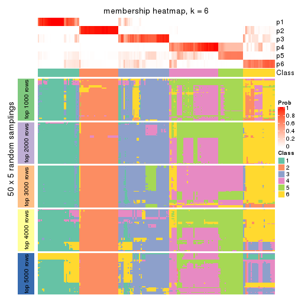</p>

</div>
</div>

As soon as we have had the classes for columns, we can look for signatures
which are significantly different between classes which can be candidate marks
for certain classes. Following are the heatmaps for signatures.


Signature heatmaps where rows are scaled:


<script>
$( function() {
	$( '#tabs-CV-mclust-get-signatures' ).tabs();
} );
</script>
<div id='tabs-CV-mclust-get-signatures'>
<ul>
<li><a href='#tab-CV-mclust-get-signatures-1'>k = 2</a></li>
<li><a href='#tab-CV-mclust-get-signatures-2'>k = 3</a></li>
<li><a href='#tab-CV-mclust-get-signatures-3'>k = 4</a></li>
<li><a href='#tab-CV-mclust-get-signatures-4'>k = 5</a></li>
<li><a href='#tab-CV-mclust-get-signatures-5'>k = 6</a></li>
</ul>
<div id='tab-CV-mclust-get-signatures-1'>
<pre><code class="r">get_signatures(res, k = 2)
</code></pre>

<p></p>

</div>
<div id='tab-CV-mclust-get-signatures-2'>
<pre><code class="r">get_signatures(res, k = 3)
</code></pre>

<p></p>

</div>
<div id='tab-CV-mclust-get-signatures-3'>
<pre><code class="r">get_signatures(res, k = 4)
</code></pre>

<p></p>

</div>
<div id='tab-CV-mclust-get-signatures-4'>
<pre><code class="r">get_signatures(res, k = 5)
</code></pre>

<p></p>

</div>
<div id='tab-CV-mclust-get-signatures-5'>
<pre><code class="r">get_signatures(res, k = 6)
</code></pre>

<p></p>

</div>
</div>


Signature heatmaps where rows are not scaled:


<script>
$( function() {
	$( '#tabs-CV-mclust-get-signatures-no-scale' ).tabs();
} );
</script>
<div id='tabs-CV-mclust-get-signatures-no-scale'>
<ul>
<li><a href='#tab-CV-mclust-get-signatures-no-scale-1'>k = 2</a></li>
<li><a href='#tab-CV-mclust-get-signatures-no-scale-2'>k = 3</a></li>
<li><a href='#tab-CV-mclust-get-signatures-no-scale-3'>k = 4</a></li>
<li><a href='#tab-CV-mclust-get-signatures-no-scale-4'>k = 5</a></li>
<li><a href='#tab-CV-mclust-get-signatures-no-scale-5'>k = 6</a></li>
</ul>
<div id='tab-CV-mclust-get-signatures-no-scale-1'>
<pre><code class="r">get_signatures(res, k = 2, scale_rows = FALSE)
</code></pre>

<p>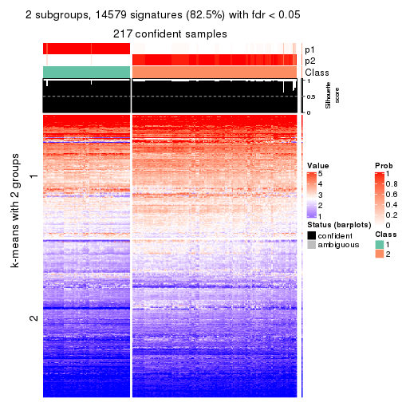</p>

</div>
<div id='tab-CV-mclust-get-signatures-no-scale-2'>
<pre><code class="r">get_signatures(res, k = 3, scale_rows = FALSE)
</code></pre>

<p></p>

</div>
<div id='tab-CV-mclust-get-signatures-no-scale-3'>
<pre><code class="r">get_signatures(res, k = 4, scale_rows = FALSE)
</code></pre>

<p></p>

</div>
<div id='tab-CV-mclust-get-signatures-no-scale-4'>
<pre><code class="r">get_signatures(res, k = 5, scale_rows = FALSE)
</code></pre>

<p></p>

</div>
<div id='tab-CV-mclust-get-signatures-no-scale-5'>
<pre><code class="r">get_signatures(res, k = 6, scale_rows = FALSE)
</code></pre>

<p>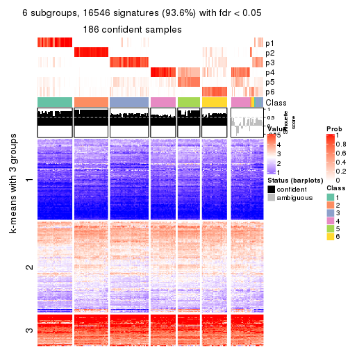</p>

</div>
</div>


Compare the overlap of signatures from different k:

```r
compare_signatures(res)
```


`get_signature()` returns a data frame invisibly. TO get the list of signatures, the function
call should be assigned to a variable explicitly. In following code, if `plot` argument is set
to `FALSE`, no heatmap is plotted while only the differential analysis is performed.

```r
# code only for demonstration
tb = get_signature(res, k = ..., plot = FALSE)
```

An example of the output of `tb` is:

```
#>   which_row         fdr    mean_1    mean_2 scaled_mean_1 scaled_mean_2 km
#> 1        38 0.042760348  8.373488  9.131774    -0.5533452     0.5164555  1
#> 2        40 0.018707592  7.106213  8.469186    -0.6173731     0.5762149  1
#> 3        55 0.019134737 10.221463 11.207825    -0.6159697     0.5749050  1
#> 4        59 0.006059896  5.921854  7.869574    -0.6899429     0.6439467  1
#> 5        60 0.018055526  8.928898 10.211722    -0.6204761     0.5791110  1
#> 6        98 0.009384629 15.714769 14.887706     0.6635654    -0.6193277  2
...
```

The columns in `tb` are:

1. `which_row`: row indices corresponding to the input matrix.
2. `fdr`: FDR for the differential test. 
3. `mean_x`: The mean value in group x.
4. `scaled_mean_x`: The mean value in group x after rows are scaled.
5. `km`: Row groups if k-means clustering is applied to rows.


UMAP plot which shows how samples are separated.


<script>
$( function() {
	$( '#tabs-CV-mclust-dimension-reduction' ).tabs();
} );
</script>
<div id='tabs-CV-mclust-dimension-reduction'>
<ul>
<li><a href='#tab-CV-mclust-dimension-reduction-1'>k = 2</a></li>
<li><a href='#tab-CV-mclust-dimension-reduction-2'>k = 3</a></li>
<li><a href='#tab-CV-mclust-dimension-reduction-3'>k = 4</a></li>
<li><a href='#tab-CV-mclust-dimension-reduction-4'>k = 5</a></li>
<li><a href='#tab-CV-mclust-dimension-reduction-5'>k = 6</a></li>
</ul>
<div id='tab-CV-mclust-dimension-reduction-1'>
<pre><code class="r">dimension_reduction(res, k = 2, method = &quot;UMAP&quot;)
</code></pre>

<p></p>

</div>
<div id='tab-CV-mclust-dimension-reduction-2'>
<pre><code class="r">dimension_reduction(res, k = 3, method = &quot;UMAP&quot;)
</code></pre>

<p></p>

</div>
<div id='tab-CV-mclust-dimension-reduction-3'>
<pre><code class="r">dimension_reduction(res, k = 4, method = &quot;UMAP&quot;)
</code></pre>

<p>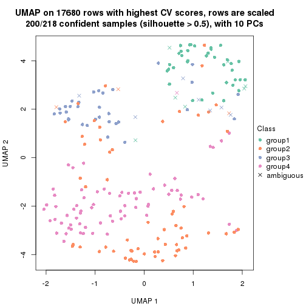</p>

</div>
<div id='tab-CV-mclust-dimension-reduction-4'>
<pre><code class="r">dimension_reduction(res, k = 5, method = &quot;UMAP&quot;)
</code></pre>

<p></p>

</div>
<div id='tab-CV-mclust-dimension-reduction-5'>
<pre><code class="r">dimension_reduction(res, k = 6, method = &quot;UMAP&quot;)
</code></pre>

<p></p>

</div>
</div>


Following heatmap shows how subgroups are split when increasing `k`:

```r
collect_classes(res)
```


If matrix rows can be associated to genes, consider to use `GO_Enrichment(res,
...)` to perform function enrichment for the signature genes.


 

---------------------------------------------------


### CV:NMF*


The object with results only for a single top-value method and a single partition method 
can be extracted as:

```r
res = res_list["CV", "NMF"]
# you can also extract it by
# res = res_list["CV:NMF"]
```

A summary of `res` and all the functions that can be applied to it:

```r
res
```

```
#> A 'ConsensusPartition' object with k = 2, 3, 4, 5, 6.
#>   On a matrix with 17680 rows and 218 columns.
#>   Top rows (1000, 2000, 3000, 4000, 5000) are extracted by 'CV' method.
#>   Subgroups are detected by 'NMF' method.
#>   Performed in total 1250 partitions by row resampling.
#>   Best k for subgroups seems to be 4.
#> 
#> Following methods can be applied to this 'ConsensusPartition' object:
#>  [1] "cola_report"             "collect_classes"         "collect_plots"          
#>  [4] "collect_stats"           "colnames"                "compare_signatures"     
#>  [7] "consensus_heatmap"       "dimension_reduction"     "functional_enrichment"  
#> [10] "get_anno_col"            "get_anno"                "get_classes"            
#> [13] "get_consensus"           "get_matrix"              "get_membership"         
#> [16] "get_param"               "get_signatures"          "get_stats"              
#> [19] "is_best_k"               "is_stable_k"             "membership_heatmap"     
#> [22] "ncol"                    "nrow"                    "plot_ecdf"              
#> [25] "rownames"                "select_partition_number" "show"                   
#> [28] "suggest_best_k"          "test_to_known_factors"
```

`collect_plots()` function collects all the plots made from `res` for all `k` (number of partitions)
into one single page to provide an easy and fast comparison between different `k`.

```r
collect_plots(res)
```


The plots are:

- The first row: a plot of the ECDF (Empirical cumulative distribution
  function) curves of the consensus matrix for each `k` and the heatmap of
  predicted classes for each `k`.
- The second row: heatmaps of the consensus matrix for each `k`.
- The third row: heatmaps of the membership matrix for each `k`.
- The fouth row: heatmaps of the signatures for each `k`.

All the plots in panels can be made by individual functions and they are
plotted later in this section.

`select_partition_number()` produces several plots showing different
statistics for choosing "optimized" `k`. There are following statistics:

- ECDF curves of the consensus matrix for each `k`;
- 1-PAC. [The PAC
  score](https://en.wikipedia.org/wiki/Consensus_clustering#Over-interpretation_potential_of_consensus_clustering)
  measures the proportion of the ambiguous subgrouping.
- Mean silhouette score.
- Concordance. The mean probability of fiting the consensus class ids in all
  partitions.
- Area increased. Denote $A_k$ as the area under the ECDF curve for current
  `k`, the area increased is defined as $A_k - A_{k-1}$.
- Rand index. The percent of pairs of samples that are both in a same cluster
  or both are not in a same cluster in the partition of k and k-1.
- Jaccard index. The ratio of pairs of samples are both in a same cluster in
  the partition of k and k-1 and the pairs of samples are both in a same
  cluster in the partition k or k-1.

The detailed explanations of these statistics can be found in [the cola
vignette](http://bioconductor.org/packages/devel/bioc/vignettes/cola/inst/doc/cola.html#toc_13).

Generally speaking, lower PAC score, higher mean silhouette score or higher
concordance corresponds to better partition. Rand index and Jaccard index
measure how similar the current partition is compared to partition with `k-1`.
If they are too similar, we won't accept `k` is better than `k-1`.

```r
select_partition_number(res)
```


The numeric values for all these statistics can be obtained by `get_stats()`.

```r
get_stats(res)
```

```
#>   k 1-PAC mean_silhouette concordance area_increased  Rand Jaccard
#> 2 2 1.000           0.961       0.985         0.4964 0.502   0.502
#> 3 3 0.740           0.852       0.881         0.2870 0.829   0.667
#> 4 4 0.926           0.925       0.946         0.1522 0.876   0.664
#> 5 5 0.837           0.777       0.896         0.0448 0.966   0.870
#> 6 6 0.810           0.733       0.845         0.0467 0.967   0.861
```

`suggest_best_k()` suggests the best $k$ based on these statistics. The rules are as follows:

- All $k$ with Jaccard index larger than 0.95 are removed because the increase of
  the partition number does not provides enough extra information. If all $k$ are removed,
  the best $k$ is assigned by `NA`.
- For $k$ with 1-PAC larger than 0.9, the maximal $k$ is taken as the "best k". Other $k$ is called "optional k".
- If it does not fit the second rule. The $k$ with the highest vote of highest
  1-PAC, mean silhouette and concordance is taken as the "best k".

```r
suggest_best_k(res)
```

```
#> [1] 4
#> attr(,"optional")
#> [1] 2
```

There is also optional best $k$ = 2 that is worth to check.

Following shows the table of the partitions (You need to click the **show/hide
code output** link to see it). The membership matrix (columns with name `p*`)
is inferred by
[`clue::cl_consensus()`](https://www.rdocumentation.org/link/cl_consensus?package=clue)
function with the `SE` method. Basically the value in the membership matrix
represents the probability to belong to a certain group. The finall class
label for an item is determined with the group with highest probability it
belongs to.

In `get_classes()` function, the entropy is calculated from the membership
matrix and the silhouette score is calculated from the consensus matrix.


<script>
$( function() {
	$( '#tabs-CV-NMF-get-classes' ).tabs();
} );
</script>
<div id='tabs-CV-NMF-get-classes'>
<ul>
<li><a href='#tab-CV-NMF-get-classes-1'>k = 2</a></li>
<li><a href='#tab-CV-NMF-get-classes-2'>k = 3</a></li>
<li><a href='#tab-CV-NMF-get-classes-3'>k = 4</a></li>
<li><a href='#tab-CV-NMF-get-classes-4'>k = 5</a></li>
<li><a href='#tab-CV-NMF-get-classes-5'>k = 6</a></li>
</ul>

<div id='tab-CV-NMF-get-classes-1'>
<p><a id='tab-CV-NMF-get-classes-1-a' style='color:#0366d6' href='#'>show/hide code output</a></p>
<pre><code class="r">cbind(get_classes(res, k = 2), get_membership(res, k = 2))
</code></pre>

<pre><code>#&gt;            class entropy silhouette    p1    p2
#&gt; SRR1498997     2  0.0000     0.9924 0.000 1.000
#&gt; SRR1076441     1  0.0000     0.9739 1.000 0.000
#&gt; SRR1489803     2  0.0000     0.9924 0.000 1.000
#&gt; SRR1345953     2  0.0000     0.9924 0.000 1.000
#&gt; SRR1357826     2  0.0000     0.9924 0.000 1.000
#&gt; SRR1419656     1  0.0000     0.9739 1.000 0.000
#&gt; SRR1454158     2  0.0000     0.9924 0.000 1.000
#&gt; SRR1475408     2  0.0000     0.9924 0.000 1.000
#&gt; SRR1472704     2  0.0000     0.9924 0.000 1.000
#&gt; SRR1090046     1  0.0376     0.9706 0.996 0.004
#&gt; SRR1312822     1  0.0000     0.9739 1.000 0.000
#&gt; SRR1096987     2  0.0000     0.9924 0.000 1.000
#&gt; SRR1334587     2  0.0000     0.9924 0.000 1.000
#&gt; SRR1490246     1  0.0000     0.9739 1.000 0.000
#&gt; SRR1467522     1  0.0000     0.9739 1.000 0.000
#&gt; SRR1324206     1  0.0000     0.9739 1.000 0.000
#&gt; SRR1408574     2  0.0000     0.9924 0.000 1.000
#&gt; SRR1083959     2  0.0000     0.9924 0.000 1.000
#&gt; SRR1079948     2  0.0000     0.9924 0.000 1.000
#&gt; SRR1310667     2  0.0000     0.9924 0.000 1.000
#&gt; SRR655852      2  0.0000     0.9924 0.000 1.000
#&gt; SRR1352457     2  0.0000     0.9924 0.000 1.000
#&gt; SRR1353994     2  0.0000     0.9924 0.000 1.000
#&gt; SRR1459561     2  0.0000     0.9924 0.000 1.000
#&gt; SRR1454009     1  0.0000     0.9739 1.000 0.000
#&gt; SRR1071084     1  0.0000     0.9739 1.000 0.000
#&gt; SRR1082859     2  0.0000     0.9924 0.000 1.000
#&gt; SRR1086538     1  0.0000     0.9739 1.000 0.000
#&gt; SRR1486262     2  0.0000     0.9924 0.000 1.000
#&gt; SRR658105      1  0.0000     0.9739 1.000 0.000
#&gt; SRR811073      2  0.0000     0.9924 0.000 1.000
#&gt; SRR1429181     2  0.0000     0.9924 0.000 1.000
#&gt; SRR1327896     2  0.0000     0.9924 0.000 1.000
#&gt; SRR1464788     2  0.0000     0.9924 0.000 1.000
#&gt; SRR1346861     2  0.0000     0.9924 0.000 1.000
#&gt; SRR1318774     2  0.0000     0.9924 0.000 1.000
#&gt; SRR1420517     1  0.0000     0.9739 1.000 0.000
#&gt; SRR1369584     2  0.0000     0.9924 0.000 1.000
#&gt; SRR1443244     2  0.2236     0.9560 0.036 0.964
#&gt; SRR1455391     1  0.0000     0.9739 1.000 0.000
#&gt; SRR1068999     1  0.0000     0.9739 1.000 0.000
#&gt; SRR1481297     1  0.0000     0.9739 1.000 0.000
#&gt; SRR1070208     1  0.0000     0.9739 1.000 0.000
#&gt; SRR1317282     1  0.0000     0.9739 1.000 0.000
#&gt; SRR1096125     2  0.0000     0.9924 0.000 1.000
#&gt; SRR1472506     1  0.9087     0.5370 0.676 0.324
#&gt; SRR1388281     2  0.0000     0.9924 0.000 1.000
#&gt; SRR1365622     2  0.0000     0.9924 0.000 1.000
#&gt; SRR662306      1  0.0000     0.9739 1.000 0.000
#&gt; SRR662811      1  0.0000     0.9739 1.000 0.000
#&gt; SRR820571      1  0.9998     0.0653 0.508 0.492
#&gt; SRR1357166     1  0.0000     0.9739 1.000 0.000
#&gt; SRR1488586     1  0.0000     0.9739 1.000 0.000
#&gt; SRR1485398     1  0.0000     0.9739 1.000 0.000
#&gt; SRR1417725     2  0.0000     0.9924 0.000 1.000
#&gt; SRR1409397     2  0.0000     0.9924 0.000 1.000
#&gt; SRR1465693     2  0.0000     0.9924 0.000 1.000
#&gt; SRR1096547     1  0.6623     0.7896 0.828 0.172
#&gt; SRR1456818     1  0.0000     0.9739 1.000 0.000
#&gt; SRR816336      1  0.1633     0.9526 0.976 0.024
#&gt; SRR1420238     1  0.0000     0.9739 1.000 0.000
#&gt; SRR1433374     1  0.0000     0.9739 1.000 0.000
#&gt; SRR1436990     1  0.0000     0.9739 1.000 0.000
#&gt; SRR662378      1  0.0000     0.9739 1.000 0.000
#&gt; SRR1477671     1  0.0000     0.9739 1.000 0.000
#&gt; SRR1084079     2  0.2043     0.9602 0.032 0.968
#&gt; SRR1102949     1  0.0000     0.9739 1.000 0.000
#&gt; SRR1458090     1  0.0000     0.9739 1.000 0.000
#&gt; SRR1418729     2  0.0000     0.9924 0.000 1.000
#&gt; SRR1403814     2  0.0000     0.9924 0.000 1.000
#&gt; SRR1404887     2  0.0000     0.9924 0.000 1.000
#&gt; SRR1434955     1  0.0000     0.9739 1.000 0.000
#&gt; SRR1360652     1  0.0000     0.9739 1.000 0.000
#&gt; SRR1356765     2  0.0000     0.9924 0.000 1.000
#&gt; SRR1078258     2  0.0000     0.9924 0.000 1.000
#&gt; SRR1455861     1  0.0000     0.9739 1.000 0.000
#&gt; SRR1420296     2  0.0000     0.9924 0.000 1.000
#&gt; SRR1070260     2  0.0000     0.9924 0.000 1.000
#&gt; SRR1410765     1  0.0000     0.9739 1.000 0.000
#&gt; SRR1481315     1  0.0000     0.9739 1.000 0.000
#&gt; SRR1414661     2  0.0000     0.9924 0.000 1.000
#&gt; SRR1359147     2  0.0000     0.9924 0.000 1.000
#&gt; SRR1488694     2  0.9393     0.4235 0.356 0.644
#&gt; SRR1477273     1  0.0000     0.9739 1.000 0.000
#&gt; SRR1415792     1  0.0000     0.9739 1.000 0.000
#&gt; SRR1369088     2  0.3431     0.9249 0.064 0.936
#&gt; SRR1406621     2  0.0000     0.9924 0.000 1.000
#&gt; SRR1401017     2  0.0000     0.9924 0.000 1.000
#&gt; SRR1099981     2  0.0000     0.9924 0.000 1.000
#&gt; SRR815208      2  0.0000     0.9924 0.000 1.000
#&gt; SRR1380460     2  0.0000     0.9924 0.000 1.000
#&gt; SRR1091097     2  0.0000     0.9924 0.000 1.000
#&gt; SRR1456010     1  0.0000     0.9739 1.000 0.000
#&gt; SRR1498416     2  0.0000     0.9924 0.000 1.000
#&gt; SRR818873      2  0.0000     0.9924 0.000 1.000
#&gt; SRR813868      2  0.0000     0.9924 0.000 1.000
#&gt; SRR1394912     1  0.0000     0.9739 1.000 0.000
#&gt; SRR1475824     2  0.0000     0.9924 0.000 1.000
#&gt; SRR1459866     1  0.0000     0.9739 1.000 0.000
#&gt; SRR1364871     2  0.0000     0.9924 0.000 1.000
#&gt; SRR1100472     2  0.0000     0.9924 0.000 1.000
#&gt; SRR1331267     1  0.0376     0.9706 0.996 0.004
#&gt; SRR1068977     2  0.0000     0.9924 0.000 1.000
#&gt; SRR1391511     2  0.0000     0.9924 0.000 1.000
#&gt; SRR1077920     2  0.0000     0.9924 0.000 1.000
#&gt; SRR1457705     1  0.0000     0.9739 1.000 0.000
#&gt; SRR1437073     1  0.0000     0.9739 1.000 0.000
#&gt; SRR1473124     1  0.0000     0.9739 1.000 0.000
#&gt; SRR1469279     1  0.0000     0.9739 1.000 0.000
#&gt; SRR1091791     2  0.0000     0.9924 0.000 1.000
#&gt; SRR1341539     2  0.0000     0.9924 0.000 1.000
#&gt; SRR1446354     1  0.0000     0.9739 1.000 0.000
#&gt; SRR1415420     1  0.0000     0.9739 1.000 0.000
#&gt; SRR1368050     1  0.0000     0.9739 1.000 0.000
#&gt; SRR656970      2  0.0000     0.9924 0.000 1.000
#&gt; SRR1473403     2  0.0000     0.9924 0.000 1.000
#&gt; SRR1084674     1  0.0000     0.9739 1.000 0.000
#&gt; SRR1464702     1  0.0000     0.9739 1.000 0.000
#&gt; SRR1074860     2  0.0000     0.9924 0.000 1.000
#&gt; SRR655447      2  0.0000     0.9924 0.000 1.000
#&gt; SRR1404442     2  0.0000     0.9924 0.000 1.000
#&gt; SRR1418795     1  0.0000     0.9739 1.000 0.000
#&gt; SRR1458335     2  0.0000     0.9924 0.000 1.000
#&gt; SRR1489589     2  0.0000     0.9924 0.000 1.000
#&gt; SRR1378284     1  0.7376     0.7395 0.792 0.208
#&gt; SRR1408014     2  0.0000     0.9924 0.000 1.000
#&gt; SRR1083052     1  0.0000     0.9739 1.000 0.000
#&gt; SRR1339236     2  0.0000     0.9924 0.000 1.000
#&gt; SRR1323829     2  0.0000     0.9924 0.000 1.000
#&gt; SRR1086772     2  0.0000     0.9924 0.000 1.000
#&gt; SRR1486457     1  0.6712     0.7843 0.824 0.176
#&gt; SRR1415257     2  0.0000     0.9924 0.000 1.000
#&gt; SRR1071905     1  0.0000     0.9739 1.000 0.000
#&gt; SRR659223      2  0.0000     0.9924 0.000 1.000
#&gt; SRR1386945     1  0.0000     0.9739 1.000 0.000
#&gt; SRR821498      2  0.0000     0.9924 0.000 1.000
#&gt; SRR1378903     2  0.0000     0.9924 0.000 1.000
#&gt; SRR1472907     1  0.0000     0.9739 1.000 0.000
#&gt; SRR1442313     2  0.0000     0.9924 0.000 1.000
#&gt; SRR1077139     2  0.0000     0.9924 0.000 1.000
#&gt; SRR1342758     1  0.0000     0.9739 1.000 0.000
#&gt; SRR656911      2  0.0000     0.9924 0.000 1.000
#&gt; SRR1070738     1  0.0000     0.9739 1.000 0.000
#&gt; SRR1476950     1  0.0000     0.9739 1.000 0.000
#&gt; SRR1488196     1  0.0000     0.9739 1.000 0.000
#&gt; SRR1498951     1  0.0000     0.9739 1.000 0.000
#&gt; SRR1413392     1  0.0000     0.9739 1.000 0.000
#&gt; SRR657528      2  0.0000     0.9924 0.000 1.000
#&gt; SRR812198      1  0.0000     0.9739 1.000 0.000
#&gt; SRR660283      2  0.0000     0.9924 0.000 1.000
#&gt; SRR1420936     1  0.0000     0.9739 1.000 0.000
#&gt; SRR1469547     2  0.0000     0.9924 0.000 1.000
#&gt; SRR1322249     1  0.0000     0.9739 1.000 0.000
#&gt; SRR1396682     1  0.0000     0.9739 1.000 0.000
#&gt; SRR1095816     2  0.0000     0.9924 0.000 1.000
#&gt; SRR1081023     1  0.0000     0.9739 1.000 0.000
#&gt; SRR1092517     2  0.0000     0.9924 0.000 1.000
#&gt; SRR811285      2  0.0000     0.9924 0.000 1.000
#&gt; SRR657018      1  0.0000     0.9739 1.000 0.000
#&gt; SRR1365534     1  0.0000     0.9739 1.000 0.000
#&gt; SRR1090791     2  0.0000     0.9924 0.000 1.000
#&gt; SRR1439915     2  0.0000     0.9924 0.000 1.000
#&gt; SRR1391575     2  0.0000     0.9924 0.000 1.000
#&gt; SRR1314092     2  0.0000     0.9924 0.000 1.000
#&gt; SRR1328941     1  0.0000     0.9739 1.000 0.000
#&gt; SRR1336181     2  0.0000     0.9924 0.000 1.000
#&gt; SRR1362972     1  0.0000     0.9739 1.000 0.000
#&gt; SRR1366790     2  0.0000     0.9924 0.000 1.000
#&gt; SRR1455902     1  0.0000     0.9739 1.000 0.000
#&gt; SRR1437644     1  0.9993     0.0952 0.516 0.484
#&gt; SRR1105009     2  0.0000     0.9924 0.000 1.000
#&gt; SRR1367024     1  0.0000     0.9739 1.000 0.000
#&gt; SRR660248      2  0.0000     0.9924 0.000 1.000
#&gt; SRR1409620     1  0.0000     0.9739 1.000 0.000
#&gt; SRR1455807     2  0.0000     0.9924 0.000 1.000
#&gt; SRR1339431     1  0.0000     0.9739 1.000 0.000
#&gt; SRR1378948     2  0.9522     0.3819 0.372 0.628
#&gt; SRR1469237     1  0.0000     0.9739 1.000 0.000
#&gt; SRR1098264     2  0.0000     0.9924 0.000 1.000
#&gt; SRR1406224     2  0.0000     0.9924 0.000 1.000
#&gt; SRR1393026     1  0.0000     0.9739 1.000 0.000
#&gt; SRR808428      2  0.0000     0.9924 0.000 1.000
#&gt; SRR615910      2  0.0000     0.9924 0.000 1.000
#&gt; SRR1076219     1  0.0000     0.9739 1.000 0.000
#&gt; SRR1481128     1  0.0000     0.9739 1.000 0.000
#&gt; SRR1359262     2  0.0000     0.9924 0.000 1.000
#&gt; SRR1407648     2  0.0000     0.9924 0.000 1.000
#&gt; SRR1386775     1  0.9491     0.4390 0.632 0.368
#&gt; SRR1388399     1  0.8144     0.6708 0.748 0.252
#&gt; SRR1361499     2  0.0000     0.9924 0.000 1.000
#&gt; SRR1500709     2  0.0000     0.9924 0.000 1.000
#&gt; SRR1335917     1  0.0000     0.9739 1.000 0.000
#&gt; SRR1430615     2  0.0000     0.9924 0.000 1.000
#&gt; SRR1335212     1  0.0000     0.9739 1.000 0.000
#&gt; SRR1400159     2  0.0000     0.9924 0.000 1.000
#&gt; SRR1457245     2  0.0000     0.9924 0.000 1.000
#&gt; SRR1356746     2  0.0000     0.9924 0.000 1.000
#&gt; SRR658319      2  0.0000     0.9924 0.000 1.000
#&gt; SRR1435946     1  0.0000     0.9739 1.000 0.000
#&gt; SRR1370308     1  0.0000     0.9739 1.000 0.000
#&gt; SRR1100893     1  0.0000     0.9739 1.000 0.000
#&gt; SRR1389432     1  0.0000     0.9739 1.000 0.000
#&gt; SRR1381799     2  0.0000     0.9924 0.000 1.000
#&gt; SRR1310158     1  0.0000     0.9739 1.000 0.000
#&gt; SRR1341100     2  0.0000     0.9924 0.000 1.000
#&gt; SRR1342873     1  0.0000     0.9739 1.000 0.000
#&gt; SRR1472102     2  0.0000     0.9924 0.000 1.000
#&gt; SRR1409421     1  0.0000     0.9739 1.000 0.000
#&gt; SRR1328577     2  0.0000     0.9924 0.000 1.000
#&gt; SRR808942      2  0.0000     0.9924 0.000 1.000
#&gt; SRR1343818     2  0.0000     0.9924 0.000 1.000
#&gt; SRR1472415     2  0.0000     0.9924 0.000 1.000
#&gt; SRR658409      2  0.0000     0.9924 0.000 1.000
#&gt; SRR1469681     1  0.0000     0.9739 1.000 0.000
#&gt; SRR1075484     2  0.0000     0.9924 0.000 1.000
#&gt; SRR1417894     1  0.0000     0.9739 1.000 0.000
#&gt; SRR1417422     2  0.0000     0.9924 0.000 1.000
#&gt; SRR1090674     1  0.0000     0.9739 1.000 0.000
</code></pre>

<script>
$('#tab-CV-NMF-get-classes-1-a').parent().next().next().hide();
$('#tab-CV-NMF-get-classes-1-a').click(function(){
  $('#tab-CV-NMF-get-classes-1-a').parent().next().next().toggle();
  return(false);
});
</script>
</div>

<div id='tab-CV-NMF-get-classes-2'>
<p><a id='tab-CV-NMF-get-classes-2-a' style='color:#0366d6' href='#'>show/hide code output</a></p>
<pre><code class="r">cbind(get_classes(res, k = 3), get_membership(res, k = 3))
</code></pre>

<pre><code>#&gt;            class entropy silhouette    p1    p2    p3
#&gt; SRR1498997     2  0.0000     0.9574 0.000 1.000 0.000
#&gt; SRR1076441     1  0.0000     0.8750 1.000 0.000 0.000
#&gt; SRR1489803     3  0.5591     0.8656 0.000 0.304 0.696
#&gt; SRR1345953     2  0.0000     0.9574 0.000 1.000 0.000
#&gt; SRR1357826     2  0.0000     0.9574 0.000 1.000 0.000
#&gt; SRR1419656     1  0.0000     0.8750 1.000 0.000 0.000
#&gt; SRR1454158     2  0.0000     0.9574 0.000 1.000 0.000
#&gt; SRR1475408     2  0.5650     0.4666 0.000 0.688 0.312
#&gt; SRR1472704     2  0.0000     0.9574 0.000 1.000 0.000
#&gt; SRR1090046     1  0.4399     0.8280 0.812 0.000 0.188
#&gt; SRR1312822     1  0.0000     0.8750 1.000 0.000 0.000
#&gt; SRR1096987     2  0.0000     0.9574 0.000 1.000 0.000
#&gt; SRR1334587     3  0.5591     0.8656 0.000 0.304 0.696
#&gt; SRR1490246     1  0.0000     0.8750 1.000 0.000 0.000
#&gt; SRR1467522     1  0.0000     0.8750 1.000 0.000 0.000
#&gt; SRR1324206     1  0.0000     0.8750 1.000 0.000 0.000
#&gt; SRR1408574     3  0.5591     0.8656 0.000 0.304 0.696
#&gt; SRR1083959     2  0.0000     0.9574 0.000 1.000 0.000
#&gt; SRR1079948     2  0.0000     0.9574 0.000 1.000 0.000
#&gt; SRR1310667     3  0.5591     0.8656 0.000 0.304 0.696
#&gt; SRR655852      2  0.0000     0.9574 0.000 1.000 0.000
#&gt; SRR1352457     3  0.5591     0.8656 0.000 0.304 0.696
#&gt; SRR1353994     2  0.0000     0.9574 0.000 1.000 0.000
#&gt; SRR1459561     3  0.5591     0.8656 0.000 0.304 0.696
#&gt; SRR1454009     1  0.5591     0.7938 0.696 0.000 0.304
#&gt; SRR1071084     1  0.5591     0.7938 0.696 0.000 0.304
#&gt; SRR1082859     2  0.0000     0.9574 0.000 1.000 0.000
#&gt; SRR1086538     1  0.0000     0.8750 1.000 0.000 0.000
#&gt; SRR1486262     2  0.0000     0.9574 0.000 1.000 0.000
#&gt; SRR658105      1  0.0000     0.8750 1.000 0.000 0.000
#&gt; SRR811073      2  0.0000     0.9574 0.000 1.000 0.000
#&gt; SRR1429181     3  0.6045     0.7521 0.000 0.380 0.620
#&gt; SRR1327896     2  0.0000     0.9574 0.000 1.000 0.000
#&gt; SRR1464788     3  0.5591     0.8656 0.000 0.304 0.696
#&gt; SRR1346861     2  0.0000     0.9574 0.000 1.000 0.000
#&gt; SRR1318774     2  0.0000     0.9574 0.000 1.000 0.000
#&gt; SRR1420517     1  0.5591     0.7938 0.696 0.000 0.304
#&gt; SRR1369584     3  0.5591     0.8656 0.000 0.304 0.696
#&gt; SRR1443244     2  0.2711     0.8304 0.088 0.912 0.000
#&gt; SRR1455391     1  0.5591     0.7938 0.696 0.000 0.304
#&gt; SRR1068999     1  0.0000     0.8750 1.000 0.000 0.000
#&gt; SRR1481297     1  0.5591     0.7938 0.696 0.000 0.304
#&gt; SRR1070208     1  0.0000     0.8750 1.000 0.000 0.000
#&gt; SRR1317282     1  0.5560     0.7954 0.700 0.000 0.300
#&gt; SRR1096125     2  0.0000     0.9574 0.000 1.000 0.000
#&gt; SRR1472506     3  0.9520    -0.2972 0.352 0.196 0.452
#&gt; SRR1388281     2  0.0000     0.9574 0.000 1.000 0.000
#&gt; SRR1365622     3  0.5591     0.8656 0.000 0.304 0.696
#&gt; SRR662306      1  0.5591     0.7938 0.696 0.000 0.304
#&gt; SRR662811      1  0.0000     0.8750 1.000 0.000 0.000
#&gt; SRR820571      3  0.4399     0.7905 0.000 0.188 0.812
#&gt; SRR1357166     1  0.5591     0.7938 0.696 0.000 0.304
#&gt; SRR1488586     1  0.4974     0.7586 0.764 0.000 0.236
#&gt; SRR1485398     1  0.0000     0.8750 1.000 0.000 0.000
#&gt; SRR1417725     2  0.5560     0.5112 0.000 0.700 0.300
#&gt; SRR1409397     3  0.0747     0.6593 0.000 0.016 0.984
#&gt; SRR1465693     3  0.5591     0.8656 0.000 0.304 0.696
#&gt; SRR1096547     1  0.9423     0.5442 0.492 0.204 0.304
#&gt; SRR1456818     1  0.0000     0.8750 1.000 0.000 0.000
#&gt; SRR816336      1  0.5591     0.7938 0.696 0.000 0.304
#&gt; SRR1420238     1  0.0000     0.8750 1.000 0.000 0.000
#&gt; SRR1433374     1  0.5591     0.7938 0.696 0.000 0.304
#&gt; SRR1436990     1  0.0000     0.8750 1.000 0.000 0.000
#&gt; SRR662378      1  0.0000     0.8750 1.000 0.000 0.000
#&gt; SRR1477671     1  0.0000     0.8750 1.000 0.000 0.000
#&gt; SRR1084079     2  0.0424     0.9465 0.008 0.992 0.000
#&gt; SRR1102949     1  0.0000     0.8750 1.000 0.000 0.000
#&gt; SRR1458090     1  0.0000     0.8750 1.000 0.000 0.000
#&gt; SRR1418729     2  0.0000     0.9574 0.000 1.000 0.000
#&gt; SRR1403814     2  0.0000     0.9574 0.000 1.000 0.000
#&gt; SRR1404887     2  0.0000     0.9574 0.000 1.000 0.000
#&gt; SRR1434955     1  0.0000     0.8750 1.000 0.000 0.000
#&gt; SRR1360652     1  0.0000     0.8750 1.000 0.000 0.000
#&gt; SRR1356765     3  0.5591     0.8656 0.000 0.304 0.696
#&gt; SRR1078258     2  0.0000     0.9574 0.000 1.000 0.000
#&gt; SRR1455861     1  0.0000     0.8750 1.000 0.000 0.000
#&gt; SRR1420296     3  0.5591     0.8656 0.000 0.304 0.696
#&gt; SRR1070260     2  0.0000     0.9574 0.000 1.000 0.000
#&gt; SRR1410765     1  0.0000     0.8750 1.000 0.000 0.000
#&gt; SRR1481315     1  0.0000     0.8750 1.000 0.000 0.000
#&gt; SRR1414661     2  0.0000     0.9574 0.000 1.000 0.000
#&gt; SRR1359147     2  0.0000     0.9574 0.000 1.000 0.000
#&gt; SRR1488694     2  0.6192     0.3102 0.420 0.580 0.000
#&gt; SRR1477273     1  0.5591     0.7938 0.696 0.000 0.304
#&gt; SRR1415792     1  0.6225     0.6528 0.568 0.000 0.432
#&gt; SRR1369088     3  0.5815     0.8621 0.004 0.304 0.692
#&gt; SRR1406621     3  0.5591     0.8656 0.000 0.304 0.696
#&gt; SRR1401017     3  0.0000     0.6410 0.000 0.000 1.000
#&gt; SRR1099981     3  0.5591     0.8656 0.000 0.304 0.696
#&gt; SRR815208      2  0.0000     0.9574 0.000 1.000 0.000
#&gt; SRR1380460     2  0.0000     0.9574 0.000 1.000 0.000
#&gt; SRR1091097     2  0.0000     0.9574 0.000 1.000 0.000
#&gt; SRR1456010     1  0.5560     0.7954 0.700 0.000 0.300
#&gt; SRR1498416     2  0.0000     0.9574 0.000 1.000 0.000
#&gt; SRR818873      3  0.5591     0.8656 0.000 0.304 0.696
#&gt; SRR813868      2  0.0000     0.9574 0.000 1.000 0.000
#&gt; SRR1394912     1  0.0000     0.8750 1.000 0.000 0.000
#&gt; SRR1475824     2  0.0000     0.9574 0.000 1.000 0.000
#&gt; SRR1459866     1  0.0000     0.8750 1.000 0.000 0.000
#&gt; SRR1364871     2  0.0000     0.9574 0.000 1.000 0.000
#&gt; SRR1100472     2  0.0000     0.9574 0.000 1.000 0.000
#&gt; SRR1331267     1  0.4842     0.6284 0.776 0.224 0.000
#&gt; SRR1068977     3  0.5591     0.8656 0.000 0.304 0.696
#&gt; SRR1391511     2  0.0000     0.9574 0.000 1.000 0.000
#&gt; SRR1077920     2  0.0000     0.9574 0.000 1.000 0.000
#&gt; SRR1457705     1  0.5560     0.7954 0.700 0.000 0.300
#&gt; SRR1437073     1  0.0000     0.8750 1.000 0.000 0.000
#&gt; SRR1473124     1  0.5591     0.7938 0.696 0.000 0.304
#&gt; SRR1469279     1  0.1289     0.8677 0.968 0.000 0.032
#&gt; SRR1091791     2  0.0000     0.9574 0.000 1.000 0.000
#&gt; SRR1341539     3  0.5591     0.8656 0.000 0.304 0.696
#&gt; SRR1446354     1  0.5591     0.7938 0.696 0.000 0.304
#&gt; SRR1415420     1  0.0000     0.8750 1.000 0.000 0.000
#&gt; SRR1368050     1  0.0000     0.8750 1.000 0.000 0.000
#&gt; SRR656970      3  0.5591     0.8656 0.000 0.304 0.696
#&gt; SRR1473403     2  0.0000     0.9574 0.000 1.000 0.000
#&gt; SRR1084674     1  0.5591     0.7938 0.696 0.000 0.304
#&gt; SRR1464702     1  0.5363     0.8037 0.724 0.000 0.276
#&gt; SRR1074860     2  0.0000     0.9574 0.000 1.000 0.000
#&gt; SRR655447      2  0.0000     0.9574 0.000 1.000 0.000
#&gt; SRR1404442     2  0.0000     0.9574 0.000 1.000 0.000
#&gt; SRR1418795     1  0.0000     0.8750 1.000 0.000 0.000
#&gt; SRR1458335     2  0.0000     0.9574 0.000 1.000 0.000
#&gt; SRR1489589     3  0.0000     0.6410 0.000 0.000 1.000
#&gt; SRR1378284     3  0.5678     0.5194 0.316 0.000 0.684
#&gt; SRR1408014     3  0.5591     0.8656 0.000 0.304 0.696
#&gt; SRR1083052     1  0.0000     0.8750 1.000 0.000 0.000
#&gt; SRR1339236     3  0.0000     0.6410 0.000 0.000 1.000
#&gt; SRR1323829     3  0.5591     0.8656 0.000 0.304 0.696
#&gt; SRR1086772     2  0.0000     0.9574 0.000 1.000 0.000
#&gt; SRR1486457     3  0.0000     0.6410 0.000 0.000 1.000
#&gt; SRR1415257     3  0.5591     0.8656 0.000 0.304 0.696
#&gt; SRR1071905     1  0.5591     0.7938 0.696 0.000 0.304
#&gt; SRR659223      3  0.5591     0.8656 0.000 0.304 0.696
#&gt; SRR1386945     1  0.5560     0.7954 0.700 0.000 0.300
#&gt; SRR821498      2  0.0000     0.9574 0.000 1.000 0.000
#&gt; SRR1378903     2  0.0000     0.9574 0.000 1.000 0.000
#&gt; SRR1472907     1  0.5591     0.7938 0.696 0.000 0.304
#&gt; SRR1442313     2  0.0000     0.9574 0.000 1.000 0.000
#&gt; SRR1077139     3  0.5591     0.8656 0.000 0.304 0.696
#&gt; SRR1342758     1  0.0000     0.8750 1.000 0.000 0.000
#&gt; SRR656911      2  0.0000     0.9574 0.000 1.000 0.000
#&gt; SRR1070738     1  0.0000     0.8750 1.000 0.000 0.000
#&gt; SRR1476950     1  0.0000     0.8750 1.000 0.000 0.000
#&gt; SRR1488196     1  0.5591     0.7938 0.696 0.000 0.304
#&gt; SRR1498951     1  0.5591     0.7938 0.696 0.000 0.304
#&gt; SRR1413392     1  0.0000     0.8750 1.000 0.000 0.000
#&gt; SRR657528      3  0.4062     0.7741 0.000 0.164 0.836
#&gt; SRR812198      1  0.0000     0.8750 1.000 0.000 0.000
#&gt; SRR660283      2  0.0000     0.9574 0.000 1.000 0.000
#&gt; SRR1420936     1  0.0000     0.8750 1.000 0.000 0.000
#&gt; SRR1469547     2  0.0000     0.9574 0.000 1.000 0.000
#&gt; SRR1322249     1  0.0000     0.8750 1.000 0.000 0.000
#&gt; SRR1396682     1  0.0000     0.8750 1.000 0.000 0.000
#&gt; SRR1095816     2  0.0000     0.9574 0.000 1.000 0.000
#&gt; SRR1081023     1  0.0000     0.8750 1.000 0.000 0.000
#&gt; SRR1092517     2  0.0000     0.9574 0.000 1.000 0.000
#&gt; SRR811285      3  0.5591     0.8656 0.000 0.304 0.696
#&gt; SRR657018      1  0.0000     0.8750 1.000 0.000 0.000
#&gt; SRR1365534     1  0.5591     0.7938 0.696 0.000 0.304
#&gt; SRR1090791     3  0.5591     0.8656 0.000 0.304 0.696
#&gt; SRR1439915     3  0.0000     0.6410 0.000 0.000 1.000
#&gt; SRR1391575     2  0.0000     0.9574 0.000 1.000 0.000
#&gt; SRR1314092     2  0.0000     0.9574 0.000 1.000 0.000
#&gt; SRR1328941     1  0.5591     0.7938 0.696 0.000 0.304
#&gt; SRR1336181     2  0.0000     0.9574 0.000 1.000 0.000
#&gt; SRR1362972     1  0.0000     0.8750 1.000 0.000 0.000
#&gt; SRR1366790     2  0.0000     0.9574 0.000 1.000 0.000
#&gt; SRR1455902     1  0.5591     0.7938 0.696 0.000 0.304
#&gt; SRR1437644     2  0.7433     0.5014 0.168 0.700 0.132
#&gt; SRR1105009     2  0.0000     0.9574 0.000 1.000 0.000
#&gt; SRR1367024     1  0.5591     0.7938 0.696 0.000 0.304
#&gt; SRR660248      2  0.5988     0.4217 0.000 0.632 0.368
#&gt; SRR1409620     1  0.0000     0.8750 1.000 0.000 0.000
#&gt; SRR1455807     2  0.0000     0.9574 0.000 1.000 0.000
#&gt; SRR1339431     1  0.0000     0.8750 1.000 0.000 0.000
#&gt; SRR1378948     2  0.9659     0.0837 0.252 0.464 0.284
#&gt; SRR1469237     1  0.0000     0.8750 1.000 0.000 0.000
#&gt; SRR1098264     2  0.0000     0.9574 0.000 1.000 0.000
#&gt; SRR1406224     3  0.5650     0.8557 0.000 0.312 0.688
#&gt; SRR1393026     1  0.4931     0.8164 0.768 0.000 0.232
#&gt; SRR808428      2  0.0000     0.9574 0.000 1.000 0.000
#&gt; SRR615910      3  0.5591     0.8656 0.000 0.304 0.696
#&gt; SRR1076219     1  0.5431     0.8011 0.716 0.000 0.284
#&gt; SRR1481128     1  0.0000     0.8750 1.000 0.000 0.000
#&gt; SRR1359262     3  0.5591     0.8656 0.000 0.304 0.696
#&gt; SRR1407648     2  0.0000     0.9574 0.000 1.000 0.000
#&gt; SRR1386775     1  0.5363     0.5608 0.724 0.276 0.000
#&gt; SRR1388399     3  0.6965     0.6369 0.244 0.060 0.696
#&gt; SRR1361499     2  0.0000     0.9574 0.000 1.000 0.000
#&gt; SRR1500709     2  0.0000     0.9574 0.000 1.000 0.000
#&gt; SRR1335917     1  0.0000     0.8750 1.000 0.000 0.000
#&gt; SRR1430615     3  0.5591     0.8656 0.000 0.304 0.696
#&gt; SRR1335212     1  0.5560     0.7954 0.700 0.000 0.300
#&gt; SRR1400159     3  0.0000     0.6410 0.000 0.000 1.000
#&gt; SRR1457245     2  0.0000     0.9574 0.000 1.000 0.000
#&gt; SRR1356746     2  0.0000     0.9574 0.000 1.000 0.000
#&gt; SRR658319      2  0.0000     0.9574 0.000 1.000 0.000
#&gt; SRR1435946     1  0.0000     0.8750 1.000 0.000 0.000
#&gt; SRR1370308     1  0.0000     0.8750 1.000 0.000 0.000
#&gt; SRR1100893     1  0.0000     0.8750 1.000 0.000 0.000
#&gt; SRR1389432     1  0.5560     0.7954 0.700 0.000 0.300
#&gt; SRR1381799     2  0.0000     0.9574 0.000 1.000 0.000
#&gt; SRR1310158     1  0.5591     0.7938 0.696 0.000 0.304
#&gt; SRR1341100     2  0.0000     0.9574 0.000 1.000 0.000
#&gt; SRR1342873     1  0.0000     0.8750 1.000 0.000 0.000
#&gt; SRR1472102     3  0.5591     0.8656 0.000 0.304 0.696
#&gt; SRR1409421     1  0.5591     0.7938 0.696 0.000 0.304
#&gt; SRR1328577     2  0.0000     0.9574 0.000 1.000 0.000
#&gt; SRR808942      2  0.0000     0.9574 0.000 1.000 0.000
#&gt; SRR1343818     2  0.0000     0.9574 0.000 1.000 0.000
#&gt; SRR1472415     2  0.0000     0.9574 0.000 1.000 0.000
#&gt; SRR658409      2  0.0000     0.9574 0.000 1.000 0.000
#&gt; SRR1469681     1  0.0000     0.8750 1.000 0.000 0.000
#&gt; SRR1075484     3  0.5591     0.8656 0.000 0.304 0.696
#&gt; SRR1417894     1  0.5591     0.7938 0.696 0.000 0.304
#&gt; SRR1417422     3  0.4452     0.7773 0.000 0.192 0.808
#&gt; SRR1090674     1  0.0000     0.8750 1.000 0.000 0.000
</code></pre>

<script>
$('#tab-CV-NMF-get-classes-2-a').parent().next().next().hide();
$('#tab-CV-NMF-get-classes-2-a').click(function(){
  $('#tab-CV-NMF-get-classes-2-a').parent().next().next().toggle();
  return(false);
});
</script>
</div>

<div id='tab-CV-NMF-get-classes-3'>
<p><a id='tab-CV-NMF-get-classes-3-a' style='color:#0366d6' href='#'>show/hide code output</a></p>
<pre><code class="r">cbind(get_classes(res, k = 4), get_membership(res, k = 4))
</code></pre>

<pre><code>#&gt;            class entropy silhouette    p1    p2    p3    p4
#&gt; SRR1498997     4  0.0592     0.9617 0.000 0.000 0.016 0.984
#&gt; SRR1076441     1  0.0000     0.9626 1.000 0.000 0.000 0.000
#&gt; SRR1489803     2  0.0188     0.9793 0.000 0.996 0.000 0.004
#&gt; SRR1345953     4  0.0817     0.9614 0.000 0.000 0.024 0.976
#&gt; SRR1357826     4  0.0592     0.9617 0.000 0.000 0.016 0.984
#&gt; SRR1419656     3  0.2999     0.9025 0.132 0.004 0.864 0.000
#&gt; SRR1454158     4  0.0592     0.9617 0.000 0.000 0.016 0.984
#&gt; SRR1475408     4  0.4992     0.0390 0.000 0.000 0.476 0.524
#&gt; SRR1472704     4  0.0592     0.9617 0.000 0.000 0.016 0.984
#&gt; SRR1090046     3  0.5977     0.7556 0.192 0.000 0.688 0.120
#&gt; SRR1312822     1  0.0000     0.9626 1.000 0.000 0.000 0.000
#&gt; SRR1096987     4  0.1867     0.9460 0.000 0.000 0.072 0.928
#&gt; SRR1334587     2  0.0336     0.9808 0.000 0.992 0.000 0.008
#&gt; SRR1490246     1  0.0000     0.9626 1.000 0.000 0.000 0.000
#&gt; SRR1467522     1  0.0000     0.9626 1.000 0.000 0.000 0.000
#&gt; SRR1324206     1  0.0000     0.9626 1.000 0.000 0.000 0.000
#&gt; SRR1408574     2  0.0336     0.9808 0.000 0.992 0.000 0.008
#&gt; SRR1083959     4  0.0469     0.9625 0.000 0.000 0.012 0.988
#&gt; SRR1079948     4  0.1474     0.9546 0.000 0.000 0.052 0.948
#&gt; SRR1310667     2  0.0188     0.9793 0.000 0.996 0.000 0.004
#&gt; SRR655852      4  0.1389     0.9559 0.000 0.000 0.048 0.952
#&gt; SRR1352457     2  0.0336     0.9808 0.000 0.992 0.000 0.008
#&gt; SRR1353994     4  0.0188     0.9634 0.000 0.000 0.004 0.996
#&gt; SRR1459561     2  0.0188     0.9793 0.000 0.996 0.000 0.004
#&gt; SRR1454009     3  0.2334     0.9283 0.088 0.004 0.908 0.000
#&gt; SRR1071084     3  0.2149     0.9287 0.088 0.000 0.912 0.000
#&gt; SRR1082859     4  0.0592     0.9617 0.000 0.000 0.016 0.984
#&gt; SRR1086538     1  0.0000     0.9626 1.000 0.000 0.000 0.000
#&gt; SRR1486262     4  0.1792     0.9480 0.000 0.000 0.068 0.932
#&gt; SRR658105      1  0.0000     0.9626 1.000 0.000 0.000 0.000
#&gt; SRR811073      4  0.0000     0.9633 0.000 0.000 0.000 1.000
#&gt; SRR1429181     2  0.0336     0.9808 0.000 0.992 0.000 0.008
#&gt; SRR1327896     4  0.1118     0.9590 0.000 0.000 0.036 0.964
#&gt; SRR1464788     2  0.0336     0.9808 0.000 0.992 0.000 0.008
#&gt; SRR1346861     4  0.0592     0.9617 0.000 0.000 0.016 0.984
#&gt; SRR1318774     4  0.0188     0.9634 0.000 0.000 0.004 0.996
#&gt; SRR1420517     3  0.2466     0.9264 0.096 0.004 0.900 0.000
#&gt; SRR1369584     2  0.0336     0.9808 0.000 0.992 0.000 0.008
#&gt; SRR1443244     4  0.1867     0.9460 0.000 0.000 0.072 0.928
#&gt; SRR1455391     3  0.2593     0.9230 0.104 0.004 0.892 0.000
#&gt; SRR1068999     1  0.0779     0.9489 0.980 0.004 0.016 0.000
#&gt; SRR1481297     3  0.2334     0.9282 0.088 0.004 0.908 0.000
#&gt; SRR1070208     1  0.2593     0.8536 0.892 0.004 0.104 0.000
#&gt; SRR1317282     3  0.2401     0.9277 0.092 0.004 0.904 0.000
#&gt; SRR1096125     4  0.1389     0.9562 0.000 0.000 0.048 0.952
#&gt; SRR1472506     3  0.3072     0.7814 0.004 0.004 0.868 0.124
#&gt; SRR1388281     4  0.0469     0.9625 0.000 0.000 0.012 0.988
#&gt; SRR1365622     2  0.0336     0.9808 0.000 0.992 0.000 0.008
#&gt; SRR662306      3  0.2149     0.9287 0.088 0.000 0.912 0.000
#&gt; SRR662811      1  0.0000     0.9626 1.000 0.000 0.000 0.000
#&gt; SRR820571      2  0.0188     0.9751 0.000 0.996 0.004 0.000
#&gt; SRR1357166     3  0.2831     0.9135 0.120 0.004 0.876 0.000
#&gt; SRR1488586     1  0.4770     0.5933 0.700 0.288 0.012 0.000
#&gt; SRR1485398     1  0.0000     0.9626 1.000 0.000 0.000 0.000
#&gt; SRR1417725     3  0.3870     0.7359 0.000 0.004 0.788 0.208
#&gt; SRR1409397     2  0.0188     0.9761 0.000 0.996 0.004 0.000
#&gt; SRR1465693     2  0.0336     0.9808 0.000 0.992 0.000 0.008
#&gt; SRR1096547     3  0.4171     0.8334 0.060 0.000 0.824 0.116
#&gt; SRR1456818     1  0.0188     0.9595 0.996 0.000 0.004 0.000
#&gt; SRR816336      3  0.2125     0.9219 0.076 0.004 0.920 0.000
#&gt; SRR1420238     1  0.0000     0.9626 1.000 0.000 0.000 0.000
#&gt; SRR1433374     3  0.2334     0.9283 0.088 0.004 0.908 0.000
#&gt; SRR1436990     1  0.0000     0.9626 1.000 0.000 0.000 0.000
#&gt; SRR662378      1  0.0000     0.9626 1.000 0.000 0.000 0.000
#&gt; SRR1477671     1  0.0000     0.9626 1.000 0.000 0.000 0.000
#&gt; SRR1084079     4  0.1867     0.9460 0.000 0.000 0.072 0.928
#&gt; SRR1102949     1  0.0000     0.9626 1.000 0.000 0.000 0.000
#&gt; SRR1458090     1  0.0000     0.9626 1.000 0.000 0.000 0.000
#&gt; SRR1418729     4  0.0469     0.9625 0.000 0.000 0.012 0.988
#&gt; SRR1403814     4  0.1867     0.9460 0.000 0.000 0.072 0.928
#&gt; SRR1404887     4  0.1867     0.9460 0.000 0.000 0.072 0.928
#&gt; SRR1434955     1  0.0000     0.9626 1.000 0.000 0.000 0.000
#&gt; SRR1360652     1  0.0336     0.9560 0.992 0.000 0.008 0.000
#&gt; SRR1356765     2  0.0336     0.9808 0.000 0.992 0.000 0.008
#&gt; SRR1078258     4  0.0000     0.9633 0.000 0.000 0.000 1.000
#&gt; SRR1455861     1  0.0000     0.9626 1.000 0.000 0.000 0.000
#&gt; SRR1420296     2  0.0188     0.9793 0.000 0.996 0.000 0.004
#&gt; SRR1070260     4  0.0469     0.9625 0.000 0.000 0.012 0.988
#&gt; SRR1410765     1  0.0000     0.9626 1.000 0.000 0.000 0.000
#&gt; SRR1481315     1  0.2329     0.8791 0.916 0.000 0.072 0.012
#&gt; SRR1414661     4  0.0336     0.9630 0.000 0.000 0.008 0.992
#&gt; SRR1359147     4  0.1792     0.9480 0.000 0.000 0.068 0.932
#&gt; SRR1488694     1  0.5318     0.6559 0.732 0.000 0.072 0.196
#&gt; SRR1477273     3  0.2149     0.9287 0.088 0.000 0.912 0.000
#&gt; SRR1415792     3  0.6553     0.5581 0.100 0.316 0.584 0.000
#&gt; SRR1369088     2  0.0336     0.9808 0.000 0.992 0.000 0.008
#&gt; SRR1406621     2  0.0336     0.9808 0.000 0.992 0.000 0.008
#&gt; SRR1401017     2  0.0188     0.9761 0.000 0.996 0.004 0.000
#&gt; SRR1099981     2  0.0336     0.9808 0.000 0.992 0.000 0.008
#&gt; SRR815208      4  0.0469     0.9625 0.000 0.000 0.012 0.988
#&gt; SRR1380460     4  0.0000     0.9633 0.000 0.000 0.000 1.000
#&gt; SRR1091097     4  0.1474     0.9546 0.000 0.000 0.052 0.948
#&gt; SRR1456010     3  0.2466     0.9264 0.096 0.004 0.900 0.000
#&gt; SRR1498416     4  0.1389     0.9560 0.000 0.000 0.048 0.952
#&gt; SRR818873      2  0.0188     0.9761 0.000 0.996 0.004 0.000
#&gt; SRR813868      4  0.0592     0.9617 0.000 0.000 0.016 0.984
#&gt; SRR1394912     1  0.0000     0.9626 1.000 0.000 0.000 0.000
#&gt; SRR1475824     2  0.6458     0.1593 0.000 0.520 0.072 0.408
#&gt; SRR1459866     1  0.0000     0.9626 1.000 0.000 0.000 0.000
#&gt; SRR1364871     4  0.1398     0.9582 0.000 0.004 0.040 0.956
#&gt; SRR1100472     4  0.0188     0.9634 0.000 0.000 0.004 0.996
#&gt; SRR1331267     1  0.3693     0.8192 0.856 0.000 0.072 0.072
#&gt; SRR1068977     2  0.0336     0.9808 0.000 0.992 0.000 0.008
#&gt; SRR1391511     4  0.0592     0.9617 0.000 0.000 0.016 0.984
#&gt; SRR1077920     4  0.0592     0.9617 0.000 0.000 0.016 0.984
#&gt; SRR1457705     3  0.2654     0.9208 0.108 0.004 0.888 0.000
#&gt; SRR1437073     1  0.0707     0.9471 0.980 0.000 0.020 0.000
#&gt; SRR1473124     3  0.2334     0.9282 0.088 0.004 0.908 0.000
#&gt; SRR1469279     3  0.3908     0.8268 0.212 0.004 0.784 0.000
#&gt; SRR1091791     4  0.1389     0.9559 0.000 0.000 0.048 0.952
#&gt; SRR1341539     2  0.0336     0.9808 0.000 0.992 0.000 0.008
#&gt; SRR1446354     3  0.2334     0.9283 0.088 0.004 0.908 0.000
#&gt; SRR1415420     1  0.0000     0.9626 1.000 0.000 0.000 0.000
#&gt; SRR1368050     1  0.2647     0.8426 0.880 0.000 0.120 0.000
#&gt; SRR656970      2  0.0188     0.9793 0.000 0.996 0.000 0.004
#&gt; SRR1473403     4  0.0469     0.9636 0.000 0.000 0.012 0.988
#&gt; SRR1084674     3  0.3674     0.9041 0.104 0.044 0.852 0.000
#&gt; SRR1464702     3  0.2868     0.9029 0.136 0.000 0.864 0.000
#&gt; SRR1074860     4  0.1867     0.9460 0.000 0.000 0.072 0.928
#&gt; SRR655447      4  0.0188     0.9634 0.000 0.000 0.004 0.996
#&gt; SRR1404442     4  0.0592     0.9617 0.000 0.000 0.016 0.984
#&gt; SRR1418795     1  0.0000     0.9626 1.000 0.000 0.000 0.000
#&gt; SRR1458335     4  0.0707     0.9601 0.000 0.000 0.020 0.980
#&gt; SRR1489589     2  0.0188     0.9761 0.000 0.996 0.004 0.000
#&gt; SRR1378284     2  0.0336     0.9742 0.008 0.992 0.000 0.000
#&gt; SRR1408014     2  0.0336     0.9808 0.000 0.992 0.000 0.008
#&gt; SRR1083052     1  0.0000     0.9626 1.000 0.000 0.000 0.000
#&gt; SRR1339236     2  0.0188     0.9761 0.000 0.996 0.004 0.000
#&gt; SRR1323829     2  0.0336     0.9808 0.000 0.992 0.000 0.008
#&gt; SRR1086772     4  0.0921     0.9607 0.000 0.000 0.028 0.972
#&gt; SRR1486457     3  0.3870     0.7323 0.004 0.208 0.788 0.000
#&gt; SRR1415257     2  0.0336     0.9808 0.000 0.992 0.000 0.008
#&gt; SRR1071905     3  0.2401     0.9278 0.092 0.004 0.904 0.000
#&gt; SRR659223      2  0.0336     0.9808 0.000 0.992 0.000 0.008
#&gt; SRR1386945     3  0.2149     0.9287 0.088 0.000 0.912 0.000
#&gt; SRR821498      4  0.1004     0.9611 0.000 0.004 0.024 0.972
#&gt; SRR1378903     4  0.1867     0.9460 0.000 0.000 0.072 0.928
#&gt; SRR1472907     3  0.2334     0.9282 0.088 0.004 0.908 0.000
#&gt; SRR1442313     4  0.0592     0.9617 0.000 0.000 0.016 0.984
#&gt; SRR1077139     2  0.0336     0.9808 0.000 0.992 0.000 0.008
#&gt; SRR1342758     1  0.0000     0.9626 1.000 0.000 0.000 0.000
#&gt; SRR656911      4  0.0592     0.9617 0.000 0.000 0.016 0.984
#&gt; SRR1070738     1  0.0000     0.9626 1.000 0.000 0.000 0.000
#&gt; SRR1476950     1  0.2466     0.8732 0.900 0.004 0.096 0.000
#&gt; SRR1488196     3  0.2334     0.9283 0.088 0.004 0.908 0.000
#&gt; SRR1498951     3  0.2334     0.9282 0.088 0.004 0.908 0.000
#&gt; SRR1413392     1  0.0000     0.9626 1.000 0.000 0.000 0.000
#&gt; SRR657528      2  0.0336     0.9808 0.000 0.992 0.000 0.008
#&gt; SRR812198      1  0.0000     0.9626 1.000 0.000 0.000 0.000
#&gt; SRR660283      4  0.0469     0.9625 0.000 0.000 0.012 0.988
#&gt; SRR1420936     1  0.0000     0.9626 1.000 0.000 0.000 0.000
#&gt; SRR1469547     4  0.2399     0.9378 0.000 0.032 0.048 0.920
#&gt; SRR1322249     1  0.0000     0.9626 1.000 0.000 0.000 0.000
#&gt; SRR1396682     1  0.0000     0.9626 1.000 0.000 0.000 0.000
#&gt; SRR1095816     4  0.1867     0.9460 0.000 0.000 0.072 0.928
#&gt; SRR1081023     1  0.0000     0.9626 1.000 0.000 0.000 0.000
#&gt; SRR1092517     4  0.1389     0.9560 0.000 0.000 0.048 0.952
#&gt; SRR811285      2  0.0188     0.9793 0.000 0.996 0.000 0.004
#&gt; SRR657018      1  0.0000     0.9626 1.000 0.000 0.000 0.000
#&gt; SRR1365534     3  0.2334     0.9283 0.088 0.004 0.908 0.000
#&gt; SRR1090791     2  0.0188     0.9793 0.000 0.996 0.000 0.004
#&gt; SRR1439915     2  0.0188     0.9761 0.000 0.996 0.004 0.000
#&gt; SRR1391575     4  0.1792     0.9480 0.000 0.000 0.068 0.932
#&gt; SRR1314092     4  0.0469     0.9625 0.000 0.000 0.012 0.988
#&gt; SRR1328941     3  0.2149     0.9287 0.088 0.000 0.912 0.000
#&gt; SRR1336181     4  0.0469     0.9625 0.000 0.000 0.012 0.988
#&gt; SRR1362972     1  0.0000     0.9626 1.000 0.000 0.000 0.000
#&gt; SRR1366790     4  0.0895     0.9581 0.000 0.004 0.020 0.976
#&gt; SRR1455902     3  0.2334     0.9283 0.088 0.004 0.908 0.000
#&gt; SRR1437644     4  0.4837     0.5425 0.000 0.004 0.348 0.648
#&gt; SRR1105009     4  0.0592     0.9617 0.000 0.000 0.016 0.984
#&gt; SRR1367024     3  0.2149     0.9287 0.088 0.000 0.912 0.000
#&gt; SRR660248      3  0.4996     0.0888 0.000 0.000 0.516 0.484
#&gt; SRR1409620     1  0.0000     0.9626 1.000 0.000 0.000 0.000
#&gt; SRR1455807     4  0.0592     0.9617 0.000 0.000 0.016 0.984
#&gt; SRR1339431     1  0.0188     0.9600 0.996 0.004 0.000 0.000
#&gt; SRR1378948     3  0.4343     0.6504 0.000 0.004 0.732 0.264
#&gt; SRR1469237     1  0.0000     0.9626 1.000 0.000 0.000 0.000
#&gt; SRR1098264     4  0.0817     0.9613 0.000 0.000 0.024 0.976
#&gt; SRR1406224     2  0.0469     0.9771 0.000 0.988 0.000 0.012
#&gt; SRR1393026     3  0.2401     0.9277 0.092 0.004 0.904 0.000
#&gt; SRR808428      4  0.0469     0.9625 0.000 0.000 0.012 0.988
#&gt; SRR615910      2  0.0336     0.9808 0.000 0.992 0.000 0.008
#&gt; SRR1076219     3  0.3306     0.8842 0.156 0.004 0.840 0.000
#&gt; SRR1481128     1  0.0000     0.9626 1.000 0.000 0.000 0.000
#&gt; SRR1359262     2  0.0336     0.9808 0.000 0.992 0.000 0.008
#&gt; SRR1407648     4  0.1557     0.9530 0.000 0.000 0.056 0.944
#&gt; SRR1386775     1  0.4944     0.7062 0.768 0.000 0.072 0.160
#&gt; SRR1388399     2  0.0336     0.9742 0.008 0.992 0.000 0.000
#&gt; SRR1361499     4  0.1302     0.9570 0.000 0.000 0.044 0.956
#&gt; SRR1500709     4  0.0000     0.9633 0.000 0.000 0.000 1.000
#&gt; SRR1335917     1  0.0000     0.9626 1.000 0.000 0.000 0.000
#&gt; SRR1430615     2  0.0336     0.9808 0.000 0.992 0.000 0.008
#&gt; SRR1335212     3  0.3668     0.8538 0.188 0.004 0.808 0.000
#&gt; SRR1400159     3  0.2443     0.8541 0.000 0.060 0.916 0.024
#&gt; SRR1457245     4  0.0469     0.9625 0.000 0.000 0.012 0.988
#&gt; SRR1356746     4  0.0592     0.9617 0.000 0.000 0.016 0.984
#&gt; SRR658319      4  0.0469     0.9625 0.000 0.000 0.012 0.988
#&gt; SRR1435946     1  0.0000     0.9626 1.000 0.000 0.000 0.000
#&gt; SRR1370308     1  0.4164     0.5791 0.736 0.000 0.264 0.000
#&gt; SRR1100893     1  0.0000     0.9626 1.000 0.000 0.000 0.000
#&gt; SRR1389432     3  0.2149     0.9287 0.088 0.000 0.912 0.000
#&gt; SRR1381799     4  0.1118     0.9591 0.000 0.000 0.036 0.964
#&gt; SRR1310158     3  0.2149     0.9287 0.088 0.000 0.912 0.000
#&gt; SRR1341100     4  0.1867     0.9460 0.000 0.000 0.072 0.928
#&gt; SRR1342873     1  0.2654     0.8618 0.888 0.004 0.108 0.000
#&gt; SRR1472102     2  0.0336     0.9808 0.000 0.992 0.000 0.008
#&gt; SRR1409421     3  0.2334     0.9282 0.088 0.004 0.908 0.000
#&gt; SRR1328577     4  0.1118     0.9590 0.000 0.000 0.036 0.964
#&gt; SRR808942      4  0.0469     0.9625 0.000 0.000 0.012 0.988
#&gt; SRR1343818     4  0.1716     0.9497 0.000 0.000 0.064 0.936
#&gt; SRR1472415     4  0.0592     0.9617 0.000 0.000 0.016 0.984
#&gt; SRR658409      4  0.1557     0.9530 0.000 0.000 0.056 0.944
#&gt; SRR1469681     1  0.0000     0.9626 1.000 0.000 0.000 0.000
#&gt; SRR1075484     2  0.0336     0.9808 0.000 0.992 0.000 0.008
#&gt; SRR1417894     3  0.2334     0.9283 0.088 0.004 0.908 0.000
#&gt; SRR1417422     2  0.2773     0.8377 0.000 0.880 0.004 0.116
#&gt; SRR1090674     1  0.0000     0.9626 1.000 0.000 0.000 0.000
</code></pre>

<script>
$('#tab-CV-NMF-get-classes-3-a').parent().next().next().hide();
$('#tab-CV-NMF-get-classes-3-a').click(function(){
  $('#tab-CV-NMF-get-classes-3-a').parent().next().next().toggle();
  return(false);
});
</script>
</div>

<div id='tab-CV-NMF-get-classes-4'>
<p><a id='tab-CV-NMF-get-classes-4-a' style='color:#0366d6' href='#'>show/hide code output</a></p>
<pre><code class="r">cbind(get_classes(res, k = 5), get_membership(res, k = 5))
</code></pre>

<pre><code>#&gt;            class entropy silhouette    p1    p2    p3    p4    p5
#&gt; SRR1498997     5  0.0510    0.93263 0.000 0.000 0.000 0.016 0.984
#&gt; SRR1076441     1  0.0609    0.86319 0.980 0.000 0.000 0.020 0.000
#&gt; SRR1489803     2  0.0000    0.98057 0.000 1.000 0.000 0.000 0.000
#&gt; SRR1345953     5  0.0703    0.93446 0.000 0.000 0.000 0.024 0.976
#&gt; SRR1357826     5  0.0794    0.92957 0.000 0.000 0.000 0.028 0.972
#&gt; SRR1419656     4  0.4878    0.38405 0.024 0.000 0.440 0.536 0.000
#&gt; SRR1454158     5  0.0609    0.93180 0.000 0.000 0.000 0.020 0.980
#&gt; SRR1475408     5  0.6047    0.17014 0.000 0.000 0.332 0.136 0.532
#&gt; SRR1472704     5  0.0703    0.93090 0.000 0.000 0.000 0.024 0.976
#&gt; SRR1090046     3  0.6006    0.34562 0.132 0.000 0.632 0.020 0.216
#&gt; SRR1312822     1  0.0000    0.87439 1.000 0.000 0.000 0.000 0.000
#&gt; SRR1096987     5  0.2605    0.87624 0.000 0.000 0.000 0.148 0.852
#&gt; SRR1334587     2  0.0000    0.98057 0.000 1.000 0.000 0.000 0.000
#&gt; SRR1490246     1  0.0000    0.87439 1.000 0.000 0.000 0.000 0.000
#&gt; SRR1467522     1  0.2127    0.80478 0.892 0.000 0.000 0.108 0.000
#&gt; SRR1324206     1  0.0000    0.87439 1.000 0.000 0.000 0.000 0.000
#&gt; SRR1408574     2  0.0000    0.98057 0.000 1.000 0.000 0.000 0.000
#&gt; SRR1083959     5  0.0000    0.93472 0.000 0.000 0.000 0.000 1.000
#&gt; SRR1079948     5  0.1478    0.92558 0.000 0.000 0.000 0.064 0.936
#&gt; SRR1310667     2  0.0000    0.98057 0.000 1.000 0.000 0.000 0.000
#&gt; SRR655852      5  0.1410    0.92645 0.000 0.000 0.000 0.060 0.940
#&gt; SRR1352457     2  0.0000    0.98057 0.000 1.000 0.000 0.000 0.000
#&gt; SRR1353994     5  0.0703    0.93446 0.000 0.000 0.000 0.024 0.976
#&gt; SRR1459561     2  0.0162    0.97752 0.000 0.996 0.000 0.004 0.000
#&gt; SRR1454009     3  0.0671    0.75018 0.004 0.000 0.980 0.016 0.000
#&gt; SRR1071084     3  0.0324    0.75244 0.004 0.000 0.992 0.004 0.000
#&gt; SRR1082859     5  0.0880    0.92848 0.000 0.000 0.000 0.032 0.968
#&gt; SRR1086538     1  0.0000    0.87439 1.000 0.000 0.000 0.000 0.000
#&gt; SRR1486262     5  0.1908    0.91283 0.000 0.000 0.000 0.092 0.908
#&gt; SRR658105      1  0.0000    0.87439 1.000 0.000 0.000 0.000 0.000
#&gt; SRR811073      5  0.0510    0.93459 0.000 0.000 0.000 0.016 0.984
#&gt; SRR1429181     2  0.0000    0.98057 0.000 1.000 0.000 0.000 0.000
#&gt; SRR1327896     5  0.0404    0.93542 0.000 0.000 0.000 0.012 0.988
#&gt; SRR1464788     2  0.0000    0.98057 0.000 1.000 0.000 0.000 0.000
#&gt; SRR1346861     5  0.0794    0.92957 0.000 0.000 0.000 0.028 0.972
#&gt; SRR1318774     5  0.0510    0.93548 0.000 0.000 0.000 0.016 0.984
#&gt; SRR1420517     4  0.3612    0.45462 0.000 0.000 0.268 0.732 0.000
#&gt; SRR1369584     2  0.0000    0.98057 0.000 1.000 0.000 0.000 0.000
#&gt; SRR1443244     5  0.2516    0.88206 0.000 0.000 0.000 0.140 0.860
#&gt; SRR1455391     3  0.0807    0.74883 0.012 0.000 0.976 0.012 0.000
#&gt; SRR1068999     4  0.4961    0.08813 0.448 0.000 0.028 0.524 0.000
#&gt; SRR1481297     3  0.4397   -0.18304 0.004 0.000 0.564 0.432 0.000
#&gt; SRR1070208     1  0.5109   -0.01039 0.504 0.000 0.036 0.460 0.000
#&gt; SRR1317282     3  0.4151    0.14669 0.004 0.000 0.652 0.344 0.000
#&gt; SRR1096125     5  0.0963    0.93001 0.000 0.000 0.000 0.036 0.964
#&gt; SRR1472506     3  0.6066    0.21373 0.000 0.000 0.504 0.368 0.128
#&gt; SRR1388281     5  0.0290    0.93402 0.000 0.000 0.000 0.008 0.992
#&gt; SRR1365622     2  0.0000    0.98057 0.000 1.000 0.000 0.000 0.000
#&gt; SRR662306      3  0.0451    0.75086 0.004 0.000 0.988 0.008 0.000
#&gt; SRR662811      1  0.0000    0.87439 1.000 0.000 0.000 0.000 0.000
#&gt; SRR820571      2  0.4171    0.45261 0.000 0.604 0.000 0.396 0.000
#&gt; SRR1357166     3  0.0510    0.74872 0.016 0.000 0.984 0.000 0.000
#&gt; SRR1488586     4  0.8103    0.05647 0.320 0.240 0.100 0.340 0.000
#&gt; SRR1485398     1  0.0000    0.87439 1.000 0.000 0.000 0.000 0.000
#&gt; SRR1417725     3  0.4709    0.27959 0.000 0.000 0.612 0.024 0.364
#&gt; SRR1409397     2  0.0000    0.98057 0.000 1.000 0.000 0.000 0.000
#&gt; SRR1465693     2  0.0000    0.98057 0.000 1.000 0.000 0.000 0.000
#&gt; SRR1096547     3  0.3493    0.60266 0.000 0.000 0.832 0.060 0.108
#&gt; SRR1456818     1  0.0703    0.86444 0.976 0.000 0.000 0.024 0.000
#&gt; SRR816336      4  0.4437    0.33240 0.000 0.000 0.464 0.532 0.004
#&gt; SRR1420238     1  0.0000    0.87439 1.000 0.000 0.000 0.000 0.000
#&gt; SRR1433374     3  0.0162    0.75364 0.004 0.000 0.996 0.000 0.000
#&gt; SRR1436990     1  0.0000    0.87439 1.000 0.000 0.000 0.000 0.000
#&gt; SRR662378      1  0.0000    0.87439 1.000 0.000 0.000 0.000 0.000
#&gt; SRR1477671     1  0.2074    0.80806 0.896 0.000 0.000 0.104 0.000
#&gt; SRR1084079     5  0.2561    0.87919 0.000 0.000 0.000 0.144 0.856
#&gt; SRR1102949     1  0.0000    0.87439 1.000 0.000 0.000 0.000 0.000
#&gt; SRR1458090     1  0.0000    0.87439 1.000 0.000 0.000 0.000 0.000
#&gt; SRR1418729     5  0.3210    0.80605 0.000 0.000 0.000 0.212 0.788
#&gt; SRR1403814     5  0.2690    0.86968 0.000 0.000 0.000 0.156 0.844
#&gt; SRR1404887     5  0.2732    0.86651 0.000 0.000 0.000 0.160 0.840
#&gt; SRR1434955     1  0.0000    0.87439 1.000 0.000 0.000 0.000 0.000
#&gt; SRR1360652     1  0.2377    0.79300 0.872 0.000 0.000 0.128 0.000
#&gt; SRR1356765     2  0.0000    0.98057 0.000 1.000 0.000 0.000 0.000
#&gt; SRR1078258     5  0.0162    0.93427 0.000 0.000 0.000 0.004 0.996
#&gt; SRR1455861     1  0.0000    0.87439 1.000 0.000 0.000 0.000 0.000
#&gt; SRR1420296     2  0.0000    0.98057 0.000 1.000 0.000 0.000 0.000
#&gt; SRR1070260     5  0.0703    0.93090 0.000 0.000 0.000 0.024 0.976
#&gt; SRR1410765     1  0.0000    0.87439 1.000 0.000 0.000 0.000 0.000
#&gt; SRR1481315     1  0.0609    0.86456 0.980 0.000 0.000 0.020 0.000
#&gt; SRR1414661     5  0.0609    0.93180 0.000 0.000 0.000 0.020 0.980
#&gt; SRR1359147     5  0.2424    0.88800 0.000 0.000 0.000 0.132 0.868
#&gt; SRR1488694     1  0.4810    0.48963 0.712 0.000 0.000 0.084 0.204
#&gt; SRR1477273     3  0.0162    0.75364 0.004 0.000 0.996 0.000 0.000
#&gt; SRR1415792     3  0.4956    0.33460 0.048 0.316 0.636 0.000 0.000
#&gt; SRR1369088     2  0.0000    0.98057 0.000 1.000 0.000 0.000 0.000
#&gt; SRR1406621     2  0.0000    0.98057 0.000 1.000 0.000 0.000 0.000
#&gt; SRR1401017     2  0.0000    0.98057 0.000 1.000 0.000 0.000 0.000
#&gt; SRR1099981     2  0.0000    0.98057 0.000 1.000 0.000 0.000 0.000
#&gt; SRR815208      5  0.0794    0.92957 0.000 0.000 0.000 0.028 0.972
#&gt; SRR1380460     5  0.0162    0.93427 0.000 0.000 0.000 0.004 0.996
#&gt; SRR1091097     5  0.1478    0.92555 0.000 0.000 0.000 0.064 0.936
#&gt; SRR1456010     4  0.4430    0.32927 0.004 0.000 0.456 0.540 0.000
#&gt; SRR1498416     5  0.1908    0.91283 0.000 0.000 0.000 0.092 0.908
#&gt; SRR818873      2  0.0000    0.98057 0.000 1.000 0.000 0.000 0.000
#&gt; SRR813868      5  0.0794    0.92957 0.000 0.000 0.000 0.028 0.972
#&gt; SRR1394912     1  0.0000    0.87439 1.000 0.000 0.000 0.000 0.000
#&gt; SRR1475824     5  0.6615    0.11628 0.000 0.376 0.000 0.216 0.408
#&gt; SRR1459866     1  0.3003    0.73640 0.812 0.000 0.000 0.188 0.000
#&gt; SRR1364871     4  0.4235    0.03180 0.000 0.000 0.000 0.576 0.424
#&gt; SRR1100472     5  0.0609    0.93486 0.000 0.000 0.000 0.020 0.980
#&gt; SRR1331267     1  0.4723    0.55441 0.736 0.000 0.000 0.128 0.136
#&gt; SRR1068977     2  0.0703    0.95936 0.000 0.976 0.000 0.024 0.000
#&gt; SRR1391511     5  0.0703    0.93090 0.000 0.000 0.000 0.024 0.976
#&gt; SRR1077920     5  0.0794    0.92957 0.000 0.000 0.000 0.028 0.972
#&gt; SRR1457705     3  0.0566    0.75144 0.004 0.000 0.984 0.012 0.000
#&gt; SRR1437073     1  0.5305    0.54594 0.676 0.000 0.152 0.172 0.000
#&gt; SRR1473124     3  0.1831    0.69774 0.004 0.000 0.920 0.076 0.000
#&gt; SRR1469279     4  0.5876    0.30758 0.100 0.000 0.412 0.488 0.000
#&gt; SRR1091791     5  0.1410    0.92645 0.000 0.000 0.000 0.060 0.940
#&gt; SRR1341539     2  0.0000    0.98057 0.000 1.000 0.000 0.000 0.000
#&gt; SRR1446354     3  0.0162    0.75364 0.004 0.000 0.996 0.000 0.000
#&gt; SRR1415420     1  0.2329    0.79657 0.876 0.000 0.000 0.124 0.000
#&gt; SRR1368050     1  0.6542   -0.02929 0.428 0.000 0.372 0.200 0.000
#&gt; SRR656970      2  0.0000    0.98057 0.000 1.000 0.000 0.000 0.000
#&gt; SRR1473403     5  0.1410    0.93497 0.000 0.000 0.000 0.060 0.940
#&gt; SRR1084674     3  0.1956    0.69071 0.008 0.076 0.916 0.000 0.000
#&gt; SRR1464702     3  0.2900    0.63139 0.108 0.000 0.864 0.028 0.000
#&gt; SRR1074860     5  0.1851    0.91590 0.000 0.000 0.000 0.088 0.912
#&gt; SRR655447      5  0.1410    0.92697 0.000 0.000 0.000 0.060 0.940
#&gt; SRR1404442     5  0.0703    0.93090 0.000 0.000 0.000 0.024 0.976
#&gt; SRR1418795     1  0.0000    0.87439 1.000 0.000 0.000 0.000 0.000
#&gt; SRR1458335     5  0.0703    0.93484 0.000 0.000 0.000 0.024 0.976
#&gt; SRR1489589     2  0.0000    0.98057 0.000 1.000 0.000 0.000 0.000
#&gt; SRR1378284     2  0.0000    0.98057 0.000 1.000 0.000 0.000 0.000
#&gt; SRR1408014     2  0.0000    0.98057 0.000 1.000 0.000 0.000 0.000
#&gt; SRR1083052     1  0.4302    0.06148 0.520 0.000 0.000 0.480 0.000
#&gt; SRR1339236     2  0.0000    0.98057 0.000 1.000 0.000 0.000 0.000
#&gt; SRR1323829     2  0.0771    0.95933 0.000 0.976 0.000 0.020 0.004
#&gt; SRR1086772     5  0.1341    0.92963 0.000 0.000 0.000 0.056 0.944
#&gt; SRR1486457     3  0.3143    0.53467 0.000 0.204 0.796 0.000 0.000
#&gt; SRR1415257     2  0.0000    0.98057 0.000 1.000 0.000 0.000 0.000
#&gt; SRR1071905     3  0.0162    0.75364 0.004 0.000 0.996 0.000 0.000
#&gt; SRR659223      2  0.0000    0.98057 0.000 1.000 0.000 0.000 0.000
#&gt; SRR1386945     3  0.1430    0.72054 0.004 0.000 0.944 0.052 0.000
#&gt; SRR821498      5  0.2377    0.89311 0.000 0.000 0.000 0.128 0.872
#&gt; SRR1378903     5  0.2280    0.89660 0.000 0.000 0.000 0.120 0.880
#&gt; SRR1472907     4  0.4359    0.40635 0.004 0.000 0.412 0.584 0.000
#&gt; SRR1442313     5  0.0703    0.93090 0.000 0.000 0.000 0.024 0.976
#&gt; SRR1077139     2  0.0290    0.97414 0.000 0.992 0.000 0.008 0.000
#&gt; SRR1342758     1  0.2806    0.76634 0.844 0.000 0.004 0.152 0.000
#&gt; SRR656911      5  0.0609    0.93180 0.000 0.000 0.000 0.020 0.980
#&gt; SRR1070738     1  0.3636    0.55277 0.728 0.000 0.000 0.272 0.000
#&gt; SRR1476950     4  0.5762    0.34192 0.352 0.000 0.100 0.548 0.000
#&gt; SRR1488196     3  0.0566    0.75161 0.004 0.000 0.984 0.012 0.000
#&gt; SRR1498951     3  0.4450   -0.31010 0.004 0.000 0.508 0.488 0.000
#&gt; SRR1413392     1  0.0162    0.87289 0.996 0.000 0.000 0.004 0.000
#&gt; SRR657528      2  0.0162    0.97752 0.000 0.996 0.000 0.004 0.000
#&gt; SRR812198      1  0.0000    0.87439 1.000 0.000 0.000 0.000 0.000
#&gt; SRR660283      5  0.0510    0.93263 0.000 0.000 0.000 0.016 0.984
#&gt; SRR1420936     1  0.0000    0.87439 1.000 0.000 0.000 0.000 0.000
#&gt; SRR1469547     5  0.3460    0.79131 0.000 0.128 0.000 0.044 0.828
#&gt; SRR1322249     1  0.0290    0.87133 0.992 0.000 0.000 0.008 0.000
#&gt; SRR1396682     1  0.0000    0.87439 1.000 0.000 0.000 0.000 0.000
#&gt; SRR1095816     5  0.1043    0.93183 0.000 0.000 0.000 0.040 0.960
#&gt; SRR1081023     1  0.0000    0.87439 1.000 0.000 0.000 0.000 0.000
#&gt; SRR1092517     5  0.1732    0.91916 0.000 0.000 0.000 0.080 0.920
#&gt; SRR811285      2  0.0000    0.98057 0.000 1.000 0.000 0.000 0.000
#&gt; SRR657018      1  0.0000    0.87439 1.000 0.000 0.000 0.000 0.000
#&gt; SRR1365534     3  0.0162    0.75364 0.004 0.000 0.996 0.000 0.000
#&gt; SRR1090791     2  0.0000    0.98057 0.000 1.000 0.000 0.000 0.000
#&gt; SRR1439915     2  0.0000    0.98057 0.000 1.000 0.000 0.000 0.000
#&gt; SRR1391575     5  0.1908    0.91327 0.000 0.000 0.000 0.092 0.908
#&gt; SRR1314092     5  0.2127    0.90921 0.000 0.000 0.000 0.108 0.892
#&gt; SRR1328941     3  0.0671    0.75018 0.004 0.000 0.980 0.016 0.000
#&gt; SRR1336181     5  0.0703    0.93090 0.000 0.000 0.000 0.024 0.976
#&gt; SRR1362972     1  0.3774    0.50980 0.704 0.000 0.000 0.296 0.000
#&gt; SRR1366790     5  0.1043    0.93096 0.000 0.000 0.000 0.040 0.960
#&gt; SRR1455902     3  0.0162    0.75364 0.004 0.000 0.996 0.000 0.000
#&gt; SRR1437644     4  0.4658    0.06367 0.000 0.000 0.016 0.576 0.408
#&gt; SRR1105009     5  0.0609    0.93249 0.000 0.000 0.000 0.020 0.980
#&gt; SRR1367024     3  0.1704    0.70627 0.004 0.000 0.928 0.068 0.000
#&gt; SRR660248      3  0.4736    0.23623 0.000 0.000 0.576 0.020 0.404
#&gt; SRR1409620     1  0.2891    0.74662 0.824 0.000 0.000 0.176 0.000
#&gt; SRR1455807     5  0.0880    0.92848 0.000 0.000 0.000 0.032 0.968
#&gt; SRR1339431     1  0.4561    0.00688 0.504 0.000 0.008 0.488 0.000
#&gt; SRR1378948     3  0.4416    0.29319 0.000 0.000 0.632 0.012 0.356
#&gt; SRR1469237     1  0.0290    0.87133 0.992 0.000 0.000 0.008 0.000
#&gt; SRR1098264     5  0.0609    0.93477 0.000 0.000 0.000 0.020 0.980
#&gt; SRR1406224     2  0.1894    0.90543 0.000 0.920 0.000 0.072 0.008
#&gt; SRR1393026     3  0.3906    0.30178 0.004 0.000 0.704 0.292 0.000
#&gt; SRR808428      5  0.0703    0.93090 0.000 0.000 0.000 0.024 0.976
#&gt; SRR615910      2  0.0000    0.98057 0.000 1.000 0.000 0.000 0.000
#&gt; SRR1076219     4  0.5094    0.38603 0.048 0.000 0.352 0.600 0.000
#&gt; SRR1481128     1  0.0609    0.86529 0.980 0.000 0.000 0.020 0.000
#&gt; SRR1359262     2  0.0000    0.98057 0.000 1.000 0.000 0.000 0.000
#&gt; SRR1407648     5  0.1197    0.92990 0.000 0.000 0.000 0.048 0.952
#&gt; SRR1386775     1  0.6498    0.13022 0.452 0.000 0.000 0.352 0.196
#&gt; SRR1388399     2  0.0000    0.98057 0.000 1.000 0.000 0.000 0.000
#&gt; SRR1361499     5  0.1121    0.93283 0.000 0.000 0.000 0.044 0.956
#&gt; SRR1500709     5  0.0290    0.93494 0.000 0.000 0.000 0.008 0.992
#&gt; SRR1335917     1  0.0000    0.87439 1.000 0.000 0.000 0.000 0.000
#&gt; SRR1430615     2  0.0000    0.98057 0.000 1.000 0.000 0.000 0.000
#&gt; SRR1335212     3  0.4981    0.44686 0.120 0.000 0.708 0.172 0.000
#&gt; SRR1400159     3  0.1413    0.73460 0.000 0.012 0.956 0.020 0.012
#&gt; SRR1457245     5  0.0290    0.93399 0.000 0.000 0.000 0.008 0.992
#&gt; SRR1356746     5  0.0880    0.92848 0.000 0.000 0.000 0.032 0.968
#&gt; SRR658319      5  0.0794    0.93604 0.000 0.000 0.000 0.028 0.972
#&gt; SRR1435946     1  0.0000    0.87439 1.000 0.000 0.000 0.000 0.000
#&gt; SRR1370308     1  0.3366    0.60811 0.768 0.000 0.232 0.000 0.000
#&gt; SRR1100893     1  0.0000    0.87439 1.000 0.000 0.000 0.000 0.000
#&gt; SRR1389432     3  0.0579    0.75110 0.008 0.000 0.984 0.008 0.000
#&gt; SRR1381799     5  0.1608    0.92333 0.000 0.000 0.000 0.072 0.928
#&gt; SRR1310158     3  0.0162    0.75364 0.004 0.000 0.996 0.000 0.000
#&gt; SRR1341100     5  0.3366    0.79253 0.000 0.000 0.000 0.232 0.768
#&gt; SRR1342873     4  0.6092    0.47696 0.256 0.000 0.180 0.564 0.000
#&gt; SRR1472102     2  0.0000    0.98057 0.000 1.000 0.000 0.000 0.000
#&gt; SRR1409421     4  0.4410    0.37280 0.004 0.000 0.440 0.556 0.000
#&gt; SRR1328577     5  0.1608    0.92228 0.000 0.000 0.000 0.072 0.928
#&gt; SRR808942      5  0.0290    0.93564 0.000 0.000 0.000 0.008 0.992
#&gt; SRR1343818     5  0.1908    0.91367 0.000 0.000 0.000 0.092 0.908
#&gt; SRR1472415     5  0.0880    0.92848 0.000 0.000 0.000 0.032 0.968
#&gt; SRR658409      5  0.0880    0.93337 0.000 0.000 0.000 0.032 0.968
#&gt; SRR1469681     1  0.0000    0.87439 1.000 0.000 0.000 0.000 0.000
#&gt; SRR1075484     2  0.0000    0.98057 0.000 1.000 0.000 0.000 0.000
#&gt; SRR1417894     3  0.0162    0.75364 0.004 0.000 0.996 0.000 0.000
#&gt; SRR1417422     2  0.4975    0.64581 0.000 0.740 0.108 0.016 0.136
#&gt; SRR1090674     1  0.0000    0.87439 1.000 0.000 0.000 0.000 0.000
</code></pre>

<script>
$('#tab-CV-NMF-get-classes-4-a').parent().next().next().hide();
$('#tab-CV-NMF-get-classes-4-a').click(function(){
  $('#tab-CV-NMF-get-classes-4-a').parent().next().next().toggle();
  return(false);
});
</script>
</div>

<div id='tab-CV-NMF-get-classes-5'>
<p><a id='tab-CV-NMF-get-classes-5-a' style='color:#0366d6' href='#'>show/hide code output</a></p>
<pre><code class="r">cbind(get_classes(res, k = 6), get_membership(res, k = 6))
</code></pre>

<pre><code>#&gt;            class entropy silhouette    p1    p2    p3    p4    p5    p6
#&gt; SRR1498997     5  0.0458    0.77167 0.000 0.000 0.000 0.016 0.984 0.000
#&gt; SRR1076441     1  0.0146    0.88957 0.996 0.000 0.000 0.000 0.000 0.004
#&gt; SRR1489803     2  0.0146    0.96462 0.000 0.996 0.000 0.000 0.000 0.004
#&gt; SRR1345953     5  0.2527    0.75875 0.000 0.000 0.000 0.168 0.832 0.000
#&gt; SRR1357826     5  0.1719    0.74878 0.000 0.000 0.000 0.060 0.924 0.016
#&gt; SRR1419656     6  0.3141    0.79709 0.012 0.000 0.200 0.000 0.000 0.788
#&gt; SRR1454158     5  0.1151    0.76224 0.000 0.000 0.000 0.032 0.956 0.012
#&gt; SRR1475408     5  0.7508   -0.10192 0.000 0.016 0.308 0.108 0.388 0.180
#&gt; SRR1472704     5  0.0458    0.76745 0.000 0.000 0.000 0.016 0.984 0.000
#&gt; SRR1090046     3  0.6919    0.28614 0.136 0.000 0.504 0.060 0.272 0.028
#&gt; SRR1312822     1  0.0000    0.89108 1.000 0.000 0.000 0.000 0.000 0.000
#&gt; SRR1096987     5  0.3997    0.42477 0.000 0.000 0.000 0.488 0.508 0.004
#&gt; SRR1334587     2  0.0000    0.96494 0.000 1.000 0.000 0.000 0.000 0.000
#&gt; SRR1490246     1  0.0000    0.89108 1.000 0.000 0.000 0.000 0.000 0.000
#&gt; SRR1467522     1  0.2300    0.79129 0.856 0.000 0.000 0.000 0.000 0.144
#&gt; SRR1324206     1  0.0000    0.89108 1.000 0.000 0.000 0.000 0.000 0.000
#&gt; SRR1408574     2  0.0000    0.96494 0.000 1.000 0.000 0.000 0.000 0.000
#&gt; SRR1083959     5  0.0458    0.77486 0.000 0.000 0.000 0.016 0.984 0.000
#&gt; SRR1079948     5  0.3428    0.67465 0.000 0.000 0.000 0.304 0.696 0.000
#&gt; SRR1310667     2  0.0146    0.96462 0.000 0.996 0.000 0.000 0.000 0.004
#&gt; SRR655852      5  0.3288    0.70038 0.000 0.000 0.000 0.276 0.724 0.000
#&gt; SRR1352457     2  0.0146    0.96462 0.000 0.996 0.000 0.000 0.000 0.004
#&gt; SRR1353994     5  0.2491    0.76094 0.000 0.000 0.000 0.164 0.836 0.000
#&gt; SRR1459561     2  0.0146    0.96462 0.000 0.996 0.000 0.000 0.000 0.004
#&gt; SRR1454009     3  0.0777    0.80533 0.000 0.000 0.972 0.024 0.000 0.004
#&gt; SRR1071084     3  0.0458    0.80376 0.000 0.000 0.984 0.000 0.000 0.016
#&gt; SRR1082859     5  0.2106    0.74003 0.000 0.000 0.000 0.064 0.904 0.032
#&gt; SRR1086538     1  0.0458    0.88271 0.984 0.000 0.016 0.000 0.000 0.000
#&gt; SRR1486262     5  0.3647    0.61637 0.000 0.000 0.000 0.360 0.640 0.000
#&gt; SRR658105      1  0.0000    0.89108 1.000 0.000 0.000 0.000 0.000 0.000
#&gt; SRR811073      5  0.2480    0.76331 0.000 0.000 0.000 0.104 0.872 0.024
#&gt; SRR1429181     2  0.0146    0.96307 0.000 0.996 0.000 0.004 0.000 0.000
#&gt; SRR1327896     5  0.1910    0.77480 0.000 0.000 0.000 0.108 0.892 0.000
#&gt; SRR1464788     2  0.0000    0.96494 0.000 1.000 0.000 0.000 0.000 0.000
#&gt; SRR1346861     5  0.1867    0.74609 0.000 0.000 0.000 0.064 0.916 0.020
#&gt; SRR1318774     5  0.2100    0.77865 0.000 0.000 0.000 0.112 0.884 0.004
#&gt; SRR1420517     6  0.5861    0.56318 0.000 0.000 0.252 0.264 0.000 0.484
#&gt; SRR1369584     2  0.0146    0.96462 0.000 0.996 0.000 0.000 0.000 0.004
#&gt; SRR1443244     5  0.3843    0.47005 0.000 0.000 0.000 0.452 0.548 0.000
#&gt; SRR1455391     3  0.0717    0.80731 0.008 0.000 0.976 0.016 0.000 0.000
#&gt; SRR1068999     6  0.3345    0.70167 0.184 0.000 0.028 0.000 0.000 0.788
#&gt; SRR1481297     6  0.3349    0.77370 0.000 0.000 0.244 0.008 0.000 0.748
#&gt; SRR1070208     6  0.2964    0.67560 0.204 0.000 0.004 0.000 0.000 0.792
#&gt; SRR1317282     6  0.3446    0.71005 0.000 0.000 0.308 0.000 0.000 0.692
#&gt; SRR1096125     5  0.2088    0.74374 0.000 0.000 0.000 0.068 0.904 0.028
#&gt; SRR1472506     4  0.3200    0.44749 0.000 0.000 0.092 0.840 0.060 0.008
#&gt; SRR1388281     5  0.1152    0.77649 0.000 0.000 0.000 0.044 0.952 0.004
#&gt; SRR1365622     2  0.0000    0.96494 0.000 1.000 0.000 0.000 0.000 0.000
#&gt; SRR662306      3  0.0713    0.79789 0.000 0.000 0.972 0.000 0.000 0.028
#&gt; SRR662811      1  0.0363    0.88671 0.988 0.000 0.000 0.012 0.000 0.000
#&gt; SRR820571      2  0.5593    0.28614 0.000 0.536 0.000 0.184 0.000 0.280
#&gt; SRR1357166     3  0.0363    0.80750 0.012 0.000 0.988 0.000 0.000 0.000
#&gt; SRR1488586     4  0.5291    0.25675 0.000 0.124 0.224 0.636 0.000 0.016
#&gt; SRR1485398     1  0.0000    0.89108 1.000 0.000 0.000 0.000 0.000 0.000
#&gt; SRR1417725     3  0.5671    0.25051 0.000 0.000 0.508 0.064 0.388 0.040
#&gt; SRR1409397     2  0.0146    0.96462 0.000 0.996 0.000 0.000 0.000 0.004
#&gt; SRR1465693     2  0.0000    0.96494 0.000 1.000 0.000 0.000 0.000 0.000
#&gt; SRR1096547     3  0.2711    0.76090 0.000 0.000 0.876 0.024 0.020 0.080
#&gt; SRR1456818     1  0.0692    0.88086 0.976 0.000 0.000 0.004 0.000 0.020
#&gt; SRR816336      6  0.2902    0.79465 0.000 0.000 0.196 0.004 0.000 0.800
#&gt; SRR1420238     1  0.0000    0.89108 1.000 0.000 0.000 0.000 0.000 0.000
#&gt; SRR1433374     3  0.0260    0.80889 0.000 0.000 0.992 0.008 0.000 0.000
#&gt; SRR1436990     1  0.0000    0.89108 1.000 0.000 0.000 0.000 0.000 0.000
#&gt; SRR662378      1  0.0000    0.89108 1.000 0.000 0.000 0.000 0.000 0.000
#&gt; SRR1477671     1  0.3518    0.76787 0.804 0.000 0.000 0.092 0.000 0.104
#&gt; SRR1084079     5  0.3860    0.43622 0.000 0.000 0.000 0.472 0.528 0.000
#&gt; SRR1102949     1  0.0000    0.89108 1.000 0.000 0.000 0.000 0.000 0.000
#&gt; SRR1458090     1  0.0000    0.89108 1.000 0.000 0.000 0.000 0.000 0.000
#&gt; SRR1418729     5  0.4970    0.59493 0.000 0.000 0.000 0.336 0.580 0.084
#&gt; SRR1403814     5  0.3998    0.37843 0.000 0.000 0.000 0.492 0.504 0.004
#&gt; SRR1404887     4  0.3991   -0.40165 0.000 0.000 0.000 0.524 0.472 0.004
#&gt; SRR1434955     1  0.0000    0.89108 1.000 0.000 0.000 0.000 0.000 0.000
#&gt; SRR1360652     1  0.3774    0.45672 0.592 0.000 0.000 0.408 0.000 0.000
#&gt; SRR1356765     2  0.0508    0.95397 0.000 0.984 0.000 0.012 0.000 0.004
#&gt; SRR1078258     5  0.1141    0.77877 0.000 0.000 0.000 0.052 0.948 0.000
#&gt; SRR1455861     1  0.0000    0.89108 1.000 0.000 0.000 0.000 0.000 0.000
#&gt; SRR1420296     2  0.0146    0.96462 0.000 0.996 0.000 0.000 0.000 0.004
#&gt; SRR1070260     5  0.1168    0.76579 0.000 0.000 0.000 0.028 0.956 0.016
#&gt; SRR1410765     1  0.0000    0.89108 1.000 0.000 0.000 0.000 0.000 0.000
#&gt; SRR1481315     1  0.1644    0.84255 0.932 0.000 0.000 0.052 0.004 0.012
#&gt; SRR1414661     5  0.1391    0.75936 0.000 0.000 0.000 0.040 0.944 0.016
#&gt; SRR1359147     5  0.3782    0.53936 0.000 0.000 0.000 0.412 0.588 0.000
#&gt; SRR1488694     1  0.5101    0.12590 0.544 0.000 0.000 0.392 0.044 0.020
#&gt; SRR1477273     3  0.0146    0.80843 0.000 0.000 0.996 0.000 0.000 0.004
#&gt; SRR1415792     3  0.3951    0.61297 0.056 0.168 0.768 0.004 0.000 0.004
#&gt; SRR1369088     2  0.0000    0.96494 0.000 1.000 0.000 0.000 0.000 0.000
#&gt; SRR1406621     2  0.0363    0.95698 0.000 0.988 0.000 0.012 0.000 0.000
#&gt; SRR1401017     2  0.0146    0.96462 0.000 0.996 0.000 0.000 0.000 0.004
#&gt; SRR1099981     2  0.0000    0.96494 0.000 1.000 0.000 0.000 0.000 0.000
#&gt; SRR815208      5  0.1950    0.74398 0.000 0.000 0.000 0.064 0.912 0.024
#&gt; SRR1380460     5  0.0260    0.77300 0.000 0.000 0.000 0.008 0.992 0.000
#&gt; SRR1091097     5  0.3499    0.66121 0.000 0.000 0.000 0.320 0.680 0.000
#&gt; SRR1456010     6  0.3834    0.77161 0.000 0.000 0.232 0.036 0.000 0.732
#&gt; SRR1498416     5  0.4228    0.59043 0.000 0.000 0.000 0.392 0.588 0.020
#&gt; SRR818873      2  0.0000    0.96494 0.000 1.000 0.000 0.000 0.000 0.000
#&gt; SRR813868      5  0.2030    0.74648 0.000 0.000 0.000 0.064 0.908 0.028
#&gt; SRR1394912     1  0.0000    0.89108 1.000 0.000 0.000 0.000 0.000 0.000
#&gt; SRR1475824     4  0.5307    0.16190 0.000 0.068 0.000 0.624 0.272 0.036
#&gt; SRR1459866     1  0.4080    0.35711 0.536 0.000 0.000 0.456 0.000 0.008
#&gt; SRR1364871     6  0.3754    0.59548 0.000 0.000 0.000 0.152 0.072 0.776
#&gt; SRR1100472     5  0.2178    0.76992 0.000 0.000 0.000 0.132 0.868 0.000
#&gt; SRR1331267     1  0.5058   -0.00359 0.500 0.000 0.000 0.424 0.076 0.000
#&gt; SRR1068977     2  0.2854    0.73196 0.000 0.792 0.000 0.208 0.000 0.000
#&gt; SRR1391511     5  0.1867    0.74525 0.000 0.000 0.000 0.064 0.916 0.020
#&gt; SRR1077920     5  0.1950    0.74455 0.000 0.000 0.000 0.064 0.912 0.024
#&gt; SRR1457705     3  0.0713    0.80512 0.000 0.000 0.972 0.028 0.000 0.000
#&gt; SRR1437073     4  0.6020    0.11270 0.176 0.000 0.336 0.476 0.000 0.012
#&gt; SRR1473124     3  0.3175    0.70233 0.000 0.000 0.832 0.080 0.000 0.088
#&gt; SRR1469279     6  0.2830    0.78635 0.020 0.000 0.144 0.000 0.000 0.836
#&gt; SRR1091791     5  0.3309    0.69577 0.000 0.000 0.000 0.280 0.720 0.000
#&gt; SRR1341539     2  0.0000    0.96494 0.000 1.000 0.000 0.000 0.000 0.000
#&gt; SRR1446354     3  0.0000    0.80915 0.000 0.000 1.000 0.000 0.000 0.000
#&gt; SRR1415420     1  0.3742    0.54472 0.648 0.000 0.000 0.348 0.000 0.004
#&gt; SRR1368050     4  0.5763    0.03222 0.124 0.000 0.388 0.476 0.000 0.012
#&gt; SRR656970      2  0.0146    0.96462 0.000 0.996 0.000 0.000 0.000 0.004
#&gt; SRR1473403     5  0.3245    0.75767 0.000 0.000 0.000 0.172 0.800 0.028
#&gt; SRR1084674     3  0.2631    0.70977 0.004 0.128 0.856 0.000 0.000 0.012
#&gt; SRR1464702     3  0.2401    0.75110 0.072 0.000 0.892 0.028 0.000 0.008
#&gt; SRR1074860     5  0.3578    0.64119 0.000 0.000 0.000 0.340 0.660 0.000
#&gt; SRR655447      5  0.3244    0.70444 0.000 0.000 0.000 0.268 0.732 0.000
#&gt; SRR1404442     5  0.1049    0.76227 0.000 0.000 0.000 0.032 0.960 0.008
#&gt; SRR1418795     1  0.0260    0.88838 0.992 0.000 0.000 0.000 0.000 0.008
#&gt; SRR1458335     5  0.2357    0.77715 0.000 0.000 0.000 0.116 0.872 0.012
#&gt; SRR1489589     2  0.0146    0.96462 0.000 0.996 0.000 0.000 0.000 0.004
#&gt; SRR1378284     2  0.0000    0.96494 0.000 1.000 0.000 0.000 0.000 0.000
#&gt; SRR1408014     2  0.0146    0.96307 0.000 0.996 0.000 0.004 0.000 0.000
#&gt; SRR1083052     6  0.2854    0.67043 0.208 0.000 0.000 0.000 0.000 0.792
#&gt; SRR1339236     2  0.0000    0.96494 0.000 1.000 0.000 0.000 0.000 0.000
#&gt; SRR1323829     2  0.0603    0.95162 0.000 0.980 0.000 0.000 0.016 0.004
#&gt; SRR1086772     5  0.3970    0.72630 0.000 0.000 0.000 0.280 0.692 0.028
#&gt; SRR1486457     3  0.3287    0.59127 0.000 0.220 0.768 0.000 0.000 0.012
#&gt; SRR1415257     2  0.0000    0.96494 0.000 1.000 0.000 0.000 0.000 0.000
#&gt; SRR1071905     3  0.0000    0.80915 0.000 0.000 1.000 0.000 0.000 0.000
#&gt; SRR659223      2  0.0146    0.96462 0.000 0.996 0.000 0.000 0.000 0.004
#&gt; SRR1386945     3  0.3126    0.50051 0.000 0.000 0.752 0.000 0.000 0.248
#&gt; SRR821498      5  0.4443    0.56177 0.000 0.000 0.000 0.368 0.596 0.036
#&gt; SRR1378903     5  0.3706    0.59286 0.000 0.000 0.000 0.380 0.620 0.000
#&gt; SRR1472907     6  0.2823    0.79316 0.000 0.000 0.204 0.000 0.000 0.796
#&gt; SRR1442313     5  0.0603    0.76731 0.000 0.000 0.000 0.016 0.980 0.004
#&gt; SRR1077139     2  0.0603    0.95161 0.000 0.980 0.000 0.000 0.016 0.004
#&gt; SRR1342758     1  0.4195    0.38091 0.548 0.000 0.004 0.440 0.000 0.008
#&gt; SRR656911      5  0.1367    0.75856 0.000 0.000 0.000 0.044 0.944 0.012
#&gt; SRR1070738     1  0.3634    0.41550 0.644 0.000 0.000 0.000 0.000 0.356
#&gt; SRR1476950     6  0.3693    0.75714 0.120 0.000 0.092 0.000 0.000 0.788
#&gt; SRR1488196     3  0.0972    0.80376 0.000 0.000 0.964 0.028 0.000 0.008
#&gt; SRR1498951     6  0.2883    0.79142 0.000 0.000 0.212 0.000 0.000 0.788
#&gt; SRR1413392     1  0.1501    0.85090 0.924 0.000 0.000 0.076 0.000 0.000
#&gt; SRR657528      2  0.0291    0.96058 0.000 0.992 0.000 0.004 0.000 0.004
#&gt; SRR812198      1  0.0000    0.89108 1.000 0.000 0.000 0.000 0.000 0.000
#&gt; SRR660283      5  0.0000    0.77116 0.000 0.000 0.000 0.000 1.000 0.000
#&gt; SRR1420936     1  0.0000    0.89108 1.000 0.000 0.000 0.000 0.000 0.000
#&gt; SRR1469547     5  0.4596    0.51654 0.000 0.172 0.000 0.072 0.728 0.028
#&gt; SRR1322249     1  0.1010    0.87380 0.960 0.004 0.000 0.036 0.000 0.000
#&gt; SRR1396682     1  0.0000    0.89108 1.000 0.000 0.000 0.000 0.000 0.000
#&gt; SRR1095816     5  0.2912    0.73913 0.000 0.000 0.000 0.216 0.784 0.000
#&gt; SRR1081023     1  0.0000    0.89108 1.000 0.000 0.000 0.000 0.000 0.000
#&gt; SRR1092517     5  0.3620    0.62632 0.000 0.000 0.000 0.352 0.648 0.000
#&gt; SRR811285      2  0.0000    0.96494 0.000 1.000 0.000 0.000 0.000 0.000
#&gt; SRR657018      1  0.0000    0.89108 1.000 0.000 0.000 0.000 0.000 0.000
#&gt; SRR1365534     3  0.0146    0.80843 0.000 0.000 0.996 0.000 0.000 0.004
#&gt; SRR1090791     2  0.0146    0.96462 0.000 0.996 0.000 0.000 0.000 0.004
#&gt; SRR1439915     2  0.0000    0.96494 0.000 1.000 0.000 0.000 0.000 0.000
#&gt; SRR1391575     5  0.3607    0.63161 0.000 0.000 0.000 0.348 0.652 0.000
#&gt; SRR1314092     5  0.4439    0.55320 0.000 0.000 0.000 0.432 0.540 0.028
#&gt; SRR1328941     3  0.1757    0.77618 0.000 0.000 0.916 0.076 0.000 0.008
#&gt; SRR1336181     5  0.0146    0.77004 0.000 0.000 0.000 0.004 0.996 0.000
#&gt; SRR1362972     1  0.2340    0.76547 0.852 0.000 0.000 0.000 0.000 0.148
#&gt; SRR1366790     5  0.2658    0.71959 0.000 0.000 0.000 0.036 0.864 0.100
#&gt; SRR1455902     3  0.0146    0.80843 0.000 0.000 0.996 0.000 0.000 0.004
#&gt; SRR1437644     6  0.4420    0.40533 0.000 0.000 0.000 0.308 0.048 0.644
#&gt; SRR1105009     5  0.1297    0.75842 0.000 0.000 0.000 0.040 0.948 0.012
#&gt; SRR1367024     3  0.2762    0.60507 0.000 0.000 0.804 0.000 0.000 0.196
#&gt; SRR660248      3  0.4676    0.22568 0.000 0.000 0.528 0.028 0.436 0.008
#&gt; SRR1409620     1  0.4579    0.27563 0.496 0.000 0.016 0.476 0.000 0.012
#&gt; SRR1455807     5  0.2164    0.73804 0.000 0.000 0.000 0.068 0.900 0.032
#&gt; SRR1339431     6  0.3806    0.69082 0.200 0.000 0.048 0.000 0.000 0.752
#&gt; SRR1378948     3  0.5552    0.37809 0.000 0.000 0.628 0.116 0.220 0.036
#&gt; SRR1469237     1  0.1814    0.83372 0.900 0.000 0.000 0.100 0.000 0.000
#&gt; SRR1098264     5  0.2454    0.76177 0.000 0.000 0.000 0.160 0.840 0.000
#&gt; SRR1406224     2  0.1901    0.88769 0.000 0.912 0.000 0.076 0.004 0.008
#&gt; SRR1393026     6  0.3647    0.63295 0.000 0.000 0.360 0.000 0.000 0.640
#&gt; SRR808428      5  0.0260    0.76943 0.000 0.000 0.000 0.008 0.992 0.000
#&gt; SRR615910      2  0.0000    0.96494 0.000 1.000 0.000 0.000 0.000 0.000
#&gt; SRR1076219     6  0.6491    0.31743 0.016 0.000 0.328 0.324 0.000 0.332
#&gt; SRR1481128     1  0.1714    0.84048 0.908 0.000 0.000 0.092 0.000 0.000
#&gt; SRR1359262     2  0.0146    0.96462 0.000 0.996 0.000 0.000 0.000 0.004
#&gt; SRR1407648     5  0.3023    0.72790 0.000 0.000 0.000 0.232 0.768 0.000
#&gt; SRR1386775     4  0.3483    0.43560 0.144 0.000 0.000 0.808 0.036 0.012
#&gt; SRR1388399     2  0.0000    0.96494 0.000 1.000 0.000 0.000 0.000 0.000
#&gt; SRR1361499     5  0.3078    0.75802 0.000 0.000 0.000 0.192 0.796 0.012
#&gt; SRR1500709     5  0.1765    0.77660 0.000 0.000 0.000 0.096 0.904 0.000
#&gt; SRR1335917     1  0.0000    0.89108 1.000 0.000 0.000 0.000 0.000 0.000
#&gt; SRR1430615     2  0.0146    0.96462 0.000 0.996 0.000 0.000 0.000 0.004
#&gt; SRR1335212     3  0.5386   -0.01004 0.076 0.000 0.460 0.452 0.000 0.012
#&gt; SRR1400159     3  0.2875    0.74691 0.000 0.000 0.872 0.060 0.024 0.044
#&gt; SRR1457245     5  0.0777    0.77305 0.000 0.000 0.000 0.024 0.972 0.004
#&gt; SRR1356746     5  0.2164    0.73804 0.000 0.000 0.000 0.068 0.900 0.032
#&gt; SRR658319      5  0.2768    0.77340 0.000 0.000 0.000 0.156 0.832 0.012
#&gt; SRR1435946     1  0.0000    0.89108 1.000 0.000 0.000 0.000 0.000 0.000
#&gt; SRR1370308     1  0.1444    0.83937 0.928 0.000 0.072 0.000 0.000 0.000
#&gt; SRR1100893     1  0.0000    0.89108 1.000 0.000 0.000 0.000 0.000 0.000
#&gt; SRR1389432     3  0.1196    0.79074 0.008 0.000 0.952 0.000 0.000 0.040
#&gt; SRR1381799     5  0.3151    0.72851 0.000 0.000 0.000 0.252 0.748 0.000
#&gt; SRR1310158     3  0.0146    0.80920 0.000 0.000 0.996 0.004 0.000 0.000
#&gt; SRR1341100     4  0.2378    0.46526 0.000 0.000 0.000 0.848 0.152 0.000
#&gt; SRR1342873     6  0.3353    0.79961 0.032 0.000 0.160 0.004 0.000 0.804
#&gt; SRR1472102     2  0.0000    0.96494 0.000 1.000 0.000 0.000 0.000 0.000
#&gt; SRR1409421     6  0.3168    0.79454 0.000 0.000 0.192 0.016 0.000 0.792
#&gt; SRR1328577     5  0.3547    0.64703 0.000 0.000 0.000 0.332 0.668 0.000
#&gt; SRR808942      5  0.1531    0.77888 0.000 0.000 0.000 0.068 0.928 0.004
#&gt; SRR1343818     5  0.3706    0.58993 0.000 0.000 0.000 0.380 0.620 0.000
#&gt; SRR1472415     5  0.2030    0.74180 0.000 0.000 0.000 0.064 0.908 0.028
#&gt; SRR658409      5  0.2883    0.73851 0.000 0.000 0.000 0.212 0.788 0.000
#&gt; SRR1469681     1  0.0000    0.89108 1.000 0.000 0.000 0.000 0.000 0.000
#&gt; SRR1075484     2  0.0146    0.96307 0.000 0.996 0.000 0.004 0.000 0.000
#&gt; SRR1417894     3  0.0000    0.80915 0.000 0.000 1.000 0.000 0.000 0.000
#&gt; SRR1417422     2  0.5683   -0.00565 0.000 0.476 0.424 0.024 0.072 0.004
#&gt; SRR1090674     1  0.0000    0.89108 1.000 0.000 0.000 0.000 0.000 0.000
</code></pre>

<script>
$('#tab-CV-NMF-get-classes-5-a').parent().next().next().hide();
$('#tab-CV-NMF-get-classes-5-a').click(function(){
  $('#tab-CV-NMF-get-classes-5-a').parent().next().next().toggle();
  return(false);
});
</script>
</div>
</div>

Heatmaps for the consensus matrix. It visualizes the probability of two
samples to be in a same group.


<script>
$( function() {
	$( '#tabs-CV-NMF-consensus-heatmap' ).tabs();
} );
</script>
<div id='tabs-CV-NMF-consensus-heatmap'>
<ul>
<li><a href='#tab-CV-NMF-consensus-heatmap-1'>k = 2</a></li>
<li><a href='#tab-CV-NMF-consensus-heatmap-2'>k = 3</a></li>
<li><a href='#tab-CV-NMF-consensus-heatmap-3'>k = 4</a></li>
<li><a href='#tab-CV-NMF-consensus-heatmap-4'>k = 5</a></li>
<li><a href='#tab-CV-NMF-consensus-heatmap-5'>k = 6</a></li>
</ul>
<div id='tab-CV-NMF-consensus-heatmap-1'>
<pre><code class="r">consensus_heatmap(res, k = 2)
</code></pre>

<p></p>

</div>
<div id='tab-CV-NMF-consensus-heatmap-2'>
<pre><code class="r">consensus_heatmap(res, k = 3)
</code></pre>

<p></p>

</div>
<div id='tab-CV-NMF-consensus-heatmap-3'>
<pre><code class="r">consensus_heatmap(res, k = 4)
</code></pre>

<p></p>

</div>
<div id='tab-CV-NMF-consensus-heatmap-4'>
<pre><code class="r">consensus_heatmap(res, k = 5)
</code></pre>

<p></p>

</div>
<div id='tab-CV-NMF-consensus-heatmap-5'>
<pre><code class="r">consensus_heatmap(res, k = 6)
</code></pre>

<p></p>

</div>
</div>

Heatmaps for the membership of samples in all partitions to see how consistent they are:


<script>
$( function() {
	$( '#tabs-CV-NMF-membership-heatmap' ).tabs();
} );
</script>
<div id='tabs-CV-NMF-membership-heatmap'>
<ul>
<li><a href='#tab-CV-NMF-membership-heatmap-1'>k = 2</a></li>
<li><a href='#tab-CV-NMF-membership-heatmap-2'>k = 3</a></li>
<li><a href='#tab-CV-NMF-membership-heatmap-3'>k = 4</a></li>
<li><a href='#tab-CV-NMF-membership-heatmap-4'>k = 5</a></li>
<li><a href='#tab-CV-NMF-membership-heatmap-5'>k = 6</a></li>
</ul>
<div id='tab-CV-NMF-membership-heatmap-1'>
<pre><code class="r">membership_heatmap(res, k = 2)
</code></pre>

<p></p>

</div>
<div id='tab-CV-NMF-membership-heatmap-2'>
<pre><code class="r">membership_heatmap(res, k = 3)
</code></pre>

<p></p>

</div>
<div id='tab-CV-NMF-membership-heatmap-3'>
<pre><code class="r">membership_heatmap(res, k = 4)
</code></pre>

<p></p>

</div>
<div id='tab-CV-NMF-membership-heatmap-4'>
<pre><code class="r">membership_heatmap(res, k = 5)
</code></pre>

<p></p>

</div>
<div id='tab-CV-NMF-membership-heatmap-5'>
<pre><code class="r">membership_heatmap(res, k = 6)
</code></pre>

<p></p>

</div>
</div>

As soon as we have had the classes for columns, we can look for signatures
which are significantly different between classes which can be candidate marks
for certain classes. Following are the heatmaps for signatures.


Signature heatmaps where rows are scaled:


<script>
$( function() {
	$( '#tabs-CV-NMF-get-signatures' ).tabs();
} );
</script>
<div id='tabs-CV-NMF-get-signatures'>
<ul>
<li><a href='#tab-CV-NMF-get-signatures-1'>k = 2</a></li>
<li><a href='#tab-CV-NMF-get-signatures-2'>k = 3</a></li>
<li><a href='#tab-CV-NMF-get-signatures-3'>k = 4</a></li>
<li><a href='#tab-CV-NMF-get-signatures-4'>k = 5</a></li>
<li><a href='#tab-CV-NMF-get-signatures-5'>k = 6</a></li>
</ul>
<div id='tab-CV-NMF-get-signatures-1'>
<pre><code class="r">get_signatures(res, k = 2)
</code></pre>

<p></p>

</div>
<div id='tab-CV-NMF-get-signatures-2'>
<pre><code class="r">get_signatures(res, k = 3)
</code></pre>

<p></p>

</div>
<div id='tab-CV-NMF-get-signatures-3'>
<pre><code class="r">get_signatures(res, k = 4)
</code></pre>

<p></p>

</div>
<div id='tab-CV-NMF-get-signatures-4'>
<pre><code class="r">get_signatures(res, k = 5)
</code></pre>

<p></p>

</div>
<div id='tab-CV-NMF-get-signatures-5'>
<pre><code class="r">get_signatures(res, k = 6)
</code></pre>

<p></p>

</div>
</div>


Signature heatmaps where rows are not scaled:


<script>
$( function() {
	$( '#tabs-CV-NMF-get-signatures-no-scale' ).tabs();
} );
</script>
<div id='tabs-CV-NMF-get-signatures-no-scale'>
<ul>
<li><a href='#tab-CV-NMF-get-signatures-no-scale-1'>k = 2</a></li>
<li><a href='#tab-CV-NMF-get-signatures-no-scale-2'>k = 3</a></li>
<li><a href='#tab-CV-NMF-get-signatures-no-scale-3'>k = 4</a></li>
<li><a href='#tab-CV-NMF-get-signatures-no-scale-4'>k = 5</a></li>
<li><a href='#tab-CV-NMF-get-signatures-no-scale-5'>k = 6</a></li>
</ul>
<div id='tab-CV-NMF-get-signatures-no-scale-1'>
<pre><code class="r">get_signatures(res, k = 2, scale_rows = FALSE)
</code></pre>

<p></p>

</div>
<div id='tab-CV-NMF-get-signatures-no-scale-2'>
<pre><code class="r">get_signatures(res, k = 3, scale_rows = FALSE)
</code></pre>

<p></p>

</div>
<div id='tab-CV-NMF-get-signatures-no-scale-3'>
<pre><code class="r">get_signatures(res, k = 4, scale_rows = FALSE)
</code></pre>

<p></p>

</div>
<div id='tab-CV-NMF-get-signatures-no-scale-4'>
<pre><code class="r">get_signatures(res, k = 5, scale_rows = FALSE)
</code></pre>

<p></p>

</div>
<div id='tab-CV-NMF-get-signatures-no-scale-5'>
<pre><code class="r">get_signatures(res, k = 6, scale_rows = FALSE)
</code></pre>

<p></p>

</div>
</div>


Compare the overlap of signatures from different k:

```r
compare_signatures(res)
```


`get_signature()` returns a data frame invisibly. TO get the list of signatures, the function
call should be assigned to a variable explicitly. In following code, if `plot` argument is set
to `FALSE`, no heatmap is plotted while only the differential analysis is performed.

```r
# code only for demonstration
tb = get_signature(res, k = ..., plot = FALSE)
```

An example of the output of `tb` is:

```
#>   which_row         fdr    mean_1    mean_2 scaled_mean_1 scaled_mean_2 km
#> 1        38 0.042760348  8.373488  9.131774    -0.5533452     0.5164555  1
#> 2        40 0.018707592  7.106213  8.469186    -0.6173731     0.5762149  1
#> 3        55 0.019134737 10.221463 11.207825    -0.6159697     0.5749050  1
#> 4        59 0.006059896  5.921854  7.869574    -0.6899429     0.6439467  1
#> 5        60 0.018055526  8.928898 10.211722    -0.6204761     0.5791110  1
#> 6        98 0.009384629 15.714769 14.887706     0.6635654    -0.6193277  2
...
```

The columns in `tb` are:

1. `which_row`: row indices corresponding to the input matrix.
2. `fdr`: FDR for the differential test. 
3. `mean_x`: The mean value in group x.
4. `scaled_mean_x`: The mean value in group x after rows are scaled.
5. `km`: Row groups if k-means clustering is applied to rows.


UMAP plot which shows how samples are separated.


<script>
$( function() {
	$( '#tabs-CV-NMF-dimension-reduction' ).tabs();
} );
</script>
<div id='tabs-CV-NMF-dimension-reduction'>
<ul>
<li><a href='#tab-CV-NMF-dimension-reduction-1'>k = 2</a></li>
<li><a href='#tab-CV-NMF-dimension-reduction-2'>k = 3</a></li>
<li><a href='#tab-CV-NMF-dimension-reduction-3'>k = 4</a></li>
<li><a href='#tab-CV-NMF-dimension-reduction-4'>k = 5</a></li>
<li><a href='#tab-CV-NMF-dimension-reduction-5'>k = 6</a></li>
</ul>
<div id='tab-CV-NMF-dimension-reduction-1'>
<pre><code class="r">dimension_reduction(res, k = 2, method = &quot;UMAP&quot;)
</code></pre>

<p></p>

</div>
<div id='tab-CV-NMF-dimension-reduction-2'>
<pre><code class="r">dimension_reduction(res, k = 3, method = &quot;UMAP&quot;)
</code></pre>

<p></p>

</div>
<div id='tab-CV-NMF-dimension-reduction-3'>
<pre><code class="r">dimension_reduction(res, k = 4, method = &quot;UMAP&quot;)
</code></pre>

<p>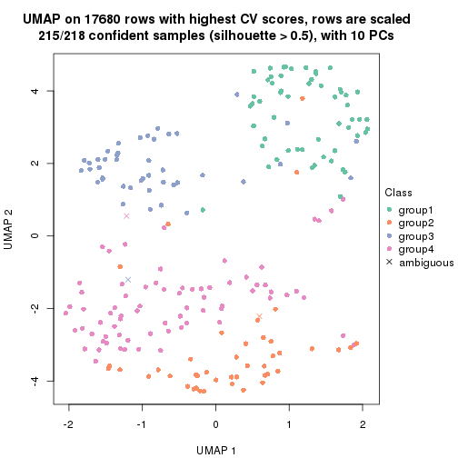</p>

</div>
<div id='tab-CV-NMF-dimension-reduction-4'>
<pre><code class="r">dimension_reduction(res, k = 5, method = &quot;UMAP&quot;)
</code></pre>

<p></p>

</div>
<div id='tab-CV-NMF-dimension-reduction-5'>
<pre><code class="r">dimension_reduction(res, k = 6, method = &quot;UMAP&quot;)
</code></pre>

<p></p>

</div>
</div>


Following heatmap shows how subgroups are split when increasing `k`:

```r
collect_classes(res)
```


If matrix rows can be associated to genes, consider to use `GO_Enrichment(res,
...)` to perform function enrichment for the signature genes.


 

---------------------------------------------------


### MAD:hclust


The object with results only for a single top-value method and a single partition method 
can be extracted as:

```r
res = res_list["MAD", "hclust"]
# you can also extract it by
# res = res_list["MAD:hclust"]
```

A summary of `res` and all the functions that can be applied to it:

```r
res
```

```
#> A 'ConsensusPartition' object with k = 2, 3, 4, 5, 6.
#>   On a matrix with 17680 rows and 218 columns.
#>   Top rows (1000, 2000, 3000, 4000, 5000) are extracted by 'MAD' method.
#>   Subgroups are detected by 'hclust' method.
#>   Performed in total 1250 partitions by row resampling.
#>   Best k for subgroups seems to be 2.
#> 
#> Following methods can be applied to this 'ConsensusPartition' object:
#>  [1] "cola_report"             "collect_classes"         "collect_plots"          
#>  [4] "collect_stats"           "colnames"                "compare_signatures"     
#>  [7] "consensus_heatmap"       "dimension_reduction"     "functional_enrichment"  
#> [10] "get_anno_col"            "get_anno"                "get_classes"            
#> [13] "get_consensus"           "get_matrix"              "get_membership"         
#> [16] "get_param"               "get_signatures"          "get_stats"              
#> [19] "is_best_k"               "is_stable_k"             "membership_heatmap"     
#> [22] "ncol"                    "nrow"                    "plot_ecdf"              
#> [25] "rownames"                "select_partition_number" "show"                   
#> [28] "suggest_best_k"          "test_to_known_factors"
```

`collect_plots()` function collects all the plots made from `res` for all `k` (number of partitions)
into one single page to provide an easy and fast comparison between different `k`.

```r
collect_plots(res)
```


The plots are:

- The first row: a plot of the ECDF (Empirical cumulative distribution
  function) curves of the consensus matrix for each `k` and the heatmap of
  predicted classes for each `k`.
- The second row: heatmaps of the consensus matrix for each `k`.
- The third row: heatmaps of the membership matrix for each `k`.
- The fouth row: heatmaps of the signatures for each `k`.

All the plots in panels can be made by individual functions and they are
plotted later in this section.

`select_partition_number()` produces several plots showing different
statistics for choosing "optimized" `k`. There are following statistics:

- ECDF curves of the consensus matrix for each `k`;
- 1-PAC. [The PAC
  score](https://en.wikipedia.org/wiki/Consensus_clustering#Over-interpretation_potential_of_consensus_clustering)
  measures the proportion of the ambiguous subgrouping.
- Mean silhouette score.
- Concordance. The mean probability of fiting the consensus class ids in all
  partitions.
- Area increased. Denote $A_k$ as the area under the ECDF curve for current
  `k`, the area increased is defined as $A_k - A_{k-1}$.
- Rand index. The percent of pairs of samples that are both in a same cluster
  or both are not in a same cluster in the partition of k and k-1.
- Jaccard index. The ratio of pairs of samples are both in a same cluster in
  the partition of k and k-1 and the pairs of samples are both in a same
  cluster in the partition k or k-1.

The detailed explanations of these statistics can be found in [the cola
vignette](http://bioconductor.org/packages/devel/bioc/vignettes/cola/inst/doc/cola.html#toc_13).

Generally speaking, lower PAC score, higher mean silhouette score or higher
concordance corresponds to better partition. Rand index and Jaccard index
measure how similar the current partition is compared to partition with `k-1`.
If they are too similar, we won't accept `k` is better than `k-1`.

```r
select_partition_number(res)
```


The numeric values for all these statistics can be obtained by `get_stats()`.

```r
get_stats(res)
```

```
#>   k 1-PAC mean_silhouette concordance area_increased  Rand Jaccard
#> 2 2 0.876           0.912       0.961         0.4979 0.498   0.498
#> 3 3 0.634           0.753       0.855         0.2507 0.875   0.752
#> 4 4 0.625           0.671       0.818         0.1305 0.862   0.658
#> 5 5 0.611           0.559       0.743         0.0693 0.925   0.757
#> 6 6 0.623           0.549       0.683         0.0458 0.909   0.674
```

`suggest_best_k()` suggests the best $k$ based on these statistics. The rules are as follows:

- All $k$ with Jaccard index larger than 0.95 are removed because the increase of
  the partition number does not provides enough extra information. If all $k$ are removed,
  the best $k$ is assigned by `NA`.
- For $k$ with 1-PAC larger than 0.9, the maximal $k$ is taken as the "best k". Other $k$ is called "optional k".
- If it does not fit the second rule. The $k$ with the highest vote of highest
  1-PAC, mean silhouette and concordance is taken as the "best k".

```r
suggest_best_k(res)
```

```
#> [1] 2
```


Following shows the table of the partitions (You need to click the **show/hide
code output** link to see it). The membership matrix (columns with name `p*`)
is inferred by
[`clue::cl_consensus()`](https://www.rdocumentation.org/link/cl_consensus?package=clue)
function with the `SE` method. Basically the value in the membership matrix
represents the probability to belong to a certain group. The finall class
label for an item is determined with the group with highest probability it
belongs to.

In `get_classes()` function, the entropy is calculated from the membership
matrix and the silhouette score is calculated from the consensus matrix.


<script>
$( function() {
	$( '#tabs-MAD-hclust-get-classes' ).tabs();
} );
</script>
<div id='tabs-MAD-hclust-get-classes'>
<ul>
<li><a href='#tab-MAD-hclust-get-classes-1'>k = 2</a></li>
<li><a href='#tab-MAD-hclust-get-classes-2'>k = 3</a></li>
<li><a href='#tab-MAD-hclust-get-classes-3'>k = 4</a></li>
<li><a href='#tab-MAD-hclust-get-classes-4'>k = 5</a></li>
<li><a href='#tab-MAD-hclust-get-classes-5'>k = 6</a></li>
</ul>

<div id='tab-MAD-hclust-get-classes-1'>
<p><a id='tab-MAD-hclust-get-classes-1-a' style='color:#0366d6' href='#'>show/hide code output</a></p>
<pre><code class="r">cbind(get_classes(res, k = 2), get_membership(res, k = 2))
</code></pre>

<pre><code>#&gt;            class entropy silhouette    p1    p2
#&gt; SRR1498997     2  0.0000      0.970 0.000 1.000
#&gt; SRR1076441     1  0.0000      0.947 1.000 0.000
#&gt; SRR1489803     2  0.0000      0.970 0.000 1.000
#&gt; SRR1345953     2  0.0000      0.970 0.000 1.000
#&gt; SRR1357826     2  0.0000      0.970 0.000 1.000
#&gt; SRR1419656     1  0.0000      0.947 1.000 0.000
#&gt; SRR1454158     2  0.0376      0.968 0.004 0.996
#&gt; SRR1475408     2  0.8909      0.561 0.308 0.692
#&gt; SRR1472704     2  0.0000      0.970 0.000 1.000
#&gt; SRR1090046     1  0.0672      0.942 0.992 0.008
#&gt; SRR1312822     1  0.0000      0.947 1.000 0.000
#&gt; SRR1096987     2  0.3431      0.931 0.064 0.936
#&gt; SRR1334587     2  0.0000      0.970 0.000 1.000
#&gt; SRR1490246     1  0.0000      0.947 1.000 0.000
#&gt; SRR1467522     1  0.0000      0.947 1.000 0.000
#&gt; SRR1324206     1  0.0000      0.947 1.000 0.000
#&gt; SRR1408574     2  0.0376      0.968 0.004 0.996
#&gt; SRR1083959     2  0.0000      0.970 0.000 1.000
#&gt; SRR1079948     2  0.3431      0.931 0.064 0.936
#&gt; SRR1310667     2  0.0000      0.970 0.000 1.000
#&gt; SRR655852      2  0.2948      0.940 0.052 0.948
#&gt; SRR1352457     2  0.0000      0.970 0.000 1.000
#&gt; SRR1353994     2  0.0000      0.970 0.000 1.000
#&gt; SRR1459561     2  0.0000      0.970 0.000 1.000
#&gt; SRR1454009     1  0.0938      0.940 0.988 0.012
#&gt; SRR1071084     1  0.0376      0.945 0.996 0.004
#&gt; SRR1082859     2  0.0000      0.970 0.000 1.000
#&gt; SRR1086538     1  0.0000      0.947 1.000 0.000
#&gt; SRR1486262     2  0.3879      0.921 0.076 0.924
#&gt; SRR658105      1  0.0000      0.947 1.000 0.000
#&gt; SRR811073      2  0.0000      0.970 0.000 1.000
#&gt; SRR1429181     2  0.2948      0.938 0.052 0.948
#&gt; SRR1327896     2  0.3879      0.921 0.076 0.924
#&gt; SRR1464788     2  0.0000      0.970 0.000 1.000
#&gt; SRR1346861     2  0.0000      0.970 0.000 1.000
#&gt; SRR1318774     2  0.0000      0.970 0.000 1.000
#&gt; SRR1420517     1  0.0376      0.945 0.996 0.004
#&gt; SRR1369584     2  0.0000      0.970 0.000 1.000
#&gt; SRR1443244     1  0.9815      0.309 0.580 0.420
#&gt; SRR1455391     1  0.0000      0.947 1.000 0.000
#&gt; SRR1068999     1  0.0000      0.947 1.000 0.000
#&gt; SRR1481297     1  0.0000      0.947 1.000 0.000
#&gt; SRR1070208     1  0.0000      0.947 1.000 0.000
#&gt; SRR1317282     1  0.0000      0.947 1.000 0.000
#&gt; SRR1096125     2  0.3274      0.935 0.060 0.940
#&gt; SRR1472506     1  0.6887      0.772 0.816 0.184
#&gt; SRR1388281     2  0.0000      0.970 0.000 1.000
#&gt; SRR1365622     2  0.0376      0.968 0.004 0.996
#&gt; SRR662306      1  0.0000      0.947 1.000 0.000
#&gt; SRR662811      1  0.0000      0.947 1.000 0.000
#&gt; SRR820571      1  0.6887      0.770 0.816 0.184
#&gt; SRR1357166     1  0.0000      0.947 1.000 0.000
#&gt; SRR1488586     1  0.2423      0.918 0.960 0.040
#&gt; SRR1485398     1  0.0000      0.947 1.000 0.000
#&gt; SRR1417725     1  0.9815      0.310 0.580 0.420
#&gt; SRR1409397     2  0.0000      0.970 0.000 1.000
#&gt; SRR1465693     2  0.0000      0.970 0.000 1.000
#&gt; SRR1096547     1  0.8327      0.652 0.736 0.264
#&gt; SRR1456818     1  0.0000      0.947 1.000 0.000
#&gt; SRR816336      1  0.6801      0.775 0.820 0.180
#&gt; SRR1420238     1  0.0000      0.947 1.000 0.000
#&gt; SRR1433374     1  0.0376      0.945 0.996 0.004
#&gt; SRR1436990     1  0.0000      0.947 1.000 0.000
#&gt; SRR662378      1  0.0000      0.947 1.000 0.000
#&gt; SRR1477671     1  0.0000      0.947 1.000 0.000
#&gt; SRR1084079     1  0.9881      0.261 0.564 0.436
#&gt; SRR1102949     1  0.0000      0.947 1.000 0.000
#&gt; SRR1458090     1  0.0000      0.947 1.000 0.000
#&gt; SRR1418729     2  0.0376      0.968 0.004 0.996
#&gt; SRR1403814     2  0.3584      0.928 0.068 0.932
#&gt; SRR1404887     1  0.9815      0.309 0.580 0.420
#&gt; SRR1434955     1  0.0000      0.947 1.000 0.000
#&gt; SRR1360652     1  0.0000      0.947 1.000 0.000
#&gt; SRR1356765     2  0.0376      0.968 0.004 0.996
#&gt; SRR1078258     2  0.0376      0.968 0.004 0.996
#&gt; SRR1455861     1  0.0000      0.947 1.000 0.000
#&gt; SRR1420296     2  0.0000      0.970 0.000 1.000
#&gt; SRR1070260     2  0.0000      0.970 0.000 1.000
#&gt; SRR1410765     1  0.0000      0.947 1.000 0.000
#&gt; SRR1481315     1  0.0672      0.942 0.992 0.008
#&gt; SRR1414661     2  0.0000      0.970 0.000 1.000
#&gt; SRR1359147     2  0.0376      0.968 0.004 0.996
#&gt; SRR1488694     1  0.1414      0.934 0.980 0.020
#&gt; SRR1477273     1  0.0376      0.945 0.996 0.004
#&gt; SRR1415792     1  0.0376      0.945 0.996 0.004
#&gt; SRR1369088     2  0.9661      0.350 0.392 0.608
#&gt; SRR1406621     2  0.0000      0.970 0.000 1.000
#&gt; SRR1401017     2  0.0000      0.970 0.000 1.000
#&gt; SRR1099981     2  0.0376      0.968 0.004 0.996
#&gt; SRR815208      2  0.0000      0.970 0.000 1.000
#&gt; SRR1380460     2  0.2948      0.941 0.052 0.948
#&gt; SRR1091097     2  0.3114      0.937 0.056 0.944
#&gt; SRR1456010     1  0.0000      0.947 1.000 0.000
#&gt; SRR1498416     2  0.0000      0.970 0.000 1.000
#&gt; SRR818873      2  0.0000      0.970 0.000 1.000
#&gt; SRR813868      2  0.2948      0.941 0.052 0.948
#&gt; SRR1394912     1  0.0000      0.947 1.000 0.000
#&gt; SRR1475824     2  0.4431      0.905 0.092 0.908
#&gt; SRR1459866     1  0.0000      0.947 1.000 0.000
#&gt; SRR1364871     1  0.6887      0.770 0.816 0.184
#&gt; SRR1100472     2  0.0000      0.970 0.000 1.000
#&gt; SRR1331267     1  0.6531      0.787 0.832 0.168
#&gt; SRR1068977     2  0.0000      0.970 0.000 1.000
#&gt; SRR1391511     2  0.0000      0.970 0.000 1.000
#&gt; SRR1077920     2  0.0000      0.970 0.000 1.000
#&gt; SRR1457705     1  0.0000      0.947 1.000 0.000
#&gt; SRR1437073     1  0.0000      0.947 1.000 0.000
#&gt; SRR1473124     1  0.0376      0.945 0.996 0.004
#&gt; SRR1469279     1  0.0000      0.947 1.000 0.000
#&gt; SRR1091791     2  0.4431      0.905 0.092 0.908
#&gt; SRR1341539     2  0.0376      0.968 0.004 0.996
#&gt; SRR1446354     1  0.0376      0.945 0.996 0.004
#&gt; SRR1415420     1  0.0000      0.947 1.000 0.000
#&gt; SRR1368050     1  0.0000      0.947 1.000 0.000
#&gt; SRR656970      2  0.0000      0.970 0.000 1.000
#&gt; SRR1473403     2  0.0000      0.970 0.000 1.000
#&gt; SRR1084674     1  0.0376      0.945 0.996 0.004
#&gt; SRR1464702     1  0.0000      0.947 1.000 0.000
#&gt; SRR1074860     2  0.7139      0.770 0.196 0.804
#&gt; SRR655447      2  0.0376      0.968 0.004 0.996
#&gt; SRR1404442     2  0.0000      0.970 0.000 1.000
#&gt; SRR1418795     1  0.0000      0.947 1.000 0.000
#&gt; SRR1458335     2  0.3114      0.935 0.056 0.944
#&gt; SRR1489589     2  0.0000      0.970 0.000 1.000
#&gt; SRR1378284     1  0.5519      0.833 0.872 0.128
#&gt; SRR1408014     2  0.0000      0.970 0.000 1.000
#&gt; SRR1083052     1  0.0000      0.947 1.000 0.000
#&gt; SRR1339236     2  0.7815      0.709 0.232 0.768
#&gt; SRR1323829     2  0.0000      0.970 0.000 1.000
#&gt; SRR1086772     2  0.0000      0.970 0.000 1.000
#&gt; SRR1486457     1  0.6438      0.794 0.836 0.164
#&gt; SRR1415257     2  0.0000      0.970 0.000 1.000
#&gt; SRR1071905     1  0.0000      0.947 1.000 0.000
#&gt; SRR659223      2  0.0000      0.970 0.000 1.000
#&gt; SRR1386945     1  0.0000      0.947 1.000 0.000
#&gt; SRR821498      2  0.1633      0.958 0.024 0.976
#&gt; SRR1378903     2  0.3733      0.924 0.072 0.928
#&gt; SRR1472907     1  0.0000      0.947 1.000 0.000
#&gt; SRR1442313     2  0.0000      0.970 0.000 1.000
#&gt; SRR1077139     2  0.0000      0.970 0.000 1.000
#&gt; SRR1342758     1  0.0000      0.947 1.000 0.000
#&gt; SRR656911      2  0.2236      0.951 0.036 0.964
#&gt; SRR1070738     1  0.0000      0.947 1.000 0.000
#&gt; SRR1476950     1  0.0000      0.947 1.000 0.000
#&gt; SRR1488196     1  0.0938      0.940 0.988 0.012
#&gt; SRR1498951     1  0.0000      0.947 1.000 0.000
#&gt; SRR1413392     1  0.0000      0.947 1.000 0.000
#&gt; SRR657528      2  0.4690      0.894 0.100 0.900
#&gt; SRR812198      1  0.0000      0.947 1.000 0.000
#&gt; SRR660283      2  0.0000      0.970 0.000 1.000
#&gt; SRR1420936     1  0.0000      0.947 1.000 0.000
#&gt; SRR1469547     2  0.0000      0.970 0.000 1.000
#&gt; SRR1322249     1  0.0000      0.947 1.000 0.000
#&gt; SRR1396682     1  0.0000      0.947 1.000 0.000
#&gt; SRR1095816     2  0.3879      0.921 0.076 0.924
#&gt; SRR1081023     1  0.0000      0.947 1.000 0.000
#&gt; SRR1092517     2  0.0376      0.968 0.004 0.996
#&gt; SRR811285      2  0.0000      0.970 0.000 1.000
#&gt; SRR657018      1  0.0000      0.947 1.000 0.000
#&gt; SRR1365534     1  0.0376      0.945 0.996 0.004
#&gt; SRR1090791     2  0.0000      0.970 0.000 1.000
#&gt; SRR1439915     2  0.0000      0.970 0.000 1.000
#&gt; SRR1391575     2  0.4690      0.897 0.100 0.900
#&gt; SRR1314092     2  0.3114      0.935 0.056 0.944
#&gt; SRR1328941     1  0.0376      0.945 0.996 0.004
#&gt; SRR1336181     2  0.0000      0.970 0.000 1.000
#&gt; SRR1362972     1  0.0000      0.947 1.000 0.000
#&gt; SRR1366790     2  0.0672      0.967 0.008 0.992
#&gt; SRR1455902     1  0.0376      0.945 0.996 0.004
#&gt; SRR1437644     1  0.9970      0.149 0.532 0.468
#&gt; SRR1105009     2  0.0000      0.970 0.000 1.000
#&gt; SRR1367024     1  0.0000      0.947 1.000 0.000
#&gt; SRR660248      2  0.7815      0.708 0.232 0.768
#&gt; SRR1409620     1  0.0000      0.947 1.000 0.000
#&gt; SRR1455807     2  0.0000      0.970 0.000 1.000
#&gt; SRR1339431     1  0.0000      0.947 1.000 0.000
#&gt; SRR1378948     1  0.9552      0.427 0.624 0.376
#&gt; SRR1469237     1  0.0000      0.947 1.000 0.000
#&gt; SRR1098264     2  0.0000      0.970 0.000 1.000
#&gt; SRR1406224     2  0.0376      0.968 0.004 0.996
#&gt; SRR1393026     1  0.0000      0.947 1.000 0.000
#&gt; SRR808428      2  0.0000      0.970 0.000 1.000
#&gt; SRR615910      2  0.0000      0.970 0.000 1.000
#&gt; SRR1076219     1  0.0000      0.947 1.000 0.000
#&gt; SRR1481128     1  0.0000      0.947 1.000 0.000
#&gt; SRR1359262     2  0.0000      0.970 0.000 1.000
#&gt; SRR1407648     2  0.3879      0.921 0.076 0.924
#&gt; SRR1386775     1  0.9754      0.341 0.592 0.408
#&gt; SRR1388399     1  0.9323      0.495 0.652 0.348
#&gt; SRR1361499     2  0.0000      0.970 0.000 1.000
#&gt; SRR1500709     2  0.2948      0.941 0.052 0.948
#&gt; SRR1335917     1  0.0000      0.947 1.000 0.000
#&gt; SRR1430615     2  0.0000      0.970 0.000 1.000
#&gt; SRR1335212     1  0.2236      0.921 0.964 0.036
#&gt; SRR1400159     1  0.9833      0.299 0.576 0.424
#&gt; SRR1457245     2  0.0000      0.970 0.000 1.000
#&gt; SRR1356746     2  0.0000      0.970 0.000 1.000
#&gt; SRR658319      2  0.0376      0.968 0.004 0.996
#&gt; SRR1435946     1  0.0000      0.947 1.000 0.000
#&gt; SRR1370308     1  0.0000      0.947 1.000 0.000
#&gt; SRR1100893     1  0.0000      0.947 1.000 0.000
#&gt; SRR1389432     1  0.0000      0.947 1.000 0.000
#&gt; SRR1381799     2  0.0000      0.970 0.000 1.000
#&gt; SRR1310158     1  0.0376      0.945 0.996 0.004
#&gt; SRR1341100     2  0.4022      0.918 0.080 0.920
#&gt; SRR1342873     1  0.0000      0.947 1.000 0.000
#&gt; SRR1472102     2  0.0000      0.970 0.000 1.000
#&gt; SRR1409421     1  0.0000      0.947 1.000 0.000
#&gt; SRR1328577     2  0.0376      0.968 0.004 0.996
#&gt; SRR808942      2  0.0376      0.968 0.004 0.996
#&gt; SRR1343818     2  0.0376      0.968 0.004 0.996
#&gt; SRR1472415     2  0.0000      0.970 0.000 1.000
#&gt; SRR658409      2  0.3879      0.921 0.076 0.924
#&gt; SRR1469681     1  0.0000      0.947 1.000 0.000
#&gt; SRR1075484     2  0.3274      0.931 0.060 0.940
#&gt; SRR1417894     1  0.0376      0.945 0.996 0.004
#&gt; SRR1417422     2  0.0000      0.970 0.000 1.000
#&gt; SRR1090674     1  0.0000      0.947 1.000 0.000
</code></pre>

<script>
$('#tab-MAD-hclust-get-classes-1-a').parent().next().next().hide();
$('#tab-MAD-hclust-get-classes-1-a').click(function(){
  $('#tab-MAD-hclust-get-classes-1-a').parent().next().next().toggle();
  return(false);
});
</script>
</div>

<div id='tab-MAD-hclust-get-classes-2'>
<p><a id='tab-MAD-hclust-get-classes-2-a' style='color:#0366d6' href='#'>show/hide code output</a></p>
<pre><code class="r">cbind(get_classes(res, k = 3), get_membership(res, k = 3))
</code></pre>

<pre><code>#&gt;            class entropy silhouette    p1    p2    p3
#&gt; SRR1498997     2  0.1031      0.891 0.000 0.976 0.024
#&gt; SRR1076441     1  0.0000      0.888 1.000 0.000 0.000
#&gt; SRR1489803     2  0.0747      0.891 0.000 0.984 0.016
#&gt; SRR1345953     2  0.0237      0.888 0.000 0.996 0.004
#&gt; SRR1357826     2  0.0237      0.888 0.000 0.996 0.004
#&gt; SRR1419656     1  0.5968      0.237 0.636 0.000 0.364
#&gt; SRR1454158     2  0.3686      0.865 0.000 0.860 0.140
#&gt; SRR1475408     3  0.5968     -0.124 0.000 0.364 0.636
#&gt; SRR1472704     2  0.0237      0.888 0.000 0.996 0.004
#&gt; SRR1090046     1  0.4291      0.747 0.820 0.000 0.180
#&gt; SRR1312822     1  0.0000      0.888 1.000 0.000 0.000
#&gt; SRR1096987     2  0.5785      0.726 0.000 0.668 0.332
#&gt; SRR1334587     2  0.1031      0.891 0.000 0.976 0.024
#&gt; SRR1490246     1  0.0000      0.888 1.000 0.000 0.000
#&gt; SRR1467522     1  0.0237      0.888 0.996 0.000 0.004
#&gt; SRR1324206     1  0.2356      0.862 0.928 0.000 0.072
#&gt; SRR1408574     2  0.2261      0.887 0.000 0.932 0.068
#&gt; SRR1083959     2  0.0592      0.890 0.000 0.988 0.012
#&gt; SRR1079948     2  0.5835      0.718 0.000 0.660 0.340
#&gt; SRR1310667     2  0.0000      0.889 0.000 1.000 0.000
#&gt; SRR655852      2  0.5706      0.738 0.000 0.680 0.320
#&gt; SRR1352457     2  0.0424      0.891 0.000 0.992 0.008
#&gt; SRR1353994     2  0.0424      0.889 0.000 0.992 0.008
#&gt; SRR1459561     2  0.0000      0.889 0.000 1.000 0.000
#&gt; SRR1454009     3  0.6244      0.463 0.440 0.000 0.560
#&gt; SRR1071084     3  0.6215      0.489 0.428 0.000 0.572
#&gt; SRR1082859     2  0.0237      0.888 0.000 0.996 0.004
#&gt; SRR1086538     1  0.2066      0.867 0.940 0.000 0.060
#&gt; SRR1486262     2  0.6467      0.655 0.008 0.604 0.388
#&gt; SRR658105      1  0.0000      0.888 1.000 0.000 0.000
#&gt; SRR811073      2  0.3551      0.867 0.000 0.868 0.132
#&gt; SRR1429181     2  0.3412      0.864 0.000 0.876 0.124
#&gt; SRR1327896     2  0.6467      0.655 0.008 0.604 0.388
#&gt; SRR1464788     2  0.0592      0.890 0.000 0.988 0.012
#&gt; SRR1346861     2  0.0237      0.888 0.000 0.996 0.004
#&gt; SRR1318774     2  0.2448      0.884 0.000 0.924 0.076
#&gt; SRR1420517     3  0.6215      0.487 0.428 0.000 0.572
#&gt; SRR1369584     2  0.0237      0.888 0.000 0.996 0.004
#&gt; SRR1443244     3  0.6031      0.550 0.096 0.116 0.788
#&gt; SRR1455391     1  0.2165      0.864 0.936 0.000 0.064
#&gt; SRR1068999     1  0.2066      0.867 0.940 0.000 0.060
#&gt; SRR1481297     1  0.5968      0.237 0.636 0.000 0.364
#&gt; SRR1070208     1  0.2796      0.841 0.908 0.000 0.092
#&gt; SRR1317282     1  0.6045      0.188 0.620 0.000 0.380
#&gt; SRR1096125     2  0.6229      0.711 0.008 0.652 0.340
#&gt; SRR1472506     3  0.4968      0.604 0.188 0.012 0.800
#&gt; SRR1388281     2  0.0747      0.891 0.000 0.984 0.016
#&gt; SRR1365622     2  0.2959      0.880 0.000 0.900 0.100
#&gt; SRR662306      1  0.2796      0.843 0.908 0.000 0.092
#&gt; SRR662811      1  0.0000      0.888 1.000 0.000 0.000
#&gt; SRR820571      3  0.5122      0.603 0.200 0.012 0.788
#&gt; SRR1357166     1  0.2959      0.837 0.900 0.000 0.100
#&gt; SRR1488586     3  0.5905      0.539 0.352 0.000 0.648
#&gt; SRR1485398     1  0.0000      0.888 1.000 0.000 0.000
#&gt; SRR1417725     3  0.5852      0.538 0.060 0.152 0.788
#&gt; SRR1409397     2  0.0747      0.891 0.000 0.984 0.016
#&gt; SRR1465693     2  0.1031      0.891 0.000 0.976 0.024
#&gt; SRR1096547     3  0.6543      0.596 0.176 0.076 0.748
#&gt; SRR1456818     1  0.1964      0.873 0.944 0.000 0.056
#&gt; SRR816336      3  0.4963      0.603 0.200 0.008 0.792
#&gt; SRR1420238     1  0.0000      0.888 1.000 0.000 0.000
#&gt; SRR1433374     3  0.6215      0.489 0.428 0.000 0.572
#&gt; SRR1436990     1  0.0000      0.888 1.000 0.000 0.000
#&gt; SRR662378      1  0.0237      0.888 0.996 0.000 0.004
#&gt; SRR1477671     1  0.0592      0.887 0.988 0.000 0.012
#&gt; SRR1084079     3  0.5998      0.541 0.084 0.128 0.788
#&gt; SRR1102949     1  0.0000      0.888 1.000 0.000 0.000
#&gt; SRR1458090     1  0.0000      0.888 1.000 0.000 0.000
#&gt; SRR1418729     2  0.3686      0.865 0.000 0.860 0.140
#&gt; SRR1403814     2  0.6209      0.686 0.004 0.628 0.368
#&gt; SRR1404887     3  0.6031      0.550 0.096 0.116 0.788
#&gt; SRR1434955     1  0.0000      0.888 1.000 0.000 0.000
#&gt; SRR1360652     1  0.1031      0.883 0.976 0.000 0.024
#&gt; SRR1356765     2  0.2796      0.882 0.000 0.908 0.092
#&gt; SRR1078258     2  0.4178      0.848 0.000 0.828 0.172
#&gt; SRR1455861     1  0.2066      0.867 0.940 0.000 0.060
#&gt; SRR1420296     2  0.0000      0.889 0.000 1.000 0.000
#&gt; SRR1070260     2  0.0237      0.888 0.000 0.996 0.004
#&gt; SRR1410765     1  0.0000      0.888 1.000 0.000 0.000
#&gt; SRR1481315     1  0.1860      0.850 0.948 0.000 0.052
#&gt; SRR1414661     2  0.3686      0.865 0.000 0.860 0.140
#&gt; SRR1359147     2  0.4235      0.849 0.000 0.824 0.176
#&gt; SRR1488694     1  0.2261      0.830 0.932 0.000 0.068
#&gt; SRR1477273     3  0.6215      0.489 0.428 0.000 0.572
#&gt; SRR1415792     1  0.3482      0.815 0.872 0.000 0.128
#&gt; SRR1369088     3  0.7238      0.106 0.044 0.328 0.628
#&gt; SRR1406621     2  0.2165      0.887 0.000 0.936 0.064
#&gt; SRR1401017     2  0.1163      0.890 0.000 0.972 0.028
#&gt; SRR1099981     2  0.2261      0.887 0.000 0.932 0.068
#&gt; SRR815208      2  0.0237      0.888 0.000 0.996 0.004
#&gt; SRR1380460     2  0.5465      0.768 0.000 0.712 0.288
#&gt; SRR1091097     2  0.5678      0.742 0.000 0.684 0.316
#&gt; SRR1456010     3  0.6235      0.476 0.436 0.000 0.564
#&gt; SRR1498416     2  0.2261      0.886 0.000 0.932 0.068
#&gt; SRR818873      2  0.1163      0.890 0.000 0.972 0.028
#&gt; SRR813868      2  0.5431      0.771 0.000 0.716 0.284
#&gt; SRR1394912     1  0.0000      0.888 1.000 0.000 0.000
#&gt; SRR1475824     2  0.6169      0.689 0.004 0.636 0.360
#&gt; SRR1459866     1  0.0592      0.887 0.988 0.000 0.012
#&gt; SRR1364871     3  0.5122      0.603 0.200 0.012 0.788
#&gt; SRR1100472     2  0.0237      0.888 0.000 0.996 0.004
#&gt; SRR1331267     3  0.6314      0.375 0.392 0.004 0.604
#&gt; SRR1068977     2  0.2448      0.885 0.000 0.924 0.076
#&gt; SRR1391511     2  0.1031      0.891 0.000 0.976 0.024
#&gt; SRR1077920     2  0.0237      0.888 0.000 0.996 0.004
#&gt; SRR1457705     3  0.6309      0.307 0.496 0.000 0.504
#&gt; SRR1437073     1  0.0000      0.888 1.000 0.000 0.000
#&gt; SRR1473124     3  0.6215      0.487 0.428 0.000 0.572
#&gt; SRR1469279     1  0.6079      0.155 0.612 0.000 0.388
#&gt; SRR1091791     2  0.6386      0.628 0.004 0.584 0.412
#&gt; SRR1341539     2  0.2796      0.882 0.000 0.908 0.092
#&gt; SRR1446354     3  0.6215      0.489 0.428 0.000 0.572
#&gt; SRR1415420     1  0.0592      0.887 0.988 0.000 0.012
#&gt; SRR1368050     1  0.0000      0.888 1.000 0.000 0.000
#&gt; SRR656970      2  0.0000      0.889 0.000 1.000 0.000
#&gt; SRR1473403     2  0.3551      0.867 0.000 0.868 0.132
#&gt; SRR1084674     1  0.3267      0.828 0.884 0.000 0.116
#&gt; SRR1464702     1  0.2066      0.867 0.940 0.000 0.060
#&gt; SRR1074860     2  0.7918      0.434 0.056 0.484 0.460
#&gt; SRR655447      2  0.4062      0.852 0.000 0.836 0.164
#&gt; SRR1404442     2  0.0237      0.888 0.000 0.996 0.004
#&gt; SRR1418795     1  0.0000      0.888 1.000 0.000 0.000
#&gt; SRR1458335     2  0.4452      0.835 0.000 0.808 0.192
#&gt; SRR1489589     2  0.0747      0.891 0.000 0.984 0.016
#&gt; SRR1378284     1  0.5785      0.435 0.696 0.004 0.300
#&gt; SRR1408014     2  0.1163      0.890 0.000 0.972 0.028
#&gt; SRR1083052     1  0.3038      0.829 0.896 0.000 0.104
#&gt; SRR1339236     2  0.6309      0.427 0.000 0.504 0.496
#&gt; SRR1323829     2  0.0000      0.889 0.000 1.000 0.000
#&gt; SRR1086772     2  0.1031      0.892 0.000 0.976 0.024
#&gt; SRR1486457     3  0.4834      0.601 0.204 0.004 0.792
#&gt; SRR1415257     2  0.1031      0.891 0.000 0.976 0.024
#&gt; SRR1071905     1  0.2959      0.837 0.900 0.000 0.100
#&gt; SRR659223      2  0.0000      0.889 0.000 1.000 0.000
#&gt; SRR1386945     1  0.6045      0.188 0.620 0.000 0.380
#&gt; SRR821498      2  0.5058      0.808 0.000 0.756 0.244
#&gt; SRR1378903     2  0.6416      0.670 0.008 0.616 0.376
#&gt; SRR1472907     1  0.6295     -0.231 0.528 0.000 0.472
#&gt; SRR1442313     2  0.0237      0.888 0.000 0.996 0.004
#&gt; SRR1077139     2  0.0000      0.889 0.000 1.000 0.000
#&gt; SRR1342758     1  0.0424      0.887 0.992 0.000 0.008
#&gt; SRR656911      2  0.5216      0.792 0.000 0.740 0.260
#&gt; SRR1070738     1  0.0000      0.888 1.000 0.000 0.000
#&gt; SRR1476950     1  0.3340      0.807 0.880 0.000 0.120
#&gt; SRR1488196     3  0.6244      0.463 0.440 0.000 0.560
#&gt; SRR1498951     3  0.6252      0.460 0.444 0.000 0.556
#&gt; SRR1413392     1  0.0000      0.888 1.000 0.000 0.000
#&gt; SRR657528      2  0.5529      0.756 0.000 0.704 0.296
#&gt; SRR812198      1  0.0000      0.888 1.000 0.000 0.000
#&gt; SRR660283      2  0.0237      0.888 0.000 0.996 0.004
#&gt; SRR1420936     1  0.0000      0.888 1.000 0.000 0.000
#&gt; SRR1469547     2  0.0237      0.888 0.000 0.996 0.004
#&gt; SRR1322249     1  0.1643      0.876 0.956 0.000 0.044
#&gt; SRR1396682     1  0.0000      0.888 1.000 0.000 0.000
#&gt; SRR1095816     2  0.6451      0.660 0.008 0.608 0.384
#&gt; SRR1081023     1  0.0000      0.888 1.000 0.000 0.000
#&gt; SRR1092517     2  0.4178      0.848 0.000 0.828 0.172
#&gt; SRR811285      2  0.0892      0.891 0.000 0.980 0.020
#&gt; SRR657018      1  0.0000      0.888 1.000 0.000 0.000
#&gt; SRR1365534     3  0.6215      0.489 0.428 0.000 0.572
#&gt; SRR1090791     2  0.1163      0.890 0.000 0.972 0.028
#&gt; SRR1439915     2  0.1163      0.890 0.000 0.972 0.028
#&gt; SRR1391575     2  0.6565      0.615 0.008 0.576 0.416
#&gt; SRR1314092     2  0.4452      0.835 0.000 0.808 0.192
#&gt; SRR1328941     3  0.6215      0.487 0.428 0.000 0.572
#&gt; SRR1336181     2  0.0237      0.888 0.000 0.996 0.004
#&gt; SRR1362972     1  0.2066      0.867 0.940 0.000 0.060
#&gt; SRR1366790     2  0.4002      0.857 0.000 0.840 0.160
#&gt; SRR1455902     3  0.6215      0.489 0.428 0.000 0.572
#&gt; SRR1437644     3  0.6841      0.462 0.076 0.200 0.724
#&gt; SRR1105009     2  0.0237      0.888 0.000 0.996 0.004
#&gt; SRR1367024     3  0.6235      0.474 0.436 0.000 0.564
#&gt; SRR660248      3  0.6260     -0.357 0.000 0.448 0.552
#&gt; SRR1409620     1  0.0000      0.888 1.000 0.000 0.000
#&gt; SRR1455807     2  0.0237      0.888 0.000 0.996 0.004
#&gt; SRR1339431     1  0.2066      0.867 0.940 0.000 0.060
#&gt; SRR1378948     3  0.5566      0.574 0.080 0.108 0.812
#&gt; SRR1469237     1  0.0000      0.888 1.000 0.000 0.000
#&gt; SRR1098264     2  0.0237      0.888 0.000 0.996 0.004
#&gt; SRR1406224     2  0.3686      0.865 0.000 0.860 0.140
#&gt; SRR1393026     1  0.2878      0.840 0.904 0.000 0.096
#&gt; SRR808428      2  0.0237      0.888 0.000 0.996 0.004
#&gt; SRR615910      2  0.0000      0.889 0.000 1.000 0.000
#&gt; SRR1076219     1  0.4796      0.632 0.780 0.000 0.220
#&gt; SRR1481128     1  0.0592      0.887 0.988 0.000 0.012
#&gt; SRR1359262     2  0.1163      0.890 0.000 0.972 0.028
#&gt; SRR1407648     2  0.6467      0.655 0.008 0.604 0.388
#&gt; SRR1386775     3  0.6726      0.549 0.120 0.132 0.748
#&gt; SRR1388399     3  0.6662      0.579 0.128 0.120 0.752
#&gt; SRR1361499     2  0.0424      0.889 0.000 0.992 0.008
#&gt; SRR1500709     2  0.5465      0.768 0.000 0.712 0.288
#&gt; SRR1335917     1  0.0592      0.887 0.988 0.000 0.012
#&gt; SRR1430615     2  0.0000      0.889 0.000 1.000 0.000
#&gt; SRR1335212     3  0.5926      0.535 0.356 0.000 0.644
#&gt; SRR1400159     3  0.5911      0.532 0.060 0.156 0.784
#&gt; SRR1457245     2  0.0237      0.888 0.000 0.996 0.004
#&gt; SRR1356746     2  0.0237      0.888 0.000 0.996 0.004
#&gt; SRR658319      2  0.3412      0.871 0.000 0.876 0.124
#&gt; SRR1435946     1  0.0000      0.888 1.000 0.000 0.000
#&gt; SRR1370308     1  0.1163      0.882 0.972 0.000 0.028
#&gt; SRR1100893     1  0.1753      0.871 0.952 0.000 0.048
#&gt; SRR1389432     1  0.2878      0.840 0.904 0.000 0.096
#&gt; SRR1381799     2  0.3038      0.878 0.000 0.896 0.104
#&gt; SRR1310158     3  0.6215      0.489 0.428 0.000 0.572
#&gt; SRR1341100     2  0.6584      0.659 0.012 0.608 0.380
#&gt; SRR1342873     1  0.6252     -0.119 0.556 0.000 0.444
#&gt; SRR1472102     2  0.0892      0.891 0.000 0.980 0.020
#&gt; SRR1409421     1  0.5397      0.482 0.720 0.000 0.280
#&gt; SRR1328577     2  0.4062      0.852 0.000 0.836 0.164
#&gt; SRR808942      2  0.3686      0.865 0.000 0.860 0.140
#&gt; SRR1343818     2  0.4178      0.848 0.000 0.828 0.172
#&gt; SRR1472415     2  0.0237      0.888 0.000 0.996 0.004
#&gt; SRR658409      2  0.6451      0.660 0.008 0.608 0.384
#&gt; SRR1469681     1  0.0000      0.888 1.000 0.000 0.000
#&gt; SRR1075484     2  0.4121      0.842 0.000 0.832 0.168
#&gt; SRR1417894     3  0.6215      0.489 0.428 0.000 0.572
#&gt; SRR1417422     2  0.1163      0.890 0.000 0.972 0.028
#&gt; SRR1090674     1  0.0000      0.888 1.000 0.000 0.000
</code></pre>

<script>
$('#tab-MAD-hclust-get-classes-2-a').parent().next().next().hide();
$('#tab-MAD-hclust-get-classes-2-a').click(function(){
  $('#tab-MAD-hclust-get-classes-2-a').parent().next().next().toggle();
  return(false);
});
</script>
</div>

<div id='tab-MAD-hclust-get-classes-3'>
<p><a id='tab-MAD-hclust-get-classes-3-a' style='color:#0366d6' href='#'>show/hide code output</a></p>
<pre><code class="r">cbind(get_classes(res, k = 4), get_membership(res, k = 4))
</code></pre>

<pre><code>#&gt;            class entropy silhouette    p1    p2    p3    p4
#&gt; SRR1498997     2  0.2345    0.77465 0.000 0.900 0.000 0.100
#&gt; SRR1076441     1  0.0188    0.90724 0.996 0.000 0.000 0.004
#&gt; SRR1489803     2  0.1716    0.79712 0.000 0.936 0.000 0.064
#&gt; SRR1345953     2  0.1211    0.78252 0.000 0.960 0.000 0.040
#&gt; SRR1357826     2  0.1118    0.78459 0.000 0.964 0.000 0.036
#&gt; SRR1419656     3  0.5453    0.44933 0.388 0.000 0.592 0.020
#&gt; SRR1454158     2  0.5119    0.18014 0.000 0.556 0.004 0.440
#&gt; SRR1475408     4  0.4817    0.48129 0.000 0.088 0.128 0.784
#&gt; SRR1472704     2  0.1118    0.78459 0.000 0.964 0.000 0.036
#&gt; SRR1090046     1  0.4951    0.73629 0.744 0.000 0.212 0.044
#&gt; SRR1312822     1  0.0000    0.90715 1.000 0.000 0.000 0.000
#&gt; SRR1096987     4  0.4888    0.45032 0.000 0.412 0.000 0.588
#&gt; SRR1334587     2  0.2469    0.78555 0.000 0.892 0.000 0.108
#&gt; SRR1490246     1  0.0000    0.90715 1.000 0.000 0.000 0.000
#&gt; SRR1467522     1  0.0469    0.90555 0.988 0.000 0.012 0.000
#&gt; SRR1324206     1  0.2714    0.85848 0.884 0.000 0.112 0.004
#&gt; SRR1408574     2  0.3266    0.74767 0.000 0.832 0.000 0.168
#&gt; SRR1083959     2  0.2081    0.79076 0.000 0.916 0.000 0.084
#&gt; SRR1079948     4  0.4866    0.46734 0.000 0.404 0.000 0.596
#&gt; SRR1310667     2  0.1389    0.79951 0.000 0.952 0.000 0.048
#&gt; SRR655852      4  0.4941    0.39210 0.000 0.436 0.000 0.564
#&gt; SRR1352457     2  0.1637    0.80024 0.000 0.940 0.000 0.060
#&gt; SRR1353994     2  0.1389    0.78726 0.000 0.952 0.000 0.048
#&gt; SRR1459561     2  0.1211    0.79924 0.000 0.960 0.000 0.040
#&gt; SRR1454009     3  0.3652    0.81515 0.092 0.000 0.856 0.052
#&gt; SRR1071084     3  0.2473    0.81927 0.080 0.000 0.908 0.012
#&gt; SRR1082859     2  0.1211    0.78623 0.000 0.960 0.000 0.040
#&gt; SRR1086538     1  0.2676    0.86502 0.896 0.000 0.092 0.012
#&gt; SRR1486262     4  0.4624    0.56042 0.000 0.340 0.000 0.660
#&gt; SRR658105      1  0.0000    0.90715 1.000 0.000 0.000 0.000
#&gt; SRR811073      2  0.4304    0.52670 0.000 0.716 0.000 0.284
#&gt; SRR1429181     2  0.4456    0.61398 0.000 0.716 0.004 0.280
#&gt; SRR1327896     4  0.4781    0.56387 0.000 0.336 0.004 0.660
#&gt; SRR1464788     2  0.1557    0.79988 0.000 0.944 0.000 0.056
#&gt; SRR1346861     2  0.1118    0.78459 0.000 0.964 0.000 0.036
#&gt; SRR1318774     2  0.3024    0.75629 0.000 0.852 0.000 0.148
#&gt; SRR1420517     3  0.3370    0.81312 0.080 0.000 0.872 0.048
#&gt; SRR1369584     2  0.1389    0.79404 0.000 0.952 0.000 0.048
#&gt; SRR1443244     4  0.5981    0.03591 0.044 0.004 0.344 0.608
#&gt; SRR1455391     1  0.3529    0.82205 0.836 0.000 0.152 0.012
#&gt; SRR1068999     1  0.3606    0.82141 0.840 0.000 0.140 0.020
#&gt; SRR1481297     3  0.5453    0.44933 0.388 0.000 0.592 0.020
#&gt; SRR1070208     1  0.3852    0.78278 0.808 0.000 0.180 0.012
#&gt; SRR1317282     3  0.4950    0.47285 0.376 0.000 0.620 0.004
#&gt; SRR1096125     4  0.4978    0.50374 0.000 0.384 0.004 0.612
#&gt; SRR1472506     3  0.5355    0.56985 0.020 0.000 0.620 0.360
#&gt; SRR1388281     2  0.1474    0.78548 0.000 0.948 0.000 0.052
#&gt; SRR1365622     2  0.3801    0.69341 0.000 0.780 0.000 0.220
#&gt; SRR662306      1  0.4059    0.76828 0.788 0.000 0.200 0.012
#&gt; SRR662811      1  0.0188    0.90688 0.996 0.000 0.000 0.004
#&gt; SRR820571      3  0.4040    0.62309 0.000 0.000 0.752 0.248
#&gt; SRR1357166     1  0.3978    0.78205 0.796 0.000 0.192 0.012
#&gt; SRR1488586     3  0.6224    0.69952 0.144 0.000 0.668 0.188
#&gt; SRR1485398     1  0.0000    0.90715 1.000 0.000 0.000 0.000
#&gt; SRR1417725     4  0.5465   -0.03511 0.000 0.020 0.392 0.588
#&gt; SRR1409397     2  0.1792    0.79684 0.000 0.932 0.000 0.068
#&gt; SRR1465693     2  0.2469    0.78555 0.000 0.892 0.000 0.108
#&gt; SRR1096547     3  0.5511    0.46784 0.012 0.008 0.604 0.376
#&gt; SRR1456818     1  0.2342    0.88455 0.912 0.000 0.080 0.008
#&gt; SRR816336      3  0.3975    0.62950 0.000 0.000 0.760 0.240
#&gt; SRR1420238     1  0.0000    0.90715 1.000 0.000 0.000 0.000
#&gt; SRR1433374     3  0.2473    0.81927 0.080 0.000 0.908 0.012
#&gt; SRR1436990     1  0.0188    0.90670 0.996 0.000 0.000 0.004
#&gt; SRR662378      1  0.0469    0.90555 0.988 0.000 0.012 0.000
#&gt; SRR1477671     1  0.0657    0.90582 0.984 0.000 0.012 0.004
#&gt; SRR1084079     4  0.5774    0.07813 0.040 0.004 0.316 0.640
#&gt; SRR1102949     1  0.0000    0.90715 1.000 0.000 0.000 0.000
#&gt; SRR1458090     1  0.0000    0.90715 1.000 0.000 0.000 0.000
#&gt; SRR1418729     2  0.5112    0.20040 0.000 0.560 0.004 0.436
#&gt; SRR1403814     4  0.4713    0.53435 0.000 0.360 0.000 0.640
#&gt; SRR1404887     4  0.5981    0.03591 0.044 0.004 0.344 0.608
#&gt; SRR1434955     1  0.0000    0.90715 1.000 0.000 0.000 0.000
#&gt; SRR1360652     1  0.1398    0.89583 0.956 0.000 0.040 0.004
#&gt; SRR1356765     2  0.3764    0.69868 0.000 0.784 0.000 0.216
#&gt; SRR1078258     2  0.4564    0.41553 0.000 0.672 0.000 0.328
#&gt; SRR1455861     1  0.2546    0.86689 0.900 0.000 0.092 0.008
#&gt; SRR1420296     2  0.1302    0.79857 0.000 0.956 0.000 0.044
#&gt; SRR1070260     2  0.1118    0.78459 0.000 0.964 0.000 0.036
#&gt; SRR1410765     1  0.0336    0.90699 0.992 0.000 0.000 0.008
#&gt; SRR1481315     1  0.2489    0.85376 0.912 0.000 0.068 0.020
#&gt; SRR1414661     2  0.4193    0.55164 0.000 0.732 0.000 0.268
#&gt; SRR1359147     2  0.4866    0.26664 0.000 0.596 0.000 0.404
#&gt; SRR1488694     1  0.2892    0.84212 0.896 0.000 0.068 0.036
#&gt; SRR1477273     3  0.2473    0.81927 0.080 0.000 0.908 0.012
#&gt; SRR1415792     1  0.4281    0.80095 0.792 0.000 0.180 0.028
#&gt; SRR1369088     4  0.6461    0.44271 0.000 0.128 0.240 0.632
#&gt; SRR1406621     2  0.2814    0.76791 0.000 0.868 0.000 0.132
#&gt; SRR1401017     2  0.2814    0.76843 0.000 0.868 0.000 0.132
#&gt; SRR1099981     2  0.3444    0.73517 0.000 0.816 0.000 0.184
#&gt; SRR815208      2  0.1118    0.78459 0.000 0.964 0.000 0.036
#&gt; SRR1380460     4  0.5244    0.34552 0.000 0.436 0.008 0.556
#&gt; SRR1091097     4  0.4925    0.41115 0.000 0.428 0.000 0.572
#&gt; SRR1456010     3  0.2266    0.81716 0.084 0.000 0.912 0.004
#&gt; SRR1498416     2  0.2868    0.76311 0.000 0.864 0.000 0.136
#&gt; SRR818873      2  0.2814    0.76843 0.000 0.868 0.000 0.132
#&gt; SRR813868      4  0.5366    0.33006 0.000 0.440 0.012 0.548
#&gt; SRR1394912     1  0.0000    0.90715 1.000 0.000 0.000 0.000
#&gt; SRR1475824     4  0.5982    0.37779 0.000 0.436 0.040 0.524
#&gt; SRR1459866     1  0.0657    0.90582 0.984 0.000 0.012 0.004
#&gt; SRR1364871     3  0.4040    0.62309 0.000 0.000 0.752 0.248
#&gt; SRR1100472     2  0.1118    0.78459 0.000 0.964 0.000 0.036
#&gt; SRR1331267     4  0.7916   -0.33950 0.324 0.000 0.320 0.356
#&gt; SRR1068977     2  0.3172    0.75084 0.000 0.840 0.000 0.160
#&gt; SRR1391511     2  0.2345    0.77465 0.000 0.900 0.000 0.100
#&gt; SRR1077920     2  0.1211    0.78346 0.000 0.960 0.000 0.040
#&gt; SRR1457705     3  0.4122    0.72793 0.236 0.000 0.760 0.004
#&gt; SRR1437073     1  0.0188    0.90688 0.996 0.000 0.000 0.004
#&gt; SRR1473124     3  0.3370    0.81312 0.080 0.000 0.872 0.048
#&gt; SRR1469279     3  0.4889    0.50845 0.360 0.000 0.636 0.004
#&gt; SRR1091791     4  0.5193    0.57265 0.000 0.324 0.020 0.656
#&gt; SRR1341539     2  0.3688    0.70817 0.000 0.792 0.000 0.208
#&gt; SRR1446354     3  0.2473    0.81927 0.080 0.000 0.908 0.012
#&gt; SRR1415420     1  0.0469    0.90600 0.988 0.000 0.012 0.000
#&gt; SRR1368050     1  0.0188    0.90688 0.996 0.000 0.000 0.004
#&gt; SRR656970      2  0.1211    0.79924 0.000 0.960 0.000 0.040
#&gt; SRR1473403     2  0.4331    0.51773 0.000 0.712 0.000 0.288
#&gt; SRR1084674     1  0.4004    0.81771 0.812 0.000 0.164 0.024
#&gt; SRR1464702     1  0.3351    0.82815 0.844 0.000 0.148 0.008
#&gt; SRR1074860     4  0.5943    0.58301 0.040 0.216 0.036 0.708
#&gt; SRR655447      2  0.4605    0.40930 0.000 0.664 0.000 0.336
#&gt; SRR1404442     2  0.1118    0.78459 0.000 0.964 0.000 0.036
#&gt; SRR1418795     1  0.0188    0.90688 0.996 0.000 0.000 0.004
#&gt; SRR1458335     2  0.5288    0.07644 0.000 0.520 0.008 0.472
#&gt; SRR1489589     2  0.1792    0.79684 0.000 0.932 0.000 0.068
#&gt; SRR1378284     1  0.6482    0.50080 0.640 0.000 0.208 0.152
#&gt; SRR1408014     2  0.2704    0.77208 0.000 0.876 0.000 0.124
#&gt; SRR1083052     1  0.4059    0.75378 0.788 0.000 0.200 0.012
#&gt; SRR1339236     4  0.5727    0.52611 0.000 0.228 0.080 0.692
#&gt; SRR1323829     2  0.1211    0.79924 0.000 0.960 0.000 0.040
#&gt; SRR1086772     2  0.2647    0.76040 0.000 0.880 0.000 0.120
#&gt; SRR1486457     3  0.3982    0.64289 0.004 0.000 0.776 0.220
#&gt; SRR1415257     2  0.2469    0.78555 0.000 0.892 0.000 0.108
#&gt; SRR1071905     1  0.3978    0.78205 0.796 0.000 0.192 0.012
#&gt; SRR659223      2  0.1302    0.79857 0.000 0.956 0.000 0.044
#&gt; SRR1386945     3  0.4950    0.47285 0.376 0.000 0.620 0.004
#&gt; SRR821498      4  0.5392    0.20809 0.000 0.460 0.012 0.528
#&gt; SRR1378903     4  0.4661    0.55068 0.000 0.348 0.000 0.652
#&gt; SRR1472907     3  0.4182    0.76358 0.180 0.000 0.796 0.024
#&gt; SRR1442313     2  0.1118    0.78459 0.000 0.964 0.000 0.036
#&gt; SRR1077139     2  0.1118    0.79776 0.000 0.964 0.000 0.036
#&gt; SRR1342758     1  0.0336    0.90690 0.992 0.000 0.008 0.000
#&gt; SRR656911      4  0.4985    0.23080 0.000 0.468 0.000 0.532
#&gt; SRR1070738     1  0.0336    0.90699 0.992 0.000 0.000 0.008
#&gt; SRR1476950     1  0.4323    0.74414 0.776 0.000 0.204 0.020
#&gt; SRR1488196     3  0.3652    0.81515 0.092 0.000 0.856 0.052
#&gt; SRR1498951     3  0.2401    0.81727 0.092 0.000 0.904 0.004
#&gt; SRR1413392     1  0.0188    0.90688 0.996 0.000 0.000 0.004
#&gt; SRR657528      4  0.5928    0.17756 0.000 0.456 0.036 0.508
#&gt; SRR812198      1  0.0188    0.90688 0.996 0.000 0.000 0.004
#&gt; SRR660283      2  0.1118    0.78459 0.000 0.964 0.000 0.036
#&gt; SRR1420936     1  0.0000    0.90715 1.000 0.000 0.000 0.000
#&gt; SRR1469547     2  0.1022    0.78653 0.000 0.968 0.000 0.032
#&gt; SRR1322249     1  0.2021    0.88868 0.932 0.000 0.056 0.012
#&gt; SRR1396682     1  0.0000    0.90715 1.000 0.000 0.000 0.000
#&gt; SRR1095816     4  0.4800    0.56125 0.000 0.340 0.004 0.656
#&gt; SRR1081023     1  0.0000    0.90715 1.000 0.000 0.000 0.000
#&gt; SRR1092517     2  0.4661    0.37733 0.000 0.652 0.000 0.348
#&gt; SRR811285      2  0.2408    0.78864 0.000 0.896 0.000 0.104
#&gt; SRR657018      1  0.0336    0.90699 0.992 0.000 0.000 0.008
#&gt; SRR1365534     3  0.2473    0.81927 0.080 0.000 0.908 0.012
#&gt; SRR1090791     2  0.2760    0.77062 0.000 0.872 0.000 0.128
#&gt; SRR1439915     2  0.2814    0.76843 0.000 0.868 0.000 0.132
#&gt; SRR1391575     4  0.5453    0.57515 0.000 0.320 0.032 0.648
#&gt; SRR1314092     2  0.5288    0.07644 0.000 0.520 0.008 0.472
#&gt; SRR1328941     3  0.3370    0.81312 0.080 0.000 0.872 0.048
#&gt; SRR1336181     2  0.1118    0.78459 0.000 0.964 0.000 0.036
#&gt; SRR1362972     1  0.3606    0.82141 0.840 0.000 0.140 0.020
#&gt; SRR1366790     2  0.5147    0.10413 0.000 0.536 0.004 0.460
#&gt; SRR1455902     3  0.2473    0.81927 0.080 0.000 0.908 0.012
#&gt; SRR1437644     4  0.5565    0.16328 0.000 0.032 0.344 0.624
#&gt; SRR1105009     2  0.1211    0.78346 0.000 0.960 0.000 0.040
#&gt; SRR1367024     3  0.2266    0.81718 0.084 0.000 0.912 0.004
#&gt; SRR660248      4  0.4491    0.56416 0.000 0.140 0.060 0.800
#&gt; SRR1409620     1  0.0188    0.90688 0.996 0.000 0.000 0.004
#&gt; SRR1455807     2  0.1211    0.78623 0.000 0.960 0.000 0.040
#&gt; SRR1339431     1  0.3606    0.82141 0.840 0.000 0.140 0.020
#&gt; SRR1378948     4  0.5263   -0.19194 0.000 0.008 0.448 0.544
#&gt; SRR1469237     1  0.0188    0.90688 0.996 0.000 0.000 0.004
#&gt; SRR1098264     2  0.1211    0.78252 0.000 0.960 0.000 0.040
#&gt; SRR1406224     2  0.5119    0.18014 0.000 0.556 0.004 0.440
#&gt; SRR1393026     1  0.4137    0.75852 0.780 0.000 0.208 0.012
#&gt; SRR808428      2  0.1118    0.78459 0.000 0.964 0.000 0.036
#&gt; SRR615910      2  0.1302    0.79857 0.000 0.956 0.000 0.044
#&gt; SRR1076219     1  0.5371    0.38272 0.616 0.000 0.364 0.020
#&gt; SRR1481128     1  0.0657    0.90582 0.984 0.000 0.012 0.004
#&gt; SRR1359262     2  0.2760    0.77062 0.000 0.872 0.000 0.128
#&gt; SRR1407648     4  0.4624    0.56042 0.000 0.340 0.000 0.660
#&gt; SRR1386775     4  0.6127    0.02158 0.040 0.008 0.368 0.584
#&gt; SRR1388399     3  0.6516    0.15352 0.016 0.040 0.484 0.460
#&gt; SRR1361499     2  0.1389    0.78726 0.000 0.952 0.000 0.048
#&gt; SRR1500709     4  0.5244    0.34552 0.000 0.436 0.008 0.556
#&gt; SRR1335917     1  0.0657    0.90582 0.984 0.000 0.012 0.004
#&gt; SRR1430615     2  0.1302    0.79857 0.000 0.956 0.000 0.044
#&gt; SRR1335212     3  0.6231    0.70048 0.148 0.000 0.668 0.184
#&gt; SRR1400159     4  0.5453   -0.01978 0.000 0.020 0.388 0.592
#&gt; SRR1457245     2  0.1118    0.78459 0.000 0.964 0.000 0.036
#&gt; SRR1356746     2  0.1118    0.78459 0.000 0.964 0.000 0.036
#&gt; SRR658319      2  0.4855    0.31749 0.000 0.600 0.000 0.400
#&gt; SRR1435946     1  0.0000    0.90715 1.000 0.000 0.000 0.000
#&gt; SRR1370308     1  0.2281    0.87023 0.904 0.000 0.096 0.000
#&gt; SRR1100893     1  0.2799    0.85115 0.884 0.000 0.108 0.008
#&gt; SRR1389432     1  0.4137    0.75852 0.780 0.000 0.208 0.012
#&gt; SRR1381799     2  0.4655    0.50510 0.000 0.684 0.004 0.312
#&gt; SRR1310158     3  0.2473    0.81927 0.080 0.000 0.908 0.012
#&gt; SRR1341100     4  0.5271    0.56306 0.000 0.340 0.020 0.640
#&gt; SRR1342873     3  0.4711    0.71185 0.236 0.000 0.740 0.024
#&gt; SRR1472102     2  0.2408    0.78864 0.000 0.896 0.000 0.104
#&gt; SRR1409421     1  0.5685    0.00625 0.516 0.000 0.460 0.024
#&gt; SRR1328577     2  0.4605    0.40930 0.000 0.664 0.000 0.336
#&gt; SRR808942      2  0.5105    0.21040 0.000 0.564 0.004 0.432
#&gt; SRR1343818     2  0.4661    0.37733 0.000 0.652 0.000 0.348
#&gt; SRR1472415     2  0.1211    0.78623 0.000 0.960 0.000 0.040
#&gt; SRR658409      4  0.4800    0.56125 0.000 0.340 0.004 0.656
#&gt; SRR1469681     1  0.0000    0.90715 1.000 0.000 0.000 0.000
#&gt; SRR1075484     2  0.5050    0.30646 0.000 0.588 0.004 0.408
#&gt; SRR1417894     3  0.2473    0.81927 0.080 0.000 0.908 0.012
#&gt; SRR1417422     2  0.2814    0.76843 0.000 0.868 0.000 0.132
#&gt; SRR1090674     1  0.0000    0.90715 1.000 0.000 0.000 0.000
</code></pre>

<script>
$('#tab-MAD-hclust-get-classes-3-a').parent().next().next().hide();
$('#tab-MAD-hclust-get-classes-3-a').click(function(){
  $('#tab-MAD-hclust-get-classes-3-a').parent().next().next().toggle();
  return(false);
});
</script>
</div>

<div id='tab-MAD-hclust-get-classes-4'>
<p><a id='tab-MAD-hclust-get-classes-4-a' style='color:#0366d6' href='#'>show/hide code output</a></p>
<pre><code class="r">cbind(get_classes(res, k = 5), get_membership(res, k = 5))
</code></pre>

<pre><code>#&gt;            class entropy silhouette    p1    p2    p3    p4    p5
#&gt; SRR1498997     2  0.3885    0.61448 0.000 0.784 0.000 0.176 0.040
#&gt; SRR1076441     1  0.0290    0.88504 0.992 0.000 0.000 0.000 0.008
#&gt; SRR1489803     2  0.4889    0.66445 0.000 0.720 0.000 0.144 0.136
#&gt; SRR1345953     2  0.2903    0.64587 0.000 0.872 0.000 0.048 0.080
#&gt; SRR1357826     2  0.1478    0.65963 0.000 0.936 0.000 0.000 0.064
#&gt; SRR1419656     3  0.5765    0.31853 0.304 0.000 0.580 0.000 0.116
#&gt; SRR1454158     4  0.5511    0.33788 0.000 0.344 0.000 0.576 0.080
#&gt; SRR1475408     4  0.5734    0.05487 0.000 0.016 0.076 0.612 0.296
#&gt; SRR1472704     2  0.1478    0.65963 0.000 0.936 0.000 0.000 0.064
#&gt; SRR1090046     1  0.4991    0.69190 0.720 0.000 0.092 0.008 0.180
#&gt; SRR1312822     1  0.0000    0.88480 1.000 0.000 0.000 0.000 0.000
#&gt; SRR1096987     4  0.3421    0.57301 0.000 0.204 0.000 0.788 0.008
#&gt; SRR1334587     2  0.5628    0.60032 0.000 0.624 0.000 0.244 0.132
#&gt; SRR1490246     1  0.0000    0.88480 1.000 0.000 0.000 0.000 0.000
#&gt; SRR1467522     1  0.0671    0.88439 0.980 0.000 0.016 0.000 0.004
#&gt; SRR1324206     1  0.3035    0.82987 0.856 0.000 0.112 0.000 0.032
#&gt; SRR1408574     2  0.5990    0.52831 0.000 0.560 0.000 0.296 0.144
#&gt; SRR1083959     2  0.3477    0.63764 0.000 0.824 0.000 0.136 0.040
#&gt; SRR1079948     4  0.3496    0.57795 0.000 0.200 0.000 0.788 0.012
#&gt; SRR1310667     2  0.4637    0.67179 0.000 0.744 0.000 0.128 0.128
#&gt; SRR655852      4  0.3491    0.55393 0.000 0.228 0.000 0.768 0.004
#&gt; SRR1352457     2  0.5446    0.64208 0.000 0.660 0.000 0.176 0.164
#&gt; SRR1353994     2  0.3056    0.65540 0.000 0.864 0.000 0.068 0.068
#&gt; SRR1459561     2  0.4593    0.67276 0.000 0.748 0.000 0.128 0.124
#&gt; SRR1454009     3  0.3416    0.62288 0.016 0.000 0.840 0.020 0.124
#&gt; SRR1071084     3  0.1117    0.67588 0.016 0.000 0.964 0.000 0.020
#&gt; SRR1082859     2  0.1502    0.66821 0.000 0.940 0.000 0.004 0.056
#&gt; SRR1086538     1  0.2946    0.83784 0.868 0.000 0.044 0.000 0.088
#&gt; SRR1486262     4  0.3573    0.57990 0.000 0.152 0.000 0.812 0.036
#&gt; SRR658105      1  0.0566    0.88503 0.984 0.000 0.004 0.000 0.012
#&gt; SRR811073      2  0.4738    0.00583 0.000 0.520 0.000 0.464 0.016
#&gt; SRR1429181     2  0.6348    0.37633 0.000 0.496 0.000 0.324 0.180
#&gt; SRR1327896     4  0.3608    0.57537 0.000 0.148 0.000 0.812 0.040
#&gt; SRR1464788     2  0.5610    0.61589 0.000 0.640 0.000 0.184 0.176
#&gt; SRR1346861     2  0.1478    0.65963 0.000 0.936 0.000 0.000 0.064
#&gt; SRR1318774     2  0.5733    0.49399 0.000 0.624 0.000 0.188 0.188
#&gt; SRR1420517     3  0.2409    0.66050 0.016 0.000 0.912 0.028 0.044
#&gt; SRR1369584     2  0.4869    0.61568 0.000 0.712 0.000 0.096 0.192
#&gt; SRR1443244     4  0.6889   -0.54406 0.024 0.000 0.156 0.436 0.384
#&gt; SRR1455391     1  0.4322    0.75876 0.768 0.000 0.144 0.000 0.088
#&gt; SRR1068999     1  0.4458    0.71697 0.760 0.000 0.120 0.000 0.120
#&gt; SRR1481297     3  0.5765    0.31853 0.304 0.000 0.580 0.000 0.116
#&gt; SRR1070208     1  0.4595    0.70210 0.740 0.000 0.172 0.000 0.088
#&gt; SRR1317282     3  0.4401    0.33678 0.328 0.000 0.656 0.000 0.016
#&gt; SRR1096125     4  0.3612    0.59095 0.000 0.172 0.000 0.800 0.028
#&gt; SRR1472506     3  0.6235    0.00385 0.000 0.000 0.500 0.156 0.344
#&gt; SRR1388281     2  0.2843    0.65414 0.000 0.876 0.000 0.048 0.076
#&gt; SRR1365622     2  0.6132    0.43287 0.000 0.508 0.000 0.352 0.140
#&gt; SRR662306      1  0.4767    0.69826 0.720 0.000 0.192 0.000 0.088
#&gt; SRR662811      1  0.0671    0.88413 0.980 0.000 0.004 0.000 0.016
#&gt; SRR820571      3  0.5210    0.37218 0.000 0.000 0.680 0.120 0.200
#&gt; SRR1357166     1  0.4714    0.70715 0.724 0.000 0.192 0.000 0.084
#&gt; SRR1488586     3  0.6951    0.04214 0.104 0.000 0.512 0.064 0.320
#&gt; SRR1485398     1  0.0000    0.88480 1.000 0.000 0.000 0.000 0.000
#&gt; SRR1417725     4  0.6893   -0.41822 0.000 0.004 0.324 0.396 0.276
#&gt; SRR1409397     2  0.4887    0.66405 0.000 0.720 0.000 0.148 0.132
#&gt; SRR1465693     2  0.5628    0.60032 0.000 0.624 0.000 0.244 0.132
#&gt; SRR1096547     3  0.6177    0.06741 0.000 0.000 0.556 0.212 0.232
#&gt; SRR1456818     1  0.2632    0.85678 0.888 0.000 0.072 0.000 0.040
#&gt; SRR816336      3  0.5039    0.40295 0.000 0.000 0.700 0.116 0.184
#&gt; SRR1420238     1  0.0000    0.88480 1.000 0.000 0.000 0.000 0.000
#&gt; SRR1433374     3  0.1117    0.67588 0.016 0.000 0.964 0.000 0.020
#&gt; SRR1436990     1  0.0451    0.88545 0.988 0.000 0.004 0.000 0.008
#&gt; SRR662378      1  0.0671    0.88439 0.980 0.000 0.016 0.000 0.004
#&gt; SRR1477671     1  0.0912    0.88498 0.972 0.000 0.016 0.000 0.012
#&gt; SRR1084079     4  0.6765   -0.50393 0.020 0.000 0.156 0.476 0.348
#&gt; SRR1102949     1  0.0000    0.88480 1.000 0.000 0.000 0.000 0.000
#&gt; SRR1458090     1  0.0000    0.88480 1.000 0.000 0.000 0.000 0.000
#&gt; SRR1418729     4  0.5511    0.33024 0.000 0.344 0.000 0.576 0.080
#&gt; SRR1403814     4  0.3278    0.59367 0.000 0.156 0.000 0.824 0.020
#&gt; SRR1404887     4  0.6892   -0.54730 0.024 0.000 0.156 0.432 0.388
#&gt; SRR1434955     1  0.0000    0.88480 1.000 0.000 0.000 0.000 0.000
#&gt; SRR1360652     1  0.1836    0.87133 0.932 0.000 0.036 0.000 0.032
#&gt; SRR1356765     2  0.6075    0.43375 0.000 0.512 0.000 0.356 0.132
#&gt; SRR1078258     4  0.4446    0.11920 0.000 0.476 0.000 0.520 0.004
#&gt; SRR1455861     1  0.2770    0.84477 0.880 0.000 0.044 0.000 0.076
#&gt; SRR1420296     2  0.4946    0.66344 0.000 0.712 0.000 0.168 0.120
#&gt; SRR1070260     2  0.1478    0.65963 0.000 0.936 0.000 0.000 0.064
#&gt; SRR1410765     1  0.0404    0.88453 0.988 0.000 0.000 0.000 0.012
#&gt; SRR1481315     1  0.2248    0.83688 0.900 0.000 0.000 0.012 0.088
#&gt; SRR1414661     2  0.4781    0.09626 0.000 0.552 0.000 0.428 0.020
#&gt; SRR1359147     4  0.5221    0.25537 0.000 0.400 0.000 0.552 0.048
#&gt; SRR1488694     1  0.2597    0.82360 0.884 0.000 0.000 0.024 0.092
#&gt; SRR1477273     3  0.1117    0.67588 0.016 0.000 0.964 0.000 0.020
#&gt; SRR1415792     1  0.4530    0.75853 0.764 0.000 0.080 0.008 0.148
#&gt; SRR1369088     4  0.6620   -0.12119 0.000 0.068 0.068 0.536 0.328
#&gt; SRR1406621     2  0.6335    0.46889 0.000 0.520 0.000 0.276 0.204
#&gt; SRR1401017     2  0.5270    0.62103 0.000 0.672 0.000 0.208 0.120
#&gt; SRR1099981     2  0.6002    0.51273 0.000 0.552 0.000 0.308 0.140
#&gt; SRR815208      2  0.1478    0.65963 0.000 0.936 0.000 0.000 0.064
#&gt; SRR1380460     4  0.4995    0.51252 0.000 0.264 0.000 0.668 0.068
#&gt; SRR1091097     4  0.3551    0.56003 0.000 0.220 0.000 0.772 0.008
#&gt; SRR1456010     3  0.0898    0.67258 0.020 0.000 0.972 0.000 0.008
#&gt; SRR1498416     2  0.5672    0.52500 0.000 0.632 0.000 0.188 0.180
#&gt; SRR818873      2  0.5270    0.62103 0.000 0.672 0.000 0.208 0.120
#&gt; SRR813868      4  0.5530    0.50228 0.000 0.268 0.004 0.632 0.096
#&gt; SRR1394912     1  0.0162    0.88511 0.996 0.000 0.004 0.000 0.000
#&gt; SRR1475824     4  0.5400    0.53208 0.000 0.212 0.012 0.680 0.096
#&gt; SRR1459866     1  0.0912    0.88498 0.972 0.000 0.016 0.000 0.012
#&gt; SRR1364871     3  0.5210    0.37218 0.000 0.000 0.680 0.120 0.200
#&gt; SRR1100472     2  0.2409    0.65713 0.000 0.900 0.000 0.032 0.068
#&gt; SRR1331267     5  0.8264    0.33025 0.308 0.000 0.136 0.212 0.344
#&gt; SRR1068977     2  0.5864    0.53163 0.000 0.572 0.000 0.300 0.128
#&gt; SRR1391511     2  0.4028    0.61375 0.000 0.776 0.000 0.176 0.048
#&gt; SRR1077920     2  0.1357    0.66474 0.000 0.948 0.000 0.004 0.048
#&gt; SRR1457705     3  0.3530    0.51980 0.204 0.000 0.784 0.000 0.012
#&gt; SRR1437073     1  0.0798    0.88384 0.976 0.000 0.008 0.000 0.016
#&gt; SRR1473124     3  0.2409    0.66050 0.016 0.000 0.912 0.028 0.044
#&gt; SRR1469279     3  0.4329    0.36082 0.312 0.000 0.672 0.000 0.016
#&gt; SRR1091791     4  0.3736    0.56208 0.000 0.140 0.000 0.808 0.052
#&gt; SRR1341539     2  0.6090    0.44864 0.000 0.516 0.000 0.348 0.136
#&gt; SRR1446354     3  0.1117    0.67588 0.016 0.000 0.964 0.000 0.020
#&gt; SRR1415420     1  0.0798    0.88551 0.976 0.000 0.016 0.000 0.008
#&gt; SRR1368050     1  0.0798    0.88384 0.976 0.000 0.008 0.000 0.016
#&gt; SRR656970      2  0.4593    0.67276 0.000 0.748 0.000 0.128 0.124
#&gt; SRR1473403     2  0.4740   -0.01333 0.000 0.516 0.000 0.468 0.016
#&gt; SRR1084674     1  0.4499    0.76086 0.764 0.000 0.096 0.004 0.136
#&gt; SRR1464702     1  0.4170    0.76924 0.780 0.000 0.140 0.000 0.080
#&gt; SRR1074860     4  0.4252    0.38501 0.020 0.056 0.000 0.796 0.128
#&gt; SRR655447      4  0.4655    0.13549 0.000 0.476 0.000 0.512 0.012
#&gt; SRR1404442     2  0.1478    0.65963 0.000 0.936 0.000 0.000 0.064
#&gt; SRR1418795     1  0.0579    0.88537 0.984 0.000 0.008 0.000 0.008
#&gt; SRR1458335     4  0.5889    0.33261 0.000 0.340 0.000 0.544 0.116
#&gt; SRR1489589     2  0.4887    0.66405 0.000 0.720 0.000 0.148 0.132
#&gt; SRR1378284     1  0.6460    0.39215 0.632 0.000 0.112 0.076 0.180
#&gt; SRR1408014     2  0.5240    0.62465 0.000 0.676 0.000 0.204 0.120
#&gt; SRR1083052     1  0.4767    0.67215 0.720 0.000 0.192 0.000 0.088
#&gt; SRR1339236     4  0.6172    0.31413 0.000 0.092 0.036 0.608 0.264
#&gt; SRR1323829     2  0.4548    0.67385 0.000 0.752 0.000 0.128 0.120
#&gt; SRR1086772     2  0.4276    0.55727 0.000 0.716 0.000 0.256 0.028
#&gt; SRR1486457     3  0.5018    0.40597 0.004 0.000 0.716 0.116 0.164
#&gt; SRR1415257     2  0.5565    0.60615 0.000 0.632 0.000 0.240 0.128
#&gt; SRR1071905     1  0.4714    0.70715 0.724 0.000 0.192 0.000 0.084
#&gt; SRR659223      2  0.4946    0.66344 0.000 0.712 0.000 0.168 0.120
#&gt; SRR1386945     3  0.4401    0.33678 0.328 0.000 0.656 0.000 0.016
#&gt; SRR821498      4  0.5682    0.47739 0.000 0.248 0.004 0.628 0.120
#&gt; SRR1378903     4  0.3454    0.58798 0.000 0.156 0.000 0.816 0.028
#&gt; SRR1472907     3  0.3262    0.61473 0.036 0.000 0.840 0.000 0.124
#&gt; SRR1442313     2  0.2616    0.65030 0.000 0.888 0.000 0.036 0.076
#&gt; SRR1077139     2  0.3800    0.68918 0.000 0.812 0.000 0.080 0.108
#&gt; SRR1342758     1  0.1012    0.88543 0.968 0.000 0.012 0.000 0.020
#&gt; SRR656911      4  0.4708    0.47462 0.000 0.292 0.000 0.668 0.040
#&gt; SRR1070738     1  0.0404    0.88453 0.988 0.000 0.000 0.000 0.012
#&gt; SRR1476950     1  0.4940    0.66055 0.716 0.000 0.188 0.004 0.092
#&gt; SRR1488196     3  0.3368    0.62576 0.016 0.000 0.844 0.020 0.120
#&gt; SRR1498951     3  0.1216    0.67096 0.020 0.000 0.960 0.000 0.020
#&gt; SRR1413392     1  0.0579    0.88537 0.984 0.000 0.008 0.000 0.008
#&gt; SRR657528      4  0.6763    0.36492 0.000 0.284 0.016 0.504 0.196
#&gt; SRR812198      1  0.0566    0.88504 0.984 0.000 0.004 0.000 0.012
#&gt; SRR660283      2  0.1478    0.65963 0.000 0.936 0.000 0.000 0.064
#&gt; SRR1420936     1  0.0000    0.88480 1.000 0.000 0.000 0.000 0.000
#&gt; SRR1469547     2  0.1571    0.66415 0.000 0.936 0.000 0.004 0.060
#&gt; SRR1322249     1  0.2376    0.86191 0.904 0.000 0.052 0.000 0.044
#&gt; SRR1396682     1  0.0162    0.88537 0.996 0.000 0.004 0.000 0.000
#&gt; SRR1095816     4  0.3649    0.57955 0.000 0.152 0.000 0.808 0.040
#&gt; SRR1081023     1  0.0000    0.88480 1.000 0.000 0.000 0.000 0.000
#&gt; SRR1092517     4  0.4637    0.20601 0.000 0.452 0.000 0.536 0.012
#&gt; SRR811285      2  0.5466    0.60530 0.000 0.640 0.000 0.244 0.116
#&gt; SRR657018      1  0.0566    0.88579 0.984 0.000 0.004 0.000 0.012
#&gt; SRR1365534     3  0.1117    0.67588 0.016 0.000 0.964 0.000 0.020
#&gt; SRR1090791     2  0.5270    0.62371 0.000 0.672 0.000 0.208 0.120
#&gt; SRR1439915     2  0.5270    0.62103 0.000 0.672 0.000 0.208 0.120
#&gt; SRR1391575     4  0.4404    0.55258 0.000 0.136 0.008 0.776 0.080
#&gt; SRR1314092     4  0.5889    0.33261 0.000 0.340 0.000 0.544 0.116
#&gt; SRR1328941     3  0.2409    0.66050 0.016 0.000 0.912 0.028 0.044
#&gt; SRR1336181     2  0.1478    0.65963 0.000 0.936 0.000 0.000 0.064
#&gt; SRR1362972     1  0.4458    0.71697 0.760 0.000 0.120 0.000 0.120
#&gt; SRR1366790     4  0.5538    0.36954 0.000 0.324 0.000 0.588 0.088
#&gt; SRR1455902     3  0.1117    0.67588 0.016 0.000 0.964 0.000 0.020
#&gt; SRR1437644     4  0.6471   -0.45780 0.000 0.004 0.168 0.480 0.348
#&gt; SRR1105009     2  0.1430    0.66337 0.000 0.944 0.000 0.004 0.052
#&gt; SRR1367024     3  0.0912    0.67171 0.016 0.000 0.972 0.000 0.012
#&gt; SRR660248      4  0.5190    0.24797 0.000 0.032 0.032 0.676 0.260
#&gt; SRR1409620     1  0.0798    0.88384 0.976 0.000 0.008 0.000 0.016
#&gt; SRR1455807     2  0.1638    0.66164 0.000 0.932 0.000 0.004 0.064
#&gt; SRR1339431     1  0.4458    0.71697 0.760 0.000 0.120 0.000 0.120
#&gt; SRR1378948     3  0.6783   -0.27557 0.000 0.000 0.372 0.348 0.280
#&gt; SRR1469237     1  0.0451    0.88541 0.988 0.000 0.004 0.000 0.008
#&gt; SRR1098264     2  0.2830    0.64747 0.000 0.876 0.000 0.044 0.080
#&gt; SRR1406224     4  0.5511    0.33788 0.000 0.344 0.000 0.576 0.080
#&gt; SRR1393026     1  0.4832    0.68815 0.712 0.000 0.200 0.000 0.088
#&gt; SRR808428      2  0.1410    0.66176 0.000 0.940 0.000 0.000 0.060
#&gt; SRR615910      2  0.4946    0.66344 0.000 0.712 0.000 0.168 0.120
#&gt; SRR1076219     1  0.6012    0.25359 0.536 0.000 0.332 0.000 0.132
#&gt; SRR1481128     1  0.0912    0.88498 0.972 0.000 0.016 0.000 0.012
#&gt; SRR1359262     2  0.5270    0.62371 0.000 0.672 0.000 0.208 0.120
#&gt; SRR1407648     4  0.3573    0.57990 0.000 0.152 0.000 0.812 0.036
#&gt; SRR1386775     4  0.6914   -0.56229 0.020 0.000 0.172 0.420 0.388
#&gt; SRR1388399     5  0.7509    0.24124 0.012 0.016 0.276 0.332 0.364
#&gt; SRR1361499     2  0.2797    0.66227 0.000 0.880 0.000 0.060 0.060
#&gt; SRR1500709     4  0.4995    0.51252 0.000 0.264 0.000 0.668 0.068
#&gt; SRR1335917     1  0.0693    0.88443 0.980 0.000 0.008 0.000 0.012
#&gt; SRR1430615     2  0.4989    0.66243 0.000 0.708 0.000 0.168 0.124
#&gt; SRR1335212     3  0.6978    0.04166 0.108 0.000 0.512 0.064 0.316
#&gt; SRR1400159     4  0.6897   -0.41417 0.000 0.004 0.320 0.396 0.280
#&gt; SRR1457245     2  0.2694    0.65318 0.000 0.884 0.000 0.040 0.076
#&gt; SRR1356746     2  0.1478    0.65963 0.000 0.936 0.000 0.000 0.064
#&gt; SRR658319      4  0.5624    0.20832 0.000 0.388 0.000 0.532 0.080
#&gt; SRR1435946     1  0.0000    0.88480 1.000 0.000 0.000 0.000 0.000
#&gt; SRR1370308     1  0.2864    0.81618 0.852 0.000 0.136 0.000 0.012
#&gt; SRR1100893     1  0.3517    0.79584 0.832 0.000 0.100 0.000 0.068
#&gt; SRR1389432     1  0.4832    0.68815 0.712 0.000 0.200 0.000 0.088
#&gt; SRR1381799     2  0.5587    0.04886 0.000 0.500 0.000 0.428 0.072
#&gt; SRR1310158     3  0.1117    0.67588 0.016 0.000 0.964 0.000 0.020
#&gt; SRR1341100     4  0.3558    0.57371 0.000 0.136 0.004 0.824 0.036
#&gt; SRR1342873     3  0.4457    0.55710 0.124 0.000 0.760 0.000 0.116
#&gt; SRR1472102     2  0.5466    0.60530 0.000 0.640 0.000 0.244 0.116
#&gt; SRR1409421     3  0.6124    0.09708 0.412 0.000 0.460 0.000 0.128
#&gt; SRR1328577     4  0.4655    0.13549 0.000 0.476 0.000 0.512 0.012
#&gt; SRR808942      4  0.5523    0.32415 0.000 0.348 0.000 0.572 0.080
#&gt; SRR1343818     4  0.4637    0.20601 0.000 0.452 0.000 0.536 0.012
#&gt; SRR1472415     2  0.1638    0.66164 0.000 0.932 0.000 0.004 0.064
#&gt; SRR658409      4  0.3649    0.57955 0.000 0.152 0.000 0.808 0.040
#&gt; SRR1469681     1  0.0000    0.88480 1.000 0.000 0.000 0.000 0.000
#&gt; SRR1075484     4  0.6242    0.05935 0.000 0.408 0.000 0.448 0.144
#&gt; SRR1417894     3  0.1117    0.67588 0.016 0.000 0.964 0.000 0.020
#&gt; SRR1417422     2  0.5270    0.62103 0.000 0.672 0.000 0.208 0.120
#&gt; SRR1090674     1  0.0162    0.88537 0.996 0.000 0.004 0.000 0.000
</code></pre>

<script>
$('#tab-MAD-hclust-get-classes-4-a').parent().next().next().hide();
$('#tab-MAD-hclust-get-classes-4-a').click(function(){
  $('#tab-MAD-hclust-get-classes-4-a').parent().next().next().toggle();
  return(false);
});
</script>
</div>

<div id='tab-MAD-hclust-get-classes-5'>
<p><a id='tab-MAD-hclust-get-classes-5-a' style='color:#0366d6' href='#'>show/hide code output</a></p>
<pre><code class="r">cbind(get_classes(res, k = 6), get_membership(res, k = 6))
</code></pre>

<pre><code>#&gt;            class entropy silhouette    p1    p2    p3    p4    p5    p6
#&gt; SRR1498997     2  0.5645   -0.25916 0.000 0.484 0.000 0.108 0.396 0.012
#&gt; SRR1076441     1  0.0458    0.88577 0.984 0.000 0.000 0.000 0.000 0.016
#&gt; SRR1489803     2  0.2673    0.52813 0.000 0.852 0.000 0.012 0.132 0.004
#&gt; SRR1345953     5  0.4365    0.78049 0.000 0.292 0.000 0.040 0.664 0.004
#&gt; SRR1357826     5  0.3652    0.89379 0.000 0.324 0.000 0.004 0.672 0.000
#&gt; SRR1419656     3  0.5802    0.34410 0.280 0.000 0.572 0.008 0.016 0.124
#&gt; SRR1454158     2  0.6079    0.04230 0.000 0.448 0.000 0.416 0.060 0.076
#&gt; SRR1475408     4  0.7170   -0.12548 0.000 0.120 0.048 0.428 0.052 0.352
#&gt; SRR1472704     5  0.3652    0.89379 0.000 0.324 0.000 0.004 0.672 0.000
#&gt; SRR1090046     1  0.5231    0.71674 0.692 0.000 0.056 0.012 0.052 0.188
#&gt; SRR1312822     1  0.0146    0.88590 0.996 0.000 0.000 0.000 0.000 0.004
#&gt; SRR1096987     4  0.3858    0.56086 0.000 0.248 0.000 0.724 0.024 0.004
#&gt; SRR1334587     2  0.1584    0.60106 0.000 0.928 0.000 0.064 0.008 0.000
#&gt; SRR1490246     1  0.0146    0.88590 0.996 0.000 0.000 0.000 0.000 0.004
#&gt; SRR1467522     1  0.0717    0.88642 0.976 0.000 0.016 0.000 0.000 0.008
#&gt; SRR1324206     1  0.3529    0.83680 0.832 0.000 0.088 0.004 0.024 0.052
#&gt; SRR1408574     2  0.2631    0.57222 0.000 0.856 0.000 0.128 0.004 0.012
#&gt; SRR1083959     5  0.5430    0.53748 0.000 0.400 0.000 0.104 0.492 0.004
#&gt; SRR1079948     4  0.3645    0.56921 0.000 0.236 0.000 0.740 0.024 0.000
#&gt; SRR1310667     2  0.2695    0.50326 0.000 0.844 0.000 0.008 0.144 0.004
#&gt; SRR655852      4  0.3978    0.53423 0.000 0.268 0.000 0.700 0.032 0.000
#&gt; SRR1352457     2  0.3975    0.52972 0.000 0.796 0.000 0.056 0.108 0.040
#&gt; SRR1353994     5  0.4588    0.76288 0.000 0.332 0.000 0.044 0.620 0.004
#&gt; SRR1459561     2  0.2734    0.49815 0.000 0.840 0.000 0.008 0.148 0.004
#&gt; SRR1454009     3  0.3789    0.52478 0.000 0.000 0.784 0.016 0.040 0.160
#&gt; SRR1071084     3  0.0632    0.64410 0.000 0.000 0.976 0.000 0.000 0.024
#&gt; SRR1082859     5  0.3905    0.85947 0.000 0.356 0.000 0.004 0.636 0.004
#&gt; SRR1086538     1  0.3120    0.83644 0.840 0.000 0.008 0.000 0.040 0.112
#&gt; SRR1486262     4  0.3263    0.60547 0.000 0.176 0.000 0.800 0.020 0.004
#&gt; SRR658105      1  0.0777    0.88487 0.972 0.000 0.004 0.000 0.000 0.024
#&gt; SRR811073      2  0.6098    0.06741 0.000 0.452 0.000 0.364 0.168 0.016
#&gt; SRR1429181     2  0.4230    0.53349 0.000 0.748 0.000 0.180 0.020 0.052
#&gt; SRR1327896     4  0.3338    0.60609 0.000 0.172 0.000 0.800 0.020 0.008
#&gt; SRR1464788     2  0.5002    0.45161 0.000 0.712 0.000 0.056 0.144 0.088
#&gt; SRR1346861     5  0.3652    0.89379 0.000 0.324 0.000 0.004 0.672 0.000
#&gt; SRR1318774     2  0.6863    0.16330 0.000 0.428 0.000 0.120 0.340 0.112
#&gt; SRR1420517     3  0.1890    0.61826 0.000 0.000 0.916 0.024 0.000 0.060
#&gt; SRR1369584     2  0.5476    0.20997 0.000 0.580 0.000 0.020 0.304 0.096
#&gt; SRR1443244     4  0.5352   -0.29014 0.004 0.000 0.092 0.468 0.000 0.436
#&gt; SRR1455391     1  0.4797    0.75549 0.728 0.000 0.120 0.000 0.040 0.112
#&gt; SRR1068999     1  0.4692    0.70934 0.736 0.000 0.120 0.012 0.012 0.120
#&gt; SRR1481297     3  0.5802    0.34410 0.280 0.000 0.572 0.008 0.016 0.124
#&gt; SRR1070208     1  0.4828    0.71138 0.712 0.000 0.156 0.004 0.016 0.112
#&gt; SRR1317282     3  0.4936    0.35401 0.304 0.000 0.632 0.004 0.028 0.032
#&gt; SRR1096125     4  0.3933    0.58751 0.000 0.220 0.000 0.740 0.032 0.008
#&gt; SRR1472506     6  0.5782    0.20471 0.000 0.000 0.420 0.096 0.024 0.460
#&gt; SRR1388281     5  0.4724    0.75309 0.000 0.332 0.000 0.040 0.616 0.012
#&gt; SRR1365622     2  0.3296    0.52764 0.000 0.796 0.000 0.180 0.004 0.020
#&gt; SRR662306      1  0.5223    0.69677 0.680 0.000 0.168 0.000 0.040 0.112
#&gt; SRR662811      1  0.0858    0.88415 0.968 0.000 0.004 0.000 0.000 0.028
#&gt; SRR820571      3  0.5063    0.26295 0.000 0.000 0.656 0.044 0.048 0.252
#&gt; SRR1357166     1  0.5183    0.70640 0.684 0.000 0.168 0.000 0.040 0.108
#&gt; SRR1488586     3  0.6376   -0.15416 0.084 0.000 0.440 0.060 0.008 0.408
#&gt; SRR1485398     1  0.0146    0.88590 0.996 0.000 0.000 0.000 0.000 0.004
#&gt; SRR1417725     6  0.7525    0.54467 0.000 0.040 0.292 0.276 0.044 0.348
#&gt; SRR1409397     2  0.2784    0.52899 0.000 0.848 0.000 0.012 0.132 0.008
#&gt; SRR1465693     2  0.1584    0.60106 0.000 0.928 0.000 0.064 0.008 0.000
#&gt; SRR1096547     3  0.6181   -0.25018 0.000 0.000 0.524 0.176 0.032 0.268
#&gt; SRR1456818     1  0.2948    0.86093 0.868 0.000 0.056 0.004 0.012 0.060
#&gt; SRR816336      3  0.4934    0.29765 0.000 0.000 0.672 0.040 0.048 0.240
#&gt; SRR1420238     1  0.0146    0.88590 0.996 0.000 0.000 0.000 0.000 0.004
#&gt; SRR1433374     3  0.0632    0.64410 0.000 0.000 0.976 0.000 0.000 0.024
#&gt; SRR1436990     1  0.0767    0.88603 0.976 0.000 0.004 0.008 0.000 0.012
#&gt; SRR662378      1  0.0717    0.88642 0.976 0.000 0.016 0.000 0.000 0.008
#&gt; SRR1477671     1  0.0964    0.88606 0.968 0.000 0.016 0.004 0.000 0.012
#&gt; SRR1084079     4  0.5191   -0.24953 0.000 0.000 0.092 0.508 0.000 0.400
#&gt; SRR1102949     1  0.0146    0.88590 0.996 0.000 0.000 0.000 0.000 0.004
#&gt; SRR1458090     1  0.0146    0.88590 0.996 0.000 0.000 0.000 0.000 0.004
#&gt; SRR1418729     2  0.6084    0.04446 0.000 0.448 0.000 0.416 0.068 0.068
#&gt; SRR1403814     4  0.3533    0.59865 0.000 0.196 0.000 0.776 0.020 0.008
#&gt; SRR1404887     4  0.5353   -0.29579 0.004 0.000 0.092 0.464 0.000 0.440
#&gt; SRR1434955     1  0.0146    0.88590 0.996 0.000 0.000 0.000 0.000 0.004
#&gt; SRR1360652     1  0.2046    0.87095 0.908 0.000 0.032 0.000 0.000 0.060
#&gt; SRR1356765     2  0.3154    0.53197 0.000 0.800 0.000 0.184 0.004 0.012
#&gt; SRR1078258     2  0.5785   -0.06371 0.000 0.424 0.000 0.420 0.152 0.004
#&gt; SRR1455861     1  0.2986    0.84316 0.852 0.000 0.012 0.000 0.032 0.104
#&gt; SRR1420296     2  0.2221    0.55492 0.000 0.896 0.000 0.032 0.072 0.000
#&gt; SRR1070260     5  0.3652    0.89379 0.000 0.324 0.000 0.004 0.672 0.000
#&gt; SRR1410765     1  0.0717    0.88512 0.976 0.000 0.000 0.008 0.000 0.016
#&gt; SRR1481315     1  0.2585    0.84967 0.880 0.000 0.000 0.012 0.024 0.084
#&gt; SRR1414661     2  0.6219    0.12563 0.000 0.464 0.000 0.328 0.188 0.020
#&gt; SRR1359147     4  0.6123    0.02778 0.000 0.420 0.000 0.424 0.124 0.032
#&gt; SRR1488694     1  0.2924    0.84000 0.864 0.000 0.000 0.028 0.024 0.084
#&gt; SRR1477273     3  0.0632    0.64410 0.000 0.000 0.976 0.000 0.000 0.024
#&gt; SRR1415792     1  0.4843    0.76831 0.736 0.000 0.044 0.012 0.060 0.148
#&gt; SRR1369088     4  0.6587    0.02464 0.000 0.120 0.048 0.516 0.020 0.296
#&gt; SRR1406621     2  0.5689    0.39859 0.000 0.656 0.000 0.132 0.112 0.100
#&gt; SRR1401017     2  0.3482    0.55053 0.000 0.824 0.000 0.048 0.108 0.020
#&gt; SRR1099981     2  0.2755    0.57180 0.000 0.844 0.000 0.140 0.004 0.012
#&gt; SRR815208      5  0.3652    0.89379 0.000 0.324 0.000 0.004 0.672 0.000
#&gt; SRR1380460     4  0.5618    0.36667 0.000 0.356 0.000 0.540 0.044 0.060
#&gt; SRR1091097     4  0.4001    0.54110 0.000 0.260 0.000 0.708 0.028 0.004
#&gt; SRR1456010     3  0.0603    0.63980 0.000 0.000 0.980 0.000 0.004 0.016
#&gt; SRR1498416     2  0.6711    0.21623 0.000 0.480 0.000 0.120 0.296 0.104
#&gt; SRR818873      2  0.3482    0.55053 0.000 0.824 0.000 0.048 0.108 0.020
#&gt; SRR813868      4  0.6236    0.30056 0.000 0.372 0.000 0.468 0.052 0.108
#&gt; SRR1394912     1  0.0146    0.88637 0.996 0.000 0.004 0.000 0.000 0.000
#&gt; SRR1475824     4  0.4930    0.47403 0.000 0.332 0.008 0.608 0.008 0.044
#&gt; SRR1459866     1  0.0964    0.88606 0.968 0.000 0.016 0.004 0.000 0.012
#&gt; SRR1364871     3  0.5063    0.26295 0.000 0.000 0.656 0.044 0.048 0.252
#&gt; SRR1100472     5  0.4289    0.82365 0.000 0.340 0.000 0.024 0.632 0.004
#&gt; SRR1331267     6  0.7561    0.22858 0.288 0.000 0.080 0.228 0.024 0.380
#&gt; SRR1068977     2  0.3079    0.57898 0.000 0.836 0.000 0.128 0.028 0.008
#&gt; SRR1391511     2  0.5653   -0.28536 0.000 0.476 0.000 0.108 0.404 0.012
#&gt; SRR1077920     5  0.3861    0.86148 0.000 0.352 0.000 0.008 0.640 0.000
#&gt; SRR1457705     3  0.3860    0.49493 0.196 0.000 0.764 0.004 0.016 0.020
#&gt; SRR1437073     1  0.0972    0.88384 0.964 0.000 0.008 0.000 0.000 0.028
#&gt; SRR1473124     3  0.1890    0.61826 0.000 0.000 0.916 0.024 0.000 0.060
#&gt; SRR1469279     3  0.4816    0.36949 0.292 0.000 0.648 0.004 0.028 0.028
#&gt; SRR1091791     4  0.3657    0.60589 0.000 0.168 0.000 0.788 0.020 0.024
#&gt; SRR1341539     2  0.3087    0.53846 0.000 0.808 0.000 0.176 0.004 0.012
#&gt; SRR1446354     3  0.0632    0.64410 0.000 0.000 0.976 0.000 0.000 0.024
#&gt; SRR1415420     1  0.0820    0.88665 0.972 0.000 0.016 0.000 0.000 0.012
#&gt; SRR1368050     1  0.0972    0.88384 0.964 0.000 0.008 0.000 0.000 0.028
#&gt; SRR656970      2  0.2734    0.49815 0.000 0.840 0.000 0.008 0.148 0.004
#&gt; SRR1473403     2  0.6080    0.05888 0.000 0.452 0.000 0.368 0.164 0.016
#&gt; SRR1084674     1  0.4963    0.76251 0.728 0.000 0.068 0.008 0.056 0.140
#&gt; SRR1464702     1  0.4645    0.76545 0.740 0.000 0.120 0.000 0.036 0.104
#&gt; SRR1074860     4  0.3405    0.46693 0.000 0.076 0.000 0.812 0.000 0.112
#&gt; SRR655447      4  0.6056    0.08753 0.000 0.392 0.000 0.436 0.156 0.016
#&gt; SRR1404442     5  0.3652    0.89379 0.000 0.324 0.000 0.004 0.672 0.000
#&gt; SRR1418795     1  0.0717    0.88619 0.976 0.000 0.008 0.000 0.000 0.016
#&gt; SRR1458335     2  0.6289    0.07226 0.000 0.440 0.000 0.400 0.060 0.100
#&gt; SRR1489589     2  0.2784    0.52899 0.000 0.848 0.000 0.012 0.132 0.008
#&gt; SRR1378284     1  0.6192    0.50900 0.624 0.000 0.096 0.036 0.052 0.192
#&gt; SRR1408014     2  0.3529    0.54456 0.000 0.816 0.000 0.048 0.120 0.016
#&gt; SRR1083052     1  0.5271    0.68547 0.688 0.000 0.160 0.008 0.032 0.112
#&gt; SRR1339236     4  0.7279    0.12550 0.000 0.272 0.012 0.396 0.068 0.252
#&gt; SRR1323829     2  0.2810    0.49049 0.000 0.832 0.000 0.008 0.156 0.004
#&gt; SRR1086772     2  0.5779   -0.06828 0.000 0.472 0.000 0.188 0.340 0.000
#&gt; SRR1486457     3  0.4977    0.31604 0.000 0.000 0.692 0.052 0.056 0.200
#&gt; SRR1415257     2  0.1779    0.59933 0.000 0.920 0.000 0.064 0.016 0.000
#&gt; SRR1071905     1  0.5183    0.70640 0.684 0.000 0.168 0.000 0.040 0.108
#&gt; SRR659223      2  0.2221    0.55492 0.000 0.896 0.000 0.032 0.072 0.000
#&gt; SRR1386945     3  0.4936    0.35401 0.304 0.000 0.632 0.004 0.028 0.032
#&gt; SRR821498      4  0.6238    0.16185 0.000 0.376 0.000 0.456 0.040 0.128
#&gt; SRR1378903     4  0.3361    0.60261 0.000 0.188 0.000 0.788 0.020 0.004
#&gt; SRR1472907     3  0.2883    0.57649 0.000 0.000 0.844 0.012 0.012 0.132
#&gt; SRR1442313     5  0.4317    0.82579 0.000 0.328 0.000 0.028 0.640 0.004
#&gt; SRR1077139     2  0.3820    0.04048 0.000 0.660 0.000 0.004 0.332 0.004
#&gt; SRR1342758     1  0.1151    0.88560 0.956 0.000 0.012 0.000 0.000 0.032
#&gt; SRR656911      4  0.5288    0.31502 0.000 0.388 0.000 0.536 0.048 0.028
#&gt; SRR1070738     1  0.0717    0.88512 0.976 0.000 0.000 0.008 0.000 0.016
#&gt; SRR1476950     1  0.4992    0.67946 0.700 0.000 0.168 0.008 0.016 0.108
#&gt; SRR1488196     3  0.3753    0.52902 0.000 0.000 0.788 0.016 0.040 0.156
#&gt; SRR1498951     3  0.0790    0.63811 0.000 0.000 0.968 0.000 0.000 0.032
#&gt; SRR1413392     1  0.0717    0.88619 0.976 0.000 0.008 0.000 0.000 0.016
#&gt; SRR657528      2  0.6556    0.10334 0.000 0.476 0.000 0.308 0.060 0.156
#&gt; SRR812198      1  0.0692    0.88574 0.976 0.000 0.004 0.000 0.000 0.020
#&gt; SRR660283      5  0.3652    0.89379 0.000 0.324 0.000 0.004 0.672 0.000
#&gt; SRR1420936     1  0.0146    0.88590 0.996 0.000 0.000 0.000 0.000 0.004
#&gt; SRR1469547     5  0.3684    0.88897 0.000 0.332 0.000 0.004 0.664 0.000
#&gt; SRR1322249     1  0.2692    0.86345 0.880 0.000 0.036 0.004 0.008 0.072
#&gt; SRR1396682     1  0.0291    0.88636 0.992 0.000 0.004 0.000 0.000 0.004
#&gt; SRR1095816     4  0.3372    0.60606 0.000 0.176 0.000 0.796 0.020 0.008
#&gt; SRR1081023     1  0.0146    0.88590 0.996 0.000 0.000 0.000 0.000 0.004
#&gt; SRR1092517     4  0.5954    0.13643 0.000 0.388 0.000 0.456 0.140 0.016
#&gt; SRR811285      2  0.2608    0.59411 0.000 0.872 0.000 0.080 0.048 0.000
#&gt; SRR657018      1  0.0862    0.88618 0.972 0.000 0.004 0.008 0.000 0.016
#&gt; SRR1365534     3  0.0632    0.64410 0.000 0.000 0.976 0.000 0.000 0.024
#&gt; SRR1090791     2  0.3571    0.55163 0.000 0.812 0.000 0.048 0.124 0.016
#&gt; SRR1439915     2  0.3482    0.55053 0.000 0.824 0.000 0.048 0.108 0.020
#&gt; SRR1391575     4  0.4728    0.59958 0.000 0.168 0.004 0.724 0.024 0.080
#&gt; SRR1314092     2  0.6289    0.07226 0.000 0.440 0.000 0.400 0.060 0.100
#&gt; SRR1328941     3  0.1890    0.61826 0.000 0.000 0.916 0.024 0.000 0.060
#&gt; SRR1336181     5  0.3652    0.89379 0.000 0.324 0.000 0.004 0.672 0.000
#&gt; SRR1362972     1  0.4692    0.70934 0.736 0.000 0.120 0.012 0.012 0.120
#&gt; SRR1366790     2  0.6157   -0.00138 0.000 0.436 0.000 0.420 0.060 0.084
#&gt; SRR1455902     3  0.0632    0.64410 0.000 0.000 0.976 0.000 0.000 0.024
#&gt; SRR1437644     4  0.6730   -0.30186 0.000 0.056 0.128 0.444 0.012 0.360
#&gt; SRR1105009     5  0.3833    0.87231 0.000 0.344 0.000 0.008 0.648 0.000
#&gt; SRR1367024     3  0.0547    0.63972 0.000 0.000 0.980 0.000 0.000 0.020
#&gt; SRR660248      4  0.6565    0.11489 0.000 0.140 0.012 0.496 0.044 0.308
#&gt; SRR1409620     1  0.0972    0.88384 0.964 0.000 0.008 0.000 0.000 0.028
#&gt; SRR1455807     5  0.3668    0.89134 0.000 0.328 0.000 0.004 0.668 0.000
#&gt; SRR1339431     1  0.4692    0.70934 0.736 0.000 0.120 0.012 0.012 0.120
#&gt; SRR1378948     6  0.6888    0.49233 0.000 0.004 0.340 0.256 0.040 0.360
#&gt; SRR1469237     1  0.0603    0.88619 0.980 0.000 0.004 0.000 0.000 0.016
#&gt; SRR1098264     5  0.4302    0.78215 0.000 0.292 0.000 0.036 0.668 0.004
#&gt; SRR1406224     2  0.6079    0.04230 0.000 0.448 0.000 0.416 0.060 0.076
#&gt; SRR1393026     1  0.5284    0.68671 0.672 0.000 0.176 0.000 0.040 0.112
#&gt; SRR808428      5  0.3699    0.88302 0.000 0.336 0.000 0.004 0.660 0.000
#&gt; SRR615910      2  0.2221    0.55492 0.000 0.896 0.000 0.032 0.072 0.000
#&gt; SRR1076219     1  0.6304    0.27178 0.512 0.000 0.276 0.000 0.040 0.172
#&gt; SRR1481128     1  0.0964    0.88606 0.968 0.000 0.016 0.004 0.000 0.012
#&gt; SRR1359262     2  0.3571    0.55163 0.000 0.812 0.000 0.048 0.124 0.016
#&gt; SRR1407648     4  0.3263    0.60547 0.000 0.176 0.000 0.800 0.020 0.004
#&gt; SRR1386775     4  0.5759   -0.35134 0.000 0.000 0.120 0.440 0.012 0.428
#&gt; SRR1388399     6  0.6903    0.39828 0.000 0.024 0.224 0.340 0.020 0.392
#&gt; SRR1361499     5  0.4543    0.76781 0.000 0.356 0.000 0.036 0.604 0.004
#&gt; SRR1500709     4  0.5618    0.36667 0.000 0.356 0.000 0.540 0.044 0.060
#&gt; SRR1335917     1  0.0767    0.88501 0.976 0.000 0.008 0.004 0.000 0.012
#&gt; SRR1430615     2  0.2164    0.55715 0.000 0.900 0.000 0.032 0.068 0.000
#&gt; SRR1335212     3  0.6411   -0.14971 0.088 0.000 0.440 0.060 0.008 0.404
#&gt; SRR1400159     6  0.7568    0.54425 0.000 0.044 0.288 0.276 0.044 0.348
#&gt; SRR1457245     5  0.4331    0.82236 0.000 0.332 0.000 0.028 0.636 0.004
#&gt; SRR1356746     5  0.3652    0.89379 0.000 0.324 0.000 0.004 0.672 0.000
#&gt; SRR658319      2  0.6274    0.13181 0.000 0.468 0.000 0.372 0.096 0.064
#&gt; SRR1435946     1  0.0146    0.88590 0.996 0.000 0.000 0.000 0.000 0.004
#&gt; SRR1370308     1  0.3167    0.81930 0.836 0.000 0.120 0.000 0.032 0.012
#&gt; SRR1100893     1  0.3612    0.80055 0.804 0.000 0.100 0.000 0.004 0.092
#&gt; SRR1389432     1  0.5284    0.68671 0.672 0.000 0.176 0.000 0.040 0.112
#&gt; SRR1381799     2  0.6459    0.23800 0.000 0.480 0.000 0.308 0.164 0.048
#&gt; SRR1310158     3  0.0632    0.64410 0.000 0.000 0.976 0.000 0.000 0.024
#&gt; SRR1341100     4  0.4077    0.60457 0.000 0.184 0.004 0.760 0.020 0.032
#&gt; SRR1342873     3  0.4522    0.52682 0.104 0.000 0.752 0.012 0.012 0.120
#&gt; SRR1472102     2  0.2608    0.59411 0.000 0.872 0.000 0.080 0.048 0.000
#&gt; SRR1409421     3  0.6183    0.18812 0.384 0.000 0.452 0.012 0.012 0.140
#&gt; SRR1328577     4  0.6056    0.08753 0.000 0.392 0.000 0.436 0.156 0.016
#&gt; SRR808942      2  0.6124    0.04782 0.000 0.448 0.000 0.412 0.072 0.068
#&gt; SRR1343818     4  0.5954    0.13643 0.000 0.388 0.000 0.456 0.140 0.016
#&gt; SRR1472415     5  0.3668    0.89134 0.000 0.328 0.000 0.004 0.668 0.000
#&gt; SRR658409      4  0.3372    0.60606 0.000 0.176 0.000 0.796 0.020 0.008
#&gt; SRR1469681     1  0.0146    0.88590 0.996 0.000 0.000 0.000 0.000 0.004
#&gt; SRR1075484     2  0.5876    0.33300 0.000 0.564 0.000 0.296 0.056 0.084
#&gt; SRR1417894     3  0.0632    0.64410 0.000 0.000 0.976 0.000 0.000 0.024
#&gt; SRR1417422     2  0.3482    0.55053 0.000 0.824 0.000 0.048 0.108 0.020
#&gt; SRR1090674     1  0.0291    0.88636 0.992 0.000 0.004 0.000 0.000 0.004
</code></pre>

<script>
$('#tab-MAD-hclust-get-classes-5-a').parent().next().next().hide();
$('#tab-MAD-hclust-get-classes-5-a').click(function(){
  $('#tab-MAD-hclust-get-classes-5-a').parent().next().next().toggle();
  return(false);
});
</script>
</div>
</div>

Heatmaps for the consensus matrix. It visualizes the probability of two
samples to be in a same group.


<script>
$( function() {
	$( '#tabs-MAD-hclust-consensus-heatmap' ).tabs();
} );
</script>
<div id='tabs-MAD-hclust-consensus-heatmap'>
<ul>
<li><a href='#tab-MAD-hclust-consensus-heatmap-1'>k = 2</a></li>
<li><a href='#tab-MAD-hclust-consensus-heatmap-2'>k = 3</a></li>
<li><a href='#tab-MAD-hclust-consensus-heatmap-3'>k = 4</a></li>
<li><a href='#tab-MAD-hclust-consensus-heatmap-4'>k = 5</a></li>
<li><a href='#tab-MAD-hclust-consensus-heatmap-5'>k = 6</a></li>
</ul>
<div id='tab-MAD-hclust-consensus-heatmap-1'>
<pre><code class="r">consensus_heatmap(res, k = 2)
</code></pre>

<p></p>

</div>
<div id='tab-MAD-hclust-consensus-heatmap-2'>
<pre><code class="r">consensus_heatmap(res, k = 3)
</code></pre>

<p></p>

</div>
<div id='tab-MAD-hclust-consensus-heatmap-3'>
<pre><code class="r">consensus_heatmap(res, k = 4)
</code></pre>

<p></p>

</div>
<div id='tab-MAD-hclust-consensus-heatmap-4'>
<pre><code class="r">consensus_heatmap(res, k = 5)
</code></pre>

<p></p>

</div>
<div id='tab-MAD-hclust-consensus-heatmap-5'>
<pre><code class="r">consensus_heatmap(res, k = 6)
</code></pre>

<p>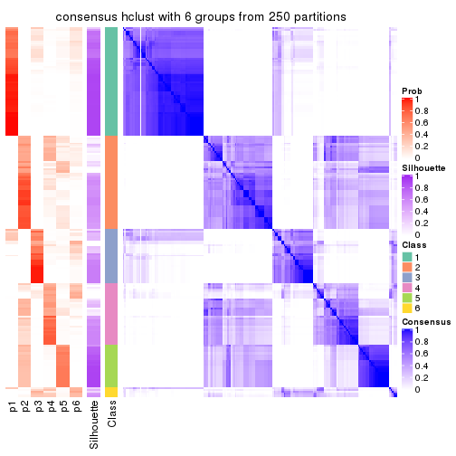</p>

</div>
</div>

Heatmaps for the membership of samples in all partitions to see how consistent they are:


<script>
$( function() {
	$( '#tabs-MAD-hclust-membership-heatmap' ).tabs();
} );
</script>
<div id='tabs-MAD-hclust-membership-heatmap'>
<ul>
<li><a href='#tab-MAD-hclust-membership-heatmap-1'>k = 2</a></li>
<li><a href='#tab-MAD-hclust-membership-heatmap-2'>k = 3</a></li>
<li><a href='#tab-MAD-hclust-membership-heatmap-3'>k = 4</a></li>
<li><a href='#tab-MAD-hclust-membership-heatmap-4'>k = 5</a></li>
<li><a href='#tab-MAD-hclust-membership-heatmap-5'>k = 6</a></li>
</ul>
<div id='tab-MAD-hclust-membership-heatmap-1'>
<pre><code class="r">membership_heatmap(res, k = 2)
</code></pre>

<p></p>

</div>
<div id='tab-MAD-hclust-membership-heatmap-2'>
<pre><code class="r">membership_heatmap(res, k = 3)
</code></pre>

<p></p>

</div>
<div id='tab-MAD-hclust-membership-heatmap-3'>
<pre><code class="r">membership_heatmap(res, k = 4)
</code></pre>

<p></p>

</div>
<div id='tab-MAD-hclust-membership-heatmap-4'>
<pre><code class="r">membership_heatmap(res, k = 5)
</code></pre>

<p></p>

</div>
<div id='tab-MAD-hclust-membership-heatmap-5'>
<pre><code class="r">membership_heatmap(res, k = 6)
</code></pre>

<p></p>

</div>
</div>

As soon as we have had the classes for columns, we can look for signatures
which are significantly different between classes which can be candidate marks
for certain classes. Following are the heatmaps for signatures.


Signature heatmaps where rows are scaled:


<script>
$( function() {
	$( '#tabs-MAD-hclust-get-signatures' ).tabs();
} );
</script>
<div id='tabs-MAD-hclust-get-signatures'>
<ul>
<li><a href='#tab-MAD-hclust-get-signatures-1'>k = 2</a></li>
<li><a href='#tab-MAD-hclust-get-signatures-2'>k = 3</a></li>
<li><a href='#tab-MAD-hclust-get-signatures-3'>k = 4</a></li>
<li><a href='#tab-MAD-hclust-get-signatures-4'>k = 5</a></li>
<li><a href='#tab-MAD-hclust-get-signatures-5'>k = 6</a></li>
</ul>
<div id='tab-MAD-hclust-get-signatures-1'>
<pre><code class="r">get_signatures(res, k = 2)
</code></pre>

<p></p>

</div>
<div id='tab-MAD-hclust-get-signatures-2'>
<pre><code class="r">get_signatures(res, k = 3)
</code></pre>

<p></p>

</div>
<div id='tab-MAD-hclust-get-signatures-3'>
<pre><code class="r">get_signatures(res, k = 4)
</code></pre>

<p></p>

</div>
<div id='tab-MAD-hclust-get-signatures-4'>
<pre><code class="r">get_signatures(res, k = 5)
</code></pre>

<p></p>

</div>
<div id='tab-MAD-hclust-get-signatures-5'>
<pre><code class="r">get_signatures(res, k = 6)
</code></pre>

<p></p>

</div>
</div>


Signature heatmaps where rows are not scaled:


<script>
$( function() {
	$( '#tabs-MAD-hclust-get-signatures-no-scale' ).tabs();
} );
</script>
<div id='tabs-MAD-hclust-get-signatures-no-scale'>
<ul>
<li><a href='#tab-MAD-hclust-get-signatures-no-scale-1'>k = 2</a></li>
<li><a href='#tab-MAD-hclust-get-signatures-no-scale-2'>k = 3</a></li>
<li><a href='#tab-MAD-hclust-get-signatures-no-scale-3'>k = 4</a></li>
<li><a href='#tab-MAD-hclust-get-signatures-no-scale-4'>k = 5</a></li>
<li><a href='#tab-MAD-hclust-get-signatures-no-scale-5'>k = 6</a></li>
</ul>
<div id='tab-MAD-hclust-get-signatures-no-scale-1'>
<pre><code class="r">get_signatures(res, k = 2, scale_rows = FALSE)
</code></pre>

<p></p>

</div>
<div id='tab-MAD-hclust-get-signatures-no-scale-2'>
<pre><code class="r">get_signatures(res, k = 3, scale_rows = FALSE)
</code></pre>

<p></p>

</div>
<div id='tab-MAD-hclust-get-signatures-no-scale-3'>
<pre><code class="r">get_signatures(res, k = 4, scale_rows = FALSE)
</code></pre>

<p></p>

</div>
<div id='tab-MAD-hclust-get-signatures-no-scale-4'>
<pre><code class="r">get_signatures(res, k = 5, scale_rows = FALSE)
</code></pre>

<p></p>

</div>
<div id='tab-MAD-hclust-get-signatures-no-scale-5'>
<pre><code class="r">get_signatures(res, k = 6, scale_rows = FALSE)
</code></pre>

<p></p>

</div>
</div>


Compare the overlap of signatures from different k:

```r
compare_signatures(res)
```


`get_signature()` returns a data frame invisibly. TO get the list of signatures, the function
call should be assigned to a variable explicitly. In following code, if `plot` argument is set
to `FALSE`, no heatmap is plotted while only the differential analysis is performed.

```r
# code only for demonstration
tb = get_signature(res, k = ..., plot = FALSE)
```

An example of the output of `tb` is:

```
#>   which_row         fdr    mean_1    mean_2 scaled_mean_1 scaled_mean_2 km
#> 1        38 0.042760348  8.373488  9.131774    -0.5533452     0.5164555  1
#> 2        40 0.018707592  7.106213  8.469186    -0.6173731     0.5762149  1
#> 3        55 0.019134737 10.221463 11.207825    -0.6159697     0.5749050  1
#> 4        59 0.006059896  5.921854  7.869574    -0.6899429     0.6439467  1
#> 5        60 0.018055526  8.928898 10.211722    -0.6204761     0.5791110  1
#> 6        98 0.009384629 15.714769 14.887706     0.6635654    -0.6193277  2
...
```

The columns in `tb` are:

1. `which_row`: row indices corresponding to the input matrix.
2. `fdr`: FDR for the differential test. 
3. `mean_x`: The mean value in group x.
4. `scaled_mean_x`: The mean value in group x after rows are scaled.
5. `km`: Row groups if k-means clustering is applied to rows.


UMAP plot which shows how samples are separated.


<script>
$( function() {
	$( '#tabs-MAD-hclust-dimension-reduction' ).tabs();
} );
</script>
<div id='tabs-MAD-hclust-dimension-reduction'>
<ul>
<li><a href='#tab-MAD-hclust-dimension-reduction-1'>k = 2</a></li>
<li><a href='#tab-MAD-hclust-dimension-reduction-2'>k = 3</a></li>
<li><a href='#tab-MAD-hclust-dimension-reduction-3'>k = 4</a></li>
<li><a href='#tab-MAD-hclust-dimension-reduction-4'>k = 5</a></li>
<li><a href='#tab-MAD-hclust-dimension-reduction-5'>k = 6</a></li>
</ul>
<div id='tab-MAD-hclust-dimension-reduction-1'>
<pre><code class="r">dimension_reduction(res, k = 2, method = &quot;UMAP&quot;)
</code></pre>

<p></p>

</div>
<div id='tab-MAD-hclust-dimension-reduction-2'>
<pre><code class="r">dimension_reduction(res, k = 3, method = &quot;UMAP&quot;)
</code></pre>

<p></p>

</div>
<div id='tab-MAD-hclust-dimension-reduction-3'>
<pre><code class="r">dimension_reduction(res, k = 4, method = &quot;UMAP&quot;)
</code></pre>

<p></p>

</div>
<div id='tab-MAD-hclust-dimension-reduction-4'>
<pre><code class="r">dimension_reduction(res, k = 5, method = &quot;UMAP&quot;)
</code></pre>

<p></p>

</div>
<div id='tab-MAD-hclust-dimension-reduction-5'>
<pre><code class="r">dimension_reduction(res, k = 6, method = &quot;UMAP&quot;)
</code></pre>

<p></p>

</div>
</div>


Following heatmap shows how subgroups are split when increasing `k`:

```r
collect_classes(res)
```


If matrix rows can be associated to genes, consider to use `GO_Enrichment(res,
...)` to perform function enrichment for the signature genes.


 

---------------------------------------------------


### MAD:kmeans**


The object with results only for a single top-value method and a single partition method 
can be extracted as:

```r
res = res_list["MAD", "kmeans"]
# you can also extract it by
# res = res_list["MAD:kmeans"]
```

A summary of `res` and all the functions that can be applied to it:

```r
res
```

```
#> A 'ConsensusPartition' object with k = 2, 3, 4, 5, 6.
#>   On a matrix with 17680 rows and 218 columns.
#>   Top rows (1000, 2000, 3000, 4000, 5000) are extracted by 'MAD' method.
#>   Subgroups are detected by 'kmeans' method.
#>   Performed in total 1250 partitions by row resampling.
#>   Best k for subgroups seems to be 2.
#> 
#> Following methods can be applied to this 'ConsensusPartition' object:
#>  [1] "cola_report"             "collect_classes"         "collect_plots"          
#>  [4] "collect_stats"           "colnames"                "compare_signatures"     
#>  [7] "consensus_heatmap"       "dimension_reduction"     "functional_enrichment"  
#> [10] "get_anno_col"            "get_anno"                "get_classes"            
#> [13] "get_consensus"           "get_matrix"              "get_membership"         
#> [16] "get_param"               "get_signatures"          "get_stats"              
#> [19] "is_best_k"               "is_stable_k"             "membership_heatmap"     
#> [22] "ncol"                    "nrow"                    "plot_ecdf"              
#> [25] "rownames"                "select_partition_number" "show"                   
#> [28] "suggest_best_k"          "test_to_known_factors"
```

`collect_plots()` function collects all the plots made from `res` for all `k` (number of partitions)
into one single page to provide an easy and fast comparison between different `k`.

```r
collect_plots(res)
```


The plots are:

- The first row: a plot of the ECDF (Empirical cumulative distribution
  function) curves of the consensus matrix for each `k` and the heatmap of
  predicted classes for each `k`.
- The second row: heatmaps of the consensus matrix for each `k`.
- The third row: heatmaps of the membership matrix for each `k`.
- The fouth row: heatmaps of the signatures for each `k`.

All the plots in panels can be made by individual functions and they are
plotted later in this section.

`select_partition_number()` produces several plots showing different
statistics for choosing "optimized" `k`. There are following statistics:

- ECDF curves of the consensus matrix for each `k`;
- 1-PAC. [The PAC
  score](https://en.wikipedia.org/wiki/Consensus_clustering#Over-interpretation_potential_of_consensus_clustering)
  measures the proportion of the ambiguous subgrouping.
- Mean silhouette score.
- Concordance. The mean probability of fiting the consensus class ids in all
  partitions.
- Area increased. Denote $A_k$ as the area under the ECDF curve for current
  `k`, the area increased is defined as $A_k - A_{k-1}$.
- Rand index. The percent of pairs of samples that are both in a same cluster
  or both are not in a same cluster in the partition of k and k-1.
- Jaccard index. The ratio of pairs of samples are both in a same cluster in
  the partition of k and k-1 and the pairs of samples are both in a same
  cluster in the partition k or k-1.

The detailed explanations of these statistics can be found in [the cola
vignette](http://bioconductor.org/packages/devel/bioc/vignettes/cola/inst/doc/cola.html#toc_13).

Generally speaking, lower PAC score, higher mean silhouette score or higher
concordance corresponds to better partition. Rand index and Jaccard index
measure how similar the current partition is compared to partition with `k-1`.
If they are too similar, we won't accept `k` is better than `k-1`.

```r
select_partition_number(res)
```


The numeric values for all these statistics can be obtained by `get_stats()`.

```r
get_stats(res)
```

```
#>   k 1-PAC mean_silhouette concordance area_increased  Rand Jaccard
#> 2 2 1.000           0.977       0.991         0.5009 0.499   0.499
#> 3 3 0.684           0.681       0.796         0.2837 0.867   0.740
#> 4 4 0.688           0.791       0.854         0.1442 0.810   0.546
#> 5 5 0.761           0.723       0.826         0.0718 0.916   0.687
#> 6 6 0.740           0.662       0.785         0.0394 0.951   0.773
```

`suggest_best_k()` suggests the best $k$ based on these statistics. The rules are as follows:

- All $k$ with Jaccard index larger than 0.95 are removed because the increase of
  the partition number does not provides enough extra information. If all $k$ are removed,
  the best $k$ is assigned by `NA`.
- For $k$ with 1-PAC larger than 0.9, the maximal $k$ is taken as the "best k". Other $k$ is called "optional k".
- If it does not fit the second rule. The $k$ with the highest vote of highest
  1-PAC, mean silhouette and concordance is taken as the "best k".

```r
suggest_best_k(res)
```

```
#> [1] 2
```


Following shows the table of the partitions (You need to click the **show/hide
code output** link to see it). The membership matrix (columns with name `p*`)
is inferred by
[`clue::cl_consensus()`](https://www.rdocumentation.org/link/cl_consensus?package=clue)
function with the `SE` method. Basically the value in the membership matrix
represents the probability to belong to a certain group. The finall class
label for an item is determined with the group with highest probability it
belongs to.

In `get_classes()` function, the entropy is calculated from the membership
matrix and the silhouette score is calculated from the consensus matrix.


<script>
$( function() {
	$( '#tabs-MAD-kmeans-get-classes' ).tabs();
} );
</script>
<div id='tabs-MAD-kmeans-get-classes'>
<ul>
<li><a href='#tab-MAD-kmeans-get-classes-1'>k = 2</a></li>
<li><a href='#tab-MAD-kmeans-get-classes-2'>k = 3</a></li>
<li><a href='#tab-MAD-kmeans-get-classes-3'>k = 4</a></li>
<li><a href='#tab-MAD-kmeans-get-classes-4'>k = 5</a></li>
<li><a href='#tab-MAD-kmeans-get-classes-5'>k = 6</a></li>
</ul>

<div id='tab-MAD-kmeans-get-classes-1'>
<p><a id='tab-MAD-kmeans-get-classes-1-a' style='color:#0366d6' href='#'>show/hide code output</a></p>
<pre><code class="r">cbind(get_classes(res, k = 2), get_membership(res, k = 2))
</code></pre>

<pre><code>#&gt;            class entropy silhouette    p1    p2
#&gt; SRR1498997     2   0.000      0.993 0.000 1.000
#&gt; SRR1076441     1   0.000      0.989 1.000 0.000
#&gt; SRR1489803     2   0.000      0.993 0.000 1.000
#&gt; SRR1345953     2   0.000      0.993 0.000 1.000
#&gt; SRR1357826     2   0.000      0.993 0.000 1.000
#&gt; SRR1419656     1   0.000      0.989 1.000 0.000
#&gt; SRR1454158     2   0.000      0.993 0.000 1.000
#&gt; SRR1475408     2   0.000      0.993 0.000 1.000
#&gt; SRR1472704     2   0.000      0.993 0.000 1.000
#&gt; SRR1090046     1   0.000      0.989 1.000 0.000
#&gt; SRR1312822     1   0.000      0.989 1.000 0.000
#&gt; SRR1096987     2   0.000      0.993 0.000 1.000
#&gt; SRR1334587     2   0.000      0.993 0.000 1.000
#&gt; SRR1490246     1   0.000      0.989 1.000 0.000
#&gt; SRR1467522     1   0.000      0.989 1.000 0.000
#&gt; SRR1324206     1   0.000      0.989 1.000 0.000
#&gt; SRR1408574     2   0.000      0.993 0.000 1.000
#&gt; SRR1083959     2   0.000      0.993 0.000 1.000
#&gt; SRR1079948     2   0.000      0.993 0.000 1.000
#&gt; SRR1310667     2   0.000      0.993 0.000 1.000
#&gt; SRR655852      2   0.000      0.993 0.000 1.000
#&gt; SRR1352457     2   0.000      0.993 0.000 1.000
#&gt; SRR1353994     2   0.000      0.993 0.000 1.000
#&gt; SRR1459561     2   0.000      0.993 0.000 1.000
#&gt; SRR1454009     1   0.000      0.989 1.000 0.000
#&gt; SRR1071084     1   0.000      0.989 1.000 0.000
#&gt; SRR1082859     2   0.000      0.993 0.000 1.000
#&gt; SRR1086538     1   0.000      0.989 1.000 0.000
#&gt; SRR1486262     2   0.000      0.993 0.000 1.000
#&gt; SRR658105      1   0.000      0.989 1.000 0.000
#&gt; SRR811073      2   0.000      0.993 0.000 1.000
#&gt; SRR1429181     2   0.000      0.993 0.000 1.000
#&gt; SRR1327896     2   0.000      0.993 0.000 1.000
#&gt; SRR1464788     2   0.000      0.993 0.000 1.000
#&gt; SRR1346861     2   0.000      0.993 0.000 1.000
#&gt; SRR1318774     2   0.000      0.993 0.000 1.000
#&gt; SRR1420517     1   0.000      0.989 1.000 0.000
#&gt; SRR1369584     2   0.000      0.993 0.000 1.000
#&gt; SRR1443244     1   0.722      0.753 0.800 0.200
#&gt; SRR1455391     1   0.000      0.989 1.000 0.000
#&gt; SRR1068999     1   0.000      0.989 1.000 0.000
#&gt; SRR1481297     1   0.000      0.989 1.000 0.000
#&gt; SRR1070208     1   0.000      0.989 1.000 0.000
#&gt; SRR1317282     1   0.000      0.989 1.000 0.000
#&gt; SRR1096125     2   0.000      0.993 0.000 1.000
#&gt; SRR1472506     1   0.224      0.954 0.964 0.036
#&gt; SRR1388281     2   0.000      0.993 0.000 1.000
#&gt; SRR1365622     2   0.000      0.993 0.000 1.000
#&gt; SRR662306      1   0.000      0.989 1.000 0.000
#&gt; SRR662811      1   0.000      0.989 1.000 0.000
#&gt; SRR820571      1   0.402      0.908 0.920 0.080
#&gt; SRR1357166     1   0.000      0.989 1.000 0.000
#&gt; SRR1488586     1   0.000      0.989 1.000 0.000
#&gt; SRR1485398     1   0.000      0.989 1.000 0.000
#&gt; SRR1417725     2   0.000      0.993 0.000 1.000
#&gt; SRR1409397     2   0.000      0.993 0.000 1.000
#&gt; SRR1465693     2   0.000      0.993 0.000 1.000
#&gt; SRR1096547     1   0.000      0.989 1.000 0.000
#&gt; SRR1456818     1   0.000      0.989 1.000 0.000
#&gt; SRR816336      1   0.000      0.989 1.000 0.000
#&gt; SRR1420238     1   0.000      0.989 1.000 0.000
#&gt; SRR1433374     1   0.000      0.989 1.000 0.000
#&gt; SRR1436990     1   0.000      0.989 1.000 0.000
#&gt; SRR662378      1   0.000      0.989 1.000 0.000
#&gt; SRR1477671     1   0.000      0.989 1.000 0.000
#&gt; SRR1084079     2   0.983      0.248 0.424 0.576
#&gt; SRR1102949     1   0.000      0.989 1.000 0.000
#&gt; SRR1458090     1   0.000      0.989 1.000 0.000
#&gt; SRR1418729     2   0.000      0.993 0.000 1.000
#&gt; SRR1403814     2   0.000      0.993 0.000 1.000
#&gt; SRR1404887     1   0.697      0.771 0.812 0.188
#&gt; SRR1434955     1   0.000      0.989 1.000 0.000
#&gt; SRR1360652     1   0.000      0.989 1.000 0.000
#&gt; SRR1356765     2   0.000      0.993 0.000 1.000
#&gt; SRR1078258     2   0.000      0.993 0.000 1.000
#&gt; SRR1455861     1   0.000      0.989 1.000 0.000
#&gt; SRR1420296     2   0.000      0.993 0.000 1.000
#&gt; SRR1070260     2   0.000      0.993 0.000 1.000
#&gt; SRR1410765     1   0.000      0.989 1.000 0.000
#&gt; SRR1481315     1   0.000      0.989 1.000 0.000
#&gt; SRR1414661     2   0.000      0.993 0.000 1.000
#&gt; SRR1359147     2   0.000      0.993 0.000 1.000
#&gt; SRR1488694     1   0.000      0.989 1.000 0.000
#&gt; SRR1477273     1   0.000      0.989 1.000 0.000
#&gt; SRR1415792     1   0.000      0.989 1.000 0.000
#&gt; SRR1369088     2   0.000      0.993 0.000 1.000
#&gt; SRR1406621     2   0.000      0.993 0.000 1.000
#&gt; SRR1401017     2   0.000      0.993 0.000 1.000
#&gt; SRR1099981     2   0.000      0.993 0.000 1.000
#&gt; SRR815208      2   0.000      0.993 0.000 1.000
#&gt; SRR1380460     2   0.000      0.993 0.000 1.000
#&gt; SRR1091097     2   0.000      0.993 0.000 1.000
#&gt; SRR1456010     1   0.000      0.989 1.000 0.000
#&gt; SRR1498416     2   0.000      0.993 0.000 1.000
#&gt; SRR818873      2   0.000      0.993 0.000 1.000
#&gt; SRR813868      2   0.000      0.993 0.000 1.000
#&gt; SRR1394912     1   0.000      0.989 1.000 0.000
#&gt; SRR1475824     2   0.000      0.993 0.000 1.000
#&gt; SRR1459866     1   0.000      0.989 1.000 0.000
#&gt; SRR1364871     1   0.985      0.260 0.572 0.428
#&gt; SRR1100472     2   0.000      0.993 0.000 1.000
#&gt; SRR1331267     1   0.000      0.989 1.000 0.000
#&gt; SRR1068977     2   0.000      0.993 0.000 1.000
#&gt; SRR1391511     2   0.000      0.993 0.000 1.000
#&gt; SRR1077920     2   0.000      0.993 0.000 1.000
#&gt; SRR1457705     1   0.000      0.989 1.000 0.000
#&gt; SRR1437073     1   0.000      0.989 1.000 0.000
#&gt; SRR1473124     1   0.000      0.989 1.000 0.000
#&gt; SRR1469279     1   0.000      0.989 1.000 0.000
#&gt; SRR1091791     2   0.000      0.993 0.000 1.000
#&gt; SRR1341539     2   0.000      0.993 0.000 1.000
#&gt; SRR1446354     1   0.000      0.989 1.000 0.000
#&gt; SRR1415420     1   0.000      0.989 1.000 0.000
#&gt; SRR1368050     1   0.000      0.989 1.000 0.000
#&gt; SRR656970      2   0.000      0.993 0.000 1.000
#&gt; SRR1473403     2   0.000      0.993 0.000 1.000
#&gt; SRR1084674     1   0.000      0.989 1.000 0.000
#&gt; SRR1464702     1   0.000      0.989 1.000 0.000
#&gt; SRR1074860     2   0.000      0.993 0.000 1.000
#&gt; SRR655447      2   0.000      0.993 0.000 1.000
#&gt; SRR1404442     2   0.000      0.993 0.000 1.000
#&gt; SRR1418795     1   0.000      0.989 1.000 0.000
#&gt; SRR1458335     2   0.000      0.993 0.000 1.000
#&gt; SRR1489589     2   0.000      0.993 0.000 1.000
#&gt; SRR1378284     1   0.000      0.989 1.000 0.000
#&gt; SRR1408014     2   0.000      0.993 0.000 1.000
#&gt; SRR1083052     1   0.000      0.989 1.000 0.000
#&gt; SRR1339236     2   0.000      0.993 0.000 1.000
#&gt; SRR1323829     2   0.000      0.993 0.000 1.000
#&gt; SRR1086772     2   0.000      0.993 0.000 1.000
#&gt; SRR1486457     1   0.000      0.989 1.000 0.000
#&gt; SRR1415257     2   0.000      0.993 0.000 1.000
#&gt; SRR1071905     1   0.000      0.989 1.000 0.000
#&gt; SRR659223      2   0.000      0.993 0.000 1.000
#&gt; SRR1386945     1   0.000      0.989 1.000 0.000
#&gt; SRR821498      2   0.000      0.993 0.000 1.000
#&gt; SRR1378903     2   0.000      0.993 0.000 1.000
#&gt; SRR1472907     1   0.000      0.989 1.000 0.000
#&gt; SRR1442313     2   0.000      0.993 0.000 1.000
#&gt; SRR1077139     2   0.000      0.993 0.000 1.000
#&gt; SRR1342758     1   0.000      0.989 1.000 0.000
#&gt; SRR656911      2   0.000      0.993 0.000 1.000
#&gt; SRR1070738     1   0.000      0.989 1.000 0.000
#&gt; SRR1476950     1   0.000      0.989 1.000 0.000
#&gt; SRR1488196     1   0.000      0.989 1.000 0.000
#&gt; SRR1498951     1   0.000      0.989 1.000 0.000
#&gt; SRR1413392     1   0.000      0.989 1.000 0.000
#&gt; SRR657528      2   0.000      0.993 0.000 1.000
#&gt; SRR812198      1   0.000      0.989 1.000 0.000
#&gt; SRR660283      2   0.000      0.993 0.000 1.000
#&gt; SRR1420936     1   0.000      0.989 1.000 0.000
#&gt; SRR1469547     2   0.000      0.993 0.000 1.000
#&gt; SRR1322249     1   0.000      0.989 1.000 0.000
#&gt; SRR1396682     1   0.000      0.989 1.000 0.000
#&gt; SRR1095816     2   0.000      0.993 0.000 1.000
#&gt; SRR1081023     1   0.000      0.989 1.000 0.000
#&gt; SRR1092517     2   0.000      0.993 0.000 1.000
#&gt; SRR811285      2   0.000      0.993 0.000 1.000
#&gt; SRR657018      1   0.000      0.989 1.000 0.000
#&gt; SRR1365534     1   0.000      0.989 1.000 0.000
#&gt; SRR1090791     2   0.000      0.993 0.000 1.000
#&gt; SRR1439915     2   0.000      0.993 0.000 1.000
#&gt; SRR1391575     2   0.000      0.993 0.000 1.000
#&gt; SRR1314092     2   0.000      0.993 0.000 1.000
#&gt; SRR1328941     1   0.000      0.989 1.000 0.000
#&gt; SRR1336181     2   0.000      0.993 0.000 1.000
#&gt; SRR1362972     1   0.000      0.989 1.000 0.000
#&gt; SRR1366790     2   0.000      0.993 0.000 1.000
#&gt; SRR1455902     1   0.000      0.989 1.000 0.000
#&gt; SRR1437644     2   0.973      0.309 0.404 0.596
#&gt; SRR1105009     2   0.000      0.993 0.000 1.000
#&gt; SRR1367024     1   0.000      0.989 1.000 0.000
#&gt; SRR660248      2   0.000      0.993 0.000 1.000
#&gt; SRR1409620     1   0.000      0.989 1.000 0.000
#&gt; SRR1455807     2   0.000      0.993 0.000 1.000
#&gt; SRR1339431     1   0.000      0.989 1.000 0.000
#&gt; SRR1378948     1   0.706      0.765 0.808 0.192
#&gt; SRR1469237     1   0.000      0.989 1.000 0.000
#&gt; SRR1098264     2   0.000      0.993 0.000 1.000
#&gt; SRR1406224     2   0.000      0.993 0.000 1.000
#&gt; SRR1393026     1   0.000      0.989 1.000 0.000
#&gt; SRR808428      2   0.000      0.993 0.000 1.000
#&gt; SRR615910      2   0.000      0.993 0.000 1.000
#&gt; SRR1076219     1   0.000      0.989 1.000 0.000
#&gt; SRR1481128     1   0.000      0.989 1.000 0.000
#&gt; SRR1359262     2   0.000      0.993 0.000 1.000
#&gt; SRR1407648     2   0.000      0.993 0.000 1.000
#&gt; SRR1386775     1   0.000      0.989 1.000 0.000
#&gt; SRR1388399     1   0.000      0.989 1.000 0.000
#&gt; SRR1361499     2   0.000      0.993 0.000 1.000
#&gt; SRR1500709     2   0.000      0.993 0.000 1.000
#&gt; SRR1335917     1   0.000      0.989 1.000 0.000
#&gt; SRR1430615     2   0.000      0.993 0.000 1.000
#&gt; SRR1335212     1   0.000      0.989 1.000 0.000
#&gt; SRR1400159     2   0.000      0.993 0.000 1.000
#&gt; SRR1457245     2   0.000      0.993 0.000 1.000
#&gt; SRR1356746     2   0.000      0.993 0.000 1.000
#&gt; SRR658319      2   0.000      0.993 0.000 1.000
#&gt; SRR1435946     1   0.000      0.989 1.000 0.000
#&gt; SRR1370308     1   0.000      0.989 1.000 0.000
#&gt; SRR1100893     1   0.000      0.989 1.000 0.000
#&gt; SRR1389432     1   0.000      0.989 1.000 0.000
#&gt; SRR1381799     2   0.000      0.993 0.000 1.000
#&gt; SRR1310158     1   0.000      0.989 1.000 0.000
#&gt; SRR1341100     2   0.000      0.993 0.000 1.000
#&gt; SRR1342873     1   0.000      0.989 1.000 0.000
#&gt; SRR1472102     2   0.000      0.993 0.000 1.000
#&gt; SRR1409421     1   0.000      0.989 1.000 0.000
#&gt; SRR1328577     2   0.000      0.993 0.000 1.000
#&gt; SRR808942      2   0.000      0.993 0.000 1.000
#&gt; SRR1343818     2   0.000      0.993 0.000 1.000
#&gt; SRR1472415     2   0.000      0.993 0.000 1.000
#&gt; SRR658409      2   0.000      0.993 0.000 1.000
#&gt; SRR1469681     1   0.000      0.989 1.000 0.000
#&gt; SRR1075484     2   0.000      0.993 0.000 1.000
#&gt; SRR1417894     1   0.000      0.989 1.000 0.000
#&gt; SRR1417422     2   0.000      0.993 0.000 1.000
#&gt; SRR1090674     1   0.000      0.989 1.000 0.000
</code></pre>

<script>
$('#tab-MAD-kmeans-get-classes-1-a').parent().next().next().hide();
$('#tab-MAD-kmeans-get-classes-1-a').click(function(){
  $('#tab-MAD-kmeans-get-classes-1-a').parent().next().next().toggle();
  return(false);
});
</script>
</div>

<div id='tab-MAD-kmeans-get-classes-2'>
<p><a id='tab-MAD-kmeans-get-classes-2-a' style='color:#0366d6' href='#'>show/hide code output</a></p>
<pre><code class="r">cbind(get_classes(res, k = 3), get_membership(res, k = 3))
</code></pre>

<pre><code>#&gt;            class entropy silhouette    p1    p2    p3
#&gt; SRR1498997     2  0.6267     0.7801 0.000 0.548 0.452
#&gt; SRR1076441     1  0.0000     0.9095 1.000 0.000 0.000
#&gt; SRR1489803     2  0.6267     0.7798 0.000 0.548 0.452
#&gt; SRR1345953     2  0.6267     0.7801 0.000 0.548 0.452
#&gt; SRR1357826     2  0.6267     0.7801 0.000 0.548 0.452
#&gt; SRR1419656     1  0.5835    -0.0386 0.660 0.000 0.340
#&gt; SRR1454158     2  0.6260     0.7801 0.000 0.552 0.448
#&gt; SRR1475408     2  0.6008    -0.0879 0.000 0.628 0.372
#&gt; SRR1472704     2  0.6267     0.7801 0.000 0.548 0.452
#&gt; SRR1090046     3  0.8503     0.6372 0.352 0.104 0.544
#&gt; SRR1312822     1  0.0000     0.9095 1.000 0.000 0.000
#&gt; SRR1096987     2  0.0000     0.6599 0.000 1.000 0.000
#&gt; SRR1334587     2  0.6267     0.7798 0.000 0.548 0.452
#&gt; SRR1490246     1  0.0000     0.9095 1.000 0.000 0.000
#&gt; SRR1467522     1  0.0000     0.9095 1.000 0.000 0.000
#&gt; SRR1324206     1  0.0000     0.9095 1.000 0.000 0.000
#&gt; SRR1408574     2  0.0237     0.6591 0.000 0.996 0.004
#&gt; SRR1083959     2  0.6267     0.7801 0.000 0.548 0.452
#&gt; SRR1079948     2  0.0424     0.6582 0.000 0.992 0.008
#&gt; SRR1310667     2  0.6267     0.7798 0.000 0.548 0.452
#&gt; SRR655852      2  0.0237     0.6609 0.000 0.996 0.004
#&gt; SRR1352457     2  0.6267     0.7801 0.000 0.548 0.452
#&gt; SRR1353994     2  0.6267     0.7801 0.000 0.548 0.452
#&gt; SRR1459561     2  0.6274     0.7799 0.000 0.544 0.456
#&gt; SRR1454009     3  0.6280     0.7021 0.460 0.000 0.540
#&gt; SRR1071084     3  0.6280     0.7021 0.460 0.000 0.540
#&gt; SRR1082859     2  0.6267     0.7801 0.000 0.548 0.452
#&gt; SRR1086538     1  0.0000     0.9095 1.000 0.000 0.000
#&gt; SRR1486262     2  0.0237     0.6609 0.000 0.996 0.004
#&gt; SRR658105      1  0.0000     0.9095 1.000 0.000 0.000
#&gt; SRR811073      2  0.6267     0.7801 0.000 0.548 0.452
#&gt; SRR1429181     2  0.0237     0.6591 0.000 0.996 0.004
#&gt; SRR1327896     2  0.0237     0.6609 0.000 0.996 0.004
#&gt; SRR1464788     2  0.5465     0.7524 0.000 0.712 0.288
#&gt; SRR1346861     2  0.6267     0.7801 0.000 0.548 0.452
#&gt; SRR1318774     2  0.5560     0.7543 0.000 0.700 0.300
#&gt; SRR1420517     3  0.6274     0.7024 0.456 0.000 0.544
#&gt; SRR1369584     2  0.6274     0.7799 0.000 0.544 0.456
#&gt; SRR1443244     2  0.8808    -0.3955 0.116 0.484 0.400
#&gt; SRR1455391     1  0.0000     0.9095 1.000 0.000 0.000
#&gt; SRR1068999     1  0.0000     0.9095 1.000 0.000 0.000
#&gt; SRR1481297     3  0.6309     0.6212 0.500 0.000 0.500
#&gt; SRR1070208     1  0.6252    -0.4796 0.556 0.000 0.444
#&gt; SRR1317282     3  0.6280     0.7021 0.460 0.000 0.540
#&gt; SRR1096125     2  0.0424     0.6632 0.000 0.992 0.008
#&gt; SRR1472506     3  0.6483     0.4635 0.004 0.452 0.544
#&gt; SRR1388281     2  0.6267     0.7801 0.000 0.548 0.452
#&gt; SRR1365622     2  0.0424     0.6563 0.000 0.992 0.008
#&gt; SRR662306      3  0.6286     0.6955 0.464 0.000 0.536
#&gt; SRR662811      1  0.0000     0.9095 1.000 0.000 0.000
#&gt; SRR820571      3  0.6483     0.4635 0.004 0.452 0.544
#&gt; SRR1357166     1  0.6274    -0.5158 0.544 0.000 0.456
#&gt; SRR1488586     3  0.9128     0.5648 0.204 0.252 0.544
#&gt; SRR1485398     1  0.0000     0.9095 1.000 0.000 0.000
#&gt; SRR1417725     2  0.6305    -0.3596 0.000 0.516 0.484
#&gt; SRR1409397     2  0.6267     0.7798 0.000 0.548 0.452
#&gt; SRR1465693     2  0.6267     0.7798 0.000 0.548 0.452
#&gt; SRR1096547     3  0.6267     0.4579 0.000 0.452 0.548
#&gt; SRR1456818     1  0.0000     0.9095 1.000 0.000 0.000
#&gt; SRR816336      3  0.9135     0.5698 0.208 0.248 0.544
#&gt; SRR1420238     1  0.0000     0.9095 1.000 0.000 0.000
#&gt; SRR1433374     3  0.6280     0.7021 0.460 0.000 0.540
#&gt; SRR1436990     1  0.0000     0.9095 1.000 0.000 0.000
#&gt; SRR662378      1  0.0000     0.9095 1.000 0.000 0.000
#&gt; SRR1477671     1  0.0000     0.9095 1.000 0.000 0.000
#&gt; SRR1084079     2  0.6520    -0.3822 0.004 0.508 0.488
#&gt; SRR1102949     1  0.0000     0.9095 1.000 0.000 0.000
#&gt; SRR1458090     1  0.0000     0.9095 1.000 0.000 0.000
#&gt; SRR1418729     2  0.3192     0.7050 0.000 0.888 0.112
#&gt; SRR1403814     2  0.0237     0.6572 0.000 0.996 0.004
#&gt; SRR1404887     2  0.8852    -0.3942 0.120 0.484 0.396
#&gt; SRR1434955     1  0.0000     0.9095 1.000 0.000 0.000
#&gt; SRR1360652     1  0.0000     0.9095 1.000 0.000 0.000
#&gt; SRR1356765     2  0.2537     0.6930 0.000 0.920 0.080
#&gt; SRR1078258     2  0.3619     0.7103 0.000 0.864 0.136
#&gt; SRR1455861     1  0.0000     0.9095 1.000 0.000 0.000
#&gt; SRR1420296     2  0.6267     0.7798 0.000 0.548 0.452
#&gt; SRR1070260     2  0.6267     0.7801 0.000 0.548 0.452
#&gt; SRR1410765     1  0.0000     0.9095 1.000 0.000 0.000
#&gt; SRR1481315     1  0.0000     0.9095 1.000 0.000 0.000
#&gt; SRR1414661     2  0.6267     0.7801 0.000 0.548 0.452
#&gt; SRR1359147     2  0.0424     0.6632 0.000 0.992 0.008
#&gt; SRR1488694     1  0.8869     0.0573 0.548 0.304 0.148
#&gt; SRR1477273     3  0.6483     0.7024 0.452 0.004 0.544
#&gt; SRR1415792     3  0.6280     0.7021 0.460 0.000 0.540
#&gt; SRR1369088     2  0.6180    -0.2010 0.000 0.584 0.416
#&gt; SRR1406621     2  0.0424     0.6563 0.000 0.992 0.008
#&gt; SRR1401017     2  0.5678     0.7600 0.000 0.684 0.316
#&gt; SRR1099981     2  0.0592     0.6638 0.000 0.988 0.012
#&gt; SRR815208      2  0.6267     0.7801 0.000 0.548 0.452
#&gt; SRR1380460     2  0.0237     0.6609 0.000 0.996 0.004
#&gt; SRR1091097     2  0.0237     0.6609 0.000 0.996 0.004
#&gt; SRR1456010     3  0.6280     0.7021 0.460 0.000 0.540
#&gt; SRR1498416     2  0.6026     0.7691 0.000 0.624 0.376
#&gt; SRR818873      2  0.6140     0.7756 0.000 0.596 0.404
#&gt; SRR813868      2  0.0424     0.6563 0.000 0.992 0.008
#&gt; SRR1394912     1  0.0000     0.9095 1.000 0.000 0.000
#&gt; SRR1475824     2  0.0424     0.6563 0.000 0.992 0.008
#&gt; SRR1459866     1  0.0000     0.9095 1.000 0.000 0.000
#&gt; SRR1364871     3  0.6267     0.4579 0.000 0.452 0.548
#&gt; SRR1100472     2  0.6267     0.7801 0.000 0.548 0.452
#&gt; SRR1331267     1  0.0237     0.9033 0.996 0.004 0.000
#&gt; SRR1068977     2  0.0237     0.6591 0.000 0.996 0.004
#&gt; SRR1391511     2  0.6267     0.7801 0.000 0.548 0.452
#&gt; SRR1077920     2  0.6267     0.7801 0.000 0.548 0.452
#&gt; SRR1457705     3  0.6295     0.6807 0.472 0.000 0.528
#&gt; SRR1437073     1  0.0000     0.9095 1.000 0.000 0.000
#&gt; SRR1473124     3  0.6483     0.7024 0.452 0.004 0.544
#&gt; SRR1469279     3  0.6307     0.6476 0.488 0.000 0.512
#&gt; SRR1091791     2  0.0237     0.6572 0.000 0.996 0.004
#&gt; SRR1341539     2  0.0424     0.6563 0.000 0.992 0.008
#&gt; SRR1446354     3  0.6280     0.7021 0.460 0.000 0.540
#&gt; SRR1415420     1  0.0000     0.9095 1.000 0.000 0.000
#&gt; SRR1368050     1  0.0000     0.9095 1.000 0.000 0.000
#&gt; SRR656970      2  0.6274     0.7799 0.000 0.544 0.456
#&gt; SRR1473403     2  0.3686     0.7116 0.000 0.860 0.140
#&gt; SRR1084674     3  0.6280     0.7021 0.460 0.000 0.540
#&gt; SRR1464702     1  0.0000     0.9095 1.000 0.000 0.000
#&gt; SRR1074860     2  0.0237     0.6572 0.000 0.996 0.004
#&gt; SRR655447      2  0.0424     0.6632 0.000 0.992 0.008
#&gt; SRR1404442     2  0.6267     0.7801 0.000 0.548 0.452
#&gt; SRR1418795     1  0.0000     0.9095 1.000 0.000 0.000
#&gt; SRR1458335     2  0.3192     0.7050 0.000 0.888 0.112
#&gt; SRR1489589     2  0.6267     0.7798 0.000 0.548 0.452
#&gt; SRR1378284     1  0.8394    -0.1503 0.576 0.108 0.316
#&gt; SRR1408014     2  0.6267     0.7798 0.000 0.548 0.452
#&gt; SRR1083052     1  0.0000     0.9095 1.000 0.000 0.000
#&gt; SRR1339236     2  0.6295    -0.3345 0.000 0.528 0.472
#&gt; SRR1323829     2  0.6274     0.7799 0.000 0.544 0.456
#&gt; SRR1086772     2  0.6267     0.7801 0.000 0.548 0.452
#&gt; SRR1486457     3  0.6483     0.7024 0.452 0.004 0.544
#&gt; SRR1415257     2  0.6267     0.7798 0.000 0.548 0.452
#&gt; SRR1071905     3  0.6280     0.7021 0.460 0.000 0.540
#&gt; SRR659223      2  0.6274     0.7799 0.000 0.544 0.456
#&gt; SRR1386945     3  0.6280     0.7021 0.460 0.000 0.540
#&gt; SRR821498      2  0.0424     0.6563 0.000 0.992 0.008
#&gt; SRR1378903     2  0.0237     0.6609 0.000 0.996 0.004
#&gt; SRR1472907     3  0.6280     0.7021 0.460 0.000 0.540
#&gt; SRR1442313     2  0.6267     0.7801 0.000 0.548 0.452
#&gt; SRR1077139     2  0.6274     0.7799 0.000 0.544 0.456
#&gt; SRR1342758     1  0.0000     0.9095 1.000 0.000 0.000
#&gt; SRR656911      2  0.0424     0.6563 0.000 0.992 0.008
#&gt; SRR1070738     1  0.0000     0.9095 1.000 0.000 0.000
#&gt; SRR1476950     1  0.1643     0.8471 0.956 0.000 0.044
#&gt; SRR1488196     3  0.6280     0.7021 0.460 0.000 0.540
#&gt; SRR1498951     3  0.6280     0.7021 0.460 0.000 0.540
#&gt; SRR1413392     1  0.0000     0.9095 1.000 0.000 0.000
#&gt; SRR657528      2  0.3412     0.7063 0.000 0.876 0.124
#&gt; SRR812198      1  0.0000     0.9095 1.000 0.000 0.000
#&gt; SRR660283      2  0.6267     0.7801 0.000 0.548 0.452
#&gt; SRR1420936     1  0.0000     0.9095 1.000 0.000 0.000
#&gt; SRR1469547     2  0.6267     0.7801 0.000 0.548 0.452
#&gt; SRR1322249     1  0.0000     0.9095 1.000 0.000 0.000
#&gt; SRR1396682     1  0.0000     0.9095 1.000 0.000 0.000
#&gt; SRR1095816     2  0.0424     0.6582 0.000 0.992 0.008
#&gt; SRR1081023     1  0.0000     0.9095 1.000 0.000 0.000
#&gt; SRR1092517     2  0.5465     0.7551 0.000 0.712 0.288
#&gt; SRR811285      2  0.5733     0.7616 0.000 0.676 0.324
#&gt; SRR657018      1  0.0000     0.9095 1.000 0.000 0.000
#&gt; SRR1365534     3  0.6280     0.7021 0.460 0.000 0.540
#&gt; SRR1090791     2  0.6267     0.7798 0.000 0.548 0.452
#&gt; SRR1439915     2  0.6225     0.7791 0.000 0.568 0.432
#&gt; SRR1391575     2  0.6126    -0.1650 0.000 0.600 0.400
#&gt; SRR1314092     2  0.3038     0.7021 0.000 0.896 0.104
#&gt; SRR1328941     3  0.6483     0.7024 0.452 0.004 0.544
#&gt; SRR1336181     2  0.6267     0.7801 0.000 0.548 0.452
#&gt; SRR1362972     1  0.0000     0.9095 1.000 0.000 0.000
#&gt; SRR1366790     2  0.4178     0.7237 0.000 0.828 0.172
#&gt; SRR1455902     3  0.6280     0.7021 0.460 0.000 0.540
#&gt; SRR1437644     3  0.6267     0.4579 0.000 0.452 0.548
#&gt; SRR1105009     2  0.6267     0.7801 0.000 0.548 0.452
#&gt; SRR1367024     3  0.6489     0.7026 0.456 0.004 0.540
#&gt; SRR660248      2  0.1289     0.6695 0.000 0.968 0.032
#&gt; SRR1409620     1  0.0000     0.9095 1.000 0.000 0.000
#&gt; SRR1455807     2  0.6267     0.7801 0.000 0.548 0.452
#&gt; SRR1339431     1  0.0000     0.9095 1.000 0.000 0.000
#&gt; SRR1378948     3  0.6483     0.4635 0.004 0.452 0.544
#&gt; SRR1469237     1  0.0000     0.9095 1.000 0.000 0.000
#&gt; SRR1098264     2  0.6267     0.7801 0.000 0.548 0.452
#&gt; SRR1406224     2  0.3192     0.7050 0.000 0.888 0.112
#&gt; SRR1393026     3  0.6308     0.6391 0.492 0.000 0.508
#&gt; SRR808428      2  0.6267     0.7801 0.000 0.548 0.452
#&gt; SRR615910      2  0.6267     0.7798 0.000 0.548 0.452
#&gt; SRR1076219     1  0.4555     0.5177 0.800 0.000 0.200
#&gt; SRR1481128     1  0.0000     0.9095 1.000 0.000 0.000
#&gt; SRR1359262     2  0.6267     0.7798 0.000 0.548 0.452
#&gt; SRR1407648     2  0.0237     0.6609 0.000 0.996 0.004
#&gt; SRR1386775     3  0.6641     0.4679 0.008 0.448 0.544
#&gt; SRR1388399     3  0.6483     0.4635 0.004 0.452 0.544
#&gt; SRR1361499     2  0.6267     0.7801 0.000 0.548 0.452
#&gt; SRR1500709     2  0.0237     0.6572 0.000 0.996 0.004
#&gt; SRR1335917     1  0.0000     0.9095 1.000 0.000 0.000
#&gt; SRR1430615     2  0.6267     0.7798 0.000 0.548 0.452
#&gt; SRR1335212     1  0.6260    -0.4921 0.552 0.000 0.448
#&gt; SRR1400159     3  0.6267     0.4579 0.000 0.452 0.548
#&gt; SRR1457245     2  0.6267     0.7801 0.000 0.548 0.452
#&gt; SRR1356746     2  0.6267     0.7801 0.000 0.548 0.452
#&gt; SRR658319      2  0.6252     0.7806 0.000 0.556 0.444
#&gt; SRR1435946     1  0.0000     0.9095 1.000 0.000 0.000
#&gt; SRR1370308     1  0.0000     0.9095 1.000 0.000 0.000
#&gt; SRR1100893     1  0.0000     0.9095 1.000 0.000 0.000
#&gt; SRR1389432     1  0.6280    -0.5275 0.540 0.000 0.460
#&gt; SRR1381799     2  0.6267     0.7801 0.000 0.548 0.452
#&gt; SRR1310158     3  0.6483     0.7024 0.452 0.004 0.544
#&gt; SRR1341100     2  0.6299    -0.3429 0.000 0.524 0.476
#&gt; SRR1342873     1  0.4002     0.6264 0.840 0.000 0.160
#&gt; SRR1472102     2  0.3619     0.7130 0.000 0.864 0.136
#&gt; SRR1409421     3  0.6309     0.6306 0.496 0.000 0.504
#&gt; SRR1328577     2  0.6225     0.7798 0.000 0.568 0.432
#&gt; SRR808942      2  0.6252     0.7806 0.000 0.556 0.444
#&gt; SRR1343818     2  0.0237     0.6609 0.000 0.996 0.004
#&gt; SRR1472415     2  0.6267     0.7801 0.000 0.548 0.452
#&gt; SRR658409      2  0.0424     0.6582 0.000 0.992 0.008
#&gt; SRR1469681     1  0.0000     0.9095 1.000 0.000 0.000
#&gt; SRR1075484     2  0.6111     0.7744 0.000 0.604 0.396
#&gt; SRR1417894     3  0.6280     0.7021 0.460 0.000 0.540
#&gt; SRR1417422     2  0.6260     0.7801 0.000 0.552 0.448
#&gt; SRR1090674     1  0.0000     0.9095 1.000 0.000 0.000
</code></pre>

<script>
$('#tab-MAD-kmeans-get-classes-2-a').parent().next().next().hide();
$('#tab-MAD-kmeans-get-classes-2-a').click(function(){
  $('#tab-MAD-kmeans-get-classes-2-a').parent().next().next().toggle();
  return(false);
});
</script>
</div>

<div id='tab-MAD-kmeans-get-classes-3'>
<p><a id='tab-MAD-kmeans-get-classes-3-a' style='color:#0366d6' href='#'>show/hide code output</a></p>
<pre><code class="r">cbind(get_classes(res, k = 4), get_membership(res, k = 4))
</code></pre>

<pre><code>#&gt;            class entropy silhouette    p1    p2    p3    p4
#&gt; SRR1498997     2  0.1716     0.8519 0.000 0.936 0.000 0.064
#&gt; SRR1076441     1  0.0817     0.9564 0.976 0.000 0.000 0.024
#&gt; SRR1489803     2  0.3606     0.8077 0.000 0.840 0.140 0.020
#&gt; SRR1345953     2  0.2741     0.8305 0.000 0.892 0.012 0.096
#&gt; SRR1357826     2  0.1716     0.8519 0.000 0.936 0.000 0.064
#&gt; SRR1419656     3  0.5343     0.7124 0.316 0.000 0.656 0.028
#&gt; SRR1454158     2  0.4104     0.8358 0.000 0.832 0.080 0.088
#&gt; SRR1475408     4  0.5320     0.4319 0.000 0.012 0.416 0.572
#&gt; SRR1472704     2  0.1716     0.8519 0.000 0.936 0.000 0.064
#&gt; SRR1090046     3  0.5012     0.8153 0.116 0.000 0.772 0.112
#&gt; SRR1312822     1  0.0000     0.9685 1.000 0.000 0.000 0.000
#&gt; SRR1096987     4  0.2048     0.8036 0.000 0.064 0.008 0.928
#&gt; SRR1334587     2  0.3962     0.8028 0.000 0.820 0.152 0.028
#&gt; SRR1490246     1  0.0000     0.9685 1.000 0.000 0.000 0.000
#&gt; SRR1467522     1  0.0524     0.9651 0.988 0.000 0.004 0.008
#&gt; SRR1324206     1  0.0188     0.9676 0.996 0.000 0.000 0.004
#&gt; SRR1408574     4  0.5515     0.7172 0.000 0.116 0.152 0.732
#&gt; SRR1083959     2  0.2048     0.8506 0.000 0.928 0.008 0.064
#&gt; SRR1079948     4  0.1867     0.8035 0.000 0.072 0.000 0.928
#&gt; SRR1310667     2  0.3606     0.8077 0.000 0.840 0.140 0.020
#&gt; SRR655852      4  0.2198     0.8024 0.000 0.072 0.008 0.920
#&gt; SRR1352457     2  0.3048     0.8221 0.000 0.876 0.108 0.016
#&gt; SRR1353994     2  0.2542     0.8386 0.000 0.904 0.012 0.084
#&gt; SRR1459561     2  0.3606     0.8077 0.000 0.840 0.140 0.020
#&gt; SRR1454009     3  0.3681     0.9119 0.176 0.000 0.816 0.008
#&gt; SRR1071084     3  0.3539     0.9144 0.176 0.000 0.820 0.004
#&gt; SRR1082859     2  0.1716     0.8519 0.000 0.936 0.000 0.064
#&gt; SRR1086538     1  0.0000     0.9685 1.000 0.000 0.000 0.000
#&gt; SRR1486262     4  0.1867     0.8035 0.000 0.072 0.000 0.928
#&gt; SRR658105      1  0.0000     0.9685 1.000 0.000 0.000 0.000
#&gt; SRR811073      2  0.2048     0.8506 0.000 0.928 0.008 0.064
#&gt; SRR1429181     4  0.4718     0.7589 0.000 0.116 0.092 0.792
#&gt; SRR1327896     4  0.1867     0.8035 0.000 0.072 0.000 0.928
#&gt; SRR1464788     2  0.7310     0.0164 0.000 0.440 0.152 0.408
#&gt; SRR1346861     2  0.1716     0.8519 0.000 0.936 0.000 0.064
#&gt; SRR1318774     2  0.5085     0.4070 0.000 0.616 0.008 0.376
#&gt; SRR1420517     3  0.3808     0.9123 0.176 0.000 0.812 0.012
#&gt; SRR1369584     2  0.3552     0.8114 0.000 0.848 0.128 0.024
#&gt; SRR1443244     4  0.3198     0.7458 0.040 0.000 0.080 0.880
#&gt; SRR1455391     1  0.0657     0.9629 0.984 0.000 0.004 0.012
#&gt; SRR1068999     1  0.1109     0.9515 0.968 0.000 0.004 0.028
#&gt; SRR1481297     3  0.4365     0.8915 0.188 0.000 0.784 0.028
#&gt; SRR1070208     3  0.5933     0.3892 0.464 0.000 0.500 0.036
#&gt; SRR1317282     3  0.3539     0.9144 0.176 0.000 0.820 0.004
#&gt; SRR1096125     4  0.1867     0.8035 0.000 0.072 0.000 0.928
#&gt; SRR1472506     4  0.4543     0.5164 0.000 0.000 0.324 0.676
#&gt; SRR1388281     2  0.2179     0.8498 0.000 0.924 0.012 0.064
#&gt; SRR1365622     4  0.2773     0.7892 0.000 0.116 0.004 0.880
#&gt; SRR662306      3  0.3539     0.9124 0.176 0.000 0.820 0.004
#&gt; SRR662811      1  0.0188     0.9678 0.996 0.000 0.000 0.004
#&gt; SRR820571      4  0.4877     0.3517 0.000 0.000 0.408 0.592
#&gt; SRR1357166     3  0.3768     0.9082 0.184 0.000 0.808 0.008
#&gt; SRR1488586     4  0.5773     0.3829 0.044 0.000 0.336 0.620
#&gt; SRR1485398     1  0.0000     0.9685 1.000 0.000 0.000 0.000
#&gt; SRR1417725     3  0.5119     0.0847 0.000 0.004 0.556 0.440
#&gt; SRR1409397     2  0.3962     0.7973 0.000 0.820 0.152 0.028
#&gt; SRR1465693     2  0.3711     0.8066 0.000 0.836 0.140 0.024
#&gt; SRR1096547     3  0.3123     0.6928 0.000 0.000 0.844 0.156
#&gt; SRR1456818     1  0.0592     0.9620 0.984 0.000 0.000 0.016
#&gt; SRR816336      3  0.3903     0.8189 0.080 0.000 0.844 0.076
#&gt; SRR1420238     1  0.0000     0.9685 1.000 0.000 0.000 0.000
#&gt; SRR1433374     3  0.3539     0.9144 0.176 0.000 0.820 0.004
#&gt; SRR1436990     1  0.0188     0.9674 0.996 0.000 0.000 0.004
#&gt; SRR662378      1  0.0188     0.9674 0.996 0.000 0.000 0.004
#&gt; SRR1477671     1  0.0000     0.9685 1.000 0.000 0.000 0.000
#&gt; SRR1084079     4  0.2714     0.7427 0.004 0.000 0.112 0.884
#&gt; SRR1102949     1  0.0000     0.9685 1.000 0.000 0.000 0.000
#&gt; SRR1458090     1  0.0000     0.9685 1.000 0.000 0.000 0.000
#&gt; SRR1418729     4  0.5775     0.6174 0.000 0.212 0.092 0.696
#&gt; SRR1403814     4  0.1716     0.8043 0.000 0.064 0.000 0.936
#&gt; SRR1404887     4  0.3198     0.7458 0.040 0.000 0.080 0.880
#&gt; SRR1434955     1  0.0188     0.9674 0.996 0.000 0.000 0.004
#&gt; SRR1360652     1  0.0707     0.9593 0.980 0.000 0.000 0.020
#&gt; SRR1356765     4  0.5689     0.6956 0.000 0.184 0.104 0.712
#&gt; SRR1078258     4  0.4594     0.6215 0.000 0.280 0.008 0.712
#&gt; SRR1455861     1  0.0000     0.9685 1.000 0.000 0.000 0.000
#&gt; SRR1420296     2  0.3711     0.8066 0.000 0.836 0.140 0.024
#&gt; SRR1070260     2  0.1716     0.8519 0.000 0.936 0.000 0.064
#&gt; SRR1410765     1  0.0188     0.9674 0.996 0.000 0.000 0.004
#&gt; SRR1481315     1  0.0188     0.9666 0.996 0.000 0.004 0.000
#&gt; SRR1414661     2  0.2198     0.8472 0.000 0.920 0.008 0.072
#&gt; SRR1359147     4  0.2329     0.8017 0.000 0.072 0.012 0.916
#&gt; SRR1488694     4  0.5440     0.3198 0.384 0.000 0.020 0.596
#&gt; SRR1477273     3  0.3539     0.9144 0.176 0.000 0.820 0.004
#&gt; SRR1415792     3  0.3978     0.9001 0.192 0.000 0.796 0.012
#&gt; SRR1369088     4  0.3392     0.7797 0.000 0.056 0.072 0.872
#&gt; SRR1406621     4  0.4419     0.7626 0.000 0.104 0.084 0.812
#&gt; SRR1401017     2  0.6204     0.6158 0.000 0.672 0.160 0.168
#&gt; SRR1099981     4  0.5604     0.7139 0.000 0.116 0.160 0.724
#&gt; SRR815208      2  0.1716     0.8519 0.000 0.936 0.000 0.064
#&gt; SRR1380460     4  0.3172     0.7529 0.000 0.160 0.000 0.840
#&gt; SRR1091097     4  0.2198     0.8024 0.000 0.072 0.008 0.920
#&gt; SRR1456010     3  0.3539     0.9144 0.176 0.000 0.820 0.004
#&gt; SRR1498416     2  0.5143     0.4336 0.000 0.628 0.012 0.360
#&gt; SRR818873      2  0.4452     0.7802 0.000 0.796 0.156 0.048
#&gt; SRR813868      4  0.4281     0.7118 0.000 0.180 0.028 0.792
#&gt; SRR1394912     1  0.0000     0.9685 1.000 0.000 0.000 0.000
#&gt; SRR1475824     4  0.1792     0.8027 0.000 0.068 0.000 0.932
#&gt; SRR1459866     1  0.0188     0.9678 0.996 0.000 0.000 0.004
#&gt; SRR1364871     4  0.4564     0.5196 0.000 0.000 0.328 0.672
#&gt; SRR1100472     2  0.2179     0.8498 0.000 0.924 0.012 0.064
#&gt; SRR1331267     1  0.2255     0.8896 0.920 0.000 0.012 0.068
#&gt; SRR1068977     4  0.4094     0.7729 0.000 0.116 0.056 0.828
#&gt; SRR1391511     2  0.1716     0.8519 0.000 0.936 0.000 0.064
#&gt; SRR1077920     2  0.1716     0.8519 0.000 0.936 0.000 0.064
#&gt; SRR1457705     3  0.3356     0.9135 0.176 0.000 0.824 0.000
#&gt; SRR1437073     1  0.0592     0.9620 0.984 0.000 0.000 0.016
#&gt; SRR1473124     3  0.3539     0.9144 0.176 0.000 0.820 0.004
#&gt; SRR1469279     3  0.3539     0.9124 0.176 0.000 0.820 0.004
#&gt; SRR1091791     4  0.1716     0.8043 0.000 0.064 0.000 0.936
#&gt; SRR1341539     4  0.5277     0.7345 0.000 0.116 0.132 0.752
#&gt; SRR1446354     3  0.3539     0.9144 0.176 0.000 0.820 0.004
#&gt; SRR1415420     1  0.0000     0.9685 1.000 0.000 0.000 0.000
#&gt; SRR1368050     1  0.0592     0.9620 0.984 0.000 0.000 0.016
#&gt; SRR656970      2  0.3606     0.8077 0.000 0.840 0.140 0.020
#&gt; SRR1473403     4  0.5387     0.6198 0.000 0.256 0.048 0.696
#&gt; SRR1084674     3  0.3681     0.9119 0.176 0.000 0.816 0.008
#&gt; SRR1464702     1  0.0524     0.9651 0.988 0.000 0.004 0.008
#&gt; SRR1074860     4  0.1675     0.7999 0.004 0.044 0.004 0.948
#&gt; SRR655447      4  0.2988     0.7849 0.000 0.112 0.012 0.876
#&gt; SRR1404442     2  0.1716     0.8519 0.000 0.936 0.000 0.064
#&gt; SRR1418795     1  0.0188     0.9678 0.996 0.000 0.000 0.004
#&gt; SRR1458335     4  0.6658     0.2328 0.000 0.376 0.092 0.532
#&gt; SRR1489589     2  0.3962     0.7973 0.000 0.820 0.152 0.028
#&gt; SRR1378284     1  0.6274     0.5083 0.664 0.000 0.152 0.184
#&gt; SRR1408014     2  0.3711     0.8066 0.000 0.836 0.140 0.024
#&gt; SRR1083052     1  0.1398     0.9461 0.956 0.000 0.004 0.040
#&gt; SRR1339236     4  0.6384     0.4351 0.000 0.064 0.440 0.496
#&gt; SRR1323829     2  0.2402     0.8266 0.000 0.912 0.076 0.012
#&gt; SRR1086772     2  0.2179     0.8498 0.000 0.924 0.012 0.064
#&gt; SRR1486457     3  0.3428     0.8920 0.144 0.000 0.844 0.012
#&gt; SRR1415257     2  0.3962     0.8028 0.000 0.820 0.152 0.028
#&gt; SRR1071905     3  0.3681     0.9119 0.176 0.000 0.816 0.008
#&gt; SRR659223      2  0.2867     0.8210 0.000 0.884 0.104 0.012
#&gt; SRR1386945     3  0.3356     0.9135 0.176 0.000 0.824 0.000
#&gt; SRR821498      4  0.2089     0.8046 0.000 0.048 0.020 0.932
#&gt; SRR1378903     4  0.1867     0.8035 0.000 0.072 0.000 0.928
#&gt; SRR1472907     3  0.4423     0.8973 0.176 0.000 0.788 0.036
#&gt; SRR1442313     2  0.1902     0.8512 0.000 0.932 0.004 0.064
#&gt; SRR1077139     2  0.2402     0.8266 0.000 0.912 0.076 0.012
#&gt; SRR1342758     1  0.0188     0.9678 0.996 0.000 0.000 0.004
#&gt; SRR656911      4  0.3668     0.7216 0.000 0.188 0.004 0.808
#&gt; SRR1070738     1  0.0921     0.9538 0.972 0.000 0.000 0.028
#&gt; SRR1476950     1  0.2111     0.9220 0.932 0.000 0.024 0.044
#&gt; SRR1488196     3  0.3539     0.9144 0.176 0.000 0.820 0.004
#&gt; SRR1498951     3  0.3539     0.9144 0.176 0.000 0.820 0.004
#&gt; SRR1413392     1  0.0188     0.9678 0.996 0.000 0.000 0.004
#&gt; SRR657528      2  0.7370    -0.1355 0.000 0.428 0.160 0.412
#&gt; SRR812198      1  0.0188     0.9678 0.996 0.000 0.000 0.004
#&gt; SRR660283      2  0.1716     0.8519 0.000 0.936 0.000 0.064
#&gt; SRR1420936     1  0.0188     0.9674 0.996 0.000 0.000 0.004
#&gt; SRR1469547     2  0.1716     0.8519 0.000 0.936 0.000 0.064
#&gt; SRR1322249     1  0.0895     0.9576 0.976 0.000 0.004 0.020
#&gt; SRR1396682     1  0.0000     0.9685 1.000 0.000 0.000 0.000
#&gt; SRR1095816     4  0.2053     0.8032 0.000 0.072 0.004 0.924
#&gt; SRR1081023     1  0.0000     0.9685 1.000 0.000 0.000 0.000
#&gt; SRR1092517     4  0.5402     0.1709 0.000 0.472 0.012 0.516
#&gt; SRR811285      2  0.7282     0.2060 0.000 0.500 0.164 0.336
#&gt; SRR657018      1  0.0188     0.9674 0.996 0.000 0.000 0.004
#&gt; SRR1365534     3  0.3539     0.9144 0.176 0.000 0.820 0.004
#&gt; SRR1090791     2  0.3711     0.8066 0.000 0.836 0.140 0.024
#&gt; SRR1439915     2  0.3962     0.7973 0.000 0.820 0.152 0.028
#&gt; SRR1391575     4  0.2401     0.7629 0.000 0.004 0.092 0.904
#&gt; SRR1314092     4  0.6448     0.4343 0.000 0.316 0.092 0.592
#&gt; SRR1328941     3  0.3494     0.9123 0.172 0.000 0.824 0.004
#&gt; SRR1336181     2  0.1716     0.8519 0.000 0.936 0.000 0.064
#&gt; SRR1362972     1  0.1109     0.9515 0.968 0.000 0.004 0.028
#&gt; SRR1366790     4  0.6755    -0.0407 0.000 0.448 0.092 0.460
#&gt; SRR1455902     3  0.3539     0.9144 0.176 0.000 0.820 0.004
#&gt; SRR1437644     4  0.4643     0.4819 0.000 0.000 0.344 0.656
#&gt; SRR1105009     2  0.1716     0.8519 0.000 0.936 0.000 0.064
#&gt; SRR1367024     3  0.3539     0.9144 0.176 0.000 0.820 0.004
#&gt; SRR660248      4  0.6640     0.3656 0.000 0.352 0.096 0.552
#&gt; SRR1409620     1  0.0188     0.9678 0.996 0.000 0.000 0.004
#&gt; SRR1455807     2  0.1716     0.8519 0.000 0.936 0.000 0.064
#&gt; SRR1339431     1  0.1109     0.9515 0.968 0.000 0.004 0.028
#&gt; SRR1378948     3  0.4933     0.1299 0.000 0.000 0.568 0.432
#&gt; SRR1469237     1  0.0188     0.9678 0.996 0.000 0.000 0.004
#&gt; SRR1098264     2  0.2179     0.8498 0.000 0.924 0.012 0.064
#&gt; SRR1406224     4  0.6378     0.5821 0.000 0.264 0.108 0.628
#&gt; SRR1393026     3  0.3768     0.9082 0.184 0.000 0.808 0.008
#&gt; SRR808428      2  0.1716     0.8519 0.000 0.936 0.000 0.064
#&gt; SRR615910      2  0.3763     0.8064 0.000 0.832 0.144 0.024
#&gt; SRR1076219     1  0.4719     0.6774 0.772 0.000 0.180 0.048
#&gt; SRR1481128     1  0.0000     0.9685 1.000 0.000 0.000 0.000
#&gt; SRR1359262     2  0.3711     0.8066 0.000 0.836 0.140 0.024
#&gt; SRR1407648     4  0.1867     0.8035 0.000 0.072 0.000 0.928
#&gt; SRR1386775     4  0.2944     0.7318 0.004 0.000 0.128 0.868
#&gt; SRR1388399     4  0.2831     0.7385 0.004 0.000 0.120 0.876
#&gt; SRR1361499     2  0.2179     0.8498 0.000 0.924 0.012 0.064
#&gt; SRR1500709     4  0.1867     0.8035 0.000 0.072 0.000 0.928
#&gt; SRR1335917     1  0.0188     0.9674 0.996 0.000 0.000 0.004
#&gt; SRR1430615     2  0.3711     0.8066 0.000 0.836 0.140 0.024
#&gt; SRR1335212     3  0.5420     0.6762 0.352 0.000 0.624 0.024
#&gt; SRR1400159     3  0.4964     0.1531 0.000 0.004 0.616 0.380
#&gt; SRR1457245     2  0.2179     0.8498 0.000 0.924 0.012 0.064
#&gt; SRR1356746     2  0.1716     0.8519 0.000 0.936 0.000 0.064
#&gt; SRR658319      2  0.2670     0.8485 0.000 0.904 0.024 0.072
#&gt; SRR1435946     1  0.0000     0.9685 1.000 0.000 0.000 0.000
#&gt; SRR1370308     1  0.0188     0.9675 0.996 0.000 0.004 0.000
#&gt; SRR1100893     1  0.0000     0.9685 1.000 0.000 0.000 0.000
#&gt; SRR1389432     3  0.3810     0.9058 0.188 0.000 0.804 0.008
#&gt; SRR1381799     2  0.2179     0.8498 0.000 0.924 0.012 0.064
#&gt; SRR1310158     3  0.3539     0.9144 0.176 0.000 0.820 0.004
#&gt; SRR1341100     4  0.2530     0.7547 0.000 0.004 0.100 0.896
#&gt; SRR1342873     1  0.5827    -0.1762 0.532 0.000 0.436 0.032
#&gt; SRR1472102     4  0.7023     0.4885 0.000 0.272 0.164 0.564
#&gt; SRR1409421     3  0.4638     0.8911 0.180 0.000 0.776 0.044
#&gt; SRR1328577     2  0.5204     0.3610 0.000 0.612 0.012 0.376
#&gt; SRR808942      2  0.2255     0.8493 0.000 0.920 0.012 0.068
#&gt; SRR1343818     4  0.2198     0.8024 0.000 0.072 0.008 0.920
#&gt; SRR1472415     2  0.1716     0.8519 0.000 0.936 0.000 0.064
#&gt; SRR658409      4  0.2053     0.8032 0.000 0.072 0.004 0.924
#&gt; SRR1469681     1  0.0000     0.9685 1.000 0.000 0.000 0.000
#&gt; SRR1075484     2  0.5751     0.6866 0.000 0.712 0.164 0.124
#&gt; SRR1417894     3  0.3539     0.9144 0.176 0.000 0.820 0.004
#&gt; SRR1417422     2  0.3711     0.8066 0.000 0.836 0.140 0.024
#&gt; SRR1090674     1  0.0000     0.9685 1.000 0.000 0.000 0.000
</code></pre>

<script>
$('#tab-MAD-kmeans-get-classes-3-a').parent().next().next().hide();
$('#tab-MAD-kmeans-get-classes-3-a').click(function(){
  $('#tab-MAD-kmeans-get-classes-3-a').parent().next().next().toggle();
  return(false);
});
</script>
</div>

<div id='tab-MAD-kmeans-get-classes-4'>
<p><a id='tab-MAD-kmeans-get-classes-4-a' style='color:#0366d6' href='#'>show/hide code output</a></p>
<pre><code class="r">cbind(get_classes(res, k = 5), get_membership(res, k = 5))
</code></pre>

<pre><code>#&gt;            class entropy silhouette    p1    p2    p3    p4    p5
#&gt; SRR1498997     5  0.0000     0.8186 0.000 0.000 0.000 0.000 1.000
#&gt; SRR1076441     1  0.1197     0.9278 0.952 0.048 0.000 0.000 0.000
#&gt; SRR1489803     2  0.4718     0.5713 0.000 0.540 0.000 0.016 0.444
#&gt; SRR1345953     5  0.2361     0.7308 0.000 0.012 0.000 0.096 0.892
#&gt; SRR1357826     5  0.0000     0.8186 0.000 0.000 0.000 0.000 1.000
#&gt; SRR1419656     3  0.4745     0.8019 0.060 0.180 0.744 0.016 0.000
#&gt; SRR1454158     5  0.4616     0.2123 0.000 0.288 0.000 0.036 0.676
#&gt; SRR1475408     2  0.6605    -0.0120 0.000 0.452 0.236 0.312 0.000
#&gt; SRR1472704     5  0.0000     0.8186 0.000 0.000 0.000 0.000 1.000
#&gt; SRR1090046     3  0.4164     0.7609 0.000 0.120 0.784 0.096 0.000
#&gt; SRR1312822     1  0.1043     0.9292 0.960 0.040 0.000 0.000 0.000
#&gt; SRR1096987     4  0.0898     0.8357 0.000 0.008 0.000 0.972 0.020
#&gt; SRR1334587     2  0.5606     0.6039 0.000 0.548 0.004 0.068 0.380
#&gt; SRR1490246     1  0.1043     0.9292 0.960 0.040 0.000 0.000 0.000
#&gt; SRR1467522     1  0.2170     0.9066 0.904 0.088 0.004 0.004 0.000
#&gt; SRR1324206     1  0.1121     0.9269 0.956 0.044 0.000 0.000 0.000
#&gt; SRR1408574     2  0.4604     0.3249 0.000 0.584 0.004 0.404 0.008
#&gt; SRR1083959     5  0.0162     0.8173 0.000 0.004 0.000 0.000 0.996
#&gt; SRR1079948     4  0.0609     0.8378 0.000 0.000 0.000 0.980 0.020
#&gt; SRR1310667     2  0.4718     0.5713 0.000 0.540 0.000 0.016 0.444
#&gt; SRR655852      4  0.0771     0.8367 0.000 0.004 0.000 0.976 0.020
#&gt; SRR1352457     5  0.4958    -0.3554 0.000 0.452 0.004 0.020 0.524
#&gt; SRR1353994     5  0.2069     0.7543 0.000 0.012 0.000 0.076 0.912
#&gt; SRR1459561     2  0.4718     0.5713 0.000 0.540 0.000 0.016 0.444
#&gt; SRR1454009     3  0.2353     0.8660 0.028 0.060 0.908 0.004 0.000
#&gt; SRR1071084     3  0.1082     0.8749 0.028 0.008 0.964 0.000 0.000
#&gt; SRR1082859     5  0.0000     0.8186 0.000 0.000 0.000 0.000 1.000
#&gt; SRR1086538     1  0.1502     0.9298 0.940 0.056 0.000 0.004 0.000
#&gt; SRR1486262     4  0.0609     0.8378 0.000 0.000 0.000 0.980 0.020
#&gt; SRR658105      1  0.0510     0.9313 0.984 0.016 0.000 0.000 0.000
#&gt; SRR811073      5  0.0290     0.8163 0.000 0.008 0.000 0.000 0.992
#&gt; SRR1429181     4  0.4510     0.1616 0.000 0.432 0.000 0.560 0.008
#&gt; SRR1327896     4  0.0609     0.8378 0.000 0.000 0.000 0.980 0.020
#&gt; SRR1464788     2  0.6069     0.5648 0.000 0.564 0.004 0.296 0.136
#&gt; SRR1346861     5  0.0000     0.8186 0.000 0.000 0.000 0.000 1.000
#&gt; SRR1318774     5  0.4572     0.2228 0.000 0.004 0.004 0.452 0.540
#&gt; SRR1420517     3  0.3304     0.8479 0.028 0.128 0.840 0.004 0.000
#&gt; SRR1369584     5  0.4974    -0.4772 0.000 0.484 0.004 0.020 0.492
#&gt; SRR1443244     4  0.3025     0.8035 0.004 0.100 0.024 0.868 0.004
#&gt; SRR1455391     1  0.3030     0.8858 0.868 0.088 0.040 0.004 0.000
#&gt; SRR1068999     1  0.3163     0.8667 0.824 0.164 0.000 0.012 0.000
#&gt; SRR1481297     3  0.4407     0.8141 0.040 0.180 0.764 0.016 0.000
#&gt; SRR1070208     3  0.7046     0.3330 0.328 0.212 0.440 0.020 0.000
#&gt; SRR1317282     3  0.0794     0.8754 0.028 0.000 0.972 0.000 0.000
#&gt; SRR1096125     4  0.0609     0.8378 0.000 0.000 0.000 0.980 0.020
#&gt; SRR1472506     4  0.5541     0.6389 0.000 0.188 0.164 0.648 0.000
#&gt; SRR1388281     5  0.1444     0.7922 0.000 0.012 0.000 0.040 0.948
#&gt; SRR1365622     4  0.1492     0.8303 0.000 0.040 0.004 0.948 0.008
#&gt; SRR662306      3  0.2116     0.8700 0.028 0.040 0.924 0.008 0.000
#&gt; SRR662811      1  0.1121     0.9255 0.956 0.044 0.000 0.000 0.000
#&gt; SRR820571      3  0.6724     0.0176 0.000 0.252 0.392 0.356 0.000
#&gt; SRR1357166     3  0.2585     0.8629 0.036 0.064 0.896 0.004 0.000
#&gt; SRR1488586     4  0.6651     0.5342 0.040 0.200 0.176 0.584 0.000
#&gt; SRR1485398     1  0.1121     0.9294 0.956 0.044 0.000 0.000 0.000
#&gt; SRR1417725     3  0.6376     0.2925 0.000 0.220 0.516 0.264 0.000
#&gt; SRR1409397     2  0.4722     0.6271 0.000 0.608 0.000 0.024 0.368
#&gt; SRR1465693     2  0.4793     0.5798 0.000 0.544 0.000 0.020 0.436
#&gt; SRR1096547     3  0.2286     0.8258 0.000 0.108 0.888 0.004 0.000
#&gt; SRR1456818     1  0.2408     0.9034 0.892 0.092 0.000 0.016 0.000
#&gt; SRR816336      3  0.2011     0.8455 0.004 0.088 0.908 0.000 0.000
#&gt; SRR1420238     1  0.1043     0.9292 0.960 0.040 0.000 0.000 0.000
#&gt; SRR1433374     3  0.0794     0.8754 0.028 0.000 0.972 0.000 0.000
#&gt; SRR1436990     1  0.1043     0.9292 0.960 0.040 0.000 0.000 0.000
#&gt; SRR662378      1  0.1043     0.9292 0.960 0.040 0.000 0.000 0.000
#&gt; SRR1477671     1  0.0703     0.9290 0.976 0.024 0.000 0.000 0.000
#&gt; SRR1084079     4  0.2845     0.8086 0.000 0.096 0.020 0.876 0.008
#&gt; SRR1102949     1  0.1043     0.9292 0.960 0.040 0.000 0.000 0.000
#&gt; SRR1458090     1  0.1043     0.9292 0.960 0.040 0.000 0.000 0.000
#&gt; SRR1418729     4  0.5803     0.1234 0.000 0.408 0.004 0.508 0.080
#&gt; SRR1403814     4  0.0609     0.8378 0.000 0.000 0.000 0.980 0.020
#&gt; SRR1404887     4  0.3025     0.8035 0.004 0.100 0.024 0.868 0.004
#&gt; SRR1434955     1  0.1043     0.9292 0.960 0.040 0.000 0.000 0.000
#&gt; SRR1360652     1  0.2470     0.8960 0.884 0.104 0.000 0.012 0.000
#&gt; SRR1356765     4  0.4866     0.2049 0.000 0.396 0.004 0.580 0.020
#&gt; SRR1078258     4  0.3398     0.6374 0.000 0.004 0.000 0.780 0.216
#&gt; SRR1455861     1  0.1043     0.9264 0.960 0.040 0.000 0.000 0.000
#&gt; SRR1420296     2  0.4798     0.5777 0.000 0.540 0.000 0.020 0.440
#&gt; SRR1070260     5  0.0000     0.8186 0.000 0.000 0.000 0.000 1.000
#&gt; SRR1410765     1  0.1043     0.9292 0.960 0.040 0.000 0.000 0.000
#&gt; SRR1481315     1  0.1740     0.9257 0.932 0.056 0.012 0.000 0.000
#&gt; SRR1414661     5  0.1282     0.7925 0.000 0.004 0.000 0.044 0.952
#&gt; SRR1359147     4  0.1012     0.8341 0.000 0.012 0.000 0.968 0.020
#&gt; SRR1488694     4  0.5870     0.5731 0.176 0.140 0.024 0.660 0.000
#&gt; SRR1477273     3  0.1082     0.8749 0.028 0.008 0.964 0.000 0.000
#&gt; SRR1415792     3  0.3948     0.8218 0.076 0.112 0.808 0.004 0.000
#&gt; SRR1369088     4  0.3131     0.8104 0.000 0.104 0.028 0.860 0.008
#&gt; SRR1406621     4  0.3607     0.6148 0.000 0.244 0.004 0.752 0.000
#&gt; SRR1401017     2  0.5556     0.6505 0.000 0.616 0.000 0.108 0.276
#&gt; SRR1099981     2  0.4621     0.3230 0.000 0.576 0.004 0.412 0.008
#&gt; SRR815208      5  0.0000     0.8186 0.000 0.000 0.000 0.000 1.000
#&gt; SRR1380460     4  0.2077     0.7920 0.000 0.008 0.000 0.908 0.084
#&gt; SRR1091097     4  0.0898     0.8357 0.000 0.008 0.000 0.972 0.020
#&gt; SRR1456010     3  0.2054     0.8696 0.028 0.052 0.920 0.000 0.000
#&gt; SRR1498416     5  0.4779     0.2247 0.000 0.012 0.004 0.448 0.536
#&gt; SRR818873      2  0.5289     0.6465 0.000 0.616 0.000 0.072 0.312
#&gt; SRR813868      4  0.5600     0.3276 0.000 0.316 0.000 0.588 0.096
#&gt; SRR1394912     1  0.0404     0.9302 0.988 0.012 0.000 0.000 0.000
#&gt; SRR1475824     4  0.1117     0.8362 0.000 0.016 0.000 0.964 0.020
#&gt; SRR1459866     1  0.0880     0.9281 0.968 0.032 0.000 0.000 0.000
#&gt; SRR1364871     4  0.5555     0.6403 0.000 0.204 0.152 0.644 0.000
#&gt; SRR1100472     5  0.0693     0.8116 0.000 0.012 0.000 0.008 0.980
#&gt; SRR1331267     1  0.5038     0.7619 0.740 0.144 0.024 0.092 0.000
#&gt; SRR1068977     4  0.2517     0.7843 0.000 0.104 0.004 0.884 0.008
#&gt; SRR1391511     5  0.0794     0.7985 0.000 0.028 0.000 0.000 0.972
#&gt; SRR1077920     5  0.0000     0.8186 0.000 0.000 0.000 0.000 1.000
#&gt; SRR1457705     3  0.1082     0.8754 0.028 0.008 0.964 0.000 0.000
#&gt; SRR1437073     1  0.2068     0.9062 0.904 0.092 0.000 0.004 0.000
#&gt; SRR1473124     3  0.1981     0.8700 0.028 0.048 0.924 0.000 0.000
#&gt; SRR1469279     3  0.1780     0.8730 0.028 0.024 0.940 0.008 0.000
#&gt; SRR1091791     4  0.0898     0.8378 0.000 0.008 0.000 0.972 0.020
#&gt; SRR1341539     2  0.4166     0.3764 0.000 0.648 0.004 0.348 0.000
#&gt; SRR1446354     3  0.0794     0.8754 0.028 0.000 0.972 0.000 0.000
#&gt; SRR1415420     1  0.0703     0.9290 0.976 0.024 0.000 0.000 0.000
#&gt; SRR1368050     1  0.2193     0.9042 0.900 0.092 0.000 0.008 0.000
#&gt; SRR656970      2  0.4632     0.5626 0.000 0.540 0.000 0.012 0.448
#&gt; SRR1473403     4  0.5399     0.4305 0.000 0.188 0.000 0.664 0.148
#&gt; SRR1084674     3  0.2353     0.8660 0.028 0.060 0.908 0.004 0.000
#&gt; SRR1464702     1  0.2352     0.9034 0.896 0.092 0.008 0.004 0.000
#&gt; SRR1074860     4  0.1484     0.8250 0.000 0.048 0.000 0.944 0.008
#&gt; SRR655447      4  0.2006     0.8052 0.000 0.012 0.000 0.916 0.072
#&gt; SRR1404442     5  0.0000     0.8186 0.000 0.000 0.000 0.000 1.000
#&gt; SRR1418795     1  0.0703     0.9291 0.976 0.024 0.000 0.000 0.000
#&gt; SRR1458335     2  0.6504     0.3778 0.000 0.448 0.000 0.356 0.196
#&gt; SRR1489589     2  0.4722     0.6271 0.000 0.608 0.000 0.024 0.368
#&gt; SRR1378284     1  0.7331     0.4819 0.548 0.180 0.148 0.124 0.000
#&gt; SRR1408014     2  0.4752     0.6002 0.000 0.568 0.000 0.020 0.412
#&gt; SRR1083052     1  0.3899     0.8223 0.780 0.192 0.008 0.020 0.000
#&gt; SRR1339236     2  0.5150     0.4256 0.000 0.692 0.136 0.172 0.000
#&gt; SRR1323829     5  0.3857     0.2318 0.000 0.312 0.000 0.000 0.688
#&gt; SRR1086772     5  0.1281     0.7981 0.000 0.012 0.000 0.032 0.956
#&gt; SRR1486457     3  0.1430     0.8557 0.004 0.052 0.944 0.000 0.000
#&gt; SRR1415257     2  0.5137     0.5861 0.000 0.548 0.004 0.032 0.416
#&gt; SRR1071905     3  0.2484     0.8636 0.028 0.068 0.900 0.004 0.000
#&gt; SRR659223      5  0.4161    -0.0982 0.000 0.392 0.000 0.000 0.608
#&gt; SRR1386945     3  0.0955     0.8754 0.028 0.004 0.968 0.000 0.000
#&gt; SRR821498      4  0.2881     0.8033 0.000 0.124 0.004 0.860 0.012
#&gt; SRR1378903     4  0.0609     0.8378 0.000 0.000 0.000 0.980 0.020
#&gt; SRR1472907     3  0.4174     0.8236 0.028 0.180 0.776 0.016 0.000
#&gt; SRR1442313     5  0.0000     0.8186 0.000 0.000 0.000 0.000 1.000
#&gt; SRR1077139     5  0.3837     0.2445 0.000 0.308 0.000 0.000 0.692
#&gt; SRR1342758     1  0.1410     0.9205 0.940 0.060 0.000 0.000 0.000
#&gt; SRR656911      4  0.3955     0.7220 0.000 0.116 0.000 0.800 0.084
#&gt; SRR1070738     1  0.2707     0.8834 0.860 0.132 0.000 0.008 0.000
#&gt; SRR1476950     1  0.4173     0.8068 0.756 0.212 0.012 0.020 0.000
#&gt; SRR1488196     3  0.0794     0.8754 0.028 0.000 0.972 0.000 0.000
#&gt; SRR1498951     3  0.1907     0.8713 0.028 0.044 0.928 0.000 0.000
#&gt; SRR1413392     1  0.0794     0.9284 0.972 0.028 0.000 0.000 0.000
#&gt; SRR657528      2  0.5546     0.6364 0.000 0.648 0.000 0.176 0.176
#&gt; SRR812198      1  0.1121     0.9255 0.956 0.044 0.000 0.000 0.000
#&gt; SRR660283      5  0.0000     0.8186 0.000 0.000 0.000 0.000 1.000
#&gt; SRR1420936     1  0.1043     0.9292 0.960 0.040 0.000 0.000 0.000
#&gt; SRR1469547     5  0.0000     0.8186 0.000 0.000 0.000 0.000 1.000
#&gt; SRR1322249     1  0.3031     0.8781 0.852 0.128 0.004 0.016 0.000
#&gt; SRR1396682     1  0.1043     0.9292 0.960 0.040 0.000 0.000 0.000
#&gt; SRR1095816     4  0.0771     0.8380 0.000 0.004 0.000 0.976 0.020
#&gt; SRR1081023     1  0.1043     0.9292 0.960 0.040 0.000 0.000 0.000
#&gt; SRR1092517     5  0.4659     0.0229 0.000 0.012 0.000 0.488 0.500
#&gt; SRR811285      2  0.6248     0.6199 0.000 0.560 0.004 0.252 0.184
#&gt; SRR657018      1  0.1121     0.9294 0.956 0.044 0.000 0.000 0.000
#&gt; SRR1365534     3  0.0794     0.8754 0.028 0.000 0.972 0.000 0.000
#&gt; SRR1090791     2  0.4798     0.5777 0.000 0.540 0.000 0.020 0.440
#&gt; SRR1439915     2  0.4950     0.6365 0.000 0.612 0.000 0.040 0.348
#&gt; SRR1391575     4  0.2295     0.8208 0.000 0.088 0.004 0.900 0.008
#&gt; SRR1314092     2  0.6099     0.2115 0.000 0.452 0.000 0.424 0.124
#&gt; SRR1328941     3  0.1981     0.8700 0.028 0.048 0.924 0.000 0.000
#&gt; SRR1336181     5  0.0000     0.8186 0.000 0.000 0.000 0.000 1.000
#&gt; SRR1362972     1  0.2886     0.8751 0.844 0.148 0.000 0.008 0.000
#&gt; SRR1366790     2  0.6680     0.4528 0.000 0.428 0.000 0.320 0.252
#&gt; SRR1455902     3  0.0794     0.8754 0.028 0.000 0.972 0.000 0.000
#&gt; SRR1437644     4  0.5763     0.6092 0.000 0.188 0.192 0.620 0.000
#&gt; SRR1105009     5  0.0000     0.8186 0.000 0.000 0.000 0.000 1.000
#&gt; SRR1367024     3  0.1399     0.8740 0.028 0.020 0.952 0.000 0.000
#&gt; SRR660248      2  0.6435     0.3106 0.000 0.488 0.008 0.360 0.144
#&gt; SRR1409620     1  0.1197     0.9245 0.952 0.048 0.000 0.000 0.000
#&gt; SRR1455807     5  0.0000     0.8186 0.000 0.000 0.000 0.000 1.000
#&gt; SRR1339431     1  0.3163     0.8667 0.824 0.164 0.000 0.012 0.000
#&gt; SRR1378948     3  0.5854     0.4416 0.000 0.152 0.596 0.252 0.000
#&gt; SRR1469237     1  0.1121     0.9255 0.956 0.044 0.000 0.000 0.000
#&gt; SRR1098264     5  0.1444     0.7922 0.000 0.012 0.000 0.040 0.948
#&gt; SRR1406224     2  0.5643     0.1660 0.000 0.492 0.004 0.440 0.064
#&gt; SRR1393026     3  0.2673     0.8620 0.028 0.072 0.892 0.008 0.000
#&gt; SRR808428      5  0.0000     0.8186 0.000 0.000 0.000 0.000 1.000
#&gt; SRR615910      2  0.4793     0.5798 0.000 0.544 0.000 0.020 0.436
#&gt; SRR1076219     1  0.6367     0.5383 0.584 0.240 0.156 0.020 0.000
#&gt; SRR1481128     1  0.0000     0.9310 1.000 0.000 0.000 0.000 0.000
#&gt; SRR1359262     2  0.4798     0.5777 0.000 0.540 0.000 0.020 0.440
#&gt; SRR1407648     4  0.0609     0.8378 0.000 0.000 0.000 0.980 0.020
#&gt; SRR1386775     4  0.3370     0.7756 0.000 0.148 0.028 0.824 0.000
#&gt; SRR1388399     4  0.3396     0.7838 0.004 0.136 0.028 0.832 0.000
#&gt; SRR1361499     5  0.1364     0.7954 0.000 0.012 0.000 0.036 0.952
#&gt; SRR1500709     4  0.1216     0.8371 0.000 0.020 0.000 0.960 0.020
#&gt; SRR1335917     1  0.1043     0.9292 0.960 0.040 0.000 0.000 0.000
#&gt; SRR1430615     2  0.4752     0.6002 0.000 0.568 0.000 0.020 0.412
#&gt; SRR1335212     3  0.5987     0.5569 0.272 0.116 0.600 0.012 0.000
#&gt; SRR1400159     3  0.5974     0.4533 0.000 0.292 0.564 0.144 0.000
#&gt; SRR1457245     5  0.0290     0.8162 0.000 0.008 0.000 0.000 0.992
#&gt; SRR1356746     5  0.0000     0.8186 0.000 0.000 0.000 0.000 1.000
#&gt; SRR658319      5  0.3641     0.6226 0.000 0.120 0.000 0.060 0.820
#&gt; SRR1435946     1  0.1043     0.9292 0.960 0.040 0.000 0.000 0.000
#&gt; SRR1370308     1  0.1928     0.9141 0.920 0.072 0.004 0.004 0.000
#&gt; SRR1100893     1  0.1121     0.9315 0.956 0.044 0.000 0.000 0.000
#&gt; SRR1389432     3  0.2609     0.8627 0.028 0.068 0.896 0.008 0.000
#&gt; SRR1381799     5  0.1012     0.8051 0.000 0.012 0.000 0.020 0.968
#&gt; SRR1310158     3  0.1082     0.8749 0.028 0.008 0.964 0.000 0.000
#&gt; SRR1341100     4  0.2766     0.8145 0.000 0.084 0.024 0.884 0.008
#&gt; SRR1342873     3  0.6962     0.2986 0.336 0.208 0.440 0.016 0.000
#&gt; SRR1472102     2  0.5583     0.4643 0.000 0.572 0.004 0.352 0.072
#&gt; SRR1409421     3  0.4629     0.8047 0.036 0.204 0.740 0.020 0.000
#&gt; SRR1328577     5  0.4637     0.1785 0.000 0.012 0.000 0.452 0.536
#&gt; SRR808942      5  0.1836     0.7698 0.000 0.036 0.000 0.032 0.932
#&gt; SRR1343818     4  0.0898     0.8357 0.000 0.008 0.000 0.972 0.020
#&gt; SRR1472415     5  0.0000     0.8186 0.000 0.000 0.000 0.000 1.000
#&gt; SRR658409      4  0.0771     0.8380 0.000 0.004 0.000 0.976 0.020
#&gt; SRR1469681     1  0.1043     0.9292 0.960 0.040 0.000 0.000 0.000
#&gt; SRR1075484     2  0.5467     0.6501 0.000 0.624 0.000 0.100 0.276
#&gt; SRR1417894     3  0.0794     0.8754 0.028 0.000 0.972 0.000 0.000
#&gt; SRR1417422     2  0.4909     0.6234 0.000 0.588 0.000 0.032 0.380
#&gt; SRR1090674     1  0.0000     0.9310 1.000 0.000 0.000 0.000 0.000
</code></pre>

<script>
$('#tab-MAD-kmeans-get-classes-4-a').parent().next().next().hide();
$('#tab-MAD-kmeans-get-classes-4-a').click(function(){
  $('#tab-MAD-kmeans-get-classes-4-a').parent().next().next().toggle();
  return(false);
});
</script>
</div>

<div id='tab-MAD-kmeans-get-classes-5'>
<p><a id='tab-MAD-kmeans-get-classes-5-a' style='color:#0366d6' href='#'>show/hide code output</a></p>
<pre><code class="r">cbind(get_classes(res, k = 6), get_membership(res, k = 6))
</code></pre>

<pre><code>#&gt;            class entropy silhouette    p1    p2    p3    p4    p5    p6
#&gt; SRR1498997     5  0.0000     0.9025 0.000 0.000 0.000 0.000 1.000 0.000
#&gt; SRR1076441     1  0.0291     0.8485 0.992 0.004 0.000 0.000 0.000 0.004
#&gt; SRR1489803     2  0.3703     0.7494 0.000 0.688 0.000 0.004 0.304 0.004
#&gt; SRR1345953     5  0.3384     0.7544 0.000 0.016 0.000 0.132 0.820 0.032
#&gt; SRR1357826     5  0.0000     0.9025 0.000 0.000 0.000 0.000 1.000 0.000
#&gt; SRR1419656     3  0.5845     0.5985 0.056 0.156 0.620 0.000 0.000 0.168
#&gt; SRR1454158     5  0.6285     0.1105 0.000 0.244 0.000 0.044 0.532 0.180
#&gt; SRR1475408     6  0.7344     0.3508 0.000 0.264 0.184 0.152 0.000 0.400
#&gt; SRR1472704     5  0.0000     0.9025 0.000 0.000 0.000 0.000 1.000 0.000
#&gt; SRR1090046     3  0.4622     0.5087 0.000 0.036 0.608 0.008 0.000 0.348
#&gt; SRR1312822     1  0.0000     0.8508 1.000 0.000 0.000 0.000 0.000 0.000
#&gt; SRR1096987     4  0.0146     0.7413 0.000 0.000 0.000 0.996 0.000 0.004
#&gt; SRR1334587     2  0.4869     0.7609 0.000 0.688 0.004 0.048 0.228 0.032
#&gt; SRR1490246     1  0.0000     0.8508 1.000 0.000 0.000 0.000 0.000 0.000
#&gt; SRR1467522     1  0.4308     0.7582 0.704 0.024 0.024 0.000 0.000 0.248
#&gt; SRR1324206     1  0.3773     0.8116 0.768 0.020 0.020 0.000 0.000 0.192
#&gt; SRR1408574     2  0.4213     0.5045 0.000 0.708 0.004 0.240 0.000 0.048
#&gt; SRR1083959     5  0.0603     0.8975 0.000 0.000 0.000 0.004 0.980 0.016
#&gt; SRR1079948     4  0.0000     0.7411 0.000 0.000 0.000 1.000 0.000 0.000
#&gt; SRR1310667     2  0.3703     0.7494 0.000 0.688 0.000 0.004 0.304 0.004
#&gt; SRR655852      4  0.0937     0.7334 0.000 0.000 0.000 0.960 0.000 0.040
#&gt; SRR1352457     2  0.4134     0.6846 0.000 0.640 0.000 0.016 0.340 0.004
#&gt; SRR1353994     5  0.2831     0.8142 0.000 0.016 0.000 0.084 0.868 0.032
#&gt; SRR1459561     2  0.3601     0.7430 0.000 0.684 0.000 0.004 0.312 0.000
#&gt; SRR1454009     3  0.3300     0.7312 0.012 0.024 0.816 0.000 0.000 0.148
#&gt; SRR1071084     3  0.1528     0.7812 0.012 0.016 0.944 0.000 0.000 0.028
#&gt; SRR1082859     5  0.0000     0.9025 0.000 0.000 0.000 0.000 1.000 0.000
#&gt; SRR1086538     1  0.1434     0.8467 0.940 0.012 0.000 0.000 0.000 0.048
#&gt; SRR1486262     4  0.0260     0.7417 0.000 0.000 0.000 0.992 0.000 0.008
#&gt; SRR658105      1  0.1802     0.8532 0.916 0.012 0.000 0.000 0.000 0.072
#&gt; SRR811073      5  0.0717     0.8960 0.000 0.000 0.000 0.016 0.976 0.008
#&gt; SRR1429181     4  0.6000     0.0259 0.000 0.368 0.004 0.428 0.000 0.200
#&gt; SRR1327896     4  0.0260     0.7417 0.000 0.000 0.000 0.992 0.000 0.008
#&gt; SRR1464788     2  0.5223     0.6672 0.000 0.692 0.004 0.156 0.108 0.040
#&gt; SRR1346861     5  0.0000     0.9025 0.000 0.000 0.000 0.000 1.000 0.000
#&gt; SRR1318774     4  0.4735     0.1546 0.000 0.000 0.000 0.520 0.432 0.048
#&gt; SRR1420517     3  0.4397     0.6894 0.012 0.072 0.728 0.000 0.000 0.188
#&gt; SRR1369584     2  0.3955     0.7040 0.000 0.648 0.000 0.008 0.340 0.004
#&gt; SRR1443244     4  0.3359     0.6208 0.000 0.012 0.008 0.784 0.000 0.196
#&gt; SRR1455391     1  0.5696     0.6404 0.592 0.032 0.116 0.000 0.000 0.260
#&gt; SRR1068999     1  0.3961     0.7063 0.764 0.124 0.000 0.000 0.000 0.112
#&gt; SRR1481297     3  0.5552     0.6177 0.036 0.156 0.640 0.000 0.000 0.168
#&gt; SRR1070208     6  0.7194    -0.1311 0.228 0.096 0.292 0.000 0.000 0.384
#&gt; SRR1317282     3  0.0725     0.7886 0.012 0.000 0.976 0.000 0.000 0.012
#&gt; SRR1096125     4  0.0363     0.7416 0.000 0.000 0.000 0.988 0.000 0.012
#&gt; SRR1472506     6  0.6755     0.2185 0.000 0.072 0.156 0.348 0.000 0.424
#&gt; SRR1388281     5  0.2095     0.8653 0.000 0.016 0.000 0.040 0.916 0.028
#&gt; SRR1365622     4  0.2149     0.7170 0.000 0.016 0.004 0.900 0.000 0.080
#&gt; SRR662306      3  0.2737     0.7602 0.012 0.024 0.868 0.000 0.000 0.096
#&gt; SRR662811      1  0.3141     0.8246 0.788 0.012 0.000 0.000 0.000 0.200
#&gt; SRR820571      6  0.6396     0.3609 0.000 0.080 0.220 0.148 0.000 0.552
#&gt; SRR1357166     3  0.3338     0.7288 0.012 0.024 0.812 0.000 0.000 0.152
#&gt; SRR1488586     6  0.5505     0.0721 0.012 0.012 0.068 0.360 0.000 0.548
#&gt; SRR1485398     1  0.0146     0.8510 0.996 0.004 0.000 0.000 0.000 0.000
#&gt; SRR1417725     6  0.7031     0.2827 0.000 0.132 0.344 0.124 0.000 0.400
#&gt; SRR1409397     2  0.3466     0.7727 0.000 0.760 0.000 0.008 0.224 0.008
#&gt; SRR1465693     2  0.3757     0.7638 0.000 0.712 0.000 0.008 0.272 0.008
#&gt; SRR1096547     3  0.4099     0.5601 0.000 0.048 0.708 0.000 0.000 0.244
#&gt; SRR1456818     1  0.3999     0.7742 0.696 0.032 0.000 0.000 0.000 0.272
#&gt; SRR816336      3  0.4253     0.6135 0.000 0.064 0.704 0.000 0.000 0.232
#&gt; SRR1420238     1  0.0000     0.8508 1.000 0.000 0.000 0.000 0.000 0.000
#&gt; SRR1433374     3  0.0508     0.7880 0.012 0.004 0.984 0.000 0.000 0.000
#&gt; SRR1436990     1  0.0146     0.8510 0.996 0.004 0.000 0.000 0.000 0.000
#&gt; SRR662378      1  0.0000     0.8508 1.000 0.000 0.000 0.000 0.000 0.000
#&gt; SRR1477671     1  0.2531     0.8447 0.856 0.012 0.000 0.000 0.000 0.132
#&gt; SRR1084079     4  0.3296     0.6286 0.000 0.012 0.008 0.792 0.000 0.188
#&gt; SRR1102949     1  0.0000     0.8508 1.000 0.000 0.000 0.000 0.000 0.000
#&gt; SRR1458090     1  0.0000     0.8508 1.000 0.000 0.000 0.000 0.000 0.000
#&gt; SRR1418729     6  0.7380    -0.0367 0.000 0.296 0.000 0.296 0.108 0.300
#&gt; SRR1403814     4  0.0622     0.7399 0.000 0.008 0.000 0.980 0.000 0.012
#&gt; SRR1404887     4  0.3359     0.6208 0.000 0.012 0.008 0.784 0.000 0.196
#&gt; SRR1434955     1  0.0000     0.8508 1.000 0.000 0.000 0.000 0.000 0.000
#&gt; SRR1360652     1  0.4155     0.7379 0.660 0.012 0.012 0.000 0.000 0.316
#&gt; SRR1356765     4  0.5676     0.1975 0.000 0.372 0.004 0.516 0.016 0.092
#&gt; SRR1078258     4  0.3456     0.6051 0.000 0.004 0.000 0.800 0.156 0.040
#&gt; SRR1455861     1  0.2805     0.8387 0.828 0.012 0.000 0.000 0.000 0.160
#&gt; SRR1420296     2  0.3595     0.7563 0.000 0.704 0.000 0.008 0.288 0.000
#&gt; SRR1070260     5  0.0000     0.9025 0.000 0.000 0.000 0.000 1.000 0.000
#&gt; SRR1410765     1  0.0000     0.8508 1.000 0.000 0.000 0.000 0.000 0.000
#&gt; SRR1481315     1  0.1668     0.8391 0.928 0.004 0.008 0.000 0.000 0.060
#&gt; SRR1414661     5  0.1643     0.8560 0.000 0.000 0.000 0.068 0.924 0.008
#&gt; SRR1359147     4  0.1333     0.7307 0.000 0.008 0.000 0.944 0.000 0.048
#&gt; SRR1488694     4  0.5054     0.2618 0.044 0.008 0.008 0.564 0.000 0.376
#&gt; SRR1477273     3  0.1616     0.7800 0.012 0.020 0.940 0.000 0.000 0.028
#&gt; SRR1415792     3  0.4543     0.6012 0.028 0.028 0.680 0.000 0.000 0.264
#&gt; SRR1369088     4  0.3960     0.5773 0.000 0.032 0.008 0.736 0.000 0.224
#&gt; SRR1406621     4  0.5069     0.4101 0.000 0.264 0.004 0.624 0.000 0.108
#&gt; SRR1401017     2  0.4109     0.7613 0.000 0.748 0.000 0.032 0.196 0.024
#&gt; SRR1099981     2  0.4255     0.5084 0.000 0.700 0.004 0.256 0.004 0.036
#&gt; SRR815208      5  0.0000     0.9025 0.000 0.000 0.000 0.000 1.000 0.000
#&gt; SRR1380460     4  0.1829     0.7152 0.000 0.004 0.000 0.920 0.012 0.064
#&gt; SRR1091097     4  0.0865     0.7348 0.000 0.000 0.000 0.964 0.000 0.036
#&gt; SRR1456010     3  0.3413     0.7433 0.012 0.052 0.824 0.000 0.000 0.112
#&gt; SRR1498416     4  0.4958     0.1597 0.000 0.016 0.000 0.524 0.424 0.036
#&gt; SRR818873      2  0.3748     0.7708 0.000 0.760 0.000 0.028 0.204 0.008
#&gt; SRR813868      4  0.6189     0.1713 0.000 0.220 0.000 0.524 0.028 0.228
#&gt; SRR1394912     1  0.2121     0.8501 0.892 0.012 0.000 0.000 0.000 0.096
#&gt; SRR1475824     4  0.0993     0.7366 0.000 0.012 0.000 0.964 0.000 0.024
#&gt; SRR1459866     1  0.2653     0.8418 0.844 0.012 0.000 0.000 0.000 0.144
#&gt; SRR1364871     6  0.6269     0.2561 0.000 0.088 0.080 0.320 0.000 0.512
#&gt; SRR1100472     5  0.1622     0.8820 0.000 0.016 0.000 0.016 0.940 0.028
#&gt; SRR1331267     1  0.4736     0.5349 0.528 0.000 0.008 0.032 0.000 0.432
#&gt; SRR1068977     4  0.2600     0.6912 0.000 0.084 0.004 0.876 0.000 0.036
#&gt; SRR1391511     5  0.3374     0.7387 0.000 0.044 0.000 0.012 0.824 0.120
#&gt; SRR1077920     5  0.0000     0.9025 0.000 0.000 0.000 0.000 1.000 0.000
#&gt; SRR1457705     3  0.1332     0.7885 0.012 0.008 0.952 0.000 0.000 0.028
#&gt; SRR1437073     1  0.4116     0.7587 0.684 0.012 0.016 0.000 0.000 0.288
#&gt; SRR1473124     3  0.3194     0.7489 0.012 0.044 0.840 0.000 0.000 0.104
#&gt; SRR1469279     3  0.1555     0.7855 0.012 0.008 0.940 0.000 0.000 0.040
#&gt; SRR1091791     4  0.0363     0.7410 0.000 0.000 0.000 0.988 0.000 0.012
#&gt; SRR1341539     2  0.5479     0.3436 0.000 0.588 0.004 0.188 0.000 0.220
#&gt; SRR1446354     3  0.0870     0.7877 0.012 0.012 0.972 0.000 0.000 0.004
#&gt; SRR1415420     1  0.2489     0.8455 0.860 0.012 0.000 0.000 0.000 0.128
#&gt; SRR1368050     1  0.4116     0.7587 0.684 0.012 0.016 0.000 0.000 0.288
#&gt; SRR656970      2  0.3482     0.7385 0.000 0.684 0.000 0.000 0.316 0.000
#&gt; SRR1473403     4  0.3761     0.6304 0.000 0.100 0.000 0.812 0.048 0.040
#&gt; SRR1084674     3  0.3300     0.7312 0.012 0.024 0.816 0.000 0.000 0.148
#&gt; SRR1464702     1  0.5052     0.7120 0.644 0.028 0.060 0.000 0.000 0.268
#&gt; SRR1074860     4  0.2212     0.6949 0.000 0.008 0.000 0.880 0.000 0.112
#&gt; SRR655447      4  0.2002     0.7174 0.000 0.008 0.000 0.916 0.020 0.056
#&gt; SRR1404442     5  0.0000     0.9025 0.000 0.000 0.000 0.000 1.000 0.000
#&gt; SRR1418795     1  0.2653     0.8418 0.844 0.012 0.000 0.000 0.000 0.144
#&gt; SRR1458335     2  0.7595     0.1393 0.000 0.320 0.000 0.228 0.172 0.280
#&gt; SRR1489589     2  0.3466     0.7727 0.000 0.760 0.000 0.008 0.224 0.008
#&gt; SRR1378284     6  0.6563    -0.1622 0.404 0.036 0.052 0.064 0.000 0.444
#&gt; SRR1408014     2  0.4182     0.7697 0.000 0.712 0.000 0.012 0.244 0.032
#&gt; SRR1083052     1  0.5449     0.6012 0.572 0.088 0.020 0.000 0.000 0.320
#&gt; SRR1339236     2  0.6240     0.0418 0.000 0.484 0.100 0.060 0.000 0.356
#&gt; SRR1323829     2  0.3867     0.4116 0.000 0.512 0.000 0.000 0.488 0.000
#&gt; SRR1086772     5  0.1874     0.8755 0.000 0.016 0.000 0.028 0.928 0.028
#&gt; SRR1486457     3  0.2949     0.7110 0.000 0.028 0.832 0.000 0.000 0.140
#&gt; SRR1415257     2  0.4519     0.7623 0.000 0.684 0.004 0.016 0.264 0.032
#&gt; SRR1071905     3  0.3300     0.7312 0.012 0.024 0.816 0.000 0.000 0.148
#&gt; SRR659223      2  0.3774     0.5922 0.000 0.592 0.000 0.000 0.408 0.000
#&gt; SRR1386945     3  0.1078     0.7870 0.012 0.008 0.964 0.000 0.000 0.016
#&gt; SRR821498      4  0.4904     0.3200 0.000 0.084 0.000 0.600 0.000 0.316
#&gt; SRR1378903     4  0.0363     0.7416 0.000 0.000 0.000 0.988 0.000 0.012
#&gt; SRR1472907     3  0.5280     0.6186 0.012 0.160 0.640 0.000 0.000 0.188
#&gt; SRR1442313     5  0.0000     0.9025 0.000 0.000 0.000 0.000 1.000 0.000
#&gt; SRR1077139     5  0.3868    -0.3893 0.000 0.492 0.000 0.000 0.508 0.000
#&gt; SRR1342758     1  0.3342     0.8100 0.760 0.012 0.000 0.000 0.000 0.228
#&gt; SRR656911      4  0.4361     0.5282 0.000 0.080 0.000 0.744 0.016 0.160
#&gt; SRR1070738     1  0.3458     0.7265 0.808 0.112 0.000 0.000 0.000 0.080
#&gt; SRR1476950     1  0.5854     0.4816 0.484 0.100 0.028 0.000 0.000 0.388
#&gt; SRR1488196     3  0.1078     0.7871 0.012 0.008 0.964 0.000 0.000 0.016
#&gt; SRR1498951     3  0.3368     0.7461 0.012 0.052 0.828 0.000 0.000 0.108
#&gt; SRR1413392     1  0.2653     0.8418 0.844 0.012 0.000 0.000 0.000 0.144
#&gt; SRR657528      2  0.6233     0.5358 0.000 0.568 0.004 0.056 0.136 0.236
#&gt; SRR812198      1  0.3110     0.8260 0.792 0.012 0.000 0.000 0.000 0.196
#&gt; SRR660283      5  0.0000     0.9025 0.000 0.000 0.000 0.000 1.000 0.000
#&gt; SRR1420936     1  0.0000     0.8508 1.000 0.000 0.000 0.000 0.000 0.000
#&gt; SRR1469547     5  0.0146     0.9005 0.000 0.004 0.000 0.000 0.996 0.000
#&gt; SRR1322249     1  0.4358     0.6977 0.620 0.008 0.020 0.000 0.000 0.352
#&gt; SRR1396682     1  0.0405     0.8515 0.988 0.008 0.000 0.000 0.000 0.004
#&gt; SRR1095816     4  0.0713     0.7390 0.000 0.000 0.000 0.972 0.000 0.028
#&gt; SRR1081023     1  0.0000     0.8508 1.000 0.000 0.000 0.000 0.000 0.000
#&gt; SRR1092517     4  0.5077     0.2328 0.000 0.008 0.000 0.532 0.400 0.060
#&gt; SRR811285      2  0.5057     0.6745 0.000 0.704 0.004 0.152 0.108 0.032
#&gt; SRR657018      1  0.0146     0.8510 0.996 0.004 0.000 0.000 0.000 0.000
#&gt; SRR1365534     3  0.0508     0.7880 0.012 0.004 0.984 0.000 0.000 0.000
#&gt; SRR1090791     2  0.3555     0.7605 0.000 0.712 0.000 0.008 0.280 0.000
#&gt; SRR1439915     2  0.3958     0.7687 0.000 0.740 0.000 0.012 0.220 0.028
#&gt; SRR1391575     4  0.2312     0.6943 0.000 0.012 0.000 0.876 0.000 0.112
#&gt; SRR1314092     2  0.7359     0.1349 0.000 0.372 0.004 0.292 0.100 0.232
#&gt; SRR1328941     3  0.2890     0.7533 0.012 0.032 0.860 0.000 0.000 0.096
#&gt; SRR1336181     5  0.0000     0.9025 0.000 0.000 0.000 0.000 1.000 0.000
#&gt; SRR1362972     1  0.3832     0.7080 0.776 0.120 0.000 0.000 0.000 0.104
#&gt; SRR1366790     2  0.7608     0.2448 0.000 0.340 0.000 0.192 0.228 0.240
#&gt; SRR1455902     3  0.0508     0.7880 0.012 0.004 0.984 0.000 0.000 0.000
#&gt; SRR1437644     6  0.6167     0.1243 0.000 0.080 0.068 0.372 0.000 0.480
#&gt; SRR1105009     5  0.0000     0.9025 0.000 0.000 0.000 0.000 1.000 0.000
#&gt; SRR1367024     3  0.2058     0.7736 0.012 0.024 0.916 0.000 0.000 0.048
#&gt; SRR660248      6  0.7228    -0.0409 0.000 0.328 0.000 0.228 0.096 0.348
#&gt; SRR1409620     1  0.3014     0.8300 0.804 0.012 0.000 0.000 0.000 0.184
#&gt; SRR1455807     5  0.0000     0.9025 0.000 0.000 0.000 0.000 1.000 0.000
#&gt; SRR1339431     1  0.3961     0.7063 0.764 0.124 0.000 0.000 0.000 0.112
#&gt; SRR1378948     3  0.6138     0.1123 0.000 0.044 0.512 0.120 0.000 0.324
#&gt; SRR1469237     1  0.3046     0.8290 0.800 0.012 0.000 0.000 0.000 0.188
#&gt; SRR1098264     5  0.2100     0.8669 0.000 0.016 0.000 0.036 0.916 0.032
#&gt; SRR1406224     2  0.7202     0.2315 0.000 0.416 0.004 0.236 0.088 0.256
#&gt; SRR1393026     3  0.3375     0.7258 0.012 0.024 0.808 0.000 0.000 0.156
#&gt; SRR808428      5  0.0000     0.9025 0.000 0.000 0.000 0.000 1.000 0.000
#&gt; SRR615910      2  0.3799     0.7584 0.000 0.704 0.000 0.008 0.280 0.008
#&gt; SRR1076219     6  0.7052    -0.2553 0.340 0.136 0.124 0.000 0.000 0.400
#&gt; SRR1481128     1  0.2019     0.8514 0.900 0.012 0.000 0.000 0.000 0.088
#&gt; SRR1359262     2  0.3595     0.7563 0.000 0.704 0.000 0.008 0.288 0.000
#&gt; SRR1407648     4  0.0260     0.7417 0.000 0.000 0.000 0.992 0.000 0.008
#&gt; SRR1386775     4  0.4456     0.3831 0.000 0.024 0.008 0.608 0.000 0.360
#&gt; SRR1388399     4  0.4464     0.4131 0.000 0.028 0.008 0.624 0.000 0.340
#&gt; SRR1361499     5  0.1874     0.8747 0.000 0.016 0.000 0.028 0.928 0.028
#&gt; SRR1500709     4  0.0865     0.7356 0.000 0.000 0.000 0.964 0.000 0.036
#&gt; SRR1335917     1  0.0000     0.8508 1.000 0.000 0.000 0.000 0.000 0.000
#&gt; SRR1430615     2  0.3596     0.7705 0.000 0.740 0.000 0.008 0.244 0.008
#&gt; SRR1335212     3  0.6148     0.1775 0.192 0.012 0.424 0.000 0.000 0.372
#&gt; SRR1400159     6  0.6635     0.1786 0.000 0.152 0.384 0.060 0.000 0.404
#&gt; SRR1457245     5  0.1313     0.8876 0.000 0.016 0.000 0.004 0.952 0.028
#&gt; SRR1356746     5  0.0000     0.9025 0.000 0.000 0.000 0.000 1.000 0.000
#&gt; SRR658319      5  0.6009     0.4269 0.000 0.112 0.000 0.100 0.616 0.172
#&gt; SRR1435946     1  0.0000     0.8508 1.000 0.000 0.000 0.000 0.000 0.000
#&gt; SRR1370308     1  0.4214     0.7922 0.740 0.028 0.032 0.000 0.000 0.200
#&gt; SRR1100893     1  0.1075     0.8560 0.952 0.000 0.000 0.000 0.000 0.048
#&gt; SRR1389432     3  0.3338     0.7288 0.012 0.024 0.812 0.000 0.000 0.152
#&gt; SRR1381799     5  0.1426     0.8862 0.000 0.016 0.000 0.008 0.948 0.028
#&gt; SRR1310158     3  0.1616     0.7800 0.012 0.020 0.940 0.000 0.000 0.028
#&gt; SRR1341100     4  0.2825     0.6710 0.000 0.012 0.008 0.844 0.000 0.136
#&gt; SRR1342873     3  0.7382     0.1653 0.308 0.152 0.364 0.000 0.000 0.176
#&gt; SRR1472102     2  0.5069     0.6485 0.000 0.704 0.004 0.164 0.088 0.040
#&gt; SRR1409421     3  0.5927     0.5564 0.032 0.156 0.572 0.000 0.000 0.240
#&gt; SRR1328577     4  0.5095     0.3241 0.000 0.016 0.000 0.576 0.352 0.056
#&gt; SRR808942      5  0.4557     0.6437 0.000 0.052 0.000 0.044 0.736 0.168
#&gt; SRR1343818     4  0.1007     0.7329 0.000 0.000 0.000 0.956 0.000 0.044
#&gt; SRR1472415     5  0.0000     0.9025 0.000 0.000 0.000 0.000 1.000 0.000
#&gt; SRR658409      4  0.0713     0.7390 0.000 0.000 0.000 0.972 0.000 0.028
#&gt; SRR1469681     1  0.0000     0.8508 1.000 0.000 0.000 0.000 0.000 0.000
#&gt; SRR1075484     2  0.4231     0.7585 0.000 0.752 0.004 0.032 0.184 0.028
#&gt; SRR1417894     3  0.0508     0.7880 0.012 0.004 0.984 0.000 0.000 0.000
#&gt; SRR1417422     2  0.4062     0.7696 0.000 0.724 0.000 0.012 0.236 0.028
#&gt; SRR1090674     1  0.1913     0.8522 0.908 0.012 0.000 0.000 0.000 0.080
</code></pre>

<script>
$('#tab-MAD-kmeans-get-classes-5-a').parent().next().next().hide();
$('#tab-MAD-kmeans-get-classes-5-a').click(function(){
  $('#tab-MAD-kmeans-get-classes-5-a').parent().next().next().toggle();
  return(false);
});
</script>
</div>
</div>

Heatmaps for the consensus matrix. It visualizes the probability of two
samples to be in a same group.


<script>
$( function() {
	$( '#tabs-MAD-kmeans-consensus-heatmap' ).tabs();
} );
</script>
<div id='tabs-MAD-kmeans-consensus-heatmap'>
<ul>
<li><a href='#tab-MAD-kmeans-consensus-heatmap-1'>k = 2</a></li>
<li><a href='#tab-MAD-kmeans-consensus-heatmap-2'>k = 3</a></li>
<li><a href='#tab-MAD-kmeans-consensus-heatmap-3'>k = 4</a></li>
<li><a href='#tab-MAD-kmeans-consensus-heatmap-4'>k = 5</a></li>
<li><a href='#tab-MAD-kmeans-consensus-heatmap-5'>k = 6</a></li>
</ul>
<div id='tab-MAD-kmeans-consensus-heatmap-1'>
<pre><code class="r">consensus_heatmap(res, k = 2)
</code></pre>

<p></p>

</div>
<div id='tab-MAD-kmeans-consensus-heatmap-2'>
<pre><code class="r">consensus_heatmap(res, k = 3)
</code></pre>

<p></p>

</div>
<div id='tab-MAD-kmeans-consensus-heatmap-3'>
<pre><code class="r">consensus_heatmap(res, k = 4)
</code></pre>

<p></p>

</div>
<div id='tab-MAD-kmeans-consensus-heatmap-4'>
<pre><code class="r">consensus_heatmap(res, k = 5)
</code></pre>

<p></p>

</div>
<div id='tab-MAD-kmeans-consensus-heatmap-5'>
<pre><code class="r">consensus_heatmap(res, k = 6)
</code></pre>

<p></p>

</div>
</div>

Heatmaps for the membership of samples in all partitions to see how consistent they are:


<script>
$( function() {
	$( '#tabs-MAD-kmeans-membership-heatmap' ).tabs();
} );
</script>
<div id='tabs-MAD-kmeans-membership-heatmap'>
<ul>
<li><a href='#tab-MAD-kmeans-membership-heatmap-1'>k = 2</a></li>
<li><a href='#tab-MAD-kmeans-membership-heatmap-2'>k = 3</a></li>
<li><a href='#tab-MAD-kmeans-membership-heatmap-3'>k = 4</a></li>
<li><a href='#tab-MAD-kmeans-membership-heatmap-4'>k = 5</a></li>
<li><a href='#tab-MAD-kmeans-membership-heatmap-5'>k = 6</a></li>
</ul>
<div id='tab-MAD-kmeans-membership-heatmap-1'>
<pre><code class="r">membership_heatmap(res, k = 2)
</code></pre>

<p></p>

</div>
<div id='tab-MAD-kmeans-membership-heatmap-2'>
<pre><code class="r">membership_heatmap(res, k = 3)
</code></pre>

<p></p>

</div>
<div id='tab-MAD-kmeans-membership-heatmap-3'>
<pre><code class="r">membership_heatmap(res, k = 4)
</code></pre>

<p></p>

</div>
<div id='tab-MAD-kmeans-membership-heatmap-4'>
<pre><code class="r">membership_heatmap(res, k = 5)
</code></pre>

<p></p>

</div>
<div id='tab-MAD-kmeans-membership-heatmap-5'>
<pre><code class="r">membership_heatmap(res, k = 6)
</code></pre>

<p></p>

</div>
</div>

As soon as we have had the classes for columns, we can look for signatures
which are significantly different between classes which can be candidate marks
for certain classes. Following are the heatmaps for signatures.


Signature heatmaps where rows are scaled:


<script>
$( function() {
	$( '#tabs-MAD-kmeans-get-signatures' ).tabs();
} );
</script>
<div id='tabs-MAD-kmeans-get-signatures'>
<ul>
<li><a href='#tab-MAD-kmeans-get-signatures-1'>k = 2</a></li>
<li><a href='#tab-MAD-kmeans-get-signatures-2'>k = 3</a></li>
<li><a href='#tab-MAD-kmeans-get-signatures-3'>k = 4</a></li>
<li><a href='#tab-MAD-kmeans-get-signatures-4'>k = 5</a></li>
<li><a href='#tab-MAD-kmeans-get-signatures-5'>k = 6</a></li>
</ul>
<div id='tab-MAD-kmeans-get-signatures-1'>
<pre><code class="r">get_signatures(res, k = 2)
</code></pre>

<p></p>

</div>
<div id='tab-MAD-kmeans-get-signatures-2'>
<pre><code class="r">get_signatures(res, k = 3)
</code></pre>

<p></p>

</div>
<div id='tab-MAD-kmeans-get-signatures-3'>
<pre><code class="r">get_signatures(res, k = 4)
</code></pre>

<p></p>

</div>
<div id='tab-MAD-kmeans-get-signatures-4'>
<pre><code class="r">get_signatures(res, k = 5)
</code></pre>

<p></p>

</div>
<div id='tab-MAD-kmeans-get-signatures-5'>
<pre><code class="r">get_signatures(res, k = 6)
</code></pre>

<p></p>

</div>
</div>


Signature heatmaps where rows are not scaled:


<script>
$( function() {
	$( '#tabs-MAD-kmeans-get-signatures-no-scale' ).tabs();
} );
</script>
<div id='tabs-MAD-kmeans-get-signatures-no-scale'>
<ul>
<li><a href='#tab-MAD-kmeans-get-signatures-no-scale-1'>k = 2</a></li>
<li><a href='#tab-MAD-kmeans-get-signatures-no-scale-2'>k = 3</a></li>
<li><a href='#tab-MAD-kmeans-get-signatures-no-scale-3'>k = 4</a></li>
<li><a href='#tab-MAD-kmeans-get-signatures-no-scale-4'>k = 5</a></li>
<li><a href='#tab-MAD-kmeans-get-signatures-no-scale-5'>k = 6</a></li>
</ul>
<div id='tab-MAD-kmeans-get-signatures-no-scale-1'>
<pre><code class="r">get_signatures(res, k = 2, scale_rows = FALSE)
</code></pre>

<p>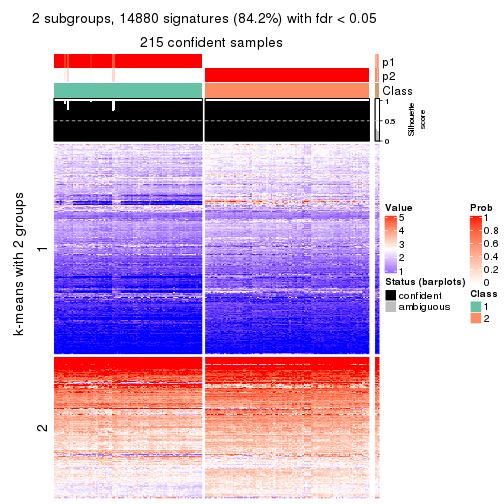</p>

</div>
<div id='tab-MAD-kmeans-get-signatures-no-scale-2'>
<pre><code class="r">get_signatures(res, k = 3, scale_rows = FALSE)
</code></pre>

<p></p>

</div>
<div id='tab-MAD-kmeans-get-signatures-no-scale-3'>
<pre><code class="r">get_signatures(res, k = 4, scale_rows = FALSE)
</code></pre>

<p></p>

</div>
<div id='tab-MAD-kmeans-get-signatures-no-scale-4'>
<pre><code class="r">get_signatures(res, k = 5, scale_rows = FALSE)
</code></pre>

<p>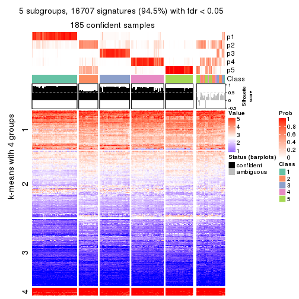</p>

</div>
<div id='tab-MAD-kmeans-get-signatures-no-scale-5'>
<pre><code class="r">get_signatures(res, k = 6, scale_rows = FALSE)
</code></pre>

<p></p>

</div>
</div>


Compare the overlap of signatures from different k:

```r
compare_signatures(res)
```

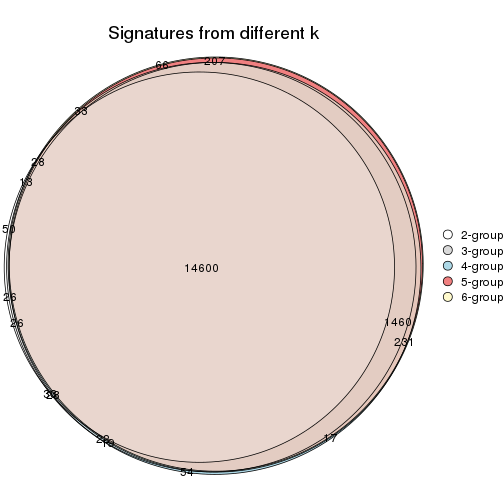

`get_signature()` returns a data frame invisibly. TO get the list of signatures, the function
call should be assigned to a variable explicitly. In following code, if `plot` argument is set
to `FALSE`, no heatmap is plotted while only the differential analysis is performed.

```r
# code only for demonstration
tb = get_signature(res, k = ..., plot = FALSE)
```

An example of the output of `tb` is:

```
#>   which_row         fdr    mean_1    mean_2 scaled_mean_1 scaled_mean_2 km
#> 1        38 0.042760348  8.373488  9.131774    -0.5533452     0.5164555  1
#> 2        40 0.018707592  7.106213  8.469186    -0.6173731     0.5762149  1
#> 3        55 0.019134737 10.221463 11.207825    -0.6159697     0.5749050  1
#> 4        59 0.006059896  5.921854  7.869574    -0.6899429     0.6439467  1
#> 5        60 0.018055526  8.928898 10.211722    -0.6204761     0.5791110  1
#> 6        98 0.009384629 15.714769 14.887706     0.6635654    -0.6193277  2
...
```

The columns in `tb` are:

1. `which_row`: row indices corresponding to the input matrix.
2. `fdr`: FDR for the differential test. 
3. `mean_x`: The mean value in group x.
4. `scaled_mean_x`: The mean value in group x after rows are scaled.
5. `km`: Row groups if k-means clustering is applied to rows.


UMAP plot which shows how samples are separated.


<script>
$( function() {
	$( '#tabs-MAD-kmeans-dimension-reduction' ).tabs();
} );
</script>
<div id='tabs-MAD-kmeans-dimension-reduction'>
<ul>
<li><a href='#tab-MAD-kmeans-dimension-reduction-1'>k = 2</a></li>
<li><a href='#tab-MAD-kmeans-dimension-reduction-2'>k = 3</a></li>
<li><a href='#tab-MAD-kmeans-dimension-reduction-3'>k = 4</a></li>
<li><a href='#tab-MAD-kmeans-dimension-reduction-4'>k = 5</a></li>
<li><a href='#tab-MAD-kmeans-dimension-reduction-5'>k = 6</a></li>
</ul>
<div id='tab-MAD-kmeans-dimension-reduction-1'>
<pre><code class="r">dimension_reduction(res, k = 2, method = &quot;UMAP&quot;)
</code></pre>

<p></p>

</div>
<div id='tab-MAD-kmeans-dimension-reduction-2'>
<pre><code class="r">dimension_reduction(res, k = 3, method = &quot;UMAP&quot;)
</code></pre>

<p></p>

</div>
<div id='tab-MAD-kmeans-dimension-reduction-3'>
<pre><code class="r">dimension_reduction(res, k = 4, method = &quot;UMAP&quot;)
</code></pre>

<p></p>

</div>
<div id='tab-MAD-kmeans-dimension-reduction-4'>
<pre><code class="r">dimension_reduction(res, k = 5, method = &quot;UMAP&quot;)
</code></pre>

<p></p>

</div>
<div id='tab-MAD-kmeans-dimension-reduction-5'>
<pre><code class="r">dimension_reduction(res, k = 6, method = &quot;UMAP&quot;)
</code></pre>

<p></p>

</div>
</div>


Following heatmap shows how subgroups are split when increasing `k`:

```r
collect_classes(res)
```


If matrix rows can be associated to genes, consider to use `GO_Enrichment(res,
...)` to perform function enrichment for the signature genes.


 

---------------------------------------------------


### MAD:skmeans*


The object with results only for a single top-value method and a single partition method 
can be extracted as:

```r
res = res_list["MAD", "skmeans"]
# you can also extract it by
# res = res_list["MAD:skmeans"]
```

A summary of `res` and all the functions that can be applied to it:

```r
res
```

```
#> A 'ConsensusPartition' object with k = 2, 3, 4, 5, 6.
#>   On a matrix with 17680 rows and 218 columns.
#>   Top rows (1000, 2000, 3000, 4000, 5000) are extracted by 'MAD' method.
#>   Subgroups are detected by 'skmeans' method.
#>   Performed in total 1250 partitions by row resampling.
#>   Best k for subgroups seems to be 5.
#> 
#> Following methods can be applied to this 'ConsensusPartition' object:
#>  [1] "cola_report"             "collect_classes"         "collect_plots"          
#>  [4] "collect_stats"           "colnames"                "compare_signatures"     
#>  [7] "consensus_heatmap"       "dimension_reduction"     "functional_enrichment"  
#> [10] "get_anno_col"            "get_anno"                "get_classes"            
#> [13] "get_consensus"           "get_matrix"              "get_membership"         
#> [16] "get_param"               "get_signatures"          "get_stats"              
#> [19] "is_best_k"               "is_stable_k"             "membership_heatmap"     
#> [22] "ncol"                    "nrow"                    "plot_ecdf"              
#> [25] "rownames"                "select_partition_number" "show"                   
#> [28] "suggest_best_k"          "test_to_known_factors"
```

`collect_plots()` function collects all the plots made from `res` for all `k` (number of partitions)
into one single page to provide an easy and fast comparison between different `k`.

```r
collect_plots(res)
```


The plots are:

- The first row: a plot of the ECDF (Empirical cumulative distribution
  function) curves of the consensus matrix for each `k` and the heatmap of
  predicted classes for each `k`.
- The second row: heatmaps of the consensus matrix for each `k`.
- The third row: heatmaps of the membership matrix for each `k`.
- The fouth row: heatmaps of the signatures for each `k`.

All the plots in panels can be made by individual functions and they are
plotted later in this section.

`select_partition_number()` produces several plots showing different
statistics for choosing "optimized" `k`. There are following statistics:

- ECDF curves of the consensus matrix for each `k`;
- 1-PAC. [The PAC
  score](https://en.wikipedia.org/wiki/Consensus_clustering#Over-interpretation_potential_of_consensus_clustering)
  measures the proportion of the ambiguous subgrouping.
- Mean silhouette score.
- Concordance. The mean probability of fiting the consensus class ids in all
  partitions.
- Area increased. Denote $A_k$ as the area under the ECDF curve for current
  `k`, the area increased is defined as $A_k - A_{k-1}$.
- Rand index. The percent of pairs of samples that are both in a same cluster
  or both are not in a same cluster in the partition of k and k-1.
- Jaccard index. The ratio of pairs of samples are both in a same cluster in
  the partition of k and k-1 and the pairs of samples are both in a same
  cluster in the partition k or k-1.

The detailed explanations of these statistics can be found in [the cola
vignette](http://bioconductor.org/packages/devel/bioc/vignettes/cola/inst/doc/cola.html#toc_13).

Generally speaking, lower PAC score, higher mean silhouette score or higher
concordance corresponds to better partition. Rand index and Jaccard index
measure how similar the current partition is compared to partition with `k-1`.
If they are too similar, we won't accept `k` is better than `k-1`.

```r
select_partition_number(res)
```


The numeric values for all these statistics can be obtained by `get_stats()`.

```r
get_stats(res)
```

```
#>   k 1-PAC mean_silhouette concordance area_increased  Rand Jaccard
#> 2 2 1.000           0.991       0.996         0.5019 0.498   0.498
#> 3 3 0.762           0.881       0.915         0.2359 0.868   0.739
#> 4 4 0.827           0.780       0.897         0.1758 0.855   0.636
#> 5 5 0.921           0.900       0.932         0.0662 0.887   0.626
#> 6 6 0.849           0.764       0.876         0.0354 0.970   0.870
```

`suggest_best_k()` suggests the best $k$ based on these statistics. The rules are as follows:

- All $k$ with Jaccard index larger than 0.95 are removed because the increase of
  the partition number does not provides enough extra information. If all $k$ are removed,
  the best $k$ is assigned by `NA`.
- For $k$ with 1-PAC larger than 0.9, the maximal $k$ is taken as the "best k". Other $k$ is called "optional k".
- If it does not fit the second rule. The $k$ with the highest vote of highest
  1-PAC, mean silhouette and concordance is taken as the "best k".

```r
suggest_best_k(res)
```

```
#> [1] 5
#> attr(,"optional")
#> [1] 2
```

There is also optional best $k$ = 2 that is worth to check.

Following shows the table of the partitions (You need to click the **show/hide
code output** link to see it). The membership matrix (columns with name `p*`)
is inferred by
[`clue::cl_consensus()`](https://www.rdocumentation.org/link/cl_consensus?package=clue)
function with the `SE` method. Basically the value in the membership matrix
represents the probability to belong to a certain group. The finall class
label for an item is determined with the group with highest probability it
belongs to.

In `get_classes()` function, the entropy is calculated from the membership
matrix and the silhouette score is calculated from the consensus matrix.


<script>
$( function() {
	$( '#tabs-MAD-skmeans-get-classes' ).tabs();
} );
</script>
<div id='tabs-MAD-skmeans-get-classes'>
<ul>
<li><a href='#tab-MAD-skmeans-get-classes-1'>k = 2</a></li>
<li><a href='#tab-MAD-skmeans-get-classes-2'>k = 3</a></li>
<li><a href='#tab-MAD-skmeans-get-classes-3'>k = 4</a></li>
<li><a href='#tab-MAD-skmeans-get-classes-4'>k = 5</a></li>
<li><a href='#tab-MAD-skmeans-get-classes-5'>k = 6</a></li>
</ul>

<div id='tab-MAD-skmeans-get-classes-1'>
<p><a id='tab-MAD-skmeans-get-classes-1-a' style='color:#0366d6' href='#'>show/hide code output</a></p>
<pre><code class="r">cbind(get_classes(res, k = 2), get_membership(res, k = 2))
</code></pre>

<pre><code>#&gt;            class entropy silhouette    p1    p2
#&gt; SRR1498997     2   0.000      0.999 0.000 1.000
#&gt; SRR1076441     1   0.000      0.993 1.000 0.000
#&gt; SRR1489803     2   0.000      0.999 0.000 1.000
#&gt; SRR1345953     2   0.000      0.999 0.000 1.000
#&gt; SRR1357826     2   0.000      0.999 0.000 1.000
#&gt; SRR1419656     1   0.000      0.993 1.000 0.000
#&gt; SRR1454158     2   0.000      0.999 0.000 1.000
#&gt; SRR1475408     2   0.000      0.999 0.000 1.000
#&gt; SRR1472704     2   0.000      0.999 0.000 1.000
#&gt; SRR1090046     1   0.000      0.993 1.000 0.000
#&gt; SRR1312822     1   0.000      0.993 1.000 0.000
#&gt; SRR1096987     2   0.000      0.999 0.000 1.000
#&gt; SRR1334587     2   0.000      0.999 0.000 1.000
#&gt; SRR1490246     1   0.000      0.993 1.000 0.000
#&gt; SRR1467522     1   0.000      0.993 1.000 0.000
#&gt; SRR1324206     1   0.000      0.993 1.000 0.000
#&gt; SRR1408574     2   0.000      0.999 0.000 1.000
#&gt; SRR1083959     2   0.000      0.999 0.000 1.000
#&gt; SRR1079948     2   0.000      0.999 0.000 1.000
#&gt; SRR1310667     2   0.000      0.999 0.000 1.000
#&gt; SRR655852      2   0.000      0.999 0.000 1.000
#&gt; SRR1352457     2   0.000      0.999 0.000 1.000
#&gt; SRR1353994     2   0.000      0.999 0.000 1.000
#&gt; SRR1459561     2   0.000      0.999 0.000 1.000
#&gt; SRR1454009     1   0.000      0.993 1.000 0.000
#&gt; SRR1071084     1   0.000      0.993 1.000 0.000
#&gt; SRR1082859     2   0.000      0.999 0.000 1.000
#&gt; SRR1086538     1   0.000      0.993 1.000 0.000
#&gt; SRR1486262     2   0.000      0.999 0.000 1.000
#&gt; SRR658105      1   0.000      0.993 1.000 0.000
#&gt; SRR811073      2   0.000      0.999 0.000 1.000
#&gt; SRR1429181     2   0.000      0.999 0.000 1.000
#&gt; SRR1327896     2   0.000      0.999 0.000 1.000
#&gt; SRR1464788     2   0.000      0.999 0.000 1.000
#&gt; SRR1346861     2   0.000      0.999 0.000 1.000
#&gt; SRR1318774     2   0.000      0.999 0.000 1.000
#&gt; SRR1420517     1   0.000      0.993 1.000 0.000
#&gt; SRR1369584     2   0.000      0.999 0.000 1.000
#&gt; SRR1443244     1   0.278      0.945 0.952 0.048
#&gt; SRR1455391     1   0.000      0.993 1.000 0.000
#&gt; SRR1068999     1   0.000      0.993 1.000 0.000
#&gt; SRR1481297     1   0.000      0.993 1.000 0.000
#&gt; SRR1070208     1   0.000      0.993 1.000 0.000
#&gt; SRR1317282     1   0.000      0.993 1.000 0.000
#&gt; SRR1096125     2   0.000      0.999 0.000 1.000
#&gt; SRR1472506     1   0.000      0.993 1.000 0.000
#&gt; SRR1388281     2   0.000      0.999 0.000 1.000
#&gt; SRR1365622     2   0.000      0.999 0.000 1.000
#&gt; SRR662306      1   0.000      0.993 1.000 0.000
#&gt; SRR662811      1   0.000      0.993 1.000 0.000
#&gt; SRR820571      1   0.000      0.993 1.000 0.000
#&gt; SRR1357166     1   0.000      0.993 1.000 0.000
#&gt; SRR1488586     1   0.000      0.993 1.000 0.000
#&gt; SRR1485398     1   0.000      0.993 1.000 0.000
#&gt; SRR1417725     2   0.000      0.999 0.000 1.000
#&gt; SRR1409397     2   0.000      0.999 0.000 1.000
#&gt; SRR1465693     2   0.000      0.999 0.000 1.000
#&gt; SRR1096547     1   0.000      0.993 1.000 0.000
#&gt; SRR1456818     1   0.000      0.993 1.000 0.000
#&gt; SRR816336      1   0.000      0.993 1.000 0.000
#&gt; SRR1420238     1   0.000      0.993 1.000 0.000
#&gt; SRR1433374     1   0.000      0.993 1.000 0.000
#&gt; SRR1436990     1   0.000      0.993 1.000 0.000
#&gt; SRR662378      1   0.000      0.993 1.000 0.000
#&gt; SRR1477671     1   0.000      0.993 1.000 0.000
#&gt; SRR1084079     1   0.981      0.281 0.580 0.420
#&gt; SRR1102949     1   0.000      0.993 1.000 0.000
#&gt; SRR1458090     1   0.000      0.993 1.000 0.000
#&gt; SRR1418729     2   0.000      0.999 0.000 1.000
#&gt; SRR1403814     2   0.000      0.999 0.000 1.000
#&gt; SRR1404887     1   0.000      0.993 1.000 0.000
#&gt; SRR1434955     1   0.000      0.993 1.000 0.000
#&gt; SRR1360652     1   0.000      0.993 1.000 0.000
#&gt; SRR1356765     2   0.000      0.999 0.000 1.000
#&gt; SRR1078258     2   0.000      0.999 0.000 1.000
#&gt; SRR1455861     1   0.000      0.993 1.000 0.000
#&gt; SRR1420296     2   0.000      0.999 0.000 1.000
#&gt; SRR1070260     2   0.000      0.999 0.000 1.000
#&gt; SRR1410765     1   0.000      0.993 1.000 0.000
#&gt; SRR1481315     1   0.000      0.993 1.000 0.000
#&gt; SRR1414661     2   0.000      0.999 0.000 1.000
#&gt; SRR1359147     2   0.000      0.999 0.000 1.000
#&gt; SRR1488694     1   0.000      0.993 1.000 0.000
#&gt; SRR1477273     1   0.000      0.993 1.000 0.000
#&gt; SRR1415792     1   0.000      0.993 1.000 0.000
#&gt; SRR1369088     2   0.000      0.999 0.000 1.000
#&gt; SRR1406621     2   0.000      0.999 0.000 1.000
#&gt; SRR1401017     2   0.000      0.999 0.000 1.000
#&gt; SRR1099981     2   0.000      0.999 0.000 1.000
#&gt; SRR815208      2   0.000      0.999 0.000 1.000
#&gt; SRR1380460     2   0.000      0.999 0.000 1.000
#&gt; SRR1091097     2   0.000      0.999 0.000 1.000
#&gt; SRR1456010     1   0.000      0.993 1.000 0.000
#&gt; SRR1498416     2   0.000      0.999 0.000 1.000
#&gt; SRR818873      2   0.000      0.999 0.000 1.000
#&gt; SRR813868      2   0.000      0.999 0.000 1.000
#&gt; SRR1394912     1   0.000      0.993 1.000 0.000
#&gt; SRR1475824     2   0.000      0.999 0.000 1.000
#&gt; SRR1459866     1   0.000      0.993 1.000 0.000
#&gt; SRR1364871     1   0.760      0.718 0.780 0.220
#&gt; SRR1100472     2   0.000      0.999 0.000 1.000
#&gt; SRR1331267     1   0.000      0.993 1.000 0.000
#&gt; SRR1068977     2   0.000      0.999 0.000 1.000
#&gt; SRR1391511     2   0.000      0.999 0.000 1.000
#&gt; SRR1077920     2   0.000      0.999 0.000 1.000
#&gt; SRR1457705     1   0.000      0.993 1.000 0.000
#&gt; SRR1437073     1   0.000      0.993 1.000 0.000
#&gt; SRR1473124     1   0.000      0.993 1.000 0.000
#&gt; SRR1469279     1   0.000      0.993 1.000 0.000
#&gt; SRR1091791     2   0.000      0.999 0.000 1.000
#&gt; SRR1341539     2   0.000      0.999 0.000 1.000
#&gt; SRR1446354     1   0.000      0.993 1.000 0.000
#&gt; SRR1415420     1   0.000      0.993 1.000 0.000
#&gt; SRR1368050     1   0.000      0.993 1.000 0.000
#&gt; SRR656970      2   0.000      0.999 0.000 1.000
#&gt; SRR1473403     2   0.000      0.999 0.000 1.000
#&gt; SRR1084674     1   0.000      0.993 1.000 0.000
#&gt; SRR1464702     1   0.000      0.993 1.000 0.000
#&gt; SRR1074860     2   0.482      0.883 0.104 0.896
#&gt; SRR655447      2   0.000      0.999 0.000 1.000
#&gt; SRR1404442     2   0.000      0.999 0.000 1.000
#&gt; SRR1418795     1   0.000      0.993 1.000 0.000
#&gt; SRR1458335     2   0.000      0.999 0.000 1.000
#&gt; SRR1489589     2   0.000      0.999 0.000 1.000
#&gt; SRR1378284     1   0.000      0.993 1.000 0.000
#&gt; SRR1408014     2   0.000      0.999 0.000 1.000
#&gt; SRR1083052     1   0.000      0.993 1.000 0.000
#&gt; SRR1339236     2   0.000      0.999 0.000 1.000
#&gt; SRR1323829     2   0.000      0.999 0.000 1.000
#&gt; SRR1086772     2   0.000      0.999 0.000 1.000
#&gt; SRR1486457     1   0.000      0.993 1.000 0.000
#&gt; SRR1415257     2   0.000      0.999 0.000 1.000
#&gt; SRR1071905     1   0.000      0.993 1.000 0.000
#&gt; SRR659223      2   0.000      0.999 0.000 1.000
#&gt; SRR1386945     1   0.000      0.993 1.000 0.000
#&gt; SRR821498      2   0.000      0.999 0.000 1.000
#&gt; SRR1378903     2   0.000      0.999 0.000 1.000
#&gt; SRR1472907     1   0.000      0.993 1.000 0.000
#&gt; SRR1442313     2   0.000      0.999 0.000 1.000
#&gt; SRR1077139     2   0.000      0.999 0.000 1.000
#&gt; SRR1342758     1   0.000      0.993 1.000 0.000
#&gt; SRR656911      2   0.000      0.999 0.000 1.000
#&gt; SRR1070738     1   0.000      0.993 1.000 0.000
#&gt; SRR1476950     1   0.000      0.993 1.000 0.000
#&gt; SRR1488196     1   0.000      0.993 1.000 0.000
#&gt; SRR1498951     1   0.000      0.993 1.000 0.000
#&gt; SRR1413392     1   0.000      0.993 1.000 0.000
#&gt; SRR657528      2   0.000      0.999 0.000 1.000
#&gt; SRR812198      1   0.000      0.993 1.000 0.000
#&gt; SRR660283      2   0.000      0.999 0.000 1.000
#&gt; SRR1420936     1   0.000      0.993 1.000 0.000
#&gt; SRR1469547     2   0.000      0.999 0.000 1.000
#&gt; SRR1322249     1   0.000      0.993 1.000 0.000
#&gt; SRR1396682     1   0.000      0.993 1.000 0.000
#&gt; SRR1095816     2   0.000      0.999 0.000 1.000
#&gt; SRR1081023     1   0.000      0.993 1.000 0.000
#&gt; SRR1092517     2   0.000      0.999 0.000 1.000
#&gt; SRR811285      2   0.000      0.999 0.000 1.000
#&gt; SRR657018      1   0.000      0.993 1.000 0.000
#&gt; SRR1365534     1   0.000      0.993 1.000 0.000
#&gt; SRR1090791     2   0.000      0.999 0.000 1.000
#&gt; SRR1439915     2   0.000      0.999 0.000 1.000
#&gt; SRR1391575     2   0.000      0.999 0.000 1.000
#&gt; SRR1314092     2   0.000      0.999 0.000 1.000
#&gt; SRR1328941     1   0.000      0.993 1.000 0.000
#&gt; SRR1336181     2   0.000      0.999 0.000 1.000
#&gt; SRR1362972     1   0.000      0.993 1.000 0.000
#&gt; SRR1366790     2   0.000      0.999 0.000 1.000
#&gt; SRR1455902     1   0.000      0.993 1.000 0.000
#&gt; SRR1437644     1   0.000      0.993 1.000 0.000
#&gt; SRR1105009     2   0.000      0.999 0.000 1.000
#&gt; SRR1367024     1   0.000      0.993 1.000 0.000
#&gt; SRR660248      2   0.000      0.999 0.000 1.000
#&gt; SRR1409620     1   0.000      0.993 1.000 0.000
#&gt; SRR1455807     2   0.000      0.999 0.000 1.000
#&gt; SRR1339431     1   0.000      0.993 1.000 0.000
#&gt; SRR1378948     1   0.000      0.993 1.000 0.000
#&gt; SRR1469237     1   0.000      0.993 1.000 0.000
#&gt; SRR1098264     2   0.000      0.999 0.000 1.000
#&gt; SRR1406224     2   0.000      0.999 0.000 1.000
#&gt; SRR1393026     1   0.000      0.993 1.000 0.000
#&gt; SRR808428      2   0.000      0.999 0.000 1.000
#&gt; SRR615910      2   0.000      0.999 0.000 1.000
#&gt; SRR1076219     1   0.000      0.993 1.000 0.000
#&gt; SRR1481128     1   0.000      0.993 1.000 0.000
#&gt; SRR1359262     2   0.000      0.999 0.000 1.000
#&gt; SRR1407648     2   0.000      0.999 0.000 1.000
#&gt; SRR1386775     1   0.000      0.993 1.000 0.000
#&gt; SRR1388399     1   0.000      0.993 1.000 0.000
#&gt; SRR1361499     2   0.000      0.999 0.000 1.000
#&gt; SRR1500709     2   0.000      0.999 0.000 1.000
#&gt; SRR1335917     1   0.000      0.993 1.000 0.000
#&gt; SRR1430615     2   0.000      0.999 0.000 1.000
#&gt; SRR1335212     1   0.000      0.993 1.000 0.000
#&gt; SRR1400159     2   0.000      0.999 0.000 1.000
#&gt; SRR1457245     2   0.000      0.999 0.000 1.000
#&gt; SRR1356746     2   0.000      0.999 0.000 1.000
#&gt; SRR658319      2   0.000      0.999 0.000 1.000
#&gt; SRR1435946     1   0.000      0.993 1.000 0.000
#&gt; SRR1370308     1   0.000      0.993 1.000 0.000
#&gt; SRR1100893     1   0.000      0.993 1.000 0.000
#&gt; SRR1389432     1   0.000      0.993 1.000 0.000
#&gt; SRR1381799     2   0.000      0.999 0.000 1.000
#&gt; SRR1310158     1   0.000      0.993 1.000 0.000
#&gt; SRR1341100     2   0.000      0.999 0.000 1.000
#&gt; SRR1342873     1   0.000      0.993 1.000 0.000
#&gt; SRR1472102     2   0.000      0.999 0.000 1.000
#&gt; SRR1409421     1   0.000      0.993 1.000 0.000
#&gt; SRR1328577     2   0.000      0.999 0.000 1.000
#&gt; SRR808942      2   0.000      0.999 0.000 1.000
#&gt; SRR1343818     2   0.000      0.999 0.000 1.000
#&gt; SRR1472415     2   0.000      0.999 0.000 1.000
#&gt; SRR658409      2   0.000      0.999 0.000 1.000
#&gt; SRR1469681     1   0.000      0.993 1.000 0.000
#&gt; SRR1075484     2   0.000      0.999 0.000 1.000
#&gt; SRR1417894     1   0.000      0.993 1.000 0.000
#&gt; SRR1417422     2   0.000      0.999 0.000 1.000
#&gt; SRR1090674     1   0.000      0.993 1.000 0.000
</code></pre>

<script>
$('#tab-MAD-skmeans-get-classes-1-a').parent().next().next().hide();
$('#tab-MAD-skmeans-get-classes-1-a').click(function(){
  $('#tab-MAD-skmeans-get-classes-1-a').parent().next().next().toggle();
  return(false);
});
</script>
</div>

<div id='tab-MAD-skmeans-get-classes-2'>
<p><a id='tab-MAD-skmeans-get-classes-2-a' style='color:#0366d6' href='#'>show/hide code output</a></p>
<pre><code class="r">cbind(get_classes(res, k = 3), get_membership(res, k = 3))
</code></pre>

<pre><code>#&gt;            class entropy silhouette    p1    p2    p3
#&gt; SRR1498997     2  0.0000    0.93905 0.000 1.000 0.000
#&gt; SRR1076441     1  0.0000    0.93321 1.000 0.000 0.000
#&gt; SRR1489803     2  0.0000    0.93905 0.000 1.000 0.000
#&gt; SRR1345953     2  0.4555    0.86312 0.000 0.800 0.200
#&gt; SRR1357826     2  0.0000    0.93905 0.000 1.000 0.000
#&gt; SRR1419656     3  0.6126    0.59681 0.400 0.000 0.600
#&gt; SRR1454158     2  0.0000    0.93905 0.000 1.000 0.000
#&gt; SRR1475408     3  0.6079    0.42426 0.000 0.388 0.612
#&gt; SRR1472704     2  0.0000    0.93905 0.000 1.000 0.000
#&gt; SRR1090046     1  0.5560    0.41877 0.700 0.000 0.300
#&gt; SRR1312822     1  0.0000    0.93321 1.000 0.000 0.000
#&gt; SRR1096987     2  0.4555    0.86312 0.000 0.800 0.200
#&gt; SRR1334587     2  0.0000    0.93905 0.000 1.000 0.000
#&gt; SRR1490246     1  0.0000    0.93321 1.000 0.000 0.000
#&gt; SRR1467522     1  0.0000    0.93321 1.000 0.000 0.000
#&gt; SRR1324206     1  0.0000    0.93321 1.000 0.000 0.000
#&gt; SRR1408574     2  0.0000    0.93905 0.000 1.000 0.000
#&gt; SRR1083959     2  0.0000    0.93905 0.000 1.000 0.000
#&gt; SRR1079948     2  0.4555    0.86312 0.000 0.800 0.200
#&gt; SRR1310667     2  0.0000    0.93905 0.000 1.000 0.000
#&gt; SRR655852      2  0.4555    0.86312 0.000 0.800 0.200
#&gt; SRR1352457     2  0.0000    0.93905 0.000 1.000 0.000
#&gt; SRR1353994     2  0.3879    0.88468 0.000 0.848 0.152
#&gt; SRR1459561     2  0.0000    0.93905 0.000 1.000 0.000
#&gt; SRR1454009     3  0.4842    0.89760 0.224 0.000 0.776
#&gt; SRR1071084     3  0.4555    0.92077 0.200 0.000 0.800
#&gt; SRR1082859     2  0.0000    0.93905 0.000 1.000 0.000
#&gt; SRR1086538     1  0.0000    0.93321 1.000 0.000 0.000
#&gt; SRR1486262     2  0.4555    0.86312 0.000 0.800 0.200
#&gt; SRR658105      1  0.0000    0.93321 1.000 0.000 0.000
#&gt; SRR811073      2  0.0000    0.93905 0.000 1.000 0.000
#&gt; SRR1429181     2  0.0000    0.93905 0.000 1.000 0.000
#&gt; SRR1327896     2  0.4555    0.86312 0.000 0.800 0.200
#&gt; SRR1464788     2  0.0000    0.93905 0.000 1.000 0.000
#&gt; SRR1346861     2  0.0000    0.93905 0.000 1.000 0.000
#&gt; SRR1318774     2  0.3686    0.88947 0.000 0.860 0.140
#&gt; SRR1420517     3  0.4555    0.92077 0.200 0.000 0.800
#&gt; SRR1369584     2  0.0000    0.93905 0.000 1.000 0.000
#&gt; SRR1443244     1  0.4555    0.68108 0.800 0.000 0.200
#&gt; SRR1455391     1  0.0000    0.93321 1.000 0.000 0.000
#&gt; SRR1068999     1  0.0000    0.93321 1.000 0.000 0.000
#&gt; SRR1481297     3  0.5706    0.75909 0.320 0.000 0.680
#&gt; SRR1070208     1  0.0000    0.93321 1.000 0.000 0.000
#&gt; SRR1317282     3  0.4555    0.92077 0.200 0.000 0.800
#&gt; SRR1096125     2  0.4555    0.86312 0.000 0.800 0.200
#&gt; SRR1472506     3  0.4555    0.92077 0.200 0.000 0.800
#&gt; SRR1388281     2  0.0000    0.93905 0.000 1.000 0.000
#&gt; SRR1365622     2  0.4555    0.86312 0.000 0.800 0.200
#&gt; SRR662306      3  0.4654    0.91404 0.208 0.000 0.792
#&gt; SRR662811      1  0.0000    0.93321 1.000 0.000 0.000
#&gt; SRR820571      3  0.4842    0.89760 0.224 0.000 0.776
#&gt; SRR1357166     1  0.6168    0.03443 0.588 0.000 0.412
#&gt; SRR1488586     1  0.0000    0.93321 1.000 0.000 0.000
#&gt; SRR1485398     1  0.0000    0.93321 1.000 0.000 0.000
#&gt; SRR1417725     3  0.4605    0.70987 0.000 0.204 0.796
#&gt; SRR1409397     2  0.0000    0.93905 0.000 1.000 0.000
#&gt; SRR1465693     2  0.0000    0.93905 0.000 1.000 0.000
#&gt; SRR1096547     3  0.4555    0.92077 0.200 0.000 0.800
#&gt; SRR1456818     1  0.0000    0.93321 1.000 0.000 0.000
#&gt; SRR816336      3  0.4555    0.92077 0.200 0.000 0.800
#&gt; SRR1420238     1  0.0000    0.93321 1.000 0.000 0.000
#&gt; SRR1433374     3  0.4555    0.92077 0.200 0.000 0.800
#&gt; SRR1436990     1  0.0000    0.93321 1.000 0.000 0.000
#&gt; SRR662378      1  0.0000    0.93321 1.000 0.000 0.000
#&gt; SRR1477671     1  0.0000    0.93321 1.000 0.000 0.000
#&gt; SRR1084079     1  0.7153    0.55489 0.708 0.092 0.200
#&gt; SRR1102949     1  0.0000    0.93321 1.000 0.000 0.000
#&gt; SRR1458090     1  0.0000    0.93321 1.000 0.000 0.000
#&gt; SRR1418729     2  0.0000    0.93905 0.000 1.000 0.000
#&gt; SRR1403814     2  0.4555    0.86312 0.000 0.800 0.200
#&gt; SRR1404887     1  0.4555    0.68108 0.800 0.000 0.200
#&gt; SRR1434955     1  0.0000    0.93321 1.000 0.000 0.000
#&gt; SRR1360652     1  0.0000    0.93321 1.000 0.000 0.000
#&gt; SRR1356765     2  0.0000    0.93905 0.000 1.000 0.000
#&gt; SRR1078258     2  0.4555    0.86312 0.000 0.800 0.200
#&gt; SRR1455861     1  0.0000    0.93321 1.000 0.000 0.000
#&gt; SRR1420296     2  0.0000    0.93905 0.000 1.000 0.000
#&gt; SRR1070260     2  0.0000    0.93905 0.000 1.000 0.000
#&gt; SRR1410765     1  0.0000    0.93321 1.000 0.000 0.000
#&gt; SRR1481315     1  0.0000    0.93321 1.000 0.000 0.000
#&gt; SRR1414661     2  0.3816    0.88651 0.000 0.852 0.148
#&gt; SRR1359147     2  0.4555    0.86312 0.000 0.800 0.200
#&gt; SRR1488694     1  0.0000    0.93321 1.000 0.000 0.000
#&gt; SRR1477273     3  0.4555    0.92077 0.200 0.000 0.800
#&gt; SRR1415792     1  0.0000    0.93321 1.000 0.000 0.000
#&gt; SRR1369088     2  0.1860    0.92084 0.000 0.948 0.052
#&gt; SRR1406621     2  0.0592    0.93527 0.000 0.988 0.012
#&gt; SRR1401017     2  0.0000    0.93905 0.000 1.000 0.000
#&gt; SRR1099981     2  0.0000    0.93905 0.000 1.000 0.000
#&gt; SRR815208      2  0.0000    0.93905 0.000 1.000 0.000
#&gt; SRR1380460     2  0.4555    0.86312 0.000 0.800 0.200
#&gt; SRR1091097     2  0.4555    0.86312 0.000 0.800 0.200
#&gt; SRR1456010     3  0.4555    0.92077 0.200 0.000 0.800
#&gt; SRR1498416     2  0.3752    0.88800 0.000 0.856 0.144
#&gt; SRR818873      2  0.0000    0.93905 0.000 1.000 0.000
#&gt; SRR813868      2  0.0000    0.93905 0.000 1.000 0.000
#&gt; SRR1394912     1  0.0000    0.93321 1.000 0.000 0.000
#&gt; SRR1475824     2  0.4555    0.86312 0.000 0.800 0.200
#&gt; SRR1459866     1  0.0000    0.93321 1.000 0.000 0.000
#&gt; SRR1364871     3  0.4733    0.71704 0.004 0.196 0.800
#&gt; SRR1100472     2  0.0000    0.93905 0.000 1.000 0.000
#&gt; SRR1331267     1  0.0000    0.93321 1.000 0.000 0.000
#&gt; SRR1068977     2  0.4555    0.86312 0.000 0.800 0.200
#&gt; SRR1391511     2  0.0000    0.93905 0.000 1.000 0.000
#&gt; SRR1077920     2  0.0000    0.93905 0.000 1.000 0.000
#&gt; SRR1457705     3  0.4555    0.92077 0.200 0.000 0.800
#&gt; SRR1437073     1  0.0000    0.93321 1.000 0.000 0.000
#&gt; SRR1473124     3  0.4555    0.92077 0.200 0.000 0.800
#&gt; SRR1469279     3  0.4555    0.92077 0.200 0.000 0.800
#&gt; SRR1091791     2  0.4555    0.86312 0.000 0.800 0.200
#&gt; SRR1341539     2  0.0000    0.93905 0.000 1.000 0.000
#&gt; SRR1446354     3  0.4555    0.92077 0.200 0.000 0.800
#&gt; SRR1415420     1  0.0000    0.93321 1.000 0.000 0.000
#&gt; SRR1368050     1  0.0000    0.93321 1.000 0.000 0.000
#&gt; SRR656970      2  0.0000    0.93905 0.000 1.000 0.000
#&gt; SRR1473403     2  0.3752    0.88877 0.000 0.856 0.144
#&gt; SRR1084674     3  0.4702    0.91029 0.212 0.000 0.788
#&gt; SRR1464702     1  0.0000    0.93321 1.000 0.000 0.000
#&gt; SRR1074860     1  0.9470    0.13879 0.476 0.324 0.200
#&gt; SRR655447      2  0.4555    0.86312 0.000 0.800 0.200
#&gt; SRR1404442     2  0.0000    0.93905 0.000 1.000 0.000
#&gt; SRR1418795     1  0.0000    0.93321 1.000 0.000 0.000
#&gt; SRR1458335     2  0.0000    0.93905 0.000 1.000 0.000
#&gt; SRR1489589     2  0.0000    0.93905 0.000 1.000 0.000
#&gt; SRR1378284     1  0.0000    0.93321 1.000 0.000 0.000
#&gt; SRR1408014     2  0.0000    0.93905 0.000 1.000 0.000
#&gt; SRR1083052     1  0.0000    0.93321 1.000 0.000 0.000
#&gt; SRR1339236     3  0.5760    0.55092 0.000 0.328 0.672
#&gt; SRR1323829     2  0.0000    0.93905 0.000 1.000 0.000
#&gt; SRR1086772     2  0.0000    0.93905 0.000 1.000 0.000
#&gt; SRR1486457     3  0.4555    0.92077 0.200 0.000 0.800
#&gt; SRR1415257     2  0.0000    0.93905 0.000 1.000 0.000
#&gt; SRR1071905     1  0.6154    0.05209 0.592 0.000 0.408
#&gt; SRR659223      2  0.0000    0.93905 0.000 1.000 0.000
#&gt; SRR1386945     3  0.4555    0.92077 0.200 0.000 0.800
#&gt; SRR821498      2  0.4555    0.86312 0.000 0.800 0.200
#&gt; SRR1378903     2  0.4555    0.86312 0.000 0.800 0.200
#&gt; SRR1472907     3  0.4796    0.90206 0.220 0.000 0.780
#&gt; SRR1442313     2  0.0000    0.93905 0.000 1.000 0.000
#&gt; SRR1077139     2  0.0000    0.93905 0.000 1.000 0.000
#&gt; SRR1342758     1  0.0000    0.93321 1.000 0.000 0.000
#&gt; SRR656911      2  0.4504    0.86498 0.000 0.804 0.196
#&gt; SRR1070738     1  0.0000    0.93321 1.000 0.000 0.000
#&gt; SRR1476950     1  0.0000    0.93321 1.000 0.000 0.000
#&gt; SRR1488196     3  0.4555    0.92077 0.200 0.000 0.800
#&gt; SRR1498951     3  0.4555    0.92077 0.200 0.000 0.800
#&gt; SRR1413392     1  0.0000    0.93321 1.000 0.000 0.000
#&gt; SRR657528      2  0.0000    0.93905 0.000 1.000 0.000
#&gt; SRR812198      1  0.0000    0.93321 1.000 0.000 0.000
#&gt; SRR660283      2  0.0000    0.93905 0.000 1.000 0.000
#&gt; SRR1420936     1  0.0000    0.93321 1.000 0.000 0.000
#&gt; SRR1469547     2  0.0000    0.93905 0.000 1.000 0.000
#&gt; SRR1322249     1  0.0000    0.93321 1.000 0.000 0.000
#&gt; SRR1396682     1  0.0000    0.93321 1.000 0.000 0.000
#&gt; SRR1095816     2  0.4555    0.86312 0.000 0.800 0.200
#&gt; SRR1081023     1  0.0000    0.93321 1.000 0.000 0.000
#&gt; SRR1092517     2  0.4555    0.86312 0.000 0.800 0.200
#&gt; SRR811285      2  0.0000    0.93905 0.000 1.000 0.000
#&gt; SRR657018      1  0.0000    0.93321 1.000 0.000 0.000
#&gt; SRR1365534     3  0.4555    0.92077 0.200 0.000 0.800
#&gt; SRR1090791     2  0.0000    0.93905 0.000 1.000 0.000
#&gt; SRR1439915     2  0.0000    0.93905 0.000 1.000 0.000
#&gt; SRR1391575     2  0.4555    0.86312 0.000 0.800 0.200
#&gt; SRR1314092     2  0.0000    0.93905 0.000 1.000 0.000
#&gt; SRR1328941     3  0.4555    0.92077 0.200 0.000 0.800
#&gt; SRR1336181     2  0.0000    0.93905 0.000 1.000 0.000
#&gt; SRR1362972     1  0.0000    0.93321 1.000 0.000 0.000
#&gt; SRR1366790     2  0.0000    0.93905 0.000 1.000 0.000
#&gt; SRR1455902     3  0.4555    0.92077 0.200 0.000 0.800
#&gt; SRR1437644     3  0.2625    0.80279 0.084 0.000 0.916
#&gt; SRR1105009     2  0.0000    0.93905 0.000 1.000 0.000
#&gt; SRR1367024     3  0.4555    0.92077 0.200 0.000 0.800
#&gt; SRR660248      2  0.0000    0.93905 0.000 1.000 0.000
#&gt; SRR1409620     1  0.0000    0.93321 1.000 0.000 0.000
#&gt; SRR1455807     2  0.0000    0.93905 0.000 1.000 0.000
#&gt; SRR1339431     1  0.0000    0.93321 1.000 0.000 0.000
#&gt; SRR1378948     3  0.4555    0.92077 0.200 0.000 0.800
#&gt; SRR1469237     1  0.0000    0.93321 1.000 0.000 0.000
#&gt; SRR1098264     2  0.3752    0.88800 0.000 0.856 0.144
#&gt; SRR1406224     2  0.0000    0.93905 0.000 1.000 0.000
#&gt; SRR1393026     1  0.6111    0.10218 0.604 0.000 0.396
#&gt; SRR808428      2  0.0000    0.93905 0.000 1.000 0.000
#&gt; SRR615910      2  0.0000    0.93905 0.000 1.000 0.000
#&gt; SRR1076219     1  0.0000    0.93321 1.000 0.000 0.000
#&gt; SRR1481128     1  0.0000    0.93321 1.000 0.000 0.000
#&gt; SRR1359262     2  0.0000    0.93905 0.000 1.000 0.000
#&gt; SRR1407648     2  0.4555    0.86312 0.000 0.800 0.200
#&gt; SRR1386775     1  0.0000    0.93321 1.000 0.000 0.000
#&gt; SRR1388399     1  0.0000    0.93321 1.000 0.000 0.000
#&gt; SRR1361499     2  0.3752    0.88800 0.000 0.856 0.144
#&gt; SRR1500709     2  0.4555    0.86312 0.000 0.800 0.200
#&gt; SRR1335917     1  0.0000    0.93321 1.000 0.000 0.000
#&gt; SRR1430615     2  0.0000    0.93905 0.000 1.000 0.000
#&gt; SRR1335212     1  0.0000    0.93321 1.000 0.000 0.000
#&gt; SRR1400159     3  0.4555    0.71303 0.000 0.200 0.800
#&gt; SRR1457245     2  0.0000    0.93905 0.000 1.000 0.000
#&gt; SRR1356746     2  0.0000    0.93905 0.000 1.000 0.000
#&gt; SRR658319      2  0.0000    0.93905 0.000 1.000 0.000
#&gt; SRR1435946     1  0.0000    0.93321 1.000 0.000 0.000
#&gt; SRR1370308     1  0.0000    0.93321 1.000 0.000 0.000
#&gt; SRR1100893     1  0.0000    0.93321 1.000 0.000 0.000
#&gt; SRR1389432     1  0.6168    0.03443 0.588 0.000 0.412
#&gt; SRR1381799     2  0.0000    0.93905 0.000 1.000 0.000
#&gt; SRR1310158     3  0.4555    0.92077 0.200 0.000 0.800
#&gt; SRR1341100     2  0.4555    0.86312 0.000 0.800 0.200
#&gt; SRR1342873     1  0.2356    0.85123 0.928 0.000 0.072
#&gt; SRR1472102     2  0.0000    0.93905 0.000 1.000 0.000
#&gt; SRR1409421     1  0.6180   -0.00897 0.584 0.000 0.416
#&gt; SRR1328577     2  0.4555    0.86312 0.000 0.800 0.200
#&gt; SRR808942      2  0.0000    0.93905 0.000 1.000 0.000
#&gt; SRR1343818     2  0.4555    0.86312 0.000 0.800 0.200
#&gt; SRR1472415     2  0.0000    0.93905 0.000 1.000 0.000
#&gt; SRR658409      2  0.4555    0.86312 0.000 0.800 0.200
#&gt; SRR1469681     1  0.0000    0.93321 1.000 0.000 0.000
#&gt; SRR1075484     2  0.0000    0.93905 0.000 1.000 0.000
#&gt; SRR1417894     3  0.4555    0.92077 0.200 0.000 0.800
#&gt; SRR1417422     2  0.0000    0.93905 0.000 1.000 0.000
#&gt; SRR1090674     1  0.0000    0.93321 1.000 0.000 0.000
</code></pre>

<script>
$('#tab-MAD-skmeans-get-classes-2-a').parent().next().next().hide();
$('#tab-MAD-skmeans-get-classes-2-a').click(function(){
  $('#tab-MAD-skmeans-get-classes-2-a').parent().next().next().toggle();
  return(false);
});
</script>
</div>

<div id='tab-MAD-skmeans-get-classes-3'>
<p><a id='tab-MAD-skmeans-get-classes-3-a' style='color:#0366d6' href='#'>show/hide code output</a></p>
<pre><code class="r">cbind(get_classes(res, k = 4), get_membership(res, k = 4))
</code></pre>

<pre><code>#&gt;            class entropy silhouette    p1    p2    p3    p4
#&gt; SRR1498997     2  0.4817    0.63116 0.000 0.612 0.000 0.388
#&gt; SRR1076441     1  0.0000    0.97109 1.000 0.000 0.000 0.000
#&gt; SRR1489803     2  0.0000    0.73544 0.000 1.000 0.000 0.000
#&gt; SRR1345953     4  0.0000    0.83854 0.000 0.000 0.000 1.000
#&gt; SRR1357826     2  0.4817    0.63116 0.000 0.612 0.000 0.388
#&gt; SRR1419656     3  0.2868    0.81441 0.136 0.000 0.864 0.000
#&gt; SRR1454158     2  0.4817    0.63116 0.000 0.612 0.000 0.388
#&gt; SRR1475408     2  0.5000    0.02858 0.000 0.504 0.496 0.000
#&gt; SRR1472704     2  0.4817    0.63116 0.000 0.612 0.000 0.388
#&gt; SRR1090046     1  0.4250    0.59180 0.724 0.000 0.276 0.000
#&gt; SRR1312822     1  0.0000    0.97109 1.000 0.000 0.000 0.000
#&gt; SRR1096987     4  0.0000    0.83854 0.000 0.000 0.000 1.000
#&gt; SRR1334587     2  0.0000    0.73544 0.000 1.000 0.000 0.000
#&gt; SRR1490246     1  0.0000    0.97109 1.000 0.000 0.000 0.000
#&gt; SRR1467522     1  0.0000    0.97109 1.000 0.000 0.000 0.000
#&gt; SRR1324206     1  0.0000    0.97109 1.000 0.000 0.000 0.000
#&gt; SRR1408574     2  0.0000    0.73544 0.000 1.000 0.000 0.000
#&gt; SRR1083959     2  0.4817    0.63116 0.000 0.612 0.000 0.388
#&gt; SRR1079948     4  0.0000    0.83854 0.000 0.000 0.000 1.000
#&gt; SRR1310667     2  0.0000    0.73544 0.000 1.000 0.000 0.000
#&gt; SRR655852      4  0.0000    0.83854 0.000 0.000 0.000 1.000
#&gt; SRR1352457     2  0.0000    0.73544 0.000 1.000 0.000 0.000
#&gt; SRR1353994     4  0.0921    0.81700 0.000 0.028 0.000 0.972
#&gt; SRR1459561     2  0.0000    0.73544 0.000 1.000 0.000 0.000
#&gt; SRR1454009     3  0.1118    0.91227 0.036 0.000 0.964 0.000
#&gt; SRR1071084     3  0.0000    0.93752 0.000 0.000 1.000 0.000
#&gt; SRR1082859     2  0.4817    0.63116 0.000 0.612 0.000 0.388
#&gt; SRR1086538     1  0.0000    0.97109 1.000 0.000 0.000 0.000
#&gt; SRR1486262     4  0.0000    0.83854 0.000 0.000 0.000 1.000
#&gt; SRR658105      1  0.0000    0.97109 1.000 0.000 0.000 0.000
#&gt; SRR811073      2  0.4817    0.63116 0.000 0.612 0.000 0.388
#&gt; SRR1429181     2  0.0000    0.73544 0.000 1.000 0.000 0.000
#&gt; SRR1327896     4  0.0000    0.83854 0.000 0.000 0.000 1.000
#&gt; SRR1464788     2  0.0336    0.72969 0.000 0.992 0.000 0.008
#&gt; SRR1346861     2  0.4817    0.63116 0.000 0.612 0.000 0.388
#&gt; SRR1318774     4  0.4643    0.15630 0.000 0.344 0.000 0.656
#&gt; SRR1420517     3  0.0000    0.93752 0.000 0.000 1.000 0.000
#&gt; SRR1369584     2  0.0000    0.73544 0.000 1.000 0.000 0.000
#&gt; SRR1443244     4  0.4955    0.13187 0.444 0.000 0.000 0.556
#&gt; SRR1455391     1  0.0000    0.97109 1.000 0.000 0.000 0.000
#&gt; SRR1068999     1  0.0000    0.97109 1.000 0.000 0.000 0.000
#&gt; SRR1481297     3  0.2011    0.87396 0.080 0.000 0.920 0.000
#&gt; SRR1070208     1  0.0000    0.97109 1.000 0.000 0.000 0.000
#&gt; SRR1317282     3  0.0000    0.93752 0.000 0.000 1.000 0.000
#&gt; SRR1096125     4  0.0000    0.83854 0.000 0.000 0.000 1.000
#&gt; SRR1472506     3  0.0000    0.93752 0.000 0.000 1.000 0.000
#&gt; SRR1388281     2  0.4817    0.63116 0.000 0.612 0.000 0.388
#&gt; SRR1365622     4  0.4817    0.36273 0.000 0.388 0.000 0.612
#&gt; SRR662306      3  0.0000    0.93752 0.000 0.000 1.000 0.000
#&gt; SRR662811      1  0.0000    0.97109 1.000 0.000 0.000 0.000
#&gt; SRR820571      3  0.0921    0.91813 0.028 0.000 0.972 0.000
#&gt; SRR1357166     1  0.4985    0.08654 0.532 0.000 0.468 0.000
#&gt; SRR1488586     1  0.0000    0.97109 1.000 0.000 0.000 0.000
#&gt; SRR1485398     1  0.0000    0.97109 1.000 0.000 0.000 0.000
#&gt; SRR1417725     3  0.3649    0.70458 0.000 0.204 0.796 0.000
#&gt; SRR1409397     2  0.0000    0.73544 0.000 1.000 0.000 0.000
#&gt; SRR1465693     2  0.0000    0.73544 0.000 1.000 0.000 0.000
#&gt; SRR1096547     3  0.0000    0.93752 0.000 0.000 1.000 0.000
#&gt; SRR1456818     1  0.0000    0.97109 1.000 0.000 0.000 0.000
#&gt; SRR816336      3  0.0000    0.93752 0.000 0.000 1.000 0.000
#&gt; SRR1420238     1  0.0000    0.97109 1.000 0.000 0.000 0.000
#&gt; SRR1433374     3  0.0000    0.93752 0.000 0.000 1.000 0.000
#&gt; SRR1436990     1  0.0000    0.97109 1.000 0.000 0.000 0.000
#&gt; SRR662378      1  0.0000    0.97109 1.000 0.000 0.000 0.000
#&gt; SRR1477671     1  0.0000    0.97109 1.000 0.000 0.000 0.000
#&gt; SRR1084079     4  0.4522    0.43999 0.320 0.000 0.000 0.680
#&gt; SRR1102949     1  0.0000    0.97109 1.000 0.000 0.000 0.000
#&gt; SRR1458090     1  0.0000    0.97109 1.000 0.000 0.000 0.000
#&gt; SRR1418729     2  0.4817    0.63116 0.000 0.612 0.000 0.388
#&gt; SRR1403814     4  0.0000    0.83854 0.000 0.000 0.000 1.000
#&gt; SRR1404887     4  0.4981    0.07318 0.464 0.000 0.000 0.536
#&gt; SRR1434955     1  0.0000    0.97109 1.000 0.000 0.000 0.000
#&gt; SRR1360652     1  0.0000    0.97109 1.000 0.000 0.000 0.000
#&gt; SRR1356765     2  0.0000    0.73544 0.000 1.000 0.000 0.000
#&gt; SRR1078258     4  0.2408    0.72502 0.000 0.104 0.000 0.896
#&gt; SRR1455861     1  0.0000    0.97109 1.000 0.000 0.000 0.000
#&gt; SRR1420296     2  0.0000    0.73544 0.000 1.000 0.000 0.000
#&gt; SRR1070260     2  0.4817    0.63116 0.000 0.612 0.000 0.388
#&gt; SRR1410765     1  0.0000    0.97109 1.000 0.000 0.000 0.000
#&gt; SRR1481315     1  0.0000    0.97109 1.000 0.000 0.000 0.000
#&gt; SRR1414661     4  0.4948   -0.20499 0.000 0.440 0.000 0.560
#&gt; SRR1359147     4  0.0000    0.83854 0.000 0.000 0.000 1.000
#&gt; SRR1488694     1  0.0000    0.97109 1.000 0.000 0.000 0.000
#&gt; SRR1477273     3  0.0000    0.93752 0.000 0.000 1.000 0.000
#&gt; SRR1415792     1  0.0000    0.97109 1.000 0.000 0.000 0.000
#&gt; SRR1369088     2  0.2868    0.60252 0.000 0.864 0.000 0.136
#&gt; SRR1406621     2  0.2814    0.60823 0.000 0.868 0.000 0.132
#&gt; SRR1401017     2  0.0000    0.73544 0.000 1.000 0.000 0.000
#&gt; SRR1099981     2  0.0000    0.73544 0.000 1.000 0.000 0.000
#&gt; SRR815208      2  0.4817    0.63116 0.000 0.612 0.000 0.388
#&gt; SRR1380460     4  0.0469    0.83001 0.000 0.012 0.000 0.988
#&gt; SRR1091097     4  0.0000    0.83854 0.000 0.000 0.000 1.000
#&gt; SRR1456010     3  0.0000    0.93752 0.000 0.000 1.000 0.000
#&gt; SRR1498416     4  0.1022    0.81343 0.000 0.032 0.000 0.968
#&gt; SRR818873      2  0.0000    0.73544 0.000 1.000 0.000 0.000
#&gt; SRR813868      2  0.4817    0.63116 0.000 0.612 0.000 0.388
#&gt; SRR1394912     1  0.0000    0.97109 1.000 0.000 0.000 0.000
#&gt; SRR1475824     4  0.0000    0.83854 0.000 0.000 0.000 1.000
#&gt; SRR1459866     1  0.0000    0.97109 1.000 0.000 0.000 0.000
#&gt; SRR1364871     3  0.2081    0.85830 0.000 0.084 0.916 0.000
#&gt; SRR1100472     2  0.4817    0.63116 0.000 0.612 0.000 0.388
#&gt; SRR1331267     1  0.0000    0.97109 1.000 0.000 0.000 0.000
#&gt; SRR1068977     4  0.4817    0.36273 0.000 0.388 0.000 0.612
#&gt; SRR1391511     2  0.4817    0.63116 0.000 0.612 0.000 0.388
#&gt; SRR1077920     2  0.4817    0.63116 0.000 0.612 0.000 0.388
#&gt; SRR1457705     3  0.0000    0.93752 0.000 0.000 1.000 0.000
#&gt; SRR1437073     1  0.0000    0.97109 1.000 0.000 0.000 0.000
#&gt; SRR1473124     3  0.0000    0.93752 0.000 0.000 1.000 0.000
#&gt; SRR1469279     3  0.0000    0.93752 0.000 0.000 1.000 0.000
#&gt; SRR1091791     4  0.0000    0.83854 0.000 0.000 0.000 1.000
#&gt; SRR1341539     2  0.0000    0.73544 0.000 1.000 0.000 0.000
#&gt; SRR1446354     3  0.0000    0.93752 0.000 0.000 1.000 0.000
#&gt; SRR1415420     1  0.0000    0.97109 1.000 0.000 0.000 0.000
#&gt; SRR1368050     1  0.0000    0.97109 1.000 0.000 0.000 0.000
#&gt; SRR656970      2  0.0000    0.73544 0.000 1.000 0.000 0.000
#&gt; SRR1473403     4  0.4843   -0.03768 0.000 0.396 0.000 0.604
#&gt; SRR1084674     3  0.2704    0.82985 0.124 0.000 0.876 0.000
#&gt; SRR1464702     1  0.0000    0.97109 1.000 0.000 0.000 0.000
#&gt; SRR1074860     4  0.4008    0.58854 0.244 0.000 0.000 0.756
#&gt; SRR655447      4  0.0000    0.83854 0.000 0.000 0.000 1.000
#&gt; SRR1404442     2  0.4817    0.63116 0.000 0.612 0.000 0.388
#&gt; SRR1418795     1  0.0000    0.97109 1.000 0.000 0.000 0.000
#&gt; SRR1458335     2  0.4817    0.63116 0.000 0.612 0.000 0.388
#&gt; SRR1489589     2  0.0000    0.73544 0.000 1.000 0.000 0.000
#&gt; SRR1378284     1  0.0000    0.97109 1.000 0.000 0.000 0.000
#&gt; SRR1408014     2  0.0000    0.73544 0.000 1.000 0.000 0.000
#&gt; SRR1083052     1  0.0000    0.97109 1.000 0.000 0.000 0.000
#&gt; SRR1339236     2  0.3356    0.56270 0.000 0.824 0.176 0.000
#&gt; SRR1323829     2  0.0000    0.73544 0.000 1.000 0.000 0.000
#&gt; SRR1086772     2  0.4855    0.61146 0.000 0.600 0.000 0.400
#&gt; SRR1486457     3  0.0000    0.93752 0.000 0.000 1.000 0.000
#&gt; SRR1415257     2  0.0000    0.73544 0.000 1.000 0.000 0.000
#&gt; SRR1071905     3  0.4994    0.07051 0.480 0.000 0.520 0.000
#&gt; SRR659223      2  0.0000    0.73544 0.000 1.000 0.000 0.000
#&gt; SRR1386945     3  0.0000    0.93752 0.000 0.000 1.000 0.000
#&gt; SRR821498      4  0.3837    0.51280 0.000 0.224 0.000 0.776
#&gt; SRR1378903     4  0.0000    0.83854 0.000 0.000 0.000 1.000
#&gt; SRR1472907     3  0.0336    0.93255 0.008 0.000 0.992 0.000
#&gt; SRR1442313     2  0.4817    0.63116 0.000 0.612 0.000 0.388
#&gt; SRR1077139     2  0.0000    0.73544 0.000 1.000 0.000 0.000
#&gt; SRR1342758     1  0.0000    0.97109 1.000 0.000 0.000 0.000
#&gt; SRR656911      4  0.4817   -0.00452 0.000 0.388 0.000 0.612
#&gt; SRR1070738     1  0.0000    0.97109 1.000 0.000 0.000 0.000
#&gt; SRR1476950     1  0.0000    0.97109 1.000 0.000 0.000 0.000
#&gt; SRR1488196     3  0.0000    0.93752 0.000 0.000 1.000 0.000
#&gt; SRR1498951     3  0.0000    0.93752 0.000 0.000 1.000 0.000
#&gt; SRR1413392     1  0.0000    0.97109 1.000 0.000 0.000 0.000
#&gt; SRR657528      2  0.0000    0.73544 0.000 1.000 0.000 0.000
#&gt; SRR812198      1  0.0000    0.97109 1.000 0.000 0.000 0.000
#&gt; SRR660283      2  0.4817    0.63116 0.000 0.612 0.000 0.388
#&gt; SRR1420936     1  0.0000    0.97109 1.000 0.000 0.000 0.000
#&gt; SRR1469547     2  0.4817    0.63116 0.000 0.612 0.000 0.388
#&gt; SRR1322249     1  0.0000    0.97109 1.000 0.000 0.000 0.000
#&gt; SRR1396682     1  0.0000    0.97109 1.000 0.000 0.000 0.000
#&gt; SRR1095816     4  0.0000    0.83854 0.000 0.000 0.000 1.000
#&gt; SRR1081023     1  0.0000    0.97109 1.000 0.000 0.000 0.000
#&gt; SRR1092517     4  0.0000    0.83854 0.000 0.000 0.000 1.000
#&gt; SRR811285      2  0.0000    0.73544 0.000 1.000 0.000 0.000
#&gt; SRR657018      1  0.0000    0.97109 1.000 0.000 0.000 0.000
#&gt; SRR1365534     3  0.0000    0.93752 0.000 0.000 1.000 0.000
#&gt; SRR1090791     2  0.0000    0.73544 0.000 1.000 0.000 0.000
#&gt; SRR1439915     2  0.0000    0.73544 0.000 1.000 0.000 0.000
#&gt; SRR1391575     4  0.0000    0.83854 0.000 0.000 0.000 1.000
#&gt; SRR1314092     2  0.4817    0.63116 0.000 0.612 0.000 0.388
#&gt; SRR1328941     3  0.0000    0.93752 0.000 0.000 1.000 0.000
#&gt; SRR1336181     2  0.4817    0.63116 0.000 0.612 0.000 0.388
#&gt; SRR1362972     1  0.0000    0.97109 1.000 0.000 0.000 0.000
#&gt; SRR1366790     2  0.4817    0.63116 0.000 0.612 0.000 0.388
#&gt; SRR1455902     3  0.0000    0.93752 0.000 0.000 1.000 0.000
#&gt; SRR1437644     3  0.1118    0.91296 0.000 0.000 0.964 0.036
#&gt; SRR1105009     2  0.4817    0.63116 0.000 0.612 0.000 0.388
#&gt; SRR1367024     3  0.0000    0.93752 0.000 0.000 1.000 0.000
#&gt; SRR660248      2  0.4817    0.63116 0.000 0.612 0.000 0.388
#&gt; SRR1409620     1  0.0000    0.97109 1.000 0.000 0.000 0.000
#&gt; SRR1455807     2  0.4817    0.63116 0.000 0.612 0.000 0.388
#&gt; SRR1339431     1  0.0000    0.97109 1.000 0.000 0.000 0.000
#&gt; SRR1378948     3  0.0000    0.93752 0.000 0.000 1.000 0.000
#&gt; SRR1469237     1  0.0000    0.97109 1.000 0.000 0.000 0.000
#&gt; SRR1098264     4  0.1118    0.80964 0.000 0.036 0.000 0.964
#&gt; SRR1406224     2  0.0000    0.73544 0.000 1.000 0.000 0.000
#&gt; SRR1393026     1  0.4981    0.10097 0.536 0.000 0.464 0.000
#&gt; SRR808428      2  0.4817    0.63116 0.000 0.612 0.000 0.388
#&gt; SRR615910      2  0.0000    0.73544 0.000 1.000 0.000 0.000
#&gt; SRR1076219     1  0.0000    0.97109 1.000 0.000 0.000 0.000
#&gt; SRR1481128     1  0.0000    0.97109 1.000 0.000 0.000 0.000
#&gt; SRR1359262     2  0.0000    0.73544 0.000 1.000 0.000 0.000
#&gt; SRR1407648     4  0.0000    0.83854 0.000 0.000 0.000 1.000
#&gt; SRR1386775     1  0.0000    0.97109 1.000 0.000 0.000 0.000
#&gt; SRR1388399     1  0.0000    0.97109 1.000 0.000 0.000 0.000
#&gt; SRR1361499     4  0.1118    0.80964 0.000 0.036 0.000 0.964
#&gt; SRR1500709     4  0.0000    0.83854 0.000 0.000 0.000 1.000
#&gt; SRR1335917     1  0.0000    0.97109 1.000 0.000 0.000 0.000
#&gt; SRR1430615     2  0.0000    0.73544 0.000 1.000 0.000 0.000
#&gt; SRR1335212     1  0.0000    0.97109 1.000 0.000 0.000 0.000
#&gt; SRR1400159     3  0.3610    0.71116 0.000 0.200 0.800 0.000
#&gt; SRR1457245     2  0.4817    0.63116 0.000 0.612 0.000 0.388
#&gt; SRR1356746     2  0.4817    0.63116 0.000 0.612 0.000 0.388
#&gt; SRR658319      2  0.4817    0.63116 0.000 0.612 0.000 0.388
#&gt; SRR1435946     1  0.0000    0.97109 1.000 0.000 0.000 0.000
#&gt; SRR1370308     1  0.0000    0.97109 1.000 0.000 0.000 0.000
#&gt; SRR1100893     1  0.0000    0.97109 1.000 0.000 0.000 0.000
#&gt; SRR1389432     1  0.4985    0.08654 0.532 0.000 0.468 0.000
#&gt; SRR1381799     2  0.4817    0.63116 0.000 0.612 0.000 0.388
#&gt; SRR1310158     3  0.0000    0.93752 0.000 0.000 1.000 0.000
#&gt; SRR1341100     4  0.0000    0.83854 0.000 0.000 0.000 1.000
#&gt; SRR1342873     1  0.2281    0.86748 0.904 0.000 0.096 0.000
#&gt; SRR1472102     2  0.0000    0.73544 0.000 1.000 0.000 0.000
#&gt; SRR1409421     3  0.4985    0.12947 0.468 0.000 0.532 0.000
#&gt; SRR1328577     4  0.0000    0.83854 0.000 0.000 0.000 1.000
#&gt; SRR808942      2  0.4817    0.63116 0.000 0.612 0.000 0.388
#&gt; SRR1343818     4  0.0000    0.83854 0.000 0.000 0.000 1.000
#&gt; SRR1472415     2  0.4817    0.63116 0.000 0.612 0.000 0.388
#&gt; SRR658409      4  0.0000    0.83854 0.000 0.000 0.000 1.000
#&gt; SRR1469681     1  0.0000    0.97109 1.000 0.000 0.000 0.000
#&gt; SRR1075484     2  0.0000    0.73544 0.000 1.000 0.000 0.000
#&gt; SRR1417894     3  0.0000    0.93752 0.000 0.000 1.000 0.000
#&gt; SRR1417422     2  0.0000    0.73544 0.000 1.000 0.000 0.000
#&gt; SRR1090674     1  0.0000    0.97109 1.000 0.000 0.000 0.000
</code></pre>

<script>
$('#tab-MAD-skmeans-get-classes-3-a').parent().next().next().hide();
$('#tab-MAD-skmeans-get-classes-3-a').click(function(){
  $('#tab-MAD-skmeans-get-classes-3-a').parent().next().next().toggle();
  return(false);
});
</script>
</div>

<div id='tab-MAD-skmeans-get-classes-4'>
<p><a id='tab-MAD-skmeans-get-classes-4-a' style='color:#0366d6' href='#'>show/hide code output</a></p>
<pre><code class="r">cbind(get_classes(res, k = 5), get_membership(res, k = 5))
</code></pre>

<pre><code>#&gt;            class entropy silhouette    p1    p2    p3    p4    p5
#&gt; SRR1498997     5  0.1732      0.932 0.000 0.080 0.000 0.000 0.920
#&gt; SRR1076441     1  0.0000      0.958 1.000 0.000 0.000 0.000 0.000
#&gt; SRR1489803     2  0.0510      0.973 0.000 0.984 0.000 0.000 0.016
#&gt; SRR1345953     5  0.2929      0.746 0.000 0.000 0.000 0.180 0.820
#&gt; SRR1357826     5  0.1732      0.932 0.000 0.080 0.000 0.000 0.920
#&gt; SRR1419656     3  0.4107      0.783 0.132 0.000 0.804 0.040 0.024
#&gt; SRR1454158     5  0.2233      0.925 0.000 0.080 0.000 0.016 0.904
#&gt; SRR1475408     3  0.7140      0.248 0.000 0.120 0.456 0.060 0.364
#&gt; SRR1472704     5  0.1732      0.932 0.000 0.080 0.000 0.000 0.920
#&gt; SRR1090046     1  0.3480      0.684 0.752 0.000 0.248 0.000 0.000
#&gt; SRR1312822     1  0.0000      0.958 1.000 0.000 0.000 0.000 0.000
#&gt; SRR1096987     4  0.1965      0.940 0.000 0.000 0.000 0.904 0.096
#&gt; SRR1334587     2  0.0290      0.974 0.000 0.992 0.000 0.000 0.008
#&gt; SRR1490246     1  0.0000      0.958 1.000 0.000 0.000 0.000 0.000
#&gt; SRR1467522     1  0.0000      0.958 1.000 0.000 0.000 0.000 0.000
#&gt; SRR1324206     1  0.0000      0.958 1.000 0.000 0.000 0.000 0.000
#&gt; SRR1408574     2  0.0162      0.974 0.000 0.996 0.000 0.000 0.004
#&gt; SRR1083959     5  0.1732      0.932 0.000 0.080 0.000 0.000 0.920
#&gt; SRR1079948     4  0.1965      0.940 0.000 0.000 0.000 0.904 0.096
#&gt; SRR1310667     2  0.0404      0.973 0.000 0.988 0.000 0.000 0.012
#&gt; SRR655852      4  0.3109      0.856 0.000 0.000 0.000 0.800 0.200
#&gt; SRR1352457     2  0.0162      0.974 0.000 0.996 0.000 0.000 0.004
#&gt; SRR1353994     5  0.2891      0.751 0.000 0.000 0.000 0.176 0.824
#&gt; SRR1459561     2  0.0510      0.973 0.000 0.984 0.000 0.000 0.016
#&gt; SRR1454009     3  0.0609      0.907 0.020 0.000 0.980 0.000 0.000
#&gt; SRR1071084     3  0.0000      0.917 0.000 0.000 1.000 0.000 0.000
#&gt; SRR1082859     5  0.1792      0.931 0.000 0.084 0.000 0.000 0.916
#&gt; SRR1086538     1  0.0000      0.958 1.000 0.000 0.000 0.000 0.000
#&gt; SRR1486262     4  0.1965      0.940 0.000 0.000 0.000 0.904 0.096
#&gt; SRR658105      1  0.0000      0.958 1.000 0.000 0.000 0.000 0.000
#&gt; SRR811073      5  0.1270      0.917 0.000 0.052 0.000 0.000 0.948
#&gt; SRR1429181     2  0.0404      0.974 0.000 0.988 0.000 0.000 0.012
#&gt; SRR1327896     4  0.1965      0.940 0.000 0.000 0.000 0.904 0.096
#&gt; SRR1464788     2  0.0162      0.974 0.000 0.996 0.000 0.000 0.004
#&gt; SRR1346861     5  0.1732      0.932 0.000 0.080 0.000 0.000 0.920
#&gt; SRR1318774     5  0.3276      0.812 0.000 0.032 0.000 0.132 0.836
#&gt; SRR1420517     3  0.2304      0.901 0.000 0.000 0.908 0.048 0.044
#&gt; SRR1369584     2  0.0290      0.974 0.000 0.992 0.000 0.000 0.008
#&gt; SRR1443244     4  0.2488      0.799 0.124 0.000 0.000 0.872 0.004
#&gt; SRR1455391     1  0.0162      0.956 0.996 0.000 0.004 0.000 0.000
#&gt; SRR1068999     1  0.0162      0.956 0.996 0.000 0.000 0.004 0.000
#&gt; SRR1481297     3  0.3497      0.844 0.084 0.000 0.852 0.040 0.024
#&gt; SRR1070208     1  0.0162      0.956 0.996 0.000 0.000 0.004 0.000
#&gt; SRR1317282     3  0.0000      0.917 0.000 0.000 1.000 0.000 0.000
#&gt; SRR1096125     4  0.1965      0.940 0.000 0.000 0.000 0.904 0.096
#&gt; SRR1472506     3  0.2304      0.901 0.000 0.000 0.908 0.044 0.048
#&gt; SRR1388281     5  0.1732      0.932 0.000 0.080 0.000 0.000 0.920
#&gt; SRR1365622     2  0.3829      0.710 0.000 0.776 0.000 0.196 0.028
#&gt; SRR662306      3  0.0290      0.914 0.008 0.000 0.992 0.000 0.000
#&gt; SRR662811      1  0.0000      0.958 1.000 0.000 0.000 0.000 0.000
#&gt; SRR820571      3  0.3544      0.870 0.048 0.000 0.856 0.048 0.048
#&gt; SRR1357166     1  0.4074      0.470 0.636 0.000 0.364 0.000 0.000
#&gt; SRR1488586     1  0.1041      0.934 0.964 0.000 0.000 0.032 0.004
#&gt; SRR1485398     1  0.0000      0.958 1.000 0.000 0.000 0.000 0.000
#&gt; SRR1417725     3  0.4782      0.646 0.000 0.036 0.720 0.020 0.224
#&gt; SRR1409397     2  0.0404      0.973 0.000 0.988 0.000 0.000 0.012
#&gt; SRR1465693     2  0.0404      0.974 0.000 0.988 0.000 0.000 0.012
#&gt; SRR1096547     3  0.0162      0.917 0.000 0.000 0.996 0.000 0.004
#&gt; SRR1456818     1  0.0000      0.958 1.000 0.000 0.000 0.000 0.000
#&gt; SRR816336      3  0.2378      0.900 0.000 0.000 0.904 0.048 0.048
#&gt; SRR1420238     1  0.0000      0.958 1.000 0.000 0.000 0.000 0.000
#&gt; SRR1433374     3  0.0000      0.917 0.000 0.000 1.000 0.000 0.000
#&gt; SRR1436990     1  0.0000      0.958 1.000 0.000 0.000 0.000 0.000
#&gt; SRR662378      1  0.0000      0.958 1.000 0.000 0.000 0.000 0.000
#&gt; SRR1477671     1  0.0000      0.958 1.000 0.000 0.000 0.000 0.000
#&gt; SRR1084079     4  0.1740      0.871 0.056 0.000 0.000 0.932 0.012
#&gt; SRR1102949     1  0.0000      0.958 1.000 0.000 0.000 0.000 0.000
#&gt; SRR1458090     1  0.0000      0.958 1.000 0.000 0.000 0.000 0.000
#&gt; SRR1418729     5  0.2790      0.878 0.000 0.068 0.000 0.052 0.880
#&gt; SRR1403814     4  0.1965      0.940 0.000 0.000 0.000 0.904 0.096
#&gt; SRR1404887     4  0.2890      0.754 0.160 0.000 0.000 0.836 0.004
#&gt; SRR1434955     1  0.0000      0.958 1.000 0.000 0.000 0.000 0.000
#&gt; SRR1360652     1  0.0000      0.958 1.000 0.000 0.000 0.000 0.000
#&gt; SRR1356765     2  0.0162      0.974 0.000 0.996 0.000 0.000 0.004
#&gt; SRR1078258     5  0.2519      0.838 0.000 0.016 0.000 0.100 0.884
#&gt; SRR1455861     1  0.0000      0.958 1.000 0.000 0.000 0.000 0.000
#&gt; SRR1420296     2  0.0162      0.974 0.000 0.996 0.000 0.000 0.004
#&gt; SRR1070260     5  0.1732      0.932 0.000 0.080 0.000 0.000 0.920
#&gt; SRR1410765     1  0.0000      0.958 1.000 0.000 0.000 0.000 0.000
#&gt; SRR1481315     1  0.0000      0.958 1.000 0.000 0.000 0.000 0.000
#&gt; SRR1414661     5  0.1357      0.914 0.000 0.048 0.000 0.004 0.948
#&gt; SRR1359147     4  0.3242      0.825 0.000 0.000 0.000 0.784 0.216
#&gt; SRR1488694     1  0.1124      0.931 0.960 0.000 0.000 0.036 0.004
#&gt; SRR1477273     3  0.0000      0.917 0.000 0.000 1.000 0.000 0.000
#&gt; SRR1415792     1  0.1908      0.880 0.908 0.000 0.092 0.000 0.000
#&gt; SRR1369088     2  0.1646      0.922 0.000 0.944 0.020 0.032 0.004
#&gt; SRR1406621     2  0.2233      0.883 0.000 0.892 0.000 0.104 0.004
#&gt; SRR1401017     2  0.0404      0.973 0.000 0.988 0.000 0.000 0.012
#&gt; SRR1099981     2  0.0162      0.974 0.000 0.996 0.000 0.000 0.004
#&gt; SRR815208      5  0.1732      0.932 0.000 0.080 0.000 0.000 0.920
#&gt; SRR1380460     5  0.2377      0.806 0.000 0.000 0.000 0.128 0.872
#&gt; SRR1091097     4  0.2852      0.885 0.000 0.000 0.000 0.828 0.172
#&gt; SRR1456010     3  0.2304      0.901 0.000 0.000 0.908 0.048 0.044
#&gt; SRR1498416     5  0.4251      0.357 0.000 0.004 0.000 0.372 0.624
#&gt; SRR818873      2  0.0290      0.974 0.000 0.992 0.000 0.000 0.008
#&gt; SRR813868      5  0.2293      0.925 0.000 0.084 0.000 0.016 0.900
#&gt; SRR1394912     1  0.0000      0.958 1.000 0.000 0.000 0.000 0.000
#&gt; SRR1475824     4  0.1965      0.940 0.000 0.000 0.000 0.904 0.096
#&gt; SRR1459866     1  0.0000      0.958 1.000 0.000 0.000 0.000 0.000
#&gt; SRR1364871     3  0.4969      0.724 0.000 0.012 0.712 0.064 0.212
#&gt; SRR1100472     5  0.1732      0.932 0.000 0.080 0.000 0.000 0.920
#&gt; SRR1331267     1  0.1041      0.934 0.964 0.000 0.000 0.032 0.004
#&gt; SRR1068977     2  0.2685      0.845 0.000 0.880 0.000 0.092 0.028
#&gt; SRR1391511     5  0.2293      0.925 0.000 0.084 0.000 0.016 0.900
#&gt; SRR1077920     5  0.1732      0.932 0.000 0.080 0.000 0.000 0.920
#&gt; SRR1457705     3  0.0324      0.917 0.000 0.000 0.992 0.004 0.004
#&gt; SRR1437073     1  0.0000      0.958 1.000 0.000 0.000 0.000 0.000
#&gt; SRR1473124     3  0.2230      0.902 0.000 0.000 0.912 0.044 0.044
#&gt; SRR1469279     3  0.0000      0.917 0.000 0.000 1.000 0.000 0.000
#&gt; SRR1091791     4  0.1965      0.940 0.000 0.000 0.000 0.904 0.096
#&gt; SRR1341539     2  0.0000      0.972 0.000 1.000 0.000 0.000 0.000
#&gt; SRR1446354     3  0.0000      0.917 0.000 0.000 1.000 0.000 0.000
#&gt; SRR1415420     1  0.0000      0.958 1.000 0.000 0.000 0.000 0.000
#&gt; SRR1368050     1  0.0000      0.958 1.000 0.000 0.000 0.000 0.000
#&gt; SRR656970      2  0.0510      0.973 0.000 0.984 0.000 0.000 0.016
#&gt; SRR1473403     5  0.1357      0.914 0.000 0.048 0.000 0.004 0.948
#&gt; SRR1084674     3  0.1965      0.836 0.096 0.000 0.904 0.000 0.000
#&gt; SRR1464702     1  0.0000      0.958 1.000 0.000 0.000 0.000 0.000
#&gt; SRR1074860     4  0.2300      0.904 0.040 0.000 0.000 0.908 0.052
#&gt; SRR655447      5  0.3796      0.531 0.000 0.000 0.000 0.300 0.700
#&gt; SRR1404442     5  0.1732      0.932 0.000 0.080 0.000 0.000 0.920
#&gt; SRR1418795     1  0.0000      0.958 1.000 0.000 0.000 0.000 0.000
#&gt; SRR1458335     5  0.2331      0.921 0.000 0.080 0.000 0.020 0.900
#&gt; SRR1489589     2  0.0404      0.973 0.000 0.988 0.000 0.000 0.012
#&gt; SRR1378284     1  0.0000      0.958 1.000 0.000 0.000 0.000 0.000
#&gt; SRR1408014     2  0.0609      0.966 0.000 0.980 0.000 0.000 0.020
#&gt; SRR1083052     1  0.0162      0.956 0.996 0.000 0.000 0.004 0.000
#&gt; SRR1339236     2  0.1630      0.936 0.000 0.944 0.004 0.016 0.036
#&gt; SRR1323829     2  0.0510      0.973 0.000 0.984 0.000 0.000 0.016
#&gt; SRR1086772     5  0.1956      0.929 0.000 0.076 0.000 0.008 0.916
#&gt; SRR1486457     3  0.0324      0.917 0.000 0.000 0.992 0.004 0.004
#&gt; SRR1415257     2  0.0162      0.974 0.000 0.996 0.000 0.000 0.004
#&gt; SRR1071905     1  0.4219      0.353 0.584 0.000 0.416 0.000 0.000
#&gt; SRR659223      2  0.0510      0.973 0.000 0.984 0.000 0.000 0.016
#&gt; SRR1386945     3  0.0000      0.917 0.000 0.000 1.000 0.000 0.000
#&gt; SRR821498      5  0.1942      0.860 0.000 0.012 0.000 0.068 0.920
#&gt; SRR1378903     4  0.1965      0.940 0.000 0.000 0.000 0.904 0.096
#&gt; SRR1472907     3  0.2993      0.890 0.024 0.000 0.884 0.048 0.044
#&gt; SRR1442313     5  0.1732      0.932 0.000 0.080 0.000 0.000 0.920
#&gt; SRR1077139     2  0.1341      0.935 0.000 0.944 0.000 0.000 0.056
#&gt; SRR1342758     1  0.0000      0.958 1.000 0.000 0.000 0.000 0.000
#&gt; SRR656911      5  0.1557      0.912 0.000 0.052 0.000 0.008 0.940
#&gt; SRR1070738     1  0.0162      0.956 0.996 0.000 0.000 0.004 0.000
#&gt; SRR1476950     1  0.0162      0.956 0.996 0.000 0.000 0.004 0.000
#&gt; SRR1488196     3  0.0000      0.917 0.000 0.000 1.000 0.000 0.000
#&gt; SRR1498951     3  0.2074      0.905 0.000 0.000 0.920 0.036 0.044
#&gt; SRR1413392     1  0.0000      0.958 1.000 0.000 0.000 0.000 0.000
#&gt; SRR657528      2  0.0579      0.971 0.000 0.984 0.000 0.008 0.008
#&gt; SRR812198      1  0.0000      0.958 1.000 0.000 0.000 0.000 0.000
#&gt; SRR660283      5  0.1732      0.932 0.000 0.080 0.000 0.000 0.920
#&gt; SRR1420936     1  0.0000      0.958 1.000 0.000 0.000 0.000 0.000
#&gt; SRR1469547     5  0.1732      0.932 0.000 0.080 0.000 0.000 0.920
#&gt; SRR1322249     1  0.0000      0.958 1.000 0.000 0.000 0.000 0.000
#&gt; SRR1396682     1  0.0000      0.958 1.000 0.000 0.000 0.000 0.000
#&gt; SRR1095816     4  0.1965      0.940 0.000 0.000 0.000 0.904 0.096
#&gt; SRR1081023     1  0.0000      0.958 1.000 0.000 0.000 0.000 0.000
#&gt; SRR1092517     5  0.1671      0.852 0.000 0.000 0.000 0.076 0.924
#&gt; SRR811285      2  0.0162      0.974 0.000 0.996 0.000 0.000 0.004
#&gt; SRR657018      1  0.0000      0.958 1.000 0.000 0.000 0.000 0.000
#&gt; SRR1365534     3  0.0000      0.917 0.000 0.000 1.000 0.000 0.000
#&gt; SRR1090791     2  0.0162      0.974 0.000 0.996 0.000 0.000 0.004
#&gt; SRR1439915     2  0.0404      0.973 0.000 0.988 0.000 0.000 0.012
#&gt; SRR1391575     4  0.1121      0.903 0.000 0.000 0.000 0.956 0.044
#&gt; SRR1314092     5  0.2293      0.925 0.000 0.084 0.000 0.016 0.900
#&gt; SRR1328941     3  0.2230      0.902 0.000 0.000 0.912 0.044 0.044
#&gt; SRR1336181     5  0.1732      0.932 0.000 0.080 0.000 0.000 0.920
#&gt; SRR1362972     1  0.0162      0.956 0.996 0.000 0.000 0.004 0.000
#&gt; SRR1366790     5  0.2293      0.925 0.000 0.084 0.000 0.016 0.900
#&gt; SRR1455902     3  0.0000      0.917 0.000 0.000 1.000 0.000 0.000
#&gt; SRR1437644     3  0.3844      0.801 0.000 0.004 0.788 0.180 0.028
#&gt; SRR1105009     5  0.1732      0.932 0.000 0.080 0.000 0.000 0.920
#&gt; SRR1367024     3  0.0404      0.917 0.000 0.000 0.988 0.000 0.012
#&gt; SRR660248      5  0.2331      0.921 0.000 0.080 0.000 0.020 0.900
#&gt; SRR1409620     1  0.0000      0.958 1.000 0.000 0.000 0.000 0.000
#&gt; SRR1455807     5  0.1732      0.932 0.000 0.080 0.000 0.000 0.920
#&gt; SRR1339431     1  0.0162      0.956 0.996 0.000 0.000 0.004 0.000
#&gt; SRR1378948     3  0.2074      0.904 0.000 0.000 0.920 0.044 0.036
#&gt; SRR1469237     1  0.0000      0.958 1.000 0.000 0.000 0.000 0.000
#&gt; SRR1098264     5  0.2690      0.776 0.000 0.000 0.000 0.156 0.844
#&gt; SRR1406224     2  0.0404      0.972 0.000 0.988 0.000 0.000 0.012
#&gt; SRR1393026     1  0.4150      0.415 0.612 0.000 0.388 0.000 0.000
#&gt; SRR808428      5  0.1732      0.932 0.000 0.080 0.000 0.000 0.920
#&gt; SRR615910      2  0.0290      0.974 0.000 0.992 0.000 0.000 0.008
#&gt; SRR1076219     1  0.0324      0.954 0.992 0.000 0.000 0.004 0.004
#&gt; SRR1481128     1  0.0000      0.958 1.000 0.000 0.000 0.000 0.000
#&gt; SRR1359262     2  0.0162      0.974 0.000 0.996 0.000 0.000 0.004
#&gt; SRR1407648     4  0.1965      0.940 0.000 0.000 0.000 0.904 0.096
#&gt; SRR1386775     1  0.1041      0.934 0.964 0.000 0.000 0.032 0.004
#&gt; SRR1388399     1  0.1124      0.931 0.960 0.000 0.000 0.036 0.004
#&gt; SRR1361499     5  0.2561      0.790 0.000 0.000 0.000 0.144 0.856
#&gt; SRR1500709     4  0.3242      0.840 0.000 0.000 0.000 0.784 0.216
#&gt; SRR1335917     1  0.0000      0.958 1.000 0.000 0.000 0.000 0.000
#&gt; SRR1430615     2  0.0510      0.973 0.000 0.984 0.000 0.000 0.016
#&gt; SRR1335212     1  0.0000      0.958 1.000 0.000 0.000 0.000 0.000
#&gt; SRR1400159     3  0.5408      0.726 0.000 0.176 0.712 0.056 0.056
#&gt; SRR1457245     5  0.1732      0.932 0.000 0.080 0.000 0.000 0.920
#&gt; SRR1356746     5  0.1732      0.932 0.000 0.080 0.000 0.000 0.920
#&gt; SRR658319      5  0.2293      0.925 0.000 0.084 0.000 0.016 0.900
#&gt; SRR1435946     1  0.0000      0.958 1.000 0.000 0.000 0.000 0.000
#&gt; SRR1370308     1  0.0000      0.958 1.000 0.000 0.000 0.000 0.000
#&gt; SRR1100893     1  0.0000      0.958 1.000 0.000 0.000 0.000 0.000
#&gt; SRR1389432     1  0.4192      0.376 0.596 0.000 0.404 0.000 0.000
#&gt; SRR1381799     5  0.1732      0.932 0.000 0.080 0.000 0.000 0.920
#&gt; SRR1310158     3  0.0000      0.917 0.000 0.000 1.000 0.000 0.000
#&gt; SRR1341100     4  0.1544      0.924 0.000 0.000 0.000 0.932 0.068
#&gt; SRR1342873     1  0.2362      0.892 0.916 0.000 0.028 0.032 0.024
#&gt; SRR1472102     2  0.0162      0.974 0.000 0.996 0.000 0.000 0.004
#&gt; SRR1409421     1  0.5087      0.067 0.516 0.000 0.456 0.012 0.016
#&gt; SRR1328577     5  0.3983      0.434 0.000 0.000 0.000 0.340 0.660
#&gt; SRR808942      5  0.2293      0.925 0.000 0.084 0.000 0.016 0.900
#&gt; SRR1343818     4  0.2966      0.873 0.000 0.000 0.000 0.816 0.184
#&gt; SRR1472415     5  0.1732      0.932 0.000 0.080 0.000 0.000 0.920
#&gt; SRR658409      4  0.1965      0.940 0.000 0.000 0.000 0.904 0.096
#&gt; SRR1469681     1  0.0000      0.958 1.000 0.000 0.000 0.000 0.000
#&gt; SRR1075484     2  0.0404      0.974 0.000 0.988 0.000 0.000 0.012
#&gt; SRR1417894     3  0.0000      0.917 0.000 0.000 1.000 0.000 0.000
#&gt; SRR1417422     2  0.2020      0.877 0.000 0.900 0.000 0.000 0.100
#&gt; SRR1090674     1  0.0000      0.958 1.000 0.000 0.000 0.000 0.000
</code></pre>

<script>
$('#tab-MAD-skmeans-get-classes-4-a').parent().next().next().hide();
$('#tab-MAD-skmeans-get-classes-4-a').click(function(){
  $('#tab-MAD-skmeans-get-classes-4-a').parent().next().next().toggle();
  return(false);
});
</script>
</div>

<div id='tab-MAD-skmeans-get-classes-5'>
<p><a id='tab-MAD-skmeans-get-classes-5-a' style='color:#0366d6' href='#'>show/hide code output</a></p>
<pre><code class="r">cbind(get_classes(res, k = 6), get_membership(res, k = 6))
</code></pre>

<pre><code>#&gt;            class entropy silhouette    p1    p2    p3    p4    p5    p6
#&gt; SRR1498997     5  0.0405     0.8818 0.000 0.008 0.000 0.000 0.988 0.004
#&gt; SRR1076441     1  0.0713     0.9277 0.972 0.000 0.000 0.000 0.000 0.028
#&gt; SRR1489803     2  0.1498     0.9406 0.000 0.940 0.000 0.000 0.028 0.032
#&gt; SRR1345953     5  0.3547     0.5633 0.000 0.000 0.000 0.332 0.668 0.000
#&gt; SRR1357826     5  0.0260     0.8830 0.000 0.008 0.000 0.000 0.992 0.000
#&gt; SRR1419656     3  0.5675    -0.1746 0.168 0.000 0.488 0.000 0.000 0.344
#&gt; SRR1454158     5  0.1728     0.8497 0.000 0.004 0.000 0.008 0.924 0.064
#&gt; SRR1475408     6  0.6512     0.4180 0.000 0.052 0.180 0.008 0.220 0.540
#&gt; SRR1472704     5  0.0260     0.8830 0.000 0.008 0.000 0.000 0.992 0.000
#&gt; SRR1090046     3  0.4219     0.1931 0.388 0.000 0.592 0.000 0.000 0.020
#&gt; SRR1312822     1  0.0000     0.9375 1.000 0.000 0.000 0.000 0.000 0.000
#&gt; SRR1096987     4  0.1010     0.8992 0.000 0.000 0.000 0.960 0.036 0.004
#&gt; SRR1334587     2  0.1088     0.9406 0.000 0.960 0.000 0.000 0.016 0.024
#&gt; SRR1490246     1  0.0000     0.9375 1.000 0.000 0.000 0.000 0.000 0.000
#&gt; SRR1467522     1  0.0458     0.9326 0.984 0.000 0.000 0.000 0.000 0.016
#&gt; SRR1324206     1  0.0000     0.9375 1.000 0.000 0.000 0.000 0.000 0.000
#&gt; SRR1408574     2  0.1320     0.9376 0.000 0.948 0.000 0.000 0.016 0.036
#&gt; SRR1083959     5  0.0260     0.8830 0.000 0.008 0.000 0.000 0.992 0.000
#&gt; SRR1079948     4  0.1010     0.9006 0.000 0.000 0.000 0.960 0.036 0.004
#&gt; SRR1310667     2  0.1572     0.9395 0.000 0.936 0.000 0.000 0.028 0.036
#&gt; SRR655852      4  0.2178     0.8314 0.000 0.000 0.000 0.868 0.132 0.000
#&gt; SRR1352457     2  0.1003     0.9434 0.000 0.964 0.000 0.000 0.020 0.016
#&gt; SRR1353994     5  0.3482     0.5912 0.000 0.000 0.000 0.316 0.684 0.000
#&gt; SRR1459561     2  0.1257     0.9432 0.000 0.952 0.000 0.000 0.028 0.020
#&gt; SRR1454009     3  0.1176     0.5908 0.020 0.000 0.956 0.000 0.000 0.024
#&gt; SRR1071084     3  0.1141     0.5761 0.000 0.000 0.948 0.000 0.000 0.052
#&gt; SRR1082859     5  0.0520     0.8803 0.000 0.008 0.000 0.000 0.984 0.008
#&gt; SRR1086538     1  0.0806     0.9268 0.972 0.000 0.008 0.000 0.000 0.020
#&gt; SRR1486262     4  0.0865     0.8996 0.000 0.000 0.000 0.964 0.036 0.000
#&gt; SRR658105      1  0.0363     0.9370 0.988 0.000 0.000 0.000 0.000 0.012
#&gt; SRR811073      5  0.0972     0.8743 0.000 0.008 0.000 0.028 0.964 0.000
#&gt; SRR1429181     2  0.0713     0.9452 0.000 0.972 0.000 0.000 0.028 0.000
#&gt; SRR1327896     4  0.1010     0.9006 0.000 0.000 0.000 0.960 0.036 0.004
#&gt; SRR1464788     2  0.1461     0.9355 0.000 0.940 0.000 0.000 0.016 0.044
#&gt; SRR1346861     5  0.0260     0.8830 0.000 0.008 0.000 0.000 0.992 0.000
#&gt; SRR1318774     5  0.2531     0.8206 0.000 0.004 0.000 0.128 0.860 0.008
#&gt; SRR1420517     6  0.4091     0.4369 0.008 0.000 0.472 0.000 0.000 0.520
#&gt; SRR1369584     2  0.1176     0.9456 0.000 0.956 0.000 0.000 0.020 0.024
#&gt; SRR1443244     4  0.4727     0.6306 0.092 0.016 0.000 0.704 0.000 0.188
#&gt; SRR1455391     1  0.2527     0.8424 0.868 0.000 0.108 0.000 0.000 0.024
#&gt; SRR1068999     1  0.1913     0.8906 0.908 0.000 0.012 0.000 0.000 0.080
#&gt; SRR1481297     3  0.5547    -0.1737 0.148 0.000 0.508 0.000 0.000 0.344
#&gt; SRR1070208     1  0.1967     0.8881 0.904 0.000 0.012 0.000 0.000 0.084
#&gt; SRR1317282     3  0.0363     0.6060 0.000 0.000 0.988 0.000 0.000 0.012
#&gt; SRR1096125     4  0.1556     0.8776 0.000 0.000 0.000 0.920 0.080 0.000
#&gt; SRR1472506     6  0.4519     0.5320 0.008 0.000 0.384 0.024 0.000 0.584
#&gt; SRR1388281     5  0.0260     0.8830 0.000 0.008 0.000 0.000 0.992 0.000
#&gt; SRR1365622     2  0.3163     0.8131 0.000 0.820 0.000 0.140 0.000 0.040
#&gt; SRR662306      3  0.0777     0.6002 0.004 0.000 0.972 0.000 0.000 0.024
#&gt; SRR662811      1  0.0547     0.9357 0.980 0.000 0.000 0.000 0.000 0.020
#&gt; SRR820571      6  0.4600     0.5796 0.036 0.004 0.332 0.004 0.000 0.624
#&gt; SRR1357166     3  0.3566     0.3754 0.236 0.000 0.744 0.000 0.000 0.020
#&gt; SRR1488586     1  0.3844     0.7466 0.764 0.016 0.000 0.028 0.000 0.192
#&gt; SRR1485398     1  0.0363     0.9370 0.988 0.000 0.000 0.000 0.000 0.012
#&gt; SRR1417725     3  0.6237    -0.2609 0.000 0.008 0.452 0.008 0.188 0.344
#&gt; SRR1409397     2  0.1644     0.9383 0.000 0.932 0.000 0.000 0.028 0.040
#&gt; SRR1465693     2  0.0547     0.9446 0.000 0.980 0.000 0.000 0.020 0.000
#&gt; SRR1096547     3  0.2527     0.4364 0.000 0.000 0.832 0.000 0.000 0.168
#&gt; SRR1456818     1  0.0458     0.9366 0.984 0.000 0.000 0.000 0.000 0.016
#&gt; SRR816336      6  0.3756     0.5578 0.000 0.000 0.400 0.000 0.000 0.600
#&gt; SRR1420238     1  0.0000     0.9375 1.000 0.000 0.000 0.000 0.000 0.000
#&gt; SRR1433374     3  0.0000     0.6076 0.000 0.000 1.000 0.000 0.000 0.000
#&gt; SRR1436990     1  0.0146     0.9375 0.996 0.000 0.000 0.000 0.000 0.004
#&gt; SRR662378      1  0.0260     0.9355 0.992 0.000 0.000 0.000 0.000 0.008
#&gt; SRR1477671     1  0.0547     0.9357 0.980 0.000 0.000 0.000 0.000 0.020
#&gt; SRR1084079     4  0.3636     0.7206 0.016 0.016 0.000 0.772 0.000 0.196
#&gt; SRR1102949     1  0.0000     0.9375 1.000 0.000 0.000 0.000 0.000 0.000
#&gt; SRR1458090     1  0.0000     0.9375 1.000 0.000 0.000 0.000 0.000 0.000
#&gt; SRR1418729     5  0.3468     0.6582 0.000 0.000 0.000 0.008 0.728 0.264
#&gt; SRR1403814     4  0.0508     0.8883 0.000 0.000 0.000 0.984 0.012 0.004
#&gt; SRR1404887     4  0.4859     0.6120 0.104 0.016 0.000 0.692 0.000 0.188
#&gt; SRR1434955     1  0.0000     0.9375 1.000 0.000 0.000 0.000 0.000 0.000
#&gt; SRR1360652     1  0.0713     0.9338 0.972 0.000 0.000 0.000 0.000 0.028
#&gt; SRR1356765     2  0.1549     0.9375 0.000 0.936 0.000 0.000 0.020 0.044
#&gt; SRR1078258     5  0.2595     0.7917 0.000 0.004 0.000 0.160 0.836 0.000
#&gt; SRR1455861     1  0.0000     0.9375 1.000 0.000 0.000 0.000 0.000 0.000
#&gt; SRR1420296     2  0.0547     0.9446 0.000 0.980 0.000 0.000 0.020 0.000
#&gt; SRR1070260     5  0.0260     0.8830 0.000 0.008 0.000 0.000 0.992 0.000
#&gt; SRR1410765     1  0.0000     0.9375 1.000 0.000 0.000 0.000 0.000 0.000
#&gt; SRR1481315     1  0.0363     0.9370 0.988 0.000 0.000 0.000 0.000 0.012
#&gt; SRR1414661     5  0.1462     0.8621 0.000 0.008 0.000 0.056 0.936 0.000
#&gt; SRR1359147     4  0.2491     0.7876 0.000 0.000 0.000 0.836 0.164 0.000
#&gt; SRR1488694     1  0.3706     0.7584 0.776 0.016 0.000 0.024 0.000 0.184
#&gt; SRR1477273     3  0.1141     0.5761 0.000 0.000 0.948 0.000 0.000 0.052
#&gt; SRR1415792     1  0.4301     0.2942 0.584 0.000 0.392 0.000 0.000 0.024
#&gt; SRR1369088     2  0.2020     0.9081 0.000 0.896 0.000 0.000 0.008 0.096
#&gt; SRR1406621     2  0.3375     0.8377 0.000 0.828 0.000 0.076 0.008 0.088
#&gt; SRR1401017     2  0.1644     0.9383 0.000 0.932 0.000 0.000 0.028 0.040
#&gt; SRR1099981     2  0.1245     0.9387 0.000 0.952 0.000 0.000 0.016 0.032
#&gt; SRR815208      5  0.0260     0.8830 0.000 0.008 0.000 0.000 0.992 0.000
#&gt; SRR1380460     5  0.2416     0.7955 0.000 0.000 0.000 0.156 0.844 0.000
#&gt; SRR1091097     4  0.1814     0.8622 0.000 0.000 0.000 0.900 0.100 0.000
#&gt; SRR1456010     3  0.3843    -0.3571 0.000 0.000 0.548 0.000 0.000 0.452
#&gt; SRR1498416     5  0.4572     0.2085 0.000 0.012 0.000 0.460 0.512 0.016
#&gt; SRR818873      2  0.1644     0.9383 0.000 0.932 0.000 0.000 0.028 0.040
#&gt; SRR813868      5  0.2346     0.8132 0.000 0.000 0.000 0.008 0.868 0.124
#&gt; SRR1394912     1  0.0458     0.9364 0.984 0.000 0.000 0.000 0.000 0.016
#&gt; SRR1475824     4  0.1320     0.8965 0.000 0.000 0.000 0.948 0.036 0.016
#&gt; SRR1459866     1  0.0713     0.9338 0.972 0.000 0.000 0.000 0.000 0.028
#&gt; SRR1364871     6  0.4809     0.5744 0.008 0.000 0.220 0.004 0.084 0.684
#&gt; SRR1100472     5  0.0405     0.8822 0.000 0.008 0.000 0.004 0.988 0.000
#&gt; SRR1331267     1  0.3245     0.7805 0.796 0.016 0.000 0.004 0.000 0.184
#&gt; SRR1068977     2  0.2679     0.8621 0.000 0.864 0.000 0.096 0.000 0.040
#&gt; SRR1391511     5  0.1036     0.8671 0.000 0.004 0.000 0.008 0.964 0.024
#&gt; SRR1077920     5  0.0520     0.8803 0.000 0.008 0.000 0.000 0.984 0.008
#&gt; SRR1457705     3  0.1563     0.5681 0.012 0.000 0.932 0.000 0.000 0.056
#&gt; SRR1437073     1  0.0713     0.9338 0.972 0.000 0.000 0.000 0.000 0.028
#&gt; SRR1473124     3  0.3843    -0.3588 0.000 0.000 0.548 0.000 0.000 0.452
#&gt; SRR1469279     3  0.0692     0.6021 0.004 0.000 0.976 0.000 0.000 0.020
#&gt; SRR1091791     4  0.1010     0.9006 0.000 0.000 0.000 0.960 0.036 0.004
#&gt; SRR1341539     2  0.1480     0.9360 0.000 0.940 0.000 0.000 0.020 0.040
#&gt; SRR1446354     3  0.0146     0.6057 0.000 0.000 0.996 0.000 0.000 0.004
#&gt; SRR1415420     1  0.0260     0.9374 0.992 0.000 0.000 0.000 0.000 0.008
#&gt; SRR1368050     1  0.0713     0.9338 0.972 0.000 0.000 0.000 0.000 0.028
#&gt; SRR656970      2  0.1257     0.9432 0.000 0.952 0.000 0.000 0.028 0.020
#&gt; SRR1473403     5  0.2165     0.8309 0.000 0.008 0.000 0.108 0.884 0.000
#&gt; SRR1084674     3  0.2282     0.5269 0.088 0.000 0.888 0.000 0.000 0.024
#&gt; SRR1464702     1  0.1408     0.9097 0.944 0.000 0.036 0.000 0.000 0.020
#&gt; SRR1074860     4  0.1841     0.8453 0.008 0.008 0.000 0.920 0.000 0.064
#&gt; SRR655447      5  0.3804     0.3560 0.000 0.000 0.000 0.424 0.576 0.000
#&gt; SRR1404442     5  0.0260     0.8830 0.000 0.008 0.000 0.000 0.992 0.000
#&gt; SRR1418795     1  0.0632     0.9346 0.976 0.000 0.000 0.000 0.000 0.024
#&gt; SRR1458335     5  0.2302     0.8133 0.000 0.000 0.000 0.008 0.872 0.120
#&gt; SRR1489589     2  0.1644     0.9383 0.000 0.932 0.000 0.000 0.028 0.040
#&gt; SRR1378284     1  0.0146     0.9373 0.996 0.000 0.000 0.000 0.000 0.004
#&gt; SRR1408014     2  0.2263     0.8914 0.000 0.884 0.000 0.000 0.100 0.016
#&gt; SRR1083052     1  0.1141     0.9142 0.948 0.000 0.000 0.000 0.000 0.052
#&gt; SRR1339236     2  0.3791     0.7398 0.000 0.748 0.004 0.008 0.016 0.224
#&gt; SRR1323829     2  0.1257     0.9432 0.000 0.952 0.000 0.000 0.028 0.020
#&gt; SRR1086772     5  0.2450     0.8239 0.000 0.016 0.000 0.116 0.868 0.000
#&gt; SRR1486457     3  0.2340     0.4613 0.000 0.000 0.852 0.000 0.000 0.148
#&gt; SRR1415257     2  0.1320     0.9376 0.000 0.948 0.000 0.000 0.016 0.036
#&gt; SRR1071905     3  0.3460     0.3927 0.220 0.000 0.760 0.000 0.000 0.020
#&gt; SRR659223      2  0.0713     0.9447 0.000 0.972 0.000 0.000 0.028 0.000
#&gt; SRR1386945     3  0.0260     0.6066 0.000 0.000 0.992 0.000 0.000 0.008
#&gt; SRR821498      5  0.3797     0.6080 0.000 0.000 0.000 0.016 0.692 0.292
#&gt; SRR1378903     4  0.1010     0.9006 0.000 0.000 0.000 0.960 0.036 0.004
#&gt; SRR1472907     6  0.4681     0.4631 0.044 0.000 0.432 0.000 0.000 0.524
#&gt; SRR1442313     5  0.0260     0.8830 0.000 0.008 0.000 0.000 0.992 0.000
#&gt; SRR1077139     2  0.2357     0.8725 0.000 0.872 0.000 0.000 0.116 0.012
#&gt; SRR1342758     1  0.0713     0.9338 0.972 0.000 0.000 0.000 0.000 0.028
#&gt; SRR656911      5  0.2923     0.8324 0.000 0.000 0.000 0.100 0.848 0.052
#&gt; SRR1070738     1  0.1327     0.9065 0.936 0.000 0.000 0.000 0.000 0.064
#&gt; SRR1476950     1  0.1918     0.8910 0.904 0.000 0.008 0.000 0.000 0.088
#&gt; SRR1488196     3  0.0000     0.6076 0.000 0.000 1.000 0.000 0.000 0.000
#&gt; SRR1498951     3  0.3782    -0.2408 0.000 0.000 0.588 0.000 0.000 0.412
#&gt; SRR1413392     1  0.0632     0.9346 0.976 0.000 0.000 0.000 0.000 0.024
#&gt; SRR657528      2  0.2492     0.9108 0.000 0.888 0.000 0.008 0.036 0.068
#&gt; SRR812198      1  0.0547     0.9357 0.980 0.000 0.000 0.000 0.000 0.020
#&gt; SRR660283      5  0.0260     0.8830 0.000 0.008 0.000 0.000 0.992 0.000
#&gt; SRR1420936     1  0.0000     0.9375 1.000 0.000 0.000 0.000 0.000 0.000
#&gt; SRR1469547     5  0.0260     0.8830 0.000 0.008 0.000 0.000 0.992 0.000
#&gt; SRR1322249     1  0.0632     0.9346 0.976 0.000 0.000 0.000 0.000 0.024
#&gt; SRR1396682     1  0.0146     0.9375 0.996 0.000 0.000 0.000 0.000 0.004
#&gt; SRR1095816     4  0.1010     0.9006 0.000 0.000 0.000 0.960 0.036 0.004
#&gt; SRR1081023     1  0.0000     0.9375 1.000 0.000 0.000 0.000 0.000 0.000
#&gt; SRR1092517     5  0.2996     0.7181 0.000 0.000 0.000 0.228 0.772 0.000
#&gt; SRR811285      2  0.1245     0.9389 0.000 0.952 0.000 0.000 0.016 0.032
#&gt; SRR657018      1  0.0146     0.9375 0.996 0.000 0.000 0.000 0.000 0.004
#&gt; SRR1365534     3  0.0000     0.6076 0.000 0.000 1.000 0.000 0.000 0.000
#&gt; SRR1090791     2  0.0692     0.9448 0.000 0.976 0.000 0.000 0.020 0.004
#&gt; SRR1439915     2  0.1720     0.9370 0.000 0.928 0.000 0.000 0.032 0.040
#&gt; SRR1391575     4  0.0363     0.8797 0.000 0.000 0.000 0.988 0.000 0.012
#&gt; SRR1314092     5  0.1918     0.8353 0.000 0.000 0.000 0.008 0.904 0.088
#&gt; SRR1328941     3  0.3804    -0.2901 0.000 0.000 0.576 0.000 0.000 0.424
#&gt; SRR1336181     5  0.0260     0.8830 0.000 0.008 0.000 0.000 0.992 0.000
#&gt; SRR1362972     1  0.1913     0.8906 0.908 0.000 0.012 0.000 0.000 0.080
#&gt; SRR1366790     5  0.1866     0.8376 0.000 0.000 0.000 0.008 0.908 0.084
#&gt; SRR1455902     3  0.0000     0.6076 0.000 0.000 1.000 0.000 0.000 0.000
#&gt; SRR1437644     6  0.5250     0.2952 0.000 0.008 0.436 0.052 0.008 0.496
#&gt; SRR1105009     5  0.0405     0.8818 0.000 0.008 0.000 0.000 0.988 0.004
#&gt; SRR1367024     3  0.2527     0.4357 0.000 0.000 0.832 0.000 0.000 0.168
#&gt; SRR660248      5  0.2958     0.7739 0.000 0.008 0.000 0.008 0.824 0.160
#&gt; SRR1409620     1  0.0713     0.9338 0.972 0.000 0.000 0.000 0.000 0.028
#&gt; SRR1455807     5  0.0260     0.8830 0.000 0.008 0.000 0.000 0.992 0.000
#&gt; SRR1339431     1  0.1913     0.8906 0.908 0.000 0.012 0.000 0.000 0.080
#&gt; SRR1378948     3  0.3961    -0.3407 0.000 0.000 0.556 0.000 0.004 0.440
#&gt; SRR1469237     1  0.0632     0.9346 0.976 0.000 0.000 0.000 0.000 0.024
#&gt; SRR1098264     5  0.3390     0.6243 0.000 0.000 0.000 0.296 0.704 0.000
#&gt; SRR1406224     2  0.2488     0.9006 0.000 0.880 0.000 0.000 0.076 0.044
#&gt; SRR1393026     3  0.3670     0.3670 0.240 0.000 0.736 0.000 0.000 0.024
#&gt; SRR808428      5  0.0260     0.8830 0.000 0.008 0.000 0.000 0.992 0.000
#&gt; SRR615910      2  0.0547     0.9446 0.000 0.980 0.000 0.000 0.020 0.000
#&gt; SRR1076219     1  0.2146     0.8806 0.880 0.000 0.004 0.000 0.000 0.116
#&gt; SRR1481128     1  0.0260     0.9374 0.992 0.000 0.000 0.000 0.000 0.008
#&gt; SRR1359262     2  0.0547     0.9446 0.000 0.980 0.000 0.000 0.020 0.000
#&gt; SRR1407648     4  0.1010     0.9006 0.000 0.000 0.000 0.960 0.036 0.004
#&gt; SRR1386775     1  0.4150     0.7123 0.720 0.016 0.000 0.028 0.000 0.236
#&gt; SRR1388399     1  0.4173     0.7087 0.732 0.020 0.000 0.032 0.000 0.216
#&gt; SRR1361499     5  0.3409     0.6190 0.000 0.000 0.000 0.300 0.700 0.000
#&gt; SRR1500709     4  0.2772     0.7849 0.000 0.000 0.000 0.816 0.180 0.004
#&gt; SRR1335917     1  0.0000     0.9375 1.000 0.000 0.000 0.000 0.000 0.000
#&gt; SRR1430615     2  0.1257     0.9432 0.000 0.952 0.000 0.000 0.028 0.020
#&gt; SRR1335212     1  0.0790     0.9322 0.968 0.000 0.000 0.000 0.000 0.032
#&gt; SRR1400159     6  0.6452     0.4155 0.000 0.072 0.356 0.008 0.084 0.480
#&gt; SRR1457245     5  0.0260     0.8830 0.000 0.008 0.000 0.000 0.992 0.000
#&gt; SRR1356746     5  0.0260     0.8830 0.000 0.008 0.000 0.000 0.992 0.000
#&gt; SRR658319      5  0.1701     0.8439 0.000 0.000 0.000 0.008 0.920 0.072
#&gt; SRR1435946     1  0.0000     0.9375 1.000 0.000 0.000 0.000 0.000 0.000
#&gt; SRR1370308     1  0.1807     0.8906 0.920 0.000 0.060 0.000 0.000 0.020
#&gt; SRR1100893     1  0.0000     0.9375 1.000 0.000 0.000 0.000 0.000 0.000
#&gt; SRR1389432     3  0.3593     0.3819 0.228 0.000 0.748 0.000 0.000 0.024
#&gt; SRR1381799     5  0.0260     0.8830 0.000 0.008 0.000 0.000 0.992 0.000
#&gt; SRR1310158     3  0.1141     0.5761 0.000 0.000 0.948 0.000 0.000 0.052
#&gt; SRR1341100     4  0.3147     0.7682 0.000 0.016 0.000 0.816 0.008 0.160
#&gt; SRR1342873     1  0.4265     0.5456 0.660 0.000 0.040 0.000 0.000 0.300
#&gt; SRR1472102     2  0.1391     0.9365 0.000 0.944 0.000 0.000 0.016 0.040
#&gt; SRR1409421     1  0.5930    -0.0356 0.460 0.000 0.292 0.000 0.000 0.248
#&gt; SRR1328577     5  0.3862     0.1965 0.000 0.000 0.000 0.476 0.524 0.000
#&gt; SRR808942      5  0.1643     0.8461 0.000 0.000 0.000 0.008 0.924 0.068
#&gt; SRR1343818     4  0.1863     0.8589 0.000 0.000 0.000 0.896 0.104 0.000
#&gt; SRR1472415     5  0.0260     0.8830 0.000 0.008 0.000 0.000 0.992 0.000
#&gt; SRR658409      4  0.1010     0.9006 0.000 0.000 0.000 0.960 0.036 0.004
#&gt; SRR1469681     1  0.0000     0.9375 1.000 0.000 0.000 0.000 0.000 0.000
#&gt; SRR1075484     2  0.0790     0.9446 0.000 0.968 0.000 0.000 0.032 0.000
#&gt; SRR1417894     3  0.0000     0.6076 0.000 0.000 1.000 0.000 0.000 0.000
#&gt; SRR1417422     2  0.3555     0.7650 0.000 0.776 0.000 0.000 0.184 0.040
#&gt; SRR1090674     1  0.0146     0.9375 0.996 0.000 0.000 0.000 0.000 0.004
</code></pre>

<script>
$('#tab-MAD-skmeans-get-classes-5-a').parent().next().next().hide();
$('#tab-MAD-skmeans-get-classes-5-a').click(function(){
  $('#tab-MAD-skmeans-get-classes-5-a').parent().next().next().toggle();
  return(false);
});
</script>
</div>
</div>

Heatmaps for the consensus matrix. It visualizes the probability of two
samples to be in a same group.


<script>
$( function() {
	$( '#tabs-MAD-skmeans-consensus-heatmap' ).tabs();
} );
</script>
<div id='tabs-MAD-skmeans-consensus-heatmap'>
<ul>
<li><a href='#tab-MAD-skmeans-consensus-heatmap-1'>k = 2</a></li>
<li><a href='#tab-MAD-skmeans-consensus-heatmap-2'>k = 3</a></li>
<li><a href='#tab-MAD-skmeans-consensus-heatmap-3'>k = 4</a></li>
<li><a href='#tab-MAD-skmeans-consensus-heatmap-4'>k = 5</a></li>
<li><a href='#tab-MAD-skmeans-consensus-heatmap-5'>k = 6</a></li>
</ul>
<div id='tab-MAD-skmeans-consensus-heatmap-1'>
<pre><code class="r">consensus_heatmap(res, k = 2)
</code></pre>

<p></p>

</div>
<div id='tab-MAD-skmeans-consensus-heatmap-2'>
<pre><code class="r">consensus_heatmap(res, k = 3)
</code></pre>

<p></p>

</div>
<div id='tab-MAD-skmeans-consensus-heatmap-3'>
<pre><code class="r">consensus_heatmap(res, k = 4)
</code></pre>

<p></p>

</div>
<div id='tab-MAD-skmeans-consensus-heatmap-4'>
<pre><code class="r">consensus_heatmap(res, k = 5)
</code></pre>

<p></p>

</div>
<div id='tab-MAD-skmeans-consensus-heatmap-5'>
<pre><code class="r">consensus_heatmap(res, k = 6)
</code></pre>

<p></p>

</div>
</div>

Heatmaps for the membership of samples in all partitions to see how consistent they are:


<script>
$( function() {
	$( '#tabs-MAD-skmeans-membership-heatmap' ).tabs();
} );
</script>
<div id='tabs-MAD-skmeans-membership-heatmap'>
<ul>
<li><a href='#tab-MAD-skmeans-membership-heatmap-1'>k = 2</a></li>
<li><a href='#tab-MAD-skmeans-membership-heatmap-2'>k = 3</a></li>
<li><a href='#tab-MAD-skmeans-membership-heatmap-3'>k = 4</a></li>
<li><a href='#tab-MAD-skmeans-membership-heatmap-4'>k = 5</a></li>
<li><a href='#tab-MAD-skmeans-membership-heatmap-5'>k = 6</a></li>
</ul>
<div id='tab-MAD-skmeans-membership-heatmap-1'>
<pre><code class="r">membership_heatmap(res, k = 2)
</code></pre>

<p></p>

</div>
<div id='tab-MAD-skmeans-membership-heatmap-2'>
<pre><code class="r">membership_heatmap(res, k = 3)
</code></pre>

<p></p>

</div>
<div id='tab-MAD-skmeans-membership-heatmap-3'>
<pre><code class="r">membership_heatmap(res, k = 4)
</code></pre>

<p>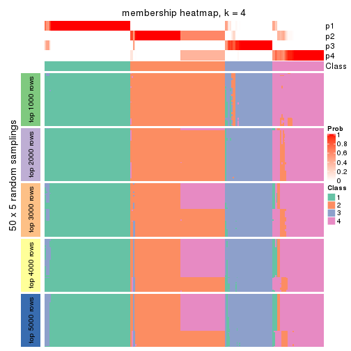</p>

</div>
<div id='tab-MAD-skmeans-membership-heatmap-4'>
<pre><code class="r">membership_heatmap(res, k = 5)
</code></pre>

<p></p>

</div>
<div id='tab-MAD-skmeans-membership-heatmap-5'>
<pre><code class="r">membership_heatmap(res, k = 6)
</code></pre>

<p></p>

</div>
</div>

As soon as we have had the classes for columns, we can look for signatures
which are significantly different between classes which can be candidate marks
for certain classes. Following are the heatmaps for signatures.


Signature heatmaps where rows are scaled:


<script>
$( function() {
	$( '#tabs-MAD-skmeans-get-signatures' ).tabs();
} );
</script>
<div id='tabs-MAD-skmeans-get-signatures'>
<ul>
<li><a href='#tab-MAD-skmeans-get-signatures-1'>k = 2</a></li>
<li><a href='#tab-MAD-skmeans-get-signatures-2'>k = 3</a></li>
<li><a href='#tab-MAD-skmeans-get-signatures-3'>k = 4</a></li>
<li><a href='#tab-MAD-skmeans-get-signatures-4'>k = 5</a></li>
<li><a href='#tab-MAD-skmeans-get-signatures-5'>k = 6</a></li>
</ul>
<div id='tab-MAD-skmeans-get-signatures-1'>
<pre><code class="r">get_signatures(res, k = 2)
</code></pre>

<p></p>

</div>
<div id='tab-MAD-skmeans-get-signatures-2'>
<pre><code class="r">get_signatures(res, k = 3)
</code></pre>

<p></p>

</div>
<div id='tab-MAD-skmeans-get-signatures-3'>
<pre><code class="r">get_signatures(res, k = 4)
</code></pre>

<p></p>

</div>
<div id='tab-MAD-skmeans-get-signatures-4'>
<pre><code class="r">get_signatures(res, k = 5)
</code></pre>

<p></p>

</div>
<div id='tab-MAD-skmeans-get-signatures-5'>
<pre><code class="r">get_signatures(res, k = 6)
</code></pre>

<p></p>

</div>
</div>


Signature heatmaps where rows are not scaled:


<script>
$( function() {
	$( '#tabs-MAD-skmeans-get-signatures-no-scale' ).tabs();
} );
</script>
<div id='tabs-MAD-skmeans-get-signatures-no-scale'>
<ul>
<li><a href='#tab-MAD-skmeans-get-signatures-no-scale-1'>k = 2</a></li>
<li><a href='#tab-MAD-skmeans-get-signatures-no-scale-2'>k = 3</a></li>
<li><a href='#tab-MAD-skmeans-get-signatures-no-scale-3'>k = 4</a></li>
<li><a href='#tab-MAD-skmeans-get-signatures-no-scale-4'>k = 5</a></li>
<li><a href='#tab-MAD-skmeans-get-signatures-no-scale-5'>k = 6</a></li>
</ul>
<div id='tab-MAD-skmeans-get-signatures-no-scale-1'>
<pre><code class="r">get_signatures(res, k = 2, scale_rows = FALSE)
</code></pre>

<p></p>

</div>
<div id='tab-MAD-skmeans-get-signatures-no-scale-2'>
<pre><code class="r">get_signatures(res, k = 3, scale_rows = FALSE)
</code></pre>

<p></p>

</div>
<div id='tab-MAD-skmeans-get-signatures-no-scale-3'>
<pre><code class="r">get_signatures(res, k = 4, scale_rows = FALSE)
</code></pre>

<p></p>

</div>
<div id='tab-MAD-skmeans-get-signatures-no-scale-4'>
<pre><code class="r">get_signatures(res, k = 5, scale_rows = FALSE)
</code></pre>

<p></p>

</div>
<div id='tab-MAD-skmeans-get-signatures-no-scale-5'>
<pre><code class="r">get_signatures(res, k = 6, scale_rows = FALSE)
</code></pre>

<p></p>

</div>
</div>


Compare the overlap of signatures from different k:

```r
compare_signatures(res)
```


`get_signature()` returns a data frame invisibly. TO get the list of signatures, the function
call should be assigned to a variable explicitly. In following code, if `plot` argument is set
to `FALSE`, no heatmap is plotted while only the differential analysis is performed.

```r
# code only for demonstration
tb = get_signature(res, k = ..., plot = FALSE)
```

An example of the output of `tb` is:

```
#>   which_row         fdr    mean_1    mean_2 scaled_mean_1 scaled_mean_2 km
#> 1        38 0.042760348  8.373488  9.131774    -0.5533452     0.5164555  1
#> 2        40 0.018707592  7.106213  8.469186    -0.6173731     0.5762149  1
#> 3        55 0.019134737 10.221463 11.207825    -0.6159697     0.5749050  1
#> 4        59 0.006059896  5.921854  7.869574    -0.6899429     0.6439467  1
#> 5        60 0.018055526  8.928898 10.211722    -0.6204761     0.5791110  1
#> 6        98 0.009384629 15.714769 14.887706     0.6635654    -0.6193277  2
...
```

The columns in `tb` are:

1. `which_row`: row indices corresponding to the input matrix.
2. `fdr`: FDR for the differential test. 
3. `mean_x`: The mean value in group x.
4. `scaled_mean_x`: The mean value in group x after rows are scaled.
5. `km`: Row groups if k-means clustering is applied to rows.


UMAP plot which shows how samples are separated.


<script>
$( function() {
	$( '#tabs-MAD-skmeans-dimension-reduction' ).tabs();
} );
</script>
<div id='tabs-MAD-skmeans-dimension-reduction'>
<ul>
<li><a href='#tab-MAD-skmeans-dimension-reduction-1'>k = 2</a></li>
<li><a href='#tab-MAD-skmeans-dimension-reduction-2'>k = 3</a></li>
<li><a href='#tab-MAD-skmeans-dimension-reduction-3'>k = 4</a></li>
<li><a href='#tab-MAD-skmeans-dimension-reduction-4'>k = 5</a></li>
<li><a href='#tab-MAD-skmeans-dimension-reduction-5'>k = 6</a></li>
</ul>
<div id='tab-MAD-skmeans-dimension-reduction-1'>
<pre><code class="r">dimension_reduction(res, k = 2, method = &quot;UMAP&quot;)
</code></pre>

<p></p>

</div>
<div id='tab-MAD-skmeans-dimension-reduction-2'>
<pre><code class="r">dimension_reduction(res, k = 3, method = &quot;UMAP&quot;)
</code></pre>

<p></p>

</div>
<div id='tab-MAD-skmeans-dimension-reduction-3'>
<pre><code class="r">dimension_reduction(res, k = 4, method = &quot;UMAP&quot;)
</code></pre>

<p></p>

</div>
<div id='tab-MAD-skmeans-dimension-reduction-4'>
<pre><code class="r">dimension_reduction(res, k = 5, method = &quot;UMAP&quot;)
</code></pre>

<p></p>

</div>
<div id='tab-MAD-skmeans-dimension-reduction-5'>
<pre><code class="r">dimension_reduction(res, k = 6, method = &quot;UMAP&quot;)
</code></pre>

<p></p>

</div>
</div>


Following heatmap shows how subgroups are split when increasing `k`:

```r
collect_classes(res)
```


If matrix rows can be associated to genes, consider to use `GO_Enrichment(res,
...)` to perform function enrichment for the signature genes.


 

---------------------------------------------------


### MAD:pam*


The object with results only for a single top-value method and a single partition method 
can be extracted as:

```r
res = res_list["MAD", "pam"]
# you can also extract it by
# res = res_list["MAD:pam"]
```

A summary of `res` and all the functions that can be applied to it:

```r
res
```

```
#> A 'ConsensusPartition' object with k = 2, 3, 4, 5, 6.
#>   On a matrix with 17680 rows and 218 columns.
#>   Top rows (1000, 2000, 3000, 4000, 5000) are extracted by 'MAD' method.
#>   Subgroups are detected by 'pam' method.
#>   Performed in total 1250 partitions by row resampling.
#>   Best k for subgroups seems to be 2.
#> 
#> Following methods can be applied to this 'ConsensusPartition' object:
#>  [1] "cola_report"             "collect_classes"         "collect_plots"          
#>  [4] "collect_stats"           "colnames"                "compare_signatures"     
#>  [7] "consensus_heatmap"       "dimension_reduction"     "functional_enrichment"  
#> [10] "get_anno_col"            "get_anno"                "get_classes"            
#> [13] "get_consensus"           "get_matrix"              "get_membership"         
#> [16] "get_param"               "get_signatures"          "get_stats"              
#> [19] "is_best_k"               "is_stable_k"             "membership_heatmap"     
#> [22] "ncol"                    "nrow"                    "plot_ecdf"              
#> [25] "rownames"                "select_partition_number" "show"                   
#> [28] "suggest_best_k"          "test_to_known_factors"
```

`collect_plots()` function collects all the plots made from `res` for all `k` (number of partitions)
into one single page to provide an easy and fast comparison between different `k`.

```r
collect_plots(res)
```


The plots are:

- The first row: a plot of the ECDF (Empirical cumulative distribution
  function) curves of the consensus matrix for each `k` and the heatmap of
  predicted classes for each `k`.
- The second row: heatmaps of the consensus matrix for each `k`.
- The third row: heatmaps of the membership matrix for each `k`.
- The fouth row: heatmaps of the signatures for each `k`.

All the plots in panels can be made by individual functions and they are
plotted later in this section.

`select_partition_number()` produces several plots showing different
statistics for choosing "optimized" `k`. There are following statistics:

- ECDF curves of the consensus matrix for each `k`;
- 1-PAC. [The PAC
  score](https://en.wikipedia.org/wiki/Consensus_clustering#Over-interpretation_potential_of_consensus_clustering)
  measures the proportion of the ambiguous subgrouping.
- Mean silhouette score.
- Concordance. The mean probability of fiting the consensus class ids in all
  partitions.
- Area increased. Denote $A_k$ as the area under the ECDF curve for current
  `k`, the area increased is defined as $A_k - A_{k-1}$.
- Rand index. The percent of pairs of samples that are both in a same cluster
  or both are not in a same cluster in the partition of k and k-1.
- Jaccard index. The ratio of pairs of samples are both in a same cluster in
  the partition of k and k-1 and the pairs of samples are both in a same
  cluster in the partition k or k-1.

The detailed explanations of these statistics can be found in [the cola
vignette](http://bioconductor.org/packages/devel/bioc/vignettes/cola/inst/doc/cola.html#toc_13).

Generally speaking, lower PAC score, higher mean silhouette score or higher
concordance corresponds to better partition. Rand index and Jaccard index
measure how similar the current partition is compared to partition with `k-1`.
If they are too similar, we won't accept `k` is better than `k-1`.

```r
select_partition_number(res)
```


The numeric values for all these statistics can be obtained by `get_stats()`.

```r
get_stats(res)
```

```
#>   k 1-PAC mean_silhouette concordance area_increased  Rand Jaccard
#> 2 2 0.944           0.963       0.984         0.4982 0.500   0.500
#> 3 3 0.670           0.753       0.825         0.2658 0.862   0.729
#> 4 4 0.774           0.765       0.902         0.1612 0.818   0.557
#> 5 5 0.863           0.802       0.909         0.0805 0.889   0.618
#> 6 6 0.755           0.590       0.781         0.0413 0.871   0.492
```

`suggest_best_k()` suggests the best $k$ based on these statistics. The rules are as follows:

- All $k$ with Jaccard index larger than 0.95 are removed because the increase of
  the partition number does not provides enough extra information. If all $k$ are removed,
  the best $k$ is assigned by `NA`.
- For $k$ with 1-PAC larger than 0.9, the maximal $k$ is taken as the "best k". Other $k$ is called "optional k".
- If it does not fit the second rule. The $k$ with the highest vote of highest
  1-PAC, mean silhouette and concordance is taken as the "best k".

```r
suggest_best_k(res)
```

```
#> [1] 2
```


Following shows the table of the partitions (You need to click the **show/hide
code output** link to see it). The membership matrix (columns with name `p*`)
is inferred by
[`clue::cl_consensus()`](https://www.rdocumentation.org/link/cl_consensus?package=clue)
function with the `SE` method. Basically the value in the membership matrix
represents the probability to belong to a certain group. The finall class
label for an item is determined with the group with highest probability it
belongs to.

In `get_classes()` function, the entropy is calculated from the membership
matrix and the silhouette score is calculated from the consensus matrix.


<script>
$( function() {
	$( '#tabs-MAD-pam-get-classes' ).tabs();
} );
</script>
<div id='tabs-MAD-pam-get-classes'>
<ul>
<li><a href='#tab-MAD-pam-get-classes-1'>k = 2</a></li>
<li><a href='#tab-MAD-pam-get-classes-2'>k = 3</a></li>
<li><a href='#tab-MAD-pam-get-classes-3'>k = 4</a></li>
<li><a href='#tab-MAD-pam-get-classes-4'>k = 5</a></li>
<li><a href='#tab-MAD-pam-get-classes-5'>k = 6</a></li>
</ul>

<div id='tab-MAD-pam-get-classes-1'>
<p><a id='tab-MAD-pam-get-classes-1-a' style='color:#0366d6' href='#'>show/hide code output</a></p>
<pre><code class="r">cbind(get_classes(res, k = 2), get_membership(res, k = 2))
</code></pre>

<pre><code>#&gt;            class entropy silhouette    p1    p2
#&gt; SRR1498997     2   0.000      0.994 0.000 1.000
#&gt; SRR1076441     1   0.000      0.970 1.000 0.000
#&gt; SRR1489803     2   0.000      0.994 0.000 1.000
#&gt; SRR1345953     2   0.000      0.994 0.000 1.000
#&gt; SRR1357826     2   0.000      0.994 0.000 1.000
#&gt; SRR1419656     1   0.000      0.970 1.000 0.000
#&gt; SRR1454158     2   0.000      0.994 0.000 1.000
#&gt; SRR1475408     2   0.000      0.994 0.000 1.000
#&gt; SRR1472704     2   0.000      0.994 0.000 1.000
#&gt; SRR1090046     1   0.000      0.970 1.000 0.000
#&gt; SRR1312822     1   0.000      0.970 1.000 0.000
#&gt; SRR1096987     2   0.000      0.994 0.000 1.000
#&gt; SRR1334587     2   0.000      0.994 0.000 1.000
#&gt; SRR1490246     1   0.000      0.970 1.000 0.000
#&gt; SRR1467522     1   0.000      0.970 1.000 0.000
#&gt; SRR1324206     1   0.000      0.970 1.000 0.000
#&gt; SRR1408574     2   0.000      0.994 0.000 1.000
#&gt; SRR1083959     2   0.000      0.994 0.000 1.000
#&gt; SRR1079948     2   0.000      0.994 0.000 1.000
#&gt; SRR1310667     2   0.000      0.994 0.000 1.000
#&gt; SRR655852      2   0.000      0.994 0.000 1.000
#&gt; SRR1352457     2   0.000      0.994 0.000 1.000
#&gt; SRR1353994     2   0.000      0.994 0.000 1.000
#&gt; SRR1459561     2   0.000      0.994 0.000 1.000
#&gt; SRR1454009     1   0.000      0.970 1.000 0.000
#&gt; SRR1071084     1   0.000      0.970 1.000 0.000
#&gt; SRR1082859     2   0.000      0.994 0.000 1.000
#&gt; SRR1086538     1   0.000      0.970 1.000 0.000
#&gt; SRR1486262     2   0.000      0.994 0.000 1.000
#&gt; SRR658105      1   0.000      0.970 1.000 0.000
#&gt; SRR811073      2   0.000      0.994 0.000 1.000
#&gt; SRR1429181     2   0.000      0.994 0.000 1.000
#&gt; SRR1327896     2   0.000      0.994 0.000 1.000
#&gt; SRR1464788     2   0.000      0.994 0.000 1.000
#&gt; SRR1346861     2   0.000      0.994 0.000 1.000
#&gt; SRR1318774     2   0.000      0.994 0.000 1.000
#&gt; SRR1420517     1   0.000      0.970 1.000 0.000
#&gt; SRR1369584     2   0.000      0.994 0.000 1.000
#&gt; SRR1443244     1   0.921      0.528 0.664 0.336
#&gt; SRR1455391     1   0.000      0.970 1.000 0.000
#&gt; SRR1068999     1   0.000      0.970 1.000 0.000
#&gt; SRR1481297     1   0.000      0.970 1.000 0.000
#&gt; SRR1070208     1   0.000      0.970 1.000 0.000
#&gt; SRR1317282     1   0.000      0.970 1.000 0.000
#&gt; SRR1096125     2   0.000      0.994 0.000 1.000
#&gt; SRR1472506     1   0.855      0.635 0.720 0.280
#&gt; SRR1388281     2   0.000      0.994 0.000 1.000
#&gt; SRR1365622     2   0.000      0.994 0.000 1.000
#&gt; SRR662306      1   0.000      0.970 1.000 0.000
#&gt; SRR662811      1   0.000      0.970 1.000 0.000
#&gt; SRR820571      1   0.844      0.649 0.728 0.272
#&gt; SRR1357166     1   0.000      0.970 1.000 0.000
#&gt; SRR1488586     1   0.469      0.877 0.900 0.100
#&gt; SRR1485398     1   0.000      0.970 1.000 0.000
#&gt; SRR1417725     2   0.000      0.994 0.000 1.000
#&gt; SRR1409397     2   0.000      0.994 0.000 1.000
#&gt; SRR1465693     2   0.000      0.994 0.000 1.000
#&gt; SRR1096547     1   0.969      0.386 0.604 0.396
#&gt; SRR1456818     1   0.000      0.970 1.000 0.000
#&gt; SRR816336      1   0.730      0.752 0.796 0.204
#&gt; SRR1420238     1   0.000      0.970 1.000 0.000
#&gt; SRR1433374     1   0.000      0.970 1.000 0.000
#&gt; SRR1436990     1   0.000      0.970 1.000 0.000
#&gt; SRR662378      1   0.000      0.970 1.000 0.000
#&gt; SRR1477671     1   0.000      0.970 1.000 0.000
#&gt; SRR1084079     2   0.574      0.839 0.136 0.864
#&gt; SRR1102949     1   0.000      0.970 1.000 0.000
#&gt; SRR1458090     1   0.000      0.970 1.000 0.000
#&gt; SRR1418729     2   0.000      0.994 0.000 1.000
#&gt; SRR1403814     2   0.000      0.994 0.000 1.000
#&gt; SRR1404887     1   0.886      0.592 0.696 0.304
#&gt; SRR1434955     1   0.000      0.970 1.000 0.000
#&gt; SRR1360652     1   0.000      0.970 1.000 0.000
#&gt; SRR1356765     2   0.000      0.994 0.000 1.000
#&gt; SRR1078258     2   0.000      0.994 0.000 1.000
#&gt; SRR1455861     1   0.000      0.970 1.000 0.000
#&gt; SRR1420296     2   0.000      0.994 0.000 1.000
#&gt; SRR1070260     2   0.000      0.994 0.000 1.000
#&gt; SRR1410765     1   0.000      0.970 1.000 0.000
#&gt; SRR1481315     1   0.000      0.970 1.000 0.000
#&gt; SRR1414661     2   0.000      0.994 0.000 1.000
#&gt; SRR1359147     2   0.000      0.994 0.000 1.000
#&gt; SRR1488694     1   0.563      0.842 0.868 0.132
#&gt; SRR1477273     1   0.000      0.970 1.000 0.000
#&gt; SRR1415792     1   0.000      0.970 1.000 0.000
#&gt; SRR1369088     2   0.000      0.994 0.000 1.000
#&gt; SRR1406621     2   0.000      0.994 0.000 1.000
#&gt; SRR1401017     2   0.000      0.994 0.000 1.000
#&gt; SRR1099981     2   0.000      0.994 0.000 1.000
#&gt; SRR815208      2   0.000      0.994 0.000 1.000
#&gt; SRR1380460     2   0.000      0.994 0.000 1.000
#&gt; SRR1091097     2   0.000      0.994 0.000 1.000
#&gt; SRR1456010     1   0.000      0.970 1.000 0.000
#&gt; SRR1498416     2   0.000      0.994 0.000 1.000
#&gt; SRR818873      2   0.000      0.994 0.000 1.000
#&gt; SRR813868      2   0.000      0.994 0.000 1.000
#&gt; SRR1394912     1   0.000      0.970 1.000 0.000
#&gt; SRR1475824     2   0.000      0.994 0.000 1.000
#&gt; SRR1459866     1   0.000      0.970 1.000 0.000
#&gt; SRR1364871     2   0.574      0.839 0.136 0.864
#&gt; SRR1100472     2   0.000      0.994 0.000 1.000
#&gt; SRR1331267     1   0.000      0.970 1.000 0.000
#&gt; SRR1068977     2   0.000      0.994 0.000 1.000
#&gt; SRR1391511     2   0.000      0.994 0.000 1.000
#&gt; SRR1077920     2   0.000      0.994 0.000 1.000
#&gt; SRR1457705     1   0.000      0.970 1.000 0.000
#&gt; SRR1437073     1   0.000      0.970 1.000 0.000
#&gt; SRR1473124     1   0.000      0.970 1.000 0.000
#&gt; SRR1469279     1   0.000      0.970 1.000 0.000
#&gt; SRR1091791     2   0.000      0.994 0.000 1.000
#&gt; SRR1341539     2   0.000      0.994 0.000 1.000
#&gt; SRR1446354     1   0.000      0.970 1.000 0.000
#&gt; SRR1415420     1   0.000      0.970 1.000 0.000
#&gt; SRR1368050     1   0.000      0.970 1.000 0.000
#&gt; SRR656970      2   0.000      0.994 0.000 1.000
#&gt; SRR1473403     2   0.000      0.994 0.000 1.000
#&gt; SRR1084674     1   0.000      0.970 1.000 0.000
#&gt; SRR1464702     1   0.000      0.970 1.000 0.000
#&gt; SRR1074860     2   0.000      0.994 0.000 1.000
#&gt; SRR655447      2   0.000      0.994 0.000 1.000
#&gt; SRR1404442     2   0.000      0.994 0.000 1.000
#&gt; SRR1418795     1   0.000      0.970 1.000 0.000
#&gt; SRR1458335     2   0.000      0.994 0.000 1.000
#&gt; SRR1489589     2   0.000      0.994 0.000 1.000
#&gt; SRR1378284     1   0.000      0.970 1.000 0.000
#&gt; SRR1408014     2   0.000      0.994 0.000 1.000
#&gt; SRR1083052     1   0.000      0.970 1.000 0.000
#&gt; SRR1339236     2   0.000      0.994 0.000 1.000
#&gt; SRR1323829     2   0.000      0.994 0.000 1.000
#&gt; SRR1086772     2   0.000      0.994 0.000 1.000
#&gt; SRR1486457     1   0.000      0.970 1.000 0.000
#&gt; SRR1415257     2   0.000      0.994 0.000 1.000
#&gt; SRR1071905     1   0.000      0.970 1.000 0.000
#&gt; SRR659223      2   0.000      0.994 0.000 1.000
#&gt; SRR1386945     1   0.000      0.970 1.000 0.000
#&gt; SRR821498      2   0.000      0.994 0.000 1.000
#&gt; SRR1378903     2   0.000      0.994 0.000 1.000
#&gt; SRR1472907     1   0.000      0.970 1.000 0.000
#&gt; SRR1442313     2   0.000      0.994 0.000 1.000
#&gt; SRR1077139     2   0.000      0.994 0.000 1.000
#&gt; SRR1342758     1   0.000      0.970 1.000 0.000
#&gt; SRR656911      2   0.000      0.994 0.000 1.000
#&gt; SRR1070738     1   0.000      0.970 1.000 0.000
#&gt; SRR1476950     1   0.000      0.970 1.000 0.000
#&gt; SRR1488196     1   0.000      0.970 1.000 0.000
#&gt; SRR1498951     1   0.000      0.970 1.000 0.000
#&gt; SRR1413392     1   0.000      0.970 1.000 0.000
#&gt; SRR657528      2   0.000      0.994 0.000 1.000
#&gt; SRR812198      1   0.000      0.970 1.000 0.000
#&gt; SRR660283      2   0.000      0.994 0.000 1.000
#&gt; SRR1420936     1   0.000      0.970 1.000 0.000
#&gt; SRR1469547     2   0.000      0.994 0.000 1.000
#&gt; SRR1322249     1   0.000      0.970 1.000 0.000
#&gt; SRR1396682     1   0.000      0.970 1.000 0.000
#&gt; SRR1095816     2   0.000      0.994 0.000 1.000
#&gt; SRR1081023     1   0.000      0.970 1.000 0.000
#&gt; SRR1092517     2   0.000      0.994 0.000 1.000
#&gt; SRR811285      2   0.000      0.994 0.000 1.000
#&gt; SRR657018      1   0.000      0.970 1.000 0.000
#&gt; SRR1365534     1   0.000      0.970 1.000 0.000
#&gt; SRR1090791     2   0.000      0.994 0.000 1.000
#&gt; SRR1439915     2   0.000      0.994 0.000 1.000
#&gt; SRR1391575     2   0.327      0.932 0.060 0.940
#&gt; SRR1314092     2   0.000      0.994 0.000 1.000
#&gt; SRR1328941     1   0.000      0.970 1.000 0.000
#&gt; SRR1336181     2   0.000      0.994 0.000 1.000
#&gt; SRR1362972     1   0.000      0.970 1.000 0.000
#&gt; SRR1366790     2   0.000      0.994 0.000 1.000
#&gt; SRR1455902     1   0.000      0.970 1.000 0.000
#&gt; SRR1437644     2   0.574      0.839 0.136 0.864
#&gt; SRR1105009     2   0.000      0.994 0.000 1.000
#&gt; SRR1367024     1   0.000      0.970 1.000 0.000
#&gt; SRR660248      2   0.000      0.994 0.000 1.000
#&gt; SRR1409620     1   0.000      0.970 1.000 0.000
#&gt; SRR1455807     2   0.000      0.994 0.000 1.000
#&gt; SRR1339431     1   0.000      0.970 1.000 0.000
#&gt; SRR1378948     1   0.981      0.320 0.580 0.420
#&gt; SRR1469237     1   0.000      0.970 1.000 0.000
#&gt; SRR1098264     2   0.000      0.994 0.000 1.000
#&gt; SRR1406224     2   0.000      0.994 0.000 1.000
#&gt; SRR1393026     1   0.000      0.970 1.000 0.000
#&gt; SRR808428      2   0.000      0.994 0.000 1.000
#&gt; SRR615910      2   0.000      0.994 0.000 1.000
#&gt; SRR1076219     1   0.000      0.970 1.000 0.000
#&gt; SRR1481128     1   0.000      0.970 1.000 0.000
#&gt; SRR1359262     2   0.000      0.994 0.000 1.000
#&gt; SRR1407648     2   0.000      0.994 0.000 1.000
#&gt; SRR1386775     1   0.795      0.700 0.760 0.240
#&gt; SRR1388399     1   0.833      0.662 0.736 0.264
#&gt; SRR1361499     2   0.000      0.994 0.000 1.000
#&gt; SRR1500709     2   0.000      0.994 0.000 1.000
#&gt; SRR1335917     1   0.000      0.970 1.000 0.000
#&gt; SRR1430615     2   0.000      0.994 0.000 1.000
#&gt; SRR1335212     1   0.000      0.970 1.000 0.000
#&gt; SRR1400159     2   0.000      0.994 0.000 1.000
#&gt; SRR1457245     2   0.000      0.994 0.000 1.000
#&gt; SRR1356746     2   0.000      0.994 0.000 1.000
#&gt; SRR658319      2   0.000      0.994 0.000 1.000
#&gt; SRR1435946     1   0.000      0.970 1.000 0.000
#&gt; SRR1370308     1   0.000      0.970 1.000 0.000
#&gt; SRR1100893     1   0.000      0.970 1.000 0.000
#&gt; SRR1389432     1   0.000      0.970 1.000 0.000
#&gt; SRR1381799     2   0.000      0.994 0.000 1.000
#&gt; SRR1310158     1   0.000      0.970 1.000 0.000
#&gt; SRR1341100     2   0.574      0.839 0.136 0.864
#&gt; SRR1342873     1   0.000      0.970 1.000 0.000
#&gt; SRR1472102     2   0.000      0.994 0.000 1.000
#&gt; SRR1409421     1   0.000      0.970 1.000 0.000
#&gt; SRR1328577     2   0.000      0.994 0.000 1.000
#&gt; SRR808942      2   0.000      0.994 0.000 1.000
#&gt; SRR1343818     2   0.000      0.994 0.000 1.000
#&gt; SRR1472415     2   0.000      0.994 0.000 1.000
#&gt; SRR658409      2   0.000      0.994 0.000 1.000
#&gt; SRR1469681     1   0.000      0.970 1.000 0.000
#&gt; SRR1075484     2   0.000      0.994 0.000 1.000
#&gt; SRR1417894     1   0.000      0.970 1.000 0.000
#&gt; SRR1417422     2   0.000      0.994 0.000 1.000
#&gt; SRR1090674     1   0.000      0.970 1.000 0.000
</code></pre>

<script>
$('#tab-MAD-pam-get-classes-1-a').parent().next().next().hide();
$('#tab-MAD-pam-get-classes-1-a').click(function(){
  $('#tab-MAD-pam-get-classes-1-a').parent().next().next().toggle();
  return(false);
});
</script>
</div>

<div id='tab-MAD-pam-get-classes-2'>
<p><a id='tab-MAD-pam-get-classes-2-a' style='color:#0366d6' href='#'>show/hide code output</a></p>
<pre><code class="r">cbind(get_classes(res, k = 3), get_membership(res, k = 3))
</code></pre>

<pre><code>#&gt;            class entropy silhouette    p1    p2    p3
#&gt; SRR1498997     2  0.0000      0.828 0.000 1.000 0.000
#&gt; SRR1076441     1  0.0000      0.905 1.000 0.000 0.000
#&gt; SRR1489803     2  0.0000      0.828 0.000 1.000 0.000
#&gt; SRR1345953     2  0.4974      0.822 0.000 0.764 0.236
#&gt; SRR1357826     2  0.0000      0.828 0.000 1.000 0.000
#&gt; SRR1419656     1  0.0000      0.905 1.000 0.000 0.000
#&gt; SRR1454158     2  0.2066      0.839 0.000 0.940 0.060
#&gt; SRR1475408     3  0.6111     -0.372 0.000 0.396 0.604
#&gt; SRR1472704     2  0.0000      0.828 0.000 1.000 0.000
#&gt; SRR1090046     3  0.6235      0.647 0.436 0.000 0.564
#&gt; SRR1312822     1  0.0000      0.905 1.000 0.000 0.000
#&gt; SRR1096987     2  0.6286      0.683 0.000 0.536 0.464
#&gt; SRR1334587     2  0.4291      0.833 0.000 0.820 0.180
#&gt; SRR1490246     1  0.0000      0.905 1.000 0.000 0.000
#&gt; SRR1467522     1  0.0000      0.905 1.000 0.000 0.000
#&gt; SRR1324206     1  0.0000      0.905 1.000 0.000 0.000
#&gt; SRR1408574     2  0.6280      0.686 0.000 0.540 0.460
#&gt; SRR1083959     2  0.0000      0.828 0.000 1.000 0.000
#&gt; SRR1079948     2  0.6286      0.683 0.000 0.536 0.464
#&gt; SRR1310667     2  0.0000      0.828 0.000 1.000 0.000
#&gt; SRR655852      2  0.6079      0.743 0.000 0.612 0.388
#&gt; SRR1352457     2  0.4399      0.831 0.000 0.812 0.188
#&gt; SRR1353994     2  0.4974      0.822 0.000 0.764 0.236
#&gt; SRR1459561     2  0.0000      0.828 0.000 1.000 0.000
#&gt; SRR1454009     3  0.6286      0.651 0.464 0.000 0.536
#&gt; SRR1071084     3  0.6252      0.651 0.444 0.000 0.556
#&gt; SRR1082859     2  0.0000      0.828 0.000 1.000 0.000
#&gt; SRR1086538     1  0.0000      0.905 1.000 0.000 0.000
#&gt; SRR1486262     2  0.6286      0.683 0.000 0.536 0.464
#&gt; SRR658105      1  0.0000      0.905 1.000 0.000 0.000
#&gt; SRR811073      2  0.4887      0.824 0.000 0.772 0.228
#&gt; SRR1429181     2  0.4974      0.822 0.000 0.764 0.236
#&gt; SRR1327896     2  0.5216      0.814 0.000 0.740 0.260
#&gt; SRR1464788     2  0.6008      0.750 0.000 0.628 0.372
#&gt; SRR1346861     2  0.0000      0.828 0.000 1.000 0.000
#&gt; SRR1318774     2  0.3941      0.831 0.000 0.844 0.156
#&gt; SRR1420517     1  0.4654      0.592 0.792 0.000 0.208
#&gt; SRR1369584     2  0.0000      0.828 0.000 1.000 0.000
#&gt; SRR1443244     1  0.6809      0.184 0.524 0.012 0.464
#&gt; SRR1455391     3  0.6286      0.651 0.464 0.000 0.536
#&gt; SRR1068999     1  0.0000      0.905 1.000 0.000 0.000
#&gt; SRR1481297     1  0.3752      0.643 0.856 0.000 0.144
#&gt; SRR1070208     1  0.0000      0.905 1.000 0.000 0.000
#&gt; SRR1317282     3  0.6286      0.651 0.464 0.000 0.536
#&gt; SRR1096125     2  0.5216      0.814 0.000 0.740 0.260
#&gt; SRR1472506     3  0.0000      0.454 0.000 0.000 1.000
#&gt; SRR1388281     2  0.1753      0.839 0.000 0.952 0.048
#&gt; SRR1365622     2  0.6286      0.683 0.000 0.536 0.464
#&gt; SRR662306      3  0.6286      0.651 0.464 0.000 0.536
#&gt; SRR662811      1  0.0000      0.905 1.000 0.000 0.000
#&gt; SRR820571      1  0.6286      0.204 0.536 0.000 0.464
#&gt; SRR1357166     3  0.6286      0.651 0.464 0.000 0.536
#&gt; SRR1488586     1  0.5497      0.454 0.708 0.000 0.292
#&gt; SRR1485398     1  0.0000      0.905 1.000 0.000 0.000
#&gt; SRR1417725     3  0.3340      0.437 0.000 0.120 0.880
#&gt; SRR1409397     2  0.2625      0.840 0.000 0.916 0.084
#&gt; SRR1465693     2  0.2066      0.838 0.000 0.940 0.060
#&gt; SRR1096547     3  0.0000      0.454 0.000 0.000 1.000
#&gt; SRR1456818     1  0.0000      0.905 1.000 0.000 0.000
#&gt; SRR816336      3  0.3340      0.528 0.120 0.000 0.880
#&gt; SRR1420238     1  0.0000      0.905 1.000 0.000 0.000
#&gt; SRR1433374     3  0.6286      0.651 0.464 0.000 0.536
#&gt; SRR1436990     1  0.0000      0.905 1.000 0.000 0.000
#&gt; SRR662378      1  0.0000      0.905 1.000 0.000 0.000
#&gt; SRR1477671     1  0.0000      0.905 1.000 0.000 0.000
#&gt; SRR1084079     3  0.9319     -0.428 0.168 0.368 0.464
#&gt; SRR1102949     1  0.0000      0.905 1.000 0.000 0.000
#&gt; SRR1458090     1  0.0000      0.905 1.000 0.000 0.000
#&gt; SRR1418729     2  0.5785      0.743 0.000 0.668 0.332
#&gt; SRR1403814     2  0.6286      0.683 0.000 0.536 0.464
#&gt; SRR1404887     1  0.6286      0.204 0.536 0.000 0.464
#&gt; SRR1434955     1  0.0000      0.905 1.000 0.000 0.000
#&gt; SRR1360652     1  0.0000      0.905 1.000 0.000 0.000
#&gt; SRR1356765     2  0.5397      0.806 0.000 0.720 0.280
#&gt; SRR1078258     2  0.4974      0.822 0.000 0.764 0.236
#&gt; SRR1455861     1  0.0000      0.905 1.000 0.000 0.000
#&gt; SRR1420296     2  0.1860      0.838 0.000 0.948 0.052
#&gt; SRR1070260     2  0.0000      0.828 0.000 1.000 0.000
#&gt; SRR1410765     1  0.0000      0.905 1.000 0.000 0.000
#&gt; SRR1481315     1  0.0000      0.905 1.000 0.000 0.000
#&gt; SRR1414661     2  0.1753      0.838 0.000 0.952 0.048
#&gt; SRR1359147     2  0.5016      0.821 0.000 0.760 0.240
#&gt; SRR1488694     1  0.6111      0.300 0.604 0.000 0.396
#&gt; SRR1477273     3  0.5948      0.625 0.360 0.000 0.640
#&gt; SRR1415792     3  0.6286      0.651 0.464 0.000 0.536
#&gt; SRR1369088     2  0.6286      0.683 0.000 0.536 0.464
#&gt; SRR1406621     2  0.6280      0.686 0.000 0.540 0.460
#&gt; SRR1401017     2  0.5560      0.752 0.000 0.700 0.300
#&gt; SRR1099981     2  0.5016      0.821 0.000 0.760 0.240
#&gt; SRR815208      2  0.0000      0.828 0.000 1.000 0.000
#&gt; SRR1380460     2  0.4974      0.822 0.000 0.764 0.236
#&gt; SRR1091097     2  0.6286      0.683 0.000 0.536 0.464
#&gt; SRR1456010     3  0.6286      0.651 0.464 0.000 0.536
#&gt; SRR1498416     2  0.4974      0.822 0.000 0.764 0.236
#&gt; SRR818873      2  0.2796      0.839 0.000 0.908 0.092
#&gt; SRR813868      2  0.3941      0.836 0.000 0.844 0.156
#&gt; SRR1394912     1  0.0000      0.905 1.000 0.000 0.000
#&gt; SRR1475824     2  0.6286      0.683 0.000 0.536 0.464
#&gt; SRR1459866     1  0.0000      0.905 1.000 0.000 0.000
#&gt; SRR1364871     3  0.8277     -0.109 0.460 0.076 0.464
#&gt; SRR1100472     2  0.0000      0.828 0.000 1.000 0.000
#&gt; SRR1331267     1  0.4887      0.560 0.772 0.000 0.228
#&gt; SRR1068977     2  0.6286      0.683 0.000 0.536 0.464
#&gt; SRR1391511     2  0.0000      0.828 0.000 1.000 0.000
#&gt; SRR1077920     2  0.0000      0.828 0.000 1.000 0.000
#&gt; SRR1457705     3  0.6286      0.651 0.464 0.000 0.536
#&gt; SRR1437073     1  0.0000      0.905 1.000 0.000 0.000
#&gt; SRR1473124     3  0.5254      0.584 0.264 0.000 0.736
#&gt; SRR1469279     3  0.6286      0.651 0.464 0.000 0.536
#&gt; SRR1091791     2  0.6286      0.683 0.000 0.536 0.464
#&gt; SRR1341539     2  0.6235      0.705 0.000 0.564 0.436
#&gt; SRR1446354     3  0.6286      0.651 0.464 0.000 0.536
#&gt; SRR1415420     1  0.0000      0.905 1.000 0.000 0.000
#&gt; SRR1368050     1  0.0000      0.905 1.000 0.000 0.000
#&gt; SRR656970      2  0.0000      0.828 0.000 1.000 0.000
#&gt; SRR1473403     2  0.4974      0.822 0.000 0.764 0.236
#&gt; SRR1084674     3  0.6286      0.651 0.464 0.000 0.536
#&gt; SRR1464702     1  0.0000      0.905 1.000 0.000 0.000
#&gt; SRR1074860     2  0.6286      0.683 0.000 0.536 0.464
#&gt; SRR655447      2  0.4974      0.822 0.000 0.764 0.236
#&gt; SRR1404442     2  0.0000      0.828 0.000 1.000 0.000
#&gt; SRR1418795     1  0.0000      0.905 1.000 0.000 0.000
#&gt; SRR1458335     2  0.2878      0.840 0.000 0.904 0.096
#&gt; SRR1489589     2  0.2165      0.839 0.000 0.936 0.064
#&gt; SRR1378284     1  0.1289      0.863 0.968 0.000 0.032
#&gt; SRR1408014     2  0.0000      0.828 0.000 1.000 0.000
#&gt; SRR1083052     1  0.0000      0.905 1.000 0.000 0.000
#&gt; SRR1339236     3  0.3038      0.457 0.000 0.104 0.896
#&gt; SRR1323829     2  0.0000      0.828 0.000 1.000 0.000
#&gt; SRR1086772     2  0.3038      0.840 0.000 0.896 0.104
#&gt; SRR1486457     3  0.6244      0.650 0.440 0.000 0.560
#&gt; SRR1415257     2  0.3619      0.839 0.000 0.864 0.136
#&gt; SRR1071905     3  0.6286      0.651 0.464 0.000 0.536
#&gt; SRR659223      2  0.0000      0.828 0.000 1.000 0.000
#&gt; SRR1386945     3  0.6286      0.651 0.464 0.000 0.536
#&gt; SRR821498      2  0.6286      0.683 0.000 0.536 0.464
#&gt; SRR1378903     2  0.5291      0.811 0.000 0.732 0.268
#&gt; SRR1472907     1  0.0424      0.894 0.992 0.000 0.008
#&gt; SRR1442313     2  0.0000      0.828 0.000 1.000 0.000
#&gt; SRR1077139     2  0.0000      0.828 0.000 1.000 0.000
#&gt; SRR1342758     1  0.0000      0.905 1.000 0.000 0.000
#&gt; SRR656911      2  0.5291      0.811 0.000 0.732 0.268
#&gt; SRR1070738     1  0.0000      0.905 1.000 0.000 0.000
#&gt; SRR1476950     1  0.0000      0.905 1.000 0.000 0.000
#&gt; SRR1488196     3  0.6180      0.644 0.416 0.000 0.584
#&gt; SRR1498951     3  0.6286      0.651 0.464 0.000 0.536
#&gt; SRR1413392     1  0.0000      0.905 1.000 0.000 0.000
#&gt; SRR657528      2  0.3116      0.840 0.000 0.892 0.108
#&gt; SRR812198      1  0.0000      0.905 1.000 0.000 0.000
#&gt; SRR660283      2  0.0000      0.828 0.000 1.000 0.000
#&gt; SRR1420936     1  0.0000      0.905 1.000 0.000 0.000
#&gt; SRR1469547     2  0.0000      0.828 0.000 1.000 0.000
#&gt; SRR1322249     1  0.0000      0.905 1.000 0.000 0.000
#&gt; SRR1396682     1  0.0000      0.905 1.000 0.000 0.000
#&gt; SRR1095816     2  0.6126      0.736 0.000 0.600 0.400
#&gt; SRR1081023     1  0.0000      0.905 1.000 0.000 0.000
#&gt; SRR1092517     2  0.4974      0.822 0.000 0.764 0.236
#&gt; SRR811285      2  0.6140      0.723 0.000 0.596 0.404
#&gt; SRR657018      1  0.0000      0.905 1.000 0.000 0.000
#&gt; SRR1365534     3  0.6286      0.651 0.464 0.000 0.536
#&gt; SRR1090791     2  0.0000      0.828 0.000 1.000 0.000
#&gt; SRR1439915     2  0.2625      0.840 0.000 0.916 0.084
#&gt; SRR1391575     2  0.6286      0.683 0.000 0.536 0.464
#&gt; SRR1314092     2  0.6140      0.731 0.000 0.596 0.404
#&gt; SRR1328941     3  0.5254      0.584 0.264 0.000 0.736
#&gt; SRR1336181     2  0.0000      0.828 0.000 1.000 0.000
#&gt; SRR1362972     1  0.0000      0.905 1.000 0.000 0.000
#&gt; SRR1366790     2  0.2796      0.839 0.000 0.908 0.092
#&gt; SRR1455902     3  0.6286      0.651 0.464 0.000 0.536
#&gt; SRR1437644     3  0.6026     -0.444 0.000 0.376 0.624
#&gt; SRR1105009     2  0.0000      0.828 0.000 1.000 0.000
#&gt; SRR1367024     3  0.6215      0.648 0.428 0.000 0.572
#&gt; SRR660248      2  0.6026      0.724 0.000 0.624 0.376
#&gt; SRR1409620     1  0.0000      0.905 1.000 0.000 0.000
#&gt; SRR1455807     2  0.0000      0.828 0.000 1.000 0.000
#&gt; SRR1339431     1  0.0000      0.905 1.000 0.000 0.000
#&gt; SRR1378948     3  0.0000      0.454 0.000 0.000 1.000
#&gt; SRR1469237     1  0.0000      0.905 1.000 0.000 0.000
#&gt; SRR1098264     2  0.3192      0.832 0.000 0.888 0.112
#&gt; SRR1406224     2  0.6154      0.721 0.000 0.592 0.408
#&gt; SRR1393026     3  0.6286      0.651 0.464 0.000 0.536
#&gt; SRR808428      2  0.0000      0.828 0.000 1.000 0.000
#&gt; SRR615910      2  0.0237      0.829 0.000 0.996 0.004
#&gt; SRR1076219     1  0.0000      0.905 1.000 0.000 0.000
#&gt; SRR1481128     1  0.0000      0.905 1.000 0.000 0.000
#&gt; SRR1359262     2  0.0000      0.828 0.000 1.000 0.000
#&gt; SRR1407648     2  0.5098      0.819 0.000 0.752 0.248
#&gt; SRR1386775     1  0.6286      0.204 0.536 0.000 0.464
#&gt; SRR1388399     1  0.6286      0.204 0.536 0.000 0.464
#&gt; SRR1361499     2  0.0237      0.829 0.000 0.996 0.004
#&gt; SRR1500709     2  0.5291      0.811 0.000 0.732 0.268
#&gt; SRR1335917     1  0.0000      0.905 1.000 0.000 0.000
#&gt; SRR1430615     2  0.1964      0.838 0.000 0.944 0.056
#&gt; SRR1335212     1  0.1753      0.839 0.952 0.000 0.048
#&gt; SRR1400159     3  0.3038      0.460 0.000 0.104 0.896
#&gt; SRR1457245     2  0.0000      0.828 0.000 1.000 0.000
#&gt; SRR1356746     2  0.0000      0.828 0.000 1.000 0.000
#&gt; SRR658319      2  0.0237      0.829 0.000 0.996 0.004
#&gt; SRR1435946     1  0.0000      0.905 1.000 0.000 0.000
#&gt; SRR1370308     1  0.0000      0.905 1.000 0.000 0.000
#&gt; SRR1100893     1  0.0000      0.905 1.000 0.000 0.000
#&gt; SRR1389432     3  0.6286      0.651 0.464 0.000 0.536
#&gt; SRR1381799     2  0.1529      0.834 0.000 0.960 0.040
#&gt; SRR1310158     3  0.5733      0.610 0.324 0.000 0.676
#&gt; SRR1341100     2  0.6286      0.683 0.000 0.536 0.464
#&gt; SRR1342873     1  0.0000      0.905 1.000 0.000 0.000
#&gt; SRR1472102     2  0.6180      0.716 0.000 0.584 0.416
#&gt; SRR1409421     1  0.0000      0.905 1.000 0.000 0.000
#&gt; SRR1328577     2  0.4974      0.822 0.000 0.764 0.236
#&gt; SRR808942      2  0.0424      0.830 0.000 0.992 0.008
#&gt; SRR1343818     2  0.6225      0.708 0.000 0.568 0.432
#&gt; SRR1472415     2  0.0000      0.828 0.000 1.000 0.000
#&gt; SRR658409      2  0.5497      0.801 0.000 0.708 0.292
#&gt; SRR1469681     1  0.0000      0.905 1.000 0.000 0.000
#&gt; SRR1075484     2  0.3116      0.840 0.000 0.892 0.108
#&gt; SRR1417894     3  0.6286      0.651 0.464 0.000 0.536
#&gt; SRR1417422     2  0.1964      0.838 0.000 0.944 0.056
#&gt; SRR1090674     1  0.0000      0.905 1.000 0.000 0.000
</code></pre>

<script>
$('#tab-MAD-pam-get-classes-2-a').parent().next().next().hide();
$('#tab-MAD-pam-get-classes-2-a').click(function(){
  $('#tab-MAD-pam-get-classes-2-a').parent().next().next().toggle();
  return(false);
});
</script>
</div>

<div id='tab-MAD-pam-get-classes-3'>
<p><a id='tab-MAD-pam-get-classes-3-a' style='color:#0366d6' href='#'>show/hide code output</a></p>
<pre><code class="r">cbind(get_classes(res, k = 4), get_membership(res, k = 4))
</code></pre>

<pre><code>#&gt;            class entropy silhouette    p1    p2    p3    p4
#&gt; SRR1498997     2  0.0000     0.8288 0.000 1.000 0.000 0.000
#&gt; SRR1076441     1  0.0000     0.9768 1.000 0.000 0.000 0.000
#&gt; SRR1489803     2  0.0469     0.8267 0.000 0.988 0.012 0.000
#&gt; SRR1345953     4  0.4888     0.2043 0.000 0.412 0.000 0.588
#&gt; SRR1357826     2  0.0000     0.8288 0.000 1.000 0.000 0.000
#&gt; SRR1419656     1  0.4164     0.6273 0.736 0.000 0.264 0.000
#&gt; SRR1454158     2  0.3123     0.7545 0.000 0.844 0.000 0.156
#&gt; SRR1475408     4  0.7250     0.2835 0.000 0.316 0.168 0.516
#&gt; SRR1472704     2  0.0000     0.8288 0.000 1.000 0.000 0.000
#&gt; SRR1090046     3  0.0469     0.9620 0.012 0.000 0.988 0.000
#&gt; SRR1312822     1  0.0000     0.9768 1.000 0.000 0.000 0.000
#&gt; SRR1096987     4  0.0000     0.7747 0.000 0.000 0.000 1.000
#&gt; SRR1334587     2  0.5231     0.4104 0.000 0.604 0.012 0.384
#&gt; SRR1490246     1  0.0000     0.9768 1.000 0.000 0.000 0.000
#&gt; SRR1467522     1  0.0000     0.9768 1.000 0.000 0.000 0.000
#&gt; SRR1324206     1  0.0000     0.9768 1.000 0.000 0.000 0.000
#&gt; SRR1408574     4  0.0657     0.7717 0.000 0.004 0.012 0.984
#&gt; SRR1083959     2  0.0000     0.8288 0.000 1.000 0.000 0.000
#&gt; SRR1079948     4  0.0000     0.7747 0.000 0.000 0.000 1.000
#&gt; SRR1310667     2  0.0469     0.8267 0.000 0.988 0.012 0.000
#&gt; SRR655852      4  0.2868     0.6817 0.000 0.136 0.000 0.864
#&gt; SRR1352457     4  0.4999    -0.0606 0.000 0.492 0.000 0.508
#&gt; SRR1353994     2  0.4981     0.2237 0.000 0.536 0.000 0.464
#&gt; SRR1459561     2  0.0469     0.8267 0.000 0.988 0.012 0.000
#&gt; SRR1454009     3  0.0469     0.9620 0.012 0.000 0.988 0.000
#&gt; SRR1071084     3  0.0469     0.9620 0.012 0.000 0.988 0.000
#&gt; SRR1082859     2  0.0000     0.8288 0.000 1.000 0.000 0.000
#&gt; SRR1086538     1  0.0000     0.9768 1.000 0.000 0.000 0.000
#&gt; SRR1486262     4  0.0000     0.7747 0.000 0.000 0.000 1.000
#&gt; SRR658105      1  0.0000     0.9768 1.000 0.000 0.000 0.000
#&gt; SRR811073      2  0.4985     0.2182 0.000 0.532 0.000 0.468
#&gt; SRR1429181     4  0.5392     0.0148 0.000 0.460 0.012 0.528
#&gt; SRR1327896     4  0.4888     0.2043 0.000 0.412 0.000 0.588
#&gt; SRR1464788     4  0.1677     0.7588 0.000 0.040 0.012 0.948
#&gt; SRR1346861     2  0.0000     0.8288 0.000 1.000 0.000 0.000
#&gt; SRR1318774     2  0.4522     0.5044 0.000 0.680 0.000 0.320
#&gt; SRR1420517     4  0.7823    -0.0336 0.308 0.000 0.280 0.412
#&gt; SRR1369584     2  0.0000     0.8288 0.000 1.000 0.000 0.000
#&gt; SRR1443244     4  0.0000     0.7747 0.000 0.000 0.000 1.000
#&gt; SRR1455391     3  0.2149     0.8892 0.088 0.000 0.912 0.000
#&gt; SRR1068999     1  0.0000     0.9768 1.000 0.000 0.000 0.000
#&gt; SRR1481297     3  0.4977     0.1456 0.460 0.000 0.540 0.000
#&gt; SRR1070208     1  0.0000     0.9768 1.000 0.000 0.000 0.000
#&gt; SRR1317282     3  0.0469     0.9620 0.012 0.000 0.988 0.000
#&gt; SRR1096125     4  0.4888     0.2043 0.000 0.412 0.000 0.588
#&gt; SRR1472506     4  0.0000     0.7747 0.000 0.000 0.000 1.000
#&gt; SRR1388281     2  0.1557     0.8139 0.000 0.944 0.000 0.056
#&gt; SRR1365622     4  0.0000     0.7747 0.000 0.000 0.000 1.000
#&gt; SRR662306      3  0.0469     0.9620 0.012 0.000 0.988 0.000
#&gt; SRR662811      1  0.0000     0.9768 1.000 0.000 0.000 0.000
#&gt; SRR820571      4  0.4319     0.5917 0.228 0.000 0.012 0.760
#&gt; SRR1357166     3  0.0469     0.9620 0.012 0.000 0.988 0.000
#&gt; SRR1488586     4  0.3649     0.6170 0.204 0.000 0.000 0.796
#&gt; SRR1485398     1  0.0000     0.9768 1.000 0.000 0.000 0.000
#&gt; SRR1417725     4  0.6500     0.4248 0.000 0.120 0.260 0.620
#&gt; SRR1409397     2  0.3937     0.7212 0.000 0.800 0.012 0.188
#&gt; SRR1465693     2  0.3672     0.7434 0.000 0.824 0.012 0.164
#&gt; SRR1096547     3  0.0000     0.9490 0.000 0.000 1.000 0.000
#&gt; SRR1456818     1  0.0000     0.9768 1.000 0.000 0.000 0.000
#&gt; SRR816336      3  0.0000     0.9490 0.000 0.000 1.000 0.000
#&gt; SRR1420238     1  0.0000     0.9768 1.000 0.000 0.000 0.000
#&gt; SRR1433374     3  0.0469     0.9620 0.012 0.000 0.988 0.000
#&gt; SRR1436990     1  0.0000     0.9768 1.000 0.000 0.000 0.000
#&gt; SRR662378      1  0.0000     0.9768 1.000 0.000 0.000 0.000
#&gt; SRR1477671     1  0.0000     0.9768 1.000 0.000 0.000 0.000
#&gt; SRR1084079     4  0.0000     0.7747 0.000 0.000 0.000 1.000
#&gt; SRR1102949     1  0.0000     0.9768 1.000 0.000 0.000 0.000
#&gt; SRR1458090     1  0.0000     0.9768 1.000 0.000 0.000 0.000
#&gt; SRR1418729     4  0.4957     0.4150 0.000 0.320 0.012 0.668
#&gt; SRR1403814     4  0.0000     0.7747 0.000 0.000 0.000 1.000
#&gt; SRR1404887     4  0.0000     0.7747 0.000 0.000 0.000 1.000
#&gt; SRR1434955     1  0.0000     0.9768 1.000 0.000 0.000 0.000
#&gt; SRR1360652     1  0.0000     0.9768 1.000 0.000 0.000 0.000
#&gt; SRR1356765     4  0.2334     0.7247 0.000 0.088 0.004 0.908
#&gt; SRR1078258     2  0.4989     0.2071 0.000 0.528 0.000 0.472
#&gt; SRR1455861     1  0.0000     0.9768 1.000 0.000 0.000 0.000
#&gt; SRR1420296     2  0.3428     0.7587 0.000 0.844 0.012 0.144
#&gt; SRR1070260     2  0.0000     0.8288 0.000 1.000 0.000 0.000
#&gt; SRR1410765     1  0.0000     0.9768 1.000 0.000 0.000 0.000
#&gt; SRR1481315     1  0.0000     0.9768 1.000 0.000 0.000 0.000
#&gt; SRR1414661     2  0.2081     0.8006 0.000 0.916 0.000 0.084
#&gt; SRR1359147     4  0.4888     0.2043 0.000 0.412 0.000 0.588
#&gt; SRR1488694     4  0.3266     0.6348 0.168 0.000 0.000 0.832
#&gt; SRR1477273     3  0.0469     0.9620 0.012 0.000 0.988 0.000
#&gt; SRR1415792     3  0.0707     0.9555 0.020 0.000 0.980 0.000
#&gt; SRR1369088     4  0.0469     0.7716 0.000 0.000 0.012 0.988
#&gt; SRR1406621     4  0.0000     0.7747 0.000 0.000 0.000 1.000
#&gt; SRR1401017     4  0.3672     0.6427 0.000 0.164 0.012 0.824
#&gt; SRR1099981     4  0.5310     0.1904 0.000 0.412 0.012 0.576
#&gt; SRR815208      2  0.0000     0.8288 0.000 1.000 0.000 0.000
#&gt; SRR1380460     2  0.4989     0.2071 0.000 0.528 0.000 0.472
#&gt; SRR1091097     4  0.0000     0.7747 0.000 0.000 0.000 1.000
#&gt; SRR1456010     3  0.0469     0.9620 0.012 0.000 0.988 0.000
#&gt; SRR1498416     4  0.4961     0.0801 0.000 0.448 0.000 0.552
#&gt; SRR818873      2  0.3937     0.7212 0.000 0.800 0.012 0.188
#&gt; SRR813868      2  0.4576     0.6393 0.000 0.728 0.012 0.260
#&gt; SRR1394912     1  0.0000     0.9768 1.000 0.000 0.000 0.000
#&gt; SRR1475824     4  0.0000     0.7747 0.000 0.000 0.000 1.000
#&gt; SRR1459866     1  0.0000     0.9768 1.000 0.000 0.000 0.000
#&gt; SRR1364871     4  0.0469     0.7716 0.000 0.000 0.012 0.988
#&gt; SRR1100472     2  0.2345     0.7732 0.000 0.900 0.000 0.100
#&gt; SRR1331267     1  0.4888     0.3594 0.588 0.000 0.000 0.412
#&gt; SRR1068977     4  0.0000     0.7747 0.000 0.000 0.000 1.000
#&gt; SRR1391511     2  0.0000     0.8288 0.000 1.000 0.000 0.000
#&gt; SRR1077920     2  0.0000     0.8288 0.000 1.000 0.000 0.000
#&gt; SRR1457705     3  0.0469     0.9620 0.012 0.000 0.988 0.000
#&gt; SRR1437073     1  0.0000     0.9768 1.000 0.000 0.000 0.000
#&gt; SRR1473124     3  0.0469     0.9620 0.012 0.000 0.988 0.000
#&gt; SRR1469279     3  0.0469     0.9620 0.012 0.000 0.988 0.000
#&gt; SRR1091791     4  0.0000     0.7747 0.000 0.000 0.000 1.000
#&gt; SRR1341539     4  0.0469     0.7716 0.000 0.000 0.012 0.988
#&gt; SRR1446354     3  0.0469     0.9620 0.012 0.000 0.988 0.000
#&gt; SRR1415420     1  0.0000     0.9768 1.000 0.000 0.000 0.000
#&gt; SRR1368050     1  0.0000     0.9768 1.000 0.000 0.000 0.000
#&gt; SRR656970      2  0.0469     0.8267 0.000 0.988 0.012 0.000
#&gt; SRR1473403     2  0.4989     0.2071 0.000 0.528 0.000 0.472
#&gt; SRR1084674     3  0.0469     0.9620 0.012 0.000 0.988 0.000
#&gt; SRR1464702     1  0.0000     0.9768 1.000 0.000 0.000 0.000
#&gt; SRR1074860     4  0.0000     0.7747 0.000 0.000 0.000 1.000
#&gt; SRR655447      2  0.5000     0.1209 0.000 0.504 0.000 0.496
#&gt; SRR1404442     2  0.0000     0.8288 0.000 1.000 0.000 0.000
#&gt; SRR1418795     1  0.0000     0.9768 1.000 0.000 0.000 0.000
#&gt; SRR1458335     2  0.3937     0.7212 0.000 0.800 0.012 0.188
#&gt; SRR1489589     2  0.3718     0.7400 0.000 0.820 0.012 0.168
#&gt; SRR1378284     1  0.0000     0.9768 1.000 0.000 0.000 0.000
#&gt; SRR1408014     2  0.0469     0.8267 0.000 0.988 0.012 0.000
#&gt; SRR1083052     1  0.0000     0.9768 1.000 0.000 0.000 0.000
#&gt; SRR1339236     3  0.6897     0.3071 0.000 0.144 0.572 0.284
#&gt; SRR1323829     2  0.0000     0.8288 0.000 1.000 0.000 0.000
#&gt; SRR1086772     2  0.4382     0.5909 0.000 0.704 0.000 0.296
#&gt; SRR1486457     3  0.0469     0.9620 0.012 0.000 0.988 0.000
#&gt; SRR1415257     2  0.5396     0.1738 0.000 0.524 0.012 0.464
#&gt; SRR1071905     3  0.0469     0.9620 0.012 0.000 0.988 0.000
#&gt; SRR659223      2  0.0000     0.8288 0.000 1.000 0.000 0.000
#&gt; SRR1386945     3  0.0469     0.9620 0.012 0.000 0.988 0.000
#&gt; SRR821498      4  0.0000     0.7747 0.000 0.000 0.000 1.000
#&gt; SRR1378903     4  0.4888     0.2043 0.000 0.412 0.000 0.588
#&gt; SRR1472907     1  0.4304     0.5898 0.716 0.000 0.284 0.000
#&gt; SRR1442313     2  0.0000     0.8288 0.000 1.000 0.000 0.000
#&gt; SRR1077139     2  0.0000     0.8288 0.000 1.000 0.000 0.000
#&gt; SRR1342758     1  0.0000     0.9768 1.000 0.000 0.000 0.000
#&gt; SRR656911      2  0.4989     0.2071 0.000 0.528 0.000 0.472
#&gt; SRR1070738     1  0.0000     0.9768 1.000 0.000 0.000 0.000
#&gt; SRR1476950     1  0.0000     0.9768 1.000 0.000 0.000 0.000
#&gt; SRR1488196     3  0.0469     0.9620 0.012 0.000 0.988 0.000
#&gt; SRR1498951     3  0.0469     0.9620 0.012 0.000 0.988 0.000
#&gt; SRR1413392     1  0.0000     0.9768 1.000 0.000 0.000 0.000
#&gt; SRR657528      2  0.4019     0.7129 0.000 0.792 0.012 0.196
#&gt; SRR812198      1  0.0000     0.9768 1.000 0.000 0.000 0.000
#&gt; SRR660283      2  0.0000     0.8288 0.000 1.000 0.000 0.000
#&gt; SRR1420936     1  0.0000     0.9768 1.000 0.000 0.000 0.000
#&gt; SRR1469547     2  0.0000     0.8288 0.000 1.000 0.000 0.000
#&gt; SRR1322249     1  0.0000     0.9768 1.000 0.000 0.000 0.000
#&gt; SRR1396682     1  0.0000     0.9768 1.000 0.000 0.000 0.000
#&gt; SRR1095816     4  0.4331     0.4725 0.000 0.288 0.000 0.712
#&gt; SRR1081023     1  0.0000     0.9768 1.000 0.000 0.000 0.000
#&gt; SRR1092517     4  0.4888     0.2043 0.000 0.412 0.000 0.588
#&gt; SRR811285      4  0.1488     0.7589 0.000 0.032 0.012 0.956
#&gt; SRR657018      1  0.0000     0.9768 1.000 0.000 0.000 0.000
#&gt; SRR1365534     3  0.0469     0.9620 0.012 0.000 0.988 0.000
#&gt; SRR1090791     2  0.1174     0.8232 0.000 0.968 0.012 0.020
#&gt; SRR1439915     2  0.3937     0.7212 0.000 0.800 0.012 0.188
#&gt; SRR1391575     4  0.0000     0.7747 0.000 0.000 0.000 1.000
#&gt; SRR1314092     4  0.2805     0.7055 0.000 0.100 0.012 0.888
#&gt; SRR1328941     3  0.0469     0.9620 0.012 0.000 0.988 0.000
#&gt; SRR1336181     2  0.0000     0.8288 0.000 1.000 0.000 0.000
#&gt; SRR1362972     1  0.0000     0.9768 1.000 0.000 0.000 0.000
#&gt; SRR1366790     2  0.3937     0.7212 0.000 0.800 0.012 0.188
#&gt; SRR1455902     3  0.0469     0.9620 0.012 0.000 0.988 0.000
#&gt; SRR1437644     4  0.0000     0.7747 0.000 0.000 0.000 1.000
#&gt; SRR1105009     2  0.0000     0.8288 0.000 1.000 0.000 0.000
#&gt; SRR1367024     3  0.0469     0.9620 0.012 0.000 0.988 0.000
#&gt; SRR660248      4  0.5310     0.2261 0.000 0.412 0.012 0.576
#&gt; SRR1409620     1  0.0000     0.9768 1.000 0.000 0.000 0.000
#&gt; SRR1455807     2  0.0000     0.8288 0.000 1.000 0.000 0.000
#&gt; SRR1339431     1  0.0000     0.9768 1.000 0.000 0.000 0.000
#&gt; SRR1378948     4  0.3942     0.5540 0.000 0.000 0.236 0.764
#&gt; SRR1469237     1  0.0000     0.9768 1.000 0.000 0.000 0.000
#&gt; SRR1098264     2  0.3975     0.6102 0.000 0.760 0.000 0.240
#&gt; SRR1406224     4  0.1488     0.7587 0.000 0.032 0.012 0.956
#&gt; SRR1393026     3  0.0707     0.9555 0.020 0.000 0.980 0.000
#&gt; SRR808428      2  0.0000     0.8288 0.000 1.000 0.000 0.000
#&gt; SRR615910      2  0.1059     0.8244 0.000 0.972 0.012 0.016
#&gt; SRR1076219     1  0.0000     0.9768 1.000 0.000 0.000 0.000
#&gt; SRR1481128     1  0.0000     0.9768 1.000 0.000 0.000 0.000
#&gt; SRR1359262     2  0.0469     0.8267 0.000 0.988 0.012 0.000
#&gt; SRR1407648     4  0.4888     0.2043 0.000 0.412 0.000 0.588
#&gt; SRR1386775     4  0.2081     0.7163 0.084 0.000 0.000 0.916
#&gt; SRR1388399     4  0.0188     0.7730 0.004 0.000 0.000 0.996
#&gt; SRR1361499     2  0.2408     0.7706 0.000 0.896 0.000 0.104
#&gt; SRR1500709     2  0.4989     0.2071 0.000 0.528 0.000 0.472
#&gt; SRR1335917     1  0.0000     0.9768 1.000 0.000 0.000 0.000
#&gt; SRR1430615     2  0.3529     0.7527 0.000 0.836 0.012 0.152
#&gt; SRR1335212     1  0.4477     0.5640 0.688 0.000 0.000 0.312
#&gt; SRR1400159     3  0.3638     0.7968 0.000 0.120 0.848 0.032
#&gt; SRR1457245     2  0.0000     0.8288 0.000 1.000 0.000 0.000
#&gt; SRR1356746     2  0.0000     0.8288 0.000 1.000 0.000 0.000
#&gt; SRR658319      2  0.0000     0.8288 0.000 1.000 0.000 0.000
#&gt; SRR1435946     1  0.0000     0.9768 1.000 0.000 0.000 0.000
#&gt; SRR1370308     1  0.0000     0.9768 1.000 0.000 0.000 0.000
#&gt; SRR1100893     1  0.0000     0.9768 1.000 0.000 0.000 0.000
#&gt; SRR1389432     3  0.0469     0.9620 0.012 0.000 0.988 0.000
#&gt; SRR1381799     2  0.1474     0.8091 0.000 0.948 0.000 0.052
#&gt; SRR1310158     3  0.0469     0.9620 0.012 0.000 0.988 0.000
#&gt; SRR1341100     4  0.0000     0.7747 0.000 0.000 0.000 1.000
#&gt; SRR1342873     1  0.0000     0.9768 1.000 0.000 0.000 0.000
#&gt; SRR1472102     4  0.1284     0.7632 0.000 0.024 0.012 0.964
#&gt; SRR1409421     1  0.0000     0.9768 1.000 0.000 0.000 0.000
#&gt; SRR1328577     4  0.4898     0.1918 0.000 0.416 0.000 0.584
#&gt; SRR808942      2  0.0336     0.8268 0.000 0.992 0.000 0.008
#&gt; SRR1343818     4  0.0000     0.7747 0.000 0.000 0.000 1.000
#&gt; SRR1472415     2  0.0000     0.8288 0.000 1.000 0.000 0.000
#&gt; SRR658409      4  0.4866     0.2245 0.000 0.404 0.000 0.596
#&gt; SRR1469681     1  0.0000     0.9768 1.000 0.000 0.000 0.000
#&gt; SRR1075484     2  0.4891     0.5500 0.000 0.680 0.012 0.308
#&gt; SRR1417894     3  0.0469     0.9620 0.012 0.000 0.988 0.000
#&gt; SRR1417422     2  0.3529     0.7527 0.000 0.836 0.012 0.152
#&gt; SRR1090674     1  0.0000     0.9768 1.000 0.000 0.000 0.000
</code></pre>

<script>
$('#tab-MAD-pam-get-classes-3-a').parent().next().next().hide();
$('#tab-MAD-pam-get-classes-3-a').click(function(){
  $('#tab-MAD-pam-get-classes-3-a').parent().next().next().toggle();
  return(false);
});
</script>
</div>

<div id='tab-MAD-pam-get-classes-4'>
<p><a id='tab-MAD-pam-get-classes-4-a' style='color:#0366d6' href='#'>show/hide code output</a></p>
<pre><code class="r">cbind(get_classes(res, k = 5), get_membership(res, k = 5))
</code></pre>

<pre><code>#&gt;            class entropy silhouette    p1    p2    p3    p4    p5
#&gt; SRR1498997     5  0.0000     0.7993 0.000 0.000 0.000 0.000 1.000
#&gt; SRR1076441     1  0.0000     0.9820 1.000 0.000 0.000 0.000 0.000
#&gt; SRR1489803     2  0.0000     0.8996 0.000 1.000 0.000 0.000 0.000
#&gt; SRR1345953     5  0.4171     0.5990 0.000 0.000 0.000 0.396 0.604
#&gt; SRR1357826     5  0.0000     0.7993 0.000 0.000 0.000 0.000 1.000
#&gt; SRR1419656     1  0.3661     0.6096 0.724 0.000 0.276 0.000 0.000
#&gt; SRR1454158     5  0.3003     0.6684 0.000 0.188 0.000 0.000 0.812
#&gt; SRR1475408     2  0.7919    -0.0281 0.000 0.396 0.148 0.332 0.124
#&gt; SRR1472704     5  0.0000     0.7993 0.000 0.000 0.000 0.000 1.000
#&gt; SRR1090046     3  0.0000     0.9498 0.000 0.000 1.000 0.000 0.000
#&gt; SRR1312822     1  0.0000     0.9820 1.000 0.000 0.000 0.000 0.000
#&gt; SRR1096987     4  0.0000     0.8124 0.000 0.000 0.000 1.000 0.000
#&gt; SRR1334587     2  0.0000     0.8996 0.000 1.000 0.000 0.000 0.000
#&gt; SRR1490246     1  0.0000     0.9820 1.000 0.000 0.000 0.000 0.000
#&gt; SRR1467522     1  0.0000     0.9820 1.000 0.000 0.000 0.000 0.000
#&gt; SRR1324206     1  0.0000     0.9820 1.000 0.000 0.000 0.000 0.000
#&gt; SRR1408574     2  0.2773     0.7132 0.000 0.836 0.000 0.164 0.000
#&gt; SRR1083959     5  0.0000     0.7993 0.000 0.000 0.000 0.000 1.000
#&gt; SRR1079948     4  0.0000     0.8124 0.000 0.000 0.000 1.000 0.000
#&gt; SRR1310667     2  0.0000     0.8996 0.000 1.000 0.000 0.000 0.000
#&gt; SRR655852      4  0.3636     0.3617 0.000 0.000 0.000 0.728 0.272
#&gt; SRR1352457     2  0.5810     0.4903 0.000 0.604 0.000 0.152 0.244
#&gt; SRR1353994     5  0.3143     0.7177 0.000 0.000 0.000 0.204 0.796
#&gt; SRR1459561     2  0.0000     0.8996 0.000 1.000 0.000 0.000 0.000
#&gt; SRR1454009     3  0.0000     0.9498 0.000 0.000 1.000 0.000 0.000
#&gt; SRR1071084     3  0.0000     0.9498 0.000 0.000 1.000 0.000 0.000
#&gt; SRR1082859     5  0.0000     0.7993 0.000 0.000 0.000 0.000 1.000
#&gt; SRR1086538     1  0.0000     0.9820 1.000 0.000 0.000 0.000 0.000
#&gt; SRR1486262     4  0.0000     0.8124 0.000 0.000 0.000 1.000 0.000
#&gt; SRR658105      1  0.0000     0.9820 1.000 0.000 0.000 0.000 0.000
#&gt; SRR811073      5  0.4138     0.6077 0.000 0.000 0.000 0.384 0.616
#&gt; SRR1429181     2  0.3561     0.5771 0.000 0.740 0.000 0.000 0.260
#&gt; SRR1327896     5  0.4171     0.5990 0.000 0.000 0.000 0.396 0.604
#&gt; SRR1464788     2  0.1851     0.8073 0.000 0.912 0.000 0.088 0.000
#&gt; SRR1346861     5  0.0000     0.7993 0.000 0.000 0.000 0.000 1.000
#&gt; SRR1318774     5  0.4171     0.5990 0.000 0.000 0.000 0.396 0.604
#&gt; SRR1420517     4  0.5562     0.3921 0.100 0.000 0.296 0.604 0.000
#&gt; SRR1369584     2  0.3816     0.6006 0.000 0.696 0.000 0.000 0.304
#&gt; SRR1443244     4  0.0000     0.8124 0.000 0.000 0.000 1.000 0.000
#&gt; SRR1455391     3  0.1732     0.8636 0.080 0.000 0.920 0.000 0.000
#&gt; SRR1068999     1  0.0000     0.9820 1.000 0.000 0.000 0.000 0.000
#&gt; SRR1481297     3  0.4273     0.1617 0.448 0.000 0.552 0.000 0.000
#&gt; SRR1070208     1  0.0000     0.9820 1.000 0.000 0.000 0.000 0.000
#&gt; SRR1317282     3  0.0000     0.9498 0.000 0.000 1.000 0.000 0.000
#&gt; SRR1096125     5  0.4171     0.5990 0.000 0.000 0.000 0.396 0.604
#&gt; SRR1472506     4  0.0000     0.8124 0.000 0.000 0.000 1.000 0.000
#&gt; SRR1388281     5  0.0162     0.7976 0.000 0.004 0.000 0.000 0.996
#&gt; SRR1365622     4  0.0000     0.8124 0.000 0.000 0.000 1.000 0.000
#&gt; SRR662306      3  0.0000     0.9498 0.000 0.000 1.000 0.000 0.000
#&gt; SRR662811      1  0.0000     0.9820 1.000 0.000 0.000 0.000 0.000
#&gt; SRR820571      4  0.4015     0.4432 0.000 0.348 0.000 0.652 0.000
#&gt; SRR1357166     3  0.0000     0.9498 0.000 0.000 1.000 0.000 0.000
#&gt; SRR1488586     4  0.3143     0.6419 0.204 0.000 0.000 0.796 0.000
#&gt; SRR1485398     1  0.0000     0.9820 1.000 0.000 0.000 0.000 0.000
#&gt; SRR1417725     4  0.4537     0.3358 0.000 0.396 0.012 0.592 0.000
#&gt; SRR1409397     2  0.0000     0.8996 0.000 1.000 0.000 0.000 0.000
#&gt; SRR1465693     2  0.0000     0.8996 0.000 1.000 0.000 0.000 0.000
#&gt; SRR1096547     3  0.0000     0.9498 0.000 0.000 1.000 0.000 0.000
#&gt; SRR1456818     1  0.0000     0.9820 1.000 0.000 0.000 0.000 0.000
#&gt; SRR816336      3  0.0000     0.9498 0.000 0.000 1.000 0.000 0.000
#&gt; SRR1420238     1  0.0000     0.9820 1.000 0.000 0.000 0.000 0.000
#&gt; SRR1433374     3  0.0000     0.9498 0.000 0.000 1.000 0.000 0.000
#&gt; SRR1436990     1  0.0000     0.9820 1.000 0.000 0.000 0.000 0.000
#&gt; SRR662378      1  0.0000     0.9820 1.000 0.000 0.000 0.000 0.000
#&gt; SRR1477671     1  0.0000     0.9820 1.000 0.000 0.000 0.000 0.000
#&gt; SRR1084079     4  0.0000     0.8124 0.000 0.000 0.000 1.000 0.000
#&gt; SRR1102949     1  0.0000     0.9820 1.000 0.000 0.000 0.000 0.000
#&gt; SRR1458090     1  0.0000     0.9820 1.000 0.000 0.000 0.000 0.000
#&gt; SRR1418729     4  0.4171     0.3479 0.000 0.396 0.000 0.604 0.000
#&gt; SRR1403814     4  0.0000     0.8124 0.000 0.000 0.000 1.000 0.000
#&gt; SRR1404887     4  0.0000     0.8124 0.000 0.000 0.000 1.000 0.000
#&gt; SRR1434955     1  0.0000     0.9820 1.000 0.000 0.000 0.000 0.000
#&gt; SRR1360652     1  0.0000     0.9820 1.000 0.000 0.000 0.000 0.000
#&gt; SRR1356765     4  0.5405     0.5112 0.000 0.136 0.000 0.660 0.204
#&gt; SRR1078258     5  0.4171     0.5990 0.000 0.000 0.000 0.396 0.604
#&gt; SRR1455861     1  0.0000     0.9820 1.000 0.000 0.000 0.000 0.000
#&gt; SRR1420296     2  0.0000     0.8996 0.000 1.000 0.000 0.000 0.000
#&gt; SRR1070260     5  0.0000     0.7993 0.000 0.000 0.000 0.000 1.000
#&gt; SRR1410765     1  0.0000     0.9820 1.000 0.000 0.000 0.000 0.000
#&gt; SRR1481315     1  0.0000     0.9820 1.000 0.000 0.000 0.000 0.000
#&gt; SRR1414661     5  0.3730     0.6696 0.000 0.000 0.000 0.288 0.712
#&gt; SRR1359147     5  0.4171     0.5990 0.000 0.000 0.000 0.396 0.604
#&gt; SRR1488694     4  0.0000     0.8124 0.000 0.000 0.000 1.000 0.000
#&gt; SRR1477273     3  0.0000     0.9498 0.000 0.000 1.000 0.000 0.000
#&gt; SRR1415792     3  0.0290     0.9424 0.008 0.000 0.992 0.000 0.000
#&gt; SRR1369088     4  0.4171     0.3479 0.000 0.396 0.000 0.604 0.000
#&gt; SRR1406621     4  0.3752     0.5106 0.000 0.292 0.000 0.708 0.000
#&gt; SRR1401017     2  0.0162     0.8965 0.000 0.996 0.000 0.004 0.000
#&gt; SRR1099981     2  0.0000     0.8996 0.000 1.000 0.000 0.000 0.000
#&gt; SRR815208      5  0.0000     0.7993 0.000 0.000 0.000 0.000 1.000
#&gt; SRR1380460     5  0.4171     0.5990 0.000 0.000 0.000 0.396 0.604
#&gt; SRR1091097     4  0.0000     0.8124 0.000 0.000 0.000 1.000 0.000
#&gt; SRR1456010     3  0.0000     0.9498 0.000 0.000 1.000 0.000 0.000
#&gt; SRR1498416     5  0.4171     0.5990 0.000 0.000 0.000 0.396 0.604
#&gt; SRR818873      2  0.0000     0.8996 0.000 1.000 0.000 0.000 0.000
#&gt; SRR813868      5  0.4171     0.3798 0.000 0.396 0.000 0.000 0.604
#&gt; SRR1394912     1  0.0000     0.9820 1.000 0.000 0.000 0.000 0.000
#&gt; SRR1475824     4  0.0000     0.8124 0.000 0.000 0.000 1.000 0.000
#&gt; SRR1459866     1  0.0000     0.9820 1.000 0.000 0.000 0.000 0.000
#&gt; SRR1364871     4  0.2329     0.7333 0.000 0.124 0.000 0.876 0.000
#&gt; SRR1100472     5  0.0000     0.7993 0.000 0.000 0.000 0.000 1.000
#&gt; SRR1331267     4  0.4171     0.3103 0.396 0.000 0.000 0.604 0.000
#&gt; SRR1068977     4  0.0000     0.8124 0.000 0.000 0.000 1.000 0.000
#&gt; SRR1391511     5  0.0000     0.7993 0.000 0.000 0.000 0.000 1.000
#&gt; SRR1077920     5  0.0000     0.7993 0.000 0.000 0.000 0.000 1.000
#&gt; SRR1457705     3  0.0000     0.9498 0.000 0.000 1.000 0.000 0.000
#&gt; SRR1437073     1  0.0000     0.9820 1.000 0.000 0.000 0.000 0.000
#&gt; SRR1473124     3  0.0000     0.9498 0.000 0.000 1.000 0.000 0.000
#&gt; SRR1469279     3  0.0000     0.9498 0.000 0.000 1.000 0.000 0.000
#&gt; SRR1091791     4  0.0000     0.8124 0.000 0.000 0.000 1.000 0.000
#&gt; SRR1341539     2  0.0000     0.8996 0.000 1.000 0.000 0.000 0.000
#&gt; SRR1446354     3  0.0000     0.9498 0.000 0.000 1.000 0.000 0.000
#&gt; SRR1415420     1  0.0000     0.9820 1.000 0.000 0.000 0.000 0.000
#&gt; SRR1368050     1  0.0000     0.9820 1.000 0.000 0.000 0.000 0.000
#&gt; SRR656970      2  0.0000     0.8996 0.000 1.000 0.000 0.000 0.000
#&gt; SRR1473403     5  0.4171     0.5990 0.000 0.000 0.000 0.396 0.604
#&gt; SRR1084674     3  0.0000     0.9498 0.000 0.000 1.000 0.000 0.000
#&gt; SRR1464702     1  0.0000     0.9820 1.000 0.000 0.000 0.000 0.000
#&gt; SRR1074860     4  0.0000     0.8124 0.000 0.000 0.000 1.000 0.000
#&gt; SRR655447      5  0.4171     0.5990 0.000 0.000 0.000 0.396 0.604
#&gt; SRR1404442     5  0.0000     0.7993 0.000 0.000 0.000 0.000 1.000
#&gt; SRR1418795     1  0.0000     0.9820 1.000 0.000 0.000 0.000 0.000
#&gt; SRR1458335     5  0.4171     0.3798 0.000 0.396 0.000 0.000 0.604
#&gt; SRR1489589     2  0.0000     0.8996 0.000 1.000 0.000 0.000 0.000
#&gt; SRR1378284     1  0.0162     0.9779 0.996 0.004 0.000 0.000 0.000
#&gt; SRR1408014     2  0.0000     0.8996 0.000 1.000 0.000 0.000 0.000
#&gt; SRR1083052     1  0.0000     0.9820 1.000 0.000 0.000 0.000 0.000
#&gt; SRR1339236     3  0.6042     0.0846 0.000 0.396 0.484 0.120 0.000
#&gt; SRR1323829     2  0.4171     0.4583 0.000 0.604 0.000 0.000 0.396
#&gt; SRR1086772     5  0.0000     0.7993 0.000 0.000 0.000 0.000 1.000
#&gt; SRR1486457     3  0.0000     0.9498 0.000 0.000 1.000 0.000 0.000
#&gt; SRR1415257     2  0.0000     0.8996 0.000 1.000 0.000 0.000 0.000
#&gt; SRR1071905     3  0.0000     0.9498 0.000 0.000 1.000 0.000 0.000
#&gt; SRR659223      2  0.4171     0.4583 0.000 0.604 0.000 0.000 0.396
#&gt; SRR1386945     3  0.0000     0.9498 0.000 0.000 1.000 0.000 0.000
#&gt; SRR821498      4  0.0000     0.8124 0.000 0.000 0.000 1.000 0.000
#&gt; SRR1378903     5  0.4171     0.5990 0.000 0.000 0.000 0.396 0.604
#&gt; SRR1472907     1  0.3774     0.5712 0.704 0.000 0.296 0.000 0.000
#&gt; SRR1442313     5  0.0000     0.7993 0.000 0.000 0.000 0.000 1.000
#&gt; SRR1077139     5  0.3210     0.6425 0.000 0.212 0.000 0.000 0.788
#&gt; SRR1342758     1  0.0000     0.9820 1.000 0.000 0.000 0.000 0.000
#&gt; SRR656911      5  0.4171     0.5990 0.000 0.000 0.000 0.396 0.604
#&gt; SRR1070738     1  0.0000     0.9820 1.000 0.000 0.000 0.000 0.000
#&gt; SRR1476950     1  0.0000     0.9820 1.000 0.000 0.000 0.000 0.000
#&gt; SRR1488196     3  0.0000     0.9498 0.000 0.000 1.000 0.000 0.000
#&gt; SRR1498951     3  0.0000     0.9498 0.000 0.000 1.000 0.000 0.000
#&gt; SRR1413392     1  0.0000     0.9820 1.000 0.000 0.000 0.000 0.000
#&gt; SRR657528      2  0.0000     0.8996 0.000 1.000 0.000 0.000 0.000
#&gt; SRR812198      1  0.0000     0.9820 1.000 0.000 0.000 0.000 0.000
#&gt; SRR660283      5  0.0000     0.7993 0.000 0.000 0.000 0.000 1.000
#&gt; SRR1420936     1  0.0000     0.9820 1.000 0.000 0.000 0.000 0.000
#&gt; SRR1469547     5  0.0000     0.7993 0.000 0.000 0.000 0.000 1.000
#&gt; SRR1322249     1  0.0000     0.9820 1.000 0.000 0.000 0.000 0.000
#&gt; SRR1396682     1  0.0000     0.9820 1.000 0.000 0.000 0.000 0.000
#&gt; SRR1095816     4  0.4242    -0.1933 0.000 0.000 0.000 0.572 0.428
#&gt; SRR1081023     1  0.0000     0.9820 1.000 0.000 0.000 0.000 0.000
#&gt; SRR1092517     5  0.4171     0.5990 0.000 0.000 0.000 0.396 0.604
#&gt; SRR811285      2  0.0000     0.8996 0.000 1.000 0.000 0.000 0.000
#&gt; SRR657018      1  0.0000     0.9820 1.000 0.000 0.000 0.000 0.000
#&gt; SRR1365534     3  0.0000     0.9498 0.000 0.000 1.000 0.000 0.000
#&gt; SRR1090791     2  0.0000     0.8996 0.000 1.000 0.000 0.000 0.000
#&gt; SRR1439915     2  0.0000     0.8996 0.000 1.000 0.000 0.000 0.000
#&gt; SRR1391575     4  0.0000     0.8124 0.000 0.000 0.000 1.000 0.000
#&gt; SRR1314092     4  0.4151     0.4485 0.000 0.344 0.000 0.652 0.004
#&gt; SRR1328941     3  0.0000     0.9498 0.000 0.000 1.000 0.000 0.000
#&gt; SRR1336181     5  0.0000     0.7993 0.000 0.000 0.000 0.000 1.000
#&gt; SRR1362972     1  0.0000     0.9820 1.000 0.000 0.000 0.000 0.000
#&gt; SRR1366790     5  0.4171     0.3798 0.000 0.396 0.000 0.000 0.604
#&gt; SRR1455902     3  0.0000     0.9498 0.000 0.000 1.000 0.000 0.000
#&gt; SRR1437644     4  0.0000     0.8124 0.000 0.000 0.000 1.000 0.000
#&gt; SRR1105009     5  0.0000     0.7993 0.000 0.000 0.000 0.000 1.000
#&gt; SRR1367024     3  0.0000     0.9498 0.000 0.000 1.000 0.000 0.000
#&gt; SRR660248      4  0.6142     0.2067 0.000 0.396 0.000 0.472 0.132
#&gt; SRR1409620     1  0.0000     0.9820 1.000 0.000 0.000 0.000 0.000
#&gt; SRR1455807     5  0.0000     0.7993 0.000 0.000 0.000 0.000 1.000
#&gt; SRR1339431     1  0.0000     0.9820 1.000 0.000 0.000 0.000 0.000
#&gt; SRR1378948     4  0.3074     0.6546 0.000 0.000 0.196 0.804 0.000
#&gt; SRR1469237     1  0.0000     0.9820 1.000 0.000 0.000 0.000 0.000
#&gt; SRR1098264     5  0.0162     0.7983 0.000 0.000 0.000 0.004 0.996
#&gt; SRR1406224     4  0.4161     0.3565 0.000 0.392 0.000 0.608 0.000
#&gt; SRR1393026     3  0.0290     0.9424 0.008 0.000 0.992 0.000 0.000
#&gt; SRR808428      5  0.0000     0.7993 0.000 0.000 0.000 0.000 1.000
#&gt; SRR615910      2  0.0000     0.8996 0.000 1.000 0.000 0.000 0.000
#&gt; SRR1076219     1  0.0000     0.9820 1.000 0.000 0.000 0.000 0.000
#&gt; SRR1481128     1  0.0000     0.9820 1.000 0.000 0.000 0.000 0.000
#&gt; SRR1359262     2  0.0000     0.8996 0.000 1.000 0.000 0.000 0.000
#&gt; SRR1407648     5  0.4171     0.5990 0.000 0.000 0.000 0.396 0.604
#&gt; SRR1386775     4  0.0000     0.8124 0.000 0.000 0.000 1.000 0.000
#&gt; SRR1388399     4  0.0000     0.8124 0.000 0.000 0.000 1.000 0.000
#&gt; SRR1361499     5  0.0000     0.7993 0.000 0.000 0.000 0.000 1.000
#&gt; SRR1500709     5  0.4171     0.5990 0.000 0.000 0.000 0.396 0.604
#&gt; SRR1335917     1  0.0000     0.9820 1.000 0.000 0.000 0.000 0.000
#&gt; SRR1430615     2  0.0000     0.8996 0.000 1.000 0.000 0.000 0.000
#&gt; SRR1335212     1  0.4192     0.2842 0.596 0.000 0.000 0.404 0.000
#&gt; SRR1400159     3  0.4171     0.2872 0.000 0.396 0.604 0.000 0.000
#&gt; SRR1457245     5  0.0000     0.7993 0.000 0.000 0.000 0.000 1.000
#&gt; SRR1356746     5  0.0000     0.7993 0.000 0.000 0.000 0.000 1.000
#&gt; SRR658319      5  0.0000     0.7993 0.000 0.000 0.000 0.000 1.000
#&gt; SRR1435946     1  0.0000     0.9820 1.000 0.000 0.000 0.000 0.000
#&gt; SRR1370308     1  0.0000     0.9820 1.000 0.000 0.000 0.000 0.000
#&gt; SRR1100893     1  0.0000     0.9820 1.000 0.000 0.000 0.000 0.000
#&gt; SRR1389432     3  0.0000     0.9498 0.000 0.000 1.000 0.000 0.000
#&gt; SRR1381799     5  0.0162     0.7983 0.000 0.000 0.000 0.004 0.996
#&gt; SRR1310158     3  0.0000     0.9498 0.000 0.000 1.000 0.000 0.000
#&gt; SRR1341100     4  0.0000     0.8124 0.000 0.000 0.000 1.000 0.000
#&gt; SRR1342873     1  0.0000     0.9820 1.000 0.000 0.000 0.000 0.000
#&gt; SRR1472102     2  0.0000     0.8996 0.000 1.000 0.000 0.000 0.000
#&gt; SRR1409421     1  0.0000     0.9820 1.000 0.000 0.000 0.000 0.000
#&gt; SRR1328577     5  0.4171     0.5990 0.000 0.000 0.000 0.396 0.604
#&gt; SRR808942      5  0.0000     0.7993 0.000 0.000 0.000 0.000 1.000
#&gt; SRR1343818     4  0.0000     0.8124 0.000 0.000 0.000 1.000 0.000
#&gt; SRR1472415     5  0.0000     0.7993 0.000 0.000 0.000 0.000 1.000
#&gt; SRR658409      5  0.4171     0.5990 0.000 0.000 0.000 0.396 0.604
#&gt; SRR1469681     1  0.0000     0.9820 1.000 0.000 0.000 0.000 0.000
#&gt; SRR1075484     2  0.0000     0.8996 0.000 1.000 0.000 0.000 0.000
#&gt; SRR1417894     3  0.0000     0.9498 0.000 0.000 1.000 0.000 0.000
#&gt; SRR1417422     2  0.2230     0.7898 0.000 0.884 0.000 0.000 0.116
#&gt; SRR1090674     1  0.0000     0.9820 1.000 0.000 0.000 0.000 0.000
</code></pre>

<script>
$('#tab-MAD-pam-get-classes-4-a').parent().next().next().hide();
$('#tab-MAD-pam-get-classes-4-a').click(function(){
  $('#tab-MAD-pam-get-classes-4-a').parent().next().next().toggle();
  return(false);
});
</script>
</div>

<div id='tab-MAD-pam-get-classes-5'>
<p><a id='tab-MAD-pam-get-classes-5-a' style='color:#0366d6' href='#'>show/hide code output</a></p>
<pre><code class="r">cbind(get_classes(res, k = 6), get_membership(res, k = 6))
</code></pre>

<pre><code>#&gt;            class entropy silhouette    p1    p2    p3    p4    p5    p6
#&gt; SRR1498997     5  0.0000    0.89115 0.000 0.000 0.000 0.000 1.000 0.000
#&gt; SRR1076441     1  0.2178    0.50075 0.868 0.000 0.000 0.000 0.000 0.132
#&gt; SRR1489803     2  0.0000    0.79469 0.000 1.000 0.000 0.000 0.000 0.000
#&gt; SRR1345953     4  0.3807    0.48849 0.004 0.000 0.000 0.628 0.368 0.000
#&gt; SRR1357826     5  0.0000    0.89115 0.000 0.000 0.000 0.000 1.000 0.000
#&gt; SRR1419656     1  0.5826    0.04455 0.492 0.000 0.272 0.000 0.000 0.236
#&gt; SRR1454158     5  0.5233    0.31925 0.016 0.348 0.000 0.068 0.568 0.000
#&gt; SRR1475408     2  0.6436    0.52267 0.028 0.588 0.096 0.220 0.068 0.000
#&gt; SRR1472704     5  0.0000    0.89115 0.000 0.000 0.000 0.000 1.000 0.000
#&gt; SRR1090046     3  0.0260    0.97408 0.008 0.000 0.992 0.000 0.000 0.000
#&gt; SRR1312822     1  0.3847    0.58157 0.544 0.000 0.000 0.000 0.000 0.456
#&gt; SRR1096987     4  0.0260    0.67305 0.008 0.000 0.000 0.992 0.000 0.000
#&gt; SRR1334587     2  0.2340    0.70917 0.000 0.852 0.000 0.148 0.000 0.000
#&gt; SRR1490246     1  0.3843    0.58232 0.548 0.000 0.000 0.000 0.000 0.452
#&gt; SRR1467522     1  0.3867    0.37636 0.512 0.000 0.000 0.000 0.000 0.488
#&gt; SRR1324206     6  0.3797   -0.46746 0.420 0.000 0.000 0.000 0.000 0.580
#&gt; SRR1408574     2  0.3266    0.62085 0.000 0.728 0.000 0.272 0.000 0.000
#&gt; SRR1083959     5  0.0146    0.88902 0.004 0.000 0.000 0.000 0.996 0.000
#&gt; SRR1079948     4  0.0000    0.67374 0.000 0.000 0.000 1.000 0.000 0.000
#&gt; SRR1310667     2  0.0363    0.79392 0.012 0.988 0.000 0.000 0.000 0.000
#&gt; SRR655852      4  0.2703    0.63424 0.004 0.000 0.000 0.824 0.172 0.000
#&gt; SRR1352457     2  0.6038    0.07099 0.004 0.412 0.000 0.376 0.208 0.000
#&gt; SRR1353994     5  0.3950    0.03229 0.004 0.000 0.000 0.432 0.564 0.000
#&gt; SRR1459561     2  0.0000    0.79469 0.000 1.000 0.000 0.000 0.000 0.000
#&gt; SRR1454009     3  0.0146    0.97717 0.004 0.000 0.996 0.000 0.000 0.000
#&gt; SRR1071084     3  0.0000    0.98075 0.000 0.000 1.000 0.000 0.000 0.000
#&gt; SRR1082859     5  0.0000    0.89115 0.000 0.000 0.000 0.000 1.000 0.000
#&gt; SRR1086538     1  0.3810    0.58814 0.572 0.000 0.000 0.000 0.000 0.428
#&gt; SRR1486262     4  0.0000    0.67374 0.000 0.000 0.000 1.000 0.000 0.000
#&gt; SRR658105      6  0.3756   -0.40804 0.400 0.000 0.000 0.000 0.000 0.600
#&gt; SRR811073      4  0.3872    0.45354 0.004 0.000 0.000 0.604 0.392 0.000
#&gt; SRR1429181     2  0.3488    0.66747 0.012 0.800 0.000 0.028 0.160 0.000
#&gt; SRR1327896     4  0.3672    0.49089 0.000 0.000 0.000 0.632 0.368 0.000
#&gt; SRR1464788     2  0.3266    0.55409 0.000 0.728 0.000 0.272 0.000 0.000
#&gt; SRR1346861     5  0.0000    0.89115 0.000 0.000 0.000 0.000 1.000 0.000
#&gt; SRR1318774     4  0.4070    0.40754 0.004 0.004 0.000 0.568 0.424 0.000
#&gt; SRR1420517     6  0.6120    0.15445 0.076 0.000 0.068 0.368 0.000 0.488
#&gt; SRR1369584     2  0.4530    0.32411 0.000 0.600 0.000 0.044 0.356 0.000
#&gt; SRR1443244     4  0.3693    0.56758 0.092 0.000 0.000 0.788 0.000 0.120
#&gt; SRR1455391     6  0.4630    0.21410 0.048 0.000 0.372 0.000 0.000 0.580
#&gt; SRR1068999     1  0.3244    0.40604 0.732 0.000 0.000 0.000 0.000 0.268
#&gt; SRR1481297     6  0.2672    0.43761 0.052 0.000 0.080 0.000 0.000 0.868
#&gt; SRR1070208     6  0.4338   -0.36563 0.488 0.000 0.020 0.000 0.000 0.492
#&gt; SRR1317282     3  0.0000    0.98075 0.000 0.000 1.000 0.000 0.000 0.000
#&gt; SRR1096125     4  0.3672    0.49089 0.000 0.000 0.000 0.632 0.368 0.000
#&gt; SRR1472506     4  0.5077    0.22834 0.092 0.000 0.000 0.564 0.000 0.344
#&gt; SRR1388281     5  0.0837    0.87528 0.004 0.004 0.000 0.020 0.972 0.000
#&gt; SRR1365622     4  0.1663    0.65813 0.088 0.000 0.000 0.912 0.000 0.000
#&gt; SRR662306      3  0.0000    0.98075 0.000 0.000 1.000 0.000 0.000 0.000
#&gt; SRR662811      6  0.0458    0.48101 0.016 0.000 0.000 0.000 0.000 0.984
#&gt; SRR820571      4  0.7180   -0.02149 0.124 0.292 0.000 0.412 0.000 0.172
#&gt; SRR1357166     3  0.0000    0.98075 0.000 0.000 1.000 0.000 0.000 0.000
#&gt; SRR1488586     6  0.5198    0.14464 0.096 0.000 0.000 0.380 0.000 0.524
#&gt; SRR1485398     1  0.3843    0.58232 0.548 0.000 0.000 0.000 0.000 0.452
#&gt; SRR1417725     2  0.5417    0.36134 0.088 0.532 0.012 0.368 0.000 0.000
#&gt; SRR1409397     2  0.0363    0.79392 0.012 0.988 0.000 0.000 0.000 0.000
#&gt; SRR1465693     2  0.0000    0.79469 0.000 1.000 0.000 0.000 0.000 0.000
#&gt; SRR1096547     3  0.0146    0.97764 0.004 0.000 0.996 0.000 0.000 0.000
#&gt; SRR1456818     1  0.3371    0.37400 0.708 0.000 0.000 0.000 0.000 0.292
#&gt; SRR816336      3  0.0146    0.97758 0.004 0.000 0.996 0.000 0.000 0.000
#&gt; SRR1420238     1  0.3860    0.58143 0.528 0.000 0.000 0.000 0.000 0.472
#&gt; SRR1433374     3  0.0000    0.98075 0.000 0.000 1.000 0.000 0.000 0.000
#&gt; SRR1436990     1  0.3817    0.47786 0.568 0.000 0.000 0.000 0.000 0.432
#&gt; SRR662378      1  0.3647    0.56611 0.640 0.000 0.000 0.000 0.000 0.360
#&gt; SRR1477671     6  0.2300    0.29484 0.144 0.000 0.000 0.000 0.000 0.856
#&gt; SRR1084079     4  0.1714    0.65712 0.092 0.000 0.000 0.908 0.000 0.000
#&gt; SRR1102949     1  0.3851    0.58209 0.540 0.000 0.000 0.000 0.000 0.460
#&gt; SRR1458090     1  0.3847    0.58157 0.544 0.000 0.000 0.000 0.000 0.456
#&gt; SRR1418729     2  0.4756    0.27202 0.048 0.488 0.000 0.464 0.000 0.000
#&gt; SRR1403814     4  0.1610    0.65935 0.084 0.000 0.000 0.916 0.000 0.000
#&gt; SRR1404887     4  0.3278    0.60457 0.088 0.000 0.000 0.824 0.000 0.088
#&gt; SRR1434955     1  0.3847    0.58157 0.544 0.000 0.000 0.000 0.000 0.456
#&gt; SRR1360652     6  0.2048    0.47862 0.120 0.000 0.000 0.000 0.000 0.880
#&gt; SRR1356765     4  0.5201    0.52501 0.028 0.176 0.000 0.672 0.124 0.000
#&gt; SRR1078258     4  0.3807    0.48849 0.004 0.000 0.000 0.628 0.368 0.000
#&gt; SRR1455861     1  0.3854    0.42748 0.536 0.000 0.000 0.000 0.000 0.464
#&gt; SRR1420296     2  0.0000    0.79469 0.000 1.000 0.000 0.000 0.000 0.000
#&gt; SRR1070260     5  0.0000    0.89115 0.000 0.000 0.000 0.000 1.000 0.000
#&gt; SRR1410765     1  0.2597    0.50109 0.824 0.000 0.000 0.000 0.000 0.176
#&gt; SRR1481315     1  0.3578    0.57547 0.660 0.000 0.000 0.000 0.000 0.340
#&gt; SRR1414661     5  0.3426    0.44895 0.004 0.000 0.000 0.276 0.720 0.000
#&gt; SRR1359147     4  0.3807    0.48849 0.004 0.000 0.000 0.628 0.368 0.000
#&gt; SRR1488694     4  0.3806    0.54994 0.088 0.000 0.000 0.776 0.000 0.136
#&gt; SRR1477273     3  0.0000    0.98075 0.000 0.000 1.000 0.000 0.000 0.000
#&gt; SRR1415792     3  0.3672    0.49597 0.000 0.000 0.632 0.000 0.000 0.368
#&gt; SRR1369088     2  0.5228    0.34182 0.100 0.524 0.000 0.376 0.000 0.000
#&gt; SRR1406621     4  0.3861    0.54995 0.060 0.184 0.000 0.756 0.000 0.000
#&gt; SRR1401017     2  0.0508    0.79333 0.012 0.984 0.000 0.004 0.000 0.000
#&gt; SRR1099981     2  0.2340    0.70917 0.000 0.852 0.000 0.148 0.000 0.000
#&gt; SRR815208      5  0.0000    0.89115 0.000 0.000 0.000 0.000 1.000 0.000
#&gt; SRR1380460     4  0.3807    0.48849 0.004 0.000 0.000 0.628 0.368 0.000
#&gt; SRR1091097     4  0.0000    0.67374 0.000 0.000 0.000 1.000 0.000 0.000
#&gt; SRR1456010     3  0.0000    0.98075 0.000 0.000 1.000 0.000 0.000 0.000
#&gt; SRR1498416     4  0.4004    0.48605 0.000 0.012 0.000 0.620 0.368 0.000
#&gt; SRR818873      2  0.0363    0.79392 0.012 0.988 0.000 0.000 0.000 0.000
#&gt; SRR813868      2  0.4732    0.30103 0.024 0.588 0.000 0.020 0.368 0.000
#&gt; SRR1394912     6  0.2664    0.25987 0.184 0.000 0.000 0.000 0.000 0.816
#&gt; SRR1475824     4  0.0260    0.67305 0.008 0.000 0.000 0.992 0.000 0.000
#&gt; SRR1459866     6  0.1007    0.48954 0.044 0.000 0.000 0.000 0.000 0.956
#&gt; SRR1364871     4  0.3607    0.55598 0.092 0.112 0.000 0.796 0.000 0.000
#&gt; SRR1100472     5  0.0000    0.89115 0.000 0.000 0.000 0.000 1.000 0.000
#&gt; SRR1331267     6  0.5418    0.19120 0.124 0.000 0.000 0.368 0.000 0.508
#&gt; SRR1068977     4  0.0363    0.67276 0.012 0.000 0.000 0.988 0.000 0.000
#&gt; SRR1391511     5  0.1007    0.86259 0.000 0.044 0.000 0.000 0.956 0.000
#&gt; SRR1077920     5  0.0000    0.89115 0.000 0.000 0.000 0.000 1.000 0.000
#&gt; SRR1457705     3  0.0000    0.98075 0.000 0.000 1.000 0.000 0.000 0.000
#&gt; SRR1437073     6  0.1957    0.48150 0.112 0.000 0.000 0.000 0.000 0.888
#&gt; SRR1473124     3  0.0000    0.98075 0.000 0.000 1.000 0.000 0.000 0.000
#&gt; SRR1469279     3  0.0000    0.98075 0.000 0.000 1.000 0.000 0.000 0.000
#&gt; SRR1091791     4  0.0000    0.67374 0.000 0.000 0.000 1.000 0.000 0.000
#&gt; SRR1341539     2  0.0632    0.78661 0.000 0.976 0.000 0.024 0.000 0.000
#&gt; SRR1446354     3  0.0000    0.98075 0.000 0.000 1.000 0.000 0.000 0.000
#&gt; SRR1415420     6  0.0000    0.48077 0.000 0.000 0.000 0.000 0.000 1.000
#&gt; SRR1368050     6  0.1957    0.48150 0.112 0.000 0.000 0.000 0.000 0.888
#&gt; SRR656970      2  0.0000    0.79469 0.000 1.000 0.000 0.000 0.000 0.000
#&gt; SRR1473403     4  0.3672    0.49089 0.000 0.000 0.000 0.632 0.368 0.000
#&gt; SRR1084674     3  0.0000    0.98075 0.000 0.000 1.000 0.000 0.000 0.000
#&gt; SRR1464702     6  0.2260    0.46412 0.140 0.000 0.000 0.000 0.000 0.860
#&gt; SRR1074860     4  0.1556    0.66027 0.080 0.000 0.000 0.920 0.000 0.000
#&gt; SRR655447      4  0.4004    0.48859 0.012 0.000 0.000 0.620 0.368 0.000
#&gt; SRR1404442     5  0.0000    0.89115 0.000 0.000 0.000 0.000 1.000 0.000
#&gt; SRR1418795     6  0.3866   -0.35224 0.484 0.000 0.000 0.000 0.000 0.516
#&gt; SRR1458335     2  0.4802    0.29101 0.020 0.584 0.000 0.028 0.368 0.000
#&gt; SRR1489589     2  0.0363    0.79392 0.012 0.988 0.000 0.000 0.000 0.000
#&gt; SRR1378284     1  0.4022    0.55238 0.628 0.004 0.008 0.000 0.000 0.360
#&gt; SRR1408014     2  0.0000    0.79469 0.000 1.000 0.000 0.000 0.000 0.000
#&gt; SRR1083052     6  0.3862   -0.34740 0.476 0.000 0.000 0.000 0.000 0.524
#&gt; SRR1339236     2  0.5387    0.44647 0.028 0.588 0.312 0.072 0.000 0.000
#&gt; SRR1323829     5  0.3782    0.20638 0.000 0.412 0.000 0.000 0.588 0.000
#&gt; SRR1086772     5  0.1700    0.82370 0.004 0.000 0.000 0.080 0.916 0.000
#&gt; SRR1486457     3  0.0000    0.98075 0.000 0.000 1.000 0.000 0.000 0.000
#&gt; SRR1415257     2  0.2664    0.67598 0.000 0.816 0.000 0.184 0.000 0.000
#&gt; SRR1071905     3  0.0000    0.98075 0.000 0.000 1.000 0.000 0.000 0.000
#&gt; SRR659223      5  0.3782    0.20638 0.000 0.412 0.000 0.000 0.588 0.000
#&gt; SRR1386945     3  0.0000    0.98075 0.000 0.000 1.000 0.000 0.000 0.000
#&gt; SRR821498      4  0.0865    0.67068 0.036 0.000 0.000 0.964 0.000 0.000
#&gt; SRR1378903     4  0.3672    0.49089 0.000 0.000 0.000 0.632 0.368 0.000
#&gt; SRR1472907     1  0.5891    0.02796 0.468 0.000 0.300 0.000 0.000 0.232
#&gt; SRR1442313     5  0.0000    0.89115 0.000 0.000 0.000 0.000 1.000 0.000
#&gt; SRR1077139     5  0.3371    0.53479 0.000 0.292 0.000 0.000 0.708 0.000
#&gt; SRR1342758     6  0.0000    0.48077 0.000 0.000 0.000 0.000 0.000 1.000
#&gt; SRR656911      4  0.5157    0.42255 0.008 0.072 0.000 0.552 0.368 0.000
#&gt; SRR1070738     1  0.2178    0.50075 0.868 0.000 0.000 0.000 0.000 0.132
#&gt; SRR1476950     1  0.3371    0.37508 0.708 0.000 0.000 0.000 0.000 0.292
#&gt; SRR1488196     3  0.0000    0.98075 0.000 0.000 1.000 0.000 0.000 0.000
#&gt; SRR1498951     3  0.0000    0.98075 0.000 0.000 1.000 0.000 0.000 0.000
#&gt; SRR1413392     6  0.3446    0.02103 0.308 0.000 0.000 0.000 0.000 0.692
#&gt; SRR657528      2  0.0363    0.79392 0.012 0.988 0.000 0.000 0.000 0.000
#&gt; SRR812198      6  0.3620    0.05019 0.352 0.000 0.000 0.000 0.000 0.648
#&gt; SRR660283      5  0.0000    0.89115 0.000 0.000 0.000 0.000 1.000 0.000
#&gt; SRR1420936     1  0.3847    0.58157 0.544 0.000 0.000 0.000 0.000 0.456
#&gt; SRR1469547     5  0.0000    0.89115 0.000 0.000 0.000 0.000 1.000 0.000
#&gt; SRR1322249     6  0.3647    0.00185 0.360 0.000 0.000 0.000 0.000 0.640
#&gt; SRR1396682     1  0.3854    0.57305 0.536 0.000 0.000 0.000 0.000 0.464
#&gt; SRR1095816     4  0.3126    0.58804 0.000 0.000 0.000 0.752 0.248 0.000
#&gt; SRR1081023     1  0.3607    0.57487 0.652 0.000 0.000 0.000 0.000 0.348
#&gt; SRR1092517     4  0.3807    0.48849 0.004 0.000 0.000 0.628 0.368 0.000
#&gt; SRR811285      2  0.2762    0.68629 0.000 0.804 0.000 0.196 0.000 0.000
#&gt; SRR657018      1  0.2969    0.44672 0.776 0.000 0.000 0.000 0.000 0.224
#&gt; SRR1365534     3  0.0000    0.98075 0.000 0.000 1.000 0.000 0.000 0.000
#&gt; SRR1090791     2  0.0000    0.79469 0.000 1.000 0.000 0.000 0.000 0.000
#&gt; SRR1439915     2  0.0363    0.79392 0.012 0.988 0.000 0.000 0.000 0.000
#&gt; SRR1391575     4  0.1714    0.65712 0.092 0.000 0.000 0.908 0.000 0.000
#&gt; SRR1314092     4  0.4336   -0.26469 0.020 0.476 0.000 0.504 0.000 0.000
#&gt; SRR1328941     3  0.0000    0.98075 0.000 0.000 1.000 0.000 0.000 0.000
#&gt; SRR1336181     5  0.0000    0.89115 0.000 0.000 0.000 0.000 1.000 0.000
#&gt; SRR1362972     1  0.2178    0.50075 0.868 0.000 0.000 0.000 0.000 0.132
#&gt; SRR1366790     2  0.4707    0.29541 0.012 0.588 0.000 0.032 0.368 0.000
#&gt; SRR1455902     3  0.0000    0.98075 0.000 0.000 1.000 0.000 0.000 0.000
#&gt; SRR1437644     4  0.4258    0.58367 0.092 0.052 0.000 0.780 0.000 0.076
#&gt; SRR1105009     5  0.0000    0.89115 0.000 0.000 0.000 0.000 1.000 0.000
#&gt; SRR1367024     3  0.0000    0.98075 0.000 0.000 1.000 0.000 0.000 0.000
#&gt; SRR660248      2  0.5663    0.38349 0.028 0.524 0.000 0.364 0.084 0.000
#&gt; SRR1409620     6  0.2003    0.48067 0.116 0.000 0.000 0.000 0.000 0.884
#&gt; SRR1455807     5  0.0000    0.89115 0.000 0.000 0.000 0.000 1.000 0.000
#&gt; SRR1339431     1  0.3288    0.39727 0.724 0.000 0.000 0.000 0.000 0.276
#&gt; SRR1378948     4  0.6392    0.29998 0.092 0.000 0.232 0.552 0.000 0.124
#&gt; SRR1469237     6  0.0363    0.47957 0.012 0.000 0.000 0.000 0.000 0.988
#&gt; SRR1098264     5  0.2100    0.77613 0.004 0.000 0.000 0.112 0.884 0.000
#&gt; SRR1406224     4  0.4362   -0.06275 0.028 0.388 0.000 0.584 0.000 0.000
#&gt; SRR1393026     3  0.2362    0.80182 0.004 0.000 0.860 0.000 0.000 0.136
#&gt; SRR808428      5  0.0000    0.89115 0.000 0.000 0.000 0.000 1.000 0.000
#&gt; SRR615910      2  0.0363    0.79174 0.000 0.988 0.000 0.000 0.012 0.000
#&gt; SRR1076219     6  0.3607    0.28953 0.348 0.000 0.000 0.000 0.000 0.652
#&gt; SRR1481128     1  0.3866    0.56952 0.516 0.000 0.000 0.000 0.000 0.484
#&gt; SRR1359262     2  0.0000    0.79469 0.000 1.000 0.000 0.000 0.000 0.000
#&gt; SRR1407648     4  0.3672    0.49089 0.000 0.000 0.000 0.632 0.368 0.000
#&gt; SRR1386775     4  0.3854    0.54746 0.092 0.000 0.000 0.772 0.000 0.136
#&gt; SRR1388399     4  0.1918    0.65634 0.088 0.000 0.000 0.904 0.000 0.008
#&gt; SRR1361499     5  0.0000    0.89115 0.000 0.000 0.000 0.000 1.000 0.000
#&gt; SRR1500709     4  0.3807    0.49000 0.004 0.000 0.000 0.628 0.368 0.000
#&gt; SRR1335917     1  0.3857    0.58198 0.532 0.000 0.000 0.000 0.000 0.468
#&gt; SRR1430615     2  0.0000    0.79469 0.000 1.000 0.000 0.000 0.000 0.000
#&gt; SRR1335212     6  0.3078    0.41887 0.012 0.000 0.000 0.192 0.000 0.796
#&gt; SRR1400159     2  0.4101    0.31334 0.012 0.580 0.408 0.000 0.000 0.000
#&gt; SRR1457245     5  0.0000    0.89115 0.000 0.000 0.000 0.000 1.000 0.000
#&gt; SRR1356746     5  0.0000    0.89115 0.000 0.000 0.000 0.000 1.000 0.000
#&gt; SRR658319      5  0.1124    0.86574 0.008 0.036 0.000 0.000 0.956 0.000
#&gt; SRR1435946     1  0.3647    0.57147 0.640 0.000 0.000 0.000 0.000 0.360
#&gt; SRR1370308     6  0.3607   -0.29704 0.348 0.000 0.000 0.000 0.000 0.652
#&gt; SRR1100893     1  0.3854    0.43538 0.536 0.000 0.000 0.000 0.000 0.464
#&gt; SRR1389432     3  0.0000    0.98075 0.000 0.000 1.000 0.000 0.000 0.000
#&gt; SRR1381799     5  0.2738    0.68142 0.004 0.000 0.000 0.176 0.820 0.000
#&gt; SRR1310158     3  0.0000    0.98075 0.000 0.000 1.000 0.000 0.000 0.000
#&gt; SRR1341100     4  0.1663    0.65813 0.088 0.000 0.000 0.912 0.000 0.000
#&gt; SRR1342873     1  0.3383    0.40307 0.728 0.000 0.004 0.000 0.000 0.268
#&gt; SRR1472102     2  0.2762    0.67550 0.000 0.804 0.000 0.196 0.000 0.000
#&gt; SRR1409421     1  0.3409    0.36270 0.700 0.000 0.000 0.000 0.000 0.300
#&gt; SRR1328577     4  0.3807    0.48849 0.004 0.000 0.000 0.628 0.368 0.000
#&gt; SRR808942      5  0.2182    0.82232 0.004 0.076 0.000 0.020 0.900 0.000
#&gt; SRR1343818     4  0.0146    0.67348 0.004 0.000 0.000 0.996 0.000 0.000
#&gt; SRR1472415     5  0.0000    0.89115 0.000 0.000 0.000 0.000 1.000 0.000
#&gt; SRR658409      4  0.3672    0.49089 0.000 0.000 0.000 0.632 0.368 0.000
#&gt; SRR1469681     1  0.3847    0.58157 0.544 0.000 0.000 0.000 0.000 0.456
#&gt; SRR1075484     2  0.0000    0.79469 0.000 1.000 0.000 0.000 0.000 0.000
#&gt; SRR1417894     3  0.0000    0.98075 0.000 0.000 1.000 0.000 0.000 0.000
#&gt; SRR1417422     2  0.1967    0.75447 0.012 0.904 0.000 0.000 0.084 0.000
#&gt; SRR1090674     1  0.3864    0.57663 0.520 0.000 0.000 0.000 0.000 0.480
</code></pre>

<script>
$('#tab-MAD-pam-get-classes-5-a').parent().next().next().hide();
$('#tab-MAD-pam-get-classes-5-a').click(function(){
  $('#tab-MAD-pam-get-classes-5-a').parent().next().next().toggle();
  return(false);
});
</script>
</div>
</div>

Heatmaps for the consensus matrix. It visualizes the probability of two
samples to be in a same group.


<script>
$( function() {
	$( '#tabs-MAD-pam-consensus-heatmap' ).tabs();
} );
</script>
<div id='tabs-MAD-pam-consensus-heatmap'>
<ul>
<li><a href='#tab-MAD-pam-consensus-heatmap-1'>k = 2</a></li>
<li><a href='#tab-MAD-pam-consensus-heatmap-2'>k = 3</a></li>
<li><a href='#tab-MAD-pam-consensus-heatmap-3'>k = 4</a></li>
<li><a href='#tab-MAD-pam-consensus-heatmap-4'>k = 5</a></li>
<li><a href='#tab-MAD-pam-consensus-heatmap-5'>k = 6</a></li>
</ul>
<div id='tab-MAD-pam-consensus-heatmap-1'>
<pre><code class="r">consensus_heatmap(res, k = 2)
</code></pre>

<p>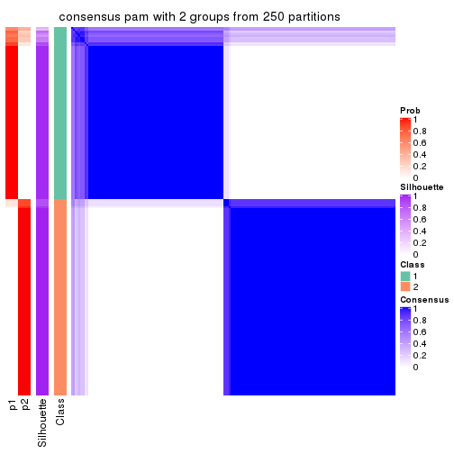</p>

</div>
<div id='tab-MAD-pam-consensus-heatmap-2'>
<pre><code class="r">consensus_heatmap(res, k = 3)
</code></pre>

<p></p>

</div>
<div id='tab-MAD-pam-consensus-heatmap-3'>
<pre><code class="r">consensus_heatmap(res, k = 4)
</code></pre>

<p></p>

</div>
<div id='tab-MAD-pam-consensus-heatmap-4'>
<pre><code class="r">consensus_heatmap(res, k = 5)
</code></pre>

<p></p>

</div>
<div id='tab-MAD-pam-consensus-heatmap-5'>
<pre><code class="r">consensus_heatmap(res, k = 6)
</code></pre>

<p></p>

</div>
</div>

Heatmaps for the membership of samples in all partitions to see how consistent they are:


<script>
$( function() {
	$( '#tabs-MAD-pam-membership-heatmap' ).tabs();
} );
</script>
<div id='tabs-MAD-pam-membership-heatmap'>
<ul>
<li><a href='#tab-MAD-pam-membership-heatmap-1'>k = 2</a></li>
<li><a href='#tab-MAD-pam-membership-heatmap-2'>k = 3</a></li>
<li><a href='#tab-MAD-pam-membership-heatmap-3'>k = 4</a></li>
<li><a href='#tab-MAD-pam-membership-heatmap-4'>k = 5</a></li>
<li><a href='#tab-MAD-pam-membership-heatmap-5'>k = 6</a></li>
</ul>
<div id='tab-MAD-pam-membership-heatmap-1'>
<pre><code class="r">membership_heatmap(res, k = 2)
</code></pre>

<p></p>

</div>
<div id='tab-MAD-pam-membership-heatmap-2'>
<pre><code class="r">membership_heatmap(res, k = 3)
</code></pre>

<p></p>

</div>
<div id='tab-MAD-pam-membership-heatmap-3'>
<pre><code class="r">membership_heatmap(res, k = 4)
</code></pre>

<p></p>

</div>
<div id='tab-MAD-pam-membership-heatmap-4'>
<pre><code class="r">membership_heatmap(res, k = 5)
</code></pre>

<p></p>

</div>
<div id='tab-MAD-pam-membership-heatmap-5'>
<pre><code class="r">membership_heatmap(res, k = 6)
</code></pre>

<p></p>

</div>
</div>

As soon as we have had the classes for columns, we can look for signatures
which are significantly different between classes which can be candidate marks
for certain classes. Following are the heatmaps for signatures.


Signature heatmaps where rows are scaled:


<script>
$( function() {
	$( '#tabs-MAD-pam-get-signatures' ).tabs();
} );
</script>
<div id='tabs-MAD-pam-get-signatures'>
<ul>
<li><a href='#tab-MAD-pam-get-signatures-1'>k = 2</a></li>
<li><a href='#tab-MAD-pam-get-signatures-2'>k = 3</a></li>
<li><a href='#tab-MAD-pam-get-signatures-3'>k = 4</a></li>
<li><a href='#tab-MAD-pam-get-signatures-4'>k = 5</a></li>
<li><a href='#tab-MAD-pam-get-signatures-5'>k = 6</a></li>
</ul>
<div id='tab-MAD-pam-get-signatures-1'>
<pre><code class="r">get_signatures(res, k = 2)
</code></pre>

<p></p>

</div>
<div id='tab-MAD-pam-get-signatures-2'>
<pre><code class="r">get_signatures(res, k = 3)
</code></pre>

<p></p>

</div>
<div id='tab-MAD-pam-get-signatures-3'>
<pre><code class="r">get_signatures(res, k = 4)
</code></pre>

<p></p>

</div>
<div id='tab-MAD-pam-get-signatures-4'>
<pre><code class="r">get_signatures(res, k = 5)
</code></pre>

<p></p>

</div>
<div id='tab-MAD-pam-get-signatures-5'>
<pre><code class="r">get_signatures(res, k = 6)
</code></pre>

<p></p>

</div>
</div>


Signature heatmaps where rows are not scaled:


<script>
$( function() {
	$( '#tabs-MAD-pam-get-signatures-no-scale' ).tabs();
} );
</script>
<div id='tabs-MAD-pam-get-signatures-no-scale'>
<ul>
<li><a href='#tab-MAD-pam-get-signatures-no-scale-1'>k = 2</a></li>
<li><a href='#tab-MAD-pam-get-signatures-no-scale-2'>k = 3</a></li>
<li><a href='#tab-MAD-pam-get-signatures-no-scale-3'>k = 4</a></li>
<li><a href='#tab-MAD-pam-get-signatures-no-scale-4'>k = 5</a></li>
<li><a href='#tab-MAD-pam-get-signatures-no-scale-5'>k = 6</a></li>
</ul>
<div id='tab-MAD-pam-get-signatures-no-scale-1'>
<pre><code class="r">get_signatures(res, k = 2, scale_rows = FALSE)
</code></pre>

<p></p>

</div>
<div id='tab-MAD-pam-get-signatures-no-scale-2'>
<pre><code class="r">get_signatures(res, k = 3, scale_rows = FALSE)
</code></pre>

<p></p>

</div>
<div id='tab-MAD-pam-get-signatures-no-scale-3'>
<pre><code class="r">get_signatures(res, k = 4, scale_rows = FALSE)
</code></pre>

<p></p>

</div>
<div id='tab-MAD-pam-get-signatures-no-scale-4'>
<pre><code class="r">get_signatures(res, k = 5, scale_rows = FALSE)
</code></pre>

<p></p>

</div>
<div id='tab-MAD-pam-get-signatures-no-scale-5'>
<pre><code class="r">get_signatures(res, k = 6, scale_rows = FALSE)
</code></pre>

<p></p>

</div>
</div>


Compare the overlap of signatures from different k:

```r
compare_signatures(res)
```


`get_signature()` returns a data frame invisibly. TO get the list of signatures, the function
call should be assigned to a variable explicitly. In following code, if `plot` argument is set
to `FALSE`, no heatmap is plotted while only the differential analysis is performed.

```r
# code only for demonstration
tb = get_signature(res, k = ..., plot = FALSE)
```

An example of the output of `tb` is:

```
#>   which_row         fdr    mean_1    mean_2 scaled_mean_1 scaled_mean_2 km
#> 1        38 0.042760348  8.373488  9.131774    -0.5533452     0.5164555  1
#> 2        40 0.018707592  7.106213  8.469186    -0.6173731     0.5762149  1
#> 3        55 0.019134737 10.221463 11.207825    -0.6159697     0.5749050  1
#> 4        59 0.006059896  5.921854  7.869574    -0.6899429     0.6439467  1
#> 5        60 0.018055526  8.928898 10.211722    -0.6204761     0.5791110  1
#> 6        98 0.009384629 15.714769 14.887706     0.6635654    -0.6193277  2
...
```

The columns in `tb` are:

1. `which_row`: row indices corresponding to the input matrix.
2. `fdr`: FDR for the differential test. 
3. `mean_x`: The mean value in group x.
4. `scaled_mean_x`: The mean value in group x after rows are scaled.
5. `km`: Row groups if k-means clustering is applied to rows.


UMAP plot which shows how samples are separated.


<script>
$( function() {
	$( '#tabs-MAD-pam-dimension-reduction' ).tabs();
} );
</script>
<div id='tabs-MAD-pam-dimension-reduction'>
<ul>
<li><a href='#tab-MAD-pam-dimension-reduction-1'>k = 2</a></li>
<li><a href='#tab-MAD-pam-dimension-reduction-2'>k = 3</a></li>
<li><a href='#tab-MAD-pam-dimension-reduction-3'>k = 4</a></li>
<li><a href='#tab-MAD-pam-dimension-reduction-4'>k = 5</a></li>
<li><a href='#tab-MAD-pam-dimension-reduction-5'>k = 6</a></li>
</ul>
<div id='tab-MAD-pam-dimension-reduction-1'>
<pre><code class="r">dimension_reduction(res, k = 2, method = &quot;UMAP&quot;)
</code></pre>

<p></p>

</div>
<div id='tab-MAD-pam-dimension-reduction-2'>
<pre><code class="r">dimension_reduction(res, k = 3, method = &quot;UMAP&quot;)
</code></pre>

<p></p>

</div>
<div id='tab-MAD-pam-dimension-reduction-3'>
<pre><code class="r">dimension_reduction(res, k = 4, method = &quot;UMAP&quot;)
</code></pre>

<p></p>

</div>
<div id='tab-MAD-pam-dimension-reduction-4'>
<pre><code class="r">dimension_reduction(res, k = 5, method = &quot;UMAP&quot;)
</code></pre>

<p></p>

</div>
<div id='tab-MAD-pam-dimension-reduction-5'>
<pre><code class="r">dimension_reduction(res, k = 6, method = &quot;UMAP&quot;)
</code></pre>

<p></p>

</div>
</div>


Following heatmap shows how subgroups are split when increasing `k`:

```r
collect_classes(res)
```


If matrix rows can be associated to genes, consider to use `GO_Enrichment(res,
...)` to perform function enrichment for the signature genes.


 

---------------------------------------------------


### MAD:mclust**


The object with results only for a single top-value method and a single partition method 
can be extracted as:

```r
res = res_list["MAD", "mclust"]
# you can also extract it by
# res = res_list["MAD:mclust"]
```

A summary of `res` and all the functions that can be applied to it:

```r
res
```

```
#> A 'ConsensusPartition' object with k = 2, 3, 4, 5, 6.
#>   On a matrix with 17680 rows and 218 columns.
#>   Top rows (1000, 2000, 3000, 4000, 5000) are extracted by 'MAD' method.
#>   Subgroups are detected by 'mclust' method.
#>   Performed in total 1250 partitions by row resampling.
#>   Best k for subgroups seems to be 2.
#> 
#> Following methods can be applied to this 'ConsensusPartition' object:
#>  [1] "cola_report"             "collect_classes"         "collect_plots"          
#>  [4] "collect_stats"           "colnames"                "compare_signatures"     
#>  [7] "consensus_heatmap"       "dimension_reduction"     "functional_enrichment"  
#> [10] "get_anno_col"            "get_anno"                "get_classes"            
#> [13] "get_consensus"           "get_matrix"              "get_membership"         
#> [16] "get_param"               "get_signatures"          "get_stats"              
#> [19] "is_best_k"               "is_stable_k"             "membership_heatmap"     
#> [22] "ncol"                    "nrow"                    "plot_ecdf"              
#> [25] "rownames"                "select_partition_number" "show"                   
#> [28] "suggest_best_k"          "test_to_known_factors"
```

`collect_plots()` function collects all the plots made from `res` for all `k` (number of partitions)
into one single page to provide an easy and fast comparison between different `k`.

```r
collect_plots(res)
```


The plots are:

- The first row: a plot of the ECDF (Empirical cumulative distribution
  function) curves of the consensus matrix for each `k` and the heatmap of
  predicted classes for each `k`.
- The second row: heatmaps of the consensus matrix for each `k`.
- The third row: heatmaps of the membership matrix for each `k`.
- The fouth row: heatmaps of the signatures for each `k`.

All the plots in panels can be made by individual functions and they are
plotted later in this section.

`select_partition_number()` produces several plots showing different
statistics for choosing "optimized" `k`. There are following statistics:

- ECDF curves of the consensus matrix for each `k`;
- 1-PAC. [The PAC
  score](https://en.wikipedia.org/wiki/Consensus_clustering#Over-interpretation_potential_of_consensus_clustering)
  measures the proportion of the ambiguous subgrouping.
- Mean silhouette score.
- Concordance. The mean probability of fiting the consensus class ids in all
  partitions.
- Area increased. Denote $A_k$ as the area under the ECDF curve for current
  `k`, the area increased is defined as $A_k - A_{k-1}$.
- Rand index. The percent of pairs of samples that are both in a same cluster
  or both are not in a same cluster in the partition of k and k-1.
- Jaccard index. The ratio of pairs of samples are both in a same cluster in
  the partition of k and k-1 and the pairs of samples are both in a same
  cluster in the partition k or k-1.

The detailed explanations of these statistics can be found in [the cola
vignette](http://bioconductor.org/packages/devel/bioc/vignettes/cola/inst/doc/cola.html#toc_13).

Generally speaking, lower PAC score, higher mean silhouette score or higher
concordance corresponds to better partition. Rand index and Jaccard index
measure how similar the current partition is compared to partition with `k-1`.
If they are too similar, we won't accept `k` is better than `k-1`.

```r
select_partition_number(res)
```


The numeric values for all these statistics can be obtained by `get_stats()`.

```r
get_stats(res)
```

```
#>   k 1-PAC mean_silhouette concordance area_increased  Rand Jaccard
#> 2 2 0.971           0.949       0.975         0.4743 0.520   0.520
#> 3 3 0.581           0.677       0.793         0.3327 0.837   0.689
#> 4 4 0.554           0.566       0.774         0.1500 0.815   0.545
#> 5 5 0.556           0.461       0.653         0.0616 0.884   0.606
#> 6 6 0.605           0.463       0.659         0.0315 0.870   0.514
```

`suggest_best_k()` suggests the best $k$ based on these statistics. The rules are as follows:

- All $k$ with Jaccard index larger than 0.95 are removed because the increase of
  the partition number does not provides enough extra information. If all $k$ are removed,
  the best $k$ is assigned by `NA`.
- For $k$ with 1-PAC larger than 0.9, the maximal $k$ is taken as the "best k". Other $k$ is called "optional k".
- If it does not fit the second rule. The $k$ with the highest vote of highest
  1-PAC, mean silhouette and concordance is taken as the "best k".

```r
suggest_best_k(res)
```

```
#> [1] 2
```


Following shows the table of the partitions (You need to click the **show/hide
code output** link to see it). The membership matrix (columns with name `p*`)
is inferred by
[`clue::cl_consensus()`](https://www.rdocumentation.org/link/cl_consensus?package=clue)
function with the `SE` method. Basically the value in the membership matrix
represents the probability to belong to a certain group. The finall class
label for an item is determined with the group with highest probability it
belongs to.

In `get_classes()` function, the entropy is calculated from the membership
matrix and the silhouette score is calculated from the consensus matrix.


<script>
$( function() {
	$( '#tabs-MAD-mclust-get-classes' ).tabs();
} );
</script>
<div id='tabs-MAD-mclust-get-classes'>
<ul>
<li><a href='#tab-MAD-mclust-get-classes-1'>k = 2</a></li>
<li><a href='#tab-MAD-mclust-get-classes-2'>k = 3</a></li>
<li><a href='#tab-MAD-mclust-get-classes-3'>k = 4</a></li>
<li><a href='#tab-MAD-mclust-get-classes-4'>k = 5</a></li>
<li><a href='#tab-MAD-mclust-get-classes-5'>k = 6</a></li>
</ul>

<div id='tab-MAD-mclust-get-classes-1'>
<p><a id='tab-MAD-mclust-get-classes-1-a' style='color:#0366d6' href='#'>show/hide code output</a></p>
<pre><code class="r">cbind(get_classes(res, k = 2), get_membership(res, k = 2))
</code></pre>

<pre><code>#&gt;            class entropy silhouette    p1    p2
#&gt; SRR1498997     2  0.0000      0.981 0.000 1.000
#&gt; SRR1076441     1  0.1633      0.966 0.976 0.024
#&gt; SRR1489803     2  0.0000      0.981 0.000 1.000
#&gt; SRR1345953     2  0.0000      0.981 0.000 1.000
#&gt; SRR1357826     2  0.0000      0.981 0.000 1.000
#&gt; SRR1419656     1  0.2236      0.966 0.964 0.036
#&gt; SRR1454158     2  0.0000      0.981 0.000 1.000
#&gt; SRR1475408     2  0.0000      0.981 0.000 1.000
#&gt; SRR1472704     2  0.0000      0.981 0.000 1.000
#&gt; SRR1090046     2  0.9608      0.347 0.384 0.616
#&gt; SRR1312822     1  0.0000      0.962 1.000 0.000
#&gt; SRR1096987     2  0.0000      0.981 0.000 1.000
#&gt; SRR1334587     2  0.0000      0.981 0.000 1.000
#&gt; SRR1490246     1  0.0000      0.962 1.000 0.000
#&gt; SRR1467522     1  0.2043      0.967 0.968 0.032
#&gt; SRR1324206     1  0.1843      0.967 0.972 0.028
#&gt; SRR1408574     2  0.0000      0.981 0.000 1.000
#&gt; SRR1083959     2  0.0000      0.981 0.000 1.000
#&gt; SRR1079948     2  0.0000      0.981 0.000 1.000
#&gt; SRR1310667     2  0.0000      0.981 0.000 1.000
#&gt; SRR655852      2  0.0000      0.981 0.000 1.000
#&gt; SRR1352457     2  0.0000      0.981 0.000 1.000
#&gt; SRR1353994     2  0.0000      0.981 0.000 1.000
#&gt; SRR1459561     2  0.0000      0.981 0.000 1.000
#&gt; SRR1454009     1  0.2236      0.966 0.964 0.036
#&gt; SRR1071084     1  0.2236      0.966 0.964 0.036
#&gt; SRR1082859     2  0.0000      0.981 0.000 1.000
#&gt; SRR1086538     1  0.2043      0.967 0.968 0.032
#&gt; SRR1486262     2  0.0000      0.981 0.000 1.000
#&gt; SRR658105      1  0.0000      0.962 1.000 0.000
#&gt; SRR811073      2  0.0000      0.981 0.000 1.000
#&gt; SRR1429181     2  0.0000      0.981 0.000 1.000
#&gt; SRR1327896     2  0.0000      0.981 0.000 1.000
#&gt; SRR1464788     2  0.0000      0.981 0.000 1.000
#&gt; SRR1346861     2  0.0000      0.981 0.000 1.000
#&gt; SRR1318774     2  0.0000      0.981 0.000 1.000
#&gt; SRR1420517     1  0.7815      0.735 0.768 0.232
#&gt; SRR1369584     2  0.0000      0.981 0.000 1.000
#&gt; SRR1443244     2  0.0376      0.978 0.004 0.996
#&gt; SRR1455391     1  0.2236      0.966 0.964 0.036
#&gt; SRR1068999     1  0.2043      0.967 0.968 0.032
#&gt; SRR1481297     1  0.2236      0.966 0.964 0.036
#&gt; SRR1070208     1  0.6623      0.823 0.828 0.172
#&gt; SRR1317282     1  0.2236      0.966 0.964 0.036
#&gt; SRR1096125     2  0.0000      0.981 0.000 1.000
#&gt; SRR1472506     2  0.0672      0.974 0.008 0.992
#&gt; SRR1388281     2  0.0000      0.981 0.000 1.000
#&gt; SRR1365622     2  0.0000      0.981 0.000 1.000
#&gt; SRR662306      1  0.2236      0.966 0.964 0.036
#&gt; SRR662811      1  0.0000      0.962 1.000 0.000
#&gt; SRR820571      2  0.0376      0.978 0.004 0.996
#&gt; SRR1357166     1  0.2236      0.966 0.964 0.036
#&gt; SRR1488586     2  0.0672      0.974 0.008 0.992
#&gt; SRR1485398     1  0.0000      0.962 1.000 0.000
#&gt; SRR1417725     2  0.0000      0.981 0.000 1.000
#&gt; SRR1409397     2  0.0000      0.981 0.000 1.000
#&gt; SRR1465693     2  0.0000      0.981 0.000 1.000
#&gt; SRR1096547     2  0.6531      0.783 0.168 0.832
#&gt; SRR1456818     2  0.9833      0.227 0.424 0.576
#&gt; SRR816336      2  0.9933      0.130 0.452 0.548
#&gt; SRR1420238     1  0.0000      0.962 1.000 0.000
#&gt; SRR1433374     1  0.2236      0.966 0.964 0.036
#&gt; SRR1436990     1  0.0000      0.962 1.000 0.000
#&gt; SRR662378      1  0.1843      0.967 0.972 0.028
#&gt; SRR1477671     1  0.0000      0.962 1.000 0.000
#&gt; SRR1084079     2  0.0376      0.978 0.004 0.996
#&gt; SRR1102949     1  0.0000      0.962 1.000 0.000
#&gt; SRR1458090     1  0.0000      0.962 1.000 0.000
#&gt; SRR1418729     2  0.0000      0.981 0.000 1.000
#&gt; SRR1403814     2  0.0000      0.981 0.000 1.000
#&gt; SRR1404887     2  0.0376      0.978 0.004 0.996
#&gt; SRR1434955     1  0.0000      0.962 1.000 0.000
#&gt; SRR1360652     1  0.6623      0.823 0.828 0.172
#&gt; SRR1356765     2  0.0000      0.981 0.000 1.000
#&gt; SRR1078258     2  0.0000      0.981 0.000 1.000
#&gt; SRR1455861     1  0.1633      0.966 0.976 0.024
#&gt; SRR1420296     2  0.0000      0.981 0.000 1.000
#&gt; SRR1070260     2  0.0000      0.981 0.000 1.000
#&gt; SRR1410765     1  0.0000      0.962 1.000 0.000
#&gt; SRR1481315     2  0.9661      0.325 0.392 0.608
#&gt; SRR1414661     2  0.0000      0.981 0.000 1.000
#&gt; SRR1359147     2  0.0000      0.981 0.000 1.000
#&gt; SRR1488694     2  0.0376      0.978 0.004 0.996
#&gt; SRR1477273     1  0.2236      0.966 0.964 0.036
#&gt; SRR1415792     1  0.8909      0.597 0.692 0.308
#&gt; SRR1369088     2  0.0000      0.981 0.000 1.000
#&gt; SRR1406621     2  0.0000      0.981 0.000 1.000
#&gt; SRR1401017     2  0.0000      0.981 0.000 1.000
#&gt; SRR1099981     2  0.0000      0.981 0.000 1.000
#&gt; SRR815208      2  0.0000      0.981 0.000 1.000
#&gt; SRR1380460     2  0.0000      0.981 0.000 1.000
#&gt; SRR1091097     2  0.0000      0.981 0.000 1.000
#&gt; SRR1456010     1  0.2236      0.966 0.964 0.036
#&gt; SRR1498416     2  0.0000      0.981 0.000 1.000
#&gt; SRR818873      2  0.0000      0.981 0.000 1.000
#&gt; SRR813868      2  0.0000      0.981 0.000 1.000
#&gt; SRR1394912     1  0.0000      0.962 1.000 0.000
#&gt; SRR1475824     2  0.0000      0.981 0.000 1.000
#&gt; SRR1459866     1  0.0000      0.962 1.000 0.000
#&gt; SRR1364871     2  0.0376      0.978 0.004 0.996
#&gt; SRR1100472     2  0.0000      0.981 0.000 1.000
#&gt; SRR1331267     2  0.6247      0.800 0.156 0.844
#&gt; SRR1068977     2  0.0000      0.981 0.000 1.000
#&gt; SRR1391511     2  0.0000      0.981 0.000 1.000
#&gt; SRR1077920     2  0.0000      0.981 0.000 1.000
#&gt; SRR1457705     1  0.2043      0.967 0.968 0.032
#&gt; SRR1437073     1  0.0000      0.962 1.000 0.000
#&gt; SRR1473124     1  0.2236      0.966 0.964 0.036
#&gt; SRR1469279     1  0.2236      0.966 0.964 0.036
#&gt; SRR1091791     2  0.0000      0.981 0.000 1.000
#&gt; SRR1341539     2  0.0000      0.981 0.000 1.000
#&gt; SRR1446354     1  0.2236      0.966 0.964 0.036
#&gt; SRR1415420     1  0.0000      0.962 1.000 0.000
#&gt; SRR1368050     1  0.0000      0.962 1.000 0.000
#&gt; SRR656970      2  0.0000      0.981 0.000 1.000
#&gt; SRR1473403     2  0.0000      0.981 0.000 1.000
#&gt; SRR1084674     1  0.6887      0.807 0.816 0.184
#&gt; SRR1464702     1  0.2043      0.967 0.968 0.032
#&gt; SRR1074860     2  0.0000      0.981 0.000 1.000
#&gt; SRR655447      2  0.0000      0.981 0.000 1.000
#&gt; SRR1404442     2  0.0000      0.981 0.000 1.000
#&gt; SRR1418795     1  0.0000      0.962 1.000 0.000
#&gt; SRR1458335     2  0.0000      0.981 0.000 1.000
#&gt; SRR1489589     2  0.0000      0.981 0.000 1.000
#&gt; SRR1378284     2  0.8955      0.525 0.312 0.688
#&gt; SRR1408014     2  0.0000      0.981 0.000 1.000
#&gt; SRR1083052     1  0.2043      0.967 0.968 0.032
#&gt; SRR1339236     2  0.0000      0.981 0.000 1.000
#&gt; SRR1323829     2  0.0000      0.981 0.000 1.000
#&gt; SRR1086772     2  0.0000      0.981 0.000 1.000
#&gt; SRR1486457     1  0.9522      0.453 0.628 0.372
#&gt; SRR1415257     2  0.0000      0.981 0.000 1.000
#&gt; SRR1071905     1  0.2236      0.966 0.964 0.036
#&gt; SRR659223      2  0.0000      0.981 0.000 1.000
#&gt; SRR1386945     1  0.2236      0.966 0.964 0.036
#&gt; SRR821498      2  0.0000      0.981 0.000 1.000
#&gt; SRR1378903     2  0.0000      0.981 0.000 1.000
#&gt; SRR1472907     1  0.2236      0.966 0.964 0.036
#&gt; SRR1442313     2  0.0000      0.981 0.000 1.000
#&gt; SRR1077139     2  0.0000      0.981 0.000 1.000
#&gt; SRR1342758     1  0.0000      0.962 1.000 0.000
#&gt; SRR656911      2  0.0000      0.981 0.000 1.000
#&gt; SRR1070738     1  0.0672      0.964 0.992 0.008
#&gt; SRR1476950     1  0.3733      0.935 0.928 0.072
#&gt; SRR1488196     1  0.2236      0.966 0.964 0.036
#&gt; SRR1498951     1  0.2236      0.966 0.964 0.036
#&gt; SRR1413392     1  0.0000      0.962 1.000 0.000
#&gt; SRR657528      2  0.0000      0.981 0.000 1.000
#&gt; SRR812198      1  0.0000      0.962 1.000 0.000
#&gt; SRR660283      2  0.0000      0.981 0.000 1.000
#&gt; SRR1420936     1  0.0000      0.962 1.000 0.000
#&gt; SRR1469547     2  0.0000      0.981 0.000 1.000
#&gt; SRR1322249     1  0.6887      0.807 0.816 0.184
#&gt; SRR1396682     1  0.0000      0.962 1.000 0.000
#&gt; SRR1095816     2  0.0000      0.981 0.000 1.000
#&gt; SRR1081023     1  0.0000      0.962 1.000 0.000
#&gt; SRR1092517     2  0.0000      0.981 0.000 1.000
#&gt; SRR811285      2  0.0000      0.981 0.000 1.000
#&gt; SRR657018      1  0.0000      0.962 1.000 0.000
#&gt; SRR1365534     1  0.2236      0.966 0.964 0.036
#&gt; SRR1090791     2  0.0000      0.981 0.000 1.000
#&gt; SRR1439915     2  0.0000      0.981 0.000 1.000
#&gt; SRR1391575     2  0.0000      0.981 0.000 1.000
#&gt; SRR1314092     2  0.0000      0.981 0.000 1.000
#&gt; SRR1328941     1  0.2236      0.966 0.964 0.036
#&gt; SRR1336181     2  0.0000      0.981 0.000 1.000
#&gt; SRR1362972     1  0.2043      0.967 0.968 0.032
#&gt; SRR1366790     2  0.0000      0.981 0.000 1.000
#&gt; SRR1455902     1  0.2236      0.966 0.964 0.036
#&gt; SRR1437644     2  0.0376      0.978 0.004 0.996
#&gt; SRR1105009     2  0.0000      0.981 0.000 1.000
#&gt; SRR1367024     1  0.2236      0.966 0.964 0.036
#&gt; SRR660248      2  0.0000      0.981 0.000 1.000
#&gt; SRR1409620     1  0.0000      0.962 1.000 0.000
#&gt; SRR1455807     2  0.0000      0.981 0.000 1.000
#&gt; SRR1339431     1  0.1843      0.967 0.972 0.028
#&gt; SRR1378948     2  0.0376      0.978 0.004 0.996
#&gt; SRR1469237     1  0.0000      0.962 1.000 0.000
#&gt; SRR1098264     2  0.0000      0.981 0.000 1.000
#&gt; SRR1406224     2  0.0000      0.981 0.000 1.000
#&gt; SRR1393026     1  0.2236      0.966 0.964 0.036
#&gt; SRR808428      2  0.0000      0.981 0.000 1.000
#&gt; SRR615910      2  0.0000      0.981 0.000 1.000
#&gt; SRR1076219     1  0.1843      0.967 0.972 0.028
#&gt; SRR1481128     1  0.0000      0.962 1.000 0.000
#&gt; SRR1359262     2  0.0000      0.981 0.000 1.000
#&gt; SRR1407648     2  0.0000      0.981 0.000 1.000
#&gt; SRR1386775     2  0.0376      0.978 0.004 0.996
#&gt; SRR1388399     2  0.0376      0.978 0.004 0.996
#&gt; SRR1361499     2  0.0000      0.981 0.000 1.000
#&gt; SRR1500709     2  0.0000      0.981 0.000 1.000
#&gt; SRR1335917     1  0.0000      0.962 1.000 0.000
#&gt; SRR1430615     2  0.0000      0.981 0.000 1.000
#&gt; SRR1335212     1  0.2043      0.967 0.968 0.032
#&gt; SRR1400159     2  0.0000      0.981 0.000 1.000
#&gt; SRR1457245     2  0.0000      0.981 0.000 1.000
#&gt; SRR1356746     2  0.0000      0.981 0.000 1.000
#&gt; SRR658319      2  0.0000      0.981 0.000 1.000
#&gt; SRR1435946     1  0.0000      0.962 1.000 0.000
#&gt; SRR1370308     1  0.2043      0.967 0.968 0.032
#&gt; SRR1100893     1  0.0000      0.962 1.000 0.000
#&gt; SRR1389432     1  0.2236      0.966 0.964 0.036
#&gt; SRR1381799     2  0.0000      0.981 0.000 1.000
#&gt; SRR1310158     1  0.2236      0.966 0.964 0.036
#&gt; SRR1341100     2  0.0000      0.981 0.000 1.000
#&gt; SRR1342873     1  0.1843      0.967 0.972 0.028
#&gt; SRR1472102     2  0.0000      0.981 0.000 1.000
#&gt; SRR1409421     1  0.2043      0.967 0.968 0.032
#&gt; SRR1328577     2  0.0000      0.981 0.000 1.000
#&gt; SRR808942      2  0.0000      0.981 0.000 1.000
#&gt; SRR1343818     2  0.0000      0.981 0.000 1.000
#&gt; SRR1472415     2  0.0000      0.981 0.000 1.000
#&gt; SRR658409      2  0.0000      0.981 0.000 1.000
#&gt; SRR1469681     1  0.0000      0.962 1.000 0.000
#&gt; SRR1075484     2  0.0000      0.981 0.000 1.000
#&gt; SRR1417894     1  0.2236      0.966 0.964 0.036
#&gt; SRR1417422     2  0.0000      0.981 0.000 1.000
#&gt; SRR1090674     1  0.0000      0.962 1.000 0.000
</code></pre>

<script>
$('#tab-MAD-mclust-get-classes-1-a').parent().next().next().hide();
$('#tab-MAD-mclust-get-classes-1-a').click(function(){
  $('#tab-MAD-mclust-get-classes-1-a').parent().next().next().toggle();
  return(false);
});
</script>
</div>

<div id='tab-MAD-mclust-get-classes-2'>
<p><a id='tab-MAD-mclust-get-classes-2-a' style='color:#0366d6' href='#'>show/hide code output</a></p>
<pre><code class="r">cbind(get_classes(res, k = 3), get_membership(res, k = 3))
</code></pre>

<pre><code>#&gt;            class entropy silhouette    p1    p2    p3
#&gt; SRR1498997     3  0.5678    0.83053 0.000 0.316 0.684
#&gt; SRR1076441     1  0.3412    0.88246 0.876 0.000 0.124
#&gt; SRR1489803     2  0.6309   -0.20417 0.000 0.504 0.496
#&gt; SRR1345953     2  0.0237    0.70269 0.000 0.996 0.004
#&gt; SRR1357826     2  0.6180    0.08652 0.000 0.584 0.416
#&gt; SRR1419656     1  0.0424    0.87838 0.992 0.000 0.008
#&gt; SRR1454158     3  0.6154    0.77085 0.000 0.408 0.592
#&gt; SRR1475408     3  0.6869    0.82895 0.048 0.264 0.688
#&gt; SRR1472704     2  0.6095    0.19291 0.000 0.608 0.392
#&gt; SRR1090046     1  0.8000    0.11727 0.528 0.408 0.064
#&gt; SRR1312822     1  0.5138    0.86825 0.748 0.000 0.252
#&gt; SRR1096987     2  0.0237    0.70260 0.000 0.996 0.004
#&gt; SRR1334587     2  0.1753    0.69336 0.000 0.952 0.048
#&gt; SRR1490246     1  0.5058    0.87003 0.756 0.000 0.244
#&gt; SRR1467522     1  0.2261    0.88427 0.932 0.000 0.068
#&gt; SRR1324206     1  0.2959    0.88339 0.900 0.000 0.100
#&gt; SRR1408574     2  0.2165    0.68328 0.000 0.936 0.064
#&gt; SRR1083959     2  0.6026    0.23678 0.000 0.624 0.376
#&gt; SRR1079948     2  0.0237    0.70274 0.000 0.996 0.004
#&gt; SRR1310667     3  0.5327    0.83782 0.000 0.272 0.728
#&gt; SRR655852      2  0.1289    0.69829 0.000 0.968 0.032
#&gt; SRR1352457     2  0.3816    0.63739 0.000 0.852 0.148
#&gt; SRR1353994     2  0.0424    0.70273 0.000 0.992 0.008
#&gt; SRR1459561     2  0.6215    0.10722 0.000 0.572 0.428
#&gt; SRR1454009     1  0.0237    0.87987 0.996 0.000 0.004
#&gt; SRR1071084     1  0.0237    0.87987 0.996 0.000 0.004
#&gt; SRR1082859     3  0.5621    0.83490 0.000 0.308 0.692
#&gt; SRR1086538     1  0.1860    0.88379 0.948 0.000 0.052
#&gt; SRR1486262     2  0.0000    0.70282 0.000 1.000 0.000
#&gt; SRR658105      1  0.5138    0.86825 0.748 0.000 0.252
#&gt; SRR811073      2  0.4974    0.48727 0.000 0.764 0.236
#&gt; SRR1429181     2  0.2537    0.68396 0.000 0.920 0.080
#&gt; SRR1327896     2  0.0592    0.70098 0.000 0.988 0.012
#&gt; SRR1464788     2  0.1643    0.69195 0.000 0.956 0.044
#&gt; SRR1346861     2  0.6079    0.19410 0.000 0.612 0.388
#&gt; SRR1318774     2  0.1753    0.69445 0.000 0.952 0.048
#&gt; SRR1420517     1  0.8700    0.17280 0.536 0.120 0.344
#&gt; SRR1369584     2  0.6045    0.27338 0.000 0.620 0.380
#&gt; SRR1443244     2  0.2492    0.66323 0.048 0.936 0.016
#&gt; SRR1455391     1  0.0592    0.88113 0.988 0.000 0.012
#&gt; SRR1068999     1  0.2537    0.88479 0.920 0.000 0.080
#&gt; SRR1481297     1  0.0424    0.87838 0.992 0.000 0.008
#&gt; SRR1070208     1  0.3499    0.81962 0.900 0.072 0.028
#&gt; SRR1317282     1  0.0237    0.87987 0.996 0.000 0.004
#&gt; SRR1096125     2  0.0237    0.70274 0.000 0.996 0.004
#&gt; SRR1472506     2  0.6565    0.35119 0.048 0.720 0.232
#&gt; SRR1388281     2  0.1163    0.70202 0.000 0.972 0.028
#&gt; SRR1365622     2  0.1643    0.69060 0.000 0.956 0.044
#&gt; SRR662306      1  0.0237    0.87987 0.996 0.000 0.004
#&gt; SRR662811      1  0.5138    0.86825 0.748 0.000 0.252
#&gt; SRR820571      2  0.7660   -0.23617 0.048 0.548 0.404
#&gt; SRR1357166     1  0.0237    0.87987 0.996 0.000 0.004
#&gt; SRR1488586     2  0.3369    0.65044 0.052 0.908 0.040
#&gt; SRR1485398     1  0.5138    0.86825 0.748 0.000 0.252
#&gt; SRR1417725     3  0.6685    0.82273 0.048 0.244 0.708
#&gt; SRR1409397     3  0.5431    0.85026 0.000 0.284 0.716
#&gt; SRR1465693     3  0.5465    0.85525 0.000 0.288 0.712
#&gt; SRR1096547     3  0.7559    0.74757 0.056 0.336 0.608
#&gt; SRR1456818     2  0.7674    0.00373 0.476 0.480 0.044
#&gt; SRR816336      3  0.8464    0.63238 0.132 0.272 0.596
#&gt; SRR1420238     1  0.5098    0.86924 0.752 0.000 0.248
#&gt; SRR1433374     1  0.0237    0.87987 0.996 0.000 0.004
#&gt; SRR1436990     1  0.5138    0.86825 0.748 0.000 0.252
#&gt; SRR662378      1  0.2878    0.88358 0.904 0.000 0.096
#&gt; SRR1477671     1  0.5098    0.86925 0.752 0.000 0.248
#&gt; SRR1084079     2  0.2492    0.66323 0.048 0.936 0.016
#&gt; SRR1102949     1  0.5138    0.86825 0.748 0.000 0.252
#&gt; SRR1458090     1  0.5138    0.86825 0.748 0.000 0.252
#&gt; SRR1418729     3  0.7690    0.65165 0.048 0.416 0.536
#&gt; SRR1403814     2  0.0424    0.70213 0.000 0.992 0.008
#&gt; SRR1404887     2  0.2492    0.66323 0.048 0.936 0.016
#&gt; SRR1434955     1  0.5138    0.86825 0.748 0.000 0.252
#&gt; SRR1360652     1  0.6091    0.81904 0.784 0.092 0.124
#&gt; SRR1356765     2  0.5327    0.33439 0.000 0.728 0.272
#&gt; SRR1078258     2  0.4235    0.57515 0.000 0.824 0.176
#&gt; SRR1455861     1  0.3879    0.88156 0.848 0.000 0.152
#&gt; SRR1420296     3  0.5591    0.85959 0.000 0.304 0.696
#&gt; SRR1070260     2  0.5948    0.28264 0.000 0.640 0.360
#&gt; SRR1410765     1  0.5016    0.87062 0.760 0.000 0.240
#&gt; SRR1481315     2  0.6754    0.14806 0.432 0.556 0.012
#&gt; SRR1414661     2  0.4750    0.52071 0.000 0.784 0.216
#&gt; SRR1359147     2  0.0424    0.70261 0.000 0.992 0.008
#&gt; SRR1488694     2  0.2446    0.66018 0.052 0.936 0.012
#&gt; SRR1477273     1  0.0237    0.87987 0.996 0.000 0.004
#&gt; SRR1415792     1  0.6000    0.65021 0.760 0.200 0.040
#&gt; SRR1369088     2  0.3879    0.63738 0.000 0.848 0.152
#&gt; SRR1406621     2  0.1643    0.69060 0.000 0.956 0.044
#&gt; SRR1401017     3  0.5785    0.84771 0.000 0.332 0.668
#&gt; SRR1099981     2  0.1411    0.69290 0.000 0.964 0.036
#&gt; SRR815208      2  0.6026    0.23836 0.000 0.624 0.376
#&gt; SRR1380460     2  0.4002    0.60033 0.000 0.840 0.160
#&gt; SRR1091097     2  0.0592    0.70302 0.000 0.988 0.012
#&gt; SRR1456010     1  0.0892    0.87284 0.980 0.000 0.020
#&gt; SRR1498416     2  0.0237    0.70272 0.000 0.996 0.004
#&gt; SRR818873      3  0.5465    0.85617 0.000 0.288 0.712
#&gt; SRR813868      3  0.5733    0.84807 0.000 0.324 0.676
#&gt; SRR1394912     1  0.5138    0.86825 0.748 0.000 0.252
#&gt; SRR1475824     2  0.0424    0.70241 0.000 0.992 0.008
#&gt; SRR1459866     1  0.5098    0.86934 0.752 0.000 0.248
#&gt; SRR1364871     2  0.7517   -0.10751 0.048 0.588 0.364
#&gt; SRR1100472     2  0.2165    0.68227 0.000 0.936 0.064
#&gt; SRR1331267     2  0.3377    0.61405 0.092 0.896 0.012
#&gt; SRR1068977     2  0.1529    0.69150 0.000 0.960 0.040
#&gt; SRR1391511     3  0.5621    0.83545 0.000 0.308 0.692
#&gt; SRR1077920     3  0.5621    0.83545 0.000 0.308 0.692
#&gt; SRR1457705     1  0.0237    0.87987 0.996 0.000 0.004
#&gt; SRR1437073     1  0.5098    0.86915 0.752 0.000 0.248
#&gt; SRR1473124     1  0.0424    0.87841 0.992 0.000 0.008
#&gt; SRR1469279     1  0.0237    0.87987 0.996 0.000 0.004
#&gt; SRR1091791     2  0.0592    0.70098 0.000 0.988 0.012
#&gt; SRR1341539     2  0.6307   -0.51946 0.000 0.512 0.488
#&gt; SRR1446354     1  0.0237    0.87987 0.996 0.000 0.004
#&gt; SRR1415420     1  0.5138    0.86825 0.748 0.000 0.252
#&gt; SRR1368050     1  0.5058    0.86994 0.756 0.000 0.244
#&gt; SRR656970      2  0.6295   -0.09330 0.000 0.528 0.472
#&gt; SRR1473403     2  0.4121    0.58712 0.000 0.832 0.168
#&gt; SRR1084674     1  0.4602    0.77499 0.852 0.108 0.040
#&gt; SRR1464702     1  0.1163    0.88311 0.972 0.000 0.028
#&gt; SRR1074860     2  0.0592    0.70098 0.000 0.988 0.012
#&gt; SRR655447      2  0.0592    0.70282 0.000 0.988 0.012
#&gt; SRR1404442     2  0.5926    0.29265 0.000 0.644 0.356
#&gt; SRR1418795     1  0.5098    0.86925 0.752 0.000 0.248
#&gt; SRR1458335     3  0.5760    0.85724 0.000 0.328 0.672
#&gt; SRR1489589     3  0.5497    0.85600 0.000 0.292 0.708
#&gt; SRR1378284     2  0.5791    0.50190 0.168 0.784 0.048
#&gt; SRR1408014     3  0.5810    0.85098 0.000 0.336 0.664
#&gt; SRR1083052     1  0.2959    0.88400 0.900 0.000 0.100
#&gt; SRR1339236     3  0.7034    0.81353 0.048 0.284 0.668
#&gt; SRR1323829     2  0.6280   -0.04667 0.000 0.540 0.460
#&gt; SRR1086772     2  0.2959    0.65950 0.000 0.900 0.100
#&gt; SRR1486457     1  0.7164    0.50835 0.680 0.256 0.064
#&gt; SRR1415257     2  0.6244   -0.36454 0.000 0.560 0.440
#&gt; SRR1071905     1  0.0237    0.87987 0.996 0.000 0.004
#&gt; SRR659223      2  0.6140    0.20390 0.000 0.596 0.404
#&gt; SRR1386945     1  0.0237    0.87987 0.996 0.000 0.004
#&gt; SRR821498      3  0.7715    0.64987 0.048 0.428 0.524
#&gt; SRR1378903     2  0.0592    0.70098 0.000 0.988 0.012
#&gt; SRR1472907     1  0.5733    0.47967 0.676 0.000 0.324
#&gt; SRR1442313     2  0.5859    0.32155 0.000 0.656 0.344
#&gt; SRR1077139     2  0.6235    0.00123 0.000 0.564 0.436
#&gt; SRR1342758     1  0.5138    0.86825 0.748 0.000 0.252
#&gt; SRR656911      2  0.5560    0.36358 0.000 0.700 0.300
#&gt; SRR1070738     1  0.3941    0.88027 0.844 0.000 0.156
#&gt; SRR1476950     1  0.1647    0.87869 0.960 0.004 0.036
#&gt; SRR1488196     1  0.0237    0.87987 0.996 0.000 0.004
#&gt; SRR1498951     1  0.0237    0.87987 0.996 0.000 0.004
#&gt; SRR1413392     1  0.5138    0.86825 0.748 0.000 0.252
#&gt; SRR657528      3  0.5650    0.85969 0.000 0.312 0.688
#&gt; SRR812198      1  0.4974    0.87141 0.764 0.000 0.236
#&gt; SRR660283      3  0.5882    0.79271 0.000 0.348 0.652
#&gt; SRR1420936     1  0.5138    0.86825 0.748 0.000 0.252
#&gt; SRR1469547     2  0.5621    0.38360 0.000 0.692 0.308
#&gt; SRR1322249     1  0.4708    0.77301 0.844 0.120 0.036
#&gt; SRR1396682     1  0.5138    0.86825 0.748 0.000 0.252
#&gt; SRR1095816     2  0.0592    0.70098 0.000 0.988 0.012
#&gt; SRR1081023     1  0.5138    0.86825 0.748 0.000 0.252
#&gt; SRR1092517     2  0.3192    0.63332 0.000 0.888 0.112
#&gt; SRR811285      2  0.2165    0.69132 0.000 0.936 0.064
#&gt; SRR657018      1  0.5138    0.86825 0.748 0.000 0.252
#&gt; SRR1365534     1  0.0237    0.87987 0.996 0.000 0.004
#&gt; SRR1090791     2  0.6215    0.01628 0.000 0.572 0.428
#&gt; SRR1439915     3  0.5560    0.85998 0.000 0.300 0.700
#&gt; SRR1391575     2  0.0892    0.70199 0.000 0.980 0.020
#&gt; SRR1314092     3  0.6252    0.71706 0.000 0.444 0.556
#&gt; SRR1328941     1  0.0237    0.87987 0.996 0.000 0.004
#&gt; SRR1336181     2  0.5926    0.29265 0.000 0.644 0.356
#&gt; SRR1362972     1  0.1753    0.88464 0.952 0.000 0.048
#&gt; SRR1366790     3  0.5621    0.86160 0.000 0.308 0.692
#&gt; SRR1455902     1  0.0237    0.87987 0.996 0.000 0.004
#&gt; SRR1437644     3  0.7624    0.65767 0.048 0.392 0.560
#&gt; SRR1105009     3  0.5706    0.83958 0.000 0.320 0.680
#&gt; SRR1367024     1  0.0237    0.87987 0.996 0.000 0.004
#&gt; SRR660248      3  0.5529    0.86022 0.000 0.296 0.704
#&gt; SRR1409620     1  0.5138    0.86825 0.748 0.000 0.252
#&gt; SRR1455807     2  0.6079    0.19410 0.000 0.612 0.388
#&gt; SRR1339431     1  0.2448    0.88499 0.924 0.000 0.076
#&gt; SRR1378948     3  0.7462    0.73424 0.048 0.352 0.600
#&gt; SRR1469237     1  0.5138    0.86825 0.748 0.000 0.252
#&gt; SRR1098264     2  0.0237    0.70269 0.000 0.996 0.004
#&gt; SRR1406224     3  0.6225    0.72188 0.000 0.432 0.568
#&gt; SRR1393026     1  0.0237    0.87987 0.996 0.000 0.004
#&gt; SRR808428      2  0.6204   -0.00705 0.000 0.576 0.424
#&gt; SRR615910      3  0.5882    0.83943 0.000 0.348 0.652
#&gt; SRR1076219     1  0.0237    0.88106 0.996 0.000 0.004
#&gt; SRR1481128     1  0.5138    0.86825 0.748 0.000 0.252
#&gt; SRR1359262     2  0.6180    0.11724 0.000 0.584 0.416
#&gt; SRR1407648     2  0.0237    0.70269 0.000 0.996 0.004
#&gt; SRR1386775     2  0.3263    0.65460 0.048 0.912 0.040
#&gt; SRR1388399     2  0.3375    0.65275 0.048 0.908 0.044
#&gt; SRR1361499     2  0.0424    0.70326 0.000 0.992 0.008
#&gt; SRR1500709     2  0.2448    0.68149 0.000 0.924 0.076
#&gt; SRR1335917     1  0.5098    0.86934 0.752 0.000 0.248
#&gt; SRR1430615     3  0.5465    0.85583 0.000 0.288 0.712
#&gt; SRR1335212     1  0.3370    0.87543 0.904 0.024 0.072
#&gt; SRR1400159     3  0.6723    0.82389 0.048 0.248 0.704
#&gt; SRR1457245     3  0.6280    0.64429 0.000 0.460 0.540
#&gt; SRR1356746     2  0.6008    0.25020 0.000 0.628 0.372
#&gt; SRR658319      3  0.5785    0.85143 0.000 0.332 0.668
#&gt; SRR1435946     1  0.5138    0.86825 0.748 0.000 0.252
#&gt; SRR1370308     1  0.0237    0.88114 0.996 0.000 0.004
#&gt; SRR1100893     1  0.5138    0.86825 0.748 0.000 0.252
#&gt; SRR1389432     1  0.0237    0.87987 0.996 0.000 0.004
#&gt; SRR1381799     2  0.6192   -0.36218 0.000 0.580 0.420
#&gt; SRR1310158     1  0.0237    0.87987 0.996 0.000 0.004
#&gt; SRR1341100     2  0.0747    0.70105 0.000 0.984 0.016
#&gt; SRR1342873     1  0.0237    0.87987 0.996 0.000 0.004
#&gt; SRR1472102     2  0.2625    0.67214 0.000 0.916 0.084
#&gt; SRR1409421     1  0.0237    0.87987 0.996 0.000 0.004
#&gt; SRR1328577     2  0.0424    0.70259 0.000 0.992 0.008
#&gt; SRR808942      3  0.5968    0.83652 0.000 0.364 0.636
#&gt; SRR1343818     2  0.0747    0.70305 0.000 0.984 0.016
#&gt; SRR1472415     2  0.6095    0.18012 0.000 0.608 0.392
#&gt; SRR658409      2  0.0592    0.70098 0.000 0.988 0.012
#&gt; SRR1469681     1  0.5138    0.86825 0.748 0.000 0.252
#&gt; SRR1075484     3  0.5968    0.82824 0.000 0.364 0.636
#&gt; SRR1417894     1  0.0237    0.87987 0.996 0.000 0.004
#&gt; SRR1417422     3  0.5988    0.81889 0.000 0.368 0.632
#&gt; SRR1090674     1  0.5138    0.86825 0.748 0.000 0.252
</code></pre>

<script>
$('#tab-MAD-mclust-get-classes-2-a').parent().next().next().hide();
$('#tab-MAD-mclust-get-classes-2-a').click(function(){
  $('#tab-MAD-mclust-get-classes-2-a').parent().next().next().toggle();
  return(false);
});
</script>
</div>

<div id='tab-MAD-mclust-get-classes-3'>
<p><a id='tab-MAD-mclust-get-classes-3-a' style='color:#0366d6' href='#'>show/hide code output</a></p>
<pre><code class="r">cbind(get_classes(res, k = 4), get_membership(res, k = 4))
</code></pre>

<pre><code>#&gt;            class entropy silhouette    p1    p2    p3    p4
#&gt; SRR1498997     2  0.4617    0.66754 0.000 0.764 0.032 0.204
#&gt; SRR1076441     1  0.3400    0.65815 0.820 0.000 0.180 0.000
#&gt; SRR1489803     2  0.3606    0.68299 0.000 0.840 0.020 0.140
#&gt; SRR1345953     4  0.1975    0.73231 0.000 0.016 0.048 0.936
#&gt; SRR1357826     2  0.4630    0.65796 0.000 0.768 0.036 0.196
#&gt; SRR1419656     1  0.5296    0.19716 0.496 0.000 0.496 0.008
#&gt; SRR1454158     2  0.4188    0.59498 0.000 0.752 0.004 0.244
#&gt; SRR1475408     2  0.2593    0.72379 0.000 0.904 0.016 0.080
#&gt; SRR1472704     4  0.6003   -0.05622 0.000 0.456 0.040 0.504
#&gt; SRR1090046     3  0.7599    0.28603 0.052 0.112 0.592 0.244
#&gt; SRR1312822     1  0.0000    0.75861 1.000 0.000 0.000 0.000
#&gt; SRR1096987     4  0.1118    0.73356 0.000 0.036 0.000 0.964
#&gt; SRR1334587     4  0.4934    0.60603 0.000 0.252 0.028 0.720
#&gt; SRR1490246     1  0.0000    0.75861 1.000 0.000 0.000 0.000
#&gt; SRR1467522     1  0.4866    0.32724 0.596 0.000 0.404 0.000
#&gt; SRR1324206     1  0.4164    0.58117 0.736 0.000 0.264 0.000
#&gt; SRR1408574     4  0.5620    0.59339 0.000 0.208 0.084 0.708
#&gt; SRR1083959     2  0.4986    0.64610 0.000 0.740 0.044 0.216
#&gt; SRR1079948     4  0.0707    0.73385 0.000 0.000 0.020 0.980
#&gt; SRR1310667     2  0.1545    0.72163 0.000 0.952 0.008 0.040
#&gt; SRR655852      4  0.4224    0.63331 0.000 0.144 0.044 0.812
#&gt; SRR1352457     4  0.5746    0.47868 0.000 0.348 0.040 0.612
#&gt; SRR1353994     4  0.1610    0.73396 0.000 0.016 0.032 0.952
#&gt; SRR1459561     2  0.5894    0.22181 0.000 0.568 0.040 0.392
#&gt; SRR1454009     3  0.3975    0.73614 0.240 0.000 0.760 0.000
#&gt; SRR1071084     3  0.3975    0.73614 0.240 0.000 0.760 0.000
#&gt; SRR1082859     2  0.3893    0.67751 0.000 0.796 0.008 0.196
#&gt; SRR1086538     1  0.4898    0.29151 0.584 0.000 0.416 0.000
#&gt; SRR1486262     4  0.1389    0.72899 0.000 0.000 0.048 0.952
#&gt; SRR658105      1  0.0188    0.75799 0.996 0.000 0.004 0.000
#&gt; SRR811073      4  0.5698    0.33429 0.000 0.320 0.044 0.636
#&gt; SRR1429181     4  0.5668    0.52532 0.000 0.300 0.048 0.652
#&gt; SRR1327896     4  0.1474    0.72938 0.000 0.000 0.052 0.948
#&gt; SRR1464788     4  0.3831    0.63485 0.000 0.204 0.004 0.792
#&gt; SRR1346861     2  0.6010    0.14639 0.000 0.488 0.040 0.472
#&gt; SRR1318774     4  0.4590    0.62068 0.000 0.148 0.060 0.792
#&gt; SRR1420517     3  0.8032    0.11777 0.344 0.124 0.488 0.044
#&gt; SRR1369584     2  0.5924    0.11635 0.000 0.556 0.040 0.404
#&gt; SRR1443244     4  0.2610    0.71818 0.000 0.012 0.088 0.900
#&gt; SRR1455391     3  0.4040    0.72680 0.248 0.000 0.752 0.000
#&gt; SRR1068999     1  0.4040    0.59599 0.752 0.000 0.248 0.000
#&gt; SRR1481297     1  0.5244    0.28438 0.556 0.000 0.436 0.008
#&gt; SRR1070208     1  0.7547    0.10603 0.520 0.116 0.340 0.024
#&gt; SRR1317282     3  0.4040    0.72682 0.248 0.000 0.752 0.000
#&gt; SRR1096125     4  0.2048    0.73313 0.000 0.008 0.064 0.928
#&gt; SRR1472506     3  0.7786   -0.30333 0.000 0.244 0.388 0.368
#&gt; SRR1388281     4  0.1474    0.72966 0.000 0.052 0.000 0.948
#&gt; SRR1365622     4  0.4880    0.62339 0.000 0.188 0.052 0.760
#&gt; SRR662306      3  0.4164    0.69951 0.264 0.000 0.736 0.000
#&gt; SRR662811      1  0.0592    0.75201 0.984 0.000 0.016 0.000
#&gt; SRR820571      2  0.7962    0.05551 0.004 0.408 0.260 0.328
#&gt; SRR1357166     3  0.3975    0.73614 0.240 0.000 0.760 0.000
#&gt; SRR1488586     4  0.7159    0.39694 0.000 0.180 0.272 0.548
#&gt; SRR1485398     1  0.0000    0.75861 1.000 0.000 0.000 0.000
#&gt; SRR1417725     2  0.2563    0.72292 0.000 0.908 0.020 0.072
#&gt; SRR1409397     2  0.1398    0.72135 0.000 0.956 0.004 0.040
#&gt; SRR1465693     2  0.1356    0.71716 0.000 0.960 0.008 0.032
#&gt; SRR1096547     2  0.6242    0.49957 0.000 0.612 0.308 0.080
#&gt; SRR1456818     1  0.9609   -0.09555 0.352 0.132 0.280 0.236
#&gt; SRR816336      2  0.6222    0.45384 0.000 0.616 0.304 0.080
#&gt; SRR1420238     1  0.0336    0.75816 0.992 0.000 0.008 0.000
#&gt; SRR1433374     3  0.3975    0.73614 0.240 0.000 0.760 0.000
#&gt; SRR1436990     1  0.0000    0.75861 1.000 0.000 0.000 0.000
#&gt; SRR662378      1  0.4193    0.57492 0.732 0.000 0.268 0.000
#&gt; SRR1477671     1  0.0592    0.75571 0.984 0.000 0.016 0.000
#&gt; SRR1084079     4  0.2179    0.72518 0.000 0.012 0.064 0.924
#&gt; SRR1102949     1  0.0000    0.75861 1.000 0.000 0.000 0.000
#&gt; SRR1458090     1  0.0000    0.75861 1.000 0.000 0.000 0.000
#&gt; SRR1418729     2  0.5898    0.44873 0.000 0.628 0.056 0.316
#&gt; SRR1403814     4  0.1406    0.73416 0.000 0.016 0.024 0.960
#&gt; SRR1404887     4  0.2473    0.72092 0.000 0.012 0.080 0.908
#&gt; SRR1434955     1  0.0000    0.75861 1.000 0.000 0.000 0.000
#&gt; SRR1360652     1  0.7327    0.36360 0.632 0.128 0.192 0.048
#&gt; SRR1356765     4  0.6278    0.27376 0.000 0.408 0.060 0.532
#&gt; SRR1078258     4  0.5434    0.45840 0.000 0.252 0.052 0.696
#&gt; SRR1455861     1  0.2973    0.68807 0.856 0.000 0.144 0.000
#&gt; SRR1420296     2  0.1489    0.71545 0.000 0.952 0.004 0.044
#&gt; SRR1070260     4  0.5987    0.00638 0.000 0.440 0.040 0.520
#&gt; SRR1410765     1  0.0188    0.75860 0.996 0.000 0.004 0.000
#&gt; SRR1481315     3  0.7534    0.01182 0.120 0.016 0.456 0.408
#&gt; SRR1414661     4  0.5537    0.44302 0.000 0.256 0.056 0.688
#&gt; SRR1359147     4  0.1284    0.73062 0.000 0.012 0.024 0.964
#&gt; SRR1488694     4  0.5112    0.51224 0.004 0.012 0.316 0.668
#&gt; SRR1477273     3  0.3975    0.73614 0.240 0.000 0.760 0.000
#&gt; SRR1415792     3  0.7030    0.56883 0.180 0.132 0.652 0.036
#&gt; SRR1369088     4  0.6627    0.40939 0.000 0.348 0.096 0.556
#&gt; SRR1406621     4  0.3937    0.63322 0.000 0.188 0.012 0.800
#&gt; SRR1401017     2  0.1743    0.71881 0.000 0.940 0.004 0.056
#&gt; SRR1099981     4  0.3831    0.63605 0.000 0.204 0.004 0.792
#&gt; SRR815208      2  0.6011    0.12849 0.000 0.484 0.040 0.476
#&gt; SRR1380460     4  0.5144    0.52382 0.000 0.216 0.052 0.732
#&gt; SRR1091097     4  0.2089    0.72011 0.000 0.048 0.020 0.932
#&gt; SRR1456010     1  0.4967    0.20547 0.548 0.000 0.452 0.000
#&gt; SRR1498416     4  0.1677    0.73280 0.000 0.012 0.040 0.948
#&gt; SRR818873      2  0.1118    0.71977 0.000 0.964 0.000 0.036
#&gt; SRR813868      2  0.3933    0.68504 0.000 0.792 0.008 0.200
#&gt; SRR1394912     1  0.0000    0.75861 1.000 0.000 0.000 0.000
#&gt; SRR1475824     4  0.0779    0.73413 0.000 0.016 0.004 0.980
#&gt; SRR1459866     1  0.0592    0.75584 0.984 0.000 0.016 0.000
#&gt; SRR1364871     4  0.7640    0.25345 0.000 0.212 0.356 0.432
#&gt; SRR1100472     4  0.3597    0.64884 0.000 0.148 0.016 0.836
#&gt; SRR1331267     4  0.5796    0.48784 0.028 0.012 0.320 0.640
#&gt; SRR1068977     4  0.3649    0.63535 0.000 0.204 0.000 0.796
#&gt; SRR1391511     2  0.3791    0.67848 0.000 0.796 0.004 0.200
#&gt; SRR1077920     2  0.3668    0.67728 0.000 0.808 0.004 0.188
#&gt; SRR1457705     1  0.4972    0.18384 0.544 0.000 0.456 0.000
#&gt; SRR1437073     1  0.0592    0.75201 0.984 0.000 0.016 0.000
#&gt; SRR1473124     3  0.6430    0.12102 0.428 0.068 0.504 0.000
#&gt; SRR1469279     1  0.4985    0.14233 0.532 0.000 0.468 0.000
#&gt; SRR1091791     4  0.0927    0.73262 0.000 0.008 0.016 0.976
#&gt; SRR1341539     2  0.6602    0.21648 0.000 0.552 0.092 0.356
#&gt; SRR1446354     3  0.3975    0.73614 0.240 0.000 0.760 0.000
#&gt; SRR1415420     1  0.0000    0.75861 1.000 0.000 0.000 0.000
#&gt; SRR1368050     1  0.1022    0.74632 0.968 0.000 0.032 0.000
#&gt; SRR656970      2  0.4323    0.62049 0.000 0.788 0.028 0.184
#&gt; SRR1473403     4  0.5328    0.48427 0.000 0.248 0.048 0.704
#&gt; SRR1084674     3  0.7116    0.59297 0.216 0.128 0.628 0.028
#&gt; SRR1464702     1  0.4916    0.27884 0.576 0.000 0.424 0.000
#&gt; SRR1074860     4  0.1557    0.72912 0.000 0.000 0.056 0.944
#&gt; SRR655447      4  0.0707    0.73181 0.000 0.020 0.000 0.980
#&gt; SRR1404442     2  0.5198    0.61098 0.000 0.708 0.040 0.252
#&gt; SRR1418795     1  0.0000    0.75861 1.000 0.000 0.000 0.000
#&gt; SRR1458335     2  0.3105    0.71645 0.000 0.856 0.004 0.140
#&gt; SRR1489589     2  0.1398    0.72135 0.000 0.956 0.004 0.040
#&gt; SRR1378284     3  0.8327   -0.13837 0.040 0.172 0.460 0.328
#&gt; SRR1408014     2  0.1824    0.71836 0.000 0.936 0.004 0.060
#&gt; SRR1083052     1  0.4454    0.51867 0.692 0.000 0.308 0.000
#&gt; SRR1339236     2  0.1798    0.71650 0.000 0.944 0.016 0.040
#&gt; SRR1323829     2  0.4617    0.60156 0.000 0.764 0.032 0.204
#&gt; SRR1086772     4  0.4677    0.60837 0.000 0.192 0.040 0.768
#&gt; SRR1486457     3  0.7842    0.50213 0.144 0.192 0.596 0.068
#&gt; SRR1415257     2  0.5536    0.24296 0.000 0.592 0.024 0.384
#&gt; SRR1071905     3  0.3975    0.73614 0.240 0.000 0.760 0.000
#&gt; SRR659223      2  0.5282    0.42723 0.000 0.688 0.036 0.276
#&gt; SRR1386945     3  0.4008    0.73189 0.244 0.000 0.756 0.000
#&gt; SRR821498      2  0.6009    0.24680 0.000 0.492 0.040 0.468
#&gt; SRR1378903     4  0.1557    0.72912 0.000 0.000 0.056 0.944
#&gt; SRR1472907     3  0.6915    0.07983 0.376 0.080 0.532 0.012
#&gt; SRR1442313     4  0.5950    0.09640 0.000 0.416 0.040 0.544
#&gt; SRR1077139     2  0.5256    0.57449 0.000 0.692 0.036 0.272
#&gt; SRR1342758     1  0.0188    0.75799 0.996 0.000 0.004 0.000
#&gt; SRR656911      4  0.5786    0.34829 0.000 0.308 0.052 0.640
#&gt; SRR1070738     1  0.2973    0.68472 0.856 0.000 0.144 0.000
#&gt; SRR1476950     1  0.5417    0.27080 0.572 0.016 0.412 0.000
#&gt; SRR1488196     3  0.3975    0.73614 0.240 0.000 0.760 0.000
#&gt; SRR1498951     1  0.5000    0.03459 0.504 0.000 0.496 0.000
#&gt; SRR1413392     1  0.0000    0.75861 1.000 0.000 0.000 0.000
#&gt; SRR657528      2  0.1576    0.72150 0.000 0.948 0.004 0.048
#&gt; SRR812198      1  0.0707    0.75502 0.980 0.000 0.020 0.000
#&gt; SRR660283      2  0.4716    0.65978 0.000 0.764 0.040 0.196
#&gt; SRR1420936     1  0.0000    0.75861 1.000 0.000 0.000 0.000
#&gt; SRR1469547     4  0.5835    0.22643 0.000 0.372 0.040 0.588
#&gt; SRR1322249     1  0.8086   -0.22297 0.432 0.128 0.400 0.040
#&gt; SRR1396682     1  0.0000    0.75861 1.000 0.000 0.000 0.000
#&gt; SRR1095816     4  0.1557    0.72912 0.000 0.000 0.056 0.944
#&gt; SRR1081023     1  0.0000    0.75861 1.000 0.000 0.000 0.000
#&gt; SRR1092517     4  0.5673    0.38528 0.000 0.288 0.052 0.660
#&gt; SRR811285      4  0.5010    0.58921 0.000 0.276 0.024 0.700
#&gt; SRR657018      1  0.0000    0.75861 1.000 0.000 0.000 0.000
#&gt; SRR1365534     3  0.3975    0.73614 0.240 0.000 0.760 0.000
#&gt; SRR1090791     2  0.1824    0.71689 0.000 0.936 0.004 0.060
#&gt; SRR1439915     2  0.1474    0.72193 0.000 0.948 0.000 0.052
#&gt; SRR1391575     4  0.3367    0.71303 0.000 0.028 0.108 0.864
#&gt; SRR1314092     2  0.4372    0.57112 0.000 0.728 0.004 0.268
#&gt; SRR1328941     3  0.5142    0.67984 0.192 0.064 0.744 0.000
#&gt; SRR1336181     4  0.5957    0.08176 0.000 0.420 0.040 0.540
#&gt; SRR1362972     1  0.4008    0.59975 0.756 0.000 0.244 0.000
#&gt; SRR1366790     2  0.2888    0.72105 0.000 0.872 0.004 0.124
#&gt; SRR1455902     3  0.3975    0.73614 0.240 0.000 0.760 0.000
#&gt; SRR1437644     2  0.6308    0.52394 0.000 0.656 0.136 0.208
#&gt; SRR1105009     2  0.3751    0.67764 0.000 0.800 0.004 0.196
#&gt; SRR1367024     3  0.3975    0.73614 0.240 0.000 0.760 0.000
#&gt; SRR660248      2  0.2011    0.72457 0.000 0.920 0.000 0.080
#&gt; SRR1409620     1  0.0000    0.75861 1.000 0.000 0.000 0.000
#&gt; SRR1455807     2  0.5992    0.23396 0.000 0.516 0.040 0.444
#&gt; SRR1339431     1  0.3975    0.60395 0.760 0.000 0.240 0.000
#&gt; SRR1378948     2  0.7137    0.39275 0.000 0.536 0.304 0.160
#&gt; SRR1469237     1  0.0188    0.75799 0.996 0.000 0.004 0.000
#&gt; SRR1098264     4  0.2060    0.73253 0.000 0.016 0.052 0.932
#&gt; SRR1406224     2  0.4539    0.49938 0.000 0.720 0.008 0.272
#&gt; SRR1393026     3  0.4008    0.73223 0.244 0.000 0.756 0.000
#&gt; SRR808428      2  0.4904    0.65530 0.000 0.744 0.040 0.216
#&gt; SRR615910      2  0.2928    0.68507 0.000 0.880 0.012 0.108
#&gt; SRR1076219     1  0.5658    0.23770 0.528 0.004 0.452 0.016
#&gt; SRR1481128     1  0.0000    0.75861 1.000 0.000 0.000 0.000
#&gt; SRR1359262     2  0.3208    0.66657 0.000 0.848 0.004 0.148
#&gt; SRR1407648     4  0.1305    0.73273 0.000 0.004 0.036 0.960
#&gt; SRR1386775     4  0.5812    0.60234 0.000 0.136 0.156 0.708
#&gt; SRR1388399     4  0.5226    0.61461 0.000 0.180 0.076 0.744
#&gt; SRR1361499     4  0.2494    0.73308 0.000 0.036 0.048 0.916
#&gt; SRR1500709     4  0.4996    0.56406 0.000 0.192 0.056 0.752
#&gt; SRR1335917     1  0.0336    0.75803 0.992 0.000 0.008 0.000
#&gt; SRR1430615     2  0.1305    0.72053 0.000 0.960 0.004 0.036
#&gt; SRR1335212     3  0.6650    0.56185 0.336 0.052 0.588 0.024
#&gt; SRR1400159     2  0.2699    0.72058 0.000 0.904 0.028 0.068
#&gt; SRR1457245     2  0.5608    0.63036 0.000 0.684 0.060 0.256
#&gt; SRR1356746     2  0.5860    0.39995 0.000 0.580 0.040 0.380
#&gt; SRR658319      2  0.4086    0.68335 0.000 0.776 0.008 0.216
#&gt; SRR1435946     1  0.0188    0.75799 0.996 0.000 0.004 0.000
#&gt; SRR1370308     1  0.4522    0.50008 0.680 0.000 0.320 0.000
#&gt; SRR1100893     1  0.0000    0.75861 1.000 0.000 0.000 0.000
#&gt; SRR1389432     3  0.4040    0.72818 0.248 0.000 0.752 0.000
#&gt; SRR1381799     4  0.5602   -0.20029 0.000 0.472 0.020 0.508
#&gt; SRR1310158     3  0.3975    0.73614 0.240 0.000 0.760 0.000
#&gt; SRR1341100     4  0.1938    0.72721 0.000 0.052 0.012 0.936
#&gt; SRR1342873     1  0.4916    0.38498 0.576 0.000 0.424 0.000
#&gt; SRR1472102     4  0.5573    0.56648 0.000 0.272 0.052 0.676
#&gt; SRR1409421     1  0.4948    0.24277 0.560 0.000 0.440 0.000
#&gt; SRR1328577     4  0.1109    0.72988 0.000 0.028 0.004 0.968
#&gt; SRR808942      2  0.4594    0.63759 0.000 0.712 0.008 0.280
#&gt; SRR1343818     4  0.2443    0.70989 0.000 0.060 0.024 0.916
#&gt; SRR1472415     2  0.5992    0.23681 0.000 0.516 0.040 0.444
#&gt; SRR658409      4  0.1557    0.72912 0.000 0.000 0.056 0.944
#&gt; SRR1469681     1  0.0000    0.75861 1.000 0.000 0.000 0.000
#&gt; SRR1075484     2  0.2654    0.69268 0.000 0.888 0.004 0.108
#&gt; SRR1417894     3  0.3975    0.73614 0.240 0.000 0.760 0.000
#&gt; SRR1417422     2  0.2412    0.72594 0.000 0.908 0.008 0.084
#&gt; SRR1090674     1  0.0188    0.75799 0.996 0.000 0.004 0.000
</code></pre>

<script>
$('#tab-MAD-mclust-get-classes-3-a').parent().next().next().hide();
$('#tab-MAD-mclust-get-classes-3-a').click(function(){
  $('#tab-MAD-mclust-get-classes-3-a').parent().next().next().toggle();
  return(false);
});
</script>
</div>

<div id='tab-MAD-mclust-get-classes-4'>
<p><a id='tab-MAD-mclust-get-classes-4-a' style='color:#0366d6' href='#'>show/hide code output</a></p>
<pre><code class="r">cbind(get_classes(res, k = 5), get_membership(res, k = 5))
</code></pre>

<pre><code>#&gt;            class entropy silhouette    p1    p2    p3    p4    p5
#&gt; SRR1498997     5  0.4683    0.42347 0.000 0.176 0.000 0.092 0.732
#&gt; SRR1076441     1  0.3086    0.69352 0.816 0.004 0.180 0.000 0.000
#&gt; SRR1489803     5  0.5538    0.27276 0.000 0.312 0.000 0.092 0.596
#&gt; SRR1345953     4  0.2390    0.67121 0.000 0.024 0.008 0.908 0.060
#&gt; SRR1357826     5  0.2574    0.45504 0.000 0.112 0.000 0.012 0.876
#&gt; SRR1419656     3  0.6182   -0.01334 0.444 0.104 0.444 0.008 0.000
#&gt; SRR1454158     2  0.6765    0.11174 0.000 0.384 0.000 0.272 0.344
#&gt; SRR1475408     2  0.6695    0.17202 0.000 0.468 0.104 0.036 0.392
#&gt; SRR1472704     5  0.1768    0.50603 0.000 0.004 0.000 0.072 0.924
#&gt; SRR1090046     3  0.7432    0.22848 0.012 0.204 0.552 0.084 0.148
#&gt; SRR1312822     1  0.0162    0.81941 0.996 0.000 0.004 0.000 0.000
#&gt; SRR1096987     4  0.2685    0.67102 0.000 0.028 0.000 0.880 0.092
#&gt; SRR1334587     4  0.6325    0.48450 0.000 0.212 0.004 0.552 0.232
#&gt; SRR1490246     1  0.0162    0.81941 0.996 0.000 0.004 0.000 0.000
#&gt; SRR1467522     1  0.4403    0.37491 0.608 0.008 0.384 0.000 0.000
#&gt; SRR1324206     1  0.3662    0.61923 0.744 0.004 0.252 0.000 0.000
#&gt; SRR1408574     4  0.4262    0.52412 0.000 0.252 0.008 0.724 0.016
#&gt; SRR1083959     5  0.4183    0.49951 0.000 0.084 0.000 0.136 0.780
#&gt; SRR1079948     4  0.1605    0.67249 0.000 0.012 0.004 0.944 0.040
#&gt; SRR1310667     5  0.5728    0.01974 0.000 0.432 0.000 0.084 0.484
#&gt; SRR655852      4  0.5047    0.50905 0.000 0.064 0.000 0.652 0.284
#&gt; SRR1352457     4  0.6291    0.34583 0.000 0.164 0.000 0.492 0.344
#&gt; SRR1353994     4  0.2533    0.67121 0.000 0.008 0.008 0.888 0.096
#&gt; SRR1459561     5  0.5672    0.38906 0.000 0.188 0.000 0.180 0.632
#&gt; SRR1454009     3  0.2011    0.74850 0.088 0.004 0.908 0.000 0.000
#&gt; SRR1071084     3  0.2928    0.74372 0.064 0.064 0.872 0.000 0.000
#&gt; SRR1082859     5  0.5446    0.30321 0.000 0.272 0.000 0.100 0.628
#&gt; SRR1086538     1  0.4425    0.35245 0.600 0.008 0.392 0.000 0.000
#&gt; SRR1486262     4  0.0981    0.66415 0.000 0.012 0.008 0.972 0.008
#&gt; SRR658105      1  0.0162    0.81787 0.996 0.000 0.004 0.000 0.000
#&gt; SRR811073      5  0.4974   -0.07932 0.000 0.028 0.000 0.464 0.508
#&gt; SRR1429181     4  0.6504    0.38592 0.000 0.228 0.000 0.484 0.288
#&gt; SRR1327896     4  0.1557    0.65879 0.000 0.052 0.008 0.940 0.000
#&gt; SRR1464788     4  0.5435    0.56456 0.000 0.188 0.004 0.672 0.136
#&gt; SRR1346861     5  0.1571    0.50487 0.000 0.004 0.000 0.060 0.936
#&gt; SRR1318774     4  0.4960    0.55815 0.000 0.080 0.000 0.688 0.232
#&gt; SRR1420517     3  0.7584    0.40256 0.256 0.244 0.448 0.048 0.004
#&gt; SRR1369584     5  0.5500    0.37213 0.000 0.124 0.000 0.236 0.640
#&gt; SRR1443244     4  0.5050    0.49355 0.000 0.180 0.120 0.700 0.000
#&gt; SRR1455391     3  0.2798    0.72584 0.140 0.008 0.852 0.000 0.000
#&gt; SRR1068999     1  0.4403    0.45901 0.648 0.008 0.340 0.004 0.000
#&gt; SRR1481297     1  0.6106   -0.01165 0.460 0.096 0.436 0.008 0.000
#&gt; SRR1070208     3  0.6727    0.41538 0.308 0.184 0.496 0.008 0.004
#&gt; SRR1317282     3  0.2488    0.73483 0.124 0.004 0.872 0.000 0.000
#&gt; SRR1096125     4  0.2506    0.67118 0.000 0.052 0.008 0.904 0.036
#&gt; SRR1472506     2  0.6513   -0.12169 0.000 0.468 0.152 0.372 0.008
#&gt; SRR1388281     4  0.4690    0.64950 0.000 0.092 0.004 0.744 0.160
#&gt; SRR1365622     4  0.3544    0.57354 0.000 0.200 0.004 0.788 0.008
#&gt; SRR662306      3  0.2230    0.74034 0.116 0.000 0.884 0.000 0.000
#&gt; SRR662811      1  0.0510    0.81373 0.984 0.000 0.016 0.000 0.000
#&gt; SRR820571      2  0.6351   -0.01002 0.000 0.560 0.124 0.296 0.020
#&gt; SRR1357166     3  0.1831    0.74974 0.076 0.004 0.920 0.000 0.000
#&gt; SRR1488586     4  0.7070    0.22784 0.000 0.344 0.196 0.436 0.024
#&gt; SRR1485398     1  0.0000    0.81856 1.000 0.000 0.000 0.000 0.000
#&gt; SRR1417725     2  0.6787    0.18980 0.000 0.460 0.132 0.028 0.380
#&gt; SRR1409397     5  0.5737   -0.02161 0.000 0.452 0.000 0.084 0.464
#&gt; SRR1465693     5  0.5810    0.00397 0.000 0.428 0.000 0.092 0.480
#&gt; SRR1096547     2  0.6606    0.28823 0.000 0.536 0.296 0.024 0.144
#&gt; SRR1456818     2  0.8662   -0.15268 0.276 0.300 0.208 0.212 0.004
#&gt; SRR816336      2  0.5932    0.22413 0.004 0.608 0.300 0.028 0.060
#&gt; SRR1420238     1  0.0162    0.81920 0.996 0.000 0.004 0.000 0.000
#&gt; SRR1433374     3  0.2928    0.74372 0.064 0.064 0.872 0.000 0.000
#&gt; SRR1436990     1  0.0000    0.81856 1.000 0.000 0.000 0.000 0.000
#&gt; SRR662378      1  0.3635    0.61803 0.748 0.004 0.248 0.000 0.000
#&gt; SRR1477671     1  0.0162    0.81897 0.996 0.000 0.004 0.000 0.000
#&gt; SRR1084079     4  0.4637    0.52278 0.000 0.160 0.100 0.740 0.000
#&gt; SRR1102949     1  0.0162    0.81941 0.996 0.000 0.004 0.000 0.000
#&gt; SRR1458090     1  0.0162    0.81941 0.996 0.000 0.004 0.000 0.000
#&gt; SRR1418729     2  0.7284    0.20650 0.000 0.408 0.028 0.328 0.236
#&gt; SRR1403814     4  0.0912    0.66851 0.000 0.016 0.000 0.972 0.012
#&gt; SRR1404887     4  0.5083    0.48992 0.000 0.184 0.120 0.696 0.000
#&gt; SRR1434955     1  0.0162    0.81941 0.996 0.000 0.004 0.000 0.000
#&gt; SRR1360652     1  0.6340    0.39715 0.624 0.208 0.132 0.032 0.004
#&gt; SRR1356765     4  0.5779    0.45713 0.000 0.252 0.008 0.624 0.116
#&gt; SRR1078258     4  0.5930    0.28152 0.000 0.112 0.000 0.516 0.372
#&gt; SRR1455861     1  0.2516    0.73701 0.860 0.000 0.140 0.000 0.000
#&gt; SRR1420296     2  0.6244    0.05652 0.000 0.444 0.000 0.144 0.412
#&gt; SRR1070260     5  0.2583    0.49470 0.000 0.004 0.000 0.132 0.864
#&gt; SRR1410765     1  0.0510    0.81550 0.984 0.000 0.016 0.000 0.000
#&gt; SRR1481315     3  0.8344    0.02326 0.156 0.204 0.332 0.308 0.000
#&gt; SRR1414661     5  0.5601   -0.11108 0.000 0.072 0.000 0.448 0.480
#&gt; SRR1359147     4  0.3543    0.67236 0.000 0.040 0.004 0.828 0.128
#&gt; SRR1488694     4  0.6863    0.36085 0.032 0.236 0.196 0.536 0.000
#&gt; SRR1477273     3  0.2928    0.74372 0.064 0.064 0.872 0.000 0.000
#&gt; SRR1415792     3  0.4733    0.52460 0.040 0.200 0.740 0.016 0.004
#&gt; SRR1369088     4  0.7532    0.27014 0.000 0.340 0.040 0.364 0.256
#&gt; SRR1406621     4  0.4365    0.56826 0.000 0.224 0.004 0.736 0.036
#&gt; SRR1401017     2  0.5939    0.09403 0.000 0.492 0.000 0.108 0.400
#&gt; SRR1099981     4  0.4933    0.59240 0.000 0.200 0.004 0.712 0.084
#&gt; SRR815208      5  0.1205    0.50855 0.000 0.004 0.000 0.040 0.956
#&gt; SRR1380460     4  0.5843    0.26849 0.000 0.100 0.000 0.512 0.388
#&gt; SRR1091097     4  0.4240    0.57890 0.000 0.036 0.000 0.736 0.228
#&gt; SRR1456010     3  0.6049    0.14660 0.412 0.092 0.488 0.008 0.000
#&gt; SRR1498416     4  0.2115    0.67128 0.000 0.008 0.008 0.916 0.068
#&gt; SRR818873      2  0.5775    0.02560 0.000 0.472 0.000 0.088 0.440
#&gt; SRR813868      5  0.6171    0.14905 0.000 0.372 0.000 0.140 0.488
#&gt; SRR1394912     1  0.0000    0.81856 1.000 0.000 0.000 0.000 0.000
#&gt; SRR1475824     4  0.1996    0.67103 0.000 0.032 0.004 0.928 0.036
#&gt; SRR1459866     1  0.0609    0.81307 0.980 0.000 0.020 0.000 0.000
#&gt; SRR1364871     2  0.6625   -0.13099 0.000 0.488 0.124 0.364 0.024
#&gt; SRR1100472     4  0.4599    0.46086 0.000 0.020 0.000 0.624 0.356
#&gt; SRR1331267     4  0.7196    0.31761 0.044 0.228 0.228 0.500 0.000
#&gt; SRR1068977     4  0.5367    0.56236 0.000 0.184 0.000 0.668 0.148
#&gt; SRR1391511     5  0.5534    0.26421 0.000 0.300 0.000 0.096 0.604
#&gt; SRR1077920     5  0.5112    0.33940 0.000 0.256 0.000 0.080 0.664
#&gt; SRR1457705     3  0.5101    0.20985 0.416 0.024 0.552 0.008 0.000
#&gt; SRR1437073     1  0.0794    0.80912 0.972 0.000 0.028 0.000 0.000
#&gt; SRR1473124     3  0.5234    0.60480 0.220 0.096 0.680 0.000 0.004
#&gt; SRR1469279     3  0.4916    0.34215 0.372 0.020 0.600 0.008 0.000
#&gt; SRR1091791     4  0.3274    0.67296 0.000 0.064 0.004 0.856 0.076
#&gt; SRR1341539     4  0.6216    0.14985 0.000 0.372 0.016 0.516 0.096
#&gt; SRR1446354     3  0.3055    0.74439 0.072 0.064 0.864 0.000 0.000
#&gt; SRR1415420     1  0.0000    0.81856 1.000 0.000 0.000 0.000 0.000
#&gt; SRR1368050     1  0.2674    0.70486 0.856 0.004 0.140 0.000 0.000
#&gt; SRR656970      5  0.5180    0.40501 0.000 0.196 0.000 0.120 0.684
#&gt; SRR1473403     4  0.5300    0.40198 0.000 0.068 0.000 0.604 0.328
#&gt; SRR1084674     3  0.4199    0.57228 0.036 0.160 0.788 0.012 0.004
#&gt; SRR1464702     1  0.4528    0.21309 0.548 0.008 0.444 0.000 0.000
#&gt; SRR1074860     4  0.3821    0.59046 0.000 0.148 0.052 0.800 0.000
#&gt; SRR655447      4  0.2982    0.66944 0.000 0.020 0.004 0.860 0.116
#&gt; SRR1404442     5  0.1364    0.49669 0.000 0.036 0.000 0.012 0.952
#&gt; SRR1418795     1  0.0000    0.81856 1.000 0.000 0.000 0.000 0.000
#&gt; SRR1458335     5  0.6074    0.12117 0.000 0.372 0.000 0.128 0.500
#&gt; SRR1489589     2  0.5658    0.08781 0.000 0.512 0.000 0.080 0.408
#&gt; SRR1378284     2  0.7939   -0.07986 0.044 0.356 0.284 0.304 0.012
#&gt; SRR1408014     2  0.6121    0.07487 0.000 0.464 0.000 0.128 0.408
#&gt; SRR1083052     1  0.4367    0.28819 0.580 0.004 0.416 0.000 0.000
#&gt; SRR1339236     2  0.6740    0.22749 0.000 0.520 0.096 0.052 0.332
#&gt; SRR1323829     5  0.3197    0.46183 0.000 0.140 0.000 0.024 0.836
#&gt; SRR1086772     4  0.4920    0.42906 0.000 0.032 0.000 0.584 0.384
#&gt; SRR1486457     3  0.5200    0.43922 0.028 0.268 0.676 0.016 0.012
#&gt; SRR1415257     4  0.6656    0.09883 0.000 0.308 0.000 0.440 0.252
#&gt; SRR1071905     3  0.1831    0.74974 0.076 0.004 0.920 0.000 0.000
#&gt; SRR659223      5  0.4028    0.42144 0.000 0.192 0.000 0.040 0.768
#&gt; SRR1386945     3  0.1952    0.75037 0.084 0.004 0.912 0.000 0.000
#&gt; SRR821498      4  0.6919   -0.11515 0.000 0.392 0.024 0.424 0.160
#&gt; SRR1378903     4  0.2361    0.64043 0.000 0.096 0.012 0.892 0.000
#&gt; SRR1472907     3  0.6484    0.20551 0.372 0.148 0.472 0.008 0.000
#&gt; SRR1442313     5  0.2648    0.45720 0.000 0.000 0.000 0.152 0.848
#&gt; SRR1077139     5  0.4072    0.49685 0.000 0.100 0.000 0.108 0.792
#&gt; SRR1342758     1  0.0290    0.81602 0.992 0.000 0.008 0.000 0.000
#&gt; SRR656911      5  0.6161   -0.02470 0.000 0.132 0.000 0.424 0.444
#&gt; SRR1070738     1  0.2970    0.70819 0.828 0.004 0.168 0.000 0.000
#&gt; SRR1476950     1  0.5344    0.05877 0.500 0.052 0.448 0.000 0.000
#&gt; SRR1488196     3  0.2992    0.74443 0.068 0.064 0.868 0.000 0.000
#&gt; SRR1498951     3  0.4748    0.51442 0.300 0.040 0.660 0.000 0.000
#&gt; SRR1413392     1  0.0000    0.81856 1.000 0.000 0.000 0.000 0.000
#&gt; SRR657528      2  0.5795    0.09910 0.000 0.496 0.000 0.092 0.412
#&gt; SRR812198      1  0.0609    0.81318 0.980 0.000 0.020 0.000 0.000
#&gt; SRR660283      5  0.3390    0.48312 0.000 0.100 0.000 0.060 0.840
#&gt; SRR1420936     1  0.0162    0.81941 0.996 0.000 0.004 0.000 0.000
#&gt; SRR1469547     5  0.4570    0.18777 0.000 0.020 0.000 0.348 0.632
#&gt; SRR1322249     3  0.6878    0.47048 0.244 0.220 0.516 0.016 0.004
#&gt; SRR1396682     1  0.0000    0.81856 1.000 0.000 0.000 0.000 0.000
#&gt; SRR1095816     4  0.2818    0.62948 0.000 0.132 0.012 0.856 0.000
#&gt; SRR1081023     1  0.0162    0.81941 0.996 0.000 0.004 0.000 0.000
#&gt; SRR1092517     4  0.5225    0.52065 0.000 0.100 0.004 0.684 0.212
#&gt; SRR811285      4  0.6329    0.43726 0.000 0.232 0.000 0.528 0.240
#&gt; SRR657018      1  0.0000    0.81856 1.000 0.000 0.000 0.000 0.000
#&gt; SRR1365534     3  0.2992    0.74443 0.068 0.064 0.868 0.000 0.000
#&gt; SRR1090791     5  0.6034   -0.02095 0.000 0.428 0.000 0.116 0.456
#&gt; SRR1439915     2  0.5880    0.07091 0.000 0.484 0.000 0.100 0.416
#&gt; SRR1391575     4  0.4588    0.59169 0.000 0.156 0.048 0.768 0.028
#&gt; SRR1314092     2  0.6584    0.20177 0.000 0.468 0.000 0.272 0.260
#&gt; SRR1328941     3  0.3849    0.72325 0.116 0.052 0.820 0.000 0.012
#&gt; SRR1336181     5  0.2439    0.47636 0.000 0.004 0.000 0.120 0.876
#&gt; SRR1362972     1  0.4164    0.60132 0.728 0.012 0.252 0.008 0.000
#&gt; SRR1366790     5  0.5959    0.09125 0.000 0.388 0.000 0.112 0.500
#&gt; SRR1455902     3  0.2928    0.74372 0.064 0.064 0.872 0.000 0.000
#&gt; SRR1437644     2  0.6372    0.32138 0.000 0.636 0.176 0.128 0.060
#&gt; SRR1105009     5  0.4879    0.37410 0.000 0.228 0.000 0.076 0.696
#&gt; SRR1367024     3  0.3454    0.74145 0.100 0.064 0.836 0.000 0.000
#&gt; SRR660248      2  0.5646    0.03033 0.000 0.480 0.000 0.076 0.444
#&gt; SRR1409620     1  0.0000    0.81856 1.000 0.000 0.000 0.000 0.000
#&gt; SRR1455807     5  0.1205    0.50789 0.000 0.004 0.000 0.040 0.956
#&gt; SRR1339431     1  0.4199    0.54776 0.692 0.008 0.296 0.004 0.000
#&gt; SRR1378948     2  0.6240    0.32239 0.000 0.648 0.188 0.092 0.072
#&gt; SRR1469237     1  0.0162    0.81787 0.996 0.000 0.004 0.000 0.000
#&gt; SRR1098264     4  0.2943    0.66902 0.000 0.060 0.008 0.880 0.052
#&gt; SRR1406224     2  0.6535    0.21225 0.000 0.476 0.000 0.292 0.232
#&gt; SRR1393026     3  0.2338    0.74132 0.112 0.004 0.884 0.000 0.000
#&gt; SRR808428      5  0.3955    0.49021 0.000 0.116 0.000 0.084 0.800
#&gt; SRR615910      2  0.6721    0.11788 0.000 0.396 0.000 0.252 0.352
#&gt; SRR1076219     1  0.6357   -0.00551 0.460 0.104 0.420 0.016 0.000
#&gt; SRR1481128     1  0.0000    0.81856 1.000 0.000 0.000 0.000 0.000
#&gt; SRR1359262     5  0.5942    0.12664 0.000 0.360 0.000 0.116 0.524
#&gt; SRR1407648     4  0.1405    0.66846 0.000 0.016 0.008 0.956 0.020
#&gt; SRR1386775     4  0.6253    0.30786 0.000 0.352 0.124 0.516 0.008
#&gt; SRR1388399     4  0.6527    0.34208 0.000 0.336 0.120 0.520 0.024
#&gt; SRR1361499     4  0.2959    0.66998 0.000 0.016 0.008 0.864 0.112
#&gt; SRR1500709     4  0.5740    0.42308 0.000 0.112 0.000 0.580 0.308
#&gt; SRR1335917     1  0.0162    0.81914 0.996 0.000 0.004 0.000 0.000
#&gt; SRR1430615     5  0.5771    0.00687 0.000 0.432 0.000 0.088 0.480
#&gt; SRR1335212     3  0.6323    0.55576 0.280 0.112 0.580 0.028 0.000
#&gt; SRR1400159     2  0.6561    0.21570 0.000 0.480 0.148 0.012 0.360
#&gt; SRR1457245     5  0.5724    0.34347 0.000 0.112 0.000 0.304 0.584
#&gt; SRR1356746     5  0.0794    0.51044 0.000 0.000 0.000 0.028 0.972
#&gt; SRR658319      5  0.6497    0.14279 0.000 0.320 0.000 0.208 0.472
#&gt; SRR1435946     1  0.0162    0.81941 0.996 0.000 0.004 0.000 0.000
#&gt; SRR1370308     1  0.4066    0.51067 0.672 0.004 0.324 0.000 0.000
#&gt; SRR1100893     1  0.0000    0.81856 1.000 0.000 0.000 0.000 0.000
#&gt; SRR1389432     3  0.2068    0.74971 0.092 0.004 0.904 0.000 0.000
#&gt; SRR1381799     4  0.6392    0.21223 0.000 0.220 0.004 0.540 0.236
#&gt; SRR1310158     3  0.3055    0.74447 0.072 0.064 0.864 0.000 0.000
#&gt; SRR1341100     4  0.5061    0.63230 0.000 0.144 0.036 0.744 0.076
#&gt; SRR1342873     1  0.5928    0.11243 0.492 0.080 0.420 0.008 0.000
#&gt; SRR1472102     4  0.4919    0.53131 0.000 0.228 0.004 0.700 0.068
#&gt; SRR1409421     1  0.5856   -0.04302 0.460 0.072 0.460 0.008 0.000
#&gt; SRR1328577     4  0.3438    0.63460 0.000 0.020 0.000 0.808 0.172
#&gt; SRR808942      5  0.6358    0.14490 0.000 0.328 0.000 0.180 0.492
#&gt; SRR1343818     4  0.4269    0.57465 0.000 0.036 0.000 0.732 0.232
#&gt; SRR1472415     5  0.2124    0.50768 0.000 0.004 0.000 0.096 0.900
#&gt; SRR658409      4  0.2864    0.62742 0.000 0.136 0.012 0.852 0.000
#&gt; SRR1469681     1  0.0162    0.81941 0.996 0.000 0.004 0.000 0.000
#&gt; SRR1075484     2  0.6586    0.17218 0.000 0.460 0.000 0.236 0.304
#&gt; SRR1417894     3  0.2928    0.74372 0.064 0.064 0.872 0.000 0.000
#&gt; SRR1417422     2  0.6003   -0.01928 0.000 0.448 0.000 0.112 0.440
#&gt; SRR1090674     1  0.0000    0.81856 1.000 0.000 0.000 0.000 0.000
</code></pre>

<script>
$('#tab-MAD-mclust-get-classes-4-a').parent().next().next().hide();
$('#tab-MAD-mclust-get-classes-4-a').click(function(){
  $('#tab-MAD-mclust-get-classes-4-a').parent().next().next().toggle();
  return(false);
});
</script>
</div>

<div id='tab-MAD-mclust-get-classes-5'>
<p><a id='tab-MAD-mclust-get-classes-5-a' style='color:#0366d6' href='#'>show/hide code output</a></p>
<pre><code class="r">cbind(get_classes(res, k = 6), get_membership(res, k = 6))
</code></pre>

<pre><code>#&gt;            class entropy silhouette    p1    p2    p3    p4    p5    p6
#&gt; SRR1498997     5  0.4933    0.67577 0.000 0.432 0.000 0.000 0.504 0.064
#&gt; SRR1076441     1  0.4072    0.75751 0.792 0.000 0.088 0.092 0.004 0.024
#&gt; SRR1489803     2  0.5984   -0.30540 0.000 0.444 0.000 0.000 0.280 0.276
#&gt; SRR1345953     2  0.3086    0.40074 0.000 0.852 0.000 0.056 0.080 0.012
#&gt; SRR1357826     5  0.3970    0.81568 0.000 0.280 0.000 0.000 0.692 0.028
#&gt; SRR1419656     3  0.7651    0.29791 0.260 0.000 0.356 0.084 0.276 0.024
#&gt; SRR1454158     6  0.5134    0.31568 0.000 0.432 0.000 0.016 0.048 0.504
#&gt; SRR1475408     6  0.5260    0.66843 0.000 0.084 0.004 0.080 0.128 0.704
#&gt; SRR1472704     5  0.4042    0.82214 0.000 0.316 0.000 0.004 0.664 0.016
#&gt; SRR1090046     3  0.6552    0.31846 0.004 0.052 0.592 0.180 0.028 0.144
#&gt; SRR1312822     1  0.1682    0.82329 0.928 0.000 0.000 0.020 0.000 0.052
#&gt; SRR1096987     2  0.4172    0.11756 0.000 0.680 0.000 0.280 0.000 0.040
#&gt; SRR1334587     2  0.3756    0.42795 0.000 0.788 0.000 0.048 0.012 0.152
#&gt; SRR1490246     1  0.1176    0.83445 0.956 0.000 0.000 0.020 0.000 0.024
#&gt; SRR1467522     1  0.5074    0.61817 0.672 0.000 0.228 0.068 0.004 0.028
#&gt; SRR1324206     1  0.4073    0.74265 0.788 0.000 0.120 0.064 0.004 0.024
#&gt; SRR1408574     2  0.5778   -0.05104 0.000 0.480 0.000 0.356 0.004 0.160
#&gt; SRR1083959     5  0.4748    0.68179 0.000 0.448 0.000 0.000 0.504 0.048
#&gt; SRR1079948     2  0.3807   -0.08463 0.000 0.628 0.000 0.368 0.000 0.004
#&gt; SRR1310667     2  0.5972   -0.27546 0.000 0.448 0.000 0.000 0.268 0.284
#&gt; SRR655852      2  0.2123    0.42439 0.000 0.912 0.000 0.024 0.052 0.012
#&gt; SRR1352457     2  0.5750   -0.04295 0.000 0.584 0.000 0.028 0.256 0.132
#&gt; SRR1353994     2  0.2586    0.40107 0.000 0.880 0.000 0.032 0.080 0.008
#&gt; SRR1459561     2  0.5912   -0.40888 0.000 0.456 0.000 0.004 0.356 0.184
#&gt; SRR1454009     3  0.1293    0.74206 0.020 0.000 0.956 0.016 0.004 0.004
#&gt; SRR1071084     3  0.1223    0.74166 0.016 0.000 0.960 0.012 0.004 0.008
#&gt; SRR1082859     5  0.5508    0.60546 0.000 0.432 0.000 0.000 0.440 0.128
#&gt; SRR1086538     1  0.5080    0.52060 0.612 0.000 0.308 0.060 0.000 0.020
#&gt; SRR1486262     2  0.3756   -0.05362 0.000 0.644 0.000 0.352 0.000 0.004
#&gt; SRR658105      1  0.0820    0.83427 0.972 0.000 0.000 0.016 0.000 0.012
#&gt; SRR811073      2  0.4345   -0.29534 0.000 0.628 0.000 0.012 0.344 0.016
#&gt; SRR1429181     2  0.6462    0.07588 0.000 0.484 0.000 0.300 0.048 0.168
#&gt; SRR1327896     2  0.4444   -0.12044 0.000 0.576 0.000 0.396 0.004 0.024
#&gt; SRR1464788     2  0.3470    0.43780 0.000 0.796 0.000 0.052 0.000 0.152
#&gt; SRR1346861     5  0.3670    0.81932 0.000 0.284 0.000 0.000 0.704 0.012
#&gt; SRR1318774     2  0.5341    0.34531 0.000 0.656 0.000 0.208 0.096 0.040
#&gt; SRR1420517     3  0.8677    0.36109 0.148 0.016 0.300 0.196 0.280 0.060
#&gt; SRR1369584     5  0.5899    0.55775 0.000 0.400 0.000 0.008 0.436 0.156
#&gt; SRR1443244     4  0.4789    0.62196 0.000 0.164 0.024 0.712 0.000 0.100
#&gt; SRR1455391     3  0.5251    0.34642 0.304 0.000 0.608 0.064 0.004 0.020
#&gt; SRR1068999     1  0.5058    0.68338 0.708 0.000 0.148 0.108 0.008 0.028
#&gt; SRR1481297     3  0.7663    0.27993 0.268 0.000 0.348 0.084 0.276 0.024
#&gt; SRR1070208     1  0.7112    0.25170 0.460 0.008 0.288 0.156 0.004 0.084
#&gt; SRR1317282     3  0.1346    0.74287 0.024 0.000 0.952 0.016 0.000 0.008
#&gt; SRR1096125     2  0.4343   -0.08932 0.000 0.592 0.000 0.380 0.000 0.028
#&gt; SRR1472506     4  0.6071    0.50287 0.000 0.060 0.144 0.616 0.008 0.172
#&gt; SRR1388281     2  0.2985    0.41927 0.000 0.868 0.000 0.044 0.048 0.040
#&gt; SRR1365622     2  0.5720   -0.20853 0.000 0.436 0.000 0.400 0.000 0.164
#&gt; SRR662306      3  0.1003    0.74220 0.020 0.000 0.964 0.016 0.000 0.000
#&gt; SRR662811      1  0.0551    0.83709 0.984 0.000 0.004 0.008 0.000 0.004
#&gt; SRR820571      4  0.7781    0.26141 0.000 0.056 0.064 0.384 0.272 0.224
#&gt; SRR1357166     3  0.1994    0.73298 0.016 0.000 0.920 0.052 0.004 0.008
#&gt; SRR1488586     4  0.6047    0.51718 0.000 0.072 0.168 0.604 0.000 0.156
#&gt; SRR1485398     1  0.1700    0.82397 0.928 0.000 0.000 0.024 0.000 0.048
#&gt; SRR1417725     6  0.5736    0.61663 0.000 0.052 0.032 0.100 0.136 0.680
#&gt; SRR1409397     6  0.5009    0.60995 0.000 0.120 0.000 0.000 0.256 0.624
#&gt; SRR1465693     2  0.6233   -0.23955 0.000 0.452 0.000 0.012 0.252 0.284
#&gt; SRR1096547     3  0.6726    0.20090 0.000 0.024 0.504 0.164 0.036 0.272
#&gt; SRR1456818     1  0.7344    0.11381 0.380 0.024 0.148 0.364 0.000 0.084
#&gt; SRR816336      6  0.7688   -0.08381 0.000 0.008 0.164 0.196 0.276 0.356
#&gt; SRR1420238     1  0.0717    0.83559 0.976 0.000 0.000 0.016 0.000 0.008
#&gt; SRR1433374     3  0.1078    0.74128 0.016 0.000 0.964 0.012 0.000 0.008
#&gt; SRR1436990     1  0.0000    0.83579 1.000 0.000 0.000 0.000 0.000 0.000
#&gt; SRR662378      1  0.4627    0.69538 0.732 0.000 0.168 0.072 0.004 0.024
#&gt; SRR1477671     1  0.0458    0.83544 0.984 0.000 0.000 0.000 0.000 0.016
#&gt; SRR1084079     4  0.4923    0.59384 0.000 0.236 0.004 0.652 0.000 0.108
#&gt; SRR1102949     1  0.1745    0.82377 0.924 0.000 0.000 0.020 0.000 0.056
#&gt; SRR1458090     1  0.1682    0.82329 0.928 0.000 0.000 0.020 0.000 0.052
#&gt; SRR1418729     6  0.5296    0.55877 0.000 0.284 0.000 0.068 0.032 0.616
#&gt; SRR1403814     2  0.4518   -0.06045 0.000 0.604 0.000 0.352 0.000 0.044
#&gt; SRR1404887     4  0.4833    0.62190 0.000 0.164 0.024 0.708 0.000 0.104
#&gt; SRR1434955     1  0.1682    0.82511 0.928 0.000 0.000 0.020 0.000 0.052
#&gt; SRR1360652     1  0.5789    0.63394 0.668 0.008 0.120 0.128 0.004 0.072
#&gt; SRR1356765     2  0.4645    0.22886 0.000 0.664 0.000 0.060 0.008 0.268
#&gt; SRR1078258     2  0.4459    0.12733 0.000 0.728 0.000 0.036 0.196 0.040
#&gt; SRR1455861     1  0.2432    0.80806 0.892 0.000 0.072 0.016 0.000 0.020
#&gt; SRR1420296     2  0.5955   -0.11427 0.000 0.496 0.000 0.008 0.196 0.300
#&gt; SRR1070260     5  0.3988    0.80625 0.000 0.324 0.000 0.004 0.660 0.012
#&gt; SRR1410765     1  0.1484    0.83120 0.944 0.000 0.004 0.040 0.004 0.008
#&gt; SRR1481315     4  0.8023    0.35373 0.280 0.092 0.092 0.396 0.000 0.140
#&gt; SRR1414661     2  0.5144   -0.28122 0.000 0.596 0.000 0.032 0.328 0.044
#&gt; SRR1359147     2  0.4141    0.09250 0.000 0.676 0.000 0.296 0.020 0.008
#&gt; SRR1488694     4  0.5386    0.61339 0.016 0.108 0.048 0.700 0.000 0.128
#&gt; SRR1477273     3  0.1223    0.74166 0.016 0.000 0.960 0.012 0.004 0.008
#&gt; SRR1415792     3  0.4550    0.61438 0.008 0.008 0.748 0.152 0.008 0.076
#&gt; SRR1369088     4  0.7592    0.21619 0.000 0.252 0.040 0.344 0.052 0.312
#&gt; SRR1406621     2  0.5604   -0.17118 0.000 0.452 0.000 0.404 0.000 0.144
#&gt; SRR1401017     6  0.5032    0.64886 0.000 0.148 0.000 0.000 0.216 0.636
#&gt; SRR1099981     2  0.5739   -0.00584 0.000 0.500 0.000 0.336 0.004 0.160
#&gt; SRR815208      5  0.3575    0.81666 0.000 0.284 0.000 0.000 0.708 0.008
#&gt; SRR1380460     2  0.4491    0.27382 0.000 0.752 0.000 0.052 0.140 0.056
#&gt; SRR1091097     2  0.0984    0.44732 0.000 0.968 0.000 0.012 0.008 0.012
#&gt; SRR1456010     3  0.7908    0.37083 0.220 0.000 0.372 0.084 0.272 0.052
#&gt; SRR1498416     2  0.2358    0.42638 0.000 0.900 0.000 0.040 0.048 0.012
#&gt; SRR818873      6  0.5092    0.63758 0.000 0.144 0.000 0.000 0.232 0.624
#&gt; SRR813868      6  0.6096    0.58304 0.000 0.168 0.000 0.028 0.276 0.528
#&gt; SRR1394912     1  0.0914    0.83485 0.968 0.000 0.000 0.016 0.000 0.016
#&gt; SRR1475824     2  0.5054   -0.11761 0.000 0.548 0.000 0.368 0.000 0.084
#&gt; SRR1459866     1  0.2198    0.82062 0.912 0.000 0.032 0.032 0.000 0.024
#&gt; SRR1364871     4  0.5518    0.55133 0.000 0.064 0.060 0.656 0.008 0.212
#&gt; SRR1100472     2  0.3740    0.08649 0.000 0.728 0.000 0.008 0.252 0.012
#&gt; SRR1331267     4  0.7602    0.39197 0.276 0.112 0.056 0.448 0.000 0.108
#&gt; SRR1068977     2  0.3770    0.43290 0.000 0.776 0.000 0.076 0.000 0.148
#&gt; SRR1391511     2  0.5809   -0.48699 0.000 0.452 0.000 0.000 0.360 0.188
#&gt; SRR1077920     5  0.5270    0.69285 0.000 0.404 0.000 0.000 0.496 0.100
#&gt; SRR1457705     3  0.4361    0.56433 0.248 0.000 0.700 0.036 0.000 0.016
#&gt; SRR1437073     1  0.0951    0.83511 0.968 0.000 0.004 0.008 0.000 0.020
#&gt; SRR1473124     3  0.7656    0.49579 0.132 0.000 0.456 0.072 0.256 0.084
#&gt; SRR1469279     3  0.3265    0.69493 0.140 0.000 0.824 0.024 0.004 0.008
#&gt; SRR1091791     2  0.4723   -0.19490 0.000 0.548 0.000 0.408 0.004 0.040
#&gt; SRR1341539     6  0.6057    0.19363 0.000 0.360 0.000 0.216 0.004 0.420
#&gt; SRR1446354     3  0.1109    0.74164 0.016 0.000 0.964 0.012 0.004 0.004
#&gt; SRR1415420     1  0.0692    0.83486 0.976 0.000 0.000 0.004 0.000 0.020
#&gt; SRR1368050     1  0.1251    0.83498 0.956 0.000 0.008 0.012 0.000 0.024
#&gt; SRR656970      2  0.6101   -0.41742 0.000 0.432 0.000 0.008 0.356 0.204
#&gt; SRR1473403     2  0.3800    0.23370 0.000 0.780 0.000 0.012 0.164 0.044
#&gt; SRR1084674     3  0.3631    0.65887 0.004 0.008 0.824 0.100 0.008 0.056
#&gt; SRR1464702     1  0.5156    0.53884 0.624 0.000 0.288 0.068 0.004 0.016
#&gt; SRR1074860     4  0.4707    0.44079 0.000 0.360 0.000 0.584 0.000 0.056
#&gt; SRR655447      2  0.0972    0.45304 0.000 0.964 0.000 0.028 0.000 0.008
#&gt; SRR1404442     5  0.3738    0.81779 0.000 0.280 0.000 0.000 0.704 0.016
#&gt; SRR1418795     1  0.0363    0.83595 0.988 0.000 0.000 0.000 0.000 0.012
#&gt; SRR1458335     6  0.5157    0.66920 0.000 0.204 0.000 0.004 0.156 0.636
#&gt; SRR1489589     6  0.4810    0.68373 0.000 0.120 0.000 0.008 0.184 0.688
#&gt; SRR1378284     4  0.7696    0.30402 0.268 0.032 0.100 0.404 0.000 0.196
#&gt; SRR1408014     2  0.5479   -0.04596 0.000 0.484 0.000 0.000 0.128 0.388
#&gt; SRR1083052     1  0.5125    0.64459 0.684 0.000 0.192 0.092 0.004 0.028
#&gt; SRR1339236     6  0.5213    0.66037 0.000 0.068 0.012 0.076 0.128 0.716
#&gt; SRR1323829     5  0.5538    0.70127 0.000 0.340 0.000 0.000 0.512 0.148
#&gt; SRR1086772     2  0.3987    0.11457 0.000 0.728 0.000 0.012 0.236 0.024
#&gt; SRR1486457     3  0.4601    0.57446 0.000 0.008 0.728 0.164 0.008 0.092
#&gt; SRR1415257     2  0.4395    0.39077 0.000 0.736 0.000 0.044 0.032 0.188
#&gt; SRR1071905     3  0.1457    0.74016 0.016 0.000 0.948 0.028 0.004 0.004
#&gt; SRR659223      5  0.5901    0.65814 0.000 0.312 0.000 0.008 0.500 0.180
#&gt; SRR1386945     3  0.0862    0.74187 0.016 0.000 0.972 0.008 0.004 0.000
#&gt; SRR821498      6  0.6023    0.39840 0.000 0.336 0.000 0.132 0.028 0.504
#&gt; SRR1378903     4  0.4537    0.25696 0.000 0.484 0.000 0.488 0.004 0.024
#&gt; SRR1472907     3  0.7912    0.41548 0.188 0.004 0.392 0.100 0.276 0.040
#&gt; SRR1442313     5  0.4077    0.81155 0.000 0.320 0.000 0.012 0.660 0.008
#&gt; SRR1077139     5  0.5252    0.66498 0.000 0.424 0.000 0.000 0.480 0.096
#&gt; SRR1342758     1  0.0806    0.83457 0.972 0.000 0.000 0.008 0.000 0.020
#&gt; SRR656911      6  0.6745    0.43876 0.000 0.252 0.000 0.048 0.268 0.432
#&gt; SRR1070738     1  0.3817    0.76881 0.808 0.000 0.064 0.104 0.004 0.020
#&gt; SRR1476950     1  0.5981    0.47305 0.568 0.000 0.272 0.120 0.004 0.036
#&gt; SRR1488196     3  0.1223    0.74166 0.016 0.000 0.960 0.012 0.004 0.008
#&gt; SRR1498951     3  0.6892    0.53956 0.184 0.000 0.552 0.056 0.164 0.044
#&gt; SRR1413392     1  0.0806    0.83581 0.972 0.000 0.000 0.008 0.000 0.020
#&gt; SRR657528      6  0.4805    0.69145 0.000 0.144 0.000 0.012 0.144 0.700
#&gt; SRR812198      1  0.0551    0.83715 0.984 0.000 0.004 0.008 0.000 0.004
#&gt; SRR660283      5  0.3990    0.82311 0.000 0.304 0.000 0.004 0.676 0.016
#&gt; SRR1420936     1  0.1616    0.82457 0.932 0.000 0.000 0.020 0.000 0.048
#&gt; SRR1469547     2  0.4732   -0.60077 0.000 0.488 0.000 0.016 0.476 0.020
#&gt; SRR1322249     1  0.6863    0.35721 0.508 0.008 0.264 0.136 0.004 0.080
#&gt; SRR1396682     1  0.0725    0.83402 0.976 0.000 0.000 0.012 0.000 0.012
#&gt; SRR1095816     4  0.4883    0.29430 0.000 0.456 0.000 0.492 0.004 0.048
#&gt; SRR1081023     1  0.1682    0.82329 0.928 0.000 0.000 0.020 0.000 0.052
#&gt; SRR1092517     2  0.1536    0.44142 0.000 0.944 0.000 0.012 0.024 0.020
#&gt; SRR811285      2  0.4488    0.34505 0.000 0.740 0.000 0.024 0.080 0.156
#&gt; SRR657018      1  0.0260    0.83610 0.992 0.000 0.000 0.000 0.000 0.008
#&gt; SRR1365534     3  0.1223    0.74069 0.016 0.000 0.960 0.012 0.004 0.008
#&gt; SRR1090791     2  0.6102   -0.22361 0.000 0.472 0.000 0.008 0.256 0.264
#&gt; SRR1439915     6  0.4909    0.68567 0.000 0.144 0.000 0.008 0.168 0.680
#&gt; SRR1391575     4  0.5445    0.53000 0.000 0.296 0.004 0.584 0.008 0.108
#&gt; SRR1314092     6  0.4878    0.47566 0.000 0.372 0.000 0.020 0.032 0.576
#&gt; SRR1328941     3  0.4784    0.68521 0.040 0.000 0.760 0.072 0.028 0.100
#&gt; SRR1336181     5  0.3606    0.81211 0.000 0.284 0.000 0.004 0.708 0.004
#&gt; SRR1362972     1  0.4782    0.69499 0.724 0.000 0.152 0.096 0.004 0.024
#&gt; SRR1366790     6  0.5372    0.67608 0.000 0.176 0.000 0.012 0.184 0.628
#&gt; SRR1455902     3  0.1223    0.74069 0.016 0.000 0.960 0.012 0.004 0.008
#&gt; SRR1437644     6  0.6161    0.10238 0.000 0.060 0.064 0.312 0.016 0.548
#&gt; SRR1105009     5  0.4945    0.77988 0.000 0.328 0.000 0.000 0.588 0.084
#&gt; SRR1367024     3  0.1167    0.74377 0.020 0.000 0.960 0.008 0.000 0.012
#&gt; SRR660248      6  0.4970    0.69618 0.000 0.124 0.000 0.024 0.156 0.696
#&gt; SRR1409620     1  0.0622    0.83567 0.980 0.000 0.000 0.008 0.000 0.012
#&gt; SRR1455807     5  0.3670    0.81932 0.000 0.284 0.000 0.000 0.704 0.012
#&gt; SRR1339431     1  0.4835    0.69374 0.720 0.000 0.148 0.104 0.004 0.024
#&gt; SRR1378948     3  0.7405   -0.14817 0.000 0.056 0.324 0.312 0.020 0.288
#&gt; SRR1469237     1  0.0914    0.83486 0.968 0.000 0.000 0.016 0.000 0.016
#&gt; SRR1098264     2  0.3706    0.38866 0.000 0.816 0.000 0.076 0.080 0.028
#&gt; SRR1406224     6  0.4617    0.35884 0.000 0.428 0.000 0.020 0.012 0.540
#&gt; SRR1393026     3  0.2345    0.73092 0.028 0.000 0.904 0.052 0.004 0.012
#&gt; SRR808428      5  0.5051    0.76221 0.000 0.388 0.000 0.004 0.540 0.068
#&gt; SRR615910      2  0.5444    0.13908 0.000 0.608 0.000 0.012 0.144 0.236
#&gt; SRR1076219     1  0.8078   -0.19812 0.284 0.000 0.268 0.148 0.272 0.028
#&gt; SRR1481128     1  0.0692    0.83486 0.976 0.000 0.000 0.004 0.000 0.020
#&gt; SRR1359262     2  0.6173   -0.28207 0.000 0.448 0.000 0.008 0.284 0.260
#&gt; SRR1407648     2  0.3861   -0.04541 0.000 0.640 0.000 0.352 0.000 0.008
#&gt; SRR1386775     4  0.4653    0.59726 0.000 0.064 0.048 0.736 0.000 0.152
#&gt; SRR1388399     4  0.4679    0.59253 0.000 0.068 0.044 0.732 0.000 0.156
#&gt; SRR1361499     2  0.3769    0.26943 0.000 0.776 0.000 0.036 0.176 0.012
#&gt; SRR1500709     2  0.6339   -0.04946 0.000 0.496 0.000 0.332 0.088 0.084
#&gt; SRR1335917     1  0.1675    0.82804 0.936 0.000 0.008 0.032 0.000 0.024
#&gt; SRR1430615     2  0.5932   -0.17425 0.000 0.440 0.000 0.000 0.224 0.336
#&gt; SRR1335212     3  0.6243    0.56389 0.208 0.008 0.592 0.140 0.004 0.048
#&gt; SRR1400159     6  0.5581    0.56282 0.000 0.024 0.056 0.104 0.124 0.692
#&gt; SRR1457245     2  0.4964   -0.28794 0.000 0.592 0.000 0.016 0.344 0.048
#&gt; SRR1356746     5  0.3646    0.81855 0.000 0.292 0.000 0.004 0.700 0.004
#&gt; SRR658319      2  0.5609   -0.04360 0.000 0.504 0.000 0.000 0.160 0.336
#&gt; SRR1435946     1  0.0914    0.83477 0.968 0.000 0.000 0.016 0.000 0.016
#&gt; SRR1370308     1  0.4767    0.66241 0.704 0.000 0.208 0.060 0.004 0.024
#&gt; SRR1100893     1  0.0000    0.83579 1.000 0.000 0.000 0.000 0.000 0.000
#&gt; SRR1389432     3  0.2762    0.72912 0.036 0.000 0.884 0.056 0.008 0.016
#&gt; SRR1381799     2  0.3956    0.36061 0.000 0.796 0.000 0.028 0.080 0.096
#&gt; SRR1310158     3  0.1223    0.74166 0.016 0.000 0.960 0.012 0.004 0.008
#&gt; SRR1341100     4  0.5500    0.49014 0.000 0.332 0.004 0.536 0.000 0.128
#&gt; SRR1342873     1  0.7920   -0.17027 0.304 0.000 0.276 0.112 0.280 0.028
#&gt; SRR1472102     2  0.3660    0.42728 0.000 0.780 0.000 0.060 0.000 0.160
#&gt; SRR1409421     3  0.7928    0.21435 0.276 0.000 0.296 0.124 0.280 0.024
#&gt; SRR1328577     2  0.1542    0.43863 0.000 0.944 0.000 0.016 0.024 0.016
#&gt; SRR808942      2  0.5898   -0.05276 0.000 0.484 0.000 0.004 0.196 0.316
#&gt; SRR1343818     2  0.1269    0.44259 0.000 0.956 0.000 0.012 0.020 0.012
#&gt; SRR1472415     5  0.3867    0.80547 0.000 0.328 0.000 0.000 0.660 0.012
#&gt; SRR658409      4  0.4873    0.32631 0.000 0.440 0.000 0.508 0.004 0.048
#&gt; SRR1469681     1  0.1682    0.82329 0.928 0.000 0.000 0.020 0.000 0.052
#&gt; SRR1075484     2  0.5312   -0.14724 0.000 0.488 0.000 0.020 0.056 0.436
#&gt; SRR1417894     3  0.1078    0.74128 0.016 0.000 0.964 0.012 0.000 0.008
#&gt; SRR1417422     6  0.5439    0.66011 0.000 0.156 0.000 0.016 0.204 0.624
#&gt; SRR1090674     1  0.0603    0.83563 0.980 0.000 0.000 0.016 0.000 0.004
</code></pre>

<script>
$('#tab-MAD-mclust-get-classes-5-a').parent().next().next().hide();
$('#tab-MAD-mclust-get-classes-5-a').click(function(){
  $('#tab-MAD-mclust-get-classes-5-a').parent().next().next().toggle();
  return(false);
});
</script>
</div>
</div>

Heatmaps for the consensus matrix. It visualizes the probability of two
samples to be in a same group.


<script>
$( function() {
	$( '#tabs-MAD-mclust-consensus-heatmap' ).tabs();
} );
</script>
<div id='tabs-MAD-mclust-consensus-heatmap'>
<ul>
<li><a href='#tab-MAD-mclust-consensus-heatmap-1'>k = 2</a></li>
<li><a href='#tab-MAD-mclust-consensus-heatmap-2'>k = 3</a></li>
<li><a href='#tab-MAD-mclust-consensus-heatmap-3'>k = 4</a></li>
<li><a href='#tab-MAD-mclust-consensus-heatmap-4'>k = 5</a></li>
<li><a href='#tab-MAD-mclust-consensus-heatmap-5'>k = 6</a></li>
</ul>
<div id='tab-MAD-mclust-consensus-heatmap-1'>
<pre><code class="r">consensus_heatmap(res, k = 2)
</code></pre>

<p></p>

</div>
<div id='tab-MAD-mclust-consensus-heatmap-2'>
<pre><code class="r">consensus_heatmap(res, k = 3)
</code></pre>

<p></p>

</div>
<div id='tab-MAD-mclust-consensus-heatmap-3'>
<pre><code class="r">consensus_heatmap(res, k = 4)
</code></pre>

<p></p>

</div>
<div id='tab-MAD-mclust-consensus-heatmap-4'>
<pre><code class="r">consensus_heatmap(res, k = 5)
</code></pre>

<p></p>

</div>
<div id='tab-MAD-mclust-consensus-heatmap-5'>
<pre><code class="r">consensus_heatmap(res, k = 6)
</code></pre>

<p></p>

</div>
</div>

Heatmaps for the membership of samples in all partitions to see how consistent they are:


<script>
$( function() {
	$( '#tabs-MAD-mclust-membership-heatmap' ).tabs();
} );
</script>
<div id='tabs-MAD-mclust-membership-heatmap'>
<ul>
<li><a href='#tab-MAD-mclust-membership-heatmap-1'>k = 2</a></li>
<li><a href='#tab-MAD-mclust-membership-heatmap-2'>k = 3</a></li>
<li><a href='#tab-MAD-mclust-membership-heatmap-3'>k = 4</a></li>
<li><a href='#tab-MAD-mclust-membership-heatmap-4'>k = 5</a></li>
<li><a href='#tab-MAD-mclust-membership-heatmap-5'>k = 6</a></li>
</ul>
<div id='tab-MAD-mclust-membership-heatmap-1'>
<pre><code class="r">membership_heatmap(res, k = 2)
</code></pre>

<p></p>

</div>
<div id='tab-MAD-mclust-membership-heatmap-2'>
<pre><code class="r">membership_heatmap(res, k = 3)
</code></pre>

<p></p>

</div>
<div id='tab-MAD-mclust-membership-heatmap-3'>
<pre><code class="r">membership_heatmap(res, k = 4)
</code></pre>

<p></p>

</div>
<div id='tab-MAD-mclust-membership-heatmap-4'>
<pre><code class="r">membership_heatmap(res, k = 5)
</code></pre>

<p></p>

</div>
<div id='tab-MAD-mclust-membership-heatmap-5'>
<pre><code class="r">membership_heatmap(res, k = 6)
</code></pre>

<p></p>

</div>
</div>

As soon as we have had the classes for columns, we can look for signatures
which are significantly different between classes which can be candidate marks
for certain classes. Following are the heatmaps for signatures.


Signature heatmaps where rows are scaled:


<script>
$( function() {
	$( '#tabs-MAD-mclust-get-signatures' ).tabs();
} );
</script>
<div id='tabs-MAD-mclust-get-signatures'>
<ul>
<li><a href='#tab-MAD-mclust-get-signatures-1'>k = 2</a></li>
<li><a href='#tab-MAD-mclust-get-signatures-2'>k = 3</a></li>
<li><a href='#tab-MAD-mclust-get-signatures-3'>k = 4</a></li>
<li><a href='#tab-MAD-mclust-get-signatures-4'>k = 5</a></li>
<li><a href='#tab-MAD-mclust-get-signatures-5'>k = 6</a></li>
</ul>
<div id='tab-MAD-mclust-get-signatures-1'>
<pre><code class="r">get_signatures(res, k = 2)
</code></pre>

<p></p>

</div>
<div id='tab-MAD-mclust-get-signatures-2'>
<pre><code class="r">get_signatures(res, k = 3)
</code></pre>

<p></p>

</div>
<div id='tab-MAD-mclust-get-signatures-3'>
<pre><code class="r">get_signatures(res, k = 4)
</code></pre>

<p></p>

</div>
<div id='tab-MAD-mclust-get-signatures-4'>
<pre><code class="r">get_signatures(res, k = 5)
</code></pre>

<p></p>

</div>
<div id='tab-MAD-mclust-get-signatures-5'>
<pre><code class="r">get_signatures(res, k = 6)
</code></pre>

<p></p>

</div>
</div>


Signature heatmaps where rows are not scaled:


<script>
$( function() {
	$( '#tabs-MAD-mclust-get-signatures-no-scale' ).tabs();
} );
</script>
<div id='tabs-MAD-mclust-get-signatures-no-scale'>
<ul>
<li><a href='#tab-MAD-mclust-get-signatures-no-scale-1'>k = 2</a></li>
<li><a href='#tab-MAD-mclust-get-signatures-no-scale-2'>k = 3</a></li>
<li><a href='#tab-MAD-mclust-get-signatures-no-scale-3'>k = 4</a></li>
<li><a href='#tab-MAD-mclust-get-signatures-no-scale-4'>k = 5</a></li>
<li><a href='#tab-MAD-mclust-get-signatures-no-scale-5'>k = 6</a></li>
</ul>
<div id='tab-MAD-mclust-get-signatures-no-scale-1'>
<pre><code class="r">get_signatures(res, k = 2, scale_rows = FALSE)
</code></pre>

<p></p>

</div>
<div id='tab-MAD-mclust-get-signatures-no-scale-2'>
<pre><code class="r">get_signatures(res, k = 3, scale_rows = FALSE)
</code></pre>

<p></p>

</div>
<div id='tab-MAD-mclust-get-signatures-no-scale-3'>
<pre><code class="r">get_signatures(res, k = 4, scale_rows = FALSE)
</code></pre>

<p></p>

</div>
<div id='tab-MAD-mclust-get-signatures-no-scale-4'>
<pre><code class="r">get_signatures(res, k = 5, scale_rows = FALSE)
</code></pre>

<p></p>

</div>
<div id='tab-MAD-mclust-get-signatures-no-scale-5'>
<pre><code class="r">get_signatures(res, k = 6, scale_rows = FALSE)
</code></pre>

<p></p>

</div>
</div>


Compare the overlap of signatures from different k:

```r
compare_signatures(res)
```


`get_signature()` returns a data frame invisibly. TO get the list of signatures, the function
call should be assigned to a variable explicitly. In following code, if `plot` argument is set
to `FALSE`, no heatmap is plotted while only the differential analysis is performed.

```r
# code only for demonstration
tb = get_signature(res, k = ..., plot = FALSE)
```

An example of the output of `tb` is:

```
#>   which_row         fdr    mean_1    mean_2 scaled_mean_1 scaled_mean_2 km
#> 1        38 0.042760348  8.373488  9.131774    -0.5533452     0.5164555  1
#> 2        40 0.018707592  7.106213  8.469186    -0.6173731     0.5762149  1
#> 3        55 0.019134737 10.221463 11.207825    -0.6159697     0.5749050  1
#> 4        59 0.006059896  5.921854  7.869574    -0.6899429     0.6439467  1
#> 5        60 0.018055526  8.928898 10.211722    -0.6204761     0.5791110  1
#> 6        98 0.009384629 15.714769 14.887706     0.6635654    -0.6193277  2
...
```

The columns in `tb` are:

1. `which_row`: row indices corresponding to the input matrix.
2. `fdr`: FDR for the differential test. 
3. `mean_x`: The mean value in group x.
4. `scaled_mean_x`: The mean value in group x after rows are scaled.
5. `km`: Row groups if k-means clustering is applied to rows.


UMAP plot which shows how samples are separated.


<script>
$( function() {
	$( '#tabs-MAD-mclust-dimension-reduction' ).tabs();
} );
</script>
<div id='tabs-MAD-mclust-dimension-reduction'>
<ul>
<li><a href='#tab-MAD-mclust-dimension-reduction-1'>k = 2</a></li>
<li><a href='#tab-MAD-mclust-dimension-reduction-2'>k = 3</a></li>
<li><a href='#tab-MAD-mclust-dimension-reduction-3'>k = 4</a></li>
<li><a href='#tab-MAD-mclust-dimension-reduction-4'>k = 5</a></li>
<li><a href='#tab-MAD-mclust-dimension-reduction-5'>k = 6</a></li>
</ul>
<div id='tab-MAD-mclust-dimension-reduction-1'>
<pre><code class="r">dimension_reduction(res, k = 2, method = &quot;UMAP&quot;)
</code></pre>

<p></p>

</div>
<div id='tab-MAD-mclust-dimension-reduction-2'>
<pre><code class="r">dimension_reduction(res, k = 3, method = &quot;UMAP&quot;)
</code></pre>

<p></p>

</div>
<div id='tab-MAD-mclust-dimension-reduction-3'>
<pre><code class="r">dimension_reduction(res, k = 4, method = &quot;UMAP&quot;)
</code></pre>

<p>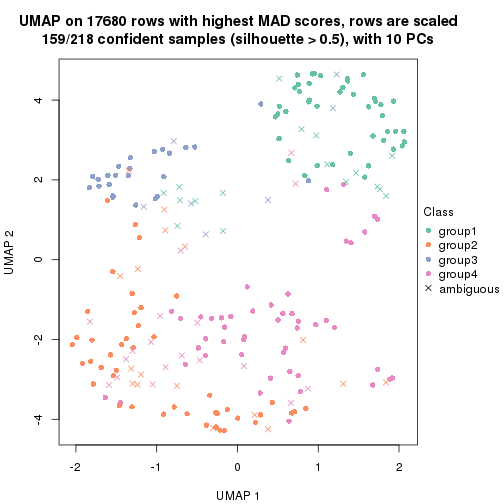</p>

</div>
<div id='tab-MAD-mclust-dimension-reduction-4'>
<pre><code class="r">dimension_reduction(res, k = 5, method = &quot;UMAP&quot;)
</code></pre>

<p></p>

</div>
<div id='tab-MAD-mclust-dimension-reduction-5'>
<pre><code class="r">dimension_reduction(res, k = 6, method = &quot;UMAP&quot;)
</code></pre>

<p></p>

</div>
</div>


Following heatmap shows how subgroups are split when increasing `k`:

```r
collect_classes(res)
```


If matrix rows can be associated to genes, consider to use `GO_Enrichment(res,
...)` to perform function enrichment for the signature genes.


 

---------------------------------------------------


### MAD:NMF**


The object with results only for a single top-value method and a single partition method 
can be extracted as:

```r
res = res_list["MAD", "NMF"]
# you can also extract it by
# res = res_list["MAD:NMF"]
```

A summary of `res` and all the functions that can be applied to it:

```r
res
```

```
#> A 'ConsensusPartition' object with k = 2, 3, 4, 5, 6.
#>   On a matrix with 17680 rows and 218 columns.
#>   Top rows (1000, 2000, 3000, 4000, 5000) are extracted by 'MAD' method.
#>   Subgroups are detected by 'NMF' method.
#>   Performed in total 1250 partitions by row resampling.
#>   Best k for subgroups seems to be 6.
#> 
#> Following methods can be applied to this 'ConsensusPartition' object:
#>  [1] "cola_report"             "collect_classes"         "collect_plots"          
#>  [4] "collect_stats"           "colnames"                "compare_signatures"     
#>  [7] "consensus_heatmap"       "dimension_reduction"     "functional_enrichment"  
#> [10] "get_anno_col"            "get_anno"                "get_classes"            
#> [13] "get_consensus"           "get_matrix"              "get_membership"         
#> [16] "get_param"               "get_signatures"          "get_stats"              
#> [19] "is_best_k"               "is_stable_k"             "membership_heatmap"     
#> [22] "ncol"                    "nrow"                    "plot_ecdf"              
#> [25] "rownames"                "select_partition_number" "show"                   
#> [28] "suggest_best_k"          "test_to_known_factors"
```

`collect_plots()` function collects all the plots made from `res` for all `k` (number of partitions)
into one single page to provide an easy and fast comparison between different `k`.

```r
collect_plots(res)
```


The plots are:

- The first row: a plot of the ECDF (Empirical cumulative distribution
  function) curves of the consensus matrix for each `k` and the heatmap of
  predicted classes for each `k`.
- The second row: heatmaps of the consensus matrix for each `k`.
- The third row: heatmaps of the membership matrix for each `k`.
- The fouth row: heatmaps of the signatures for each `k`.

All the plots in panels can be made by individual functions and they are
plotted later in this section.

`select_partition_number()` produces several plots showing different
statistics for choosing "optimized" `k`. There are following statistics:

- ECDF curves of the consensus matrix for each `k`;
- 1-PAC. [The PAC
  score](https://en.wikipedia.org/wiki/Consensus_clustering#Over-interpretation_potential_of_consensus_clustering)
  measures the proportion of the ambiguous subgrouping.
- Mean silhouette score.
- Concordance. The mean probability of fiting the consensus class ids in all
  partitions.
- Area increased. Denote $A_k$ as the area under the ECDF curve for current
  `k`, the area increased is defined as $A_k - A_{k-1}$.
- Rand index. The percent of pairs of samples that are both in a same cluster
  or both are not in a same cluster in the partition of k and k-1.
- Jaccard index. The ratio of pairs of samples are both in a same cluster in
  the partition of k and k-1 and the pairs of samples are both in a same
  cluster in the partition k or k-1.

The detailed explanations of these statistics can be found in [the cola
vignette](http://bioconductor.org/packages/devel/bioc/vignettes/cola/inst/doc/cola.html#toc_13).

Generally speaking, lower PAC score, higher mean silhouette score or higher
concordance corresponds to better partition. Rand index and Jaccard index
measure how similar the current partition is compared to partition with `k-1`.
If they are too similar, we won't accept `k` is better than `k-1`.

```r
select_partition_number(res)
```


The numeric values for all these statistics can be obtained by `get_stats()`.

```r
get_stats(res)
```

```
#>   k 1-PAC mean_silhouette concordance area_increased  Rand Jaccard
#> 2 2 1.000           0.985       0.994         0.5010 0.499   0.499
#> 3 3 0.927           0.939       0.973         0.2506 0.850   0.706
#> 4 4 0.770           0.671       0.857         0.1119 0.960   0.893
#> 5 5 0.781           0.800       0.880         0.0785 0.825   0.535
#> 6 6 0.951           0.874       0.942         0.0501 0.954   0.809
```

`suggest_best_k()` suggests the best $k$ based on these statistics. The rules are as follows:

- All $k$ with Jaccard index larger than 0.95 are removed because the increase of
  the partition number does not provides enough extra information. If all $k$ are removed,
  the best $k$ is assigned by `NA`.
- For $k$ with 1-PAC larger than 0.9, the maximal $k$ is taken as the "best k". Other $k$ is called "optional k".
- If it does not fit the second rule. The $k$ with the highest vote of highest
  1-PAC, mean silhouette and concordance is taken as the "best k".

```r
suggest_best_k(res)
```

```
#> [1] 6
#> attr(,"optional")
#> [1] 2 3
```

There is also optional best $k$ = 2 3 that is worth to check.

Following shows the table of the partitions (You need to click the **show/hide
code output** link to see it). The membership matrix (columns with name `p*`)
is inferred by
[`clue::cl_consensus()`](https://www.rdocumentation.org/link/cl_consensus?package=clue)
function with the `SE` method. Basically the value in the membership matrix
represents the probability to belong to a certain group. The finall class
label for an item is determined with the group with highest probability it
belongs to.

In `get_classes()` function, the entropy is calculated from the membership
matrix and the silhouette score is calculated from the consensus matrix.


<script>
$( function() {
	$( '#tabs-MAD-NMF-get-classes' ).tabs();
} );
</script>
<div id='tabs-MAD-NMF-get-classes'>
<ul>
<li><a href='#tab-MAD-NMF-get-classes-1'>k = 2</a></li>
<li><a href='#tab-MAD-NMF-get-classes-2'>k = 3</a></li>
<li><a href='#tab-MAD-NMF-get-classes-3'>k = 4</a></li>
<li><a href='#tab-MAD-NMF-get-classes-4'>k = 5</a></li>
<li><a href='#tab-MAD-NMF-get-classes-5'>k = 6</a></li>
</ul>

<div id='tab-MAD-NMF-get-classes-1'>
<p><a id='tab-MAD-NMF-get-classes-1-a' style='color:#0366d6' href='#'>show/hide code output</a></p>
<pre><code class="r">cbind(get_classes(res, k = 2), get_membership(res, k = 2))
</code></pre>

<pre><code>#&gt;            class entropy silhouette    p1    p2
#&gt; SRR1498997     2   0.000     0.9947 0.000 1.000
#&gt; SRR1076441     1   0.000     0.9926 1.000 0.000
#&gt; SRR1489803     2   0.000     0.9947 0.000 1.000
#&gt; SRR1345953     2   0.000     0.9947 0.000 1.000
#&gt; SRR1357826     2   0.000     0.9947 0.000 1.000
#&gt; SRR1419656     1   0.000     0.9926 1.000 0.000
#&gt; SRR1454158     2   0.000     0.9947 0.000 1.000
#&gt; SRR1475408     2   0.000     0.9947 0.000 1.000
#&gt; SRR1472704     2   0.000     0.9947 0.000 1.000
#&gt; SRR1090046     1   0.000     0.9926 1.000 0.000
#&gt; SRR1312822     1   0.000     0.9926 1.000 0.000
#&gt; SRR1096987     2   0.000     0.9947 0.000 1.000
#&gt; SRR1334587     2   0.000     0.9947 0.000 1.000
#&gt; SRR1490246     1   0.000     0.9926 1.000 0.000
#&gt; SRR1467522     1   0.000     0.9926 1.000 0.000
#&gt; SRR1324206     1   0.000     0.9926 1.000 0.000
#&gt; SRR1408574     2   0.000     0.9947 0.000 1.000
#&gt; SRR1083959     2   0.000     0.9947 0.000 1.000
#&gt; SRR1079948     2   0.000     0.9947 0.000 1.000
#&gt; SRR1310667     2   0.000     0.9947 0.000 1.000
#&gt; SRR655852      2   0.000     0.9947 0.000 1.000
#&gt; SRR1352457     2   0.000     0.9947 0.000 1.000
#&gt; SRR1353994     2   0.000     0.9947 0.000 1.000
#&gt; SRR1459561     2   0.000     0.9947 0.000 1.000
#&gt; SRR1454009     1   0.000     0.9926 1.000 0.000
#&gt; SRR1071084     1   0.000     0.9926 1.000 0.000
#&gt; SRR1082859     2   0.000     0.9947 0.000 1.000
#&gt; SRR1086538     1   0.000     0.9926 1.000 0.000
#&gt; SRR1486262     2   0.000     0.9947 0.000 1.000
#&gt; SRR658105      1   0.000     0.9926 1.000 0.000
#&gt; SRR811073      2   0.000     0.9947 0.000 1.000
#&gt; SRR1429181     2   0.000     0.9947 0.000 1.000
#&gt; SRR1327896     2   0.000     0.9947 0.000 1.000
#&gt; SRR1464788     2   0.000     0.9947 0.000 1.000
#&gt; SRR1346861     2   0.000     0.9947 0.000 1.000
#&gt; SRR1318774     2   0.000     0.9947 0.000 1.000
#&gt; SRR1420517     1   0.000     0.9926 1.000 0.000
#&gt; SRR1369584     2   0.000     0.9947 0.000 1.000
#&gt; SRR1443244     1   0.518     0.8720 0.884 0.116
#&gt; SRR1455391     1   0.000     0.9926 1.000 0.000
#&gt; SRR1068999     1   0.000     0.9926 1.000 0.000
#&gt; SRR1481297     1   0.000     0.9926 1.000 0.000
#&gt; SRR1070208     1   0.000     0.9926 1.000 0.000
#&gt; SRR1317282     1   0.000     0.9926 1.000 0.000
#&gt; SRR1096125     2   0.000     0.9947 0.000 1.000
#&gt; SRR1472506     1   0.730     0.7505 0.796 0.204
#&gt; SRR1388281     2   0.000     0.9947 0.000 1.000
#&gt; SRR1365622     2   0.000     0.9947 0.000 1.000
#&gt; SRR662306      1   0.000     0.9926 1.000 0.000
#&gt; SRR662811      1   0.000     0.9926 1.000 0.000
#&gt; SRR820571      1   0.697     0.7748 0.812 0.188
#&gt; SRR1357166     1   0.000     0.9926 1.000 0.000
#&gt; SRR1488586     1   0.000     0.9926 1.000 0.000
#&gt; SRR1485398     1   0.000     0.9926 1.000 0.000
#&gt; SRR1417725     2   0.000     0.9947 0.000 1.000
#&gt; SRR1409397     2   0.000     0.9947 0.000 1.000
#&gt; SRR1465693     2   0.000     0.9947 0.000 1.000
#&gt; SRR1096547     1   0.278     0.9477 0.952 0.048
#&gt; SRR1456818     1   0.000     0.9926 1.000 0.000
#&gt; SRR816336      1   0.000     0.9926 1.000 0.000
#&gt; SRR1420238     1   0.000     0.9926 1.000 0.000
#&gt; SRR1433374     1   0.000     0.9926 1.000 0.000
#&gt; SRR1436990     1   0.000     0.9926 1.000 0.000
#&gt; SRR662378      1   0.000     0.9926 1.000 0.000
#&gt; SRR1477671     1   0.000     0.9926 1.000 0.000
#&gt; SRR1084079     2   0.999     0.0571 0.480 0.520
#&gt; SRR1102949     1   0.000     0.9926 1.000 0.000
#&gt; SRR1458090     1   0.000     0.9926 1.000 0.000
#&gt; SRR1418729     2   0.000     0.9947 0.000 1.000
#&gt; SRR1403814     2   0.000     0.9947 0.000 1.000
#&gt; SRR1404887     1   0.443     0.9005 0.908 0.092
#&gt; SRR1434955     1   0.000     0.9926 1.000 0.000
#&gt; SRR1360652     1   0.000     0.9926 1.000 0.000
#&gt; SRR1356765     2   0.000     0.9947 0.000 1.000
#&gt; SRR1078258     2   0.000     0.9947 0.000 1.000
#&gt; SRR1455861     1   0.000     0.9926 1.000 0.000
#&gt; SRR1420296     2   0.000     0.9947 0.000 1.000
#&gt; SRR1070260     2   0.000     0.9947 0.000 1.000
#&gt; SRR1410765     1   0.000     0.9926 1.000 0.000
#&gt; SRR1481315     1   0.000     0.9926 1.000 0.000
#&gt; SRR1414661     2   0.000     0.9947 0.000 1.000
#&gt; SRR1359147     2   0.000     0.9947 0.000 1.000
#&gt; SRR1488694     1   0.000     0.9926 1.000 0.000
#&gt; SRR1477273     1   0.000     0.9926 1.000 0.000
#&gt; SRR1415792     1   0.000     0.9926 1.000 0.000
#&gt; SRR1369088     2   0.518     0.8644 0.116 0.884
#&gt; SRR1406621     2   0.000     0.9947 0.000 1.000
#&gt; SRR1401017     2   0.000     0.9947 0.000 1.000
#&gt; SRR1099981     2   0.000     0.9947 0.000 1.000
#&gt; SRR815208      2   0.000     0.9947 0.000 1.000
#&gt; SRR1380460     2   0.000     0.9947 0.000 1.000
#&gt; SRR1091097     2   0.000     0.9947 0.000 1.000
#&gt; SRR1456010     1   0.000     0.9926 1.000 0.000
#&gt; SRR1498416     2   0.000     0.9947 0.000 1.000
#&gt; SRR818873      2   0.000     0.9947 0.000 1.000
#&gt; SRR813868      2   0.000     0.9947 0.000 1.000
#&gt; SRR1394912     1   0.000     0.9926 1.000 0.000
#&gt; SRR1475824     2   0.000     0.9947 0.000 1.000
#&gt; SRR1459866     1   0.000     0.9926 1.000 0.000
#&gt; SRR1364871     2   0.000     0.9947 0.000 1.000
#&gt; SRR1100472     2   0.000     0.9947 0.000 1.000
#&gt; SRR1331267     1   0.000     0.9926 1.000 0.000
#&gt; SRR1068977     2   0.000     0.9947 0.000 1.000
#&gt; SRR1391511     2   0.000     0.9947 0.000 1.000
#&gt; SRR1077920     2   0.000     0.9947 0.000 1.000
#&gt; SRR1457705     1   0.000     0.9926 1.000 0.000
#&gt; SRR1437073     1   0.000     0.9926 1.000 0.000
#&gt; SRR1473124     1   0.000     0.9926 1.000 0.000
#&gt; SRR1469279     1   0.000     0.9926 1.000 0.000
#&gt; SRR1091791     2   0.000     0.9947 0.000 1.000
#&gt; SRR1341539     2   0.000     0.9947 0.000 1.000
#&gt; SRR1446354     1   0.000     0.9926 1.000 0.000
#&gt; SRR1415420     1   0.000     0.9926 1.000 0.000
#&gt; SRR1368050     1   0.000     0.9926 1.000 0.000
#&gt; SRR656970      2   0.000     0.9947 0.000 1.000
#&gt; SRR1473403     2   0.000     0.9947 0.000 1.000
#&gt; SRR1084674     1   0.000     0.9926 1.000 0.000
#&gt; SRR1464702     1   0.000     0.9926 1.000 0.000
#&gt; SRR1074860     2   0.000     0.9947 0.000 1.000
#&gt; SRR655447      2   0.000     0.9947 0.000 1.000
#&gt; SRR1404442     2   0.000     0.9947 0.000 1.000
#&gt; SRR1418795     1   0.000     0.9926 1.000 0.000
#&gt; SRR1458335     2   0.000     0.9947 0.000 1.000
#&gt; SRR1489589     2   0.000     0.9947 0.000 1.000
#&gt; SRR1378284     1   0.000     0.9926 1.000 0.000
#&gt; SRR1408014     2   0.000     0.9947 0.000 1.000
#&gt; SRR1083052     1   0.000     0.9926 1.000 0.000
#&gt; SRR1339236     2   0.000     0.9947 0.000 1.000
#&gt; SRR1323829     2   0.000     0.9947 0.000 1.000
#&gt; SRR1086772     2   0.000     0.9947 0.000 1.000
#&gt; SRR1486457     1   0.000     0.9926 1.000 0.000
#&gt; SRR1415257     2   0.000     0.9947 0.000 1.000
#&gt; SRR1071905     1   0.000     0.9926 1.000 0.000
#&gt; SRR659223      2   0.000     0.9947 0.000 1.000
#&gt; SRR1386945     1   0.000     0.9926 1.000 0.000
#&gt; SRR821498      2   0.000     0.9947 0.000 1.000
#&gt; SRR1378903     2   0.000     0.9947 0.000 1.000
#&gt; SRR1472907     1   0.000     0.9926 1.000 0.000
#&gt; SRR1442313     2   0.000     0.9947 0.000 1.000
#&gt; SRR1077139     2   0.000     0.9947 0.000 1.000
#&gt; SRR1342758     1   0.000     0.9926 1.000 0.000
#&gt; SRR656911      2   0.000     0.9947 0.000 1.000
#&gt; SRR1070738     1   0.000     0.9926 1.000 0.000
#&gt; SRR1476950     1   0.000     0.9926 1.000 0.000
#&gt; SRR1488196     1   0.000     0.9926 1.000 0.000
#&gt; SRR1498951     1   0.000     0.9926 1.000 0.000
#&gt; SRR1413392     1   0.000     0.9926 1.000 0.000
#&gt; SRR657528      2   0.000     0.9947 0.000 1.000
#&gt; SRR812198      1   0.000     0.9926 1.000 0.000
#&gt; SRR660283      2   0.000     0.9947 0.000 1.000
#&gt; SRR1420936     1   0.000     0.9926 1.000 0.000
#&gt; SRR1469547     2   0.000     0.9947 0.000 1.000
#&gt; SRR1322249     1   0.000     0.9926 1.000 0.000
#&gt; SRR1396682     1   0.000     0.9926 1.000 0.000
#&gt; SRR1095816     2   0.000     0.9947 0.000 1.000
#&gt; SRR1081023     1   0.000     0.9926 1.000 0.000
#&gt; SRR1092517     2   0.000     0.9947 0.000 1.000
#&gt; SRR811285      2   0.000     0.9947 0.000 1.000
#&gt; SRR657018      1   0.000     0.9926 1.000 0.000
#&gt; SRR1365534     1   0.000     0.9926 1.000 0.000
#&gt; SRR1090791     2   0.000     0.9947 0.000 1.000
#&gt; SRR1439915     2   0.000     0.9947 0.000 1.000
#&gt; SRR1391575     2   0.000     0.9947 0.000 1.000
#&gt; SRR1314092     2   0.000     0.9947 0.000 1.000
#&gt; SRR1328941     1   0.000     0.9926 1.000 0.000
#&gt; SRR1336181     2   0.000     0.9947 0.000 1.000
#&gt; SRR1362972     1   0.000     0.9926 1.000 0.000
#&gt; SRR1366790     2   0.000     0.9947 0.000 1.000
#&gt; SRR1455902     1   0.000     0.9926 1.000 0.000
#&gt; SRR1437644     1   0.242     0.9555 0.960 0.040
#&gt; SRR1105009     2   0.000     0.9947 0.000 1.000
#&gt; SRR1367024     1   0.000     0.9926 1.000 0.000
#&gt; SRR660248      2   0.000     0.9947 0.000 1.000
#&gt; SRR1409620     1   0.000     0.9926 1.000 0.000
#&gt; SRR1455807     2   0.000     0.9947 0.000 1.000
#&gt; SRR1339431     1   0.000     0.9926 1.000 0.000
#&gt; SRR1378948     1   0.327     0.9354 0.940 0.060
#&gt; SRR1469237     1   0.000     0.9926 1.000 0.000
#&gt; SRR1098264     2   0.000     0.9947 0.000 1.000
#&gt; SRR1406224     2   0.000     0.9947 0.000 1.000
#&gt; SRR1393026     1   0.000     0.9926 1.000 0.000
#&gt; SRR808428      2   0.000     0.9947 0.000 1.000
#&gt; SRR615910      2   0.000     0.9947 0.000 1.000
#&gt; SRR1076219     1   0.000     0.9926 1.000 0.000
#&gt; SRR1481128     1   0.000     0.9926 1.000 0.000
#&gt; SRR1359262     2   0.000     0.9947 0.000 1.000
#&gt; SRR1407648     2   0.000     0.9947 0.000 1.000
#&gt; SRR1386775     1   0.000     0.9926 1.000 0.000
#&gt; SRR1388399     1   0.000     0.9926 1.000 0.000
#&gt; SRR1361499     2   0.000     0.9947 0.000 1.000
#&gt; SRR1500709     2   0.000     0.9947 0.000 1.000
#&gt; SRR1335917     1   0.000     0.9926 1.000 0.000
#&gt; SRR1430615     2   0.000     0.9947 0.000 1.000
#&gt; SRR1335212     1   0.000     0.9926 1.000 0.000
#&gt; SRR1400159     2   0.000     0.9947 0.000 1.000
#&gt; SRR1457245     2   0.000     0.9947 0.000 1.000
#&gt; SRR1356746     2   0.000     0.9947 0.000 1.000
#&gt; SRR658319      2   0.000     0.9947 0.000 1.000
#&gt; SRR1435946     1   0.000     0.9926 1.000 0.000
#&gt; SRR1370308     1   0.000     0.9926 1.000 0.000
#&gt; SRR1100893     1   0.000     0.9926 1.000 0.000
#&gt; SRR1389432     1   0.000     0.9926 1.000 0.000
#&gt; SRR1381799     2   0.000     0.9947 0.000 1.000
#&gt; SRR1310158     1   0.000     0.9926 1.000 0.000
#&gt; SRR1341100     2   0.000     0.9947 0.000 1.000
#&gt; SRR1342873     1   0.000     0.9926 1.000 0.000
#&gt; SRR1472102     2   0.000     0.9947 0.000 1.000
#&gt; SRR1409421     1   0.000     0.9926 1.000 0.000
#&gt; SRR1328577     2   0.000     0.9947 0.000 1.000
#&gt; SRR808942      2   0.000     0.9947 0.000 1.000
#&gt; SRR1343818     2   0.000     0.9947 0.000 1.000
#&gt; SRR1472415     2   0.000     0.9947 0.000 1.000
#&gt; SRR658409      2   0.000     0.9947 0.000 1.000
#&gt; SRR1469681     1   0.000     0.9926 1.000 0.000
#&gt; SRR1075484     2   0.000     0.9947 0.000 1.000
#&gt; SRR1417894     1   0.000     0.9926 1.000 0.000
#&gt; SRR1417422     2   0.000     0.9947 0.000 1.000
#&gt; SRR1090674     1   0.000     0.9926 1.000 0.000
</code></pre>

<script>
$('#tab-MAD-NMF-get-classes-1-a').parent().next().next().hide();
$('#tab-MAD-NMF-get-classes-1-a').click(function(){
  $('#tab-MAD-NMF-get-classes-1-a').parent().next().next().toggle();
  return(false);
});
</script>
</div>

<div id='tab-MAD-NMF-get-classes-2'>
<p><a id='tab-MAD-NMF-get-classes-2-a' style='color:#0366d6' href='#'>show/hide code output</a></p>
<pre><code class="r">cbind(get_classes(res, k = 3), get_membership(res, k = 3))
</code></pre>

<pre><code>#&gt;            class entropy silhouette    p1    p2    p3
#&gt; SRR1498997     2  0.0000      0.979 0.000 1.000 0.000
#&gt; SRR1076441     1  0.0000      0.984 1.000 0.000 0.000
#&gt; SRR1489803     2  0.0000      0.979 0.000 1.000 0.000
#&gt; SRR1345953     2  0.0000      0.979 0.000 1.000 0.000
#&gt; SRR1357826     2  0.0000      0.979 0.000 1.000 0.000
#&gt; SRR1419656     3  0.0237      0.930 0.004 0.000 0.996
#&gt; SRR1454158     2  0.0000      0.979 0.000 1.000 0.000
#&gt; SRR1475408     3  0.4399      0.783 0.000 0.188 0.812
#&gt; SRR1472704     2  0.0000      0.979 0.000 1.000 0.000
#&gt; SRR1090046     1  0.2878      0.881 0.904 0.000 0.096
#&gt; SRR1312822     1  0.0000      0.984 1.000 0.000 0.000
#&gt; SRR1096987     2  0.0000      0.979 0.000 1.000 0.000
#&gt; SRR1334587     2  0.0000      0.979 0.000 1.000 0.000
#&gt; SRR1490246     1  0.0000      0.984 1.000 0.000 0.000
#&gt; SRR1467522     1  0.0000      0.984 1.000 0.000 0.000
#&gt; SRR1324206     1  0.0000      0.984 1.000 0.000 0.000
#&gt; SRR1408574     2  0.0000      0.979 0.000 1.000 0.000
#&gt; SRR1083959     2  0.0000      0.979 0.000 1.000 0.000
#&gt; SRR1079948     2  0.0000      0.979 0.000 1.000 0.000
#&gt; SRR1310667     2  0.0000      0.979 0.000 1.000 0.000
#&gt; SRR655852      2  0.0000      0.979 0.000 1.000 0.000
#&gt; SRR1352457     2  0.0000      0.979 0.000 1.000 0.000
#&gt; SRR1353994     2  0.0000      0.979 0.000 1.000 0.000
#&gt; SRR1459561     2  0.0000      0.979 0.000 1.000 0.000
#&gt; SRR1454009     3  0.0000      0.931 0.000 0.000 1.000
#&gt; SRR1071084     3  0.0000      0.931 0.000 0.000 1.000
#&gt; SRR1082859     2  0.0000      0.979 0.000 1.000 0.000
#&gt; SRR1086538     1  0.0000      0.984 1.000 0.000 0.000
#&gt; SRR1486262     2  0.0000      0.979 0.000 1.000 0.000
#&gt; SRR658105      1  0.0000      0.984 1.000 0.000 0.000
#&gt; SRR811073      2  0.0000      0.979 0.000 1.000 0.000
#&gt; SRR1429181     2  0.0000      0.979 0.000 1.000 0.000
#&gt; SRR1327896     2  0.0000      0.979 0.000 1.000 0.000
#&gt; SRR1464788     2  0.0000      0.979 0.000 1.000 0.000
#&gt; SRR1346861     2  0.0000      0.979 0.000 1.000 0.000
#&gt; SRR1318774     2  0.0000      0.979 0.000 1.000 0.000
#&gt; SRR1420517     3  0.0000      0.931 0.000 0.000 1.000
#&gt; SRR1369584     2  0.0000      0.979 0.000 1.000 0.000
#&gt; SRR1443244     1  0.3412      0.815 0.876 0.124 0.000
#&gt; SRR1455391     1  0.1860      0.934 0.948 0.000 0.052
#&gt; SRR1068999     1  0.0000      0.984 1.000 0.000 0.000
#&gt; SRR1481297     3  0.0000      0.931 0.000 0.000 1.000
#&gt; SRR1070208     1  0.1860      0.933 0.948 0.000 0.052
#&gt; SRR1317282     3  0.0000      0.931 0.000 0.000 1.000
#&gt; SRR1096125     2  0.0000      0.979 0.000 1.000 0.000
#&gt; SRR1472506     3  0.4235      0.795 0.000 0.176 0.824
#&gt; SRR1388281     2  0.0000      0.979 0.000 1.000 0.000
#&gt; SRR1365622     2  0.0000      0.979 0.000 1.000 0.000
#&gt; SRR662306      3  0.0000      0.931 0.000 0.000 1.000
#&gt; SRR662811      1  0.0000      0.984 1.000 0.000 0.000
#&gt; SRR820571      3  0.4555      0.769 0.000 0.200 0.800
#&gt; SRR1357166     3  0.4291      0.791 0.180 0.000 0.820
#&gt; SRR1488586     1  0.0000      0.984 1.000 0.000 0.000
#&gt; SRR1485398     1  0.0000      0.984 1.000 0.000 0.000
#&gt; SRR1417725     3  0.0000      0.931 0.000 0.000 1.000
#&gt; SRR1409397     2  0.4399      0.759 0.000 0.812 0.188
#&gt; SRR1465693     2  0.0000      0.979 0.000 1.000 0.000
#&gt; SRR1096547     3  0.0000      0.931 0.000 0.000 1.000
#&gt; SRR1456818     1  0.0000      0.984 1.000 0.000 0.000
#&gt; SRR816336      3  0.0000      0.931 0.000 0.000 1.000
#&gt; SRR1420238     1  0.0000      0.984 1.000 0.000 0.000
#&gt; SRR1433374     3  0.0000      0.931 0.000 0.000 1.000
#&gt; SRR1436990     1  0.0000      0.984 1.000 0.000 0.000
#&gt; SRR662378      1  0.0000      0.984 1.000 0.000 0.000
#&gt; SRR1477671     1  0.0000      0.984 1.000 0.000 0.000
#&gt; SRR1084079     2  0.3619      0.828 0.136 0.864 0.000
#&gt; SRR1102949     1  0.0000      0.984 1.000 0.000 0.000
#&gt; SRR1458090     1  0.0000      0.984 1.000 0.000 0.000
#&gt; SRR1418729     2  0.0000      0.979 0.000 1.000 0.000
#&gt; SRR1403814     2  0.0000      0.979 0.000 1.000 0.000
#&gt; SRR1404887     1  0.2261      0.897 0.932 0.068 0.000
#&gt; SRR1434955     1  0.0000      0.984 1.000 0.000 0.000
#&gt; SRR1360652     1  0.0000      0.984 1.000 0.000 0.000
#&gt; SRR1356765     2  0.0000      0.979 0.000 1.000 0.000
#&gt; SRR1078258     2  0.0000      0.979 0.000 1.000 0.000
#&gt; SRR1455861     1  0.0000      0.984 1.000 0.000 0.000
#&gt; SRR1420296     2  0.0000      0.979 0.000 1.000 0.000
#&gt; SRR1070260     2  0.0000      0.979 0.000 1.000 0.000
#&gt; SRR1410765     1  0.0000      0.984 1.000 0.000 0.000
#&gt; SRR1481315     1  0.0000      0.984 1.000 0.000 0.000
#&gt; SRR1414661     2  0.0000      0.979 0.000 1.000 0.000
#&gt; SRR1359147     2  0.0000      0.979 0.000 1.000 0.000
#&gt; SRR1488694     1  0.0000      0.984 1.000 0.000 0.000
#&gt; SRR1477273     3  0.0000      0.931 0.000 0.000 1.000
#&gt; SRR1415792     1  0.6252      0.126 0.556 0.000 0.444
#&gt; SRR1369088     2  0.0000      0.979 0.000 1.000 0.000
#&gt; SRR1406621     2  0.0000      0.979 0.000 1.000 0.000
#&gt; SRR1401017     2  0.4346      0.766 0.000 0.816 0.184
#&gt; SRR1099981     2  0.0000      0.979 0.000 1.000 0.000
#&gt; SRR815208      2  0.0000      0.979 0.000 1.000 0.000
#&gt; SRR1380460     2  0.0000      0.979 0.000 1.000 0.000
#&gt; SRR1091097     2  0.0000      0.979 0.000 1.000 0.000
#&gt; SRR1456010     3  0.0000      0.931 0.000 0.000 1.000
#&gt; SRR1498416     2  0.0000      0.979 0.000 1.000 0.000
#&gt; SRR818873      2  0.0000      0.979 0.000 1.000 0.000
#&gt; SRR813868      2  0.2537      0.898 0.000 0.920 0.080
#&gt; SRR1394912     1  0.0000      0.984 1.000 0.000 0.000
#&gt; SRR1475824     2  0.0000      0.979 0.000 1.000 0.000
#&gt; SRR1459866     1  0.0000      0.984 1.000 0.000 0.000
#&gt; SRR1364871     2  0.6168      0.271 0.000 0.588 0.412
#&gt; SRR1100472     2  0.0000      0.979 0.000 1.000 0.000
#&gt; SRR1331267     1  0.0000      0.984 1.000 0.000 0.000
#&gt; SRR1068977     2  0.0000      0.979 0.000 1.000 0.000
#&gt; SRR1391511     2  0.0000      0.979 0.000 1.000 0.000
#&gt; SRR1077920     2  0.0000      0.979 0.000 1.000 0.000
#&gt; SRR1457705     3  0.0000      0.931 0.000 0.000 1.000
#&gt; SRR1437073     1  0.0000      0.984 1.000 0.000 0.000
#&gt; SRR1473124     3  0.0000      0.931 0.000 0.000 1.000
#&gt; SRR1469279     3  0.0237      0.930 0.004 0.000 0.996
#&gt; SRR1091791     2  0.0000      0.979 0.000 1.000 0.000
#&gt; SRR1341539     2  0.0000      0.979 0.000 1.000 0.000
#&gt; SRR1446354     3  0.0000      0.931 0.000 0.000 1.000
#&gt; SRR1415420     1  0.0000      0.984 1.000 0.000 0.000
#&gt; SRR1368050     1  0.0000      0.984 1.000 0.000 0.000
#&gt; SRR656970      2  0.0000      0.979 0.000 1.000 0.000
#&gt; SRR1473403     2  0.0000      0.979 0.000 1.000 0.000
#&gt; SRR1084674     3  0.2625      0.877 0.084 0.000 0.916
#&gt; SRR1464702     1  0.0237      0.980 0.996 0.000 0.004
#&gt; SRR1074860     2  0.0000      0.979 0.000 1.000 0.000
#&gt; SRR655447      2  0.0000      0.979 0.000 1.000 0.000
#&gt; SRR1404442     2  0.0000      0.979 0.000 1.000 0.000
#&gt; SRR1418795     1  0.0000      0.984 1.000 0.000 0.000
#&gt; SRR1458335     2  0.5465      0.584 0.000 0.712 0.288
#&gt; SRR1489589     3  0.5678      0.572 0.000 0.316 0.684
#&gt; SRR1378284     1  0.0000      0.984 1.000 0.000 0.000
#&gt; SRR1408014     2  0.0000      0.979 0.000 1.000 0.000
#&gt; SRR1083052     1  0.0000      0.984 1.000 0.000 0.000
#&gt; SRR1339236     3  0.0592      0.924 0.000 0.012 0.988
#&gt; SRR1323829     2  0.0000      0.979 0.000 1.000 0.000
#&gt; SRR1086772     2  0.0000      0.979 0.000 1.000 0.000
#&gt; SRR1486457     3  0.0000      0.931 0.000 0.000 1.000
#&gt; SRR1415257     2  0.0000      0.979 0.000 1.000 0.000
#&gt; SRR1071905     3  0.0237      0.930 0.004 0.000 0.996
#&gt; SRR659223      2  0.0000      0.979 0.000 1.000 0.000
#&gt; SRR1386945     3  0.0000      0.931 0.000 0.000 1.000
#&gt; SRR821498      2  0.3941      0.805 0.000 0.844 0.156
#&gt; SRR1378903     2  0.0000      0.979 0.000 1.000 0.000
#&gt; SRR1472907     3  0.0000      0.931 0.000 0.000 1.000
#&gt; SRR1442313     2  0.0000      0.979 0.000 1.000 0.000
#&gt; SRR1077139     2  0.0000      0.979 0.000 1.000 0.000
#&gt; SRR1342758     1  0.0000      0.984 1.000 0.000 0.000
#&gt; SRR656911      2  0.0000      0.979 0.000 1.000 0.000
#&gt; SRR1070738     1  0.0000      0.984 1.000 0.000 0.000
#&gt; SRR1476950     1  0.0237      0.980 0.996 0.000 0.004
#&gt; SRR1488196     3  0.0000      0.931 0.000 0.000 1.000
#&gt; SRR1498951     3  0.0000      0.931 0.000 0.000 1.000
#&gt; SRR1413392     1  0.0000      0.984 1.000 0.000 0.000
#&gt; SRR657528      2  0.5948      0.419 0.000 0.640 0.360
#&gt; SRR812198      1  0.0000      0.984 1.000 0.000 0.000
#&gt; SRR660283      2  0.0000      0.979 0.000 1.000 0.000
#&gt; SRR1420936     1  0.0000      0.984 1.000 0.000 0.000
#&gt; SRR1469547     2  0.0000      0.979 0.000 1.000 0.000
#&gt; SRR1322249     1  0.0000      0.984 1.000 0.000 0.000
#&gt; SRR1396682     1  0.0000      0.984 1.000 0.000 0.000
#&gt; SRR1095816     2  0.0000      0.979 0.000 1.000 0.000
#&gt; SRR1081023     1  0.0000      0.984 1.000 0.000 0.000
#&gt; SRR1092517     2  0.0000      0.979 0.000 1.000 0.000
#&gt; SRR811285      2  0.0000      0.979 0.000 1.000 0.000
#&gt; SRR657018      1  0.0000      0.984 1.000 0.000 0.000
#&gt; SRR1365534     3  0.0000      0.931 0.000 0.000 1.000
#&gt; SRR1090791     2  0.0000      0.979 0.000 1.000 0.000
#&gt; SRR1439915     3  0.5058      0.704 0.000 0.244 0.756
#&gt; SRR1391575     2  0.0000      0.979 0.000 1.000 0.000
#&gt; SRR1314092     2  0.0000      0.979 0.000 1.000 0.000
#&gt; SRR1328941     3  0.0000      0.931 0.000 0.000 1.000
#&gt; SRR1336181     2  0.0000      0.979 0.000 1.000 0.000
#&gt; SRR1362972     1  0.0000      0.984 1.000 0.000 0.000
#&gt; SRR1366790     2  0.5650      0.534 0.000 0.688 0.312
#&gt; SRR1455902     3  0.0000      0.931 0.000 0.000 1.000
#&gt; SRR1437644     3  0.4555      0.769 0.000 0.200 0.800
#&gt; SRR1105009     2  0.0000      0.979 0.000 1.000 0.000
#&gt; SRR1367024     3  0.0000      0.931 0.000 0.000 1.000
#&gt; SRR660248      3  0.4750      0.747 0.000 0.216 0.784
#&gt; SRR1409620     1  0.0000      0.984 1.000 0.000 0.000
#&gt; SRR1455807     2  0.0000      0.979 0.000 1.000 0.000
#&gt; SRR1339431     1  0.0000      0.984 1.000 0.000 0.000
#&gt; SRR1378948     3  0.0000      0.931 0.000 0.000 1.000
#&gt; SRR1469237     1  0.0000      0.984 1.000 0.000 0.000
#&gt; SRR1098264     2  0.0000      0.979 0.000 1.000 0.000
#&gt; SRR1406224     2  0.0000      0.979 0.000 1.000 0.000
#&gt; SRR1393026     3  0.4504      0.773 0.196 0.000 0.804
#&gt; SRR808428      2  0.0000      0.979 0.000 1.000 0.000
#&gt; SRR615910      2  0.0000      0.979 0.000 1.000 0.000
#&gt; SRR1076219     3  0.4346      0.787 0.184 0.000 0.816
#&gt; SRR1481128     1  0.0000      0.984 1.000 0.000 0.000
#&gt; SRR1359262     2  0.0000      0.979 0.000 1.000 0.000
#&gt; SRR1407648     2  0.0000      0.979 0.000 1.000 0.000
#&gt; SRR1386775     1  0.1163      0.951 0.972 0.028 0.000
#&gt; SRR1388399     1  0.0000      0.984 1.000 0.000 0.000
#&gt; SRR1361499     2  0.0000      0.979 0.000 1.000 0.000
#&gt; SRR1500709     2  0.0000      0.979 0.000 1.000 0.000
#&gt; SRR1335917     1  0.0000      0.984 1.000 0.000 0.000
#&gt; SRR1430615     2  0.0000      0.979 0.000 1.000 0.000
#&gt; SRR1335212     3  0.4750      0.747 0.216 0.000 0.784
#&gt; SRR1400159     3  0.0000      0.931 0.000 0.000 1.000
#&gt; SRR1457245     2  0.0000      0.979 0.000 1.000 0.000
#&gt; SRR1356746     2  0.0000      0.979 0.000 1.000 0.000
#&gt; SRR658319      2  0.0000      0.979 0.000 1.000 0.000
#&gt; SRR1435946     1  0.0000      0.984 1.000 0.000 0.000
#&gt; SRR1370308     1  0.0000      0.984 1.000 0.000 0.000
#&gt; SRR1100893     1  0.0000      0.984 1.000 0.000 0.000
#&gt; SRR1389432     3  0.4291      0.791 0.180 0.000 0.820
#&gt; SRR1381799     2  0.0000      0.979 0.000 1.000 0.000
#&gt; SRR1310158     3  0.0000      0.931 0.000 0.000 1.000
#&gt; SRR1341100     2  0.0000      0.979 0.000 1.000 0.000
#&gt; SRR1342873     3  0.4750      0.747 0.216 0.000 0.784
#&gt; SRR1472102     2  0.0000      0.979 0.000 1.000 0.000
#&gt; SRR1409421     3  0.0237      0.930 0.004 0.000 0.996
#&gt; SRR1328577     2  0.0000      0.979 0.000 1.000 0.000
#&gt; SRR808942      2  0.0000      0.979 0.000 1.000 0.000
#&gt; SRR1343818     2  0.0000      0.979 0.000 1.000 0.000
#&gt; SRR1472415     2  0.0000      0.979 0.000 1.000 0.000
#&gt; SRR658409      2  0.0000      0.979 0.000 1.000 0.000
#&gt; SRR1469681     1  0.0000      0.984 1.000 0.000 0.000
#&gt; SRR1075484     2  0.0000      0.979 0.000 1.000 0.000
#&gt; SRR1417894     3  0.0000      0.931 0.000 0.000 1.000
#&gt; SRR1417422     2  0.0237      0.975 0.000 0.996 0.004
#&gt; SRR1090674     1  0.0000      0.984 1.000 0.000 0.000
</code></pre>

<script>
$('#tab-MAD-NMF-get-classes-2-a').parent().next().next().hide();
$('#tab-MAD-NMF-get-classes-2-a').click(function(){
  $('#tab-MAD-NMF-get-classes-2-a').parent().next().next().toggle();
  return(false);
});
</script>
</div>

<div id='tab-MAD-NMF-get-classes-3'>
<p><a id='tab-MAD-NMF-get-classes-3-a' style='color:#0366d6' href='#'>show/hide code output</a></p>
<pre><code class="r">cbind(get_classes(res, k = 4), get_membership(res, k = 4))
</code></pre>

<pre><code>#&gt;            class entropy silhouette    p1    p2    p3    p4
#&gt; SRR1498997     2  0.0000    0.80266 0.000 1.000 0.000 0.000
#&gt; SRR1076441     1  0.0000    0.92367 1.000 0.000 0.000 0.000
#&gt; SRR1489803     2  0.5070    0.53009 0.000 0.580 0.004 0.416
#&gt; SRR1345953     2  0.0000    0.80266 0.000 1.000 0.000 0.000
#&gt; SRR1357826     2  0.0188    0.80163 0.000 0.996 0.000 0.004
#&gt; SRR1419656     3  0.4967    0.21401 0.000 0.000 0.548 0.452
#&gt; SRR1454158     2  0.0000    0.80266 0.000 1.000 0.000 0.000
#&gt; SRR1475408     3  0.2282    0.68922 0.000 0.052 0.924 0.024
#&gt; SRR1472704     2  0.0188    0.80163 0.000 0.996 0.000 0.004
#&gt; SRR1090046     1  0.4998    0.02296 0.512 0.000 0.488 0.000
#&gt; SRR1312822     1  0.0000    0.92367 1.000 0.000 0.000 0.000
#&gt; SRR1096987     2  0.0000    0.80266 0.000 1.000 0.000 0.000
#&gt; SRR1334587     2  0.4898    0.53571 0.000 0.584 0.000 0.416
#&gt; SRR1490246     1  0.0000    0.92367 1.000 0.000 0.000 0.000
#&gt; SRR1467522     1  0.0000    0.92367 1.000 0.000 0.000 0.000
#&gt; SRR1324206     1  0.0000    0.92367 1.000 0.000 0.000 0.000
#&gt; SRR1408574     2  0.4898    0.53571 0.000 0.584 0.000 0.416
#&gt; SRR1083959     2  0.0000    0.80266 0.000 1.000 0.000 0.000
#&gt; SRR1079948     2  0.0000    0.80266 0.000 1.000 0.000 0.000
#&gt; SRR1310667     2  0.4898    0.53571 0.000 0.584 0.000 0.416
#&gt; SRR655852      2  0.0000    0.80266 0.000 1.000 0.000 0.000
#&gt; SRR1352457     2  0.4898    0.53571 0.000 0.584 0.000 0.416
#&gt; SRR1353994     2  0.0000    0.80266 0.000 1.000 0.000 0.000
#&gt; SRR1459561     2  0.4898    0.53571 0.000 0.584 0.000 0.416
#&gt; SRR1454009     3  0.0000    0.75327 0.000 0.000 1.000 0.000
#&gt; SRR1071084     3  0.0000    0.75327 0.000 0.000 1.000 0.000
#&gt; SRR1082859     2  0.0000    0.80266 0.000 1.000 0.000 0.000
#&gt; SRR1086538     1  0.0000    0.92367 1.000 0.000 0.000 0.000
#&gt; SRR1486262     2  0.0000    0.80266 0.000 1.000 0.000 0.000
#&gt; SRR658105      1  0.0000    0.92367 1.000 0.000 0.000 0.000
#&gt; SRR811073      2  0.0000    0.80266 0.000 1.000 0.000 0.000
#&gt; SRR1429181     2  0.4898    0.53571 0.000 0.584 0.000 0.416
#&gt; SRR1327896     2  0.0000    0.80266 0.000 1.000 0.000 0.000
#&gt; SRR1464788     2  0.4898    0.53571 0.000 0.584 0.000 0.416
#&gt; SRR1346861     2  0.0336    0.80022 0.000 0.992 0.000 0.008
#&gt; SRR1318774     2  0.0000    0.80266 0.000 1.000 0.000 0.000
#&gt; SRR1420517     4  0.4898   -0.07227 0.000 0.000 0.416 0.584
#&gt; SRR1369584     2  0.4898    0.53571 0.000 0.584 0.000 0.416
#&gt; SRR1443244     1  0.4992    0.09402 0.524 0.476 0.000 0.000
#&gt; SRR1455391     3  0.4981    0.11259 0.464 0.000 0.536 0.000
#&gt; SRR1068999     1  0.4522    0.51560 0.680 0.000 0.000 0.320
#&gt; SRR1481297     3  0.4972    0.20683 0.000 0.000 0.544 0.456
#&gt; SRR1070208     1  0.2345    0.82080 0.900 0.000 0.100 0.000
#&gt; SRR1317282     3  0.0000    0.75327 0.000 0.000 1.000 0.000
#&gt; SRR1096125     2  0.0000    0.80266 0.000 1.000 0.000 0.000
#&gt; SRR1472506     4  0.6603    0.09841 0.000 0.104 0.316 0.580
#&gt; SRR1388281     2  0.0000    0.80266 0.000 1.000 0.000 0.000
#&gt; SRR1365622     2  0.4898    0.53571 0.000 0.584 0.000 0.416
#&gt; SRR662306      3  0.0000    0.75327 0.000 0.000 1.000 0.000
#&gt; SRR662811      1  0.0000    0.92367 1.000 0.000 0.000 0.000
#&gt; SRR820571      4  0.1557    0.28935 0.000 0.000 0.056 0.944
#&gt; SRR1357166     3  0.2011    0.68712 0.080 0.000 0.920 0.000
#&gt; SRR1488586     4  0.4804    0.09408 0.384 0.000 0.000 0.616
#&gt; SRR1485398     1  0.0000    0.92367 1.000 0.000 0.000 0.000
#&gt; SRR1417725     3  0.0000    0.75327 0.000 0.000 1.000 0.000
#&gt; SRR1409397     3  0.6733    0.03370 0.000 0.092 0.492 0.416
#&gt; SRR1465693     2  0.4898    0.53571 0.000 0.584 0.000 0.416
#&gt; SRR1096547     3  0.0000    0.75327 0.000 0.000 1.000 0.000
#&gt; SRR1456818     1  0.0000    0.92367 1.000 0.000 0.000 0.000
#&gt; SRR816336      3  0.4477    0.43767 0.000 0.000 0.688 0.312
#&gt; SRR1420238     1  0.0000    0.92367 1.000 0.000 0.000 0.000
#&gt; SRR1433374     3  0.0000    0.75327 0.000 0.000 1.000 0.000
#&gt; SRR1436990     1  0.0000    0.92367 1.000 0.000 0.000 0.000
#&gt; SRR662378      1  0.0000    0.92367 1.000 0.000 0.000 0.000
#&gt; SRR1477671     1  0.0000    0.92367 1.000 0.000 0.000 0.000
#&gt; SRR1084079     2  0.1118    0.77438 0.000 0.964 0.000 0.036
#&gt; SRR1102949     1  0.0000    0.92367 1.000 0.000 0.000 0.000
#&gt; SRR1458090     1  0.0000    0.92367 1.000 0.000 0.000 0.000
#&gt; SRR1418729     2  0.5498    0.11127 0.000 0.576 0.020 0.404
#&gt; SRR1403814     2  0.0000    0.80266 0.000 1.000 0.000 0.000
#&gt; SRR1404887     1  0.4313    0.49957 0.736 0.260 0.000 0.004
#&gt; SRR1434955     1  0.0000    0.92367 1.000 0.000 0.000 0.000
#&gt; SRR1360652     1  0.0000    0.92367 1.000 0.000 0.000 0.000
#&gt; SRR1356765     2  0.4888    0.53776 0.000 0.588 0.000 0.412
#&gt; SRR1078258     2  0.0000    0.80266 0.000 1.000 0.000 0.000
#&gt; SRR1455861     1  0.0000    0.92367 1.000 0.000 0.000 0.000
#&gt; SRR1420296     2  0.4898    0.53571 0.000 0.584 0.000 0.416
#&gt; SRR1070260     2  0.0000    0.80266 0.000 1.000 0.000 0.000
#&gt; SRR1410765     1  0.0000    0.92367 1.000 0.000 0.000 0.000
#&gt; SRR1481315     1  0.0000    0.92367 1.000 0.000 0.000 0.000
#&gt; SRR1414661     2  0.0000    0.80266 0.000 1.000 0.000 0.000
#&gt; SRR1359147     2  0.0000    0.80266 0.000 1.000 0.000 0.000
#&gt; SRR1488694     1  0.0000    0.92367 1.000 0.000 0.000 0.000
#&gt; SRR1477273     3  0.0000    0.75327 0.000 0.000 1.000 0.000
#&gt; SRR1415792     3  0.6201    0.19846 0.376 0.000 0.564 0.060
#&gt; SRR1369088     2  0.4898    0.53571 0.000 0.584 0.000 0.416
#&gt; SRR1406621     2  0.4898    0.53571 0.000 0.584 0.000 0.416
#&gt; SRR1401017     4  0.7792   -0.04279 0.000 0.324 0.260 0.416
#&gt; SRR1099981     2  0.4898    0.53571 0.000 0.584 0.000 0.416
#&gt; SRR815208      2  0.0188    0.80163 0.000 0.996 0.000 0.004
#&gt; SRR1380460     2  0.0000    0.80266 0.000 1.000 0.000 0.000
#&gt; SRR1091097     2  0.0000    0.80266 0.000 1.000 0.000 0.000
#&gt; SRR1456010     3  0.4981    0.20315 0.000 0.000 0.536 0.464
#&gt; SRR1498416     2  0.0188    0.80167 0.000 0.996 0.000 0.004
#&gt; SRR818873      2  0.5320    0.51865 0.000 0.572 0.012 0.416
#&gt; SRR813868      2  0.4431    0.35835 0.000 0.696 0.304 0.000
#&gt; SRR1394912     1  0.0000    0.92367 1.000 0.000 0.000 0.000
#&gt; SRR1475824     2  0.3074    0.71983 0.000 0.848 0.000 0.152
#&gt; SRR1459866     1  0.4164    0.65663 0.736 0.000 0.000 0.264
#&gt; SRR1364871     2  0.7068    0.07750 0.000 0.548 0.156 0.296
#&gt; SRR1100472     2  0.0000    0.80266 0.000 1.000 0.000 0.000
#&gt; SRR1331267     1  0.0000    0.92367 1.000 0.000 0.000 0.000
#&gt; SRR1068977     2  0.4955    0.49321 0.000 0.556 0.000 0.444
#&gt; SRR1391511     2  0.0000    0.80266 0.000 1.000 0.000 0.000
#&gt; SRR1077920     2  0.0188    0.80163 0.000 0.996 0.000 0.004
#&gt; SRR1457705     3  0.0000    0.75327 0.000 0.000 1.000 0.000
#&gt; SRR1437073     1  0.2704    0.82412 0.876 0.000 0.000 0.124
#&gt; SRR1473124     3  0.4661    0.38376 0.000 0.000 0.652 0.348
#&gt; SRR1469279     3  0.0592    0.74569 0.000 0.000 0.984 0.016
#&gt; SRR1091791     2  0.0000    0.80266 0.000 1.000 0.000 0.000
#&gt; SRR1341539     4  0.4972   -0.36814 0.000 0.456 0.000 0.544
#&gt; SRR1446354     3  0.0000    0.75327 0.000 0.000 1.000 0.000
#&gt; SRR1415420     1  0.0000    0.92367 1.000 0.000 0.000 0.000
#&gt; SRR1368050     1  0.3311    0.77421 0.828 0.000 0.000 0.172
#&gt; SRR656970      2  0.4898    0.53571 0.000 0.584 0.000 0.416
#&gt; SRR1473403     2  0.0000    0.80266 0.000 1.000 0.000 0.000
#&gt; SRR1084674     3  0.1452    0.72701 0.036 0.000 0.956 0.008
#&gt; SRR1464702     1  0.2921    0.77572 0.860 0.000 0.140 0.000
#&gt; SRR1074860     2  0.0336    0.79623 0.008 0.992 0.000 0.000
#&gt; SRR655447      2  0.0000    0.80266 0.000 1.000 0.000 0.000
#&gt; SRR1404442     2  0.0000    0.80266 0.000 1.000 0.000 0.000
#&gt; SRR1418795     1  0.0000    0.92367 1.000 0.000 0.000 0.000
#&gt; SRR1458335     2  0.0524    0.79576 0.000 0.988 0.008 0.004
#&gt; SRR1489589     3  0.5950    0.13151 0.000 0.040 0.544 0.416
#&gt; SRR1378284     1  0.4898    0.18880 0.584 0.000 0.000 0.416
#&gt; SRR1408014     2  0.4898    0.53571 0.000 0.584 0.000 0.416
#&gt; SRR1083052     1  0.0000    0.92367 1.000 0.000 0.000 0.000
#&gt; SRR1339236     3  0.5427    0.16799 0.000 0.016 0.568 0.416
#&gt; SRR1323829     2  0.4898    0.53571 0.000 0.584 0.000 0.416
#&gt; SRR1086772     2  0.0000    0.80266 0.000 1.000 0.000 0.000
#&gt; SRR1486457     3  0.0000    0.75327 0.000 0.000 1.000 0.000
#&gt; SRR1415257     2  0.4898    0.53571 0.000 0.584 0.000 0.416
#&gt; SRR1071905     3  0.0188    0.75099 0.004 0.000 0.996 0.000
#&gt; SRR659223      2  0.4898    0.53571 0.000 0.584 0.000 0.416
#&gt; SRR1386945     3  0.0000    0.75327 0.000 0.000 1.000 0.000
#&gt; SRR821498      2  0.4955    0.05093 0.000 0.556 0.000 0.444
#&gt; SRR1378903     2  0.0000    0.80266 0.000 1.000 0.000 0.000
#&gt; SRR1472907     3  0.4992    0.16974 0.000 0.000 0.524 0.476
#&gt; SRR1442313     2  0.0000    0.80266 0.000 1.000 0.000 0.000
#&gt; SRR1077139     2  0.4730    0.57427 0.000 0.636 0.000 0.364
#&gt; SRR1342758     1  0.1716    0.87753 0.936 0.000 0.000 0.064
#&gt; SRR656911      2  0.2589    0.68153 0.000 0.884 0.116 0.000
#&gt; SRR1070738     1  0.1022    0.90126 0.968 0.000 0.000 0.032
#&gt; SRR1476950     1  0.1624    0.88748 0.952 0.000 0.028 0.020
#&gt; SRR1488196     3  0.0000    0.75327 0.000 0.000 1.000 0.000
#&gt; SRR1498951     3  0.2704    0.66479 0.000 0.000 0.876 0.124
#&gt; SRR1413392     1  0.0000    0.92367 1.000 0.000 0.000 0.000
#&gt; SRR657528      2  0.5398    0.52692 0.000 0.580 0.016 0.404
#&gt; SRR812198      1  0.0000    0.92367 1.000 0.000 0.000 0.000
#&gt; SRR660283      2  0.0000    0.80266 0.000 1.000 0.000 0.000
#&gt; SRR1420936     1  0.0000    0.92367 1.000 0.000 0.000 0.000
#&gt; SRR1469547     2  0.0188    0.80165 0.000 0.996 0.000 0.004
#&gt; SRR1322249     1  0.0000    0.92367 1.000 0.000 0.000 0.000
#&gt; SRR1396682     1  0.0000    0.92367 1.000 0.000 0.000 0.000
#&gt; SRR1095816     2  0.0000    0.80266 0.000 1.000 0.000 0.000
#&gt; SRR1081023     1  0.0000    0.92367 1.000 0.000 0.000 0.000
#&gt; SRR1092517     2  0.0000    0.80266 0.000 1.000 0.000 0.000
#&gt; SRR811285      2  0.4898    0.53571 0.000 0.584 0.000 0.416
#&gt; SRR657018      1  0.0000    0.92367 1.000 0.000 0.000 0.000
#&gt; SRR1365534     3  0.0000    0.75327 0.000 0.000 1.000 0.000
#&gt; SRR1090791     2  0.4898    0.53571 0.000 0.584 0.000 0.416
#&gt; SRR1439915     3  0.6292    0.09633 0.000 0.060 0.524 0.416
#&gt; SRR1391575     2  0.0000    0.80266 0.000 1.000 0.000 0.000
#&gt; SRR1314092     2  0.0000    0.80266 0.000 1.000 0.000 0.000
#&gt; SRR1328941     3  0.1022    0.73637 0.000 0.000 0.968 0.032
#&gt; SRR1336181     2  0.0188    0.80163 0.000 0.996 0.000 0.004
#&gt; SRR1362972     1  0.0817    0.90730 0.976 0.000 0.000 0.024
#&gt; SRR1366790     2  0.0188    0.79991 0.000 0.996 0.004 0.000
#&gt; SRR1455902     3  0.0000    0.75327 0.000 0.000 1.000 0.000
#&gt; SRR1437644     4  0.7648   -0.00545 0.000 0.208 0.392 0.400
#&gt; SRR1105009     2  0.0000    0.80266 0.000 1.000 0.000 0.000
#&gt; SRR1367024     3  0.0000    0.75327 0.000 0.000 1.000 0.000
#&gt; SRR660248      3  0.4746    0.19148 0.000 0.368 0.632 0.000
#&gt; SRR1409620     1  0.2704    0.82391 0.876 0.000 0.000 0.124
#&gt; SRR1455807     2  0.0336    0.80022 0.000 0.992 0.000 0.008
#&gt; SRR1339431     1  0.4331    0.57307 0.712 0.000 0.000 0.288
#&gt; SRR1378948     3  0.4222    0.49224 0.000 0.000 0.728 0.272
#&gt; SRR1469237     1  0.0000    0.92367 1.000 0.000 0.000 0.000
#&gt; SRR1098264     2  0.0000    0.80266 0.000 1.000 0.000 0.000
#&gt; SRR1406224     2  0.4866    0.54355 0.000 0.596 0.000 0.404
#&gt; SRR1393026     3  0.1637    0.70882 0.060 0.000 0.940 0.000
#&gt; SRR808428      2  0.0000    0.80266 0.000 1.000 0.000 0.000
#&gt; SRR615910      2  0.4898    0.53571 0.000 0.584 0.000 0.416
#&gt; SRR1076219     4  0.5971    0.01468 0.048 0.000 0.368 0.584
#&gt; SRR1481128     1  0.0000    0.92367 1.000 0.000 0.000 0.000
#&gt; SRR1359262     2  0.4898    0.53571 0.000 0.584 0.000 0.416
#&gt; SRR1407648     2  0.0000    0.80266 0.000 1.000 0.000 0.000
#&gt; SRR1386775     1  0.3745    0.76178 0.852 0.088 0.000 0.060
#&gt; SRR1388399     4  0.5112   -0.00217 0.436 0.004 0.000 0.560
#&gt; SRR1361499     2  0.0000    0.80266 0.000 1.000 0.000 0.000
#&gt; SRR1500709     2  0.0000    0.80266 0.000 1.000 0.000 0.000
#&gt; SRR1335917     1  0.0000    0.92367 1.000 0.000 0.000 0.000
#&gt; SRR1430615     2  0.4898    0.53571 0.000 0.584 0.000 0.416
#&gt; SRR1335212     3  0.6360    0.39897 0.164 0.000 0.656 0.180
#&gt; SRR1400159     3  0.0000    0.75327 0.000 0.000 1.000 0.000
#&gt; SRR1457245     2  0.0000    0.80266 0.000 1.000 0.000 0.000
#&gt; SRR1356746     2  0.0469    0.79861 0.000 0.988 0.000 0.012
#&gt; SRR658319      2  0.0000    0.80266 0.000 1.000 0.000 0.000
#&gt; SRR1435946     1  0.0000    0.92367 1.000 0.000 0.000 0.000
#&gt; SRR1370308     1  0.0592    0.91111 0.984 0.000 0.016 0.000
#&gt; SRR1100893     1  0.0000    0.92367 1.000 0.000 0.000 0.000
#&gt; SRR1389432     3  0.1389    0.71993 0.048 0.000 0.952 0.000
#&gt; SRR1381799     2  0.0000    0.80266 0.000 1.000 0.000 0.000
#&gt; SRR1310158     3  0.0000    0.75327 0.000 0.000 1.000 0.000
#&gt; SRR1341100     2  0.2408    0.70666 0.000 0.896 0.000 0.104
#&gt; SRR1342873     4  0.7751    0.01074 0.240 0.000 0.344 0.416
#&gt; SRR1472102     2  0.4941    0.50775 0.000 0.564 0.000 0.436
#&gt; SRR1409421     3  0.4967    0.22014 0.000 0.000 0.548 0.452
#&gt; SRR1328577     2  0.0000    0.80266 0.000 1.000 0.000 0.000
#&gt; SRR808942      2  0.0000    0.80266 0.000 1.000 0.000 0.000
#&gt; SRR1343818     2  0.0000    0.80266 0.000 1.000 0.000 0.000
#&gt; SRR1472415     2  0.0188    0.80163 0.000 0.996 0.000 0.004
#&gt; SRR658409      2  0.0000    0.80266 0.000 1.000 0.000 0.000
#&gt; SRR1469681     1  0.0000    0.92367 1.000 0.000 0.000 0.000
#&gt; SRR1075484     2  0.4898    0.53571 0.000 0.584 0.000 0.416
#&gt; SRR1417894     3  0.0000    0.75327 0.000 0.000 1.000 0.000
#&gt; SRR1417422     2  0.5835    0.57721 0.000 0.656 0.064 0.280
#&gt; SRR1090674     1  0.0000    0.92367 1.000 0.000 0.000 0.000
</code></pre>

<script>
$('#tab-MAD-NMF-get-classes-3-a').parent().next().next().hide();
$('#tab-MAD-NMF-get-classes-3-a').click(function(){
  $('#tab-MAD-NMF-get-classes-3-a').parent().next().next().toggle();
  return(false);
});
</script>
</div>

<div id='tab-MAD-NMF-get-classes-4'>
<p><a id='tab-MAD-NMF-get-classes-4-a' style='color:#0366d6' href='#'>show/hide code output</a></p>
<pre><code class="r">cbind(get_classes(res, k = 5), get_membership(res, k = 5))
</code></pre>

<pre><code>#&gt;            class entropy silhouette    p1    p2    p3    p4    p5
#&gt; SRR1498997     5  0.0000     0.9480 0.000 0.000 0.000 0.000 1.000
#&gt; SRR1076441     1  0.0000     0.9356 1.000 0.000 0.000 0.000 0.000
#&gt; SRR1489803     2  0.3550     0.8852 0.000 0.760 0.004 0.000 0.236
#&gt; SRR1345953     5  0.0000     0.9480 0.000 0.000 0.000 0.000 1.000
#&gt; SRR1357826     5  0.0162     0.9456 0.000 0.004 0.000 0.000 0.996
#&gt; SRR1419656     4  0.3796     0.5111 0.000 0.000 0.300 0.700 0.000
#&gt; SRR1454158     5  0.0000     0.9480 0.000 0.000 0.000 0.000 1.000
#&gt; SRR1475408     3  0.4161     0.5757 0.000 0.000 0.752 0.208 0.040
#&gt; SRR1472704     5  0.0162     0.9456 0.000 0.004 0.000 0.000 0.996
#&gt; SRR1090046     3  0.4161     0.3469 0.392 0.000 0.608 0.000 0.000
#&gt; SRR1312822     1  0.0000     0.9356 1.000 0.000 0.000 0.000 0.000
#&gt; SRR1096987     5  0.2338     0.8278 0.000 0.112 0.000 0.004 0.884
#&gt; SRR1334587     2  0.3579     0.8863 0.000 0.756 0.000 0.004 0.240
#&gt; SRR1490246     1  0.0000     0.9356 1.000 0.000 0.000 0.000 0.000
#&gt; SRR1467522     1  0.0000     0.9356 1.000 0.000 0.000 0.000 0.000
#&gt; SRR1324206     1  0.0000     0.9356 1.000 0.000 0.000 0.000 0.000
#&gt; SRR1408574     2  0.3424     0.8869 0.000 0.760 0.000 0.000 0.240
#&gt; SRR1083959     5  0.0000     0.9480 0.000 0.000 0.000 0.000 1.000
#&gt; SRR1079948     5  0.0000     0.9480 0.000 0.000 0.000 0.000 1.000
#&gt; SRR1310667     2  0.3424     0.8869 0.000 0.760 0.000 0.000 0.240
#&gt; SRR655852      5  0.0000     0.9480 0.000 0.000 0.000 0.000 1.000
#&gt; SRR1352457     2  0.3579     0.8863 0.000 0.756 0.000 0.004 0.240
#&gt; SRR1353994     5  0.0000     0.9480 0.000 0.000 0.000 0.000 1.000
#&gt; SRR1459561     2  0.3424     0.8869 0.000 0.760 0.000 0.000 0.240
#&gt; SRR1454009     3  0.0000     0.8591 0.000 0.000 1.000 0.000 0.000
#&gt; SRR1071084     3  0.0000     0.8591 0.000 0.000 1.000 0.000 0.000
#&gt; SRR1082859     5  0.0162     0.9456 0.000 0.004 0.000 0.000 0.996
#&gt; SRR1086538     1  0.0000     0.9356 1.000 0.000 0.000 0.000 0.000
#&gt; SRR1486262     5  0.0000     0.9480 0.000 0.000 0.000 0.000 1.000
#&gt; SRR658105      1  0.0000     0.9356 1.000 0.000 0.000 0.000 0.000
#&gt; SRR811073      5  0.0000     0.9480 0.000 0.000 0.000 0.000 1.000
#&gt; SRR1429181     2  0.3424     0.8869 0.000 0.760 0.000 0.000 0.240
#&gt; SRR1327896     5  0.0000     0.9480 0.000 0.000 0.000 0.000 1.000
#&gt; SRR1464788     2  0.3579     0.8863 0.000 0.756 0.000 0.004 0.240
#&gt; SRR1346861     5  0.0162     0.9456 0.000 0.004 0.000 0.000 0.996
#&gt; SRR1318774     5  0.0000     0.9480 0.000 0.000 0.000 0.000 1.000
#&gt; SRR1420517     4  0.1597     0.5510 0.000 0.048 0.012 0.940 0.000
#&gt; SRR1369584     2  0.3424     0.8869 0.000 0.760 0.000 0.000 0.240
#&gt; SRR1443244     5  0.3319     0.7072 0.160 0.020 0.000 0.000 0.820
#&gt; SRR1455391     3  0.3561     0.5443 0.260 0.000 0.740 0.000 0.000
#&gt; SRR1068999     4  0.4235     0.1315 0.424 0.000 0.000 0.576 0.000
#&gt; SRR1481297     4  0.3837     0.5052 0.000 0.000 0.308 0.692 0.000
#&gt; SRR1070208     1  0.0000     0.9356 1.000 0.000 0.000 0.000 0.000
#&gt; SRR1317282     3  0.0000     0.8591 0.000 0.000 1.000 0.000 0.000
#&gt; SRR1096125     5  0.0000     0.9480 0.000 0.000 0.000 0.000 1.000
#&gt; SRR1472506     4  0.4240     0.4467 0.000 0.240 0.024 0.732 0.004
#&gt; SRR1388281     5  0.0000     0.9480 0.000 0.000 0.000 0.000 1.000
#&gt; SRR1365622     2  0.3579     0.8863 0.000 0.756 0.000 0.004 0.240
#&gt; SRR662306      3  0.0000     0.8591 0.000 0.000 1.000 0.000 0.000
#&gt; SRR662811      1  0.0000     0.9356 1.000 0.000 0.000 0.000 0.000
#&gt; SRR820571      4  0.1608     0.5523 0.000 0.072 0.000 0.928 0.000
#&gt; SRR1357166     3  0.2280     0.7464 0.120 0.000 0.880 0.000 0.000
#&gt; SRR1488586     2  0.5495    -0.1862 0.064 0.500 0.000 0.436 0.000
#&gt; SRR1485398     1  0.0000     0.9356 1.000 0.000 0.000 0.000 0.000
#&gt; SRR1417725     3  0.0000     0.8591 0.000 0.000 1.000 0.000 0.000
#&gt; SRR1409397     2  0.3550     0.6292 0.000 0.760 0.236 0.000 0.004
#&gt; SRR1465693     2  0.3424     0.8869 0.000 0.760 0.000 0.000 0.240
#&gt; SRR1096547     3  0.0000     0.8591 0.000 0.000 1.000 0.000 0.000
#&gt; SRR1456818     1  0.0000     0.9356 1.000 0.000 0.000 0.000 0.000
#&gt; SRR816336      4  0.4210     0.3523 0.000 0.000 0.412 0.588 0.000
#&gt; SRR1420238     1  0.0000     0.9356 1.000 0.000 0.000 0.000 0.000
#&gt; SRR1433374     3  0.0000     0.8591 0.000 0.000 1.000 0.000 0.000
#&gt; SRR1436990     1  0.0000     0.9356 1.000 0.000 0.000 0.000 0.000
#&gt; SRR662378      1  0.0000     0.9356 1.000 0.000 0.000 0.000 0.000
#&gt; SRR1477671     1  0.0000     0.9356 1.000 0.000 0.000 0.000 0.000
#&gt; SRR1084079     5  0.3336     0.6599 0.000 0.228 0.000 0.000 0.772
#&gt; SRR1102949     1  0.0000     0.9356 1.000 0.000 0.000 0.000 0.000
#&gt; SRR1458090     1  0.0000     0.9356 1.000 0.000 0.000 0.000 0.000
#&gt; SRR1418729     4  0.4300     0.0896 0.000 0.000 0.000 0.524 0.476
#&gt; SRR1403814     5  0.2806     0.7752 0.000 0.152 0.000 0.004 0.844
#&gt; SRR1404887     5  0.5457     0.4855 0.196 0.132 0.000 0.004 0.668
#&gt; SRR1434955     1  0.0000     0.9356 1.000 0.000 0.000 0.000 0.000
#&gt; SRR1360652     1  0.2068     0.8571 0.904 0.092 0.000 0.004 0.000
#&gt; SRR1356765     2  0.3579     0.8863 0.000 0.756 0.000 0.004 0.240
#&gt; SRR1078258     5  0.0000     0.9480 0.000 0.000 0.000 0.000 1.000
#&gt; SRR1455861     1  0.0000     0.9356 1.000 0.000 0.000 0.000 0.000
#&gt; SRR1420296     2  0.3424     0.8869 0.000 0.760 0.000 0.000 0.240
#&gt; SRR1070260     5  0.0000     0.9480 0.000 0.000 0.000 0.000 1.000
#&gt; SRR1410765     1  0.0000     0.9356 1.000 0.000 0.000 0.000 0.000
#&gt; SRR1481315     1  0.0000     0.9356 1.000 0.000 0.000 0.000 0.000
#&gt; SRR1414661     5  0.0000     0.9480 0.000 0.000 0.000 0.000 1.000
#&gt; SRR1359147     5  0.0000     0.9480 0.000 0.000 0.000 0.000 1.000
#&gt; SRR1488694     1  0.0000     0.9356 1.000 0.000 0.000 0.000 0.000
#&gt; SRR1477273     3  0.0000     0.8591 0.000 0.000 1.000 0.000 0.000
#&gt; SRR1415792     3  0.4323     0.4258 0.332 0.012 0.656 0.000 0.000
#&gt; SRR1369088     2  0.3550     0.8852 0.000 0.760 0.004 0.000 0.236
#&gt; SRR1406621     2  0.3579     0.8863 0.000 0.756 0.000 0.004 0.240
#&gt; SRR1401017     2  0.3852     0.6529 0.000 0.760 0.220 0.000 0.020
#&gt; SRR1099981     2  0.3579     0.8863 0.000 0.756 0.000 0.004 0.240
#&gt; SRR815208      5  0.0000     0.9480 0.000 0.000 0.000 0.000 1.000
#&gt; SRR1380460     5  0.0000     0.9480 0.000 0.000 0.000 0.000 1.000
#&gt; SRR1091097     5  0.0000     0.9480 0.000 0.000 0.000 0.000 1.000
#&gt; SRR1456010     4  0.3949     0.4787 0.000 0.000 0.332 0.668 0.000
#&gt; SRR1498416     5  0.0963     0.9123 0.000 0.036 0.000 0.000 0.964
#&gt; SRR818873      2  0.4203     0.8472 0.000 0.760 0.052 0.000 0.188
#&gt; SRR813868      5  0.2583     0.7912 0.000 0.004 0.132 0.000 0.864
#&gt; SRR1394912     1  0.0000     0.9356 1.000 0.000 0.000 0.000 0.000
#&gt; SRR1475824     5  0.3656     0.6726 0.000 0.168 0.000 0.032 0.800
#&gt; SRR1459866     4  0.6680     0.0329 0.348 0.240 0.000 0.412 0.000
#&gt; SRR1364871     4  0.4597     0.2607 0.000 0.000 0.012 0.564 0.424
#&gt; SRR1100472     5  0.0000     0.9480 0.000 0.000 0.000 0.000 1.000
#&gt; SRR1331267     1  0.0000     0.9356 1.000 0.000 0.000 0.000 0.000
#&gt; SRR1068977     2  0.0451     0.6385 0.000 0.988 0.000 0.008 0.004
#&gt; SRR1391511     5  0.0000     0.9480 0.000 0.000 0.000 0.000 1.000
#&gt; SRR1077920     5  0.0162     0.9456 0.000 0.004 0.000 0.000 0.996
#&gt; SRR1457705     3  0.0000     0.8591 0.000 0.000 1.000 0.000 0.000
#&gt; SRR1437073     1  0.6093     0.4129 0.568 0.240 0.000 0.192 0.000
#&gt; SRR1473124     4  0.4235     0.3266 0.000 0.000 0.424 0.576 0.000
#&gt; SRR1469279     3  0.3534     0.5232 0.000 0.000 0.744 0.256 0.000
#&gt; SRR1091791     5  0.0000     0.9480 0.000 0.000 0.000 0.000 1.000
#&gt; SRR1341539     2  0.4393     0.8255 0.000 0.756 0.000 0.076 0.168
#&gt; SRR1446354     3  0.0000     0.8591 0.000 0.000 1.000 0.000 0.000
#&gt; SRR1415420     1  0.0000     0.9356 1.000 0.000 0.000 0.000 0.000
#&gt; SRR1368050     1  0.6424     0.2941 0.508 0.240 0.000 0.252 0.000
#&gt; SRR656970      2  0.3424     0.8869 0.000 0.760 0.000 0.000 0.240
#&gt; SRR1473403     5  0.0000     0.9480 0.000 0.000 0.000 0.000 1.000
#&gt; SRR1084674     3  0.1792     0.7912 0.084 0.000 0.916 0.000 0.000
#&gt; SRR1464702     1  0.3143     0.6924 0.796 0.000 0.204 0.000 0.000
#&gt; SRR1074860     5  0.0000     0.9480 0.000 0.000 0.000 0.000 1.000
#&gt; SRR655447      5  0.0000     0.9480 0.000 0.000 0.000 0.000 1.000
#&gt; SRR1404442     5  0.0000     0.9480 0.000 0.000 0.000 0.000 1.000
#&gt; SRR1418795     1  0.0000     0.9356 1.000 0.000 0.000 0.000 0.000
#&gt; SRR1458335     5  0.1608     0.8738 0.000 0.000 0.000 0.072 0.928
#&gt; SRR1489589     2  0.3424     0.6225 0.000 0.760 0.240 0.000 0.000
#&gt; SRR1378284     2  0.3452     0.5633 0.244 0.756 0.000 0.000 0.000
#&gt; SRR1408014     2  0.3424     0.8869 0.000 0.760 0.000 0.000 0.240
#&gt; SRR1083052     1  0.0000     0.9356 1.000 0.000 0.000 0.000 0.000
#&gt; SRR1339236     2  0.3550     0.6292 0.000 0.760 0.236 0.000 0.004
#&gt; SRR1323829     2  0.3424     0.8869 0.000 0.760 0.000 0.000 0.240
#&gt; SRR1086772     5  0.0324     0.9427 0.000 0.004 0.000 0.004 0.992
#&gt; SRR1486457     3  0.0771     0.8464 0.000 0.004 0.976 0.020 0.000
#&gt; SRR1415257     2  0.3579     0.8863 0.000 0.756 0.000 0.004 0.240
#&gt; SRR1071905     3  0.0880     0.8376 0.032 0.000 0.968 0.000 0.000
#&gt; SRR659223      2  0.3424     0.8869 0.000 0.760 0.000 0.000 0.240
#&gt; SRR1386945     3  0.0000     0.8591 0.000 0.000 1.000 0.000 0.000
#&gt; SRR821498      4  0.4307     0.0540 0.000 0.000 0.000 0.504 0.496
#&gt; SRR1378903     5  0.0000     0.9480 0.000 0.000 0.000 0.000 1.000
#&gt; SRR1472907     4  0.3707     0.5193 0.000 0.000 0.284 0.716 0.000
#&gt; SRR1442313     5  0.0000     0.9480 0.000 0.000 0.000 0.000 1.000
#&gt; SRR1077139     2  0.3452     0.8831 0.000 0.756 0.000 0.000 0.244
#&gt; SRR1342758     1  0.4482     0.6964 0.752 0.160 0.000 0.088 0.000
#&gt; SRR656911      5  0.1965     0.8388 0.000 0.000 0.096 0.000 0.904
#&gt; SRR1070738     1  0.3612     0.6201 0.732 0.000 0.000 0.268 0.000
#&gt; SRR1476950     1  0.1732     0.8675 0.920 0.000 0.000 0.080 0.000
#&gt; SRR1488196     3  0.0000     0.8591 0.000 0.000 1.000 0.000 0.000
#&gt; SRR1498951     3  0.4015     0.3225 0.000 0.000 0.652 0.348 0.000
#&gt; SRR1413392     1  0.0000     0.9356 1.000 0.000 0.000 0.000 0.000
#&gt; SRR657528      2  0.3424     0.8869 0.000 0.760 0.000 0.000 0.240
#&gt; SRR812198      1  0.0000     0.9356 1.000 0.000 0.000 0.000 0.000
#&gt; SRR660283      5  0.0000     0.9480 0.000 0.000 0.000 0.000 1.000
#&gt; SRR1420936     1  0.0000     0.9356 1.000 0.000 0.000 0.000 0.000
#&gt; SRR1469547     5  0.0290     0.9425 0.000 0.008 0.000 0.000 0.992
#&gt; SRR1322249     1  0.0000     0.9356 1.000 0.000 0.000 0.000 0.000
#&gt; SRR1396682     1  0.0000     0.9356 1.000 0.000 0.000 0.000 0.000
#&gt; SRR1095816     5  0.0000     0.9480 0.000 0.000 0.000 0.000 1.000
#&gt; SRR1081023     1  0.0000     0.9356 1.000 0.000 0.000 0.000 0.000
#&gt; SRR1092517     5  0.0000     0.9480 0.000 0.000 0.000 0.000 1.000
#&gt; SRR811285      2  0.2338     0.7782 0.000 0.884 0.000 0.004 0.112
#&gt; SRR657018      1  0.0000     0.9356 1.000 0.000 0.000 0.000 0.000
#&gt; SRR1365534     3  0.0000     0.8591 0.000 0.000 1.000 0.000 0.000
#&gt; SRR1090791     2  0.3424     0.8869 0.000 0.760 0.000 0.000 0.240
#&gt; SRR1439915     2  0.3720     0.6413 0.000 0.760 0.228 0.000 0.012
#&gt; SRR1391575     5  0.0000     0.9480 0.000 0.000 0.000 0.000 1.000
#&gt; SRR1314092     5  0.0703     0.9294 0.000 0.000 0.000 0.024 0.976
#&gt; SRR1328941     3  0.0510     0.8490 0.000 0.000 0.984 0.016 0.000
#&gt; SRR1336181     5  0.0000     0.9480 0.000 0.000 0.000 0.000 1.000
#&gt; SRR1362972     1  0.3424     0.6665 0.760 0.000 0.000 0.240 0.000
#&gt; SRR1366790     5  0.0290     0.9415 0.000 0.000 0.000 0.008 0.992
#&gt; SRR1455902     3  0.0000     0.8591 0.000 0.000 1.000 0.000 0.000
#&gt; SRR1437644     5  0.6028    -0.1793 0.000 0.000 0.116 0.416 0.468
#&gt; SRR1105009     5  0.0000     0.9480 0.000 0.000 0.000 0.000 1.000
#&gt; SRR1367024     3  0.0000     0.8591 0.000 0.000 1.000 0.000 0.000
#&gt; SRR660248      5  0.4300     0.1152 0.000 0.000 0.476 0.000 0.524
#&gt; SRR1409620     1  0.6016     0.4347 0.580 0.236 0.000 0.184 0.000
#&gt; SRR1455807     5  0.0162     0.9456 0.000 0.004 0.000 0.000 0.996
#&gt; SRR1339431     1  0.4306     0.0702 0.508 0.000 0.000 0.492 0.000
#&gt; SRR1378948     3  0.4096     0.5402 0.000 0.020 0.744 0.232 0.004
#&gt; SRR1469237     1  0.0000     0.9356 1.000 0.000 0.000 0.000 0.000
#&gt; SRR1098264     5  0.0000     0.9480 0.000 0.000 0.000 0.000 1.000
#&gt; SRR1406224     2  0.3579     0.8863 0.000 0.756 0.000 0.004 0.240
#&gt; SRR1393026     3  0.1671     0.7997 0.076 0.000 0.924 0.000 0.000
#&gt; SRR808428      5  0.0000     0.9480 0.000 0.000 0.000 0.000 1.000
#&gt; SRR615910      2  0.3424     0.8869 0.000 0.760 0.000 0.000 0.240
#&gt; SRR1076219     4  0.2151     0.5568 0.016 0.040 0.020 0.924 0.000
#&gt; SRR1481128     1  0.0000     0.9356 1.000 0.000 0.000 0.000 0.000
#&gt; SRR1359262     2  0.3424     0.8869 0.000 0.760 0.000 0.000 0.240
#&gt; SRR1407648     5  0.0000     0.9480 0.000 0.000 0.000 0.000 1.000
#&gt; SRR1386775     1  0.3779     0.7846 0.840 0.032 0.000 0.068 0.060
#&gt; SRR1388399     2  0.0162     0.6356 0.000 0.996 0.000 0.004 0.000
#&gt; SRR1361499     5  0.0000     0.9480 0.000 0.000 0.000 0.000 1.000
#&gt; SRR1500709     5  0.0000     0.9480 0.000 0.000 0.000 0.000 1.000
#&gt; SRR1335917     1  0.0000     0.9356 1.000 0.000 0.000 0.000 0.000
#&gt; SRR1430615     2  0.3424     0.8869 0.000 0.760 0.000 0.000 0.240
#&gt; SRR1335212     3  0.7166     0.0729 0.020 0.240 0.404 0.336 0.000
#&gt; SRR1400159     3  0.0324     0.8557 0.000 0.004 0.992 0.004 0.000
#&gt; SRR1457245     5  0.0000     0.9480 0.000 0.000 0.000 0.000 1.000
#&gt; SRR1356746     5  0.1341     0.8878 0.000 0.056 0.000 0.000 0.944
#&gt; SRR658319      5  0.0000     0.9480 0.000 0.000 0.000 0.000 1.000
#&gt; SRR1435946     1  0.0000     0.9356 1.000 0.000 0.000 0.000 0.000
#&gt; SRR1370308     1  0.0162     0.9322 0.996 0.000 0.004 0.000 0.000
#&gt; SRR1100893     1  0.0000     0.9356 1.000 0.000 0.000 0.000 0.000
#&gt; SRR1389432     3  0.1732     0.7956 0.080 0.000 0.920 0.000 0.000
#&gt; SRR1381799     5  0.0000     0.9480 0.000 0.000 0.000 0.000 1.000
#&gt; SRR1310158     3  0.0000     0.8591 0.000 0.000 1.000 0.000 0.000
#&gt; SRR1341100     5  0.5398     0.4624 0.000 0.240 0.000 0.112 0.648
#&gt; SRR1342873     4  0.5446     0.4765 0.176 0.000 0.164 0.660 0.000
#&gt; SRR1472102     2  0.2011     0.7515 0.000 0.908 0.000 0.004 0.088
#&gt; SRR1409421     4  0.3857     0.5014 0.000 0.000 0.312 0.688 0.000
#&gt; SRR1328577     5  0.0000     0.9480 0.000 0.000 0.000 0.000 1.000
#&gt; SRR808942      5  0.0000     0.9480 0.000 0.000 0.000 0.000 1.000
#&gt; SRR1343818     5  0.0000     0.9480 0.000 0.000 0.000 0.000 1.000
#&gt; SRR1472415     5  0.0162     0.9456 0.000 0.004 0.000 0.000 0.996
#&gt; SRR658409      5  0.0000     0.9480 0.000 0.000 0.000 0.000 1.000
#&gt; SRR1469681     1  0.0000     0.9356 1.000 0.000 0.000 0.000 0.000
#&gt; SRR1075484     2  0.3579     0.8863 0.000 0.756 0.000 0.004 0.240
#&gt; SRR1417894     3  0.0000     0.8591 0.000 0.000 1.000 0.000 0.000
#&gt; SRR1417422     2  0.6564     0.3736 0.000 0.468 0.296 0.000 0.236
#&gt; SRR1090674     1  0.0000     0.9356 1.000 0.000 0.000 0.000 0.000
</code></pre>

<script>
$('#tab-MAD-NMF-get-classes-4-a').parent().next().next().hide();
$('#tab-MAD-NMF-get-classes-4-a').click(function(){
  $('#tab-MAD-NMF-get-classes-4-a').parent().next().next().toggle();
  return(false);
});
</script>
</div>

<div id='tab-MAD-NMF-get-classes-5'>
<p><a id='tab-MAD-NMF-get-classes-5-a' style='color:#0366d6' href='#'>show/hide code output</a></p>
<pre><code class="r">cbind(get_classes(res, k = 6), get_membership(res, k = 6))
</code></pre>

<pre><code>#&gt;            class entropy silhouette    p1    p2    p3    p4    p5    p6
#&gt; SRR1498997     5  0.0146     0.9636 0.000 0.000 0.000 0.000 0.996 0.004
#&gt; SRR1076441     1  0.0000     0.9719 1.000 0.000 0.000 0.000 0.000 0.000
#&gt; SRR1489803     2  0.0790     0.9828 0.000 0.968 0.000 0.000 0.032 0.000
#&gt; SRR1345953     5  0.0508     0.9643 0.000 0.000 0.000 0.012 0.984 0.004
#&gt; SRR1357826     5  0.0146     0.9636 0.000 0.000 0.000 0.000 0.996 0.004
#&gt; SRR1419656     6  0.0458     0.7625 0.000 0.000 0.016 0.000 0.000 0.984
#&gt; SRR1454158     5  0.0260     0.9625 0.000 0.000 0.000 0.000 0.992 0.008
#&gt; SRR1475408     6  0.4829     0.5309 0.000 0.016 0.240 0.000 0.072 0.672
#&gt; SRR1472704     5  0.0146     0.9636 0.000 0.000 0.000 0.000 0.996 0.004
#&gt; SRR1090046     3  0.3468     0.5490 0.284 0.004 0.712 0.000 0.000 0.000
#&gt; SRR1312822     1  0.0000     0.9719 1.000 0.000 0.000 0.000 0.000 0.000
#&gt; SRR1096987     4  0.4080     0.1139 0.000 0.000 0.000 0.536 0.456 0.008
#&gt; SRR1334587     2  0.0935     0.9816 0.000 0.964 0.000 0.000 0.032 0.004
#&gt; SRR1490246     1  0.0000     0.9719 1.000 0.000 0.000 0.000 0.000 0.000
#&gt; SRR1467522     1  0.0000     0.9719 1.000 0.000 0.000 0.000 0.000 0.000
#&gt; SRR1324206     1  0.0632     0.9572 0.976 0.024 0.000 0.000 0.000 0.000
#&gt; SRR1408574     2  0.0790     0.9828 0.000 0.968 0.000 0.000 0.032 0.000
#&gt; SRR1083959     5  0.0146     0.9645 0.000 0.000 0.000 0.004 0.996 0.000
#&gt; SRR1079948     5  0.0858     0.9598 0.000 0.000 0.000 0.028 0.968 0.004
#&gt; SRR1310667     2  0.0790     0.9828 0.000 0.968 0.000 0.000 0.032 0.000
#&gt; SRR655852      5  0.0858     0.9598 0.000 0.000 0.000 0.028 0.968 0.004
#&gt; SRR1352457     2  0.1245     0.9721 0.000 0.952 0.000 0.016 0.032 0.000
#&gt; SRR1353994     5  0.0972     0.9584 0.000 0.000 0.000 0.028 0.964 0.008
#&gt; SRR1459561     2  0.0865     0.9812 0.000 0.964 0.000 0.000 0.036 0.000
#&gt; SRR1454009     3  0.0260     0.9144 0.000 0.000 0.992 0.008 0.000 0.000
#&gt; SRR1071084     3  0.0000     0.9161 0.000 0.000 1.000 0.000 0.000 0.000
#&gt; SRR1082859     5  0.0000     0.9643 0.000 0.000 0.000 0.000 1.000 0.000
#&gt; SRR1086538     1  0.0146     0.9709 0.996 0.004 0.000 0.000 0.000 0.000
#&gt; SRR1486262     5  0.0858     0.9598 0.000 0.000 0.000 0.028 0.968 0.004
#&gt; SRR658105      1  0.0000     0.9719 1.000 0.000 0.000 0.000 0.000 0.000
#&gt; SRR811073      5  0.0547     0.9630 0.000 0.000 0.000 0.020 0.980 0.000
#&gt; SRR1429181     2  0.1367     0.9681 0.000 0.944 0.000 0.000 0.044 0.012
#&gt; SRR1327896     5  0.0260     0.9646 0.000 0.000 0.000 0.008 0.992 0.000
#&gt; SRR1464788     2  0.0790     0.9828 0.000 0.968 0.000 0.000 0.032 0.000
#&gt; SRR1346861     5  0.0000     0.9643 0.000 0.000 0.000 0.000 1.000 0.000
#&gt; SRR1318774     5  0.0000     0.9643 0.000 0.000 0.000 0.000 1.000 0.000
#&gt; SRR1420517     6  0.2882     0.6429 0.000 0.000 0.008 0.180 0.000 0.812
#&gt; SRR1369584     2  0.0865     0.9812 0.000 0.964 0.000 0.000 0.036 0.000
#&gt; SRR1443244     5  0.1675     0.9335 0.024 0.000 0.000 0.032 0.936 0.008
#&gt; SRR1455391     3  0.1327     0.8611 0.064 0.000 0.936 0.000 0.000 0.000
#&gt; SRR1068999     6  0.0935     0.7532 0.032 0.004 0.000 0.000 0.000 0.964
#&gt; SRR1481297     6  0.0865     0.7604 0.000 0.000 0.036 0.000 0.000 0.964
#&gt; SRR1070208     1  0.0858     0.9498 0.968 0.004 0.000 0.000 0.000 0.028
#&gt; SRR1317282     3  0.0508     0.9122 0.000 0.012 0.984 0.000 0.000 0.004
#&gt; SRR1096125     5  0.0547     0.9630 0.000 0.000 0.000 0.020 0.980 0.000
#&gt; SRR1472506     4  0.0146     0.6637 0.000 0.000 0.000 0.996 0.004 0.000
#&gt; SRR1388281     5  0.0363     0.9633 0.000 0.000 0.000 0.000 0.988 0.012
#&gt; SRR1365622     2  0.0935     0.9816 0.000 0.964 0.000 0.000 0.032 0.004
#&gt; SRR662306      3  0.0146     0.9153 0.000 0.004 0.996 0.000 0.000 0.000
#&gt; SRR662811      1  0.0000     0.9719 1.000 0.000 0.000 0.000 0.000 0.000
#&gt; SRR820571      6  0.0806     0.7565 0.000 0.020 0.000 0.008 0.000 0.972
#&gt; SRR1357166     3  0.0260     0.9132 0.008 0.000 0.992 0.000 0.000 0.000
#&gt; SRR1488586     4  0.0260     0.6629 0.000 0.000 0.000 0.992 0.000 0.008
#&gt; SRR1485398     1  0.0000     0.9719 1.000 0.000 0.000 0.000 0.000 0.000
#&gt; SRR1417725     3  0.0603     0.9063 0.000 0.004 0.980 0.000 0.016 0.000
#&gt; SRR1409397     2  0.0790     0.9508 0.000 0.968 0.032 0.000 0.000 0.000
#&gt; SRR1465693     2  0.0790     0.9828 0.000 0.968 0.000 0.000 0.032 0.000
#&gt; SRR1096547     3  0.0000     0.9161 0.000 0.000 1.000 0.000 0.000 0.000
#&gt; SRR1456818     1  0.0146     0.9709 0.996 0.004 0.000 0.000 0.000 0.000
#&gt; SRR816336      6  0.0632     0.7628 0.000 0.000 0.024 0.000 0.000 0.976
#&gt; SRR1420238     1  0.0000     0.9719 1.000 0.000 0.000 0.000 0.000 0.000
#&gt; SRR1433374     3  0.0000     0.9161 0.000 0.000 1.000 0.000 0.000 0.000
#&gt; SRR1436990     1  0.0146     0.9709 0.996 0.004 0.000 0.000 0.000 0.000
#&gt; SRR662378      1  0.0632     0.9572 0.976 0.024 0.000 0.000 0.000 0.000
#&gt; SRR1477671     1  0.0000     0.9719 1.000 0.000 0.000 0.000 0.000 0.000
#&gt; SRR1084079     5  0.3668     0.5062 0.000 0.004 0.000 0.328 0.668 0.000
#&gt; SRR1102949     1  0.0146     0.9704 0.996 0.004 0.000 0.000 0.000 0.000
#&gt; SRR1458090     1  0.0000     0.9719 1.000 0.000 0.000 0.000 0.000 0.000
#&gt; SRR1418729     6  0.4072     0.1845 0.000 0.000 0.000 0.008 0.448 0.544
#&gt; SRR1403814     5  0.3741     0.5273 0.000 0.000 0.000 0.320 0.672 0.008
#&gt; SRR1404887     5  0.3762     0.7074 0.020 0.004 0.000 0.208 0.760 0.008
#&gt; SRR1434955     1  0.0000     0.9719 1.000 0.000 0.000 0.000 0.000 0.000
#&gt; SRR1360652     1  0.3769     0.4235 0.640 0.004 0.000 0.356 0.000 0.000
#&gt; SRR1356765     2  0.1492     0.9627 0.000 0.940 0.000 0.024 0.036 0.000
#&gt; SRR1078258     5  0.0692     0.9627 0.000 0.004 0.000 0.020 0.976 0.000
#&gt; SRR1455861     1  0.0146     0.9709 0.996 0.004 0.000 0.000 0.000 0.000
#&gt; SRR1420296     2  0.0790     0.9828 0.000 0.968 0.000 0.000 0.032 0.000
#&gt; SRR1070260     5  0.0000     0.9643 0.000 0.000 0.000 0.000 1.000 0.000
#&gt; SRR1410765     1  0.0000     0.9719 1.000 0.000 0.000 0.000 0.000 0.000
#&gt; SRR1481315     1  0.0000     0.9719 1.000 0.000 0.000 0.000 0.000 0.000
#&gt; SRR1414661     5  0.0000     0.9643 0.000 0.000 0.000 0.000 1.000 0.000
#&gt; SRR1359147     5  0.0972     0.9584 0.000 0.000 0.000 0.028 0.964 0.008
#&gt; SRR1488694     1  0.0692     0.9536 0.976 0.004 0.000 0.020 0.000 0.000
#&gt; SRR1477273     3  0.0000     0.9161 0.000 0.000 1.000 0.000 0.000 0.000
#&gt; SRR1415792     3  0.3566     0.6109 0.236 0.020 0.744 0.000 0.000 0.000
#&gt; SRR1369088     2  0.0790     0.9828 0.000 0.968 0.000 0.000 0.032 0.000
#&gt; SRR1406621     2  0.0790     0.9828 0.000 0.968 0.000 0.000 0.032 0.000
#&gt; SRR1401017     2  0.1010     0.9483 0.000 0.960 0.036 0.000 0.004 0.000
#&gt; SRR1099981     2  0.0790     0.9828 0.000 0.968 0.000 0.000 0.032 0.000
#&gt; SRR815208      5  0.0146     0.9636 0.000 0.000 0.000 0.000 0.996 0.004
#&gt; SRR1380460     5  0.0291     0.9643 0.000 0.004 0.000 0.004 0.992 0.000
#&gt; SRR1091097     5  0.0790     0.9592 0.000 0.000 0.000 0.032 0.968 0.000
#&gt; SRR1456010     6  0.1088     0.7603 0.000 0.024 0.016 0.000 0.000 0.960
#&gt; SRR1498416     5  0.2344     0.8869 0.000 0.068 0.000 0.028 0.896 0.008
#&gt; SRR818873      2  0.0858     0.9808 0.000 0.968 0.004 0.000 0.028 0.000
#&gt; SRR813868      5  0.1349     0.9127 0.000 0.004 0.056 0.000 0.940 0.000
#&gt; SRR1394912     1  0.0000     0.9719 1.000 0.000 0.000 0.000 0.000 0.000
#&gt; SRR1475824     4  0.4057     0.1836 0.000 0.000 0.000 0.556 0.436 0.008
#&gt; SRR1459866     4  0.1168     0.6649 0.028 0.000 0.000 0.956 0.000 0.016
#&gt; SRR1364871     6  0.1261     0.7503 0.000 0.024 0.000 0.000 0.024 0.952
#&gt; SRR1100472     5  0.0692     0.9627 0.000 0.000 0.000 0.020 0.976 0.004
#&gt; SRR1331267     1  0.0858     0.9456 0.968 0.004 0.000 0.028 0.000 0.000
#&gt; SRR1068977     4  0.3995    -0.0361 0.000 0.480 0.000 0.516 0.000 0.004
#&gt; SRR1391511     5  0.0146     0.9636 0.000 0.000 0.000 0.000 0.996 0.004
#&gt; SRR1077920     5  0.0146     0.9636 0.000 0.000 0.000 0.000 0.996 0.004
#&gt; SRR1457705     3  0.1003     0.9000 0.000 0.020 0.964 0.000 0.000 0.016
#&gt; SRR1437073     4  0.0937     0.6673 0.040 0.000 0.000 0.960 0.000 0.000
#&gt; SRR1473124     6  0.1663     0.7356 0.000 0.000 0.088 0.000 0.000 0.912
#&gt; SRR1469279     6  0.4253     0.3591 0.012 0.008 0.372 0.000 0.000 0.608
#&gt; SRR1091791     5  0.0717     0.9632 0.000 0.000 0.000 0.016 0.976 0.008
#&gt; SRR1341539     2  0.0935     0.9816 0.000 0.964 0.000 0.000 0.032 0.004
#&gt; SRR1446354     3  0.0000     0.9161 0.000 0.000 1.000 0.000 0.000 0.000
#&gt; SRR1415420     1  0.0363     0.9648 0.988 0.000 0.000 0.000 0.000 0.012
#&gt; SRR1368050     4  0.0937     0.6673 0.040 0.000 0.000 0.960 0.000 0.000
#&gt; SRR656970      2  0.0790     0.9828 0.000 0.968 0.000 0.000 0.032 0.000
#&gt; SRR1473403     5  0.0713     0.9604 0.000 0.000 0.000 0.028 0.972 0.000
#&gt; SRR1084674     3  0.0291     0.9142 0.004 0.004 0.992 0.000 0.000 0.000
#&gt; SRR1464702     1  0.3265     0.6348 0.748 0.004 0.248 0.000 0.000 0.000
#&gt; SRR1074860     5  0.0777     0.9614 0.000 0.000 0.000 0.024 0.972 0.004
#&gt; SRR655447      5  0.0806     0.9623 0.000 0.000 0.000 0.020 0.972 0.008
#&gt; SRR1404442     5  0.0146     0.9636 0.000 0.000 0.000 0.000 0.996 0.004
#&gt; SRR1418795     1  0.0146     0.9709 0.996 0.004 0.000 0.000 0.000 0.000
#&gt; SRR1458335     5  0.0458     0.9623 0.000 0.000 0.000 0.000 0.984 0.016
#&gt; SRR1489589     2  0.0790     0.9508 0.000 0.968 0.032 0.000 0.000 0.000
#&gt; SRR1378284     2  0.0363     0.9504 0.012 0.988 0.000 0.000 0.000 0.000
#&gt; SRR1408014     2  0.1411     0.9574 0.000 0.936 0.000 0.000 0.060 0.004
#&gt; SRR1083052     1  0.0632     0.9550 0.976 0.000 0.000 0.000 0.000 0.024
#&gt; SRR1339236     2  0.0632     0.9509 0.000 0.976 0.024 0.000 0.000 0.000
#&gt; SRR1323829     2  0.1007     0.9761 0.000 0.956 0.000 0.000 0.044 0.000
#&gt; SRR1086772     5  0.1010     0.9561 0.000 0.000 0.000 0.036 0.960 0.004
#&gt; SRR1486457     3  0.2060     0.8427 0.000 0.016 0.900 0.000 0.000 0.084
#&gt; SRR1415257     2  0.0790     0.9828 0.000 0.968 0.000 0.000 0.032 0.000
#&gt; SRR1071905     3  0.0000     0.9161 0.000 0.000 1.000 0.000 0.000 0.000
#&gt; SRR659223      2  0.0790     0.9828 0.000 0.968 0.000 0.000 0.032 0.000
#&gt; SRR1386945     3  0.0000     0.9161 0.000 0.000 1.000 0.000 0.000 0.000
#&gt; SRR821498      6  0.3868     0.0262 0.000 0.000 0.000 0.000 0.492 0.508
#&gt; SRR1378903     5  0.0972     0.9584 0.000 0.000 0.000 0.028 0.964 0.008
#&gt; SRR1472907     6  0.0508     0.7619 0.000 0.000 0.012 0.004 0.000 0.984
#&gt; SRR1442313     5  0.0146     0.9636 0.000 0.000 0.000 0.000 0.996 0.004
#&gt; SRR1077139     2  0.1327     0.9523 0.000 0.936 0.000 0.000 0.064 0.000
#&gt; SRR1342758     4  0.4141     0.1396 0.432 0.000 0.000 0.556 0.000 0.012
#&gt; SRR656911      5  0.0551     0.9627 0.000 0.004 0.004 0.008 0.984 0.000
#&gt; SRR1070738     6  0.3482     0.4750 0.316 0.000 0.000 0.000 0.000 0.684
#&gt; SRR1476950     1  0.2915     0.7586 0.808 0.008 0.000 0.000 0.000 0.184
#&gt; SRR1488196     3  0.0260     0.9144 0.000 0.000 0.992 0.008 0.000 0.000
#&gt; SRR1498951     6  0.1950     0.7407 0.000 0.024 0.064 0.000 0.000 0.912
#&gt; SRR1413392     1  0.0146     0.9708 0.996 0.000 0.000 0.004 0.000 0.000
#&gt; SRR657528      2  0.0508     0.9665 0.000 0.984 0.000 0.000 0.012 0.004
#&gt; SRR812198      1  0.0146     0.9709 0.996 0.004 0.000 0.000 0.000 0.000
#&gt; SRR660283      5  0.0146     0.9636 0.000 0.000 0.000 0.000 0.996 0.004
#&gt; SRR1420936     1  0.0000     0.9719 1.000 0.000 0.000 0.000 0.000 0.000
#&gt; SRR1469547     5  0.0520     0.9611 0.000 0.008 0.000 0.000 0.984 0.008
#&gt; SRR1322249     1  0.0146     0.9709 0.996 0.004 0.000 0.000 0.000 0.000
#&gt; SRR1396682     1  0.0000     0.9719 1.000 0.000 0.000 0.000 0.000 0.000
#&gt; SRR1095816     5  0.0717     0.9632 0.000 0.000 0.000 0.016 0.976 0.008
#&gt; SRR1081023     1  0.0000     0.9719 1.000 0.000 0.000 0.000 0.000 0.000
#&gt; SRR1092517     5  0.0858     0.9598 0.000 0.000 0.000 0.028 0.968 0.004
#&gt; SRR811285      2  0.0858     0.9809 0.000 0.968 0.000 0.004 0.028 0.000
#&gt; SRR657018      1  0.0146     0.9709 0.996 0.004 0.000 0.000 0.000 0.000
#&gt; SRR1365534     3  0.0000     0.9161 0.000 0.000 1.000 0.000 0.000 0.000
#&gt; SRR1090791     2  0.0790     0.9828 0.000 0.968 0.000 0.000 0.032 0.000
#&gt; SRR1439915     2  0.1285     0.9334 0.000 0.944 0.052 0.000 0.004 0.000
#&gt; SRR1391575     5  0.0972     0.9584 0.000 0.000 0.000 0.028 0.964 0.008
#&gt; SRR1314092     5  0.0725     0.9637 0.000 0.000 0.000 0.012 0.976 0.012
#&gt; SRR1328941     3  0.0790     0.9004 0.000 0.000 0.968 0.000 0.000 0.032
#&gt; SRR1336181     5  0.0146     0.9636 0.000 0.000 0.000 0.000 0.996 0.004
#&gt; SRR1362972     6  0.3955     0.2389 0.436 0.004 0.000 0.000 0.000 0.560
#&gt; SRR1366790     5  0.0692     0.9551 0.000 0.004 0.000 0.000 0.976 0.020
#&gt; SRR1455902     3  0.0000     0.9161 0.000 0.000 1.000 0.000 0.000 0.000
#&gt; SRR1437644     5  0.3828     0.7111 0.000 0.008 0.004 0.028 0.764 0.196
#&gt; SRR1105009     5  0.0146     0.9636 0.000 0.000 0.000 0.000 0.996 0.004
#&gt; SRR1367024     3  0.0405     0.9127 0.000 0.008 0.988 0.000 0.000 0.004
#&gt; SRR660248      3  0.4100     0.2665 0.000 0.004 0.600 0.008 0.388 0.000
#&gt; SRR1409620     4  0.2212     0.6162 0.112 0.000 0.000 0.880 0.000 0.008
#&gt; SRR1455807     5  0.0000     0.9643 0.000 0.000 0.000 0.000 1.000 0.000
#&gt; SRR1339431     6  0.3360     0.5320 0.264 0.004 0.000 0.000 0.000 0.732
#&gt; SRR1378948     3  0.4200     0.7002 0.000 0.000 0.760 0.136 0.012 0.092
#&gt; SRR1469237     1  0.0146     0.9709 0.996 0.004 0.000 0.000 0.000 0.000
#&gt; SRR1098264     5  0.0508     0.9643 0.000 0.000 0.000 0.012 0.984 0.004
#&gt; SRR1406224     2  0.1382     0.9737 0.000 0.948 0.000 0.008 0.036 0.008
#&gt; SRR1393026     3  0.0891     0.8991 0.024 0.008 0.968 0.000 0.000 0.000
#&gt; SRR808428      5  0.0146     0.9636 0.000 0.000 0.000 0.000 0.996 0.004
#&gt; SRR615910      2  0.0790     0.9828 0.000 0.968 0.000 0.000 0.032 0.000
#&gt; SRR1076219     6  0.2308     0.7109 0.008 0.004 0.000 0.108 0.000 0.880
#&gt; SRR1481128     1  0.0146     0.9704 0.996 0.004 0.000 0.000 0.000 0.000
#&gt; SRR1359262     2  0.0790     0.9828 0.000 0.968 0.000 0.000 0.032 0.000
#&gt; SRR1407648     5  0.0777     0.9614 0.000 0.000 0.000 0.024 0.972 0.004
#&gt; SRR1386775     1  0.1897     0.8885 0.908 0.000 0.000 0.084 0.004 0.004
#&gt; SRR1388399     2  0.0790     0.9519 0.000 0.968 0.000 0.032 0.000 0.000
#&gt; SRR1361499     5  0.0891     0.9604 0.000 0.000 0.000 0.024 0.968 0.008
#&gt; SRR1500709     5  0.0291     0.9643 0.000 0.004 0.000 0.004 0.992 0.000
#&gt; SRR1335917     1  0.0717     0.9574 0.976 0.008 0.000 0.000 0.000 0.016
#&gt; SRR1430615     2  0.0865     0.9812 0.000 0.964 0.000 0.000 0.036 0.000
#&gt; SRR1335212     4  0.1409     0.6549 0.008 0.000 0.032 0.948 0.000 0.012
#&gt; SRR1400159     3  0.0547     0.9079 0.000 0.000 0.980 0.000 0.000 0.020
#&gt; SRR1457245     5  0.0363     0.9633 0.000 0.000 0.000 0.000 0.988 0.012
#&gt; SRR1356746     5  0.0935     0.9361 0.000 0.032 0.000 0.000 0.964 0.004
#&gt; SRR658319      5  0.0146     0.9636 0.000 0.000 0.000 0.000 0.996 0.004
#&gt; SRR1435946     1  0.0000     0.9719 1.000 0.000 0.000 0.000 0.000 0.000
#&gt; SRR1370308     1  0.0000     0.9719 1.000 0.000 0.000 0.000 0.000 0.000
#&gt; SRR1100893     1  0.0000     0.9719 1.000 0.000 0.000 0.000 0.000 0.000
#&gt; SRR1389432     3  0.0405     0.9124 0.008 0.004 0.988 0.000 0.000 0.000
#&gt; SRR1381799     5  0.0363     0.9633 0.000 0.000 0.000 0.000 0.988 0.012
#&gt; SRR1310158     3  0.0000     0.9161 0.000 0.000 1.000 0.000 0.000 0.000
#&gt; SRR1341100     4  0.2092     0.5902 0.000 0.000 0.000 0.876 0.124 0.000
#&gt; SRR1342873     6  0.0820     0.7597 0.016 0.012 0.000 0.000 0.000 0.972
#&gt; SRR1472102     2  0.0858     0.9809 0.000 0.968 0.000 0.004 0.028 0.000
#&gt; SRR1409421     6  0.0508     0.7619 0.000 0.000 0.012 0.004 0.000 0.984
#&gt; SRR1328577     5  0.0858     0.9598 0.000 0.000 0.000 0.028 0.968 0.004
#&gt; SRR808942      5  0.0260     0.9637 0.000 0.000 0.000 0.000 0.992 0.008
#&gt; SRR1343818     5  0.0790     0.9592 0.000 0.000 0.000 0.032 0.968 0.000
#&gt; SRR1472415     5  0.0000     0.9643 0.000 0.000 0.000 0.000 1.000 0.000
#&gt; SRR658409      5  0.0622     0.9638 0.000 0.000 0.000 0.012 0.980 0.008
#&gt; SRR1469681     1  0.0146     0.9704 0.996 0.004 0.000 0.000 0.000 0.000
#&gt; SRR1075484     2  0.1124     0.9775 0.000 0.956 0.000 0.000 0.036 0.008
#&gt; SRR1417894     3  0.0000     0.9161 0.000 0.000 1.000 0.000 0.000 0.000
#&gt; SRR1417422     3  0.5753     0.3390 0.000 0.252 0.560 0.012 0.176 0.000
#&gt; SRR1090674     1  0.0000     0.9719 1.000 0.000 0.000 0.000 0.000 0.000
</code></pre>

<script>
$('#tab-MAD-NMF-get-classes-5-a').parent().next().next().hide();
$('#tab-MAD-NMF-get-classes-5-a').click(function(){
  $('#tab-MAD-NMF-get-classes-5-a').parent().next().next().toggle();
  return(false);
});
</script>
</div>
</div>

Heatmaps for the consensus matrix. It visualizes the probability of two
samples to be in a same group.


<script>
$( function() {
	$( '#tabs-MAD-NMF-consensus-heatmap' ).tabs();
} );
</script>
<div id='tabs-MAD-NMF-consensus-heatmap'>
<ul>
<li><a href='#tab-MAD-NMF-consensus-heatmap-1'>k = 2</a></li>
<li><a href='#tab-MAD-NMF-consensus-heatmap-2'>k = 3</a></li>
<li><a href='#tab-MAD-NMF-consensus-heatmap-3'>k = 4</a></li>
<li><a href='#tab-MAD-NMF-consensus-heatmap-4'>k = 5</a></li>
<li><a href='#tab-MAD-NMF-consensus-heatmap-5'>k = 6</a></li>
</ul>
<div id='tab-MAD-NMF-consensus-heatmap-1'>
<pre><code class="r">consensus_heatmap(res, k = 2)
</code></pre>

<p></p>

</div>
<div id='tab-MAD-NMF-consensus-heatmap-2'>
<pre><code class="r">consensus_heatmap(res, k = 3)
</code></pre>

<p></p>

</div>
<div id='tab-MAD-NMF-consensus-heatmap-3'>
<pre><code class="r">consensus_heatmap(res, k = 4)
</code></pre>

<p></p>

</div>
<div id='tab-MAD-NMF-consensus-heatmap-4'>
<pre><code class="r">consensus_heatmap(res, k = 5)
</code></pre>

<p></p>

</div>
<div id='tab-MAD-NMF-consensus-heatmap-5'>
<pre><code class="r">consensus_heatmap(res, k = 6)
</code></pre>

<p></p>

</div>
</div>

Heatmaps for the membership of samples in all partitions to see how consistent they are:


<script>
$( function() {
	$( '#tabs-MAD-NMF-membership-heatmap' ).tabs();
} );
</script>
<div id='tabs-MAD-NMF-membership-heatmap'>
<ul>
<li><a href='#tab-MAD-NMF-membership-heatmap-1'>k = 2</a></li>
<li><a href='#tab-MAD-NMF-membership-heatmap-2'>k = 3</a></li>
<li><a href='#tab-MAD-NMF-membership-heatmap-3'>k = 4</a></li>
<li><a href='#tab-MAD-NMF-membership-heatmap-4'>k = 5</a></li>
<li><a href='#tab-MAD-NMF-membership-heatmap-5'>k = 6</a></li>
</ul>
<div id='tab-MAD-NMF-membership-heatmap-1'>
<pre><code class="r">membership_heatmap(res, k = 2)
</code></pre>

<p></p>

</div>
<div id='tab-MAD-NMF-membership-heatmap-2'>
<pre><code class="r">membership_heatmap(res, k = 3)
</code></pre>

<p></p>

</div>
<div id='tab-MAD-NMF-membership-heatmap-3'>
<pre><code class="r">membership_heatmap(res, k = 4)
</code></pre>

<p></p>

</div>
<div id='tab-MAD-NMF-membership-heatmap-4'>
<pre><code class="r">membership_heatmap(res, k = 5)
</code></pre>

<p></p>

</div>
<div id='tab-MAD-NMF-membership-heatmap-5'>
<pre><code class="r">membership_heatmap(res, k = 6)
</code></pre>

<p></p>

</div>
</div>

As soon as we have had the classes for columns, we can look for signatures
which are significantly different between classes which can be candidate marks
for certain classes. Following are the heatmaps for signatures.


Signature heatmaps where rows are scaled:


<script>
$( function() {
	$( '#tabs-MAD-NMF-get-signatures' ).tabs();
} );
</script>
<div id='tabs-MAD-NMF-get-signatures'>
<ul>
<li><a href='#tab-MAD-NMF-get-signatures-1'>k = 2</a></li>
<li><a href='#tab-MAD-NMF-get-signatures-2'>k = 3</a></li>
<li><a href='#tab-MAD-NMF-get-signatures-3'>k = 4</a></li>
<li><a href='#tab-MAD-NMF-get-signatures-4'>k = 5</a></li>
<li><a href='#tab-MAD-NMF-get-signatures-5'>k = 6</a></li>
</ul>
<div id='tab-MAD-NMF-get-signatures-1'>
<pre><code class="r">get_signatures(res, k = 2)
</code></pre>

<p></p>

</div>
<div id='tab-MAD-NMF-get-signatures-2'>
<pre><code class="r">get_signatures(res, k = 3)
</code></pre>

<p>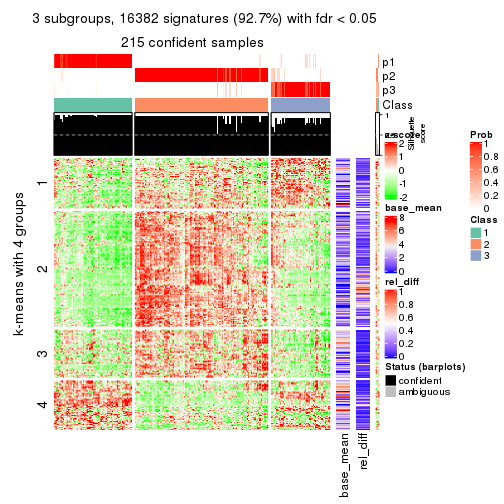</p>

</div>
<div id='tab-MAD-NMF-get-signatures-3'>
<pre><code class="r">get_signatures(res, k = 4)
</code></pre>

<p></p>

</div>
<div id='tab-MAD-NMF-get-signatures-4'>
<pre><code class="r">get_signatures(res, k = 5)
</code></pre>

<p></p>

</div>
<div id='tab-MAD-NMF-get-signatures-5'>
<pre><code class="r">get_signatures(res, k = 6)
</code></pre>

<p></p>

</div>
</div>


Signature heatmaps where rows are not scaled:


<script>
$( function() {
	$( '#tabs-MAD-NMF-get-signatures-no-scale' ).tabs();
} );
</script>
<div id='tabs-MAD-NMF-get-signatures-no-scale'>
<ul>
<li><a href='#tab-MAD-NMF-get-signatures-no-scale-1'>k = 2</a></li>
<li><a href='#tab-MAD-NMF-get-signatures-no-scale-2'>k = 3</a></li>
<li><a href='#tab-MAD-NMF-get-signatures-no-scale-3'>k = 4</a></li>
<li><a href='#tab-MAD-NMF-get-signatures-no-scale-4'>k = 5</a></li>
<li><a href='#tab-MAD-NMF-get-signatures-no-scale-5'>k = 6</a></li>
</ul>
<div id='tab-MAD-NMF-get-signatures-no-scale-1'>
<pre><code class="r">get_signatures(res, k = 2, scale_rows = FALSE)
</code></pre>

<p></p>

</div>
<div id='tab-MAD-NMF-get-signatures-no-scale-2'>
<pre><code class="r">get_signatures(res, k = 3, scale_rows = FALSE)
</code></pre>

<p></p>

</div>
<div id='tab-MAD-NMF-get-signatures-no-scale-3'>
<pre><code class="r">get_signatures(res, k = 4, scale_rows = FALSE)
</code></pre>

<p></p>

</div>
<div id='tab-MAD-NMF-get-signatures-no-scale-4'>
<pre><code class="r">get_signatures(res, k = 5, scale_rows = FALSE)
</code></pre>

<p></p>

</div>
<div id='tab-MAD-NMF-get-signatures-no-scale-5'>
<pre><code class="r">get_signatures(res, k = 6, scale_rows = FALSE)
</code></pre>

<p></p>

</div>
</div>


Compare the overlap of signatures from different k:

```r
compare_signatures(res)
```


`get_signature()` returns a data frame invisibly. TO get the list of signatures, the function
call should be assigned to a variable explicitly. In following code, if `plot` argument is set
to `FALSE`, no heatmap is plotted while only the differential analysis is performed.

```r
# code only for demonstration
tb = get_signature(res, k = ..., plot = FALSE)
```

An example of the output of `tb` is:

```
#>   which_row         fdr    mean_1    mean_2 scaled_mean_1 scaled_mean_2 km
#> 1        38 0.042760348  8.373488  9.131774    -0.5533452     0.5164555  1
#> 2        40 0.018707592  7.106213  8.469186    -0.6173731     0.5762149  1
#> 3        55 0.019134737 10.221463 11.207825    -0.6159697     0.5749050  1
#> 4        59 0.006059896  5.921854  7.869574    -0.6899429     0.6439467  1
#> 5        60 0.018055526  8.928898 10.211722    -0.6204761     0.5791110  1
#> 6        98 0.009384629 15.714769 14.887706     0.6635654    -0.6193277  2
...
```

The columns in `tb` are:

1. `which_row`: row indices corresponding to the input matrix.
2. `fdr`: FDR for the differential test. 
3. `mean_x`: The mean value in group x.
4. `scaled_mean_x`: The mean value in group x after rows are scaled.
5. `km`: Row groups if k-means clustering is applied to rows.


UMAP plot which shows how samples are separated.


<script>
$( function() {
	$( '#tabs-MAD-NMF-dimension-reduction' ).tabs();
} );
</script>
<div id='tabs-MAD-NMF-dimension-reduction'>
<ul>
<li><a href='#tab-MAD-NMF-dimension-reduction-1'>k = 2</a></li>
<li><a href='#tab-MAD-NMF-dimension-reduction-2'>k = 3</a></li>
<li><a href='#tab-MAD-NMF-dimension-reduction-3'>k = 4</a></li>
<li><a href='#tab-MAD-NMF-dimension-reduction-4'>k = 5</a></li>
<li><a href='#tab-MAD-NMF-dimension-reduction-5'>k = 6</a></li>
</ul>
<div id='tab-MAD-NMF-dimension-reduction-1'>
<pre><code class="r">dimension_reduction(res, k = 2, method = &quot;UMAP&quot;)
</code></pre>

<p></p>

</div>
<div id='tab-MAD-NMF-dimension-reduction-2'>
<pre><code class="r">dimension_reduction(res, k = 3, method = &quot;UMAP&quot;)
</code></pre>

<p></p>

</div>
<div id='tab-MAD-NMF-dimension-reduction-3'>
<pre><code class="r">dimension_reduction(res, k = 4, method = &quot;UMAP&quot;)
</code></pre>

<p></p>

</div>
<div id='tab-MAD-NMF-dimension-reduction-4'>
<pre><code class="r">dimension_reduction(res, k = 5, method = &quot;UMAP&quot;)
</code></pre>

<p></p>

</div>
<div id='tab-MAD-NMF-dimension-reduction-5'>
<pre><code class="r">dimension_reduction(res, k = 6, method = &quot;UMAP&quot;)
</code></pre>

<p></p>

</div>
</div>


Following heatmap shows how subgroups are split when increasing `k`:

```r
collect_classes(res)
```


If matrix rows can be associated to genes, consider to use `GO_Enrichment(res,
...)` to perform function enrichment for the signature genes.


 

---------------------------------------------------


### ATC:hclust


The object with results only for a single top-value method and a single partition method 
can be extracted as:

```r
res = res_list["ATC", "hclust"]
# you can also extract it by
# res = res_list["ATC:hclust"]
```

A summary of `res` and all the functions that can be applied to it:

```r
res
```

```
#> A 'ConsensusPartition' object with k = 2, 3, 4, 5, 6.
#>   On a matrix with 17680 rows and 218 columns.
#>   Top rows (1000, 2000, 3000, 4000, 5000) are extracted by 'ATC' method.
#>   Subgroups are detected by 'hclust' method.
#>   Performed in total 1250 partitions by row resampling.
#>   Best k for subgroups seems to be 2.
#> 
#> Following methods can be applied to this 'ConsensusPartition' object:
#>  [1] "cola_report"             "collect_classes"         "collect_plots"          
#>  [4] "collect_stats"           "colnames"                "compare_signatures"     
#>  [7] "consensus_heatmap"       "dimension_reduction"     "functional_enrichment"  
#> [10] "get_anno_col"            "get_anno"                "get_classes"            
#> [13] "get_consensus"           "get_matrix"              "get_membership"         
#> [16] "get_param"               "get_signatures"          "get_stats"              
#> [19] "is_best_k"               "is_stable_k"             "membership_heatmap"     
#> [22] "ncol"                    "nrow"                    "plot_ecdf"              
#> [25] "rownames"                "select_partition_number" "show"                   
#> [28] "suggest_best_k"          "test_to_known_factors"
```

`collect_plots()` function collects all the plots made from `res` for all `k` (number of partitions)
into one single page to provide an easy and fast comparison between different `k`.

```r
collect_plots(res)
```


The plots are:

- The first row: a plot of the ECDF (Empirical cumulative distribution
  function) curves of the consensus matrix for each `k` and the heatmap of
  predicted classes for each `k`.
- The second row: heatmaps of the consensus matrix for each `k`.
- The third row: heatmaps of the membership matrix for each `k`.
- The fouth row: heatmaps of the signatures for each `k`.

All the plots in panels can be made by individual functions and they are
plotted later in this section.

`select_partition_number()` produces several plots showing different
statistics for choosing "optimized" `k`. There are following statistics:

- ECDF curves of the consensus matrix for each `k`;
- 1-PAC. [The PAC
  score](https://en.wikipedia.org/wiki/Consensus_clustering#Over-interpretation_potential_of_consensus_clustering)
  measures the proportion of the ambiguous subgrouping.
- Mean silhouette score.
- Concordance. The mean probability of fiting the consensus class ids in all
  partitions.
- Area increased. Denote $A_k$ as the area under the ECDF curve for current
  `k`, the area increased is defined as $A_k - A_{k-1}$.
- Rand index. The percent of pairs of samples that are both in a same cluster
  or both are not in a same cluster in the partition of k and k-1.
- Jaccard index. The ratio of pairs of samples are both in a same cluster in
  the partition of k and k-1 and the pairs of samples are both in a same
  cluster in the partition k or k-1.

The detailed explanations of these statistics can be found in [the cola
vignette](http://bioconductor.org/packages/devel/bioc/vignettes/cola/inst/doc/cola.html#toc_13).

Generally speaking, lower PAC score, higher mean silhouette score or higher
concordance corresponds to better partition. Rand index and Jaccard index
measure how similar the current partition is compared to partition with `k-1`.
If they are too similar, we won't accept `k` is better than `k-1`.

```r
select_partition_number(res)
```


The numeric values for all these statistics can be obtained by `get_stats()`.

```r
get_stats(res)
```

```
#>   k 1-PAC mean_silhouette concordance area_increased  Rand Jaccard
#> 2 2 0.879           0.919       0.965         0.4973 0.499   0.499
#> 3 3 0.779           0.849       0.917         0.2487 0.867   0.735
#> 4 4 0.659           0.733       0.771         0.1200 0.887   0.696
#> 5 5 0.703           0.749       0.868         0.0676 0.961   0.858
#> 6 6 0.718           0.663       0.827         0.0453 0.961   0.847
```

`suggest_best_k()` suggests the best $k$ based on these statistics. The rules are as follows:

- All $k$ with Jaccard index larger than 0.95 are removed because the increase of
  the partition number does not provides enough extra information. If all $k$ are removed,
  the best $k$ is assigned by `NA`.
- For $k$ with 1-PAC larger than 0.9, the maximal $k$ is taken as the "best k". Other $k$ is called "optional k".
- If it does not fit the second rule. The $k$ with the highest vote of highest
  1-PAC, mean silhouette and concordance is taken as the "best k".

```r
suggest_best_k(res)
```

```
#> [1] 2
```


Following shows the table of the partitions (You need to click the **show/hide
code output** link to see it). The membership matrix (columns with name `p*`)
is inferred by
[`clue::cl_consensus()`](https://www.rdocumentation.org/link/cl_consensus?package=clue)
function with the `SE` method. Basically the value in the membership matrix
represents the probability to belong to a certain group. The finall class
label for an item is determined with the group with highest probability it
belongs to.

In `get_classes()` function, the entropy is calculated from the membership
matrix and the silhouette score is calculated from the consensus matrix.


<script>
$( function() {
	$( '#tabs-ATC-hclust-get-classes' ).tabs();
} );
</script>
<div id='tabs-ATC-hclust-get-classes'>
<ul>
<li><a href='#tab-ATC-hclust-get-classes-1'>k = 2</a></li>
<li><a href='#tab-ATC-hclust-get-classes-2'>k = 3</a></li>
<li><a href='#tab-ATC-hclust-get-classes-3'>k = 4</a></li>
<li><a href='#tab-ATC-hclust-get-classes-4'>k = 5</a></li>
<li><a href='#tab-ATC-hclust-get-classes-5'>k = 6</a></li>
</ul>

<div id='tab-ATC-hclust-get-classes-1'>
<p><a id='tab-ATC-hclust-get-classes-1-a' style='color:#0366d6' href='#'>show/hide code output</a></p>
<pre><code class="r">cbind(get_classes(res, k = 2), get_membership(res, k = 2))
</code></pre>

<pre><code>#&gt;            class entropy silhouette    p1    p2
#&gt; SRR1498997     2  0.0000    0.96940 0.000 1.000
#&gt; SRR1076441     1  0.0000    0.95603 1.000 0.000
#&gt; SRR1489803     2  0.0000    0.96940 0.000 1.000
#&gt; SRR1345953     2  0.0000    0.96940 0.000 1.000
#&gt; SRR1357826     2  0.0000    0.96940 0.000 1.000
#&gt; SRR1419656     1  0.0000    0.95603 1.000 0.000
#&gt; SRR1454158     2  0.0376    0.96815 0.004 0.996
#&gt; SRR1475408     2  0.0376    0.96777 0.004 0.996
#&gt; SRR1472704     2  0.0000    0.96940 0.000 1.000
#&gt; SRR1090046     1  0.9983    0.11406 0.524 0.476
#&gt; SRR1312822     1  0.0000    0.95603 1.000 0.000
#&gt; SRR1096987     2  0.0672    0.96613 0.008 0.992
#&gt; SRR1334587     2  0.0000    0.96940 0.000 1.000
#&gt; SRR1490246     1  0.0000    0.95603 1.000 0.000
#&gt; SRR1467522     1  0.0000    0.95603 1.000 0.000
#&gt; SRR1324206     1  0.0000    0.95603 1.000 0.000
#&gt; SRR1408574     2  0.4022    0.90037 0.080 0.920
#&gt; SRR1083959     2  0.0000    0.96940 0.000 1.000
#&gt; SRR1079948     2  0.0376    0.96815 0.004 0.996
#&gt; SRR1310667     2  0.0000    0.96940 0.000 1.000
#&gt; SRR655852      2  0.0376    0.96815 0.004 0.996
#&gt; SRR1352457     2  0.0000    0.96940 0.000 1.000
#&gt; SRR1353994     2  0.0000    0.96940 0.000 1.000
#&gt; SRR1459561     2  0.0000    0.96940 0.000 1.000
#&gt; SRR1454009     1  0.0000    0.95603 1.000 0.000
#&gt; SRR1071084     1  0.0672    0.95238 0.992 0.008
#&gt; SRR1082859     2  0.0000    0.96940 0.000 1.000
#&gt; SRR1086538     1  0.0000    0.95603 1.000 0.000
#&gt; SRR1486262     2  0.0672    0.96613 0.008 0.992
#&gt; SRR658105      1  0.0000    0.95603 1.000 0.000
#&gt; SRR811073      2  0.0000    0.96940 0.000 1.000
#&gt; SRR1429181     2  0.0000    0.96940 0.000 1.000
#&gt; SRR1327896     2  0.0672    0.96613 0.008 0.992
#&gt; SRR1464788     2  0.1843    0.95093 0.028 0.972
#&gt; SRR1346861     2  0.0000    0.96940 0.000 1.000
#&gt; SRR1318774     2  0.2236    0.94387 0.036 0.964
#&gt; SRR1420517     1  0.0000    0.95603 1.000 0.000
#&gt; SRR1369584     2  0.1843    0.95093 0.028 0.972
#&gt; SRR1443244     1  0.8955    0.57302 0.688 0.312
#&gt; SRR1455391     1  0.0000    0.95603 1.000 0.000
#&gt; SRR1068999     1  0.0000    0.95603 1.000 0.000
#&gt; SRR1481297     1  0.0000    0.95603 1.000 0.000
#&gt; SRR1070208     1  0.2778    0.92235 0.952 0.048
#&gt; SRR1317282     1  0.0376    0.95439 0.996 0.004
#&gt; SRR1096125     2  0.0672    0.96613 0.008 0.992
#&gt; SRR1472506     1  0.9393    0.47696 0.644 0.356
#&gt; SRR1388281     2  0.0000    0.96940 0.000 1.000
#&gt; SRR1365622     2  0.0672    0.96613 0.008 0.992
#&gt; SRR662306      1  0.1184    0.94707 0.984 0.016
#&gt; SRR662811      1  0.0000    0.95603 1.000 0.000
#&gt; SRR820571      1  0.9815    0.30708 0.580 0.420
#&gt; SRR1357166     1  0.0376    0.95439 0.996 0.004
#&gt; SRR1488586     1  0.4022    0.89422 0.920 0.080
#&gt; SRR1485398     1  0.0000    0.95603 1.000 0.000
#&gt; SRR1417725     2  0.9491    0.40924 0.368 0.632
#&gt; SRR1409397     2  0.0000    0.96940 0.000 1.000
#&gt; SRR1465693     2  0.0000    0.96940 0.000 1.000
#&gt; SRR1096547     1  0.7883    0.70400 0.764 0.236
#&gt; SRR1456818     1  0.0000    0.95603 1.000 0.000
#&gt; SRR816336      1  0.7950    0.69777 0.760 0.240
#&gt; SRR1420238     1  0.0000    0.95603 1.000 0.000
#&gt; SRR1433374     1  0.0672    0.95238 0.992 0.008
#&gt; SRR1436990     1  0.0000    0.95603 1.000 0.000
#&gt; SRR662378      1  0.0000    0.95603 1.000 0.000
#&gt; SRR1477671     1  0.0000    0.95603 1.000 0.000
#&gt; SRR1084079     1  0.8909    0.58127 0.692 0.308
#&gt; SRR1102949     1  0.0000    0.95603 1.000 0.000
#&gt; SRR1458090     1  0.0000    0.95603 1.000 0.000
#&gt; SRR1418729     2  0.5178    0.86044 0.116 0.884
#&gt; SRR1403814     2  0.1414    0.95751 0.020 0.980
#&gt; SRR1404887     1  0.8955    0.57302 0.688 0.312
#&gt; SRR1434955     1  0.0000    0.95603 1.000 0.000
#&gt; SRR1360652     1  0.0000    0.95603 1.000 0.000
#&gt; SRR1356765     2  0.0672    0.96613 0.008 0.992
#&gt; SRR1078258     2  0.0000    0.96940 0.000 1.000
#&gt; SRR1455861     1  0.0000    0.95603 1.000 0.000
#&gt; SRR1420296     2  0.0000    0.96940 0.000 1.000
#&gt; SRR1070260     2  0.0000    0.96940 0.000 1.000
#&gt; SRR1410765     1  0.0000    0.95603 1.000 0.000
#&gt; SRR1481315     1  0.0000    0.95603 1.000 0.000
#&gt; SRR1414661     2  0.0000    0.96940 0.000 1.000
#&gt; SRR1359147     2  0.0376    0.96815 0.004 0.996
#&gt; SRR1488694     1  0.4298    0.88661 0.912 0.088
#&gt; SRR1477273     1  0.0672    0.95238 0.992 0.008
#&gt; SRR1415792     1  0.3733    0.90115 0.928 0.072
#&gt; SRR1369088     2  0.1633    0.95433 0.024 0.976
#&gt; SRR1406621     2  0.2236    0.94387 0.036 0.964
#&gt; SRR1401017     2  0.0000    0.96940 0.000 1.000
#&gt; SRR1099981     2  0.0000    0.96940 0.000 1.000
#&gt; SRR815208      2  0.0000    0.96940 0.000 1.000
#&gt; SRR1380460     2  0.0376    0.96815 0.004 0.996
#&gt; SRR1091097     2  0.0000    0.96940 0.000 1.000
#&gt; SRR1456010     1  0.0000    0.95603 1.000 0.000
#&gt; SRR1498416     2  0.1843    0.95093 0.028 0.972
#&gt; SRR818873      2  0.0000    0.96940 0.000 1.000
#&gt; SRR813868      2  0.0376    0.96815 0.004 0.996
#&gt; SRR1394912     1  0.0000    0.95603 1.000 0.000
#&gt; SRR1475824     2  0.0672    0.96613 0.008 0.992
#&gt; SRR1459866     1  0.0000    0.95603 1.000 0.000
#&gt; SRR1364871     2  0.9996    0.00664 0.488 0.512
#&gt; SRR1100472     2  0.0000    0.96940 0.000 1.000
#&gt; SRR1331267     1  0.5946    0.82750 0.856 0.144
#&gt; SRR1068977     2  0.0672    0.96613 0.008 0.992
#&gt; SRR1391511     2  0.0000    0.96940 0.000 1.000
#&gt; SRR1077920     2  0.0000    0.96940 0.000 1.000
#&gt; SRR1457705     1  0.0000    0.95603 1.000 0.000
#&gt; SRR1437073     1  0.0000    0.95603 1.000 0.000
#&gt; SRR1473124     1  0.0000    0.95603 1.000 0.000
#&gt; SRR1469279     1  0.0000    0.95603 1.000 0.000
#&gt; SRR1091791     2  0.0672    0.96613 0.008 0.992
#&gt; SRR1341539     2  0.4815    0.87410 0.104 0.896
#&gt; SRR1446354     1  0.0000    0.95603 1.000 0.000
#&gt; SRR1415420     1  0.0000    0.95603 1.000 0.000
#&gt; SRR1368050     1  0.0000    0.95603 1.000 0.000
#&gt; SRR656970      2  0.0000    0.96940 0.000 1.000
#&gt; SRR1473403     2  0.0000    0.96940 0.000 1.000
#&gt; SRR1084674     1  0.3431    0.90877 0.936 0.064
#&gt; SRR1464702     1  0.0000    0.95603 1.000 0.000
#&gt; SRR1074860     1  0.8909    0.58127 0.692 0.308
#&gt; SRR655447      2  0.0000    0.96940 0.000 1.000
#&gt; SRR1404442     2  0.0000    0.96940 0.000 1.000
#&gt; SRR1418795     1  0.0000    0.95603 1.000 0.000
#&gt; SRR1458335     2  0.5059    0.86504 0.112 0.888
#&gt; SRR1489589     2  0.0000    0.96940 0.000 1.000
#&gt; SRR1378284     1  0.0000    0.95603 1.000 0.000
#&gt; SRR1408014     2  0.0000    0.96940 0.000 1.000
#&gt; SRR1083052     1  0.0000    0.95603 1.000 0.000
#&gt; SRR1339236     2  0.0376    0.96777 0.004 0.996
#&gt; SRR1323829     2  0.0000    0.96940 0.000 1.000
#&gt; SRR1086772     2  0.0000    0.96940 0.000 1.000
#&gt; SRR1486457     1  0.5408    0.84782 0.876 0.124
#&gt; SRR1415257     2  0.0000    0.96940 0.000 1.000
#&gt; SRR1071905     1  0.0376    0.95439 0.996 0.004
#&gt; SRR659223      2  0.0000    0.96940 0.000 1.000
#&gt; SRR1386945     1  0.0376    0.95439 0.996 0.004
#&gt; SRR821498      2  0.5059    0.86504 0.112 0.888
#&gt; SRR1378903     2  0.1414    0.95751 0.020 0.980
#&gt; SRR1472907     1  0.0000    0.95603 1.000 0.000
#&gt; SRR1442313     2  0.0000    0.96940 0.000 1.000
#&gt; SRR1077139     2  0.0000    0.96940 0.000 1.000
#&gt; SRR1342758     1  0.0000    0.95603 1.000 0.000
#&gt; SRR656911      2  0.0376    0.96815 0.004 0.996
#&gt; SRR1070738     1  0.0000    0.95603 1.000 0.000
#&gt; SRR1476950     1  0.0000    0.95603 1.000 0.000
#&gt; SRR1488196     1  0.0672    0.95238 0.992 0.008
#&gt; SRR1498951     1  0.0000    0.95603 1.000 0.000
#&gt; SRR1413392     1  0.0000    0.95603 1.000 0.000
#&gt; SRR657528      2  0.0000    0.96940 0.000 1.000
#&gt; SRR812198      1  0.0000    0.95603 1.000 0.000
#&gt; SRR660283      2  0.0000    0.96940 0.000 1.000
#&gt; SRR1420936     1  0.0000    0.95603 1.000 0.000
#&gt; SRR1469547     2  0.0000    0.96940 0.000 1.000
#&gt; SRR1322249     1  0.0000    0.95603 1.000 0.000
#&gt; SRR1396682     1  0.0000    0.95603 1.000 0.000
#&gt; SRR1095816     2  0.0376    0.96815 0.004 0.996
#&gt; SRR1081023     1  0.0000    0.95603 1.000 0.000
#&gt; SRR1092517     2  0.0000    0.96940 0.000 1.000
#&gt; SRR811285      2  0.0000    0.96940 0.000 1.000
#&gt; SRR657018      1  0.0000    0.95603 1.000 0.000
#&gt; SRR1365534     1  0.0672    0.95238 0.992 0.008
#&gt; SRR1090791     2  0.0000    0.96940 0.000 1.000
#&gt; SRR1439915     2  0.0000    0.96940 0.000 1.000
#&gt; SRR1391575     2  0.9427    0.42822 0.360 0.640
#&gt; SRR1314092     2  0.0000    0.96940 0.000 1.000
#&gt; SRR1328941     1  0.0672    0.95238 0.992 0.008
#&gt; SRR1336181     2  0.0000    0.96940 0.000 1.000
#&gt; SRR1362972     1  0.0000    0.95603 1.000 0.000
#&gt; SRR1366790     2  0.0000    0.96940 0.000 1.000
#&gt; SRR1455902     1  0.0672    0.95238 0.992 0.008
#&gt; SRR1437644     2  0.8267    0.64654 0.260 0.740
#&gt; SRR1105009     2  0.0000    0.96940 0.000 1.000
#&gt; SRR1367024     1  0.0672    0.95238 0.992 0.008
#&gt; SRR660248      2  0.0000    0.96940 0.000 1.000
#&gt; SRR1409620     1  0.0000    0.95603 1.000 0.000
#&gt; SRR1455807     2  0.0000    0.96940 0.000 1.000
#&gt; SRR1339431     1  0.0000    0.95603 1.000 0.000
#&gt; SRR1378948     1  0.9427    0.46750 0.640 0.360
#&gt; SRR1469237     1  0.0000    0.95603 1.000 0.000
#&gt; SRR1098264     2  0.0000    0.96940 0.000 1.000
#&gt; SRR1406224     2  0.0672    0.96613 0.008 0.992
#&gt; SRR1393026     1  0.0376    0.95439 0.996 0.004
#&gt; SRR808428      2  0.0000    0.96940 0.000 1.000
#&gt; SRR615910      2  0.0000    0.96940 0.000 1.000
#&gt; SRR1076219     1  0.0000    0.95603 1.000 0.000
#&gt; SRR1481128     1  0.0000    0.95603 1.000 0.000
#&gt; SRR1359262     2  0.0000    0.96940 0.000 1.000
#&gt; SRR1407648     2  0.0672    0.96613 0.008 0.992
#&gt; SRR1386775     1  0.7056    0.76766 0.808 0.192
#&gt; SRR1388399     2  0.7883    0.69447 0.236 0.764
#&gt; SRR1361499     2  0.0000    0.96940 0.000 1.000
#&gt; SRR1500709     2  0.0376    0.96815 0.004 0.996
#&gt; SRR1335917     1  0.0000    0.95603 1.000 0.000
#&gt; SRR1430615     2  0.0000    0.96940 0.000 1.000
#&gt; SRR1335212     1  0.2043    0.93504 0.968 0.032
#&gt; SRR1400159     2  0.9000    0.53461 0.316 0.684
#&gt; SRR1457245     2  0.0000    0.96940 0.000 1.000
#&gt; SRR1356746     2  0.0000    0.96940 0.000 1.000
#&gt; SRR658319      2  0.0000    0.96940 0.000 1.000
#&gt; SRR1435946     1  0.0000    0.95603 1.000 0.000
#&gt; SRR1370308     1  0.0000    0.95603 1.000 0.000
#&gt; SRR1100893     1  0.0000    0.95603 1.000 0.000
#&gt; SRR1389432     1  0.0376    0.95439 0.996 0.004
#&gt; SRR1381799     2  0.0376    0.96815 0.004 0.996
#&gt; SRR1310158     1  0.0672    0.95238 0.992 0.008
#&gt; SRR1341100     2  0.9427    0.42822 0.360 0.640
#&gt; SRR1342873     1  0.0000    0.95603 1.000 0.000
#&gt; SRR1472102     2  0.0000    0.96940 0.000 1.000
#&gt; SRR1409421     1  0.0000    0.95603 1.000 0.000
#&gt; SRR1328577     2  0.0000    0.96940 0.000 1.000
#&gt; SRR808942      2  0.0376    0.96815 0.004 0.996
#&gt; SRR1343818     2  0.0000    0.96940 0.000 1.000
#&gt; SRR1472415     2  0.0000    0.96940 0.000 1.000
#&gt; SRR658409      2  0.0376    0.96815 0.004 0.996
#&gt; SRR1469681     1  0.0000    0.95603 1.000 0.000
#&gt; SRR1075484     2  0.0000    0.96940 0.000 1.000
#&gt; SRR1417894     1  0.0672    0.95238 0.992 0.008
#&gt; SRR1417422     2  0.0672    0.96613 0.008 0.992
#&gt; SRR1090674     1  0.0000    0.95603 1.000 0.000
</code></pre>

<script>
$('#tab-ATC-hclust-get-classes-1-a').parent().next().next().hide();
$('#tab-ATC-hclust-get-classes-1-a').click(function(){
  $('#tab-ATC-hclust-get-classes-1-a').parent().next().next().toggle();
  return(false);
});
</script>
</div>

<div id='tab-ATC-hclust-get-classes-2'>
<p><a id='tab-ATC-hclust-get-classes-2-a' style='color:#0366d6' href='#'>show/hide code output</a></p>
<pre><code class="r">cbind(get_classes(res, k = 3), get_membership(res, k = 3))
</code></pre>

<pre><code>#&gt;            class entropy silhouette    p1    p2    p3
#&gt; SRR1498997     2  0.0892     0.9477 0.000 0.980 0.020
#&gt; SRR1076441     1  0.0000     0.9478 1.000 0.000 0.000
#&gt; SRR1489803     2  0.0237     0.9515 0.000 0.996 0.004
#&gt; SRR1345953     2  0.0000     0.9517 0.000 1.000 0.000
#&gt; SRR1357826     2  0.0000     0.9517 0.000 1.000 0.000
#&gt; SRR1419656     1  0.0000     0.9478 1.000 0.000 0.000
#&gt; SRR1454158     2  0.3879     0.8448 0.000 0.848 0.152
#&gt; SRR1475408     3  0.6192     0.4329 0.000 0.420 0.580
#&gt; SRR1472704     2  0.0000     0.9517 0.000 1.000 0.000
#&gt; SRR1090046     3  0.6302    -0.0328 0.480 0.000 0.520
#&gt; SRR1312822     1  0.0000     0.9478 1.000 0.000 0.000
#&gt; SRR1096987     3  0.4235     0.7309 0.000 0.176 0.824
#&gt; SRR1334587     2  0.1643     0.9378 0.000 0.956 0.044
#&gt; SRR1490246     1  0.0000     0.9478 1.000 0.000 0.000
#&gt; SRR1467522     1  0.0000     0.9478 1.000 0.000 0.000
#&gt; SRR1324206     1  0.0592     0.9454 0.988 0.000 0.012
#&gt; SRR1408574     3  0.2297     0.7373 0.036 0.020 0.944
#&gt; SRR1083959     2  0.0237     0.9515 0.000 0.996 0.004
#&gt; SRR1079948     3  0.6267     0.3243 0.000 0.452 0.548
#&gt; SRR1310667     2  0.0237     0.9515 0.000 0.996 0.004
#&gt; SRR655852      3  0.6215     0.3918 0.000 0.428 0.572
#&gt; SRR1352457     2  0.1289     0.9420 0.000 0.968 0.032
#&gt; SRR1353994     2  0.1643     0.9385 0.000 0.956 0.044
#&gt; SRR1459561     2  0.0237     0.9515 0.000 0.996 0.004
#&gt; SRR1454009     1  0.0592     0.9455 0.988 0.000 0.012
#&gt; SRR1071084     1  0.1411     0.9357 0.964 0.000 0.036
#&gt; SRR1082859     2  0.0000     0.9517 0.000 1.000 0.000
#&gt; SRR1086538     1  0.0000     0.9478 1.000 0.000 0.000
#&gt; SRR1486262     3  0.4235     0.7309 0.000 0.176 0.824
#&gt; SRR658105      1  0.0000     0.9478 1.000 0.000 0.000
#&gt; SRR811073      2  0.0000     0.9517 0.000 1.000 0.000
#&gt; SRR1429181     2  0.3340     0.8827 0.000 0.880 0.120
#&gt; SRR1327896     3  0.4235     0.7309 0.000 0.176 0.824
#&gt; SRR1464788     3  0.1643     0.7333 0.000 0.044 0.956
#&gt; SRR1346861     2  0.0000     0.9517 0.000 1.000 0.000
#&gt; SRR1318774     3  0.0424     0.7280 0.000 0.008 0.992
#&gt; SRR1420517     1  0.0000     0.9478 1.000 0.000 0.000
#&gt; SRR1369584     3  0.1643     0.7333 0.000 0.044 0.956
#&gt; SRR1443244     1  0.5926     0.5148 0.644 0.000 0.356
#&gt; SRR1455391     1  0.0237     0.9472 0.996 0.000 0.004
#&gt; SRR1068999     1  0.0000     0.9478 1.000 0.000 0.000
#&gt; SRR1481297     1  0.0000     0.9478 1.000 0.000 0.000
#&gt; SRR1070208     1  0.2625     0.9010 0.916 0.000 0.084
#&gt; SRR1317282     1  0.1289     0.9377 0.968 0.000 0.032
#&gt; SRR1096125     3  0.4291     0.7288 0.000 0.180 0.820
#&gt; SRR1472506     1  0.6126     0.4115 0.600 0.000 0.400
#&gt; SRR1388281     2  0.0000     0.9517 0.000 1.000 0.000
#&gt; SRR1365622     3  0.5465     0.6446 0.000 0.288 0.712
#&gt; SRR662306      1  0.1753     0.9290 0.952 0.000 0.048
#&gt; SRR662811      1  0.0000     0.9478 1.000 0.000 0.000
#&gt; SRR820571      1  0.6286     0.2353 0.536 0.000 0.464
#&gt; SRR1357166     1  0.0892     0.9428 0.980 0.000 0.020
#&gt; SRR1488586     1  0.3267     0.8701 0.884 0.000 0.116
#&gt; SRR1485398     1  0.0000     0.9478 1.000 0.000 0.000
#&gt; SRR1417725     3  0.6129     0.4215 0.324 0.008 0.668
#&gt; SRR1409397     2  0.2448     0.9178 0.000 0.924 0.076
#&gt; SRR1465693     2  0.0000     0.9517 0.000 1.000 0.000
#&gt; SRR1096547     1  0.5363     0.6555 0.724 0.000 0.276
#&gt; SRR1456818     1  0.1031     0.9419 0.976 0.000 0.024
#&gt; SRR816336      1  0.5397     0.6543 0.720 0.000 0.280
#&gt; SRR1420238     1  0.0000     0.9478 1.000 0.000 0.000
#&gt; SRR1433374     1  0.1411     0.9357 0.964 0.000 0.036
#&gt; SRR1436990     1  0.0000     0.9478 1.000 0.000 0.000
#&gt; SRR662378      1  0.0424     0.9464 0.992 0.000 0.008
#&gt; SRR1477671     1  0.0000     0.9478 1.000 0.000 0.000
#&gt; SRR1084079     1  0.5882     0.5346 0.652 0.000 0.348
#&gt; SRR1102949     1  0.0000     0.9478 1.000 0.000 0.000
#&gt; SRR1458090     1  0.0000     0.9478 1.000 0.000 0.000
#&gt; SRR1418729     3  0.2774     0.7290 0.072 0.008 0.920
#&gt; SRR1403814     3  0.3412     0.7415 0.000 0.124 0.876
#&gt; SRR1404887     1  0.5926     0.5148 0.644 0.000 0.356
#&gt; SRR1434955     1  0.0000     0.9478 1.000 0.000 0.000
#&gt; SRR1360652     1  0.0237     0.9472 0.996 0.000 0.004
#&gt; SRR1356765     3  0.6299     0.2508 0.000 0.476 0.524
#&gt; SRR1078258     2  0.0000     0.9517 0.000 1.000 0.000
#&gt; SRR1455861     1  0.0000     0.9478 1.000 0.000 0.000
#&gt; SRR1420296     2  0.0237     0.9515 0.000 0.996 0.004
#&gt; SRR1070260     2  0.0000     0.9517 0.000 1.000 0.000
#&gt; SRR1410765     1  0.0000     0.9478 1.000 0.000 0.000
#&gt; SRR1481315     1  0.0000     0.9478 1.000 0.000 0.000
#&gt; SRR1414661     2  0.0892     0.9477 0.000 0.980 0.020
#&gt; SRR1359147     2  0.3267     0.8863 0.000 0.884 0.116
#&gt; SRR1488694     1  0.3412     0.8625 0.876 0.000 0.124
#&gt; SRR1477273     1  0.1411     0.9357 0.964 0.000 0.036
#&gt; SRR1415792     1  0.3038     0.8808 0.896 0.000 0.104
#&gt; SRR1369088     3  0.3340     0.7421 0.000 0.120 0.880
#&gt; SRR1406621     3  0.0424     0.7280 0.000 0.008 0.992
#&gt; SRR1401017     2  0.2448     0.9178 0.000 0.924 0.076
#&gt; SRR1099981     2  0.0000     0.9517 0.000 1.000 0.000
#&gt; SRR815208      2  0.0000     0.9517 0.000 1.000 0.000
#&gt; SRR1380460     2  0.4002     0.8318 0.000 0.840 0.160
#&gt; SRR1091097     2  0.3038     0.8985 0.000 0.896 0.104
#&gt; SRR1456010     1  0.0000     0.9478 1.000 0.000 0.000
#&gt; SRR1498416     3  0.1643     0.7333 0.000 0.044 0.956
#&gt; SRR818873      2  0.1529     0.9408 0.000 0.960 0.040
#&gt; SRR813868      3  0.5905     0.5509 0.000 0.352 0.648
#&gt; SRR1394912     1  0.0000     0.9478 1.000 0.000 0.000
#&gt; SRR1475824     3  0.5678     0.6115 0.000 0.316 0.684
#&gt; SRR1459866     1  0.0000     0.9478 1.000 0.000 0.000
#&gt; SRR1364871     3  0.6252     0.0722 0.444 0.000 0.556
#&gt; SRR1100472     2  0.0000     0.9517 0.000 1.000 0.000
#&gt; SRR1331267     1  0.4291     0.8001 0.820 0.000 0.180
#&gt; SRR1068977     3  0.5678     0.6115 0.000 0.316 0.684
#&gt; SRR1391511     2  0.0892     0.9477 0.000 0.980 0.020
#&gt; SRR1077920     2  0.0000     0.9517 0.000 1.000 0.000
#&gt; SRR1457705     1  0.0424     0.9464 0.992 0.000 0.008
#&gt; SRR1437073     1  0.0237     0.9472 0.996 0.000 0.004
#&gt; SRR1473124     1  0.0747     0.9444 0.984 0.000 0.016
#&gt; SRR1469279     1  0.0000     0.9478 1.000 0.000 0.000
#&gt; SRR1091791     3  0.4235     0.7309 0.000 0.176 0.824
#&gt; SRR1341539     3  0.2651     0.7320 0.060 0.012 0.928
#&gt; SRR1446354     1  0.0424     0.9464 0.992 0.000 0.008
#&gt; SRR1415420     1  0.0000     0.9478 1.000 0.000 0.000
#&gt; SRR1368050     1  0.0237     0.9472 0.996 0.000 0.004
#&gt; SRR656970      2  0.0000     0.9517 0.000 1.000 0.000
#&gt; SRR1473403     2  0.0000     0.9517 0.000 1.000 0.000
#&gt; SRR1084674     1  0.3038     0.8834 0.896 0.000 0.104
#&gt; SRR1464702     1  0.0000     0.9478 1.000 0.000 0.000
#&gt; SRR1074860     1  0.5882     0.5346 0.652 0.000 0.348
#&gt; SRR655447      2  0.2796     0.9079 0.000 0.908 0.092
#&gt; SRR1404442     2  0.0000     0.9517 0.000 1.000 0.000
#&gt; SRR1418795     1  0.0000     0.9478 1.000 0.000 0.000
#&gt; SRR1458335     3  0.2998     0.7323 0.068 0.016 0.916
#&gt; SRR1489589     2  0.2448     0.9178 0.000 0.924 0.076
#&gt; SRR1378284     1  0.0000     0.9478 1.000 0.000 0.000
#&gt; SRR1408014     2  0.2165     0.9250 0.000 0.936 0.064
#&gt; SRR1083052     1  0.1031     0.9419 0.976 0.000 0.024
#&gt; SRR1339236     3  0.6225     0.4065 0.000 0.432 0.568
#&gt; SRR1323829     2  0.0000     0.9517 0.000 1.000 0.000
#&gt; SRR1086772     2  0.0000     0.9517 0.000 1.000 0.000
#&gt; SRR1486457     1  0.3941     0.8205 0.844 0.000 0.156
#&gt; SRR1415257     2  0.0000     0.9517 0.000 1.000 0.000
#&gt; SRR1071905     1  0.0892     0.9428 0.980 0.000 0.020
#&gt; SRR659223      2  0.0000     0.9517 0.000 1.000 0.000
#&gt; SRR1386945     1  0.1289     0.9377 0.968 0.000 0.032
#&gt; SRR821498      3  0.2680     0.7296 0.068 0.008 0.924
#&gt; SRR1378903     3  0.3412     0.7415 0.000 0.124 0.876
#&gt; SRR1472907     1  0.0424     0.9464 0.992 0.000 0.008
#&gt; SRR1442313     2  0.0000     0.9517 0.000 1.000 0.000
#&gt; SRR1077139     2  0.0000     0.9517 0.000 1.000 0.000
#&gt; SRR1342758     1  0.0000     0.9478 1.000 0.000 0.000
#&gt; SRR656911      2  0.3192     0.8902 0.000 0.888 0.112
#&gt; SRR1070738     1  0.0000     0.9478 1.000 0.000 0.000
#&gt; SRR1476950     1  0.0592     0.9454 0.988 0.000 0.012
#&gt; SRR1488196     1  0.1411     0.9357 0.964 0.000 0.036
#&gt; SRR1498951     1  0.0892     0.9430 0.980 0.000 0.020
#&gt; SRR1413392     1  0.0000     0.9478 1.000 0.000 0.000
#&gt; SRR657528      2  0.2959     0.9013 0.000 0.900 0.100
#&gt; SRR812198      1  0.0000     0.9478 1.000 0.000 0.000
#&gt; SRR660283      2  0.0892     0.9477 0.000 0.980 0.020
#&gt; SRR1420936     1  0.0000     0.9478 1.000 0.000 0.000
#&gt; SRR1469547     2  0.0000     0.9517 0.000 1.000 0.000
#&gt; SRR1322249     1  0.1031     0.9419 0.976 0.000 0.024
#&gt; SRR1396682     1  0.0000     0.9478 1.000 0.000 0.000
#&gt; SRR1095816     3  0.5363     0.6570 0.000 0.276 0.724
#&gt; SRR1081023     1  0.0000     0.9478 1.000 0.000 0.000
#&gt; SRR1092517     2  0.2796     0.9079 0.000 0.908 0.092
#&gt; SRR811285      2  0.1643     0.9378 0.000 0.956 0.044
#&gt; SRR657018      1  0.0000     0.9478 1.000 0.000 0.000
#&gt; SRR1365534     1  0.1411     0.9357 0.964 0.000 0.036
#&gt; SRR1090791     2  0.0237     0.9515 0.000 0.996 0.004
#&gt; SRR1439915     2  0.1529     0.9408 0.000 0.960 0.040
#&gt; SRR1391575     3  0.6422     0.4309 0.324 0.016 0.660
#&gt; SRR1314092     2  0.3340     0.8827 0.000 0.880 0.120
#&gt; SRR1328941     1  0.1411     0.9357 0.964 0.000 0.036
#&gt; SRR1336181     2  0.0000     0.9517 0.000 1.000 0.000
#&gt; SRR1362972     1  0.0000     0.9478 1.000 0.000 0.000
#&gt; SRR1366790     2  0.3116     0.8944 0.000 0.892 0.108
#&gt; SRR1455902     1  0.1411     0.9357 0.964 0.000 0.036
#&gt; SRR1437644     3  0.5967     0.6120 0.216 0.032 0.752
#&gt; SRR1105009     2  0.0000     0.9517 0.000 1.000 0.000
#&gt; SRR1367024     1  0.1411     0.9357 0.964 0.000 0.036
#&gt; SRR660248      2  0.3340     0.8769 0.000 0.880 0.120
#&gt; SRR1409620     1  0.0000     0.9478 1.000 0.000 0.000
#&gt; SRR1455807     2  0.0000     0.9517 0.000 1.000 0.000
#&gt; SRR1339431     1  0.0000     0.9478 1.000 0.000 0.000
#&gt; SRR1378948     1  0.6140     0.4008 0.596 0.000 0.404
#&gt; SRR1469237     1  0.0000     0.9478 1.000 0.000 0.000
#&gt; SRR1098264     2  0.0000     0.9517 0.000 1.000 0.000
#&gt; SRR1406224     3  0.4796     0.7053 0.000 0.220 0.780
#&gt; SRR1393026     1  0.1031     0.9411 0.976 0.000 0.024
#&gt; SRR808428      2  0.0000     0.9517 0.000 1.000 0.000
#&gt; SRR615910      2  0.0000     0.9517 0.000 1.000 0.000
#&gt; SRR1076219     1  0.0000     0.9478 1.000 0.000 0.000
#&gt; SRR1481128     1  0.0000     0.9478 1.000 0.000 0.000
#&gt; SRR1359262     2  0.0237     0.9515 0.000 0.996 0.004
#&gt; SRR1407648     3  0.4235     0.7309 0.000 0.176 0.824
#&gt; SRR1386775     1  0.4974     0.7241 0.764 0.000 0.236
#&gt; SRR1388399     3  0.5072     0.6515 0.196 0.012 0.792
#&gt; SRR1361499     2  0.1031     0.9444 0.000 0.976 0.024
#&gt; SRR1500709     3  0.6235     0.3691 0.000 0.436 0.564
#&gt; SRR1335917     1  0.0000     0.9478 1.000 0.000 0.000
#&gt; SRR1430615     2  0.0237     0.9515 0.000 0.996 0.004
#&gt; SRR1335212     1  0.2165     0.9169 0.936 0.000 0.064
#&gt; SRR1400159     3  0.5553     0.5198 0.272 0.004 0.724
#&gt; SRR1457245     2  0.0000     0.9517 0.000 1.000 0.000
#&gt; SRR1356746     2  0.0000     0.9517 0.000 1.000 0.000
#&gt; SRR658319      2  0.3267     0.8816 0.000 0.884 0.116
#&gt; SRR1435946     1  0.0000     0.9478 1.000 0.000 0.000
#&gt; SRR1370308     1  0.0000     0.9478 1.000 0.000 0.000
#&gt; SRR1100893     1  0.0000     0.9478 1.000 0.000 0.000
#&gt; SRR1389432     1  0.0892     0.9428 0.980 0.000 0.020
#&gt; SRR1381799     2  0.3879     0.8448 0.000 0.848 0.152
#&gt; SRR1310158     1  0.1411     0.9357 0.964 0.000 0.036
#&gt; SRR1341100     3  0.6422     0.4309 0.324 0.016 0.660
#&gt; SRR1342873     1  0.0424     0.9464 0.992 0.000 0.008
#&gt; SRR1472102     2  0.4605     0.7672 0.000 0.796 0.204
#&gt; SRR1409421     1  0.0000     0.9478 1.000 0.000 0.000
#&gt; SRR1328577     2  0.1964     0.9324 0.000 0.944 0.056
#&gt; SRR808942      2  0.3879     0.8448 0.000 0.848 0.152
#&gt; SRR1343818     2  0.4702     0.7474 0.000 0.788 0.212
#&gt; SRR1472415     2  0.0000     0.9517 0.000 1.000 0.000
#&gt; SRR658409      3  0.5363     0.6570 0.000 0.276 0.724
#&gt; SRR1469681     1  0.0000     0.9478 1.000 0.000 0.000
#&gt; SRR1075484     2  0.2959     0.9013 0.000 0.900 0.100
#&gt; SRR1417894     1  0.1411     0.9357 0.964 0.000 0.036
#&gt; SRR1417422     3  0.6299     0.2508 0.000 0.476 0.524
#&gt; SRR1090674     1  0.0000     0.9478 1.000 0.000 0.000
</code></pre>

<script>
$('#tab-ATC-hclust-get-classes-2-a').parent().next().next().hide();
$('#tab-ATC-hclust-get-classes-2-a').click(function(){
  $('#tab-ATC-hclust-get-classes-2-a').parent().next().next().toggle();
  return(false);
});
</script>
</div>

<div id='tab-ATC-hclust-get-classes-3'>
<p><a id='tab-ATC-hclust-get-classes-3-a' style='color:#0366d6' href='#'>show/hide code output</a></p>
<pre><code class="r">cbind(get_classes(res, k = 4), get_membership(res, k = 4))
</code></pre>

<pre><code>#&gt;            class entropy silhouette    p1    p2    p3    p4
#&gt; SRR1498997     2  0.1042     0.9368 0.008 0.972 0.000 0.020
#&gt; SRR1076441     1  0.4804     0.9598 0.616 0.000 0.384 0.000
#&gt; SRR1489803     2  0.0188     0.9421 0.000 0.996 0.000 0.004
#&gt; SRR1345953     2  0.0000     0.9423 0.000 1.000 0.000 0.000
#&gt; SRR1357826     2  0.0000     0.9423 0.000 1.000 0.000 0.000
#&gt; SRR1419656     1  0.4830     0.9574 0.608 0.000 0.392 0.000
#&gt; SRR1454158     2  0.3900     0.8212 0.020 0.816 0.000 0.164
#&gt; SRR1475408     4  0.5919     0.4898 0.028 0.380 0.008 0.584
#&gt; SRR1472704     2  0.0000     0.9423 0.000 1.000 0.000 0.000
#&gt; SRR1090046     3  0.5685     0.0703 0.024 0.000 0.516 0.460
#&gt; SRR1312822     1  0.4804     0.9598 0.616 0.000 0.384 0.000
#&gt; SRR1096987     4  0.3306     0.7374 0.000 0.156 0.004 0.840
#&gt; SRR1334587     2  0.1576     0.9272 0.004 0.948 0.000 0.048
#&gt; SRR1490246     1  0.4843     0.9553 0.604 0.000 0.396 0.000
#&gt; SRR1467522     1  0.4989     0.8418 0.528 0.000 0.472 0.000
#&gt; SRR1324206     3  0.4164     0.2210 0.264 0.000 0.736 0.000
#&gt; SRR1408574     4  0.2510     0.6791 0.012 0.008 0.064 0.916
#&gt; SRR1083959     2  0.0188     0.9422 0.000 0.996 0.000 0.004
#&gt; SRR1079948     4  0.5105     0.3543 0.004 0.432 0.000 0.564
#&gt; SRR1310667     2  0.0336     0.9419 0.000 0.992 0.000 0.008
#&gt; SRR655852      4  0.5050     0.4198 0.004 0.408 0.000 0.588
#&gt; SRR1352457     2  0.1022     0.9332 0.000 0.968 0.000 0.032
#&gt; SRR1353994     2  0.1635     0.9281 0.008 0.948 0.000 0.044
#&gt; SRR1459561     2  0.0188     0.9421 0.000 0.996 0.000 0.004
#&gt; SRR1454009     3  0.2216     0.6218 0.092 0.000 0.908 0.000
#&gt; SRR1071084     3  0.0000     0.6909 0.000 0.000 1.000 0.000
#&gt; SRR1082859     2  0.0000     0.9423 0.000 1.000 0.000 0.000
#&gt; SRR1086538     1  0.4866     0.9480 0.596 0.000 0.404 0.000
#&gt; SRR1486262     4  0.3306     0.7374 0.000 0.156 0.004 0.840
#&gt; SRR658105      1  0.4948     0.9052 0.560 0.000 0.440 0.000
#&gt; SRR811073      2  0.0000     0.9423 0.000 1.000 0.000 0.000
#&gt; SRR1429181     2  0.3447     0.8627 0.020 0.852 0.000 0.128
#&gt; SRR1327896     4  0.3306     0.7374 0.000 0.156 0.004 0.840
#&gt; SRR1464788     4  0.5614     0.5965 0.336 0.036 0.000 0.628
#&gt; SRR1346861     2  0.0000     0.9423 0.000 1.000 0.000 0.000
#&gt; SRR1318774     4  0.4643     0.5993 0.344 0.000 0.000 0.656
#&gt; SRR1420517     3  0.3801     0.3881 0.220 0.000 0.780 0.000
#&gt; SRR1369584     4  0.5614     0.5965 0.336 0.036 0.000 0.628
#&gt; SRR1443244     3  0.5137     0.4323 0.024 0.000 0.680 0.296
#&gt; SRR1455391     3  0.4761    -0.3311 0.372 0.000 0.628 0.000
#&gt; SRR1068999     1  0.4804     0.9598 0.616 0.000 0.384 0.000
#&gt; SRR1481297     1  0.4830     0.9574 0.608 0.000 0.392 0.000
#&gt; SRR1070208     3  0.3486     0.6492 0.092 0.000 0.864 0.044
#&gt; SRR1317282     3  0.0188     0.6891 0.004 0.000 0.996 0.000
#&gt; SRR1096125     4  0.3538     0.7347 0.004 0.160 0.004 0.832
#&gt; SRR1472506     3  0.5442     0.3293 0.028 0.000 0.636 0.336
#&gt; SRR1388281     2  0.0188     0.9414 0.000 0.996 0.000 0.004
#&gt; SRR1365622     4  0.4551     0.6597 0.004 0.268 0.004 0.724
#&gt; SRR662306      3  0.0469     0.6906 0.000 0.000 0.988 0.012
#&gt; SRR662811      1  0.4907     0.9318 0.580 0.000 0.420 0.000
#&gt; SRR820571      3  0.5671     0.1856 0.028 0.000 0.572 0.400
#&gt; SRR1357166     3  0.1716     0.6504 0.064 0.000 0.936 0.000
#&gt; SRR1488586     3  0.2596     0.6727 0.024 0.000 0.908 0.068
#&gt; SRR1485398     1  0.4804     0.9598 0.616 0.000 0.384 0.000
#&gt; SRR1417725     4  0.5630     0.3539 0.032 0.000 0.360 0.608
#&gt; SRR1409397     2  0.2662     0.8981 0.016 0.900 0.000 0.084
#&gt; SRR1465693     2  0.0000     0.9423 0.000 1.000 0.000 0.000
#&gt; SRR1096547     3  0.4635     0.5692 0.028 0.000 0.756 0.216
#&gt; SRR1456818     3  0.3933     0.4403 0.200 0.000 0.792 0.008
#&gt; SRR816336      3  0.4671     0.5525 0.028 0.000 0.752 0.220
#&gt; SRR1420238     1  0.4804     0.9598 0.616 0.000 0.384 0.000
#&gt; SRR1433374     3  0.0000     0.6909 0.000 0.000 1.000 0.000
#&gt; SRR1436990     1  0.4804     0.9598 0.616 0.000 0.384 0.000
#&gt; SRR662378      3  0.3569     0.4419 0.196 0.000 0.804 0.000
#&gt; SRR1477671     1  0.4830     0.9573 0.608 0.000 0.392 0.000
#&gt; SRR1084079     3  0.5182     0.4676 0.028 0.000 0.684 0.288
#&gt; SRR1102949     1  0.4804     0.9598 0.616 0.000 0.384 0.000
#&gt; SRR1458090     1  0.4804     0.9598 0.616 0.000 0.384 0.000
#&gt; SRR1418729     4  0.3464     0.6485 0.032 0.000 0.108 0.860
#&gt; SRR1403814     4  0.3547     0.7388 0.020 0.112 0.008 0.860
#&gt; SRR1404887     3  0.5137     0.4323 0.024 0.000 0.680 0.296
#&gt; SRR1434955     1  0.4804     0.9598 0.616 0.000 0.384 0.000
#&gt; SRR1360652     3  0.4643    -0.2096 0.344 0.000 0.656 0.000
#&gt; SRR1356765     4  0.5741     0.3069 0.020 0.440 0.004 0.536
#&gt; SRR1078258     2  0.0000     0.9423 0.000 1.000 0.000 0.000
#&gt; SRR1455861     1  0.4961     0.8926 0.552 0.000 0.448 0.000
#&gt; SRR1420296     2  0.0524     0.9413 0.004 0.988 0.000 0.008
#&gt; SRR1070260     2  0.0000     0.9423 0.000 1.000 0.000 0.000
#&gt; SRR1410765     1  0.4804     0.9598 0.616 0.000 0.384 0.000
#&gt; SRR1481315     3  0.4776    -0.2940 0.376 0.000 0.624 0.000
#&gt; SRR1414661     2  0.1042     0.9368 0.008 0.972 0.000 0.020
#&gt; SRR1359147     2  0.3552     0.8601 0.024 0.848 0.000 0.128
#&gt; SRR1488694     3  0.2593     0.6704 0.016 0.000 0.904 0.080
#&gt; SRR1477273     3  0.0000     0.6909 0.000 0.000 1.000 0.000
#&gt; SRR1415792     3  0.2563     0.6777 0.020 0.000 0.908 0.072
#&gt; SRR1369088     4  0.3257     0.7375 0.012 0.108 0.008 0.872
#&gt; SRR1406621     4  0.4643     0.5993 0.344 0.000 0.000 0.656
#&gt; SRR1401017     2  0.2662     0.8981 0.016 0.900 0.000 0.084
#&gt; SRR1099981     2  0.0000     0.9423 0.000 1.000 0.000 0.000
#&gt; SRR815208      2  0.0000     0.9423 0.000 1.000 0.000 0.000
#&gt; SRR1380460     2  0.4095     0.8036 0.024 0.804 0.000 0.172
#&gt; SRR1091097     2  0.3325     0.8753 0.024 0.864 0.000 0.112
#&gt; SRR1456010     1  0.5000     0.7825 0.504 0.000 0.496 0.000
#&gt; SRR1498416     4  0.5614     0.5965 0.336 0.036 0.000 0.628
#&gt; SRR818873      2  0.1489     0.9298 0.004 0.952 0.000 0.044
#&gt; SRR813868      4  0.4761     0.5717 0.004 0.332 0.000 0.664
#&gt; SRR1394912     1  0.4804     0.9598 0.616 0.000 0.384 0.000
#&gt; SRR1475824     4  0.4737     0.6284 0.004 0.296 0.004 0.696
#&gt; SRR1459866     1  0.4855     0.9527 0.600 0.000 0.400 0.000
#&gt; SRR1364871     4  0.5861     0.0553 0.032 0.000 0.480 0.488
#&gt; SRR1100472     2  0.0000     0.9423 0.000 1.000 0.000 0.000
#&gt; SRR1331267     3  0.3606     0.6388 0.024 0.000 0.844 0.132
#&gt; SRR1068977     4  0.4737     0.6284 0.004 0.296 0.004 0.696
#&gt; SRR1391511     2  0.1042     0.9368 0.008 0.972 0.000 0.020
#&gt; SRR1077920     2  0.0000     0.9423 0.000 1.000 0.000 0.000
#&gt; SRR1457705     3  0.3801     0.3795 0.220 0.000 0.780 0.000
#&gt; SRR1437073     3  0.4643    -0.2096 0.344 0.000 0.656 0.000
#&gt; SRR1473124     3  0.1637     0.6542 0.060 0.000 0.940 0.000
#&gt; SRR1469279     1  0.4961     0.8880 0.552 0.000 0.448 0.000
#&gt; SRR1091791     4  0.3490     0.7365 0.004 0.156 0.004 0.836
#&gt; SRR1341539     4  0.3463     0.6562 0.032 0.004 0.096 0.868
#&gt; SRR1446354     3  0.3801     0.3795 0.220 0.000 0.780 0.000
#&gt; SRR1415420     1  0.4830     0.9573 0.608 0.000 0.392 0.000
#&gt; SRR1368050     3  0.4643    -0.2096 0.344 0.000 0.656 0.000
#&gt; SRR656970      2  0.0000     0.9423 0.000 1.000 0.000 0.000
#&gt; SRR1473403     2  0.0000     0.9423 0.000 1.000 0.000 0.000
#&gt; SRR1084674     3  0.2174     0.6772 0.020 0.000 0.928 0.052
#&gt; SRR1464702     1  0.4866     0.9480 0.596 0.000 0.404 0.000
#&gt; SRR1074860     3  0.5182     0.4676 0.028 0.000 0.684 0.288
#&gt; SRR655447      2  0.3143     0.8847 0.024 0.876 0.000 0.100
#&gt; SRR1404442     2  0.0000     0.9423 0.000 1.000 0.000 0.000
#&gt; SRR1418795     1  0.4977     0.8744 0.540 0.000 0.460 0.000
#&gt; SRR1458335     4  0.3533     0.6587 0.024 0.008 0.104 0.864
#&gt; SRR1489589     2  0.2662     0.8981 0.016 0.900 0.000 0.084
#&gt; SRR1378284     3  0.4697    -0.1982 0.356 0.000 0.644 0.000
#&gt; SRR1408014     2  0.2489     0.9065 0.020 0.912 0.000 0.068
#&gt; SRR1083052     3  0.4011     0.4201 0.208 0.000 0.784 0.008
#&gt; SRR1339236     4  0.5822     0.4665 0.028 0.392 0.004 0.576
#&gt; SRR1323829     2  0.0000     0.9423 0.000 1.000 0.000 0.000
#&gt; SRR1086772     2  0.0000     0.9423 0.000 1.000 0.000 0.000
#&gt; SRR1486457     3  0.3706     0.6512 0.040 0.000 0.848 0.112
#&gt; SRR1415257     2  0.0000     0.9423 0.000 1.000 0.000 0.000
#&gt; SRR1071905     3  0.2469     0.6045 0.108 0.000 0.892 0.000
#&gt; SRR659223      2  0.0000     0.9423 0.000 1.000 0.000 0.000
#&gt; SRR1386945     3  0.0188     0.6891 0.004 0.000 0.996 0.000
#&gt; SRR821498      4  0.3307     0.6512 0.028 0.000 0.104 0.868
#&gt; SRR1378903     4  0.3547     0.7388 0.020 0.112 0.008 0.860
#&gt; SRR1472907     3  0.3266     0.5082 0.168 0.000 0.832 0.000
#&gt; SRR1442313     2  0.0000     0.9423 0.000 1.000 0.000 0.000
#&gt; SRR1077139     2  0.0000     0.9423 0.000 1.000 0.000 0.000
#&gt; SRR1342758     1  0.4977     0.8744 0.540 0.000 0.460 0.000
#&gt; SRR656911      2  0.3497     0.8637 0.024 0.852 0.000 0.124
#&gt; SRR1070738     1  0.4804     0.9598 0.616 0.000 0.384 0.000
#&gt; SRR1476950     3  0.4134     0.2366 0.260 0.000 0.740 0.000
#&gt; SRR1488196     3  0.0188     0.6909 0.004 0.000 0.996 0.000
#&gt; SRR1498951     3  0.0921     0.6776 0.028 0.000 0.972 0.000
#&gt; SRR1413392     1  0.4804     0.9598 0.616 0.000 0.384 0.000
#&gt; SRR657528      2  0.3160     0.8802 0.020 0.872 0.000 0.108
#&gt; SRR812198      1  0.4972     0.8789 0.544 0.000 0.456 0.000
#&gt; SRR660283      2  0.1042     0.9368 0.008 0.972 0.000 0.020
#&gt; SRR1420936     1  0.4804     0.9598 0.616 0.000 0.384 0.000
#&gt; SRR1469547     2  0.0000     0.9423 0.000 1.000 0.000 0.000
#&gt; SRR1322249     3  0.4391     0.2702 0.252 0.000 0.740 0.008
#&gt; SRR1396682     1  0.4804     0.9598 0.616 0.000 0.384 0.000
#&gt; SRR1095816     4  0.4283     0.6715 0.004 0.256 0.000 0.740
#&gt; SRR1081023     1  0.4804     0.9598 0.616 0.000 0.384 0.000
#&gt; SRR1092517     2  0.3143     0.8847 0.024 0.876 0.000 0.100
#&gt; SRR811285      2  0.1576     0.9272 0.004 0.948 0.000 0.048
#&gt; SRR657018      1  0.4843     0.9553 0.604 0.000 0.396 0.000
#&gt; SRR1365534     3  0.0000     0.6909 0.000 0.000 1.000 0.000
#&gt; SRR1090791     2  0.0188     0.9421 0.000 0.996 0.000 0.004
#&gt; SRR1439915     2  0.1489     0.9298 0.004 0.952 0.000 0.044
#&gt; SRR1391575     4  0.5907     0.3688 0.032 0.008 0.352 0.608
#&gt; SRR1314092     2  0.3447     0.8627 0.020 0.852 0.000 0.128
#&gt; SRR1328941     3  0.0000     0.6909 0.000 0.000 1.000 0.000
#&gt; SRR1336181     2  0.0000     0.9423 0.000 1.000 0.000 0.000
#&gt; SRR1362972     1  0.4804     0.9598 0.616 0.000 0.384 0.000
#&gt; SRR1366790     2  0.3441     0.8677 0.024 0.856 0.000 0.120
#&gt; SRR1455902     3  0.0000     0.6909 0.000 0.000 1.000 0.000
#&gt; SRR1437644     4  0.5784     0.5257 0.032 0.024 0.252 0.692
#&gt; SRR1105009     2  0.0000     0.9423 0.000 1.000 0.000 0.000
#&gt; SRR1367024     3  0.0188     0.6909 0.004 0.000 0.996 0.000
#&gt; SRR660248      2  0.3707     0.8458 0.028 0.840 0.000 0.132
#&gt; SRR1409620     1  0.4855     0.9527 0.600 0.000 0.400 0.000
#&gt; SRR1455807     2  0.0000     0.9423 0.000 1.000 0.000 0.000
#&gt; SRR1339431     1  0.4804     0.9598 0.616 0.000 0.384 0.000
#&gt; SRR1378948     3  0.5530     0.3195 0.032 0.000 0.632 0.336
#&gt; SRR1469237     1  0.4804     0.9598 0.616 0.000 0.384 0.000
#&gt; SRR1098264     2  0.0000     0.9423 0.000 1.000 0.000 0.000
#&gt; SRR1406224     4  0.3973     0.7142 0.004 0.200 0.004 0.792
#&gt; SRR1393026     3  0.0921     0.6766 0.028 0.000 0.972 0.000
#&gt; SRR808428      2  0.0000     0.9423 0.000 1.000 0.000 0.000
#&gt; SRR615910      2  0.0000     0.9423 0.000 1.000 0.000 0.000
#&gt; SRR1076219     1  0.5000     0.7747 0.500 0.000 0.500 0.000
#&gt; SRR1481128     1  0.4855     0.9527 0.600 0.000 0.400 0.000
#&gt; SRR1359262     2  0.0188     0.9421 0.000 0.996 0.000 0.004
#&gt; SRR1407648     4  0.3306     0.7374 0.000 0.156 0.004 0.840
#&gt; SRR1386775     3  0.4079     0.6092 0.020 0.000 0.800 0.180
#&gt; SRR1388399     4  0.4754     0.5491 0.016 0.008 0.228 0.748
#&gt; SRR1361499     2  0.0817     0.9354 0.000 0.976 0.000 0.024
#&gt; SRR1500709     4  0.5070     0.3979 0.004 0.416 0.000 0.580
#&gt; SRR1335917     1  0.4804     0.9598 0.616 0.000 0.384 0.000
#&gt; SRR1430615     2  0.0524     0.9413 0.004 0.988 0.000 0.008
#&gt; SRR1335212     3  0.1388     0.6878 0.012 0.000 0.960 0.028
#&gt; SRR1400159     4  0.5389     0.4339 0.032 0.000 0.308 0.660
#&gt; SRR1457245     2  0.0000     0.9423 0.000 1.000 0.000 0.000
#&gt; SRR1356746     2  0.0000     0.9423 0.000 1.000 0.000 0.000
#&gt; SRR658319      2  0.3653     0.8508 0.028 0.844 0.000 0.128
#&gt; SRR1435946     1  0.4804     0.9598 0.616 0.000 0.384 0.000
#&gt; SRR1370308     1  0.4866     0.9494 0.596 0.000 0.404 0.000
#&gt; SRR1100893     1  0.4977     0.8744 0.540 0.000 0.460 0.000
#&gt; SRR1389432     3  0.2469     0.6045 0.108 0.000 0.892 0.000
#&gt; SRR1381799     2  0.3900     0.8212 0.020 0.816 0.000 0.164
#&gt; SRR1310158     3  0.0000     0.6909 0.000 0.000 1.000 0.000
#&gt; SRR1341100     4  0.5907     0.3688 0.032 0.008 0.352 0.608
#&gt; SRR1342873     3  0.3123     0.5299 0.156 0.000 0.844 0.000
#&gt; SRR1472102     2  0.4049     0.7619 0.008 0.780 0.000 0.212
#&gt; SRR1409421     3  0.4999    -0.7570 0.492 0.000 0.508 0.000
#&gt; SRR1328577     2  0.2101     0.9189 0.012 0.928 0.000 0.060
#&gt; SRR808942      2  0.3900     0.8212 0.020 0.816 0.000 0.164
#&gt; SRR1343818     2  0.3982     0.7436 0.004 0.776 0.000 0.220
#&gt; SRR1472415     2  0.0000     0.9423 0.000 1.000 0.000 0.000
#&gt; SRR658409      4  0.4283     0.6715 0.004 0.256 0.000 0.740
#&gt; SRR1469681     1  0.4804     0.9598 0.616 0.000 0.384 0.000
#&gt; SRR1075484     2  0.3160     0.8802 0.020 0.872 0.000 0.108
#&gt; SRR1417894     3  0.0000     0.6909 0.000 0.000 1.000 0.000
#&gt; SRR1417422     4  0.5741     0.3069 0.020 0.440 0.004 0.536
#&gt; SRR1090674     1  0.4804     0.9598 0.616 0.000 0.384 0.000
</code></pre>

<script>
$('#tab-ATC-hclust-get-classes-3-a').parent().next().next().hide();
$('#tab-ATC-hclust-get-classes-3-a').click(function(){
  $('#tab-ATC-hclust-get-classes-3-a').parent().next().next().toggle();
  return(false);
});
</script>
</div>

<div id='tab-ATC-hclust-get-classes-4'>
<p><a id='tab-ATC-hclust-get-classes-4-a' style='color:#0366d6' href='#'>show/hide code output</a></p>
<pre><code class="r">cbind(get_classes(res, k = 5), get_membership(res, k = 5))
</code></pre>

<pre><code>#&gt;            class entropy silhouette    p1    p2    p3    p4    p5
#&gt; SRR1498997     5  0.1442      0.904 0.000 0.012 0.004 0.032 0.952
#&gt; SRR1076441     1  0.0000      0.899 1.000 0.000 0.000 0.000 0.000
#&gt; SRR1489803     5  0.0162      0.911 0.000 0.000 0.000 0.004 0.996
#&gt; SRR1345953     5  0.1341      0.896 0.000 0.000 0.000 0.056 0.944
#&gt; SRR1357826     5  0.0000      0.911 0.000 0.000 0.000 0.000 1.000
#&gt; SRR1419656     1  0.0510      0.898 0.984 0.000 0.016 0.000 0.000
#&gt; SRR1454158     5  0.4445      0.700 0.000 0.024 0.004 0.272 0.700
#&gt; SRR1475408     4  0.5617      0.509 0.000 0.076 0.016 0.636 0.272
#&gt; SRR1472704     5  0.0000      0.911 0.000 0.000 0.000 0.000 1.000
#&gt; SRR1090046     3  0.4940      0.189 0.004 0.020 0.540 0.436 0.000
#&gt; SRR1312822     1  0.0000      0.899 1.000 0.000 0.000 0.000 0.000
#&gt; SRR1096987     4  0.1557      0.671 0.000 0.008 0.000 0.940 0.052
#&gt; SRR1334587     5  0.2462      0.870 0.000 0.008 0.000 0.112 0.880
#&gt; SRR1490246     1  0.0880      0.896 0.968 0.000 0.032 0.000 0.000
#&gt; SRR1467522     1  0.2561      0.809 0.856 0.000 0.144 0.000 0.000
#&gt; SRR1324206     3  0.4268      0.267 0.444 0.000 0.556 0.000 0.000
#&gt; SRR1408574     4  0.2830      0.587 0.000 0.044 0.080 0.876 0.000
#&gt; SRR1083959     5  0.0671      0.910 0.000 0.004 0.000 0.016 0.980
#&gt; SRR1079948     4  0.4047      0.497 0.000 0.004 0.000 0.676 0.320
#&gt; SRR1310667     5  0.0290      0.911 0.000 0.000 0.000 0.008 0.992
#&gt; SRR655852      4  0.3928      0.526 0.000 0.004 0.000 0.700 0.296
#&gt; SRR1352457     5  0.1544      0.893 0.000 0.000 0.000 0.068 0.932
#&gt; SRR1353994     5  0.2349      0.884 0.000 0.012 0.004 0.084 0.900
#&gt; SRR1459561     5  0.0162      0.911 0.000 0.000 0.000 0.004 0.996
#&gt; SRR1454009     3  0.3109      0.721 0.200 0.000 0.800 0.000 0.000
#&gt; SRR1071084     3  0.1121      0.769 0.044 0.000 0.956 0.000 0.000
#&gt; SRR1082859     5  0.0000      0.911 0.000 0.000 0.000 0.000 1.000
#&gt; SRR1086538     1  0.0880      0.894 0.968 0.000 0.032 0.000 0.000
#&gt; SRR1486262     4  0.1557      0.671 0.000 0.008 0.000 0.940 0.052
#&gt; SRR658105      1  0.1965      0.858 0.904 0.000 0.096 0.000 0.000
#&gt; SRR811073      5  0.0000      0.911 0.000 0.000 0.000 0.000 1.000
#&gt; SRR1429181     5  0.3476      0.824 0.000 0.020 0.004 0.160 0.816
#&gt; SRR1327896     4  0.1557      0.671 0.000 0.008 0.000 0.940 0.052
#&gt; SRR1464788     2  0.2054      0.965 0.000 0.920 0.000 0.052 0.028
#&gt; SRR1346861     5  0.0000      0.911 0.000 0.000 0.000 0.000 1.000
#&gt; SRR1318774     2  0.1956      0.946 0.000 0.916 0.008 0.076 0.000
#&gt; SRR1420517     3  0.4045      0.504 0.356 0.000 0.644 0.000 0.000
#&gt; SRR1369584     2  0.2054      0.965 0.000 0.920 0.000 0.052 0.028
#&gt; SRR1443244     3  0.4291      0.559 0.004 0.016 0.704 0.276 0.000
#&gt; SRR1455391     1  0.4060      0.425 0.640 0.000 0.360 0.000 0.000
#&gt; SRR1068999     1  0.0000      0.899 1.000 0.000 0.000 0.000 0.000
#&gt; SRR1481297     1  0.0510      0.898 0.984 0.000 0.016 0.000 0.000
#&gt; SRR1070208     3  0.3452      0.739 0.148 0.000 0.820 0.032 0.000
#&gt; SRR1317282     3  0.1197      0.769 0.048 0.000 0.952 0.000 0.000
#&gt; SRR1096125     4  0.1502      0.671 0.000 0.004 0.000 0.940 0.056
#&gt; SRR1472506     3  0.4518      0.495 0.004 0.016 0.660 0.320 0.000
#&gt; SRR1388281     5  0.1478      0.892 0.000 0.000 0.000 0.064 0.936
#&gt; SRR1365622     4  0.2930      0.644 0.000 0.004 0.000 0.832 0.164
#&gt; SRR662306      3  0.1484      0.770 0.048 0.000 0.944 0.008 0.000
#&gt; SRR662811      1  0.1341      0.884 0.944 0.000 0.056 0.000 0.000
#&gt; SRR820571      3  0.4835      0.377 0.004 0.020 0.592 0.384 0.000
#&gt; SRR1357166     3  0.2648      0.745 0.152 0.000 0.848 0.000 0.000
#&gt; SRR1488586     3  0.2228      0.749 0.020 0.008 0.916 0.056 0.000
#&gt; SRR1485398     1  0.0000      0.899 1.000 0.000 0.000 0.000 0.000
#&gt; SRR1417725     4  0.4856      0.226 0.000 0.028 0.388 0.584 0.000
#&gt; SRR1409397     5  0.2784      0.862 0.000 0.016 0.004 0.108 0.872
#&gt; SRR1465693     5  0.0000      0.911 0.000 0.000 0.000 0.000 1.000
#&gt; SRR1096547     3  0.3874      0.643 0.008 0.016 0.776 0.200 0.000
#&gt; SRR1456818     3  0.4074      0.473 0.364 0.000 0.636 0.000 0.000
#&gt; SRR816336      3  0.4211      0.647 0.016 0.016 0.752 0.216 0.000
#&gt; SRR1420238     1  0.0162      0.900 0.996 0.000 0.004 0.000 0.000
#&gt; SRR1433374     3  0.1121      0.769 0.044 0.000 0.956 0.000 0.000
#&gt; SRR1436990     1  0.0000      0.899 1.000 0.000 0.000 0.000 0.000
#&gt; SRR662378      3  0.3895      0.561 0.320 0.000 0.680 0.000 0.000
#&gt; SRR1477671     1  0.0510      0.899 0.984 0.000 0.016 0.000 0.000
#&gt; SRR1084079     3  0.4302      0.578 0.000 0.032 0.720 0.248 0.000
#&gt; SRR1102949     1  0.0000      0.899 1.000 0.000 0.000 0.000 0.000
#&gt; SRR1458090     1  0.0000      0.899 1.000 0.000 0.000 0.000 0.000
#&gt; SRR1418729     4  0.4127      0.532 0.000 0.080 0.136 0.784 0.000
#&gt; SRR1403814     4  0.2606      0.643 0.000 0.056 0.012 0.900 0.032
#&gt; SRR1404887     3  0.4291      0.559 0.004 0.016 0.704 0.276 0.000
#&gt; SRR1434955     1  0.0000      0.899 1.000 0.000 0.000 0.000 0.000
#&gt; SRR1360652     1  0.4210      0.283 0.588 0.000 0.412 0.000 0.000
#&gt; SRR1356765     4  0.4642      0.452 0.000 0.020 0.004 0.648 0.328
#&gt; SRR1078258     5  0.0000      0.911 0.000 0.000 0.000 0.000 1.000
#&gt; SRR1455861     1  0.2020      0.854 0.900 0.000 0.100 0.000 0.000
#&gt; SRR1420296     5  0.0451      0.911 0.000 0.004 0.000 0.008 0.988
#&gt; SRR1070260     5  0.0000      0.911 0.000 0.000 0.000 0.000 1.000
#&gt; SRR1410765     1  0.0000      0.899 1.000 0.000 0.000 0.000 0.000
#&gt; SRR1481315     1  0.4114      0.357 0.624 0.000 0.376 0.000 0.000
#&gt; SRR1414661     5  0.1356      0.905 0.000 0.012 0.004 0.028 0.956
#&gt; SRR1359147     5  0.4387      0.746 0.000 0.028 0.008 0.232 0.732
#&gt; SRR1488694     3  0.2236      0.750 0.024 0.000 0.908 0.068 0.000
#&gt; SRR1477273     3  0.1121      0.769 0.044 0.000 0.956 0.000 0.000
#&gt; SRR1415792     3  0.2659      0.762 0.052 0.000 0.888 0.060 0.000
#&gt; SRR1369088     4  0.2417      0.646 0.000 0.040 0.016 0.912 0.032
#&gt; SRR1406621     2  0.1956      0.946 0.000 0.916 0.008 0.076 0.000
#&gt; SRR1401017     5  0.2784      0.862 0.000 0.016 0.004 0.108 0.872
#&gt; SRR1099981     5  0.0000      0.911 0.000 0.000 0.000 0.000 1.000
#&gt; SRR815208      5  0.0000      0.911 0.000 0.000 0.000 0.000 1.000
#&gt; SRR1380460     5  0.4668      0.679 0.000 0.028 0.008 0.276 0.688
#&gt; SRR1091097     5  0.4268      0.765 0.000 0.028 0.008 0.216 0.748
#&gt; SRR1456010     1  0.3452      0.669 0.756 0.000 0.244 0.000 0.000
#&gt; SRR1498416     2  0.2054      0.965 0.000 0.920 0.000 0.052 0.028
#&gt; SRR818873      5  0.1502      0.899 0.000 0.004 0.000 0.056 0.940
#&gt; SRR813868      4  0.3305      0.598 0.000 0.000 0.000 0.776 0.224
#&gt; SRR1394912     1  0.0162      0.900 0.996 0.000 0.004 0.000 0.000
#&gt; SRR1475824     4  0.3003      0.631 0.000 0.000 0.000 0.812 0.188
#&gt; SRR1459866     1  0.0703      0.898 0.976 0.000 0.024 0.000 0.000
#&gt; SRR1364871     3  0.4974      0.138 0.000 0.028 0.508 0.464 0.000
#&gt; SRR1100472     5  0.0000      0.911 0.000 0.000 0.000 0.000 1.000
#&gt; SRR1331267     3  0.3155      0.727 0.020 0.008 0.852 0.120 0.000
#&gt; SRR1068977     4  0.3003      0.631 0.000 0.000 0.000 0.812 0.188
#&gt; SRR1391511     5  0.1356      0.905 0.000 0.012 0.004 0.028 0.956
#&gt; SRR1077920     5  0.0000      0.911 0.000 0.000 0.000 0.000 1.000
#&gt; SRR1457705     3  0.4101      0.464 0.372 0.000 0.628 0.000 0.000
#&gt; SRR1437073     1  0.4210      0.283 0.588 0.000 0.412 0.000 0.000
#&gt; SRR1473124     3  0.2516      0.748 0.140 0.000 0.860 0.000 0.000
#&gt; SRR1469279     1  0.2471      0.815 0.864 0.000 0.136 0.000 0.000
#&gt; SRR1091791     4  0.1430      0.670 0.000 0.004 0.000 0.944 0.052
#&gt; SRR1341539     4  0.4149      0.540 0.000 0.080 0.124 0.792 0.004
#&gt; SRR1446354     3  0.4101      0.464 0.372 0.000 0.628 0.000 0.000
#&gt; SRR1415420     1  0.0510      0.899 0.984 0.000 0.016 0.000 0.000
#&gt; SRR1368050     1  0.4210      0.283 0.588 0.000 0.412 0.000 0.000
#&gt; SRR656970      5  0.0000      0.911 0.000 0.000 0.000 0.000 1.000
#&gt; SRR1473403     5  0.0000      0.911 0.000 0.000 0.000 0.000 1.000
#&gt; SRR1084674     3  0.2011      0.752 0.020 0.008 0.928 0.044 0.000
#&gt; SRR1464702     1  0.0963      0.892 0.964 0.000 0.036 0.000 0.000
#&gt; SRR1074860     3  0.4302      0.578 0.000 0.032 0.720 0.248 0.000
#&gt; SRR655447      5  0.4173      0.779 0.000 0.028 0.008 0.204 0.760
#&gt; SRR1404442     5  0.0000      0.911 0.000 0.000 0.000 0.000 1.000
#&gt; SRR1418795     1  0.2329      0.834 0.876 0.000 0.124 0.000 0.000
#&gt; SRR1458335     4  0.3617      0.565 0.000 0.044 0.128 0.824 0.004
#&gt; SRR1489589     5  0.2784      0.862 0.000 0.016 0.004 0.108 0.872
#&gt; SRR1378284     1  0.4242      0.194 0.572 0.000 0.428 0.000 0.000
#&gt; SRR1408014     5  0.2511      0.874 0.000 0.016 0.004 0.088 0.892
#&gt; SRR1083052     3  0.4101      0.455 0.372 0.000 0.628 0.000 0.000
#&gt; SRR1339236     4  0.5583      0.500 0.000 0.076 0.012 0.628 0.284
#&gt; SRR1323829     5  0.0000      0.911 0.000 0.000 0.000 0.000 1.000
#&gt; SRR1086772     5  0.0000      0.911 0.000 0.000 0.000 0.000 1.000
#&gt; SRR1486457     3  0.4010      0.737 0.068 0.012 0.812 0.108 0.000
#&gt; SRR1415257     5  0.0000      0.911 0.000 0.000 0.000 0.000 1.000
#&gt; SRR1071905     3  0.3210      0.710 0.212 0.000 0.788 0.000 0.000
#&gt; SRR659223      5  0.0000      0.911 0.000 0.000 0.000 0.000 1.000
#&gt; SRR1386945     3  0.1197      0.769 0.048 0.000 0.952 0.000 0.000
#&gt; SRR821498      4  0.3578      0.556 0.000 0.048 0.132 0.820 0.000
#&gt; SRR1378903     4  0.2606      0.643 0.000 0.056 0.012 0.900 0.032
#&gt; SRR1472907     3  0.3684      0.628 0.280 0.000 0.720 0.000 0.000
#&gt; SRR1442313     5  0.0000      0.911 0.000 0.000 0.000 0.000 1.000
#&gt; SRR1077139     5  0.0000      0.911 0.000 0.000 0.000 0.000 1.000
#&gt; SRR1342758     1  0.2329      0.834 0.876 0.000 0.124 0.000 0.000
#&gt; SRR656911      5  0.4329      0.755 0.000 0.028 0.008 0.224 0.740
#&gt; SRR1070738     1  0.0000      0.899 1.000 0.000 0.000 0.000 0.000
#&gt; SRR1476950     3  0.4268      0.268 0.444 0.000 0.556 0.000 0.000
#&gt; SRR1488196     3  0.1043      0.767 0.040 0.000 0.960 0.000 0.000
#&gt; SRR1498951     3  0.1671      0.766 0.076 0.000 0.924 0.000 0.000
#&gt; SRR1413392     1  0.0162      0.900 0.996 0.000 0.004 0.000 0.000
#&gt; SRR657528      5  0.3219      0.843 0.000 0.020 0.004 0.136 0.840
#&gt; SRR812198      1  0.2127      0.846 0.892 0.000 0.108 0.000 0.000
#&gt; SRR660283      5  0.1356      0.905 0.000 0.012 0.004 0.028 0.956
#&gt; SRR1420936     1  0.0000      0.899 1.000 0.000 0.000 0.000 0.000
#&gt; SRR1469547     5  0.0000      0.911 0.000 0.000 0.000 0.000 1.000
#&gt; SRR1322249     3  0.4262      0.256 0.440 0.000 0.560 0.000 0.000
#&gt; SRR1396682     1  0.0000      0.899 1.000 0.000 0.000 0.000 0.000
#&gt; SRR1095816     4  0.2806      0.652 0.000 0.000 0.004 0.844 0.152
#&gt; SRR1081023     1  0.0000      0.899 1.000 0.000 0.000 0.000 0.000
#&gt; SRR1092517     5  0.4173      0.779 0.000 0.028 0.008 0.204 0.760
#&gt; SRR811285      5  0.2462      0.870 0.000 0.008 0.000 0.112 0.880
#&gt; SRR657018      1  0.0703      0.898 0.976 0.000 0.024 0.000 0.000
#&gt; SRR1365534     3  0.1121      0.769 0.044 0.000 0.956 0.000 0.000
#&gt; SRR1090791     5  0.0162      0.911 0.000 0.000 0.000 0.004 0.996
#&gt; SRR1439915     5  0.1502      0.899 0.000 0.004 0.000 0.056 0.940
#&gt; SRR1391575     4  0.4835      0.244 0.000 0.028 0.380 0.592 0.000
#&gt; SRR1314092     5  0.3556      0.818 0.000 0.020 0.004 0.168 0.808
#&gt; SRR1328941     3  0.1121      0.769 0.044 0.000 0.956 0.000 0.000
#&gt; SRR1336181     5  0.0162      0.911 0.000 0.000 0.000 0.004 0.996
#&gt; SRR1362972     1  0.0000      0.899 1.000 0.000 0.000 0.000 0.000
#&gt; SRR1366790     5  0.3917      0.801 0.000 0.024 0.008 0.184 0.784
#&gt; SRR1455902     3  0.1121      0.769 0.044 0.000 0.956 0.000 0.000
#&gt; SRR1437644     4  0.5044      0.448 0.000 0.036 0.280 0.668 0.016
#&gt; SRR1105009     5  0.0000      0.911 0.000 0.000 0.000 0.000 1.000
#&gt; SRR1367024     3  0.1043      0.767 0.040 0.000 0.960 0.000 0.000
#&gt; SRR660248      5  0.4829      0.733 0.000 0.068 0.008 0.200 0.724
#&gt; SRR1409620     1  0.0794      0.897 0.972 0.000 0.028 0.000 0.000
#&gt; SRR1455807     5  0.0000      0.911 0.000 0.000 0.000 0.000 1.000
#&gt; SRR1339431     1  0.0000      0.899 1.000 0.000 0.000 0.000 0.000
#&gt; SRR1378948     3  0.4366      0.488 0.000 0.016 0.664 0.320 0.000
#&gt; SRR1469237     1  0.0162      0.900 0.996 0.000 0.004 0.000 0.000
#&gt; SRR1098264     5  0.1341      0.896 0.000 0.000 0.000 0.056 0.944
#&gt; SRR1406224     4  0.2011      0.668 0.000 0.004 0.000 0.908 0.088
#&gt; SRR1393026     3  0.1851      0.764 0.088 0.000 0.912 0.000 0.000
#&gt; SRR808428      5  0.0000      0.911 0.000 0.000 0.000 0.000 1.000
#&gt; SRR615910      5  0.0000      0.911 0.000 0.000 0.000 0.000 1.000
#&gt; SRR1076219     1  0.3039      0.751 0.808 0.000 0.192 0.000 0.000
#&gt; SRR1481128     1  0.0703      0.898 0.976 0.000 0.024 0.000 0.000
#&gt; SRR1359262     5  0.0162      0.911 0.000 0.000 0.000 0.004 0.996
#&gt; SRR1407648     4  0.1557      0.671 0.000 0.008 0.000 0.940 0.052
#&gt; SRR1386775     3  0.3504      0.686 0.008 0.016 0.816 0.160 0.000
#&gt; SRR1388399     4  0.4605      0.485 0.004 0.040 0.248 0.708 0.000
#&gt; SRR1361499     5  0.1341      0.897 0.000 0.000 0.000 0.056 0.944
#&gt; SRR1500709     4  0.3969      0.516 0.000 0.004 0.000 0.692 0.304
#&gt; SRR1335917     1  0.0000      0.899 1.000 0.000 0.000 0.000 0.000
#&gt; SRR1430615     5  0.0451      0.911 0.000 0.004 0.000 0.008 0.988
#&gt; SRR1335212     3  0.1300      0.762 0.028 0.000 0.956 0.016 0.000
#&gt; SRR1400159     4  0.4687      0.352 0.000 0.028 0.336 0.636 0.000
#&gt; SRR1457245     5  0.0404      0.910 0.000 0.000 0.000 0.012 0.988
#&gt; SRR1356746     5  0.0000      0.911 0.000 0.000 0.000 0.000 1.000
#&gt; SRR658319      5  0.4796      0.739 0.000 0.068 0.008 0.196 0.728
#&gt; SRR1435946     1  0.0000      0.899 1.000 0.000 0.000 0.000 0.000
#&gt; SRR1370308     1  0.0880      0.895 0.968 0.000 0.032 0.000 0.000
#&gt; SRR1100893     1  0.2329      0.834 0.876 0.000 0.124 0.000 0.000
#&gt; SRR1389432     3  0.3210      0.710 0.212 0.000 0.788 0.000 0.000
#&gt; SRR1381799     5  0.4445      0.700 0.000 0.024 0.004 0.272 0.700
#&gt; SRR1310158     3  0.1121      0.769 0.044 0.000 0.956 0.000 0.000
#&gt; SRR1341100     4  0.4835      0.244 0.000 0.028 0.380 0.592 0.000
#&gt; SRR1342873     3  0.3508      0.661 0.252 0.000 0.748 0.000 0.000
#&gt; SRR1472102     5  0.4109      0.687 0.000 0.012 0.000 0.288 0.700
#&gt; SRR1409421     1  0.3424      0.680 0.760 0.000 0.240 0.000 0.000
#&gt; SRR1328577     5  0.3516      0.830 0.000 0.020 0.008 0.152 0.820
#&gt; SRR808942      5  0.4445      0.700 0.000 0.024 0.004 0.272 0.700
#&gt; SRR1343818     5  0.4218      0.609 0.000 0.008 0.000 0.332 0.660
#&gt; SRR1472415     5  0.0000      0.911 0.000 0.000 0.000 0.000 1.000
#&gt; SRR658409      4  0.2806      0.652 0.000 0.000 0.004 0.844 0.152
#&gt; SRR1469681     1  0.0000      0.899 1.000 0.000 0.000 0.000 0.000
#&gt; SRR1075484     5  0.3219      0.843 0.000 0.020 0.004 0.136 0.840
#&gt; SRR1417894     3  0.1121      0.769 0.044 0.000 0.956 0.000 0.000
#&gt; SRR1417422     4  0.4642      0.452 0.000 0.020 0.004 0.648 0.328
#&gt; SRR1090674     1  0.0000      0.899 1.000 0.000 0.000 0.000 0.000
</code></pre>

<script>
$('#tab-ATC-hclust-get-classes-4-a').parent().next().next().hide();
$('#tab-ATC-hclust-get-classes-4-a').click(function(){
  $('#tab-ATC-hclust-get-classes-4-a').parent().next().next().toggle();
  return(false);
});
</script>
</div>

<div id='tab-ATC-hclust-get-classes-5'>
<p><a id='tab-ATC-hclust-get-classes-5-a' style='color:#0366d6' href='#'>show/hide code output</a></p>
<pre><code class="r">cbind(get_classes(res, k = 6), get_membership(res, k = 6))
</code></pre>

<pre><code>#&gt;            class entropy silhouette    p1    p2    p3    p4    p5    p6
#&gt; SRR1498997     5  0.2020    0.78440 0.000 0.000 0.000 0.008 0.896 0.096
#&gt; SRR1076441     1  0.0000    0.89379 1.000 0.000 0.000 0.000 0.000 0.000
#&gt; SRR1489803     5  0.0260    0.84352 0.000 0.000 0.000 0.000 0.992 0.008
#&gt; SRR1345953     5  0.2221    0.75015 0.000 0.000 0.000 0.032 0.896 0.072
#&gt; SRR1357826     5  0.0000    0.84472 0.000 0.000 0.000 0.000 1.000 0.000
#&gt; SRR1419656     1  0.0632    0.88992 0.976 0.000 0.024 0.000 0.000 0.000
#&gt; SRR1454158     6  0.5360    0.58978 0.000 0.000 0.000 0.108 0.436 0.456
#&gt; SRR1475408     6  0.4717   -0.37668 0.000 0.000 0.004 0.456 0.036 0.504
#&gt; SRR1472704     5  0.0000    0.84472 0.000 0.000 0.000 0.000 1.000 0.000
#&gt; SRR1090046     3  0.5291    0.13323 0.000 0.016 0.476 0.448 0.000 0.060
#&gt; SRR1312822     1  0.0000    0.89379 1.000 0.000 0.000 0.000 0.000 0.000
#&gt; SRR1096987     4  0.2730    0.66161 0.000 0.000 0.000 0.808 0.000 0.192
#&gt; SRR1334587     5  0.4204    0.37272 0.000 0.000 0.000 0.052 0.696 0.252
#&gt; SRR1490246     1  0.0937    0.88922 0.960 0.000 0.040 0.000 0.000 0.000
#&gt; SRR1467522     1  0.2454    0.79940 0.840 0.000 0.160 0.000 0.000 0.000
#&gt; SRR1324206     3  0.4116    0.27960 0.416 0.000 0.572 0.000 0.000 0.012
#&gt; SRR1408574     4  0.1821    0.60642 0.000 0.008 0.040 0.928 0.000 0.024
#&gt; SRR1083959     5  0.1757    0.80434 0.000 0.000 0.000 0.008 0.916 0.076
#&gt; SRR1079948     4  0.4685    0.33557 0.000 0.000 0.000 0.520 0.044 0.436
#&gt; SRR1310667     5  0.0865    0.83324 0.000 0.000 0.000 0.000 0.964 0.036
#&gt; SRR655852      4  0.4654    0.37655 0.000 0.000 0.000 0.544 0.044 0.412
#&gt; SRR1352457     5  0.2433    0.74851 0.000 0.000 0.000 0.044 0.884 0.072
#&gt; SRR1353994     5  0.3202    0.67304 0.000 0.000 0.000 0.040 0.816 0.144
#&gt; SRR1459561     5  0.0363    0.84270 0.000 0.000 0.000 0.000 0.988 0.012
#&gt; SRR1454009     3  0.2668    0.71493 0.168 0.000 0.828 0.000 0.000 0.004
#&gt; SRR1071084     3  0.0146    0.76080 0.004 0.000 0.996 0.000 0.000 0.000
#&gt; SRR1082859     5  0.0000    0.84472 0.000 0.000 0.000 0.000 1.000 0.000
#&gt; SRR1086538     1  0.0937    0.88737 0.960 0.000 0.040 0.000 0.000 0.000
#&gt; SRR1486262     4  0.2730    0.66161 0.000 0.000 0.000 0.808 0.000 0.192
#&gt; SRR658105      1  0.2003    0.84638 0.884 0.000 0.116 0.000 0.000 0.000
#&gt; SRR811073      5  0.0000    0.84472 0.000 0.000 0.000 0.000 1.000 0.000
#&gt; SRR1429181     5  0.4408    0.15164 0.000 0.000 0.000 0.044 0.636 0.320
#&gt; SRR1327896     4  0.2730    0.66161 0.000 0.000 0.000 0.808 0.000 0.192
#&gt; SRR1464788     2  0.0458    0.97039 0.000 0.984 0.000 0.016 0.000 0.000
#&gt; SRR1346861     5  0.0000    0.84472 0.000 0.000 0.000 0.000 1.000 0.000
#&gt; SRR1318774     2  0.1434    0.95402 0.000 0.940 0.000 0.048 0.000 0.012
#&gt; SRR1420517     3  0.3804    0.50518 0.336 0.000 0.656 0.000 0.000 0.008
#&gt; SRR1369584     2  0.0458    0.97039 0.000 0.984 0.000 0.016 0.000 0.000
#&gt; SRR1443244     3  0.4967    0.53195 0.000 0.016 0.640 0.276 0.000 0.068
#&gt; SRR1455391     1  0.3695    0.41787 0.624 0.000 0.376 0.000 0.000 0.000
#&gt; SRR1068999     1  0.0000    0.89379 1.000 0.000 0.000 0.000 0.000 0.000
#&gt; SRR1481297     1  0.0632    0.88992 0.976 0.000 0.024 0.000 0.000 0.000
#&gt; SRR1070208     3  0.3444    0.73054 0.124 0.000 0.816 0.052 0.000 0.008
#&gt; SRR1317282     3  0.0260    0.76097 0.008 0.000 0.992 0.000 0.000 0.000
#&gt; SRR1096125     4  0.2823    0.65704 0.000 0.000 0.000 0.796 0.000 0.204
#&gt; SRR1472506     3  0.5342    0.46764 0.000 0.016 0.592 0.300 0.000 0.092
#&gt; SRR1388281     5  0.2436    0.72910 0.000 0.000 0.000 0.032 0.880 0.088
#&gt; SRR1365622     4  0.3584    0.58499 0.000 0.000 0.000 0.688 0.004 0.308
#&gt; SRR662306      3  0.0914    0.76330 0.016 0.000 0.968 0.016 0.000 0.000
#&gt; SRR662811      1  0.1327    0.87971 0.936 0.000 0.064 0.000 0.000 0.000
#&gt; SRR820571      3  0.5552    0.32396 0.000 0.016 0.516 0.376 0.000 0.092
#&gt; SRR1357166     3  0.2003    0.73981 0.116 0.000 0.884 0.000 0.000 0.000
#&gt; SRR1488586     3  0.2601    0.74333 0.004 0.016 0.888 0.068 0.000 0.024
#&gt; SRR1485398     1  0.0000    0.89379 1.000 0.000 0.000 0.000 0.000 0.000
#&gt; SRR1417725     4  0.5135    0.28938 0.000 0.016 0.304 0.608 0.000 0.072
#&gt; SRR1409397     5  0.3314    0.49822 0.000 0.000 0.000 0.004 0.740 0.256
#&gt; SRR1465693     5  0.0146    0.84414 0.000 0.000 0.000 0.000 0.996 0.004
#&gt; SRR1096547     3  0.4589    0.63210 0.000 0.016 0.720 0.176 0.000 0.088
#&gt; SRR1456818     3  0.4153    0.47801 0.340 0.000 0.640 0.008 0.000 0.012
#&gt; SRR816336      3  0.4615    0.62217 0.000 0.016 0.712 0.192 0.000 0.080
#&gt; SRR1420238     1  0.0146    0.89421 0.996 0.000 0.004 0.000 0.000 0.000
#&gt; SRR1433374     3  0.0146    0.76080 0.004 0.000 0.996 0.000 0.000 0.000
#&gt; SRR1436990     1  0.0000    0.89379 1.000 0.000 0.000 0.000 0.000 0.000
#&gt; SRR662378      3  0.3729    0.56143 0.296 0.000 0.692 0.000 0.000 0.012
#&gt; SRR1477671     1  0.0547    0.89373 0.980 0.000 0.020 0.000 0.000 0.000
#&gt; SRR1084079     3  0.5000    0.54183 0.000 0.024 0.644 0.272 0.000 0.060
#&gt; SRR1102949     1  0.0000    0.89379 1.000 0.000 0.000 0.000 0.000 0.000
#&gt; SRR1458090     1  0.0000    0.89379 1.000 0.000 0.000 0.000 0.000 0.000
#&gt; SRR1418729     4  0.3707    0.53777 0.000 0.048 0.080 0.820 0.000 0.052
#&gt; SRR1403814     4  0.2361    0.65018 0.000 0.028 0.000 0.884 0.000 0.088
#&gt; SRR1404887     3  0.4967    0.53195 0.000 0.016 0.640 0.276 0.000 0.068
#&gt; SRR1434955     1  0.0000    0.89379 1.000 0.000 0.000 0.000 0.000 0.000
#&gt; SRR1360652     1  0.3823    0.25320 0.564 0.000 0.436 0.000 0.000 0.000
#&gt; SRR1356765     4  0.5770   -0.00954 0.000 0.000 0.000 0.500 0.212 0.288
#&gt; SRR1078258     5  0.0000    0.84472 0.000 0.000 0.000 0.000 1.000 0.000
#&gt; SRR1455861     1  0.2003    0.84462 0.884 0.000 0.116 0.000 0.000 0.000
#&gt; SRR1420296     5  0.0937    0.83146 0.000 0.000 0.000 0.000 0.960 0.040
#&gt; SRR1070260     5  0.0000    0.84472 0.000 0.000 0.000 0.000 1.000 0.000
#&gt; SRR1410765     1  0.0000    0.89379 1.000 0.000 0.000 0.000 0.000 0.000
#&gt; SRR1481315     1  0.4553    0.35497 0.604 0.008 0.364 0.008 0.000 0.016
#&gt; SRR1414661     5  0.1918    0.79170 0.000 0.000 0.000 0.008 0.904 0.088
#&gt; SRR1359147     6  0.5127    0.65551 0.000 0.000 0.000 0.088 0.384 0.528
#&gt; SRR1488694     3  0.3012    0.73899 0.008 0.012 0.864 0.080 0.000 0.036
#&gt; SRR1477273     3  0.0146    0.76080 0.004 0.000 0.996 0.000 0.000 0.000
#&gt; SRR1415792     3  0.3373    0.74877 0.032 0.012 0.852 0.064 0.000 0.040
#&gt; SRR1369088     4  0.1866    0.65240 0.000 0.008 0.000 0.908 0.000 0.084
#&gt; SRR1406621     2  0.1434    0.95402 0.000 0.940 0.000 0.048 0.000 0.012
#&gt; SRR1401017     5  0.3189    0.54885 0.000 0.000 0.000 0.004 0.760 0.236
#&gt; SRR1099981     5  0.0547    0.83939 0.000 0.000 0.000 0.000 0.980 0.020
#&gt; SRR815208      5  0.0000    0.84472 0.000 0.000 0.000 0.000 1.000 0.000
#&gt; SRR1380460     6  0.5448    0.66148 0.000 0.000 0.000 0.132 0.352 0.516
#&gt; SRR1091097     6  0.5054    0.62043 0.000 0.000 0.000 0.076 0.420 0.504
#&gt; SRR1456010     1  0.3290    0.66334 0.744 0.000 0.252 0.000 0.000 0.004
#&gt; SRR1498416     2  0.0458    0.97039 0.000 0.984 0.000 0.016 0.000 0.000
#&gt; SRR818873      5  0.2513    0.72360 0.000 0.000 0.000 0.008 0.852 0.140
#&gt; SRR813868      4  0.3695    0.52022 0.000 0.000 0.000 0.624 0.000 0.376
#&gt; SRR1394912     1  0.0146    0.89421 0.996 0.000 0.004 0.000 0.000 0.000
#&gt; SRR1475824     4  0.3804    0.56168 0.000 0.000 0.000 0.656 0.008 0.336
#&gt; SRR1459866     1  0.0777    0.89253 0.972 0.000 0.024 0.000 0.000 0.004
#&gt; SRR1364871     4  0.5571   -0.11830 0.000 0.016 0.424 0.472 0.000 0.088
#&gt; SRR1100472     5  0.0000    0.84472 0.000 0.000 0.000 0.000 1.000 0.000
#&gt; SRR1331267     3  0.3374    0.71722 0.004 0.016 0.824 0.132 0.000 0.024
#&gt; SRR1068977     4  0.3804    0.56168 0.000 0.000 0.000 0.656 0.008 0.336
#&gt; SRR1391511     5  0.1970    0.78799 0.000 0.000 0.000 0.008 0.900 0.092
#&gt; SRR1077920     5  0.0000    0.84472 0.000 0.000 0.000 0.000 1.000 0.000
#&gt; SRR1457705     3  0.3847    0.46939 0.348 0.000 0.644 0.000 0.000 0.008
#&gt; SRR1437073     1  0.3823    0.25320 0.564 0.000 0.436 0.000 0.000 0.000
#&gt; SRR1473124     3  0.2149    0.74253 0.104 0.000 0.888 0.004 0.000 0.004
#&gt; SRR1469279     1  0.2362    0.81719 0.860 0.000 0.136 0.000 0.000 0.004
#&gt; SRR1091791     4  0.2762    0.65979 0.000 0.000 0.000 0.804 0.000 0.196
#&gt; SRR1341539     4  0.3191    0.55777 0.000 0.048 0.072 0.852 0.000 0.028
#&gt; SRR1446354     3  0.3847    0.46939 0.348 0.000 0.644 0.000 0.000 0.008
#&gt; SRR1415420     1  0.0547    0.89373 0.980 0.000 0.020 0.000 0.000 0.000
#&gt; SRR1368050     1  0.3823    0.25320 0.564 0.000 0.436 0.000 0.000 0.000
#&gt; SRR656970      5  0.0000    0.84472 0.000 0.000 0.000 0.000 1.000 0.000
#&gt; SRR1473403     5  0.0000    0.84472 0.000 0.000 0.000 0.000 1.000 0.000
#&gt; SRR1084674     3  0.2317    0.74256 0.000 0.016 0.900 0.064 0.000 0.020
#&gt; SRR1464702     1  0.1075    0.88459 0.952 0.000 0.048 0.000 0.000 0.000
#&gt; SRR1074860     3  0.5000    0.54183 0.000 0.024 0.644 0.272 0.000 0.060
#&gt; SRR655447      6  0.4939    0.58380 0.000 0.000 0.000 0.064 0.440 0.496
#&gt; SRR1404442     5  0.0000    0.84472 0.000 0.000 0.000 0.000 1.000 0.000
#&gt; SRR1418795     1  0.2219    0.82727 0.864 0.000 0.136 0.000 0.000 0.000
#&gt; SRR1458335     4  0.3047    0.57587 0.000 0.008 0.080 0.852 0.000 0.060
#&gt; SRR1489589     5  0.3314    0.49822 0.000 0.000 0.000 0.004 0.740 0.256
#&gt; SRR1378284     1  0.4661    0.20136 0.556 0.008 0.412 0.008 0.000 0.016
#&gt; SRR1408014     5  0.2562    0.67680 0.000 0.000 0.000 0.000 0.828 0.172
#&gt; SRR1083052     3  0.4180    0.46046 0.348 0.000 0.632 0.008 0.000 0.012
#&gt; SRR1339236     6  0.4639   -0.35991 0.000 0.000 0.000 0.448 0.040 0.512
#&gt; SRR1323829     5  0.0000    0.84472 0.000 0.000 0.000 0.000 1.000 0.000
#&gt; SRR1086772     5  0.0000    0.84472 0.000 0.000 0.000 0.000 1.000 0.000
#&gt; SRR1486457     3  0.4379    0.72298 0.048 0.016 0.788 0.068 0.000 0.080
#&gt; SRR1415257     5  0.0547    0.83939 0.000 0.000 0.000 0.000 0.980 0.020
#&gt; SRR1071905     3  0.2738    0.70838 0.176 0.000 0.820 0.000 0.000 0.004
#&gt; SRR659223      5  0.0000    0.84472 0.000 0.000 0.000 0.000 1.000 0.000
#&gt; SRR1386945     3  0.0260    0.76097 0.008 0.000 0.992 0.000 0.000 0.000
#&gt; SRR821498      4  0.2896    0.56410 0.000 0.012 0.080 0.864 0.000 0.044
#&gt; SRR1378903     4  0.2361    0.65018 0.000 0.028 0.000 0.884 0.000 0.088
#&gt; SRR1472907     3  0.3494    0.63403 0.252 0.000 0.736 0.000 0.000 0.012
#&gt; SRR1442313     5  0.0000    0.84472 0.000 0.000 0.000 0.000 1.000 0.000
#&gt; SRR1077139     5  0.0000    0.84472 0.000 0.000 0.000 0.000 1.000 0.000
#&gt; SRR1342758     1  0.2219    0.82727 0.864 0.000 0.136 0.000 0.000 0.000
#&gt; SRR656911      6  0.5106    0.64814 0.000 0.000 0.000 0.084 0.396 0.520
#&gt; SRR1070738     1  0.0000    0.89379 1.000 0.000 0.000 0.000 0.000 0.000
#&gt; SRR1476950     3  0.4116    0.28008 0.416 0.000 0.572 0.000 0.000 0.012
#&gt; SRR1488196     3  0.0000    0.75919 0.000 0.000 1.000 0.000 0.000 0.000
#&gt; SRR1498951     3  0.1297    0.75699 0.040 0.000 0.948 0.000 0.000 0.012
#&gt; SRR1413392     1  0.0146    0.89421 0.996 0.000 0.004 0.000 0.000 0.000
#&gt; SRR657528      5  0.4018    0.23478 0.000 0.000 0.000 0.020 0.656 0.324
#&gt; SRR812198      1  0.2048    0.83964 0.880 0.000 0.120 0.000 0.000 0.000
#&gt; SRR660283      5  0.1918    0.79170 0.000 0.000 0.000 0.008 0.904 0.088
#&gt; SRR1420936     1  0.0000    0.89379 1.000 0.000 0.000 0.000 0.000 0.000
#&gt; SRR1469547     5  0.0000    0.84472 0.000 0.000 0.000 0.000 1.000 0.000
#&gt; SRR1322249     3  0.4032    0.27197 0.420 0.000 0.572 0.008 0.000 0.000
#&gt; SRR1396682     1  0.0000    0.89379 1.000 0.000 0.000 0.000 0.000 0.000
#&gt; SRR1095816     4  0.3409    0.59651 0.000 0.000 0.000 0.700 0.000 0.300
#&gt; SRR1081023     1  0.0000    0.89379 1.000 0.000 0.000 0.000 0.000 0.000
#&gt; SRR1092517     6  0.4939    0.58380 0.000 0.000 0.000 0.064 0.440 0.496
#&gt; SRR811285      5  0.4204    0.37272 0.000 0.000 0.000 0.052 0.696 0.252
#&gt; SRR657018      1  0.0790    0.89099 0.968 0.000 0.032 0.000 0.000 0.000
#&gt; SRR1365534     3  0.0146    0.76080 0.004 0.000 0.996 0.000 0.000 0.000
#&gt; SRR1090791     5  0.0458    0.84187 0.000 0.000 0.000 0.000 0.984 0.016
#&gt; SRR1439915     5  0.2513    0.72360 0.000 0.000 0.000 0.008 0.852 0.140
#&gt; SRR1391575     4  0.5151    0.30634 0.000 0.016 0.296 0.612 0.000 0.076
#&gt; SRR1314092     5  0.4541   -0.04791 0.000 0.000 0.000 0.044 0.596 0.360
#&gt; SRR1328941     3  0.0436    0.76096 0.004 0.000 0.988 0.004 0.000 0.004
#&gt; SRR1336181     5  0.0146    0.84354 0.000 0.000 0.000 0.004 0.996 0.000
#&gt; SRR1362972     1  0.0000    0.89379 1.000 0.000 0.000 0.000 0.000 0.000
#&gt; SRR1366790     5  0.4905   -0.35884 0.000 0.000 0.000 0.064 0.528 0.408
#&gt; SRR1455902     3  0.0146    0.76080 0.004 0.000 0.996 0.000 0.000 0.000
#&gt; SRR1437644     4  0.4705    0.47354 0.000 0.016 0.212 0.696 0.000 0.076
#&gt; SRR1105009     5  0.0000    0.84472 0.000 0.000 0.000 0.000 1.000 0.000
#&gt; SRR1367024     3  0.0000    0.75919 0.000 0.000 1.000 0.000 0.000 0.000
#&gt; SRR660248      6  0.2772    0.41432 0.000 0.000 0.000 0.004 0.180 0.816
#&gt; SRR1409620     1  0.0935    0.89120 0.964 0.000 0.032 0.000 0.000 0.004
#&gt; SRR1455807     5  0.0000    0.84472 0.000 0.000 0.000 0.000 1.000 0.000
#&gt; SRR1339431     1  0.0000    0.89379 1.000 0.000 0.000 0.000 0.000 0.000
#&gt; SRR1378948     3  0.5357    0.46277 0.000 0.016 0.588 0.304 0.000 0.092
#&gt; SRR1469237     1  0.0146    0.89421 0.996 0.000 0.004 0.000 0.000 0.000
#&gt; SRR1098264     5  0.2221    0.75015 0.000 0.000 0.000 0.032 0.896 0.072
#&gt; SRR1406224     4  0.3136    0.64537 0.000 0.000 0.000 0.768 0.004 0.228
#&gt; SRR1393026     3  0.1075    0.75822 0.048 0.000 0.952 0.000 0.000 0.000
#&gt; SRR808428      5  0.0000    0.84472 0.000 0.000 0.000 0.000 1.000 0.000
#&gt; SRR615910      5  0.0146    0.84414 0.000 0.000 0.000 0.000 0.996 0.004
#&gt; SRR1076219     1  0.2902    0.75144 0.800 0.000 0.196 0.000 0.000 0.004
#&gt; SRR1481128     1  0.0777    0.89253 0.972 0.000 0.024 0.000 0.000 0.004
#&gt; SRR1359262     5  0.0458    0.84187 0.000 0.000 0.000 0.000 0.984 0.016
#&gt; SRR1407648     4  0.2730    0.66161 0.000 0.000 0.000 0.808 0.000 0.192
#&gt; SRR1386775     3  0.4219    0.67141 0.000 0.016 0.760 0.144 0.000 0.080
#&gt; SRR1388399     4  0.3535    0.51363 0.000 0.008 0.220 0.760 0.000 0.012
#&gt; SRR1361499     5  0.2179    0.76493 0.000 0.000 0.000 0.036 0.900 0.064
#&gt; SRR1500709     4  0.4561    0.36920 0.000 0.000 0.000 0.536 0.036 0.428
#&gt; SRR1335917     1  0.0000    0.89379 1.000 0.000 0.000 0.000 0.000 0.000
#&gt; SRR1430615     5  0.0937    0.83146 0.000 0.000 0.000 0.000 0.960 0.040
#&gt; SRR1335212     3  0.1010    0.75916 0.004 0.000 0.960 0.036 0.000 0.000
#&gt; SRR1400159     4  0.4888    0.39440 0.000 0.016 0.260 0.656 0.000 0.068
#&gt; SRR1457245     5  0.1265    0.81752 0.000 0.000 0.000 0.008 0.948 0.044
#&gt; SRR1356746     5  0.0000    0.84472 0.000 0.000 0.000 0.000 1.000 0.000
#&gt; SRR658319      6  0.2805    0.41868 0.000 0.000 0.000 0.004 0.184 0.812
#&gt; SRR1435946     1  0.0000    0.89379 1.000 0.000 0.000 0.000 0.000 0.000
#&gt; SRR1370308     1  0.0790    0.89060 0.968 0.000 0.032 0.000 0.000 0.000
#&gt; SRR1100893     1  0.2219    0.82727 0.864 0.000 0.136 0.000 0.000 0.000
#&gt; SRR1389432     3  0.2738    0.70838 0.176 0.000 0.820 0.000 0.000 0.004
#&gt; SRR1381799     6  0.5360    0.58978 0.000 0.000 0.000 0.108 0.436 0.456
#&gt; SRR1310158     3  0.0436    0.76096 0.004 0.000 0.988 0.004 0.000 0.004
#&gt; SRR1341100     4  0.5151    0.30634 0.000 0.016 0.296 0.612 0.000 0.076
#&gt; SRR1342873     3  0.3314    0.66202 0.224 0.000 0.764 0.000 0.000 0.012
#&gt; SRR1472102     5  0.5634   -0.37804 0.000 0.000 0.000 0.172 0.512 0.316
#&gt; SRR1409421     1  0.3368    0.68975 0.756 0.000 0.232 0.000 0.000 0.012
#&gt; SRR1328577     5  0.4925   -0.41182 0.000 0.000 0.000 0.064 0.512 0.424
#&gt; SRR808942      6  0.5360    0.58978 0.000 0.000 0.000 0.108 0.436 0.456
#&gt; SRR1343818     6  0.5790    0.63044 0.000 0.000 0.000 0.184 0.360 0.456
#&gt; SRR1472415     5  0.0000    0.84472 0.000 0.000 0.000 0.000 1.000 0.000
#&gt; SRR658409      4  0.3409    0.59651 0.000 0.000 0.000 0.700 0.000 0.300
#&gt; SRR1469681     1  0.0000    0.89379 1.000 0.000 0.000 0.000 0.000 0.000
#&gt; SRR1075484     5  0.4018    0.23478 0.000 0.000 0.000 0.020 0.656 0.324
#&gt; SRR1417894     3  0.0146    0.76080 0.004 0.000 0.996 0.000 0.000 0.000
#&gt; SRR1417422     4  0.5770   -0.00954 0.000 0.000 0.000 0.500 0.212 0.288
#&gt; SRR1090674     1  0.0000    0.89379 1.000 0.000 0.000 0.000 0.000 0.000
</code></pre>

<script>
$('#tab-ATC-hclust-get-classes-5-a').parent().next().next().hide();
$('#tab-ATC-hclust-get-classes-5-a').click(function(){
  $('#tab-ATC-hclust-get-classes-5-a').parent().next().next().toggle();
  return(false);
});
</script>
</div>
</div>

Heatmaps for the consensus matrix. It visualizes the probability of two
samples to be in a same group.


<script>
$( function() {
	$( '#tabs-ATC-hclust-consensus-heatmap' ).tabs();
} );
</script>
<div id='tabs-ATC-hclust-consensus-heatmap'>
<ul>
<li><a href='#tab-ATC-hclust-consensus-heatmap-1'>k = 2</a></li>
<li><a href='#tab-ATC-hclust-consensus-heatmap-2'>k = 3</a></li>
<li><a href='#tab-ATC-hclust-consensus-heatmap-3'>k = 4</a></li>
<li><a href='#tab-ATC-hclust-consensus-heatmap-4'>k = 5</a></li>
<li><a href='#tab-ATC-hclust-consensus-heatmap-5'>k = 6</a></li>
</ul>
<div id='tab-ATC-hclust-consensus-heatmap-1'>
<pre><code class="r">consensus_heatmap(res, k = 2)
</code></pre>

<p>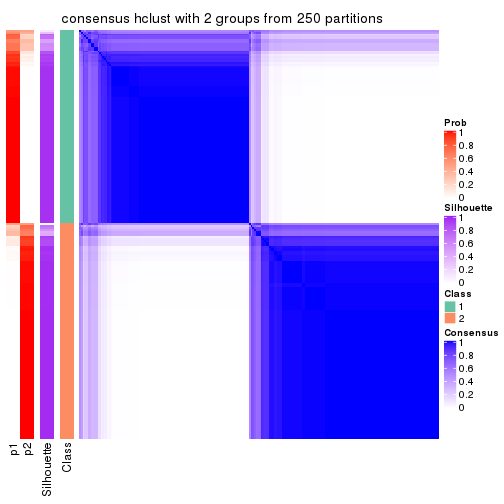</p>

</div>
<div id='tab-ATC-hclust-consensus-heatmap-2'>
<pre><code class="r">consensus_heatmap(res, k = 3)
</code></pre>

<p></p>

</div>
<div id='tab-ATC-hclust-consensus-heatmap-3'>
<pre><code class="r">consensus_heatmap(res, k = 4)
</code></pre>

<p></p>

</div>
<div id='tab-ATC-hclust-consensus-heatmap-4'>
<pre><code class="r">consensus_heatmap(res, k = 5)
</code></pre>

<p></p>

</div>
<div id='tab-ATC-hclust-consensus-heatmap-5'>
<pre><code class="r">consensus_heatmap(res, k = 6)
</code></pre>

<p></p>

</div>
</div>

Heatmaps for the membership of samples in all partitions to see how consistent they are:


<script>
$( function() {
	$( '#tabs-ATC-hclust-membership-heatmap' ).tabs();
} );
</script>
<div id='tabs-ATC-hclust-membership-heatmap'>
<ul>
<li><a href='#tab-ATC-hclust-membership-heatmap-1'>k = 2</a></li>
<li><a href='#tab-ATC-hclust-membership-heatmap-2'>k = 3</a></li>
<li><a href='#tab-ATC-hclust-membership-heatmap-3'>k = 4</a></li>
<li><a href='#tab-ATC-hclust-membership-heatmap-4'>k = 5</a></li>
<li><a href='#tab-ATC-hclust-membership-heatmap-5'>k = 6</a></li>
</ul>
<div id='tab-ATC-hclust-membership-heatmap-1'>
<pre><code class="r">membership_heatmap(res, k = 2)
</code></pre>

<p></p>

</div>
<div id='tab-ATC-hclust-membership-heatmap-2'>
<pre><code class="r">membership_heatmap(res, k = 3)
</code></pre>

<p></p>

</div>
<div id='tab-ATC-hclust-membership-heatmap-3'>
<pre><code class="r">membership_heatmap(res, k = 4)
</code></pre>

<p></p>

</div>
<div id='tab-ATC-hclust-membership-heatmap-4'>
<pre><code class="r">membership_heatmap(res, k = 5)
</code></pre>

<p></p>

</div>
<div id='tab-ATC-hclust-membership-heatmap-5'>
<pre><code class="r">membership_heatmap(res, k = 6)
</code></pre>

<p></p>

</div>
</div>

As soon as we have had the classes for columns, we can look for signatures
which are significantly different between classes which can be candidate marks
for certain classes. Following are the heatmaps for signatures.


Signature heatmaps where rows are scaled:


<script>
$( function() {
	$( '#tabs-ATC-hclust-get-signatures' ).tabs();
} );
</script>
<div id='tabs-ATC-hclust-get-signatures'>
<ul>
<li><a href='#tab-ATC-hclust-get-signatures-1'>k = 2</a></li>
<li><a href='#tab-ATC-hclust-get-signatures-2'>k = 3</a></li>
<li><a href='#tab-ATC-hclust-get-signatures-3'>k = 4</a></li>
<li><a href='#tab-ATC-hclust-get-signatures-4'>k = 5</a></li>
<li><a href='#tab-ATC-hclust-get-signatures-5'>k = 6</a></li>
</ul>
<div id='tab-ATC-hclust-get-signatures-1'>
<pre><code class="r">get_signatures(res, k = 2)
</code></pre>

<p></p>

</div>
<div id='tab-ATC-hclust-get-signatures-2'>
<pre><code class="r">get_signatures(res, k = 3)
</code></pre>

<p></p>

</div>
<div id='tab-ATC-hclust-get-signatures-3'>
<pre><code class="r">get_signatures(res, k = 4)
</code></pre>

<p></p>

</div>
<div id='tab-ATC-hclust-get-signatures-4'>
<pre><code class="r">get_signatures(res, k = 5)
</code></pre>

<p></p>

</div>
<div id='tab-ATC-hclust-get-signatures-5'>
<pre><code class="r">get_signatures(res, k = 6)
</code></pre>

<p></p>

</div>
</div>


Signature heatmaps where rows are not scaled:


<script>
$( function() {
	$( '#tabs-ATC-hclust-get-signatures-no-scale' ).tabs();
} );
</script>
<div id='tabs-ATC-hclust-get-signatures-no-scale'>
<ul>
<li><a href='#tab-ATC-hclust-get-signatures-no-scale-1'>k = 2</a></li>
<li><a href='#tab-ATC-hclust-get-signatures-no-scale-2'>k = 3</a></li>
<li><a href='#tab-ATC-hclust-get-signatures-no-scale-3'>k = 4</a></li>
<li><a href='#tab-ATC-hclust-get-signatures-no-scale-4'>k = 5</a></li>
<li><a href='#tab-ATC-hclust-get-signatures-no-scale-5'>k = 6</a></li>
</ul>
<div id='tab-ATC-hclust-get-signatures-no-scale-1'>
<pre><code class="r">get_signatures(res, k = 2, scale_rows = FALSE)
</code></pre>

<p></p>

</div>
<div id='tab-ATC-hclust-get-signatures-no-scale-2'>
<pre><code class="r">get_signatures(res, k = 3, scale_rows = FALSE)
</code></pre>

<p></p>

</div>
<div id='tab-ATC-hclust-get-signatures-no-scale-3'>
<pre><code class="r">get_signatures(res, k = 4, scale_rows = FALSE)
</code></pre>

<p>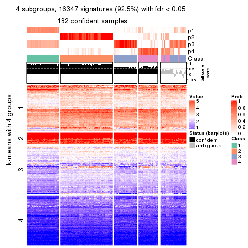</p>

</div>
<div id='tab-ATC-hclust-get-signatures-no-scale-4'>
<pre><code class="r">get_signatures(res, k = 5, scale_rows = FALSE)
</code></pre>

<p></p>

</div>
<div id='tab-ATC-hclust-get-signatures-no-scale-5'>
<pre><code class="r">get_signatures(res, k = 6, scale_rows = FALSE)
</code></pre>

<p></p>

</div>
</div>


Compare the overlap of signatures from different k:

```r
compare_signatures(res)
```


`get_signature()` returns a data frame invisibly. TO get the list of signatures, the function
call should be assigned to a variable explicitly. In following code, if `plot` argument is set
to `FALSE`, no heatmap is plotted while only the differential analysis is performed.

```r
# code only for demonstration
tb = get_signature(res, k = ..., plot = FALSE)
```

An example of the output of `tb` is:

```
#>   which_row         fdr    mean_1    mean_2 scaled_mean_1 scaled_mean_2 km
#> 1        38 0.042760348  8.373488  9.131774    -0.5533452     0.5164555  1
#> 2        40 0.018707592  7.106213  8.469186    -0.6173731     0.5762149  1
#> 3        55 0.019134737 10.221463 11.207825    -0.6159697     0.5749050  1
#> 4        59 0.006059896  5.921854  7.869574    -0.6899429     0.6439467  1
#> 5        60 0.018055526  8.928898 10.211722    -0.6204761     0.5791110  1
#> 6        98 0.009384629 15.714769 14.887706     0.6635654    -0.6193277  2
...
```

The columns in `tb` are:

1. `which_row`: row indices corresponding to the input matrix.
2. `fdr`: FDR for the differential test. 
3. `mean_x`: The mean value in group x.
4. `scaled_mean_x`: The mean value in group x after rows are scaled.
5. `km`: Row groups if k-means clustering is applied to rows.


UMAP plot which shows how samples are separated.


<script>
$( function() {
	$( '#tabs-ATC-hclust-dimension-reduction' ).tabs();
} );
</script>
<div id='tabs-ATC-hclust-dimension-reduction'>
<ul>
<li><a href='#tab-ATC-hclust-dimension-reduction-1'>k = 2</a></li>
<li><a href='#tab-ATC-hclust-dimension-reduction-2'>k = 3</a></li>
<li><a href='#tab-ATC-hclust-dimension-reduction-3'>k = 4</a></li>
<li><a href='#tab-ATC-hclust-dimension-reduction-4'>k = 5</a></li>
<li><a href='#tab-ATC-hclust-dimension-reduction-5'>k = 6</a></li>
</ul>
<div id='tab-ATC-hclust-dimension-reduction-1'>
<pre><code class="r">dimension_reduction(res, k = 2, method = &quot;UMAP&quot;)
</code></pre>

<p></p>

</div>
<div id='tab-ATC-hclust-dimension-reduction-2'>
<pre><code class="r">dimension_reduction(res, k = 3, method = &quot;UMAP&quot;)
</code></pre>

<p></p>

</div>
<div id='tab-ATC-hclust-dimension-reduction-3'>
<pre><code class="r">dimension_reduction(res, k = 4, method = &quot;UMAP&quot;)
</code></pre>

<p></p>

</div>
<div id='tab-ATC-hclust-dimension-reduction-4'>
<pre><code class="r">dimension_reduction(res, k = 5, method = &quot;UMAP&quot;)
</code></pre>

<p></p>

</div>
<div id='tab-ATC-hclust-dimension-reduction-5'>
<pre><code class="r">dimension_reduction(res, k = 6, method = &quot;UMAP&quot;)
</code></pre>

<p></p>

</div>
</div>


Following heatmap shows how subgroups are split when increasing `k`:

```r
collect_classes(res)
```


If matrix rows can be associated to genes, consider to use `GO_Enrichment(res,
...)` to perform function enrichment for the signature genes.


 

---------------------------------------------------


### ATC:kmeans*


The object with results only for a single top-value method and a single partition method 
can be extracted as:

```r
res = res_list["ATC", "kmeans"]
# you can also extract it by
# res = res_list["ATC:kmeans"]
```

A summary of `res` and all the functions that can be applied to it:

```r
res
```

```
#> A 'ConsensusPartition' object with k = 2, 3, 4, 5, 6.
#>   On a matrix with 17680 rows and 218 columns.
#>   Top rows (1000, 2000, 3000, 4000, 5000) are extracted by 'ATC' method.
#>   Subgroups are detected by 'kmeans' method.
#>   Performed in total 1250 partitions by row resampling.
#>   Best k for subgroups seems to be 4.
#> 
#> Following methods can be applied to this 'ConsensusPartition' object:
#>  [1] "cola_report"             "collect_classes"         "collect_plots"          
#>  [4] "collect_stats"           "colnames"                "compare_signatures"     
#>  [7] "consensus_heatmap"       "dimension_reduction"     "functional_enrichment"  
#> [10] "get_anno_col"            "get_anno"                "get_classes"            
#> [13] "get_consensus"           "get_matrix"              "get_membership"         
#> [16] "get_param"               "get_signatures"          "get_stats"              
#> [19] "is_best_k"               "is_stable_k"             "membership_heatmap"     
#> [22] "ncol"                    "nrow"                    "plot_ecdf"              
#> [25] "rownames"                "select_partition_number" "show"                   
#> [28] "suggest_best_k"          "test_to_known_factors"
```

`collect_plots()` function collects all the plots made from `res` for all `k` (number of partitions)
into one single page to provide an easy and fast comparison between different `k`.

```r
collect_plots(res)
```


The plots are:

- The first row: a plot of the ECDF (Empirical cumulative distribution
  function) curves of the consensus matrix for each `k` and the heatmap of
  predicted classes for each `k`.
- The second row: heatmaps of the consensus matrix for each `k`.
- The third row: heatmaps of the membership matrix for each `k`.
- The fouth row: heatmaps of the signatures for each `k`.

All the plots in panels can be made by individual functions and they are
plotted later in this section.

`select_partition_number()` produces several plots showing different
statistics for choosing "optimized" `k`. There are following statistics:

- ECDF curves of the consensus matrix for each `k`;
- 1-PAC. [The PAC
  score](https://en.wikipedia.org/wiki/Consensus_clustering#Over-interpretation_potential_of_consensus_clustering)
  measures the proportion of the ambiguous subgrouping.
- Mean silhouette score.
- Concordance. The mean probability of fiting the consensus class ids in all
  partitions.
- Area increased. Denote $A_k$ as the area under the ECDF curve for current
  `k`, the area increased is defined as $A_k - A_{k-1}$.
- Rand index. The percent of pairs of samples that are both in a same cluster
  or both are not in a same cluster in the partition of k and k-1.
- Jaccard index. The ratio of pairs of samples are both in a same cluster in
  the partition of k and k-1 and the pairs of samples are both in a same
  cluster in the partition k or k-1.

The detailed explanations of these statistics can be found in [the cola
vignette](http://bioconductor.org/packages/devel/bioc/vignettes/cola/inst/doc/cola.html#toc_13).

Generally speaking, lower PAC score, higher mean silhouette score or higher
concordance corresponds to better partition. Rand index and Jaccard index
measure how similar the current partition is compared to partition with `k-1`.
If they are too similar, we won't accept `k` is better than `k-1`.

```r
select_partition_number(res)
```

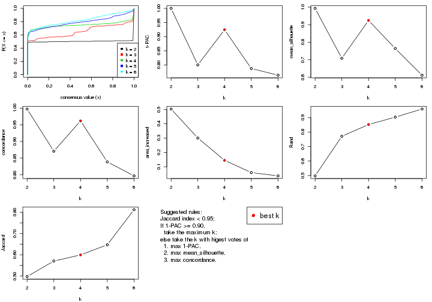

The numeric values for all these statistics can be obtained by `get_stats()`.

```r
get_stats(res)
```

```
#>   k 1-PAC mean_silhouette concordance area_increased  Rand Jaccard
#> 2 2 1.000           0.993       0.997         0.5025 0.498   0.498
#> 3 3 0.800           0.708       0.871         0.3003 0.771   0.571
#> 4 4 0.925           0.924       0.962         0.1449 0.852   0.600
#> 5 5 0.787           0.764       0.839         0.0593 0.903   0.647
#> 6 6 0.764           0.612       0.797         0.0364 0.959   0.812
```

`suggest_best_k()` suggests the best $k$ based on these statistics. The rules are as follows:

- All $k$ with Jaccard index larger than 0.95 are removed because the increase of
  the partition number does not provides enough extra information. If all $k$ are removed,
  the best $k$ is assigned by `NA`.
- For $k$ with 1-PAC larger than 0.9, the maximal $k$ is taken as the "best k". Other $k$ is called "optional k".
- If it does not fit the second rule. The $k$ with the highest vote of highest
  1-PAC, mean silhouette and concordance is taken as the "best k".

```r
suggest_best_k(res)
```

```
#> [1] 4
#> attr(,"optional")
#> [1] 2
```

There is also optional best $k$ = 2 that is worth to check.

Following shows the table of the partitions (You need to click the **show/hide
code output** link to see it). The membership matrix (columns with name `p*`)
is inferred by
[`clue::cl_consensus()`](https://www.rdocumentation.org/link/cl_consensus?package=clue)
function with the `SE` method. Basically the value in the membership matrix
represents the probability to belong to a certain group. The finall class
label for an item is determined with the group with highest probability it
belongs to.

In `get_classes()` function, the entropy is calculated from the membership
matrix and the silhouette score is calculated from the consensus matrix.


<script>
$( function() {
	$( '#tabs-ATC-kmeans-get-classes' ).tabs();
} );
</script>
<div id='tabs-ATC-kmeans-get-classes'>
<ul>
<li><a href='#tab-ATC-kmeans-get-classes-1'>k = 2</a></li>
<li><a href='#tab-ATC-kmeans-get-classes-2'>k = 3</a></li>
<li><a href='#tab-ATC-kmeans-get-classes-3'>k = 4</a></li>
<li><a href='#tab-ATC-kmeans-get-classes-4'>k = 5</a></li>
<li><a href='#tab-ATC-kmeans-get-classes-5'>k = 6</a></li>
</ul>

<div id='tab-ATC-kmeans-get-classes-1'>
<p><a id='tab-ATC-kmeans-get-classes-1-a' style='color:#0366d6' href='#'>show/hide code output</a></p>
<pre><code class="r">cbind(get_classes(res, k = 2), get_membership(res, k = 2))
</code></pre>

<pre><code>#&gt;            class entropy silhouette    p1    p2
#&gt; SRR1498997     2  0.0000      1.000 0.000 1.000
#&gt; SRR1076441     1  0.0000      0.994 1.000 0.000
#&gt; SRR1489803     2  0.0000      1.000 0.000 1.000
#&gt; SRR1345953     2  0.0000      1.000 0.000 1.000
#&gt; SRR1357826     2  0.0000      1.000 0.000 1.000
#&gt; SRR1419656     1  0.0000      0.994 1.000 0.000
#&gt; SRR1454158     2  0.0000      1.000 0.000 1.000
#&gt; SRR1475408     2  0.0000      1.000 0.000 1.000
#&gt; SRR1472704     2  0.0000      1.000 0.000 1.000
#&gt; SRR1090046     1  0.0000      0.994 1.000 0.000
#&gt; SRR1312822     1  0.0000      0.994 1.000 0.000
#&gt; SRR1096987     2  0.0000      1.000 0.000 1.000
#&gt; SRR1334587     2  0.0000      1.000 0.000 1.000
#&gt; SRR1490246     1  0.0000      0.994 1.000 0.000
#&gt; SRR1467522     1  0.0000      0.994 1.000 0.000
#&gt; SRR1324206     1  0.0000      0.994 1.000 0.000
#&gt; SRR1408574     2  0.0000      1.000 0.000 1.000
#&gt; SRR1083959     2  0.0000      1.000 0.000 1.000
#&gt; SRR1079948     2  0.0000      1.000 0.000 1.000
#&gt; SRR1310667     2  0.0000      1.000 0.000 1.000
#&gt; SRR655852      2  0.0000      1.000 0.000 1.000
#&gt; SRR1352457     2  0.0000      1.000 0.000 1.000
#&gt; SRR1353994     2  0.0000      1.000 0.000 1.000
#&gt; SRR1459561     2  0.0000      1.000 0.000 1.000
#&gt; SRR1454009     1  0.0000      0.994 1.000 0.000
#&gt; SRR1071084     1  0.0000      0.994 1.000 0.000
#&gt; SRR1082859     2  0.0000      1.000 0.000 1.000
#&gt; SRR1086538     1  0.0000      0.994 1.000 0.000
#&gt; SRR1486262     2  0.0000      1.000 0.000 1.000
#&gt; SRR658105      1  0.0000      0.994 1.000 0.000
#&gt; SRR811073      2  0.0000      1.000 0.000 1.000
#&gt; SRR1429181     2  0.0000      1.000 0.000 1.000
#&gt; SRR1327896     2  0.0000      1.000 0.000 1.000
#&gt; SRR1464788     2  0.0000      1.000 0.000 1.000
#&gt; SRR1346861     2  0.0000      1.000 0.000 1.000
#&gt; SRR1318774     2  0.0000      1.000 0.000 1.000
#&gt; SRR1420517     1  0.0000      0.994 1.000 0.000
#&gt; SRR1369584     2  0.0000      1.000 0.000 1.000
#&gt; SRR1443244     1  0.0000      0.994 1.000 0.000
#&gt; SRR1455391     1  0.0000      0.994 1.000 0.000
#&gt; SRR1068999     1  0.0000      0.994 1.000 0.000
#&gt; SRR1481297     1  0.0000      0.994 1.000 0.000
#&gt; SRR1070208     1  0.0000      0.994 1.000 0.000
#&gt; SRR1317282     1  0.0000      0.994 1.000 0.000
#&gt; SRR1096125     2  0.0000      1.000 0.000 1.000
#&gt; SRR1472506     1  0.0000      0.994 1.000 0.000
#&gt; SRR1388281     2  0.0000      1.000 0.000 1.000
#&gt; SRR1365622     2  0.0000      1.000 0.000 1.000
#&gt; SRR662306      1  0.0000      0.994 1.000 0.000
#&gt; SRR662811      1  0.0000      0.994 1.000 0.000
#&gt; SRR820571      1  0.0000      0.994 1.000 0.000
#&gt; SRR1357166     1  0.0000      0.994 1.000 0.000
#&gt; SRR1488586     1  0.0000      0.994 1.000 0.000
#&gt; SRR1485398     1  0.0000      0.994 1.000 0.000
#&gt; SRR1417725     2  0.0672      0.992 0.008 0.992
#&gt; SRR1409397     2  0.0000      1.000 0.000 1.000
#&gt; SRR1465693     2  0.0000      1.000 0.000 1.000
#&gt; SRR1096547     1  0.0000      0.994 1.000 0.000
#&gt; SRR1456818     1  0.0000      0.994 1.000 0.000
#&gt; SRR816336      1  0.0000      0.994 1.000 0.000
#&gt; SRR1420238     1  0.0000      0.994 1.000 0.000
#&gt; SRR1433374     1  0.0000      0.994 1.000 0.000
#&gt; SRR1436990     1  0.0000      0.994 1.000 0.000
#&gt; SRR662378      1  0.0000      0.994 1.000 0.000
#&gt; SRR1477671     1  0.0000      0.994 1.000 0.000
#&gt; SRR1084079     1  0.0000      0.994 1.000 0.000
#&gt; SRR1102949     1  0.0000      0.994 1.000 0.000
#&gt; SRR1458090     1  0.0000      0.994 1.000 0.000
#&gt; SRR1418729     2  0.0000      1.000 0.000 1.000
#&gt; SRR1403814     2  0.0000      1.000 0.000 1.000
#&gt; SRR1404887     1  0.0000      0.994 1.000 0.000
#&gt; SRR1434955     1  0.0000      0.994 1.000 0.000
#&gt; SRR1360652     1  0.0000      0.994 1.000 0.000
#&gt; SRR1356765     2  0.0000      1.000 0.000 1.000
#&gt; SRR1078258     2  0.0000      1.000 0.000 1.000
#&gt; SRR1455861     1  0.0000      0.994 1.000 0.000
#&gt; SRR1420296     2  0.0000      1.000 0.000 1.000
#&gt; SRR1070260     2  0.0000      1.000 0.000 1.000
#&gt; SRR1410765     1  0.0000      0.994 1.000 0.000
#&gt; SRR1481315     1  0.0000      0.994 1.000 0.000
#&gt; SRR1414661     2  0.0000      1.000 0.000 1.000
#&gt; SRR1359147     2  0.0000      1.000 0.000 1.000
#&gt; SRR1488694     1  0.0000      0.994 1.000 0.000
#&gt; SRR1477273     1  0.0000      0.994 1.000 0.000
#&gt; SRR1415792     1  0.0000      0.994 1.000 0.000
#&gt; SRR1369088     2  0.0000      1.000 0.000 1.000
#&gt; SRR1406621     1  0.7219      0.750 0.800 0.200
#&gt; SRR1401017     2  0.0000      1.000 0.000 1.000
#&gt; SRR1099981     2  0.0000      1.000 0.000 1.000
#&gt; SRR815208      2  0.0000      1.000 0.000 1.000
#&gt; SRR1380460     2  0.0000      1.000 0.000 1.000
#&gt; SRR1091097     2  0.0000      1.000 0.000 1.000
#&gt; SRR1456010     1  0.0000      0.994 1.000 0.000
#&gt; SRR1498416     2  0.0000      1.000 0.000 1.000
#&gt; SRR818873      2  0.0000      1.000 0.000 1.000
#&gt; SRR813868      2  0.0000      1.000 0.000 1.000
#&gt; SRR1394912     1  0.0000      0.994 1.000 0.000
#&gt; SRR1475824     2  0.0000      1.000 0.000 1.000
#&gt; SRR1459866     1  0.0000      0.994 1.000 0.000
#&gt; SRR1364871     1  0.2236      0.958 0.964 0.036
#&gt; SRR1100472     2  0.0000      1.000 0.000 1.000
#&gt; SRR1331267     1  0.0000      0.994 1.000 0.000
#&gt; SRR1068977     2  0.0000      1.000 0.000 1.000
#&gt; SRR1391511     2  0.0000      1.000 0.000 1.000
#&gt; SRR1077920     2  0.0000      1.000 0.000 1.000
#&gt; SRR1457705     1  0.0000      0.994 1.000 0.000
#&gt; SRR1437073     1  0.0000      0.994 1.000 0.000
#&gt; SRR1473124     1  0.0000      0.994 1.000 0.000
#&gt; SRR1469279     1  0.0000      0.994 1.000 0.000
#&gt; SRR1091791     2  0.0000      1.000 0.000 1.000
#&gt; SRR1341539     2  0.0000      1.000 0.000 1.000
#&gt; SRR1446354     1  0.0000      0.994 1.000 0.000
#&gt; SRR1415420     1  0.0000      0.994 1.000 0.000
#&gt; SRR1368050     1  0.0000      0.994 1.000 0.000
#&gt; SRR656970      2  0.0000      1.000 0.000 1.000
#&gt; SRR1473403     2  0.0000      1.000 0.000 1.000
#&gt; SRR1084674     1  0.0000      0.994 1.000 0.000
#&gt; SRR1464702     1  0.0000      0.994 1.000 0.000
#&gt; SRR1074860     1  0.0000      0.994 1.000 0.000
#&gt; SRR655447      2  0.0000      1.000 0.000 1.000
#&gt; SRR1404442     2  0.0000      1.000 0.000 1.000
#&gt; SRR1418795     1  0.0000      0.994 1.000 0.000
#&gt; SRR1458335     2  0.0000      1.000 0.000 1.000
#&gt; SRR1489589     2  0.0000      1.000 0.000 1.000
#&gt; SRR1378284     1  0.0000      0.994 1.000 0.000
#&gt; SRR1408014     2  0.0000      1.000 0.000 1.000
#&gt; SRR1083052     1  0.0000      0.994 1.000 0.000
#&gt; SRR1339236     2  0.0000      1.000 0.000 1.000
#&gt; SRR1323829     2  0.0000      1.000 0.000 1.000
#&gt; SRR1086772     2  0.0000      1.000 0.000 1.000
#&gt; SRR1486457     1  0.0000      0.994 1.000 0.000
#&gt; SRR1415257     2  0.0000      1.000 0.000 1.000
#&gt; SRR1071905     1  0.0000      0.994 1.000 0.000
#&gt; SRR659223      2  0.0000      1.000 0.000 1.000
#&gt; SRR1386945     1  0.0000      0.994 1.000 0.000
#&gt; SRR821498      2  0.0000      1.000 0.000 1.000
#&gt; SRR1378903     2  0.0000      1.000 0.000 1.000
#&gt; SRR1472907     1  0.0000      0.994 1.000 0.000
#&gt; SRR1442313     2  0.0000      1.000 0.000 1.000
#&gt; SRR1077139     2  0.0000      1.000 0.000 1.000
#&gt; SRR1342758     1  0.0000      0.994 1.000 0.000
#&gt; SRR656911      2  0.0000      1.000 0.000 1.000
#&gt; SRR1070738     1  0.0000      0.994 1.000 0.000
#&gt; SRR1476950     1  0.0000      0.994 1.000 0.000
#&gt; SRR1488196     1  0.0000      0.994 1.000 0.000
#&gt; SRR1498951     1  0.0000      0.994 1.000 0.000
#&gt; SRR1413392     1  0.0000      0.994 1.000 0.000
#&gt; SRR657528      2  0.0000      1.000 0.000 1.000
#&gt; SRR812198      1  0.0000      0.994 1.000 0.000
#&gt; SRR660283      2  0.0000      1.000 0.000 1.000
#&gt; SRR1420936     1  0.0000      0.994 1.000 0.000
#&gt; SRR1469547     2  0.0000      1.000 0.000 1.000
#&gt; SRR1322249     1  0.0000      0.994 1.000 0.000
#&gt; SRR1396682     1  0.0000      0.994 1.000 0.000
#&gt; SRR1095816     2  0.0000      1.000 0.000 1.000
#&gt; SRR1081023     1  0.0000      0.994 1.000 0.000
#&gt; SRR1092517     2  0.0000      1.000 0.000 1.000
#&gt; SRR811285      2  0.0000      1.000 0.000 1.000
#&gt; SRR657018      1  0.0000      0.994 1.000 0.000
#&gt; SRR1365534     1  0.0000      0.994 1.000 0.000
#&gt; SRR1090791     2  0.0000      1.000 0.000 1.000
#&gt; SRR1439915     2  0.0000      1.000 0.000 1.000
#&gt; SRR1391575     2  0.0000      1.000 0.000 1.000
#&gt; SRR1314092     2  0.0000      1.000 0.000 1.000
#&gt; SRR1328941     1  0.0000      0.994 1.000 0.000
#&gt; SRR1336181     2  0.0000      1.000 0.000 1.000
#&gt; SRR1362972     1  0.0000      0.994 1.000 0.000
#&gt; SRR1366790     2  0.0000      1.000 0.000 1.000
#&gt; SRR1455902     1  0.0000      0.994 1.000 0.000
#&gt; SRR1437644     2  0.0000      1.000 0.000 1.000
#&gt; SRR1105009     2  0.0000      1.000 0.000 1.000
#&gt; SRR1367024     1  0.0000      0.994 1.000 0.000
#&gt; SRR660248      2  0.0000      1.000 0.000 1.000
#&gt; SRR1409620     1  0.0000      0.994 1.000 0.000
#&gt; SRR1455807     2  0.0000      1.000 0.000 1.000
#&gt; SRR1339431     1  0.0000      0.994 1.000 0.000
#&gt; SRR1378948     1  0.0000      0.994 1.000 0.000
#&gt; SRR1469237     1  0.0000      0.994 1.000 0.000
#&gt; SRR1098264     2  0.0000      1.000 0.000 1.000
#&gt; SRR1406224     2  0.0000      1.000 0.000 1.000
#&gt; SRR1393026     1  0.0000      0.994 1.000 0.000
#&gt; SRR808428      2  0.0000      1.000 0.000 1.000
#&gt; SRR615910      2  0.0000      1.000 0.000 1.000
#&gt; SRR1076219     1  0.0000      0.994 1.000 0.000
#&gt; SRR1481128     1  0.0000      0.994 1.000 0.000
#&gt; SRR1359262     2  0.0000      1.000 0.000 1.000
#&gt; SRR1407648     2  0.0000      1.000 0.000 1.000
#&gt; SRR1386775     1  0.0000      0.994 1.000 0.000
#&gt; SRR1388399     1  0.9661      0.361 0.608 0.392
#&gt; SRR1361499     2  0.0000      1.000 0.000 1.000
#&gt; SRR1500709     2  0.0000      1.000 0.000 1.000
#&gt; SRR1335917     1  0.0000      0.994 1.000 0.000
#&gt; SRR1430615     2  0.0000      1.000 0.000 1.000
#&gt; SRR1335212     1  0.0000      0.994 1.000 0.000
#&gt; SRR1400159     1  0.0000      0.994 1.000 0.000
#&gt; SRR1457245     2  0.0000      1.000 0.000 1.000
#&gt; SRR1356746     2  0.0000      1.000 0.000 1.000
#&gt; SRR658319      2  0.0000      1.000 0.000 1.000
#&gt; SRR1435946     1  0.0000      0.994 1.000 0.000
#&gt; SRR1370308     1  0.0000      0.994 1.000 0.000
#&gt; SRR1100893     1  0.0000      0.994 1.000 0.000
#&gt; SRR1389432     1  0.0000      0.994 1.000 0.000
#&gt; SRR1381799     2  0.0000      1.000 0.000 1.000
#&gt; SRR1310158     1  0.0000      0.994 1.000 0.000
#&gt; SRR1341100     2  0.0000      1.000 0.000 1.000
#&gt; SRR1342873     1  0.0000      0.994 1.000 0.000
#&gt; SRR1472102     2  0.0000      1.000 0.000 1.000
#&gt; SRR1409421     1  0.0000      0.994 1.000 0.000
#&gt; SRR1328577     2  0.0000      1.000 0.000 1.000
#&gt; SRR808942      2  0.0000      1.000 0.000 1.000
#&gt; SRR1343818     2  0.0000      1.000 0.000 1.000
#&gt; SRR1472415     2  0.0000      1.000 0.000 1.000
#&gt; SRR658409      2  0.0000      1.000 0.000 1.000
#&gt; SRR1469681     1  0.0000      0.994 1.000 0.000
#&gt; SRR1075484     2  0.0000      1.000 0.000 1.000
#&gt; SRR1417894     1  0.0000      0.994 1.000 0.000
#&gt; SRR1417422     2  0.0000      1.000 0.000 1.000
#&gt; SRR1090674     1  0.0000      0.994 1.000 0.000
</code></pre>

<script>
$('#tab-ATC-kmeans-get-classes-1-a').parent().next().next().hide();
$('#tab-ATC-kmeans-get-classes-1-a').click(function(){
  $('#tab-ATC-kmeans-get-classes-1-a').parent().next().next().toggle();
  return(false);
});
</script>
</div>

<div id='tab-ATC-kmeans-get-classes-2'>
<p><a id='tab-ATC-kmeans-get-classes-2-a' style='color:#0366d6' href='#'>show/hide code output</a></p>
<pre><code class="r">cbind(get_classes(res, k = 3), get_membership(res, k = 3))
</code></pre>

<pre><code>#&gt;            class entropy silhouette    p1    p2    p3
#&gt; SRR1498997     2  0.6180     0.9406 0.000 0.584 0.416
#&gt; SRR1076441     1  0.0000     0.8939 1.000 0.000 0.000
#&gt; SRR1489803     2  0.6180     0.9406 0.000 0.584 0.416
#&gt; SRR1345953     2  0.6180     0.9406 0.000 0.584 0.416
#&gt; SRR1357826     2  0.6180     0.9406 0.000 0.584 0.416
#&gt; SRR1419656     1  0.0000     0.8939 1.000 0.000 0.000
#&gt; SRR1454158     3  0.6309    -0.8095 0.000 0.496 0.504
#&gt; SRR1475408     3  0.6180     0.6621 0.000 0.416 0.584
#&gt; SRR1472704     2  0.6180     0.9406 0.000 0.584 0.416
#&gt; SRR1090046     3  0.6180     0.6621 0.000 0.416 0.584
#&gt; SRR1312822     1  0.0000     0.8939 1.000 0.000 0.000
#&gt; SRR1096987     3  0.1163     0.3715 0.000 0.028 0.972
#&gt; SRR1334587     2  0.6180     0.9406 0.000 0.584 0.416
#&gt; SRR1490246     1  0.0000     0.8939 1.000 0.000 0.000
#&gt; SRR1467522     1  0.0000     0.8939 1.000 0.000 0.000
#&gt; SRR1324206     1  0.0000     0.8939 1.000 0.000 0.000
#&gt; SRR1408574     3  0.5835     0.6718 0.000 0.340 0.660
#&gt; SRR1083959     2  0.6180     0.9406 0.000 0.584 0.416
#&gt; SRR1079948     3  0.4452    -0.0797 0.000 0.192 0.808
#&gt; SRR1310667     2  0.6180     0.9406 0.000 0.584 0.416
#&gt; SRR655852      3  0.4452    -0.0797 0.000 0.192 0.808
#&gt; SRR1352457     2  0.6180     0.9406 0.000 0.584 0.416
#&gt; SRR1353994     2  0.6180     0.9406 0.000 0.584 0.416
#&gt; SRR1459561     2  0.6180     0.9406 0.000 0.584 0.416
#&gt; SRR1454009     1  0.1163     0.8787 0.972 0.028 0.000
#&gt; SRR1071084     1  0.6565     0.5372 0.576 0.416 0.008
#&gt; SRR1082859     2  0.6180     0.9406 0.000 0.584 0.416
#&gt; SRR1086538     1  0.0000     0.8939 1.000 0.000 0.000
#&gt; SRR1486262     3  0.0892     0.3863 0.000 0.020 0.980
#&gt; SRR658105      1  0.0000     0.8939 1.000 0.000 0.000
#&gt; SRR811073      2  0.6180     0.9406 0.000 0.584 0.416
#&gt; SRR1429181     3  0.5678    -0.4429 0.000 0.316 0.684
#&gt; SRR1327896     3  0.0892     0.3863 0.000 0.020 0.980
#&gt; SRR1464788     3  0.0747     0.3919 0.000 0.016 0.984
#&gt; SRR1346861     2  0.6180     0.9406 0.000 0.584 0.416
#&gt; SRR1318774     3  0.6180     0.6621 0.000 0.416 0.584
#&gt; SRR1420517     1  0.0000     0.8939 1.000 0.000 0.000
#&gt; SRR1369584     3  0.0892     0.3863 0.000 0.020 0.980
#&gt; SRR1443244     3  0.6180     0.6621 0.000 0.416 0.584
#&gt; SRR1455391     1  0.0000     0.8939 1.000 0.000 0.000
#&gt; SRR1068999     1  0.0000     0.8939 1.000 0.000 0.000
#&gt; SRR1481297     1  0.0000     0.8939 1.000 0.000 0.000
#&gt; SRR1070208     1  0.6180     0.5478 0.584 0.416 0.000
#&gt; SRR1317282     1  0.6565     0.5372 0.576 0.416 0.008
#&gt; SRR1096125     3  0.1163     0.3715 0.000 0.028 0.972
#&gt; SRR1472506     3  0.8370     0.5677 0.084 0.416 0.500
#&gt; SRR1388281     2  0.6180     0.9406 0.000 0.584 0.416
#&gt; SRR1365622     3  0.5254     0.6373 0.000 0.264 0.736
#&gt; SRR662306      1  0.6180     0.5478 0.584 0.416 0.000
#&gt; SRR662811      1  0.0000     0.8939 1.000 0.000 0.000
#&gt; SRR820571      3  0.6180     0.6621 0.000 0.416 0.584
#&gt; SRR1357166     1  0.6180     0.5478 0.584 0.416 0.000
#&gt; SRR1488586     2  0.9402    -0.5817 0.172 0.416 0.412
#&gt; SRR1485398     1  0.0000     0.8939 1.000 0.000 0.000
#&gt; SRR1417725     3  0.6180     0.6621 0.000 0.416 0.584
#&gt; SRR1409397     3  0.6308    -0.8030 0.000 0.492 0.508
#&gt; SRR1465693     2  0.6180     0.9406 0.000 0.584 0.416
#&gt; SRR1096547     3  0.6180     0.6621 0.000 0.416 0.584
#&gt; SRR1456818     1  0.0000     0.8939 1.000 0.000 0.000
#&gt; SRR816336      3  0.8830     0.5230 0.116 0.416 0.468
#&gt; SRR1420238     1  0.0000     0.8939 1.000 0.000 0.000
#&gt; SRR1433374     1  0.6180     0.5478 0.584 0.416 0.000
#&gt; SRR1436990     1  0.0000     0.8939 1.000 0.000 0.000
#&gt; SRR662378      1  0.0000     0.8939 1.000 0.000 0.000
#&gt; SRR1477671     1  0.0000     0.8939 1.000 0.000 0.000
#&gt; SRR1084079     3  0.6713     0.6511 0.012 0.416 0.572
#&gt; SRR1102949     1  0.0000     0.8939 1.000 0.000 0.000
#&gt; SRR1458090     1  0.0000     0.8939 1.000 0.000 0.000
#&gt; SRR1418729     3  0.6180     0.6621 0.000 0.416 0.584
#&gt; SRR1403814     3  0.6168     0.6629 0.000 0.412 0.588
#&gt; SRR1404887     3  0.6180     0.6621 0.000 0.416 0.584
#&gt; SRR1434955     1  0.0000     0.8939 1.000 0.000 0.000
#&gt; SRR1360652     1  0.0000     0.8939 1.000 0.000 0.000
#&gt; SRR1356765     3  0.1163     0.3715 0.000 0.028 0.972
#&gt; SRR1078258     2  0.6180     0.9406 0.000 0.584 0.416
#&gt; SRR1455861     1  0.0000     0.8939 1.000 0.000 0.000
#&gt; SRR1420296     2  0.6180     0.9406 0.000 0.584 0.416
#&gt; SRR1070260     2  0.6180     0.9406 0.000 0.584 0.416
#&gt; SRR1410765     1  0.0000     0.8939 1.000 0.000 0.000
#&gt; SRR1481315     1  0.0000     0.8939 1.000 0.000 0.000
#&gt; SRR1414661     2  0.6180     0.9406 0.000 0.584 0.416
#&gt; SRR1359147     3  0.6308    -0.8028 0.000 0.492 0.508
#&gt; SRR1488694     1  0.8236     0.4203 0.508 0.416 0.076
#&gt; SRR1477273     2  0.9719    -0.4613 0.360 0.416 0.224
#&gt; SRR1415792     1  0.7203     0.5077 0.556 0.416 0.028
#&gt; SRR1369088     3  0.5058     0.6261 0.000 0.244 0.756
#&gt; SRR1406621     3  0.6180     0.6621 0.000 0.416 0.584
#&gt; SRR1401017     2  0.6215     0.9242 0.000 0.572 0.428
#&gt; SRR1099981     2  0.6180     0.9406 0.000 0.584 0.416
#&gt; SRR815208      2  0.6180     0.9406 0.000 0.584 0.416
#&gt; SRR1380460     2  0.6180     0.9406 0.000 0.584 0.416
#&gt; SRR1091097     2  0.6180     0.9406 0.000 0.584 0.416
#&gt; SRR1456010     1  0.0000     0.8939 1.000 0.000 0.000
#&gt; SRR1498416     3  0.0892     0.3863 0.000 0.020 0.980
#&gt; SRR818873      2  0.6180     0.9406 0.000 0.584 0.416
#&gt; SRR813868      3  0.0892     0.3863 0.000 0.020 0.980
#&gt; SRR1394912     1  0.0000     0.8939 1.000 0.000 0.000
#&gt; SRR1475824     3  0.0892     0.3863 0.000 0.020 0.980
#&gt; SRR1459866     1  0.0000     0.8939 1.000 0.000 0.000
#&gt; SRR1364871     3  0.6180     0.6621 0.000 0.416 0.584
#&gt; SRR1100472     2  0.6180     0.9406 0.000 0.584 0.416
#&gt; SRR1331267     1  0.6973     0.5205 0.564 0.416 0.020
#&gt; SRR1068977     3  0.6307    -0.7963 0.000 0.488 0.512
#&gt; SRR1391511     2  0.6180     0.9406 0.000 0.584 0.416
#&gt; SRR1077920     2  0.6180     0.9406 0.000 0.584 0.416
#&gt; SRR1457705     1  0.0000     0.8939 1.000 0.000 0.000
#&gt; SRR1437073     1  0.0000     0.8939 1.000 0.000 0.000
#&gt; SRR1473124     1  0.4062     0.7833 0.836 0.164 0.000
#&gt; SRR1469279     1  0.0000     0.8939 1.000 0.000 0.000
#&gt; SRR1091791     3  0.5835     0.6718 0.000 0.340 0.660
#&gt; SRR1341539     3  0.6180     0.6621 0.000 0.416 0.584
#&gt; SRR1446354     1  0.0000     0.8939 1.000 0.000 0.000
#&gt; SRR1415420     1  0.0000     0.8939 1.000 0.000 0.000
#&gt; SRR1368050     1  0.0000     0.8939 1.000 0.000 0.000
#&gt; SRR656970      2  0.6180     0.9406 0.000 0.584 0.416
#&gt; SRR1473403     2  0.6180     0.9406 0.000 0.584 0.416
#&gt; SRR1084674     1  0.7309     0.5010 0.552 0.416 0.032
#&gt; SRR1464702     1  0.0000     0.8939 1.000 0.000 0.000
#&gt; SRR1074860     3  0.6180     0.6621 0.000 0.416 0.584
#&gt; SRR655447      2  0.6180     0.9406 0.000 0.584 0.416
#&gt; SRR1404442     2  0.6180     0.9406 0.000 0.584 0.416
#&gt; SRR1418795     1  0.0000     0.8939 1.000 0.000 0.000
#&gt; SRR1458335     3  0.5835     0.6718 0.000 0.340 0.660
#&gt; SRR1489589     2  0.6274     0.8831 0.000 0.544 0.456
#&gt; SRR1378284     1  0.2448     0.8495 0.924 0.076 0.000
#&gt; SRR1408014     2  0.6180     0.9406 0.000 0.584 0.416
#&gt; SRR1083052     1  0.0000     0.8939 1.000 0.000 0.000
#&gt; SRR1339236     3  0.6180     0.6621 0.000 0.416 0.584
#&gt; SRR1323829     2  0.6180     0.9406 0.000 0.584 0.416
#&gt; SRR1086772     2  0.6180     0.9406 0.000 0.584 0.416
#&gt; SRR1486457     1  0.7203     0.5077 0.556 0.416 0.028
#&gt; SRR1415257     2  0.6180     0.9406 0.000 0.584 0.416
#&gt; SRR1071905     1  0.2625     0.8447 0.916 0.084 0.000
#&gt; SRR659223      2  0.6180     0.9406 0.000 0.584 0.416
#&gt; SRR1386945     1  0.1860     0.8647 0.948 0.052 0.000
#&gt; SRR821498      3  0.6180     0.6621 0.000 0.416 0.584
#&gt; SRR1378903     3  0.5835     0.6718 0.000 0.340 0.660
#&gt; SRR1472907     1  0.1643     0.8695 0.956 0.044 0.000
#&gt; SRR1442313     2  0.6180     0.9406 0.000 0.584 0.416
#&gt; SRR1077139     2  0.6180     0.9406 0.000 0.584 0.416
#&gt; SRR1342758     1  0.0000     0.8939 1.000 0.000 0.000
#&gt; SRR656911      2  0.6180     0.9406 0.000 0.584 0.416
#&gt; SRR1070738     1  0.0000     0.8939 1.000 0.000 0.000
#&gt; SRR1476950     1  0.0000     0.8939 1.000 0.000 0.000
#&gt; SRR1488196     1  0.6713     0.5315 0.572 0.416 0.012
#&gt; SRR1498951     1  0.6565     0.5372 0.576 0.416 0.008
#&gt; SRR1413392     1  0.0000     0.8939 1.000 0.000 0.000
#&gt; SRR657528      2  0.6180     0.9406 0.000 0.584 0.416
#&gt; SRR812198      1  0.0000     0.8939 1.000 0.000 0.000
#&gt; SRR660283      2  0.6180     0.9406 0.000 0.584 0.416
#&gt; SRR1420936     1  0.0000     0.8939 1.000 0.000 0.000
#&gt; SRR1469547     2  0.6180     0.9406 0.000 0.584 0.416
#&gt; SRR1322249     1  0.0000     0.8939 1.000 0.000 0.000
#&gt; SRR1396682     1  0.0000     0.8939 1.000 0.000 0.000
#&gt; SRR1095816     3  0.5835     0.6718 0.000 0.340 0.660
#&gt; SRR1081023     1  0.0000     0.8939 1.000 0.000 0.000
#&gt; SRR1092517     2  0.6180     0.9406 0.000 0.584 0.416
#&gt; SRR811285      2  0.6180     0.9406 0.000 0.584 0.416
#&gt; SRR657018      1  0.0000     0.8939 1.000 0.000 0.000
#&gt; SRR1365534     1  0.6565     0.5372 0.576 0.416 0.008
#&gt; SRR1090791     2  0.6180     0.9406 0.000 0.584 0.416
#&gt; SRR1439915     2  0.6180     0.9406 0.000 0.584 0.416
#&gt; SRR1391575     3  0.6180     0.6621 0.000 0.416 0.584
#&gt; SRR1314092     3  0.6308    -0.8028 0.000 0.492 0.508
#&gt; SRR1328941     1  0.6565     0.5372 0.576 0.416 0.008
#&gt; SRR1336181     2  0.6180     0.9406 0.000 0.584 0.416
#&gt; SRR1362972     1  0.0000     0.8939 1.000 0.000 0.000
#&gt; SRR1366790     2  0.6180     0.9406 0.000 0.584 0.416
#&gt; SRR1455902     1  0.8614     0.3661 0.484 0.416 0.100
#&gt; SRR1437644     3  0.6180     0.6621 0.000 0.416 0.584
#&gt; SRR1105009     2  0.6180     0.9406 0.000 0.584 0.416
#&gt; SRR1367024     2  0.9547    -0.5668 0.192 0.416 0.392
#&gt; SRR660248      2  0.6180     0.9406 0.000 0.584 0.416
#&gt; SRR1409620     1  0.0000     0.8939 1.000 0.000 0.000
#&gt; SRR1455807     2  0.6180     0.9406 0.000 0.584 0.416
#&gt; SRR1339431     1  0.0000     0.8939 1.000 0.000 0.000
#&gt; SRR1378948     3  0.8556     0.5513 0.096 0.416 0.488
#&gt; SRR1469237     1  0.0000     0.8939 1.000 0.000 0.000
#&gt; SRR1098264     2  0.6180     0.9406 0.000 0.584 0.416
#&gt; SRR1406224     3  0.0000     0.4109 0.000 0.000 1.000
#&gt; SRR1393026     1  0.6180     0.5478 0.584 0.416 0.000
#&gt; SRR808428      2  0.6180     0.9406 0.000 0.584 0.416
#&gt; SRR615910      2  0.6180     0.9406 0.000 0.584 0.416
#&gt; SRR1076219     1  0.0000     0.8939 1.000 0.000 0.000
#&gt; SRR1481128     1  0.0000     0.8939 1.000 0.000 0.000
#&gt; SRR1359262     2  0.6180     0.9406 0.000 0.584 0.416
#&gt; SRR1407648     3  0.0747     0.3919 0.000 0.016 0.984
#&gt; SRR1386775     3  0.6180     0.6621 0.000 0.416 0.584
#&gt; SRR1388399     3  0.6180     0.6621 0.000 0.416 0.584
#&gt; SRR1361499     2  0.6180     0.9406 0.000 0.584 0.416
#&gt; SRR1500709     3  0.0592     0.3969 0.000 0.012 0.988
#&gt; SRR1335917     1  0.0000     0.8939 1.000 0.000 0.000
#&gt; SRR1430615     2  0.6180     0.9406 0.000 0.584 0.416
#&gt; SRR1335212     1  0.6180     0.5478 0.584 0.416 0.000
#&gt; SRR1400159     3  0.6180     0.6621 0.000 0.416 0.584
#&gt; SRR1457245     2  0.6180     0.9406 0.000 0.584 0.416
#&gt; SRR1356746     2  0.6180     0.9406 0.000 0.584 0.416
#&gt; SRR658319      2  0.6180     0.9406 0.000 0.584 0.416
#&gt; SRR1435946     1  0.0000     0.8939 1.000 0.000 0.000
#&gt; SRR1370308     1  0.0000     0.8939 1.000 0.000 0.000
#&gt; SRR1100893     1  0.0000     0.8939 1.000 0.000 0.000
#&gt; SRR1389432     1  0.0000     0.8939 1.000 0.000 0.000
#&gt; SRR1381799     2  0.6180     0.9406 0.000 0.584 0.416
#&gt; SRR1310158     1  0.6180     0.5478 0.584 0.416 0.000
#&gt; SRR1341100     3  0.6180     0.6621 0.000 0.416 0.584
#&gt; SRR1342873     1  0.0000     0.8939 1.000 0.000 0.000
#&gt; SRR1472102     3  0.6307    -0.7963 0.000 0.488 0.512
#&gt; SRR1409421     1  0.0000     0.8939 1.000 0.000 0.000
#&gt; SRR1328577     2  0.6180     0.9406 0.000 0.584 0.416
#&gt; SRR808942      2  0.6180     0.9406 0.000 0.584 0.416
#&gt; SRR1343818     3  0.6309    -0.8095 0.000 0.496 0.504
#&gt; SRR1472415     2  0.6180     0.9406 0.000 0.584 0.416
#&gt; SRR658409      3  0.3752     0.5553 0.000 0.144 0.856
#&gt; SRR1469681     1  0.0000     0.8939 1.000 0.000 0.000
#&gt; SRR1075484     2  0.6180     0.9406 0.000 0.584 0.416
#&gt; SRR1417894     1  0.6973     0.5196 0.564 0.416 0.020
#&gt; SRR1417422     3  0.5760    -0.4748 0.000 0.328 0.672
#&gt; SRR1090674     1  0.0000     0.8939 1.000 0.000 0.000
</code></pre>

<script>
$('#tab-ATC-kmeans-get-classes-2-a').parent().next().next().hide();
$('#tab-ATC-kmeans-get-classes-2-a').click(function(){
  $('#tab-ATC-kmeans-get-classes-2-a').parent().next().next().toggle();
  return(false);
});
</script>
</div>

<div id='tab-ATC-kmeans-get-classes-3'>
<p><a id='tab-ATC-kmeans-get-classes-3-a' style='color:#0366d6' href='#'>show/hide code output</a></p>
<pre><code class="r">cbind(get_classes(res, k = 4), get_membership(res, k = 4))
</code></pre>

<pre><code>#&gt;            class entropy silhouette    p1    p2    p3    p4
#&gt; SRR1498997     2  0.0000     0.9599 0.000 1.000 0.000 0.000
#&gt; SRR1076441     1  0.0000     0.9872 1.000 0.000 0.000 0.000
#&gt; SRR1489803     2  0.0592     0.9580 0.000 0.984 0.016 0.000
#&gt; SRR1345953     2  0.0000     0.9599 0.000 1.000 0.000 0.000
#&gt; SRR1357826     2  0.0000     0.9599 0.000 1.000 0.000 0.000
#&gt; SRR1419656     1  0.0000     0.9872 1.000 0.000 0.000 0.000
#&gt; SRR1454158     4  0.4428     0.6327 0.000 0.276 0.004 0.720
#&gt; SRR1475408     4  0.0000     0.9424 0.000 0.000 0.000 1.000
#&gt; SRR1472704     2  0.0000     0.9599 0.000 1.000 0.000 0.000
#&gt; SRR1090046     3  0.0707     0.9516 0.000 0.000 0.980 0.020
#&gt; SRR1312822     1  0.0000     0.9872 1.000 0.000 0.000 0.000
#&gt; SRR1096987     4  0.0000     0.9424 0.000 0.000 0.000 1.000
#&gt; SRR1334587     2  0.0592     0.9580 0.000 0.984 0.016 0.000
#&gt; SRR1490246     1  0.0000     0.9872 1.000 0.000 0.000 0.000
#&gt; SRR1467522     1  0.2216     0.8859 0.908 0.000 0.092 0.000
#&gt; SRR1324206     3  0.0817     0.9624 0.024 0.000 0.976 0.000
#&gt; SRR1408574     4  0.0000     0.9424 0.000 0.000 0.000 1.000
#&gt; SRR1083959     2  0.0000     0.9599 0.000 1.000 0.000 0.000
#&gt; SRR1079948     4  0.0469     0.9375 0.000 0.012 0.000 0.988
#&gt; SRR1310667     2  0.0592     0.9580 0.000 0.984 0.016 0.000
#&gt; SRR655852      4  0.0469     0.9375 0.000 0.012 0.000 0.988
#&gt; SRR1352457     2  0.0592     0.9580 0.000 0.984 0.016 0.000
#&gt; SRR1353994     2  0.0000     0.9599 0.000 1.000 0.000 0.000
#&gt; SRR1459561     2  0.0592     0.9580 0.000 0.984 0.016 0.000
#&gt; SRR1454009     3  0.0817     0.9624 0.024 0.000 0.976 0.000
#&gt; SRR1071084     3  0.0707     0.9634 0.020 0.000 0.980 0.000
#&gt; SRR1082859     2  0.0188     0.9597 0.000 0.996 0.004 0.000
#&gt; SRR1086538     1  0.0000     0.9872 1.000 0.000 0.000 0.000
#&gt; SRR1486262     4  0.0000     0.9424 0.000 0.000 0.000 1.000
#&gt; SRR658105      1  0.0000     0.9872 1.000 0.000 0.000 0.000
#&gt; SRR811073      2  0.0000     0.9599 0.000 1.000 0.000 0.000
#&gt; SRR1429181     4  0.0592     0.9357 0.000 0.000 0.016 0.984
#&gt; SRR1327896     4  0.0000     0.9424 0.000 0.000 0.000 1.000
#&gt; SRR1464788     4  0.0188     0.9418 0.000 0.000 0.004 0.996
#&gt; SRR1346861     2  0.0000     0.9599 0.000 1.000 0.000 0.000
#&gt; SRR1318774     4  0.0188     0.9418 0.000 0.000 0.004 0.996
#&gt; SRR1420517     3  0.0817     0.9624 0.024 0.000 0.976 0.000
#&gt; SRR1369584     4  0.0188     0.9418 0.000 0.000 0.004 0.996
#&gt; SRR1443244     3  0.3400     0.7902 0.000 0.000 0.820 0.180
#&gt; SRR1455391     3  0.0817     0.9624 0.024 0.000 0.976 0.000
#&gt; SRR1068999     1  0.0000     0.9872 1.000 0.000 0.000 0.000
#&gt; SRR1481297     1  0.0000     0.9872 1.000 0.000 0.000 0.000
#&gt; SRR1070208     3  0.0707     0.9634 0.020 0.000 0.980 0.000
#&gt; SRR1317282     3  0.0707     0.9634 0.020 0.000 0.980 0.000
#&gt; SRR1096125     4  0.0000     0.9424 0.000 0.000 0.000 1.000
#&gt; SRR1472506     3  0.0707     0.9516 0.000 0.000 0.980 0.020
#&gt; SRR1388281     2  0.0000     0.9599 0.000 1.000 0.000 0.000
#&gt; SRR1365622     4  0.0000     0.9424 0.000 0.000 0.000 1.000
#&gt; SRR662306      3  0.0707     0.9634 0.020 0.000 0.980 0.000
#&gt; SRR662811      1  0.0000     0.9872 1.000 0.000 0.000 0.000
#&gt; SRR820571      3  0.0707     0.9516 0.000 0.000 0.980 0.020
#&gt; SRR1357166     3  0.0707     0.9634 0.020 0.000 0.980 0.000
#&gt; SRR1488586     3  0.0779     0.9543 0.004 0.000 0.980 0.016
#&gt; SRR1485398     1  0.0000     0.9872 1.000 0.000 0.000 0.000
#&gt; SRR1417725     4  0.0188     0.9407 0.000 0.000 0.004 0.996
#&gt; SRR1409397     4  0.3495     0.8208 0.000 0.140 0.016 0.844
#&gt; SRR1465693     2  0.0592     0.9580 0.000 0.984 0.016 0.000
#&gt; SRR1096547     3  0.0707     0.9516 0.000 0.000 0.980 0.020
#&gt; SRR1456818     3  0.0707     0.9634 0.020 0.000 0.980 0.000
#&gt; SRR816336      3  0.0707     0.9516 0.000 0.000 0.980 0.020
#&gt; SRR1420238     1  0.0000     0.9872 1.000 0.000 0.000 0.000
#&gt; SRR1433374     3  0.0707     0.9634 0.020 0.000 0.980 0.000
#&gt; SRR1436990     1  0.0000     0.9872 1.000 0.000 0.000 0.000
#&gt; SRR662378      3  0.3801     0.7398 0.220 0.000 0.780 0.000
#&gt; SRR1477671     1  0.0000     0.9872 1.000 0.000 0.000 0.000
#&gt; SRR1084079     3  0.1716     0.9142 0.000 0.000 0.936 0.064
#&gt; SRR1102949     1  0.0000     0.9872 1.000 0.000 0.000 0.000
#&gt; SRR1458090     1  0.0000     0.9872 1.000 0.000 0.000 0.000
#&gt; SRR1418729     4  0.0188     0.9418 0.000 0.000 0.004 0.996
#&gt; SRR1403814     4  0.0188     0.9418 0.000 0.000 0.004 0.996
#&gt; SRR1404887     3  0.4564     0.5456 0.000 0.000 0.672 0.328
#&gt; SRR1434955     1  0.0000     0.9872 1.000 0.000 0.000 0.000
#&gt; SRR1360652     3  0.0817     0.9624 0.024 0.000 0.976 0.000
#&gt; SRR1356765     4  0.0336     0.9396 0.000 0.000 0.008 0.992
#&gt; SRR1078258     2  0.0000     0.9599 0.000 1.000 0.000 0.000
#&gt; SRR1455861     1  0.0000     0.9872 1.000 0.000 0.000 0.000
#&gt; SRR1420296     2  0.0592     0.9580 0.000 0.984 0.016 0.000
#&gt; SRR1070260     2  0.0000     0.9599 0.000 1.000 0.000 0.000
#&gt; SRR1410765     1  0.0000     0.9872 1.000 0.000 0.000 0.000
#&gt; SRR1481315     1  0.0000     0.9872 1.000 0.000 0.000 0.000
#&gt; SRR1414661     2  0.0000     0.9599 0.000 1.000 0.000 0.000
#&gt; SRR1359147     4  0.3266     0.8043 0.000 0.168 0.000 0.832
#&gt; SRR1488694     3  0.0707     0.9634 0.020 0.000 0.980 0.000
#&gt; SRR1477273     3  0.0779     0.9543 0.004 0.000 0.980 0.016
#&gt; SRR1415792     3  0.0707     0.9634 0.020 0.000 0.980 0.000
#&gt; SRR1369088     4  0.0000     0.9424 0.000 0.000 0.000 1.000
#&gt; SRR1406621     4  0.0336     0.9401 0.000 0.000 0.008 0.992
#&gt; SRR1401017     4  0.5472     0.1782 0.000 0.440 0.016 0.544
#&gt; SRR1099981     2  0.0779     0.9571 0.000 0.980 0.016 0.004
#&gt; SRR815208      2  0.0000     0.9599 0.000 1.000 0.000 0.000
#&gt; SRR1380460     2  0.2408     0.8809 0.000 0.896 0.000 0.104
#&gt; SRR1091097     2  0.2149     0.8967 0.000 0.912 0.000 0.088
#&gt; SRR1456010     1  0.0000     0.9872 1.000 0.000 0.000 0.000
#&gt; SRR1498416     4  0.0188     0.9418 0.000 0.000 0.004 0.996
#&gt; SRR818873      2  0.0592     0.9580 0.000 0.984 0.016 0.000
#&gt; SRR813868      4  0.0000     0.9424 0.000 0.000 0.000 1.000
#&gt; SRR1394912     1  0.0000     0.9872 1.000 0.000 0.000 0.000
#&gt; SRR1475824     4  0.0000     0.9424 0.000 0.000 0.000 1.000
#&gt; SRR1459866     1  0.0000     0.9872 1.000 0.000 0.000 0.000
#&gt; SRR1364871     4  0.2973     0.8017 0.000 0.000 0.144 0.856
#&gt; SRR1100472     2  0.0000     0.9599 0.000 1.000 0.000 0.000
#&gt; SRR1331267     3  0.0707     0.9634 0.020 0.000 0.980 0.000
#&gt; SRR1068977     4  0.3495     0.8208 0.000 0.140 0.016 0.844
#&gt; SRR1391511     2  0.0000     0.9599 0.000 1.000 0.000 0.000
#&gt; SRR1077920     2  0.0000     0.9599 0.000 1.000 0.000 0.000
#&gt; SRR1457705     1  0.4999    -0.0398 0.508 0.000 0.492 0.000
#&gt; SRR1437073     3  0.0817     0.9624 0.024 0.000 0.976 0.000
#&gt; SRR1473124     3  0.0817     0.9624 0.024 0.000 0.976 0.000
#&gt; SRR1469279     1  0.0000     0.9872 1.000 0.000 0.000 0.000
#&gt; SRR1091791     4  0.0000     0.9424 0.000 0.000 0.000 1.000
#&gt; SRR1341539     4  0.0188     0.9418 0.000 0.000 0.004 0.996
#&gt; SRR1446354     3  0.0817     0.9624 0.024 0.000 0.976 0.000
#&gt; SRR1415420     1  0.0000     0.9872 1.000 0.000 0.000 0.000
#&gt; SRR1368050     3  0.0817     0.9624 0.024 0.000 0.976 0.000
#&gt; SRR656970      2  0.0592     0.9580 0.000 0.984 0.016 0.000
#&gt; SRR1473403     2  0.0336     0.9594 0.000 0.992 0.008 0.000
#&gt; SRR1084674     3  0.0707     0.9634 0.020 0.000 0.980 0.000
#&gt; SRR1464702     1  0.0000     0.9872 1.000 0.000 0.000 0.000
#&gt; SRR1074860     4  0.3873     0.6810 0.000 0.000 0.228 0.772
#&gt; SRR655447      2  0.1302     0.9328 0.000 0.956 0.000 0.044
#&gt; SRR1404442     2  0.0000     0.9599 0.000 1.000 0.000 0.000
#&gt; SRR1418795     1  0.0000     0.9872 1.000 0.000 0.000 0.000
#&gt; SRR1458335     4  0.0000     0.9424 0.000 0.000 0.000 1.000
#&gt; SRR1489589     4  0.3597     0.8118 0.000 0.148 0.016 0.836
#&gt; SRR1378284     3  0.4855     0.3605 0.400 0.000 0.600 0.000
#&gt; SRR1408014     2  0.3224     0.8567 0.000 0.864 0.016 0.120
#&gt; SRR1083052     3  0.0817     0.9624 0.024 0.000 0.976 0.000
#&gt; SRR1339236     4  0.0000     0.9424 0.000 0.000 0.000 1.000
#&gt; SRR1323829     2  0.0469     0.9588 0.000 0.988 0.012 0.000
#&gt; SRR1086772     2  0.0336     0.9594 0.000 0.992 0.008 0.000
#&gt; SRR1486457     3  0.0707     0.9634 0.020 0.000 0.980 0.000
#&gt; SRR1415257     2  0.0592     0.9580 0.000 0.984 0.016 0.000
#&gt; SRR1071905     3  0.0707     0.9634 0.020 0.000 0.980 0.000
#&gt; SRR659223      2  0.0592     0.9580 0.000 0.984 0.016 0.000
#&gt; SRR1386945     3  0.0817     0.9624 0.024 0.000 0.976 0.000
#&gt; SRR821498      4  0.0000     0.9424 0.000 0.000 0.000 1.000
#&gt; SRR1378903     4  0.0188     0.9418 0.000 0.000 0.004 0.996
#&gt; SRR1472907     3  0.0817     0.9624 0.024 0.000 0.976 0.000
#&gt; SRR1442313     2  0.0000     0.9599 0.000 1.000 0.000 0.000
#&gt; SRR1077139     2  0.0336     0.9594 0.000 0.992 0.008 0.000
#&gt; SRR1342758     1  0.0000     0.9872 1.000 0.000 0.000 0.000
#&gt; SRR656911      2  0.2149     0.8967 0.000 0.912 0.000 0.088
#&gt; SRR1070738     1  0.0000     0.9872 1.000 0.000 0.000 0.000
#&gt; SRR1476950     3  0.0817     0.9624 0.024 0.000 0.976 0.000
#&gt; SRR1488196     3  0.0707     0.9634 0.020 0.000 0.980 0.000
#&gt; SRR1498951     3  0.0707     0.9634 0.020 0.000 0.980 0.000
#&gt; SRR1413392     1  0.0000     0.9872 1.000 0.000 0.000 0.000
#&gt; SRR657528      2  0.2730     0.8950 0.000 0.896 0.016 0.088
#&gt; SRR812198      1  0.0000     0.9872 1.000 0.000 0.000 0.000
#&gt; SRR660283      2  0.0000     0.9599 0.000 1.000 0.000 0.000
#&gt; SRR1420936     1  0.0000     0.9872 1.000 0.000 0.000 0.000
#&gt; SRR1469547     2  0.0336     0.9594 0.000 0.992 0.008 0.000
#&gt; SRR1322249     3  0.0707     0.9634 0.020 0.000 0.980 0.000
#&gt; SRR1396682     1  0.0000     0.9872 1.000 0.000 0.000 0.000
#&gt; SRR1095816     4  0.0000     0.9424 0.000 0.000 0.000 1.000
#&gt; SRR1081023     1  0.0000     0.9872 1.000 0.000 0.000 0.000
#&gt; SRR1092517     2  0.2149     0.8967 0.000 0.912 0.000 0.088
#&gt; SRR811285      2  0.0592     0.9580 0.000 0.984 0.016 0.000
#&gt; SRR657018      1  0.0000     0.9872 1.000 0.000 0.000 0.000
#&gt; SRR1365534     3  0.0707     0.9634 0.020 0.000 0.980 0.000
#&gt; SRR1090791     2  0.0592     0.9580 0.000 0.984 0.016 0.000
#&gt; SRR1439915     2  0.2730     0.8950 0.000 0.896 0.016 0.088
#&gt; SRR1391575     4  0.0188     0.9407 0.000 0.000 0.004 0.996
#&gt; SRR1314092     4  0.3810     0.7708 0.000 0.188 0.008 0.804
#&gt; SRR1328941     3  0.0707     0.9634 0.020 0.000 0.980 0.000
#&gt; SRR1336181     2  0.0000     0.9599 0.000 1.000 0.000 0.000
#&gt; SRR1362972     1  0.0000     0.9872 1.000 0.000 0.000 0.000
#&gt; SRR1366790     2  0.2149     0.8967 0.000 0.912 0.000 0.088
#&gt; SRR1455902     3  0.0804     0.9593 0.012 0.000 0.980 0.008
#&gt; SRR1437644     4  0.0188     0.9407 0.000 0.000 0.004 0.996
#&gt; SRR1105009     2  0.0000     0.9599 0.000 1.000 0.000 0.000
#&gt; SRR1367024     3  0.0707     0.9516 0.000 0.000 0.980 0.020
#&gt; SRR660248      2  0.2704     0.8586 0.000 0.876 0.000 0.124
#&gt; SRR1409620     1  0.0000     0.9872 1.000 0.000 0.000 0.000
#&gt; SRR1455807     2  0.0336     0.9594 0.000 0.992 0.008 0.000
#&gt; SRR1339431     1  0.0000     0.9872 1.000 0.000 0.000 0.000
#&gt; SRR1378948     3  0.0779     0.9543 0.004 0.000 0.980 0.016
#&gt; SRR1469237     1  0.0000     0.9872 1.000 0.000 0.000 0.000
#&gt; SRR1098264     2  0.0000     0.9599 0.000 1.000 0.000 0.000
#&gt; SRR1406224     4  0.0000     0.9424 0.000 0.000 0.000 1.000
#&gt; SRR1393026     3  0.0707     0.9634 0.020 0.000 0.980 0.000
#&gt; SRR808428      2  0.0000     0.9599 0.000 1.000 0.000 0.000
#&gt; SRR615910      2  0.0592     0.9580 0.000 0.984 0.016 0.000
#&gt; SRR1076219     1  0.0000     0.9872 1.000 0.000 0.000 0.000
#&gt; SRR1481128     1  0.0000     0.9872 1.000 0.000 0.000 0.000
#&gt; SRR1359262     2  0.0592     0.9580 0.000 0.984 0.016 0.000
#&gt; SRR1407648     4  0.0000     0.9424 0.000 0.000 0.000 1.000
#&gt; SRR1386775     3  0.0592     0.9519 0.000 0.000 0.984 0.016
#&gt; SRR1388399     4  0.2868     0.8116 0.000 0.000 0.136 0.864
#&gt; SRR1361499     2  0.0000     0.9599 0.000 1.000 0.000 0.000
#&gt; SRR1500709     4  0.0000     0.9424 0.000 0.000 0.000 1.000
#&gt; SRR1335917     1  0.0000     0.9872 1.000 0.000 0.000 0.000
#&gt; SRR1430615     2  0.5339     0.3730 0.000 0.600 0.016 0.384
#&gt; SRR1335212     3  0.0707     0.9634 0.020 0.000 0.980 0.000
#&gt; SRR1400159     3  0.4040     0.6854 0.000 0.000 0.752 0.248
#&gt; SRR1457245     2  0.0000     0.9599 0.000 1.000 0.000 0.000
#&gt; SRR1356746     2  0.0336     0.9594 0.000 0.992 0.008 0.000
#&gt; SRR658319      2  0.1867     0.9107 0.000 0.928 0.000 0.072
#&gt; SRR1435946     1  0.0000     0.9872 1.000 0.000 0.000 0.000
#&gt; SRR1370308     1  0.0000     0.9872 1.000 0.000 0.000 0.000
#&gt; SRR1100893     1  0.0000     0.9872 1.000 0.000 0.000 0.000
#&gt; SRR1389432     3  0.0817     0.9624 0.024 0.000 0.976 0.000
#&gt; SRR1381799     2  0.4500     0.5461 0.000 0.684 0.000 0.316
#&gt; SRR1310158     3  0.0707     0.9634 0.020 0.000 0.980 0.000
#&gt; SRR1341100     4  0.0188     0.9407 0.000 0.000 0.004 0.996
#&gt; SRR1342873     3  0.3801     0.7398 0.220 0.000 0.780 0.000
#&gt; SRR1472102     4  0.3495     0.8208 0.000 0.140 0.016 0.844
#&gt; SRR1409421     1  0.0000     0.9872 1.000 0.000 0.000 0.000
#&gt; SRR1328577     2  0.0000     0.9599 0.000 1.000 0.000 0.000
#&gt; SRR808942      2  0.4977     0.1375 0.000 0.540 0.000 0.460
#&gt; SRR1343818     4  0.3688     0.7511 0.000 0.208 0.000 0.792
#&gt; SRR1472415     2  0.0336     0.9594 0.000 0.992 0.008 0.000
#&gt; SRR658409      4  0.0000     0.9424 0.000 0.000 0.000 1.000
#&gt; SRR1469681     1  0.0000     0.9872 1.000 0.000 0.000 0.000
#&gt; SRR1075484     2  0.0779     0.9571 0.000 0.980 0.016 0.004
#&gt; SRR1417894     3  0.0707     0.9634 0.020 0.000 0.980 0.000
#&gt; SRR1417422     4  0.0672     0.9367 0.000 0.008 0.008 0.984
#&gt; SRR1090674     1  0.0000     0.9872 1.000 0.000 0.000 0.000
</code></pre>

<script>
$('#tab-ATC-kmeans-get-classes-3-a').parent().next().next().hide();
$('#tab-ATC-kmeans-get-classes-3-a').click(function(){
  $('#tab-ATC-kmeans-get-classes-3-a').parent().next().next().toggle();
  return(false);
});
</script>
</div>

<div id='tab-ATC-kmeans-get-classes-4'>
<p><a id='tab-ATC-kmeans-get-classes-4-a' style='color:#0366d6' href='#'>show/hide code output</a></p>
<pre><code class="r">cbind(get_classes(res, k = 5), get_membership(res, k = 5))
</code></pre>

<pre><code>#&gt;            class entropy silhouette    p1    p2    p3    p4    p5
#&gt; SRR1498997     2  0.4256     0.3899 0.000 0.564 0.000 0.000 0.436
#&gt; SRR1076441     1  0.0000     0.9418 1.000 0.000 0.000 0.000 0.000
#&gt; SRR1489803     5  0.1544     0.8780 0.000 0.068 0.000 0.000 0.932
#&gt; SRR1345953     5  0.1478     0.8675 0.000 0.064 0.000 0.000 0.936
#&gt; SRR1357826     5  0.0162     0.9096 0.000 0.004 0.000 0.000 0.996
#&gt; SRR1419656     1  0.0880     0.9304 0.968 0.032 0.000 0.000 0.000
#&gt; SRR1454158     2  0.4444     0.7282 0.000 0.760 0.000 0.136 0.104
#&gt; SRR1475408     4  0.2462     0.7368 0.000 0.112 0.008 0.880 0.000
#&gt; SRR1472704     5  0.0162     0.9096 0.000 0.004 0.000 0.000 0.996
#&gt; SRR1090046     3  0.4182     0.4901 0.000 0.004 0.644 0.352 0.000
#&gt; SRR1312822     1  0.0000     0.9418 1.000 0.000 0.000 0.000 0.000
#&gt; SRR1096987     2  0.3913     0.4579 0.000 0.676 0.000 0.324 0.000
#&gt; SRR1334587     5  0.4138     0.2839 0.000 0.384 0.000 0.000 0.616
#&gt; SRR1490246     1  0.0000     0.9418 1.000 0.000 0.000 0.000 0.000
#&gt; SRR1467522     3  0.6482     0.2064 0.372 0.188 0.440 0.000 0.000
#&gt; SRR1324206     3  0.3196     0.8241 0.004 0.192 0.804 0.000 0.000
#&gt; SRR1408574     4  0.3109     0.7245 0.000 0.200 0.000 0.800 0.000
#&gt; SRR1083959     5  0.0162     0.9096 0.000 0.004 0.000 0.000 0.996
#&gt; SRR1079948     2  0.3424     0.6154 0.000 0.760 0.000 0.240 0.000
#&gt; SRR1310667     5  0.1544     0.8780 0.000 0.068 0.000 0.000 0.932
#&gt; SRR655852      2  0.3424     0.6154 0.000 0.760 0.000 0.240 0.000
#&gt; SRR1352457     5  0.1544     0.8780 0.000 0.068 0.000 0.000 0.932
#&gt; SRR1353994     5  0.4227     0.0726 0.000 0.420 0.000 0.000 0.580
#&gt; SRR1459561     5  0.1544     0.8780 0.000 0.068 0.000 0.000 0.932
#&gt; SRR1454009     3  0.3010     0.8304 0.004 0.172 0.824 0.000 0.000
#&gt; SRR1071084     3  0.0671     0.8449 0.004 0.000 0.980 0.016 0.000
#&gt; SRR1082859     5  0.0000     0.9093 0.000 0.000 0.000 0.000 1.000
#&gt; SRR1086538     1  0.0510     0.9376 0.984 0.016 0.000 0.000 0.000
#&gt; SRR1486262     4  0.4291     0.2985 0.000 0.464 0.000 0.536 0.000
#&gt; SRR658105      1  0.3492     0.8380 0.796 0.188 0.016 0.000 0.000
#&gt; SRR811073      5  0.0162     0.9096 0.000 0.004 0.000 0.000 0.996
#&gt; SRR1429181     2  0.3579     0.6149 0.000 0.756 0.000 0.240 0.004
#&gt; SRR1327896     4  0.4138     0.5142 0.000 0.384 0.000 0.616 0.000
#&gt; SRR1464788     4  0.3635     0.6652 0.000 0.248 0.004 0.748 0.000
#&gt; SRR1346861     5  0.0162     0.9096 0.000 0.004 0.000 0.000 0.996
#&gt; SRR1318774     4  0.1357     0.7377 0.000 0.048 0.004 0.948 0.000
#&gt; SRR1420517     3  0.3231     0.8198 0.004 0.196 0.800 0.000 0.000
#&gt; SRR1369584     4  0.3635     0.6652 0.000 0.248 0.004 0.748 0.000
#&gt; SRR1443244     4  0.3607     0.5581 0.000 0.004 0.244 0.752 0.000
#&gt; SRR1455391     3  0.3196     0.8241 0.004 0.192 0.804 0.000 0.000
#&gt; SRR1068999     1  0.0880     0.9304 0.968 0.032 0.000 0.000 0.000
#&gt; SRR1481297     1  0.0880     0.9304 0.968 0.032 0.000 0.000 0.000
#&gt; SRR1070208     3  0.2124     0.8456 0.004 0.096 0.900 0.000 0.000
#&gt; SRR1317282     3  0.0671     0.8449 0.004 0.000 0.980 0.016 0.000
#&gt; SRR1096125     4  0.4307     0.1836 0.000 0.496 0.000 0.504 0.000
#&gt; SRR1472506     3  0.3177     0.7074 0.000 0.000 0.792 0.208 0.000
#&gt; SRR1388281     5  0.0404     0.9085 0.000 0.012 0.000 0.000 0.988
#&gt; SRR1365622     4  0.3730     0.6632 0.000 0.288 0.000 0.712 0.000
#&gt; SRR662306      3  0.0671     0.8449 0.004 0.000 0.980 0.016 0.000
#&gt; SRR662811      1  0.3492     0.8380 0.796 0.188 0.016 0.000 0.000
#&gt; SRR820571      3  0.3508     0.6553 0.000 0.000 0.748 0.252 0.000
#&gt; SRR1357166     3  0.1430     0.8502 0.004 0.052 0.944 0.000 0.000
#&gt; SRR1488586     3  0.1704     0.8230 0.000 0.004 0.928 0.068 0.000
#&gt; SRR1485398     1  0.0000     0.9418 1.000 0.000 0.000 0.000 0.000
#&gt; SRR1417725     4  0.2561     0.7001 0.000 0.020 0.096 0.884 0.000
#&gt; SRR1409397     2  0.4297     0.7125 0.000 0.764 0.000 0.164 0.072
#&gt; SRR1465693     5  0.1544     0.8780 0.000 0.068 0.000 0.000 0.932
#&gt; SRR1096547     3  0.3336     0.6850 0.000 0.000 0.772 0.228 0.000
#&gt; SRR1456818     3  0.3196     0.8241 0.004 0.192 0.804 0.000 0.000
#&gt; SRR816336      3  0.2074     0.8000 0.000 0.000 0.896 0.104 0.000
#&gt; SRR1420238     1  0.0000     0.9418 1.000 0.000 0.000 0.000 0.000
#&gt; SRR1433374     3  0.0671     0.8449 0.004 0.000 0.980 0.016 0.000
#&gt; SRR1436990     1  0.0000     0.9418 1.000 0.000 0.000 0.000 0.000
#&gt; SRR662378      3  0.4951     0.7512 0.100 0.196 0.704 0.000 0.000
#&gt; SRR1477671     1  0.0000     0.9418 1.000 0.000 0.000 0.000 0.000
#&gt; SRR1084079     4  0.4014     0.4891 0.000 0.016 0.256 0.728 0.000
#&gt; SRR1102949     1  0.0000     0.9418 1.000 0.000 0.000 0.000 0.000
#&gt; SRR1458090     1  0.0000     0.9418 1.000 0.000 0.000 0.000 0.000
#&gt; SRR1418729     4  0.0609     0.7340 0.000 0.020 0.000 0.980 0.000
#&gt; SRR1403814     4  0.2074     0.7432 0.000 0.104 0.000 0.896 0.000
#&gt; SRR1404887     4  0.3579     0.5640 0.000 0.004 0.240 0.756 0.000
#&gt; SRR1434955     1  0.0000     0.9418 1.000 0.000 0.000 0.000 0.000
#&gt; SRR1360652     3  0.3196     0.8241 0.004 0.192 0.804 0.000 0.000
#&gt; SRR1356765     2  0.3876     0.4819 0.000 0.684 0.000 0.316 0.000
#&gt; SRR1078258     5  0.0404     0.9085 0.000 0.012 0.000 0.000 0.988
#&gt; SRR1455861     1  0.3492     0.8380 0.796 0.188 0.016 0.000 0.000
#&gt; SRR1420296     5  0.3983     0.4087 0.000 0.340 0.000 0.000 0.660
#&gt; SRR1070260     5  0.0162     0.9096 0.000 0.004 0.000 0.000 0.996
#&gt; SRR1410765     1  0.0000     0.9418 1.000 0.000 0.000 0.000 0.000
#&gt; SRR1481315     1  0.2127     0.8980 0.892 0.108 0.000 0.000 0.000
#&gt; SRR1414661     5  0.0290     0.9094 0.000 0.008 0.000 0.000 0.992
#&gt; SRR1359147     2  0.4313     0.7059 0.000 0.760 0.000 0.172 0.068
#&gt; SRR1488694     3  0.4921     0.7297 0.004 0.088 0.716 0.192 0.000
#&gt; SRR1477273     3  0.0609     0.8429 0.000 0.000 0.980 0.020 0.000
#&gt; SRR1415792     3  0.1901     0.8487 0.004 0.056 0.928 0.012 0.000
#&gt; SRR1369088     4  0.3730     0.6632 0.000 0.288 0.000 0.712 0.000
#&gt; SRR1406621     4  0.0771     0.7296 0.000 0.020 0.004 0.976 0.000
#&gt; SRR1401017     2  0.4406     0.7361 0.000 0.764 0.000 0.108 0.128
#&gt; SRR1099981     2  0.4101     0.5512 0.000 0.628 0.000 0.000 0.372
#&gt; SRR815208      5  0.0162     0.9096 0.000 0.004 0.000 0.000 0.996
#&gt; SRR1380460     2  0.3980     0.7023 0.000 0.708 0.000 0.008 0.284
#&gt; SRR1091097     2  0.3884     0.6983 0.000 0.708 0.000 0.004 0.288
#&gt; SRR1456010     1  0.1732     0.9175 0.920 0.080 0.000 0.000 0.000
#&gt; SRR1498416     4  0.3662     0.6608 0.000 0.252 0.004 0.744 0.000
#&gt; SRR818873      5  0.4283     0.0177 0.000 0.456 0.000 0.000 0.544
#&gt; SRR813868      2  0.3684     0.5519 0.000 0.720 0.000 0.280 0.000
#&gt; SRR1394912     1  0.0000     0.9418 1.000 0.000 0.000 0.000 0.000
#&gt; SRR1475824     2  0.3837     0.4947 0.000 0.692 0.000 0.308 0.000
#&gt; SRR1459866     1  0.1270     0.9243 0.948 0.052 0.000 0.000 0.000
#&gt; SRR1364871     4  0.3852     0.6030 0.000 0.020 0.220 0.760 0.000
#&gt; SRR1100472     5  0.0000     0.9093 0.000 0.000 0.000 0.000 1.000
#&gt; SRR1331267     3  0.2504     0.8451 0.004 0.064 0.900 0.032 0.000
#&gt; SRR1068977     2  0.4199     0.6970 0.000 0.764 0.000 0.180 0.056
#&gt; SRR1391511     5  0.4300    -0.0866 0.000 0.476 0.000 0.000 0.524
#&gt; SRR1077920     5  0.0162     0.9096 0.000 0.004 0.000 0.000 0.996
#&gt; SRR1457705     3  0.6408     0.4550 0.272 0.220 0.508 0.000 0.000
#&gt; SRR1437073     3  0.3196     0.8241 0.004 0.192 0.804 0.000 0.000
#&gt; SRR1473124     3  0.2393     0.8466 0.004 0.080 0.900 0.016 0.000
#&gt; SRR1469279     1  0.3759     0.8225 0.764 0.220 0.016 0.000 0.000
#&gt; SRR1091791     4  0.3366     0.7108 0.000 0.232 0.000 0.768 0.000
#&gt; SRR1341539     4  0.1908     0.7436 0.000 0.092 0.000 0.908 0.000
#&gt; SRR1446354     3  0.2674     0.8350 0.004 0.140 0.856 0.000 0.000
#&gt; SRR1415420     1  0.0000     0.9418 1.000 0.000 0.000 0.000 0.000
#&gt; SRR1368050     3  0.3196     0.8241 0.004 0.192 0.804 0.000 0.000
#&gt; SRR656970      5  0.0290     0.9076 0.000 0.008 0.000 0.000 0.992
#&gt; SRR1473403     5  0.0703     0.9045 0.000 0.024 0.000 0.000 0.976
#&gt; SRR1084674     3  0.1116     0.8419 0.004 0.004 0.964 0.028 0.000
#&gt; SRR1464702     1  0.3419     0.8438 0.804 0.180 0.016 0.000 0.000
#&gt; SRR1074860     4  0.2124     0.6851 0.000 0.004 0.096 0.900 0.000
#&gt; SRR655447      2  0.3913     0.6561 0.000 0.676 0.000 0.000 0.324
#&gt; SRR1404442     5  0.0162     0.9096 0.000 0.004 0.000 0.000 0.996
#&gt; SRR1418795     1  0.3456     0.8408 0.800 0.184 0.016 0.000 0.000
#&gt; SRR1458335     4  0.3534     0.6919 0.000 0.256 0.000 0.744 0.000
#&gt; SRR1489589     2  0.4297     0.7125 0.000 0.764 0.000 0.164 0.072
#&gt; SRR1378284     3  0.7081     0.3784 0.296 0.192 0.480 0.032 0.000
#&gt; SRR1408014     2  0.4169     0.7294 0.000 0.732 0.000 0.028 0.240
#&gt; SRR1083052     3  0.3196     0.8241 0.004 0.192 0.804 0.000 0.000
#&gt; SRR1339236     2  0.4182     0.4185 0.000 0.644 0.004 0.352 0.000
#&gt; SRR1323829     5  0.0290     0.9076 0.000 0.008 0.000 0.000 0.992
#&gt; SRR1086772     5  0.0290     0.9076 0.000 0.008 0.000 0.000 0.992
#&gt; SRR1486457     3  0.1041     0.8402 0.004 0.000 0.964 0.032 0.000
#&gt; SRR1415257     5  0.1544     0.8780 0.000 0.068 0.000 0.000 0.932
#&gt; SRR1071905     3  0.2930     0.8327 0.004 0.164 0.832 0.000 0.000
#&gt; SRR659223      5  0.0290     0.9076 0.000 0.008 0.000 0.000 0.992
#&gt; SRR1386945     3  0.2011     0.8455 0.004 0.088 0.908 0.000 0.000
#&gt; SRR821498      4  0.1965     0.7456 0.000 0.096 0.000 0.904 0.000
#&gt; SRR1378903     4  0.2424     0.7379 0.000 0.132 0.000 0.868 0.000
#&gt; SRR1472907     3  0.3231     0.8198 0.004 0.196 0.800 0.000 0.000
#&gt; SRR1442313     5  0.0162     0.9096 0.000 0.004 0.000 0.000 0.996
#&gt; SRR1077139     5  0.0290     0.9076 0.000 0.008 0.000 0.000 0.992
#&gt; SRR1342758     1  0.3492     0.8380 0.796 0.188 0.016 0.000 0.000
#&gt; SRR656911      2  0.3913     0.6561 0.000 0.676 0.000 0.000 0.324
#&gt; SRR1070738     1  0.0880     0.9304 0.968 0.032 0.000 0.000 0.000
#&gt; SRR1476950     3  0.3196     0.8241 0.004 0.192 0.804 0.000 0.000
#&gt; SRR1488196     3  0.0671     0.8449 0.004 0.000 0.980 0.016 0.000
#&gt; SRR1498951     3  0.0671     0.8449 0.004 0.000 0.980 0.016 0.000
#&gt; SRR1413392     1  0.0000     0.9418 1.000 0.000 0.000 0.000 0.000
#&gt; SRR657528      2  0.3895     0.6553 0.000 0.680 0.000 0.000 0.320
#&gt; SRR812198      1  0.3492     0.8380 0.796 0.188 0.016 0.000 0.000
#&gt; SRR660283      5  0.0404     0.9086 0.000 0.012 0.000 0.000 0.988
#&gt; SRR1420936     1  0.0000     0.9418 1.000 0.000 0.000 0.000 0.000
#&gt; SRR1469547     5  0.0290     0.9076 0.000 0.008 0.000 0.000 0.992
#&gt; SRR1322249     3  0.3196     0.8241 0.004 0.192 0.804 0.000 0.000
#&gt; SRR1396682     1  0.0000     0.9418 1.000 0.000 0.000 0.000 0.000
#&gt; SRR1095816     4  0.3534     0.6943 0.000 0.256 0.000 0.744 0.000
#&gt; SRR1081023     1  0.0000     0.9418 1.000 0.000 0.000 0.000 0.000
#&gt; SRR1092517     2  0.3857     0.6721 0.000 0.688 0.000 0.000 0.312
#&gt; SRR811285      2  0.4219     0.4362 0.000 0.584 0.000 0.000 0.416
#&gt; SRR657018      1  0.0000     0.9418 1.000 0.000 0.000 0.000 0.000
#&gt; SRR1365534     3  0.0671     0.8449 0.004 0.000 0.980 0.016 0.000
#&gt; SRR1090791     5  0.1608     0.8749 0.000 0.072 0.000 0.000 0.928
#&gt; SRR1439915     2  0.3766     0.7119 0.000 0.728 0.000 0.004 0.268
#&gt; SRR1391575     4  0.1952     0.7437 0.000 0.084 0.004 0.912 0.000
#&gt; SRR1314092     2  0.4390     0.7188 0.000 0.760 0.000 0.156 0.084
#&gt; SRR1328941     3  0.0671     0.8449 0.004 0.000 0.980 0.016 0.000
#&gt; SRR1336181     5  0.0162     0.9096 0.000 0.004 0.000 0.000 0.996
#&gt; SRR1362972     1  0.0000     0.9418 1.000 0.000 0.000 0.000 0.000
#&gt; SRR1366790     2  0.3913     0.6561 0.000 0.676 0.000 0.000 0.324
#&gt; SRR1455902     3  0.0609     0.8429 0.000 0.000 0.980 0.020 0.000
#&gt; SRR1437644     4  0.2338     0.7375 0.000 0.112 0.004 0.884 0.000
#&gt; SRR1105009     5  0.0162     0.9096 0.000 0.004 0.000 0.000 0.996
#&gt; SRR1367024     3  0.0609     0.8429 0.000 0.000 0.980 0.020 0.000
#&gt; SRR660248      2  0.4232     0.6728 0.000 0.676 0.000 0.012 0.312
#&gt; SRR1409620     1  0.1908     0.9060 0.908 0.092 0.000 0.000 0.000
#&gt; SRR1455807     5  0.0290     0.9076 0.000 0.008 0.000 0.000 0.992
#&gt; SRR1339431     1  0.0880     0.9304 0.968 0.032 0.000 0.000 0.000
#&gt; SRR1378948     3  0.3336     0.6850 0.000 0.000 0.772 0.228 0.000
#&gt; SRR1469237     1  0.0000     0.9418 1.000 0.000 0.000 0.000 0.000
#&gt; SRR1098264     5  0.0404     0.9085 0.000 0.012 0.000 0.000 0.988
#&gt; SRR1406224     4  0.3913     0.6163 0.000 0.324 0.000 0.676 0.000
#&gt; SRR1393026     3  0.0451     0.8476 0.004 0.008 0.988 0.000 0.000
#&gt; SRR808428      5  0.0162     0.9096 0.000 0.004 0.000 0.000 0.996
#&gt; SRR615910      5  0.1478     0.8798 0.000 0.064 0.000 0.000 0.936
#&gt; SRR1076219     1  0.3759     0.8225 0.764 0.220 0.016 0.000 0.000
#&gt; SRR1481128     1  0.0000     0.9418 1.000 0.000 0.000 0.000 0.000
#&gt; SRR1359262     5  0.1544     0.8780 0.000 0.068 0.000 0.000 0.932
#&gt; SRR1407648     4  0.4101     0.5378 0.000 0.372 0.000 0.628 0.000
#&gt; SRR1386775     3  0.4375     0.3480 0.000 0.004 0.576 0.420 0.000
#&gt; SRR1388399     4  0.3370     0.6773 0.000 0.028 0.148 0.824 0.000
#&gt; SRR1361499     5  0.0162     0.9096 0.000 0.004 0.000 0.000 0.996
#&gt; SRR1500709     2  0.3796     0.5125 0.000 0.700 0.000 0.300 0.000
#&gt; SRR1335917     1  0.0000     0.9418 1.000 0.000 0.000 0.000 0.000
#&gt; SRR1430615     2  0.4394     0.7369 0.000 0.764 0.000 0.100 0.136
#&gt; SRR1335212     3  0.1430     0.8493 0.004 0.052 0.944 0.000 0.000
#&gt; SRR1400159     4  0.4045     0.3559 0.000 0.000 0.356 0.644 0.000
#&gt; SRR1457245     5  0.0290     0.9094 0.000 0.008 0.000 0.000 0.992
#&gt; SRR1356746     5  0.0290     0.9076 0.000 0.008 0.000 0.000 0.992
#&gt; SRR658319      2  0.3913     0.6561 0.000 0.676 0.000 0.000 0.324
#&gt; SRR1435946     1  0.0000     0.9418 1.000 0.000 0.000 0.000 0.000
#&gt; SRR1370308     1  0.0000     0.9418 1.000 0.000 0.000 0.000 0.000
#&gt; SRR1100893     1  0.3492     0.8380 0.796 0.188 0.016 0.000 0.000
#&gt; SRR1389432     3  0.3196     0.8241 0.004 0.192 0.804 0.000 0.000
#&gt; SRR1381799     2  0.4393     0.7374 0.000 0.756 0.000 0.076 0.168
#&gt; SRR1310158     3  0.0671     0.8449 0.004 0.000 0.980 0.016 0.000
#&gt; SRR1341100     4  0.1965     0.7456 0.000 0.096 0.000 0.904 0.000
#&gt; SRR1342873     3  0.5082     0.7386 0.096 0.220 0.684 0.000 0.000
#&gt; SRR1472102     2  0.4252     0.7053 0.000 0.764 0.000 0.172 0.064
#&gt; SRR1409421     1  0.3759     0.8225 0.764 0.220 0.016 0.000 0.000
#&gt; SRR1328577     5  0.4307    -0.1710 0.000 0.496 0.000 0.000 0.504
#&gt; SRR808942      2  0.4457     0.7345 0.000 0.760 0.000 0.116 0.124
#&gt; SRR1343818     2  0.4390     0.7188 0.000 0.760 0.000 0.156 0.084
#&gt; SRR1472415     5  0.0290     0.9076 0.000 0.008 0.000 0.000 0.992
#&gt; SRR658409      4  0.4219     0.4414 0.000 0.416 0.000 0.584 0.000
#&gt; SRR1469681     1  0.0000     0.9418 1.000 0.000 0.000 0.000 0.000
#&gt; SRR1075484     2  0.3932     0.6422 0.000 0.672 0.000 0.000 0.328
#&gt; SRR1417894     3  0.0671     0.8449 0.004 0.000 0.980 0.016 0.000
#&gt; SRR1417422     2  0.3642     0.6280 0.000 0.760 0.000 0.232 0.008
#&gt; SRR1090674     1  0.0000     0.9418 1.000 0.000 0.000 0.000 0.000
</code></pre>

<script>
$('#tab-ATC-kmeans-get-classes-4-a').parent().next().next().hide();
$('#tab-ATC-kmeans-get-classes-4-a').click(function(){
  $('#tab-ATC-kmeans-get-classes-4-a').parent().next().next().toggle();
  return(false);
});
</script>
</div>

<div id='tab-ATC-kmeans-get-classes-5'>
<p><a id='tab-ATC-kmeans-get-classes-5-a' style='color:#0366d6' href='#'>show/hide code output</a></p>
<pre><code class="r">cbind(get_classes(res, k = 6), get_membership(res, k = 6))
</code></pre>

<pre><code>#&gt;            class entropy silhouette    p1    p2    p3    p4    p5    p6
#&gt; SRR1498997     2  0.3394    0.65512 0.000 0.776 0.000 0.000 0.200 0.024
#&gt; SRR1076441     1  0.0146    0.84757 0.996 0.000 0.000 0.000 0.000 0.004
#&gt; SRR1489803     5  0.4071    0.72709 0.000 0.036 0.000 0.004 0.712 0.248
#&gt; SRR1345953     5  0.3993    0.55764 0.000 0.300 0.000 0.000 0.676 0.024
#&gt; SRR1357826     5  0.0146    0.88395 0.000 0.004 0.000 0.000 0.996 0.000
#&gt; SRR1419656     1  0.1829    0.80915 0.920 0.012 0.000 0.004 0.000 0.064
#&gt; SRR1454158     2  0.1124    0.72708 0.000 0.956 0.000 0.000 0.036 0.008
#&gt; SRR1475408     4  0.3837    0.64998 0.000 0.180 0.044 0.768 0.000 0.008
#&gt; SRR1472704     5  0.0146    0.88395 0.000 0.004 0.000 0.000 0.996 0.000
#&gt; SRR1090046     4  0.4263   -0.11552 0.000 0.000 0.480 0.504 0.000 0.016
#&gt; SRR1312822     1  0.0146    0.84757 0.996 0.000 0.000 0.000 0.000 0.004
#&gt; SRR1096987     2  0.4302    0.48080 0.000 0.728 0.000 0.156 0.000 0.116
#&gt; SRR1334587     5  0.6176   -0.09358 0.000 0.368 0.000 0.004 0.372 0.256
#&gt; SRR1490246     1  0.0291    0.84625 0.992 0.000 0.000 0.004 0.000 0.004
#&gt; SRR1467522     6  0.5888    0.74000 0.200 0.000 0.400 0.000 0.000 0.400
#&gt; SRR1324206     3  0.3852    0.10905 0.000 0.004 0.612 0.000 0.000 0.384
#&gt; SRR1408574     4  0.4447    0.64976 0.000 0.196 0.000 0.704 0.000 0.100
#&gt; SRR1083959     5  0.1003    0.87887 0.000 0.016 0.000 0.000 0.964 0.020
#&gt; SRR1079948     2  0.1168    0.69781 0.000 0.956 0.000 0.028 0.000 0.016
#&gt; SRR1310667     5  0.4071    0.72709 0.000 0.036 0.000 0.004 0.712 0.248
#&gt; SRR655852      2  0.1341    0.69411 0.000 0.948 0.000 0.028 0.000 0.024
#&gt; SRR1352457     5  0.4094    0.72323 0.000 0.036 0.000 0.004 0.708 0.252
#&gt; SRR1353994     2  0.4218    0.36303 0.000 0.616 0.000 0.000 0.360 0.024
#&gt; SRR1459561     5  0.4094    0.72323 0.000 0.036 0.000 0.004 0.708 0.252
#&gt; SRR1454009     3  0.2631    0.49407 0.000 0.000 0.820 0.000 0.000 0.180
#&gt; SRR1071084     3  0.0547    0.61671 0.000 0.000 0.980 0.020 0.000 0.000
#&gt; SRR1082859     5  0.0000    0.88407 0.000 0.000 0.000 0.000 1.000 0.000
#&gt; SRR1086538     1  0.1204    0.81931 0.944 0.000 0.000 0.000 0.000 0.056
#&gt; SRR1486262     2  0.5371   -0.02017 0.000 0.520 0.000 0.360 0.000 0.120
#&gt; SRR658105      1  0.4290    0.39508 0.612 0.000 0.020 0.004 0.000 0.364
#&gt; SRR811073      5  0.0508    0.88318 0.000 0.004 0.000 0.000 0.984 0.012
#&gt; SRR1429181     2  0.2706    0.70649 0.000 0.852 0.000 0.024 0.000 0.124
#&gt; SRR1327896     2  0.5469   -0.18788 0.000 0.468 0.000 0.408 0.000 0.124
#&gt; SRR1464788     4  0.5755    0.53798 0.000 0.204 0.000 0.500 0.000 0.296
#&gt; SRR1346861     5  0.0146    0.88395 0.000 0.004 0.000 0.000 0.996 0.000
#&gt; SRR1318774     4  0.4507    0.66829 0.000 0.068 0.000 0.664 0.000 0.268
#&gt; SRR1420517     3  0.4395   -0.01645 0.000 0.016 0.580 0.008 0.000 0.396
#&gt; SRR1369584     4  0.5755    0.53798 0.000 0.204 0.000 0.500 0.000 0.296
#&gt; SRR1443244     4  0.2264    0.69163 0.000 0.004 0.096 0.888 0.000 0.012
#&gt; SRR1455391     3  0.3852    0.09800 0.004 0.000 0.612 0.000 0.000 0.384
#&gt; SRR1068999     1  0.0972    0.83339 0.964 0.008 0.000 0.000 0.000 0.028
#&gt; SRR1481297     1  0.1829    0.80915 0.920 0.012 0.000 0.004 0.000 0.064
#&gt; SRR1070208     3  0.3163    0.44850 0.000 0.004 0.780 0.004 0.000 0.212
#&gt; SRR1317282     3  0.0692    0.61635 0.000 0.000 0.976 0.020 0.000 0.004
#&gt; SRR1096125     2  0.5379    0.04872 0.000 0.536 0.000 0.336 0.000 0.128
#&gt; SRR1472506     3  0.3592    0.35044 0.000 0.000 0.656 0.344 0.000 0.000
#&gt; SRR1388281     5  0.2333    0.83591 0.000 0.092 0.000 0.000 0.884 0.024
#&gt; SRR1365622     4  0.5303    0.43144 0.000 0.360 0.000 0.528 0.000 0.112
#&gt; SRR662306      3  0.0603    0.61595 0.000 0.000 0.980 0.016 0.000 0.004
#&gt; SRR662811      1  0.4290    0.39508 0.612 0.000 0.020 0.004 0.000 0.364
#&gt; SRR820571      3  0.3817    0.26262 0.000 0.000 0.568 0.432 0.000 0.000
#&gt; SRR1357166     3  0.1814    0.57169 0.000 0.000 0.900 0.000 0.000 0.100
#&gt; SRR1488586     3  0.3071    0.49971 0.000 0.000 0.804 0.180 0.000 0.016
#&gt; SRR1485398     1  0.0146    0.84757 0.996 0.000 0.000 0.000 0.000 0.004
#&gt; SRR1417725     4  0.2218    0.69769 0.000 0.012 0.104 0.884 0.000 0.000
#&gt; SRR1409397     2  0.3888    0.68396 0.000 0.740 0.000 0.008 0.028 0.224
#&gt; SRR1465693     5  0.3947    0.74392 0.000 0.036 0.000 0.004 0.732 0.228
#&gt; SRR1096547     3  0.3620    0.34030 0.000 0.000 0.648 0.352 0.000 0.000
#&gt; SRR1456818     3  0.3852    0.10905 0.000 0.004 0.612 0.000 0.000 0.384
#&gt; SRR816336      3  0.2996    0.44897 0.000 0.000 0.772 0.228 0.000 0.000
#&gt; SRR1420238     1  0.0146    0.84757 0.996 0.000 0.000 0.000 0.000 0.004
#&gt; SRR1433374     3  0.0547    0.61671 0.000 0.000 0.980 0.020 0.000 0.000
#&gt; SRR1436990     1  0.0146    0.84729 0.996 0.000 0.000 0.004 0.000 0.000
#&gt; SRR662378      3  0.5021   -0.28112 0.056 0.000 0.540 0.008 0.000 0.396
#&gt; SRR1477671     1  0.0000    0.84779 1.000 0.000 0.000 0.000 0.000 0.000
#&gt; SRR1084079     4  0.3583    0.59295 0.000 0.008 0.144 0.800 0.000 0.048
#&gt; SRR1102949     1  0.0000    0.84779 1.000 0.000 0.000 0.000 0.000 0.000
#&gt; SRR1458090     1  0.0146    0.84757 0.996 0.000 0.000 0.000 0.000 0.004
#&gt; SRR1418729     4  0.1082    0.71846 0.000 0.040 0.000 0.956 0.000 0.004
#&gt; SRR1403814     4  0.4449    0.67659 0.000 0.088 0.000 0.696 0.000 0.216
#&gt; SRR1404887     4  0.2214    0.69410 0.000 0.004 0.092 0.892 0.000 0.012
#&gt; SRR1434955     1  0.0146    0.84757 0.996 0.000 0.000 0.000 0.000 0.004
#&gt; SRR1360652     3  0.3727    0.10279 0.000 0.000 0.612 0.000 0.000 0.388
#&gt; SRR1356765     2  0.5005    0.41030 0.000 0.644 0.000 0.192 0.000 0.164
#&gt; SRR1078258     5  0.1890    0.85707 0.000 0.060 0.000 0.000 0.916 0.024
#&gt; SRR1455861     1  0.4167    0.39213 0.612 0.000 0.020 0.000 0.000 0.368
#&gt; SRR1420296     5  0.5963    0.30206 0.000 0.252 0.000 0.004 0.488 0.256
#&gt; SRR1070260     5  0.0146    0.88395 0.000 0.004 0.000 0.000 0.996 0.000
#&gt; SRR1410765     1  0.0146    0.84757 0.996 0.000 0.000 0.000 0.000 0.004
#&gt; SRR1481315     1  0.3076    0.64394 0.760 0.000 0.000 0.000 0.000 0.240
#&gt; SRR1414661     5  0.1245    0.87492 0.000 0.032 0.000 0.000 0.952 0.016
#&gt; SRR1359147     2  0.0692    0.71983 0.000 0.976 0.000 0.004 0.020 0.000
#&gt; SRR1488694     3  0.5865    0.18854 0.000 0.004 0.500 0.296 0.000 0.200
#&gt; SRR1477273     3  0.0547    0.61671 0.000 0.000 0.980 0.020 0.000 0.000
#&gt; SRR1415792     3  0.3707    0.51631 0.000 0.004 0.784 0.056 0.000 0.156
#&gt; SRR1369088     4  0.5442    0.40653 0.000 0.364 0.000 0.508 0.000 0.128
#&gt; SRR1406621     4  0.4047    0.68082 0.000 0.036 0.004 0.716 0.000 0.244
#&gt; SRR1401017     2  0.3997    0.69155 0.000 0.736 0.000 0.004 0.044 0.216
#&gt; SRR1099981     2  0.5451    0.60566 0.000 0.584 0.000 0.004 0.160 0.252
#&gt; SRR815208      5  0.0291    0.88411 0.000 0.004 0.000 0.000 0.992 0.004
#&gt; SRR1380460     2  0.1644    0.73119 0.000 0.920 0.000 0.000 0.076 0.004
#&gt; SRR1091097     2  0.1644    0.73119 0.000 0.920 0.000 0.000 0.076 0.004
#&gt; SRR1456010     1  0.2853    0.77119 0.856 0.012 0.004 0.012 0.000 0.116
#&gt; SRR1498416     4  0.5770    0.54074 0.000 0.212 0.000 0.500 0.000 0.288
#&gt; SRR818873      2  0.6164    0.11850 0.000 0.388 0.000 0.004 0.356 0.252
#&gt; SRR813868      2  0.2383    0.65200 0.000 0.880 0.000 0.096 0.000 0.024
#&gt; SRR1394912     1  0.0000    0.84779 1.000 0.000 0.000 0.000 0.000 0.000
#&gt; SRR1475824     2  0.3202    0.58852 0.000 0.816 0.000 0.144 0.000 0.040
#&gt; SRR1459866     1  0.2872    0.73969 0.832 0.012 0.000 0.004 0.000 0.152
#&gt; SRR1364871     4  0.2212    0.69069 0.000 0.008 0.112 0.880 0.000 0.000
#&gt; SRR1100472     5  0.0405    0.88394 0.000 0.004 0.000 0.000 0.988 0.008
#&gt; SRR1331267     3  0.4321    0.43477 0.000 0.000 0.712 0.084 0.000 0.204
#&gt; SRR1068977     2  0.2617    0.71876 0.000 0.872 0.000 0.012 0.016 0.100
#&gt; SRR1391511     2  0.3953    0.42403 0.000 0.656 0.000 0.000 0.328 0.016
#&gt; SRR1077920     5  0.0405    0.88311 0.000 0.004 0.000 0.000 0.988 0.008
#&gt; SRR1457705     6  0.6404    0.74588 0.180 0.012 0.380 0.012 0.000 0.416
#&gt; SRR1437073     3  0.3717    0.11299 0.000 0.000 0.616 0.000 0.000 0.384
#&gt; SRR1473124     3  0.2165    0.56236 0.000 0.000 0.884 0.008 0.000 0.108
#&gt; SRR1469279     1  0.4336    0.36040 0.572 0.012 0.000 0.008 0.000 0.408
#&gt; SRR1091791     4  0.5080    0.55750 0.000 0.288 0.000 0.600 0.000 0.112
#&gt; SRR1341539     4  0.4278    0.68425 0.000 0.076 0.000 0.712 0.000 0.212
#&gt; SRR1446354     3  0.3342    0.41702 0.000 0.000 0.760 0.012 0.000 0.228
#&gt; SRR1415420     1  0.0000    0.84779 1.000 0.000 0.000 0.000 0.000 0.000
#&gt; SRR1368050     3  0.3717    0.11299 0.000 0.000 0.616 0.000 0.000 0.384
#&gt; SRR656970      5  0.1327    0.86739 0.000 0.000 0.000 0.000 0.936 0.064
#&gt; SRR1473403     5  0.2350    0.85260 0.000 0.036 0.000 0.000 0.888 0.076
#&gt; SRR1084674     3  0.1895    0.59081 0.000 0.000 0.912 0.072 0.000 0.016
#&gt; SRR1464702     1  0.3578    0.48302 0.660 0.000 0.000 0.000 0.000 0.340
#&gt; SRR1074860     4  0.1409    0.71404 0.000 0.012 0.008 0.948 0.000 0.032
#&gt; SRR655447      2  0.2346    0.72021 0.000 0.868 0.000 0.000 0.124 0.008
#&gt; SRR1404442     5  0.0146    0.88395 0.000 0.004 0.000 0.000 0.996 0.000
#&gt; SRR1418795     1  0.4052    0.42725 0.628 0.000 0.016 0.000 0.000 0.356
#&gt; SRR1458335     4  0.4992    0.57532 0.000 0.268 0.000 0.620 0.000 0.112
#&gt; SRR1489589     2  0.3915    0.68201 0.000 0.736 0.000 0.008 0.028 0.228
#&gt; SRR1378284     6  0.7098    0.71750 0.204 0.004 0.312 0.076 0.000 0.404
#&gt; SRR1408014     2  0.4353    0.68149 0.000 0.696 0.000 0.004 0.056 0.244
#&gt; SRR1083052     3  0.3852    0.10905 0.000 0.004 0.612 0.000 0.000 0.384
#&gt; SRR1339236     2  0.4007    0.53169 0.000 0.728 0.000 0.220 0.000 0.052
#&gt; SRR1323829     5  0.0363    0.88352 0.000 0.000 0.000 0.000 0.988 0.012
#&gt; SRR1086772     5  0.0363    0.88352 0.000 0.000 0.000 0.000 0.988 0.012
#&gt; SRR1486457     3  0.1556    0.58066 0.000 0.000 0.920 0.080 0.000 0.000
#&gt; SRR1415257     5  0.4023    0.73412 0.000 0.036 0.000 0.004 0.720 0.240
#&gt; SRR1071905     3  0.3405    0.34935 0.000 0.004 0.724 0.000 0.000 0.272
#&gt; SRR659223      5  0.0458    0.88288 0.000 0.000 0.000 0.000 0.984 0.016
#&gt; SRR1386945     3  0.1152    0.59663 0.000 0.000 0.952 0.004 0.000 0.044
#&gt; SRR821498      4  0.2981    0.71032 0.000 0.100 0.008 0.852 0.000 0.040
#&gt; SRR1378903     4  0.4860    0.65362 0.000 0.128 0.000 0.656 0.000 0.216
#&gt; SRR1472907     3  0.4459    0.00561 0.000 0.016 0.588 0.012 0.000 0.384
#&gt; SRR1442313     5  0.0405    0.88314 0.000 0.004 0.000 0.000 0.988 0.008
#&gt; SRR1077139     5  0.0363    0.88352 0.000 0.000 0.000 0.000 0.988 0.012
#&gt; SRR1342758     1  0.4178    0.38533 0.608 0.000 0.020 0.000 0.000 0.372
#&gt; SRR656911      2  0.2346    0.72021 0.000 0.868 0.000 0.000 0.124 0.008
#&gt; SRR1070738     1  0.1296    0.82907 0.952 0.012 0.000 0.004 0.000 0.032
#&gt; SRR1476950     3  0.3852    0.10905 0.000 0.004 0.612 0.000 0.000 0.384
#&gt; SRR1488196     3  0.0692    0.61642 0.000 0.000 0.976 0.020 0.000 0.004
#&gt; SRR1498951     3  0.0891    0.61450 0.000 0.000 0.968 0.024 0.000 0.008
#&gt; SRR1413392     1  0.0000    0.84779 1.000 0.000 0.000 0.000 0.000 0.000
#&gt; SRR657528      2  0.5090    0.65750 0.000 0.636 0.000 0.004 0.128 0.232
#&gt; SRR812198      1  0.4167    0.39213 0.612 0.000 0.020 0.000 0.000 0.368
#&gt; SRR660283      5  0.2333    0.83800 0.000 0.092 0.000 0.000 0.884 0.024
#&gt; SRR1420936     1  0.0146    0.84757 0.996 0.000 0.000 0.000 0.000 0.004
#&gt; SRR1469547     5  0.0363    0.88352 0.000 0.000 0.000 0.000 0.988 0.012
#&gt; SRR1322249     3  0.3852    0.10905 0.000 0.004 0.612 0.000 0.000 0.384
#&gt; SRR1396682     1  0.0146    0.84757 0.996 0.000 0.000 0.000 0.000 0.004
#&gt; SRR1095816     4  0.5127    0.53966 0.000 0.300 0.000 0.588 0.000 0.112
#&gt; SRR1081023     1  0.0000    0.84779 1.000 0.000 0.000 0.000 0.000 0.000
#&gt; SRR1092517     2  0.1913    0.73014 0.000 0.908 0.000 0.000 0.080 0.012
#&gt; SRR811285      2  0.5811    0.49923 0.000 0.524 0.000 0.004 0.220 0.252
#&gt; SRR657018      1  0.0146    0.84729 0.996 0.000 0.000 0.004 0.000 0.000
#&gt; SRR1365534     3  0.0547    0.61671 0.000 0.000 0.980 0.020 0.000 0.000
#&gt; SRR1090791     5  0.4681    0.67124 0.000 0.076 0.000 0.004 0.664 0.256
#&gt; SRR1439915     2  0.4494    0.68191 0.000 0.692 0.000 0.004 0.072 0.232
#&gt; SRR1391575     4  0.2201    0.71660 0.000 0.048 0.052 0.900 0.000 0.000
#&gt; SRR1314092     2  0.0935    0.72524 0.000 0.964 0.000 0.004 0.032 0.000
#&gt; SRR1328941     3  0.0547    0.61671 0.000 0.000 0.980 0.020 0.000 0.000
#&gt; SRR1336181     5  0.0508    0.88197 0.000 0.004 0.000 0.000 0.984 0.012
#&gt; SRR1362972     1  0.0146    0.84757 0.996 0.000 0.000 0.000 0.000 0.004
#&gt; SRR1366790     2  0.2488    0.71982 0.000 0.864 0.000 0.004 0.124 0.008
#&gt; SRR1455902     3  0.0547    0.61671 0.000 0.000 0.980 0.020 0.000 0.000
#&gt; SRR1437644     4  0.3176    0.67325 0.000 0.156 0.032 0.812 0.000 0.000
#&gt; SRR1105009     5  0.0405    0.88311 0.000 0.004 0.000 0.000 0.988 0.008
#&gt; SRR1367024     3  0.0547    0.61671 0.000 0.000 0.980 0.020 0.000 0.000
#&gt; SRR660248      2  0.2346    0.72021 0.000 0.868 0.000 0.000 0.124 0.008
#&gt; SRR1409620     1  0.2883    0.67715 0.788 0.000 0.000 0.000 0.000 0.212
#&gt; SRR1455807     5  0.0363    0.88352 0.000 0.000 0.000 0.000 0.988 0.012
#&gt; SRR1339431     1  0.1882    0.81033 0.920 0.012 0.000 0.008 0.000 0.060
#&gt; SRR1378948     3  0.3737    0.30559 0.000 0.000 0.608 0.392 0.000 0.000
#&gt; SRR1469237     1  0.0000    0.84779 1.000 0.000 0.000 0.000 0.000 0.000
#&gt; SRR1098264     5  0.2988    0.78558 0.000 0.152 0.000 0.000 0.824 0.024
#&gt; SRR1406224     4  0.5443    0.36921 0.000 0.384 0.000 0.492 0.000 0.124
#&gt; SRR1393026     3  0.1075    0.60057 0.000 0.000 0.952 0.000 0.000 0.048
#&gt; SRR808428      5  0.0146    0.88395 0.000 0.004 0.000 0.000 0.996 0.000
#&gt; SRR615910      5  0.3582    0.77081 0.000 0.036 0.000 0.000 0.768 0.196
#&gt; SRR1076219     1  0.4256    0.33587 0.564 0.012 0.000 0.004 0.000 0.420
#&gt; SRR1481128     1  0.0000    0.84779 1.000 0.000 0.000 0.000 0.000 0.000
#&gt; SRR1359262     5  0.4117    0.71896 0.000 0.036 0.000 0.004 0.704 0.256
#&gt; SRR1407648     2  0.5442   -0.19875 0.000 0.468 0.000 0.412 0.000 0.120
#&gt; SRR1386775     4  0.4134    0.26713 0.000 0.004 0.340 0.640 0.000 0.016
#&gt; SRR1388399     4  0.2159    0.70529 0.000 0.012 0.072 0.904 0.000 0.012
#&gt; SRR1361499     5  0.0508    0.88318 0.000 0.004 0.000 0.000 0.984 0.012
#&gt; SRR1500709     2  0.2752    0.62757 0.000 0.856 0.000 0.108 0.000 0.036
#&gt; SRR1335917     1  0.0146    0.84757 0.996 0.000 0.000 0.000 0.000 0.004
#&gt; SRR1430615     2  0.4077    0.68714 0.000 0.724 0.000 0.004 0.044 0.228
#&gt; SRR1335212     3  0.2196    0.56251 0.000 0.004 0.884 0.004 0.000 0.108
#&gt; SRR1400159     4  0.3426    0.50151 0.000 0.004 0.276 0.720 0.000 0.000
#&gt; SRR1457245     5  0.1633    0.86584 0.000 0.044 0.000 0.000 0.932 0.024
#&gt; SRR1356746     5  0.0363    0.88352 0.000 0.000 0.000 0.000 0.988 0.012
#&gt; SRR658319      2  0.2346    0.72021 0.000 0.868 0.000 0.000 0.124 0.008
#&gt; SRR1435946     1  0.0146    0.84757 0.996 0.000 0.000 0.000 0.000 0.004
#&gt; SRR1370308     1  0.0146    0.84694 0.996 0.000 0.000 0.000 0.000 0.004
#&gt; SRR1100893     1  0.4167    0.39213 0.612 0.000 0.020 0.000 0.000 0.368
#&gt; SRR1389432     3  0.3717    0.11299 0.000 0.000 0.616 0.000 0.000 0.384
#&gt; SRR1381799     2  0.1938    0.73293 0.000 0.920 0.000 0.004 0.040 0.036
#&gt; SRR1310158     3  0.0547    0.61671 0.000 0.000 0.980 0.020 0.000 0.000
#&gt; SRR1341100     4  0.2250    0.71725 0.000 0.064 0.040 0.896 0.000 0.000
#&gt; SRR1342873     3  0.5495   -0.38382 0.052 0.016 0.496 0.012 0.000 0.424
#&gt; SRR1472102     2  0.3804    0.68555 0.000 0.748 0.000 0.012 0.020 0.220
#&gt; SRR1409421     1  0.4310    0.36700 0.576 0.016 0.000 0.004 0.000 0.404
#&gt; SRR1328577     2  0.3952    0.46359 0.000 0.672 0.000 0.000 0.308 0.020
#&gt; SRR808942      2  0.1391    0.72862 0.000 0.944 0.000 0.000 0.040 0.016
#&gt; SRR1343818     2  0.0858    0.72374 0.000 0.968 0.000 0.004 0.028 0.000
#&gt; SRR1472415     5  0.0363    0.88352 0.000 0.000 0.000 0.000 0.988 0.012
#&gt; SRR658409      2  0.4522    0.33404 0.000 0.672 0.000 0.252 0.000 0.076
#&gt; SRR1469681     1  0.0146    0.84757 0.996 0.000 0.000 0.000 0.000 0.004
#&gt; SRR1075484     2  0.5134    0.65621 0.000 0.628 0.000 0.004 0.128 0.240
#&gt; SRR1417894     3  0.0547    0.61671 0.000 0.000 0.980 0.020 0.000 0.000
#&gt; SRR1417422     2  0.3635    0.65521 0.000 0.780 0.000 0.032 0.008 0.180
#&gt; SRR1090674     1  0.0000    0.84779 1.000 0.000 0.000 0.000 0.000 0.000
</code></pre>

<script>
$('#tab-ATC-kmeans-get-classes-5-a').parent().next().next().hide();
$('#tab-ATC-kmeans-get-classes-5-a').click(function(){
  $('#tab-ATC-kmeans-get-classes-5-a').parent().next().next().toggle();
  return(false);
});
</script>
</div>
</div>

Heatmaps for the consensus matrix. It visualizes the probability of two
samples to be in a same group.


<script>
$( function() {
	$( '#tabs-ATC-kmeans-consensus-heatmap' ).tabs();
} );
</script>
<div id='tabs-ATC-kmeans-consensus-heatmap'>
<ul>
<li><a href='#tab-ATC-kmeans-consensus-heatmap-1'>k = 2</a></li>
<li><a href='#tab-ATC-kmeans-consensus-heatmap-2'>k = 3</a></li>
<li><a href='#tab-ATC-kmeans-consensus-heatmap-3'>k = 4</a></li>
<li><a href='#tab-ATC-kmeans-consensus-heatmap-4'>k = 5</a></li>
<li><a href='#tab-ATC-kmeans-consensus-heatmap-5'>k = 6</a></li>
</ul>
<div id='tab-ATC-kmeans-consensus-heatmap-1'>
<pre><code class="r">consensus_heatmap(res, k = 2)
</code></pre>

<p></p>

</div>
<div id='tab-ATC-kmeans-consensus-heatmap-2'>
<pre><code class="r">consensus_heatmap(res, k = 3)
</code></pre>

<p></p>

</div>
<div id='tab-ATC-kmeans-consensus-heatmap-3'>
<pre><code class="r">consensus_heatmap(res, k = 4)
</code></pre>

<p></p>

</div>
<div id='tab-ATC-kmeans-consensus-heatmap-4'>
<pre><code class="r">consensus_heatmap(res, k = 5)
</code></pre>

<p></p>

</div>
<div id='tab-ATC-kmeans-consensus-heatmap-5'>
<pre><code class="r">consensus_heatmap(res, k = 6)
</code></pre>

<p></p>

</div>
</div>

Heatmaps for the membership of samples in all partitions to see how consistent they are:


<script>
$( function() {
	$( '#tabs-ATC-kmeans-membership-heatmap' ).tabs();
} );
</script>
<div id='tabs-ATC-kmeans-membership-heatmap'>
<ul>
<li><a href='#tab-ATC-kmeans-membership-heatmap-1'>k = 2</a></li>
<li><a href='#tab-ATC-kmeans-membership-heatmap-2'>k = 3</a></li>
<li><a href='#tab-ATC-kmeans-membership-heatmap-3'>k = 4</a></li>
<li><a href='#tab-ATC-kmeans-membership-heatmap-4'>k = 5</a></li>
<li><a href='#tab-ATC-kmeans-membership-heatmap-5'>k = 6</a></li>
</ul>
<div id='tab-ATC-kmeans-membership-heatmap-1'>
<pre><code class="r">membership_heatmap(res, k = 2)
</code></pre>

<p></p>

</div>
<div id='tab-ATC-kmeans-membership-heatmap-2'>
<pre><code class="r">membership_heatmap(res, k = 3)
</code></pre>

<p></p>

</div>
<div id='tab-ATC-kmeans-membership-heatmap-3'>
<pre><code class="r">membership_heatmap(res, k = 4)
</code></pre>

<p>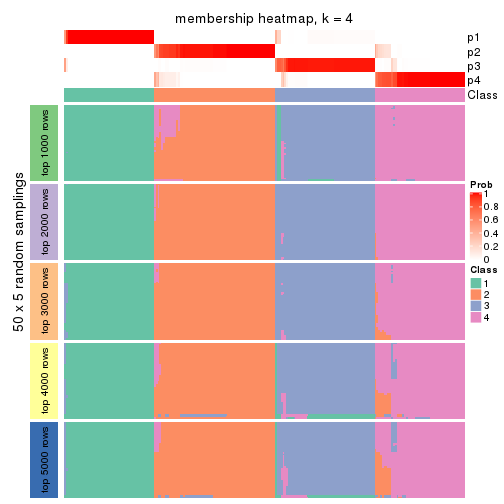</p>

</div>
<div id='tab-ATC-kmeans-membership-heatmap-4'>
<pre><code class="r">membership_heatmap(res, k = 5)
</code></pre>

<p></p>

</div>
<div id='tab-ATC-kmeans-membership-heatmap-5'>
<pre><code class="r">membership_heatmap(res, k = 6)
</code></pre>

<p></p>

</div>
</div>

As soon as we have had the classes for columns, we can look for signatures
which are significantly different between classes which can be candidate marks
for certain classes. Following are the heatmaps for signatures.


Signature heatmaps where rows are scaled:


<script>
$( function() {
	$( '#tabs-ATC-kmeans-get-signatures' ).tabs();
} );
</script>
<div id='tabs-ATC-kmeans-get-signatures'>
<ul>
<li><a href='#tab-ATC-kmeans-get-signatures-1'>k = 2</a></li>
<li><a href='#tab-ATC-kmeans-get-signatures-2'>k = 3</a></li>
<li><a href='#tab-ATC-kmeans-get-signatures-3'>k = 4</a></li>
<li><a href='#tab-ATC-kmeans-get-signatures-4'>k = 5</a></li>
<li><a href='#tab-ATC-kmeans-get-signatures-5'>k = 6</a></li>
</ul>
<div id='tab-ATC-kmeans-get-signatures-1'>
<pre><code class="r">get_signatures(res, k = 2)
</code></pre>

<p></p>

</div>
<div id='tab-ATC-kmeans-get-signatures-2'>
<pre><code class="r">get_signatures(res, k = 3)
</code></pre>

<p></p>

</div>
<div id='tab-ATC-kmeans-get-signatures-3'>
<pre><code class="r">get_signatures(res, k = 4)
</code></pre>

<p></p>

</div>
<div id='tab-ATC-kmeans-get-signatures-4'>
<pre><code class="r">get_signatures(res, k = 5)
</code></pre>

<p></p>

</div>
<div id='tab-ATC-kmeans-get-signatures-5'>
<pre><code class="r">get_signatures(res, k = 6)
</code></pre>

<p></p>

</div>
</div>


Signature heatmaps where rows are not scaled:


<script>
$( function() {
	$( '#tabs-ATC-kmeans-get-signatures-no-scale' ).tabs();
} );
</script>
<div id='tabs-ATC-kmeans-get-signatures-no-scale'>
<ul>
<li><a href='#tab-ATC-kmeans-get-signatures-no-scale-1'>k = 2</a></li>
<li><a href='#tab-ATC-kmeans-get-signatures-no-scale-2'>k = 3</a></li>
<li><a href='#tab-ATC-kmeans-get-signatures-no-scale-3'>k = 4</a></li>
<li><a href='#tab-ATC-kmeans-get-signatures-no-scale-4'>k = 5</a></li>
<li><a href='#tab-ATC-kmeans-get-signatures-no-scale-5'>k = 6</a></li>
</ul>
<div id='tab-ATC-kmeans-get-signatures-no-scale-1'>
<pre><code class="r">get_signatures(res, k = 2, scale_rows = FALSE)
</code></pre>

<p></p>

</div>
<div id='tab-ATC-kmeans-get-signatures-no-scale-2'>
<pre><code class="r">get_signatures(res, k = 3, scale_rows = FALSE)
</code></pre>

<p></p>

</div>
<div id='tab-ATC-kmeans-get-signatures-no-scale-3'>
<pre><code class="r">get_signatures(res, k = 4, scale_rows = FALSE)
</code></pre>

<p></p>

</div>
<div id='tab-ATC-kmeans-get-signatures-no-scale-4'>
<pre><code class="r">get_signatures(res, k = 5, scale_rows = FALSE)
</code></pre>

<p></p>

</div>
<div id='tab-ATC-kmeans-get-signatures-no-scale-5'>
<pre><code class="r">get_signatures(res, k = 6, scale_rows = FALSE)
</code></pre>

<p></p>

</div>
</div>


Compare the overlap of signatures from different k:

```r
compare_signatures(res)
```


`get_signature()` returns a data frame invisibly. TO get the list of signatures, the function
call should be assigned to a variable explicitly. In following code, if `plot` argument is set
to `FALSE`, no heatmap is plotted while only the differential analysis is performed.

```r
# code only for demonstration
tb = get_signature(res, k = ..., plot = FALSE)
```

An example of the output of `tb` is:

```
#>   which_row         fdr    mean_1    mean_2 scaled_mean_1 scaled_mean_2 km
#> 1        38 0.042760348  8.373488  9.131774    -0.5533452     0.5164555  1
#> 2        40 0.018707592  7.106213  8.469186    -0.6173731     0.5762149  1
#> 3        55 0.019134737 10.221463 11.207825    -0.6159697     0.5749050  1
#> 4        59 0.006059896  5.921854  7.869574    -0.6899429     0.6439467  1
#> 5        60 0.018055526  8.928898 10.211722    -0.6204761     0.5791110  1
#> 6        98 0.009384629 15.714769 14.887706     0.6635654    -0.6193277  2
...
```

The columns in `tb` are:

1. `which_row`: row indices corresponding to the input matrix.
2. `fdr`: FDR for the differential test. 
3. `mean_x`: The mean value in group x.
4. `scaled_mean_x`: The mean value in group x after rows are scaled.
5. `km`: Row groups if k-means clustering is applied to rows.


UMAP plot which shows how samples are separated.


<script>
$( function() {
	$( '#tabs-ATC-kmeans-dimension-reduction' ).tabs();
} );
</script>
<div id='tabs-ATC-kmeans-dimension-reduction'>
<ul>
<li><a href='#tab-ATC-kmeans-dimension-reduction-1'>k = 2</a></li>
<li><a href='#tab-ATC-kmeans-dimension-reduction-2'>k = 3</a></li>
<li><a href='#tab-ATC-kmeans-dimension-reduction-3'>k = 4</a></li>
<li><a href='#tab-ATC-kmeans-dimension-reduction-4'>k = 5</a></li>
<li><a href='#tab-ATC-kmeans-dimension-reduction-5'>k = 6</a></li>
</ul>
<div id='tab-ATC-kmeans-dimension-reduction-1'>
<pre><code class="r">dimension_reduction(res, k = 2, method = &quot;UMAP&quot;)
</code></pre>

<p></p>

</div>
<div id='tab-ATC-kmeans-dimension-reduction-2'>
<pre><code class="r">dimension_reduction(res, k = 3, method = &quot;UMAP&quot;)
</code></pre>

<p></p>

</div>
<div id='tab-ATC-kmeans-dimension-reduction-3'>
<pre><code class="r">dimension_reduction(res, k = 4, method = &quot;UMAP&quot;)
</code></pre>

<p></p>

</div>
<div id='tab-ATC-kmeans-dimension-reduction-4'>
<pre><code class="r">dimension_reduction(res, k = 5, method = &quot;UMAP&quot;)
</code></pre>

<p></p>

</div>
<div id='tab-ATC-kmeans-dimension-reduction-5'>
<pre><code class="r">dimension_reduction(res, k = 6, method = &quot;UMAP&quot;)
</code></pre>

<p></p>

</div>
</div>


Following heatmap shows how subgroups are split when increasing `k`:

```r
collect_classes(res)
```


If matrix rows can be associated to genes, consider to use `GO_Enrichment(res,
...)` to perform function enrichment for the signature genes.


 

---------------------------------------------------


### ATC:skmeans**


The object with results only for a single top-value method and a single partition method 
can be extracted as:

```r
res = res_list["ATC", "skmeans"]
# you can also extract it by
# res = res_list["ATC:skmeans"]
```

A summary of `res` and all the functions that can be applied to it:

```r
res
```

```
#> A 'ConsensusPartition' object with k = 2, 3, 4, 5, 6.
#>   On a matrix with 17680 rows and 218 columns.
#>   Top rows (1000, 2000, 3000, 4000, 5000) are extracted by 'ATC' method.
#>   Subgroups are detected by 'skmeans' method.
#>   Performed in total 1250 partitions by row resampling.
#>   Best k for subgroups seems to be 4.
#> 
#> Following methods can be applied to this 'ConsensusPartition' object:
#>  [1] "cola_report"             "collect_classes"         "collect_plots"          
#>  [4] "collect_stats"           "colnames"                "compare_signatures"     
#>  [7] "consensus_heatmap"       "dimension_reduction"     "functional_enrichment"  
#> [10] "get_anno_col"            "get_anno"                "get_classes"            
#> [13] "get_consensus"           "get_matrix"              "get_membership"         
#> [16] "get_param"               "get_signatures"          "get_stats"              
#> [19] "is_best_k"               "is_stable_k"             "membership_heatmap"     
#> [22] "ncol"                    "nrow"                    "plot_ecdf"              
#> [25] "rownames"                "select_partition_number" "show"                   
#> [28] "suggest_best_k"          "test_to_known_factors"
```

`collect_plots()` function collects all the plots made from `res` for all `k` (number of partitions)
into one single page to provide an easy and fast comparison between different `k`.

```r
collect_plots(res)
```


The plots are:

- The first row: a plot of the ECDF (Empirical cumulative distribution
  function) curves of the consensus matrix for each `k` and the heatmap of
  predicted classes for each `k`.
- The second row: heatmaps of the consensus matrix for each `k`.
- The third row: heatmaps of the membership matrix for each `k`.
- The fouth row: heatmaps of the signatures for each `k`.

All the plots in panels can be made by individual functions and they are
plotted later in this section.

`select_partition_number()` produces several plots showing different
statistics for choosing "optimized" `k`. There are following statistics:

- ECDF curves of the consensus matrix for each `k`;
- 1-PAC. [The PAC
  score](https://en.wikipedia.org/wiki/Consensus_clustering#Over-interpretation_potential_of_consensus_clustering)
  measures the proportion of the ambiguous subgrouping.
- Mean silhouette score.
- Concordance. The mean probability of fiting the consensus class ids in all
  partitions.
- Area increased. Denote $A_k$ as the area under the ECDF curve for current
  `k`, the area increased is defined as $A_k - A_{k-1}$.
- Rand index. The percent of pairs of samples that are both in a same cluster
  or both are not in a same cluster in the partition of k and k-1.
- Jaccard index. The ratio of pairs of samples are both in a same cluster in
  the partition of k and k-1 and the pairs of samples are both in a same
  cluster in the partition k or k-1.

The detailed explanations of these statistics can be found in [the cola
vignette](http://bioconductor.org/packages/devel/bioc/vignettes/cola/inst/doc/cola.html#toc_13).

Generally speaking, lower PAC score, higher mean silhouette score or higher
concordance corresponds to better partition. Rand index and Jaccard index
measure how similar the current partition is compared to partition with `k-1`.
If they are too similar, we won't accept `k` is better than `k-1`.

```r
select_partition_number(res)
```


The numeric values for all these statistics can be obtained by `get_stats()`.

```r
get_stats(res)
```

```
#>   k 1-PAC mean_silhouette concordance area_increased  Rand Jaccard
#> 2 2 1.000           0.992       0.997         0.5026 0.498   0.498
#> 3 3 0.882           0.951       0.969         0.1218 0.943   0.885
#> 4 4 0.950           0.913       0.957         0.1402 0.917   0.812
#> 5 5 0.785           0.757       0.857         0.0882 0.969   0.917
#> 6 6 0.768           0.564       0.792         0.0496 0.965   0.900
```

`suggest_best_k()` suggests the best $k$ based on these statistics. The rules are as follows:

- All $k$ with Jaccard index larger than 0.95 are removed because the increase of
  the partition number does not provides enough extra information. If all $k$ are removed,
  the best $k$ is assigned by `NA`.
- For $k$ with 1-PAC larger than 0.9, the maximal $k$ is taken as the "best k". Other $k$ is called "optional k".
- If it does not fit the second rule. The $k$ with the highest vote of highest
  1-PAC, mean silhouette and concordance is taken as the "best k".

```r
suggest_best_k(res)
```

```
#> [1] 4
#> attr(,"optional")
#> [1] 2
```

There is also optional best $k$ = 2 that is worth to check.

Following shows the table of the partitions (You need to click the **show/hide
code output** link to see it). The membership matrix (columns with name `p*`)
is inferred by
[`clue::cl_consensus()`](https://www.rdocumentation.org/link/cl_consensus?package=clue)
function with the `SE` method. Basically the value in the membership matrix
represents the probability to belong to a certain group. The finall class
label for an item is determined with the group with highest probability it
belongs to.

In `get_classes()` function, the entropy is calculated from the membership
matrix and the silhouette score is calculated from the consensus matrix.


<script>
$( function() {
	$( '#tabs-ATC-skmeans-get-classes' ).tabs();
} );
</script>
<div id='tabs-ATC-skmeans-get-classes'>
<ul>
<li><a href='#tab-ATC-skmeans-get-classes-1'>k = 2</a></li>
<li><a href='#tab-ATC-skmeans-get-classes-2'>k = 3</a></li>
<li><a href='#tab-ATC-skmeans-get-classes-3'>k = 4</a></li>
<li><a href='#tab-ATC-skmeans-get-classes-4'>k = 5</a></li>
<li><a href='#tab-ATC-skmeans-get-classes-5'>k = 6</a></li>
</ul>

<div id='tab-ATC-skmeans-get-classes-1'>
<p><a id='tab-ATC-skmeans-get-classes-1-a' style='color:#0366d6' href='#'>show/hide code output</a></p>
<pre><code class="r">cbind(get_classes(res, k = 2), get_membership(res, k = 2))
</code></pre>

<pre><code>#&gt;            class entropy silhouette    p1    p2
#&gt; SRR1498997     2   0.000      0.997 0.000 1.000
#&gt; SRR1076441     1   0.000      0.996 1.000 0.000
#&gt; SRR1489803     2   0.000      0.997 0.000 1.000
#&gt; SRR1345953     2   0.000      0.997 0.000 1.000
#&gt; SRR1357826     2   0.000      0.997 0.000 1.000
#&gt; SRR1419656     1   0.000      0.996 1.000 0.000
#&gt; SRR1454158     2   0.000      0.997 0.000 1.000
#&gt; SRR1475408     2   0.000      0.997 0.000 1.000
#&gt; SRR1472704     2   0.000      0.997 0.000 1.000
#&gt; SRR1090046     1   0.000      0.996 1.000 0.000
#&gt; SRR1312822     1   0.000      0.996 1.000 0.000
#&gt; SRR1096987     2   0.000      0.997 0.000 1.000
#&gt; SRR1334587     2   0.000      0.997 0.000 1.000
#&gt; SRR1490246     1   0.000      0.996 1.000 0.000
#&gt; SRR1467522     1   0.000      0.996 1.000 0.000
#&gt; SRR1324206     1   0.000      0.996 1.000 0.000
#&gt; SRR1408574     2   0.000      0.997 0.000 1.000
#&gt; SRR1083959     2   0.000      0.997 0.000 1.000
#&gt; SRR1079948     2   0.000      0.997 0.000 1.000
#&gt; SRR1310667     2   0.000      0.997 0.000 1.000
#&gt; SRR655852      2   0.000      0.997 0.000 1.000
#&gt; SRR1352457     2   0.000      0.997 0.000 1.000
#&gt; SRR1353994     2   0.000      0.997 0.000 1.000
#&gt; SRR1459561     2   0.000      0.997 0.000 1.000
#&gt; SRR1454009     1   0.000      0.996 1.000 0.000
#&gt; SRR1071084     1   0.000      0.996 1.000 0.000
#&gt; SRR1082859     2   0.000      0.997 0.000 1.000
#&gt; SRR1086538     1   0.000      0.996 1.000 0.000
#&gt; SRR1486262     2   0.000      0.997 0.000 1.000
#&gt; SRR658105      1   0.000      0.996 1.000 0.000
#&gt; SRR811073      2   0.000      0.997 0.000 1.000
#&gt; SRR1429181     2   0.000      0.997 0.000 1.000
#&gt; SRR1327896     2   0.000      0.997 0.000 1.000
#&gt; SRR1464788     2   0.000      0.997 0.000 1.000
#&gt; SRR1346861     2   0.000      0.997 0.000 1.000
#&gt; SRR1318774     2   0.000      0.997 0.000 1.000
#&gt; SRR1420517     1   0.000      0.996 1.000 0.000
#&gt; SRR1369584     2   0.000      0.997 0.000 1.000
#&gt; SRR1443244     1   0.000      0.996 1.000 0.000
#&gt; SRR1455391     1   0.000      0.996 1.000 0.000
#&gt; SRR1068999     1   0.000      0.996 1.000 0.000
#&gt; SRR1481297     1   0.000      0.996 1.000 0.000
#&gt; SRR1070208     1   0.000      0.996 1.000 0.000
#&gt; SRR1317282     1   0.000      0.996 1.000 0.000
#&gt; SRR1096125     2   0.000      0.997 0.000 1.000
#&gt; SRR1472506     1   0.000      0.996 1.000 0.000
#&gt; SRR1388281     2   0.000      0.997 0.000 1.000
#&gt; SRR1365622     2   0.000      0.997 0.000 1.000
#&gt; SRR662306      1   0.000      0.996 1.000 0.000
#&gt; SRR662811      1   0.000      0.996 1.000 0.000
#&gt; SRR820571      1   0.000      0.996 1.000 0.000
#&gt; SRR1357166     1   0.000      0.996 1.000 0.000
#&gt; SRR1488586     1   0.000      0.996 1.000 0.000
#&gt; SRR1485398     1   0.000      0.996 1.000 0.000
#&gt; SRR1417725     2   0.895      0.542 0.312 0.688
#&gt; SRR1409397     2   0.000      0.997 0.000 1.000
#&gt; SRR1465693     2   0.000      0.997 0.000 1.000
#&gt; SRR1096547     1   0.000      0.996 1.000 0.000
#&gt; SRR1456818     1   0.000      0.996 1.000 0.000
#&gt; SRR816336      1   0.000      0.996 1.000 0.000
#&gt; SRR1420238     1   0.000      0.996 1.000 0.000
#&gt; SRR1433374     1   0.000      0.996 1.000 0.000
#&gt; SRR1436990     1   0.000      0.996 1.000 0.000
#&gt; SRR662378      1   0.000      0.996 1.000 0.000
#&gt; SRR1477671     1   0.000      0.996 1.000 0.000
#&gt; SRR1084079     1   0.000      0.996 1.000 0.000
#&gt; SRR1102949     1   0.000      0.996 1.000 0.000
#&gt; SRR1458090     1   0.000      0.996 1.000 0.000
#&gt; SRR1418729     2   0.000      0.997 0.000 1.000
#&gt; SRR1403814     2   0.000      0.997 0.000 1.000
#&gt; SRR1404887     1   0.000      0.996 1.000 0.000
#&gt; SRR1434955     1   0.000      0.996 1.000 0.000
#&gt; SRR1360652     1   0.000      0.996 1.000 0.000
#&gt; SRR1356765     2   0.000      0.997 0.000 1.000
#&gt; SRR1078258     2   0.000      0.997 0.000 1.000
#&gt; SRR1455861     1   0.000      0.996 1.000 0.000
#&gt; SRR1420296     2   0.000      0.997 0.000 1.000
#&gt; SRR1070260     2   0.000      0.997 0.000 1.000
#&gt; SRR1410765     1   0.000      0.996 1.000 0.000
#&gt; SRR1481315     1   0.000      0.996 1.000 0.000
#&gt; SRR1414661     2   0.000      0.997 0.000 1.000
#&gt; SRR1359147     2   0.000      0.997 0.000 1.000
#&gt; SRR1488694     1   0.000      0.996 1.000 0.000
#&gt; SRR1477273     1   0.000      0.996 1.000 0.000
#&gt; SRR1415792     1   0.000      0.996 1.000 0.000
#&gt; SRR1369088     2   0.000      0.997 0.000 1.000
#&gt; SRR1406621     1   0.714      0.757 0.804 0.196
#&gt; SRR1401017     2   0.000      0.997 0.000 1.000
#&gt; SRR1099981     2   0.000      0.997 0.000 1.000
#&gt; SRR815208      2   0.000      0.997 0.000 1.000
#&gt; SRR1380460     2   0.000      0.997 0.000 1.000
#&gt; SRR1091097     2   0.000      0.997 0.000 1.000
#&gt; SRR1456010     1   0.000      0.996 1.000 0.000
#&gt; SRR1498416     2   0.000      0.997 0.000 1.000
#&gt; SRR818873      2   0.000      0.997 0.000 1.000
#&gt; SRR813868      2   0.000      0.997 0.000 1.000
#&gt; SRR1394912     1   0.000      0.996 1.000 0.000
#&gt; SRR1475824     2   0.000      0.997 0.000 1.000
#&gt; SRR1459866     1   0.000      0.996 1.000 0.000
#&gt; SRR1364871     1   0.000      0.996 1.000 0.000
#&gt; SRR1100472     2   0.000      0.997 0.000 1.000
#&gt; SRR1331267     1   0.000      0.996 1.000 0.000
#&gt; SRR1068977     2   0.000      0.997 0.000 1.000
#&gt; SRR1391511     2   0.000      0.997 0.000 1.000
#&gt; SRR1077920     2   0.000      0.997 0.000 1.000
#&gt; SRR1457705     1   0.000      0.996 1.000 0.000
#&gt; SRR1437073     1   0.000      0.996 1.000 0.000
#&gt; SRR1473124     1   0.000      0.996 1.000 0.000
#&gt; SRR1469279     1   0.000      0.996 1.000 0.000
#&gt; SRR1091791     2   0.000      0.997 0.000 1.000
#&gt; SRR1341539     2   0.000      0.997 0.000 1.000
#&gt; SRR1446354     1   0.000      0.996 1.000 0.000
#&gt; SRR1415420     1   0.000      0.996 1.000 0.000
#&gt; SRR1368050     1   0.000      0.996 1.000 0.000
#&gt; SRR656970      2   0.000      0.997 0.000 1.000
#&gt; SRR1473403     2   0.000      0.997 0.000 1.000
#&gt; SRR1084674     1   0.000      0.996 1.000 0.000
#&gt; SRR1464702     1   0.000      0.996 1.000 0.000
#&gt; SRR1074860     1   0.000      0.996 1.000 0.000
#&gt; SRR655447      2   0.000      0.997 0.000 1.000
#&gt; SRR1404442     2   0.000      0.997 0.000 1.000
#&gt; SRR1418795     1   0.000      0.996 1.000 0.000
#&gt; SRR1458335     2   0.000      0.997 0.000 1.000
#&gt; SRR1489589     2   0.000      0.997 0.000 1.000
#&gt; SRR1378284     1   0.000      0.996 1.000 0.000
#&gt; SRR1408014     2   0.000      0.997 0.000 1.000
#&gt; SRR1083052     1   0.000      0.996 1.000 0.000
#&gt; SRR1339236     2   0.000      0.997 0.000 1.000
#&gt; SRR1323829     2   0.000      0.997 0.000 1.000
#&gt; SRR1086772     2   0.000      0.997 0.000 1.000
#&gt; SRR1486457     1   0.000      0.996 1.000 0.000
#&gt; SRR1415257     2   0.000      0.997 0.000 1.000
#&gt; SRR1071905     1   0.000      0.996 1.000 0.000
#&gt; SRR659223      2   0.000      0.997 0.000 1.000
#&gt; SRR1386945     1   0.000      0.996 1.000 0.000
#&gt; SRR821498      2   0.000      0.997 0.000 1.000
#&gt; SRR1378903     2   0.000      0.997 0.000 1.000
#&gt; SRR1472907     1   0.000      0.996 1.000 0.000
#&gt; SRR1442313     2   0.000      0.997 0.000 1.000
#&gt; SRR1077139     2   0.000      0.997 0.000 1.000
#&gt; SRR1342758     1   0.000      0.996 1.000 0.000
#&gt; SRR656911      2   0.000      0.997 0.000 1.000
#&gt; SRR1070738     1   0.000      0.996 1.000 0.000
#&gt; SRR1476950     1   0.000      0.996 1.000 0.000
#&gt; SRR1488196     1   0.000      0.996 1.000 0.000
#&gt; SRR1498951     1   0.000      0.996 1.000 0.000
#&gt; SRR1413392     1   0.000      0.996 1.000 0.000
#&gt; SRR657528      2   0.000      0.997 0.000 1.000
#&gt; SRR812198      1   0.000      0.996 1.000 0.000
#&gt; SRR660283      2   0.000      0.997 0.000 1.000
#&gt; SRR1420936     1   0.000      0.996 1.000 0.000
#&gt; SRR1469547     2   0.000      0.997 0.000 1.000
#&gt; SRR1322249     1   0.000      0.996 1.000 0.000
#&gt; SRR1396682     1   0.000      0.996 1.000 0.000
#&gt; SRR1095816     2   0.000      0.997 0.000 1.000
#&gt; SRR1081023     1   0.000      0.996 1.000 0.000
#&gt; SRR1092517     2   0.000      0.997 0.000 1.000
#&gt; SRR811285      2   0.000      0.997 0.000 1.000
#&gt; SRR657018      1   0.000      0.996 1.000 0.000
#&gt; SRR1365534     1   0.000      0.996 1.000 0.000
#&gt; SRR1090791     2   0.000      0.997 0.000 1.000
#&gt; SRR1439915     2   0.000      0.997 0.000 1.000
#&gt; SRR1391575     2   0.000      0.997 0.000 1.000
#&gt; SRR1314092     2   0.000      0.997 0.000 1.000
#&gt; SRR1328941     1   0.000      0.996 1.000 0.000
#&gt; SRR1336181     2   0.000      0.997 0.000 1.000
#&gt; SRR1362972     1   0.000      0.996 1.000 0.000
#&gt; SRR1366790     2   0.000      0.997 0.000 1.000
#&gt; SRR1455902     1   0.000      0.996 1.000 0.000
#&gt; SRR1437644     2   0.000      0.997 0.000 1.000
#&gt; SRR1105009     2   0.000      0.997 0.000 1.000
#&gt; SRR1367024     1   0.000      0.996 1.000 0.000
#&gt; SRR660248      2   0.000      0.997 0.000 1.000
#&gt; SRR1409620     1   0.000      0.996 1.000 0.000
#&gt; SRR1455807     2   0.000      0.997 0.000 1.000
#&gt; SRR1339431     1   0.000      0.996 1.000 0.000
#&gt; SRR1378948     1   0.000      0.996 1.000 0.000
#&gt; SRR1469237     1   0.000      0.996 1.000 0.000
#&gt; SRR1098264     2   0.000      0.997 0.000 1.000
#&gt; SRR1406224     2   0.000      0.997 0.000 1.000
#&gt; SRR1393026     1   0.000      0.996 1.000 0.000
#&gt; SRR808428      2   0.000      0.997 0.000 1.000
#&gt; SRR615910      2   0.000      0.997 0.000 1.000
#&gt; SRR1076219     1   0.000      0.996 1.000 0.000
#&gt; SRR1481128     1   0.000      0.996 1.000 0.000
#&gt; SRR1359262     2   0.000      0.997 0.000 1.000
#&gt; SRR1407648     2   0.000      0.997 0.000 1.000
#&gt; SRR1386775     1   0.000      0.996 1.000 0.000
#&gt; SRR1388399     1   0.745      0.732 0.788 0.212
#&gt; SRR1361499     2   0.000      0.997 0.000 1.000
#&gt; SRR1500709     2   0.000      0.997 0.000 1.000
#&gt; SRR1335917     1   0.000      0.996 1.000 0.000
#&gt; SRR1430615     2   0.000      0.997 0.000 1.000
#&gt; SRR1335212     1   0.000      0.996 1.000 0.000
#&gt; SRR1400159     1   0.000      0.996 1.000 0.000
#&gt; SRR1457245     2   0.000      0.997 0.000 1.000
#&gt; SRR1356746     2   0.000      0.997 0.000 1.000
#&gt; SRR658319      2   0.000      0.997 0.000 1.000
#&gt; SRR1435946     1   0.000      0.996 1.000 0.000
#&gt; SRR1370308     1   0.000      0.996 1.000 0.000
#&gt; SRR1100893     1   0.000      0.996 1.000 0.000
#&gt; SRR1389432     1   0.000      0.996 1.000 0.000
#&gt; SRR1381799     2   0.000      0.997 0.000 1.000
#&gt; SRR1310158     1   0.000      0.996 1.000 0.000
#&gt; SRR1341100     2   0.000      0.997 0.000 1.000
#&gt; SRR1342873     1   0.000      0.996 1.000 0.000
#&gt; SRR1472102     2   0.000      0.997 0.000 1.000
#&gt; SRR1409421     1   0.000      0.996 1.000 0.000
#&gt; SRR1328577     2   0.000      0.997 0.000 1.000
#&gt; SRR808942      2   0.000      0.997 0.000 1.000
#&gt; SRR1343818     2   0.000      0.997 0.000 1.000
#&gt; SRR1472415     2   0.000      0.997 0.000 1.000
#&gt; SRR658409      2   0.000      0.997 0.000 1.000
#&gt; SRR1469681     1   0.000      0.996 1.000 0.000
#&gt; SRR1075484     2   0.000      0.997 0.000 1.000
#&gt; SRR1417894     1   0.000      0.996 1.000 0.000
#&gt; SRR1417422     2   0.000      0.997 0.000 1.000
#&gt; SRR1090674     1   0.000      0.996 1.000 0.000
</code></pre>

<script>
$('#tab-ATC-skmeans-get-classes-1-a').parent().next().next().hide();
$('#tab-ATC-skmeans-get-classes-1-a').click(function(){
  $('#tab-ATC-skmeans-get-classes-1-a').parent().next().next().toggle();
  return(false);
});
</script>
</div>

<div id='tab-ATC-skmeans-get-classes-2'>
<p><a id='tab-ATC-skmeans-get-classes-2-a' style='color:#0366d6' href='#'>show/hide code output</a></p>
<pre><code class="r">cbind(get_classes(res, k = 3), get_membership(res, k = 3))
</code></pre>

<pre><code>#&gt;            class entropy silhouette    p1    p2    p3
#&gt; SRR1498997     2   0.000      0.994 0.000 1.000 0.000
#&gt; SRR1076441     1   0.000      0.957 1.000 0.000 0.000
#&gt; SRR1489803     2   0.000      0.994 0.000 1.000 0.000
#&gt; SRR1345953     2   0.000      0.994 0.000 1.000 0.000
#&gt; SRR1357826     2   0.000      0.994 0.000 1.000 0.000
#&gt; SRR1419656     1   0.000      0.957 1.000 0.000 0.000
#&gt; SRR1454158     2   0.000      0.994 0.000 1.000 0.000
#&gt; SRR1475408     2   0.375      0.794 0.000 0.856 0.144
#&gt; SRR1472704     2   0.000      0.994 0.000 1.000 0.000
#&gt; SRR1090046     1   0.000      0.957 1.000 0.000 0.000
#&gt; SRR1312822     1   0.000      0.957 1.000 0.000 0.000
#&gt; SRR1096987     2   0.000      0.994 0.000 1.000 0.000
#&gt; SRR1334587     2   0.000      0.994 0.000 1.000 0.000
#&gt; SRR1490246     1   0.000      0.957 1.000 0.000 0.000
#&gt; SRR1467522     1   0.000      0.957 1.000 0.000 0.000
#&gt; SRR1324206     1   0.000      0.957 1.000 0.000 0.000
#&gt; SRR1408574     2   0.000      0.994 0.000 1.000 0.000
#&gt; SRR1083959     2   0.000      0.994 0.000 1.000 0.000
#&gt; SRR1079948     2   0.000      0.994 0.000 1.000 0.000
#&gt; SRR1310667     2   0.000      0.994 0.000 1.000 0.000
#&gt; SRR655852      2   0.000      0.994 0.000 1.000 0.000
#&gt; SRR1352457     2   0.000      0.994 0.000 1.000 0.000
#&gt; SRR1353994     2   0.000      0.994 0.000 1.000 0.000
#&gt; SRR1459561     2   0.000      0.994 0.000 1.000 0.000
#&gt; SRR1454009     1   0.000      0.957 1.000 0.000 0.000
#&gt; SRR1071084     1   0.382      0.870 0.852 0.000 0.148
#&gt; SRR1082859     2   0.000      0.994 0.000 1.000 0.000
#&gt; SRR1086538     1   0.000      0.957 1.000 0.000 0.000
#&gt; SRR1486262     2   0.000      0.994 0.000 1.000 0.000
#&gt; SRR658105      1   0.000      0.957 1.000 0.000 0.000
#&gt; SRR811073      2   0.000      0.994 0.000 1.000 0.000
#&gt; SRR1429181     2   0.000      0.994 0.000 1.000 0.000
#&gt; SRR1327896     2   0.000      0.994 0.000 1.000 0.000
#&gt; SRR1464788     3   0.450      0.861 0.000 0.196 0.804
#&gt; SRR1346861     2   0.000      0.994 0.000 1.000 0.000
#&gt; SRR1318774     3   0.382      0.866 0.000 0.148 0.852
#&gt; SRR1420517     1   0.000      0.957 1.000 0.000 0.000
#&gt; SRR1369584     3   0.450      0.861 0.000 0.196 0.804
#&gt; SRR1443244     1   0.175      0.921 0.952 0.000 0.048
#&gt; SRR1455391     1   0.000      0.957 1.000 0.000 0.000
#&gt; SRR1068999     1   0.000      0.957 1.000 0.000 0.000
#&gt; SRR1481297     1   0.000      0.957 1.000 0.000 0.000
#&gt; SRR1070208     1   0.000      0.957 1.000 0.000 0.000
#&gt; SRR1317282     1   0.382      0.870 0.852 0.000 0.148
#&gt; SRR1096125     2   0.000      0.994 0.000 1.000 0.000
#&gt; SRR1472506     1   0.382      0.870 0.852 0.000 0.148
#&gt; SRR1388281     2   0.000      0.994 0.000 1.000 0.000
#&gt; SRR1365622     2   0.000      0.994 0.000 1.000 0.000
#&gt; SRR662306      1   0.382      0.870 0.852 0.000 0.148
#&gt; SRR662811      1   0.000      0.957 1.000 0.000 0.000
#&gt; SRR820571      1   0.382      0.870 0.852 0.000 0.148
#&gt; SRR1357166     1   0.000      0.957 1.000 0.000 0.000
#&gt; SRR1488586     1   0.000      0.957 1.000 0.000 0.000
#&gt; SRR1485398     1   0.000      0.957 1.000 0.000 0.000
#&gt; SRR1417725     3   0.000      0.808 0.000 0.000 1.000
#&gt; SRR1409397     2   0.000      0.994 0.000 1.000 0.000
#&gt; SRR1465693     2   0.000      0.994 0.000 1.000 0.000
#&gt; SRR1096547     1   0.382      0.870 0.852 0.000 0.148
#&gt; SRR1456818     1   0.000      0.957 1.000 0.000 0.000
#&gt; SRR816336      1   0.382      0.870 0.852 0.000 0.148
#&gt; SRR1420238     1   0.000      0.957 1.000 0.000 0.000
#&gt; SRR1433374     1   0.382      0.870 0.852 0.000 0.148
#&gt; SRR1436990     1   0.000      0.957 1.000 0.000 0.000
#&gt; SRR662378      1   0.000      0.957 1.000 0.000 0.000
#&gt; SRR1477671     1   0.000      0.957 1.000 0.000 0.000
#&gt; SRR1084079     3   0.568      0.558 0.316 0.000 0.684
#&gt; SRR1102949     1   0.000      0.957 1.000 0.000 0.000
#&gt; SRR1458090     1   0.000      0.957 1.000 0.000 0.000
#&gt; SRR1418729     3   0.236      0.857 0.000 0.072 0.928
#&gt; SRR1403814     3   0.450      0.861 0.000 0.196 0.804
#&gt; SRR1404887     1   0.175      0.921 0.952 0.000 0.048
#&gt; SRR1434955     1   0.000      0.957 1.000 0.000 0.000
#&gt; SRR1360652     1   0.000      0.957 1.000 0.000 0.000
#&gt; SRR1356765     2   0.000      0.994 0.000 1.000 0.000
#&gt; SRR1078258     2   0.000      0.994 0.000 1.000 0.000
#&gt; SRR1455861     1   0.000      0.957 1.000 0.000 0.000
#&gt; SRR1420296     2   0.000      0.994 0.000 1.000 0.000
#&gt; SRR1070260     2   0.000      0.994 0.000 1.000 0.000
#&gt; SRR1410765     1   0.000      0.957 1.000 0.000 0.000
#&gt; SRR1481315     1   0.000      0.957 1.000 0.000 0.000
#&gt; SRR1414661     2   0.000      0.994 0.000 1.000 0.000
#&gt; SRR1359147     2   0.000      0.994 0.000 1.000 0.000
#&gt; SRR1488694     1   0.000      0.957 1.000 0.000 0.000
#&gt; SRR1477273     1   0.382      0.870 0.852 0.000 0.148
#&gt; SRR1415792     1   0.000      0.957 1.000 0.000 0.000
#&gt; SRR1369088     2   0.000      0.994 0.000 1.000 0.000
#&gt; SRR1406621     3   0.382      0.783 0.148 0.000 0.852
#&gt; SRR1401017     2   0.000      0.994 0.000 1.000 0.000
#&gt; SRR1099981     2   0.000      0.994 0.000 1.000 0.000
#&gt; SRR815208      2   0.000      0.994 0.000 1.000 0.000
#&gt; SRR1380460     2   0.000      0.994 0.000 1.000 0.000
#&gt; SRR1091097     2   0.000      0.994 0.000 1.000 0.000
#&gt; SRR1456010     1   0.382      0.870 0.852 0.000 0.148
#&gt; SRR1498416     3   0.450      0.861 0.000 0.196 0.804
#&gt; SRR818873      2   0.000      0.994 0.000 1.000 0.000
#&gt; SRR813868      2   0.000      0.994 0.000 1.000 0.000
#&gt; SRR1394912     1   0.000      0.957 1.000 0.000 0.000
#&gt; SRR1475824     2   0.000      0.994 0.000 1.000 0.000
#&gt; SRR1459866     1   0.000      0.957 1.000 0.000 0.000
#&gt; SRR1364871     1   0.382      0.870 0.852 0.000 0.148
#&gt; SRR1100472     2   0.000      0.994 0.000 1.000 0.000
#&gt; SRR1331267     1   0.000      0.957 1.000 0.000 0.000
#&gt; SRR1068977     2   0.000      0.994 0.000 1.000 0.000
#&gt; SRR1391511     2   0.000      0.994 0.000 1.000 0.000
#&gt; SRR1077920     2   0.000      0.994 0.000 1.000 0.000
#&gt; SRR1457705     1   0.000      0.957 1.000 0.000 0.000
#&gt; SRR1437073     1   0.000      0.957 1.000 0.000 0.000
#&gt; SRR1473124     1   0.382      0.870 0.852 0.000 0.148
#&gt; SRR1469279     1   0.000      0.957 1.000 0.000 0.000
#&gt; SRR1091791     2   0.000      0.994 0.000 1.000 0.000
#&gt; SRR1341539     3   0.450      0.861 0.000 0.196 0.804
#&gt; SRR1446354     1   0.382      0.870 0.852 0.000 0.148
#&gt; SRR1415420     1   0.000      0.957 1.000 0.000 0.000
#&gt; SRR1368050     1   0.000      0.957 1.000 0.000 0.000
#&gt; SRR656970      2   0.000      0.994 0.000 1.000 0.000
#&gt; SRR1473403     2   0.000      0.994 0.000 1.000 0.000
#&gt; SRR1084674     1   0.000      0.957 1.000 0.000 0.000
#&gt; SRR1464702     1   0.000      0.957 1.000 0.000 0.000
#&gt; SRR1074860     3   0.382      0.783 0.148 0.000 0.852
#&gt; SRR655447      2   0.000      0.994 0.000 1.000 0.000
#&gt; SRR1404442     2   0.000      0.994 0.000 1.000 0.000
#&gt; SRR1418795     1   0.000      0.957 1.000 0.000 0.000
#&gt; SRR1458335     2   0.226      0.915 0.000 0.932 0.068
#&gt; SRR1489589     2   0.000      0.994 0.000 1.000 0.000
#&gt; SRR1378284     1   0.000      0.957 1.000 0.000 0.000
#&gt; SRR1408014     2   0.000      0.994 0.000 1.000 0.000
#&gt; SRR1083052     1   0.000      0.957 1.000 0.000 0.000
#&gt; SRR1339236     2   0.000      0.994 0.000 1.000 0.000
#&gt; SRR1323829     2   0.000      0.994 0.000 1.000 0.000
#&gt; SRR1086772     2   0.000      0.994 0.000 1.000 0.000
#&gt; SRR1486457     1   0.382      0.870 0.852 0.000 0.148
#&gt; SRR1415257     2   0.000      0.994 0.000 1.000 0.000
#&gt; SRR1071905     1   0.000      0.957 1.000 0.000 0.000
#&gt; SRR659223      2   0.000      0.994 0.000 1.000 0.000
#&gt; SRR1386945     1   0.382      0.870 0.852 0.000 0.148
#&gt; SRR821498      2   0.226      0.915 0.000 0.932 0.068
#&gt; SRR1378903     3   0.450      0.861 0.000 0.196 0.804
#&gt; SRR1472907     1   0.245      0.915 0.924 0.000 0.076
#&gt; SRR1442313     2   0.000      0.994 0.000 1.000 0.000
#&gt; SRR1077139     2   0.000      0.994 0.000 1.000 0.000
#&gt; SRR1342758     1   0.000      0.957 1.000 0.000 0.000
#&gt; SRR656911      2   0.000      0.994 0.000 1.000 0.000
#&gt; SRR1070738     1   0.000      0.957 1.000 0.000 0.000
#&gt; SRR1476950     1   0.000      0.957 1.000 0.000 0.000
#&gt; SRR1488196     1   0.382      0.870 0.852 0.000 0.148
#&gt; SRR1498951     1   0.382      0.870 0.852 0.000 0.148
#&gt; SRR1413392     1   0.000      0.957 1.000 0.000 0.000
#&gt; SRR657528      2   0.000      0.994 0.000 1.000 0.000
#&gt; SRR812198      1   0.000      0.957 1.000 0.000 0.000
#&gt; SRR660283      2   0.000      0.994 0.000 1.000 0.000
#&gt; SRR1420936     1   0.000      0.957 1.000 0.000 0.000
#&gt; SRR1469547     2   0.000      0.994 0.000 1.000 0.000
#&gt; SRR1322249     1   0.000      0.957 1.000 0.000 0.000
#&gt; SRR1396682     1   0.000      0.957 1.000 0.000 0.000
#&gt; SRR1095816     2   0.000      0.994 0.000 1.000 0.000
#&gt; SRR1081023     1   0.000      0.957 1.000 0.000 0.000
#&gt; SRR1092517     2   0.000      0.994 0.000 1.000 0.000
#&gt; SRR811285      2   0.000      0.994 0.000 1.000 0.000
#&gt; SRR657018      1   0.000      0.957 1.000 0.000 0.000
#&gt; SRR1365534     1   0.382      0.870 0.852 0.000 0.148
#&gt; SRR1090791     2   0.000      0.994 0.000 1.000 0.000
#&gt; SRR1439915     2   0.000      0.994 0.000 1.000 0.000
#&gt; SRR1391575     3   0.245      0.842 0.000 0.076 0.924
#&gt; SRR1314092     2   0.000      0.994 0.000 1.000 0.000
#&gt; SRR1328941     1   0.382      0.870 0.852 0.000 0.148
#&gt; SRR1336181     2   0.000      0.994 0.000 1.000 0.000
#&gt; SRR1362972     1   0.000      0.957 1.000 0.000 0.000
#&gt; SRR1366790     2   0.000      0.994 0.000 1.000 0.000
#&gt; SRR1455902     1   0.382      0.870 0.852 0.000 0.148
#&gt; SRR1437644     2   0.000      0.994 0.000 1.000 0.000
#&gt; SRR1105009     2   0.000      0.994 0.000 1.000 0.000
#&gt; SRR1367024     1   0.382      0.870 0.852 0.000 0.148
#&gt; SRR660248      2   0.000      0.994 0.000 1.000 0.000
#&gt; SRR1409620     1   0.000      0.957 1.000 0.000 0.000
#&gt; SRR1455807     2   0.000      0.994 0.000 1.000 0.000
#&gt; SRR1339431     1   0.000      0.957 1.000 0.000 0.000
#&gt; SRR1378948     1   0.382      0.870 0.852 0.000 0.148
#&gt; SRR1469237     1   0.000      0.957 1.000 0.000 0.000
#&gt; SRR1098264     2   0.000      0.994 0.000 1.000 0.000
#&gt; SRR1406224     2   0.000      0.994 0.000 1.000 0.000
#&gt; SRR1393026     1   0.000      0.957 1.000 0.000 0.000
#&gt; SRR808428      2   0.000      0.994 0.000 1.000 0.000
#&gt; SRR615910      2   0.000      0.994 0.000 1.000 0.000
#&gt; SRR1076219     1   0.000      0.957 1.000 0.000 0.000
#&gt; SRR1481128     1   0.000      0.957 1.000 0.000 0.000
#&gt; SRR1359262     2   0.000      0.994 0.000 1.000 0.000
#&gt; SRR1407648     2   0.000      0.994 0.000 1.000 0.000
#&gt; SRR1386775     1   0.000      0.957 1.000 0.000 0.000
#&gt; SRR1388399     1   0.470      0.625 0.788 0.212 0.000
#&gt; SRR1361499     2   0.000      0.994 0.000 1.000 0.000
#&gt; SRR1500709     2   0.000      0.994 0.000 1.000 0.000
#&gt; SRR1335917     1   0.000      0.957 1.000 0.000 0.000
#&gt; SRR1430615     2   0.000      0.994 0.000 1.000 0.000
#&gt; SRR1335212     1   0.000      0.957 1.000 0.000 0.000
#&gt; SRR1400159     1   0.489      0.789 0.772 0.000 0.228
#&gt; SRR1457245     2   0.000      0.994 0.000 1.000 0.000
#&gt; SRR1356746     2   0.000      0.994 0.000 1.000 0.000
#&gt; SRR658319      2   0.000      0.994 0.000 1.000 0.000
#&gt; SRR1435946     1   0.000      0.957 1.000 0.000 0.000
#&gt; SRR1370308     1   0.000      0.957 1.000 0.000 0.000
#&gt; SRR1100893     1   0.000      0.957 1.000 0.000 0.000
#&gt; SRR1389432     1   0.000      0.957 1.000 0.000 0.000
#&gt; SRR1381799     2   0.000      0.994 0.000 1.000 0.000
#&gt; SRR1310158     1   0.382      0.870 0.852 0.000 0.148
#&gt; SRR1341100     2   0.465      0.700 0.000 0.792 0.208
#&gt; SRR1342873     1   0.000      0.957 1.000 0.000 0.000
#&gt; SRR1472102     2   0.000      0.994 0.000 1.000 0.000
#&gt; SRR1409421     1   0.000      0.957 1.000 0.000 0.000
#&gt; SRR1328577     2   0.000      0.994 0.000 1.000 0.000
#&gt; SRR808942      2   0.000      0.994 0.000 1.000 0.000
#&gt; SRR1343818     2   0.000      0.994 0.000 1.000 0.000
#&gt; SRR1472415     2   0.000      0.994 0.000 1.000 0.000
#&gt; SRR658409      2   0.000      0.994 0.000 1.000 0.000
#&gt; SRR1469681     1   0.000      0.957 1.000 0.000 0.000
#&gt; SRR1075484     2   0.000      0.994 0.000 1.000 0.000
#&gt; SRR1417894     1   0.382      0.870 0.852 0.000 0.148
#&gt; SRR1417422     2   0.000      0.994 0.000 1.000 0.000
#&gt; SRR1090674     1   0.000      0.957 1.000 0.000 0.000
</code></pre>

<script>
$('#tab-ATC-skmeans-get-classes-2-a').parent().next().next().hide();
$('#tab-ATC-skmeans-get-classes-2-a').click(function(){
  $('#tab-ATC-skmeans-get-classes-2-a').parent().next().next().toggle();
  return(false);
});
</script>
</div>

<div id='tab-ATC-skmeans-get-classes-3'>
<p><a id='tab-ATC-skmeans-get-classes-3-a' style='color:#0366d6' href='#'>show/hide code output</a></p>
<pre><code class="r">cbind(get_classes(res, k = 4), get_membership(res, k = 4))
</code></pre>

<pre><code>#&gt;            class entropy silhouette    p1    p2    p3    p4
#&gt; SRR1498997     2  0.0000     0.9861 0.000 1.000 0.000 0.000
#&gt; SRR1076441     1  0.0000     0.9435 1.000 0.000 0.000 0.000
#&gt; SRR1489803     2  0.0524     0.9856 0.000 0.988 0.008 0.004
#&gt; SRR1345953     2  0.0336     0.9831 0.000 0.992 0.008 0.000
#&gt; SRR1357826     2  0.0000     0.9861 0.000 1.000 0.000 0.000
#&gt; SRR1419656     1  0.0000     0.9435 1.000 0.000 0.000 0.000
#&gt; SRR1454158     2  0.0000     0.9861 0.000 1.000 0.000 0.000
#&gt; SRR1475408     2  0.3569     0.7521 0.000 0.804 0.196 0.000
#&gt; SRR1472704     2  0.0000     0.9861 0.000 1.000 0.000 0.000
#&gt; SRR1090046     1  0.4624     0.4564 0.660 0.000 0.340 0.000
#&gt; SRR1312822     1  0.0000     0.9435 1.000 0.000 0.000 0.000
#&gt; SRR1096987     2  0.0592     0.9786 0.000 0.984 0.016 0.000
#&gt; SRR1334587     2  0.0524     0.9856 0.000 0.988 0.008 0.004
#&gt; SRR1490246     1  0.0000     0.9435 1.000 0.000 0.000 0.000
#&gt; SRR1467522     1  0.0000     0.9435 1.000 0.000 0.000 0.000
#&gt; SRR1324206     1  0.1792     0.8867 0.932 0.000 0.068 0.000
#&gt; SRR1408574     2  0.1151     0.9758 0.000 0.968 0.024 0.008
#&gt; SRR1083959     2  0.0000     0.9861 0.000 1.000 0.000 0.000
#&gt; SRR1079948     2  0.0336     0.9831 0.000 0.992 0.008 0.000
#&gt; SRR1310667     2  0.0524     0.9856 0.000 0.988 0.008 0.004
#&gt; SRR655852      2  0.0336     0.9831 0.000 0.992 0.008 0.000
#&gt; SRR1352457     2  0.0524     0.9856 0.000 0.988 0.008 0.004
#&gt; SRR1353994     2  0.0336     0.9831 0.000 0.992 0.008 0.000
#&gt; SRR1459561     2  0.0524     0.9856 0.000 0.988 0.008 0.004
#&gt; SRR1454009     1  0.4992     0.0323 0.524 0.000 0.476 0.000
#&gt; SRR1071084     3  0.1716     0.8922 0.064 0.000 0.936 0.000
#&gt; SRR1082859     2  0.0336     0.9859 0.000 0.992 0.008 0.000
#&gt; SRR1086538     1  0.0000     0.9435 1.000 0.000 0.000 0.000
#&gt; SRR1486262     2  0.0817     0.9732 0.000 0.976 0.024 0.000
#&gt; SRR658105      1  0.0000     0.9435 1.000 0.000 0.000 0.000
#&gt; SRR811073      2  0.0000     0.9861 0.000 1.000 0.000 0.000
#&gt; SRR1429181     2  0.0524     0.9856 0.000 0.988 0.008 0.004
#&gt; SRR1327896     2  0.0817     0.9732 0.000 0.976 0.024 0.000
#&gt; SRR1464788     4  0.0000     0.9064 0.000 0.000 0.000 1.000
#&gt; SRR1346861     2  0.0000     0.9861 0.000 1.000 0.000 0.000
#&gt; SRR1318774     4  0.0188     0.9055 0.000 0.004 0.000 0.996
#&gt; SRR1420517     1  0.2216     0.8507 0.908 0.000 0.092 0.000
#&gt; SRR1369584     4  0.0000     0.9064 0.000 0.000 0.000 1.000
#&gt; SRR1443244     1  0.0921     0.9185 0.972 0.000 0.028 0.000
#&gt; SRR1455391     1  0.2149     0.8672 0.912 0.000 0.088 0.000
#&gt; SRR1068999     1  0.0000     0.9435 1.000 0.000 0.000 0.000
#&gt; SRR1481297     1  0.0000     0.9435 1.000 0.000 0.000 0.000
#&gt; SRR1070208     1  0.2081     0.8711 0.916 0.000 0.084 0.000
#&gt; SRR1317282     3  0.1792     0.8935 0.068 0.000 0.932 0.000
#&gt; SRR1096125     2  0.0707     0.9821 0.000 0.980 0.020 0.000
#&gt; SRR1472506     3  0.3074     0.8065 0.152 0.000 0.848 0.000
#&gt; SRR1388281     2  0.0000     0.9861 0.000 1.000 0.000 0.000
#&gt; SRR1365622     2  0.1256     0.9733 0.000 0.964 0.028 0.008
#&gt; SRR662306      3  0.1792     0.8935 0.068 0.000 0.932 0.000
#&gt; SRR662811      1  0.0000     0.9435 1.000 0.000 0.000 0.000
#&gt; SRR820571      3  0.4730     0.5389 0.364 0.000 0.636 0.000
#&gt; SRR1357166     1  0.4985     0.0663 0.532 0.000 0.468 0.000
#&gt; SRR1488586     1  0.0000     0.9435 1.000 0.000 0.000 0.000
#&gt; SRR1485398     1  0.0000     0.9435 1.000 0.000 0.000 0.000
#&gt; SRR1417725     4  0.4008     0.6936 0.000 0.000 0.244 0.756
#&gt; SRR1409397     2  0.0524     0.9856 0.000 0.988 0.008 0.004
#&gt; SRR1465693     2  0.0524     0.9856 0.000 0.988 0.008 0.004
#&gt; SRR1096547     3  0.1716     0.8922 0.064 0.000 0.936 0.000
#&gt; SRR1456818     1  0.0000     0.9435 1.000 0.000 0.000 0.000
#&gt; SRR816336      3  0.1792     0.8878 0.068 0.000 0.932 0.000
#&gt; SRR1420238     1  0.0000     0.9435 1.000 0.000 0.000 0.000
#&gt; SRR1433374     3  0.1792     0.8935 0.068 0.000 0.932 0.000
#&gt; SRR1436990     1  0.0000     0.9435 1.000 0.000 0.000 0.000
#&gt; SRR662378      1  0.0000     0.9435 1.000 0.000 0.000 0.000
#&gt; SRR1477671     1  0.0000     0.9435 1.000 0.000 0.000 0.000
#&gt; SRR1084079     4  0.5495     0.3974 0.348 0.000 0.028 0.624
#&gt; SRR1102949     1  0.0000     0.9435 1.000 0.000 0.000 0.000
#&gt; SRR1458090     1  0.0000     0.9435 1.000 0.000 0.000 0.000
#&gt; SRR1418729     4  0.1209     0.8986 0.000 0.004 0.032 0.964
#&gt; SRR1403814     4  0.0657     0.9038 0.000 0.004 0.012 0.984
#&gt; SRR1404887     1  0.0921     0.9185 0.972 0.000 0.028 0.000
#&gt; SRR1434955     1  0.0000     0.9435 1.000 0.000 0.000 0.000
#&gt; SRR1360652     1  0.0000     0.9435 1.000 0.000 0.000 0.000
#&gt; SRR1356765     2  0.0524     0.9856 0.000 0.988 0.008 0.004
#&gt; SRR1078258     2  0.0000     0.9861 0.000 1.000 0.000 0.000
#&gt; SRR1455861     1  0.0000     0.9435 1.000 0.000 0.000 0.000
#&gt; SRR1420296     2  0.0524     0.9856 0.000 0.988 0.008 0.004
#&gt; SRR1070260     2  0.0000     0.9861 0.000 1.000 0.000 0.000
#&gt; SRR1410765     1  0.0000     0.9435 1.000 0.000 0.000 0.000
#&gt; SRR1481315     1  0.0000     0.9435 1.000 0.000 0.000 0.000
#&gt; SRR1414661     2  0.0000     0.9861 0.000 1.000 0.000 0.000
#&gt; SRR1359147     2  0.0000     0.9861 0.000 1.000 0.000 0.000
#&gt; SRR1488694     1  0.0000     0.9435 1.000 0.000 0.000 0.000
#&gt; SRR1477273     3  0.1716     0.8922 0.064 0.000 0.936 0.000
#&gt; SRR1415792     1  0.1389     0.9051 0.952 0.000 0.048 0.000
#&gt; SRR1369088     2  0.0937     0.9800 0.000 0.976 0.012 0.012
#&gt; SRR1406621     4  0.0188     0.9048 0.004 0.000 0.000 0.996
#&gt; SRR1401017     2  0.0524     0.9856 0.000 0.988 0.008 0.004
#&gt; SRR1099981     2  0.0524     0.9856 0.000 0.988 0.008 0.004
#&gt; SRR815208      2  0.0000     0.9861 0.000 1.000 0.000 0.000
#&gt; SRR1380460     2  0.0000     0.9861 0.000 1.000 0.000 0.000
#&gt; SRR1091097     2  0.0000     0.9861 0.000 1.000 0.000 0.000
#&gt; SRR1456010     3  0.4941     0.4113 0.436 0.000 0.564 0.000
#&gt; SRR1498416     4  0.0000     0.9064 0.000 0.000 0.000 1.000
#&gt; SRR818873      2  0.0524     0.9856 0.000 0.988 0.008 0.004
#&gt; SRR813868      2  0.0000     0.9861 0.000 1.000 0.000 0.000
#&gt; SRR1394912     1  0.0000     0.9435 1.000 0.000 0.000 0.000
#&gt; SRR1475824     2  0.0707     0.9760 0.000 0.980 0.020 0.000
#&gt; SRR1459866     1  0.0000     0.9435 1.000 0.000 0.000 0.000
#&gt; SRR1364871     3  0.2281     0.8662 0.096 0.000 0.904 0.000
#&gt; SRR1100472     2  0.0336     0.9859 0.000 0.992 0.008 0.000
#&gt; SRR1331267     1  0.0000     0.9435 1.000 0.000 0.000 0.000
#&gt; SRR1068977     2  0.0524     0.9856 0.000 0.988 0.008 0.004
#&gt; SRR1391511     2  0.0000     0.9861 0.000 1.000 0.000 0.000
#&gt; SRR1077920     2  0.0000     0.9861 0.000 1.000 0.000 0.000
#&gt; SRR1457705     1  0.0469     0.9341 0.988 0.000 0.012 0.000
#&gt; SRR1437073     1  0.0000     0.9435 1.000 0.000 0.000 0.000
#&gt; SRR1473124     3  0.1716     0.8922 0.064 0.000 0.936 0.000
#&gt; SRR1469279     1  0.0000     0.9435 1.000 0.000 0.000 0.000
#&gt; SRR1091791     2  0.0817     0.9732 0.000 0.976 0.024 0.000
#&gt; SRR1341539     4  0.0000     0.9064 0.000 0.000 0.000 1.000
#&gt; SRR1446354     3  0.1792     0.8935 0.068 0.000 0.932 0.000
#&gt; SRR1415420     1  0.0000     0.9435 1.000 0.000 0.000 0.000
#&gt; SRR1368050     1  0.0000     0.9435 1.000 0.000 0.000 0.000
#&gt; SRR656970      2  0.0524     0.9856 0.000 0.988 0.008 0.004
#&gt; SRR1473403     2  0.0524     0.9856 0.000 0.988 0.008 0.004
#&gt; SRR1084674     1  0.4543     0.4937 0.676 0.000 0.324 0.000
#&gt; SRR1464702     1  0.0000     0.9435 1.000 0.000 0.000 0.000
#&gt; SRR1074860     4  0.1209     0.8991 0.004 0.000 0.032 0.964
#&gt; SRR655447      2  0.0000     0.9861 0.000 1.000 0.000 0.000
#&gt; SRR1404442     2  0.0000     0.9861 0.000 1.000 0.000 0.000
#&gt; SRR1418795     1  0.0000     0.9435 1.000 0.000 0.000 0.000
#&gt; SRR1458335     2  0.1557     0.9380 0.000 0.944 0.000 0.056
#&gt; SRR1489589     2  0.0524     0.9856 0.000 0.988 0.008 0.004
#&gt; SRR1378284     1  0.0000     0.9435 1.000 0.000 0.000 0.000
#&gt; SRR1408014     2  0.0524     0.9856 0.000 0.988 0.008 0.004
#&gt; SRR1083052     1  0.1792     0.8867 0.932 0.000 0.068 0.000
#&gt; SRR1339236     2  0.0524     0.9856 0.000 0.988 0.008 0.004
#&gt; SRR1323829     2  0.0524     0.9856 0.000 0.988 0.008 0.004
#&gt; SRR1086772     2  0.0524     0.9856 0.000 0.988 0.008 0.004
#&gt; SRR1486457     3  0.4193     0.6673 0.268 0.000 0.732 0.000
#&gt; SRR1415257     2  0.0524     0.9856 0.000 0.988 0.008 0.004
#&gt; SRR1071905     1  0.3311     0.7655 0.828 0.000 0.172 0.000
#&gt; SRR659223      2  0.0524     0.9856 0.000 0.988 0.008 0.004
#&gt; SRR1386945     3  0.1792     0.8935 0.068 0.000 0.932 0.000
#&gt; SRR821498      2  0.3439     0.8599 0.000 0.868 0.048 0.084
#&gt; SRR1378903     4  0.0657     0.9038 0.000 0.004 0.012 0.984
#&gt; SRR1472907     1  0.4761     0.2615 0.628 0.000 0.372 0.000
#&gt; SRR1442313     2  0.0000     0.9861 0.000 1.000 0.000 0.000
#&gt; SRR1077139     2  0.0524     0.9856 0.000 0.988 0.008 0.004
#&gt; SRR1342758     1  0.0000     0.9435 1.000 0.000 0.000 0.000
#&gt; SRR656911      2  0.0000     0.9861 0.000 1.000 0.000 0.000
#&gt; SRR1070738     1  0.0000     0.9435 1.000 0.000 0.000 0.000
#&gt; SRR1476950     1  0.1302     0.9085 0.956 0.000 0.044 0.000
#&gt; SRR1488196     3  0.1792     0.8935 0.068 0.000 0.932 0.000
#&gt; SRR1498951     3  0.1716     0.8922 0.064 0.000 0.936 0.000
#&gt; SRR1413392     1  0.0000     0.9435 1.000 0.000 0.000 0.000
#&gt; SRR657528      2  0.0524     0.9856 0.000 0.988 0.008 0.004
#&gt; SRR812198      1  0.0000     0.9435 1.000 0.000 0.000 0.000
#&gt; SRR660283      2  0.0000     0.9861 0.000 1.000 0.000 0.000
#&gt; SRR1420936     1  0.0000     0.9435 1.000 0.000 0.000 0.000
#&gt; SRR1469547     2  0.0524     0.9856 0.000 0.988 0.008 0.004
#&gt; SRR1322249     1  0.0000     0.9435 1.000 0.000 0.000 0.000
#&gt; SRR1396682     1  0.0000     0.9435 1.000 0.000 0.000 0.000
#&gt; SRR1095816     2  0.0817     0.9732 0.000 0.976 0.024 0.000
#&gt; SRR1081023     1  0.0000     0.9435 1.000 0.000 0.000 0.000
#&gt; SRR1092517     2  0.0000     0.9861 0.000 1.000 0.000 0.000
#&gt; SRR811285      2  0.0524     0.9856 0.000 0.988 0.008 0.004
#&gt; SRR657018      1  0.0000     0.9435 1.000 0.000 0.000 0.000
#&gt; SRR1365534     3  0.1792     0.8935 0.068 0.000 0.932 0.000
#&gt; SRR1090791     2  0.0524     0.9856 0.000 0.988 0.008 0.004
#&gt; SRR1439915     2  0.0524     0.9856 0.000 0.988 0.008 0.004
#&gt; SRR1391575     4  0.5599     0.6784 0.000 0.072 0.228 0.700
#&gt; SRR1314092     2  0.0000     0.9861 0.000 1.000 0.000 0.000
#&gt; SRR1328941     3  0.1716     0.8922 0.064 0.000 0.936 0.000
#&gt; SRR1336181     2  0.0000     0.9861 0.000 1.000 0.000 0.000
#&gt; SRR1362972     1  0.0000     0.9435 1.000 0.000 0.000 0.000
#&gt; SRR1366790     2  0.0000     0.9861 0.000 1.000 0.000 0.000
#&gt; SRR1455902     3  0.1792     0.8935 0.068 0.000 0.932 0.000
#&gt; SRR1437644     2  0.0000     0.9861 0.000 1.000 0.000 0.000
#&gt; SRR1105009     2  0.0000     0.9861 0.000 1.000 0.000 0.000
#&gt; SRR1367024     3  0.1716     0.8922 0.064 0.000 0.936 0.000
#&gt; SRR660248      2  0.0000     0.9861 0.000 1.000 0.000 0.000
#&gt; SRR1409620     1  0.0000     0.9435 1.000 0.000 0.000 0.000
#&gt; SRR1455807     2  0.0524     0.9856 0.000 0.988 0.008 0.004
#&gt; SRR1339431     1  0.0000     0.9435 1.000 0.000 0.000 0.000
#&gt; SRR1378948     3  0.4933     0.4069 0.432 0.000 0.568 0.000
#&gt; SRR1469237     1  0.0000     0.9435 1.000 0.000 0.000 0.000
#&gt; SRR1098264     2  0.0336     0.9831 0.000 0.992 0.008 0.000
#&gt; SRR1406224     2  0.0524     0.9856 0.000 0.988 0.008 0.004
#&gt; SRR1393026     1  0.4985     0.0663 0.532 0.000 0.468 0.000
#&gt; SRR808428      2  0.0000     0.9861 0.000 1.000 0.000 0.000
#&gt; SRR615910      2  0.0524     0.9856 0.000 0.988 0.008 0.004
#&gt; SRR1076219     1  0.0000     0.9435 1.000 0.000 0.000 0.000
#&gt; SRR1481128     1  0.0000     0.9435 1.000 0.000 0.000 0.000
#&gt; SRR1359262     2  0.0524     0.9856 0.000 0.988 0.008 0.004
#&gt; SRR1407648     2  0.0817     0.9732 0.000 0.976 0.024 0.000
#&gt; SRR1386775     1  0.0000     0.9435 1.000 0.000 0.000 0.000
#&gt; SRR1388399     1  0.4760     0.6511 0.784 0.172 0.016 0.028
#&gt; SRR1361499     2  0.0000     0.9861 0.000 1.000 0.000 0.000
#&gt; SRR1500709     2  0.0336     0.9831 0.000 0.992 0.008 0.000
#&gt; SRR1335917     1  0.0000     0.9435 1.000 0.000 0.000 0.000
#&gt; SRR1430615     2  0.0524     0.9856 0.000 0.988 0.008 0.004
#&gt; SRR1335212     1  0.3356     0.7599 0.824 0.000 0.176 0.000
#&gt; SRR1400159     3  0.3271     0.7737 0.132 0.000 0.856 0.012
#&gt; SRR1457245     2  0.0000     0.9861 0.000 1.000 0.000 0.000
#&gt; SRR1356746     2  0.0524     0.9856 0.000 0.988 0.008 0.004
#&gt; SRR658319      2  0.0000     0.9861 0.000 1.000 0.000 0.000
#&gt; SRR1435946     1  0.0000     0.9435 1.000 0.000 0.000 0.000
#&gt; SRR1370308     1  0.0000     0.9435 1.000 0.000 0.000 0.000
#&gt; SRR1100893     1  0.0000     0.9435 1.000 0.000 0.000 0.000
#&gt; SRR1389432     1  0.3311     0.7655 0.828 0.000 0.172 0.000
#&gt; SRR1381799     2  0.0000     0.9861 0.000 1.000 0.000 0.000
#&gt; SRR1310158     3  0.1716     0.8922 0.064 0.000 0.936 0.000
#&gt; SRR1341100     2  0.4880     0.6985 0.000 0.760 0.052 0.188
#&gt; SRR1342873     1  0.0000     0.9435 1.000 0.000 0.000 0.000
#&gt; SRR1472102     2  0.0524     0.9856 0.000 0.988 0.008 0.004
#&gt; SRR1409421     1  0.0000     0.9435 1.000 0.000 0.000 0.000
#&gt; SRR1328577     2  0.0000     0.9861 0.000 1.000 0.000 0.000
#&gt; SRR808942      2  0.0000     0.9861 0.000 1.000 0.000 0.000
#&gt; SRR1343818     2  0.0336     0.9831 0.000 0.992 0.008 0.000
#&gt; SRR1472415     2  0.0524     0.9856 0.000 0.988 0.008 0.004
#&gt; SRR658409      2  0.0817     0.9732 0.000 0.976 0.024 0.000
#&gt; SRR1469681     1  0.0000     0.9435 1.000 0.000 0.000 0.000
#&gt; SRR1075484     2  0.0524     0.9856 0.000 0.988 0.008 0.004
#&gt; SRR1417894     3  0.1792     0.8935 0.068 0.000 0.932 0.000
#&gt; SRR1417422     2  0.0524     0.9856 0.000 0.988 0.008 0.004
#&gt; SRR1090674     1  0.0000     0.9435 1.000 0.000 0.000 0.000
</code></pre>

<script>
$('#tab-ATC-skmeans-get-classes-3-a').parent().next().next().hide();
$('#tab-ATC-skmeans-get-classes-3-a').click(function(){
  $('#tab-ATC-skmeans-get-classes-3-a').parent().next().next().toggle();
  return(false);
});
</script>
</div>

<div id='tab-ATC-skmeans-get-classes-4'>
<p><a id='tab-ATC-skmeans-get-classes-4-a' style='color:#0366d6' href='#'>show/hide code output</a></p>
<pre><code class="r">cbind(get_classes(res, k = 5), get_membership(res, k = 5))
</code></pre>

<pre><code>#&gt;            class entropy silhouette    p1    p2    p3    p4    p5
#&gt; SRR1498997     5  0.0609     0.7524 0.000 0.000 0.000 0.020 0.980
#&gt; SRR1076441     1  0.0000     0.9489 1.000 0.000 0.000 0.000 0.000
#&gt; SRR1489803     5  0.3366     0.7610 0.000 0.000 0.000 0.232 0.768
#&gt; SRR1345953     5  0.1965     0.7032 0.000 0.000 0.000 0.096 0.904
#&gt; SRR1357826     5  0.0000     0.7611 0.000 0.000 0.000 0.000 1.000
#&gt; SRR1419656     1  0.0000     0.9489 1.000 0.000 0.000 0.000 0.000
#&gt; SRR1454158     5  0.0000     0.7611 0.000 0.000 0.000 0.000 1.000
#&gt; SRR1475408     4  0.5131     0.5094 0.000 0.000 0.040 0.540 0.420
#&gt; SRR1472704     5  0.0000     0.7611 0.000 0.000 0.000 0.000 1.000
#&gt; SRR1090046     1  0.4283     0.0903 0.544 0.000 0.456 0.000 0.000
#&gt; SRR1312822     1  0.0000     0.9489 1.000 0.000 0.000 0.000 0.000
#&gt; SRR1096987     5  0.2813     0.6246 0.000 0.000 0.000 0.168 0.832
#&gt; SRR1334587     5  0.3366     0.7610 0.000 0.000 0.000 0.232 0.768
#&gt; SRR1490246     1  0.0000     0.9489 1.000 0.000 0.000 0.000 0.000
#&gt; SRR1467522     1  0.0000     0.9489 1.000 0.000 0.000 0.000 0.000
#&gt; SRR1324206     1  0.1121     0.9130 0.956 0.000 0.044 0.000 0.000
#&gt; SRR1408574     5  0.4656     0.4144 0.000 0.012 0.000 0.480 0.508
#&gt; SRR1083959     5  0.0290     0.7580 0.000 0.000 0.000 0.008 0.992
#&gt; SRR1079948     5  0.3707     0.4440 0.000 0.000 0.000 0.284 0.716
#&gt; SRR1310667     5  0.3366     0.7610 0.000 0.000 0.000 0.232 0.768
#&gt; SRR655852      5  0.3452     0.5219 0.000 0.000 0.000 0.244 0.756
#&gt; SRR1352457     5  0.3366     0.7610 0.000 0.000 0.000 0.232 0.768
#&gt; SRR1353994     5  0.3039     0.6034 0.000 0.000 0.000 0.192 0.808
#&gt; SRR1459561     5  0.3366     0.7610 0.000 0.000 0.000 0.232 0.768
#&gt; SRR1454009     3  0.4219     0.3164 0.416 0.000 0.584 0.000 0.000
#&gt; SRR1071084     3  0.0404     0.8007 0.012 0.000 0.988 0.000 0.000
#&gt; SRR1082859     5  0.1908     0.7687 0.000 0.000 0.000 0.092 0.908
#&gt; SRR1086538     1  0.0000     0.9489 1.000 0.000 0.000 0.000 0.000
#&gt; SRR1486262     5  0.3143     0.5701 0.000 0.000 0.000 0.204 0.796
#&gt; SRR658105      1  0.0000     0.9489 1.000 0.000 0.000 0.000 0.000
#&gt; SRR811073      5  0.0162     0.7622 0.000 0.000 0.000 0.004 0.996
#&gt; SRR1429181     5  0.3366     0.7610 0.000 0.000 0.000 0.232 0.768
#&gt; SRR1327896     5  0.3530     0.5507 0.000 0.012 0.000 0.204 0.784
#&gt; SRR1464788     2  0.0000     0.8751 0.000 1.000 0.000 0.000 0.000
#&gt; SRR1346861     5  0.0162     0.7622 0.000 0.000 0.000 0.004 0.996
#&gt; SRR1318774     2  0.0000     0.8751 0.000 1.000 0.000 0.000 0.000
#&gt; SRR1420517     1  0.2020     0.8444 0.900 0.000 0.100 0.000 0.000
#&gt; SRR1369584     2  0.0000     0.8751 0.000 1.000 0.000 0.000 0.000
#&gt; SRR1443244     1  0.2513     0.8385 0.876 0.000 0.008 0.116 0.000
#&gt; SRR1455391     1  0.1544     0.8898 0.932 0.000 0.068 0.000 0.000
#&gt; SRR1068999     1  0.0000     0.9489 1.000 0.000 0.000 0.000 0.000
#&gt; SRR1481297     1  0.0000     0.9489 1.000 0.000 0.000 0.000 0.000
#&gt; SRR1070208     1  0.1544     0.8898 0.932 0.000 0.068 0.000 0.000
#&gt; SRR1317282     3  0.0404     0.8007 0.012 0.000 0.988 0.000 0.000
#&gt; SRR1096125     5  0.3003     0.7119 0.000 0.000 0.000 0.188 0.812
#&gt; SRR1472506     3  0.3758     0.6854 0.096 0.000 0.816 0.088 0.000
#&gt; SRR1388281     5  0.0000     0.7611 0.000 0.000 0.000 0.000 1.000
#&gt; SRR1365622     5  0.4464     0.6012 0.000 0.008 0.000 0.408 0.584
#&gt; SRR662306      3  0.0404     0.8007 0.012 0.000 0.988 0.000 0.000
#&gt; SRR662811      1  0.0000     0.9489 1.000 0.000 0.000 0.000 0.000
#&gt; SRR820571      3  0.5616     0.3652 0.384 0.000 0.536 0.080 0.000
#&gt; SRR1357166     3  0.4210     0.3244 0.412 0.000 0.588 0.000 0.000
#&gt; SRR1488586     1  0.0000     0.9489 1.000 0.000 0.000 0.000 0.000
#&gt; SRR1485398     1  0.0000     0.9489 1.000 0.000 0.000 0.000 0.000
#&gt; SRR1417725     4  0.6554    -0.3646 0.000 0.396 0.200 0.404 0.000
#&gt; SRR1409397     5  0.3366     0.7610 0.000 0.000 0.000 0.232 0.768
#&gt; SRR1465693     5  0.3366     0.7610 0.000 0.000 0.000 0.232 0.768
#&gt; SRR1096547     3  0.0404     0.8007 0.012 0.000 0.988 0.000 0.000
#&gt; SRR1456818     1  0.0000     0.9489 1.000 0.000 0.000 0.000 0.000
#&gt; SRR816336      3  0.1549     0.7765 0.040 0.000 0.944 0.016 0.000
#&gt; SRR1420238     1  0.0000     0.9489 1.000 0.000 0.000 0.000 0.000
#&gt; SRR1433374     3  0.0404     0.8007 0.012 0.000 0.988 0.000 0.000
#&gt; SRR1436990     1  0.0000     0.9489 1.000 0.000 0.000 0.000 0.000
#&gt; SRR662378      1  0.0000     0.9489 1.000 0.000 0.000 0.000 0.000
#&gt; SRR1477671     1  0.0000     0.9489 1.000 0.000 0.000 0.000 0.000
#&gt; SRR1084079     2  0.5188     0.3688 0.308 0.636 0.008 0.048 0.000
#&gt; SRR1102949     1  0.0000     0.9489 1.000 0.000 0.000 0.000 0.000
#&gt; SRR1458090     1  0.0000     0.9489 1.000 0.000 0.000 0.000 0.000
#&gt; SRR1418729     2  0.4436     0.4878 0.000 0.596 0.008 0.396 0.000
#&gt; SRR1403814     2  0.1043     0.8540 0.000 0.960 0.000 0.040 0.000
#&gt; SRR1404887     1  0.2513     0.8385 0.876 0.000 0.008 0.116 0.000
#&gt; SRR1434955     1  0.0000     0.9489 1.000 0.000 0.000 0.000 0.000
#&gt; SRR1360652     1  0.0000     0.9489 1.000 0.000 0.000 0.000 0.000
#&gt; SRR1356765     5  0.3521     0.7580 0.000 0.004 0.000 0.232 0.764
#&gt; SRR1078258     5  0.0000     0.7611 0.000 0.000 0.000 0.000 1.000
#&gt; SRR1455861     1  0.0000     0.9489 1.000 0.000 0.000 0.000 0.000
#&gt; SRR1420296     5  0.3366     0.7610 0.000 0.000 0.000 0.232 0.768
#&gt; SRR1070260     5  0.0000     0.7611 0.000 0.000 0.000 0.000 1.000
#&gt; SRR1410765     1  0.0000     0.9489 1.000 0.000 0.000 0.000 0.000
#&gt; SRR1481315     1  0.0000     0.9489 1.000 0.000 0.000 0.000 0.000
#&gt; SRR1414661     5  0.0609     0.7528 0.000 0.000 0.000 0.020 0.980
#&gt; SRR1359147     5  0.2280     0.6826 0.000 0.000 0.000 0.120 0.880
#&gt; SRR1488694     1  0.0000     0.9489 1.000 0.000 0.000 0.000 0.000
#&gt; SRR1477273     3  0.0404     0.8007 0.012 0.000 0.988 0.000 0.000
#&gt; SRR1415792     1  0.0703     0.9303 0.976 0.000 0.024 0.000 0.000
#&gt; SRR1369088     5  0.3863     0.7416 0.000 0.012 0.000 0.248 0.740
#&gt; SRR1406621     2  0.0000     0.8751 0.000 1.000 0.000 0.000 0.000
#&gt; SRR1401017     5  0.3366     0.7610 0.000 0.000 0.000 0.232 0.768
#&gt; SRR1099981     5  0.3366     0.7610 0.000 0.000 0.000 0.232 0.768
#&gt; SRR815208      5  0.0000     0.7611 0.000 0.000 0.000 0.000 1.000
#&gt; SRR1380460     5  0.3074     0.5909 0.000 0.000 0.000 0.196 0.804
#&gt; SRR1091097     5  0.2732     0.6391 0.000 0.000 0.000 0.160 0.840
#&gt; SRR1456010     1  0.4287    -0.0191 0.540 0.000 0.460 0.000 0.000
#&gt; SRR1498416     2  0.0000     0.8751 0.000 1.000 0.000 0.000 0.000
#&gt; SRR818873      5  0.3366     0.7610 0.000 0.000 0.000 0.232 0.768
#&gt; SRR813868      5  0.2329     0.6749 0.000 0.000 0.000 0.124 0.876
#&gt; SRR1394912     1  0.0000     0.9489 1.000 0.000 0.000 0.000 0.000
#&gt; SRR1475824     5  0.3336     0.5442 0.000 0.000 0.000 0.228 0.772
#&gt; SRR1459866     1  0.0000     0.9489 1.000 0.000 0.000 0.000 0.000
#&gt; SRR1364871     3  0.3649     0.6878 0.088 0.000 0.824 0.088 0.000
#&gt; SRR1100472     5  0.0880     0.7663 0.000 0.000 0.000 0.032 0.968
#&gt; SRR1331267     1  0.0000     0.9489 1.000 0.000 0.000 0.000 0.000
#&gt; SRR1068977     5  0.3366     0.7610 0.000 0.000 0.000 0.232 0.768
#&gt; SRR1391511     5  0.2020     0.6978 0.000 0.000 0.000 0.100 0.900
#&gt; SRR1077920     5  0.0000     0.7611 0.000 0.000 0.000 0.000 1.000
#&gt; SRR1457705     1  0.0404     0.9393 0.988 0.000 0.012 0.000 0.000
#&gt; SRR1437073     1  0.0000     0.9489 1.000 0.000 0.000 0.000 0.000
#&gt; SRR1473124     3  0.0609     0.7965 0.020 0.000 0.980 0.000 0.000
#&gt; SRR1469279     1  0.0000     0.9489 1.000 0.000 0.000 0.000 0.000
#&gt; SRR1091791     5  0.4127     0.3593 0.000 0.008 0.000 0.312 0.680
#&gt; SRR1341539     2  0.0162     0.8739 0.000 0.996 0.000 0.004 0.000
#&gt; SRR1446354     3  0.0510     0.7987 0.016 0.000 0.984 0.000 0.000
#&gt; SRR1415420     1  0.0000     0.9489 1.000 0.000 0.000 0.000 0.000
#&gt; SRR1368050     1  0.0000     0.9489 1.000 0.000 0.000 0.000 0.000
#&gt; SRR656970      5  0.3366     0.7610 0.000 0.000 0.000 0.232 0.768
#&gt; SRR1473403     5  0.3366     0.7610 0.000 0.000 0.000 0.232 0.768
#&gt; SRR1084674     1  0.4287     0.0763 0.540 0.000 0.460 0.000 0.000
#&gt; SRR1464702     1  0.0000     0.9489 1.000 0.000 0.000 0.000 0.000
#&gt; SRR1074860     2  0.2077     0.8214 0.000 0.908 0.008 0.084 0.000
#&gt; SRR655447      5  0.3003     0.6011 0.000 0.000 0.000 0.188 0.812
#&gt; SRR1404442     5  0.0000     0.7611 0.000 0.000 0.000 0.000 1.000
#&gt; SRR1418795     1  0.0000     0.9489 1.000 0.000 0.000 0.000 0.000
#&gt; SRR1458335     5  0.1608     0.7225 0.000 0.000 0.000 0.072 0.928
#&gt; SRR1489589     5  0.3366     0.7610 0.000 0.000 0.000 0.232 0.768
#&gt; SRR1378284     1  0.0000     0.9489 1.000 0.000 0.000 0.000 0.000
#&gt; SRR1408014     5  0.3366     0.7610 0.000 0.000 0.000 0.232 0.768
#&gt; SRR1083052     1  0.0963     0.9201 0.964 0.000 0.036 0.000 0.000
#&gt; SRR1339236     5  0.4341     0.6228 0.000 0.000 0.004 0.404 0.592
#&gt; SRR1323829     5  0.3366     0.7610 0.000 0.000 0.000 0.232 0.768
#&gt; SRR1086772     5  0.3366     0.7610 0.000 0.000 0.000 0.232 0.768
#&gt; SRR1486457     3  0.4060     0.4410 0.360 0.000 0.640 0.000 0.000
#&gt; SRR1415257     5  0.3366     0.7610 0.000 0.000 0.000 0.232 0.768
#&gt; SRR1071905     1  0.3003     0.7385 0.812 0.000 0.188 0.000 0.000
#&gt; SRR659223      5  0.3366     0.7610 0.000 0.000 0.000 0.232 0.768
#&gt; SRR1386945     3  0.0404     0.8007 0.012 0.000 0.988 0.000 0.000
#&gt; SRR821498      4  0.3707     0.6619 0.000 0.000 0.000 0.716 0.284
#&gt; SRR1378903     2  0.1043     0.8540 0.000 0.960 0.000 0.040 0.000
#&gt; SRR1472907     1  0.4161     0.2304 0.608 0.000 0.392 0.000 0.000
#&gt; SRR1442313     5  0.0000     0.7611 0.000 0.000 0.000 0.000 1.000
#&gt; SRR1077139     5  0.3366     0.7610 0.000 0.000 0.000 0.232 0.768
#&gt; SRR1342758     1  0.0000     0.9489 1.000 0.000 0.000 0.000 0.000
#&gt; SRR656911      5  0.2813     0.6237 0.000 0.000 0.000 0.168 0.832
#&gt; SRR1070738     1  0.0000     0.9489 1.000 0.000 0.000 0.000 0.000
#&gt; SRR1476950     1  0.0609     0.9333 0.980 0.000 0.020 0.000 0.000
#&gt; SRR1488196     3  0.0404     0.8007 0.012 0.000 0.988 0.000 0.000
#&gt; SRR1498951     3  0.0404     0.8007 0.012 0.000 0.988 0.000 0.000
#&gt; SRR1413392     1  0.0000     0.9489 1.000 0.000 0.000 0.000 0.000
#&gt; SRR657528      5  0.3366     0.7610 0.000 0.000 0.000 0.232 0.768
#&gt; SRR812198      1  0.0000     0.9489 1.000 0.000 0.000 0.000 0.000
#&gt; SRR660283      5  0.0290     0.7577 0.000 0.000 0.000 0.008 0.992
#&gt; SRR1420936     1  0.0000     0.9489 1.000 0.000 0.000 0.000 0.000
#&gt; SRR1469547     5  0.3366     0.7610 0.000 0.000 0.000 0.232 0.768
#&gt; SRR1322249     1  0.0000     0.9489 1.000 0.000 0.000 0.000 0.000
#&gt; SRR1396682     1  0.0000     0.9489 1.000 0.000 0.000 0.000 0.000
#&gt; SRR1095816     5  0.4108     0.3685 0.000 0.008 0.000 0.308 0.684
#&gt; SRR1081023     1  0.0000     0.9489 1.000 0.000 0.000 0.000 0.000
#&gt; SRR1092517     5  0.2929     0.6136 0.000 0.000 0.000 0.180 0.820
#&gt; SRR811285      5  0.3366     0.7610 0.000 0.000 0.000 0.232 0.768
#&gt; SRR657018      1  0.0000     0.9489 1.000 0.000 0.000 0.000 0.000
#&gt; SRR1365534     3  0.0404     0.8007 0.012 0.000 0.988 0.000 0.000
#&gt; SRR1090791     5  0.3366     0.7610 0.000 0.000 0.000 0.232 0.768
#&gt; SRR1439915     5  0.3366     0.7610 0.000 0.000 0.000 0.232 0.768
#&gt; SRR1391575     4  0.3768     0.6203 0.000 0.004 0.008 0.760 0.228
#&gt; SRR1314092     5  0.0290     0.7628 0.000 0.000 0.000 0.008 0.992
#&gt; SRR1328941     3  0.0404     0.8007 0.012 0.000 0.988 0.000 0.000
#&gt; SRR1336181     5  0.0000     0.7611 0.000 0.000 0.000 0.000 1.000
#&gt; SRR1362972     1  0.0000     0.9489 1.000 0.000 0.000 0.000 0.000
#&gt; SRR1366790     5  0.0404     0.7636 0.000 0.000 0.000 0.012 0.988
#&gt; SRR1455902     3  0.0404     0.8007 0.012 0.000 0.988 0.000 0.000
#&gt; SRR1437644     5  0.3861     0.4221 0.000 0.000 0.004 0.284 0.712
#&gt; SRR1105009     5  0.0000     0.7611 0.000 0.000 0.000 0.000 1.000
#&gt; SRR1367024     3  0.0404     0.8007 0.012 0.000 0.988 0.000 0.000
#&gt; SRR660248      5  0.3048     0.6319 0.000 0.000 0.004 0.176 0.820
#&gt; SRR1409620     1  0.0000     0.9489 1.000 0.000 0.000 0.000 0.000
#&gt; SRR1455807     5  0.3366     0.7610 0.000 0.000 0.000 0.232 0.768
#&gt; SRR1339431     1  0.0000     0.9489 1.000 0.000 0.000 0.000 0.000
#&gt; SRR1378948     3  0.6089     0.2907 0.408 0.000 0.468 0.124 0.000
#&gt; SRR1469237     1  0.0000     0.9489 1.000 0.000 0.000 0.000 0.000
#&gt; SRR1098264     5  0.1792     0.7125 0.000 0.000 0.000 0.084 0.916
#&gt; SRR1406224     5  0.3366     0.7610 0.000 0.000 0.000 0.232 0.768
#&gt; SRR1393026     3  0.4235     0.2920 0.424 0.000 0.576 0.000 0.000
#&gt; SRR808428      5  0.0000     0.7611 0.000 0.000 0.000 0.000 1.000
#&gt; SRR615910      5  0.3366     0.7610 0.000 0.000 0.000 0.232 0.768
#&gt; SRR1076219     1  0.0000     0.9489 1.000 0.000 0.000 0.000 0.000
#&gt; SRR1481128     1  0.0000     0.9489 1.000 0.000 0.000 0.000 0.000
#&gt; SRR1359262     5  0.3366     0.7610 0.000 0.000 0.000 0.232 0.768
#&gt; SRR1407648     5  0.3885     0.4541 0.000 0.008 0.000 0.268 0.724
#&gt; SRR1386775     1  0.0000     0.9489 1.000 0.000 0.000 0.000 0.000
#&gt; SRR1388399     1  0.6077     0.4550 0.632 0.240 0.000 0.084 0.044
#&gt; SRR1361499     5  0.0703     0.7515 0.000 0.000 0.000 0.024 0.976
#&gt; SRR1500709     5  0.3707     0.4440 0.000 0.000 0.000 0.284 0.716
#&gt; SRR1335917     1  0.0000     0.9489 1.000 0.000 0.000 0.000 0.000
#&gt; SRR1430615     5  0.3366     0.7610 0.000 0.000 0.000 0.232 0.768
#&gt; SRR1335212     1  0.3534     0.6225 0.744 0.000 0.256 0.000 0.000
#&gt; SRR1400159     3  0.4806     0.3207 0.016 0.004 0.572 0.408 0.000
#&gt; SRR1457245     5  0.0000     0.7611 0.000 0.000 0.000 0.000 1.000
#&gt; SRR1356746     5  0.3366     0.7610 0.000 0.000 0.000 0.232 0.768
#&gt; SRR658319      5  0.2891     0.6293 0.000 0.000 0.000 0.176 0.824
#&gt; SRR1435946     1  0.0000     0.9489 1.000 0.000 0.000 0.000 0.000
#&gt; SRR1370308     1  0.0000     0.9489 1.000 0.000 0.000 0.000 0.000
#&gt; SRR1100893     1  0.0000     0.9489 1.000 0.000 0.000 0.000 0.000
#&gt; SRR1389432     1  0.3003     0.7385 0.812 0.000 0.188 0.000 0.000
#&gt; SRR1381799     5  0.0000     0.7611 0.000 0.000 0.000 0.000 1.000
#&gt; SRR1310158     3  0.0404     0.8007 0.012 0.000 0.988 0.000 0.000
#&gt; SRR1341100     4  0.4253     0.6576 0.000 0.008 0.008 0.700 0.284
#&gt; SRR1342873     1  0.0000     0.9489 1.000 0.000 0.000 0.000 0.000
#&gt; SRR1472102     5  0.3366     0.7610 0.000 0.000 0.000 0.232 0.768
#&gt; SRR1409421     1  0.0000     0.9489 1.000 0.000 0.000 0.000 0.000
#&gt; SRR1328577     5  0.2891     0.6217 0.000 0.000 0.000 0.176 0.824
#&gt; SRR808942      5  0.0963     0.7455 0.000 0.000 0.000 0.036 0.964
#&gt; SRR1343818     5  0.3707     0.4440 0.000 0.000 0.000 0.284 0.716
#&gt; SRR1472415     5  0.3366     0.7610 0.000 0.000 0.000 0.232 0.768
#&gt; SRR658409      5  0.4045     0.2637 0.000 0.000 0.000 0.356 0.644
#&gt; SRR1469681     1  0.0000     0.9489 1.000 0.000 0.000 0.000 0.000
#&gt; SRR1075484     5  0.3366     0.7610 0.000 0.000 0.000 0.232 0.768
#&gt; SRR1417894     3  0.0404     0.8007 0.012 0.000 0.988 0.000 0.000
#&gt; SRR1417422     5  0.3366     0.7610 0.000 0.000 0.000 0.232 0.768
#&gt; SRR1090674     1  0.0000     0.9489 1.000 0.000 0.000 0.000 0.000
</code></pre>

<script>
$('#tab-ATC-skmeans-get-classes-4-a').parent().next().next().hide();
$('#tab-ATC-skmeans-get-classes-4-a').click(function(){
  $('#tab-ATC-skmeans-get-classes-4-a').parent().next().next().toggle();
  return(false);
});
</script>
</div>

<div id='tab-ATC-skmeans-get-classes-5'>
<p><a id='tab-ATC-skmeans-get-classes-5-a' style='color:#0366d6' href='#'>show/hide code output</a></p>
<pre><code class="r">cbind(get_classes(res, k = 6), get_membership(res, k = 6))
</code></pre>

<pre><code>#&gt;            class entropy silhouette    p1    p2    p3    p4    p5    p6
#&gt; SRR1498997     5  0.1075    0.49417 0.000 0.000 0.000 0.000 0.952 0.048
#&gt; SRR1076441     1  0.0000    0.94176 1.000 0.000 0.000 0.000 0.000 0.000
#&gt; SRR1489803     5  0.3756    0.12432 0.000 0.400 0.000 0.000 0.600 0.000
#&gt; SRR1345953     5  0.2597    0.39218 0.000 0.000 0.000 0.000 0.824 0.176
#&gt; SRR1357826     5  0.0146    0.50790 0.000 0.004 0.000 0.000 0.996 0.000
#&gt; SRR1419656     1  0.0000    0.94176 1.000 0.000 0.000 0.000 0.000 0.000
#&gt; SRR1454158     5  0.0146    0.50790 0.000 0.004 0.000 0.000 0.996 0.000
#&gt; SRR1475408     6  0.5815    0.41512 0.000 0.316 0.008 0.000 0.164 0.512
#&gt; SRR1472704     5  0.0260    0.50781 0.000 0.000 0.000 0.000 0.992 0.008
#&gt; SRR1090046     3  0.4513    0.40087 0.368 0.032 0.596 0.000 0.000 0.004
#&gt; SRR1312822     1  0.0000    0.94176 1.000 0.000 0.000 0.000 0.000 0.000
#&gt; SRR1096987     5  0.3674    0.27132 0.000 0.016 0.000 0.000 0.716 0.268
#&gt; SRR1334587     5  0.3765    0.11687 0.000 0.404 0.000 0.000 0.596 0.000
#&gt; SRR1490246     1  0.0000    0.94176 1.000 0.000 0.000 0.000 0.000 0.000
#&gt; SRR1467522     1  0.0000    0.94176 1.000 0.000 0.000 0.000 0.000 0.000
#&gt; SRR1324206     1  0.0964    0.92126 0.968 0.012 0.016 0.000 0.000 0.004
#&gt; SRR1408574     2  0.5828    0.66767 0.000 0.548 0.000 0.016 0.276 0.160
#&gt; SRR1083959     5  0.0632    0.50341 0.000 0.000 0.000 0.000 0.976 0.024
#&gt; SRR1079948     5  0.3945    0.17993 0.000 0.008 0.000 0.000 0.612 0.380
#&gt; SRR1310667     5  0.3756    0.12432 0.000 0.400 0.000 0.000 0.600 0.000
#&gt; SRR655852      5  0.3330    0.29330 0.000 0.000 0.000 0.000 0.716 0.284
#&gt; SRR1352457     5  0.3756    0.12432 0.000 0.400 0.000 0.000 0.600 0.000
#&gt; SRR1353994     5  0.2969    0.35620 0.000 0.000 0.000 0.000 0.776 0.224
#&gt; SRR1459561     5  0.3756    0.12432 0.000 0.400 0.000 0.000 0.600 0.000
#&gt; SRR1454009     3  0.3583    0.55606 0.260 0.008 0.728 0.000 0.000 0.004
#&gt; SRR1071084     3  0.0260    0.81736 0.008 0.000 0.992 0.000 0.000 0.000
#&gt; SRR1082859     5  0.1610    0.46190 0.000 0.084 0.000 0.000 0.916 0.000
#&gt; SRR1086538     1  0.0000    0.94176 1.000 0.000 0.000 0.000 0.000 0.000
#&gt; SRR1486262     5  0.4979    0.06554 0.000 0.068 0.000 0.004 0.572 0.356
#&gt; SRR658105      1  0.0146    0.93979 0.996 0.004 0.000 0.000 0.000 0.000
#&gt; SRR811073      5  0.0405    0.50773 0.000 0.008 0.000 0.000 0.988 0.004
#&gt; SRR1429181     5  0.3756    0.12432 0.000 0.400 0.000 0.000 0.600 0.000
#&gt; SRR1327896     5  0.4979    0.06554 0.000 0.068 0.000 0.004 0.572 0.356
#&gt; SRR1464788     4  0.0000    0.87436 0.000 0.000 0.000 1.000 0.000 0.000
#&gt; SRR1346861     5  0.0363    0.50537 0.000 0.012 0.000 0.000 0.988 0.000
#&gt; SRR1318774     4  0.0000    0.87436 0.000 0.000 0.000 1.000 0.000 0.000
#&gt; SRR1420517     1  0.2629    0.81462 0.868 0.040 0.092 0.000 0.000 0.000
#&gt; SRR1369584     4  0.0000    0.87436 0.000 0.000 0.000 1.000 0.000 0.000
#&gt; SRR1443244     1  0.4563    0.63241 0.712 0.132 0.004 0.000 0.000 0.152
#&gt; SRR1455391     1  0.1194    0.91073 0.956 0.008 0.032 0.000 0.000 0.004
#&gt; SRR1068999     1  0.0000    0.94176 1.000 0.000 0.000 0.000 0.000 0.000
#&gt; SRR1481297     1  0.0000    0.94176 1.000 0.000 0.000 0.000 0.000 0.000
#&gt; SRR1070208     1  0.1511    0.89647 0.940 0.012 0.044 0.000 0.000 0.004
#&gt; SRR1317282     3  0.0260    0.81736 0.008 0.000 0.992 0.000 0.000 0.000
#&gt; SRR1096125     5  0.4518    0.24869 0.000 0.104 0.000 0.000 0.696 0.200
#&gt; SRR1472506     3  0.6163    0.43087 0.116 0.172 0.600 0.000 0.000 0.112
#&gt; SRR1388281     5  0.0260    0.50768 0.000 0.000 0.000 0.000 0.992 0.008
#&gt; SRR1365622     2  0.5974    0.61278 0.000 0.484 0.000 0.004 0.268 0.244
#&gt; SRR662306      3  0.0520    0.81559 0.008 0.008 0.984 0.000 0.000 0.000
#&gt; SRR662811      1  0.0000    0.94176 1.000 0.000 0.000 0.000 0.000 0.000
#&gt; SRR820571      1  0.7145   -0.25783 0.380 0.176 0.336 0.000 0.000 0.108
#&gt; SRR1357166     3  0.3281    0.62042 0.200 0.012 0.784 0.000 0.000 0.004
#&gt; SRR1488586     1  0.0260    0.93768 0.992 0.008 0.000 0.000 0.000 0.000
#&gt; SRR1485398     1  0.0000    0.94176 1.000 0.000 0.000 0.000 0.000 0.000
#&gt; SRR1417725     6  0.6609    0.20535 0.000 0.292 0.036 0.240 0.000 0.432
#&gt; SRR1409397     5  0.3756    0.12432 0.000 0.400 0.000 0.000 0.600 0.000
#&gt; SRR1465693     5  0.3765    0.11687 0.000 0.404 0.000 0.000 0.596 0.000
#&gt; SRR1096547     3  0.0891    0.80993 0.008 0.024 0.968 0.000 0.000 0.000
#&gt; SRR1456818     1  0.0000    0.94176 1.000 0.000 0.000 0.000 0.000 0.000
#&gt; SRR816336      3  0.3177    0.73096 0.024 0.072 0.852 0.000 0.000 0.052
#&gt; SRR1420238     1  0.0000    0.94176 1.000 0.000 0.000 0.000 0.000 0.000
#&gt; SRR1433374     3  0.0405    0.81697 0.008 0.004 0.988 0.000 0.000 0.000
#&gt; SRR1436990     1  0.0000    0.94176 1.000 0.000 0.000 0.000 0.000 0.000
#&gt; SRR662378      1  0.0405    0.93595 0.988 0.008 0.004 0.000 0.000 0.000
#&gt; SRR1477671     1  0.0000    0.94176 1.000 0.000 0.000 0.000 0.000 0.000
#&gt; SRR1084079     4  0.6201    0.39782 0.192 0.104 0.004 0.600 0.000 0.100
#&gt; SRR1102949     1  0.0000    0.94176 1.000 0.000 0.000 0.000 0.000 0.000
#&gt; SRR1458090     1  0.0000    0.94176 1.000 0.000 0.000 0.000 0.000 0.000
#&gt; SRR1418729     6  0.6024    0.00427 0.000 0.244 0.000 0.368 0.000 0.388
#&gt; SRR1403814     4  0.2145    0.81507 0.000 0.028 0.000 0.900 0.000 0.072
#&gt; SRR1404887     1  0.4525    0.63842 0.716 0.128 0.004 0.000 0.000 0.152
#&gt; SRR1434955     1  0.0000    0.94176 1.000 0.000 0.000 0.000 0.000 0.000
#&gt; SRR1360652     1  0.0000    0.94176 1.000 0.000 0.000 0.000 0.000 0.000
#&gt; SRR1356765     5  0.3756    0.12432 0.000 0.400 0.000 0.000 0.600 0.000
#&gt; SRR1078258     5  0.0935    0.50028 0.000 0.004 0.000 0.000 0.964 0.032
#&gt; SRR1455861     1  0.0000    0.94176 1.000 0.000 0.000 0.000 0.000 0.000
#&gt; SRR1420296     5  0.3756    0.12432 0.000 0.400 0.000 0.000 0.600 0.000
#&gt; SRR1070260     5  0.0146    0.50822 0.000 0.000 0.000 0.000 0.996 0.004
#&gt; SRR1410765     1  0.0000    0.94176 1.000 0.000 0.000 0.000 0.000 0.000
#&gt; SRR1481315     1  0.0146    0.93926 0.996 0.000 0.004 0.000 0.000 0.000
#&gt; SRR1414661     5  0.1075    0.49423 0.000 0.000 0.000 0.000 0.952 0.048
#&gt; SRR1359147     5  0.2595    0.41747 0.000 0.004 0.000 0.000 0.836 0.160
#&gt; SRR1488694     1  0.1152    0.90884 0.952 0.044 0.004 0.000 0.000 0.000
#&gt; SRR1477273     3  0.0260    0.81736 0.008 0.000 0.992 0.000 0.000 0.000
#&gt; SRR1415792     1  0.0870    0.92449 0.972 0.012 0.012 0.000 0.000 0.004
#&gt; SRR1369088     5  0.5081   -0.31344 0.000 0.456 0.000 0.008 0.480 0.056
#&gt; SRR1406621     4  0.0146    0.87297 0.000 0.004 0.000 0.996 0.000 0.000
#&gt; SRR1401017     5  0.3756    0.12432 0.000 0.400 0.000 0.000 0.600 0.000
#&gt; SRR1099981     5  0.3765    0.11687 0.000 0.404 0.000 0.000 0.596 0.000
#&gt; SRR815208      5  0.0146    0.50790 0.000 0.004 0.000 0.000 0.996 0.000
#&gt; SRR1380460     5  0.3575    0.29210 0.000 0.008 0.000 0.000 0.708 0.284
#&gt; SRR1091097     5  0.3052    0.36861 0.000 0.004 0.000 0.000 0.780 0.216
#&gt; SRR1456010     1  0.4145    0.54311 0.700 0.048 0.252 0.000 0.000 0.000
#&gt; SRR1498416     4  0.0000    0.87436 0.000 0.000 0.000 1.000 0.000 0.000
#&gt; SRR818873      5  0.3765    0.11687 0.000 0.404 0.000 0.000 0.596 0.000
#&gt; SRR813868      5  0.2053    0.45339 0.000 0.004 0.000 0.000 0.888 0.108
#&gt; SRR1394912     1  0.0000    0.94176 1.000 0.000 0.000 0.000 0.000 0.000
#&gt; SRR1475824     5  0.4645    0.18671 0.000 0.076 0.000 0.000 0.648 0.276
#&gt; SRR1459866     1  0.0000    0.94176 1.000 0.000 0.000 0.000 0.000 0.000
#&gt; SRR1364871     3  0.5333    0.50614 0.044 0.204 0.660 0.000 0.000 0.092
#&gt; SRR1100472     5  0.1075    0.48623 0.000 0.048 0.000 0.000 0.952 0.000
#&gt; SRR1331267     1  0.0000    0.94176 1.000 0.000 0.000 0.000 0.000 0.000
#&gt; SRR1068977     5  0.4002    0.09848 0.000 0.404 0.000 0.000 0.588 0.008
#&gt; SRR1391511     5  0.1908    0.45846 0.000 0.004 0.000 0.000 0.900 0.096
#&gt; SRR1077920     5  0.0260    0.50755 0.000 0.000 0.000 0.000 0.992 0.008
#&gt; SRR1457705     1  0.0458    0.93059 0.984 0.000 0.016 0.000 0.000 0.000
#&gt; SRR1437073     1  0.0146    0.93979 0.996 0.004 0.000 0.000 0.000 0.000
#&gt; SRR1473124     3  0.1500    0.79348 0.012 0.052 0.936 0.000 0.000 0.000
#&gt; SRR1469279     1  0.0000    0.94176 1.000 0.000 0.000 0.000 0.000 0.000
#&gt; SRR1091791     5  0.5051    0.04273 0.000 0.068 0.000 0.004 0.540 0.388
#&gt; SRR1341539     4  0.0777    0.85322 0.000 0.024 0.000 0.972 0.004 0.000
#&gt; SRR1446354     3  0.0622    0.81544 0.012 0.008 0.980 0.000 0.000 0.000
#&gt; SRR1415420     1  0.0000    0.94176 1.000 0.000 0.000 0.000 0.000 0.000
#&gt; SRR1368050     1  0.0146    0.93979 0.996 0.004 0.000 0.000 0.000 0.000
#&gt; SRR656970      5  0.3756    0.12432 0.000 0.400 0.000 0.000 0.600 0.000
#&gt; SRR1473403     5  0.2912    0.34280 0.000 0.216 0.000 0.000 0.784 0.000
#&gt; SRR1084674     3  0.4226    0.37048 0.404 0.012 0.580 0.000 0.000 0.004
#&gt; SRR1464702     1  0.0000    0.94176 1.000 0.000 0.000 0.000 0.000 0.000
#&gt; SRR1074860     4  0.4226    0.68564 0.004 0.100 0.004 0.756 0.000 0.136
#&gt; SRR655447      5  0.3541    0.31213 0.000 0.012 0.000 0.000 0.728 0.260
#&gt; SRR1404442     5  0.0000    0.50841 0.000 0.000 0.000 0.000 1.000 0.000
#&gt; SRR1418795     1  0.0000    0.94176 1.000 0.000 0.000 0.000 0.000 0.000
#&gt; SRR1458335     5  0.4400    0.21250 0.000 0.096 0.000 0.008 0.732 0.164
#&gt; SRR1489589     5  0.3756    0.12432 0.000 0.400 0.000 0.000 0.600 0.000
#&gt; SRR1378284     1  0.0146    0.93926 0.996 0.000 0.004 0.000 0.000 0.000
#&gt; SRR1408014     5  0.3756    0.12432 0.000 0.400 0.000 0.000 0.600 0.000
#&gt; SRR1083052     1  0.0870    0.92453 0.972 0.012 0.012 0.000 0.000 0.004
#&gt; SRR1339236     2  0.5945    0.53442 0.000 0.480 0.004 0.000 0.304 0.212
#&gt; SRR1323829     5  0.3756    0.12432 0.000 0.400 0.000 0.000 0.600 0.000
#&gt; SRR1086772     5  0.2854    0.35214 0.000 0.208 0.000 0.000 0.792 0.000
#&gt; SRR1486457     3  0.4602    0.34382 0.384 0.044 0.572 0.000 0.000 0.000
#&gt; SRR1415257     5  0.3765    0.11687 0.000 0.404 0.000 0.000 0.596 0.000
#&gt; SRR1071905     1  0.3398    0.67464 0.768 0.012 0.216 0.000 0.000 0.004
#&gt; SRR659223      5  0.3756    0.12432 0.000 0.400 0.000 0.000 0.600 0.000
#&gt; SRR1386945     3  0.0260    0.81736 0.008 0.000 0.992 0.000 0.000 0.000
#&gt; SRR821498      6  0.4804    0.46205 0.000 0.232 0.000 0.000 0.112 0.656
#&gt; SRR1378903     4  0.2331    0.80482 0.000 0.032 0.000 0.888 0.000 0.080
#&gt; SRR1472907     1  0.4007    0.60099 0.728 0.052 0.220 0.000 0.000 0.000
#&gt; SRR1442313     5  0.0260    0.50681 0.000 0.008 0.000 0.000 0.992 0.000
#&gt; SRR1077139     5  0.3428    0.23334 0.000 0.304 0.000 0.000 0.696 0.000
#&gt; SRR1342758     1  0.0000    0.94176 1.000 0.000 0.000 0.000 0.000 0.000
#&gt; SRR656911      5  0.3171    0.35811 0.000 0.012 0.000 0.000 0.784 0.204
#&gt; SRR1070738     1  0.0000    0.94176 1.000 0.000 0.000 0.000 0.000 0.000
#&gt; SRR1476950     1  0.0653    0.93035 0.980 0.012 0.004 0.000 0.000 0.004
#&gt; SRR1488196     3  0.0767    0.81175 0.008 0.012 0.976 0.000 0.000 0.004
#&gt; SRR1498951     3  0.0806    0.81182 0.008 0.020 0.972 0.000 0.000 0.000
#&gt; SRR1413392     1  0.0000    0.94176 1.000 0.000 0.000 0.000 0.000 0.000
#&gt; SRR657528      5  0.3765    0.11687 0.000 0.404 0.000 0.000 0.596 0.000
#&gt; SRR812198      1  0.0000    0.94176 1.000 0.000 0.000 0.000 0.000 0.000
#&gt; SRR660283      5  0.0632    0.50350 0.000 0.000 0.000 0.000 0.976 0.024
#&gt; SRR1420936     1  0.0000    0.94176 1.000 0.000 0.000 0.000 0.000 0.000
#&gt; SRR1469547     5  0.3607    0.17991 0.000 0.348 0.000 0.000 0.652 0.000
#&gt; SRR1322249     1  0.0000    0.94176 1.000 0.000 0.000 0.000 0.000 0.000
#&gt; SRR1396682     1  0.0000    0.94176 1.000 0.000 0.000 0.000 0.000 0.000
#&gt; SRR1095816     5  0.5140    0.02700 0.000 0.076 0.000 0.004 0.532 0.388
#&gt; SRR1081023     1  0.0000    0.94176 1.000 0.000 0.000 0.000 0.000 0.000
#&gt; SRR1092517     5  0.3052    0.36637 0.000 0.004 0.000 0.000 0.780 0.216
#&gt; SRR811285      5  0.3765    0.11687 0.000 0.404 0.000 0.000 0.596 0.000
#&gt; SRR657018      1  0.0000    0.94176 1.000 0.000 0.000 0.000 0.000 0.000
#&gt; SRR1365534     3  0.0405    0.81697 0.008 0.004 0.988 0.000 0.000 0.000
#&gt; SRR1090791     5  0.3756    0.12432 0.000 0.400 0.000 0.000 0.600 0.000
#&gt; SRR1439915     5  0.3756    0.12432 0.000 0.400 0.000 0.000 0.600 0.000
#&gt; SRR1391575     6  0.3448    0.41842 0.000 0.280 0.000 0.000 0.004 0.716
#&gt; SRR1314092     5  0.0820    0.50450 0.000 0.016 0.000 0.000 0.972 0.012
#&gt; SRR1328941     3  0.1196    0.80114 0.008 0.040 0.952 0.000 0.000 0.000
#&gt; SRR1336181     5  0.0146    0.50822 0.000 0.000 0.000 0.000 0.996 0.004
#&gt; SRR1362972     1  0.0000    0.94176 1.000 0.000 0.000 0.000 0.000 0.000
#&gt; SRR1366790     5  0.1168    0.49947 0.000 0.028 0.000 0.000 0.956 0.016
#&gt; SRR1455902     3  0.0405    0.81697 0.008 0.004 0.988 0.000 0.000 0.000
#&gt; SRR1437644     5  0.5820   -0.10899 0.000 0.196 0.004 0.000 0.512 0.288
#&gt; SRR1105009     5  0.0363    0.50657 0.000 0.000 0.000 0.000 0.988 0.012
#&gt; SRR1367024     3  0.0260    0.81736 0.008 0.000 0.992 0.000 0.000 0.000
#&gt; SRR660248      5  0.4965    0.14466 0.000 0.136 0.004 0.000 0.660 0.200
#&gt; SRR1409620     1  0.0000    0.94176 1.000 0.000 0.000 0.000 0.000 0.000
#&gt; SRR1455807     5  0.2823    0.35571 0.000 0.204 0.000 0.000 0.796 0.000
#&gt; SRR1339431     1  0.0000    0.94176 1.000 0.000 0.000 0.000 0.000 0.000
#&gt; SRR1378948     1  0.7523   -0.26958 0.348 0.212 0.276 0.000 0.000 0.164
#&gt; SRR1469237     1  0.0000    0.94176 1.000 0.000 0.000 0.000 0.000 0.000
#&gt; SRR1098264     5  0.2491    0.40153 0.000 0.000 0.000 0.000 0.836 0.164
#&gt; SRR1406224     5  0.3830    0.14158 0.000 0.376 0.000 0.004 0.620 0.000
#&gt; SRR1393026     3  0.3341    0.61111 0.208 0.012 0.776 0.000 0.000 0.004
#&gt; SRR808428      5  0.0000    0.50841 0.000 0.000 0.000 0.000 1.000 0.000
#&gt; SRR615910      5  0.3765    0.11687 0.000 0.404 0.000 0.000 0.596 0.000
#&gt; SRR1076219     1  0.0000    0.94176 1.000 0.000 0.000 0.000 0.000 0.000
#&gt; SRR1481128     1  0.0000    0.94176 1.000 0.000 0.000 0.000 0.000 0.000
#&gt; SRR1359262     5  0.3756    0.12432 0.000 0.400 0.000 0.000 0.600 0.000
#&gt; SRR1407648     5  0.5009    0.05784 0.000 0.068 0.000 0.004 0.560 0.368
#&gt; SRR1386775     1  0.1082    0.91311 0.956 0.040 0.004 0.000 0.000 0.000
#&gt; SRR1388399     1  0.7086    0.21876 0.520 0.220 0.000 0.136 0.028 0.096
#&gt; SRR1361499     5  0.1663    0.46458 0.000 0.000 0.000 0.000 0.912 0.088
#&gt; SRR1500709     5  0.3934    0.18536 0.000 0.008 0.000 0.000 0.616 0.376
#&gt; SRR1335917     1  0.0000    0.94176 1.000 0.000 0.000 0.000 0.000 0.000
#&gt; SRR1430615     5  0.3756    0.12432 0.000 0.400 0.000 0.000 0.600 0.000
#&gt; SRR1335212     1  0.3867    0.52062 0.688 0.012 0.296 0.000 0.000 0.004
#&gt; SRR1400159     6  0.6255    0.29038 0.004 0.352 0.240 0.004 0.000 0.400
#&gt; SRR1457245     5  0.0000    0.50841 0.000 0.000 0.000 0.000 1.000 0.000
#&gt; SRR1356746     5  0.2883    0.34704 0.000 0.212 0.000 0.000 0.788 0.000
#&gt; SRR658319      5  0.4122    0.27354 0.000 0.064 0.000 0.000 0.724 0.212
#&gt; SRR1435946     1  0.0000    0.94176 1.000 0.000 0.000 0.000 0.000 0.000
#&gt; SRR1370308     1  0.0000    0.94176 1.000 0.000 0.000 0.000 0.000 0.000
#&gt; SRR1100893     1  0.0000    0.94176 1.000 0.000 0.000 0.000 0.000 0.000
#&gt; SRR1389432     1  0.3370    0.68155 0.772 0.012 0.212 0.000 0.000 0.004
#&gt; SRR1381799     5  0.0000    0.50841 0.000 0.000 0.000 0.000 1.000 0.000
#&gt; SRR1310158     3  0.0260    0.81736 0.008 0.000 0.992 0.000 0.000 0.000
#&gt; SRR1341100     6  0.4634    0.34914 0.000 0.144 0.000 0.000 0.164 0.692
#&gt; SRR1342873     1  0.0363    0.93493 0.988 0.012 0.000 0.000 0.000 0.000
#&gt; SRR1472102     5  0.3765    0.11687 0.000 0.404 0.000 0.000 0.596 0.000
#&gt; SRR1409421     1  0.0000    0.94176 1.000 0.000 0.000 0.000 0.000 0.000
#&gt; SRR1328577     5  0.3103    0.37306 0.000 0.008 0.000 0.000 0.784 0.208
#&gt; SRR808942      5  0.1141    0.49130 0.000 0.000 0.000 0.000 0.948 0.052
#&gt; SRR1343818     5  0.3899    0.19713 0.000 0.008 0.000 0.000 0.628 0.364
#&gt; SRR1472415     5  0.2854    0.35214 0.000 0.208 0.000 0.000 0.792 0.000
#&gt; SRR658409      6  0.4407   -0.07998 0.000 0.024 0.000 0.000 0.480 0.496
#&gt; SRR1469681     1  0.0000    0.94176 1.000 0.000 0.000 0.000 0.000 0.000
#&gt; SRR1075484     5  0.3756    0.12432 0.000 0.400 0.000 0.000 0.600 0.000
#&gt; SRR1417894     3  0.0405    0.81697 0.008 0.004 0.988 0.000 0.000 0.000
#&gt; SRR1417422     5  0.3706    0.14746 0.000 0.380 0.000 0.000 0.620 0.000
#&gt; SRR1090674     1  0.0000    0.94176 1.000 0.000 0.000 0.000 0.000 0.000
</code></pre>

<script>
$('#tab-ATC-skmeans-get-classes-5-a').parent().next().next().hide();
$('#tab-ATC-skmeans-get-classes-5-a').click(function(){
  $('#tab-ATC-skmeans-get-classes-5-a').parent().next().next().toggle();
  return(false);
});
</script>
</div>
</div>

Heatmaps for the consensus matrix. It visualizes the probability of two
samples to be in a same group.


<script>
$( function() {
	$( '#tabs-ATC-skmeans-consensus-heatmap' ).tabs();
} );
</script>
<div id='tabs-ATC-skmeans-consensus-heatmap'>
<ul>
<li><a href='#tab-ATC-skmeans-consensus-heatmap-1'>k = 2</a></li>
<li><a href='#tab-ATC-skmeans-consensus-heatmap-2'>k = 3</a></li>
<li><a href='#tab-ATC-skmeans-consensus-heatmap-3'>k = 4</a></li>
<li><a href='#tab-ATC-skmeans-consensus-heatmap-4'>k = 5</a></li>
<li><a href='#tab-ATC-skmeans-consensus-heatmap-5'>k = 6</a></li>
</ul>
<div id='tab-ATC-skmeans-consensus-heatmap-1'>
<pre><code class="r">consensus_heatmap(res, k = 2)
</code></pre>

<p></p>

</div>
<div id='tab-ATC-skmeans-consensus-heatmap-2'>
<pre><code class="r">consensus_heatmap(res, k = 3)
</code></pre>

<p></p>

</div>
<div id='tab-ATC-skmeans-consensus-heatmap-3'>
<pre><code class="r">consensus_heatmap(res, k = 4)
</code></pre>

<p></p>

</div>
<div id='tab-ATC-skmeans-consensus-heatmap-4'>
<pre><code class="r">consensus_heatmap(res, k = 5)
</code></pre>

<p></p>

</div>
<div id='tab-ATC-skmeans-consensus-heatmap-5'>
<pre><code class="r">consensus_heatmap(res, k = 6)
</code></pre>

<p></p>

</div>
</div>

Heatmaps for the membership of samples in all partitions to see how consistent they are:


<script>
$( function() {
	$( '#tabs-ATC-skmeans-membership-heatmap' ).tabs();
} );
</script>
<div id='tabs-ATC-skmeans-membership-heatmap'>
<ul>
<li><a href='#tab-ATC-skmeans-membership-heatmap-1'>k = 2</a></li>
<li><a href='#tab-ATC-skmeans-membership-heatmap-2'>k = 3</a></li>
<li><a href='#tab-ATC-skmeans-membership-heatmap-3'>k = 4</a></li>
<li><a href='#tab-ATC-skmeans-membership-heatmap-4'>k = 5</a></li>
<li><a href='#tab-ATC-skmeans-membership-heatmap-5'>k = 6</a></li>
</ul>
<div id='tab-ATC-skmeans-membership-heatmap-1'>
<pre><code class="r">membership_heatmap(res, k = 2)
</code></pre>

<p></p>

</div>
<div id='tab-ATC-skmeans-membership-heatmap-2'>
<pre><code class="r">membership_heatmap(res, k = 3)
</code></pre>

<p></p>

</div>
<div id='tab-ATC-skmeans-membership-heatmap-3'>
<pre><code class="r">membership_heatmap(res, k = 4)
</code></pre>

<p></p>

</div>
<div id='tab-ATC-skmeans-membership-heatmap-4'>
<pre><code class="r">membership_heatmap(res, k = 5)
</code></pre>

<p></p>

</div>
<div id='tab-ATC-skmeans-membership-heatmap-5'>
<pre><code class="r">membership_heatmap(res, k = 6)
</code></pre>

<p></p>

</div>
</div>

As soon as we have had the classes for columns, we can look for signatures
which are significantly different between classes which can be candidate marks
for certain classes. Following are the heatmaps for signatures.


Signature heatmaps where rows are scaled:


<script>
$( function() {
	$( '#tabs-ATC-skmeans-get-signatures' ).tabs();
} );
</script>
<div id='tabs-ATC-skmeans-get-signatures'>
<ul>
<li><a href='#tab-ATC-skmeans-get-signatures-1'>k = 2</a></li>
<li><a href='#tab-ATC-skmeans-get-signatures-2'>k = 3</a></li>
<li><a href='#tab-ATC-skmeans-get-signatures-3'>k = 4</a></li>
<li><a href='#tab-ATC-skmeans-get-signatures-4'>k = 5</a></li>
<li><a href='#tab-ATC-skmeans-get-signatures-5'>k = 6</a></li>
</ul>
<div id='tab-ATC-skmeans-get-signatures-1'>
<pre><code class="r">get_signatures(res, k = 2)
</code></pre>

<p></p>

</div>
<div id='tab-ATC-skmeans-get-signatures-2'>
<pre><code class="r">get_signatures(res, k = 3)
</code></pre>

<p></p>

</div>
<div id='tab-ATC-skmeans-get-signatures-3'>
<pre><code class="r">get_signatures(res, k = 4)
</code></pre>

<p></p>

</div>
<div id='tab-ATC-skmeans-get-signatures-4'>
<pre><code class="r">get_signatures(res, k = 5)
</code></pre>

<p></p>

</div>
<div id='tab-ATC-skmeans-get-signatures-5'>
<pre><code class="r">get_signatures(res, k = 6)
</code></pre>

<p></p>

</div>
</div>


Signature heatmaps where rows are not scaled:


<script>
$( function() {
	$( '#tabs-ATC-skmeans-get-signatures-no-scale' ).tabs();
} );
</script>
<div id='tabs-ATC-skmeans-get-signatures-no-scale'>
<ul>
<li><a href='#tab-ATC-skmeans-get-signatures-no-scale-1'>k = 2</a></li>
<li><a href='#tab-ATC-skmeans-get-signatures-no-scale-2'>k = 3</a></li>
<li><a href='#tab-ATC-skmeans-get-signatures-no-scale-3'>k = 4</a></li>
<li><a href='#tab-ATC-skmeans-get-signatures-no-scale-4'>k = 5</a></li>
<li><a href='#tab-ATC-skmeans-get-signatures-no-scale-5'>k = 6</a></li>
</ul>
<div id='tab-ATC-skmeans-get-signatures-no-scale-1'>
<pre><code class="r">get_signatures(res, k = 2, scale_rows = FALSE)
</code></pre>

<p></p>

</div>
<div id='tab-ATC-skmeans-get-signatures-no-scale-2'>
<pre><code class="r">get_signatures(res, k = 3, scale_rows = FALSE)
</code></pre>

<p></p>

</div>
<div id='tab-ATC-skmeans-get-signatures-no-scale-3'>
<pre><code class="r">get_signatures(res, k = 4, scale_rows = FALSE)
</code></pre>

<p></p>

</div>
<div id='tab-ATC-skmeans-get-signatures-no-scale-4'>
<pre><code class="r">get_signatures(res, k = 5, scale_rows = FALSE)
</code></pre>

<p></p>

</div>
<div id='tab-ATC-skmeans-get-signatures-no-scale-5'>
<pre><code class="r">get_signatures(res, k = 6, scale_rows = FALSE)
</code></pre>

<p></p>

</div>
</div>


Compare the overlap of signatures from different k:

```r
compare_signatures(res)
```


`get_signature()` returns a data frame invisibly. TO get the list of signatures, the function
call should be assigned to a variable explicitly. In following code, if `plot` argument is set
to `FALSE`, no heatmap is plotted while only the differential analysis is performed.

```r
# code only for demonstration
tb = get_signature(res, k = ..., plot = FALSE)
```

An example of the output of `tb` is:

```
#>   which_row         fdr    mean_1    mean_2 scaled_mean_1 scaled_mean_2 km
#> 1        38 0.042760348  8.373488  9.131774    -0.5533452     0.5164555  1
#> 2        40 0.018707592  7.106213  8.469186    -0.6173731     0.5762149  1
#> 3        55 0.019134737 10.221463 11.207825    -0.6159697     0.5749050  1
#> 4        59 0.006059896  5.921854  7.869574    -0.6899429     0.6439467  1
#> 5        60 0.018055526  8.928898 10.211722    -0.6204761     0.5791110  1
#> 6        98 0.009384629 15.714769 14.887706     0.6635654    -0.6193277  2
...
```

The columns in `tb` are:

1. `which_row`: row indices corresponding to the input matrix.
2. `fdr`: FDR for the differential test. 
3. `mean_x`: The mean value in group x.
4. `scaled_mean_x`: The mean value in group x after rows are scaled.
5. `km`: Row groups if k-means clustering is applied to rows.


UMAP plot which shows how samples are separated.


<script>
$( function() {
	$( '#tabs-ATC-skmeans-dimension-reduction' ).tabs();
} );
</script>
<div id='tabs-ATC-skmeans-dimension-reduction'>
<ul>
<li><a href='#tab-ATC-skmeans-dimension-reduction-1'>k = 2</a></li>
<li><a href='#tab-ATC-skmeans-dimension-reduction-2'>k = 3</a></li>
<li><a href='#tab-ATC-skmeans-dimension-reduction-3'>k = 4</a></li>
<li><a href='#tab-ATC-skmeans-dimension-reduction-4'>k = 5</a></li>
<li><a href='#tab-ATC-skmeans-dimension-reduction-5'>k = 6</a></li>
</ul>
<div id='tab-ATC-skmeans-dimension-reduction-1'>
<pre><code class="r">dimension_reduction(res, k = 2, method = &quot;UMAP&quot;)
</code></pre>

<p></p>

</div>
<div id='tab-ATC-skmeans-dimension-reduction-2'>
<pre><code class="r">dimension_reduction(res, k = 3, method = &quot;UMAP&quot;)
</code></pre>

<p>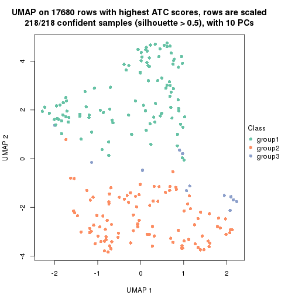</p>

</div>
<div id='tab-ATC-skmeans-dimension-reduction-3'>
<pre><code class="r">dimension_reduction(res, k = 4, method = &quot;UMAP&quot;)
</code></pre>

<p></p>

</div>
<div id='tab-ATC-skmeans-dimension-reduction-4'>
<pre><code class="r">dimension_reduction(res, k = 5, method = &quot;UMAP&quot;)
</code></pre>

<p></p>

</div>
<div id='tab-ATC-skmeans-dimension-reduction-5'>
<pre><code class="r">dimension_reduction(res, k = 6, method = &quot;UMAP&quot;)
</code></pre>

<p>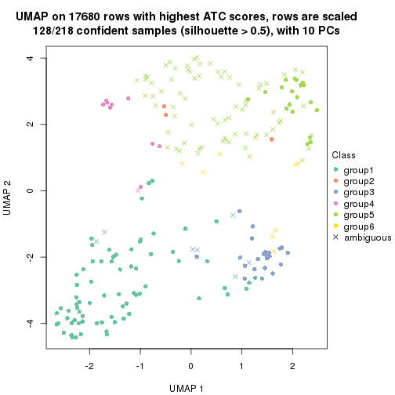</p>

</div>
</div>


Following heatmap shows how subgroups are split when increasing `k`:

```r
collect_classes(res)
```


If matrix rows can be associated to genes, consider to use `GO_Enrichment(res,
...)` to perform function enrichment for the signature genes.


 

---------------------------------------------------


### ATC:pam**


The object with results only for a single top-value method and a single partition method 
can be extracted as:

```r
res = res_list["ATC", "pam"]
# you can also extract it by
# res = res_list["ATC:pam"]
```

A summary of `res` and all the functions that can be applied to it:

```r
res
```

```
#> A 'ConsensusPartition' object with k = 2, 3, 4, 5, 6.
#>   On a matrix with 17680 rows and 218 columns.
#>   Top rows (1000, 2000, 3000, 4000, 5000) are extracted by 'ATC' method.
#>   Subgroups are detected by 'pam' method.
#>   Performed in total 1250 partitions by row resampling.
#>   Best k for subgroups seems to be 2.
#> 
#> Following methods can be applied to this 'ConsensusPartition' object:
#>  [1] "cola_report"             "collect_classes"         "collect_plots"          
#>  [4] "collect_stats"           "colnames"                "compare_signatures"     
#>  [7] "consensus_heatmap"       "dimension_reduction"     "functional_enrichment"  
#> [10] "get_anno_col"            "get_anno"                "get_classes"            
#> [13] "get_consensus"           "get_matrix"              "get_membership"         
#> [16] "get_param"               "get_signatures"          "get_stats"              
#> [19] "is_best_k"               "is_stable_k"             "membership_heatmap"     
#> [22] "ncol"                    "nrow"                    "plot_ecdf"              
#> [25] "rownames"                "select_partition_number" "show"                   
#> [28] "suggest_best_k"          "test_to_known_factors"
```

`collect_plots()` function collects all the plots made from `res` for all `k` (number of partitions)
into one single page to provide an easy and fast comparison between different `k`.

```r
collect_plots(res)
```


The plots are:

- The first row: a plot of the ECDF (Empirical cumulative distribution
  function) curves of the consensus matrix for each `k` and the heatmap of
  predicted classes for each `k`.
- The second row: heatmaps of the consensus matrix for each `k`.
- The third row: heatmaps of the membership matrix for each `k`.
- The fouth row: heatmaps of the signatures for each `k`.

All the plots in panels can be made by individual functions and they are
plotted later in this section.

`select_partition_number()` produces several plots showing different
statistics for choosing "optimized" `k`. There are following statistics:

- ECDF curves of the consensus matrix for each `k`;
- 1-PAC. [The PAC
  score](https://en.wikipedia.org/wiki/Consensus_clustering#Over-interpretation_potential_of_consensus_clustering)
  measures the proportion of the ambiguous subgrouping.
- Mean silhouette score.
- Concordance. The mean probability of fiting the consensus class ids in all
  partitions.
- Area increased. Denote $A_k$ as the area under the ECDF curve for current
  `k`, the area increased is defined as $A_k - A_{k-1}$.
- Rand index. The percent of pairs of samples that are both in a same cluster
  or both are not in a same cluster in the partition of k and k-1.
- Jaccard index. The ratio of pairs of samples are both in a same cluster in
  the partition of k and k-1 and the pairs of samples are both in a same
  cluster in the partition k or k-1.

The detailed explanations of these statistics can be found in [the cola
vignette](http://bioconductor.org/packages/devel/bioc/vignettes/cola/inst/doc/cola.html#toc_13).

Generally speaking, lower PAC score, higher mean silhouette score or higher
concordance corresponds to better partition. Rand index and Jaccard index
measure how similar the current partition is compared to partition with `k-1`.
If they are too similar, we won't accept `k` is better than `k-1`.

```r
select_partition_number(res)
```


The numeric values for all these statistics can be obtained by `get_stats()`.

```r
get_stats(res)
```

```
#>   k 1-PAC mean_silhouette concordance area_increased  Rand Jaccard
#> 2 2 1.000           0.981       0.992         0.5017 0.498   0.498
#> 3 3 0.893           0.880       0.954         0.3258 0.759   0.551
#> 4 4 0.724           0.723       0.784         0.1065 0.884   0.673
#> 5 5 0.812           0.816       0.909         0.0839 0.908   0.668
#> 6 6 0.855           0.823       0.919         0.0382 0.939   0.720
```

`suggest_best_k()` suggests the best $k$ based on these statistics. The rules are as follows:

- All $k$ with Jaccard index larger than 0.95 are removed because the increase of
  the partition number does not provides enough extra information. If all $k$ are removed,
  the best $k$ is assigned by `NA`.
- For $k$ with 1-PAC larger than 0.9, the maximal $k$ is taken as the "best k". Other $k$ is called "optional k".
- If it does not fit the second rule. The $k$ with the highest vote of highest
  1-PAC, mean silhouette and concordance is taken as the "best k".

```r
suggest_best_k(res)
```

```
#> [1] 2
```


Following shows the table of the partitions (You need to click the **show/hide
code output** link to see it). The membership matrix (columns with name `p*`)
is inferred by
[`clue::cl_consensus()`](https://www.rdocumentation.org/link/cl_consensus?package=clue)
function with the `SE` method. Basically the value in the membership matrix
represents the probability to belong to a certain group. The finall class
label for an item is determined with the group with highest probability it
belongs to.

In `get_classes()` function, the entropy is calculated from the membership
matrix and the silhouette score is calculated from the consensus matrix.


<script>
$( function() {
	$( '#tabs-ATC-pam-get-classes' ).tabs();
} );
</script>
<div id='tabs-ATC-pam-get-classes'>
<ul>
<li><a href='#tab-ATC-pam-get-classes-1'>k = 2</a></li>
<li><a href='#tab-ATC-pam-get-classes-2'>k = 3</a></li>
<li><a href='#tab-ATC-pam-get-classes-3'>k = 4</a></li>
<li><a href='#tab-ATC-pam-get-classes-4'>k = 5</a></li>
<li><a href='#tab-ATC-pam-get-classes-5'>k = 6</a></li>
</ul>

<div id='tab-ATC-pam-get-classes-1'>
<p><a id='tab-ATC-pam-get-classes-1-a' style='color:#0366d6' href='#'>show/hide code output</a></p>
<pre><code class="r">cbind(get_classes(res, k = 2), get_membership(res, k = 2))
</code></pre>

<pre><code>#&gt;            class entropy silhouette    p1    p2
#&gt; SRR1498997     2   0.000      0.995 0.000 1.000
#&gt; SRR1076441     1   0.000      0.989 1.000 0.000
#&gt; SRR1489803     2   0.000      0.995 0.000 1.000
#&gt; SRR1345953     2   0.000      0.995 0.000 1.000
#&gt; SRR1357826     2   0.000      0.995 0.000 1.000
#&gt; SRR1419656     1   0.000      0.989 1.000 0.000
#&gt; SRR1454158     2   0.000      0.995 0.000 1.000
#&gt; SRR1475408     2   0.000      0.995 0.000 1.000
#&gt; SRR1472704     2   0.000      0.995 0.000 1.000
#&gt; SRR1090046     1   0.671      0.786 0.824 0.176
#&gt; SRR1312822     1   0.000      0.989 1.000 0.000
#&gt; SRR1096987     2   0.000      0.995 0.000 1.000
#&gt; SRR1334587     2   0.000      0.995 0.000 1.000
#&gt; SRR1490246     1   0.000      0.989 1.000 0.000
#&gt; SRR1467522     1   0.000      0.989 1.000 0.000
#&gt; SRR1324206     1   0.000      0.989 1.000 0.000
#&gt; SRR1408574     2   0.163      0.971 0.024 0.976
#&gt; SRR1083959     2   0.000      0.995 0.000 1.000
#&gt; SRR1079948     2   0.000      0.995 0.000 1.000
#&gt; SRR1310667     2   0.000      0.995 0.000 1.000
#&gt; SRR655852      2   0.000      0.995 0.000 1.000
#&gt; SRR1352457     2   0.000      0.995 0.000 1.000
#&gt; SRR1353994     2   0.000      0.995 0.000 1.000
#&gt; SRR1459561     2   0.000      0.995 0.000 1.000
#&gt; SRR1454009     1   0.000      0.989 1.000 0.000
#&gt; SRR1071084     1   0.000      0.989 1.000 0.000
#&gt; SRR1082859     2   0.000      0.995 0.000 1.000
#&gt; SRR1086538     1   0.000      0.989 1.000 0.000
#&gt; SRR1486262     2   0.000      0.995 0.000 1.000
#&gt; SRR658105      1   0.000      0.989 1.000 0.000
#&gt; SRR811073      2   0.000      0.995 0.000 1.000
#&gt; SRR1429181     2   0.000      0.995 0.000 1.000
#&gt; SRR1327896     2   0.000      0.995 0.000 1.000
#&gt; SRR1464788     2   0.000      0.995 0.000 1.000
#&gt; SRR1346861     2   0.000      0.995 0.000 1.000
#&gt; SRR1318774     2   0.000      0.995 0.000 1.000
#&gt; SRR1420517     1   0.000      0.989 1.000 0.000
#&gt; SRR1369584     2   0.000      0.995 0.000 1.000
#&gt; SRR1443244     1   0.000      0.989 1.000 0.000
#&gt; SRR1455391     1   0.000      0.989 1.000 0.000
#&gt; SRR1068999     1   0.000      0.989 1.000 0.000
#&gt; SRR1481297     1   0.000      0.989 1.000 0.000
#&gt; SRR1070208     1   0.000      0.989 1.000 0.000
#&gt; SRR1317282     1   0.000      0.989 1.000 0.000
#&gt; SRR1096125     2   0.000      0.995 0.000 1.000
#&gt; SRR1472506     1   0.000      0.989 1.000 0.000
#&gt; SRR1388281     2   0.000      0.995 0.000 1.000
#&gt; SRR1365622     2   0.000      0.995 0.000 1.000
#&gt; SRR662306      1   0.000      0.989 1.000 0.000
#&gt; SRR662811      1   0.000      0.989 1.000 0.000
#&gt; SRR820571      1   0.000      0.989 1.000 0.000
#&gt; SRR1357166     1   0.000      0.989 1.000 0.000
#&gt; SRR1488586     1   0.000      0.989 1.000 0.000
#&gt; SRR1485398     1   0.000      0.989 1.000 0.000
#&gt; SRR1417725     2   0.469      0.887 0.100 0.900
#&gt; SRR1409397     2   0.000      0.995 0.000 1.000
#&gt; SRR1465693     2   0.000      0.995 0.000 1.000
#&gt; SRR1096547     1   0.000      0.989 1.000 0.000
#&gt; SRR1456818     1   0.000      0.989 1.000 0.000
#&gt; SRR816336      1   0.000      0.989 1.000 0.000
#&gt; SRR1420238     1   0.000      0.989 1.000 0.000
#&gt; SRR1433374     1   0.000      0.989 1.000 0.000
#&gt; SRR1436990     1   0.000      0.989 1.000 0.000
#&gt; SRR662378      1   0.000      0.989 1.000 0.000
#&gt; SRR1477671     1   0.000      0.989 1.000 0.000
#&gt; SRR1084079     1   0.000      0.989 1.000 0.000
#&gt; SRR1102949     1   0.000      0.989 1.000 0.000
#&gt; SRR1458090     1   0.000      0.989 1.000 0.000
#&gt; SRR1418729     2   0.000      0.995 0.000 1.000
#&gt; SRR1403814     2   0.000      0.995 0.000 1.000
#&gt; SRR1404887     1   0.163      0.966 0.976 0.024
#&gt; SRR1434955     1   0.000      0.989 1.000 0.000
#&gt; SRR1360652     1   0.000      0.989 1.000 0.000
#&gt; SRR1356765     2   0.000      0.995 0.000 1.000
#&gt; SRR1078258     2   0.000      0.995 0.000 1.000
#&gt; SRR1455861     1   0.000      0.989 1.000 0.000
#&gt; SRR1420296     2   0.000      0.995 0.000 1.000
#&gt; SRR1070260     2   0.000      0.995 0.000 1.000
#&gt; SRR1410765     1   0.000      0.989 1.000 0.000
#&gt; SRR1481315     1   0.000      0.989 1.000 0.000
#&gt; SRR1414661     2   0.000      0.995 0.000 1.000
#&gt; SRR1359147     2   0.000      0.995 0.000 1.000
#&gt; SRR1488694     1   0.000      0.989 1.000 0.000
#&gt; SRR1477273     1   0.000      0.989 1.000 0.000
#&gt; SRR1415792     1   0.000      0.989 1.000 0.000
#&gt; SRR1369088     2   0.000      0.995 0.000 1.000
#&gt; SRR1406621     1   0.839      0.637 0.732 0.268
#&gt; SRR1401017     2   0.000      0.995 0.000 1.000
#&gt; SRR1099981     2   0.000      0.995 0.000 1.000
#&gt; SRR815208      2   0.000      0.995 0.000 1.000
#&gt; SRR1380460     2   0.000      0.995 0.000 1.000
#&gt; SRR1091097     2   0.000      0.995 0.000 1.000
#&gt; SRR1456010     1   0.000      0.989 1.000 0.000
#&gt; SRR1498416     2   0.000      0.995 0.000 1.000
#&gt; SRR818873      2   0.000      0.995 0.000 1.000
#&gt; SRR813868      2   0.000      0.995 0.000 1.000
#&gt; SRR1394912     1   0.000      0.989 1.000 0.000
#&gt; SRR1475824     2   0.000      0.995 0.000 1.000
#&gt; SRR1459866     1   0.000      0.989 1.000 0.000
#&gt; SRR1364871     2   0.574      0.841 0.136 0.864
#&gt; SRR1100472     2   0.000      0.995 0.000 1.000
#&gt; SRR1331267     1   0.000      0.989 1.000 0.000
#&gt; SRR1068977     2   0.000      0.995 0.000 1.000
#&gt; SRR1391511     2   0.000      0.995 0.000 1.000
#&gt; SRR1077920     2   0.000      0.995 0.000 1.000
#&gt; SRR1457705     1   0.000      0.989 1.000 0.000
#&gt; SRR1437073     1   0.000      0.989 1.000 0.000
#&gt; SRR1473124     1   0.000      0.989 1.000 0.000
#&gt; SRR1469279     1   0.000      0.989 1.000 0.000
#&gt; SRR1091791     2   0.000      0.995 0.000 1.000
#&gt; SRR1341539     2   0.000      0.995 0.000 1.000
#&gt; SRR1446354     1   0.000      0.989 1.000 0.000
#&gt; SRR1415420     1   0.000      0.989 1.000 0.000
#&gt; SRR1368050     1   0.000      0.989 1.000 0.000
#&gt; SRR656970      2   0.000      0.995 0.000 1.000
#&gt; SRR1473403     2   0.000      0.995 0.000 1.000
#&gt; SRR1084674     1   0.000      0.989 1.000 0.000
#&gt; SRR1464702     1   0.000      0.989 1.000 0.000
#&gt; SRR1074860     1   0.706      0.762 0.808 0.192
#&gt; SRR655447      2   0.000      0.995 0.000 1.000
#&gt; SRR1404442     2   0.000      0.995 0.000 1.000
#&gt; SRR1418795     1   0.000      0.989 1.000 0.000
#&gt; SRR1458335     2   0.000      0.995 0.000 1.000
#&gt; SRR1489589     2   0.000      0.995 0.000 1.000
#&gt; SRR1378284     1   0.000      0.989 1.000 0.000
#&gt; SRR1408014     2   0.000      0.995 0.000 1.000
#&gt; SRR1083052     1   0.000      0.989 1.000 0.000
#&gt; SRR1339236     2   0.000      0.995 0.000 1.000
#&gt; SRR1323829     2   0.000      0.995 0.000 1.000
#&gt; SRR1086772     2   0.000      0.995 0.000 1.000
#&gt; SRR1486457     1   0.000      0.989 1.000 0.000
#&gt; SRR1415257     2   0.000      0.995 0.000 1.000
#&gt; SRR1071905     1   0.000      0.989 1.000 0.000
#&gt; SRR659223      2   0.000      0.995 0.000 1.000
#&gt; SRR1386945     1   0.000      0.989 1.000 0.000
#&gt; SRR821498      2   0.000      0.995 0.000 1.000
#&gt; SRR1378903     2   0.000      0.995 0.000 1.000
#&gt; SRR1472907     1   0.000      0.989 1.000 0.000
#&gt; SRR1442313     2   0.000      0.995 0.000 1.000
#&gt; SRR1077139     2   0.000      0.995 0.000 1.000
#&gt; SRR1342758     1   0.000      0.989 1.000 0.000
#&gt; SRR656911      2   0.000      0.995 0.000 1.000
#&gt; SRR1070738     1   0.000      0.989 1.000 0.000
#&gt; SRR1476950     1   0.000      0.989 1.000 0.000
#&gt; SRR1488196     1   0.000      0.989 1.000 0.000
#&gt; SRR1498951     1   0.000      0.989 1.000 0.000
#&gt; SRR1413392     1   0.000      0.989 1.000 0.000
#&gt; SRR657528      2   0.000      0.995 0.000 1.000
#&gt; SRR812198      1   0.000      0.989 1.000 0.000
#&gt; SRR660283      2   0.000      0.995 0.000 1.000
#&gt; SRR1420936     1   0.000      0.989 1.000 0.000
#&gt; SRR1469547     2   0.000      0.995 0.000 1.000
#&gt; SRR1322249     1   0.000      0.989 1.000 0.000
#&gt; SRR1396682     1   0.000      0.989 1.000 0.000
#&gt; SRR1095816     2   0.000      0.995 0.000 1.000
#&gt; SRR1081023     1   0.000      0.989 1.000 0.000
#&gt; SRR1092517     2   0.000      0.995 0.000 1.000
#&gt; SRR811285      2   0.000      0.995 0.000 1.000
#&gt; SRR657018      1   0.000      0.989 1.000 0.000
#&gt; SRR1365534     1   0.000      0.989 1.000 0.000
#&gt; SRR1090791     2   0.000      0.995 0.000 1.000
#&gt; SRR1439915     2   0.000      0.995 0.000 1.000
#&gt; SRR1391575     2   0.000      0.995 0.000 1.000
#&gt; SRR1314092     2   0.000      0.995 0.000 1.000
#&gt; SRR1328941     1   0.000      0.989 1.000 0.000
#&gt; SRR1336181     2   0.000      0.995 0.000 1.000
#&gt; SRR1362972     1   0.000      0.989 1.000 0.000
#&gt; SRR1366790     2   0.000      0.995 0.000 1.000
#&gt; SRR1455902     1   0.000      0.989 1.000 0.000
#&gt; SRR1437644     2   0.000      0.995 0.000 1.000
#&gt; SRR1105009     2   0.000      0.995 0.000 1.000
#&gt; SRR1367024     1   0.000      0.989 1.000 0.000
#&gt; SRR660248      2   0.000      0.995 0.000 1.000
#&gt; SRR1409620     1   0.000      0.989 1.000 0.000
#&gt; SRR1455807     2   0.000      0.995 0.000 1.000
#&gt; SRR1339431     1   0.000      0.989 1.000 0.000
#&gt; SRR1378948     1   0.000      0.989 1.000 0.000
#&gt; SRR1469237     1   0.000      0.989 1.000 0.000
#&gt; SRR1098264     2   0.000      0.995 0.000 1.000
#&gt; SRR1406224     2   0.000      0.995 0.000 1.000
#&gt; SRR1393026     1   0.000      0.989 1.000 0.000
#&gt; SRR808428      2   0.000      0.995 0.000 1.000
#&gt; SRR615910      2   0.000      0.995 0.000 1.000
#&gt; SRR1076219     1   0.000      0.989 1.000 0.000
#&gt; SRR1481128     1   0.000      0.989 1.000 0.000
#&gt; SRR1359262     2   0.000      0.995 0.000 1.000
#&gt; SRR1407648     2   0.000      0.995 0.000 1.000
#&gt; SRR1386775     1   0.000      0.989 1.000 0.000
#&gt; SRR1388399     1   0.996      0.141 0.536 0.464
#&gt; SRR1361499     2   0.000      0.995 0.000 1.000
#&gt; SRR1500709     2   0.000      0.995 0.000 1.000
#&gt; SRR1335917     1   0.000      0.989 1.000 0.000
#&gt; SRR1430615     2   0.000      0.995 0.000 1.000
#&gt; SRR1335212     1   0.000      0.989 1.000 0.000
#&gt; SRR1400159     2   0.861      0.601 0.284 0.716
#&gt; SRR1457245     2   0.000      0.995 0.000 1.000
#&gt; SRR1356746     2   0.000      0.995 0.000 1.000
#&gt; SRR658319      2   0.000      0.995 0.000 1.000
#&gt; SRR1435946     1   0.000      0.989 1.000 0.000
#&gt; SRR1370308     1   0.000      0.989 1.000 0.000
#&gt; SRR1100893     1   0.000      0.989 1.000 0.000
#&gt; SRR1389432     1   0.000      0.989 1.000 0.000
#&gt; SRR1381799     2   0.000      0.995 0.000 1.000
#&gt; SRR1310158     1   0.000      0.989 1.000 0.000
#&gt; SRR1341100     2   0.000      0.995 0.000 1.000
#&gt; SRR1342873     1   0.000      0.989 1.000 0.000
#&gt; SRR1472102     2   0.000      0.995 0.000 1.000
#&gt; SRR1409421     1   0.000      0.989 1.000 0.000
#&gt; SRR1328577     2   0.000      0.995 0.000 1.000
#&gt; SRR808942      2   0.000      0.995 0.000 1.000
#&gt; SRR1343818     2   0.000      0.995 0.000 1.000
#&gt; SRR1472415     2   0.000      0.995 0.000 1.000
#&gt; SRR658409      2   0.000      0.995 0.000 1.000
#&gt; SRR1469681     1   0.000      0.989 1.000 0.000
#&gt; SRR1075484     2   0.000      0.995 0.000 1.000
#&gt; SRR1417894     1   0.000      0.989 1.000 0.000
#&gt; SRR1417422     2   0.000      0.995 0.000 1.000
#&gt; SRR1090674     1   0.000      0.989 1.000 0.000
</code></pre>

<script>
$('#tab-ATC-pam-get-classes-1-a').parent().next().next().hide();
$('#tab-ATC-pam-get-classes-1-a').click(function(){
  $('#tab-ATC-pam-get-classes-1-a').parent().next().next().toggle();
  return(false);
});
</script>
</div>

<div id='tab-ATC-pam-get-classes-2'>
<p><a id='tab-ATC-pam-get-classes-2-a' style='color:#0366d6' href='#'>show/hide code output</a></p>
<pre><code class="r">cbind(get_classes(res, k = 3), get_membership(res, k = 3))
</code></pre>

<pre><code>#&gt;            class entropy silhouette    p1    p2    p3
#&gt; SRR1498997     2  0.0000     0.9452 0.000 1.000 0.000
#&gt; SRR1076441     1  0.0000     0.9747 1.000 0.000 0.000
#&gt; SRR1489803     2  0.0000     0.9452 0.000 1.000 0.000
#&gt; SRR1345953     2  0.0000     0.9452 0.000 1.000 0.000
#&gt; SRR1357826     2  0.0000     0.9452 0.000 1.000 0.000
#&gt; SRR1419656     1  0.0000     0.9747 1.000 0.000 0.000
#&gt; SRR1454158     2  0.6008     0.3985 0.000 0.628 0.372
#&gt; SRR1475408     3  0.0000     0.9187 0.000 0.000 1.000
#&gt; SRR1472704     2  0.0000     0.9452 0.000 1.000 0.000
#&gt; SRR1090046     3  0.0000     0.9187 0.000 0.000 1.000
#&gt; SRR1312822     1  0.0000     0.9747 1.000 0.000 0.000
#&gt; SRR1096987     3  0.1529     0.8901 0.000 0.040 0.960
#&gt; SRR1334587     2  0.0000     0.9452 0.000 1.000 0.000
#&gt; SRR1490246     1  0.0000     0.9747 1.000 0.000 0.000
#&gt; SRR1467522     1  0.0000     0.9747 1.000 0.000 0.000
#&gt; SRR1324206     1  0.0000     0.9747 1.000 0.000 0.000
#&gt; SRR1408574     3  0.0000     0.9187 0.000 0.000 1.000
#&gt; SRR1083959     2  0.0000     0.9452 0.000 1.000 0.000
#&gt; SRR1079948     2  0.6260     0.2026 0.000 0.552 0.448
#&gt; SRR1310667     2  0.0000     0.9452 0.000 1.000 0.000
#&gt; SRR655852      3  0.5016     0.6551 0.000 0.240 0.760
#&gt; SRR1352457     2  0.0000     0.9452 0.000 1.000 0.000
#&gt; SRR1353994     2  0.0000     0.9452 0.000 1.000 0.000
#&gt; SRR1459561     2  0.0000     0.9452 0.000 1.000 0.000
#&gt; SRR1454009     1  0.0000     0.9747 1.000 0.000 0.000
#&gt; SRR1071084     1  0.6095     0.3184 0.608 0.000 0.392
#&gt; SRR1082859     2  0.0000     0.9452 0.000 1.000 0.000
#&gt; SRR1086538     1  0.0000     0.9747 1.000 0.000 0.000
#&gt; SRR1486262     3  0.0000     0.9187 0.000 0.000 1.000
#&gt; SRR658105      1  0.0000     0.9747 1.000 0.000 0.000
#&gt; SRR811073      2  0.0000     0.9452 0.000 1.000 0.000
#&gt; SRR1429181     3  0.2165     0.8713 0.000 0.064 0.936
#&gt; SRR1327896     3  0.0000     0.9187 0.000 0.000 1.000
#&gt; SRR1464788     3  0.2165     0.8707 0.000 0.064 0.936
#&gt; SRR1346861     2  0.0000     0.9452 0.000 1.000 0.000
#&gt; SRR1318774     3  0.0000     0.9187 0.000 0.000 1.000
#&gt; SRR1420517     1  0.0000     0.9747 1.000 0.000 0.000
#&gt; SRR1369584     3  0.6302     0.0278 0.000 0.480 0.520
#&gt; SRR1443244     3  0.0000     0.9187 0.000 0.000 1.000
#&gt; SRR1455391     1  0.0000     0.9747 1.000 0.000 0.000
#&gt; SRR1068999     1  0.0000     0.9747 1.000 0.000 0.000
#&gt; SRR1481297     1  0.0000     0.9747 1.000 0.000 0.000
#&gt; SRR1070208     1  0.0000     0.9747 1.000 0.000 0.000
#&gt; SRR1317282     1  0.5859     0.4456 0.656 0.000 0.344
#&gt; SRR1096125     3  0.0747     0.9090 0.000 0.016 0.984
#&gt; SRR1472506     3  0.0000     0.9187 0.000 0.000 1.000
#&gt; SRR1388281     2  0.0000     0.9452 0.000 1.000 0.000
#&gt; SRR1365622     3  0.0000     0.9187 0.000 0.000 1.000
#&gt; SRR662306      1  0.3267     0.8474 0.884 0.000 0.116
#&gt; SRR662811      1  0.0000     0.9747 1.000 0.000 0.000
#&gt; SRR820571      3  0.0000     0.9187 0.000 0.000 1.000
#&gt; SRR1357166     1  0.0000     0.9747 1.000 0.000 0.000
#&gt; SRR1488586     3  0.0000     0.9187 0.000 0.000 1.000
#&gt; SRR1485398     1  0.0000     0.9747 1.000 0.000 0.000
#&gt; SRR1417725     3  0.0000     0.9187 0.000 0.000 1.000
#&gt; SRR1409397     2  0.5785     0.4947 0.000 0.668 0.332
#&gt; SRR1465693     2  0.0000     0.9452 0.000 1.000 0.000
#&gt; SRR1096547     3  0.0000     0.9187 0.000 0.000 1.000
#&gt; SRR1456818     1  0.0000     0.9747 1.000 0.000 0.000
#&gt; SRR816336      3  0.0000     0.9187 0.000 0.000 1.000
#&gt; SRR1420238     1  0.0000     0.9747 1.000 0.000 0.000
#&gt; SRR1433374     1  0.4842     0.6880 0.776 0.000 0.224
#&gt; SRR1436990     1  0.0000     0.9747 1.000 0.000 0.000
#&gt; SRR662378      1  0.0000     0.9747 1.000 0.000 0.000
#&gt; SRR1477671     1  0.0000     0.9747 1.000 0.000 0.000
#&gt; SRR1084079     3  0.0000     0.9187 0.000 0.000 1.000
#&gt; SRR1102949     1  0.0000     0.9747 1.000 0.000 0.000
#&gt; SRR1458090     1  0.0000     0.9747 1.000 0.000 0.000
#&gt; SRR1418729     3  0.0000     0.9187 0.000 0.000 1.000
#&gt; SRR1403814     3  0.0000     0.9187 0.000 0.000 1.000
#&gt; SRR1404887     3  0.0000     0.9187 0.000 0.000 1.000
#&gt; SRR1434955     1  0.0000     0.9747 1.000 0.000 0.000
#&gt; SRR1360652     1  0.0000     0.9747 1.000 0.000 0.000
#&gt; SRR1356765     3  0.0592     0.9118 0.000 0.012 0.988
#&gt; SRR1078258     2  0.0000     0.9452 0.000 1.000 0.000
#&gt; SRR1455861     1  0.0000     0.9747 1.000 0.000 0.000
#&gt; SRR1420296     2  0.0000     0.9452 0.000 1.000 0.000
#&gt; SRR1070260     2  0.0000     0.9452 0.000 1.000 0.000
#&gt; SRR1410765     1  0.0000     0.9747 1.000 0.000 0.000
#&gt; SRR1481315     1  0.0000     0.9747 1.000 0.000 0.000
#&gt; SRR1414661     2  0.0000     0.9452 0.000 1.000 0.000
#&gt; SRR1359147     2  0.5785     0.4987 0.000 0.668 0.332
#&gt; SRR1488694     3  0.6154     0.3115 0.408 0.000 0.592
#&gt; SRR1477273     3  0.3482     0.8161 0.128 0.000 0.872
#&gt; SRR1415792     1  0.4654     0.7242 0.792 0.000 0.208
#&gt; SRR1369088     3  0.0000     0.9187 0.000 0.000 1.000
#&gt; SRR1406621     3  0.0000     0.9187 0.000 0.000 1.000
#&gt; SRR1401017     2  0.6252     0.2004 0.000 0.556 0.444
#&gt; SRR1099981     2  0.0000     0.9452 0.000 1.000 0.000
#&gt; SRR815208      2  0.0000     0.9452 0.000 1.000 0.000
#&gt; SRR1380460     2  0.0237     0.9418 0.000 0.996 0.004
#&gt; SRR1091097     2  0.0000     0.9452 0.000 1.000 0.000
#&gt; SRR1456010     1  0.0000     0.9747 1.000 0.000 0.000
#&gt; SRR1498416     3  0.4452     0.7243 0.000 0.192 0.808
#&gt; SRR818873      2  0.0000     0.9452 0.000 1.000 0.000
#&gt; SRR813868      3  0.0000     0.9187 0.000 0.000 1.000
#&gt; SRR1394912     1  0.0000     0.9747 1.000 0.000 0.000
#&gt; SRR1475824     3  0.0000     0.9187 0.000 0.000 1.000
#&gt; SRR1459866     1  0.0000     0.9747 1.000 0.000 0.000
#&gt; SRR1364871     3  0.0000     0.9187 0.000 0.000 1.000
#&gt; SRR1100472     2  0.0000     0.9452 0.000 1.000 0.000
#&gt; SRR1331267     1  0.4702     0.7180 0.788 0.000 0.212
#&gt; SRR1068977     3  0.5098     0.6433 0.000 0.248 0.752
#&gt; SRR1391511     2  0.0000     0.9452 0.000 1.000 0.000
#&gt; SRR1077920     2  0.0000     0.9452 0.000 1.000 0.000
#&gt; SRR1457705     1  0.0000     0.9747 1.000 0.000 0.000
#&gt; SRR1437073     1  0.0000     0.9747 1.000 0.000 0.000
#&gt; SRR1473124     1  0.0000     0.9747 1.000 0.000 0.000
#&gt; SRR1469279     1  0.0000     0.9747 1.000 0.000 0.000
#&gt; SRR1091791     3  0.0000     0.9187 0.000 0.000 1.000
#&gt; SRR1341539     3  0.0000     0.9187 0.000 0.000 1.000
#&gt; SRR1446354     1  0.0000     0.9747 1.000 0.000 0.000
#&gt; SRR1415420     1  0.0000     0.9747 1.000 0.000 0.000
#&gt; SRR1368050     1  0.0000     0.9747 1.000 0.000 0.000
#&gt; SRR656970      2  0.0000     0.9452 0.000 1.000 0.000
#&gt; SRR1473403     2  0.0000     0.9452 0.000 1.000 0.000
#&gt; SRR1084674     3  0.6291     0.1290 0.468 0.000 0.532
#&gt; SRR1464702     1  0.0000     0.9747 1.000 0.000 0.000
#&gt; SRR1074860     3  0.0000     0.9187 0.000 0.000 1.000
#&gt; SRR655447      2  0.0000     0.9452 0.000 1.000 0.000
#&gt; SRR1404442     2  0.0000     0.9452 0.000 1.000 0.000
#&gt; SRR1418795     1  0.0000     0.9747 1.000 0.000 0.000
#&gt; SRR1458335     3  0.0000     0.9187 0.000 0.000 1.000
#&gt; SRR1489589     2  0.6308     0.0281 0.000 0.508 0.492
#&gt; SRR1378284     1  0.0000     0.9747 1.000 0.000 0.000
#&gt; SRR1408014     2  0.0000     0.9452 0.000 1.000 0.000
#&gt; SRR1083052     1  0.0000     0.9747 1.000 0.000 0.000
#&gt; SRR1339236     3  0.0424     0.9141 0.000 0.008 0.992
#&gt; SRR1323829     2  0.0000     0.9452 0.000 1.000 0.000
#&gt; SRR1086772     2  0.0000     0.9452 0.000 1.000 0.000
#&gt; SRR1486457     3  0.0424     0.9138 0.008 0.000 0.992
#&gt; SRR1415257     2  0.0000     0.9452 0.000 1.000 0.000
#&gt; SRR1071905     1  0.0000     0.9747 1.000 0.000 0.000
#&gt; SRR659223      2  0.0000     0.9452 0.000 1.000 0.000
#&gt; SRR1386945     1  0.0000     0.9747 1.000 0.000 0.000
#&gt; SRR821498      3  0.0000     0.9187 0.000 0.000 1.000
#&gt; SRR1378903     3  0.0000     0.9187 0.000 0.000 1.000
#&gt; SRR1472907     1  0.0000     0.9747 1.000 0.000 0.000
#&gt; SRR1442313     2  0.0000     0.9452 0.000 1.000 0.000
#&gt; SRR1077139     2  0.0000     0.9452 0.000 1.000 0.000
#&gt; SRR1342758     1  0.0000     0.9747 1.000 0.000 0.000
#&gt; SRR656911      2  0.0000     0.9452 0.000 1.000 0.000
#&gt; SRR1070738     1  0.0000     0.9747 1.000 0.000 0.000
#&gt; SRR1476950     1  0.0000     0.9747 1.000 0.000 0.000
#&gt; SRR1488196     3  0.6154     0.3395 0.408 0.000 0.592
#&gt; SRR1498951     3  0.6286     0.1750 0.464 0.000 0.536
#&gt; SRR1413392     1  0.0000     0.9747 1.000 0.000 0.000
#&gt; SRR657528      2  0.0000     0.9452 0.000 1.000 0.000
#&gt; SRR812198      1  0.0000     0.9747 1.000 0.000 0.000
#&gt; SRR660283      2  0.0000     0.9452 0.000 1.000 0.000
#&gt; SRR1420936     1  0.0000     0.9747 1.000 0.000 0.000
#&gt; SRR1469547     2  0.0000     0.9452 0.000 1.000 0.000
#&gt; SRR1322249     1  0.0000     0.9747 1.000 0.000 0.000
#&gt; SRR1396682     1  0.0000     0.9747 1.000 0.000 0.000
#&gt; SRR1095816     3  0.0000     0.9187 0.000 0.000 1.000
#&gt; SRR1081023     1  0.0000     0.9747 1.000 0.000 0.000
#&gt; SRR1092517     2  0.0000     0.9452 0.000 1.000 0.000
#&gt; SRR811285      2  0.0000     0.9452 0.000 1.000 0.000
#&gt; SRR657018      1  0.0000     0.9747 1.000 0.000 0.000
#&gt; SRR1365534     1  0.5926     0.4155 0.644 0.000 0.356
#&gt; SRR1090791     2  0.0000     0.9452 0.000 1.000 0.000
#&gt; SRR1439915     2  0.0000     0.9452 0.000 1.000 0.000
#&gt; SRR1391575     3  0.0000     0.9187 0.000 0.000 1.000
#&gt; SRR1314092     2  0.6274     0.1779 0.000 0.544 0.456
#&gt; SRR1328941     3  0.6286     0.1726 0.464 0.000 0.536
#&gt; SRR1336181     2  0.0000     0.9452 0.000 1.000 0.000
#&gt; SRR1362972     1  0.0000     0.9747 1.000 0.000 0.000
#&gt; SRR1366790     2  0.0000     0.9452 0.000 1.000 0.000
#&gt; SRR1455902     3  0.4452     0.7423 0.192 0.000 0.808
#&gt; SRR1437644     3  0.0000     0.9187 0.000 0.000 1.000
#&gt; SRR1105009     2  0.0000     0.9452 0.000 1.000 0.000
#&gt; SRR1367024     3  0.0000     0.9187 0.000 0.000 1.000
#&gt; SRR660248      2  0.0892     0.9281 0.000 0.980 0.020
#&gt; SRR1409620     1  0.0000     0.9747 1.000 0.000 0.000
#&gt; SRR1455807     2  0.0000     0.9452 0.000 1.000 0.000
#&gt; SRR1339431     1  0.0000     0.9747 1.000 0.000 0.000
#&gt; SRR1378948     3  0.0000     0.9187 0.000 0.000 1.000
#&gt; SRR1469237     1  0.0000     0.9747 1.000 0.000 0.000
#&gt; SRR1098264     2  0.0000     0.9452 0.000 1.000 0.000
#&gt; SRR1406224     3  0.0000     0.9187 0.000 0.000 1.000
#&gt; SRR1393026     1  0.0000     0.9747 1.000 0.000 0.000
#&gt; SRR808428      2  0.0000     0.9452 0.000 1.000 0.000
#&gt; SRR615910      2  0.0000     0.9452 0.000 1.000 0.000
#&gt; SRR1076219     1  0.0000     0.9747 1.000 0.000 0.000
#&gt; SRR1481128     1  0.0000     0.9747 1.000 0.000 0.000
#&gt; SRR1359262     2  0.0000     0.9452 0.000 1.000 0.000
#&gt; SRR1407648     3  0.0000     0.9187 0.000 0.000 1.000
#&gt; SRR1386775     3  0.0000     0.9187 0.000 0.000 1.000
#&gt; SRR1388399     3  0.0000     0.9187 0.000 0.000 1.000
#&gt; SRR1361499     2  0.0000     0.9452 0.000 1.000 0.000
#&gt; SRR1500709     3  0.1529     0.8901 0.000 0.040 0.960
#&gt; SRR1335917     1  0.0000     0.9747 1.000 0.000 0.000
#&gt; SRR1430615     2  0.0000     0.9452 0.000 1.000 0.000
#&gt; SRR1335212     1  0.0000     0.9747 1.000 0.000 0.000
#&gt; SRR1400159     3  0.0000     0.9187 0.000 0.000 1.000
#&gt; SRR1457245     2  0.0000     0.9452 0.000 1.000 0.000
#&gt; SRR1356746     2  0.0000     0.9452 0.000 1.000 0.000
#&gt; SRR658319      2  0.0000     0.9452 0.000 1.000 0.000
#&gt; SRR1435946     1  0.0000     0.9747 1.000 0.000 0.000
#&gt; SRR1370308     1  0.0000     0.9747 1.000 0.000 0.000
#&gt; SRR1100893     1  0.0000     0.9747 1.000 0.000 0.000
#&gt; SRR1389432     1  0.0000     0.9747 1.000 0.000 0.000
#&gt; SRR1381799     2  0.0000     0.9452 0.000 1.000 0.000
#&gt; SRR1310158     1  0.0000     0.9747 1.000 0.000 0.000
#&gt; SRR1341100     3  0.0000     0.9187 0.000 0.000 1.000
#&gt; SRR1342873     1  0.0000     0.9747 1.000 0.000 0.000
#&gt; SRR1472102     3  0.5291     0.6087 0.000 0.268 0.732
#&gt; SRR1409421     1  0.0000     0.9747 1.000 0.000 0.000
#&gt; SRR1328577     2  0.0000     0.9452 0.000 1.000 0.000
#&gt; SRR808942      2  0.0237     0.9418 0.000 0.996 0.004
#&gt; SRR1343818     2  0.6235     0.2354 0.000 0.564 0.436
#&gt; SRR1472415     2  0.0000     0.9452 0.000 1.000 0.000
#&gt; SRR658409      3  0.0592     0.9114 0.000 0.012 0.988
#&gt; SRR1469681     1  0.0000     0.9747 1.000 0.000 0.000
#&gt; SRR1075484     2  0.0000     0.9452 0.000 1.000 0.000
#&gt; SRR1417894     3  0.5178     0.6522 0.256 0.000 0.744
#&gt; SRR1417422     2  0.6235     0.2354 0.000 0.564 0.436
#&gt; SRR1090674     1  0.0000     0.9747 1.000 0.000 0.000
</code></pre>

<script>
$('#tab-ATC-pam-get-classes-2-a').parent().next().next().hide();
$('#tab-ATC-pam-get-classes-2-a').click(function(){
  $('#tab-ATC-pam-get-classes-2-a').parent().next().next().toggle();
  return(false);
});
</script>
</div>

<div id='tab-ATC-pam-get-classes-3'>
<p><a id='tab-ATC-pam-get-classes-3-a' style='color:#0366d6' href='#'>show/hide code output</a></p>
<pre><code class="r">cbind(get_classes(res, k = 4), get_membership(res, k = 4))
</code></pre>

<pre><code>#&gt;            class entropy silhouette    p1    p2    p3    p4
#&gt; SRR1498997     2  0.1022     0.7736 0.000 0.968 0.000 0.032
#&gt; SRR1076441     1  0.4454     0.9988 0.692 0.000 0.308 0.000
#&gt; SRR1489803     2  0.4454     0.7976 0.308 0.692 0.000 0.000
#&gt; SRR1345953     2  0.0469     0.7818 0.000 0.988 0.000 0.012
#&gt; SRR1357826     2  0.4454     0.7976 0.308 0.692 0.000 0.000
#&gt; SRR1419656     1  0.4454     0.9988 0.692 0.000 0.308 0.000
#&gt; SRR1454158     2  0.4697     0.2032 0.000 0.644 0.000 0.356
#&gt; SRR1475408     4  0.0000     0.8676 0.000 0.000 0.000 1.000
#&gt; SRR1472704     2  0.4454     0.7976 0.308 0.692 0.000 0.000
#&gt; SRR1090046     4  0.1211     0.8491 0.000 0.000 0.040 0.960
#&gt; SRR1312822     1  0.4454     0.9988 0.692 0.000 0.308 0.000
#&gt; SRR1096987     4  0.4624     0.6208 0.000 0.340 0.000 0.660
#&gt; SRR1334587     2  0.0921     0.7913 0.028 0.972 0.000 0.000
#&gt; SRR1490246     1  0.4454     0.9988 0.692 0.000 0.308 0.000
#&gt; SRR1467522     3  0.4866    -0.0191 0.404 0.000 0.596 0.000
#&gt; SRR1324206     3  0.4477     0.3058 0.312 0.000 0.688 0.000
#&gt; SRR1408574     4  0.0000     0.8676 0.000 0.000 0.000 1.000
#&gt; SRR1083959     2  0.0921     0.7908 0.028 0.972 0.000 0.000
#&gt; SRR1079948     2  0.4454     0.3541 0.000 0.692 0.000 0.308
#&gt; SRR1310667     2  0.4454     0.7976 0.308 0.692 0.000 0.000
#&gt; SRR655852      4  0.4843     0.5262 0.000 0.396 0.000 0.604
#&gt; SRR1352457     2  0.2530     0.7963 0.112 0.888 0.000 0.000
#&gt; SRR1353994     2  0.1022     0.7736 0.000 0.968 0.000 0.032
#&gt; SRR1459561     2  0.4454     0.7976 0.308 0.692 0.000 0.000
#&gt; SRR1454009     3  0.0000     0.7220 0.000 0.000 1.000 0.000
#&gt; SRR1071084     3  0.0336     0.7187 0.000 0.000 0.992 0.008
#&gt; SRR1082859     2  0.4454     0.7976 0.308 0.692 0.000 0.000
#&gt; SRR1086538     1  0.4454     0.9988 0.692 0.000 0.308 0.000
#&gt; SRR1486262     4  0.3172     0.7912 0.000 0.160 0.000 0.840
#&gt; SRR658105      3  0.4907    -0.1004 0.420 0.000 0.580 0.000
#&gt; SRR811073      2  0.4431     0.7980 0.304 0.696 0.000 0.000
#&gt; SRR1429181     4  0.4643     0.6149 0.000 0.344 0.000 0.656
#&gt; SRR1327896     4  0.4382     0.6739 0.000 0.296 0.000 0.704
#&gt; SRR1464788     4  0.2868     0.8069 0.000 0.136 0.000 0.864
#&gt; SRR1346861     2  0.4454     0.7976 0.308 0.692 0.000 0.000
#&gt; SRR1318774     4  0.0000     0.8676 0.000 0.000 0.000 1.000
#&gt; SRR1420517     3  0.4454     0.3157 0.308 0.000 0.692 0.000
#&gt; SRR1369584     2  0.5165    -0.1010 0.004 0.512 0.000 0.484
#&gt; SRR1443244     4  0.0921     0.8545 0.000 0.000 0.028 0.972
#&gt; SRR1455391     3  0.3123     0.6062 0.156 0.000 0.844 0.000
#&gt; SRR1068999     1  0.4454     0.9988 0.692 0.000 0.308 0.000
#&gt; SRR1481297     1  0.4454     0.9988 0.692 0.000 0.308 0.000
#&gt; SRR1070208     3  0.0707     0.7174 0.020 0.000 0.980 0.000
#&gt; SRR1317282     3  0.0000     0.7220 0.000 0.000 1.000 0.000
#&gt; SRR1096125     4  0.4477     0.6563 0.000 0.312 0.000 0.688
#&gt; SRR1472506     4  0.1302     0.8461 0.000 0.000 0.044 0.956
#&gt; SRR1388281     2  0.4193     0.7994 0.268 0.732 0.000 0.000
#&gt; SRR1365622     4  0.0000     0.8676 0.000 0.000 0.000 1.000
#&gt; SRR662306      3  0.0000     0.7220 0.000 0.000 1.000 0.000
#&gt; SRR662811      3  0.3528     0.5550 0.192 0.000 0.808 0.000
#&gt; SRR820571      4  0.1302     0.8461 0.000 0.000 0.044 0.956
#&gt; SRR1357166     3  0.0000     0.7220 0.000 0.000 1.000 0.000
#&gt; SRR1488586     4  0.4477     0.4876 0.000 0.000 0.312 0.688
#&gt; SRR1485398     1  0.4454     0.9988 0.692 0.000 0.308 0.000
#&gt; SRR1417725     4  0.0188     0.8670 0.000 0.000 0.004 0.996
#&gt; SRR1409397     2  0.4193     0.4439 0.000 0.732 0.000 0.268
#&gt; SRR1465693     2  0.4454     0.7976 0.308 0.692 0.000 0.000
#&gt; SRR1096547     4  0.4790     0.4208 0.000 0.000 0.380 0.620
#&gt; SRR1456818     3  0.4477     0.3027 0.312 0.000 0.688 0.000
#&gt; SRR816336      4  0.4877     0.3644 0.000 0.000 0.408 0.592
#&gt; SRR1420238     1  0.4454     0.9988 0.692 0.000 0.308 0.000
#&gt; SRR1433374     3  0.0000     0.7220 0.000 0.000 1.000 0.000
#&gt; SRR1436990     1  0.4454     0.9988 0.692 0.000 0.308 0.000
#&gt; SRR662378      3  0.2149     0.6749 0.088 0.000 0.912 0.000
#&gt; SRR1477671     1  0.4454     0.9988 0.692 0.000 0.308 0.000
#&gt; SRR1084079     4  0.1302     0.8461 0.000 0.000 0.044 0.956
#&gt; SRR1102949     1  0.4454     0.9988 0.692 0.000 0.308 0.000
#&gt; SRR1458090     1  0.4454     0.9988 0.692 0.000 0.308 0.000
#&gt; SRR1418729     4  0.0188     0.8670 0.000 0.000 0.004 0.996
#&gt; SRR1403814     4  0.0000     0.8676 0.000 0.000 0.000 1.000
#&gt; SRR1404887     4  0.0592     0.8613 0.000 0.000 0.016 0.984
#&gt; SRR1434955     1  0.4454     0.9988 0.692 0.000 0.308 0.000
#&gt; SRR1360652     3  0.4761     0.1124 0.372 0.000 0.628 0.000
#&gt; SRR1356765     4  0.4356     0.6779 0.000 0.292 0.000 0.708
#&gt; SRR1078258     2  0.0000     0.7853 0.000 1.000 0.000 0.000
#&gt; SRR1455861     3  0.4877    -0.0374 0.408 0.000 0.592 0.000
#&gt; SRR1420296     2  0.3528     0.7986 0.192 0.808 0.000 0.000
#&gt; SRR1070260     2  0.4454     0.7976 0.308 0.692 0.000 0.000
#&gt; SRR1410765     1  0.4454     0.9988 0.692 0.000 0.308 0.000
#&gt; SRR1481315     1  0.4585     0.9523 0.668 0.000 0.332 0.000
#&gt; SRR1414661     2  0.0817     0.7904 0.024 0.976 0.000 0.000
#&gt; SRR1359147     2  0.3837     0.5329 0.000 0.776 0.000 0.224
#&gt; SRR1488694     4  0.5052     0.5628 0.036 0.000 0.244 0.720
#&gt; SRR1477273     3  0.3837     0.5359 0.000 0.000 0.776 0.224
#&gt; SRR1415792     3  0.2921     0.6163 0.000 0.000 0.860 0.140
#&gt; SRR1369088     4  0.0000     0.8676 0.000 0.000 0.000 1.000
#&gt; SRR1406621     4  0.0188     0.8670 0.000 0.000 0.004 0.996
#&gt; SRR1401017     2  0.4977    -0.1740 0.000 0.540 0.000 0.460
#&gt; SRR1099981     2  0.0188     0.7863 0.004 0.996 0.000 0.000
#&gt; SRR815208      2  0.4454     0.7976 0.308 0.692 0.000 0.000
#&gt; SRR1380460     2  0.1211     0.7682 0.000 0.960 0.000 0.040
#&gt; SRR1091097     2  0.1118     0.7712 0.000 0.964 0.000 0.036
#&gt; SRR1456010     1  0.4454     0.9988 0.692 0.000 0.308 0.000
#&gt; SRR1498416     4  0.3074     0.7964 0.000 0.152 0.000 0.848
#&gt; SRR818873      2  0.0000     0.7853 0.000 1.000 0.000 0.000
#&gt; SRR813868      4  0.1302     0.8542 0.000 0.044 0.000 0.956
#&gt; SRR1394912     1  0.4454     0.9988 0.692 0.000 0.308 0.000
#&gt; SRR1475824     4  0.2973     0.8020 0.000 0.144 0.000 0.856
#&gt; SRR1459866     3  0.4877    -0.0374 0.408 0.000 0.592 0.000
#&gt; SRR1364871     4  0.0469     0.8634 0.000 0.000 0.012 0.988
#&gt; SRR1100472     2  0.4454     0.7976 0.308 0.692 0.000 0.000
#&gt; SRR1331267     3  0.3554     0.6252 0.020 0.000 0.844 0.136
#&gt; SRR1068977     4  0.4776     0.5636 0.000 0.376 0.000 0.624
#&gt; SRR1391511     2  0.0707     0.7789 0.000 0.980 0.000 0.020
#&gt; SRR1077920     2  0.4431     0.7980 0.304 0.696 0.000 0.000
#&gt; SRR1457705     3  0.1940     0.6804 0.076 0.000 0.924 0.000
#&gt; SRR1437073     3  0.3400     0.5779 0.180 0.000 0.820 0.000
#&gt; SRR1473124     3  0.0000     0.7220 0.000 0.000 1.000 0.000
#&gt; SRR1469279     1  0.4454     0.9988 0.692 0.000 0.308 0.000
#&gt; SRR1091791     4  0.0000     0.8676 0.000 0.000 0.000 1.000
#&gt; SRR1341539     4  0.0000     0.8676 0.000 0.000 0.000 1.000
#&gt; SRR1446354     3  0.0188     0.7211 0.004 0.000 0.996 0.000
#&gt; SRR1415420     1  0.4454     0.9988 0.692 0.000 0.308 0.000
#&gt; SRR1368050     3  0.0817     0.7157 0.024 0.000 0.976 0.000
#&gt; SRR656970      2  0.4454     0.7976 0.308 0.692 0.000 0.000
#&gt; SRR1473403     2  0.0336     0.7873 0.008 0.992 0.000 0.000
#&gt; SRR1084674     3  0.4250     0.4395 0.000 0.000 0.724 0.276
#&gt; SRR1464702     1  0.4454     0.9988 0.692 0.000 0.308 0.000
#&gt; SRR1074860     4  0.0188     0.8670 0.000 0.000 0.004 0.996
#&gt; SRR655447      2  0.0921     0.7756 0.000 0.972 0.000 0.028
#&gt; SRR1404442     2  0.4454     0.7976 0.308 0.692 0.000 0.000
#&gt; SRR1418795     1  0.4454     0.9988 0.692 0.000 0.308 0.000
#&gt; SRR1458335     4  0.0000     0.8676 0.000 0.000 0.000 1.000
#&gt; SRR1489589     4  0.4989     0.3586 0.000 0.472 0.000 0.528
#&gt; SRR1378284     3  0.4933    -0.1963 0.432 0.000 0.568 0.000
#&gt; SRR1408014     2  0.1022     0.7736 0.000 0.968 0.000 0.032
#&gt; SRR1083052     3  0.0707     0.7174 0.020 0.000 0.980 0.000
#&gt; SRR1339236     4  0.0336     0.8661 0.000 0.008 0.000 0.992
#&gt; SRR1323829     2  0.4454     0.7976 0.308 0.692 0.000 0.000
#&gt; SRR1086772     2  0.4454     0.7976 0.308 0.692 0.000 0.000
#&gt; SRR1486457     3  0.4431     0.3770 0.000 0.000 0.696 0.304
#&gt; SRR1415257     2  0.4454     0.7976 0.308 0.692 0.000 0.000
#&gt; SRR1071905     3  0.0000     0.7220 0.000 0.000 1.000 0.000
#&gt; SRR659223      2  0.4454     0.7976 0.308 0.692 0.000 0.000
#&gt; SRR1386945     3  0.0188     0.7211 0.004 0.000 0.996 0.000
#&gt; SRR821498      4  0.0000     0.8676 0.000 0.000 0.000 1.000
#&gt; SRR1378903     4  0.0000     0.8676 0.000 0.000 0.000 1.000
#&gt; SRR1472907     3  0.2149     0.6784 0.088 0.000 0.912 0.000
#&gt; SRR1442313     2  0.4454     0.7976 0.308 0.692 0.000 0.000
#&gt; SRR1077139     2  0.4454     0.7976 0.308 0.692 0.000 0.000
#&gt; SRR1342758     3  0.4866    -0.0191 0.404 0.000 0.596 0.000
#&gt; SRR656911      2  0.1022     0.7736 0.000 0.968 0.000 0.032
#&gt; SRR1070738     1  0.4454     0.9988 0.692 0.000 0.308 0.000
#&gt; SRR1476950     3  0.4624     0.2237 0.340 0.000 0.660 0.000
#&gt; SRR1488196     3  0.0469     0.7168 0.000 0.000 0.988 0.012
#&gt; SRR1498951     3  0.0469     0.7168 0.000 0.000 0.988 0.012
#&gt; SRR1413392     1  0.4454     0.9988 0.692 0.000 0.308 0.000
#&gt; SRR657528      2  0.1022     0.7736 0.000 0.968 0.000 0.032
#&gt; SRR812198      3  0.4877    -0.0374 0.408 0.000 0.592 0.000
#&gt; SRR660283      2  0.4304     0.7994 0.284 0.716 0.000 0.000
#&gt; SRR1420936     1  0.4454     0.9988 0.692 0.000 0.308 0.000
#&gt; SRR1469547     2  0.4454     0.7976 0.308 0.692 0.000 0.000
#&gt; SRR1322249     3  0.3356     0.5786 0.176 0.000 0.824 0.000
#&gt; SRR1396682     1  0.4454     0.9988 0.692 0.000 0.308 0.000
#&gt; SRR1095816     4  0.0000     0.8676 0.000 0.000 0.000 1.000
#&gt; SRR1081023     1  0.4454     0.9988 0.692 0.000 0.308 0.000
#&gt; SRR1092517     2  0.1118     0.7712 0.000 0.964 0.000 0.036
#&gt; SRR811285      2  0.0000     0.7853 0.000 1.000 0.000 0.000
#&gt; SRR657018      1  0.4454     0.9988 0.692 0.000 0.308 0.000
#&gt; SRR1365534     3  0.0000     0.7220 0.000 0.000 1.000 0.000
#&gt; SRR1090791     2  0.4382     0.7987 0.296 0.704 0.000 0.000
#&gt; SRR1439915     2  0.1022     0.7736 0.000 0.968 0.000 0.032
#&gt; SRR1391575     4  0.0188     0.8670 0.000 0.000 0.004 0.996
#&gt; SRR1314092     2  0.4746     0.1651 0.000 0.632 0.000 0.368
#&gt; SRR1328941     3  0.0469     0.7168 0.000 0.000 0.988 0.012
#&gt; SRR1336181     2  0.4454     0.7976 0.308 0.692 0.000 0.000
#&gt; SRR1362972     1  0.4454     0.9988 0.692 0.000 0.308 0.000
#&gt; SRR1366790     2  0.1022     0.7736 0.000 0.968 0.000 0.032
#&gt; SRR1455902     3  0.3486     0.5721 0.000 0.000 0.812 0.188
#&gt; SRR1437644     4  0.0188     0.8670 0.000 0.000 0.004 0.996
#&gt; SRR1105009     2  0.4431     0.7980 0.304 0.696 0.000 0.000
#&gt; SRR1367024     3  0.4898     0.1159 0.000 0.000 0.584 0.416
#&gt; SRR660248      2  0.1118     0.7712 0.000 0.964 0.000 0.036
#&gt; SRR1409620     3  0.4877    -0.0374 0.408 0.000 0.592 0.000
#&gt; SRR1455807     2  0.4454     0.7976 0.308 0.692 0.000 0.000
#&gt; SRR1339431     1  0.4454     0.9988 0.692 0.000 0.308 0.000
#&gt; SRR1378948     4  0.1302     0.8461 0.000 0.000 0.044 0.956
#&gt; SRR1469237     1  0.4454     0.9988 0.692 0.000 0.308 0.000
#&gt; SRR1098264     2  0.1022     0.7915 0.032 0.968 0.000 0.000
#&gt; SRR1406224     4  0.0000     0.8676 0.000 0.000 0.000 1.000
#&gt; SRR1393026     3  0.0000     0.7220 0.000 0.000 1.000 0.000
#&gt; SRR808428      2  0.4454     0.7976 0.308 0.692 0.000 0.000
#&gt; SRR615910      2  0.4331     0.7986 0.288 0.712 0.000 0.000
#&gt; SRR1076219     3  0.4877    -0.0374 0.408 0.000 0.592 0.000
#&gt; SRR1481128     1  0.4454     0.9988 0.692 0.000 0.308 0.000
#&gt; SRR1359262     2  0.4454     0.7976 0.308 0.692 0.000 0.000
#&gt; SRR1407648     4  0.2814     0.8089 0.000 0.132 0.000 0.868
#&gt; SRR1386775     4  0.1302     0.8461 0.000 0.000 0.044 0.956
#&gt; SRR1388399     4  0.0188     0.8670 0.000 0.000 0.004 0.996
#&gt; SRR1361499     2  0.4454     0.7976 0.308 0.692 0.000 0.000
#&gt; SRR1500709     4  0.4624     0.6208 0.000 0.340 0.000 0.660
#&gt; SRR1335917     1  0.4454     0.9988 0.692 0.000 0.308 0.000
#&gt; SRR1430615     2  0.1022     0.7736 0.000 0.968 0.000 0.032
#&gt; SRR1335212     3  0.0000     0.7220 0.000 0.000 1.000 0.000
#&gt; SRR1400159     4  0.1474     0.8423 0.000 0.000 0.052 0.948
#&gt; SRR1457245     2  0.0469     0.7882 0.012 0.988 0.000 0.000
#&gt; SRR1356746     2  0.4454     0.7976 0.308 0.692 0.000 0.000
#&gt; SRR658319      2  0.0921     0.7756 0.000 0.972 0.000 0.028
#&gt; SRR1435946     1  0.4454     0.9988 0.692 0.000 0.308 0.000
#&gt; SRR1370308     1  0.4454     0.9988 0.692 0.000 0.308 0.000
#&gt; SRR1100893     3  0.4877    -0.0374 0.408 0.000 0.592 0.000
#&gt; SRR1389432     3  0.0707     0.7174 0.020 0.000 0.980 0.000
#&gt; SRR1381799     2  0.1022     0.7736 0.000 0.968 0.000 0.032
#&gt; SRR1310158     3  0.0000     0.7220 0.000 0.000 1.000 0.000
#&gt; SRR1341100     4  0.0188     0.8670 0.000 0.000 0.004 0.996
#&gt; SRR1342873     3  0.1716     0.6925 0.064 0.000 0.936 0.000
#&gt; SRR1472102     4  0.4843     0.5267 0.000 0.396 0.000 0.604
#&gt; SRR1409421     1  0.4454     0.9988 0.692 0.000 0.308 0.000
#&gt; SRR1328577     2  0.0188     0.7842 0.000 0.996 0.000 0.004
#&gt; SRR808942      2  0.1211     0.7682 0.000 0.960 0.000 0.040
#&gt; SRR1343818     2  0.4454     0.3541 0.000 0.692 0.000 0.308
#&gt; SRR1472415     2  0.4454     0.7976 0.308 0.692 0.000 0.000
#&gt; SRR658409      4  0.4454     0.6606 0.000 0.308 0.000 0.692
#&gt; SRR1469681     1  0.4454     0.9988 0.692 0.000 0.308 0.000
#&gt; SRR1075484     2  0.0592     0.7806 0.000 0.984 0.000 0.016
#&gt; SRR1417894     3  0.2814     0.6212 0.000 0.000 0.868 0.132
#&gt; SRR1417422     2  0.4454     0.3541 0.000 0.692 0.000 0.308
#&gt; SRR1090674     1  0.4454     0.9988 0.692 0.000 0.308 0.000
</code></pre>

<script>
$('#tab-ATC-pam-get-classes-3-a').parent().next().next().hide();
$('#tab-ATC-pam-get-classes-3-a').click(function(){
  $('#tab-ATC-pam-get-classes-3-a').parent().next().next().toggle();
  return(false);
});
</script>
</div>

<div id='tab-ATC-pam-get-classes-4'>
<p><a id='tab-ATC-pam-get-classes-4-a' style='color:#0366d6' href='#'>show/hide code output</a></p>
<pre><code class="r">cbind(get_classes(res, k = 5), get_membership(res, k = 5))
</code></pre>

<pre><code>#&gt;            class entropy silhouette    p1    p2    p3    p4    p5
#&gt; SRR1498997     2  0.0000    0.88259 0.000 1.000 0.000 0.000 0.000
#&gt; SRR1076441     1  0.0000    0.99508 1.000 0.000 0.000 0.000 0.000
#&gt; SRR1489803     5  0.2966    0.80971 0.000 0.184 0.000 0.000 0.816
#&gt; SRR1345953     2  0.2966    0.78984 0.000 0.816 0.000 0.000 0.184
#&gt; SRR1357826     5  0.0000    0.90798 0.000 0.000 0.000 0.000 1.000
#&gt; SRR1419656     1  0.0000    0.99508 1.000 0.000 0.000 0.000 0.000
#&gt; SRR1454158     2  0.0000    0.88259 0.000 1.000 0.000 0.000 0.000
#&gt; SRR1475408     4  0.0000    0.89493 0.000 0.000 0.000 1.000 0.000
#&gt; SRR1472704     5  0.0703    0.89741 0.000 0.024 0.000 0.000 0.976
#&gt; SRR1090046     4  0.0290    0.89028 0.000 0.000 0.008 0.992 0.000
#&gt; SRR1312822     1  0.0000    0.99508 1.000 0.000 0.000 0.000 0.000
#&gt; SRR1096987     2  0.2966    0.75946 0.000 0.816 0.000 0.184 0.000
#&gt; SRR1334587     2  0.2648    0.80769 0.000 0.848 0.000 0.000 0.152
#&gt; SRR1490246     1  0.0000    0.99508 1.000 0.000 0.000 0.000 0.000
#&gt; SRR1467522     3  0.4192    0.52245 0.404 0.000 0.596 0.000 0.000
#&gt; SRR1324206     3  0.3857    0.64354 0.312 0.000 0.688 0.000 0.000
#&gt; SRR1408574     4  0.0000    0.89493 0.000 0.000 0.000 1.000 0.000
#&gt; SRR1083959     2  0.3336    0.74939 0.000 0.772 0.000 0.000 0.228
#&gt; SRR1079948     2  0.2966    0.75946 0.000 0.816 0.000 0.184 0.000
#&gt; SRR1310667     5  0.2966    0.80971 0.000 0.184 0.000 0.000 0.816
#&gt; SRR655852      2  0.2852    0.77277 0.000 0.828 0.000 0.172 0.000
#&gt; SRR1352457     2  0.4307    0.16887 0.000 0.504 0.000 0.000 0.496
#&gt; SRR1353994     2  0.2966    0.78984 0.000 0.816 0.000 0.000 0.184
#&gt; SRR1459561     5  0.2966    0.80971 0.000 0.184 0.000 0.000 0.816
#&gt; SRR1454009     3  0.0000    0.83547 0.000 0.000 1.000 0.000 0.000
#&gt; SRR1071084     3  0.0000    0.83547 0.000 0.000 1.000 0.000 0.000
#&gt; SRR1082859     5  0.0000    0.90798 0.000 0.000 0.000 0.000 1.000
#&gt; SRR1086538     1  0.0000    0.99508 1.000 0.000 0.000 0.000 0.000
#&gt; SRR1486262     4  0.3366    0.67387 0.000 0.232 0.000 0.768 0.000
#&gt; SRR658105      3  0.4302    0.36926 0.480 0.000 0.520 0.000 0.000
#&gt; SRR811073      5  0.2280    0.82419 0.000 0.120 0.000 0.000 0.880
#&gt; SRR1429181     2  0.0000    0.88259 0.000 1.000 0.000 0.000 0.000
#&gt; SRR1327896     4  0.4182    0.32459 0.000 0.400 0.000 0.600 0.000
#&gt; SRR1464788     4  0.4138    0.46711 0.000 0.384 0.000 0.616 0.000
#&gt; SRR1346861     5  0.0000    0.90798 0.000 0.000 0.000 0.000 1.000
#&gt; SRR1318774     4  0.0000    0.89493 0.000 0.000 0.000 1.000 0.000
#&gt; SRR1420517     3  0.3837    0.64730 0.308 0.000 0.692 0.000 0.000
#&gt; SRR1369584     2  0.6173   -0.03520 0.000 0.468 0.000 0.396 0.136
#&gt; SRR1443244     4  0.0000    0.89493 0.000 0.000 0.000 1.000 0.000
#&gt; SRR1455391     3  0.2690    0.77733 0.156 0.000 0.844 0.000 0.000
#&gt; SRR1068999     1  0.0000    0.99508 1.000 0.000 0.000 0.000 0.000
#&gt; SRR1481297     1  0.0000    0.99508 1.000 0.000 0.000 0.000 0.000
#&gt; SRR1070208     3  0.0609    0.83517 0.020 0.000 0.980 0.000 0.000
#&gt; SRR1317282     3  0.0000    0.83547 0.000 0.000 1.000 0.000 0.000
#&gt; SRR1096125     4  0.4235    0.25548 0.000 0.424 0.000 0.576 0.000
#&gt; SRR1472506     4  0.0000    0.89493 0.000 0.000 0.000 1.000 0.000
#&gt; SRR1388281     5  0.3586    0.62348 0.000 0.264 0.000 0.000 0.736
#&gt; SRR1365622     4  0.0000    0.89493 0.000 0.000 0.000 1.000 0.000
#&gt; SRR662306      3  0.0000    0.83547 0.000 0.000 1.000 0.000 0.000
#&gt; SRR662811      3  0.3395    0.71526 0.236 0.000 0.764 0.000 0.000
#&gt; SRR820571      4  0.0000    0.89493 0.000 0.000 0.000 1.000 0.000
#&gt; SRR1357166     3  0.0000    0.83547 0.000 0.000 1.000 0.000 0.000
#&gt; SRR1488586     3  0.4300    0.13669 0.000 0.000 0.524 0.476 0.000
#&gt; SRR1485398     1  0.0000    0.99508 1.000 0.000 0.000 0.000 0.000
#&gt; SRR1417725     4  0.0000    0.89493 0.000 0.000 0.000 1.000 0.000
#&gt; SRR1409397     2  0.0000    0.88259 0.000 1.000 0.000 0.000 0.000
#&gt; SRR1465693     5  0.2852    0.82283 0.000 0.172 0.000 0.000 0.828
#&gt; SRR1096547     4  0.3983    0.50699 0.000 0.000 0.340 0.660 0.000
#&gt; SRR1456818     3  0.3876    0.63858 0.316 0.000 0.684 0.000 0.000
#&gt; SRR816336      4  0.4256    0.32384 0.000 0.000 0.436 0.564 0.000
#&gt; SRR1420238     1  0.0000    0.99508 1.000 0.000 0.000 0.000 0.000
#&gt; SRR1433374     3  0.0000    0.83547 0.000 0.000 1.000 0.000 0.000
#&gt; SRR1436990     1  0.0000    0.99508 1.000 0.000 0.000 0.000 0.000
#&gt; SRR662378      3  0.1965    0.80888 0.096 0.000 0.904 0.000 0.000
#&gt; SRR1477671     1  0.0000    0.99508 1.000 0.000 0.000 0.000 0.000
#&gt; SRR1084079     4  0.0000    0.89493 0.000 0.000 0.000 1.000 0.000
#&gt; SRR1102949     1  0.0000    0.99508 1.000 0.000 0.000 0.000 0.000
#&gt; SRR1458090     1  0.0000    0.99508 1.000 0.000 0.000 0.000 0.000
#&gt; SRR1418729     4  0.0000    0.89493 0.000 0.000 0.000 1.000 0.000
#&gt; SRR1403814     4  0.0000    0.89493 0.000 0.000 0.000 1.000 0.000
#&gt; SRR1404887     4  0.0000    0.89493 0.000 0.000 0.000 1.000 0.000
#&gt; SRR1434955     1  0.0000    0.99508 1.000 0.000 0.000 0.000 0.000
#&gt; SRR1360652     3  0.4060    0.58475 0.360 0.000 0.640 0.000 0.000
#&gt; SRR1356765     2  0.4287    0.00625 0.000 0.540 0.000 0.460 0.000
#&gt; SRR1078258     2  0.3003    0.78692 0.000 0.812 0.000 0.000 0.188
#&gt; SRR1455861     3  0.4273    0.44657 0.448 0.000 0.552 0.000 0.000
#&gt; SRR1420296     5  0.4074    0.55707 0.000 0.364 0.000 0.000 0.636
#&gt; SRR1070260     5  0.0000    0.90798 0.000 0.000 0.000 0.000 1.000
#&gt; SRR1410765     1  0.0000    0.99508 1.000 0.000 0.000 0.000 0.000
#&gt; SRR1481315     1  0.2074    0.85208 0.896 0.000 0.104 0.000 0.000
#&gt; SRR1414661     2  0.3242    0.76111 0.000 0.784 0.000 0.000 0.216
#&gt; SRR1359147     2  0.2813    0.77693 0.000 0.832 0.000 0.168 0.000
#&gt; SRR1488694     4  0.3988    0.64324 0.036 0.000 0.196 0.768 0.000
#&gt; SRR1477273     3  0.0000    0.83547 0.000 0.000 1.000 0.000 0.000
#&gt; SRR1415792     3  0.0000    0.83547 0.000 0.000 1.000 0.000 0.000
#&gt; SRR1369088     4  0.0000    0.89493 0.000 0.000 0.000 1.000 0.000
#&gt; SRR1406621     4  0.0000    0.89493 0.000 0.000 0.000 1.000 0.000
#&gt; SRR1401017     2  0.0000    0.88259 0.000 1.000 0.000 0.000 0.000
#&gt; SRR1099981     2  0.0880    0.86568 0.000 0.968 0.000 0.000 0.032
#&gt; SRR815208      5  0.0000    0.90798 0.000 0.000 0.000 0.000 1.000
#&gt; SRR1380460     2  0.0000    0.88259 0.000 1.000 0.000 0.000 0.000
#&gt; SRR1091097     2  0.0703    0.87626 0.000 0.976 0.000 0.000 0.024
#&gt; SRR1456010     1  0.0000    0.99508 1.000 0.000 0.000 0.000 0.000
#&gt; SRR1498416     4  0.3109    0.71667 0.000 0.200 0.000 0.800 0.000
#&gt; SRR818873      2  0.0000    0.88259 0.000 1.000 0.000 0.000 0.000
#&gt; SRR813868      4  0.1544    0.84825 0.000 0.068 0.000 0.932 0.000
#&gt; SRR1394912     1  0.0000    0.99508 1.000 0.000 0.000 0.000 0.000
#&gt; SRR1475824     4  0.3274    0.69116 0.000 0.220 0.000 0.780 0.000
#&gt; SRR1459866     3  0.4278    0.43783 0.452 0.000 0.548 0.000 0.000
#&gt; SRR1364871     4  0.0000    0.89493 0.000 0.000 0.000 1.000 0.000
#&gt; SRR1100472     5  0.0000    0.90798 0.000 0.000 0.000 0.000 1.000
#&gt; SRR1331267     3  0.0609    0.83517 0.020 0.000 0.980 0.000 0.000
#&gt; SRR1068977     2  0.2852    0.77277 0.000 0.828 0.000 0.172 0.000
#&gt; SRR1391511     2  0.0000    0.88259 0.000 1.000 0.000 0.000 0.000
#&gt; SRR1077920     5  0.3707    0.71685 0.000 0.284 0.000 0.000 0.716
#&gt; SRR1457705     3  0.2179    0.79448 0.112 0.000 0.888 0.000 0.000
#&gt; SRR1437073     3  0.2929    0.76471 0.180 0.000 0.820 0.000 0.000
#&gt; SRR1473124     3  0.0000    0.83547 0.000 0.000 1.000 0.000 0.000
#&gt; SRR1469279     1  0.0290    0.98720 0.992 0.000 0.008 0.000 0.000
#&gt; SRR1091791     4  0.0000    0.89493 0.000 0.000 0.000 1.000 0.000
#&gt; SRR1341539     4  0.0000    0.89493 0.000 0.000 0.000 1.000 0.000
#&gt; SRR1446354     3  0.0000    0.83547 0.000 0.000 1.000 0.000 0.000
#&gt; SRR1415420     1  0.0000    0.99508 1.000 0.000 0.000 0.000 0.000
#&gt; SRR1368050     3  0.0609    0.83517 0.020 0.000 0.980 0.000 0.000
#&gt; SRR656970      5  0.0000    0.90798 0.000 0.000 0.000 0.000 1.000
#&gt; SRR1473403     2  0.3074    0.78054 0.000 0.804 0.000 0.000 0.196
#&gt; SRR1084674     3  0.0000    0.83547 0.000 0.000 1.000 0.000 0.000
#&gt; SRR1464702     1  0.0404    0.98278 0.988 0.000 0.012 0.000 0.000
#&gt; SRR1074860     4  0.0000    0.89493 0.000 0.000 0.000 1.000 0.000
#&gt; SRR655447      2  0.2561    0.81841 0.000 0.856 0.000 0.000 0.144
#&gt; SRR1404442     5  0.0000    0.90798 0.000 0.000 0.000 0.000 1.000
#&gt; SRR1418795     1  0.0404    0.98278 0.988 0.000 0.012 0.000 0.000
#&gt; SRR1458335     4  0.2966    0.73528 0.000 0.184 0.000 0.816 0.000
#&gt; SRR1489589     2  0.0794    0.86796 0.000 0.972 0.000 0.028 0.000
#&gt; SRR1378284     3  0.4262    0.44844 0.440 0.000 0.560 0.000 0.000
#&gt; SRR1408014     2  0.0000    0.88259 0.000 1.000 0.000 0.000 0.000
#&gt; SRR1083052     3  0.0609    0.83517 0.020 0.000 0.980 0.000 0.000
#&gt; SRR1339236     4  0.3452    0.67141 0.000 0.244 0.000 0.756 0.000
#&gt; SRR1323829     5  0.0000    0.90798 0.000 0.000 0.000 0.000 1.000
#&gt; SRR1086772     5  0.0000    0.90798 0.000 0.000 0.000 0.000 1.000
#&gt; SRR1486457     3  0.0000    0.83547 0.000 0.000 1.000 0.000 0.000
#&gt; SRR1415257     5  0.1197    0.89061 0.000 0.048 0.000 0.000 0.952
#&gt; SRR1071905     3  0.0000    0.83547 0.000 0.000 1.000 0.000 0.000
#&gt; SRR659223      5  0.0000    0.90798 0.000 0.000 0.000 0.000 1.000
#&gt; SRR1386945     3  0.0000    0.83547 0.000 0.000 1.000 0.000 0.000
#&gt; SRR821498      4  0.0000    0.89493 0.000 0.000 0.000 1.000 0.000
#&gt; SRR1378903     4  0.0000    0.89493 0.000 0.000 0.000 1.000 0.000
#&gt; SRR1472907     3  0.1732    0.81793 0.080 0.000 0.920 0.000 0.000
#&gt; SRR1442313     5  0.0963    0.89077 0.000 0.036 0.000 0.000 0.964
#&gt; SRR1077139     5  0.0000    0.90798 0.000 0.000 0.000 0.000 1.000
#&gt; SRR1342758     3  0.4268    0.45427 0.444 0.000 0.556 0.000 0.000
#&gt; SRR656911      2  0.0000    0.88259 0.000 1.000 0.000 0.000 0.000
#&gt; SRR1070738     1  0.0000    0.99508 1.000 0.000 0.000 0.000 0.000
#&gt; SRR1476950     3  0.3983    0.61130 0.340 0.000 0.660 0.000 0.000
#&gt; SRR1488196     3  0.0000    0.83547 0.000 0.000 1.000 0.000 0.000
#&gt; SRR1498951     3  0.0000    0.83547 0.000 0.000 1.000 0.000 0.000
#&gt; SRR1413392     1  0.0000    0.99508 1.000 0.000 0.000 0.000 0.000
#&gt; SRR657528      2  0.0000    0.88259 0.000 1.000 0.000 0.000 0.000
#&gt; SRR812198      3  0.4273    0.44657 0.448 0.000 0.552 0.000 0.000
#&gt; SRR660283      5  0.4126    0.53790 0.000 0.380 0.000 0.000 0.620
#&gt; SRR1420936     1  0.0000    0.99508 1.000 0.000 0.000 0.000 0.000
#&gt; SRR1469547     5  0.0000    0.90798 0.000 0.000 0.000 0.000 1.000
#&gt; SRR1322249     3  0.2929    0.76161 0.180 0.000 0.820 0.000 0.000
#&gt; SRR1396682     1  0.0000    0.99508 1.000 0.000 0.000 0.000 0.000
#&gt; SRR1095816     4  0.0000    0.89493 0.000 0.000 0.000 1.000 0.000
#&gt; SRR1081023     1  0.0000    0.99508 1.000 0.000 0.000 0.000 0.000
#&gt; SRR1092517     2  0.0000    0.88259 0.000 1.000 0.000 0.000 0.000
#&gt; SRR811285      2  0.2516    0.82093 0.000 0.860 0.000 0.000 0.140
#&gt; SRR657018      1  0.0000    0.99508 1.000 0.000 0.000 0.000 0.000
#&gt; SRR1365534     3  0.0000    0.83547 0.000 0.000 1.000 0.000 0.000
#&gt; SRR1090791     5  0.3074    0.80143 0.000 0.196 0.000 0.000 0.804
#&gt; SRR1439915     2  0.0000    0.88259 0.000 1.000 0.000 0.000 0.000
#&gt; SRR1391575     4  0.0000    0.89493 0.000 0.000 0.000 1.000 0.000
#&gt; SRR1314092     2  0.0000    0.88259 0.000 1.000 0.000 0.000 0.000
#&gt; SRR1328941     3  0.0000    0.83547 0.000 0.000 1.000 0.000 0.000
#&gt; SRR1336181     5  0.0000    0.90798 0.000 0.000 0.000 0.000 1.000
#&gt; SRR1362972     1  0.0000    0.99508 1.000 0.000 0.000 0.000 0.000
#&gt; SRR1366790     2  0.0000    0.88259 0.000 1.000 0.000 0.000 0.000
#&gt; SRR1455902     3  0.0000    0.83547 0.000 0.000 1.000 0.000 0.000
#&gt; SRR1437644     4  0.0000    0.89493 0.000 0.000 0.000 1.000 0.000
#&gt; SRR1105009     5  0.3242    0.79200 0.000 0.216 0.000 0.000 0.784
#&gt; SRR1367024     3  0.2179    0.73851 0.000 0.000 0.888 0.112 0.000
#&gt; SRR660248      2  0.0000    0.88259 0.000 1.000 0.000 0.000 0.000
#&gt; SRR1409620     3  0.4273    0.44657 0.448 0.000 0.552 0.000 0.000
#&gt; SRR1455807     5  0.0000    0.90798 0.000 0.000 0.000 0.000 1.000
#&gt; SRR1339431     1  0.0000    0.99508 1.000 0.000 0.000 0.000 0.000
#&gt; SRR1378948     4  0.0000    0.89493 0.000 0.000 0.000 1.000 0.000
#&gt; SRR1469237     1  0.0000    0.99508 1.000 0.000 0.000 0.000 0.000
#&gt; SRR1098264     2  0.3366    0.74506 0.000 0.768 0.000 0.000 0.232
#&gt; SRR1406224     4  0.0000    0.89493 0.000 0.000 0.000 1.000 0.000
#&gt; SRR1393026     3  0.0000    0.83547 0.000 0.000 1.000 0.000 0.000
#&gt; SRR808428      5  0.0000    0.90798 0.000 0.000 0.000 0.000 1.000
#&gt; SRR615910      5  0.2230    0.85277 0.000 0.116 0.000 0.000 0.884
#&gt; SRR1076219     3  0.4273    0.44657 0.448 0.000 0.552 0.000 0.000
#&gt; SRR1481128     1  0.0000    0.99508 1.000 0.000 0.000 0.000 0.000
#&gt; SRR1359262     5  0.2966    0.80971 0.000 0.184 0.000 0.000 0.816
#&gt; SRR1407648     4  0.3177    0.70693 0.000 0.208 0.000 0.792 0.000
#&gt; SRR1386775     4  0.0000    0.89493 0.000 0.000 0.000 1.000 0.000
#&gt; SRR1388399     4  0.0000    0.89493 0.000 0.000 0.000 1.000 0.000
#&gt; SRR1361499     5  0.0000    0.90798 0.000 0.000 0.000 0.000 1.000
#&gt; SRR1500709     2  0.2966    0.75946 0.000 0.816 0.000 0.184 0.000
#&gt; SRR1335917     1  0.0000    0.99508 1.000 0.000 0.000 0.000 0.000
#&gt; SRR1430615     2  0.0000    0.88259 0.000 1.000 0.000 0.000 0.000
#&gt; SRR1335212     3  0.0000    0.83547 0.000 0.000 1.000 0.000 0.000
#&gt; SRR1400159     4  0.0510    0.88487 0.000 0.000 0.016 0.984 0.000
#&gt; SRR1457245     2  0.2813    0.80337 0.000 0.832 0.000 0.000 0.168
#&gt; SRR1356746     5  0.0000    0.90798 0.000 0.000 0.000 0.000 1.000
#&gt; SRR658319      2  0.0000    0.88259 0.000 1.000 0.000 0.000 0.000
#&gt; SRR1435946     1  0.0000    0.99508 1.000 0.000 0.000 0.000 0.000
#&gt; SRR1370308     1  0.0000    0.99508 1.000 0.000 0.000 0.000 0.000
#&gt; SRR1100893     3  0.4273    0.44657 0.448 0.000 0.552 0.000 0.000
#&gt; SRR1389432     3  0.0510    0.83536 0.016 0.000 0.984 0.000 0.000
#&gt; SRR1381799     2  0.0000    0.88259 0.000 1.000 0.000 0.000 0.000
#&gt; SRR1310158     3  0.0000    0.83547 0.000 0.000 1.000 0.000 0.000
#&gt; SRR1341100     4  0.0000    0.89493 0.000 0.000 0.000 1.000 0.000
#&gt; SRR1342873     3  0.1671    0.81724 0.076 0.000 0.924 0.000 0.000
#&gt; SRR1472102     2  0.0000    0.88259 0.000 1.000 0.000 0.000 0.000
#&gt; SRR1409421     1  0.0290    0.98721 0.992 0.000 0.008 0.000 0.000
#&gt; SRR1328577     2  0.2561    0.81841 0.000 0.856 0.000 0.000 0.144
#&gt; SRR808942      2  0.0000    0.88259 0.000 1.000 0.000 0.000 0.000
#&gt; SRR1343818     2  0.0609    0.87680 0.000 0.980 0.000 0.020 0.000
#&gt; SRR1472415     5  0.0000    0.90798 0.000 0.000 0.000 0.000 1.000
#&gt; SRR658409      4  0.4297    0.09113 0.000 0.472 0.000 0.528 0.000
#&gt; SRR1469681     1  0.0000    0.99508 1.000 0.000 0.000 0.000 0.000
#&gt; SRR1075484     2  0.0000    0.88259 0.000 1.000 0.000 0.000 0.000
#&gt; SRR1417894     3  0.0000    0.83547 0.000 0.000 1.000 0.000 0.000
#&gt; SRR1417422     2  0.0000    0.88259 0.000 1.000 0.000 0.000 0.000
#&gt; SRR1090674     1  0.0000    0.99508 1.000 0.000 0.000 0.000 0.000
</code></pre>

<script>
$('#tab-ATC-pam-get-classes-4-a').parent().next().next().hide();
$('#tab-ATC-pam-get-classes-4-a').click(function(){
  $('#tab-ATC-pam-get-classes-4-a').parent().next().next().toggle();
  return(false);
});
</script>
</div>

<div id='tab-ATC-pam-get-classes-5'>
<p><a id='tab-ATC-pam-get-classes-5-a' style='color:#0366d6' href='#'>show/hide code output</a></p>
<pre><code class="r">cbind(get_classes(res, k = 6), get_membership(res, k = 6))
</code></pre>

<pre><code>#&gt;            class entropy silhouette    p1    p2    p3    p4    p5    p6
#&gt; SRR1498997     2  0.0000    0.88270 0.000 1.000 0.000 0.000 0.000 0.000
#&gt; SRR1076441     6  0.0000    0.93653 0.000 0.000 0.000 0.000 0.000 1.000
#&gt; SRR1489803     5  0.2664    0.80970 0.000 0.184 0.000 0.000 0.816 0.000
#&gt; SRR1345953     2  0.2664    0.78995 0.000 0.816 0.000 0.000 0.184 0.000
#&gt; SRR1357826     5  0.0000    0.90567 0.000 0.000 0.000 0.000 1.000 0.000
#&gt; SRR1419656     6  0.0000    0.93653 0.000 0.000 0.000 0.000 0.000 1.000
#&gt; SRR1454158     2  0.0000    0.88270 0.000 1.000 0.000 0.000 0.000 0.000
#&gt; SRR1475408     4  0.0000    0.88419 0.000 0.000 0.000 1.000 0.000 0.000
#&gt; SRR1472704     5  0.0632    0.89643 0.000 0.024 0.000 0.000 0.976 0.000
#&gt; SRR1090046     4  0.0260    0.87908 0.000 0.000 0.008 0.992 0.000 0.000
#&gt; SRR1312822     6  0.0000    0.93653 0.000 0.000 0.000 0.000 0.000 1.000
#&gt; SRR1096987     2  0.2664    0.75852 0.000 0.816 0.000 0.184 0.000 0.000
#&gt; SRR1334587     2  0.2378    0.80781 0.000 0.848 0.000 0.000 0.152 0.000
#&gt; SRR1490246     6  0.3515    0.47743 0.324 0.000 0.000 0.000 0.000 0.676
#&gt; SRR1467522     1  0.0000    0.91140 1.000 0.000 0.000 0.000 0.000 0.000
#&gt; SRR1324206     1  0.0000    0.91140 1.000 0.000 0.000 0.000 0.000 0.000
#&gt; SRR1408574     4  0.0000    0.88419 0.000 0.000 0.000 1.000 0.000 0.000
#&gt; SRR1083959     2  0.2996    0.74950 0.000 0.772 0.000 0.000 0.228 0.000
#&gt; SRR1079948     2  0.2664    0.75852 0.000 0.816 0.000 0.184 0.000 0.000
#&gt; SRR1310667     5  0.2664    0.80970 0.000 0.184 0.000 0.000 0.816 0.000
#&gt; SRR655852      2  0.2562    0.77200 0.000 0.828 0.000 0.172 0.000 0.000
#&gt; SRR1352457     2  0.3868    0.16899 0.000 0.504 0.000 0.000 0.496 0.000
#&gt; SRR1353994     2  0.2664    0.78995 0.000 0.816 0.000 0.000 0.184 0.000
#&gt; SRR1459561     5  0.2664    0.80970 0.000 0.184 0.000 0.000 0.816 0.000
#&gt; SRR1454009     3  0.1556    0.90542 0.080 0.000 0.920 0.000 0.000 0.000
#&gt; SRR1071084     3  0.0000    0.95837 0.000 0.000 1.000 0.000 0.000 0.000
#&gt; SRR1082859     5  0.0000    0.90567 0.000 0.000 0.000 0.000 1.000 0.000
#&gt; SRR1086538     1  0.2912    0.74139 0.784 0.000 0.000 0.000 0.000 0.216
#&gt; SRR1486262     4  0.3023    0.66901 0.000 0.232 0.000 0.768 0.000 0.000
#&gt; SRR658105      1  0.0000    0.91140 1.000 0.000 0.000 0.000 0.000 0.000
#&gt; SRR811073      5  0.2048    0.82418 0.000 0.120 0.000 0.000 0.880 0.000
#&gt; SRR1429181     2  0.0000    0.88270 0.000 1.000 0.000 0.000 0.000 0.000
#&gt; SRR1327896     4  0.3756    0.32448 0.000 0.400 0.000 0.600 0.000 0.000
#&gt; SRR1464788     4  0.3717    0.46452 0.000 0.384 0.000 0.616 0.000 0.000
#&gt; SRR1346861     5  0.0000    0.90567 0.000 0.000 0.000 0.000 1.000 0.000
#&gt; SRR1318774     4  0.0000    0.88419 0.000 0.000 0.000 1.000 0.000 0.000
#&gt; SRR1420517     1  0.0000    0.91140 1.000 0.000 0.000 0.000 0.000 0.000
#&gt; SRR1369584     2  0.5545   -0.03878 0.000 0.468 0.000 0.396 0.136 0.000
#&gt; SRR1443244     4  0.0000    0.88419 0.000 0.000 0.000 1.000 0.000 0.000
#&gt; SRR1455391     1  0.0000    0.91140 1.000 0.000 0.000 0.000 0.000 0.000
#&gt; SRR1068999     6  0.0260    0.93131 0.008 0.000 0.000 0.000 0.000 0.992
#&gt; SRR1481297     6  0.0000    0.93653 0.000 0.000 0.000 0.000 0.000 1.000
#&gt; SRR1070208     1  0.2823    0.71792 0.796 0.000 0.204 0.000 0.000 0.000
#&gt; SRR1317282     3  0.0000    0.95837 0.000 0.000 1.000 0.000 0.000 0.000
#&gt; SRR1096125     4  0.3804    0.25587 0.000 0.424 0.000 0.576 0.000 0.000
#&gt; SRR1472506     4  0.0000    0.88419 0.000 0.000 0.000 1.000 0.000 0.000
#&gt; SRR1388281     5  0.3221    0.62346 0.000 0.264 0.000 0.000 0.736 0.000
#&gt; SRR1365622     4  0.0000    0.88419 0.000 0.000 0.000 1.000 0.000 0.000
#&gt; SRR662306      3  0.0000    0.95837 0.000 0.000 1.000 0.000 0.000 0.000
#&gt; SRR662811      1  0.1501    0.86918 0.924 0.000 0.000 0.000 0.000 0.076
#&gt; SRR820571      4  0.0000    0.88419 0.000 0.000 0.000 1.000 0.000 0.000
#&gt; SRR1357166     3  0.0000    0.95837 0.000 0.000 1.000 0.000 0.000 0.000
#&gt; SRR1488586     4  0.4873    0.40914 0.080 0.000 0.320 0.600 0.000 0.000
#&gt; SRR1485398     6  0.0000    0.93653 0.000 0.000 0.000 0.000 0.000 1.000
#&gt; SRR1417725     4  0.0000    0.88419 0.000 0.000 0.000 1.000 0.000 0.000
#&gt; SRR1409397     2  0.0000    0.88270 0.000 1.000 0.000 0.000 0.000 0.000
#&gt; SRR1465693     5  0.2562    0.82282 0.000 0.172 0.000 0.000 0.828 0.000
#&gt; SRR1096547     4  0.3869   -0.04315 0.000 0.000 0.500 0.500 0.000 0.000
#&gt; SRR1456818     1  0.0000    0.91140 1.000 0.000 0.000 0.000 0.000 0.000
#&gt; SRR816336      3  0.0000    0.95837 0.000 0.000 1.000 0.000 0.000 0.000
#&gt; SRR1420238     6  0.0000    0.93653 0.000 0.000 0.000 0.000 0.000 1.000
#&gt; SRR1433374     3  0.0000    0.95837 0.000 0.000 1.000 0.000 0.000 0.000
#&gt; SRR1436990     1  0.3592    0.53583 0.656 0.000 0.000 0.000 0.000 0.344
#&gt; SRR662378      1  0.0000    0.91140 1.000 0.000 0.000 0.000 0.000 0.000
#&gt; SRR1477671     6  0.0000    0.93653 0.000 0.000 0.000 0.000 0.000 1.000
#&gt; SRR1084079     4  0.0000    0.88419 0.000 0.000 0.000 1.000 0.000 0.000
#&gt; SRR1102949     6  0.0000    0.93653 0.000 0.000 0.000 0.000 0.000 1.000
#&gt; SRR1458090     6  0.0000    0.93653 0.000 0.000 0.000 0.000 0.000 1.000
#&gt; SRR1418729     4  0.0000    0.88419 0.000 0.000 0.000 1.000 0.000 0.000
#&gt; SRR1403814     4  0.0000    0.88419 0.000 0.000 0.000 1.000 0.000 0.000
#&gt; SRR1404887     4  0.0000    0.88419 0.000 0.000 0.000 1.000 0.000 0.000
#&gt; SRR1434955     6  0.0000    0.93653 0.000 0.000 0.000 0.000 0.000 1.000
#&gt; SRR1360652     1  0.0000    0.91140 1.000 0.000 0.000 0.000 0.000 0.000
#&gt; SRR1356765     2  0.3851    0.00191 0.000 0.540 0.000 0.460 0.000 0.000
#&gt; SRR1078258     2  0.2697    0.78703 0.000 0.812 0.000 0.000 0.188 0.000
#&gt; SRR1455861     1  0.0000    0.91140 1.000 0.000 0.000 0.000 0.000 0.000
#&gt; SRR1420296     5  0.3659    0.55704 0.000 0.364 0.000 0.000 0.636 0.000
#&gt; SRR1070260     5  0.0000    0.90567 0.000 0.000 0.000 0.000 1.000 0.000
#&gt; SRR1410765     6  0.0000    0.93653 0.000 0.000 0.000 0.000 0.000 1.000
#&gt; SRR1481315     1  0.1663    0.86221 0.912 0.000 0.000 0.000 0.000 0.088
#&gt; SRR1414661     2  0.2912    0.76122 0.000 0.784 0.000 0.000 0.216 0.000
#&gt; SRR1359147     2  0.2527    0.77616 0.000 0.832 0.000 0.168 0.000 0.000
#&gt; SRR1488694     4  0.3833    0.11322 0.444 0.000 0.000 0.556 0.000 0.000
#&gt; SRR1477273     3  0.0000    0.95837 0.000 0.000 1.000 0.000 0.000 0.000
#&gt; SRR1415792     3  0.1501    0.90845 0.076 0.000 0.924 0.000 0.000 0.000
#&gt; SRR1369088     4  0.0000    0.88419 0.000 0.000 0.000 1.000 0.000 0.000
#&gt; SRR1406621     4  0.0000    0.88419 0.000 0.000 0.000 1.000 0.000 0.000
#&gt; SRR1401017     2  0.0000    0.88270 0.000 1.000 0.000 0.000 0.000 0.000
#&gt; SRR1099981     2  0.0790    0.86578 0.000 0.968 0.000 0.000 0.032 0.000
#&gt; SRR815208      5  0.0000    0.90567 0.000 0.000 0.000 0.000 1.000 0.000
#&gt; SRR1380460     2  0.0000    0.88270 0.000 1.000 0.000 0.000 0.000 0.000
#&gt; SRR1091097     2  0.0632    0.87636 0.000 0.976 0.000 0.000 0.024 0.000
#&gt; SRR1456010     6  0.1204    0.89679 0.056 0.000 0.000 0.000 0.000 0.944
#&gt; SRR1498416     4  0.2793    0.71134 0.000 0.200 0.000 0.800 0.000 0.000
#&gt; SRR818873      2  0.0000    0.88270 0.000 1.000 0.000 0.000 0.000 0.000
#&gt; SRR813868      4  0.1387    0.84169 0.000 0.068 0.000 0.932 0.000 0.000
#&gt; SRR1394912     6  0.0000    0.93653 0.000 0.000 0.000 0.000 0.000 1.000
#&gt; SRR1475824     4  0.2941    0.68611 0.000 0.220 0.000 0.780 0.000 0.000
#&gt; SRR1459866     1  0.0000    0.91140 1.000 0.000 0.000 0.000 0.000 0.000
#&gt; SRR1364871     4  0.0000    0.88419 0.000 0.000 0.000 1.000 0.000 0.000
#&gt; SRR1100472     5  0.0000    0.90567 0.000 0.000 0.000 0.000 1.000 0.000
#&gt; SRR1331267     3  0.3857    0.11446 0.468 0.000 0.532 0.000 0.000 0.000
#&gt; SRR1068977     2  0.2562    0.77200 0.000 0.828 0.000 0.172 0.000 0.000
#&gt; SRR1391511     2  0.0000    0.88270 0.000 1.000 0.000 0.000 0.000 0.000
#&gt; SRR1077920     5  0.3330    0.71683 0.000 0.284 0.000 0.000 0.716 0.000
#&gt; SRR1457705     1  0.3390    0.51525 0.704 0.000 0.296 0.000 0.000 0.000
#&gt; SRR1437073     1  0.0000    0.91140 1.000 0.000 0.000 0.000 0.000 0.000
#&gt; SRR1473124     3  0.2597    0.80648 0.176 0.000 0.824 0.000 0.000 0.000
#&gt; SRR1469279     1  0.1610    0.86525 0.916 0.000 0.000 0.000 0.000 0.084
#&gt; SRR1091791     4  0.0000    0.88419 0.000 0.000 0.000 1.000 0.000 0.000
#&gt; SRR1341539     4  0.0000    0.88419 0.000 0.000 0.000 1.000 0.000 0.000
#&gt; SRR1446354     3  0.1765    0.88345 0.096 0.000 0.904 0.000 0.000 0.000
#&gt; SRR1415420     6  0.1556    0.87713 0.080 0.000 0.000 0.000 0.000 0.920
#&gt; SRR1368050     1  0.0000    0.91140 1.000 0.000 0.000 0.000 0.000 0.000
#&gt; SRR656970      5  0.0000    0.90567 0.000 0.000 0.000 0.000 1.000 0.000
#&gt; SRR1473403     2  0.2762    0.78065 0.000 0.804 0.000 0.000 0.196 0.000
#&gt; SRR1084674     3  0.0000    0.95837 0.000 0.000 1.000 0.000 0.000 0.000
#&gt; SRR1464702     1  0.1610    0.86516 0.916 0.000 0.000 0.000 0.000 0.084
#&gt; SRR1074860     4  0.0000    0.88419 0.000 0.000 0.000 1.000 0.000 0.000
#&gt; SRR655447      2  0.2300    0.81852 0.000 0.856 0.000 0.000 0.144 0.000
#&gt; SRR1404442     5  0.0000    0.90567 0.000 0.000 0.000 0.000 1.000 0.000
#&gt; SRR1418795     1  0.1556    0.86739 0.920 0.000 0.000 0.000 0.000 0.080
#&gt; SRR1458335     4  0.2664    0.72809 0.000 0.184 0.000 0.816 0.000 0.000
#&gt; SRR1489589     2  0.0713    0.86812 0.000 0.972 0.000 0.028 0.000 0.000
#&gt; SRR1378284     1  0.0000    0.91140 1.000 0.000 0.000 0.000 0.000 0.000
#&gt; SRR1408014     2  0.0000    0.88270 0.000 1.000 0.000 0.000 0.000 0.000
#&gt; SRR1083052     1  0.0000    0.91140 1.000 0.000 0.000 0.000 0.000 0.000
#&gt; SRR1339236     4  0.3101    0.66401 0.000 0.244 0.000 0.756 0.000 0.000
#&gt; SRR1323829     5  0.0000    0.90567 0.000 0.000 0.000 0.000 1.000 0.000
#&gt; SRR1086772     5  0.0000    0.90567 0.000 0.000 0.000 0.000 1.000 0.000
#&gt; SRR1486457     3  0.0000    0.95837 0.000 0.000 1.000 0.000 0.000 0.000
#&gt; SRR1415257     5  0.1075    0.89023 0.000 0.048 0.000 0.000 0.952 0.000
#&gt; SRR1071905     3  0.0000    0.95837 0.000 0.000 1.000 0.000 0.000 0.000
#&gt; SRR659223      5  0.0000    0.90567 0.000 0.000 0.000 0.000 1.000 0.000
#&gt; SRR1386945     3  0.0000    0.95837 0.000 0.000 1.000 0.000 0.000 0.000
#&gt; SRR821498      4  0.0000    0.88419 0.000 0.000 0.000 1.000 0.000 0.000
#&gt; SRR1378903     4  0.0000    0.88419 0.000 0.000 0.000 1.000 0.000 0.000
#&gt; SRR1472907     1  0.0000    0.91140 1.000 0.000 0.000 0.000 0.000 0.000
#&gt; SRR1442313     5  0.0865    0.89060 0.000 0.036 0.000 0.000 0.964 0.000
#&gt; SRR1077139     5  0.0000    0.90567 0.000 0.000 0.000 0.000 1.000 0.000
#&gt; SRR1342758     1  0.0000    0.91140 1.000 0.000 0.000 0.000 0.000 0.000
#&gt; SRR656911      2  0.0000    0.88270 0.000 1.000 0.000 0.000 0.000 0.000
#&gt; SRR1070738     1  0.2631    0.77643 0.820 0.000 0.000 0.000 0.000 0.180
#&gt; SRR1476950     1  0.0000    0.91140 1.000 0.000 0.000 0.000 0.000 0.000
#&gt; SRR1488196     3  0.0000    0.95837 0.000 0.000 1.000 0.000 0.000 0.000
#&gt; SRR1498951     3  0.0000    0.95837 0.000 0.000 1.000 0.000 0.000 0.000
#&gt; SRR1413392     6  0.3737    0.26192 0.392 0.000 0.000 0.000 0.000 0.608
#&gt; SRR657528      2  0.0000    0.88270 0.000 1.000 0.000 0.000 0.000 0.000
#&gt; SRR812198      1  0.0000    0.91140 1.000 0.000 0.000 0.000 0.000 0.000
#&gt; SRR660283      5  0.3706    0.53787 0.000 0.380 0.000 0.000 0.620 0.000
#&gt; SRR1420936     6  0.0000    0.93653 0.000 0.000 0.000 0.000 0.000 1.000
#&gt; SRR1469547     5  0.0000    0.90567 0.000 0.000 0.000 0.000 1.000 0.000
#&gt; SRR1322249     1  0.0000    0.91140 1.000 0.000 0.000 0.000 0.000 0.000
#&gt; SRR1396682     6  0.0000    0.93653 0.000 0.000 0.000 0.000 0.000 1.000
#&gt; SRR1095816     4  0.0000    0.88419 0.000 0.000 0.000 1.000 0.000 0.000
#&gt; SRR1081023     1  0.3684    0.47913 0.628 0.000 0.000 0.000 0.000 0.372
#&gt; SRR1092517     2  0.0000    0.88270 0.000 1.000 0.000 0.000 0.000 0.000
#&gt; SRR811285      2  0.2260    0.82105 0.000 0.860 0.000 0.000 0.140 0.000
#&gt; SRR657018      1  0.3620    0.52108 0.648 0.000 0.000 0.000 0.000 0.352
#&gt; SRR1365534     3  0.0000    0.95837 0.000 0.000 1.000 0.000 0.000 0.000
#&gt; SRR1090791     5  0.2762    0.80142 0.000 0.196 0.000 0.000 0.804 0.000
#&gt; SRR1439915     2  0.0000    0.88270 0.000 1.000 0.000 0.000 0.000 0.000
#&gt; SRR1391575     4  0.0000    0.88419 0.000 0.000 0.000 1.000 0.000 0.000
#&gt; SRR1314092     2  0.0000    0.88270 0.000 1.000 0.000 0.000 0.000 0.000
#&gt; SRR1328941     3  0.0000    0.95837 0.000 0.000 1.000 0.000 0.000 0.000
#&gt; SRR1336181     5  0.0000    0.90567 0.000 0.000 0.000 0.000 1.000 0.000
#&gt; SRR1362972     6  0.0000    0.93653 0.000 0.000 0.000 0.000 0.000 1.000
#&gt; SRR1366790     2  0.0000    0.88270 0.000 1.000 0.000 0.000 0.000 0.000
#&gt; SRR1455902     3  0.0000    0.95837 0.000 0.000 1.000 0.000 0.000 0.000
#&gt; SRR1437644     4  0.0000    0.88419 0.000 0.000 0.000 1.000 0.000 0.000
#&gt; SRR1105009     5  0.2912    0.79199 0.000 0.216 0.000 0.000 0.784 0.000
#&gt; SRR1367024     3  0.0000    0.95837 0.000 0.000 1.000 0.000 0.000 0.000
#&gt; SRR660248      2  0.0000    0.88270 0.000 1.000 0.000 0.000 0.000 0.000
#&gt; SRR1409620     1  0.0000    0.91140 1.000 0.000 0.000 0.000 0.000 0.000
#&gt; SRR1455807     5  0.0000    0.90567 0.000 0.000 0.000 0.000 1.000 0.000
#&gt; SRR1339431     1  0.3838    0.27700 0.552 0.000 0.000 0.000 0.000 0.448
#&gt; SRR1378948     4  0.0000    0.88419 0.000 0.000 0.000 1.000 0.000 0.000
#&gt; SRR1469237     6  0.0000    0.93653 0.000 0.000 0.000 0.000 0.000 1.000
#&gt; SRR1098264     2  0.3023    0.74517 0.000 0.768 0.000 0.000 0.232 0.000
#&gt; SRR1406224     4  0.0000    0.88419 0.000 0.000 0.000 1.000 0.000 0.000
#&gt; SRR1393026     3  0.0000    0.95837 0.000 0.000 1.000 0.000 0.000 0.000
#&gt; SRR808428      5  0.0000    0.90567 0.000 0.000 0.000 0.000 1.000 0.000
#&gt; SRR615910      5  0.2003    0.85276 0.000 0.116 0.000 0.000 0.884 0.000
#&gt; SRR1076219     1  0.0000    0.91140 1.000 0.000 0.000 0.000 0.000 0.000
#&gt; SRR1481128     6  0.3482    0.52970 0.316 0.000 0.000 0.000 0.000 0.684
#&gt; SRR1359262     5  0.2664    0.80970 0.000 0.184 0.000 0.000 0.816 0.000
#&gt; SRR1407648     4  0.2854    0.70170 0.000 0.208 0.000 0.792 0.000 0.000
#&gt; SRR1386775     4  0.0000    0.88419 0.000 0.000 0.000 1.000 0.000 0.000
#&gt; SRR1388399     4  0.0000    0.88419 0.000 0.000 0.000 1.000 0.000 0.000
#&gt; SRR1361499     5  0.0000    0.90567 0.000 0.000 0.000 0.000 1.000 0.000
#&gt; SRR1500709     2  0.2664    0.75852 0.000 0.816 0.000 0.184 0.000 0.000
#&gt; SRR1335917     6  0.0000    0.93653 0.000 0.000 0.000 0.000 0.000 1.000
#&gt; SRR1430615     2  0.0000    0.88270 0.000 1.000 0.000 0.000 0.000 0.000
#&gt; SRR1335212     3  0.1556    0.90542 0.080 0.000 0.920 0.000 0.000 0.000
#&gt; SRR1400159     4  0.0458    0.87313 0.000 0.000 0.016 0.984 0.000 0.000
#&gt; SRR1457245     2  0.2527    0.80348 0.000 0.832 0.000 0.000 0.168 0.000
#&gt; SRR1356746     5  0.0000    0.90567 0.000 0.000 0.000 0.000 1.000 0.000
#&gt; SRR658319      2  0.0000    0.88270 0.000 1.000 0.000 0.000 0.000 0.000
#&gt; SRR1435946     6  0.0000    0.93653 0.000 0.000 0.000 0.000 0.000 1.000
#&gt; SRR1370308     6  0.2793    0.73378 0.200 0.000 0.000 0.000 0.000 0.800
#&gt; SRR1100893     1  0.0000    0.91140 1.000 0.000 0.000 0.000 0.000 0.000
#&gt; SRR1389432     1  0.1501    0.85460 0.924 0.000 0.076 0.000 0.000 0.000
#&gt; SRR1381799     2  0.0000    0.88270 0.000 1.000 0.000 0.000 0.000 0.000
#&gt; SRR1310158     3  0.0000    0.95837 0.000 0.000 1.000 0.000 0.000 0.000
#&gt; SRR1341100     4  0.0000    0.88419 0.000 0.000 0.000 1.000 0.000 0.000
#&gt; SRR1342873     1  0.0000    0.91140 1.000 0.000 0.000 0.000 0.000 0.000
#&gt; SRR1472102     2  0.0000    0.88270 0.000 1.000 0.000 0.000 0.000 0.000
#&gt; SRR1409421     1  0.1556    0.86739 0.920 0.000 0.000 0.000 0.000 0.080
#&gt; SRR1328577     2  0.2300    0.81852 0.000 0.856 0.000 0.000 0.144 0.000
#&gt; SRR808942      2  0.0000    0.88270 0.000 1.000 0.000 0.000 0.000 0.000
#&gt; SRR1343818     2  0.0547    0.87696 0.000 0.980 0.000 0.020 0.000 0.000
#&gt; SRR1472415     5  0.0000    0.90567 0.000 0.000 0.000 0.000 1.000 0.000
#&gt; SRR658409      4  0.3860    0.09372 0.000 0.472 0.000 0.528 0.000 0.000
#&gt; SRR1469681     6  0.0000    0.93653 0.000 0.000 0.000 0.000 0.000 1.000
#&gt; SRR1075484     2  0.0000    0.88270 0.000 1.000 0.000 0.000 0.000 0.000
#&gt; SRR1417894     3  0.0000    0.95837 0.000 0.000 1.000 0.000 0.000 0.000
#&gt; SRR1417422     2  0.0000    0.88270 0.000 1.000 0.000 0.000 0.000 0.000
#&gt; SRR1090674     6  0.1556    0.87736 0.080 0.000 0.000 0.000 0.000 0.920
</code></pre>

<script>
$('#tab-ATC-pam-get-classes-5-a').parent().next().next().hide();
$('#tab-ATC-pam-get-classes-5-a').click(function(){
  $('#tab-ATC-pam-get-classes-5-a').parent().next().next().toggle();
  return(false);
});
</script>
</div>
</div>

Heatmaps for the consensus matrix. It visualizes the probability of two
samples to be in a same group.


<script>
$( function() {
	$( '#tabs-ATC-pam-consensus-heatmap' ).tabs();
} );
</script>
<div id='tabs-ATC-pam-consensus-heatmap'>
<ul>
<li><a href='#tab-ATC-pam-consensus-heatmap-1'>k = 2</a></li>
<li><a href='#tab-ATC-pam-consensus-heatmap-2'>k = 3</a></li>
<li><a href='#tab-ATC-pam-consensus-heatmap-3'>k = 4</a></li>
<li><a href='#tab-ATC-pam-consensus-heatmap-4'>k = 5</a></li>
<li><a href='#tab-ATC-pam-consensus-heatmap-5'>k = 6</a></li>
</ul>
<div id='tab-ATC-pam-consensus-heatmap-1'>
<pre><code class="r">consensus_heatmap(res, k = 2)
</code></pre>

<p></p>

</div>
<div id='tab-ATC-pam-consensus-heatmap-2'>
<pre><code class="r">consensus_heatmap(res, k = 3)
</code></pre>

<p></p>

</div>
<div id='tab-ATC-pam-consensus-heatmap-3'>
<pre><code class="r">consensus_heatmap(res, k = 4)
</code></pre>

<p></p>

</div>
<div id='tab-ATC-pam-consensus-heatmap-4'>
<pre><code class="r">consensus_heatmap(res, k = 5)
</code></pre>

<p></p>

</div>
<div id='tab-ATC-pam-consensus-heatmap-5'>
<pre><code class="r">consensus_heatmap(res, k = 6)
</code></pre>

<p></p>

</div>
</div>

Heatmaps for the membership of samples in all partitions to see how consistent they are:


<script>
$( function() {
	$( '#tabs-ATC-pam-membership-heatmap' ).tabs();
} );
</script>
<div id='tabs-ATC-pam-membership-heatmap'>
<ul>
<li><a href='#tab-ATC-pam-membership-heatmap-1'>k = 2</a></li>
<li><a href='#tab-ATC-pam-membership-heatmap-2'>k = 3</a></li>
<li><a href='#tab-ATC-pam-membership-heatmap-3'>k = 4</a></li>
<li><a href='#tab-ATC-pam-membership-heatmap-4'>k = 5</a></li>
<li><a href='#tab-ATC-pam-membership-heatmap-5'>k = 6</a></li>
</ul>
<div id='tab-ATC-pam-membership-heatmap-1'>
<pre><code class="r">membership_heatmap(res, k = 2)
</code></pre>

<p></p>

</div>
<div id='tab-ATC-pam-membership-heatmap-2'>
<pre><code class="r">membership_heatmap(res, k = 3)
</code></pre>

<p></p>

</div>
<div id='tab-ATC-pam-membership-heatmap-3'>
<pre><code class="r">membership_heatmap(res, k = 4)
</code></pre>

<p></p>

</div>
<div id='tab-ATC-pam-membership-heatmap-4'>
<pre><code class="r">membership_heatmap(res, k = 5)
</code></pre>

<p></p>

</div>
<div id='tab-ATC-pam-membership-heatmap-5'>
<pre><code class="r">membership_heatmap(res, k = 6)
</code></pre>

<p></p>

</div>
</div>

As soon as we have had the classes for columns, we can look for signatures
which are significantly different between classes which can be candidate marks
for certain classes. Following are the heatmaps for signatures.


Signature heatmaps where rows are scaled:


<script>
$( function() {
	$( '#tabs-ATC-pam-get-signatures' ).tabs();
} );
</script>
<div id='tabs-ATC-pam-get-signatures'>
<ul>
<li><a href='#tab-ATC-pam-get-signatures-1'>k = 2</a></li>
<li><a href='#tab-ATC-pam-get-signatures-2'>k = 3</a></li>
<li><a href='#tab-ATC-pam-get-signatures-3'>k = 4</a></li>
<li><a href='#tab-ATC-pam-get-signatures-4'>k = 5</a></li>
<li><a href='#tab-ATC-pam-get-signatures-5'>k = 6</a></li>
</ul>
<div id='tab-ATC-pam-get-signatures-1'>
<pre><code class="r">get_signatures(res, k = 2)
</code></pre>

<p></p>

</div>
<div id='tab-ATC-pam-get-signatures-2'>
<pre><code class="r">get_signatures(res, k = 3)
</code></pre>

<p></p>

</div>
<div id='tab-ATC-pam-get-signatures-3'>
<pre><code class="r">get_signatures(res, k = 4)
</code></pre>

<p></p>

</div>
<div id='tab-ATC-pam-get-signatures-4'>
<pre><code class="r">get_signatures(res, k = 5)
</code></pre>

<p></p>

</div>
<div id='tab-ATC-pam-get-signatures-5'>
<pre><code class="r">get_signatures(res, k = 6)
</code></pre>

<p></p>

</div>
</div>


Signature heatmaps where rows are not scaled:


<script>
$( function() {
	$( '#tabs-ATC-pam-get-signatures-no-scale' ).tabs();
} );
</script>
<div id='tabs-ATC-pam-get-signatures-no-scale'>
<ul>
<li><a href='#tab-ATC-pam-get-signatures-no-scale-1'>k = 2</a></li>
<li><a href='#tab-ATC-pam-get-signatures-no-scale-2'>k = 3</a></li>
<li><a href='#tab-ATC-pam-get-signatures-no-scale-3'>k = 4</a></li>
<li><a href='#tab-ATC-pam-get-signatures-no-scale-4'>k = 5</a></li>
<li><a href='#tab-ATC-pam-get-signatures-no-scale-5'>k = 6</a></li>
</ul>
<div id='tab-ATC-pam-get-signatures-no-scale-1'>
<pre><code class="r">get_signatures(res, k = 2, scale_rows = FALSE)
</code></pre>

<p></p>

</div>
<div id='tab-ATC-pam-get-signatures-no-scale-2'>
<pre><code class="r">get_signatures(res, k = 3, scale_rows = FALSE)
</code></pre>

<p></p>

</div>
<div id='tab-ATC-pam-get-signatures-no-scale-3'>
<pre><code class="r">get_signatures(res, k = 4, scale_rows = FALSE)
</code></pre>

<p></p>

</div>
<div id='tab-ATC-pam-get-signatures-no-scale-4'>
<pre><code class="r">get_signatures(res, k = 5, scale_rows = FALSE)
</code></pre>

<p></p>

</div>
<div id='tab-ATC-pam-get-signatures-no-scale-5'>
<pre><code class="r">get_signatures(res, k = 6, scale_rows = FALSE)
</code></pre>

<p></p>

</div>
</div>


Compare the overlap of signatures from different k:

```r
compare_signatures(res)
```


`get_signature()` returns a data frame invisibly. TO get the list of signatures, the function
call should be assigned to a variable explicitly. In following code, if `plot` argument is set
to `FALSE`, no heatmap is plotted while only the differential analysis is performed.

```r
# code only for demonstration
tb = get_signature(res, k = ..., plot = FALSE)
```

An example of the output of `tb` is:

```
#>   which_row         fdr    mean_1    mean_2 scaled_mean_1 scaled_mean_2 km
#> 1        38 0.042760348  8.373488  9.131774    -0.5533452     0.5164555  1
#> 2        40 0.018707592  7.106213  8.469186    -0.6173731     0.5762149  1
#> 3        55 0.019134737 10.221463 11.207825    -0.6159697     0.5749050  1
#> 4        59 0.006059896  5.921854  7.869574    -0.6899429     0.6439467  1
#> 5        60 0.018055526  8.928898 10.211722    -0.6204761     0.5791110  1
#> 6        98 0.009384629 15.714769 14.887706     0.6635654    -0.6193277  2
...
```

The columns in `tb` are:

1. `which_row`: row indices corresponding to the input matrix.
2. `fdr`: FDR for the differential test. 
3. `mean_x`: The mean value in group x.
4. `scaled_mean_x`: The mean value in group x after rows are scaled.
5. `km`: Row groups if k-means clustering is applied to rows.


UMAP plot which shows how samples are separated.


<script>
$( function() {
	$( '#tabs-ATC-pam-dimension-reduction' ).tabs();
} );
</script>
<div id='tabs-ATC-pam-dimension-reduction'>
<ul>
<li><a href='#tab-ATC-pam-dimension-reduction-1'>k = 2</a></li>
<li><a href='#tab-ATC-pam-dimension-reduction-2'>k = 3</a></li>
<li><a href='#tab-ATC-pam-dimension-reduction-3'>k = 4</a></li>
<li><a href='#tab-ATC-pam-dimension-reduction-4'>k = 5</a></li>
<li><a href='#tab-ATC-pam-dimension-reduction-5'>k = 6</a></li>
</ul>
<div id='tab-ATC-pam-dimension-reduction-1'>
<pre><code class="r">dimension_reduction(res, k = 2, method = &quot;UMAP&quot;)
</code></pre>

<p></p>

</div>
<div id='tab-ATC-pam-dimension-reduction-2'>
<pre><code class="r">dimension_reduction(res, k = 3, method = &quot;UMAP&quot;)
</code></pre>

<p></p>

</div>
<div id='tab-ATC-pam-dimension-reduction-3'>
<pre><code class="r">dimension_reduction(res, k = 4, method = &quot;UMAP&quot;)
</code></pre>

<p></p>

</div>
<div id='tab-ATC-pam-dimension-reduction-4'>
<pre><code class="r">dimension_reduction(res, k = 5, method = &quot;UMAP&quot;)
</code></pre>

<p></p>

</div>
<div id='tab-ATC-pam-dimension-reduction-5'>
<pre><code class="r">dimension_reduction(res, k = 6, method = &quot;UMAP&quot;)
</code></pre>

<p></p>

</div>
</div>


Following heatmap shows how subgroups are split when increasing `k`:

```r
collect_classes(res)
```


If matrix rows can be associated to genes, consider to use `GO_Enrichment(res,
...)` to perform function enrichment for the signature genes.


 

---------------------------------------------------


### ATC:mclust


The object with results only for a single top-value method and a single partition method 
can be extracted as:

```r
res = res_list["ATC", "mclust"]
# you can also extract it by
# res = res_list["ATC:mclust"]
```

A summary of `res` and all the functions that can be applied to it:

```r
res
```

```
#> A 'ConsensusPartition' object with k = 2, 3, 4, 5, 6.
#>   On a matrix with 17680 rows and 218 columns.
#>   Top rows (1000, 2000, 3000, 4000, 5000) are extracted by 'ATC' method.
#>   Subgroups are detected by 'mclust' method.
#>   Performed in total 1250 partitions by row resampling.
#>   Best k for subgroups seems to be 2.
#> 
#> Following methods can be applied to this 'ConsensusPartition' object:
#>  [1] "cola_report"             "collect_classes"         "collect_plots"          
#>  [4] "collect_stats"           "colnames"                "compare_signatures"     
#>  [7] "consensus_heatmap"       "dimension_reduction"     "functional_enrichment"  
#> [10] "get_anno_col"            "get_anno"                "get_classes"            
#> [13] "get_consensus"           "get_matrix"              "get_membership"         
#> [16] "get_param"               "get_signatures"          "get_stats"              
#> [19] "is_best_k"               "is_stable_k"             "membership_heatmap"     
#> [22] "ncol"                    "nrow"                    "plot_ecdf"              
#> [25] "rownames"                "select_partition_number" "show"                   
#> [28] "suggest_best_k"          "test_to_known_factors"
```

`collect_plots()` function collects all the plots made from `res` for all `k` (number of partitions)
into one single page to provide an easy and fast comparison between different `k`.

```r
collect_plots(res)
```


The plots are:

- The first row: a plot of the ECDF (Empirical cumulative distribution
  function) curves of the consensus matrix for each `k` and the heatmap of
  predicted classes for each `k`.
- The second row: heatmaps of the consensus matrix for each `k`.
- The third row: heatmaps of the membership matrix for each `k`.
- The fouth row: heatmaps of the signatures for each `k`.

All the plots in panels can be made by individual functions and they are
plotted later in this section.

`select_partition_number()` produces several plots showing different
statistics for choosing "optimized" `k`. There are following statistics:

- ECDF curves of the consensus matrix for each `k`;
- 1-PAC. [The PAC
  score](https://en.wikipedia.org/wiki/Consensus_clustering#Over-interpretation_potential_of_consensus_clustering)
  measures the proportion of the ambiguous subgrouping.
- Mean silhouette score.
- Concordance. The mean probability of fiting the consensus class ids in all
  partitions.
- Area increased. Denote $A_k$ as the area under the ECDF curve for current
  `k`, the area increased is defined as $A_k - A_{k-1}$.
- Rand index. The percent of pairs of samples that are both in a same cluster
  or both are not in a same cluster in the partition of k and k-1.
- Jaccard index. The ratio of pairs of samples are both in a same cluster in
  the partition of k and k-1 and the pairs of samples are both in a same
  cluster in the partition k or k-1.

The detailed explanations of these statistics can be found in [the cola
vignette](http://bioconductor.org/packages/devel/bioc/vignettes/cola/inst/doc/cola.html#toc_13).

Generally speaking, lower PAC score, higher mean silhouette score or higher
concordance corresponds to better partition. Rand index and Jaccard index
measure how similar the current partition is compared to partition with `k-1`.
If they are too similar, we won't accept `k` is better than `k-1`.

```r
select_partition_number(res)
```


The numeric values for all these statistics can be obtained by `get_stats()`.

```r
get_stats(res)
```

```
#>   k 1-PAC mean_silhouette concordance area_increased  Rand Jaccard
#> 2 2 0.837           0.867       0.946          0.478 0.524   0.524
#> 3 3 0.566           0.644       0.774          0.298 0.689   0.474
#> 4 4 0.504           0.605       0.741          0.122 0.856   0.628
#> 5 5 0.581           0.507       0.717          0.068 0.893   0.672
#> 6 6 0.567           0.474       0.634          0.046 0.854   0.533
```

`suggest_best_k()` suggests the best $k$ based on these statistics. The rules are as follows:

- All $k$ with Jaccard index larger than 0.95 are removed because the increase of
  the partition number does not provides enough extra information. If all $k$ are removed,
  the best $k$ is assigned by `NA`.
- For $k$ with 1-PAC larger than 0.9, the maximal $k$ is taken as the "best k". Other $k$ is called "optional k".
- If it does not fit the second rule. The $k$ with the highest vote of highest
  1-PAC, mean silhouette and concordance is taken as the "best k".

```r
suggest_best_k(res)
```

```
#> [1] 2
```


Following shows the table of the partitions (You need to click the **show/hide
code output** link to see it). The membership matrix (columns with name `p*`)
is inferred by
[`clue::cl_consensus()`](https://www.rdocumentation.org/link/cl_consensus?package=clue)
function with the `SE` method. Basically the value in the membership matrix
represents the probability to belong to a certain group. The finall class
label for an item is determined with the group with highest probability it
belongs to.

In `get_classes()` function, the entropy is calculated from the membership
matrix and the silhouette score is calculated from the consensus matrix.


<script>
$( function() {
	$( '#tabs-ATC-mclust-get-classes' ).tabs();
} );
</script>
<div id='tabs-ATC-mclust-get-classes'>
<ul>
<li><a href='#tab-ATC-mclust-get-classes-1'>k = 2</a></li>
<li><a href='#tab-ATC-mclust-get-classes-2'>k = 3</a></li>
<li><a href='#tab-ATC-mclust-get-classes-3'>k = 4</a></li>
<li><a href='#tab-ATC-mclust-get-classes-4'>k = 5</a></li>
<li><a href='#tab-ATC-mclust-get-classes-5'>k = 6</a></li>
</ul>

<div id='tab-ATC-mclust-get-classes-1'>
<p><a id='tab-ATC-mclust-get-classes-1-a' style='color:#0366d6' href='#'>show/hide code output</a></p>
<pre><code class="r">cbind(get_classes(res, k = 2), get_membership(res, k = 2))
</code></pre>

<pre><code>#&gt;            class entropy silhouette    p1    p2
#&gt; SRR1498997     2  0.0000    0.92860 0.000 1.000
#&gt; SRR1076441     1  0.0000    0.95648 1.000 0.000
#&gt; SRR1489803     2  0.0000    0.92860 0.000 1.000
#&gt; SRR1345953     2  0.0000    0.92860 0.000 1.000
#&gt; SRR1357826     2  0.0000    0.92860 0.000 1.000
#&gt; SRR1419656     1  0.1414    0.95518 0.980 0.020
#&gt; SRR1454158     2  0.0000    0.92860 0.000 1.000
#&gt; SRR1475408     2  0.9661    0.40908 0.392 0.608
#&gt; SRR1472704     2  0.0000    0.92860 0.000 1.000
#&gt; SRR1090046     2  0.9686    0.39953 0.396 0.604
#&gt; SRR1312822     1  0.0000    0.95648 1.000 0.000
#&gt; SRR1096987     2  0.0000    0.92860 0.000 1.000
#&gt; SRR1334587     2  0.0000    0.92860 0.000 1.000
#&gt; SRR1490246     1  0.0376    0.95661 0.996 0.004
#&gt; SRR1467522     1  0.0938    0.95648 0.988 0.012
#&gt; SRR1324206     1  0.0376    0.95657 0.996 0.004
#&gt; SRR1408574     2  0.0000    0.92860 0.000 1.000
#&gt; SRR1083959     2  0.0000    0.92860 0.000 1.000
#&gt; SRR1079948     2  0.0000    0.92860 0.000 1.000
#&gt; SRR1310667     2  0.0000    0.92860 0.000 1.000
#&gt; SRR655852      2  0.0000    0.92860 0.000 1.000
#&gt; SRR1352457     2  0.0000    0.92860 0.000 1.000
#&gt; SRR1353994     2  0.0000    0.92860 0.000 1.000
#&gt; SRR1459561     2  0.0000    0.92860 0.000 1.000
#&gt; SRR1454009     1  0.1843    0.95284 0.972 0.028
#&gt; SRR1071084     1  0.1843    0.95284 0.972 0.028
#&gt; SRR1082859     2  0.0000    0.92860 0.000 1.000
#&gt; SRR1086538     1  0.0000    0.95648 1.000 0.000
#&gt; SRR1486262     2  0.0000    0.92860 0.000 1.000
#&gt; SRR658105      1  0.1414    0.95517 0.980 0.020
#&gt; SRR811073      2  0.0000    0.92860 0.000 1.000
#&gt; SRR1429181     2  0.0000    0.92860 0.000 1.000
#&gt; SRR1327896     2  0.0000    0.92860 0.000 1.000
#&gt; SRR1464788     2  0.0000    0.92860 0.000 1.000
#&gt; SRR1346861     2  0.0000    0.92860 0.000 1.000
#&gt; SRR1318774     2  0.0000    0.92860 0.000 1.000
#&gt; SRR1420517     1  0.8861    0.53117 0.696 0.304
#&gt; SRR1369584     2  0.0000    0.92860 0.000 1.000
#&gt; SRR1443244     2  0.8386    0.63444 0.268 0.732
#&gt; SRR1455391     1  0.0000    0.95648 1.000 0.000
#&gt; SRR1068999     1  0.1414    0.95518 0.980 0.020
#&gt; SRR1481297     1  0.1414    0.95518 0.980 0.020
#&gt; SRR1070208     1  0.9983    0.00351 0.524 0.476
#&gt; SRR1317282     1  0.1843    0.95284 0.972 0.028
#&gt; SRR1096125     2  0.0000    0.92860 0.000 1.000
#&gt; SRR1472506     2  0.9661    0.40908 0.392 0.608
#&gt; SRR1388281     2  0.0000    0.92860 0.000 1.000
#&gt; SRR1365622     2  0.0000    0.92860 0.000 1.000
#&gt; SRR662306      1  0.1843    0.95284 0.972 0.028
#&gt; SRR662811      1  0.1843    0.95284 0.972 0.028
#&gt; SRR820571      2  0.9661    0.40908 0.392 0.608
#&gt; SRR1357166     1  0.1633    0.95416 0.976 0.024
#&gt; SRR1488586     2  0.9686    0.39953 0.396 0.604
#&gt; SRR1485398     1  0.0000    0.95648 1.000 0.000
#&gt; SRR1417725     2  0.7950    0.67528 0.240 0.760
#&gt; SRR1409397     2  0.0000    0.92860 0.000 1.000
#&gt; SRR1465693     2  0.0000    0.92860 0.000 1.000
#&gt; SRR1096547     2  0.9661    0.40908 0.392 0.608
#&gt; SRR1456818     2  0.9988    0.14996 0.480 0.520
#&gt; SRR816336      2  0.9710    0.38987 0.400 0.600
#&gt; SRR1420238     1  0.0000    0.95648 1.000 0.000
#&gt; SRR1433374     1  0.1843    0.95284 0.972 0.028
#&gt; SRR1436990     1  0.0000    0.95648 1.000 0.000
#&gt; SRR662378      1  0.1843    0.95284 0.972 0.028
#&gt; SRR1477671     1  0.0000    0.95648 1.000 0.000
#&gt; SRR1084079     2  0.0000    0.92860 0.000 1.000
#&gt; SRR1102949     1  0.0000    0.95648 1.000 0.000
#&gt; SRR1458090     1  0.0000    0.95648 1.000 0.000
#&gt; SRR1418729     2  0.0000    0.92860 0.000 1.000
#&gt; SRR1403814     2  0.0000    0.92860 0.000 1.000
#&gt; SRR1404887     2  0.7815    0.68608 0.232 0.768
#&gt; SRR1434955     1  0.0000    0.95648 1.000 0.000
#&gt; SRR1360652     1  0.9970    0.00849 0.532 0.468
#&gt; SRR1356765     2  0.0000    0.92860 0.000 1.000
#&gt; SRR1078258     2  0.0000    0.92860 0.000 1.000
#&gt; SRR1455861     1  0.0000    0.95648 1.000 0.000
#&gt; SRR1420296     2  0.0000    0.92860 0.000 1.000
#&gt; SRR1070260     2  0.0000    0.92860 0.000 1.000
#&gt; SRR1410765     1  0.0000    0.95648 1.000 0.000
#&gt; SRR1481315     2  0.9754    0.36883 0.408 0.592
#&gt; SRR1414661     2  0.0000    0.92860 0.000 1.000
#&gt; SRR1359147     2  0.0000    0.92860 0.000 1.000
#&gt; SRR1488694     2  0.8909    0.57051 0.308 0.692
#&gt; SRR1477273     1  0.1843    0.95284 0.972 0.028
#&gt; SRR1415792     2  0.9866    0.30185 0.432 0.568
#&gt; SRR1369088     2  0.0000    0.92860 0.000 1.000
#&gt; SRR1406621     2  0.0000    0.92860 0.000 1.000
#&gt; SRR1401017     2  0.0000    0.92860 0.000 1.000
#&gt; SRR1099981     2  0.0000    0.92860 0.000 1.000
#&gt; SRR815208      2  0.0000    0.92860 0.000 1.000
#&gt; SRR1380460     2  0.0000    0.92860 0.000 1.000
#&gt; SRR1091097     2  0.0000    0.92860 0.000 1.000
#&gt; SRR1456010     1  0.1843    0.95284 0.972 0.028
#&gt; SRR1498416     2  0.0000    0.92860 0.000 1.000
#&gt; SRR818873      2  0.0000    0.92860 0.000 1.000
#&gt; SRR813868      2  0.0000    0.92860 0.000 1.000
#&gt; SRR1394912     1  0.0000    0.95648 1.000 0.000
#&gt; SRR1475824     2  0.0000    0.92860 0.000 1.000
#&gt; SRR1459866     1  0.0000    0.95648 1.000 0.000
#&gt; SRR1364871     2  0.9608    0.42632 0.384 0.616
#&gt; SRR1100472     2  0.0000    0.92860 0.000 1.000
#&gt; SRR1331267     2  0.9710    0.38957 0.400 0.600
#&gt; SRR1068977     2  0.0000    0.92860 0.000 1.000
#&gt; SRR1391511     2  0.0000    0.92860 0.000 1.000
#&gt; SRR1077920     2  0.0000    0.92860 0.000 1.000
#&gt; SRR1457705     1  0.1843    0.95284 0.972 0.028
#&gt; SRR1437073     1  0.0000    0.95648 1.000 0.000
#&gt; SRR1473124     1  0.1843    0.95284 0.972 0.028
#&gt; SRR1469279     1  0.1843    0.95284 0.972 0.028
#&gt; SRR1091791     2  0.0000    0.92860 0.000 1.000
#&gt; SRR1341539     2  0.0000    0.92860 0.000 1.000
#&gt; SRR1446354     1  0.1843    0.95284 0.972 0.028
#&gt; SRR1415420     1  0.0000    0.95648 1.000 0.000
#&gt; SRR1368050     1  0.0000    0.95648 1.000 0.000
#&gt; SRR656970      2  0.0000    0.92860 0.000 1.000
#&gt; SRR1473403     2  0.0000    0.92860 0.000 1.000
#&gt; SRR1084674     1  0.9795    0.22837 0.584 0.416
#&gt; SRR1464702     1  0.0938    0.95648 0.988 0.012
#&gt; SRR1074860     2  0.0000    0.92860 0.000 1.000
#&gt; SRR655447      2  0.0000    0.92860 0.000 1.000
#&gt; SRR1404442     2  0.0000    0.92860 0.000 1.000
#&gt; SRR1418795     1  0.0000    0.95648 1.000 0.000
#&gt; SRR1458335     2  0.0000    0.92860 0.000 1.000
#&gt; SRR1489589     2  0.0000    0.92860 0.000 1.000
#&gt; SRR1378284     2  0.9661    0.40908 0.392 0.608
#&gt; SRR1408014     2  0.0000    0.92860 0.000 1.000
#&gt; SRR1083052     1  0.0938    0.95648 0.988 0.012
#&gt; SRR1339236     2  0.9661    0.40908 0.392 0.608
#&gt; SRR1323829     2  0.0000    0.92860 0.000 1.000
#&gt; SRR1086772     2  0.0000    0.92860 0.000 1.000
#&gt; SRR1486457     2  0.9686    0.39968 0.396 0.604
#&gt; SRR1415257     2  0.0000    0.92860 0.000 1.000
#&gt; SRR1071905     1  0.0938    0.95648 0.988 0.012
#&gt; SRR659223      2  0.0000    0.92860 0.000 1.000
#&gt; SRR1386945     1  0.1843    0.95284 0.972 0.028
#&gt; SRR821498      2  0.0000    0.92860 0.000 1.000
#&gt; SRR1378903     2  0.0000    0.92860 0.000 1.000
#&gt; SRR1472907     1  0.2043    0.94937 0.968 0.032
#&gt; SRR1442313     2  0.0000    0.92860 0.000 1.000
#&gt; SRR1077139     2  0.0000    0.92860 0.000 1.000
#&gt; SRR1342758     1  0.0000    0.95648 1.000 0.000
#&gt; SRR656911      2  0.0000    0.92860 0.000 1.000
#&gt; SRR1070738     1  0.0000    0.95648 1.000 0.000
#&gt; SRR1476950     1  0.0938    0.95648 0.988 0.012
#&gt; SRR1488196     1  0.1843    0.95284 0.972 0.028
#&gt; SRR1498951     1  0.1843    0.95284 0.972 0.028
#&gt; SRR1413392     1  0.0000    0.95648 1.000 0.000
#&gt; SRR657528      2  0.0000    0.92860 0.000 1.000
#&gt; SRR812198      1  0.0000    0.95648 1.000 0.000
#&gt; SRR660283      2  0.0000    0.92860 0.000 1.000
#&gt; SRR1420936     1  0.0000    0.95648 1.000 0.000
#&gt; SRR1469547     2  0.0000    0.92860 0.000 1.000
#&gt; SRR1322249     1  1.0000   -0.08795 0.500 0.500
#&gt; SRR1396682     1  0.0000    0.95648 1.000 0.000
#&gt; SRR1095816     2  0.0000    0.92860 0.000 1.000
#&gt; SRR1081023     1  0.0000    0.95648 1.000 0.000
#&gt; SRR1092517     2  0.0000    0.92860 0.000 1.000
#&gt; SRR811285      2  0.0000    0.92860 0.000 1.000
#&gt; SRR657018      1  0.0000    0.95648 1.000 0.000
#&gt; SRR1365534     1  0.1843    0.95284 0.972 0.028
#&gt; SRR1090791     2  0.0000    0.92860 0.000 1.000
#&gt; SRR1439915     2  0.0000    0.92860 0.000 1.000
#&gt; SRR1391575     2  0.0376    0.92547 0.004 0.996
#&gt; SRR1314092     2  0.0000    0.92860 0.000 1.000
#&gt; SRR1328941     1  0.1843    0.95284 0.972 0.028
#&gt; SRR1336181     2  0.0000    0.92860 0.000 1.000
#&gt; SRR1362972     1  0.0000    0.95648 1.000 0.000
#&gt; SRR1366790     2  0.0000    0.92860 0.000 1.000
#&gt; SRR1455902     1  0.1843    0.95284 0.972 0.028
#&gt; SRR1437644     2  0.9661    0.40908 0.392 0.608
#&gt; SRR1105009     2  0.0000    0.92860 0.000 1.000
#&gt; SRR1367024     1  0.1843    0.95284 0.972 0.028
#&gt; SRR660248      2  0.9209    0.52065 0.336 0.664
#&gt; SRR1409620     1  0.0000    0.95648 1.000 0.000
#&gt; SRR1455807     2  0.0000    0.92860 0.000 1.000
#&gt; SRR1339431     1  0.0000    0.95648 1.000 0.000
#&gt; SRR1378948     2  0.9661    0.40908 0.392 0.608
#&gt; SRR1469237     1  0.0000    0.95648 1.000 0.000
#&gt; SRR1098264     2  0.0000    0.92860 0.000 1.000
#&gt; SRR1406224     2  0.0000    0.92860 0.000 1.000
#&gt; SRR1393026     1  0.1843    0.95284 0.972 0.028
#&gt; SRR808428      2  0.0000    0.92860 0.000 1.000
#&gt; SRR615910      2  0.0000    0.92860 0.000 1.000
#&gt; SRR1076219     1  0.1633    0.95416 0.976 0.024
#&gt; SRR1481128     1  0.0000    0.95648 1.000 0.000
#&gt; SRR1359262     2  0.0000    0.92860 0.000 1.000
#&gt; SRR1407648     2  0.0000    0.92860 0.000 1.000
#&gt; SRR1386775     2  0.0672    0.92227 0.008 0.992
#&gt; SRR1388399     2  0.0000    0.92860 0.000 1.000
#&gt; SRR1361499     2  0.0000    0.92860 0.000 1.000
#&gt; SRR1500709     2  0.0000    0.92860 0.000 1.000
#&gt; SRR1335917     1  0.0000    0.95648 1.000 0.000
#&gt; SRR1430615     2  0.0000    0.92860 0.000 1.000
#&gt; SRR1335212     1  0.1633    0.95415 0.976 0.024
#&gt; SRR1400159     2  0.9661    0.40908 0.392 0.608
#&gt; SRR1457245     2  0.0000    0.92860 0.000 1.000
#&gt; SRR1356746     2  0.0000    0.92860 0.000 1.000
#&gt; SRR658319      2  0.0000    0.92860 0.000 1.000
#&gt; SRR1435946     1  0.0000    0.95648 1.000 0.000
#&gt; SRR1370308     1  0.0000    0.95648 1.000 0.000
#&gt; SRR1100893     1  0.0000    0.95648 1.000 0.000
#&gt; SRR1389432     1  0.0938    0.95648 0.988 0.012
#&gt; SRR1381799     2  0.0000    0.92860 0.000 1.000
#&gt; SRR1310158     1  0.1843    0.95284 0.972 0.028
#&gt; SRR1341100     2  0.0000    0.92860 0.000 1.000
#&gt; SRR1342873     1  0.1843    0.95284 0.972 0.028
#&gt; SRR1472102     2  0.0000    0.92860 0.000 1.000
#&gt; SRR1409421     1  0.5629    0.83309 0.868 0.132
#&gt; SRR1328577     2  0.0000    0.92860 0.000 1.000
#&gt; SRR808942      2  0.0000    0.92860 0.000 1.000
#&gt; SRR1343818     2  0.0000    0.92860 0.000 1.000
#&gt; SRR1472415     2  0.0000    0.92860 0.000 1.000
#&gt; SRR658409      2  0.0000    0.92860 0.000 1.000
#&gt; SRR1469681     1  0.0000    0.95648 1.000 0.000
#&gt; SRR1075484     2  0.0000    0.92860 0.000 1.000
#&gt; SRR1417894     1  0.1843    0.95284 0.972 0.028
#&gt; SRR1417422     2  0.0000    0.92860 0.000 1.000
#&gt; SRR1090674     1  0.0000    0.95648 1.000 0.000
</code></pre>

<script>
$('#tab-ATC-mclust-get-classes-1-a').parent().next().next().hide();
$('#tab-ATC-mclust-get-classes-1-a').click(function(){
  $('#tab-ATC-mclust-get-classes-1-a').parent().next().next().toggle();
  return(false);
});
</script>
</div>

<div id='tab-ATC-mclust-get-classes-2'>
<p><a id='tab-ATC-mclust-get-classes-2-a' style='color:#0366d6' href='#'>show/hide code output</a></p>
<pre><code class="r">cbind(get_classes(res, k = 3), get_membership(res, k = 3))
</code></pre>

<pre><code>#&gt;            class entropy silhouette    p1    p2    p3
#&gt; SRR1498997     2  0.2711     0.9064 0.000 0.912 0.088
#&gt; SRR1076441     1  0.0000     0.8198 1.000 0.000 0.000
#&gt; SRR1489803     2  0.1411     0.8885 0.000 0.964 0.036
#&gt; SRR1345953     2  0.2711     0.9064 0.000 0.912 0.088
#&gt; SRR1357826     2  0.0000     0.9067 0.000 1.000 0.000
#&gt; SRR1419656     1  0.6225     0.1282 0.568 0.000 0.432
#&gt; SRR1454158     2  0.2711     0.9054 0.000 0.912 0.088
#&gt; SRR1475408     3  0.5650     0.5192 0.000 0.312 0.688
#&gt; SRR1472704     2  0.1964     0.9122 0.000 0.944 0.056
#&gt; SRR1090046     3  0.4963     0.5999 0.008 0.200 0.792
#&gt; SRR1312822     1  0.0000     0.8198 1.000 0.000 0.000
#&gt; SRR1096987     2  0.2878     0.9038 0.000 0.904 0.096
#&gt; SRR1334587     2  0.0000     0.9067 0.000 1.000 0.000
#&gt; SRR1490246     1  0.5431     0.6987 0.716 0.000 0.284
#&gt; SRR1467522     1  0.5810     0.6406 0.664 0.000 0.336
#&gt; SRR1324206     1  0.5363     0.7109 0.724 0.000 0.276
#&gt; SRR1408574     3  0.5926     0.4616 0.000 0.356 0.644
#&gt; SRR1083959     2  0.2711     0.9075 0.000 0.912 0.088
#&gt; SRR1079948     2  0.2796     0.9055 0.000 0.908 0.092
#&gt; SRR1310667     2  0.0000     0.9067 0.000 1.000 0.000
#&gt; SRR655852      2  0.2711     0.9064 0.000 0.912 0.088
#&gt; SRR1352457     2  0.3116     0.9002 0.000 0.892 0.108
#&gt; SRR1353994     2  0.2711     0.9064 0.000 0.912 0.088
#&gt; SRR1459561     2  0.0000     0.9067 0.000 1.000 0.000
#&gt; SRR1454009     3  0.5760     0.2237 0.328 0.000 0.672
#&gt; SRR1071084     3  0.5678     0.2314 0.316 0.000 0.684
#&gt; SRR1082859     2  0.0000     0.9067 0.000 1.000 0.000
#&gt; SRR1086538     1  0.3686     0.7875 0.860 0.000 0.140
#&gt; SRR1486262     2  0.4654     0.7746 0.000 0.792 0.208
#&gt; SRR658105      3  0.5926     0.1724 0.356 0.000 0.644
#&gt; SRR811073      2  0.0237     0.9079 0.000 0.996 0.004
#&gt; SRR1429181     2  0.0424     0.9053 0.000 0.992 0.008
#&gt; SRR1327896     3  0.5810     0.4761 0.000 0.336 0.664
#&gt; SRR1464788     3  0.5859     0.4753 0.000 0.344 0.656
#&gt; SRR1346861     2  0.0000     0.9067 0.000 1.000 0.000
#&gt; SRR1318774     3  0.5810     0.4761 0.000 0.336 0.664
#&gt; SRR1420517     3  0.3583     0.4724 0.056 0.044 0.900
#&gt; SRR1369584     3  0.5859     0.4753 0.000 0.344 0.656
#&gt; SRR1443244     3  0.5785     0.4922 0.000 0.332 0.668
#&gt; SRR1455391     1  0.5835     0.6401 0.660 0.000 0.340
#&gt; SRR1068999     1  0.6111     0.1847 0.604 0.000 0.396
#&gt; SRR1481297     1  0.6295     0.0702 0.528 0.000 0.472
#&gt; SRR1070208     3  0.5117     0.4534 0.108 0.060 0.832
#&gt; SRR1317282     3  0.5706     0.2292 0.320 0.000 0.680
#&gt; SRR1096125     2  0.4178     0.8435 0.000 0.828 0.172
#&gt; SRR1472506     3  0.5254     0.5610 0.000 0.264 0.736
#&gt; SRR1388281     2  0.1964     0.9124 0.000 0.944 0.056
#&gt; SRR1365622     2  0.5016     0.7375 0.000 0.760 0.240
#&gt; SRR662306      3  0.5733     0.2305 0.324 0.000 0.676
#&gt; SRR662811      3  0.5810     0.2191 0.336 0.000 0.664
#&gt; SRR820571      3  0.4555     0.5963 0.000 0.200 0.800
#&gt; SRR1357166     3  0.5760     0.2138 0.328 0.000 0.672
#&gt; SRR1488586     3  0.5092     0.5935 0.020 0.176 0.804
#&gt; SRR1485398     1  0.0000     0.8198 1.000 0.000 0.000
#&gt; SRR1417725     3  0.5650     0.5221 0.000 0.312 0.688
#&gt; SRR1409397     2  0.0424     0.9053 0.000 0.992 0.008
#&gt; SRR1465693     2  0.0000     0.9067 0.000 1.000 0.000
#&gt; SRR1096547     3  0.4235     0.5976 0.000 0.176 0.824
#&gt; SRR1456818     3  0.8794    -0.2007 0.440 0.112 0.448
#&gt; SRR816336      3  0.4465     0.5968 0.004 0.176 0.820
#&gt; SRR1420238     1  0.0000     0.8198 1.000 0.000 0.000
#&gt; SRR1433374     3  0.5760     0.2237 0.328 0.000 0.672
#&gt; SRR1436990     1  0.1031     0.8194 0.976 0.000 0.024
#&gt; SRR662378      3  0.5098     0.3095 0.248 0.000 0.752
#&gt; SRR1477671     1  0.2878     0.8071 0.904 0.000 0.096
#&gt; SRR1084079     3  0.5785     0.4922 0.000 0.332 0.668
#&gt; SRR1102949     1  0.0000     0.8198 1.000 0.000 0.000
#&gt; SRR1458090     1  0.0000     0.8198 1.000 0.000 0.000
#&gt; SRR1418729     3  0.5835     0.4859 0.000 0.340 0.660
#&gt; SRR1403814     3  0.5835     0.4761 0.000 0.340 0.660
#&gt; SRR1404887     3  0.5785     0.4922 0.000 0.332 0.668
#&gt; SRR1434955     1  0.0000     0.8198 1.000 0.000 0.000
#&gt; SRR1360652     3  0.7948    -0.2442 0.420 0.060 0.520
#&gt; SRR1356765     2  0.5327     0.7007 0.000 0.728 0.272
#&gt; SRR1078258     2  0.0000     0.9067 0.000 1.000 0.000
#&gt; SRR1455861     1  0.4504     0.7619 0.804 0.000 0.196
#&gt; SRR1420296     2  0.0000     0.9067 0.000 1.000 0.000
#&gt; SRR1070260     2  0.2356     0.9107 0.000 0.928 0.072
#&gt; SRR1410765     1  0.0000     0.8198 1.000 0.000 0.000
#&gt; SRR1481315     1  0.9794    -0.1494 0.384 0.236 0.380
#&gt; SRR1414661     2  0.2711     0.9064 0.000 0.912 0.088
#&gt; SRR1359147     2  0.2711     0.9064 0.000 0.912 0.088
#&gt; SRR1488694     3  0.5810     0.4917 0.000 0.336 0.664
#&gt; SRR1477273     3  0.5678     0.2314 0.316 0.000 0.684
#&gt; SRR1415792     3  0.6001     0.5794 0.052 0.176 0.772
#&gt; SRR1369088     2  0.1860     0.8910 0.000 0.948 0.052
#&gt; SRR1406621     3  0.5859     0.4753 0.000 0.344 0.656
#&gt; SRR1401017     2  0.0424     0.9053 0.000 0.992 0.008
#&gt; SRR1099981     2  0.0424     0.9053 0.000 0.992 0.008
#&gt; SRR815208      2  0.0592     0.9088 0.000 0.988 0.012
#&gt; SRR1380460     2  0.3192     0.9015 0.000 0.888 0.112
#&gt; SRR1091097     2  0.2796     0.9055 0.000 0.908 0.092
#&gt; SRR1456010     3  0.5810     0.2175 0.336 0.000 0.664
#&gt; SRR1498416     3  0.5810     0.4761 0.000 0.336 0.664
#&gt; SRR818873      2  0.0424     0.9053 0.000 0.992 0.008
#&gt; SRR813868      2  0.2959     0.9029 0.000 0.900 0.100
#&gt; SRR1394912     1  0.0000     0.8198 1.000 0.000 0.000
#&gt; SRR1475824     2  0.2878     0.9045 0.000 0.904 0.096
#&gt; SRR1459866     1  0.1643     0.8168 0.956 0.000 0.044
#&gt; SRR1364871     3  0.5560     0.5331 0.000 0.300 0.700
#&gt; SRR1100472     2  0.0892     0.9102 0.000 0.980 0.020
#&gt; SRR1331267     3  0.6668     0.5613 0.040 0.264 0.696
#&gt; SRR1068977     2  0.2625     0.9068 0.000 0.916 0.084
#&gt; SRR1391511     2  0.2711     0.9064 0.000 0.912 0.088
#&gt; SRR1077920     2  0.1964     0.9122 0.000 0.944 0.056
#&gt; SRR1457705     3  0.5785     0.2211 0.332 0.000 0.668
#&gt; SRR1437073     1  0.6267     0.4247 0.548 0.000 0.452
#&gt; SRR1473124     3  0.5733     0.2305 0.324 0.000 0.676
#&gt; SRR1469279     3  0.5988     0.1765 0.368 0.000 0.632
#&gt; SRR1091791     3  0.5948     0.4556 0.000 0.360 0.640
#&gt; SRR1341539     3  0.5948     0.4614 0.000 0.360 0.640
#&gt; SRR1446354     3  0.5760     0.2237 0.328 0.000 0.672
#&gt; SRR1415420     1  0.0000     0.8198 1.000 0.000 0.000
#&gt; SRR1368050     1  0.6286     0.3949 0.536 0.000 0.464
#&gt; SRR656970      2  0.0000     0.9067 0.000 1.000 0.000
#&gt; SRR1473403     2  0.0000     0.9067 0.000 1.000 0.000
#&gt; SRR1084674     3  0.5793     0.5157 0.084 0.116 0.800
#&gt; SRR1464702     1  0.4346     0.7631 0.816 0.000 0.184
#&gt; SRR1074860     3  0.5706     0.4905 0.000 0.320 0.680
#&gt; SRR655447      2  0.3551     0.8914 0.000 0.868 0.132
#&gt; SRR1404442     2  0.1964     0.9122 0.000 0.944 0.056
#&gt; SRR1418795     1  0.3816     0.7859 0.852 0.000 0.148
#&gt; SRR1458335     3  0.6280     0.2439 0.000 0.460 0.540
#&gt; SRR1489589     2  0.1529     0.8901 0.000 0.960 0.040
#&gt; SRR1378284     3  0.4409     0.5967 0.004 0.172 0.824
#&gt; SRR1408014     2  0.4887     0.6288 0.000 0.772 0.228
#&gt; SRR1083052     1  0.5948     0.6150 0.640 0.000 0.360
#&gt; SRR1339236     3  0.5706     0.5166 0.000 0.320 0.680
#&gt; SRR1323829     2  0.0000     0.9067 0.000 1.000 0.000
#&gt; SRR1086772     2  0.0000     0.9067 0.000 1.000 0.000
#&gt; SRR1486457     3  0.4645     0.5958 0.008 0.176 0.816
#&gt; SRR1415257     2  0.0000     0.9067 0.000 1.000 0.000
#&gt; SRR1071905     1  0.6111     0.5598 0.604 0.000 0.396
#&gt; SRR659223      2  0.0000     0.9067 0.000 1.000 0.000
#&gt; SRR1386945     3  0.5760     0.2237 0.328 0.000 0.672
#&gt; SRR821498      3  0.5859     0.4782 0.000 0.344 0.656
#&gt; SRR1378903     3  0.5810     0.4761 0.000 0.336 0.664
#&gt; SRR1472907     3  0.5591     0.2541 0.304 0.000 0.696
#&gt; SRR1442313     2  0.0000     0.9067 0.000 1.000 0.000
#&gt; SRR1077139     2  0.0000     0.9067 0.000 1.000 0.000
#&gt; SRR1342758     1  0.4605     0.7566 0.796 0.000 0.204
#&gt; SRR656911      2  0.3482     0.8927 0.000 0.872 0.128
#&gt; SRR1070738     1  0.0237     0.8198 0.996 0.000 0.004
#&gt; SRR1476950     1  0.5497     0.6959 0.708 0.000 0.292
#&gt; SRR1488196     3  0.5678     0.2314 0.316 0.000 0.684
#&gt; SRR1498951     3  0.5591     0.2442 0.304 0.000 0.696
#&gt; SRR1413392     1  0.0237     0.8196 0.996 0.000 0.004
#&gt; SRR657528      2  0.0592     0.9054 0.000 0.988 0.012
#&gt; SRR812198      1  0.4555     0.7590 0.800 0.000 0.200
#&gt; SRR660283      2  0.2878     0.9025 0.000 0.904 0.096
#&gt; SRR1420936     1  0.0000     0.8198 1.000 0.000 0.000
#&gt; SRR1469547     2  0.0000     0.9067 0.000 1.000 0.000
#&gt; SRR1322249     3  0.8637    -0.2324 0.448 0.100 0.452
#&gt; SRR1396682     1  0.0000     0.8198 1.000 0.000 0.000
#&gt; SRR1095816     3  0.5968     0.4491 0.000 0.364 0.636
#&gt; SRR1081023     1  0.0000     0.8198 1.000 0.000 0.000
#&gt; SRR1092517     2  0.2796     0.9055 0.000 0.908 0.092
#&gt; SRR811285      2  0.0000     0.9067 0.000 1.000 0.000
#&gt; SRR657018      1  0.1753     0.8165 0.952 0.000 0.048
#&gt; SRR1365534     3  0.5706     0.2292 0.320 0.000 0.680
#&gt; SRR1090791     2  0.1411     0.8885 0.000 0.964 0.036
#&gt; SRR1439915     2  0.0424     0.9053 0.000 0.992 0.008
#&gt; SRR1391575     3  0.5785     0.4922 0.000 0.332 0.668
#&gt; SRR1314092     2  0.2878     0.9033 0.000 0.904 0.096
#&gt; SRR1328941     3  0.5678     0.2372 0.316 0.000 0.684
#&gt; SRR1336181     2  0.2711     0.9064 0.000 0.912 0.088
#&gt; SRR1362972     1  0.1289     0.8058 0.968 0.000 0.032
#&gt; SRR1366790     2  0.2261     0.9118 0.000 0.932 0.068
#&gt; SRR1455902     3  0.5678     0.2314 0.316 0.000 0.684
#&gt; SRR1437644     3  0.5560     0.5307 0.000 0.300 0.700
#&gt; SRR1105009     2  0.2356     0.9107 0.000 0.928 0.072
#&gt; SRR1367024     3  0.5678     0.2314 0.316 0.000 0.684
#&gt; SRR660248      3  0.5529     0.5234 0.000 0.296 0.704
#&gt; SRR1409620     1  0.1643     0.8177 0.956 0.000 0.044
#&gt; SRR1455807     2  0.0000     0.9067 0.000 1.000 0.000
#&gt; SRR1339431     1  0.4931     0.6377 0.768 0.000 0.232
#&gt; SRR1378948     3  0.5529     0.5334 0.000 0.296 0.704
#&gt; SRR1469237     1  0.0000     0.8198 1.000 0.000 0.000
#&gt; SRR1098264     2  0.2878     0.9038 0.000 0.904 0.096
#&gt; SRR1406224     3  0.6307     0.1801 0.000 0.488 0.512
#&gt; SRR1393026     3  0.5810     0.2075 0.336 0.000 0.664
#&gt; SRR808428      2  0.2625     0.9080 0.000 0.916 0.084
#&gt; SRR615910      2  0.1411     0.9097 0.000 0.964 0.036
#&gt; SRR1076219     3  0.5785     0.2194 0.332 0.000 0.668
#&gt; SRR1481128     1  0.0000     0.8198 1.000 0.000 0.000
#&gt; SRR1359262     2  0.1860     0.8843 0.000 0.948 0.052
#&gt; SRR1407648     2  0.6309     0.0630 0.000 0.504 0.496
#&gt; SRR1386775     3  0.5810     0.4957 0.000 0.336 0.664
#&gt; SRR1388399     3  0.5988     0.4588 0.000 0.368 0.632
#&gt; SRR1361499     2  0.2711     0.9064 0.000 0.912 0.088
#&gt; SRR1500709     2  0.3038     0.9021 0.000 0.896 0.104
#&gt; SRR1335917     1  0.4750     0.5856 0.784 0.000 0.216
#&gt; SRR1430615     2  0.2625     0.9068 0.000 0.916 0.084
#&gt; SRR1335212     3  0.5810     0.1990 0.336 0.000 0.664
#&gt; SRR1400159     3  0.5254     0.5610 0.000 0.264 0.736
#&gt; SRR1457245     2  0.1964     0.9122 0.000 0.944 0.056
#&gt; SRR1356746     2  0.0000     0.9067 0.000 1.000 0.000
#&gt; SRR658319      2  0.6062     0.3832 0.000 0.616 0.384
#&gt; SRR1435946     1  0.0000     0.8198 1.000 0.000 0.000
#&gt; SRR1370308     1  0.2537     0.8079 0.920 0.000 0.080
#&gt; SRR1100893     1  0.4062     0.7782 0.836 0.000 0.164
#&gt; SRR1389432     1  0.5678     0.6726 0.684 0.000 0.316
#&gt; SRR1381799     2  0.2959     0.9016 0.000 0.900 0.100
#&gt; SRR1310158     3  0.5733     0.2265 0.324 0.000 0.676
#&gt; SRR1341100     3  0.5835     0.4899 0.000 0.340 0.660
#&gt; SRR1342873     3  0.5760     0.2237 0.328 0.000 0.672
#&gt; SRR1472102     2  0.2261     0.9111 0.000 0.932 0.068
#&gt; SRR1409421     3  0.4682     0.3579 0.192 0.004 0.804
#&gt; SRR1328577     2  0.2796     0.9055 0.000 0.908 0.092
#&gt; SRR808942      2  0.5431     0.5908 0.000 0.716 0.284
#&gt; SRR1343818     2  0.2796     0.9055 0.000 0.908 0.092
#&gt; SRR1472415     2  0.0000     0.9067 0.000 1.000 0.000
#&gt; SRR658409      2  0.6307    -0.0780 0.000 0.512 0.488
#&gt; SRR1469681     1  0.0000     0.8198 1.000 0.000 0.000
#&gt; SRR1075484     2  0.0424     0.9053 0.000 0.992 0.008
#&gt; SRR1417894     3  0.5706     0.2292 0.320 0.000 0.680
#&gt; SRR1417422     2  0.6291    -0.0434 0.000 0.532 0.468
#&gt; SRR1090674     1  0.0000     0.8198 1.000 0.000 0.000
</code></pre>

<script>
$('#tab-ATC-mclust-get-classes-2-a').parent().next().next().hide();
$('#tab-ATC-mclust-get-classes-2-a').click(function(){
  $('#tab-ATC-mclust-get-classes-2-a').parent().next().next().toggle();
  return(false);
});
</script>
</div>

<div id='tab-ATC-mclust-get-classes-3'>
<p><a id='tab-ATC-mclust-get-classes-3-a' style='color:#0366d6' href='#'>show/hide code output</a></p>
<pre><code class="r">cbind(get_classes(res, k = 4), get_membership(res, k = 4))
</code></pre>

<pre><code>#&gt;            class entropy silhouette    p1    p2    p3    p4
#&gt; SRR1498997     2  0.3074     0.7541 0.000 0.848 0.000 0.152
#&gt; SRR1076441     1  0.4916     0.8996 0.576 0.000 0.424 0.000
#&gt; SRR1489803     2  0.5222     0.6236 0.032 0.688 0.000 0.280
#&gt; SRR1345953     2  0.4100     0.7469 0.036 0.816 0.000 0.148
#&gt; SRR1357826     2  0.0592     0.7350 0.016 0.984 0.000 0.000
#&gt; SRR1419656     1  0.7793    -0.1152 0.424 0.000 0.276 0.300
#&gt; SRR1454158     2  0.4991     0.6047 0.004 0.608 0.000 0.388
#&gt; SRR1475408     4  0.2987     0.6540 0.000 0.016 0.104 0.880
#&gt; SRR1472704     2  0.2345     0.7616 0.000 0.900 0.000 0.100
#&gt; SRR1090046     4  0.4854     0.5559 0.032 0.016 0.172 0.780
#&gt; SRR1312822     1  0.4898     0.8997 0.584 0.000 0.416 0.000
#&gt; SRR1096987     2  0.5793     0.6542 0.048 0.628 0.000 0.324
#&gt; SRR1334587     2  0.2281     0.7480 0.000 0.904 0.000 0.096
#&gt; SRR1490246     3  0.4436     0.7444 0.020 0.000 0.764 0.216
#&gt; SRR1467522     3  0.2973     0.5751 0.020 0.000 0.884 0.096
#&gt; SRR1324206     3  0.1489     0.3561 0.044 0.000 0.952 0.004
#&gt; SRR1408574     4  0.4111     0.6471 0.012 0.144 0.020 0.824
#&gt; SRR1083959     2  0.3024     0.7557 0.000 0.852 0.000 0.148
#&gt; SRR1079948     2  0.4839     0.7376 0.044 0.756 0.000 0.200
#&gt; SRR1310667     2  0.2760     0.7332 0.000 0.872 0.000 0.128
#&gt; SRR655852      2  0.4904     0.7362 0.040 0.744 0.000 0.216
#&gt; SRR1352457     2  0.3791     0.7381 0.004 0.796 0.000 0.200
#&gt; SRR1353994     2  0.4197     0.7453 0.036 0.808 0.000 0.156
#&gt; SRR1459561     2  0.3266     0.7164 0.000 0.832 0.000 0.168
#&gt; SRR1454009     3  0.4454     0.7681 0.000 0.000 0.692 0.308
#&gt; SRR1071084     3  0.4769     0.7655 0.008 0.000 0.684 0.308
#&gt; SRR1082859     2  0.0336     0.7368 0.008 0.992 0.000 0.000
#&gt; SRR1086538     3  0.4406    -0.4328 0.300 0.000 0.700 0.000
#&gt; SRR1486262     2  0.6139     0.5438 0.052 0.544 0.000 0.404
#&gt; SRR658105      3  0.4606     0.7643 0.012 0.000 0.724 0.264
#&gt; SRR811073      2  0.1576     0.7386 0.048 0.948 0.000 0.004
#&gt; SRR1429181     2  0.4980     0.6042 0.016 0.680 0.000 0.304
#&gt; SRR1327896     2  0.6213     0.4268 0.052 0.484 0.000 0.464
#&gt; SRR1464788     4  0.5090     0.4865 0.324 0.016 0.000 0.660
#&gt; SRR1346861     2  0.0707     0.7350 0.020 0.980 0.000 0.000
#&gt; SRR1318774     4  0.4844     0.4891 0.300 0.012 0.000 0.688
#&gt; SRR1420517     3  0.6293     0.6486 0.044 0.012 0.584 0.360
#&gt; SRR1369584     4  0.5090     0.4865 0.324 0.016 0.000 0.660
#&gt; SRR1443244     4  0.3810     0.7047 0.000 0.092 0.060 0.848
#&gt; SRR1455391     3  0.3726     0.7470 0.000 0.000 0.788 0.212
#&gt; SRR1068999     1  0.7442     0.1651 0.504 0.000 0.212 0.284
#&gt; SRR1481297     1  0.7888    -0.2383 0.380 0.000 0.320 0.300
#&gt; SRR1070208     3  0.6490     0.5981 0.056 0.016 0.600 0.328
#&gt; SRR1317282     3  0.4632     0.7671 0.004 0.000 0.688 0.308
#&gt; SRR1096125     2  0.6187     0.4857 0.052 0.516 0.000 0.432
#&gt; SRR1472506     4  0.3048     0.6505 0.000 0.016 0.108 0.876
#&gt; SRR1388281     2  0.2578     0.7524 0.052 0.912 0.000 0.036
#&gt; SRR1365622     4  0.6114    -0.3167 0.048 0.428 0.000 0.524
#&gt; SRR662306      3  0.4454     0.7681 0.000 0.000 0.692 0.308
#&gt; SRR662811      3  0.4795     0.7668 0.012 0.000 0.696 0.292
#&gt; SRR820571      4  0.3350     0.6411 0.004 0.016 0.116 0.864
#&gt; SRR1357166     3  0.4621     0.7677 0.008 0.000 0.708 0.284
#&gt; SRR1488586     4  0.6399    -0.0887 0.040 0.016 0.384 0.560
#&gt; SRR1485398     1  0.4898     0.8997 0.584 0.000 0.416 0.000
#&gt; SRR1417725     4  0.3037     0.6607 0.000 0.020 0.100 0.880
#&gt; SRR1409397     2  0.4883     0.6095 0.016 0.696 0.000 0.288
#&gt; SRR1465693     2  0.3401     0.7231 0.008 0.840 0.000 0.152
#&gt; SRR1096547     4  0.6446    -0.0260 0.048 0.016 0.352 0.584
#&gt; SRR1456818     3  0.5308     0.3986 0.056 0.016 0.760 0.168
#&gt; SRR816336      4  0.6388    -0.1187 0.040 0.016 0.380 0.564
#&gt; SRR1420238     1  0.4916     0.8996 0.576 0.000 0.424 0.000
#&gt; SRR1433374     3  0.4454     0.7681 0.000 0.000 0.692 0.308
#&gt; SRR1436990     1  0.4925     0.8974 0.572 0.000 0.428 0.000
#&gt; SRR662378      3  0.5090     0.7499 0.016 0.000 0.660 0.324
#&gt; SRR1477671     3  0.4955    -0.7428 0.444 0.000 0.556 0.000
#&gt; SRR1084079     4  0.3069     0.6947 0.012 0.088 0.012 0.888
#&gt; SRR1102949     1  0.4888     0.8989 0.588 0.000 0.412 0.000
#&gt; SRR1458090     1  0.4888     0.8989 0.588 0.000 0.412 0.000
#&gt; SRR1418729     4  0.2271     0.7014 0.008 0.076 0.000 0.916
#&gt; SRR1403814     4  0.3894     0.6760 0.068 0.088 0.000 0.844
#&gt; SRR1404887     4  0.3810     0.7047 0.000 0.092 0.060 0.848
#&gt; SRR1434955     1  0.4888     0.8989 0.588 0.000 0.412 0.000
#&gt; SRR1360652     3  0.6232     0.5260 0.036 0.016 0.592 0.356
#&gt; SRR1356765     4  0.5320    -0.2363 0.012 0.416 0.000 0.572
#&gt; SRR1078258     2  0.3796     0.7439 0.056 0.848 0.000 0.096
#&gt; SRR1455861     3  0.2973     0.0409 0.144 0.000 0.856 0.000
#&gt; SRR1420296     2  0.3444     0.7073 0.000 0.816 0.000 0.184
#&gt; SRR1070260     2  0.2973     0.7568 0.000 0.856 0.000 0.144
#&gt; SRR1410765     1  0.4888     0.8989 0.588 0.000 0.412 0.000
#&gt; SRR1481315     4  0.6984     0.2235 0.072 0.016 0.416 0.496
#&gt; SRR1414661     2  0.4149     0.7453 0.036 0.812 0.000 0.152
#&gt; SRR1359147     2  0.3583     0.7551 0.004 0.816 0.000 0.180
#&gt; SRR1488694     4  0.4212     0.7059 0.024 0.088 0.044 0.844
#&gt; SRR1477273     3  0.4769     0.7655 0.008 0.000 0.684 0.308
#&gt; SRR1415792     4  0.6649    -0.2470 0.048 0.016 0.448 0.488
#&gt; SRR1369088     2  0.6500     0.4199 0.080 0.544 0.000 0.376
#&gt; SRR1406621     4  0.5090     0.4865 0.324 0.016 0.000 0.660
#&gt; SRR1401017     2  0.5389     0.5719 0.032 0.660 0.000 0.308
#&gt; SRR1099981     2  0.5182     0.6012 0.028 0.684 0.000 0.288
#&gt; SRR815208      2  0.0921     0.7473 0.000 0.972 0.000 0.028
#&gt; SRR1380460     2  0.4839     0.7383 0.044 0.756 0.000 0.200
#&gt; SRR1091097     2  0.4636     0.7441 0.040 0.772 0.000 0.188
#&gt; SRR1456010     3  0.4891     0.7663 0.012 0.000 0.680 0.308
#&gt; SRR1498416     4  0.5062     0.4852 0.300 0.020 0.000 0.680
#&gt; SRR818873      2  0.4955     0.6280 0.024 0.708 0.000 0.268
#&gt; SRR813868      2  0.5402     0.4676 0.012 0.516 0.000 0.472
#&gt; SRR1394912     1  0.4907     0.9001 0.580 0.000 0.420 0.000
#&gt; SRR1475824     2  0.6024     0.5495 0.044 0.540 0.000 0.416
#&gt; SRR1459866     3  0.4730    -0.5772 0.364 0.000 0.636 0.000
#&gt; SRR1364871     4  0.3675     0.6482 0.020 0.016 0.104 0.860
#&gt; SRR1100472     2  0.1305     0.7416 0.036 0.960 0.000 0.004
#&gt; SRR1331267     4  0.4175     0.5914 0.000 0.016 0.200 0.784
#&gt; SRR1068977     2  0.5884     0.6068 0.044 0.592 0.000 0.364
#&gt; SRR1391511     2  0.3074     0.7541 0.000 0.848 0.000 0.152
#&gt; SRR1077920     2  0.2760     0.7600 0.000 0.872 0.000 0.128
#&gt; SRR1457705     3  0.4891     0.7663 0.012 0.000 0.680 0.308
#&gt; SRR1437073     3  0.3837     0.7549 0.000 0.000 0.776 0.224
#&gt; SRR1473124     3  0.4454     0.7681 0.000 0.000 0.692 0.308
#&gt; SRR1469279     3  0.6016     0.7454 0.068 0.000 0.632 0.300
#&gt; SRR1091791     4  0.6042    -0.2229 0.048 0.392 0.000 0.560
#&gt; SRR1341539     4  0.3335     0.6567 0.016 0.128 0.000 0.856
#&gt; SRR1446354     3  0.4454     0.7681 0.000 0.000 0.692 0.308
#&gt; SRR1415420     1  0.4916     0.8996 0.576 0.000 0.424 0.000
#&gt; SRR1368050     3  0.3873     0.7561 0.000 0.000 0.772 0.228
#&gt; SRR656970      2  0.2662     0.7425 0.016 0.900 0.000 0.084
#&gt; SRR1473403     2  0.2376     0.7474 0.016 0.916 0.000 0.068
#&gt; SRR1084674     3  0.6643     0.4510 0.048 0.016 0.496 0.440
#&gt; SRR1464702     3  0.4781    -0.5020 0.336 0.000 0.660 0.004
#&gt; SRR1074860     4  0.3174     0.6903 0.028 0.076 0.008 0.888
#&gt; SRR655447      2  0.5056     0.7259 0.044 0.732 0.000 0.224
#&gt; SRR1404442     2  0.2345     0.7616 0.000 0.900 0.000 0.100
#&gt; SRR1418795     3  0.4522    -0.4824 0.320 0.000 0.680 0.000
#&gt; SRR1458335     4  0.4546     0.5700 0.012 0.204 0.012 0.772
#&gt; SRR1489589     2  0.5530     0.5331 0.032 0.632 0.000 0.336
#&gt; SRR1378284     4  0.5009     0.3323 0.004 0.016 0.280 0.700
#&gt; SRR1408014     2  0.5440     0.5123 0.020 0.596 0.000 0.384
#&gt; SRR1083052     3  0.3528     0.7285 0.000 0.000 0.808 0.192
#&gt; SRR1339236     4  0.2983     0.6681 0.012 0.016 0.076 0.896
#&gt; SRR1323829     2  0.1297     0.7417 0.020 0.964 0.000 0.016
#&gt; SRR1086772     2  0.0592     0.7350 0.016 0.984 0.000 0.000
#&gt; SRR1486457     4  0.6229    -0.1049 0.032 0.016 0.380 0.572
#&gt; SRR1415257     2  0.4706     0.6478 0.020 0.732 0.000 0.248
#&gt; SRR1071905     3  0.4123     0.7540 0.008 0.000 0.772 0.220
#&gt; SRR659223      2  0.0779     0.7362 0.016 0.980 0.000 0.004
#&gt; SRR1386945     3  0.4454     0.7681 0.000 0.000 0.692 0.308
#&gt; SRR821498      4  0.3842     0.6801 0.000 0.128 0.036 0.836
#&gt; SRR1378903     4  0.3439     0.6748 0.048 0.084 0.000 0.868
#&gt; SRR1472907     3  0.4477     0.7660 0.000 0.000 0.688 0.312
#&gt; SRR1442313     2  0.0592     0.7350 0.016 0.984 0.000 0.000
#&gt; SRR1077139     2  0.0592     0.7350 0.016 0.984 0.000 0.000
#&gt; SRR1342758     3  0.3074     0.0238 0.152 0.000 0.848 0.000
#&gt; SRR656911      4  0.6149    -0.4488 0.048 0.472 0.000 0.480
#&gt; SRR1070738     1  0.4916     0.8996 0.576 0.000 0.424 0.000
#&gt; SRR1476950     3  0.1629     0.4324 0.024 0.000 0.952 0.024
#&gt; SRR1488196     3  0.4769     0.7655 0.008 0.000 0.684 0.308
#&gt; SRR1498951     3  0.4891     0.7632 0.012 0.000 0.680 0.308
#&gt; SRR1413392     1  0.4907     0.9001 0.580 0.000 0.420 0.000
#&gt; SRR657528      2  0.5923     0.4447 0.044 0.580 0.000 0.376
#&gt; SRR812198      3  0.3219    -0.0237 0.164 0.000 0.836 0.000
#&gt; SRR660283      2  0.3172     0.7538 0.000 0.840 0.000 0.160
#&gt; SRR1420936     1  0.4888     0.8989 0.588 0.000 0.412 0.000
#&gt; SRR1469547     2  0.0592     0.7350 0.016 0.984 0.000 0.000
#&gt; SRR1322249     3  0.5425     0.3992 0.060 0.016 0.752 0.172
#&gt; SRR1396682     1  0.4916     0.8996 0.576 0.000 0.424 0.000
#&gt; SRR1095816     4  0.5247     0.4991 0.052 0.228 0.000 0.720
#&gt; SRR1081023     1  0.4888     0.8989 0.588 0.000 0.412 0.000
#&gt; SRR1092517     2  0.3257     0.7547 0.004 0.844 0.000 0.152
#&gt; SRR811285      2  0.4098     0.6926 0.012 0.784 0.000 0.204
#&gt; SRR657018      1  0.4967     0.8770 0.548 0.000 0.452 0.000
#&gt; SRR1365534     3  0.4632     0.7671 0.004 0.000 0.688 0.308
#&gt; SRR1090791     2  0.5141     0.6353 0.032 0.700 0.000 0.268
#&gt; SRR1439915     2  0.4882     0.6245 0.020 0.708 0.000 0.272
#&gt; SRR1391575     4  0.4261     0.6946 0.000 0.112 0.068 0.820
#&gt; SRR1314092     2  0.5220     0.5558 0.008 0.568 0.000 0.424
#&gt; SRR1328941     3  0.4769     0.7655 0.008 0.000 0.684 0.308
#&gt; SRR1336181     2  0.2921     0.7579 0.000 0.860 0.000 0.140
#&gt; SRR1362972     1  0.5080     0.8975 0.576 0.000 0.420 0.004
#&gt; SRR1366790     2  0.5329     0.5089 0.012 0.568 0.000 0.420
#&gt; SRR1455902     3  0.4769     0.7655 0.008 0.000 0.684 0.308
#&gt; SRR1437644     4  0.3556     0.6550 0.012 0.020 0.104 0.864
#&gt; SRR1105009     2  0.2868     0.7587 0.000 0.864 0.000 0.136
#&gt; SRR1367024     3  0.4769     0.7655 0.008 0.000 0.684 0.308
#&gt; SRR660248      4  0.2901     0.6966 0.016 0.040 0.036 0.908
#&gt; SRR1409620     1  0.4999     0.8328 0.508 0.000 0.492 0.000
#&gt; SRR1455807     2  0.0336     0.7368 0.008 0.992 0.000 0.000
#&gt; SRR1339431     1  0.7493     0.3649 0.488 0.000 0.304 0.208
#&gt; SRR1378948     4  0.3048     0.6505 0.000 0.016 0.108 0.876
#&gt; SRR1469237     1  0.4888     0.8989 0.588 0.000 0.412 0.000
#&gt; SRR1098264     2  0.4379     0.7389 0.036 0.792 0.000 0.172
#&gt; SRR1406224     4  0.5273    -0.3074 0.008 0.456 0.000 0.536
#&gt; SRR1393026     3  0.4697     0.7681 0.008 0.000 0.696 0.296
#&gt; SRR808428      2  0.3074     0.7541 0.000 0.848 0.000 0.152
#&gt; SRR615910      2  0.1940     0.7623 0.000 0.924 0.000 0.076
#&gt; SRR1076219     3  0.4795     0.7674 0.012 0.000 0.696 0.292
#&gt; SRR1481128     1  0.4916     0.8996 0.576 0.000 0.424 0.000
#&gt; SRR1359262     2  0.5626     0.4814 0.028 0.588 0.000 0.384
#&gt; SRR1407648     2  0.6130     0.5184 0.052 0.548 0.000 0.400
#&gt; SRR1386775     4  0.4391     0.7089 0.024 0.084 0.056 0.836
#&gt; SRR1388399     4  0.5201     0.6928 0.052 0.112 0.044 0.792
#&gt; SRR1361499     2  0.4197     0.7469 0.036 0.808 0.000 0.156
#&gt; SRR1500709     2  0.5472     0.6975 0.044 0.676 0.000 0.280
#&gt; SRR1335917     1  0.5775     0.8455 0.560 0.000 0.408 0.032
#&gt; SRR1430615     2  0.4720     0.6786 0.004 0.672 0.000 0.324
#&gt; SRR1335212     3  0.4391     0.7626 0.008 0.000 0.740 0.252
#&gt; SRR1400159     4  0.3292     0.6455 0.004 0.016 0.112 0.868
#&gt; SRR1457245     2  0.2081     0.7608 0.000 0.916 0.000 0.084
#&gt; SRR1356746     2  0.0592     0.7350 0.016 0.984 0.000 0.000
#&gt; SRR658319      2  0.4769     0.6528 0.008 0.684 0.000 0.308
#&gt; SRR1435946     1  0.4907     0.9001 0.580 0.000 0.420 0.000
#&gt; SRR1370308     1  0.4994     0.8442 0.520 0.000 0.480 0.000
#&gt; SRR1100893     3  0.3801    -0.2006 0.220 0.000 0.780 0.000
#&gt; SRR1389432     3  0.4059     0.7373 0.012 0.000 0.788 0.200
#&gt; SRR1381799     2  0.3157     0.7590 0.004 0.852 0.000 0.144
#&gt; SRR1310158     3  0.4454     0.7681 0.000 0.000 0.692 0.308
#&gt; SRR1341100     4  0.3770     0.6926 0.004 0.104 0.040 0.852
#&gt; SRR1342873     3  0.4454     0.7681 0.000 0.000 0.692 0.308
#&gt; SRR1472102     2  0.5125     0.5917 0.008 0.604 0.000 0.388
#&gt; SRR1409421     3  0.5816     0.6558 0.036 0.000 0.572 0.392
#&gt; SRR1328577     2  0.4149     0.7453 0.036 0.812 0.000 0.152
#&gt; SRR808942      2  0.3355     0.7552 0.004 0.836 0.000 0.160
#&gt; SRR1343818     2  0.4462     0.7448 0.044 0.792 0.000 0.164
#&gt; SRR1472415     2  0.0592     0.7350 0.016 0.984 0.000 0.000
#&gt; SRR658409      2  0.5578     0.6698 0.040 0.648 0.000 0.312
#&gt; SRR1469681     1  0.4888     0.8989 0.588 0.000 0.412 0.000
#&gt; SRR1075484     2  0.5557     0.5621 0.040 0.652 0.000 0.308
#&gt; SRR1417894     3  0.4632     0.7671 0.004 0.000 0.688 0.308
#&gt; SRR1417422     2  0.5292     0.4289 0.008 0.512 0.000 0.480
#&gt; SRR1090674     1  0.4888     0.8989 0.588 0.000 0.412 0.000
</code></pre>

<script>
$('#tab-ATC-mclust-get-classes-3-a').parent().next().next().hide();
$('#tab-ATC-mclust-get-classes-3-a').click(function(){
  $('#tab-ATC-mclust-get-classes-3-a').parent().next().next().toggle();
  return(false);
});
</script>
</div>

<div id='tab-ATC-mclust-get-classes-4'>
<p><a id='tab-ATC-mclust-get-classes-4-a' style='color:#0366d6' href='#'>show/hide code output</a></p>
<pre><code class="r">cbind(get_classes(res, k = 5), get_membership(res, k = 5))
</code></pre>

<pre><code>#&gt;            class entropy silhouette    p1    p2    p3    p4    p5
#&gt; SRR1498997     5  0.1851     0.6289 0.000 0.000 0.000 0.088 0.912
#&gt; SRR1076441     1  0.0000     0.8858 1.000 0.000 0.000 0.000 0.000
#&gt; SRR1489803     5  0.5954     0.5455 0.000 0.272 0.000 0.152 0.576
#&gt; SRR1345953     5  0.3796     0.4194 0.000 0.000 0.000 0.300 0.700
#&gt; SRR1357826     5  0.1671     0.6181 0.000 0.076 0.000 0.000 0.924
#&gt; SRR1419656     1  0.4287     0.1609 0.540 0.000 0.460 0.000 0.000
#&gt; SRR1454158     5  0.6493     0.4931 0.000 0.260 0.000 0.248 0.492
#&gt; SRR1475408     3  0.6918    -0.4782 0.000 0.188 0.408 0.388 0.016
#&gt; SRR1472704     5  0.1571     0.6320 0.000 0.004 0.000 0.060 0.936
#&gt; SRR1090046     4  0.4885     0.1808 0.016 0.016 0.332 0.636 0.000
#&gt; SRR1312822     1  0.0000     0.8858 1.000 0.000 0.000 0.000 0.000
#&gt; SRR1096987     4  0.6519    -0.1638 0.000 0.196 0.000 0.436 0.368
#&gt; SRR1334587     5  0.5074     0.6071 0.000 0.268 0.000 0.072 0.660
#&gt; SRR1490246     3  0.4632     0.4639 0.376 0.012 0.608 0.004 0.000
#&gt; SRR1467522     3  0.4084     0.5246 0.328 0.000 0.668 0.004 0.000
#&gt; SRR1324206     3  0.4772     0.4618 0.352 0.012 0.624 0.012 0.000
#&gt; SRR1408574     4  0.7994     0.2244 0.000 0.196 0.124 0.432 0.248
#&gt; SRR1083959     5  0.1952     0.6284 0.000 0.004 0.000 0.084 0.912
#&gt; SRR1079948     4  0.6519    -0.1415 0.000 0.192 0.000 0.408 0.400
#&gt; SRR1310667     5  0.4169     0.6091 0.000 0.240 0.000 0.028 0.732
#&gt; SRR655852      5  0.6518     0.2291 0.000 0.192 0.000 0.396 0.412
#&gt; SRR1352457     5  0.2719     0.6396 0.000 0.004 0.000 0.144 0.852
#&gt; SRR1353994     5  0.3074     0.5562 0.000 0.000 0.000 0.196 0.804
#&gt; SRR1459561     5  0.4224     0.6045 0.000 0.216 0.000 0.040 0.744
#&gt; SRR1454009     3  0.0290     0.7214 0.008 0.000 0.992 0.000 0.000
#&gt; SRR1071084     3  0.0162     0.7203 0.004 0.000 0.996 0.000 0.000
#&gt; SRR1082859     5  0.1908     0.6181 0.000 0.092 0.000 0.000 0.908
#&gt; SRR1086538     1  0.4268     0.0274 0.556 0.000 0.444 0.000 0.000
#&gt; SRR1486262     4  0.5904     0.2367 0.000 0.196 0.000 0.600 0.204
#&gt; SRR658105      3  0.4365     0.5547 0.308 0.012 0.676 0.004 0.000
#&gt; SRR811073      5  0.3421     0.6021 0.000 0.080 0.000 0.080 0.840
#&gt; SRR1429181     5  0.6347     0.4730 0.000 0.228 0.000 0.248 0.524
#&gt; SRR1327896     4  0.5819     0.2248 0.000 0.200 0.000 0.612 0.188
#&gt; SRR1464788     2  0.2852     0.9133 0.000 0.828 0.000 0.172 0.000
#&gt; SRR1346861     5  0.2017     0.6199 0.000 0.080 0.000 0.008 0.912
#&gt; SRR1318774     2  0.3530     0.8836 0.000 0.784 0.000 0.204 0.012
#&gt; SRR1420517     3  0.0486     0.7166 0.004 0.004 0.988 0.004 0.000
#&gt; SRR1369584     2  0.2852     0.9133 0.000 0.828 0.000 0.172 0.000
#&gt; SRR1443244     4  0.5108     0.2290 0.000 0.140 0.088 0.740 0.032
#&gt; SRR1455391     3  0.4607     0.5351 0.312 0.012 0.664 0.012 0.000
#&gt; SRR1068999     1  0.4173     0.4844 0.688 0.000 0.300 0.012 0.000
#&gt; SRR1481297     1  0.4300     0.1192 0.524 0.000 0.476 0.000 0.000
#&gt; SRR1070208     3  0.5138     0.5734 0.268 0.020 0.672 0.040 0.000
#&gt; SRR1317282     3  0.0162     0.7203 0.004 0.000 0.996 0.000 0.000
#&gt; SRR1096125     4  0.5931     0.2317 0.000 0.204 0.000 0.596 0.200
#&gt; SRR1472506     4  0.4273     0.2193 0.000 0.000 0.448 0.552 0.000
#&gt; SRR1388281     5  0.6222     0.4985 0.000 0.216 0.000 0.236 0.548
#&gt; SRR1365622     4  0.5790     0.2407 0.000 0.200 0.000 0.616 0.184
#&gt; SRR662306      3  0.0798     0.7234 0.016 0.000 0.976 0.008 0.000
#&gt; SRR662811      3  0.2929     0.6782 0.152 0.008 0.840 0.000 0.000
#&gt; SRR820571      4  0.4278     0.2161 0.000 0.000 0.452 0.548 0.000
#&gt; SRR1357166     3  0.3934     0.6104 0.236 0.012 0.748 0.004 0.000
#&gt; SRR1488586     3  0.5311     0.2510 0.024 0.020 0.572 0.384 0.000
#&gt; SRR1485398     1  0.0000     0.8858 1.000 0.000 0.000 0.000 0.000
#&gt; SRR1417725     4  0.6443     0.2282 0.000 0.124 0.424 0.440 0.012
#&gt; SRR1409397     5  0.6341     0.4653 0.000 0.220 0.000 0.256 0.524
#&gt; SRR1465693     5  0.4254     0.6031 0.000 0.220 0.000 0.040 0.740
#&gt; SRR1096547     3  0.4283     0.3091 0.000 0.008 0.644 0.348 0.000
#&gt; SRR1456818     3  0.5492     0.4929 0.328 0.020 0.608 0.044 0.000
#&gt; SRR816336      3  0.4165     0.3626 0.000 0.008 0.672 0.320 0.000
#&gt; SRR1420238     1  0.0000     0.8858 1.000 0.000 0.000 0.000 0.000
#&gt; SRR1433374     3  0.0579     0.7219 0.008 0.000 0.984 0.008 0.000
#&gt; SRR1436990     1  0.0162     0.8845 0.996 0.000 0.004 0.000 0.000
#&gt; SRR662378      3  0.1372     0.7191 0.024 0.004 0.956 0.016 0.000
#&gt; SRR1477671     1  0.0955     0.8719 0.968 0.000 0.028 0.004 0.000
#&gt; SRR1084079     4  0.5098     0.2359 0.000 0.100 0.132 0.740 0.028
#&gt; SRR1102949     1  0.0290     0.8824 0.992 0.000 0.008 0.000 0.000
#&gt; SRR1458090     1  0.0000     0.8858 1.000 0.000 0.000 0.000 0.000
#&gt; SRR1418729     3  0.8137    -0.5451 0.000 0.228 0.336 0.328 0.108
#&gt; SRR1403814     4  0.5675     0.1664 0.000 0.232 0.036 0.664 0.068
#&gt; SRR1404887     4  0.4960     0.2397 0.000 0.124 0.096 0.752 0.028
#&gt; SRR1434955     1  0.0000     0.8858 1.000 0.000 0.000 0.000 0.000
#&gt; SRR1360652     3  0.5216     0.5392 0.300 0.016 0.644 0.040 0.000
#&gt; SRR1356765     5  0.6429     0.4455 0.000 0.208 0.000 0.296 0.496
#&gt; SRR1078258     5  0.6681     0.2832 0.000 0.248 0.000 0.328 0.424
#&gt; SRR1455861     3  0.4865     0.3107 0.428 0.012 0.552 0.008 0.000
#&gt; SRR1420296     5  0.5724     0.5666 0.000 0.304 0.000 0.112 0.584
#&gt; SRR1070260     5  0.1831     0.6283 0.000 0.004 0.000 0.076 0.920
#&gt; SRR1410765     1  0.0000     0.8858 1.000 0.000 0.000 0.000 0.000
#&gt; SRR1481315     4  0.6225    -0.1115 0.396 0.008 0.112 0.484 0.000
#&gt; SRR1414661     5  0.2690     0.5853 0.000 0.000 0.000 0.156 0.844
#&gt; SRR1359147     5  0.5354     0.5861 0.000 0.192 0.000 0.140 0.668
#&gt; SRR1488694     4  0.2940     0.1586 0.008 0.012 0.064 0.888 0.028
#&gt; SRR1477273     3  0.0162     0.7203 0.004 0.000 0.996 0.000 0.000
#&gt; SRR1415792     3  0.7143     0.3715 0.260 0.020 0.432 0.288 0.000
#&gt; SRR1369088     4  0.5010     0.0473 0.000 0.144 0.000 0.708 0.148
#&gt; SRR1406621     2  0.2852     0.9133 0.000 0.828 0.000 0.172 0.000
#&gt; SRR1401017     5  0.6467     0.4245 0.000 0.232 0.000 0.272 0.496
#&gt; SRR1099981     5  0.6287     0.4905 0.000 0.240 0.000 0.224 0.536
#&gt; SRR815208      5  0.0703     0.6276 0.000 0.000 0.000 0.024 0.976
#&gt; SRR1380460     5  0.6483     0.2775 0.000 0.192 0.000 0.356 0.452
#&gt; SRR1091097     5  0.6477     0.3317 0.000 0.192 0.000 0.352 0.456
#&gt; SRR1456010     3  0.0880     0.7170 0.032 0.000 0.968 0.000 0.000
#&gt; SRR1498416     2  0.4350     0.7267 0.000 0.704 0.000 0.268 0.028
#&gt; SRR818873      5  0.6049     0.5328 0.000 0.272 0.000 0.164 0.564
#&gt; SRR813868      5  0.6534     0.3020 0.000 0.196 0.000 0.388 0.416
#&gt; SRR1394912     1  0.0000     0.8858 1.000 0.000 0.000 0.000 0.000
#&gt; SRR1475824     4  0.6200     0.1770 0.000 0.196 0.000 0.548 0.256
#&gt; SRR1459866     1  0.2629     0.7531 0.860 0.000 0.136 0.004 0.000
#&gt; SRR1364871     4  0.4420     0.2165 0.000 0.004 0.448 0.548 0.000
#&gt; SRR1100472     5  0.3051     0.6272 0.000 0.060 0.000 0.076 0.864
#&gt; SRR1331267     4  0.6988     0.0176 0.276 0.012 0.180 0.516 0.016
#&gt; SRR1068977     5  0.6700     0.3501 0.000 0.252 0.000 0.332 0.416
#&gt; SRR1391511     5  0.2561     0.6309 0.000 0.020 0.000 0.096 0.884
#&gt; SRR1077920     5  0.1608     0.6303 0.000 0.000 0.000 0.072 0.928
#&gt; SRR1457705     3  0.0794     0.7180 0.028 0.000 0.972 0.000 0.000
#&gt; SRR1437073     3  0.4486     0.5632 0.288 0.012 0.688 0.012 0.000
#&gt; SRR1473124     3  0.0290     0.7214 0.008 0.000 0.992 0.000 0.000
#&gt; SRR1469279     3  0.1410     0.7108 0.060 0.000 0.940 0.000 0.000
#&gt; SRR1091791     4  0.5718     0.2343 0.000 0.196 0.004 0.640 0.160
#&gt; SRR1341539     4  0.8239     0.1250 0.000 0.212 0.140 0.376 0.272
#&gt; SRR1446354     3  0.0290     0.7214 0.008 0.000 0.992 0.000 0.000
#&gt; SRR1415420     1  0.0000     0.8858 1.000 0.000 0.000 0.000 0.000
#&gt; SRR1368050     3  0.4486     0.5632 0.288 0.012 0.688 0.012 0.000
#&gt; SRR656970      5  0.3596     0.6174 0.000 0.200 0.000 0.016 0.784
#&gt; SRR1473403     5  0.4716     0.6069 0.000 0.308 0.000 0.036 0.656
#&gt; SRR1084674     3  0.3421     0.6048 0.008 0.016 0.824 0.152 0.000
#&gt; SRR1464702     1  0.3752     0.4807 0.708 0.000 0.292 0.000 0.000
#&gt; SRR1074860     4  0.5648     0.1799 0.000 0.216 0.044 0.676 0.064
#&gt; SRR655447      5  0.6309     0.4147 0.000 0.192 0.000 0.288 0.520
#&gt; SRR1404442     5  0.1430     0.6326 0.000 0.004 0.000 0.052 0.944
#&gt; SRR1418795     1  0.4276     0.2392 0.616 0.000 0.380 0.004 0.000
#&gt; SRR1458335     4  0.8453     0.1779 0.000 0.204 0.304 0.308 0.184
#&gt; SRR1489589     5  0.6466     0.3807 0.000 0.204 0.000 0.316 0.480
#&gt; SRR1378284     3  0.4791    -0.0220 0.004 0.012 0.524 0.460 0.000
#&gt; SRR1408014     5  0.6018     0.5440 0.000 0.272 0.000 0.160 0.568
#&gt; SRR1083052     3  0.4588     0.5370 0.308 0.012 0.668 0.012 0.000
#&gt; SRR1339236     4  0.5211     0.2242 0.000 0.044 0.432 0.524 0.000
#&gt; SRR1323829     5  0.1851     0.6158 0.000 0.088 0.000 0.000 0.912
#&gt; SRR1086772     5  0.1908     0.6181 0.000 0.092 0.000 0.000 0.908
#&gt; SRR1486457     3  0.4252     0.3267 0.000 0.008 0.652 0.340 0.000
#&gt; SRR1415257     5  0.5578     0.5743 0.000 0.272 0.000 0.112 0.616
#&gt; SRR1071905     3  0.4507     0.5569 0.292 0.012 0.684 0.012 0.000
#&gt; SRR659223      5  0.2136     0.6115 0.000 0.088 0.000 0.008 0.904
#&gt; SRR1386945     3  0.0798     0.7234 0.016 0.000 0.976 0.008 0.000
#&gt; SRR821498      3  0.7716    -0.5241 0.000 0.192 0.376 0.360 0.072
#&gt; SRR1378903     4  0.5911     0.1881 0.000 0.224 0.032 0.648 0.096
#&gt; SRR1472907     3  0.0290     0.7214 0.008 0.000 0.992 0.000 0.000
#&gt; SRR1442313     5  0.1792     0.6168 0.000 0.084 0.000 0.000 0.916
#&gt; SRR1077139     5  0.1851     0.6157 0.000 0.088 0.000 0.000 0.912
#&gt; SRR1342758     3  0.4504     0.3195 0.428 0.000 0.564 0.008 0.000
#&gt; SRR656911      4  0.6411    -0.0181 0.000 0.196 0.000 0.492 0.312
#&gt; SRR1070738     1  0.0290     0.8828 0.992 0.000 0.008 0.000 0.000
#&gt; SRR1476950     3  0.4711     0.4961 0.336 0.012 0.640 0.012 0.000
#&gt; SRR1488196     3  0.0324     0.7208 0.004 0.000 0.992 0.004 0.000
#&gt; SRR1498951     3  0.0324     0.7208 0.004 0.000 0.992 0.004 0.000
#&gt; SRR1413392     1  0.0000     0.8858 1.000 0.000 0.000 0.000 0.000
#&gt; SRR657528      5  0.6476     0.3838 0.000 0.208 0.000 0.312 0.480
#&gt; SRR812198      3  0.4410     0.2976 0.440 0.000 0.556 0.004 0.000
#&gt; SRR660283      5  0.2286     0.6222 0.000 0.004 0.000 0.108 0.888
#&gt; SRR1420936     1  0.0000     0.8858 1.000 0.000 0.000 0.000 0.000
#&gt; SRR1469547     5  0.1851     0.6158 0.000 0.088 0.000 0.000 0.912
#&gt; SRR1322249     3  0.5476     0.4994 0.324 0.020 0.612 0.044 0.000
#&gt; SRR1396682     1  0.0000     0.8858 1.000 0.000 0.000 0.000 0.000
#&gt; SRR1095816     4  0.6290     0.2409 0.000 0.196 0.032 0.620 0.152
#&gt; SRR1081023     1  0.0000     0.8858 1.000 0.000 0.000 0.000 0.000
#&gt; SRR1092517     5  0.5148     0.5944 0.000 0.192 0.000 0.120 0.688
#&gt; SRR811285      5  0.5905     0.5469 0.000 0.276 0.000 0.144 0.580
#&gt; SRR657018      1  0.1041     0.8671 0.964 0.000 0.032 0.004 0.000
#&gt; SRR1365534     3  0.0451     0.7208 0.004 0.000 0.988 0.008 0.000
#&gt; SRR1090791     5  0.5834     0.5556 0.000 0.276 0.000 0.136 0.588
#&gt; SRR1439915     5  0.6193     0.5165 0.000 0.260 0.000 0.192 0.548
#&gt; SRR1391575     4  0.7029     0.2434 0.000 0.192 0.280 0.496 0.032
#&gt; SRR1314092     5  0.6477     0.4878 0.000 0.252 0.000 0.252 0.496
#&gt; SRR1328941     3  0.0290     0.7214 0.008 0.000 0.992 0.000 0.000
#&gt; SRR1336181     5  0.1831     0.6283 0.000 0.004 0.000 0.076 0.920
#&gt; SRR1362972     1  0.0290     0.8813 0.992 0.000 0.008 0.000 0.000
#&gt; SRR1366790     5  0.6605     0.3581 0.000 0.220 0.000 0.348 0.432
#&gt; SRR1455902     3  0.0324     0.7208 0.004 0.000 0.992 0.004 0.000
#&gt; SRR1437644     4  0.4256     0.2218 0.000 0.000 0.436 0.564 0.000
#&gt; SRR1105009     5  0.2020     0.6217 0.000 0.000 0.000 0.100 0.900
#&gt; SRR1367024     3  0.0451     0.7208 0.004 0.000 0.988 0.008 0.000
#&gt; SRR660248      4  0.6709     0.2235 0.000 0.140 0.388 0.452 0.020
#&gt; SRR1409620     1  0.1043     0.8652 0.960 0.000 0.040 0.000 0.000
#&gt; SRR1455807     5  0.1792     0.6168 0.000 0.084 0.000 0.000 0.916
#&gt; SRR1339431     1  0.3210     0.6670 0.788 0.000 0.212 0.000 0.000
#&gt; SRR1378948     4  0.4604     0.2253 0.000 0.000 0.428 0.560 0.012
#&gt; SRR1469237     1  0.0000     0.8858 1.000 0.000 0.000 0.000 0.000
#&gt; SRR1098264     5  0.4321     0.2458 0.000 0.004 0.000 0.396 0.600
#&gt; SRR1406224     5  0.6613     0.4045 0.000 0.196 0.004 0.336 0.464
#&gt; SRR1393026     3  0.2570     0.6944 0.108 0.008 0.880 0.004 0.000
#&gt; SRR808428      5  0.1831     0.6283 0.000 0.004 0.000 0.076 0.920
#&gt; SRR615910      5  0.3916     0.6526 0.000 0.092 0.000 0.104 0.804
#&gt; SRR1076219     3  0.0510     0.7227 0.016 0.000 0.984 0.000 0.000
#&gt; SRR1481128     1  0.0000     0.8858 1.000 0.000 0.000 0.000 0.000
#&gt; SRR1359262     5  0.6132     0.5100 0.000 0.224 0.000 0.212 0.564
#&gt; SRR1407648     4  0.6080     0.2166 0.000 0.200 0.000 0.572 0.228
#&gt; SRR1386775     4  0.3471     0.1895 0.000 0.012 0.156 0.820 0.012
#&gt; SRR1388399     4  0.2912     0.1576 0.000 0.008 0.088 0.876 0.028
#&gt; SRR1361499     5  0.3266     0.5415 0.000 0.004 0.000 0.200 0.796
#&gt; SRR1500709     5  0.6519     0.2165 0.000 0.192 0.000 0.404 0.404
#&gt; SRR1335917     1  0.0703     0.8686 0.976 0.000 0.024 0.000 0.000
#&gt; SRR1430615     5  0.6408     0.5237 0.000 0.272 0.000 0.220 0.508
#&gt; SRR1335212     3  0.4395     0.5760 0.272 0.012 0.704 0.012 0.000
#&gt; SRR1400159     4  0.4273     0.2193 0.000 0.000 0.448 0.552 0.000
#&gt; SRR1457245     5  0.2843     0.6360 0.000 0.048 0.000 0.076 0.876
#&gt; SRR1356746     5  0.1671     0.6181 0.000 0.076 0.000 0.000 0.924
#&gt; SRR658319      5  0.8153     0.0777 0.000 0.196 0.224 0.160 0.420
#&gt; SRR1435946     1  0.0000     0.8858 1.000 0.000 0.000 0.000 0.000
#&gt; SRR1370308     1  0.2068     0.8058 0.904 0.000 0.092 0.004 0.000
#&gt; SRR1100893     3  0.4306     0.1591 0.492 0.000 0.508 0.000 0.000
#&gt; SRR1389432     3  0.4588     0.5370 0.308 0.012 0.668 0.012 0.000
#&gt; SRR1381799     5  0.5820     0.5725 0.000 0.196 0.000 0.192 0.612
#&gt; SRR1310158     3  0.0290     0.7214 0.008 0.000 0.992 0.000 0.000
#&gt; SRR1341100     4  0.4440     0.2501 0.000 0.060 0.104 0.796 0.040
#&gt; SRR1342873     3  0.0404     0.7219 0.012 0.000 0.988 0.000 0.000
#&gt; SRR1472102     5  0.6332     0.5197 0.000 0.264 0.000 0.212 0.524
#&gt; SRR1409421     3  0.1750     0.7039 0.028 0.000 0.936 0.036 0.000
#&gt; SRR1328577     5  0.3760     0.5677 0.000 0.028 0.000 0.188 0.784
#&gt; SRR808942      5  0.5375     0.5963 0.000 0.196 0.004 0.124 0.676
#&gt; SRR1343818     5  0.6114     0.4550 0.000 0.192 0.000 0.244 0.564
#&gt; SRR1472415     5  0.1671     0.6181 0.000 0.076 0.000 0.000 0.924
#&gt; SRR658409      4  0.6211     0.2133 0.000 0.192 0.000 0.544 0.264
#&gt; SRR1469681     1  0.0000     0.8858 1.000 0.000 0.000 0.000 0.000
#&gt; SRR1075484     5  0.6471     0.3997 0.000 0.216 0.000 0.296 0.488
#&gt; SRR1417894     3  0.0451     0.7208 0.004 0.000 0.988 0.008 0.000
#&gt; SRR1417422     5  0.6474     0.5055 0.000 0.264 0.000 0.240 0.496
#&gt; SRR1090674     1  0.0000     0.8858 1.000 0.000 0.000 0.000 0.000
</code></pre>

<script>
$('#tab-ATC-mclust-get-classes-4-a').parent().next().next().hide();
$('#tab-ATC-mclust-get-classes-4-a').click(function(){
  $('#tab-ATC-mclust-get-classes-4-a').parent().next().next().toggle();
  return(false);
});
</script>
</div>

<div id='tab-ATC-mclust-get-classes-5'>
<p><a id='tab-ATC-mclust-get-classes-5-a' style='color:#0366d6' href='#'>show/hide code output</a></p>
<pre><code class="r">cbind(get_classes(res, k = 6), get_membership(res, k = 6))
</code></pre>

<pre><code>#&gt;            class entropy silhouette    p1    p2    p3    p4    p5    p6
#&gt; SRR1498997     5  0.3923   0.748557 0.000 0.372 0.000 0.008 0.620 0.000
#&gt; SRR1076441     1  0.2011   0.818987 0.912 0.000 0.020 0.064 0.000 0.004
#&gt; SRR1489803     2  0.3280   0.335485 0.000 0.808 0.000 0.004 0.160 0.028
#&gt; SRR1345953     5  0.4321   0.474626 0.000 0.204 0.000 0.084 0.712 0.000
#&gt; SRR1357826     5  0.5295   0.772053 0.000 0.396 0.000 0.000 0.500 0.104
#&gt; SRR1419656     1  0.4997   0.222707 0.512 0.000 0.432 0.048 0.004 0.004
#&gt; SRR1454158     2  0.2442   0.515793 0.000 0.884 0.000 0.048 0.068 0.000
#&gt; SRR1475408     3  0.7195  -0.554756 0.000 0.212 0.388 0.332 0.044 0.024
#&gt; SRR1472704     5  0.3578   0.785377 0.000 0.340 0.000 0.000 0.660 0.000
#&gt; SRR1090046     4  0.7100   0.382138 0.080 0.076 0.192 0.576 0.056 0.020
#&gt; SRR1312822     1  0.0622   0.828994 0.980 0.000 0.000 0.012 0.000 0.008
#&gt; SRR1096987     2  0.5334   0.477771 0.000 0.536 0.000 0.120 0.344 0.000
#&gt; SRR1334587     2  0.4850   0.260525 0.000 0.696 0.000 0.056 0.208 0.040
#&gt; SRR1490246     3  0.5531   0.528881 0.228 0.000 0.612 0.140 0.000 0.020
#&gt; SRR1467522     3  0.6173   0.484662 0.232 0.000 0.588 0.108 0.008 0.064
#&gt; SRR1324206     3  0.5895   0.508885 0.208 0.000 0.572 0.200 0.004 0.016
#&gt; SRR1408574     2  0.7103   0.195262 0.000 0.532 0.096 0.180 0.160 0.032
#&gt; SRR1083959     5  0.3769   0.770909 0.000 0.356 0.000 0.004 0.640 0.000
#&gt; SRR1079948     2  0.5108   0.381732 0.000 0.484 0.000 0.080 0.436 0.000
#&gt; SRR1310667     2  0.4618  -0.263600 0.000 0.672 0.000 0.000 0.236 0.092
#&gt; SRR655852      2  0.5054   0.446471 0.000 0.548 0.000 0.084 0.368 0.000
#&gt; SRR1352457     5  0.4242   0.665411 0.000 0.448 0.000 0.016 0.536 0.000
#&gt; SRR1353994     5  0.4110   0.589125 0.000 0.236 0.000 0.052 0.712 0.000
#&gt; SRR1459561     2  0.4539  -0.247876 0.000 0.688 0.000 0.000 0.216 0.096
#&gt; SRR1454009     3  0.1738   0.620051 0.000 0.000 0.928 0.052 0.016 0.004
#&gt; SRR1071084     3  0.3843   0.530268 0.000 0.000 0.808 0.068 0.036 0.088
#&gt; SRR1082859     5  0.5284   0.766042 0.000 0.388 0.000 0.000 0.508 0.104
#&gt; SRR1086538     1  0.5653   0.287520 0.552 0.000 0.340 0.028 0.004 0.076
#&gt; SRR1486262     2  0.5809   0.352164 0.000 0.452 0.000 0.188 0.360 0.000
#&gt; SRR658105      3  0.5325   0.545734 0.212 0.000 0.636 0.136 0.000 0.016
#&gt; SRR811073      5  0.5837   0.704329 0.000 0.308 0.000 0.036 0.552 0.104
#&gt; SRR1429181     2  0.3724   0.499828 0.000 0.804 0.000 0.088 0.096 0.012
#&gt; SRR1327896     2  0.5856   0.340179 0.000 0.436 0.000 0.196 0.368 0.000
#&gt; SRR1464788     6  0.4965   0.943979 0.000 0.216 0.000 0.140 0.000 0.644
#&gt; SRR1346861     5  0.5264   0.780065 0.000 0.376 0.000 0.000 0.520 0.104
#&gt; SRR1318774     6  0.5721   0.918684 0.000 0.224 0.000 0.140 0.032 0.604
#&gt; SRR1420517     3  0.1168   0.602083 0.000 0.000 0.956 0.028 0.000 0.016
#&gt; SRR1369584     6  0.4965   0.943979 0.000 0.216 0.000 0.140 0.000 0.644
#&gt; SRR1443244     4  0.7684  -0.000151 0.020 0.232 0.052 0.428 0.240 0.028
#&gt; SRR1455391     3  0.5570   0.517096 0.208 0.000 0.592 0.192 0.004 0.004
#&gt; SRR1068999     1  0.4708   0.589904 0.696 0.000 0.204 0.088 0.000 0.012
#&gt; SRR1481297     1  0.5062   0.175400 0.488 0.000 0.452 0.052 0.004 0.004
#&gt; SRR1070208     3  0.5816   0.519095 0.204 0.000 0.576 0.200 0.000 0.020
#&gt; SRR1317282     3  0.2944   0.599117 0.000 0.000 0.868 0.056 0.024 0.052
#&gt; SRR1096125     2  0.5799   0.343954 0.000 0.468 0.000 0.192 0.340 0.000
#&gt; SRR1472506     4  0.5881   0.458226 0.000 0.088 0.420 0.464 0.016 0.012
#&gt; SRR1388281     2  0.5348   0.335898 0.000 0.512 0.000 0.076 0.400 0.012
#&gt; SRR1365622     2  0.6464   0.279075 0.000 0.432 0.000 0.248 0.296 0.024
#&gt; SRR662306      3  0.2239   0.622668 0.000 0.000 0.900 0.072 0.020 0.008
#&gt; SRR662811      3  0.4809   0.581446 0.188 0.000 0.700 0.092 0.000 0.020
#&gt; SRR820571      4  0.5624   0.456996 0.000 0.088 0.428 0.468 0.012 0.004
#&gt; SRR1357166     3  0.7040   0.555214 0.176 0.000 0.540 0.160 0.032 0.092
#&gt; SRR1488586     4  0.6131  -0.083278 0.136 0.000 0.392 0.448 0.004 0.020
#&gt; SRR1485398     1  0.0622   0.828994 0.980 0.000 0.000 0.012 0.000 0.008
#&gt; SRR1417725     4  0.7139   0.324793 0.000 0.240 0.324 0.376 0.044 0.016
#&gt; SRR1409397     2  0.2699   0.487453 0.000 0.864 0.000 0.108 0.020 0.008
#&gt; SRR1465693     2  0.4686  -0.273749 0.000 0.660 0.000 0.000 0.248 0.092
#&gt; SRR1096547     3  0.4450  -0.067803 0.000 0.008 0.608 0.364 0.004 0.016
#&gt; SRR1456818     3  0.6238   0.501032 0.208 0.000 0.552 0.204 0.008 0.028
#&gt; SRR816336      3  0.4345   0.064712 0.000 0.008 0.640 0.332 0.004 0.016
#&gt; SRR1420238     1  0.1480   0.827066 0.940 0.000 0.020 0.040 0.000 0.000
#&gt; SRR1433374     3  0.1873   0.616215 0.000 0.000 0.924 0.048 0.020 0.008
#&gt; SRR1436990     1  0.1564   0.826080 0.936 0.000 0.024 0.040 0.000 0.000
#&gt; SRR662378      3  0.2894   0.619373 0.000 0.000 0.864 0.088 0.020 0.028
#&gt; SRR1477671     1  0.0777   0.832718 0.972 0.000 0.024 0.004 0.000 0.000
#&gt; SRR1084079     4  0.7424   0.208367 0.000 0.164 0.128 0.504 0.164 0.040
#&gt; SRR1102949     1  0.1780   0.820961 0.932 0.000 0.044 0.008 0.008 0.008
#&gt; SRR1458090     1  0.0622   0.828994 0.980 0.000 0.000 0.012 0.000 0.008
#&gt; SRR1418729     2  0.7392  -0.062117 0.000 0.476 0.252 0.152 0.064 0.056
#&gt; SRR1403814     2  0.7603  -0.032008 0.000 0.352 0.028 0.308 0.240 0.072
#&gt; SRR1404887     4  0.7273   0.096624 0.012 0.184 0.052 0.484 0.244 0.024
#&gt; SRR1434955     1  0.0622   0.828994 0.980 0.000 0.000 0.012 0.000 0.008
#&gt; SRR1360652     3  0.5972   0.512010 0.208 0.000 0.568 0.200 0.004 0.020
#&gt; SRR1356765     2  0.4175   0.515612 0.000 0.752 0.000 0.108 0.136 0.004
#&gt; SRR1078258     2  0.5287   0.452506 0.000 0.608 0.000 0.076 0.292 0.024
#&gt; SRR1455861     3  0.6036   0.338304 0.336 0.000 0.516 0.120 0.012 0.016
#&gt; SRR1420296     2  0.2129   0.358325 0.000 0.904 0.000 0.000 0.056 0.040
#&gt; SRR1070260     5  0.3531   0.781545 0.000 0.328 0.000 0.000 0.672 0.000
#&gt; SRR1410765     1  0.0622   0.828994 0.980 0.000 0.000 0.012 0.000 0.008
#&gt; SRR1481315     4  0.6282   0.183174 0.336 0.076 0.060 0.516 0.012 0.000
#&gt; SRR1414661     5  0.4130   0.643279 0.000 0.260 0.000 0.044 0.696 0.000
#&gt; SRR1359147     2  0.4482   0.259473 0.000 0.628 0.000 0.048 0.324 0.000
#&gt; SRR1488694     4  0.6521   0.241299 0.032 0.092 0.048 0.608 0.204 0.016
#&gt; SRR1477273     3  0.3843   0.530268 0.000 0.000 0.808 0.068 0.036 0.088
#&gt; SRR1415792     4  0.6520  -0.358635 0.200 0.000 0.340 0.432 0.008 0.020
#&gt; SRR1369088     4  0.6701  -0.114829 0.000 0.280 0.000 0.432 0.244 0.044
#&gt; SRR1406621     6  0.4965   0.943979 0.000 0.216 0.000 0.140 0.000 0.644
#&gt; SRR1401017     2  0.3812   0.482077 0.000 0.804 0.000 0.104 0.068 0.024
#&gt; SRR1099981     2  0.4265   0.502096 0.000 0.756 0.000 0.120 0.112 0.012
#&gt; SRR815208      5  0.3607   0.785897 0.000 0.348 0.000 0.000 0.652 0.000
#&gt; SRR1380460     2  0.5082   0.384825 0.000 0.512 0.000 0.080 0.408 0.000
#&gt; SRR1091097     2  0.5077   0.443949 0.000 0.552 0.000 0.088 0.360 0.000
#&gt; SRR1456010     3  0.1577   0.602072 0.008 0.000 0.940 0.036 0.000 0.016
#&gt; SRR1498416     6  0.6027   0.879786 0.000 0.232 0.000 0.136 0.052 0.580
#&gt; SRR818873      2  0.2505   0.441052 0.000 0.880 0.000 0.020 0.092 0.008
#&gt; SRR813868      2  0.4878   0.487842 0.000 0.692 0.008 0.180 0.116 0.004
#&gt; SRR1394912     1  0.0405   0.829982 0.988 0.000 0.000 0.000 0.008 0.004
#&gt; SRR1475824     2  0.5702   0.466782 0.000 0.496 0.000 0.180 0.324 0.000
#&gt; SRR1459866     1  0.5049   0.492584 0.636 0.000 0.272 0.080 0.008 0.004
#&gt; SRR1364871     4  0.6226   0.453638 0.000 0.152 0.356 0.468 0.012 0.012
#&gt; SRR1100472     5  0.5464   0.752557 0.000 0.308 0.000 0.028 0.584 0.080
#&gt; SRR1331267     4  0.5932   0.204130 0.204 0.076 0.060 0.640 0.016 0.004
#&gt; SRR1068977     2  0.4827   0.502559 0.000 0.632 0.000 0.092 0.276 0.000
#&gt; SRR1391511     2  0.3966  -0.474416 0.000 0.552 0.000 0.004 0.444 0.000
#&gt; SRR1077920     5  0.3838   0.687167 0.000 0.448 0.000 0.000 0.552 0.000
#&gt; SRR1457705     3  0.1313   0.614897 0.004 0.000 0.952 0.028 0.000 0.016
#&gt; SRR1437073     3  0.5485   0.517532 0.208 0.000 0.588 0.200 0.000 0.004
#&gt; SRR1473124     3  0.1922   0.598983 0.000 0.000 0.924 0.040 0.012 0.024
#&gt; SRR1469279     3  0.2369   0.607756 0.060 0.000 0.900 0.028 0.008 0.004
#&gt; SRR1091791     2  0.6511   0.228590 0.000 0.408 0.000 0.252 0.316 0.024
#&gt; SRR1341539     2  0.6370   0.097797 0.000 0.600 0.112 0.204 0.048 0.036
#&gt; SRR1446354     3  0.0972   0.606971 0.000 0.000 0.964 0.028 0.008 0.000
#&gt; SRR1415420     1  0.1082   0.829346 0.956 0.000 0.004 0.040 0.000 0.000
#&gt; SRR1368050     3  0.5436   0.519009 0.208 0.000 0.596 0.192 0.000 0.004
#&gt; SRR656970      2  0.4989  -0.410712 0.000 0.592 0.000 0.000 0.316 0.092
#&gt; SRR1473403     2  0.4122   0.140411 0.000 0.724 0.000 0.000 0.212 0.064
#&gt; SRR1084674     3  0.4549   0.511587 0.080 0.000 0.740 0.156 0.004 0.020
#&gt; SRR1464702     1  0.6532   0.338497 0.520 0.000 0.292 0.100 0.008 0.080
#&gt; SRR1074860     2  0.7758  -0.031800 0.008 0.340 0.044 0.316 0.248 0.044
#&gt; SRR655447      2  0.4923   0.392282 0.000 0.560 0.000 0.072 0.368 0.000
#&gt; SRR1404442     5  0.3578   0.785327 0.000 0.340 0.000 0.000 0.660 0.000
#&gt; SRR1418795     1  0.6047   0.317772 0.548 0.000 0.316 0.040 0.012 0.084
#&gt; SRR1458335     2  0.6617   0.094416 0.000 0.576 0.176 0.160 0.060 0.028
#&gt; SRR1489589     2  0.3691   0.379044 0.000 0.764 0.000 0.204 0.020 0.012
#&gt; SRR1378284     4  0.6555   0.434991 0.072 0.068 0.400 0.444 0.012 0.004
#&gt; SRR1408014     2  0.2485   0.452520 0.000 0.884 0.000 0.008 0.084 0.024
#&gt; SRR1083052     3  0.5765   0.518593 0.204 0.000 0.584 0.196 0.004 0.012
#&gt; SRR1339236     4  0.6552   0.431551 0.000 0.128 0.380 0.440 0.040 0.012
#&gt; SRR1323829     5  0.5353   0.768177 0.000 0.388 0.000 0.000 0.500 0.112
#&gt; SRR1086772     5  0.5278   0.768470 0.000 0.384 0.000 0.000 0.512 0.104
#&gt; SRR1486457     3  0.4453   0.013431 0.000 0.012 0.632 0.336 0.004 0.016
#&gt; SRR1415257     2  0.3361   0.242011 0.000 0.788 0.000 0.004 0.188 0.020
#&gt; SRR1071905     3  0.5789   0.516604 0.204 0.000 0.580 0.200 0.004 0.012
#&gt; SRR659223      5  0.5339   0.754089 0.000 0.404 0.000 0.000 0.488 0.108
#&gt; SRR1386945     3  0.2454   0.622858 0.000 0.000 0.884 0.088 0.020 0.008
#&gt; SRR821498      2  0.7080  -0.034955 0.000 0.484 0.232 0.184 0.088 0.012
#&gt; SRR1378903     2  0.7353   0.166789 0.000 0.388 0.028 0.248 0.288 0.048
#&gt; SRR1472907     3  0.0777   0.606841 0.000 0.000 0.972 0.024 0.000 0.004
#&gt; SRR1442313     5  0.5284   0.772292 0.000 0.388 0.000 0.000 0.508 0.104
#&gt; SRR1077139     5  0.5278   0.775379 0.000 0.384 0.000 0.000 0.512 0.104
#&gt; SRR1342758     3  0.6910   0.260727 0.308 0.000 0.452 0.152 0.004 0.084
#&gt; SRR656911      2  0.5724   0.457763 0.000 0.540 0.004 0.200 0.256 0.000
#&gt; SRR1070738     1  0.2474   0.803105 0.880 0.000 0.040 0.080 0.000 0.000
#&gt; SRR1476950     3  0.5789   0.514304 0.204 0.000 0.580 0.200 0.004 0.012
#&gt; SRR1488196     3  0.4171   0.544510 0.000 0.000 0.784 0.088 0.040 0.088
#&gt; SRR1498951     3  0.3966   0.533049 0.000 0.000 0.800 0.072 0.040 0.088
#&gt; SRR1413392     1  0.0000   0.830101 1.000 0.000 0.000 0.000 0.000 0.000
#&gt; SRR657528      2  0.3792   0.354939 0.000 0.744 0.004 0.228 0.004 0.020
#&gt; SRR812198      3  0.6819   0.127811 0.372 0.000 0.432 0.100 0.012 0.084
#&gt; SRR660283      5  0.3747   0.719061 0.000 0.396 0.000 0.000 0.604 0.000
#&gt; SRR1420936     1  0.0622   0.828994 0.980 0.000 0.000 0.012 0.000 0.008
#&gt; SRR1469547     5  0.5278   0.775379 0.000 0.384 0.000 0.000 0.512 0.104
#&gt; SRR1322249     3  0.6215   0.505108 0.208 0.000 0.556 0.200 0.008 0.028
#&gt; SRR1396682     1  0.0291   0.831443 0.992 0.000 0.004 0.000 0.000 0.004
#&gt; SRR1095816     2  0.6792   0.226759 0.000 0.392 0.012 0.236 0.336 0.024
#&gt; SRR1081023     1  0.1180   0.830011 0.960 0.000 0.024 0.004 0.008 0.004
#&gt; SRR1092517     2  0.4170   0.222884 0.000 0.660 0.000 0.032 0.308 0.000
#&gt; SRR811285      2  0.3803   0.470675 0.000 0.780 0.000 0.068 0.148 0.004
#&gt; SRR657018      1  0.2217   0.820703 0.908 0.000 0.036 0.048 0.004 0.004
#&gt; SRR1365534     3  0.4284   0.540534 0.000 0.000 0.776 0.092 0.044 0.088
#&gt; SRR1090791     2  0.2445   0.395461 0.000 0.872 0.000 0.000 0.108 0.020
#&gt; SRR1439915     2  0.1679   0.485046 0.000 0.936 0.000 0.036 0.016 0.012
#&gt; SRR1391575     2  0.7857  -0.110566 0.000 0.364 0.164 0.284 0.164 0.024
#&gt; SRR1314092     2  0.2705   0.524830 0.000 0.872 0.000 0.072 0.052 0.004
#&gt; SRR1328941     3  0.1485   0.603527 0.000 0.000 0.944 0.028 0.004 0.024
#&gt; SRR1336181     5  0.3563   0.780287 0.000 0.336 0.000 0.000 0.664 0.000
#&gt; SRR1362972     1  0.2013   0.820374 0.908 0.000 0.008 0.076 0.000 0.008
#&gt; SRR1366790     2  0.3819   0.464163 0.000 0.768 0.000 0.176 0.052 0.004
#&gt; SRR1455902     3  0.4331   0.537926 0.000 0.000 0.772 0.096 0.044 0.088
#&gt; SRR1437644     4  0.6454   0.437629 0.000 0.160 0.332 0.468 0.036 0.004
#&gt; SRR1105009     5  0.3854   0.642626 0.000 0.464 0.000 0.000 0.536 0.000
#&gt; SRR1367024     3  0.4331   0.538117 0.000 0.000 0.772 0.096 0.044 0.088
#&gt; SRR660248      3  0.7415  -0.564828 0.000 0.236 0.344 0.340 0.052 0.028
#&gt; SRR1409620     1  0.3594   0.734361 0.804 0.000 0.144 0.040 0.008 0.004
#&gt; SRR1455807     5  0.5278   0.775379 0.000 0.384 0.000 0.000 0.512 0.104
#&gt; SRR1339431     1  0.4529   0.646013 0.716 0.000 0.188 0.088 0.004 0.004
#&gt; SRR1378948     4  0.5875   0.457032 0.000 0.088 0.396 0.480 0.036 0.000
#&gt; SRR1469237     1  0.0000   0.830101 1.000 0.000 0.000 0.000 0.000 0.000
#&gt; SRR1098264     5  0.4693   0.347889 0.000 0.176 0.000 0.140 0.684 0.000
#&gt; SRR1406224     2  0.3903   0.468432 0.000 0.784 0.004 0.144 0.060 0.008
#&gt; SRR1393026     3  0.5952   0.594402 0.176 0.000 0.644 0.100 0.020 0.060
#&gt; SRR808428      5  0.3578   0.778699 0.000 0.340 0.000 0.000 0.660 0.000
#&gt; SRR615910      2  0.3990  -0.175840 0.000 0.688 0.000 0.000 0.284 0.028
#&gt; SRR1076219     3  0.3363   0.596944 0.120 0.000 0.832 0.020 0.008 0.020
#&gt; SRR1481128     1  0.2465   0.812918 0.896 0.000 0.052 0.040 0.008 0.004
#&gt; SRR1359262     2  0.5011   0.440351 0.000 0.716 0.000 0.092 0.128 0.064
#&gt; SRR1407648     2  0.5737   0.364606 0.000 0.440 0.000 0.168 0.392 0.000
#&gt; SRR1386775     4  0.6671   0.302431 0.012 0.092 0.096 0.588 0.196 0.016
#&gt; SRR1388399     4  0.6403   0.249324 0.008 0.096 0.064 0.596 0.220 0.016
#&gt; SRR1361499     5  0.4011   0.588506 0.000 0.212 0.000 0.056 0.732 0.000
#&gt; SRR1500709     2  0.5173   0.486019 0.000 0.568 0.000 0.108 0.324 0.000
#&gt; SRR1335917     1  0.2367   0.809657 0.888 0.000 0.016 0.088 0.000 0.008
#&gt; SRR1430615     2  0.1471   0.479368 0.000 0.932 0.000 0.000 0.064 0.004
#&gt; SRR1335212     3  0.6685   0.509061 0.204 0.000 0.528 0.200 0.012 0.056
#&gt; SRR1400159     4  0.5836   0.459883 0.000 0.088 0.416 0.468 0.024 0.004
#&gt; SRR1457245     5  0.4619   0.766147 0.000 0.392 0.000 0.000 0.564 0.044
#&gt; SRR1356746     5  0.5037   0.783685 0.000 0.380 0.000 0.000 0.540 0.080
#&gt; SRR658319      2  0.5551   0.352452 0.000 0.632 0.092 0.024 0.240 0.012
#&gt; SRR1435946     1  0.0622   0.828994 0.980 0.000 0.000 0.012 0.000 0.008
#&gt; SRR1370308     1  0.4801   0.623910 0.700 0.000 0.196 0.088 0.008 0.008
#&gt; SRR1100893     1  0.6692   0.032125 0.432 0.000 0.388 0.084 0.012 0.084
#&gt; SRR1389432     3  0.5872   0.514587 0.204 0.000 0.576 0.200 0.004 0.016
#&gt; SRR1381799     2  0.3288   0.305737 0.000 0.724 0.000 0.000 0.276 0.000
#&gt; SRR1310158     3  0.2152   0.592414 0.000 0.000 0.912 0.040 0.012 0.036
#&gt; SRR1341100     4  0.6847   0.182184 0.000 0.184 0.056 0.504 0.240 0.016
#&gt; SRR1342873     3  0.0603   0.608647 0.004 0.000 0.980 0.016 0.000 0.000
#&gt; SRR1472102     2  0.1728   0.437651 0.000 0.924 0.000 0.004 0.064 0.008
#&gt; SRR1409421     3  0.3026   0.610165 0.092 0.000 0.856 0.028 0.000 0.024
#&gt; SRR1328577     5  0.4720   0.384271 0.000 0.304 0.000 0.072 0.624 0.000
#&gt; SRR808942      2  0.3266   0.227142 0.000 0.728 0.000 0.000 0.272 0.000
#&gt; SRR1343818     2  0.5029   0.283218 0.000 0.484 0.000 0.072 0.444 0.000
#&gt; SRR1472415     5  0.5228   0.781343 0.000 0.376 0.000 0.000 0.524 0.100
#&gt; SRR658409      2  0.5784   0.351514 0.000 0.420 0.000 0.176 0.404 0.000
#&gt; SRR1469681     1  0.0622   0.828994 0.980 0.000 0.000 0.012 0.000 0.008
#&gt; SRR1075484     2  0.3318   0.428290 0.000 0.820 0.000 0.140 0.020 0.020
#&gt; SRR1417894     3  0.4235   0.543447 0.000 0.000 0.780 0.092 0.044 0.084
#&gt; SRR1417422     2  0.1707   0.489054 0.000 0.928 0.000 0.004 0.056 0.012
#&gt; SRR1090674     1  0.0767   0.830864 0.976 0.000 0.012 0.000 0.008 0.004
</code></pre>

<script>
$('#tab-ATC-mclust-get-classes-5-a').parent().next().next().hide();
$('#tab-ATC-mclust-get-classes-5-a').click(function(){
  $('#tab-ATC-mclust-get-classes-5-a').parent().next().next().toggle();
  return(false);
});
</script>
</div>
</div>

Heatmaps for the consensus matrix. It visualizes the probability of two
samples to be in a same group.


<script>
$( function() {
	$( '#tabs-ATC-mclust-consensus-heatmap' ).tabs();
} );
</script>
<div id='tabs-ATC-mclust-consensus-heatmap'>
<ul>
<li><a href='#tab-ATC-mclust-consensus-heatmap-1'>k = 2</a></li>
<li><a href='#tab-ATC-mclust-consensus-heatmap-2'>k = 3</a></li>
<li><a href='#tab-ATC-mclust-consensus-heatmap-3'>k = 4</a></li>
<li><a href='#tab-ATC-mclust-consensus-heatmap-4'>k = 5</a></li>
<li><a href='#tab-ATC-mclust-consensus-heatmap-5'>k = 6</a></li>
</ul>
<div id='tab-ATC-mclust-consensus-heatmap-1'>
<pre><code class="r">consensus_heatmap(res, k = 2)
</code></pre>

<p></p>

</div>
<div id='tab-ATC-mclust-consensus-heatmap-2'>
<pre><code class="r">consensus_heatmap(res, k = 3)
</code></pre>

<p></p>

</div>
<div id='tab-ATC-mclust-consensus-heatmap-3'>
<pre><code class="r">consensus_heatmap(res, k = 4)
</code></pre>

<p></p>

</div>
<div id='tab-ATC-mclust-consensus-heatmap-4'>
<pre><code class="r">consensus_heatmap(res, k = 5)
</code></pre>

<p></p>

</div>
<div id='tab-ATC-mclust-consensus-heatmap-5'>
<pre><code class="r">consensus_heatmap(res, k = 6)
</code></pre>

<p></p>

</div>
</div>

Heatmaps for the membership of samples in all partitions to see how consistent they are:


<script>
$( function() {
	$( '#tabs-ATC-mclust-membership-heatmap' ).tabs();
} );
</script>
<div id='tabs-ATC-mclust-membership-heatmap'>
<ul>
<li><a href='#tab-ATC-mclust-membership-heatmap-1'>k = 2</a></li>
<li><a href='#tab-ATC-mclust-membership-heatmap-2'>k = 3</a></li>
<li><a href='#tab-ATC-mclust-membership-heatmap-3'>k = 4</a></li>
<li><a href='#tab-ATC-mclust-membership-heatmap-4'>k = 5</a></li>
<li><a href='#tab-ATC-mclust-membership-heatmap-5'>k = 6</a></li>
</ul>
<div id='tab-ATC-mclust-membership-heatmap-1'>
<pre><code class="r">membership_heatmap(res, k = 2)
</code></pre>

<p></p>

</div>
<div id='tab-ATC-mclust-membership-heatmap-2'>
<pre><code class="r">membership_heatmap(res, k = 3)
</code></pre>

<p></p>

</div>
<div id='tab-ATC-mclust-membership-heatmap-3'>
<pre><code class="r">membership_heatmap(res, k = 4)
</code></pre>

<p></p>

</div>
<div id='tab-ATC-mclust-membership-heatmap-4'>
<pre><code class="r">membership_heatmap(res, k = 5)
</code></pre>

<p></p>

</div>
<div id='tab-ATC-mclust-membership-heatmap-5'>
<pre><code class="r">membership_heatmap(res, k = 6)
</code></pre>

<p></p>

</div>
</div>

As soon as we have had the classes for columns, we can look for signatures
which are significantly different between classes which can be candidate marks
for certain classes. Following are the heatmaps for signatures.


Signature heatmaps where rows are scaled:


<script>
$( function() {
	$( '#tabs-ATC-mclust-get-signatures' ).tabs();
} );
</script>
<div id='tabs-ATC-mclust-get-signatures'>
<ul>
<li><a href='#tab-ATC-mclust-get-signatures-1'>k = 2</a></li>
<li><a href='#tab-ATC-mclust-get-signatures-2'>k = 3</a></li>
<li><a href='#tab-ATC-mclust-get-signatures-3'>k = 4</a></li>
<li><a href='#tab-ATC-mclust-get-signatures-4'>k = 5</a></li>
<li><a href='#tab-ATC-mclust-get-signatures-5'>k = 6</a></li>
</ul>
<div id='tab-ATC-mclust-get-signatures-1'>
<pre><code class="r">get_signatures(res, k = 2)
</code></pre>

<p></p>

</div>
<div id='tab-ATC-mclust-get-signatures-2'>
<pre><code class="r">get_signatures(res, k = 3)
</code></pre>

<p></p>

</div>
<div id='tab-ATC-mclust-get-signatures-3'>
<pre><code class="r">get_signatures(res, k = 4)
</code></pre>

<p></p>

</div>
<div id='tab-ATC-mclust-get-signatures-4'>
<pre><code class="r">get_signatures(res, k = 5)
</code></pre>

<p></p>

</div>
<div id='tab-ATC-mclust-get-signatures-5'>
<pre><code class="r">get_signatures(res, k = 6)
</code></pre>

<p></p>

</div>
</div>


Signature heatmaps where rows are not scaled:


<script>
$( function() {
	$( '#tabs-ATC-mclust-get-signatures-no-scale' ).tabs();
} );
</script>
<div id='tabs-ATC-mclust-get-signatures-no-scale'>
<ul>
<li><a href='#tab-ATC-mclust-get-signatures-no-scale-1'>k = 2</a></li>
<li><a href='#tab-ATC-mclust-get-signatures-no-scale-2'>k = 3</a></li>
<li><a href='#tab-ATC-mclust-get-signatures-no-scale-3'>k = 4</a></li>
<li><a href='#tab-ATC-mclust-get-signatures-no-scale-4'>k = 5</a></li>
<li><a href='#tab-ATC-mclust-get-signatures-no-scale-5'>k = 6</a></li>
</ul>
<div id='tab-ATC-mclust-get-signatures-no-scale-1'>
<pre><code class="r">get_signatures(res, k = 2, scale_rows = FALSE)
</code></pre>

<p></p>

</div>
<div id='tab-ATC-mclust-get-signatures-no-scale-2'>
<pre><code class="r">get_signatures(res, k = 3, scale_rows = FALSE)
</code></pre>

<p></p>

</div>
<div id='tab-ATC-mclust-get-signatures-no-scale-3'>
<pre><code class="r">get_signatures(res, k = 4, scale_rows = FALSE)
</code></pre>

<p></p>

</div>
<div id='tab-ATC-mclust-get-signatures-no-scale-4'>
<pre><code class="r">get_signatures(res, k = 5, scale_rows = FALSE)
</code></pre>

<p></p>

</div>
<div id='tab-ATC-mclust-get-signatures-no-scale-5'>
<pre><code class="r">get_signatures(res, k = 6, scale_rows = FALSE)
</code></pre>

<p></p>

</div>
</div>


Compare the overlap of signatures from different k:

```r
compare_signatures(res)
```


`get_signature()` returns a data frame invisibly. TO get the list of signatures, the function
call should be assigned to a variable explicitly. In following code, if `plot` argument is set
to `FALSE`, no heatmap is plotted while only the differential analysis is performed.

```r
# code only for demonstration
tb = get_signature(res, k = ..., plot = FALSE)
```

An example of the output of `tb` is:

```
#>   which_row         fdr    mean_1    mean_2 scaled_mean_1 scaled_mean_2 km
#> 1        38 0.042760348  8.373488  9.131774    -0.5533452     0.5164555  1
#> 2        40 0.018707592  7.106213  8.469186    -0.6173731     0.5762149  1
#> 3        55 0.019134737 10.221463 11.207825    -0.6159697     0.5749050  1
#> 4        59 0.006059896  5.921854  7.869574    -0.6899429     0.6439467  1
#> 5        60 0.018055526  8.928898 10.211722    -0.6204761     0.5791110  1
#> 6        98 0.009384629 15.714769 14.887706     0.6635654    -0.6193277  2
...
```

The columns in `tb` are:

1. `which_row`: row indices corresponding to the input matrix.
2. `fdr`: FDR for the differential test. 
3. `mean_x`: The mean value in group x.
4. `scaled_mean_x`: The mean value in group x after rows are scaled.
5. `km`: Row groups if k-means clustering is applied to rows.


UMAP plot which shows how samples are separated.


<script>
$( function() {
	$( '#tabs-ATC-mclust-dimension-reduction' ).tabs();
} );
</script>
<div id='tabs-ATC-mclust-dimension-reduction'>
<ul>
<li><a href='#tab-ATC-mclust-dimension-reduction-1'>k = 2</a></li>
<li><a href='#tab-ATC-mclust-dimension-reduction-2'>k = 3</a></li>
<li><a href='#tab-ATC-mclust-dimension-reduction-3'>k = 4</a></li>
<li><a href='#tab-ATC-mclust-dimension-reduction-4'>k = 5</a></li>
<li><a href='#tab-ATC-mclust-dimension-reduction-5'>k = 6</a></li>
</ul>
<div id='tab-ATC-mclust-dimension-reduction-1'>
<pre><code class="r">dimension_reduction(res, k = 2, method = &quot;UMAP&quot;)
</code></pre>

<p></p>

</div>
<div id='tab-ATC-mclust-dimension-reduction-2'>
<pre><code class="r">dimension_reduction(res, k = 3, method = &quot;UMAP&quot;)
</code></pre>

<p></p>

</div>
<div id='tab-ATC-mclust-dimension-reduction-3'>
<pre><code class="r">dimension_reduction(res, k = 4, method = &quot;UMAP&quot;)
</code></pre>

<p></p>

</div>
<div id='tab-ATC-mclust-dimension-reduction-4'>
<pre><code class="r">dimension_reduction(res, k = 5, method = &quot;UMAP&quot;)
</code></pre>

<p></p>

</div>
<div id='tab-ATC-mclust-dimension-reduction-5'>
<pre><code class="r">dimension_reduction(res, k = 6, method = &quot;UMAP&quot;)
</code></pre>

<p></p>

</div>
</div>


Following heatmap shows how subgroups are split when increasing `k`:

```r
collect_classes(res)
```


If matrix rows can be associated to genes, consider to use `GO_Enrichment(res,
...)` to perform function enrichment for the signature genes.


 

---------------------------------------------------


### ATC:NMF**


The object with results only for a single top-value method and a single partition method 
can be extracted as:

```r
res = res_list["ATC", "NMF"]
# you can also extract it by
# res = res_list["ATC:NMF"]
```

A summary of `res` and all the functions that can be applied to it:

```r
res
```

```
#> A 'ConsensusPartition' object with k = 2, 3, 4, 5, 6.
#>   On a matrix with 17680 rows and 218 columns.
#>   Top rows (1000, 2000, 3000, 4000, 5000) are extracted by 'ATC' method.
#>   Subgroups are detected by 'NMF' method.
#>   Performed in total 1250 partitions by row resampling.
#>   Best k for subgroups seems to be 2.
#> 
#> Following methods can be applied to this 'ConsensusPartition' object:
#>  [1] "cola_report"             "collect_classes"         "collect_plots"          
#>  [4] "collect_stats"           "colnames"                "compare_signatures"     
#>  [7] "consensus_heatmap"       "dimension_reduction"     "functional_enrichment"  
#> [10] "get_anno_col"            "get_anno"                "get_classes"            
#> [13] "get_consensus"           "get_matrix"              "get_membership"         
#> [16] "get_param"               "get_signatures"          "get_stats"              
#> [19] "is_best_k"               "is_stable_k"             "membership_heatmap"     
#> [22] "ncol"                    "nrow"                    "plot_ecdf"              
#> [25] "rownames"                "select_partition_number" "show"                   
#> [28] "suggest_best_k"          "test_to_known_factors"
```

`collect_plots()` function collects all the plots made from `res` for all `k` (number of partitions)
into one single page to provide an easy and fast comparison between different `k`.

```r
collect_plots(res)
```


The plots are:

- The first row: a plot of the ECDF (Empirical cumulative distribution
  function) curves of the consensus matrix for each `k` and the heatmap of
  predicted classes for each `k`.
- The second row: heatmaps of the consensus matrix for each `k`.
- The third row: heatmaps of the membership matrix for each `k`.
- The fouth row: heatmaps of the signatures for each `k`.

All the plots in panels can be made by individual functions and they are
plotted later in this section.

`select_partition_number()` produces several plots showing different
statistics for choosing "optimized" `k`. There are following statistics:

- ECDF curves of the consensus matrix for each `k`;
- 1-PAC. [The PAC
  score](https://en.wikipedia.org/wiki/Consensus_clustering#Over-interpretation_potential_of_consensus_clustering)
  measures the proportion of the ambiguous subgrouping.
- Mean silhouette score.
- Concordance. The mean probability of fiting the consensus class ids in all
  partitions.
- Area increased. Denote $A_k$ as the area under the ECDF curve for current
  `k`, the area increased is defined as $A_k - A_{k-1}$.
- Rand index. The percent of pairs of samples that are both in a same cluster
  or both are not in a same cluster in the partition of k and k-1.
- Jaccard index. The ratio of pairs of samples are both in a same cluster in
  the partition of k and k-1 and the pairs of samples are both in a same
  cluster in the partition k or k-1.

The detailed explanations of these statistics can be found in [the cola
vignette](http://bioconductor.org/packages/devel/bioc/vignettes/cola/inst/doc/cola.html#toc_13).

Generally speaking, lower PAC score, higher mean silhouette score or higher
concordance corresponds to better partition. Rand index and Jaccard index
measure how similar the current partition is compared to partition with `k-1`.
If they are too similar, we won't accept `k` is better than `k-1`.

```r
select_partition_number(res)
```


The numeric values for all these statistics can be obtained by `get_stats()`.

```r
get_stats(res)
```

```
#>   k 1-PAC mean_silhouette concordance area_increased  Rand Jaccard
#> 2 2 1.000           0.981       0.992         0.4904 0.510   0.510
#> 3 3 0.824           0.866       0.945         0.2953 0.783   0.603
#> 4 4 0.638           0.669       0.823         0.0778 0.895   0.741
#> 5 5 0.631           0.589       0.787         0.0929 0.842   0.570
#> 6 6 0.671           0.576       0.755         0.0649 0.895   0.613
```

`suggest_best_k()` suggests the best $k$ based on these statistics. The rules are as follows:

- All $k$ with Jaccard index larger than 0.95 are removed because the increase of
  the partition number does not provides enough extra information. If all $k$ are removed,
  the best $k$ is assigned by `NA`.
- For $k$ with 1-PAC larger than 0.9, the maximal $k$ is taken as the "best k". Other $k$ is called "optional k".
- If it does not fit the second rule. The $k$ with the highest vote of highest
  1-PAC, mean silhouette and concordance is taken as the "best k".

```r
suggest_best_k(res)
```

```
#> [1] 2
```


Following shows the table of the partitions (You need to click the **show/hide
code output** link to see it). The membership matrix (columns with name `p*`)
is inferred by
[`clue::cl_consensus()`](https://www.rdocumentation.org/link/cl_consensus?package=clue)
function with the `SE` method. Basically the value in the membership matrix
represents the probability to belong to a certain group. The finall class
label for an item is determined with the group with highest probability it
belongs to.

In `get_classes()` function, the entropy is calculated from the membership
matrix and the silhouette score is calculated from the consensus matrix.


<script>
$( function() {
	$( '#tabs-ATC-NMF-get-classes' ).tabs();
} );
</script>
<div id='tabs-ATC-NMF-get-classes'>
<ul>
<li><a href='#tab-ATC-NMF-get-classes-1'>k = 2</a></li>
<li><a href='#tab-ATC-NMF-get-classes-2'>k = 3</a></li>
<li><a href='#tab-ATC-NMF-get-classes-3'>k = 4</a></li>
<li><a href='#tab-ATC-NMF-get-classes-4'>k = 5</a></li>
<li><a href='#tab-ATC-NMF-get-classes-5'>k = 6</a></li>
</ul>

<div id='tab-ATC-NMF-get-classes-1'>
<p><a id='tab-ATC-NMF-get-classes-1-a' style='color:#0366d6' href='#'>show/hide code output</a></p>
<pre><code class="r">cbind(get_classes(res, k = 2), get_membership(res, k = 2))
</code></pre>

<pre><code>#&gt;            class entropy silhouette    p1    p2
#&gt; SRR1498997     2  0.0000      0.993 0.000 1.000
#&gt; SRR1076441     1  0.0000      0.990 1.000 0.000
#&gt; SRR1489803     2  0.0000      0.993 0.000 1.000
#&gt; SRR1345953     2  0.0000      0.993 0.000 1.000
#&gt; SRR1357826     2  0.0000      0.993 0.000 1.000
#&gt; SRR1419656     1  0.0000      0.990 1.000 0.000
#&gt; SRR1454158     2  0.0000      0.993 0.000 1.000
#&gt; SRR1475408     2  0.0000      0.993 0.000 1.000
#&gt; SRR1472704     2  0.0000      0.993 0.000 1.000
#&gt; SRR1090046     1  0.4939      0.876 0.892 0.108
#&gt; SRR1312822     1  0.0000      0.990 1.000 0.000
#&gt; SRR1096987     2  0.0000      0.993 0.000 1.000
#&gt; SRR1334587     2  0.0000      0.993 0.000 1.000
#&gt; SRR1490246     1  0.0000      0.990 1.000 0.000
#&gt; SRR1467522     1  0.0000      0.990 1.000 0.000
#&gt; SRR1324206     1  0.0000      0.990 1.000 0.000
#&gt; SRR1408574     2  0.0000      0.993 0.000 1.000
#&gt; SRR1083959     2  0.0000      0.993 0.000 1.000
#&gt; SRR1079948     2  0.0000      0.993 0.000 1.000
#&gt; SRR1310667     2  0.0000      0.993 0.000 1.000
#&gt; SRR655852      2  0.0000      0.993 0.000 1.000
#&gt; SRR1352457     2  0.0000      0.993 0.000 1.000
#&gt; SRR1353994     2  0.0000      0.993 0.000 1.000
#&gt; SRR1459561     2  0.0000      0.993 0.000 1.000
#&gt; SRR1454009     1  0.0000      0.990 1.000 0.000
#&gt; SRR1071084     1  0.0000      0.990 1.000 0.000
#&gt; SRR1082859     2  0.0000      0.993 0.000 1.000
#&gt; SRR1086538     1  0.0000      0.990 1.000 0.000
#&gt; SRR1486262     2  0.0000      0.993 0.000 1.000
#&gt; SRR658105      1  0.0000      0.990 1.000 0.000
#&gt; SRR811073      2  0.0000      0.993 0.000 1.000
#&gt; SRR1429181     2  0.0000      0.993 0.000 1.000
#&gt; SRR1327896     2  0.0000      0.993 0.000 1.000
#&gt; SRR1464788     2  0.0000      0.993 0.000 1.000
#&gt; SRR1346861     2  0.0000      0.993 0.000 1.000
#&gt; SRR1318774     2  0.0000      0.993 0.000 1.000
#&gt; SRR1420517     1  0.0000      0.990 1.000 0.000
#&gt; SRR1369584     2  0.0000      0.993 0.000 1.000
#&gt; SRR1443244     2  0.1184      0.978 0.016 0.984
#&gt; SRR1455391     1  0.0000      0.990 1.000 0.000
#&gt; SRR1068999     1  0.0000      0.990 1.000 0.000
#&gt; SRR1481297     1  0.0000      0.990 1.000 0.000
#&gt; SRR1070208     1  0.0000      0.990 1.000 0.000
#&gt; SRR1317282     1  0.0000      0.990 1.000 0.000
#&gt; SRR1096125     2  0.0000      0.993 0.000 1.000
#&gt; SRR1472506     2  0.0000      0.993 0.000 1.000
#&gt; SRR1388281     2  0.0000      0.993 0.000 1.000
#&gt; SRR1365622     2  0.0000      0.993 0.000 1.000
#&gt; SRR662306      1  0.0000      0.990 1.000 0.000
#&gt; SRR662811      1  0.0000      0.990 1.000 0.000
#&gt; SRR820571      2  0.0000      0.993 0.000 1.000
#&gt; SRR1357166     1  0.0000      0.990 1.000 0.000
#&gt; SRR1488586     1  0.0672      0.983 0.992 0.008
#&gt; SRR1485398     1  0.0000      0.990 1.000 0.000
#&gt; SRR1417725     2  0.0000      0.993 0.000 1.000
#&gt; SRR1409397     2  0.0000      0.993 0.000 1.000
#&gt; SRR1465693     2  0.0000      0.993 0.000 1.000
#&gt; SRR1096547     2  0.0000      0.993 0.000 1.000
#&gt; SRR1456818     1  0.0000      0.990 1.000 0.000
#&gt; SRR816336      2  0.1843      0.966 0.028 0.972
#&gt; SRR1420238     1  0.0000      0.990 1.000 0.000
#&gt; SRR1433374     1  0.0000      0.990 1.000 0.000
#&gt; SRR1436990     1  0.0000      0.990 1.000 0.000
#&gt; SRR662378      1  0.0000      0.990 1.000 0.000
#&gt; SRR1477671     1  0.0000      0.990 1.000 0.000
#&gt; SRR1084079     2  0.0000      0.993 0.000 1.000
#&gt; SRR1102949     1  0.0000      0.990 1.000 0.000
#&gt; SRR1458090     1  0.0000      0.990 1.000 0.000
#&gt; SRR1418729     2  0.0000      0.993 0.000 1.000
#&gt; SRR1403814     2  0.0000      0.993 0.000 1.000
#&gt; SRR1404887     2  0.0938      0.982 0.012 0.988
#&gt; SRR1434955     1  0.0000      0.990 1.000 0.000
#&gt; SRR1360652     1  0.0000      0.990 1.000 0.000
#&gt; SRR1356765     2  0.0000      0.993 0.000 1.000
#&gt; SRR1078258     2  0.0000      0.993 0.000 1.000
#&gt; SRR1455861     1  0.0000      0.990 1.000 0.000
#&gt; SRR1420296     2  0.0000      0.993 0.000 1.000
#&gt; SRR1070260     2  0.0000      0.993 0.000 1.000
#&gt; SRR1410765     1  0.0000      0.990 1.000 0.000
#&gt; SRR1481315     1  0.3584      0.922 0.932 0.068
#&gt; SRR1414661     2  0.0000      0.993 0.000 1.000
#&gt; SRR1359147     2  0.0000      0.993 0.000 1.000
#&gt; SRR1488694     1  0.8267      0.650 0.740 0.260
#&gt; SRR1477273     1  0.0000      0.990 1.000 0.000
#&gt; SRR1415792     1  0.0000      0.990 1.000 0.000
#&gt; SRR1369088     2  0.0000      0.993 0.000 1.000
#&gt; SRR1406621     2  0.0000      0.993 0.000 1.000
#&gt; SRR1401017     2  0.0000      0.993 0.000 1.000
#&gt; SRR1099981     2  0.0000      0.993 0.000 1.000
#&gt; SRR815208      2  0.0000      0.993 0.000 1.000
#&gt; SRR1380460     2  0.0000      0.993 0.000 1.000
#&gt; SRR1091097     2  0.0000      0.993 0.000 1.000
#&gt; SRR1456010     1  0.0000      0.990 1.000 0.000
#&gt; SRR1498416     2  0.0000      0.993 0.000 1.000
#&gt; SRR818873      2  0.0000      0.993 0.000 1.000
#&gt; SRR813868      2  0.0000      0.993 0.000 1.000
#&gt; SRR1394912     1  0.0000      0.990 1.000 0.000
#&gt; SRR1475824     2  0.0000      0.993 0.000 1.000
#&gt; SRR1459866     1  0.0000      0.990 1.000 0.000
#&gt; SRR1364871     2  0.0000      0.993 0.000 1.000
#&gt; SRR1100472     2  0.0000      0.993 0.000 1.000
#&gt; SRR1331267     1  0.0376      0.987 0.996 0.004
#&gt; SRR1068977     2  0.0000      0.993 0.000 1.000
#&gt; SRR1391511     2  0.0000      0.993 0.000 1.000
#&gt; SRR1077920     2  0.0000      0.993 0.000 1.000
#&gt; SRR1457705     1  0.0000      0.990 1.000 0.000
#&gt; SRR1437073     1  0.0000      0.990 1.000 0.000
#&gt; SRR1473124     1  0.0000      0.990 1.000 0.000
#&gt; SRR1469279     1  0.0000      0.990 1.000 0.000
#&gt; SRR1091791     2  0.0000      0.993 0.000 1.000
#&gt; SRR1341539     2  0.0000      0.993 0.000 1.000
#&gt; SRR1446354     1  0.0000      0.990 1.000 0.000
#&gt; SRR1415420     1  0.0000      0.990 1.000 0.000
#&gt; SRR1368050     1  0.0000      0.990 1.000 0.000
#&gt; SRR656970      2  0.0000      0.993 0.000 1.000
#&gt; SRR1473403     2  0.0000      0.993 0.000 1.000
#&gt; SRR1084674     1  0.0000      0.990 1.000 0.000
#&gt; SRR1464702     1  0.0000      0.990 1.000 0.000
#&gt; SRR1074860     2  0.0000      0.993 0.000 1.000
#&gt; SRR655447      2  0.0000      0.993 0.000 1.000
#&gt; SRR1404442     2  0.0000      0.993 0.000 1.000
#&gt; SRR1418795     1  0.0000      0.990 1.000 0.000
#&gt; SRR1458335     2  0.0000      0.993 0.000 1.000
#&gt; SRR1489589     2  0.0000      0.993 0.000 1.000
#&gt; SRR1378284     1  0.9732      0.326 0.596 0.404
#&gt; SRR1408014     2  0.0000      0.993 0.000 1.000
#&gt; SRR1083052     1  0.0000      0.990 1.000 0.000
#&gt; SRR1339236     2  0.0000      0.993 0.000 1.000
#&gt; SRR1323829     2  0.0000      0.993 0.000 1.000
#&gt; SRR1086772     2  0.0000      0.993 0.000 1.000
#&gt; SRR1486457     2  0.9795      0.279 0.416 0.584
#&gt; SRR1415257     2  0.0000      0.993 0.000 1.000
#&gt; SRR1071905     1  0.0000      0.990 1.000 0.000
#&gt; SRR659223      2  0.0000      0.993 0.000 1.000
#&gt; SRR1386945     1  0.0000      0.990 1.000 0.000
#&gt; SRR821498      2  0.0000      0.993 0.000 1.000
#&gt; SRR1378903     2  0.0000      0.993 0.000 1.000
#&gt; SRR1472907     1  0.0000      0.990 1.000 0.000
#&gt; SRR1442313     2  0.0000      0.993 0.000 1.000
#&gt; SRR1077139     2  0.0000      0.993 0.000 1.000
#&gt; SRR1342758     1  0.0000      0.990 1.000 0.000
#&gt; SRR656911      2  0.0000      0.993 0.000 1.000
#&gt; SRR1070738     1  0.0000      0.990 1.000 0.000
#&gt; SRR1476950     1  0.0000      0.990 1.000 0.000
#&gt; SRR1488196     1  0.0000      0.990 1.000 0.000
#&gt; SRR1498951     1  0.0000      0.990 1.000 0.000
#&gt; SRR1413392     1  0.0000      0.990 1.000 0.000
#&gt; SRR657528      2  0.0000      0.993 0.000 1.000
#&gt; SRR812198      1  0.0000      0.990 1.000 0.000
#&gt; SRR660283      2  0.0000      0.993 0.000 1.000
#&gt; SRR1420936     1  0.0000      0.990 1.000 0.000
#&gt; SRR1469547     2  0.0000      0.993 0.000 1.000
#&gt; SRR1322249     1  0.0000      0.990 1.000 0.000
#&gt; SRR1396682     1  0.0000      0.990 1.000 0.000
#&gt; SRR1095816     2  0.0000      0.993 0.000 1.000
#&gt; SRR1081023     1  0.0000      0.990 1.000 0.000
#&gt; SRR1092517     2  0.0000      0.993 0.000 1.000
#&gt; SRR811285      2  0.0000      0.993 0.000 1.000
#&gt; SRR657018      1  0.0000      0.990 1.000 0.000
#&gt; SRR1365534     1  0.0000      0.990 1.000 0.000
#&gt; SRR1090791     2  0.0000      0.993 0.000 1.000
#&gt; SRR1439915     2  0.0000      0.993 0.000 1.000
#&gt; SRR1391575     2  0.0000      0.993 0.000 1.000
#&gt; SRR1314092     2  0.0000      0.993 0.000 1.000
#&gt; SRR1328941     1  0.0000      0.990 1.000 0.000
#&gt; SRR1336181     2  0.0000      0.993 0.000 1.000
#&gt; SRR1362972     1  0.0000      0.990 1.000 0.000
#&gt; SRR1366790     2  0.0000      0.993 0.000 1.000
#&gt; SRR1455902     1  0.0000      0.990 1.000 0.000
#&gt; SRR1437644     2  0.0000      0.993 0.000 1.000
#&gt; SRR1105009     2  0.0000      0.993 0.000 1.000
#&gt; SRR1367024     1  0.1633      0.968 0.976 0.024
#&gt; SRR660248      2  0.0000      0.993 0.000 1.000
#&gt; SRR1409620     1  0.0000      0.990 1.000 0.000
#&gt; SRR1455807     2  0.0000      0.993 0.000 1.000
#&gt; SRR1339431     1  0.0000      0.990 1.000 0.000
#&gt; SRR1378948     2  0.0000      0.993 0.000 1.000
#&gt; SRR1469237     1  0.0000      0.990 1.000 0.000
#&gt; SRR1098264     2  0.0000      0.993 0.000 1.000
#&gt; SRR1406224     2  0.0000      0.993 0.000 1.000
#&gt; SRR1393026     1  0.0000      0.990 1.000 0.000
#&gt; SRR808428      2  0.0000      0.993 0.000 1.000
#&gt; SRR615910      2  0.0000      0.993 0.000 1.000
#&gt; SRR1076219     1  0.0000      0.990 1.000 0.000
#&gt; SRR1481128     1  0.0000      0.990 1.000 0.000
#&gt; SRR1359262     2  0.0000      0.993 0.000 1.000
#&gt; SRR1407648     2  0.0000      0.993 0.000 1.000
#&gt; SRR1386775     2  0.9129      0.506 0.328 0.672
#&gt; SRR1388399     2  0.0000      0.993 0.000 1.000
#&gt; SRR1361499     2  0.0000      0.993 0.000 1.000
#&gt; SRR1500709     2  0.0000      0.993 0.000 1.000
#&gt; SRR1335917     1  0.0000      0.990 1.000 0.000
#&gt; SRR1430615     2  0.0000      0.993 0.000 1.000
#&gt; SRR1335212     1  0.0000      0.990 1.000 0.000
#&gt; SRR1400159     2  0.0000      0.993 0.000 1.000
#&gt; SRR1457245     2  0.0000      0.993 0.000 1.000
#&gt; SRR1356746     2  0.0000      0.993 0.000 1.000
#&gt; SRR658319      2  0.0000      0.993 0.000 1.000
#&gt; SRR1435946     1  0.0000      0.990 1.000 0.000
#&gt; SRR1370308     1  0.0000      0.990 1.000 0.000
#&gt; SRR1100893     1  0.0000      0.990 1.000 0.000
#&gt; SRR1389432     1  0.0000      0.990 1.000 0.000
#&gt; SRR1381799     2  0.0000      0.993 0.000 1.000
#&gt; SRR1310158     1  0.0000      0.990 1.000 0.000
#&gt; SRR1341100     2  0.0000      0.993 0.000 1.000
#&gt; SRR1342873     1  0.0000      0.990 1.000 0.000
#&gt; SRR1472102     2  0.0000      0.993 0.000 1.000
#&gt; SRR1409421     1  0.0000      0.990 1.000 0.000
#&gt; SRR1328577     2  0.0000      0.993 0.000 1.000
#&gt; SRR808942      2  0.0000      0.993 0.000 1.000
#&gt; SRR1343818     2  0.0000      0.993 0.000 1.000
#&gt; SRR1472415     2  0.0000      0.993 0.000 1.000
#&gt; SRR658409      2  0.0000      0.993 0.000 1.000
#&gt; SRR1469681     1  0.0000      0.990 1.000 0.000
#&gt; SRR1075484     2  0.0000      0.993 0.000 1.000
#&gt; SRR1417894     1  0.0000      0.990 1.000 0.000
#&gt; SRR1417422     2  0.0000      0.993 0.000 1.000
#&gt; SRR1090674     1  0.0000      0.990 1.000 0.000
</code></pre>

<script>
$('#tab-ATC-NMF-get-classes-1-a').parent().next().next().hide();
$('#tab-ATC-NMF-get-classes-1-a').click(function(){
  $('#tab-ATC-NMF-get-classes-1-a').parent().next().next().toggle();
  return(false);
});
</script>
</div>

<div id='tab-ATC-NMF-get-classes-2'>
<p><a id='tab-ATC-NMF-get-classes-2-a' style='color:#0366d6' href='#'>show/hide code output</a></p>
<pre><code class="r">cbind(get_classes(res, k = 3), get_membership(res, k = 3))
</code></pre>

<pre><code>#&gt;            class entropy silhouette    p1    p2    p3
#&gt; SRR1498997     2  0.0000     0.9478 0.000 1.000 0.000
#&gt; SRR1076441     1  0.0000     0.9439 1.000 0.000 0.000
#&gt; SRR1489803     2  0.0000     0.9478 0.000 1.000 0.000
#&gt; SRR1345953     2  0.0000     0.9478 0.000 1.000 0.000
#&gt; SRR1357826     2  0.0000     0.9478 0.000 1.000 0.000
#&gt; SRR1419656     1  0.0000     0.9439 1.000 0.000 0.000
#&gt; SRR1454158     2  0.4702     0.7247 0.000 0.788 0.212
#&gt; SRR1475408     3  0.3941     0.7772 0.000 0.156 0.844
#&gt; SRR1472704     2  0.0000     0.9478 0.000 1.000 0.000
#&gt; SRR1090046     3  0.0000     0.9067 0.000 0.000 1.000
#&gt; SRR1312822     1  0.0000     0.9439 1.000 0.000 0.000
#&gt; SRR1096987     2  0.0000     0.9478 0.000 1.000 0.000
#&gt; SRR1334587     2  0.0000     0.9478 0.000 1.000 0.000
#&gt; SRR1490246     1  0.0000     0.9439 1.000 0.000 0.000
#&gt; SRR1467522     1  0.0237     0.9417 0.996 0.000 0.004
#&gt; SRR1324206     1  0.3116     0.8636 0.892 0.000 0.108
#&gt; SRR1408574     2  0.0000     0.9478 0.000 1.000 0.000
#&gt; SRR1083959     2  0.0424     0.9422 0.000 0.992 0.008
#&gt; SRR1079948     2  0.0000     0.9478 0.000 1.000 0.000
#&gt; SRR1310667     2  0.0000     0.9478 0.000 1.000 0.000
#&gt; SRR655852      2  0.0000     0.9478 0.000 1.000 0.000
#&gt; SRR1352457     2  0.0000     0.9478 0.000 1.000 0.000
#&gt; SRR1353994     2  0.0000     0.9478 0.000 1.000 0.000
#&gt; SRR1459561     2  0.0000     0.9478 0.000 1.000 0.000
#&gt; SRR1454009     3  0.0000     0.9067 0.000 0.000 1.000
#&gt; SRR1071084     3  0.0000     0.9067 0.000 0.000 1.000
#&gt; SRR1082859     2  0.0000     0.9478 0.000 1.000 0.000
#&gt; SRR1086538     1  0.0000     0.9439 1.000 0.000 0.000
#&gt; SRR1486262     2  0.0000     0.9478 0.000 1.000 0.000
#&gt; SRR658105      1  0.0424     0.9393 0.992 0.000 0.008
#&gt; SRR811073      2  0.0000     0.9478 0.000 1.000 0.000
#&gt; SRR1429181     2  0.2959     0.8618 0.000 0.900 0.100
#&gt; SRR1327896     2  0.0000     0.9478 0.000 1.000 0.000
#&gt; SRR1464788     2  0.0000     0.9478 0.000 1.000 0.000
#&gt; SRR1346861     2  0.0000     0.9478 0.000 1.000 0.000
#&gt; SRR1318774     2  0.0000     0.9478 0.000 1.000 0.000
#&gt; SRR1420517     3  0.0000     0.9067 0.000 0.000 1.000
#&gt; SRR1369584     2  0.0000     0.9478 0.000 1.000 0.000
#&gt; SRR1443244     2  0.0000     0.9478 0.000 1.000 0.000
#&gt; SRR1455391     1  0.5138     0.7072 0.748 0.000 0.252
#&gt; SRR1068999     1  0.0000     0.9439 1.000 0.000 0.000
#&gt; SRR1481297     1  0.0000     0.9439 1.000 0.000 0.000
#&gt; SRR1070208     1  0.5760     0.5861 0.672 0.000 0.328
#&gt; SRR1317282     3  0.0000     0.9067 0.000 0.000 1.000
#&gt; SRR1096125     2  0.0000     0.9478 0.000 1.000 0.000
#&gt; SRR1472506     3  0.0000     0.9067 0.000 0.000 1.000
#&gt; SRR1388281     2  0.5760     0.5178 0.000 0.672 0.328
#&gt; SRR1365622     2  0.0000     0.9478 0.000 1.000 0.000
#&gt; SRR662306      3  0.0000     0.9067 0.000 0.000 1.000
#&gt; SRR662811      1  0.4235     0.7994 0.824 0.000 0.176
#&gt; SRR820571      3  0.4555     0.7222 0.000 0.200 0.800
#&gt; SRR1357166     3  0.0000     0.9067 0.000 0.000 1.000
#&gt; SRR1488586     3  0.0000     0.9067 0.000 0.000 1.000
#&gt; SRR1485398     1  0.0000     0.9439 1.000 0.000 0.000
#&gt; SRR1417725     2  0.4178     0.7785 0.000 0.828 0.172
#&gt; SRR1409397     2  0.1163     0.9277 0.000 0.972 0.028
#&gt; SRR1465693     2  0.0000     0.9478 0.000 1.000 0.000
#&gt; SRR1096547     3  0.0000     0.9067 0.000 0.000 1.000
#&gt; SRR1456818     1  0.0000     0.9439 1.000 0.000 0.000
#&gt; SRR816336      3  0.0000     0.9067 0.000 0.000 1.000
#&gt; SRR1420238     1  0.0000     0.9439 1.000 0.000 0.000
#&gt; SRR1433374     3  0.0000     0.9067 0.000 0.000 1.000
#&gt; SRR1436990     1  0.0000     0.9439 1.000 0.000 0.000
#&gt; SRR662378      3  0.0424     0.9017 0.008 0.000 0.992
#&gt; SRR1477671     1  0.0000     0.9439 1.000 0.000 0.000
#&gt; SRR1084079     2  0.0000     0.9478 0.000 1.000 0.000
#&gt; SRR1102949     1  0.0000     0.9439 1.000 0.000 0.000
#&gt; SRR1458090     1  0.0000     0.9439 1.000 0.000 0.000
#&gt; SRR1418729     2  0.0000     0.9478 0.000 1.000 0.000
#&gt; SRR1403814     2  0.0000     0.9478 0.000 1.000 0.000
#&gt; SRR1404887     2  0.0000     0.9478 0.000 1.000 0.000
#&gt; SRR1434955     1  0.0000     0.9439 1.000 0.000 0.000
#&gt; SRR1360652     1  0.0237     0.9417 0.996 0.000 0.004
#&gt; SRR1356765     2  0.0000     0.9478 0.000 1.000 0.000
#&gt; SRR1078258     3  0.6215     0.2566 0.000 0.428 0.572
#&gt; SRR1455861     1  0.0000     0.9439 1.000 0.000 0.000
#&gt; SRR1420296     2  0.0000     0.9478 0.000 1.000 0.000
#&gt; SRR1070260     2  0.0000     0.9478 0.000 1.000 0.000
#&gt; SRR1410765     1  0.0000     0.9439 1.000 0.000 0.000
#&gt; SRR1481315     1  0.4235     0.7387 0.824 0.176 0.000
#&gt; SRR1414661     2  0.0000     0.9478 0.000 1.000 0.000
#&gt; SRR1359147     2  0.0000     0.9478 0.000 1.000 0.000
#&gt; SRR1488694     2  0.4750     0.7147 0.216 0.784 0.000
#&gt; SRR1477273     3  0.0000     0.9067 0.000 0.000 1.000
#&gt; SRR1415792     1  0.4974     0.7286 0.764 0.000 0.236
#&gt; SRR1369088     2  0.2066     0.8997 0.000 0.940 0.060
#&gt; SRR1406621     2  0.0000     0.9478 0.000 1.000 0.000
#&gt; SRR1401017     3  0.1643     0.8758 0.000 0.044 0.956
#&gt; SRR1099981     2  0.4504     0.7454 0.000 0.804 0.196
#&gt; SRR815208      2  0.0000     0.9478 0.000 1.000 0.000
#&gt; SRR1380460     2  0.5291     0.6350 0.000 0.732 0.268
#&gt; SRR1091097     2  0.5948     0.4459 0.000 0.640 0.360
#&gt; SRR1456010     3  0.0000     0.9067 0.000 0.000 1.000
#&gt; SRR1498416     2  0.0000     0.9478 0.000 1.000 0.000
#&gt; SRR818873      3  0.3340     0.8129 0.000 0.120 0.880
#&gt; SRR813868      2  0.6308     0.0328 0.000 0.508 0.492
#&gt; SRR1394912     1  0.0000     0.9439 1.000 0.000 0.000
#&gt; SRR1475824     2  0.3267     0.8446 0.000 0.884 0.116
#&gt; SRR1459866     1  0.0000     0.9439 1.000 0.000 0.000
#&gt; SRR1364871     3  0.4002     0.7743 0.000 0.160 0.840
#&gt; SRR1100472     2  0.0000     0.9478 0.000 1.000 0.000
#&gt; SRR1331267     1  0.4504     0.7105 0.804 0.196 0.000
#&gt; SRR1068977     2  0.0000     0.9478 0.000 1.000 0.000
#&gt; SRR1391511     2  0.0000     0.9478 0.000 1.000 0.000
#&gt; SRR1077920     2  0.0000     0.9478 0.000 1.000 0.000
#&gt; SRR1457705     3  0.0424     0.9011 0.008 0.000 0.992
#&gt; SRR1437073     1  0.6079     0.4665 0.612 0.000 0.388
#&gt; SRR1473124     3  0.0000     0.9067 0.000 0.000 1.000
#&gt; SRR1469279     1  0.1860     0.9087 0.948 0.000 0.052
#&gt; SRR1091791     2  0.0000     0.9478 0.000 1.000 0.000
#&gt; SRR1341539     2  0.0000     0.9478 0.000 1.000 0.000
#&gt; SRR1446354     3  0.0000     0.9067 0.000 0.000 1.000
#&gt; SRR1415420     1  0.0000     0.9439 1.000 0.000 0.000
#&gt; SRR1368050     3  0.5650     0.4345 0.312 0.000 0.688
#&gt; SRR656970      2  0.0237     0.9450 0.000 0.996 0.004
#&gt; SRR1473403     2  0.1643     0.9138 0.000 0.956 0.044
#&gt; SRR1084674     3  0.0747     0.8937 0.016 0.000 0.984
#&gt; SRR1464702     1  0.0000     0.9439 1.000 0.000 0.000
#&gt; SRR1074860     2  0.0000     0.9478 0.000 1.000 0.000
#&gt; SRR655447      3  0.4291     0.7523 0.000 0.180 0.820
#&gt; SRR1404442     2  0.0000     0.9478 0.000 1.000 0.000
#&gt; SRR1418795     1  0.0000     0.9439 1.000 0.000 0.000
#&gt; SRR1458335     2  0.0000     0.9478 0.000 1.000 0.000
#&gt; SRR1489589     2  0.5678     0.5450 0.000 0.684 0.316
#&gt; SRR1378284     2  0.4178     0.7702 0.172 0.828 0.000
#&gt; SRR1408014     2  0.0000     0.9478 0.000 1.000 0.000
#&gt; SRR1083052     1  0.6026     0.4917 0.624 0.000 0.376
#&gt; SRR1339236     3  0.0000     0.9067 0.000 0.000 1.000
#&gt; SRR1323829     2  0.0000     0.9478 0.000 1.000 0.000
#&gt; SRR1086772     2  0.0000     0.9478 0.000 1.000 0.000
#&gt; SRR1486457     3  0.0000     0.9067 0.000 0.000 1.000
#&gt; SRR1415257     2  0.0000     0.9478 0.000 1.000 0.000
#&gt; SRR1071905     1  0.6235     0.3487 0.564 0.000 0.436
#&gt; SRR659223      2  0.0000     0.9478 0.000 1.000 0.000
#&gt; SRR1386945     3  0.0000     0.9067 0.000 0.000 1.000
#&gt; SRR821498      2  0.0592     0.9395 0.000 0.988 0.012
#&gt; SRR1378903     2  0.0000     0.9478 0.000 1.000 0.000
#&gt; SRR1472907     3  0.0237     0.9041 0.004 0.000 0.996
#&gt; SRR1442313     2  0.0000     0.9478 0.000 1.000 0.000
#&gt; SRR1077139     2  0.0747     0.9363 0.000 0.984 0.016
#&gt; SRR1342758     1  0.0000     0.9439 1.000 0.000 0.000
#&gt; SRR656911      3  0.0000     0.9067 0.000 0.000 1.000
#&gt; SRR1070738     1  0.0000     0.9439 1.000 0.000 0.000
#&gt; SRR1476950     1  0.4121     0.8072 0.832 0.000 0.168
#&gt; SRR1488196     3  0.0000     0.9067 0.000 0.000 1.000
#&gt; SRR1498951     3  0.0000     0.9067 0.000 0.000 1.000
#&gt; SRR1413392     1  0.0000     0.9439 1.000 0.000 0.000
#&gt; SRR657528      3  0.0000     0.9067 0.000 0.000 1.000
#&gt; SRR812198      1  0.0424     0.9394 0.992 0.000 0.008
#&gt; SRR660283      2  0.0000     0.9478 0.000 1.000 0.000
#&gt; SRR1420936     1  0.0000     0.9439 1.000 0.000 0.000
#&gt; SRR1469547     2  0.0000     0.9478 0.000 1.000 0.000
#&gt; SRR1322249     1  0.0000     0.9439 1.000 0.000 0.000
#&gt; SRR1396682     1  0.0000     0.9439 1.000 0.000 0.000
#&gt; SRR1095816     2  0.0000     0.9478 0.000 1.000 0.000
#&gt; SRR1081023     1  0.0000     0.9439 1.000 0.000 0.000
#&gt; SRR1092517     2  0.0000     0.9478 0.000 1.000 0.000
#&gt; SRR811285      2  0.3941     0.7982 0.000 0.844 0.156
#&gt; SRR657018      1  0.0000     0.9439 1.000 0.000 0.000
#&gt; SRR1365534     3  0.0000     0.9067 0.000 0.000 1.000
#&gt; SRR1090791     2  0.0000     0.9478 0.000 1.000 0.000
#&gt; SRR1439915     2  0.6260     0.1964 0.000 0.552 0.448
#&gt; SRR1391575     2  0.2066     0.9000 0.000 0.940 0.060
#&gt; SRR1314092     2  0.6244     0.2218 0.000 0.560 0.440
#&gt; SRR1328941     3  0.0000     0.9067 0.000 0.000 1.000
#&gt; SRR1336181     2  0.0000     0.9478 0.000 1.000 0.000
#&gt; SRR1362972     1  0.0000     0.9439 1.000 0.000 0.000
#&gt; SRR1366790     3  0.0237     0.9044 0.000 0.004 0.996
#&gt; SRR1455902     3  0.0000     0.9067 0.000 0.000 1.000
#&gt; SRR1437644     3  0.0000     0.9067 0.000 0.000 1.000
#&gt; SRR1105009     2  0.0000     0.9478 0.000 1.000 0.000
#&gt; SRR1367024     3  0.0000     0.9067 0.000 0.000 1.000
#&gt; SRR660248      3  0.0000     0.9067 0.000 0.000 1.000
#&gt; SRR1409620     1  0.0000     0.9439 1.000 0.000 0.000
#&gt; SRR1455807     2  0.0000     0.9478 0.000 1.000 0.000
#&gt; SRR1339431     1  0.0000     0.9439 1.000 0.000 0.000
#&gt; SRR1378948     2  0.5988     0.4259 0.000 0.632 0.368
#&gt; SRR1469237     1  0.0000     0.9439 1.000 0.000 0.000
#&gt; SRR1098264     2  0.0000     0.9478 0.000 1.000 0.000
#&gt; SRR1406224     2  0.0000     0.9478 0.000 1.000 0.000
#&gt; SRR1393026     3  0.0000     0.9067 0.000 0.000 1.000
#&gt; SRR808428      2  0.0000     0.9478 0.000 1.000 0.000
#&gt; SRR615910      3  0.6111     0.3344 0.000 0.396 0.604
#&gt; SRR1076219     1  0.0000     0.9439 1.000 0.000 0.000
#&gt; SRR1481128     1  0.0000     0.9439 1.000 0.000 0.000
#&gt; SRR1359262     2  0.0000     0.9478 0.000 1.000 0.000
#&gt; SRR1407648     2  0.0000     0.9478 0.000 1.000 0.000
#&gt; SRR1386775     2  0.0000     0.9478 0.000 1.000 0.000
#&gt; SRR1388399     2  0.6204     0.2690 0.000 0.576 0.424
#&gt; SRR1361499     2  0.0000     0.9478 0.000 1.000 0.000
#&gt; SRR1500709     2  0.0000     0.9478 0.000 1.000 0.000
#&gt; SRR1335917     1  0.0000     0.9439 1.000 0.000 0.000
#&gt; SRR1430615     2  0.0000     0.9478 0.000 1.000 0.000
#&gt; SRR1335212     3  0.0000     0.9067 0.000 0.000 1.000
#&gt; SRR1400159     3  0.5859     0.4601 0.000 0.344 0.656
#&gt; SRR1457245     2  0.0000     0.9478 0.000 1.000 0.000
#&gt; SRR1356746     2  0.0000     0.9478 0.000 1.000 0.000
#&gt; SRR658319      3  0.6308     0.0055 0.000 0.492 0.508
#&gt; SRR1435946     1  0.0000     0.9439 1.000 0.000 0.000
#&gt; SRR1370308     1  0.0000     0.9439 1.000 0.000 0.000
#&gt; SRR1100893     1  0.0000     0.9439 1.000 0.000 0.000
#&gt; SRR1389432     1  0.5216     0.6959 0.740 0.000 0.260
#&gt; SRR1381799     2  0.0000     0.9478 0.000 1.000 0.000
#&gt; SRR1310158     3  0.0000     0.9067 0.000 0.000 1.000
#&gt; SRR1341100     3  0.6307     0.0230 0.000 0.488 0.512
#&gt; SRR1342873     3  0.6026     0.3600 0.376 0.000 0.624
#&gt; SRR1472102     2  0.0000     0.9478 0.000 1.000 0.000
#&gt; SRR1409421     1  0.0000     0.9439 1.000 0.000 0.000
#&gt; SRR1328577     2  0.0000     0.9478 0.000 1.000 0.000
#&gt; SRR808942      2  0.0747     0.9366 0.000 0.984 0.016
#&gt; SRR1343818     2  0.0000     0.9478 0.000 1.000 0.000
#&gt; SRR1472415     2  0.0000     0.9478 0.000 1.000 0.000
#&gt; SRR658409      2  0.0000     0.9478 0.000 1.000 0.000
#&gt; SRR1469681     1  0.0000     0.9439 1.000 0.000 0.000
#&gt; SRR1075484     3  0.1289     0.8850 0.000 0.032 0.968
#&gt; SRR1417894     3  0.0000     0.9067 0.000 0.000 1.000
#&gt; SRR1417422     2  0.0000     0.9478 0.000 1.000 0.000
#&gt; SRR1090674     1  0.0000     0.9439 1.000 0.000 0.000
</code></pre>

<script>
$('#tab-ATC-NMF-get-classes-2-a').parent().next().next().hide();
$('#tab-ATC-NMF-get-classes-2-a').click(function(){
  $('#tab-ATC-NMF-get-classes-2-a').parent().next().next().toggle();
  return(false);
});
</script>
</div>

<div id='tab-ATC-NMF-get-classes-3'>
<p><a id='tab-ATC-NMF-get-classes-3-a' style='color:#0366d6' href='#'>show/hide code output</a></p>
<pre><code class="r">cbind(get_classes(res, k = 4), get_membership(res, k = 4))
</code></pre>

<pre><code>#&gt;            class entropy silhouette    p1    p2    p3    p4
#&gt; SRR1498997     2  0.0817     0.8717 0.000 0.976 0.000 0.024
#&gt; SRR1076441     1  0.0336     0.8684 0.992 0.000 0.000 0.008
#&gt; SRR1489803     2  0.3837     0.7819 0.000 0.776 0.000 0.224
#&gt; SRR1345953     2  0.0592     0.8731 0.000 0.984 0.000 0.016
#&gt; SRR1357826     2  0.0707     0.8750 0.000 0.980 0.000 0.020
#&gt; SRR1419656     1  0.3128     0.7927 0.884 0.000 0.040 0.076
#&gt; SRR1454158     2  0.1635     0.8652 0.000 0.948 0.008 0.044
#&gt; SRR1475408     4  0.6285     0.4891 0.000 0.168 0.168 0.664
#&gt; SRR1472704     2  0.0592     0.8731 0.000 0.984 0.000 0.016
#&gt; SRR1090046     3  0.6028    -0.1338 0.000 0.052 0.584 0.364
#&gt; SRR1312822     1  0.0000     0.8717 1.000 0.000 0.000 0.000
#&gt; SRR1096987     2  0.0707     0.8749 0.000 0.980 0.000 0.020
#&gt; SRR1334587     2  0.0336     0.8757 0.000 0.992 0.000 0.008
#&gt; SRR1490246     1  0.0000     0.8717 1.000 0.000 0.000 0.000
#&gt; SRR1467522     3  0.4584     0.4164 0.300 0.000 0.696 0.004
#&gt; SRR1324206     3  0.3552     0.5384 0.128 0.000 0.848 0.024
#&gt; SRR1408574     2  0.1302     0.8662 0.000 0.956 0.000 0.044
#&gt; SRR1083959     2  0.1661     0.8633 0.000 0.944 0.004 0.052
#&gt; SRR1079948     2  0.1635     0.8653 0.000 0.948 0.008 0.044
#&gt; SRR1310667     2  0.1867     0.8639 0.000 0.928 0.000 0.072
#&gt; SRR655852      2  0.0707     0.8725 0.000 0.980 0.000 0.020
#&gt; SRR1352457     2  0.2281     0.8551 0.000 0.904 0.000 0.096
#&gt; SRR1353994     2  0.0817     0.8717 0.000 0.976 0.000 0.024
#&gt; SRR1459561     2  0.3266     0.8188 0.000 0.832 0.000 0.168
#&gt; SRR1454009     3  0.3837     0.3564 0.000 0.000 0.776 0.224
#&gt; SRR1071084     3  0.3172     0.5084 0.000 0.000 0.840 0.160
#&gt; SRR1082859     2  0.0336     0.8750 0.000 0.992 0.000 0.008
#&gt; SRR1086538     1  0.4594     0.6211 0.712 0.000 0.280 0.008
#&gt; SRR1486262     2  0.0707     0.8749 0.000 0.980 0.000 0.020
#&gt; SRR658105      1  0.2593     0.8018 0.892 0.000 0.104 0.004
#&gt; SRR811073      2  0.1474     0.8696 0.000 0.948 0.000 0.052
#&gt; SRR1429181     2  0.2714     0.8508 0.000 0.884 0.004 0.112
#&gt; SRR1327896     2  0.1474     0.8701 0.000 0.948 0.000 0.052
#&gt; SRR1464788     2  0.4516     0.7503 0.000 0.736 0.012 0.252
#&gt; SRR1346861     2  0.1302     0.8709 0.000 0.956 0.000 0.044
#&gt; SRR1318774     2  0.4220     0.7594 0.000 0.748 0.004 0.248
#&gt; SRR1420517     3  0.3569     0.4718 0.000 0.000 0.804 0.196
#&gt; SRR1369584     2  0.5953     0.6708 0.000 0.656 0.076 0.268
#&gt; SRR1443244     2  0.1398     0.8671 0.004 0.956 0.000 0.040
#&gt; SRR1455391     3  0.4584     0.4163 0.300 0.000 0.696 0.004
#&gt; SRR1068999     1  0.1174     0.8563 0.968 0.000 0.012 0.020
#&gt; SRR1481297     1  0.4419     0.7267 0.812 0.000 0.104 0.084
#&gt; SRR1070208     3  0.3758     0.5462 0.104 0.000 0.848 0.048
#&gt; SRR1317282     3  0.2589     0.5116 0.000 0.000 0.884 0.116
#&gt; SRR1096125     2  0.2081     0.8608 0.000 0.916 0.000 0.084
#&gt; SRR1472506     4  0.4697     0.5276 0.000 0.000 0.356 0.644
#&gt; SRR1388281     2  0.4415     0.7493 0.000 0.804 0.056 0.140
#&gt; SRR1365622     2  0.0469     0.8740 0.000 0.988 0.000 0.012
#&gt; SRR662306      4  0.4985     0.4377 0.000 0.000 0.468 0.532
#&gt; SRR662811      1  0.7563    -0.0279 0.476 0.000 0.304 0.220
#&gt; SRR820571      4  0.6570     0.5063 0.000 0.116 0.280 0.604
#&gt; SRR1357166     3  0.1661     0.5461 0.004 0.000 0.944 0.052
#&gt; SRR1488586     3  0.4431     0.2411 0.000 0.000 0.696 0.304
#&gt; SRR1485398     1  0.0000     0.8717 1.000 0.000 0.000 0.000
#&gt; SRR1417725     2  0.4094     0.7839 0.000 0.828 0.116 0.056
#&gt; SRR1409397     2  0.3577     0.8243 0.000 0.832 0.012 0.156
#&gt; SRR1465693     2  0.1398     0.8750 0.000 0.956 0.004 0.040
#&gt; SRR1096547     3  0.0469     0.5516 0.000 0.000 0.988 0.012
#&gt; SRR1456818     1  0.4831     0.6117 0.704 0.000 0.280 0.016
#&gt; SRR816336      4  0.4866     0.4812 0.000 0.000 0.404 0.596
#&gt; SRR1420238     1  0.0000     0.8717 1.000 0.000 0.000 0.000
#&gt; SRR1433374     3  0.4855    -0.1763 0.000 0.000 0.600 0.400
#&gt; SRR1436990     1  0.0000     0.8717 1.000 0.000 0.000 0.000
#&gt; SRR662378      4  0.5659     0.5229 0.032 0.000 0.368 0.600
#&gt; SRR1477671     1  0.0000     0.8717 1.000 0.000 0.000 0.000
#&gt; SRR1084079     2  0.5008     0.7486 0.000 0.732 0.040 0.228
#&gt; SRR1102949     1  0.0000     0.8717 1.000 0.000 0.000 0.000
#&gt; SRR1458090     1  0.0000     0.8717 1.000 0.000 0.000 0.000
#&gt; SRR1418729     2  0.4204     0.7968 0.000 0.788 0.020 0.192
#&gt; SRR1403814     2  0.6685     0.5903 0.000 0.600 0.132 0.268
#&gt; SRR1404887     2  0.1389     0.8651 0.000 0.952 0.000 0.048
#&gt; SRR1434955     1  0.0000     0.8717 1.000 0.000 0.000 0.000
#&gt; SRR1360652     1  0.1151     0.8584 0.968 0.000 0.024 0.008
#&gt; SRR1356765     2  0.3907     0.7745 0.000 0.768 0.000 0.232
#&gt; SRR1078258     2  0.5421     0.6116 0.000 0.724 0.200 0.076
#&gt; SRR1455861     1  0.3356     0.7445 0.824 0.000 0.176 0.000
#&gt; SRR1420296     2  0.2868     0.8367 0.000 0.864 0.000 0.136
#&gt; SRR1070260     2  0.0817     0.8717 0.000 0.976 0.000 0.024
#&gt; SRR1410765     1  0.0000     0.8717 1.000 0.000 0.000 0.000
#&gt; SRR1481315     1  0.3808     0.6519 0.812 0.176 0.000 0.012
#&gt; SRR1414661     2  0.0817     0.8717 0.000 0.976 0.000 0.024
#&gt; SRR1359147     2  0.0817     0.8717 0.000 0.976 0.000 0.024
#&gt; SRR1488694     2  0.8219     0.2767 0.348 0.476 0.060 0.116
#&gt; SRR1477273     3  0.3688     0.4683 0.000 0.000 0.792 0.208
#&gt; SRR1415792     3  0.5354     0.4803 0.116 0.004 0.756 0.124
#&gt; SRR1369088     3  0.7567     0.1326 0.000 0.240 0.484 0.276
#&gt; SRR1406621     2  0.5825     0.6798 0.000 0.664 0.068 0.268
#&gt; SRR1401017     3  0.4727     0.4023 0.000 0.100 0.792 0.108
#&gt; SRR1099981     2  0.4284     0.7883 0.000 0.764 0.012 0.224
#&gt; SRR815208      2  0.1004     0.8712 0.000 0.972 0.004 0.024
#&gt; SRR1380460     2  0.5473     0.6310 0.000 0.724 0.084 0.192
#&gt; SRR1091097     2  0.4775     0.7123 0.000 0.784 0.076 0.140
#&gt; SRR1456010     4  0.4917     0.5328 0.008 0.000 0.336 0.656
#&gt; SRR1498416     2  0.3907     0.7745 0.000 0.768 0.000 0.232
#&gt; SRR818873      2  0.7646    -0.1127 0.000 0.464 0.292 0.244
#&gt; SRR813868      2  0.4365     0.7149 0.000 0.784 0.028 0.188
#&gt; SRR1394912     1  0.0000     0.8717 1.000 0.000 0.000 0.000
#&gt; SRR1475824     2  0.3015     0.8297 0.000 0.884 0.024 0.092
#&gt; SRR1459866     1  0.0000     0.8717 1.000 0.000 0.000 0.000
#&gt; SRR1364871     2  0.7904    -0.4258 0.000 0.368 0.324 0.308
#&gt; SRR1100472     2  0.0188     0.8749 0.000 0.996 0.000 0.004
#&gt; SRR1331267     1  0.5339     0.6180 0.756 0.168 0.012 0.064
#&gt; SRR1068977     2  0.1004     0.8752 0.000 0.972 0.004 0.024
#&gt; SRR1391511     2  0.0921     0.8709 0.000 0.972 0.000 0.028
#&gt; SRR1077920     2  0.0817     0.8717 0.000 0.976 0.000 0.024
#&gt; SRR1457705     4  0.6591     0.3535 0.080 0.000 0.424 0.496
#&gt; SRR1437073     1  0.6452    -0.1096 0.472 0.000 0.460 0.068
#&gt; SRR1473124     4  0.4998     0.3036 0.000 0.000 0.488 0.512
#&gt; SRR1469279     1  0.6434     0.0677 0.500 0.000 0.432 0.068
#&gt; SRR1091791     2  0.0188     0.8749 0.000 0.996 0.000 0.004
#&gt; SRR1341539     2  0.3873     0.7776 0.000 0.772 0.000 0.228
#&gt; SRR1446354     3  0.4933    -0.0968 0.000 0.000 0.568 0.432
#&gt; SRR1415420     1  0.0000     0.8717 1.000 0.000 0.000 0.000
#&gt; SRR1368050     3  0.6033     0.3559 0.316 0.000 0.620 0.064
#&gt; SRR656970      2  0.1576     0.8716 0.000 0.948 0.004 0.048
#&gt; SRR1473403     2  0.1510     0.8729 0.000 0.956 0.016 0.028
#&gt; SRR1084674     3  0.2413     0.5458 0.020 0.000 0.916 0.064
#&gt; SRR1464702     1  0.4222     0.6271 0.728 0.000 0.272 0.000
#&gt; SRR1074860     2  0.3610     0.7982 0.000 0.800 0.000 0.200
#&gt; SRR655447      4  0.6350     0.4271 0.000 0.252 0.112 0.636
#&gt; SRR1404442     2  0.0336     0.8740 0.000 0.992 0.000 0.008
#&gt; SRR1418795     1  0.0469     0.8674 0.988 0.000 0.012 0.000
#&gt; SRR1458335     2  0.2149     0.8606 0.000 0.912 0.000 0.088
#&gt; SRR1489589     2  0.4868     0.7471 0.000 0.720 0.024 0.256
#&gt; SRR1378284     2  0.5609     0.7253 0.088 0.712 0.000 0.200
#&gt; SRR1408014     2  0.5537     0.7067 0.000 0.688 0.056 0.256
#&gt; SRR1083052     3  0.3128     0.5539 0.076 0.000 0.884 0.040
#&gt; SRR1339236     4  0.4830     0.5289 0.000 0.000 0.392 0.608
#&gt; SRR1323829     2  0.3024     0.8301 0.000 0.852 0.000 0.148
#&gt; SRR1086772     2  0.0524     0.8754 0.000 0.988 0.004 0.008
#&gt; SRR1486457     4  0.5911     0.5236 0.000 0.044 0.372 0.584
#&gt; SRR1415257     2  0.2714     0.8491 0.000 0.884 0.004 0.112
#&gt; SRR1071905     3  0.3367     0.5469 0.108 0.000 0.864 0.028
#&gt; SRR659223      2  0.1118     0.8735 0.000 0.964 0.000 0.036
#&gt; SRR1386945     3  0.4955    -0.2474 0.000 0.000 0.556 0.444
#&gt; SRR821498      2  0.1474     0.8641 0.000 0.948 0.000 0.052
#&gt; SRR1378903     2  0.2469     0.8513 0.000 0.892 0.000 0.108
#&gt; SRR1472907     4  0.4907     0.4617 0.000 0.000 0.420 0.580
#&gt; SRR1442313     2  0.0336     0.8750 0.000 0.992 0.000 0.008
#&gt; SRR1077139     2  0.1510     0.8674 0.000 0.956 0.016 0.028
#&gt; SRR1342758     1  0.4661     0.4962 0.652 0.000 0.348 0.000
#&gt; SRR656911      4  0.6637     0.4253 0.000 0.260 0.132 0.608
#&gt; SRR1070738     1  0.2002     0.8355 0.936 0.000 0.020 0.044
#&gt; SRR1476950     3  0.3367     0.5465 0.108 0.000 0.864 0.028
#&gt; SRR1488196     3  0.0707     0.5512 0.000 0.000 0.980 0.020
#&gt; SRR1498951     3  0.4431     0.3098 0.000 0.000 0.696 0.304
#&gt; SRR1413392     1  0.0000     0.8717 1.000 0.000 0.000 0.000
#&gt; SRR657528      4  0.6696     0.4454 0.000 0.088 0.428 0.484
#&gt; SRR812198      1  0.4888     0.3580 0.588 0.000 0.412 0.000
#&gt; SRR660283      2  0.0817     0.8717 0.000 0.976 0.000 0.024
#&gt; SRR1420936     1  0.0000     0.8717 1.000 0.000 0.000 0.000
#&gt; SRR1469547     2  0.1302     0.8709 0.000 0.956 0.000 0.044
#&gt; SRR1322249     1  0.4877     0.5344 0.664 0.000 0.328 0.008
#&gt; SRR1396682     1  0.0000     0.8717 1.000 0.000 0.000 0.000
#&gt; SRR1095816     2  0.0707     0.8725 0.000 0.980 0.000 0.020
#&gt; SRR1081023     1  0.0000     0.8717 1.000 0.000 0.000 0.000
#&gt; SRR1092517     2  0.2197     0.8491 0.000 0.916 0.004 0.080
#&gt; SRR811285      2  0.3400     0.8102 0.000 0.872 0.064 0.064
#&gt; SRR657018      1  0.0000     0.8717 1.000 0.000 0.000 0.000
#&gt; SRR1365534     3  0.3219     0.4482 0.000 0.000 0.836 0.164
#&gt; SRR1090791     2  0.4040     0.7627 0.000 0.752 0.000 0.248
#&gt; SRR1439915     2  0.5432     0.7113 0.000 0.740 0.136 0.124
#&gt; SRR1391575     2  0.1978     0.8563 0.000 0.928 0.004 0.068
#&gt; SRR1314092     2  0.3280     0.7958 0.000 0.860 0.016 0.124
#&gt; SRR1328941     3  0.2530     0.5294 0.000 0.000 0.888 0.112
#&gt; SRR1336181     2  0.0336     0.8741 0.000 0.992 0.000 0.008
#&gt; SRR1362972     1  0.0000     0.8717 1.000 0.000 0.000 0.000
#&gt; SRR1366790     4  0.7232     0.3807 0.000 0.320 0.164 0.516
#&gt; SRR1455902     3  0.2408     0.5342 0.000 0.000 0.896 0.104
#&gt; SRR1437644     4  0.4972     0.4682 0.000 0.000 0.456 0.544
#&gt; SRR1105009     2  0.0817     0.8717 0.000 0.976 0.000 0.024
#&gt; SRR1367024     3  0.4040     0.3045 0.000 0.000 0.752 0.248
#&gt; SRR660248      4  0.4804     0.4998 0.000 0.000 0.384 0.616
#&gt; SRR1409620     1  0.1716     0.8398 0.936 0.000 0.064 0.000
#&gt; SRR1455807     2  0.0707     0.8745 0.000 0.980 0.000 0.020
#&gt; SRR1339431     1  0.3037     0.7960 0.888 0.000 0.036 0.076
#&gt; SRR1378948     2  0.5008     0.6375 0.000 0.732 0.040 0.228
#&gt; SRR1469237     1  0.0000     0.8717 1.000 0.000 0.000 0.000
#&gt; SRR1098264     2  0.0188     0.8749 0.000 0.996 0.000 0.004
#&gt; SRR1406224     2  0.3486     0.8067 0.000 0.812 0.000 0.188
#&gt; SRR1393026     3  0.3870     0.4226 0.004 0.000 0.788 0.208
#&gt; SRR808428      2  0.0817     0.8717 0.000 0.976 0.000 0.024
#&gt; SRR615910      2  0.6253     0.1430 0.000 0.544 0.060 0.396
#&gt; SRR1076219     1  0.6240     0.3876 0.604 0.000 0.320 0.076
#&gt; SRR1481128     1  0.0000     0.8717 1.000 0.000 0.000 0.000
#&gt; SRR1359262     2  0.4072     0.7595 0.000 0.748 0.000 0.252
#&gt; SRR1407648     2  0.0336     0.8750 0.000 0.992 0.000 0.008
#&gt; SRR1386775     3  0.7767     0.0754 0.000 0.300 0.432 0.268
#&gt; SRR1388399     3  0.7490     0.0857 0.000 0.284 0.496 0.220
#&gt; SRR1361499     2  0.0707     0.8725 0.000 0.980 0.000 0.020
#&gt; SRR1500709     2  0.1661     0.8634 0.000 0.944 0.004 0.052
#&gt; SRR1335917     1  0.0000     0.8717 1.000 0.000 0.000 0.000
#&gt; SRR1430615     2  0.0817     0.8746 0.000 0.976 0.000 0.024
#&gt; SRR1335212     3  0.1211     0.5447 0.000 0.000 0.960 0.040
#&gt; SRR1400159     4  0.7723     0.2879 0.000 0.364 0.228 0.408
#&gt; SRR1457245     2  0.1004     0.8712 0.000 0.972 0.004 0.024
#&gt; SRR1356746     2  0.0336     0.8750 0.000 0.992 0.000 0.008
#&gt; SRR658319      4  0.5408     0.3220 0.000 0.408 0.016 0.576
#&gt; SRR1435946     1  0.0000     0.8717 1.000 0.000 0.000 0.000
#&gt; SRR1370308     1  0.1022     0.8580 0.968 0.000 0.032 0.000
#&gt; SRR1100893     1  0.2973     0.7762 0.856 0.000 0.144 0.000
#&gt; SRR1389432     3  0.3105     0.5393 0.140 0.000 0.856 0.004
#&gt; SRR1381799     2  0.0336     0.8753 0.000 0.992 0.000 0.008
#&gt; SRR1310158     3  0.3649     0.4711 0.000 0.000 0.796 0.204
#&gt; SRR1341100     2  0.4735     0.7156 0.000 0.784 0.068 0.148
#&gt; SRR1342873     3  0.5989     0.3510 0.264 0.000 0.656 0.080
#&gt; SRR1472102     2  0.2973     0.8321 0.000 0.856 0.000 0.144
#&gt; SRR1409421     3  0.7688     0.0479 0.364 0.000 0.416 0.220
#&gt; SRR1328577     2  0.2125     0.8517 0.000 0.920 0.004 0.076
#&gt; SRR808942      2  0.1389     0.8652 0.000 0.952 0.000 0.048
#&gt; SRR1343818     2  0.1118     0.8687 0.000 0.964 0.000 0.036
#&gt; SRR1472415     2  0.0657     0.8738 0.000 0.984 0.004 0.012
#&gt; SRR658409      2  0.1716     0.8589 0.000 0.936 0.000 0.064
#&gt; SRR1469681     1  0.0000     0.8717 1.000 0.000 0.000 0.000
#&gt; SRR1075484     3  0.7774    -0.2161 0.000 0.372 0.388 0.240
#&gt; SRR1417894     3  0.4134     0.2819 0.000 0.000 0.740 0.260
#&gt; SRR1417422     2  0.3975     0.7686 0.000 0.760 0.000 0.240
#&gt; SRR1090674     1  0.0000     0.8717 1.000 0.000 0.000 0.000
</code></pre>

<script>
$('#tab-ATC-NMF-get-classes-3-a').parent().next().next().hide();
$('#tab-ATC-NMF-get-classes-3-a').click(function(){
  $('#tab-ATC-NMF-get-classes-3-a').parent().next().next().toggle();
  return(false);
});
</script>
</div>

<div id='tab-ATC-NMF-get-classes-4'>
<p><a id='tab-ATC-NMF-get-classes-4-a' style='color:#0366d6' href='#'>show/hide code output</a></p>
<pre><code class="r">cbind(get_classes(res, k = 5), get_membership(res, k = 5))
</code></pre>

<pre><code>#&gt;            class entropy silhouette    p1    p2    p3    p4    p5
#&gt; SRR1498997     5  0.0451     0.7893 0.000 0.004 0.000 0.008 0.988
#&gt; SRR1076441     1  0.0963     0.8280 0.964 0.000 0.000 0.036 0.000
#&gt; SRR1489803     2  0.4030     0.7199 0.000 0.648 0.000 0.000 0.352
#&gt; SRR1345953     5  0.0451     0.7902 0.000 0.008 0.000 0.004 0.988
#&gt; SRR1357826     5  0.0898     0.7877 0.000 0.020 0.000 0.008 0.972
#&gt; SRR1419656     1  0.4627     0.1295 0.544 0.012 0.000 0.444 0.000
#&gt; SRR1454158     5  0.1310     0.7883 0.000 0.020 0.000 0.024 0.956
#&gt; SRR1475408     4  0.6155     0.3507 0.000 0.064 0.052 0.604 0.280
#&gt; SRR1472704     5  0.0579     0.7886 0.000 0.008 0.000 0.008 0.984
#&gt; SRR1090046     3  0.5245     0.5722 0.016 0.056 0.744 0.152 0.032
#&gt; SRR1312822     1  0.0162     0.8483 0.996 0.000 0.004 0.000 0.000
#&gt; SRR1096987     5  0.0955     0.7843 0.000 0.028 0.000 0.004 0.968
#&gt; SRR1334587     5  0.4060     0.2711 0.000 0.360 0.000 0.000 0.640
#&gt; SRR1490246     1  0.0162     0.8483 0.996 0.000 0.004 0.000 0.000
#&gt; SRR1467522     3  0.4890     0.3916 0.332 0.040 0.628 0.000 0.000
#&gt; SRR1324206     3  0.3507     0.6236 0.088 0.060 0.844 0.008 0.000
#&gt; SRR1408574     5  0.4608     0.2457 0.000 0.336 0.000 0.024 0.640
#&gt; SRR1083959     5  0.0566     0.7885 0.000 0.012 0.000 0.004 0.984
#&gt; SRR1079948     5  0.1205     0.7787 0.000 0.040 0.000 0.004 0.956
#&gt; SRR1310667     5  0.4268    -0.2188 0.000 0.444 0.000 0.000 0.556
#&gt; SRR655852      5  0.0451     0.7891 0.000 0.004 0.000 0.008 0.988
#&gt; SRR1352457     2  0.4262     0.6113 0.000 0.560 0.000 0.000 0.440
#&gt; SRR1353994     5  0.0324     0.7889 0.000 0.004 0.000 0.004 0.992
#&gt; SRR1459561     2  0.4060     0.7160 0.000 0.640 0.000 0.000 0.360
#&gt; SRR1454009     3  0.3642     0.5741 0.000 0.008 0.760 0.232 0.000
#&gt; SRR1071084     3  0.4599     0.3978 0.000 0.020 0.624 0.356 0.000
#&gt; SRR1082859     5  0.1792     0.7525 0.000 0.084 0.000 0.000 0.916
#&gt; SRR1086538     1  0.4331     0.3540 0.596 0.004 0.400 0.000 0.000
#&gt; SRR1486262     5  0.1041     0.7834 0.000 0.032 0.000 0.004 0.964
#&gt; SRR658105      1  0.4040     0.5414 0.712 0.000 0.276 0.012 0.000
#&gt; SRR811073      5  0.1924     0.7616 0.000 0.064 0.008 0.004 0.924
#&gt; SRR1429181     2  0.5291     0.5051 0.000 0.496 0.048 0.000 0.456
#&gt; SRR1327896     5  0.1628     0.7668 0.000 0.056 0.000 0.008 0.936
#&gt; SRR1464788     2  0.3937     0.7282 0.000 0.736 0.008 0.004 0.252
#&gt; SRR1346861     5  0.1768     0.7559 0.000 0.072 0.000 0.004 0.924
#&gt; SRR1318774     2  0.4358     0.7051 0.000 0.696 0.008 0.012 0.284
#&gt; SRR1420517     4  0.4615     0.4369 0.000 0.048 0.252 0.700 0.000
#&gt; SRR1369584     2  0.4404     0.6956 0.000 0.748 0.040 0.008 0.204
#&gt; SRR1443244     5  0.0671     0.7871 0.000 0.016 0.000 0.004 0.980
#&gt; SRR1455391     3  0.2825     0.6289 0.124 0.016 0.860 0.000 0.000
#&gt; SRR1068999     1  0.1741     0.8146 0.936 0.024 0.000 0.040 0.000
#&gt; SRR1481297     4  0.4641     0.1005 0.456 0.012 0.000 0.532 0.000
#&gt; SRR1070208     3  0.6281     0.5353 0.116 0.132 0.660 0.092 0.000
#&gt; SRR1317282     3  0.1836     0.6633 0.000 0.036 0.932 0.032 0.000
#&gt; SRR1096125     5  0.3231     0.6034 0.000 0.196 0.000 0.004 0.800
#&gt; SRR1472506     4  0.2971     0.6000 0.000 0.032 0.072 0.880 0.016
#&gt; SRR1388281     5  0.3870     0.6583 0.000 0.148 0.020 0.024 0.808
#&gt; SRR1365622     5  0.3913     0.3007 0.000 0.324 0.000 0.000 0.676
#&gt; SRR662306      4  0.5236     0.2174 0.000 0.052 0.380 0.568 0.000
#&gt; SRR662811      1  0.7285    -0.2819 0.356 0.020 0.320 0.304 0.000
#&gt; SRR820571      4  0.2766     0.5745 0.000 0.084 0.008 0.884 0.024
#&gt; SRR1357166     3  0.1485     0.6663 0.000 0.020 0.948 0.032 0.000
#&gt; SRR1488586     3  0.3921     0.6238 0.000 0.072 0.800 0.128 0.000
#&gt; SRR1485398     1  0.0162     0.8483 0.996 0.000 0.004 0.000 0.000
#&gt; SRR1417725     5  0.6021     0.3836 0.000 0.168 0.092 0.068 0.672
#&gt; SRR1409397     2  0.5939     0.6682 0.000 0.536 0.120 0.000 0.344
#&gt; SRR1465693     5  0.4321     0.0060 0.000 0.396 0.004 0.000 0.600
#&gt; SRR1096547     3  0.2676     0.6567 0.000 0.080 0.884 0.036 0.000
#&gt; SRR1456818     1  0.5251     0.4780 0.632 0.052 0.308 0.008 0.000
#&gt; SRR816336      4  0.2172     0.5987 0.000 0.016 0.076 0.908 0.000
#&gt; SRR1420238     1  0.0000     0.8477 1.000 0.000 0.000 0.000 0.000
#&gt; SRR1433374     3  0.4722     0.3586 0.000 0.024 0.608 0.368 0.000
#&gt; SRR1436990     1  0.0162     0.8466 0.996 0.000 0.000 0.004 0.000
#&gt; SRR662378      4  0.4561     0.5357 0.012 0.064 0.164 0.760 0.000
#&gt; SRR1477671     1  0.0162     0.8483 0.996 0.000 0.004 0.000 0.000
#&gt; SRR1084079     2  0.4940     0.6319 0.000 0.620 0.020 0.012 0.348
#&gt; SRR1102949     1  0.0162     0.8483 0.996 0.000 0.004 0.000 0.000
#&gt; SRR1458090     1  0.0000     0.8477 1.000 0.000 0.000 0.000 0.000
#&gt; SRR1418729     2  0.6749     0.5103 0.000 0.408 0.000 0.288 0.304
#&gt; SRR1403814     2  0.5800     0.5134 0.000 0.544 0.076 0.008 0.372
#&gt; SRR1404887     5  0.0865     0.7855 0.000 0.024 0.000 0.004 0.972
#&gt; SRR1434955     1  0.0000     0.8477 1.000 0.000 0.000 0.000 0.000
#&gt; SRR1360652     1  0.1341     0.8184 0.944 0.000 0.000 0.056 0.000
#&gt; SRR1356765     2  0.4182     0.7259 0.000 0.644 0.000 0.004 0.352
#&gt; SRR1078258     5  0.5703     0.2802 0.000 0.092 0.316 0.004 0.588
#&gt; SRR1455861     1  0.3612     0.5905 0.732 0.000 0.268 0.000 0.000
#&gt; SRR1420296     2  0.4161     0.6789 0.000 0.608 0.000 0.000 0.392
#&gt; SRR1070260     5  0.0404     0.7897 0.000 0.012 0.000 0.000 0.988
#&gt; SRR1410765     1  0.0000     0.8477 1.000 0.000 0.000 0.000 0.000
#&gt; SRR1481315     1  0.3558     0.6901 0.828 0.108 0.000 0.000 0.064
#&gt; SRR1414661     5  0.0162     0.7893 0.000 0.000 0.000 0.004 0.996
#&gt; SRR1359147     5  0.0671     0.7874 0.000 0.016 0.000 0.004 0.980
#&gt; SRR1488694     1  0.7645    -0.0736 0.420 0.180 0.060 0.004 0.336
#&gt; SRR1477273     3  0.4183     0.4724 0.000 0.008 0.668 0.324 0.000
#&gt; SRR1415792     3  0.3508     0.5461 0.000 0.252 0.748 0.000 0.000
#&gt; SRR1369088     2  0.5139     0.3965 0.000 0.648 0.280 0.000 0.072
#&gt; SRR1406621     2  0.4118     0.6809 0.000 0.772 0.032 0.008 0.188
#&gt; SRR1401017     3  0.3301     0.5573 0.000 0.072 0.848 0.000 0.080
#&gt; SRR1099981     2  0.4213     0.7335 0.000 0.680 0.012 0.000 0.308
#&gt; SRR815208      5  0.0880     0.7879 0.000 0.032 0.000 0.000 0.968
#&gt; SRR1380460     5  0.3322     0.6822 0.000 0.104 0.044 0.004 0.848
#&gt; SRR1091097     5  0.2605     0.7356 0.000 0.056 0.044 0.004 0.896
#&gt; SRR1456010     4  0.1404     0.5968 0.004 0.008 0.028 0.956 0.004
#&gt; SRR1498416     2  0.4354     0.7133 0.000 0.624 0.000 0.008 0.368
#&gt; SRR818873      2  0.7239     0.4813 0.000 0.392 0.300 0.020 0.288
#&gt; SRR813868      5  0.1179     0.7866 0.000 0.016 0.004 0.016 0.964
#&gt; SRR1394912     1  0.0162     0.8483 0.996 0.000 0.004 0.000 0.000
#&gt; SRR1475824     5  0.2848     0.7333 0.000 0.104 0.000 0.028 0.868
#&gt; SRR1459866     1  0.0162     0.8483 0.996 0.000 0.004 0.000 0.000
#&gt; SRR1364871     4  0.5503     0.2665 0.000 0.048 0.024 0.632 0.296
#&gt; SRR1100472     5  0.1768     0.7635 0.000 0.072 0.000 0.004 0.924
#&gt; SRR1331267     1  0.6295     0.2725 0.548 0.020 0.028 0.044 0.360
#&gt; SRR1068977     5  0.4183     0.3154 0.000 0.324 0.008 0.000 0.668
#&gt; SRR1391511     5  0.0566     0.7889 0.000 0.012 0.000 0.004 0.984
#&gt; SRR1077920     5  0.0162     0.7896 0.000 0.004 0.000 0.000 0.996
#&gt; SRR1457705     4  0.2825     0.5863 0.016 0.000 0.124 0.860 0.000
#&gt; SRR1437073     3  0.5905     0.3982 0.292 0.000 0.572 0.136 0.000
#&gt; SRR1473124     4  0.3574     0.5512 0.000 0.028 0.168 0.804 0.000
#&gt; SRR1469279     4  0.6816     0.0884 0.320 0.000 0.320 0.360 0.000
#&gt; SRR1091791     5  0.0798     0.7878 0.000 0.016 0.000 0.008 0.976
#&gt; SRR1341539     2  0.3861     0.7385 0.000 0.712 0.000 0.004 0.284
#&gt; SRR1446354     4  0.4390     0.0842 0.000 0.004 0.428 0.568 0.000
#&gt; SRR1415420     1  0.0000     0.8477 1.000 0.000 0.000 0.000 0.000
#&gt; SRR1368050     3  0.4648     0.5876 0.156 0.000 0.740 0.104 0.000
#&gt; SRR656970      5  0.4855    -0.1355 0.000 0.424 0.024 0.000 0.552
#&gt; SRR1473403     5  0.4405     0.5685 0.000 0.200 0.036 0.012 0.752
#&gt; SRR1084674     3  0.4679     0.6022 0.000 0.136 0.740 0.124 0.000
#&gt; SRR1464702     1  0.4707     0.5989 0.708 0.064 0.228 0.000 0.000
#&gt; SRR1074860     5  0.4016     0.3582 0.000 0.272 0.000 0.012 0.716
#&gt; SRR655447      5  0.5656     0.4874 0.000 0.140 0.036 0.128 0.696
#&gt; SRR1404442     5  0.0798     0.7889 0.000 0.016 0.000 0.008 0.976
#&gt; SRR1418795     1  0.0703     0.8397 0.976 0.000 0.024 0.000 0.000
#&gt; SRR1458335     5  0.4152     0.3049 0.000 0.296 0.000 0.012 0.692
#&gt; SRR1489589     2  0.5163     0.7322 0.000 0.636 0.068 0.000 0.296
#&gt; SRR1378284     2  0.4989     0.7274 0.056 0.648 0.000 0.000 0.296
#&gt; SRR1408014     2  0.4348     0.7066 0.000 0.744 0.032 0.008 0.216
#&gt; SRR1083052     3  0.5225     0.5916 0.056 0.132 0.740 0.072 0.000
#&gt; SRR1339236     4  0.5156     0.4165 0.000 0.064 0.276 0.656 0.004
#&gt; SRR1323829     2  0.4249     0.6093 0.000 0.568 0.000 0.000 0.432
#&gt; SRR1086772     5  0.3128     0.6762 0.000 0.168 0.004 0.004 0.824
#&gt; SRR1486457     4  0.3197     0.5934 0.000 0.008 0.116 0.852 0.024
#&gt; SRR1415257     2  0.4262     0.5715 0.000 0.560 0.000 0.000 0.440
#&gt; SRR1071905     3  0.1894     0.6514 0.008 0.072 0.920 0.000 0.000
#&gt; SRR659223      5  0.4225     0.1423 0.000 0.364 0.004 0.000 0.632
#&gt; SRR1386945     3  0.4565     0.2941 0.000 0.012 0.580 0.408 0.000
#&gt; SRR821498      5  0.1211     0.7835 0.000 0.016 0.000 0.024 0.960
#&gt; SRR1378903     5  0.3496     0.5530 0.000 0.200 0.000 0.012 0.788
#&gt; SRR1472907     4  0.2331     0.5878 0.004 0.064 0.024 0.908 0.000
#&gt; SRR1442313     5  0.1717     0.7805 0.000 0.052 0.008 0.004 0.936
#&gt; SRR1077139     5  0.4167     0.6501 0.000 0.152 0.024 0.032 0.792
#&gt; SRR1342758     1  0.4264     0.3956 0.620 0.000 0.376 0.004 0.000
#&gt; SRR656911      5  0.6983     0.3361 0.000 0.136 0.144 0.128 0.592
#&gt; SRR1070738     1  0.2921     0.7482 0.856 0.020 0.000 0.124 0.000
#&gt; SRR1476950     3  0.3801     0.6180 0.036 0.128 0.820 0.016 0.000
#&gt; SRR1488196     3  0.1668     0.6681 0.000 0.028 0.940 0.032 0.000
#&gt; SRR1498951     4  0.4779     0.2706 0.000 0.032 0.340 0.628 0.000
#&gt; SRR1413392     1  0.0162     0.8483 0.996 0.000 0.004 0.000 0.000
#&gt; SRR657528      3  0.8183    -0.0317 0.000 0.208 0.372 0.292 0.128
#&gt; SRR812198      3  0.4262     0.1487 0.440 0.000 0.560 0.000 0.000
#&gt; SRR660283      5  0.0451     0.7887 0.000 0.008 0.000 0.004 0.988
#&gt; SRR1420936     1  0.0000     0.8477 1.000 0.000 0.000 0.000 0.000
#&gt; SRR1469547     5  0.3480     0.5188 0.000 0.248 0.000 0.000 0.752
#&gt; SRR1322249     1  0.4941     0.4450 0.628 0.044 0.328 0.000 0.000
#&gt; SRR1396682     1  0.0162     0.8483 0.996 0.000 0.004 0.000 0.000
#&gt; SRR1095816     5  0.1357     0.7816 0.000 0.048 0.000 0.004 0.948
#&gt; SRR1081023     1  0.0162     0.8483 0.996 0.000 0.004 0.000 0.000
#&gt; SRR1092517     5  0.0671     0.7873 0.000 0.016 0.000 0.004 0.980
#&gt; SRR811285      5  0.5151     0.1404 0.000 0.396 0.044 0.000 0.560
#&gt; SRR657018      1  0.0000     0.8477 1.000 0.000 0.000 0.000 0.000
#&gt; SRR1365534     3  0.2561     0.6412 0.000 0.000 0.856 0.144 0.000
#&gt; SRR1090791     2  0.3932     0.7356 0.000 0.672 0.000 0.000 0.328
#&gt; SRR1439915     2  0.5803     0.6136 0.000 0.508 0.080 0.004 0.408
#&gt; SRR1391575     5  0.0771     0.7866 0.000 0.020 0.000 0.004 0.976
#&gt; SRR1314092     5  0.2448     0.7474 0.000 0.020 0.000 0.088 0.892
#&gt; SRR1328941     3  0.5454     0.0760 0.000 0.060 0.488 0.452 0.000
#&gt; SRR1336181     5  0.0693     0.7882 0.000 0.012 0.000 0.008 0.980
#&gt; SRR1362972     1  0.0000     0.8477 1.000 0.000 0.000 0.000 0.000
#&gt; SRR1366790     5  0.6801     0.3386 0.000 0.104 0.084 0.228 0.584
#&gt; SRR1455902     3  0.3910     0.6081 0.000 0.032 0.772 0.196 0.000
#&gt; SRR1437644     4  0.5739     0.1021 0.000 0.064 0.424 0.504 0.008
#&gt; SRR1105009     5  0.0324     0.7892 0.000 0.004 0.000 0.004 0.992
#&gt; SRR1367024     3  0.3596     0.6085 0.000 0.016 0.784 0.200 0.000
#&gt; SRR660248      4  0.7022     0.2289 0.000 0.108 0.332 0.496 0.064
#&gt; SRR1409620     1  0.1851     0.8010 0.912 0.000 0.088 0.000 0.000
#&gt; SRR1455807     5  0.2763     0.6968 0.000 0.148 0.004 0.000 0.848
#&gt; SRR1339431     1  0.4481     0.2215 0.576 0.008 0.000 0.416 0.000
#&gt; SRR1378948     5  0.4980     0.0164 0.000 0.028 0.000 0.484 0.488
#&gt; SRR1469237     1  0.0162     0.8483 0.996 0.000 0.004 0.000 0.000
#&gt; SRR1098264     5  0.0771     0.7880 0.000 0.020 0.000 0.004 0.976
#&gt; SRR1406224     2  0.4425     0.6912 0.000 0.600 0.000 0.008 0.392
#&gt; SRR1393026     3  0.2460     0.6610 0.004 0.024 0.900 0.072 0.000
#&gt; SRR808428      5  0.0566     0.7898 0.000 0.012 0.000 0.004 0.984
#&gt; SRR615910      5  0.6831     0.1965 0.000 0.280 0.028 0.172 0.520
#&gt; SRR1076219     4  0.6711     0.1866 0.400 0.060 0.072 0.468 0.000
#&gt; SRR1481128     1  0.0162     0.8483 0.996 0.000 0.004 0.000 0.000
#&gt; SRR1359262     2  0.3913     0.7366 0.000 0.676 0.000 0.000 0.324
#&gt; SRR1407648     5  0.0798     0.7878 0.000 0.016 0.000 0.008 0.976
#&gt; SRR1386775     2  0.5509     0.3658 0.000 0.668 0.228 0.016 0.088
#&gt; SRR1388399     2  0.6077     0.2371 0.000 0.480 0.396 0.000 0.124
#&gt; SRR1361499     5  0.0865     0.7871 0.000 0.024 0.000 0.004 0.972
#&gt; SRR1500709     5  0.0960     0.7863 0.000 0.016 0.004 0.008 0.972
#&gt; SRR1335917     1  0.0000     0.8477 1.000 0.000 0.000 0.000 0.000
#&gt; SRR1430615     5  0.4235    -0.1431 0.000 0.424 0.000 0.000 0.576
#&gt; SRR1335212     3  0.1205     0.6621 0.000 0.040 0.956 0.004 0.000
#&gt; SRR1400159     4  0.5698     0.4527 0.000 0.156 0.028 0.684 0.132
#&gt; SRR1457245     5  0.0162     0.7898 0.000 0.004 0.000 0.000 0.996
#&gt; SRR1356746     5  0.2516     0.7031 0.000 0.140 0.000 0.000 0.860
#&gt; SRR658319      5  0.5778     0.2309 0.000 0.072 0.008 0.384 0.536
#&gt; SRR1435946     1  0.0162     0.8483 0.996 0.000 0.004 0.000 0.000
#&gt; SRR1370308     1  0.1478     0.8167 0.936 0.000 0.064 0.000 0.000
#&gt; SRR1100893     1  0.2648     0.7406 0.848 0.000 0.152 0.000 0.000
#&gt; SRR1389432     3  0.1430     0.6621 0.052 0.004 0.944 0.000 0.000
#&gt; SRR1381799     5  0.1124     0.7794 0.000 0.036 0.000 0.004 0.960
#&gt; SRR1310158     3  0.4639     0.4302 0.000 0.024 0.632 0.344 0.000
#&gt; SRR1341100     5  0.1996     0.7649 0.000 0.036 0.032 0.004 0.928
#&gt; SRR1342873     4  0.6170     0.4788 0.096 0.092 0.144 0.668 0.000
#&gt; SRR1472102     2  0.4101     0.7037 0.000 0.628 0.000 0.000 0.372
#&gt; SRR1409421     2  0.7813    -0.2305 0.344 0.396 0.160 0.100 0.000
#&gt; SRR1328577     5  0.1768     0.7519 0.000 0.072 0.000 0.004 0.924
#&gt; SRR808942      5  0.0693     0.7893 0.000 0.008 0.000 0.012 0.980
#&gt; SRR1343818     5  0.0566     0.7879 0.000 0.012 0.000 0.004 0.984
#&gt; SRR1472415     5  0.2583     0.7047 0.000 0.132 0.000 0.004 0.864
#&gt; SRR658409      5  0.1638     0.7580 0.000 0.064 0.000 0.004 0.932
#&gt; SRR1469681     1  0.0000     0.8477 1.000 0.000 0.000 0.000 0.000
#&gt; SRR1075484     3  0.6935    -0.0812 0.000 0.244 0.504 0.024 0.228
#&gt; SRR1417894     3  0.3759     0.5799 0.000 0.016 0.764 0.220 0.000
#&gt; SRR1417422     2  0.4620     0.7048 0.000 0.616 0.008 0.008 0.368
#&gt; SRR1090674     1  0.0290     0.8469 0.992 0.000 0.008 0.000 0.000
</code></pre>

<script>
$('#tab-ATC-NMF-get-classes-4-a').parent().next().next().hide();
$('#tab-ATC-NMF-get-classes-4-a').click(function(){
  $('#tab-ATC-NMF-get-classes-4-a').parent().next().next().toggle();
  return(false);
});
</script>
</div>

<div id='tab-ATC-NMF-get-classes-5'>
<p><a id='tab-ATC-NMF-get-classes-5-a' style='color:#0366d6' href='#'>show/hide code output</a></p>
<pre><code class="r">cbind(get_classes(res, k = 6), get_membership(res, k = 6))
</code></pre>

<pre><code>#&gt;            class entropy silhouette    p1    p2    p3    p4    p5    p6
#&gt; SRR1498997     5  0.0000   0.860422 0.000 0.000 0.000 0.000 1.000 0.000
#&gt; SRR1076441     1  0.2664   0.677784 0.816 0.000 0.000 0.000 0.000 0.184
#&gt; SRR1489803     2  0.1866   0.780757 0.000 0.908 0.008 0.000 0.084 0.000
#&gt; SRR1345953     5  0.0767   0.859374 0.000 0.012 0.008 0.004 0.976 0.000
#&gt; SRR1357826     5  0.0260   0.860372 0.000 0.008 0.000 0.000 0.992 0.000
#&gt; SRR1419656     6  0.3929   0.485028 0.272 0.000 0.000 0.028 0.000 0.700
#&gt; SRR1454158     5  0.3177   0.810497 0.000 0.036 0.020 0.036 0.868 0.040
#&gt; SRR1475408     4  0.3469   0.380353 0.000 0.000 0.004 0.812 0.064 0.120
#&gt; SRR1472704     5  0.0000   0.860422 0.000 0.000 0.000 0.000 1.000 0.000
#&gt; SRR1090046     4  0.5269   0.057186 0.004 0.004 0.364 0.560 0.060 0.008
#&gt; SRR1312822     1  0.0000   0.843048 1.000 0.000 0.000 0.000 0.000 0.000
#&gt; SRR1096987     5  0.0146   0.860944 0.000 0.000 0.000 0.004 0.996 0.000
#&gt; SRR1334587     2  0.4529   0.716595 0.000 0.728 0.028 0.036 0.200 0.008
#&gt; SRR1490246     1  0.0000   0.843048 1.000 0.000 0.000 0.000 0.000 0.000
#&gt; SRR1467522     3  0.6049   0.334509 0.348 0.024 0.532 0.052 0.000 0.044
#&gt; SRR1324206     3  0.3464   0.484665 0.100 0.008 0.832 0.012 0.000 0.048
#&gt; SRR1408574     2  0.4314   0.735280 0.000 0.744 0.004 0.008 0.172 0.072
#&gt; SRR1083959     5  0.0000   0.860422 0.000 0.000 0.000 0.000 1.000 0.000
#&gt; SRR1079948     5  0.0508   0.859497 0.000 0.000 0.000 0.012 0.984 0.004
#&gt; SRR1310667     2  0.2632   0.773988 0.000 0.832 0.000 0.004 0.164 0.000
#&gt; SRR655852      5  0.0146   0.860410 0.000 0.000 0.000 0.000 0.996 0.004
#&gt; SRR1352457     2  0.2971   0.777373 0.000 0.832 0.000 0.004 0.144 0.020
#&gt; SRR1353994     5  0.0000   0.860422 0.000 0.000 0.000 0.000 1.000 0.000
#&gt; SRR1459561     2  0.1958   0.781833 0.000 0.896 0.000 0.000 0.100 0.004
#&gt; SRR1454009     4  0.4832  -0.190191 0.000 0.004 0.460 0.492 0.000 0.044
#&gt; SRR1071084     3  0.6243   0.160968 0.000 0.012 0.436 0.320 0.000 0.232
#&gt; SRR1082859     5  0.4301   0.674943 0.000 0.164 0.024 0.044 0.760 0.008
#&gt; SRR1086538     1  0.3899   0.429526 0.628 0.000 0.364 0.008 0.000 0.000
#&gt; SRR1486262     5  0.1116   0.855805 0.000 0.004 0.028 0.008 0.960 0.000
#&gt; SRR658105      1  0.3458   0.700521 0.808 0.000 0.080 0.112 0.000 0.000
#&gt; SRR811073      5  0.1578   0.848175 0.000 0.012 0.048 0.004 0.936 0.000
#&gt; SRR1429181     2  0.5519   0.701595 0.000 0.668 0.160 0.040 0.124 0.008
#&gt; SRR1327896     5  0.0291   0.860163 0.000 0.004 0.000 0.000 0.992 0.004
#&gt; SRR1464788     2  0.3198   0.724328 0.000 0.860 0.008 0.024 0.056 0.052
#&gt; SRR1346861     5  0.0964   0.858692 0.000 0.016 0.012 0.004 0.968 0.000
#&gt; SRR1318774     2  0.6665   0.399215 0.000 0.496 0.036 0.024 0.304 0.140
#&gt; SRR1420517     6  0.3352   0.520154 0.000 0.000 0.112 0.072 0.000 0.816
#&gt; SRR1369584     2  0.3884   0.708237 0.000 0.820 0.020 0.024 0.072 0.064
#&gt; SRR1443244     5  0.0260   0.860116 0.000 0.000 0.000 0.000 0.992 0.008
#&gt; SRR1455391     3  0.5444   0.410727 0.216 0.000 0.576 0.208 0.000 0.000
#&gt; SRR1068999     1  0.3528   0.524831 0.700 0.004 0.000 0.000 0.000 0.296
#&gt; SRR1481297     6  0.4459   0.514790 0.204 0.004 0.000 0.084 0.000 0.708
#&gt; SRR1070208     3  0.6724   0.308829 0.120 0.048 0.508 0.028 0.000 0.296
#&gt; SRR1317282     3  0.3106   0.499995 0.000 0.016 0.840 0.120 0.000 0.024
#&gt; SRR1096125     5  0.3197   0.683988 0.000 0.184 0.004 0.008 0.800 0.004
#&gt; SRR1472506     4  0.4891   0.107795 0.000 0.000 0.016 0.564 0.036 0.384
#&gt; SRR1388281     5  0.6984   0.470230 0.000 0.124 0.180 0.128 0.544 0.024
#&gt; SRR1365622     2  0.3997   0.725972 0.000 0.736 0.004 0.020 0.228 0.012
#&gt; SRR662306      4  0.3493   0.413329 0.000 0.000 0.136 0.800 0.000 0.064
#&gt; SRR662811      4  0.4344   0.285764 0.188 0.000 0.096 0.716 0.000 0.000
#&gt; SRR820571      6  0.3810   0.509954 0.000 0.036 0.000 0.208 0.004 0.752
#&gt; SRR1357166     3  0.4027   0.465746 0.012 0.000 0.672 0.308 0.000 0.008
#&gt; SRR1488586     4  0.4313  -0.207237 0.000 0.012 0.480 0.504 0.000 0.004
#&gt; SRR1485398     1  0.0000   0.843048 1.000 0.000 0.000 0.000 0.000 0.000
#&gt; SRR1417725     5  0.7123   0.217512 0.000 0.120 0.068 0.232 0.524 0.056
#&gt; SRR1409397     2  0.2617   0.782391 0.000 0.872 0.012 0.016 0.100 0.000
#&gt; SRR1465693     2  0.3507   0.766174 0.000 0.800 0.012 0.020 0.164 0.004
#&gt; SRR1096547     3  0.3474   0.534849 0.000 0.016 0.824 0.104 0.000 0.056
#&gt; SRR1456818     1  0.5093   0.170467 0.476 0.012 0.468 0.004 0.000 0.040
#&gt; SRR816336      6  0.3912   0.418088 0.000 0.000 0.012 0.340 0.000 0.648
#&gt; SRR1420238     1  0.0000   0.843048 1.000 0.000 0.000 0.000 0.000 0.000
#&gt; SRR1433374     4  0.4480   0.124143 0.000 0.000 0.340 0.616 0.000 0.044
#&gt; SRR1436990     1  0.0000   0.843048 1.000 0.000 0.000 0.000 0.000 0.000
#&gt; SRR662378      4  0.3176   0.398072 0.008 0.004 0.016 0.824 0.000 0.148
#&gt; SRR1477671     1  0.0000   0.843048 1.000 0.000 0.000 0.000 0.000 0.000
#&gt; SRR1084079     2  0.6870   0.167034 0.000 0.400 0.040 0.024 0.392 0.144
#&gt; SRR1102949     1  0.0000   0.843048 1.000 0.000 0.000 0.000 0.000 0.000
#&gt; SRR1458090     1  0.0000   0.843048 1.000 0.000 0.000 0.000 0.000 0.000
#&gt; SRR1418729     6  0.5889   0.284072 0.000 0.160 0.000 0.020 0.272 0.548
#&gt; SRR1403814     5  0.7977  -0.064968 0.000 0.240 0.196 0.040 0.388 0.136
#&gt; SRR1404887     5  0.0146   0.860410 0.000 0.000 0.000 0.000 0.996 0.004
#&gt; SRR1434955     1  0.0000   0.843048 1.000 0.000 0.000 0.000 0.000 0.000
#&gt; SRR1360652     1  0.2070   0.796208 0.908 0.000 0.000 0.044 0.000 0.048
#&gt; SRR1356765     2  0.4070   0.751734 0.000 0.780 0.000 0.024 0.128 0.068
#&gt; SRR1078258     5  0.6108   0.204209 0.000 0.040 0.432 0.072 0.444 0.012
#&gt; SRR1455861     1  0.3104   0.694210 0.800 0.000 0.184 0.016 0.000 0.000
#&gt; SRR1420296     2  0.2006   0.783013 0.000 0.892 0.000 0.000 0.104 0.004
#&gt; SRR1070260     5  0.0790   0.854573 0.000 0.032 0.000 0.000 0.968 0.000
#&gt; SRR1410765     1  0.0000   0.843048 1.000 0.000 0.000 0.000 0.000 0.000
#&gt; SRR1481315     1  0.2473   0.748845 0.876 0.104 0.000 0.000 0.012 0.008
#&gt; SRR1414661     5  0.0458   0.859609 0.000 0.016 0.000 0.000 0.984 0.000
#&gt; SRR1359147     5  0.0146   0.860410 0.000 0.000 0.000 0.000 0.996 0.004
#&gt; SRR1488694     1  0.7371   0.056859 0.384 0.020 0.208 0.012 0.336 0.040
#&gt; SRR1477273     3  0.5697   0.250753 0.000 0.000 0.492 0.332 0.000 0.176
#&gt; SRR1415792     3  0.5457   0.443853 0.012 0.172 0.680 0.048 0.000 0.088
#&gt; SRR1369088     2  0.3314   0.642012 0.000 0.764 0.224 0.012 0.000 0.000
#&gt; SRR1406621     2  0.5067   0.633065 0.000 0.736 0.044 0.032 0.064 0.124
#&gt; SRR1401017     3  0.4051   0.412792 0.000 0.108 0.784 0.092 0.012 0.004
#&gt; SRR1099981     2  0.1976   0.770029 0.000 0.916 0.016 0.008 0.060 0.000
#&gt; SRR815208      5  0.1777   0.842747 0.000 0.044 0.000 0.024 0.928 0.004
#&gt; SRR1380460     5  0.1082   0.845191 0.000 0.000 0.004 0.040 0.956 0.000
#&gt; SRR1091097     5  0.0779   0.860211 0.000 0.008 0.008 0.008 0.976 0.000
#&gt; SRR1456010     6  0.3795   0.406526 0.000 0.000 0.004 0.364 0.000 0.632
#&gt; SRR1498416     2  0.4454   0.725022 0.000 0.732 0.000 0.020 0.180 0.068
#&gt; SRR818873      2  0.5209   0.661694 0.000 0.680 0.044 0.180 0.096 0.000
#&gt; SRR813868      5  0.1296   0.852987 0.000 0.032 0.000 0.012 0.952 0.004
#&gt; SRR1394912     1  0.0260   0.840373 0.992 0.000 0.008 0.000 0.000 0.000
#&gt; SRR1475824     5  0.6567   0.530244 0.000 0.108 0.120 0.160 0.592 0.020
#&gt; SRR1459866     1  0.0937   0.821620 0.960 0.000 0.000 0.000 0.000 0.040
#&gt; SRR1364871     6  0.6014   0.380256 0.000 0.012 0.036 0.128 0.224 0.600
#&gt; SRR1100472     5  0.4506   0.684937 0.000 0.148 0.040 0.048 0.756 0.008
#&gt; SRR1331267     1  0.5791   0.289926 0.548 0.000 0.004 0.156 0.284 0.008
#&gt; SRR1068977     2  0.5824   0.637514 0.000 0.620 0.060 0.068 0.240 0.012
#&gt; SRR1391511     5  0.0436   0.861130 0.000 0.004 0.000 0.004 0.988 0.004
#&gt; SRR1077920     5  0.0458   0.859361 0.000 0.016 0.000 0.000 0.984 0.000
#&gt; SRR1457705     4  0.4775  -0.074241 0.004 0.000 0.040 0.500 0.000 0.456
#&gt; SRR1437073     4  0.6212  -0.127917 0.340 0.000 0.280 0.376 0.000 0.004
#&gt; SRR1473124     6  0.4753   0.293834 0.000 0.004 0.052 0.348 0.000 0.596
#&gt; SRR1469279     1  0.7663  -0.342811 0.300 0.000 0.196 0.228 0.000 0.276
#&gt; SRR1091791     5  0.0146   0.860410 0.000 0.000 0.000 0.000 0.996 0.004
#&gt; SRR1341539     2  0.3006   0.729099 0.000 0.864 0.000 0.024 0.056 0.056
#&gt; SRR1446354     4  0.5764   0.204160 0.000 0.000 0.264 0.508 0.000 0.228
#&gt; SRR1415420     1  0.0547   0.833735 0.980 0.000 0.000 0.000 0.000 0.020
#&gt; SRR1368050     3  0.6131   0.306320 0.244 0.000 0.460 0.288 0.000 0.008
#&gt; SRR656970      2  0.3622   0.763083 0.000 0.792 0.020 0.024 0.164 0.000
#&gt; SRR1473403     2  0.7400   0.301374 0.000 0.348 0.104 0.228 0.316 0.004
#&gt; SRR1084674     3  0.6575   0.180114 0.000 0.076 0.408 0.400 0.000 0.116
#&gt; SRR1464702     1  0.5808   0.509453 0.652 0.044 0.176 0.020 0.000 0.108
#&gt; SRR1074860     5  0.2113   0.803200 0.000 0.060 0.000 0.004 0.908 0.028
#&gt; SRR655447      5  0.3807   0.671485 0.000 0.028 0.004 0.228 0.740 0.000
#&gt; SRR1404442     5  0.0260   0.860372 0.000 0.008 0.000 0.000 0.992 0.000
#&gt; SRR1418795     1  0.0146   0.841781 0.996 0.000 0.004 0.000 0.000 0.000
#&gt; SRR1458335     5  0.2883   0.765231 0.000 0.092 0.000 0.008 0.860 0.040
#&gt; SRR1489589     2  0.1866   0.780403 0.000 0.908 0.008 0.000 0.084 0.000
#&gt; SRR1378284     2  0.2932   0.771373 0.020 0.868 0.000 0.004 0.080 0.028
#&gt; SRR1408014     2  0.5879   0.575361 0.000 0.664 0.072 0.036 0.064 0.164
#&gt; SRR1083052     3  0.5650   0.423967 0.076 0.044 0.656 0.020 0.000 0.204
#&gt; SRR1339236     4  0.3633   0.444830 0.000 0.036 0.064 0.824 0.000 0.076
#&gt; SRR1323829     2  0.2178   0.784474 0.000 0.868 0.000 0.000 0.132 0.000
#&gt; SRR1086772     5  0.7509  -0.130863 0.000 0.320 0.104 0.184 0.376 0.016
#&gt; SRR1486457     4  0.5291   0.065331 0.000 0.004 0.060 0.528 0.012 0.396
#&gt; SRR1415257     2  0.2575   0.777846 0.000 0.872 0.024 0.004 0.100 0.000
#&gt; SRR1071905     3  0.2882   0.544962 0.036 0.008 0.876 0.064 0.000 0.016
#&gt; SRR659223      2  0.3919   0.740223 0.000 0.756 0.016 0.020 0.204 0.004
#&gt; SRR1386945     4  0.5621  -0.017952 0.000 0.000 0.392 0.460 0.000 0.148
#&gt; SRR821498      5  0.0858   0.852582 0.000 0.004 0.000 0.000 0.968 0.028
#&gt; SRR1378903     5  0.2052   0.812245 0.000 0.056 0.000 0.004 0.912 0.028
#&gt; SRR1472907     6  0.2362   0.538195 0.000 0.004 0.000 0.136 0.000 0.860
#&gt; SRR1442313     5  0.4913   0.690164 0.000 0.076 0.148 0.048 0.724 0.004
#&gt; SRR1077139     5  0.7476  -0.214837 0.000 0.288 0.064 0.300 0.328 0.020
#&gt; SRR1342758     1  0.3965   0.376466 0.604 0.000 0.388 0.000 0.000 0.008
#&gt; SRR656911      4  0.5625  -0.124477 0.000 0.028 0.060 0.460 0.448 0.004
#&gt; SRR1070738     1  0.4018   0.269851 0.580 0.008 0.000 0.000 0.000 0.412
#&gt; SRR1476950     3  0.5594   0.455371 0.052 0.052 0.692 0.052 0.000 0.152
#&gt; SRR1488196     3  0.3825   0.517082 0.000 0.004 0.744 0.220 0.000 0.032
#&gt; SRR1498951     6  0.4921   0.378905 0.000 0.004 0.120 0.216 0.000 0.660
#&gt; SRR1413392     1  0.0000   0.843048 1.000 0.000 0.000 0.000 0.000 0.000
#&gt; SRR657528      4  0.5930  -0.129747 0.000 0.444 0.064 0.448 0.028 0.016
#&gt; SRR812198      1  0.4371   0.289095 0.580 0.000 0.392 0.028 0.000 0.000
#&gt; SRR660283      5  0.0000   0.860422 0.000 0.000 0.000 0.000 1.000 0.000
#&gt; SRR1420936     1  0.0000   0.843048 1.000 0.000 0.000 0.000 0.000 0.000
#&gt; SRR1469547     2  0.5366   0.434583 0.000 0.552 0.044 0.024 0.372 0.008
#&gt; SRR1322249     1  0.4870   0.597223 0.704 0.028 0.208 0.012 0.000 0.048
#&gt; SRR1396682     1  0.0000   0.843048 1.000 0.000 0.000 0.000 0.000 0.000
#&gt; SRR1095816     5  0.1867   0.834823 0.000 0.064 0.000 0.020 0.916 0.000
#&gt; SRR1081023     1  0.0000   0.843048 1.000 0.000 0.000 0.000 0.000 0.000
#&gt; SRR1092517     5  0.0000   0.860422 0.000 0.000 0.000 0.000 1.000 0.000
#&gt; SRR811285      2  0.5008   0.713477 0.000 0.724 0.076 0.052 0.140 0.008
#&gt; SRR657018      1  0.0000   0.843048 1.000 0.000 0.000 0.000 0.000 0.000
#&gt; SRR1365534     3  0.4475   0.327248 0.000 0.000 0.556 0.412 0.000 0.032
#&gt; SRR1090791     2  0.2956   0.773637 0.000 0.856 0.000 0.016 0.100 0.028
#&gt; SRR1439915     2  0.2985   0.781216 0.000 0.844 0.004 0.036 0.116 0.000
#&gt; SRR1391575     5  0.0146   0.860410 0.000 0.000 0.000 0.000 0.996 0.004
#&gt; SRR1314092     5  0.2095   0.831659 0.000 0.016 0.000 0.040 0.916 0.028
#&gt; SRR1328941     6  0.6375  -0.099683 0.000 0.020 0.304 0.236 0.000 0.440
#&gt; SRR1336181     5  0.0000   0.860422 0.000 0.000 0.000 0.000 1.000 0.000
#&gt; SRR1362972     1  0.0000   0.843048 1.000 0.000 0.000 0.000 0.000 0.000
#&gt; SRR1366790     5  0.6960   0.294014 0.000 0.056 0.104 0.332 0.468 0.040
#&gt; SRR1455902     3  0.5173   0.384210 0.000 0.016 0.576 0.344 0.000 0.064
#&gt; SRR1437644     4  0.3268   0.406709 0.000 0.000 0.144 0.812 0.000 0.044
#&gt; SRR1105009     5  0.0000   0.860422 0.000 0.000 0.000 0.000 1.000 0.000
#&gt; SRR1367024     3  0.4587   0.382176 0.000 0.000 0.596 0.356 0.000 0.048
#&gt; SRR660248      4  0.2432   0.421284 0.000 0.008 0.080 0.888 0.000 0.024
#&gt; SRR1409620     1  0.2579   0.775425 0.876 0.000 0.088 0.032 0.000 0.004
#&gt; SRR1455807     5  0.6676   0.264196 0.000 0.264 0.088 0.108 0.528 0.012
#&gt; SRR1339431     6  0.4119   0.437927 0.336 0.004 0.000 0.016 0.000 0.644
#&gt; SRR1378948     6  0.5332   0.108864 0.000 0.004 0.004 0.076 0.456 0.460
#&gt; SRR1469237     1  0.0260   0.840507 0.992 0.000 0.008 0.000 0.000 0.000
#&gt; SRR1098264     5  0.1458   0.852018 0.000 0.020 0.016 0.016 0.948 0.000
#&gt; SRR1406224     2  0.4954   0.670793 0.000 0.660 0.000 0.020 0.248 0.072
#&gt; SRR1393026     3  0.3967   0.425194 0.012 0.000 0.632 0.356 0.000 0.000
#&gt; SRR808428      5  0.0790   0.854573 0.000 0.032 0.000 0.000 0.968 0.000
#&gt; SRR615910      2  0.6108   0.519917 0.000 0.544 0.004 0.256 0.172 0.024
#&gt; SRR1076219     6  0.5163   0.506336 0.192 0.040 0.036 0.032 0.000 0.700
#&gt; SRR1481128     1  0.0000   0.843048 1.000 0.000 0.000 0.000 0.000 0.000
#&gt; SRR1359262     2  0.3210   0.767234 0.000 0.844 0.000 0.020 0.096 0.040
#&gt; SRR1407648     5  0.0146   0.860410 0.000 0.000 0.000 0.000 0.996 0.004
#&gt; SRR1386775     2  0.7063  -0.042822 0.000 0.392 0.320 0.040 0.016 0.232
#&gt; SRR1388399     2  0.4087   0.583719 0.000 0.692 0.276 0.028 0.000 0.004
#&gt; SRR1361499     5  0.1462   0.841444 0.000 0.056 0.000 0.008 0.936 0.000
#&gt; SRR1500709     5  0.0508   0.858685 0.000 0.000 0.000 0.012 0.984 0.004
#&gt; SRR1335917     1  0.0000   0.843048 1.000 0.000 0.000 0.000 0.000 0.000
#&gt; SRR1430615     2  0.2595   0.780811 0.000 0.836 0.000 0.000 0.160 0.004
#&gt; SRR1335212     3  0.2734   0.534290 0.000 0.008 0.840 0.148 0.000 0.004
#&gt; SRR1400159     4  0.6820  -0.080201 0.000 0.240 0.016 0.376 0.020 0.348
#&gt; SRR1457245     5  0.0993   0.857437 0.000 0.024 0.000 0.012 0.964 0.000
#&gt; SRR1356746     5  0.6123   0.171864 0.000 0.340 0.044 0.072 0.528 0.016
#&gt; SRR658319      4  0.4637   0.185742 0.000 0.028 0.000 0.680 0.256 0.036
#&gt; SRR1435946     1  0.0000   0.843048 1.000 0.000 0.000 0.000 0.000 0.000
#&gt; SRR1370308     1  0.1745   0.803959 0.920 0.000 0.068 0.012 0.000 0.000
#&gt; SRR1100893     1  0.1663   0.798299 0.912 0.000 0.088 0.000 0.000 0.000
#&gt; SRR1389432     3  0.4292   0.527893 0.120 0.000 0.748 0.124 0.000 0.008
#&gt; SRR1381799     5  0.0964   0.857479 0.000 0.016 0.004 0.012 0.968 0.000
#&gt; SRR1310158     4  0.6123  -0.132444 0.000 0.012 0.396 0.408 0.000 0.184
#&gt; SRR1341100     5  0.1498   0.854306 0.000 0.012 0.012 0.024 0.948 0.004
#&gt; SRR1342873     6  0.4083   0.530329 0.016 0.044 0.052 0.080 0.000 0.808
#&gt; SRR1472102     2  0.2301   0.779798 0.000 0.884 0.000 0.000 0.096 0.020
#&gt; SRR1409421     6  0.7699   0.215005 0.144 0.156 0.192 0.044 0.000 0.464
#&gt; SRR1328577     5  0.1934   0.838051 0.000 0.044 0.000 0.040 0.916 0.000
#&gt; SRR808942      5  0.0405   0.859974 0.000 0.004 0.000 0.000 0.988 0.008
#&gt; SRR1343818     5  0.0146   0.860410 0.000 0.000 0.000 0.000 0.996 0.004
#&gt; SRR1472415     5  0.6753   0.000558 0.000 0.288 0.032 0.236 0.436 0.008
#&gt; SRR658409      5  0.0622   0.859198 0.000 0.012 0.000 0.008 0.980 0.000
#&gt; SRR1469681     1  0.0000   0.843048 1.000 0.000 0.000 0.000 0.000 0.000
#&gt; SRR1075484     3  0.6327  -0.091437 0.000 0.384 0.472 0.088 0.020 0.036
#&gt; SRR1417894     3  0.4646   0.210854 0.000 0.000 0.500 0.460 0.000 0.040
#&gt; SRR1417422     2  0.6833   0.473412 0.000 0.528 0.064 0.024 0.240 0.144
#&gt; SRR1090674     1  0.0000   0.843048 1.000 0.000 0.000 0.000 0.000 0.000
</code></pre>

<script>
$('#tab-ATC-NMF-get-classes-5-a').parent().next().next().hide();
$('#tab-ATC-NMF-get-classes-5-a').click(function(){
  $('#tab-ATC-NMF-get-classes-5-a').parent().next().next().toggle();
  return(false);
});
</script>
</div>
</div>

Heatmaps for the consensus matrix. It visualizes the probability of two
samples to be in a same group.


<script>
$( function() {
	$( '#tabs-ATC-NMF-consensus-heatmap' ).tabs();
} );
</script>
<div id='tabs-ATC-NMF-consensus-heatmap'>
<ul>
<li><a href='#tab-ATC-NMF-consensus-heatmap-1'>k = 2</a></li>
<li><a href='#tab-ATC-NMF-consensus-heatmap-2'>k = 3</a></li>
<li><a href='#tab-ATC-NMF-consensus-heatmap-3'>k = 4</a></li>
<li><a href='#tab-ATC-NMF-consensus-heatmap-4'>k = 5</a></li>
<li><a href='#tab-ATC-NMF-consensus-heatmap-5'>k = 6</a></li>
</ul>
<div id='tab-ATC-NMF-consensus-heatmap-1'>
<pre><code class="r">consensus_heatmap(res, k = 2)
</code></pre>

<p></p>

</div>
<div id='tab-ATC-NMF-consensus-heatmap-2'>
<pre><code class="r">consensus_heatmap(res, k = 3)
</code></pre>

<p></p>

</div>
<div id='tab-ATC-NMF-consensus-heatmap-3'>
<pre><code class="r">consensus_heatmap(res, k = 4)
</code></pre>

<p></p>

</div>
<div id='tab-ATC-NMF-consensus-heatmap-4'>
<pre><code class="r">consensus_heatmap(res, k = 5)
</code></pre>

<p></p>

</div>
<div id='tab-ATC-NMF-consensus-heatmap-5'>
<pre><code class="r">consensus_heatmap(res, k = 6)
</code></pre>

<p></p>

</div>
</div>

Heatmaps for the membership of samples in all partitions to see how consistent they are:


<script>
$( function() {
	$( '#tabs-ATC-NMF-membership-heatmap' ).tabs();
} );
</script>
<div id='tabs-ATC-NMF-membership-heatmap'>
<ul>
<li><a href='#tab-ATC-NMF-membership-heatmap-1'>k = 2</a></li>
<li><a href='#tab-ATC-NMF-membership-heatmap-2'>k = 3</a></li>
<li><a href='#tab-ATC-NMF-membership-heatmap-3'>k = 4</a></li>
<li><a href='#tab-ATC-NMF-membership-heatmap-4'>k = 5</a></li>
<li><a href='#tab-ATC-NMF-membership-heatmap-5'>k = 6</a></li>
</ul>
<div id='tab-ATC-NMF-membership-heatmap-1'>
<pre><code class="r">membership_heatmap(res, k = 2)
</code></pre>

<p></p>

</div>
<div id='tab-ATC-NMF-membership-heatmap-2'>
<pre><code class="r">membership_heatmap(res, k = 3)
</code></pre>

<p></p>

</div>
<div id='tab-ATC-NMF-membership-heatmap-3'>
<pre><code class="r">membership_heatmap(res, k = 4)
</code></pre>

<p></p>

</div>
<div id='tab-ATC-NMF-membership-heatmap-4'>
<pre><code class="r">membership_heatmap(res, k = 5)
</code></pre>

<p>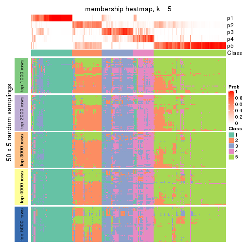</p>

</div>
<div id='tab-ATC-NMF-membership-heatmap-5'>
<pre><code class="r">membership_heatmap(res, k = 6)
</code></pre>

<p></p>

</div>
</div>

As soon as we have had the classes for columns, we can look for signatures
which are significantly different between classes which can be candidate marks
for certain classes. Following are the heatmaps for signatures.


Signature heatmaps where rows are scaled:


<script>
$( function() {
	$( '#tabs-ATC-NMF-get-signatures' ).tabs();
} );
</script>
<div id='tabs-ATC-NMF-get-signatures'>
<ul>
<li><a href='#tab-ATC-NMF-get-signatures-1'>k = 2</a></li>
<li><a href='#tab-ATC-NMF-get-signatures-2'>k = 3</a></li>
<li><a href='#tab-ATC-NMF-get-signatures-3'>k = 4</a></li>
<li><a href='#tab-ATC-NMF-get-signatures-4'>k = 5</a></li>
<li><a href='#tab-ATC-NMF-get-signatures-5'>k = 6</a></li>
</ul>
<div id='tab-ATC-NMF-get-signatures-1'>
<pre><code class="r">get_signatures(res, k = 2)
</code></pre>

<p></p>

</div>
<div id='tab-ATC-NMF-get-signatures-2'>
<pre><code class="r">get_signatures(res, k = 3)
</code></pre>

<p></p>

</div>
<div id='tab-ATC-NMF-get-signatures-3'>
<pre><code class="r">get_signatures(res, k = 4)
</code></pre>

<p></p>

</div>
<div id='tab-ATC-NMF-get-signatures-4'>
<pre><code class="r">get_signatures(res, k = 5)
</code></pre>

<p></p>

</div>
<div id='tab-ATC-NMF-get-signatures-5'>
<pre><code class="r">get_signatures(res, k = 6)
</code></pre>

<p></p>

</div>
</div>


Signature heatmaps where rows are not scaled:


<script>
$( function() {
	$( '#tabs-ATC-NMF-get-signatures-no-scale' ).tabs();
} );
</script>
<div id='tabs-ATC-NMF-get-signatures-no-scale'>
<ul>
<li><a href='#tab-ATC-NMF-get-signatures-no-scale-1'>k = 2</a></li>
<li><a href='#tab-ATC-NMF-get-signatures-no-scale-2'>k = 3</a></li>
<li><a href='#tab-ATC-NMF-get-signatures-no-scale-3'>k = 4</a></li>
<li><a href='#tab-ATC-NMF-get-signatures-no-scale-4'>k = 5</a></li>
<li><a href='#tab-ATC-NMF-get-signatures-no-scale-5'>k = 6</a></li>
</ul>
<div id='tab-ATC-NMF-get-signatures-no-scale-1'>
<pre><code class="r">get_signatures(res, k = 2, scale_rows = FALSE)
</code></pre>

<p></p>

</div>
<div id='tab-ATC-NMF-get-signatures-no-scale-2'>
<pre><code class="r">get_signatures(res, k = 3, scale_rows = FALSE)
</code></pre>

<p></p>

</div>
<div id='tab-ATC-NMF-get-signatures-no-scale-3'>
<pre><code class="r">get_signatures(res, k = 4, scale_rows = FALSE)
</code></pre>

<p></p>

</div>
<div id='tab-ATC-NMF-get-signatures-no-scale-4'>
<pre><code class="r">get_signatures(res, k = 5, scale_rows = FALSE)
</code></pre>

<p></p>

</div>
<div id='tab-ATC-NMF-get-signatures-no-scale-5'>
<pre><code class="r">get_signatures(res, k = 6, scale_rows = FALSE)
</code></pre>

<p></p>

</div>
</div>


Compare the overlap of signatures from different k:

```r
compare_signatures(res)
```


`get_signature()` returns a data frame invisibly. TO get the list of signatures, the function
call should be assigned to a variable explicitly. In following code, if `plot` argument is set
to `FALSE`, no heatmap is plotted while only the differential analysis is performed.

```r
# code only for demonstration
tb = get_signature(res, k = ..., plot = FALSE)
```

An example of the output of `tb` is:

```
#>   which_row         fdr    mean_1    mean_2 scaled_mean_1 scaled_mean_2 km
#> 1        38 0.042760348  8.373488  9.131774    -0.5533452     0.5164555  1
#> 2        40 0.018707592  7.106213  8.469186    -0.6173731     0.5762149  1
#> 3        55 0.019134737 10.221463 11.207825    -0.6159697     0.5749050  1
#> 4        59 0.006059896  5.921854  7.869574    -0.6899429     0.6439467  1
#> 5        60 0.018055526  8.928898 10.211722    -0.6204761     0.5791110  1
#> 6        98 0.009384629 15.714769 14.887706     0.6635654    -0.6193277  2
...
```

The columns in `tb` are:

1. `which_row`: row indices corresponding to the input matrix.
2. `fdr`: FDR for the differential test. 
3. `mean_x`: The mean value in group x.
4. `scaled_mean_x`: The mean value in group x after rows are scaled.
5. `km`: Row groups if k-means clustering is applied to rows.


UMAP plot which shows how samples are separated.


<script>
$( function() {
	$( '#tabs-ATC-NMF-dimension-reduction' ).tabs();
} );
</script>
<div id='tabs-ATC-NMF-dimension-reduction'>
<ul>
<li><a href='#tab-ATC-NMF-dimension-reduction-1'>k = 2</a></li>
<li><a href='#tab-ATC-NMF-dimension-reduction-2'>k = 3</a></li>
<li><a href='#tab-ATC-NMF-dimension-reduction-3'>k = 4</a></li>
<li><a href='#tab-ATC-NMF-dimension-reduction-4'>k = 5</a></li>
<li><a href='#tab-ATC-NMF-dimension-reduction-5'>k = 6</a></li>
</ul>
<div id='tab-ATC-NMF-dimension-reduction-1'>
<pre><code class="r">dimension_reduction(res, k = 2, method = &quot;UMAP&quot;)
</code></pre>

<p></p>

</div>
<div id='tab-ATC-NMF-dimension-reduction-2'>
<pre><code class="r">dimension_reduction(res, k = 3, method = &quot;UMAP&quot;)
</code></pre>

<p></p>

</div>
<div id='tab-ATC-NMF-dimension-reduction-3'>
<pre><code class="r">dimension_reduction(res, k = 4, method = &quot;UMAP&quot;)
</code></pre>

<p></p>

</div>
<div id='tab-ATC-NMF-dimension-reduction-4'>
<pre><code class="r">dimension_reduction(res, k = 5, method = &quot;UMAP&quot;)
</code></pre>

<p></p>

</div>
<div id='tab-ATC-NMF-dimension-reduction-5'>
<pre><code class="r">dimension_reduction(res, k = 6, method = &quot;UMAP&quot;)
</code></pre>

<p></p>

</div>
</div>


Following heatmap shows how subgroups are split when increasing `k`:

```r
collect_classes(res)
```


If matrix rows can be associated to genes, consider to use `GO_Enrichment(res,
...)` to perform function enrichment for the signature genes.


 

## Session info


```r
sessionInfo()
```

```
#> R version 3.6.0 (2019-04-26)
#> Platform: x86_64-pc-linux-gnu (64-bit)
#> Running under: CentOS Linux 7 (Core)
#> 
#> Matrix products: default
#> BLAS:   /usr/lib64/libblas.so.3.4.2
#> LAPACK: /usr/lib64/liblapack.so.3.4.2
#> 
#> locale:
#>  [1] LC_CTYPE=en_US.UTF-8       LC_NUMERIC=C               LC_TIME=en_US.UTF-8       
#>  [4] LC_COLLATE=en_US.UTF-8     LC_MONETARY=en_US.UTF-8    LC_MESSAGES=en_US.UTF-8   
#>  [7] LC_PAPER=en_US.UTF-8       LC_NAME=C                  LC_ADDRESS=C              
#> [10] LC_TELEPHONE=C             LC_MEASUREMENT=en_US.UTF-8 LC_IDENTIFICATION=C       
#> 
#> attached base packages:
#>  [1] grid      parallel  stats4    stats     graphics  grDevices utils     datasets  methods  
#> [10] base     
#> 
#> other attached packages:
#>  [1] genefilter_1.66.0           ComplexHeatmap_2.1.1        markdown_1.1               
#>  [4] knitr_1.26                  cola_1.3.2                  SummarizedExperiment_1.14.1
#>  [7] DelayedArray_0.10.0         BiocParallel_1.18.1         matrixStats_0.55.0         
#> [10] Biobase_2.44.0              GenomicRanges_1.36.1        GenomeInfoDb_1.20.0        
#> [13] IRanges_2.18.3              S4Vectors_0.22.1            BiocGenerics_0.30.0        
#> [16] GetoptLong_0.1.7           
#> 
#> loaded via a namespace (and not attached):
#>  [1] bitops_1.0-6           bit64_0.9-7            doParallel_1.0.15      RColorBrewer_1.1-2    
#>  [5] httr_1.4.1             backports_1.1.5        tools_3.6.0            R6_2.4.1              
#>  [9] DBI_1.0.0              lazyeval_0.2.2         colorspace_1.4-1       withr_2.1.2           
#> [13] tidyselect_0.2.5       gridExtra_2.3          bit_1.1-14             compiler_3.6.0        
#> [17] xml2_1.2.2             microbenchmark_1.4-7   pkgmaker_0.28          slam_0.1-46           
#> [21] scales_1.1.0           NMF_0.23.6             stringr_1.4.0          digest_0.6.23         
#> [25] XVector_0.24.0         pkgconfig_2.0.3        bibtex_0.4.2           highr_0.8             
#> [29] rlang_0.4.2            GlobalOptions_0.1.1    RSQLite_2.1.2          impute_1.58.0         
#> [33] shape_1.4.4            mclust_5.4.5           dendextend_1.12.0      dplyr_0.8.3           
#> [37] RCurl_1.95-4.12        magrittr_1.5           GenomeInfoDbData_1.2.1 Matrix_1.2-17         
#> [41] Rcpp_1.0.3             munsell_0.5.0          viridis_0.5.1          lifecycle_0.1.0       
#> [45] stringi_1.4.3          zlibbioc_1.30.0        plyr_1.8.4             blob_1.2.0            
#> [49] crayon_1.3.4           lattice_0.20-38        splines_3.6.0          annotate_1.62.0       
#> [53] circlize_0.4.9         zeallot_0.1.0          pillar_1.4.2           rjson_0.2.20          
#> [57] rngtools_1.4           reshape2_1.4.3         codetools_0.2-16       XML_3.98-1.20         
#> [61] glue_1.3.1             evaluate_0.14          vctrs_0.2.0            png_0.1-7             
#> [65] foreach_1.4.7          polyclip_1.10-0        gtable_0.3.0           purrr_0.3.3           
#> [69] clue_0.3-57            assertthat_0.2.1       ggplot2_3.2.1          xfun_0.11             
#> [73] gridBase_0.4-7         eulerr_6.0.0           xtable_1.8-4           skmeans_0.2-11        
#> [77] survival_2.44-1.1      viridisLite_0.3.0      tibble_2.1.3           iterators_1.0.12      
#> [81] memoise_1.1.0          AnnotationDbi_1.46.1   registry_0.5-1         GTF_0.0.1             
#> [85] cluster_2.1.0          brew_1.0-6
```


